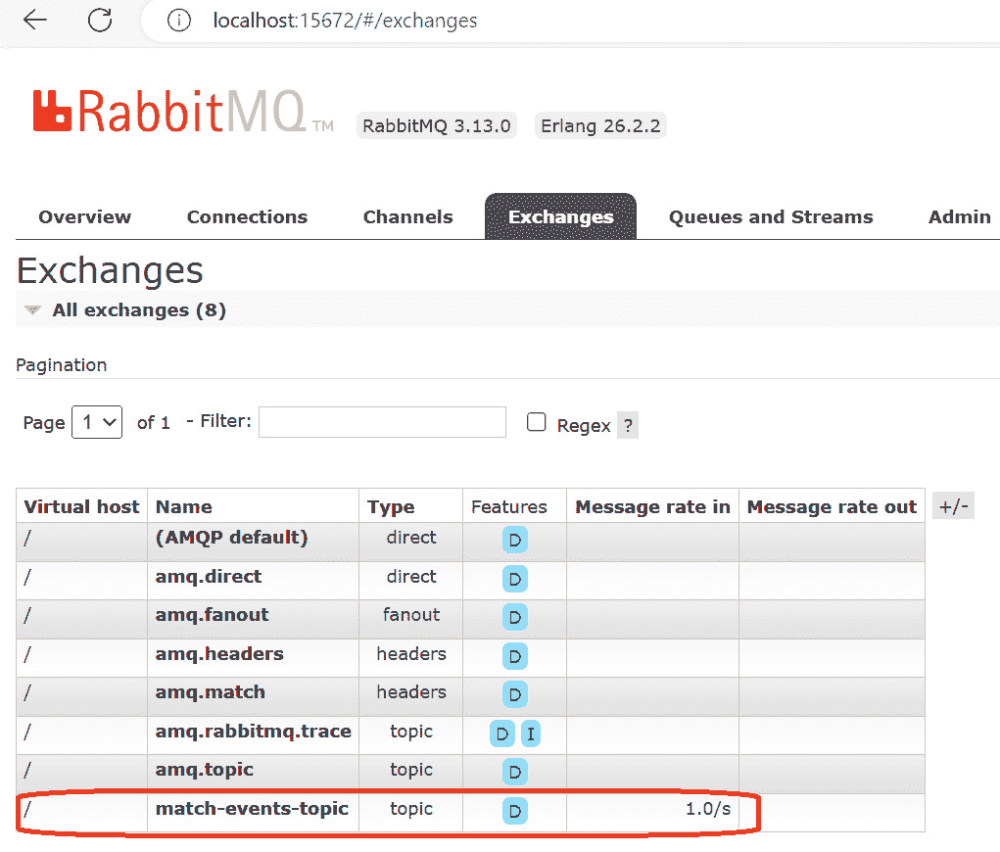
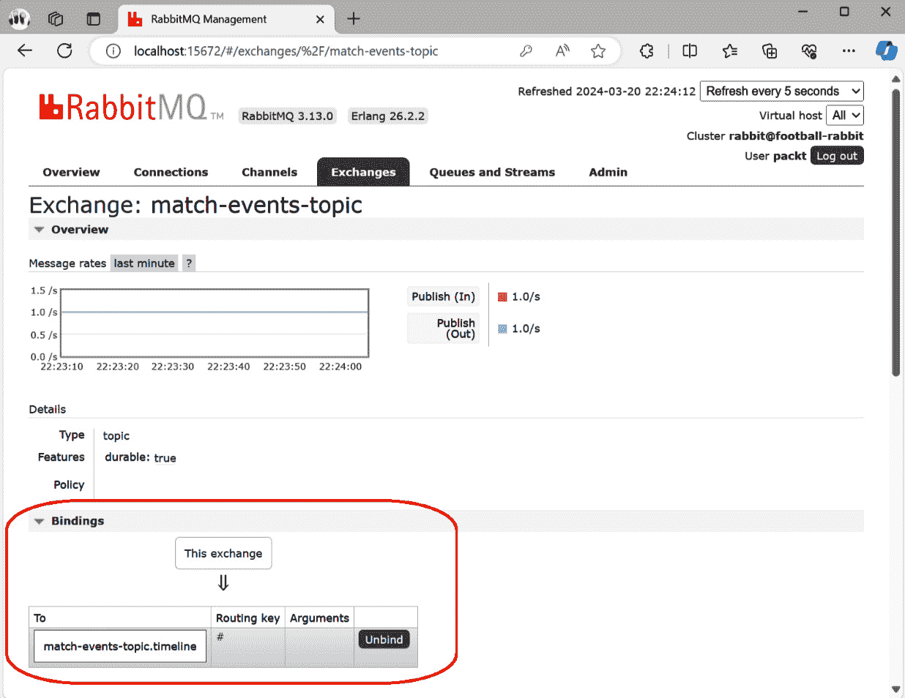
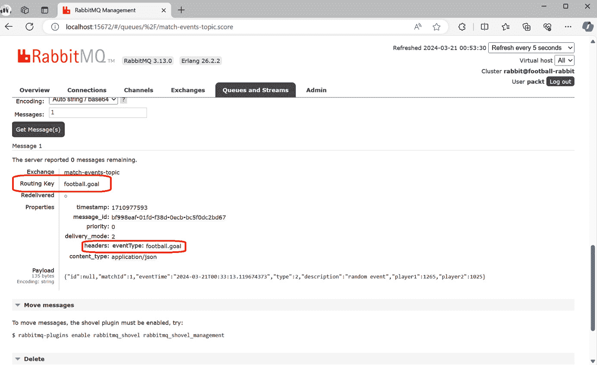
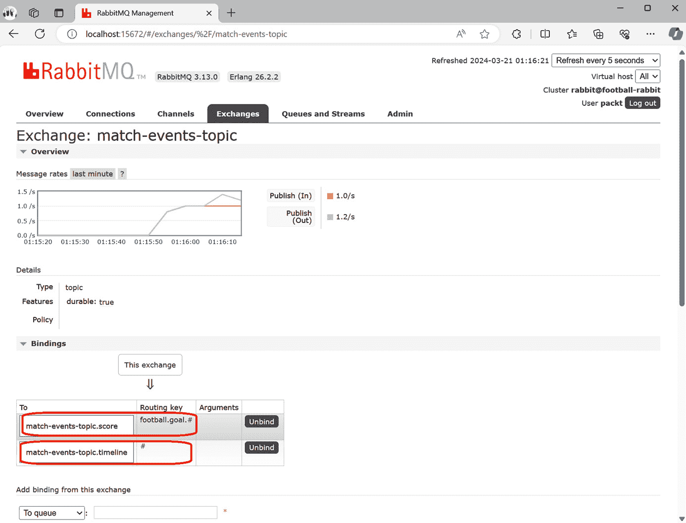
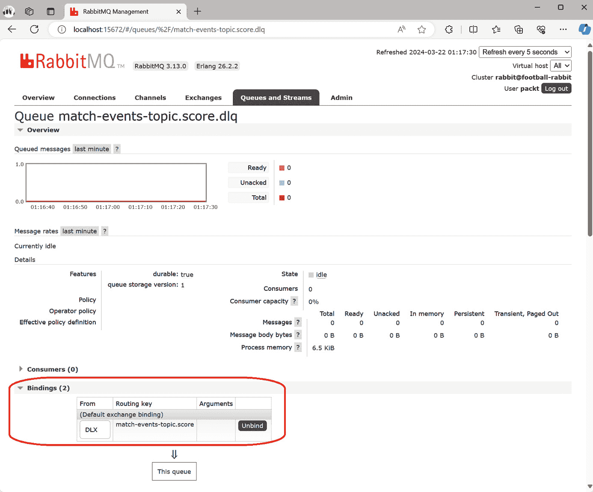
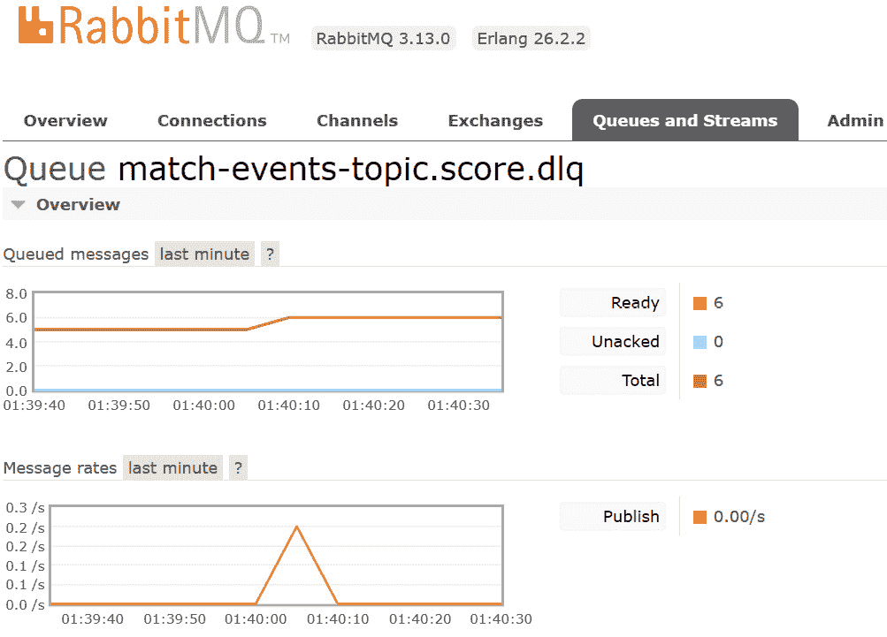

# 第八章：Spring Reactive 和 Spring Cloud Stream

在高并发场景中，可能需要不同的应用程序方法，例如需要低延迟和响应性的资源密集型操作，如 **输入/输出** (**I/O**) 限定的任务。在本章中，我们将了解两个解决此类场景的 Spring Boot 项目。

**Spring Reactive** 是 Spring 对反应式处理场景的响应。反应式处理是一种范式，允许开发者构建 **非阻塞**、异步的应用程序，可以处理 **背压**。非阻塞意味着当应用程序等待外部资源响应时，例如调用外部 Web 服务或数据库时，应用程序不会阻塞处理线程。相反，它重用处理线程来处理新的请求。背压是一种处理下游组件无法跟上上游组件数据生产速率的情况的机制。对于这些机制，Spring Reactive 可以在高并发场景和资源密集型操作中使用。

**Spring WebFlux** 是与我们在前几章中使用的 Spring **模型-视图-控制器** (**MVC**) 相当的反应式 Web 框架。为了促进不同 Web 框架之间的过渡，Spring WebFlux 反映了 Spring MVC 中的名称和注解。

Spring Data **Reactive Relational Database Connectivity** (**R2DBC**) 是使用反应式驱动程序集成关系型数据库的规范。与传统阻塞驱动程序相比，它还应用了熟悉的抽象。

**Spring Cloud Stream** 是一个用于构建高度可扩展的事件驱动分布式应用程序的框架，这些应用程序通过共享消息系统连接。您可以使用反应式编程与 Spring Cloud Stream 一起使用，但 Spring Cloud Stream 的主要目标是创建松散耦合的分布式应用程序，这些应用程序可以独立扩展。与反应式试图优化运行时执行不同，Spring Cloud Stream 为创建可以处理一定程度的异步的分布式应用程序提供了基础。Spring Reactive 和 Spring Cloud Stream 可以在高并发场景中结合使用，并且是互补的。

在本章的第一部分，我们将通过学习如何使用 Spring WebFlux 和 Spring Data R2DBC 与 PostgreSQL 一起使用来探索 Spring Reactive。在第二部分，我们将学习如何在使用 RabbitMQ 作为消息服务的同时使用 Spring Cloud Stream。你将学到的知识可以应用于其他消息服务，例如 Kafka，或者云提供商提供的其他服务，例如 Amazon Kinesis、Azure Event Hub 或 Google PubSub。

在本章中，我们将介绍以下食谱：

+   创建一个反应式 RESTful API

+   使用反应式 API 客户端

+   测试反应式应用程序

+   使用 Spring Data R2DBC 连接到 PostgreSQL

+   使用 Spring Cloud Stream 和 RabbitMQ 构建事件驱动应用程序

+   使用 Spring Cloud Stream 和 RabbitMQ 路由消息

+   使用 Spring Cloud Stream 进行错误处理

# 技术要求

在本章中，我们需要一个 PostgreSQL 服务器和一个 RabbitMQ 服务器。在您的计算机上运行它们的最简单方法是使用 Docker。您可以从官方站点 [`docs.docker.com/engine/install/`](https://docs.docker.com/engine/install/) 获取 Docker。我将在相应的食谱中解释如何部署每个工具。

本章中将要演示的所有食谱都可以在以下位置找到：[`github.com/PacktPublishing/Spring-Boot-3.0-Cookbook/tree/main/chapter8`](https://github.com/PacktPublishing/Spring-Boot-3.0-Cookbook/tree/main/chapter8).

# 创建一个反应式 RESTful API

Spring Reactive 是 Spring 的一项倡议，它提供了可以在我们的 Spring Boot 应用程序中使用的反应式编程特性和功能。它旨在支持异步和非阻塞编程。但异步和非阻塞编程是什么？为了理解这些概念，最好从传统的模型开始，即非反应式编程模型。

在传统模型中，当 Spring Boot 应用程序收到一个请求时，一个专用的线程处理该请求。如果该请求需要与另一个服务通信，例如数据库，处理线程将阻塞，直到它从其他服务收到响应。可用的线程数量有限，因此如果您的应用程序需要高并发但主要等待其依赖服务完成，这种同步阻塞模型可能存在限制。

在反应式模型中，异步和非阻塞编程在并发请求之间重用线程，并且不会因 I/O 操作（如网络调用或文件操作）而阻塞。

反应式编程特别适合构建需要高并发和可伸缩性的应用程序，例如处理许多并发连接的 Web 应用程序或实时数据处理系统。

在这个食谱中，我们将使用 Spring WebFlux 通过反应式编程构建一个 RESTful API。Spring WebFlux 是 Spring 中的一个模块，它使构建 Web 应用程序时能够使用反应式编程。

## 准备工作

这个食谱没有额外的要求。我们将使用 **Spring Initializr** 工具生成项目，一旦下载，您可以使用您喜欢的 **集成开发环境**（**IDE**）或编辑器进行更改。

## 如何操作...

在这个食谱中，我们将创建一个 RESTful API 应用程序。这次，我们将使用反应式编程来创建它，而不是像 *第一章* 中的食谱那样。按照以下步骤操作：

1.  打开 [`start.spring.io`](https://start.spring.io)，并使用与 *第一章* 中 *创建 RESTful API* 食谱中相同的参数，除了以下选项需要更改：

    +   对于 `cards`

    +   对于 **依赖项**，选择 **Spring** **Reactive Web**

1.  在`cards`项目中，添加一个名为`Card`的记录。定义记录如下：

    ```java
    public record Card(String cardId, String album,
                       String player, int ranking) {
    }
    ```

1.  在同一文件夹中，添加一个名为`CardsController`的控制器：

    ```java
    @RequestMapping("/cards")
    @RestController
    public class CardsController
    ```

    +   添加一个名为`getCards`的方法，用于检索所有卡片：

        ```java
        @GetMapping
        public Flux<Card> getCards() {
            return Flux.fromIterable(
                    List.of(
                        new Card("1", "WWC23", "Ivana Andres", 7),
                        new Card("2", "WWC23", "Alexia Putellas", 1)));
        }
        ```

    +   然后添加另一个方法来检索卡片：

        ```java
        @GetMapping("/{cardId}")
        public Mono<Card> getCard(@PathVariable String cardId) {
           return Mono.just(new Card(cardId, "WWC23", "Superplayer", 1));
        }
        ```

    在 WebFlux 中，`Flux<T>`用于返回对象流，而`Mono<T>`用于返回单个对象。在非反应式编程中，它们将是返回`List<T>`的`Flux<T>`和返回`T`的`Mono<T>`的等价物。

    在此控制器中，`Flux<Card> getCards()`返回多个`Card`类型的对象，而`Mono<Card> getCard`仅返回一张卡片。

1.  现在，添加一个名为`SampleException`的异常类，实现一个新的自定义异常：

    ```java
    public class SampleException extends RuntimeException {
        public SampleException(String message) {
            super(message);
        }
    }
    ```

1.  然后，向`CardsController`添加两个更多方法，以演示如何在 WebFlux 中实现错误处理：

    ```java
    @GetMapping("/exception")
    public Mono<Card> getException() {
        throw new SampleException("This is a sample exception");
    }
    @ExceptionHandler(SampleException.class)
    public ProblemDetail handleSampleException(SampleException e) {
        ProblemDetail problemDetail = ProblemDetail
                   .forStatusAndDetail(HttpStatus.BAD_REQUEST,
                                       e.getMessage());
        problemDetail.setTitle("sample exception");
        return problemDetail;
    }
    ```

    `getException`方法总是抛出异常，而`handleSampleException`处理`SampleException`类型的异常。

1.  现在，在卡片项目的根目录中打开一个终端，并执行以下命令：

    ```java
    ./mvnw spring-boot:run
    ```

    我们现在有了正在运行的 RESTful API 服务器。

1.  您可以通过向`http://locahost:8080/cards`发送请求来测试应用程序。您可以使用`curl`来完成此操作：

    ```java
    curl http://localhost:8080/cards
    ```

    您还可以通过请求`http://localhost:8080/exception`来测试错误处理的工作方式。您将看到它将返回一个`HTTP` `400`结果。

## 它是如何工作的...

我们在本菜谱中使用了与 Spring Web 相同的注解来定义控制器。然而，方法返回的是`Mono`和`Flux`类型，而不是传统对象，这表明响应将异步生成。`Mono`和`Flux`是 WebFlux 中反应式编程模型的核心接口。`Mono`用于最多产生一个结果的异步操作，而`Flux`用于返回零个或多个元素的异步操作。

反应式编程围绕反应流的概念。反应流使用非阻塞背压模型异步数据流。我提到了一些可能听起来很奇怪的概念，所以让我来澄清它们：

+   **非阻塞**：这指的是与 I/O 相关的操作，例如发送 HTTP 请求，这些操作避免了线程阻塞。这使您能够在不为每个请求分配专用线程的情况下执行大量并发请求。

+   **背压**：这是一种确保数据仅以可以消费的速度产生的机制，以防止资源耗尽。例如，当下游组件无法跟上上游组件发出的数据时，可能会发生这种情况。WebFlux 自动管理背压。

## 还有更多...

除了本菜谱中使用的基于注解的编程模型之外，WebFlux 还支持以下代码的`cards` RESTful API：

1.  首先，创建一个处理逻辑的类：

    ```java
    public class CardsHandler {
        public Flux<Card> getCards() {
            return Flux.fromIterable(List.of(
                      new Card("1", "WWC23", "Ivana Andres", 7),
                      new Card("2", "WWC23", "Alexia Putellas", 1)));
        }
        public Mono<Card> getCard(String cardId) {
            return Mono.just(
                 new Card(cardId, "WWC23", "Superplayer", 1));
        }
    }
    ```

1.  还有一个用于配置应用程序的：

    ```java
    @Configuration
    public class CardsRouterConfig {
        @Bean
        CardsHandler cardsHandler() {
            return new CardsHandler();
        }
        @Bean
        RouterFunction<ServerResponse> getCards() {
            return route(GET("/cards"), req ->
                 ok().body(cardsHandler().getCards(), Card.class));
        }
        @Bean
        RouterFunction<ServerResponse> getCard(){
            return route(GET("/cards/{cardId}"), req ->
                 ok().body(
                    cardsHandler().getCard(
                        req.pathVariable("cardId")), Card.class));
        }
    }
    ```

**基于注解的编程**更类似于传统的非响应式编程模型，而函数式编程可以更加表达性，尤其是在复杂的路由场景中。函数式风格更适合处理高并发和非阻塞场景，因为它自然地与响应式编程集成。

使用基于注解或函数式编程是个人偏好的问题。

# 使用响应式 API 客户端

我们有一个 RESTful API，现在是时候以非阻塞的方式使用它了。我们将创建一个调用另一个 RESTful API 的响应式 RESTful API。

在这个食谱中，我们将创建一个消费 API 的响应式应用程序。我们将学习如何使用响应式 WebClient 对目标 RESTful API 执行请求。

## 准备工作

在这个食谱中，我们将消费在*创建一个响应式 RESTful API*食谱中创建的应用程序。如果您还没有完成，我准备了一个可用的版本，您可以用它作为本食谱的起点。您可以在书的 GitHub 仓库[`github.com/PacktPublishing/Spring-Boot-3.0-Cookbook`](https://github.com/PacktPublishing/Spring-Boot-3.0-Cookbook)中的`chapter8/recipe8-2/start`文件夹中找到它。

您可以运行目标项目，并在整个食谱中保留它。

## 如何做到这一点...

我们将为我们的 RESTful API 创建一个高效的消费者应用程序：

1.  首先，我们将使用 Spring Boot Initializr 工具创建一个新的应用程序。您可以使用与*第一章*中*创建一个 RESTful API*食谱中相同的选项，除了更改以下选项：

    +   对于`consumer`

    +   对于**依赖项**，选择**Spring Reactive Web**

1.  由于我们在运行消费者应用程序的同时运行`cards`应用程序，我们需要更改应用程序监听请求的端口。我们将设置`8090`作为服务器端口。我们还将为目标足球服务 URL 创建一个配置。为此，打开`resources`文件夹中的`application.yml`文件，并设置以下内容：

    ```java
    server:
        port: 8090
    footballservice:
        url: http://localhost:8080
    ```

1.  现在，创建一个名为`Card`的记录，内容如下：

    ```java
    public record Card(String cardId, String album,
                       String player, int ranking) {
    }
    ```

1.  然后，我们将创建一个名为`ConsumerController`的控制器类，该类将消费目标 RESTful API。因此，这个控制器需要一个 WebClient。为此，将`ConsumerController`设置如下：

    ```java
    @RequestMapping("/consumer")
    @RestController
    public class ConsumerController {
        private final WebClient webClient;
        public ConsumerController(@Value("${footballservice.url}")
                                   String footballServiceUrl) {
            this.webClient = WebClient.create(footballServiceUrl);
        }
    }
    ```

    控制器现在有一个 WebClient，允许我们在客户端应用程序中以非阻塞的方式执行请求。

1.  创建一个方法来消费来自其他应用程序的操作，该操作返回`Card`实例的流。为此，在`ConsumerController`中添加以下方法：

    ```java
    @GetMapping("/cards")
    public Flux<Card> getCards() {
        return webClient.get()
                .uri("/cards").retrieve()
                .bodyToFlux(Card.class);
    }
    ```

1.  创建一个方法来消费返回单个对象的方法，通过向`ConsumerController`类添加以下方法：

    ```java
    @GetMapping("/cards/{cardId}")
    public Mono<Card> getCard(@PathVariable String cardId) {
        return webClient.get()
                .uri("/cards/" + cardId).retrieve()
                .onStatus(code -> code.is4xxClientError(),
                        response -> Mono.empty())
                .bodyToMono(Card.class);
    }
    ```

1.  然后，创建一个方法来管理来自远程服务器的不同响应代码：

    ```java
    @GetMapping("/error")
    public Mono<String> getFailedRequest() {
        return webClient.get()
                .uri("/invalidpath")
                .exchangeToMono(response -> {
                    if (response.statusCode()
                           .equals(HttpStatus.NOT_FOUND))
                        return Mono.just("Server returned 404");
                    else if (response.statusCode()
                           .equals(HttpStatus.INTERNAL_SERVER_ERROR))
                        return Mono.just("Server returned 500: "
                                + response.bodyToMono(String.class));
                    else
                        return response.bodyToMono(String.class);
                });
    }
    ```

1.  现在让我们运行消费者应用程序。当我们向客户端应用程序发出请求时，它将调用服务器 RESTful API 应用程序。记住，我们已经按照“准备就绪”部分中的说明启动了服务器 RESTful API 服务器应用程序。在`consumer`项目的根目录中打开一个终端并执行以下操作：

    ```java
    ./mvnw spring-boot:run
    ```

1.  现在，测试`consumer`应用程序。记住它监听端口`8090`，而服务器应用程序监听端口`8080`。在终端中执行以下命令：

    ```java
    curl http://localhost:8090/consumer/cards
    curl http://localhost:8090/consumer/cards/7
    curl http://localhost:8090/consumer/error
    ```

    它将返回`Remote Server return 404`。消费者应用程序尝试调用服务器 RESTful API 服务器应用程序中不存在的方法。消费者应用程序处理来自服务器的 HTTP 响应代码，在这种情况下，`HttpStatus.NOT_FOUND`以返回最终响应消息，即`Remote Server` `return 404`。

## 它是如何工作的...

在这个例子中，我们消费了一个使用响应式技术实现的 RESTful API，但从消费者的角度来看，这并不重要。我们可以消费任何 RESTful API，无论其内部实现如何。

重要的是，当我们利用非阻塞客户端时，如果消费者应用程序也是响应式的，它将从中受益。当我们向消费者应用程序发出请求时，它将对`cards`应用程序发出另一个请求。由于我们在`consumer`应用程序中使用响应式客户端，它不会在`cards`应用程序响应时阻塞线程，从而使该线程可用于处理其他请求。这样，应用程序可以管理比传统阻塞线程应用程序更高的并发性。

# 测试响应式应用程序

与非响应式 Spring Boot 应用程序一样，我们希望自动化测试我们的响应式应用程序，Spring Boot 为这些场景提供了出色的支持。

在这个配方中，我们将学习如何使用 Spring Boot 在添加**Spring Reactive** **Web**启动器时默认提供的组件来创建测试。

## 准备就绪

在这个配方中，我们将为“使用响应式 API 客户端”配方中使用的项目创建测试。如果你还没有完成那个配方，你可以使用我准备的完成版本作为这个配方的起点。你可以在书的 GitHub 仓库中找到它，在`chapter8/recipe8-3/start`文件夹中。[`github.com/PacktPublishing/Spring-Boot-3.0-Cookbook`](https://github.com/PacktPublishing/Spring-Boot-3.0-Cookbook)

## 如何做到这一点...

我们喜欢健壮和可靠的应用程序。我们将使用我们的响应式应用程序来实现这一点：

1.  由于从“使用响应式 API 客户端”配方创建的应用程序使用了 Spring Boot Initializr 工具，只需添加 Spring Reactive Web 启动器，测试依赖项就已经包含在内了。你可以检查`pom.xml`文件是否包含以下依赖项：

    ```java
    <dependency>
        <groupId>org.springframework.boot</groupId>
        <artifactId>spring-boot-starter-test</artifactId>
        <scope>test</scope>
    </dependency>
    <dependency>
        <groupId>io.projectreactor</groupId>
        <artifactId>reactor-test</artifactId>
        <scope>test</scope>
    </dependency>
    ```

1.  现在，我们将使用`cards`应用程序启动测试。创建一个名为`CardsControllerTest`的新测试类。记住，它应该创建在`test`文件夹下；你可以在`src/test/java/com/packt/cards`文件夹中创建它：

    +   测试类应该使用`@WebFluxTest`注解：

        ```java
        @WebFluxTest(CardsController.class)
        public class CardsControllerTests
        ```

    +   然后，我们将注入一个`WebTestClient`字段。为此，使用`@Autowired`注解新字段：

        ```java
        @Autowired
        WebTestClient webTestClient;
        ```

    +   现在，我们可以使用`webTestClient`字段来模拟对反应式 RESTful API 的调用。例如，让我们创建一个测试`/cards`路径，它返回一个类型为`Card`的列表。为此，创建一个使用`@Test`注解的新方法：

        ```java
        @Test
        void testGetCards() {
            webTestClient.get()
                    .uri("/cards").exchange()
                    .expectStatus().isOk()
                    .expectBodyList(Card.class);
        }
        ```

    +   让我们测试`/cards/exception`路径。出于学习目的，此路径始终返回`404`代码，一个错误请求结果；并且正文是`ProblemDetail`类型。测试方法可能如下所示：

        ```java
        @Test
        void testGetException() {
            webTestClient.get()
                    .uri("/cards/exception").exchange()
                    .expectStatus().isBadRequest()
                    .expectBody(ProblemDetail.class);
        }
        ```

1.  接下来，我们将为`consumer`应用程序创建测试。由于我们想要独立于`cards`应用程序测试此应用程序，我们需要模拟`cards`应用程序服务器。正如我们在*第一章*中学习的*模拟 RESTful API*食谱中，我们将使用 WireMock 库。为此，打开项目`consumer`的`pom.xml`文件并添加以下依赖项：

    ```java
    <dependency>
        <groupId>com.github.tomakehurst</groupId>
        <artifactId>wiremock-standalone</artifactId>
        <version>3.0.1</version>
        <scope>test</scope>
    </dependency>
    ```

1.  现在我们有了所有依赖项，我们将创建一个新的测试类，命名为`ConsumerControllerTest`，并在编写测试之前对其进行准备：

    1.  首先，使用`@SpringBootTest`注解类并设置以下一些配置选项：

    ```java
    @SpringBootTest(
          webEnvironment = SpringBootTest.WebEnvironment.RANDOM_PORT,
          classes = {ConsumerApplication.class,
                  ConsumerController.class,
                  ConsumerControllerTests.Config.class})
    public class ConsumerControllerTests
    ```

    1.  注意，我们在`classes`字段中设置了一个新类，它目前还不存在，`ConsumerControllerTests.Config`。它用于配置 MockServer，正如你很快就会看到的。

    1.  接下来，我们需要设置 WireMock 服务器。为此，我们将创建一个名为`Config`的配置子类，它将定义一个`WireMockServer`bean：

    ```java
    @TestConfiguration
    static class Config {
        @Bean
        public WireMockServer webServer() {
            WireMockServer wireMockServer = new WireMockServer(7979);
            wireMockServer.start();
            return wireMockServer;
        }
    }
    ```

    1.  然后，我们需要配置用于 reactive WebClient 的新远程服务器的 URI。我们需要设置`footballservice.url`应用程序上下文变量。为了执行此动态配置，我们将使用`@DynamicPropertySource`注解。为此，在`ConsumerControllerTests`类中定义一个静态方法：

    ```java
    @DynamicPropertySource
    static void setProperties(DynamicPropertyRegistry registry) {
        registry.add("footballservice.url",
                     () -> "http://localhost:7979");
    }
    ```

    1.  为了完成测试准备，我们将注入`WebTestClient`和`WireMockServer`，我们将在测试中使用。为此，使用`@Autowired`注解定义字段：

    ```java
    @Autowired
    private WebTestClient webTestClient;
    @Autowired
    private WireMockServer server;
    ```

1.  我们现在可以编写测试了。例如，我们将创建一个获取卡片的测试：

    1.  我们可以将其命名为`getCards`：

    ```java
    @Test
    public void getCards()
    ```

    1.  首先，我们将安排模拟卡片服务器将返回的内容。为此，我们将模拟一组小的结果以供学习：

    ```java
    server.stubFor(WireMock.get(WireMock.urlEqualTo("/cards"))
            .willReturn(
                    WireMock.aResponse()
                      .withStatus(200)
                      .withHeader("Content-Type", "application/json")
                      .withBody("""
                      [
                          {
                              "cardId": "1",
                              "album": "WWC23",
                              "player": "Ivana Andres",
                              "ranking": 7
                          },
                          {
                              "cardId": "2",
                              "album": "WWC23",
                              "player": "Alexia Putellas",
                              "ranking": 1
                           }
                      ]""")));
    ```

    1.  然后，我们可以使用`webTestClient`执行请求并验证结果：

    ```java
    webTestClient.get().uri("/consumer/cards")
            .exchange().expectStatus().isOk()
            .expectBodyList(Card.class).hasSize(2)
            .contains(new Card("1", "WWC23", "Ivana Andres", 7),
                    new Card("2", "WWC23", "Alexia Putellas", 1));
    ```

1.  你可以为应用程序的其余功能编写测试。我创建了一些示例测试，你可以在书的 GitHub 仓库中找到它们，网址为[`github.com/PacktPublishing/Spring-Boot-3.0-Cookbook`](https://github.com/PacktPublishing/Spring-Boot-3.0-Cookbook)，在`chapter8/recipe8-3/end`文件夹中。

## 它是如何工作的...

使用`@WebFluxTest`注解，我们可以定义仅关注 WebFlux 相关组件的测试类。这意味着它将禁用所有组件的配置，除了与 WebFlux 相关的组件。例如，它将配置带有`@Controller`或`@RestController`注解的类，但不会配置带有`@Service`注解的类。有了这个，Spring Boot 可以注入`WebTestClient`，我们可以用它来对我们的应用程序服务器执行请求。

在消费者应用程序中，我们需要模拟`cards`服务。我不会深入细节，因为机制与在*第一章*中解释的`Mocking a RESTful API`菜谱中相同。我们使用了一个带有`@TestConfiguration`注解的配置子类。这个注解允许配置可以与测试一起使用的 bean。在我们的例子中，我们只需要`WireMockServer`。然后，我们使用`@DynamicPropertySource`注解动态配置模拟服务器的 URI。

注意

要引用`Config`类，我们使用了`ConsumerControllerTests.Config`而不是仅仅`Config`。这样做的原因是它是`ConsumerControllerTests`类的一个子类。

我们使用了`webEnvironment`字段，将`SpringBootTest.WebEnvironment.RANDOM_PORT`赋值给它。这意味着测试将以服务的形式在随机端口上托管应用程序。我们使用这个选项是为了避免与远程服务器发生端口冲突。

# 使用 Spring Data R2DBC 连接到 PostgreSQL

使用 Reactive 数据库驱动程序是有意义的，因为我们需要将我们的 Reactive 应用程序连接到 PostgreSQL。这意味着当应用程序向数据库发出请求时，应用程序不会被阻塞。有一个 Java 规范，名为**R2DBC**，用于使用反应式驱动程序集成 SQL 数据库。Spring 框架通过 Spring Data R2DBC 支持 R2DBC，它是更大的 Spring Data 家族的一部分。

Spring Data R2DBC 将 R2DBC 的熟悉 Spring 抽象应用于其中。您可以使用`R2dbcEntityTemplate`，使用 Criteria API 和 Reactive Repositories 运行语句，以及其他功能。

在这个菜谱中，我们将学习如何使用 Reactive Repositories 连接到 PostgreSQL，以及 Reactive 和非 Reactive Repositories 之间的一些区别。我们还将学习如何配置 Flyway 进行数据库迁移。

## 准备工作

对于这个菜谱，我们需要一个 PostgreSQL 数据库。您可以使用*第五章*中“Connecting your application to PostgreSQL”菜谱的“准备工作”部分的说明。一旦您安装了 Docker，如上述菜谱中所述，您可以使用以下命令在 Docker 上运行 PostgreSQL 服务器：

```java
docker run -itd -e POSTGRES_USER=packt -e POSTGRES_PASSWORD=packt -p 5432:5432 --name postgresql postgres
```

我还为此菜谱准备了一个起始项目，其中包含我们将用作数据实体以映射到数据库表的类，以及我们在 *There’s more* 部分用于 Flyway 迁移的数据库初始化脚本。你可以在本书的 GitHub 仓库中找到该项目，位于 [`github.com/PacktPublishing/Spring-Boot-3.0-Cookbook`](https://github.com/PacktPublishing/Spring-Boot-3.0-Cookbook)，在 `chapter8/recipe8-4/start` 文件夹中。

## 如何做到这一点...

我们将配置一个应用程序以连接到 PostgreSQL。让我们变得反应式：

1.  首先，我们将确保我们有所有必需的依赖项。为此，打开项目的 `pom.xml` 文件并添加以下依赖项：

    +   `org.springframework.boot:spring-boot-starter-webflux`

    +   `org.springframework.boot:spring-boot-starter-test`

    +   `io.projectreactor:reactor-test`

    +   `org.springframework.boot:spring-boot-starter-data-r2dbc`

    +   `org.postgresql:r2dbc-postgresql`

1.  接下来，我们将使用 R2DBC 驱动程序配置数据库连接。为此，打开 `application.yml` 文件并添加以下配置：

    ```java
    spring:
        application:
            name: football
        r2dbc:
            url: r2dbc:postgresql://localhost:5432/football
            username: packt
            password: packt
    ```

    注意，数据库 URL 不以 `jdbc:` 开头，而是以 `r2dbc:` 开头。

1.  然后，我们将配置我们想要映射到数据库的实体类。这些类位于 `repo` 文件夹中。为了准备这些类，为每个类遵循以下步骤：

    1.  将 `@Table` 注解添加到类中。你可以将其名称设置为在数据库中定义的名称。

    1.  将 `@Id` 注解添加到标识字段。我在所有实体类中将此字段命名为 `Id`。

    你可以在这里将 `CardEntity` 类视为一个例子：

    ```java
    @Table(name = "cards")
    public class CardEntity {
        @Id
        private Long id;
        private Optional<Long> albumId;
        private Long playerId;
        private Long ownerId;
    }
    ```

1.  我们可以为我们的实体创建存储库。例如，对于 `CardEntity`，我们将创建 `CardsRepository` 如下：

    ```java
    public interface CardsRepository extends
                           ReactiveCrudRepository<CardEntity, Long> {
    }
    ```

    你可以为其他实体做同样的操作。

1.  我们将在 `PlayersRepository` 中添加一个方法来通过名称查找玩家。为此，只需将以下方法定义添加到 `PlayersRepository` 接口：

    ```java
    public Mono<PlayerEntity> findByName(String name);
    ```

1.  让我们创建一个新的服务来管理玩家。你可以将其命名为 `PlayersService`，因为它使用 `PlayersRepository`，我们将将其作为参数添加到构造函数中，并让 Spring Boot 做其魔法注入：

    ```java
    @Service
    public class PlayersService {
        private final PlayersRepository playersRepository;
        public PlayersService(PlayersRepository playersRepository) {
            this.playersRepository = playersRepository;
        }
    }
    ```

1.  现在，我们将使用存储库创建几个方法。例如，一个通过 ID 获取玩家的方法，另一个通过名称获取玩家的方法：

    ```java
    public Mono<Player> getPlayer(Long id) {
        return playersRepository.findById(id)
                .map(PlayerMapper::map);
    }
    public Mono<Player> getPlayerByName(String name) {
        return playersRepository.findByName(name)
                .map(PlayerMapper::map);
    }
    ```

    注意，这两种方法都使用了一个名为 `PlayerMapper` 的类。我作为起始项目的一部分提供了这个类，用于在实体和应用程序返回的对象之间创建映射。

1.  现在我们来创建一个更复杂的东西。我们将检索一张卡片及其相关数据，即如果已经分配，则包括 `Album`，以及卡片中的 `Player`。

    1.  让我们创建一个名为 `CardsService` 的新服务类。这个服务需要 `CardsRepository`、`PlayersRepository` 和 `AlbumsRepository`。我们将创建一个带有每种类型参数的构造函数：

    ```java
    @Service
    public class CardsService {
        private final CardsRepository cardsRepository;
        private final PlayersRepository playersRepository;
        private final AlbumsRepository albumsRepository;
        public CardsService(CardsRepository cardRepository,
                            PlayersRepository playersRepository,
                            AlbumsRepository albumsRepository) {
            this.cardsRepository = cardRepository;
            this.playersRepository = playersRepository;
            this.albumsRepository = albumsRepository;
        }
    }
    ```

    1.  现在，添加一个获取类型为 `Card` 的项的方法：

    ```java
    public Mono<Card> getCard(Long cardId) {
        return cardsRepository.findById(cardId)
                .flatMap(this::retrieveRelations)
                .switchIfEmpty(Mono.empty());
    }
    ```

    1.  如您在`getCard`方法中看到的，有一个对`retrieveRelations`方法的引用。`retrieveRelations`方法从数据库中检索`Player`，如果定义了，还会检索`Album`。当然，我们将使用响应式方法来完成所有这些操作：

    ```java
    protected Mono<Card> retrieveRelations(CardEntity cardEntity) {
        Mono<PlayerEntity> playerEntityMono =
               playersRepository.findById(cardEntity.getPlayerId());
        Mono<Optional<AlbumEntity>> albumEntityMono;
        if(cardEntity.getAlbumId() != null
           && cardEntity.getAlbumId().isPresent()){
            albumEntityMono = albumsRepository.findById(
                            cardEntity.getAlbumId().get())
                    .map(Optional::of);
        } else {
            albumEntityMono = Mono.just(Optional.empty());
        }
        return Mono.zip(playerEntityMono, albumEntityMono)
                .map(tuple ->
                        CardMapper.map(cardEntity,
                                tuple.getT2(), tuple.getT1()));
    }
    ```

1.  您可以实现响应式 RESTful 端点来公开此功能，如本章中*创建响应式 RESTful API*配方中所述。我在本书的 GitHub 存储库中准备了一些示例，您可以在`chapter8/recipe8-4/end`文件夹中找到，网址为[`github.com/PacktPublishing/Spring-Boot-3.0-Cookbook/`](https://github.com/PacktPublishing/Spring-Boot-3.0-Cookbook/)。我建议您查看*还有更多*部分，因为它包括 Flyway 来初始化数据库和一些使用`Testcontainers`的测试。

## 它是如何工作的...

显然，响应式实体和`ReactiveCrudRepository`与它们的非响应式对应物非常相似。`ReactiveCrudRepository`提供了相同的基本方法，例如`findById`和`save`，但存在一些重要差异：

+   响应式仓库不管理实体之间的关系。因此，我们没有定义任何`@OneToMany`或`@ManyToOne`字段。实体之间的关系应该在我们的应用程序中显式管理，就像我们在`getCard`和`retrieveRelations`方法中所做的那样。

+   响应式仓库允许您定义遵循与非响应式仓库相同命名约定的方法，但返回`Mono`用于单个结果和`Flux`用于多个结果。这些方法在数据库中转换为查询。您可以在 R2DBC 网页上找到有关命名约定的更多详细信息，网址为[`docs.spring.io/spring-data/relational/reference/r2dbc/query-methods.html`](https://docs.spring.io/spring-data/relational/reference/r2dbc/query-methods.html)。

+   我们在这个配方中没有使用它，但可以使用`@Query`注解并提供一个 SQL 查询。这是一个原生查询；不支持 JPQL。

响应式编程模型利用请求的异步和非阻塞过程。请注意，在`getCard`方法中，当找到卡片时，专辑和玩家会异步且同时检索。通过使用`Mono.zip`方法实现并行，该方法允许同时执行多个非阻塞过程。

## 还有更多...

Flyway 不直接支持 R2DBC 驱动程序，但可以通过一些调整来使用。让我们看看如何操作：

1.  首先，您必须在您的`pom.xml`文件中添加 Flyway 依赖项：

    ```java
    <dependency>
        <groupId>org.flywaydb</groupId>
        <artifactId>flyway-core</artifactId>
    </dependency>
    ```

1.  由于我们希望自动验证数据库迁移，我们还将包括`Testcontainers`支持。对于`Testcontainers`，无需进行任何特定的响应式调整。

    ```java
    <dependency>
        <groupId>org.testcontainers</groupId>
        <artifactId>junit-jupiter</artifactId>
        <scope>test</scope>
    </dependency>
    <dependency>
        <groupId>org.testcontainers</groupId>
        <artifactId>postgresql</artifactId>
        <scope>test</scope>
    </dependency>
    ```

1.  现在，我们需要明确配置 Flyway 的连接。这样做的原因是 Flyway 只支持 JDBC 驱动程序；因此，我们需要指定数据库 URL 的 `jdbc:` 版本。这种配置可以在 `application.yml` 文件中应用。它应该看起来像这样：

    ```java
    spring:
        r2dbc:
            url: r2dbc:postgresql://localhost:5432/football
            username: packt
            password: packt
        flyway:
            url: jdbc:postgresql://localhost:5432/football
            user: packt
            password: packt
    ```

    我们可以在支持 `Testcontainers` 的测试中设置此配置。让我们看看测试 `PlayersService` 的类可能看起来像什么：

    ```java
    @Testcontainers
    @SpringBootTest
    @ContextConfiguration(initializers = PlayersServiceTest.Initializer.class)
    class PlayersServiceTest {
        @Autowired
        private PlayersService playersService;
        static PostgreSQLContainer<?> postgreSQLContainer = new PostgreSQLContainer<>("postgres:latest")
                .withDatabaseName("football")
                .withUsername("football")
                .withPassword("football");
        static class Initializer
                implements ApplicationContextInitializer<ConfigurableApplicationContext> {
            public void initialize(ConfigurableApplicationContext configurableApplicationContext) {
                TestPropertyValues.of(
                        "spring.flyway.url=" + postgreSQLContainer.getJdbcUrl(),
                        "spring.flyway.user=" + postgreSQLContainer.getUsername(),
                        "spring.flyway.password=" + postgreSQLContainer.getPassword(),
                        "spring.r2dbc.url=" + postgreSQLContainer.getJdbcUrl().replace("jdbc:", "r2dbc:"),
                        "spring.r2dbc.username=" + postgreSQLContainer.getUsername(),
                        "spring.r2dbc.password=" + postgreSQLContainer.getPassword())
                        .applyTo(configurableApplicationContext.getEnvironment());
            }
        }
        @BeforeAll
        public static void startContainer() {
            postgreSQLContainer.start();
        }
    ```

注意，上下文配置从 PostgreSQL 测试容器获取数据库配置。由于 `PostgreSQLContainer` 只返回 URL 的 JDBC 版本，我们将 `jdbc:` 字符串替换为 `r2dbc:` 以用于 R2DBC 驱动程序，同时保留 Flyway 的 JDBC URL 版本。

其余的都是标准的 Flyway 配置。示例项目在 `resources/db/migration` 默认文件夹中提供了数据库初始化脚本。

# 使用 Spring Cloud Stream 和 RabbitMQ 的事件驱动应用程序

我们希望通过使用比赛中的事实（如进球或红牌）来增强我们的足球应用程序的体验。我们可以使用这些信息来准备包含比赛期间发生的所有事件的时序表或更新比赛得分。我们预计将来可以使用这些信息来实现其他功能，例如实时准备球员统计数据或使用统计数据创建球员排名。

对于这种场景，我们可以应用一个**事件驱动架构**设计。这种设计包括检测、处理和实时发生的事件的反应。通常有两种类型的组件：事件生产者和事件消费者，它们是松散耦合的。Spring Cloud Stream 是支持使用共享消息系统（如 Kafka 或 RabbitMQ）进行通信的事件驱动应用程序的 Spring 项目。

在这个配方中，我们将学习如何使用 Spring Cloud Stream 创建一个应用程序，该应用程序可以发出足球比赛事件，并创建一个订阅这些事件的另一个应用程序。我们还将学习如何配置应用程序以使用 RabbitMQ 作为消息系统。

## 准备工作

在这个配方中，我们将使用 RabbitMQ。您可以通过遵循官方网站 [`www.rabbitmq.com/docs/download`](https://www.rabbitmq.com/docs/download) 上的说明在您的计算机上安装它。我建议在本地使用 Docker 运行它。在您的终端中输入以下命令，您可以在 Docker 上下载并运行 RabbitMQ：

```java
docker run -p 5672:7672 -p 15672:15672 \
-e RABBITMQ_DEFAULT_USER=packt \
-e RABBITMQ_DEFAULT_PASS=packt \
rabbitmq:3-management
```

使用的镜像包括管理门户。您可以使用 `packt` 作为用户名和密码，在 `http://localhost:15672` 访问它。

## 如何操作...

我们将创建两个应用程序，并将它们通过 RabbitMQ 连接起来。我们将利用 Spring Cloud Stream 的力量来实现这一点：

1.  我们将首先使用 Spring Boot Initializr 工具创建两个应用程序：

    +   `matches`：此应用程序将产生比赛事件，并将它们发布到 RabbitMQ

    +   `timeline`：此应用程序将处理发布到所有事件以创建比赛时间线

    为了做到这一点，为每个应用程序重复此步骤。在浏览器中打开[`start.spring.io`](https://start.spring.io)，并使用与*第一章*中在*创建 RESTful API*中相同的选项，除了以下选项：

    +   对于`matches`或`timeline`。

    +   对于**依赖项**，不要选择任何启动器

    我们将向三个应用程序添加以下依赖项：

    ```java
    <dependency>
        <groupId>org.springframework.cloud</groupId>
        <artifactId>spring-cloud-stream-binder-rabbit</artifactId>
    </dependency>
    ```

1.  下一步将是配置`matches`应用程序以发出事件：

    1.  首先，我们将定义一个将用于表示比赛事件的记录：

    ```java
    public record MatchEvent(Long id, Long matchId,
                             LocalDateTime eventTime, int type,
                             String description, Long player1,
                             Long player2) { }
    ```

    1.  您可以创建一个嵌套的构建器类来简化操作。为了简洁起见，我没有在这个示例中包含构建器代码，但您可以在书籍的 GitHub 存储库中找到实现。

    1.  接下来，我们将在`MatchesApplication`类中定义一个 bean，该 bean 配置`Supplier<Message<MatchEvent>>`：

    ```java
    @Bean
    public Supplier<MatchEvent> matchEvents() {
        Random random = new Random();
        return () -> {
            return MatchEvent.builder()
                    .withMatchId(1L)
                    .withType(random.nextInt(0, 10))
                    .withEventTime(LocalDateTime.now())
                    .withDescription("random event")
                    .withPlayer1(null)
                    .withPlayer2(null)
                    .build();
        };
    }
    ```

    1.  此 bean 生成带有随机分配给`type`字段的`MatchEvent`消息。

    1.  最后，我们将配置应用程序以使用 RabbitMQ。我们将把刚刚创建的 bean 绑定到名为`match-events-topic`的 RabbitMQ 交换机，并配置绑定以将*路由键*消息属性映射到`eventType`消息头。为此，打开`application.yml`文件并设置以下配置：

    ```java
    spring:
      rabbitmq:
        host: localhost
        username: packt
        password: packt
        port: 5672
      cloud:
        stream:
          bindings:
            matchEvents-out-0:
              destination: match-events-topic
    ```

    确保在*准备就绪*部分中使用的`spring.rabbitmq`属性与启动 RabbitMQ 容器的参数一致。验证绑定名称是否与暴露 bean 的方法匹配。

    现在，`matches`应用程序已准备好开始产生事件。您现在可以启动它。

1.  接下来，我们将配置`timeline`应用程序。该应用程序将消费`matches`应用程序产生的所有事件。为此，请执行以下操作：

    1.  首先，创建一个`Consumer<MatchEvent>` bean。打开`TimelineApplication`类并添加以下代码：

    ```java
    @Bean
    public Consumer<MatchEvent> processMatchEvent() {
        return value -> {
            System.out.println("Processing MatchEvent: "
                               + value.type());
        };
    }
    ```

    1.  为了清晰起见，我们没有创建一个包含三个应用程序之间共享代码的库。因此，您还需要在这个项目中定义`MatchEvent`记录。

    1.  对于这个项目，我们只需要配置 RabbitMQ 配置，将名为`timeline`的输入队列绑定到在*步骤 2*中创建的`match-events-topic`交换机，并将`processMatchEvent`函数绑定到输入队列。这可以通过以下方式配置`application.yml`文件：

    ```java
    spring:
      rabbitmq:
        host: localhost
        username: packt
        password: packt
        port: 5672
      cloud:
        stream:
          function:
            bindings:
              processMatchEvent-in-0: input
          bindings:
            input:
              destination: match-events-topic
              group: timeline
    ```

    时间线应用程序现在已准备好处理消息。只需运行应用程序，它就会开始处理消息。您将在控制台看到事件处理时的消息。

## 它是如何工作的...

`spring-cloud-stream-binder-rabbit` 依赖项包括 Spring Cloud Stream 启动器，并为 RabbitMQ 提供特定的绑定。Spring Cloud Stream 启动器提供了创建无特定底层消息技术引用的事件驱动应用程序所需的抽象。在我们的应用程序中，我们没有在代码中使用任何显式的 RabbitMQ 组件。因此，我们只需更改依赖项和配置，就可以切换到另一个消息系统，例如 Kafka，而无需更改代码。

Spring Cloud Stream 允许将注册为 bean 的 `Supplier` 函数绑定到给定的目的地，在我们的例子中是 `match-events-topic`。这意味着 `Supplier` 函数产生的消息将被发送到该目的地。我们使用 `spring-cloud-stream-binder-rabbit`，它包括绑定到 RabbitMQ 的绑定。当我们启动 `matches` 应用程序时，RabbitMQ 创建了一个 **交换机**。交换机是生产者和消费者应用程序之间的中介组件。生产者应用程序永远不会直接向消费者发送消息。然后，根据交换机的类型，消息被发送到一个或多个队列或被丢弃。当我们启动 `matches` 应用程序而 `timeline` 应用程序尚未运行时，交换机在 RabbitMQ 中创建，但由于没有订阅者，消息被丢弃。在 **RabbitMQ** 门户中，您会看到如下内容：



图 8.1：RabbitMQ 中的 match-events-topic

如您所见，应用程序每秒调用一次 `Supplier` 函数，这是 Spring Cloud Stream 的默认配置。尽管如此，由于尚未定义如何路由消息，因此消息被丢弃。实际上，如果您检查 **队列和流** 选项卡，您将看到没有定义任何队列。

在 `timeline` 应用程序中，我们配置了 `match-event-topic` 交换机和消息被转发到的目标队列之间的绑定。它定义在 `spring.cloud.stream.binding.input` 属性中。我们使用 `destination` 属性指定了 `match-events-topic`，并使用 `group` 属性定义了目标队列。然后，通过 `spring.cloud.stream.function.bindings` 属性，我们定义了该队列与注册为 bean 以处理消息的函数之间的链接。启动 `timeline` 应用程序后，您将看到 `match-events-topic` 有一个绑定，它将 `match-events-topic` 交换机连接到名为 `match-events-topic.timeline` 的队列。您可以在 RabbitMQ 中检查这一点。它应该看起来像这样：



图 8.2：绑定到 match-events-topic 的 Timeline 队列

如您在 RabbitMQ 门户中看到的那样，Spring Cloud Stream 创建了交换机和队列，并配置了绑定以将所有消息路由到队列。

## 还有更多...

在这个食谱中，我们使用了函数式方法来发送消息，让 Spring Stream Cloud 调用 `Supplier` 函数来生成消息。在许多场景中，我们必须更明确地决定何时发送消息。为此，你可以使用 `StreamBridge` 组件。这个组件让你在只指定要使用的绑定的情况下发送消息。

让我们看看一个例子。你可以创建一个服务组件，它在构造函数中接收一个 `StreamBridge`，然后 Spring Boot 将在运行时注入一个实例：

```java
@Service
public class MatchService {
    private StreamBridge streamBridge;
    private final String bindingName;
    public MatchService(StreamBridge streamBridge,
            @Value("${spring.cloud.stream.bindings.matchEvents-out-0.destination}") String bindingName) {
        this.streamBridge = streamBridge;
        this.bindingName = bindingName;
    }
}
```

然后，你可以使用 `StreamBridge` 来发送消息：

```java
public void createEvent(MatchEvent matchEvent) {
    streamBridge.send(bindingName, matchEvent);
}
```

## 参见

RabbitMQ 根据消息的路由方式提供不同类型的交换：

+   **直接**: 消息根据路由键被转发到一个队列。

+   **扇出**: 消息被转发到所有有界队列，无论路由键是什么。

+   **主题**: 消息根据交换中定义的模式和队列中定义的路由键路由到有界队列。这是默认类型。在下一个食谱中，我们将进一步探讨这个场景。

+   **头信息**: 这与主题交换类似，但 RabbitMQ 使用消息头而不是路由键来路由消息。

# 使用 Spring Cloud Stream 和 RabbitMQ 路由消息

我们决定利用上一个食谱中生成的匹配事件来更新足球比赛的比分。我们将创建一个新的应用程序，订阅进球事件以实现这个功能。

在这个食谱中，我们将学习如何配置我们的 Spring Cloud Stream 生产者应用程序，根据消息头设置路由键。然后，我们将学习如何配置消费者应用程序，根据路由键的模式匹配设置队列绑定。

## 准备就绪

这个食谱从 *基于 Spring Cloud Stream 和 RabbitMQ 的事件驱动应用程序* 食谱的结果开始。我准备了一个工作版本，以防你还没有完成那个食谱。你可以在书的 GitHub 仓库中找到它，在 `chapter8/recipe8-6/start` 文件夹中。[`github.com/PacktPublishing/Spring-Boot-3.0-Cookbook`](https://github.com/PacktPublishing/Spring-Boot-3.0-Cookbook)

正如 *基于 Spring Cloud Stream 和 RabbitMQ 的事件驱动应用程序* 食谱中一样，你需要一个 RabbitMQ 服务器。要在你的计算机上设置 RabbitMQ 服务，请遵循该食谱中 *准备就绪* 部分的说明。

## 如何做到这一点...

让我们对生产者应用程序进行一些必要的调整，然后我们将使用 Spring Cloud Stream 的强大功能来为我们设置所有 RabbitMQ 绑定：

1.  首先，我们将修改 `matches` 生产者应用程序以在消息中包含一些头信息。为此，打开 `MatchesApplication` 类并按如下方式修改 `matchEvents` 方法：

    +   修改方法的签名；而不是返回 `MatchEvent`，我们将返回 `Message<MatchEvent>`。

    +   我们将使用 `MessageBuilder` 来创建返回的 `Message<MatchEvent>`。

    +   我们将包括一个名为 `eventType` 的新头信息。我们假设 `type` 字段等于 `2` 的事件是目标。

    该方法应如下所示：

    ```java
    @Bean
    public Supplier<Message<MatchEvent>> matchEvents() {
        Random random = new Random();
        return () -> {
            MatchEvent matchEvent = MatchEvent.builder()
                    .withMatchId(1L)
                    .withType(random.nextInt(0, 10))
                    .withEventTime(LocalDateTime.now())
                    .withDescription("random event")
                    .withPlayer1(null)
                    .withPlayer2(null)
                    .build();
            MessageBuilder<MatchEvent> messageBuilder =
                           MessageBuilder.withPayload(matchEvent);
            if (matchEvent.type() == 2) {
                 messageBuilder.setHeader("eventType",
                                          "football.goal");
            } else {
                 messageBuilder.setHeader("eventType",
                                          "football.event");
            }
            return messageBuilder.build();
          };
    }
    ```

1.  接下来，我们将更改 `matches` 应用程序的配置，将 `eventType` 头信息的值分配给路由键。为此，我们将在 `application.yml` 文件中配置 rabbit 生产者绑定 `routing-key-expression` 属性。Spring Cloud 配置应如下所示：

    ```java
    spring:
      cloud:
        stream:
          rabbit:
            bindings:
              matchEvents-out-0:
                producer:
                  score.
    ```

1.  接下来，创建一个返回 `Consumer<MatchEvent>` 的 bean。你可以在 `ScoreApplication` 类中定义它。这个函数将处理接收到的事件。它可能看起来像这样：

    ```java
    @Bean
    public Consumer<MatchEvent> processGoals() {
        return value -> {
            logger.info("Processing goal from player {} at {} ",
                         value.player1(), value.eventTime());
        };
    }
    ```

1.  现在，配置绑定到 `match-event-topic` 交换机的绑定。在这个应用程序中，我们将使用模式匹配设置绑定路由键。正如我们在 *步骤 1* 和 *步骤 2* 中定义的，目标将具有 `football.goal` 的值。因此，配置将如下所示：

    ```java
    spring:
      cloud:
        stream:
          rabbit:
            bindings:
              input:
                consumer:
                  bindingRoutingKey: football.goal.#
          function:
            bindings:
              processGoals-in-0: input
          bindings:
            input:
              destination: match-events-topic
              group: score
    ```

1.  你可以运行 `score` 应用程序。你应该检查它是否只接收目标事件。如果你运行我们在 *使用 Spring Cloud Stream 和 RabbitMQ 的驱动应用程序* 菜谱中创建的 `timeline` 应用程序，你会看到它接收所有事件，包括目标。

小贴士

请记住，Spring Cloud Stream 不会在停止应用程序时自动删除绑定。因此，你可能需要手动删除先前执行的绑定、交换机或队列。你可以从 RabbitMQ 门户中这样做。

## 它是如何工作的...

这个菜谱中的关键概念是 **路由键**，这是生产者添加到消息头部的属性。然后交换机可以使用路由键来决定如何路由消息。在消费者端，可以定义一个绑定来根据路由键将队列与交换机链接起来。

在这个菜谱中，我们使用了 `routing-key-expression` 来根据消息的属性（如 `header` 或 `payload`）设置路由键。Spring RabbitMQ binder 允许使用 **Spring 表达式语言**（**SpEL**）来定义消息的路由键。binder 评估表达式并设置路由键的值。

如果你查看 RabbitMQ 生成的消息，你会看到 **Routing Key** 和 **headers** 的值。



图 8.3：RabbitMQ 中的消息显示路由键

在消费者端，当将队列绑定到交换机时，可以使用模式匹配值。与给定模式匹配的路由键的消息将被转发到相应的队列。如果你查看 RabbitMQ 门户中的 `match-events-topic` 的绑定，你会看到绑定了两个队列，每个队列使用不同的路由键。



图 8.4：使用不同路由键绑定的队列

使用此配置，RabbitMQ 只会将匹配`football.goal.#`路由键的消息发送到`match-events-topic.score`队列。也就是说，所有路由键以`football.goal`开头的消息。它将所有消息发送到`match-events-topic.timeline`队列，因为`#`符号充当通配符。

## 参考信息

您可以在项目的页面[`docs.spring.io/spring-framework/reference/core/expressions.html`](https://docs.spring.io/spring-framework/reference/core/expressions.html)上找到更多关于 SpEL 的信息。它支持在运行时查询和操作对象图，并且所有 Spring 项目都广泛使用它。

# 使用 Spring Cloud Stream 处理错误

我们在先前的菜谱中开发的得分应用程序已经成为足球比赛的关键，因为它管理着最终的比分。因此，我们需要确保解决方案的健壮性。

Spring Cloud Stream 可以实现高可用性、松耦合、弹性系统。原因是底层消息传递系统，如 RabbitMQ，提供了不同的机制来确保消息被发送到预期的目的地。首先，消息可以在交付之前排队。如果由于任何原因，消费者应用程序尚未准备好或发生暂时性故障，它将在准备好后再次处理排队中的消息。您可以使用相同的机制增加消费者数量以提高系统的吞吐量。您还可以在应用程序发生暂时性故障时配置重试策略，或者将其转发到名为**死信队列**（**DLQ**）的特殊队列。DLQ 是消息传递系统中的常见机制；DLQ 可以接收所有由于任何原因无法正常处理的消息；其主要目的是提供保留无法处理的消息的能力，这不仅限于技术上的暂时性错误，还包括与软件问题相关的错误。

在这个菜谱中，我们将学习如何为我们的应用程序配置死信队列（DLQ）和重试策略，并了解在出现错误时应用程序的表现。

## 准备工作

本菜谱使用*使用 Spring Cloud Stream 和 RabbitMQ 路由消息*菜谱的结果作为起点。如果您尚未完成，可以使用我在书中 GitHub 仓库中准备的版本，该版本可在[`github.com/PacktPublishing/Spring-Boot-3.0-Cookbook`](https://github.com/PacktPublishing/Spring-Boot-3.0-Cookbook)的`chapter8/recipe8-7/start`文件夹中找到。

正如*使用 Spring Cloud Stream 和 RabbitMQ 构建事件驱动应用程序*菜谱中所述，您将需要一个 RabbitMQ 服务器。要在您的计算机上设置 RabbitMQ 服务，请遵循该菜谱中*准备就绪*部分的说明。

## 如何操作...

在我们为应用程序配置错误处理之前，我们将在我们的应用程序中模拟一些暂时性错误：

1.  让我们修改我们的分数应用程序，在消息处理时引入随机错误。我们将模拟 80%的时间发生错误。为此，打开`ScoreApplication`类的`processGoals`方法，并用以下代码替换代码：

    ```java
    @Bean
    public Consumer<MatchEvent> processGoals() {
        Random random = new Random();
        return value -> {
            if (random.nextInt(0, 10) < 8) {
                logger.error("I'm sorry, I'm crashing...");
                throw new RuntimeException("Error processing goal");
            }
            logger.info("Processing a goal from player {} at {} ",
                         value.player1(), value.eventTime());
        };
    }
    ```

1.  现在，我们将配置应用程序以自动创建一个 DLQ。为此，打开`score`应用程序的`application.yml`文件，并将`spring.cloud.string.rabbit.bindings.input.consumer`部分中的`autoBindDlq`属性设置为`true`。它应该看起来像这样：

    ```java
    spring:
      cloud:
        stream:
          rabbit:
            bindings:
              input:
                consumer:
                  bindingRoutingKey: football.goal.#
                  match-events-topic.score.dlq. It’s bound to the dead-letter exchange (DLX).
    ```



图 8.5：DLQ

1.  现在，我们将配置重试策略。例如，我们可以在消息被路由到 DLQ 之前配置三次尝试，并将处理消息的最大时间设置为 1 秒，即其`spring.cloud.string.rabbit.bindings.input.consumer.maxAttempts` = `3`。

1.  `spring.cloud.string.rabbit.bindings.input.consumer.ttl` = `1000`。这个属性以毫秒为单位表示。

1.  您现在可以运行应用程序。如果您让它运行一段时间，您将在分数应用程序中看到一些错误，并且一些消息将到达死信队列（DLQ）。



图 8.6：DLQ 消息

1.  您还可以停止并重新启动`score`应用程序。在 RabbitMQ 门户中，您可以验证消息是否已排队在`match-events-topic.score`队列中，并且一旦应用程序再次准备好，它将处理所有挂起的消息。

## 它是如何工作的...

当一个队列绑定到一个交换机时，每当交换机中有新消息时，新消息就会被转发到队列。消息在队列中持续，直到被处理或 TTL 过期。在我们的案例中，消费者应用程序，即`score`应用程序，会尝试读取和处理；如果由于任何原因在完成处理之前失败，消息将返回到队列。这个过程可以执行配置的尝试次数，在我们的案例中，是三次尝试。最后，如果消息无法处理或 TTL 过期，则消息将被转发到 DLQ。

在我们的示例中，我们为了演示目的配置了 80%的失败率。如果我们降低失败率，到达 DLQ 的消息会更少。

该解决方案更加健壮，因为一旦消息被排队，我们可以确保它将被处理，无论`score`应用程序是否可用。`score`应用程序可能由于许多原因在给定时间内不可用，包括暂时性错误和计划性维护。对于这些功能，这种类型的解决方案在微服务架构和云解决方案中非常流行。假设消息服务具有高可用性，例如，通过部署具有冗余服务器的集群或仅使用云提供商提供的**平台即服务**（**PaaS**）。在 Spring Cloud Stream 页面[`spring.io/projects/spring-cloud-stream`](https://spring.io/projects/spring-cloud-stream)上，您可以找到兼容的绑定器；其中一些由 Spring Cloud 团队直接维护，而其他一些由合作伙伴维护。

## 参见

您可以配置多个消费者应用程序。如果一个消费者实例无法处理一条消息，另一个实例可以处理它。通过这种方法，通过添加更多消费者来扩展应用程序是可能的。这种设计被称为**竞争消费者**。您可以在 Azure 架构中心找到关于此场景的良好描述：[`learn.microsoft.com/en-us/azure/architecture/patterns/competing-consumers`](https://learn.microsoft.com/en-us/azure/architecture/patterns/competing-consumers)。该实现建议使用 Azure 产品，但您可以使用其他技术，如 RabbitMQ，应用相同的原理。

其他设计模式依赖于我们工具箱中值得拥有的队列系统。例如：

+   **异步请求-回复**：在此模式中，您可能需要快速响应用户应用程序，例如网页浏览器。然而，操作可能需要更长的时间才能响应。为了解决这个问题，应用程序将请求保存到队列中，并异步处理它。应用程序公开一个端点以获取请求状态；然后，客户端可以定期检查请求状态。

+   **基于队列的负载均衡**。某些应用程序可能依赖于具有有限容量的后端，但可能会出现负载峰值。在这些具有不可预测需求的情况下，队列充当缓冲区，消费者应用程序以不会超出后端容量的速度处理请求。

# 第四部分：从旧版本升级到 Spring Boot 3

在应用程序的生命周期中，大部分投入的时间都与维护相关。一个成功的应用程序可能持续数年或数十年。在这段时间里，它可能需要升级以实现其进化。您可能有一个希望进化并利用 Spring Boot 3 功能的现有应用程序。在本部分，我们将学习如何将现有应用程序从 Spring Boot 2 升级到 Spring Boot 3。

本部分包含以下章节：

+   *第九章**,* 从 Spring Boot 2.x 升级到 Spring Boot 3.0*
