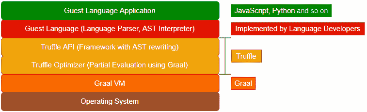
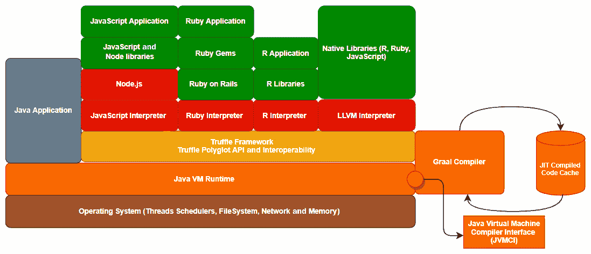
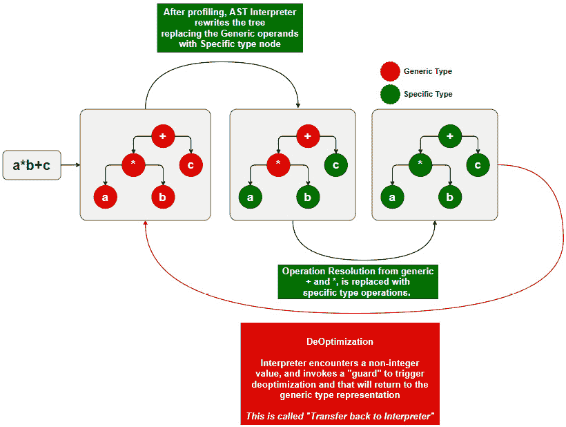
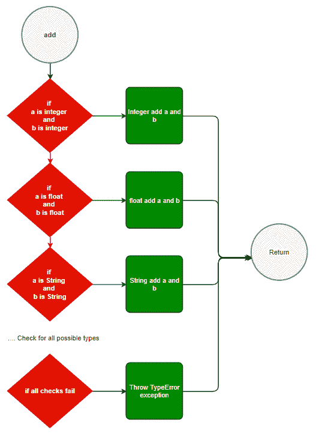
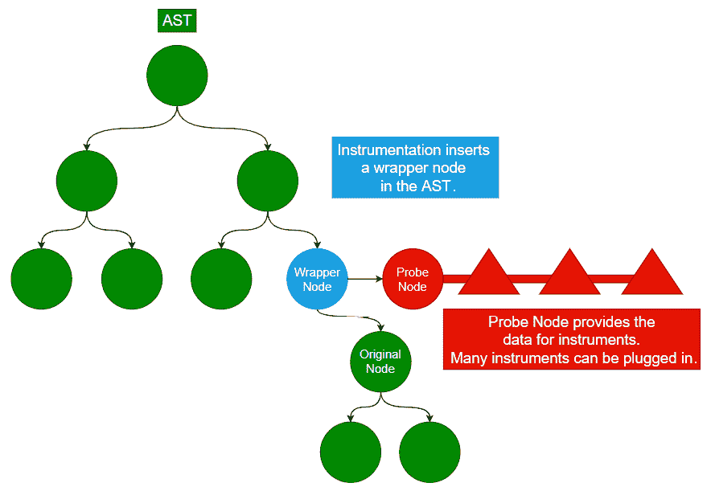

# 第八章：Truffle – 概述

多语言开发支持是 GraalVM 最大的特性之一。在*第四章* *Graal 即时编译器*和*第五章* *Graal 预编译器及原生图像*中，我们详细介绍了 Graal 如何在构建时间和运行时优化代码。在前面的所有章节中，我们只使用了 Java。然而，GraalVM 将其大多数高级特性扩展到了其他编程语言。GraalVM 提供了一个名为**Truffle 语言实现框架**（通常称为**Truffle**）的语言实现框架。

GraalVM 不仅为 Java、Groovy、Kotlin 和 Scala 等 JVM 语言提供高性能运行时，还支持 JavaScript、Ruby、Python、R、WebAssembly 以及实现 Truffle 的 LLVM 语言等非 JVM 语言。还有更多语言正在 Truffle 上实现。

本章从概念上阐述了 Truffle 如何帮助客户端语言开发者，并提供了一个精心设计、高性能的框架，用于在 GraalVM 上使用客户端语言构建应用程序。本章不会过多涉及如何使用 Truffle 在客户端语言中编写代码。这只是为了描述 Truffle 的架构和概念，以便您能够理解后续章节中如何在 GraalVM 上实现非 JVM 语言。

本章将涵盖以下主题：

+   探索 Truffle 语言实现框架

+   探索 Truffle 解释器/编译器管道

+   学习 Truffle DSL

+   理解 Truffle 如何支持互操作性

+   理解 Truffle 仪表

+   使用 Truffle 进行即时编译

+   使用启动器选项优化 Truffle 解释器性能

+   SimpleLanguage 和 Simple Tool

到本章结束时，您将很好地理解 Truffle 的架构以及 Truffle 如何为其他编程语言提供在 GraalVM 上运行的框架。

# 探索 Truffle 语言实现框架

在*第三章*中，*GraalVM 架构*部分，我们简要介绍了 Truffle 的架构。Truffle 是一个开源库，提供了一个框架来实现语言解释器。Truffle 帮助运行实现该框架的客户端编程语言，以利用 Graal 编译器的功能生成高性能代码。Truffle 还提供了一个名为 SimpleLanguage 的参考实现，以指导开发者为其语言编写解释器。Truffle 还提供了一个工具框架，有助于集成和利用一些现代的诊断、调试和分析工具。

让我们了解 Truffle 如何融入 GraalVM 整体生态系统。除了语言之间的互操作性外，Truffle 还提供了可嵌入性。互操作性允许在不同语言之间调用代码，而可嵌入性允许将不同语言编写的代码嵌入到同一程序中。

语言互操作性对于以下原因至关重要：

+   不同的编程语言是为了解决不同的问题而构建的，它们各自具有自己的优势。例如，我们广泛使用 Python 和 R 进行机器学习和数据分析，而使用 C/C+ 进行高性能数学运算。想象一下，如果我们直接重用代码，无论是通过从宿主语言（如 Java）调用代码，还是将代码嵌入到宿主语言中，这将增加代码的可重用性，并允许我们使用适合当前任务的适当语言，而不是在不同语言中重写逻辑。

+   如果我们拥有多编程语言互操作性的功能，那么在从一种语言迁移到另一种语言的重大迁移项目中，我们可以分阶段进行。这大大降低了迁移的风险。

下图展示了如何在 GraalVM 上运行用其他语言编写的应用程序：



图 6.1 – Truffle 堆栈

在图中，我们可以看到 GraalVM，这是我们在前几章中介绍过的 JVM 和 Graal JIT 编译器。在其之上，我们有 Truffle 框架。Truffle 有两个主要组件。它们如下：

+   **Truffle API**：Truffle API 是任何客语言程序员都可以使用的语言实现框架，用于为各自的语言实现 Truffle 解释器。Truffle 提供了一个复杂的 API 用于**抽象语法树**（**AST**）重写。客语言被转换为 AST 以在 GraalVM 上进行优化和运行。Truffle API 还有助于提供实现 Truffle API 的语言之间的互操作性框架。

+   **Truffle 优化器**：Truffle 优化器为部分评估的投机优化提供了一个额外的优化层。我们将在后续章节中更详细地介绍这一点。

在 Truffle 层之上，我们有客语言。这是 JavaScript、R、Ruby 等实现 Truffle 语言实现框架的语言。最后，我们有在客语言运行时之上运行的应用程序。在大多数情况下，应用程序开发者不必担心更改代码以在 GraalVM 上运行。Truffle 通过提供中间层使其无缝。以下图显示了 GraalVM 和 Truffle 生态系统的详细堆栈视图：



图 6.2 – Truffle 和 Graal 详细堆栈视图

此图简单地展示了 Truffle 如何在非 JVM 语言和 GraalVM 之间充当一层。让我们详细了解这一点。

Truffle 提供 API，供各个解释器实现，将代码重写为 AST。AST 表示随后被转换为 Graal 中间表示，以便 Graal 执行和即时优化。客语言在各自的 Truffle 解释器实现之上运行。

让我们看看这些不同层如何交互，以及 Truffle 如何帮助客语言在 GraalVM 上运行。

# 探索 Truffle 解释器/编译器管道

Truffle 提供 API，供各个解释器实现，将代码重写为 AST。AST 表示随后被转换为 Graal 中间表示，以便 Graal 执行和即时优化。客语言在各自的 Truffle 解释器实现之上运行。

![图 6.3 – Truffle 和 Graal 编译管道![图 6.3 – Truffle 和 Graal 编译管道图 6.3 – Truffle 和 Graal 编译管道让我们更好地理解流程图。客语言使用传统的语法和词法分析器进行解析。这生成了一个 AST。AST 是根据 Truffle/Graal 规范构建的中间表示。AST 是一个树结构，其中每个父节点是一个操作/函数，子节点是数据/操作数/依赖项。AST 中的每个节点都有一个`execute()`方法。`execute()`方法实现了相应语言结构的语义。客语言开发者应该设计这些节点，并提供解析客语言代码和构建树的功能。以下代码片段显示了抽象节点对象：```javaabstract class Node {    // Executes the operation encoded by this    // node and returns the result.    public abstract Object execute(Frame f);    // Link to the parent node and utility to    // replace a node in the AST.    private Node parent;    protected void replace(Node newNode);}```所有节点类型都实现了这个抽象节点。AST 解释器逐个遍历 AST 节点以执行，使用栈帧来跟踪执行和数据。AST 解释器易于实现，但具有巨大的性能开销。现在让我们看看 Truffle 解释器如何通过重写树来优化 AST。## 自优化和树重写让我们更好地理解流程图。从性能角度来看，动态语言最大的问题之一是类型声明（与 C 语言等语言不同，在代码中指定了类型）。类型不是在编码时声明的，这意味着在执行开始时，变量可能具有任何类型。分析器可以在几次运行后确定特定类型，然后可以根据运行时分析专门化变量的类型。然后它使用特定类型重写 AST。这种技术称为**类型特殊化**。这具有显著的性能提升，因为在此数据上执行的操作/方法可以专门针对数据类型。Truffle 解释器在假设的类型在未来的执行中被证明是错误的情况下留下一个推测*守卫*。在这种情况下，守卫被调用以去优化 AST。当操作/函数需要在运行时解析时，也会发生树重写。这对于函数或操作的动态解析非常重要，因为操作或函数有多态实现。当分析器确定函数/操作的具体实现时，解析的函数/操作可以被重写。一个简单的图示说明操作解析紧随此段之后。`Node`类有`replace()`方法，用于重写。以下图示了一个非常简单的表达式，并显示了在分析后 AST 是如何被重写的：

图 6.4 – AST 特殊化说明

在图象的左侧，Truffle 解释器从通用的 AST 节点开始。根据分析器，解释器理解它主要是一个特定类型的值，比如说一个整数。它将重写具有整数类型的节点和具有整数操作的运算节点。这优化了 AST 的执行。在最左侧的表示中，+可能意味着字符串的连接、整数、长整数或浮点数的加法，或者任何其他将运算减少到最右侧表示的多态执行，在那里它非常明显是一个整数。如果假设在未来被证明是错误的，则在那里放置一个守卫检查。如果操作数恰好是浮点数或某种其他类型，则将调用去优化，这可能会将其带回到最左侧的表示。Truffle 解释器将再次分析以确定要应用的正确类型特殊化。它可能确定它更像是长整数或双精度浮点数，因此它可能将 AST 重写为双精度浮点数并优化。类型特殊化应用于局部变量、返回类型、操作和字段。

基于类型特殊化的 AST 重写为性能提供了显著的提升，当我们达到 Graal 执行的更高级优化时，我们有一个非常稳定的 AST。

由于 AST 解释器是用 Java 实现的，因此 `execute()` 节点方法被编写来处理通用对象。类型专业化还有助于通过用专门的 `executeInt()` 方法替换 `execute()` 方法，以及通过用原始类型（`int`、`double` 等）替换包装器实现（`Integer`、`Double` 等）来减少 CPU 的装箱和拆箱负载。这种技术有时被称为 *装箱消除*。

一旦解释器发现没有节点重写，这意味着 AST 已经稳定。然后，将代码编译成机器码，并将所有虚拟调用内联为特定的调用。然后，将此代码传递给 Graal JIT 编译器在运行时进行进一步优化。这被称为 **部分评估**。如果假设有效，则将守卫嵌入到代码中。当任何假设无效时，守卫代码将执行回 AST 解释器，在那里节点重写将再次发生。这被称为 **转移到解释器**。

## 部分评估

调用这些 `execute()` 方法是虚拟调度，这会对性能产生显著的开销。当 Truffle 识别出稳定的代码，即没有更多的 AST 重写发生且代码中有大量调用时，它会执行部分评估来提高该代码的执行性能。部分评估包括内联代码、消除虚拟调度并用直接调用替换它们，以及构建一个将被提交给 Graal 编译器进行进一步优化的组合单元。Truffle 在可能被证伪的假设处放置守卫点。这些守卫点通过使代码无效并切换回执行解释器模式来触发降级优化。然后，在进行了激进的常量折叠、内联和逃逸分析之后，将代码编译为客语言的目标机器码。Truffle 在 AST 上执行内联，使其与语言无关。内联决策是通过在每个候选对象上执行部分评估来做出的。

在下一节中，我们将探讨 GraalVM 中的 Truffle 框架，该框架用于创建 DSL。

# 学习 Truffle DSL

Truffle 定义了一个基于 Java 注解处理器的 **领域特定语言（DSL**）。语言开发者必须编写大量的样板代码来管理特殊化的状态。为了理解 Truffle DSL 如何使程序员的生活变得容易，让我们快速举一个例子：

```java
c = a + b
```

如我们本章前面所讨论的，在 AST 中，每个操作和操作数都表示为一个节点。在 Truffle 中，它是一个从 `com.oracle.truffle.api.nodes.Node` 派生的 Java 类。为了理解 DSL 的必要性，让我们对前面表达式的 AST 实现进行过度简化。

由于我们正在查看动态类型语言，`a` 和 `b` 可以是任何类型。我们需要一个表达式节点，该节点应该实现一个 `execute` 方法，用于检查 `a` 和 `b` 的所有可能类型。我们可能需要编写类似于以下逻辑的代码：



图 6.5 – 实现特殊化的守卫检查 – 流程图

在前面的流程图中，我们正在检查所有可能的操作数类型组合，并根据这些组合评估表达式，如果这些条件都不满足，则抛出 `TypeError` 异常。这种逻辑需要在 Truffle 解释器中编写，因为我们正在处理动态类型语言。

如果我们将此转换为 Truffle 解释器代码，这将是一个非常简单的表达式的大量代码。想象一下，如果我们有更复杂的表达式和其他操作和函数。Truffle 解释器代码将难以编写和管理。

这就是 Truffle DSL 解决问题的所在。Truffle DSL 提供了一个非常明确的节点层次结构、注解和注解处理程序的框架，可以用来处理这种类型的动态性。

`@Specialization` 注解是由 `com.oracle.truffle.api.dsl.Specialization` 类实现的特殊化注解，它被用作所有可能的评估情况的注解（如图中之前的绿色框所示）。Truffle DSL 将其编译成动态代码，其中 Truffle 根据操作数参数选择正确的实现（序列中的第一个）。语言开发者的代码将类似于以下代码片段：

```java
@Specialization protected long executeAddInt (int left, int right) {
    return left + right;
}
@Specialization String executeAddFloat (Float left, Float right) {
    return left + right;
}
@Specialization String executeAddString (String left, String right) {
    return left + right;
}
```

前面的代码展示了 Truffle DSL 如何简化工作，我们不需要编写大量的 `if`/`else` 语句。Truffle DSL 注解会为我们编译和生成这些代码。最后，为了处理异常情况，我们可以使用由 `com.oracle.truffle.api.dsl.Fallback` 类实现的 `@Fallback` 注解。回退代码块将类似于以下代码片段：

```java
@Fallback protected void typeError (Object left, Object right) {
    throw new TypeException("type error: args must be two     integers or floats or two", this);
}
```

如前所述，Truffle 根据操作数类型动态选择正确的实现，默认情况下。但是，也可以通过使用 `@Specilization` 注解声明守卫来修改这一点。可以为 `@Specialization` 注解声明四种类型的守卫。它们如下：

+   在 `Node` 类声明中的 `@NodeChild` 类型匹配时，将执行特定的方法。

+   `@Specification` 注解。这些表达式非常简单，类似于 Java 代码，其结果为布尔值。如果这个表达式评估为真，那么将执行特定的方法；如果为假，解释器将跳过该执行。以下是一个简单的例子：

    ```java
    @Specialization(guards = {"!isInteger(operand)",    "!isFloat(operand)"})
    protected final int executeTheMethod(final Object operand) {
      //....code to execute if the expression is true
    }
    ```

    在前面的代码中，如果传递给`guards`的表达式为`true`，Truffle 解释器会选择`executeTheMethod()`方法。在这种情况下，如果操作数既不是整数也不是浮点数，则该表达式为真。`guards`实际上是`com.oracle.truffle.api.dsl.Specialization`中的一个 String 数组属性。我们可以传递多个表达式。

+   `ArithmeticException`。我们可以有多个特殊化实现来重写执行以处理异常情况。为了更好地理解这一点，让我们看看以下代码示例：

    ```java
    @Specialization(rewriteOn = ArithmeticException.class)
     int executeNoOverflow(int a, int b) {
        return Math.addExact(a, b);
     }
     @Specialization
     long executeWithOverflow(int a, int b) {
        return a + b;
     }
    ```

    在此代码中，当整数类型匹配（类型守卫）时，Truffle 将调用`executeWithOverflow()`方法，但如果整数值导致溢出，则会抛出`ArithmeticException`。在这种情况下，Truffle 将使用`executeNoOverflow()`方法来覆盖加法方法。这是我们之前在本章中讨论过的基于特殊化的节点重写的一个例子。

+   `Assumption`对象由 Truffle 用于验证和无效化一个假设，其中`com.oracle.truffle.api.Assumption`是一个接口。一旦假设被无效化，在该运行时中它将永远不再有效。这被 Truffle 用于在优化和去优化中做出决策。它就像一个全局的布尔标志。语言开发者可以通过程序方式无效化一个假设，让 Truffle 运行时知道特定的假设不再有效，相应地，Truffle 运行时可以做出决策。假设对象通常作为节点的最终字段存储。假设守卫用于在假设为真时选择特殊化方法。

基于这些各种注解，Truffle 将生成实际的`execute()`方法，其中包含所有`if`/`else`控制，以确保根据我们使用`@Specification`注解声明的约束调用方法的确切版本。Truffle DSL 注解生成器还在`execute()`方法的末尾包括了`CompilerDirectives.transferToInterpreterAndInvalidate()`；这将告诉编译器停止编译，插入一个转换到解释器的操作，并使机器代码无效。这将触发去优化并返回到执行的解释器模式。

除了这个之外，Truffle DSL 还提供了其他使语言开发者工作变得容易的注解。您可以在此处查看完整列表：[`www.graalvm.org/truffle/javadoc/com/oracle/truffle/api/dsl/package-summary.html`](https://www.graalvm.org/truffle/javadoc/com/oracle/truffle/api/dsl/package-summary.html)。

Truffle 定义了一个 TypeSystem，语言开发者可以在其中为操作数类型提供自定义的转换行为。例如，Truffle 解释器可能不知道如何将`long`类型转换为`int`类型。使用 TypeSystem，我们可以定义类型转换逻辑。在特殊化过程中，Truffle 解释器将使用 TypeSystem。

动态类型语言的一个挑战是多态方法/函数的调度。Truffle 解释器实现多态内联缓存以加快函数查找。

## 多态内联缓存

在动态类型语言中，解释器必须执行查找以确定被调用方法/函数的正确实现。查找函数和调用函数是昂贵的，并且会减慢执行速度。在动态类型语言中，当调用一个对象或函数时，类在构建时或运行时都没有声明，解释器必须执行查找以找到实际实现该方法的类。这通常是一个散列表查找，与强类型语言中发生的 vTable 查找不同。散列表查找耗时且非常昂贵，会减慢执行速度。如果我们只有一个类实现该方法，我们只需要执行一次查找。这被称为单态内联。如果有多个类实现该方法，则是多态的。

检查函数查找是否有效比实际查找更便宜。如果对于多个（多态）函数的多次查找有很多之前的查找，Truffle 会缓存多态查找。当函数由于去优化而重新定义时，使用`Assumption`对象来无效化并执行新的查找。为了提高查找性能，Truffle 提供了多态内联缓存。Truffle 缓存查找，并仅检查查找是否仍然有效。

# 理解 Truffle 如何支持互操作性

Truffle 提供了一个非常精心设计的互操作性框架，允许客语言读取和存储数据。在本节中，我们将介绍 Truffle 互操作性框架提供的一些关键特性。让我们逐一了解它们。

## 框架管理和局部变量

Truffle 提供了一个标准接口来处理主机和客语言实现之间的局部变量和数据。框架提供了读取和存储当前命名空间中数据的接口。当调用函数时，局部变量的数据作为`com.oracle.truffle.api.frame.Frame`实例传递。框架有两种实现：

+   `execute()`方法。这是轻量级的，并且更可取，因为 Graal 可以更好地优化它。这个框架存在于函数的作用域内。这是传递数据给函数的最优和推荐方式。`VirtualFrame`不会逃逸，因此易于处理和内联。

+   `MaterializedFrame`在堆中分配，并且可以被其他函数访问。`MaterializedFrame`超出函数的作用域。Graal 无法像优化`VirtualFrame`那样优化它。这种框架实现也对内存和速度有影响。

帧跟踪作为键的一部分存储的数据类型。用于获取数据的键是 `FrameSlot` 和 `FrameSlotKind` 的实例。以下代码片段显示了 `Frame` 接口的定义：

```java
public interface Frame {
    FrameDescriptor getFrameDescriptor();
    Object[] getArguments();
    boolean isType(FrameSlot slot);
    Type getType(FrameSlot slot) throws             FrameSlotTypeException;
    void setType(FrameSlot slot, Type value);
    Object getValue(FrameSlot slot);
    MaterializedFrame materialize();
}
```

`FrameSlot.getIdentifier()` 提供了数据的唯一标识符，而 `FrameSlotKind` 存储数据的类型。`FrameSlotKind` 是一个包含各种类型（布尔型、字节型、双精度型、浮点型、非法型、整型、长整型、对象型）的枚举。

`FrameDescriptor` 类跟踪存储在帧中的值。`FrameDiscriptor` 描述了 `Frame` 的布局，提供了 `FrameSlot` 和 `FrameSlotKind` 以及值的映射。请参阅 [`www.graalvm.org/truffle/javadoc/com/oracle/truffle/api/frame/package-summary.html`](https://www.graalvm.org/truffle/javadoc/com/oracle/truffle/api/frame/package-summary.html) 了解 Frame API 的更多详细信息。SimpleLanguage 有一个帧管理的实现，是理解如何使用 Frame API 来管理在调用方法/函数时在不同语言之间传递的数据的好起点。

## 动态对象模型

Truffle 提供了一个 **动态对象模型** (**DOM**)，它提供了一个对象存储框架，以实现不同语言之间数据和对象的可互操作性。Truffle 的 DOM 定义了一种标准且优化的数据共享方式，尤其是在动态类型语言之间。DOM 提供了一个语言无关的共享基础设施，允许开发者派生和实现各种语言的对象实现。这也帮助我们实现不同语言之间的类型对象共享。Truffle 的 DOM 是 Truffle 互操作性和嵌入功能的核心组件之一。它为主机和客户端语言提供了一致的内存对象存储结构。这允许不同语言编写的代码之间共享数据，并在多语言应用程序中应用优化。

动态类型语言的一个挑战是期望数据对象模型具有动态性。对象的结构可能会动态改变。为了支持这一点，Truffle 的 DOM 定义了一个名为 `DynamicObject` 的 Java 类。它提供了扩展数组以提供原始类型和对象扩展的可变性。

客户端语言对象都应该继承自一个从 `DynamicObject` 扩展并实现 `TruffleObject` 的基类。现在让我们详细了解 Truffle 仪表化。

# 理解 Truffle 仪表化

Truffle 提供了一个 Instrumentation API，以帮助构建用于诊断、监控和调试的仪器和工具。Truffle 还提供了一个名为 Simple Tool 的参考实现（[`github.com/graalvm/simpletool`](https://github.com/graalvm/simpletool)）。Truffle 提供了一个非常高性能的仪器化设计。仪器化是通过探针和标签实现的。探针附加到 AST 节点以捕获仪器化数据，节点使用标签进行标识。多个仪器可以附加到探针。以下图示了一个典型的仪器化：



图 6.6 – Truffle 仪器化

前面的图示说明了 Truffle 的 Instrument API 如何连接到 AST 以收集各种指标/数据。Truffle 通过插入包装节点替换原始节点，并将信息传递给探针节点，该节点可以连接到多个仪器以收集数据。

# 使用 Truffle 进行 AOT 编译

客户端语言开发者可以通过返回非空值来使用 Graal 的 `RootNode.prepareForAOT()` 方法。如果返回空值，Truffle/Graal 会理解该语言不支持构建原生镜像。为了支持 AOT，`prepraeForAOT()` 方法通常可能实现以下任务：

+   提供局部变量的类型信息并在 `FrameDescriptor` 中更新它们。这将有助于 AOT 编译器在构建时解析类型。

+   解决并定义参数和返回类型。

Truffle DSL 提供了辅助类以加速 AOT 功能的开发。`com.oracle.truffle.api.dsl.AOTSupport` 类递归地准备 AST 以进行 AOT。AST 中的每个节点都必须实现 `prepareForAOT()` 方法。

可以通过将 `--engine.CompileAOTOnCreate=true` 参数传递给语言启动器来触发 AOT 编译。每个客户端语言都将有一个语言启动器来运行应用程序，例如，`js` 用于 JavaScript，`graalpython` 用于 Python 等。我们将在下一章中介绍一些这些客户端语言实现。

# 使用启动器选项优化 Truffle 解释器性能

Truffle 定义了一个设计和规范，用于提供各种启动器选项，这些选项可用于诊断、调试和优化解释器。所有客户端语言开发者都支持这些启动器选项。在本节中，我们将介绍一些这些重要的启动器选项：

+   `-help` 命令行参数。`--help:expert` 提供专家选项。对于语言实现者的内部选项，我们可以使用 `--help:internal`。

+   `--vm.Dgraal.Dump=Truffle:1` 参数。使用 Truffle 生成的 Graal 图将包含一个名为 *After TruffleTier* 的阶段，该阶段显示了 Truffle 执行的优化。

    `--cpusampler` 可以用来找出应用程序运行的 CPU 时间，并提供按模块详细分解的 CPU 使用情况。

    可以传递 `--engine.TraceCompilation` 参数来在每次方法编译时创建一个跟踪。

    可以传递 `--engine.TraceCompilationDetail` 参数来跟踪编译队列、开始和完成时的编译过程。

    可以传递 `--engine.TraceCompilationAST` 参数来跟踪代码编译时的 AST。

    可以传递 `--engine.TraceInlining` 参数来跟踪客语言所做的内联决策。

    可以传递 `--engine.TraceSplitting` 参数来跟踪语言所做的拆分决策。

    可以传递 `--engine.TraceTransferToInterpreter` 参数来跟踪在触发去优化并发生到解释器的转换时的情况。

您可以参考 GraalVM 文档以获取更多信息 ([`www.graalvm.org/graalvm-as-a-platform/language-implementation-framework/Optimizing/`](https://www.graalvm.org/graalvm-as-a-platform/language-implementation-framework/Optimizing/)) 或在语言启动器中传递 `--help` 参数。

# SimpleLanguage 和 Simple Tool

GraalVM 团队创建了一个名为 SimpleLanguage 的客语言参考实现。SimpleLanguage 展示了 Truffle 的功能，并解释了如何使用 Truffle API。客语言开发者可以使用 SimpleLanguage 作为参考。它是完全开源的，可在 GitHub 上找到 [`github.com/graalvm/simplelanguage`](https://github.com/graalvm/simplelanguage)。SimpleLanguage 只是一个起点，并不实现所有功能。

还有一个 Simple Tool 的参考实现。Simple Tool 是一个使用 Truffle 构建的代码覆盖率工具的实现。这也是一个开源项目，工具开发者可以使用它来构建在 GraalVM 上运行的新的工具。您可以在 [`github.com/graalvm/simpletool`](https://github.com/graalvm/simpletool) 访问此工具的源代码。

使用 Truffle 开发的语言数量正在不断增加。在接下来的两章中，我们将介绍 JavaScript、LLVM（C/C++）、Ruby、Python、R、Java/Truffle 和 WebAssembly。您可以在 [`www.graalvm.org/graalvm-as-a-platform/language-implementation-framework/Languages/`](https://www.graalvm.org/graalvm-as-a-platform/language-implementation-framework/Languages/) 查看一些其他编程语言的状态。

# 摘要

在本章中，我们探讨了 Truffle 的架构，并了解了它是如何为其他语言（客语言）在 GraalVM 上运行提供精心设计的框架。我们还研究了 Truffle 解释器的实现方式以及它们如何在提交稳定后的 AST 到 Graal 进行进一步优化之前对 AST 进行优化。

在本章中，您已经对 Truffle 架构以及 Truffle 如何在 Graal 之上提供框架和实现层有了很好的理解。您还探索了 Truffle 在将代码提交给 Graal JIT 进行进一步优化和执行之前所执行的优化。

在下一章中，我们将探讨 JavaScript 和 LLVM 语言（C、C++等）如何在 GraalVM 上实现 Truffle 并运行。

# 问题

1.  什么是特化？

1.  什么是树/节点重写？

1.  什么是部分评估？

1.  什么是 Truffle DSL？

1.  什么是框架？

1.  什么是动态对象模型？

# 进一步阅读

+   Truffle：一个自优化运行时系统 ([`lafo.ssw.uni-linz.ac.at/pub/papers/2012_SPLASH_Truffle.pdf`](https://lafo.ssw.uni-linz.ac.at/pub/papers/2012_SPLASH_Truffle.pdf))

+   特化动态技术以实现 Ruby 编程语言 ([`www.researchgate.net/publication/285051808_Specialising_Dynamic_Techniques_For_Implementing_the_Ruby_Programming_Language`](https://www.researchgate.net/publication/285051808_Specialising_Dynamic_Techniques_For_Implementing_the_Ruby_Programming_Language))

+   用于构建自优化 AST 解释器的领域特定语言 ([`lafo.ssw.uni-linz.ac.at/papers/2014_GPCE_TruffleDSL.pdf`](http://lafo.ssw.uni-linz.ac.at/papers/2014_GPCE_TruffleDSL.pdf))

+   一个虚拟机统治一切 ([`lafo.ssw.uni-linz.ac.at/papers/2013_Onward_OneVMToRuleThemAll.pdf`](http://lafo.ssw.uni-linz.ac.at/papers/2013_Onward_OneVMToRuleThemAll.pdf))

+   多语言运行时中的高性能跨语言互操作性 ([`chrisseaton.com/rubytruffle/dls15-interop/dls15-interop.pdf`](https://chrisseaton.com/rubytruffle/dls15-interop/dls15-interop.pdf))

+   在 Truffle 中编写语言 ([`cesquivias.github.io/index.html`](http://cesquivias.github.io/index.html))
