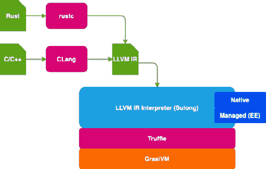
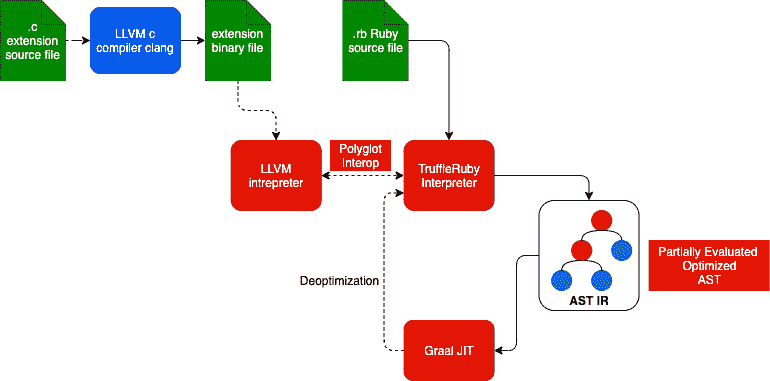
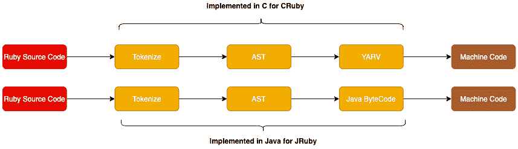
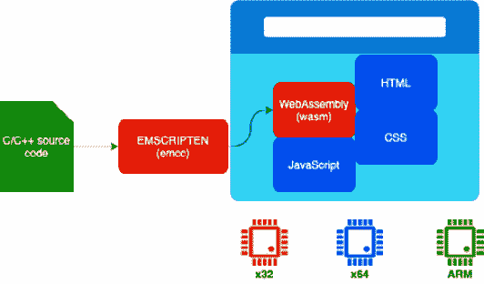
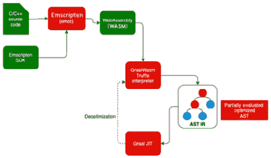

# 第十一章：GraalVM 多语言 – LLVM、Ruby 和 WASM

在上一章中，我们介绍了 Java、Python 和 R 的 Truffle 解释器以及语言间的互操作性。在本章中，我们将介绍其他语言的实现，例如以下内容：

+   **LLVM**：LLVM Truffle 解释器

+   **TruffleRuby**：Ruby 语言解释器实现

+   **WebAssembly** (*WASM*)：WebAssembly 实现

所有这些语言实现目前都处于*实验性*阶段，并且在撰写本书时并未发布用于生产。然而，我们将探索其功能和构建一些代码来理解各种概念。

在本章中，我们将介绍以下主题：

+   理解 LLVM、Ruby 和 WASM 解释器及其多语言特性

+   理解这些各种语言解释器的兼容性和限制

到本章结束时，你将会有使用 LLVM、Ruby 和 WASM 解释器构建多语言应用程序的实践经验。

# 技术要求

本章需要以下内容以跟随各种编码/实践部分：

+   GraalVM 的最新版本。

+   各种语言的 Graal 运行时。我们将在本章中介绍如何安装和运行这些运行时。

+   访问 GitHub。在 Git 仓库中有一些可用的示例代码片段。代码可以从以下链接下载：[`github.com/PacktPublishing/Supercharge-Your-Applications-with-GraalVM/tree/main/Chapter09`](https://github.com/PacktPublishing/Supercharge-Your-Applications-with-GraalVM/tree/main/Chapter09)。

+   本章的“代码在行动”视频可以在[`bit.ly/3hT7Z1A`](https://bit.ly/3hT7Z1A)找到。

# 理解 LLVM – (Sulong) Truffle 接口

LLVM 是一个编译器基础设施，它提供了一组模块化、可重用的编译器组件，可以形成一个工具链，将源代码编译成机器代码。该工具链在**中间表示**（**IR**）上提供各种级别的优化。任何源语言都可以使用这个工具链，只要源代码可以表示为 LLVM IR。一旦源代码表示为 LLVM IR，该语言就可以利用 LLVM 提供的高级优化技术。您可以参考 [`llvm.org/`](https://llvm.org/) 上的 LLVM 项目。已经基于这个基础设施构建了各种编译器。其中一些最受欢迎的是 Clang（用于 C、C++ 和 Objective C）、Swift（被苹果广泛使用）、Rust 和 Fortran。

Sulong 是一个用 Java 编写的 LLVM 解释器，内部使用 Truffle 语言实现框架。这使得所有可以生成 LLVM IR 的语言编译器都可以直接在 GraalVM 上运行。以下图表显示了 Sulong 如何使 LLVM 语言能够在 GraalVM 上运行：




图 9.1 – LLVM 编译管道

前面的图示展示了 LLVM 在非常高级的层面上是如何工作的。C/C++ 源代码被编译成 LLVM IR。让我们更好地理解这个图：

+   C/C++ 代码由 Clang 编译成 LLVM IR。

+   `lli` GraalVM LLVM IR 解释器有两个版本：*原生*和*管理型*。原生是默认的 `lli` 版本，它既包含在社区版中也包含在企业版中。管理型 `lli` 仅在企业版中可用，并提供了一种管理执行模式，我们将在 *理解 LLVM 管理环境* 部分中介绍。

+   LLVM IR 解释器执行初始优化并与 Truffle 和 Graal 集成，以便在运行时进行进一步优化。

为了理解 LLVM IR 的外观，这里有一些示例 C 代码，其中我们添加两个数字并返回结果：

```java
int addInt(int a, int b)
{
    return a + b;
}
```

当我们通过 Clang 处理它时，将生成以下 LLVM IR。我们可以使用 `clang -S -emit-llvm cfile.c` 命令来生成 LLVM IR：

```java
define dso_local i32 @addInt(i32 %0, i32 %1) #0 !dbg !7 {
  %3 = alloca i32, align 4
  %4 = alloca i32, align 4
  store i32 %0, i32* %3, align 4
  call void @llvm.dbg.declare(metadata i32* %3, 
  metadata !12, metadata!DIExpression()), !dbg !13
  store i32 %1, i32* %4, align 4
  call void @llvm.dbg.declare(metadata i32* %4, 
  metadata !14, metadata !DIExpression()), !dbg !15
  %5 = load i32, i32* %3, align 4, !dbg !16
  %6 = load i32, i32* %4, align 4, !dbg !17
  %7 = add nsw i32 %5, %6, !dbg !18
  ret i32 %7, !dbg !19
}
```

前面的 IR 清楚地显示了代码是如何转换为 `a` 变量（`%0`），它作为参数传递，而 `b` (`%1`) 分别分配到 `%3` 和 `%4`。然后，值被加载到 `%5` 和 `%6` 中，并加到 `%7`。`%7` 中的值被返回。SSA 使得优化算法易于实现，因为算法不需要跟踪单个变量的值变化，因为变量的每个变化都分配给一个静态值。

LLVM IR 可以传递给 Sulong，它是 LLVM IR 解释器，它内部使用 Truffle 语言实现框架在 GraalVM 上运行代码。这利用了 GraalVM 的高级优化功能。

## 安装 LLVM 工具链

LLVM 可作为可选的运行时，可以使用 Graal Updater 安装，命令如下：

```java
gu install llvm-toolchain
```

LLVM 被安装到 `$GRAALVM_HOME/languages/llvm/native/bin`。我们可以使用以下命令来检查路径：

```java
$GRAALVM_HOME/bin/lli --print-toolchain-path 
```

这将打印出 LLVM 安装的路径。企业版也附带了一个管理的 LLVM。我们将在本章后面介绍这一点。

GraalVM LLVM 运行时可以执行转换为 LLVM 位码的语言代码。GraalVM `lli` 工具解释位码，然后使用 Graal `lli` 动态编译。`lli` 还支持与动态语言的互操作性。`lli` 命令的语法将在下面展示：

```java
lli [LLI options] [GraalVM options] [polyglot options] <bitcode file> [program args]
```

`lli` 可以执行纯位码或嵌入位码的原生可执行文件（Linux：ELF 和 macOS：Mach-O）。

让我们用一些简单的代码快速验证安装：

```java
#include <stdio.h>
int main() {
    printf("Welcome to LLVM Graal \n");
    return 0;
}
```

让我们用 Clang 编译这段代码：

```java
clang HelloGraal.c -o hellograal
```

这将运行 `hellograal` 应用程序。让我们使用 `lli` 来运行它。`lli` 是 LLVM 解释器：

```java
lli hellograal
```

下面的示例显示了输出：

```java
lli hellograal
Hello from GraalVM!
```

我们可以直接执行`/hellograal`并得到相同的输出。这被称为原生执行。有时原生执行比`lli`更快，但我们无法获得`lli`提供的多语言特性。让我们来看一个更复杂的情况；让我们将`FibonacciCalculator.java`转换为 C 语言。以下是 C 语言的源代码：

```java
#include <stdio.h>
#include <stdlib.h>
#include <sys/time.h>
long fib(int i) {
    int fib1 = 0;
    int fib2 = 1;
    int currentFib, index;
    long total = 0;
    for (index = 2; index < i; ++index)
    {
        currentFib = fib1 + fib2;
        fib1 = fib2;
        fib2 = currentFib;
        total += currentFib;
    }
    printf("%ld \n", total);
    return total;
}
int main(int argc, char const *argv[])
{
    for (int i = 1000000000; i < 1000000010; i++)
    {
        struct timeval tv_start;
        struct timeval tv_end;
        long time;
        gettimeofday(andtv_start, NULL);
        fib(i);
        gettimeofday(andtv_end, NULL);
        time = (tv_end.tv_sec*1000000 +             tv_end.tv_usec) - (tv_start.tv_sec*1000000 +                 tv_start.tv_usec);
        printf("i=%d time: %10ld\n", i, time);
    }
    return 0;
}
```

让我们运行以下命令来创建一个可执行文件：

```java
/Library/Java/JavaVirtualMachines/graalvm-ee-java11-21.0.0.2/Contents/Home/languages/llvm/native/bin/clang FibonacciCalculator.c -o fibonacci
```

我们必须确保我们使用正确的 Clang 版本。我们必须使用与 GraalVM LLVM 工具链一起提供的 Clang；否则，我们无法使用`lli`。如果我们使用普通的 Clang 并尝试用`lli`执行生成的二进制文件，我们会得到以下错误：

```java
oplevel executable /fibonacci does not contain bitcode
        at <llvm> null(Unknown)
```

一旦创建了二进制文件，我们就用`lli`执行它以使用 GraalVM JIT 编译功能。以下是使用`lli`执行时的输出：

```java
  llvm git:(main) lli fibonacci
-24641037439717 
i=1000000000 time:    5616852
-24639504571562 
i=1000000001 time:    5592305
-24640314634125 
i=1000000002 time:    5598246
-24639591828533 
i=1000000003 time:    1116430
-24639679085504 
i=1000000004 time:    1092585
-24639043536883 
i=1000000005 time:    1140553
-24638495245233 
i=1000000006 time:    1117817
-24637311404962 
i=1000000007 time:    1121831
-24635579273041 
i=1000000008 time:    1103494
-24636958268145 
i=1000000009 time:    1109705
```

让我们在图表上绘制这些结果，看看性能在迭代中是如何提高的。以下是这个图表：

![图 9.2 – GraalVM LLVM 性能图表]


图 9.2 – GraalVM LLVM 性能图表

我们可以看到在迭代中有一个显著改进。我们可以看到，最初运行速度较慢，但在第三次迭代后，性能提高了近六倍。

## 探索 LLVM 互操作性

在本节中，我们将探索 LLVM 的互操作性功能，并了解我们如何在 Java、LLVM（C）和 JavaScript 之间进行交互。

### Java 和 LLVM 互操作性

让我们首先尝试从 Java 中调用`FibonacciCalculator.c`可执行文件。以下是`FibonacciCalculatorLLVMEmbed.java`的源代码：

```java
import java.io.File;
import org.graalvm.polyglot.Context;
import org.graalvm.polyglot.Source;
import org.graalvm.polyglot.Value;
public class FibonacciCalculatorLLVMEmbed {
    public static void main(String[] args) {
        try {
            Context polyglot = Context.newBuilder()                .allowAllAccess(true).build();
            File file = new File("fibpoly");
            Source source = Source.newBuilder("llvm",                file).build();
            Value fibpoly = polyglot.eval(source);
            fibpoly.execute();
        } catch (Exception e) {
            e.printStackTrace();
        }
    }
}
```

源代码与我们用 JavaScript 所做的工作非常相似。我们正在创建一个`Context`对象，使用`Source`对象加载编译的文件，并使用`SourceBuilder`从二进制文件构建`Source`对象。然后使用`Context`对象评估`Source`对象，并最终执行它。

让我们编译这个 Java 文件，并用 GraalVM Java 运行它。以下代码显示了文件的输出：

```java
java FibonacciCalculatorLLVMEmbed
Inside C code: 10944 
Returned value to Java 10944
```

我们可以看到，我们能够从 Java 中调用 C 代码。在这种情况下，我们只是执行了 C 应用程序。现在让我们尝试直接调用成员函数并传递一个整数，并将总和作为`long`类型返回。

以下是修改后的 C 代码：

```java
#include <stdio.h>
#include <stdlib.h>
#include <sys/time.h>
long fib(int i) {
    int fib1 = 0;
    int fib2 = 1;
    int currentFib, index;
    long total = 0;
    for (index = 2; index < i; ++index) {
        currentFib = fib1 + fib2;
        fib1 = fib2;
        fib2 = currentFib;
        total += currentFib;
    }
    printf("Inside C code: %ld \n", total);
    return total;
}
```

之前的代码实现了我们之前用 Java 编写的`FibonacciCalculator`逻辑。

在本节中，我们探讨了如何从 Java 中调用 C 方法。现在让我们了解如何从动态语言，如 JavaScript 中调用 C 代码。

### 探索 JavaScript 和 LLVM 互操作性

让我们检查与 JavaScript 的互操作性。JavaScript 提供了一个非常简单的代码片段。以下是 JavaScript 代码（`FibonacciCaller.js`）：

```java
var fibpoly = Polyglot.evalFile("llvm" , "fibpoly");
var fib = fibpoly.fib(20);
print("Returned value to JS: "+ fib);
```

让我们按照以下方式运行此 JavaScript：

```java
js --polyglot FibonacciCaller.js 
Inside C code: 10944 
Returned value to JS: 10944
```

我们可以看到，我们现在能够将数据传递给 C 代码并执行 C 方法。

## 理解 LLVM 托管环境

GraalVM 企业版提供了 LLVM 的管理环境。我们可以在`/languages/llvm/managed`目录下找到一个 LLVM 管理工具链的版本，而默认的非管理工具链可以在`/languages/llvm/native`目录下找到。

当使用`lli`的管理版本时，可以通过`--llvm.managed`标志启用管理环境或管理执行模式。在本节中，让我们了解执行管理模式是什么，以及为什么它对 LLVM 特别必要。

为了理解我们通常遇到的问题，让我们取一些非常简单的代码，`ManagedLLVM.c`。在以下代码中，我们故意尝试将字符数组复制到一个未初始化的`char`指针：

```java
#include <stdlib.h>
#include <stdio.h>
int main() {
  char *string;
  char valueStr[10] = "Hello Graaaaaaal";
  strcpy(string, valueStr);
  printf("%s", string);
  free(string);
  return 0;
}
```

让我们编译这段代码；Clang 实际上警告我们`valueStr`的初始化不正确。`valueStr`仅定义了 10 个字符，但我们分配了超过 10 个字符。让我们假设我们忽略这些警告并继续。应用程序仍然可以构建并执行。以下是编译`ManagedLLVM.c`文件的输出：

```java
/Library/Java/JavaVirtualMachines/graalvm-ee-java11-21.0.0.2/Contents/Home/languages/llvm/native/bin/clang ManagedLLVM.c -o managedllvm
ManagedLLVM.c:5:23: warning: initializer-string for char array is too long
  char valueStr[10] = "Hello Graaaaaaal";
                      ^~~~~~~~~~~~~~~~~~
ManagedLLVM.c:6:3: warning: implicitly declaring library function 'strcpy' with type
      'char *(char *, const char *)' [-Wimplicit-function-      declaration]
  strcpy(string, valueStr);
  ^
ManagedLLVM.c:6:3: note: include the header <string.h> or explicitly provide a declaration for 'strcpy'
2 warnings generated.
ManagedLLVM.c:5:23: warning: initializer-string for char array is too long
  char valueStr[10] = "Hello Graaaaaaal";
                      ^~~~~~~~~~~~~~~~~~
ManagedLLVM.c:6:3: warning: implicitly declaring library function 'strcpy' with type
      'char *(char *, const char *)' [-Wimplicit-function-      declaration]
  strcpy(string, valueStr);
  ^
ManagedLLVM.c:6:3: note: include the header <string.h> or explicitly provide a declaration for 'strcpy'
2 warnings generated.
```

如果我们忽略警告并仍然运行应用程序的二进制文件，我们显然会得到一个页面错误。这会杀死宿主进程并完全停止应用程序。这类问题会导致核心转储并使应用程序崩溃，在 C/C++等语言中，我们经常遇到这类问题。以下是我们在本地模式（直接本地和本地`lli`）运行代码时的输出：

```java
 ./managedllvm
[1]    30556 segmentation fault  ./managedllvm
```

GraalVM LLVM 管理执行模式提供了一种优雅地处理这些问题的方法。让我们用相同的代码，这次使用 Clang 的管理版本进行编译，并用`lli`的管理版本运行它。让我们用`lli`的管理版本运行应用程序的二进制文件：

```java
llvm git:(main) lli --llvm.managed managedllvm
Illegal null pointer access in 'store i64'.
        at <llvm> main(ManagedLLVM.c:6:112)
```

它仍然失败了，但这次不是段错误或崩溃；它抛出了一个异常。异常可以被捕获并优雅地处理。

为了更好地理解如何处理这种情况，让我们创建一个 Java 类（`ManagedLLVM.java`），它从 Java 调用`managedllvm`可执行文件并优雅地处理异常：

```java
import java.io.File;
import org.graalvm.polyglot.Context;
import org.graalvm.polyglot.Source;
import org.graalvm.polyglot.Value;
public class ManagedLLVM {
    public static void main(String[] args) {
        try {
            Context polyglot = Context.newBuilder()                .allowAllAccess(true)                .option("llvm.managed", "true")                .build();
            File file = new File("managedLLVM");
            Source source =                 Source.newBuilder("llvm", file).build();
            Value mllvm = polyglot.eval(source);
            mllvm.execute();
        } catch (Exception e) {
            System.out.println("Exception occured....");
            e.printStackTrace();
        }
    }
}
```

注意，我们现在正在使用`llvm.manage`选项将`Context`对象设置为`true`。这对我们以管理执行模式运行可执行文件至关重要。让我们编译并运行这个 Java 应用程序：

```java
javac ManagedLLVM.java 
java ManagedLLVM 
Exception occured....
Illegal null pointer access in 'store i64'.
        at <llvm> main(ManagedLLVM.c:6:112)
        at org.graalvm.sdk/org.graalvm.polyglot.Value.        execute(Value.java:455)
        at ManagedLLVM.main(ManagedLLVM.java:13)
```

我们可以看到，Java 应用程序现在能够捕获异常，我们可以在这里编写异常处理代码。此外，它并没有停止应用程序。这是在管理执行模式下运行 LLVM 的一个最伟大的特性，并且即使在多语言环境中也得到了支持。

Ruby 是另一种在 GraalVM 中有高性能解释器实现的编程语言。让我们在下一节探索并理解 TruffleRuby，Ruby 的 Truffle 实现。

# 理解 TruffleRuby – Ruby 的 Truffle 解释器

TruffleRuby 是建立在 Truffle 之上的 GraalVM 上 Ruby 编程语言的高性能实现。在本节中，我们将通过代码示例探索一些语言特定的概念，以获得对 GraalVM 上 Ruby 实现的良好理解。

## 安装 TruffleRuby

TruffleRuby 默认情况下也不包含 GraalVM 安装。您必须使用 Graal 更新工具下载并安装它。要安装 TruffleRuby，请使用以下命令：

```java
gu install ruby
```

在安装 Ruby 之后，我们必须运行一些后安装脚本，以便`OpenSSL` C 扩展能够工作。我们需要运行`post_install_hook.sh`，您可以在`ruby/lib/truffle`目录下找到它。让我们通过一个简单的 Ruby 应用程序来测试安装：

```java
print "enter a "
a = gets.to_i
print "Enter b "
b = gets.to_i
c = a + b
puts "Result " + c.to_s
```

上述代码接受用户输入的`a`和`b`的整数值，将数字相加，并将结果作为字符串打印出来。这是一个非常简单的 Ruby 应用程序来测试 Ruby。让我们在 TruffleRuby 上运行这个程序。以下是在终端上的输出：

```java
truffleruby helloruby.rb 
enter a 10
Enter b 20
Result 30
```

现在我们知道 TruffleRuby 已安装并正在运行，让我们了解 TruffleRuby 解释器是如何工作的。

## 理解 TruffleRuby 解释器/编译器管道

TrufflyRuby，像任何其他客座语言一样，是 Truffle 解释器实现。以下图显示了 TruffleRuby 解释器/编译器管道：




图 9.3 – TruffleRuby 编译器/解释器管道

解释器/编译器管道与其他客座语言非常相似。前面的图表没有捕捉到所有细节。请参阅*第六章*中的*探索 Truffle 解释器/编译器管道*部分，*Truffle – 概述*，以获取关于 Truffle 解释器和 Graal JIT 如何执行代码的更详细解释。TruffleRuby 解释器在解析后构建 AST，并执行优化，然后将代码提交给 Graal JIT，就像任何其他客座语言一样。然而，其中一个关键区别是它处理 C 扩展的方式。C 扩展是 Ruby 编程的一个组成部分，并且传统上，C 扩展被插入到 Ruby 解释器中。TruffleRuby 使用 LLVM 解释器来处理这个问题。这自然提供了多语言互操作性，我们可以使用其他 LLVM 语言，如 C++、Rust 和 Swift，而不仅仅是 C。由于 TruffleRuby 建立在 Truffle 之上，它引入了多语言互操作性。让我们探索 TruffleRuby 的多语言互操作性功能。

## 探索 TruffleRuby 的多语言互操作性

TruffleRuby 带来了 Truffle 的所有多语言互操作性功能，并实现了类似的 API。让我们在本节中探索这些功能。让我们编写一些简单的 Ruby 代码，调用我们在前几节中构建的导出简单数学函数和变量的 JavaScript 文件：

```java
var helloMathMessage = " Hello Math.js";
function add(a, b) {
    print("message from js: add() called");
    return a+b;
}
function subtract(a, b) {
    print("message from js: subtract() called");
    return a-b;
}
function multiply(a, b) {
    print("message from js: multiply() called");
    return a*b;
}
Polyglot.export('add', add);
Polyglot.export('subtract', subtract);
Polyglot.export('multiply', multiply);
Polyglot.export('message', helloMathMessage);
```

以下是一个 Ruby 代码示例，展示了多语言能力：

```java
arrayPy  = Polyglot.eval("python", "[10, 10.23456,     'Array String element']")
puts arrayPy.to_s
lengthOfArray = arrayPy.size
puts "Iterating through the Python Array object of size "     + lengthOfArray.to_s
for i in 0..lengthOfArray - 1
    puts "Element at " + i.to_s + " is " + arrayPy[i].to_s
end
```

在前面的代码中，我们调用 JavaScript 代码创建一个包含三个元素的数组：一个整数、一个浮点数和一个字符串。我们使用`Polyglot.eval()`在线评估此 JavaScript 代码。然后我们遍历数组并打印值。在以下代码中，我们加载`math.js`并导入`message`变量以及`add()`、`subtract()`和`multiply()`函数。然后我们调用这些函数并打印结果：

```java
Polyglot.eval_file("./math.js") 
message = Polyglot.import("message")
addFunction = Polyglot.import_method("add")
subtractFunction = Polyglot.import_method("subtract")
multiplyFunction = Polyglot.import_method("multiply")
puts "Message from JS " + message
puts "Result of add(10,20) " + add(10,20).to_s
puts "Result of subtract(10,20) " + subtract(40,20).to_s
puts "Result of multiply(10,20) " + multiply(10,20).to_s
```

现在让我们运行这段代码。以下是输出：

```java
truffleruby --polyglot mathJsCaller.rb
#<Python [10, 10.23456, 'Array String element']>
Iterating throught the Python Array object of size 3
Element at 0 is 10
Element at 1 is 10.23456
Element at 2 is Array String element
Message from JS  Hello Math.js
message from js: add() called
Result of add(10,20) 30
message from js: subtract() called
Result of subtract(10,20) 20
message from js: multiply() called
Result of multiply(10,20) 200
```

我们可以看到我们能够遍历 JavaScript 数组，并且还能调用`math.js` JavaScript 代码中的函数。

现在，让我们探索如何与 Java 交互。我们使用`Java.type()`方法加载 Java 类。让我们使用`FibonacciCalculator`的一个稍微修改过的版本。以下是 Java 源代码：

```java
public class FibonacciCalculator{  
    public int[] findFibonacci(int count) {
        int fib1 = 0;
        int fib2 = 1;
        int currentFib, index;
        int [] fibNumbersArray = new int[count];
        for(index=2; index < count+1; ++index ) {    
            currentFib = fib1 + fib2;    
            fib1 = fib2;    
            fib2 = currentFib;    
            fibNumbersArray[index - 1] = currentFib;
        }
        return fibNumbersArray;
    }
    public void iterateFibonacci() {
        long startTime = System.currentTimeMillis();
        long now = 0;
        long last = startTime;
        for (int i = 1000000000; i < 1000000010; i++) {
            int[] fibs = findFibonacci(i);
            long total = 0;
            for (int j=0; j<fibs.length; j++) {
                total += fibs[j];
            }
            now = System.currentTimeMillis();
            System.out.printf("%d (%d ms)%n", i , now - last);
            last = now;
        }
        long endTime = System.currentTimeMillis();
        System.out.printf("total: (%d ms)%n",             System.currentTimeMillis() - startTime);  
    }
    public static void main(String args[]) {    
        FibonacciCalculator fibCal =             new FibonacciCalculator();
        fibCal.iterateFibonacci();
    }
}
```

我们定义了两个方法：`findFibonacci()`和`iterateFibonacci()`。`findFibonacci()`方法接受一个整数并返回按请求计数生成的斐波那契数。`iterateFibonacci()`迭代并生成大量斐波那契数，并计时以检查代码的性能。

以下代码是用于加载`FibonacciCalculator`类并调用`findFibonacci(int count)`方法的 Ruby 脚本。我们向此方法传递一个整数值，并得到一个整数数组。然后我们遍历数组并打印值。我们还调用了`iterateFibonacci()`来比较它与直接使用 Java 运行的性能：

```java
fibclass = Java.type('FibonacciCalculator')
fibObject = fibclass.new
fibonacciArray = fibObject.findFibonacci(10)
for i in 0..fibonacciArray.size - 1
    puts "Element at " + i.to_s + " is " + fibonacciArray[i]    .to_s
end
puts "Calling iterateFibonacci()"
fibObject.iterateFibonacci()
```

要运行此 Ruby 脚本，我们需要在命令行中传递`--jvm`，并使用`--vm.cp`指向 Java 类可用的路径。以下是运行 TruffleRuby 的输出：

```java
truffleruby --jvm --vm.cp=. fibonacciJavaCaller.rb
Element at 0 is 0
Element at 1 is 1
Element at 2 is 2
Element at 3 is 3
Element at 4 is 5
Element at 5 is 8
Element at 6 is 13
Element at 7 is 21
Element at 8 is 34
Element at 9 is 55
Calling iterateFibonacci()
1000000000 (2946 ms)
1000000001 (1011 ms)
1000000002 (1293 ms)
1000000003 (1016 ms)
1000000004 (1083 ms)
1000000005 (1142 ms)
1000000006 (1072 ms)
1000000007 (994 ms)
1000000008 (982 ms)
1000000009 (999 ms)
total: (12538 ms)
```

我们可以看到我们能够在 Ruby 中调用 Java 类并遍历 Java 数组，甚至`iterateFibonacci()`的性能也相当不错。让我们尝试将此与直接使用 Java 运行此 Java 类进行比较。以下是输出：

```java
java FibonacciCalculator 
1000000000 (2790 ms)
1000000001 (592 ms)
1000000002 (1120 ms)
1000000003 (927 ms)
1000000004 (955 ms)
1000000005 (952 ms)
1000000006 (974 ms)
1000000007 (929 ms)
1000000008 (923 ms)
1000000009 (924 ms)
total: (11086 ms)
```

我们可以看到 Ruby 的性能与直接运行 Java 相当。TruffleRuby 是性能最好的 Ruby 运行时之一。TruffleRuby 处于实验阶段，在撰写本书时；有关最新信息，请参阅[`www.graalvm.org/reference-manual/ruby/`](https://www.graalvm.org/reference-manual/ruby/)。

使用 Ruby 最大的优点之一是 RubyGems。Ruby 拥有一个庞大的库，这是开发者社区在一段时间内构建的。所有宝石都托管在 https://rubygems.org/。借助 GraalVM Polyglot，这为在 Java 或任何其他由 GraalVM 支持的语言中使用这些宝石开辟了巨大的机会。为了说明这一点，让我们在一个 Java 程序中使用一个宝石。有一个名为 math_engine 的宝石（[`rubygems.org/gems/math_engine`](https://rubygems.org/gems/math_engine)）。它有一个非常有趣的方法来评估复杂的数学表达式。假设我们正在构建一个可以用来评估复杂表达式的复杂代数计算器。让我们在一个 Ruby 程序中使用这个宝石，并从 Java 中调用它。

让我们先安装宝石。为了安装宝石，让我们使用 Bundler（https://bundler.io/）。Bundler 是一个包管理器（在 Node.js 中相当于 npm）。要安装 Bundler，请使用 gem install 命令。以下是安装 Bundler 的输出：

```java
gem install bundler
Fetching bundler-2.2.17.gem
Successfully installed bundler-2.2.17
1 gem installed
```

现在让我们创建一个 Gemfile。Bundler 使用 Gemfile 中的配置来安装所有包/宝石。（这相当于 npm 中的 package.json。）以下是 Gemfile 的源代码：

```java
source 'https://rubygems.org'
gem 'math_engine'
```

我们提供了 Gem 仓库的源代码，并指定了依赖于我们 Ruby 模块的宝石。现在让我们运行 Bundler 来安装这些宝石。（应该在我们有 Ruby 程序和 Gemfile 的文件夹中执行 bundle install 命令。）

bundle install 命令将安装所有宝石。现在让我们使用 math_engine 宝石，并在 Ruby 中定义一个名为 eval() 的方法，该方法接受表达式，评估它，并返回结果：

```java
require 'rubygems'
require 'math_engine'
def eval(exp)
    engine = MathEngine.new
    ret = engine.evaluate(exp)
    puts(ret)
    return ret.truncate(4).to_f()
end
Polyglot.export_method('eval')
```

在前面的源代码中，我们使用 Polyglot.export_method() 导出方法，以便其他语言可以访问它。现在让我们从一个 Java 程序中调用这个 eval() 方法。

以下是对应的 Java 源代码：

```java
public class MathEngineExample {
    public void evaluateExpression(String exp) {
        Context ctx = Context.newBuilder()            .allowAllAccess(true).build();
        try {
            File fibCal =                 new File("./math_engine_expression.rb");
            ctx.eval(Source.newBuilder("ruby",                fibCal).build());
            Value evaluateFunction =                 ctx.getBindings("ruby").getMember("eval");
            Double evaluatedValue =                 evaluateFunction.execute(exp).asDouble();
            System.out.printf("Evaluated Expression : "                 + evaluatedValue.toString());  
        }   catch (Exception e) {
            System.out.println("Exception : " );
            e.printStackTrace();
        }
    }
    public static void main(String[] args) {
        MathEngineExample obj = new MathEngineExample();
        obj.evaluateExpression("20 * (3/2) + (5 * 5)             / (100.5 * 3)");
    }
}
```

在前面的 Java 代码中，我们使用 Context 对象来加载 Ruby 运行时和我们的 Ruby 程序。然后我们将 eval() 方法绑定并使用传递的表达式执行它。然后捕获值并将其转换为字符串以打印。在 main() 方法中，我们传递一个复杂的数学表达式。现在让我们编译并运行这段 Java 代码。以下是输出：

```java
java MathEngineExample
0.30082918739635157545605306799e2
Evaluated Expression : 30.0829      
```

第一个输出来自 Ruby 的 put_s()，下一个输出来自 Java。这为使用大量宝石库开辟了巨大的机会。

### 理解 TruffleRuby 与 CRuby 与 JRuby 的区别

Ruby 在市场上有很多实现。JRuby 和 CRuby 是 Ruby 的两种流行实现。

JRuby 是用 Java 实现的 Ruby 编程语言。CRuby 是用 C 实现的 Ruby 编程语言。以下图表显示了 JRuby 和 CRuby 的高级编译管道。JRuby 是 Ruby 性能最高的实现之一，因为它引入了优化和即时编译。JRuby 也没有像 CRuby 那样的全局解释器锁，这允许并发执行，因此速度更快。然而，JRuby 启动较慢，但随时间推移性能更佳：



图 9.4 – JRuby 和 CRuby 编译管道

TruffleRuby 的性能优于 JRuby 和 CRuby。请参阅[`www.graalvm.org/ruby/`](https://www.graalvm.org/ruby/)以获取更详细的 optcarrot 和 Rubycon 基准测试结果。

# 理解 GraalWasm – WASM Truffle 解释器

GraalVM 为 WASM 代码提供了一个解释器和编译器，称为 GraalWasm。GraalWasm 开辟了构建接近本地性能的多语言 Web 应用程序的可能性。在我们深入了解 GraalWasm 之前，让我们快速概述一下 WASM。

理解 WASM

**WASM**是一种可以在大多数现代浏览器上以接近本地速度运行的二进制格式。Web 应用程序变得越来越复杂，需要高性能和接近本地的体验。JavaScript 只能达到一定水平，我们已经看到了许多基于 JavaScript 的非常好的应用程序，它们提供了几乎本地的体验。WASM 增强了 JavaScript 和其他技术，使我们能够在 Web 上编译 C、C++和 Rust 程序。以下图显示了构建 WASM 应用程序的非常简单的管道：



图 9.5 – WASM 编译管道流程

在前面的图中，我们可以看到如何使用 Emscripten 将 C/C++代码编译成 WASM，并且它与其他 Web 技术共存，在浏览器上运行。JavaScript 和 WASM 都在浏览器上执行逻辑。主要区别在于 WASM 是以编译时已经优化过的二进制形式交付的。不需要抽象语法树和类型特化和推测（参考*第六章*中的*探索 Truffle 解释器/编译器管道*部分，*Truffle – 概述*，以了解更多关于 AST 和推测优化）。

这也是 WASM 具有更小体积和更快性能的原因之一。现代 Web 应用程序架构利用 WASM 在浏览器中执行更高级的计算逻辑，而 JavaScript 用于运行用户界面和简单的应用程序逻辑。通过引入多语言互操作性和嵌入，GraalWasm 开辟了更多可能性。让我们在下一节中探讨这一点。

## 理解 GraalWasm 架构

让我们了解 GraalWasm 的工作原理。以下图显示了 GraalWasm 的编译管道。该图并未捕捉到所有细节。请参考 *第六章* 中的 *探索 Truffle 解释器/编译器管道* 部分，*Truffle – 概述*，以获取关于 Truffle 解释器和 Graal JIT 如何执行代码的更详细解释：



图 9.6 – GraalWasm 编译/解释器管道

C/C++ 源代码使用 Emscripten (`emcc`) 进行编译。Emscripten 是基于 LLVM 的 `gcc` 或 Clang 的替代品。Emscripten 将源代码编译成 WASM (`.wasm`) 文件。GraalWasm 解释器创建 AST 并执行优化。由于 WASM 是从强类型语言生成的，因此不需要太多优化。由于 WASM 格式是一系列指令，为了减少内存占用，GraalWasm 构建一个 AST，其中每个节点都指向 WASM 中的一个块（这被称为 WASM 块节点），而不是为每条指令创建一个节点。然后 GraalWasm 解释器优化 AST 并将其传递给 Graal 以执行。

## 安装和运行 GraalWasm

GraalWasm 是一个可选组件；它不包含在 GraalVM 安装中。我们必须使用 Graal Updater 来安装它。要安装 GraalWasm，我们可以使用以下命令来下载和安装它：

```java
gu install wasm
```

现在，让我们构建一个 WASM 二进制文件，并使用 GraalWasm 运行它。要将 C 代码编译成 WASM，我们必须安装 `emcc`。以下部分将介绍安装 `emcc` 的步骤。

## 安装 Emscripten (emcc)

Emscripten 使用 Emscripten SDK 进行安装。我们可以从 Git 仓库下载 SDK。让我们在终端执行以下命令：

```java
git clone https://github.com/emscripten-core/emsdk.git
```

这将下载 `emsdk`，它还包含所有所需的安装脚本。`git clone` 将创建一个 `emsdk` 目录。让我们将其移动到 `cd emsdk` 文件夹并执行 `git pull` 以确保它是最新的。我们可以通过执行以下命令来安装 `emcc` 工具链：

```java
./emsdk install latest
```

这将下载所有所需的工具链和 SDK。一旦下载完成，我们需要激活 `emsdk` 并然后设置环境，按照以下命令顺序执行：

```java
./emsdk activate latest
./emsdk_env.sh
```

一旦所有这些命令都成功执行，我们应该能够通过在终端运行 `emcc` 命令来检查 Emscripten 是否已安装。

现在，让我们构建以下 C 代码的 WASM。这是对我们在 *探索 LLVM 互操作性* 部分中已经使用的代码的轻微修改：

```java
#include <stdio.h>
#include <stdlib.h>
#include <sys/time.h>
static long fib(int i) {
    int fib1 = 0;
    int fib2 = 1;
    int currentFib, index;
    long total = 0;
    for (index = 2; index < i; ++index) {
        currentFib = fib1 + fib2;
        fib1 = fib2;
        fib2 = currentFib;
        total += currentFib;
    }
    return total;
}
```

我们定义了一个计算斐波那契数的方法，将它们相加，并返回斐波那契数的总和。在以下 `main()` 方法的代码片段中，我们正在循环调用这个 `fib()` 方法进行交互，只是为了测试这个方法，并打印每次迭代的总时间和执行时间：

```java
int main(int argc, char const *argv[])
{
    for (int i = 10000; i < 10010; i++) {
        struct timeval tv_start;
        struct timeval tv_end;
        long time;
        gettimeofday(&tv_start, NULL);
        fib(i);
        gettimeofday(&tv_end, NULL);
        time = (tv_end.tv_sec*1000000 + tv_end.tv_usec) –            (tv_start.tv_sec*1000000 + tv_start.tv_usec);
        printf("i=%d time: %10ld\n", i, time);
    }
    return 0;
}
```

让我们使用以下命令使用 `emcc` 编译此代码：

```java
emcc -o fibonacci.wasm fibonacci.c
```

在上一个命令中，`-o` 选项用于指定输出文件的名称；在这种情况下，`fibonacci.wasm` 是在成功编译后生成的二进制文件。让我们通过执行以下命令来运行这个文件：

```java
wasm --Builtins=wasi_snapshot_preview1 fibonacci.wasm
```

在前面的命令中，我们使用了 `--Builtins` 来传递 Emscripten 工具链所需的 `wasi_snapshot_preview1` 模块。以下是在执行后的输出：

```java
wasm --Builtins=wasi_snapshot_preview1 fibonacci.wasm
i=10000 time:       6563
i=10001 time:       6519
i=10002 time:       6841
i=10003 time:       8455
i=10004 time:       6838
i=10005 time:       7156
i=10006 time:       7214
i=10007 time:        237
i=10008 time:        265
i=10009 time:        247 
```

我们可以立即看到生成的输出，对于我们要创建和相加的斐波那契数的数量来说，速度相当快。此外，我们还可以看到从 6,519 毫秒到 247 毫秒的巨大性能提升。

# 摘要

在本章中，我们详细介绍了如何在 Truffle 上实现 LLVM、Ruby、WASM、Java 以及 Ruby 解释器。我们还探讨了这些语言提供的多语言互操作性功能，以及编码示例。我们了解了每种语言解释方式的不同。本章提供了在实际这些各种语言中运行代码和编写多语言应用程序的实战指南。

您应该能够使用这些知识在 GraalVM 上编写多语言应用程序。尽管在撰写本书时，这些语言中的大多数仍然处于实验阶段，但它们提供了构建高性能多语言应用程序的绝佳机会。在下一章中，我们将看到新的框架，如 Quarkus 和 Micronaut，如何实现 Graal 以实现最优化微服务架构。

# 问题

1.  Sulong 是什么？

1.  LLVM 执行的托管模式是什么？

1.  TruffleRuby 如何实现 C 扩展？

1.  WASM 是什么？

1.  `emcc` 是什么？

# 进一步阅读

+   GraalVM 企业版：[`docs.oracle.com/en/graalvm/enterprise/19/index.html`](https://docs.oracle.com/en/graalvm/enterprise/19/index.html)

+   GraalVM 语言参考：[`www.graalvm.org/reference-manual/languages/`](https://www.graalvm.org/reference-manual/languages/)

+   GraalWasm 宣布博客文章：[`medium.com/graalvm/announcing-graalwasm-a-webassembly-engine-in-graalvm-25cd0400a7f2`](https://medium.com/graalvm/announcing-graalwasm-a-webassembly-engine-in-graalvm-25cd0400a7f2)

+   *GraalVM 中的 WASM 引擎：介绍 Oracle 的 GraalWasm*：[`jaxenter.com/graalvm-webassembly-graalwasm-165111.html`](https://jaxenter.com/graalvm-webassembly-graalwasm-165111.html)
