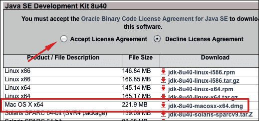
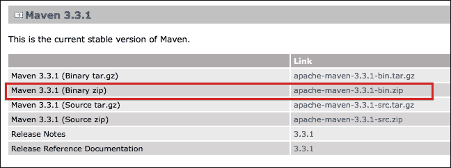
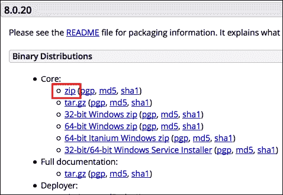
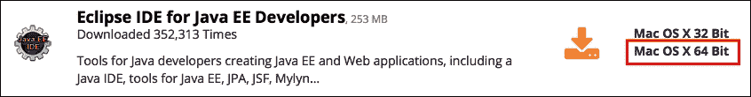
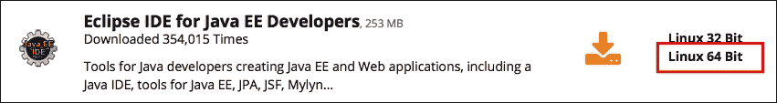
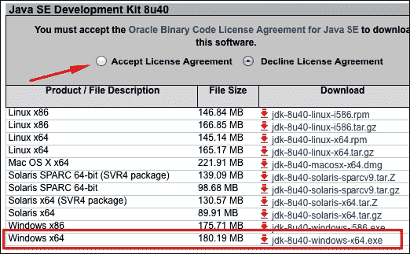
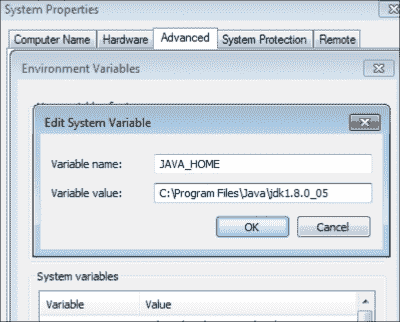
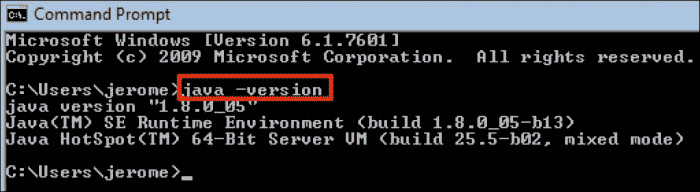
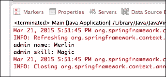

# 第一章：创建 Spring 应用程序

在本章中，我们将介绍以下食谱：

+   在 Mac OS 上安装 Java、Maven、Tomcat 和 Eclipse

+   在 Ubuntu 上安装 Java、Maven、Tomcat 和 Eclipse

+   在 Windows 上安装 Java、Maven、Tomcat 和 Eclipse

+   创建一个 Spring Web 应用程序

+   运行 Spring Web 应用程序

+   在标准 Java 应用程序中使用 Spring

# 简介

在本章中，我们首先将介绍一些 Spring 开发工具的安装：

+   **Java**：Spring 是一个 Java 框架。

+   **Maven**：这是一个类似于 Ant 的构建工具。它使得将 Spring 库添加到项目中变得容易。Gradle 作为另一个构建工具选项。

+   **Tomcat**：这是一个 Java Web 应用程序的 Web 服务器。您也可以使用 JBoss、Jetty、GlassFish 或 WebSphere。

+   **Eclipse**：这是一个 IDE。您也可以使用 NetBeans、IntelliJ IDEA 等。

然后，我们将构建一个 Spring Web 应用程序，并使用 Tomcat 运行它。

最后，我们将看到 Spring 也可以在标准 Java 应用程序中使用（不是 Web 应用程序）。

# 在 Mac OS 上安装 Java、Maven、Tomcat 和 Eclipse

我们首先安装 Java 8，因为它默认情况下并未安装在 Mac OS 10.9 或更高版本上。然后，我们将安装 Maven 3，这是一个类似于 Ant 的构建工具，用于管理我们将使用的（Spring、Hibernate 等）外部 Java 库。Maven 3 还可以编译源文件并生成 JAR 和 WAR 文件。我们还将安装 Tomcat 8，这是一个流行的 Java Web 应用程序的 Web 服务器，我们将在这本书的整个过程中使用它。也可以使用 JBoss、Jetty、GlassFish 或 WebSphere。最后，我们将安装 Eclipse IDE，但您也可以使用 NetBeans、IntelliJ IDEA 等。

## 如何操作...

首先安装 Java，然后是 Maven、Tomcat 和 Eclipse。

### 安装 Java

1.  从 Oracle 网站[`oracle.com`](http://oracle.com)下载 Java。在 Java SE 下载部分，选择 Java SE 8 SDK。选择**接受许可协议**并下载**Mac OS X x64**包。到该页面的直接链接是[`www.oracle.com/technetwork/java/javase/downloads/jdk8-downloads-2133151.html`](http://www.oracle.com/technetwork/java/javase/downloads/jdk8-downloads-2133151.html)。

1.  打开下载的文件，启动它，并完成安装。

1.  在您的`~/.bash_profile`文件中，设置`JAVA_HOME`环境变量。将`jdk1.8.0_40.jdk`更改为您系统上的实际文件夹名称（这取决于您使用的 Java 版本，它定期更新）：

    ```java
    export JAVA_HOME="/Library/Java/JavaVirtualMachines/ jdk1.8.0_40.jdk/Contents/Home"
    ```

1.  打开一个新的终端并测试它是否工作：

    ```java
    $ java -version
    java version "1.8.0_40"
    Java(TM) SE Runtime Environment (build 1.8.0_40-b26)
    Java HotSpot(TM) 64-Bit Server VM (build 25.40-b25, mixed mode)

    ```

### 安装 Maven

1.  从 Apache 网站[`maven.apache.org/download.cgi`](http://maven.apache.org/download.cgi)下载 Maven。选择当前稳定版本的**二进制 zip 文件**：

1.  解压缩下载的文件，并将提取的文件夹移动到方便的位置（例如，`~/bin`）。

1.  在您的 `~/.bash_profile` 文件中，添加一个指向该文件夹的 `MAVEN_HOME` 环境变量。例如：

    ```java
    export MAVEN_HOME=~/bin/apache-maven-3.3.1
    ```

1.  将 `bin` 子目录添加到您的 `PATH` 环境变量中：

    ```java
    export PATH=$PATH:$MAVEN_HOME/bin
    ```

1.  打开一个新的终端并测试其是否工作：

    ```java
    $ mvn –v
    Apache Maven 3.3.1 (12a6b3...
    Maven home: /Users/jerome/bin/apache-maven-3.3.1
    Java version: 1.8.0_40, vendor: Oracle Corporation
    Java home: /Library/Java/JavaVirtualMachines/jdk1.8.0_...
    Default locale: en_US, platform encoding: UTF-8
    OS name: "mac os x", version: "10.9.5", arch... …

    ```

### 安装 Tomcat

1.  从 Apache 网站下载 Tomcat [`tomcat.apache.org/download-80.cgi`](http://tomcat.apache.org/download-80.cgi) 并选择 **核心** 二进制发行版。

1.  解压下载的文件并将提取的文件夹移动到方便的位置（例如，`~/bin`）。

1.  使 `bin` 子目录中的脚本可执行：

    ```java
    chmod +x bin/*.sh
    ```

1.  使用 `catalina.sh` 脚本启动 Tomcat：

    ```java
    $ bin/catalina.sh run
    Using CATALINA_BASE:   /Users/jerome/bin/apache-tomcat-7.0.54
    ...
    INFO: Server startup in 852 ms

    ```

1.  Tomcat 默认在 `8080` 端口运行。在网页浏览器中，访问 `http://localhost:8080/` 以检查其是否工作。

### 安装 Eclipse

1.  从 [`www.eclipse.org/downloads/`](http://www.eclipse.org/downloads/) 下载 Eclipse。选择 **Java EE 开发者 Eclipse IDE** 的 **Mac OS X 64 位** 版本。

1.  解压下载的文件并将提取的文件夹移动到方便的位置（例如，`~/bin`）。

1.  通过执行 `eclipse` 二进制文件启动 Eclipse：

    ```java
    ./eclipse
    ```

## 更多内容...

可以使用这两个脚本以后台进程运行 Tomcat：

```java
bin/startup.sh
bin/shutdown.sh
```

在开发机器上，将 Tomcat 的文件夹放在家目录中的某个位置（例如，`~/bin`）很方便，这样其内容可以在不使用 root 权限的情况下更新。

# 在 Ubuntu 上安装 Java、Maven、Tomcat 和 Eclipse

我们首先安装 Java 8。然后，我们将安装 Maven 3，一个类似于 Ant 的构建工具，用于管理我们将使用的（Spring、Hibernate 等等）外部 Java 库。Maven 3 还编译源文件并生成 JAR 和 WAR 文件。我们还将安装 Tomcat 8，这是一个流行的 Java 网络应用服务器，我们将在这本书中使用它。也可以使用 JBoss、Jetty、GlassFish 或 WebSphere。最后，我们将安装 Eclipse IDE，但您也可以使用 NetBeans、IntelliJ IDEA 等等。

## 如何操作...

首先安装 Java，然后安装 Maven、Tomcat 和 Eclipse。

### 安装 Java

1.  添加此 **PPA**（**个人软件包存档**）：

    ```java
    sudo add-apt-repository -y ppa:webupd8team/java

    ```

1.  刷新可用的软件包列表：

    ```java
    sudo apt-get update

    ```

1.  下载并安装 Java 8：

    ```java
    sudo apt-get install –y oracle-java8-installer

    ```

1.  测试其是否工作：

    ```java
    $ java -version
    java version "1.8.0_40"
    Java(TM) SE Runtime Environment (build 1.8.0_40-b25)
    Java HotSpot(TM) 64-Bit Server VM (build 25.40-b25…

    ```

### 安装 Maven

1.  从 Apache 网站下载 Maven [`maven.apache.org/download.cgi`](http://maven.apache.org/download.cgi)。选择当前稳定版本的 **二进制 zip 文件**：

1.  解压下载的文件并将生成的文件夹移动到方便的位置（例如，`~/bin`）。

1.  在您的 `~/.bash_profile` 文件中，添加一个指向该文件夹的 `MAVEN_HOME` 环境变量。例如：

    ```java
    export MAVEN_HOME=~/bin/apache-maven-3.3.1
    ```

1.  将 `bin` 子目录添加到您的 `PATH` 环境变量中：

    ```java
    export PATH=$PATH:$MAVEN_HOME/bin
    ```

1.  打开一个新的终端并测试其是否工作：

    ```java
    $ mvn –v
    Apache Maven 3.3.1 (12a6b3...
    Maven home: /home/jerome/bin/apache-maven-3.3.1
    Java version: 1.8.0_40, vendor: Oracle Corporation
    …

    ```

### 安装 Tomcat

1.  从 Apache 网站[`tomcat.apache.org/download-80.cgi`](http://tomcat.apache.org/download-80.cgi)下载 Tomcat，并选择**核心**二进制发行版。

1.  解压缩下载的文件，并将提取的文件夹移动到方便的位置（例如，`~/bin`）。

1.  使`bin`子文件夹中的脚本可执行：

    ```java
    chmod +x bin/*.sh
    ```

1.  使用`catalina.sh`脚本启动 Tomcat：

    ```java
    $ bin/catalina.sh run
    Using CATALINA_BASE:   /Users/jerome/bin/apache-tomcat-7.0.54
    ...
    INFO: Server startup in 852 ms

    ```

1.  Tomcat 默认运行在 8080 端口。转到`http://localhost:8080/`以检查它是否工作。

### 安装 Eclipse

1.  从[`www.eclipse.org/downloads/`](http://www.eclipse.org/downloads/)下载 Eclipse。选择**Linux 64 Bit**版本的**Eclipse IDE for Java EE Developers**。

1.  解压缩下载的文件，并将提取的文件夹移动到方便的位置（例如，`~/bin`）。

1.  通过执行`eclipse`二进制文件来启动 Eclipse：

    ```java
    ./eclipse
    ```

## 更多内容…

可以使用这两个脚本将 Tomcat 作为后台进程运行：

```java
bin/startup.sh
bin/shutdown.sh
```

在开发机器上，将 Tomcat 的文件夹放在家目录的某个位置（例如，`~/bin`）是很方便的，这样其内容就可以在不使用 root 权限的情况下更新。

# 在 Windows 上安装 Java、Maven、Tomcat 和 Eclipse

我们首先安装 Java 8。然后，我们将安装 Maven 3，这是一个类似于 Ant 的构建工具，用于管理我们将使用的（Spring、Hibernate 等）外部 Java 库。Maven 3 还可以编译源文件并生成 JAR 和 WAR 文件。我们还将安装 Tomcat 8，这是一个流行的 Java 网络应用程序的 Web 服务器，我们将在这本书的整个过程中使用它。也可以使用 JBoss、Jetty、GlassFish 或 WebSphere。最后，我们将安装 Eclipse IDE，但您也可以使用 NetBeans、IntelliJ IDEA 等。

## 如何操作…

首先安装 Java，然后安装 Maven、Tomcat 和 Eclipse。

### 安装 Java

1.  从 Oracle 网站[`oracle.com`](http://oracle.com)下载 Java。在 Java SE 下载部分，选择 Java SE 8 SDK。选择**接受许可协议**并下载**Windows x64**包。到页面的直接链接是[`www.oracle.com/technetwork/java/javase/downloads/jdk8-downloads-2133151.html`](http://www.oracle.com/technetwork/java/javase/downloads/jdk8-downloads-2133151.html)。

1.  打开下载的文件，启动它，并完成安装。

1.  导航到**控制面板** | **系统和安全** | **系统** | **高级系统设置** | **环境变量…**。

1.  添加一个值为`C:\Program Files\Java\jdk1.8.0_40`的`JAVA_HOME`系统变量。将`jdk1.8.0_40`更改为您系统上的实际文件夹名称（这取决于 Java 的版本，它定期更新）。

1.  通过在命令提示符中输入`java –version`来测试它是否工作。

### 安装 Maven

1.  从 Apache 网站[`maven.apache.org/download.cgi`](http://maven.apache.org/download.cgi)下载 Maven。选择当前稳定版本的**二进制 zip 文件**。安装 Maven

1.  解压下载的文件。

1.  在您的用户文件夹中创建一个`Programs`文件夹。

1.  将提取的文件夹移动到其中。

1.  导航到**控制面板** | **系统和安全** | **系统** | **高级系统设置** | **环境变量…**。

1.  添加一个`MAVEN_HOME`系统变量，其路径为 Maven 文件夹。例如，`C:\Users\jerome\Programs\apache-maven-3.2.1`。

1.  打开`Path`系统变量。

1.  在其后面追加`;%MAVEN_HOME%\bin`。安装 Maven

1.  通过打开命令提示符并输入`mvn –v`来测试它是否正在运行。安装 Maven

### 安装 Tomcat

1.  从 Apache 网站[`tomcat.apache.org/download-80.cgi`](http://tomcat.apache.org/download-80.cgi)下载 Tomcat，并选择**32 位/64 位 Windows 服务安装程序**的二进制发行版。安装 Tomcat

1.  启动并完成安装。

1.  Tomcat 默认运行在 8080 端口。访问`http://localhost:8080/`以检查它是否正在运行。

### 安装 Eclipse

1.  从[`www.eclipse.org/downloads/`](http://www.eclipse.org/downloads/)下载 Eclipse。选择**Java EE 开发者 Eclipse IDE 的 Windows 64 位版本**。安装 Eclipse

1.  解压下载的文件。

1.  启动`eclipse`程序。

# 创建一个 Spring Web 应用程序

在本食谱中，我们将使用 Eclipse 构建一个简单的 Spring Web 应用程序。我们将：

+   创建一个新的 Maven 项目

+   将 Spring 添加到其中

+   添加两个 Java 类来配置 Spring

+   创建一个“Hello World”网页

在下一个食谱中，我们将编译并运行这个 Web 应用程序。

## 如何做到这一点…

在本节中，我们将使用 Eclipse 创建一个 Spring Web 应用程序。

### 在 Eclipse 中创建一个新的 Maven 项目

1.  在 Eclipse 中，在**文件**菜单中选择**新建** | **项目…**。

1.  在**Maven**下，选择**Maven 项目**并点击**下一步 >**。

1.  选择**创建一个简单项目（跳过存档选择）**复选框，然后点击**下一步 >**。

1.  在**组 ID**字段中输入`com.springcookbook`。在**工件 ID**字段中输入`springwebapp`。对于**打包**，选择`war`并点击**完成**。

### 使用 Maven 将 Spring 添加到项目中

打开项目根目录下的 Maven 的`pom.xml`配置文件。选择**pom.xml**选项卡以直接编辑 XML 源代码。在`project` XML 节点下，定义 Java 和 Spring 的版本。还要添加 Servlet API、Spring Core 和 Spring MVC 依赖项：

```java
<properties>
  <java.version>1.8</java.version>
  <spring.version>4.1.5.RELEASE</spring.version>
</properties>

<dependencies>
  <!-- Servlet API -->
  <dependency>
    <groupId>javax.servlet</groupId>
    <artifactId>javax.servlet-api</artifactId>
    <version>3.1.0</version>
    <scope>provided</scope>
  </dependency>

  <!-- Spring Core -->
  <dependency>
    <groupId>org.springframework</groupId>
    <artifactId>spring-context</artifactId>
    <version>${spring.version}</version>
  </dependency>

  <!-- Spring MVC -->
  <dependency>
    <groupId>org.springframework</groupId>
    <artifactId>spring-webmvc</artifactId>
    <version>${spring.version}</version>
  </dependency>
</dependencies>
```

### 为 Spring 创建配置类

1.  在左侧窗格**包资源管理器**中，右键单击项目文件夹并选择**新建** | **包…**。

1.  在 `com.springcookbook.config` 包中，创建 `AppConfig` 类。在 **Source** 菜单中，选择 **Organize Imports** 以添加所需的导入声明：

    ```java
    package com.springcookbook.config;
    @Configuration
    @EnableWebMvc
    @ComponentScan (basePackages = {"com.springcookbook.controller"})
    public class AppConfig {  
    }
    ```

1.  仍然在 `com.springcookbook.config` 包中，创建 `ServletInitializer` 类。添加所需的导入声明如下：

    ```java
    package com.springcookbook.config;

    public class ServletInitializer extends AbstractAnnotationConfigDispatcherServletInitializer {
        @Override
        protected Class<?>[] getRootConfigClasses() {
            return new Class<?>[0];
        }

        @Override
        protected Class<?>[] getServletConfigClasses() {
            return new Class<?>[]{AppConfig.class};
        }

        @Override
        protected String[] getServletMappings() {
            return new String[]{"/"};
        }
    }
    ```

### 创建一个 "Hello World" 网页

在 `com.springcookbook.controller` 包中，创建 `HelloController` 类及其 `hi()` 方法：

```java
@Controller
public class HelloController {
  @RequestMapping("hi")
  @ResponseBody
  public String hi() {
      return "Hello, world.";
  }
}
```

## 它是如何工作的…

本节将提供更多关于每个步骤发生情况的详细信息。

### 在 Eclipse 中创建一个新的 Maven 项目

生成的 Maven 项目是一个 `pom.xml` 配置文件，以及一系列空目录：

```java
pom.xml
src
 |- main
    |- java
    |- resources
    |- webapp
 |- test
    |- java
    |- resources
```

### 使用 Maven 将 Spring 添加到项目中

声明的 Maven 库及其依赖项将由 Eclipse 在后台自动下载。它们列在左侧窗格的 **Package Explorer** 下的 **Maven Dependencies** 中。

Tomcat 提供了 `Servlet API` 依赖，但我们仍然声明了它，因为我们的代码需要它来编译。由于 `<scope>provided</scope>` 声明，Maven 不会将其包含在生成的 `.war` 文件中。

### 为 Spring 创建配置类

`AppConfig` 是一个 Spring 配置类。它是一个标准的 Java 类，带有以下注解：

+   `@Configuration`：这声明它为一个 Spring 配置类

+   `@EnableWebMvc`：这使 Spring 能够接收和处理网络请求

+   `@ComponentScan(basePackages = {"com.springcookbook.controller"})`：这扫描 `com.springcookbook.controller` 包中的 Spring 组件

`ServletInitializer` 是 Spring servlet 的配置类；它取代了标准的 `web.xml` 文件。它将由 `SpringServletContainerInitializer` 自动检测，该初始化器由任何 Servlet 3 自动调用。`ServletInitializer` 扩展了 `AbstractAnnotationConfigDispatcherServletInitializer` 抽象类并实现了所需的方法：

+   `getServletMappings()`：这声明了 servlet 根 URI。

+   `getServletConfigClasses()`：这声明了 Spring 配置类。在这里，我们声明了之前定义的 `AppConfig` 类。

### 创建一个 "Hello World" 网页

我们在 `com.springcookbook.controller` 包中创建了一个控制器类，我们在 `AppConfig` 中声明了它。当导航到 `http://localhost:8080/hi` 时，`hi()` 方法将被调用，浏览器中将显示 **Hello, world**。这将在 第三章 *使用控制器和视图* 中进一步解释。

# 运行 Spring 网络应用程序

在这个菜谱中，我们将使用之前菜谱中的 Spring 网络应用程序。我们将使用 Maven 编译它，并用 Tomcat 运行它。

## 如何做到这一点…

这里是编译和运行 Spring 网络应用程序的步骤：

1.  在 `pom.xml` 中，在 `project` XML 节点下添加以下样板代码。它将允许 Maven 生成 `.war` 文件，而无需 `web.xml` 文件：

    ```java
    <build>
        <finalName>springwebapp</finalName>
      <plugins>
        <plugin>
          <groupId>org.apache.maven.plugins</groupId>
          <artifactId>maven-war-plugin</artifactId>
          <version>2.5</version>
          <configuration>
            <failOnMissingWebXml>false</failOnMissingWebXml>
          </configuration>
        </plugin>
      </plugins>
    </build>
    ```

1.  在 Eclipse 中，在左侧窗格 **包资源管理器** 中选择 `springwebapp` 项目文件夹。在 **运行** 菜单中选择 **运行** 并选择 **Maven 安装**，或者你可以在项目文件夹根目录的终端中执行 `mvn clean install`。在这两种情况下，都会生成一个包含 `springwebapp.war` 文件的 `target` 文件夹。

1.  将 `target/springwebapp.war` 文件复制到 Tomcat 的 `webapps` 文件夹。

1.  启动 Tomcat。

1.  在浏览器中，访问 `http://localhost:8080/springwebapp/hi` 检查它是否工作。如何操作…

## 它是如何工作的…

在 `pom.xml` 中，样板代码防止 Maven 抛出错误，因为没有 `web.xml` 文件。Java 网络应用程序需要 `web.xml` 文件；然而，由于 Servlet 规范 3.0（在 Tomcat 7 及更高版本中实现），它不再需要。

## 还有更多…

在 Mac OS 和 Linux 上，你可以在 Tomcat 的 `webapps` 文件夹中创建一个指向你项目文件夹中 `.war` 文件的符号链接。例如：

```java
ln -s ~/eclipse_workspace/spring_webapp/target/springwebapp.war ~/bin/apache-tomcat/webapps/springwebapp.war
```

因此，当你的项目文件夹中的 `.war` 文件被更新时，Tomcat 会检测到它已被修改，并将自动重新加载应用程序。

# 在标准 Java 应用程序中使用 Spring

在本食谱中，我们将使用 Spring 构建一个标准的 Java 应用程序（不是网络应用程序）。我们将：

+   创建一个新的 Maven 项目

+   将 Spring 添加到其中

+   添加一个配置 Spring 的类

+   添加一个 `User` 类

+   在 Spring 配置类中定义一个 `User` 单例

+   在 `main()` 方法中使用 `User` 单例

## 如何操作…

在本节中，我们将介绍在标准（非网络）Java 应用程序中使用 Spring 的步骤。

### 在 Eclipse 中创建一个新的 Maven 项目

1.  在 Eclipse 中，在 **文件** 菜单中选择 **新建** | **项目...**。

1.  在 **Maven** 下，选择 **Maven 项目** 并点击 **下一步 >**。

1.  选择 **创建一个简单项目（跳过存档选择）** 复选框并点击 **下一步 >**。

1.  对于 **组 ID** 字段，输入 `com.springcookbook`。对于 **工件 ID** 字段，输入 `springapp`。点击 **完成**。

### 使用 Maven 将 Spring 添加到项目中

打开 Maven 的 `pom.xml` 配置文件，位于项目根目录。选择 **pom.xml** 选项卡以直接编辑 XML 源代码。在 `project` XML 节点下，定义 Java 和 Spring 版本并添加 Spring Core 依赖项：

```java
<properties>
  <java.version>1.8</java.version>
  <spring.version>4.1.5.RELEASE</spring.version>
</properties>

<dependencies>
  <!-- Spring Core -->
  <dependency>
    <groupId>org.springframework</groupId>
    <artifactId>spring-context</artifactId>
    <version>${spring.version}</version>
  </dependency>
</dependencies>
```

### 为 Spring 创建一个配置类

1.  创建 `com.springcookbook.config` Java 包；在左侧窗格 **包资源管理器** 中，右键单击项目并选择 **新建** | **包…**。

1.  在 `com.springcookbook.config` 包中创建 `AppConfig` 类。在 **源** 菜单中选择 **整理导入** 以添加所需的导入声明：

    ```java
    @Configuration
    public class AppConfig {
    }
    ```

### 创建 User 类

创建一个包含两个 `String` 字段的 `User` Java 类：

```java
public class User {
  private String name;
  private String skill;

  public String getName() {
    return name;
  }
  public void setName(String name) {
    this.name = name;
  }
  public String getSkill() {
    return skill;
  }
  public void setSkill(String skill) {
    this.skill = skill;
  }
}
```

### 在 Spring 配置类中定义一个 User 单例

在 `AppConfig` 类中，定义一个 `User` bean：

```java
  @Bean
  public User admin(){
    User u = new User();
    u.setName("Merlin");
    u.setSkill("Magic");
    return u;
  }
```

### 在 main() 方法中使用 User 单例

1.  创建包含`main()`方法的`com.springcookbook.main`包：

    ```java
    package com.springcookbook.main;
    public class Main {
      public static void main(String[] args) {
    }
    }
    ```

1.  在`main()`方法中，检索 User 单例并打印其属性：

    ```java
    AnnotationConfigApplicationContext springContext = new AnnotationConfigApplicationContext(AppConfig.class);

    User admin = (User) springContext.getBean("admin");

    System.out.println("admin name: " + admin.getName());
    System.out.println("admin skill: " + admin.getSkill());

    springContext.close();
    ```

1.  测试其是否工作；在**运行**菜单中，选择**运行**。

## 它是如何工作的...

我们创建了一个 Java 项目，并向其中添加了 Spring。我们定义了一个名为`admin`的`User`bean（bean 名称默认为 bean 方法名称）。Spring beans 将在下一章中解释。

在`Main`类中，我们从`AppConfig`类创建了一个 Spring 上下文对象，并从中检索了`admin`bean。我们使用了该 bean，最后关闭了 Spring 上下文。
