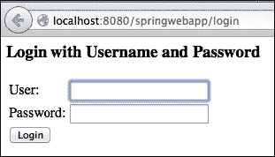
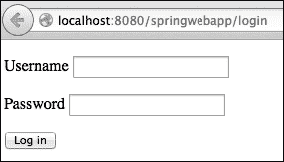

# 第六章 管理安全

在本章中，我们将介绍以下食谱：

+   启用 Spring Security

+   使用默认登录页面进行用户认证

+   使用自定义登录页面进行用户认证

+   使用数据库进行用户认证

+   添加注销链接

+   使用公共文件夹

+   仅授权具有特定角色的用户查看某些页面

+   在视图中仅向认证用户显示页面元素

+   在 Tomcat 中使用 HTTPS

# 简介

在本章中，我们将介绍使用**用户认证**、**用户授权**和**HTTPS**管理 Spring Web 应用程序安全性的基础知识。

用户认证是关于识别用户：通常是通过用户名和密码。用户授权是关于将角色分配给用户。这些角色随后在运行时用于确定用户是否被允许执行某个特定操作或查看某些特定内容。用户认证和授权由 Spring 处理。

HTTPS 主要是关于使用**安全套接字层**（**SSL**）加密我们的 Web 服务器与用户浏览器之间的通信。HTTPS 需要在服务器级别上启用。我们将看到如何使用 Tomcat 来实现这一点。

### 注意

第一个食谱**，** *启用 Spring Security*，是其他任何食谱正常工作的前提。

# 启用 Spring Security

要启用 Spring Security，您需要添加一些 Maven 依赖项。您还需要创建一些配置类。

## 如何做到这一点…

启用 Spring Security 的步骤如下：

1.  在`pom.xml`中添加 Spring Security 的 Maven 依赖项。请注意，版本号与 Spring Core 不同：

    ```java
    <dependency> 
        <groupId>org.springframework.security</groupId> 
        <artifactId>spring-security-web</artifactId> 
        <version>3.2.5.RELEASE</version> 
    </dependency> 

    <dependency> 
        <groupId>org.springframework.security</groupId> 
        <artifactId>spring-security-config</artifactId> 
        <version>3.2.5.RELEASE</version> 
    </dependency> 
    ```

1.  创建一个用于 Spring Security 配置的类：

    ```java
    @Configuration
    @EnableWebSecurity
    public class SecurityConfig extends WebSecurityConfigurerAdapter {
    }
    ```

1.  在`ServletInitializer`类中声明配置类：

    ```java
    public class ServletInitializer extends AbstractAnnotationConfigDispatcherServletInitializer {

        @Override
        protected Class<?>[] getRootConfigClasses() {
            return new Class[] {SecurityConfig.class};
        }

      ...
    ```

1.  添加一个实现`AbstractSecurityWebApplicationInitializer`的类以初始化 Spring Security 的 servlet 过滤器：

    ```java
    public class SecurityWebApplicationInitializer extends AbstractSecurityWebApplicationInitializer {
    }
    ```

## 它是如何工作的…

`SecurityWebApplicationInitializer`在幕后注册了一个 servlet 过滤器，该过滤器将处理对 Web 应用程序任何 URL 的访问。

`SecurityConfig`类将在启动时加载（因为其在`ServletInitializer`中的声明）。我们将在以下食谱中编写的 Spring 配置代码将放在`SecurityConfig`类中。

# 使用默认登录页面进行用户认证

Spring 使您能够轻松地为 Web 应用程序添加登录页面；只需在安全配置类中定义一些用户凭据（用户名和密码）。要访问任何页面，用户必须首先通过 Spring 的默认登录页面。



## 如何做到这一点…

在您的安全配置类中，添加一个包含硬编码用户凭据的`configureUsers()`方法：

```java
@Configuration
@EnableWebSecurity
public class SecurityConfig extends WebSecurityConfigurerAdapter {
    @Autowired
    public void configureUsers(AuthenticationManagerBuilder auth) throws Exception {
        auth.inMemoryAuthentication()
.withUser("user1").password("pwd").roles("USER")
    .and()
.withUser("admin").password("admin_pwd").roles("USER", "ADMIN");

    }
}
```

## 它是如何工作的…

在 `configureUsers()` 中，我们告诉 Spring 使用提供的用户凭据进行用户身份验证。我们为每个用户分配了角色。角色是一个任意的 `String` 对象。要使用这些角色进行授权，请参考 *仅授权具有特定角色的用户查看某些页面* 菜谱。

默认情况下，Spring 的默认登录页面将用于保护 Web 应用程序的所有页面。这是在 Spring Security 的默认 `configure()` 方法中定义的：

```java
protected void configure(HttpSecurity http) throws Exception { 
  http 
      .authorizeRequests() 
          .anyRequest().authenticated() 
      .and().formLogin()
      .and().httpBasic(); 
}
```

我们将在下面的菜谱中重写此方法，以定义自定义登录页面。

# 使用自定义登录页面进行用户身份验证

在本菜谱中，你将学习如何构建自己的登录表单，而不是使用 Spring 的默认登录表单。



## 如何操作...

这里是定义自定义登录页面的步骤：

1.  确保在 `pom.xml` 中声明了 JSTL Maven 依赖项：

    ```java
    <dependency> 
        <groupId>javax.servlet</groupId> 
        <artifactId>jstl</artifactId> 
        <version>1.2</version> 
    </dependency> 
    ```

1.  确保在 `AppConfig` 类中声明了 JSP 视图解析器：

    ```java
    @Bean 
    public ViewResolver jspViewResolver(){ 
        InternalResourceViewResolver resolver = new InternalResourceViewResolver(); 
        resolver.setViewClass(JstlView.class); 
        resolver.setPrefix("/WEB-INF/jsp/"); 
        resolver.setSuffix(".jsp"); 
        return resolver; 
    } 
    ```

1.  在控制器类中添加登录页面的控制器方法：

    ```java
    @Controller
    public class UserController {

      @RequestMapping("login") 
      public String login() { 
          return "login"; 
      }
    … 
    ```

1.  添加登录页面的 JSP：

    ```java
    <%@ page language="java" contentType="text/html; charset=UTF-8" pageEncoding="UTF-8"%>
    <%@ taglib prefix="c" uri="http://java.sun.com/jsp/jstl/core" %>
    <%@ taglib prefix="form" uri="http://www.springframework.org/tags/form" %>
    <%@ page isELIgnored="false" %>

    <c:url var="loginUrl" value="/login" />
    <form action="${loginUrl}" method="post">      
        <input type="hidden" name="${_csrf.parameterName}" value="${_csrf.token}"/>

        <c:if test="${param.error != null}">       
            <p>
                Invalid username and password.
            </p>
        </c:if>

        <p>
            <label for="username">Username</label>
            <input type="text" id="username" name="username"/> 
        </p>

        <p>
            <label for="password">Password</label>
            <input type="password" id="password" name="password"/> 
        </p>

        <button type="submit">Log in</button>
    </form>
    ```

1.  在 `SecurityConfig` 类中，重写 Spring 的默认 `configure()` 方法。声明自定义登录页面的 URL：

    ```java
    protected void configure(HttpSecurity http) throws Exception {
        http.authorizeRequests().anyRequest().authenticated();
        http.formLogin().loginPage("/login").permitAll();
    }
    ```

## 它是如何工作的...

在 `SecurityConfig` 类中，`configure()` 方法：

+   任何 URL 都需要身份验证：`anyRequest().authenticated()`

+   允许通过自定义登录页面进行用户身份验证：`formLogin().loginPage("/login")`

+   允许任何人访问登录页面：`loginPage("/login").permitAll();`

# 使用数据库进行用户身份验证

在本菜谱中，你将学习如何使用数据库中的用户凭据（用户名和密码）进行身份验证。

## 如何操作...

这里是使用数据库中的用户凭据进行身份验证的步骤：

1.  在 `pom.xml` 中添加 Spring JDBC Maven 依赖项：

    ```java
    <dependency> 
        <groupId>org.springframework</groupId> 
        <artifactId>spring-jdbc</artifactId> 
        <version>${spring.version}</version> 
    </dependency> 
    ```

1.  在数据库中创建 `users` 和 `authorities` 表：

    ```java
    create table users(
      username varchar(50) not null,
      password varchar(50) not null,
      enabled boolean not null default true,
      primary key (username)
    );

    create table authorities (
        username varchar(50) not null,
        authority varchar(50) not null,
        constraint fk_authorities_users foreign key(username) references users(username)
    );

    create unique index ix_auth_username on authorities (username,authority);    
    ```

1.  在数据库中添加用户及其角色：

    ```java
    insert into users (username, password) values ('user1','pwd1');
    insert into users (username, password) values ('user2','pwd2');

    insert into authorities (username, authority) values ('user1', 'ADMIN');
    insert into authorities (username, authority) values ('user2', 'ADMIN');
    ```

1.  在 `SecurityConfig` 类中，添加一个包含数据库连接详情的 `DataSource` bean：

    ```java
    @Bean 
    public DataSource dataSource() { 
            DriverManagerDataSource dataSource = new DriverManagerDataSource(); 

    dataSource.setDriverClassName("com.mysql.jdbc.Driver"); 
    dataSource.setUrl("jdbc:mysql://localhost:3306/db1"); 
            dataSource.setUsername("user1"); 
            dataSource.setPassword("pass1"); 

            return dataSource; 
    }
    ```

1.  在 `SecurityConfig` 类中，添加一个 `DataSourceTransactionManager` bean：

    ```java
    @Bean 
    public DataSourceTransactionManager transactionManager() { 
        DataSourceTransactionManager transactionManager = new DataSourceTransactionManager(); 
        transactionManager.setDataSource(dataSource()); 
        return transactionManager; 
    }
    ```

1.  在 `SecurityConfig` 类中，重写 Spring 的 `configure()` 方法：

    ```java
    @Autowired 
    public void configure(AuthenticationManagerBuilder auth) throws Exception { 
        auth.jdbcAuthentication() 
                .dataSource(dataSource()) 
                .usersByUsernameQuery( 
                        "select username,password,enabled from users where username=?") 
                .authoritiesByUsernameQuery( 
                        "select username,authority from authorities where username=?"); 
    } 
    ```

## 它是如何工作的...

通过重写 `configure()` 方法，Spring Security 将：

+   使用 JDBC 进行身份验证

+   使用提供的 `DataSource` bean 连接到数据库

+   执行这些 SQL 查询以获取用户及其角色

# 添加注销链接

在本菜谱中，你将学习如何添加 URL `/logout` 以允许用户注销。

## 如何操作...

在 `SecurityConfig` 类的 `configure()` 方法中，调用 `logout()` 方法和 `logoutRequestMatcher()` 方法来声明注销 URL：

```java
protected void configure(HttpSecurity http) throws Exception { 
  ...
  AntPathRequestMatcher pathRequestMatcher = new AntPathRequestMatcher("/logout");
  http.logout().logoutRequestMatcher(pathRequestMatcher); 
}
```

### 注意

使用 `org.springframework.security.web.util.` **matcher** `.AntPathRequestMatcher`，而不是已弃用的 `org.springframework.security.web.util.AntPathRequestMatcher` 类。

## 它是如何工作的...

当用户访问 URL `/logout` 时，用户将被注销。

# 使用公共文件夹

有些文件夹需要其内容在不进行认证的情况下可访问，例如，包含 CSS 文件的文件夹、包含 JavaScript 文件的文件夹和包含静态图像的文件夹。这些文件夹通常不包含机密信息，并且其中的一些文件可能是正确显示登录页面和网站公共页面所必需的。

## 如何做到这一点...

在安全配置类中，覆盖 `configure(WebSecurity web)` 方法以定义公共文件夹：

```java
@Override
public void configure(WebSecurity web) throws Exception {
    web
      .ignoring()
        .antMatchers("/css/**")
        .antMatchers("/js/**");
        .antMatchers("/img/**");
}
```

## 更多内容...

它们也可以在标准的 `configure()` 方法中定义：

```java
protected void configure(HttpSecurity http) throws Exception { 
  http.authorizeRequests() 
      .antMatchers("/css/**", "/js/**", "/img/**").permitAll()
      .anyRequest().authenticated(); 
}
```

这使得对这些文件夹的公开访问成为可能，但要求对任何其他请求进行认证。

# 仅授权具有特定角色的用户查看某些页面

有些页面只有少数用户应该被允许访问。例如，管理页面应该只对管理员用户可访问。这是通过将这些页面的 URL 与用户角色匹配来实现的，这些角色是在创建用户时定义的；请参阅 *使用默认登录页面进行用户认证* 和 *使用数据库进行用户认证* 的菜谱。

## 如何做到这一点...

在 `configure()` 方法中使用 `hasRole()` 方法：

```java
http.authorizeRequests() 
    .antMatchers("/admin/**").hasRole("ADMIN") 
    .anyRequest().authenticated(); 
```

## 它是如何工作的...

这允许只有具有 `ADMIN` 角色的用户访问以 `/admin` 路径开始的 URL。

# 在视图中仅向认证用户显示页面元素

在这个菜谱中，你将学习如何仅向认证用户显示页面的一些元素。例如，显示当前登录用户账户信息的摘要框。

## 如何做到这一点...

在 JSP 文件中使用 `<sec:authorize>` 标签为某些内容显示添加条件：

1.  在 `pom.xml` 中添加 Spring Security JSP 标签库的 Maven 依赖项：

    ```java
    <dependency>
      <groupId>org.springframework.security</groupId>
      <artifactId>spring-security-taglibs</artifactId>
      <version>3.2.5.RELEASE</version>
    </dependency>
    ```

1.  在 JSP 中声明标签库并使用 `<sec:authorize>`：

    ```java
    <%@ taglib prefix="sec" uri="http://www.springframework.org/security/tags" %>    

    <sec:authorize access="isAuthenticated()">
      Username: <sec:authentication property="principal.username" />
    </sec:authorize>
    ```

## 它是如何工作的...

`sec:authorize` 标签中的文本将仅对认证用户显示。我们使用了 `sec:authentication` 标签来显示当前登录用户的用户名。

## 更多内容...

要仅向未认证用户显示内容，请使用 `isAnonymous()` 函数：

```java
<sec:authorize access="isAnonymous()">
  This will be shown only to not-authenticated users.
</sec:authorize>
```

要仅向具有 `ADMIN` 角色的用户显示内容，请使用 `hasRole()` 函数。

```java
<sec:authorize access="hasRole('ADMIN')">
  This will be shown only to users who have the "ADMIN" authority.
</sec:authorize>
```

要向具有 `ADMIN` 角色或 `WARRIOR` 角色的用户显示内容，请使用 `hasAnyRole()` 函数。

```java
<sec:authorize access="hasAnyRole('ADMIN', 'WARRIOR')">
  This will be shown only to users who have the "ADMIN" or the "WARRIOR" authority.
</sec:authorize>
```

所有 Spring 表达式的完整列表可在以下位置找到：

[`docs.spring.io/spring-security/site/docs/3.0.x/reference/el-access.html`](http://docs.spring.io/spring-security/site/docs/3.0.x/reference/el-access.html)。

# 使用 Tomcat 与 HTTPS

要使用 HTTPS URL，不需要 Spring 配置，但需要在服务器上启用 HTTPS。在本菜谱中，我们将介绍如何为 Tomcat（在 Mac OS 或 Linux 上）使用自生成的 SSL 证书来完成此操作。对于生产环境，请记住使用真实的商业 SSL 证书。

## 如何做到这一点...

启用 Tomcat 的 HTTPS 的步骤如下：

1.  要生成 SSL 证书，打开终端并使用 `keytool` 命令创建 `certificate.bin`。在此示例中，证书用户名为 `admin`，密码为 `adminpass`：

    ```java
    keytool -genkey -alias admin -keypass adminpass -keystore certificate.bin -storepass adminpass
    ```

1.  接受默认值，除了最后一个问题，其答案应该是 `yes`：

    ```java
    What is your first and last name?
      [Unknown]:  
    What is the name of your organizational unit?
      [Unknown]:  
    What is the name of your organization?
      [Unknown]:  
    What is the name of your City or Locality?
      [Unknown]:  
    What is the name of your State or Province?
      [Unknown]:  
    What is the two-letter country code for this unit?
      [Unknown]:  
    Is CN=Unknown, OU=Unknown, O=Unknown, L=Unknown, ST=Unknown, C=Unknown correct?
      [no]:  yes

    ```

1.  将 `certificate.bin` 移动到 Tomcat 文件夹的根目录。

1.  在 `<tomcat_folder>/conf/server.xml` 中，取消注释以 `<Connector port="8443"` 开头的定义，并添加 `keystoreFile` 和 `keystorePass` 属性：

    ```java
    <Connector port="8443" protocol="HTTP/1.1" SSLEnabled="true"
               maxThreads="150" scheme="https" secure="true"
               clientAuth="false" sslProtocol="TLS"
               keystoreFile="certificate.bin" keystorePass="adminpass" />
    ```

1.  重新启动 Tomcat，并确保您的网络应用可以通过 HTTPS 在 `8443` 端口上访问：`https://localhost:8443`。

## 它是如何工作的...

我们已将 Tomcat 配置为使用自签名的 SSL 证书在 `8443` 端口上接受传入的 HTTPS 请求。大多数网络浏览器在显示页面之前会显示一个安全警告，因为 SSL 证书是自签名的。

## 还有更多...

`certificate.bin` 文件可以放在机器上的任何位置，只需在 `server.xml` 中使用绝对路径即可。

可以将端口号 `8443` 改为任何其他数字。

可以通过禁用通过纯 HTTP 的访问来仅使用 HTTPS；在 `server.xml` 中注释掉非 SSL 连接器。

有关 Tomcat 和 HTTPS/SSL 的更多信息，请访问 [`tomcat.apache.org/tomcat-8.0-doc/ssl-howto.html`](https://tomcat.apache.org/tomcat-8.0-doc/ssl-howto.html)。
