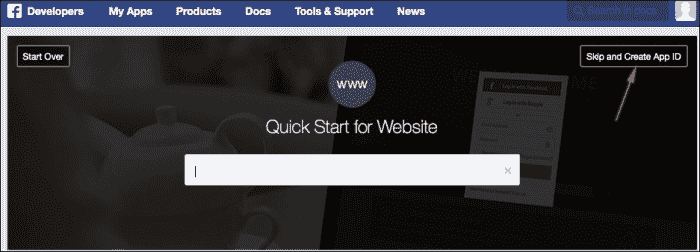
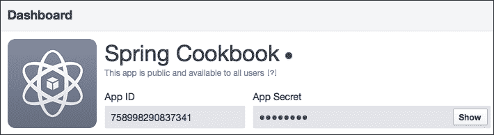
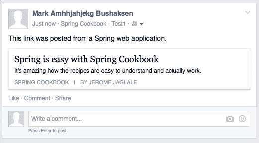
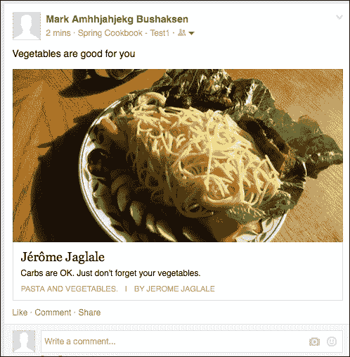
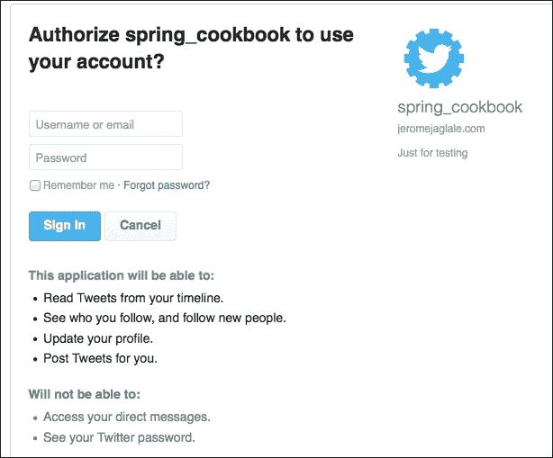

# 第十章。连接到 Facebook 和 Twitter

在本章中，我们将涵盖以下食谱：

+   创建 Facebook 应用程序

+   创建测试 Facebook 应用程序和测试用户

+   连接到 Facebook

+   获取 Facebook 用户的个人资料

+   获取 Facebook 用户的好友列表

+   发布 Facebook 状态更新

+   在 Facebook 上发布链接

+   在 Facebook 上发布自定义对象

+   创建 Twitter 应用程序

+   连接到 Twitter

+   获取用户的 Twitter 个人资料

+   获取 Twitter 用户的推文

+   在 Twitter 上发布推文

+   向另一个 Twitter 用户发送私信

# 简介

在本章中，我们将构建一个 Spring Web 应用程序，以便访问 Facebook 和 Twitter 账户，以实现以下功能：

+   获取用户数据，例如姓名、电子邮件、推文、帖子等

+   创建用户数据，例如推文、Facebook 帖子等

为了做到这一点，我们将使用 Spring Social，它简化了从 Spring Web 应用程序与社交网络交互；它帮助我们处理 OAuth 工作流程，并在幕后执行适当的 REST 请求。

# 创建 Facebook 应用程序

Web 应用程序只能通过 Facebook 应用程序访问 Facebook 账户。在本食谱中，我们将创建一个 Facebook 开发者账户并创建一个 Facebook 应用程序。我们将获得一个**App ID**和**App secret**，这两个字符串将用于在后续食谱中连接到 Facebook。

## 准备工作

登录您的 Facebook 账户。

## 如何操作…

这里是打开 Facebook 开发者账户并创建 Facebook 应用程序的步骤：

1.  前往[`developers.facebook.com/`](https://developers.facebook.com/)。

1.  在顶部导航中，在**My Apps**下选择**注册为开发者**。

1.  注册后，在顶部菜单中，在**Apps**下选择**添加新应用**。

1.  选择**Website**。

1.  点击窗口右上角的**跳过并创建 App ID**：

1.  填写表格并点击**创建 App ID**。

1.  在应用程序页面上找到显示的**App ID**和**App Secret**。

# 创建测试 Facebook 应用程序和测试用户

要与实际的 Facebook 用户一起工作，Facebook 应用程序需要经过一个审批流程；您必须提交一些截图、标志、描述和隐私政策。为了仅测试您的 Web 应用程序，请使用带有**测试用户**的**测试应用程序**跳过审批流程。Facebook 提供了一个方便的界面来创建它们。

## 准备工作

您需要一个现有的 Facebook 应用程序。请参阅之前的*创建 Facebook 应用程序*食谱。

## 如何操作…

这里是创建测试应用程序和测试用户的步骤：

1.  前往[`developers.facebook.com/apps`](https://developers.facebook.com/apps)。

1.  选择您现有的应用程序。

1.  在导航菜单的左侧选择**测试应用程序**。

1.  点击绿色的**创建测试应用程序**按钮。

1.  为您的测试应用程序输入一个名称并创建该应用程序。

1.  测试应用的**App ID**和**App Secret**显示出来。它们与原始应用不同。在您的 Spring Web 应用中使用它们以使用测试应用。

1.  在导航菜单的左侧，选择**角色**。选择**测试用户**选项卡，然后点击**添加**按钮。

1.  选择**4 个用户**。保留其他选项的默认值，然后点击**创建测试用户**。

1.  选择一个已创建的用户，点击**编辑**按钮，然后选择**更改此用户的名称或密码**。

1.  为用户选择一个密码，然后点击**保存**。

1.  再次点击同一测试用户的**编辑**按钮，并选择**管理此测试用户的朋友**。

1.  输入几个其他测试用户的名称，然后点击**保存**。

## 它是如何工作的...

我们为一名用户定义了一个密码，因此我们可以在以下配方中以该用户身份登录并授权我们的 Web 应用。

我们还为该用户添加了朋友，因此我们将能够测试*检索 Facebook 用户的朋友列表*配方。

# 连接到 Facebook

Facebook 允许通过**OAuth 工作流**访问用户账户；从我们的 Web 应用中，用户将被重定向到 Facebook 页面以授权我们的 Facebook 应用访问其账户。然后用户将被重定向回我们的 Web 应用。在这个配方中，我们将实现这个 OAuth 工作流。

## 准备工作

您需要一个现有的 Facebook 应用。参考*创建 Facebook 应用*和*创建测试 Facebook 应用和测试用户*配方。

我们将使用 JSP，所以请确保在您的`pom.xml`文件中声明了 Maven 对 JSTL 的依赖项，并在您的 Spring 配置类中声明了相应的`ViewResolver` bean。有关更多详细信息，请参阅第三章中的*使用 JSP 视图*配方，*使用控制器和视图*。

## 如何操作...

实现 Facebook OAuth 工作流的步骤如下：

1.  在`pom.xml`文件中添加 Spring Social 和 Spring Social Facebook 的 Maven 依赖项：

    ```java
    <dependency>
        <groupId>org.springframework.social</groupId>
        <artifactId>spring-social-core</artifactId>
        <version>1.1.0.RELEASE</version>
    </dependency>

    <dependency>
        <groupId>org.springframework.social</groupId>
        <artifactId>spring-social-web</artifactId>
        <version>1.1.0.RELEASE</version>
    </dependency>

    <dependency>
        <groupId>org.springframework.social</groupId>
        <artifactId>spring-social-config</artifactId>
        <version>1.1.0.RELEASE</version>
    </dependency>

    <dependency>
      <groupId>org.springframework.social</groupId>
      <artifactId>spring-social-facebook</artifactId>
      <version>1.1.1.RELEASE</version>
    </dependency>

    <dependency>
      <groupId>org.springframework.social</groupId>
      <artifactId>spring-social-facebook-web</artifactId>
      <version>1.1.1.RELEASE</version>
    </dependency>
    ```

1.  创建一个控制器类：

    ```java
    @Controller
    public class FacebookController {
    ...
    ```

1.  创建一个包含**App ID**和**App Secret**的 Facebook 登录方法，该方法将用户重定向到 Facebook 授权页面：

    ```java
    @RequestMapping("/fb/login")
    public void login(HttpServletResponse response) throws IOException {
      FacebookConnectionFactory connectionFactory = new FacebookConnectionFactory("759801647423672", "1b13515e931b0e2b4b9c620f72761e62");

      OAuth2Parameters params = new OAuth2Parameters();
      params.setRedirectUri ("http://localhost:8080/spring_webapp/fb/callback");
      params.setScope("public_profile");

      OAuth2Operations oauthOperations = connectionFactory.getOAuthOperations();
      String authorizeUrl = oauthOperations.buildAuthorizeUrl(params);

      response.sendRedirect(authorizeUrl);
    }
    ```

1.  创建回调 URL 的`callback`方法，用户登录 Facebook 后将被重定向到该 URL。使用从 Facebook 接收的授权代码参数，获取访问令牌并将其保存在会话中：

    ```java
    @RequestMapping("/fb/callback")
    public String callback(@RequestParam("code") String authorizationCode, HttpServletRequest request) {
      FacebookConnectionFactory connectionFactory = new FacebookConnectionFactory("759801647423672", "1b13515e931b0e2b4b9c620f72761e62");

      OAuth2Operations oauthOperations = connectionFactory.getOAuthOperations();
      AccessGrant accessGrant = oauthOperations.exchangeForAccess(authorizationCode, "http://localhost:8080/spring_webapp/fb/callback", null);

      String token = accessGrant.getAccessToken();
      request.getSession().setAttribute("facebookToken", token);

      return "redirect:/fb";
    }
    ```

1.  创建一个方法，如果使用会话中的访问令牌连接到 Facebook 成功，则显示 JSP。否则，它将用户重定向到登录 URL：

    ```java
    @RequestMapping("/fb")
    public String fb(HttpServletRequest request) {
      String accessToken = (String) request.getSession().getAttribute("facebookToken");

      Facebook facebook = new FacebookTemplate(accessToken);          
      if(facebook.isAuthorized()) {
        return "fb";
      }
      else {
        return "redirect:/fb/login";      
      }  
    }
    ```

1.  为前一个方法创建一个 JSP：

    ```java
    <%@ taglib prefix="c" uri="http://java.sun.com/jsp/jstl/core" %> 
    <%@ page isELIgnored="false" %>

    <html>
    <body>
        <p>Connected to Facebook</p>
    </body>
    </html>
    ```

1.  为了测试它是否工作，请从您的 Facebook 账户注销并转到`/fb`。您将被重定向到 Facebook。登录，授权应用，然后您将被重定向回 Web 应用。如果您使用的是测试应用，请记住使用测试用户的登录凭据。

## 它是如何工作的...

`login()`方法构建一个包含**App ID**（`https://www.facebook.com/login.php?api_key=759801647423672&redirect_uri=...`）的 Facebook 授权 URL，并将用户重定向到该 URL。

一旦用户授权了应用程序，他们将被重定向回我们的 Web 应用程序，到一个回调 URL `/fb/callback`，这是我们`login()`方法中提供的。 

```java
params.setRedirectUri ("http://localhost:8080/spring_webapp/fb/callback");
```

回调 URL 包含由 Facebook 提供的`code`参数。

在`callback()`方法中，我们将使用该授权代码来获取一个 OAuth 访问令牌，并将其存储在会话中。这是标准 OAuth 工作流程的一部分；访问令牌不会直接在回调 URL 中提供，因此它永远不会显示给用户。在我们的服务器上，需要**App Secret**（也永远不会显示给用户）从授权代码中获取令牌。

然后，我们将用户重定向到`/fb`。在`fb()`方法中，我们从会话中检索令牌，并使用它连接到 Facebook 用户的账户。

# 检索 Facebook 用户的资料

在本食谱中，您将学习如何检索 Facebook 用户的资料数据，一旦用户授权，这些数据将自动对应用程序可用。

## 准备工作

本食谱使用了*连接到 Facebook*食谱中的代码。

## 如何操作...

检索 Facebook 用户资料的步骤：

1.  在`FacebookController`类中，将 Model 参数添加到`fb()`方法：

    ```java
    @RequestMapping("/fb")
    public String fb(HttpServletRequest request, Model model) {
    ...
    ```

1.  在`if(facebook.isAuthorized())`块中，使用 Facebook 对象检索用户的资料：

    ```java
    FacebookProfile profile = facebook.userOperations().getUserProfile(); 
    ```

1.  将用户资料传递给 JSP 视图：

    ```java
    model.addAttribute("profile", profile); 
    ```

1.  在 JSP 中显示用户资料的详细信息：

    ```java
    id: ${profile.id}<br />
    username: ${profile.username}<br />
    name: ${profile.name}<br />
    gender: ${profile.gender}<br />
    email: ${profile.email}<br />
    birthday: ${profile.birthday}<br />
    hometown: ${profile.hometown}<br />
    ```

## 它是如何工作的...

在幕后，Spring Social 向[www.facebook.com](http://www.facebook.com)发送 REST HTTP 请求，并从响应中构建一个`FacebookProfile`对象。

## 更多内容...

要查看所有可用的字段列表，请直接查看`FacebookProfile`类。

用户资料的一些字段需要额外的权限才能访问：例如，电子邮件需要`email`权限。请参考下一食谱，我们将扩展授权请求的作用域参数。可用的权限完整列表可以在[`developers.facebook.com/docs/facebook-login/permissions/v2.2`](https://developers.facebook.com/docs/facebook-login/permissions/v2.2)找到。

# 检索 Facebook 用户朋友的列表

在本食谱中，您将学习如何从 Spring Web 应用程序中检索 Facebook 用户的联系人列表。

## 准备工作

本食谱使用了*连接到 Facebook*食谱中的代码。

## 如何操作...

检索 Facebook 用户朋友列表的步骤：

1.  在`FacebookController`类的`login()`方法中，将`user_friends`添加到`scope`参数：

    ```java
      params.setScope("public_profile, user_friends");
    ```

1.  将`Model`参数添加到`fb()`方法中：

    ```java
    @RequestMapping("/fb")
    public String fb(HttpServletRequest request, Model model) {
    ...
    ```

1.  在`if(facebook.isAuthorized())`块中，使用 Facebook 对象获取朋友的列表：

    ```java
    List<Reference> friendList = facebook.friendOperations().getFriends();
    ```

1.  检索每位朋友的资料：

    ```java
    List<FacebookProfile> friendProfileList = new LinkedList<FacebookProfile>();
    for (Reference friend : friendList) {
      FacebookProfile friendProfile = facebook.userOperations().getUserProfile(friend.getId());  
      friendProfileList.add(friendProfile);
    }
    ```

1.  将资料列表传递给 JSP 视图：

    ```java
    model.addAttribute("friendProfileList", friendProfileList); 
    ```

1.  在 JSP 中显示朋友的资料：

    ```java
    <c:forEach items="${friendProfileList}" var="profile">
      <h2>${profile.name}</h2>
      <p>
        id: ${profile.id}<br />
        name: ${profile.name}<br />
        gender: ${profile.gender}<br />
      </p>
    </c:forEach>
    ```

## 工作原理…

我们使用 `getFriends()` 获取了用户的朋友信息。这仅提供了他们的名字，因此我们使用了 `getUserProfile()` 来获取他们的公开资料。

我们将 `user_friends` 添加到 `scope` 参数，但用户可以选择阻止我们的 Facebook 应用访问他的/她的朋友列表。有关权限的更多信息，请访问 [`developers.facebook.com/docs/facebook-login/permissions/v2.3`](https://developers.facebook.com/docs/facebook-login/permissions/v2.3)。

# 发布 Facebook 状态更新

在本教程中，您将学习如何从 Spring 网络应用程序中在 Facebook 用户的个人时间轴上发布状态更新。

## 准备工作

本教程使用了 *连接到 Facebook* 教程中的代码。

## 如何操作…

在 Facebook 时间轴上发布状态更新的步骤如下：

1.  在 `FacebookController` 类的 `login()` 方法中，将 `publish_actions` 添加到 `scope` 参数：

    ```java
      params.setScope("public_profile, publish_actions");
    ```

1.  在 `fb()` 方法中，在 `if(facebook.isAuthorized())` 块中，使用 Facebook 对象发布状态更新：

    ```java
    facebook.feedOperations().updateStatus("This was posted from a Spring web application.");
    ```

# 发布链接到 Facebook

在本教程中，您将学习如何从 Spring 网络应用程序中在 Facebook 用户的个人时间轴上发布链接。

## 准备工作

本教程使用了 *连接到 Facebook* 教程中的代码。

## 如何操作…

在 Facebook 用户的个人时间轴上发布链接的步骤如下：

1.  在 `FacebookController` 类的 `login()` 方法中，将 `publish_actions` 添加到 `scope` 参数：

    ```java
      params.setScope("public_profile, publish_actions");
    ```

1.  在 `fb()` 方法中，在 `if(facebook.isAuthorized())` 块中，使用链接 URL、标题、副标题和描述创建一个 `FacebookLink` 对象：

    ```java
    FacebookLink link = new FacebookLink("http://jeromejaglale.com/",
        "Spring is easy with Spring Cookbook",
        "Spring Cookbook",
        "The recipes are understandable and actually work.");
    ```

1.  使用 Facebook 对象发布链接：

    ```java
    facebook.feedOperations().postLink("This link was posted from a Spring web application.", link);
    ```

1.  在您的浏览器中，转到 `/fb`。然后，转到用户的 Facebook 账户并验证链接是否已发布。

# 将自定义对象发布到 Facebook

在本教程中，您将学习如何从 Spring 网络应用程序中向 Facebook 用户的个人时间轴发布自定义对象。自定义对象是一个具有更多自定义选项的链接：图片、隐私和位置。在本教程中，我们将向链接添加图片。

## 准备工作

本教程使用了 *连接到 Facebook* 教程中的代码。

## 如何操作…

发布自定义对象的步骤如下：

1.  在 `FacebookController` 类的 `login()` 方法中，将 `publish_actions` 添加到 `scope` 参数：

    ```java
      params.setScope("public_profile, publish_actions");
    ```

1.  在 `fb()` 方法中，在 `if(facebook.isAuthorized())**)** 块中，使用 Facebook 对象创建一个 `PostData` 对象：

    ```java
    PostData postData = new PostData(facebook.userOperations().getUserProfile().getId());
    ```

1.  初始化自定义对象的各个字段：

    ```java
    postData.message("Vegetables are good for you.");
    postData.link("http://jeromejaglale.com");
    postData.caption("Pasta and vegetables");
    postData.description("Carbs are fine. Just don't forget your vegetables.");
    postData.picture("http://jeromejaglale.com/images/ photo/vancouver_summer_2007/aa_02_appetissant.JPG");
    ```

1.  使用 Facebook 对象发布自定义对象：

    ```java
    facebook.feedOperations().post(postData);
    ```

1.  在您的浏览器中，转到 `/fb`。然后，转到用户的 Facebook 账户并验证自定义对象是否已发布。

# 创建 Twitter 应用程序

一个网络应用只能通过 Twitter 应用来访问 Twitter 账户。在这个菜谱中，我们将创建一个 Twitter 应用。我们将获取一个**API 密钥**和一个**API 密钥**，这两个字符串将用于我们的网络应用在后续菜谱中连接到 Twitter。

## 准备工作

登录您的 Twitter 账户。

## 如何做…

1.  前往[`apps.twitter.com/`](https://apps.twitter.com/)。

1.  点击**创建新应用**。

1.  填写表格并创建您的应用。请注意，`localhost`不是**回调 URL**字段的合法域名，但 IP 地址是有效的。

1.  在您的应用页面上，在**设置**下，勾选**允许此应用用于通过 Twitter 登录**。

1.  在**密钥和访问令牌**下，复制**API 密钥**和**API 密钥**的值。您将在您的网络应用中使用它们来识别您的 Twitter 应用。

# 连接到 Twitter

Twitter 允许通过 OAuth 工作流程访问用户账户；从我们的网络应用开始，用户将被重定向到一个 Twitter 页面以授权 Twitter 应用以访问其账户。然后用户将被重定向回我们的网络应用。在这个菜谱中，我们将实现这个 OAuth 工作流程。

## 准备工作

您需要一个现有的 Twitter 应用。请参阅*创建 Twitter 应用菜谱*。

我们将使用 JSP，所以请确保在您的`pom.xml`文件中声明了 Spring Social 和 Spring Social Twitter 的 Maven 依赖项，并在您的 Spring 配置类中声明了相应的`ViewResolver` bean。有关更多详细信息，请参阅第三章中的*使用 JSP 视图*菜谱，*使用控制器和视图*。

## 如何做…

这里是实现 Twitter OAuth 工作流程的步骤：

1.  在`pom.xml`中添加 Spring Social 和 Spring Social Twitter 的 Maven 依赖项：

    ```java
    <dependency>
        <groupId>org.springframework.social</groupId>
        <artifactId>spring-social-core</artifactId>
        <version>1.1.0.RELEASE</version>
    </dependency>

    <dependency>
        <groupId>org.springframework.social</groupId>
        <artifactId>spring-social-web</artifactId>
        <version>1.1.0.RELEASE</version>
    </dependency>

    <dependency>
        <groupId>org.springframework.social</groupId>
        <artifactId>spring-social-config</artifactId>
        <version>1.1.0.RELEASE</version>
    </dependency>

    <dependency>
      <groupId>org.springframework.social</groupId>
      <artifactId>spring-social-twitter</artifactId>
      <version>1.1.0.RELEASE</version>
    </dependency>    
    ```

1.  创建一个控制器类：

    ```java
    @Controller
    public class TwitterController {
    ...
    ```

1.  创建一个包含您的 API 密钥和 API 密钥的 Twitter 登录方法，它将重定向到 Twitter 的授权页面：

    ```java
    @RequestMapping("/tw/login")
    public void login(HttpServletRequest request, HttpServletResponse response) throws IOException {
      TwitterConnectionFactory connectionFactory = new TwitterConnectionFactory("YtAG8npnZkUFDghkF2V3ykm0P", "RQ6hGGALfEaWGh6Vu03xcFtM1ibicW8IwSUBKaLG4drvVXXaay");
        OAuth1Operations oauthOperations = connectionFactory.getOAuthOperations();

        OAuthToken requestToken = oauthOperations.fetchRequestToken("http:// jeromejaglale.com:8080/spring_webapp/tw/callback", null);      
        request.getSession().setAttribute("requestToken", requestToken);
        String authorizeUrl = oauthOperations.buildAuthenticateUrl(requestToken.getValue(), OAuth1Parameters.NONE);

        response.sendRedirect(authorizeUrl);
    }
    ```

1.  创建一个`callback`方法，用户登录 Twitter 后会重定向到这里。使用从 Twitter 接收到的`oauth_verifier`参数以及`login()`请求中的请求令牌来获取访问令牌并将其保存在会话中：

    ```java
    @RequestMapping("/tw/callback")
    public String callback(String oauth_token, String oauth_verifier, HttpServletRequest request) {
      TwitterConnectionFactory connectionFactory = new TwitterConnectionFactory("YtAG8npnZkUFDghkF2V3ykm0P", "RQ6hGGALfEaWGh6Vu03xcFtM1ibicW8IwSUBKaLG4drvVXXaay");

      OAuthToken requestToken = (OAuthToken) request.getSession().getAttribute("requestToken");    
      OAuth1Operations oAuthOperations = connectionFactory.getOAuthOperations();
      OAuthToken token = oAuthOperations.exchangeForAccessToken(new AuthorizedRequestToken(requestToken, oauth_verifier), null);

      request.getSession().setAttribute("twitterToken", token);

      return "redirect:/tw";
    }
    ```

1.  创建一个方法，如果它成功连接到 Twitter，将显示一个 JSP。否则，它将重定向到登录 URL：

    ```java
    @RequestMapping("/tw")
    public String tw(HttpServletRequest request) {
      OAuthToken token = (OAuthToken) request.getSession().getAttribute("twitterToken");
      if(token == null) {
        return "redirect:/tw/login";      
      }

      TwitterConnectionFactory connectionFactory = new TwitterConnectionFactory("YtAG8npnZkUFDghkF2V3ykm0P", "RQ6hGGALfEaWGh6Vu03xcFtM1ibicW8IwSUBKaLG4drvVXXaay");
      Connection<Twitter> connection = connectionFactory.createConnection(token);
      Twitter twitter = connection.getApi();
      if( ! twitter.isAuthorized()) {
        return "redirect:/tw/login";      
      }

      return "tw";
    }
    ```

1.  为前一个方法创建一个 JSP：

    ```java
    <%@ taglib prefix="c" uri="http://java.sun.com/jsp/jstl/core" %> 
    <%@ page isELIgnored="false" %>
    <html>
    <body>
        <p>Connected to Twitter</p>
    </body>
    </html>
    ```

## 工作原理…

`login()`方法使用 API 密钥构建 Twitter 授权 URL 并将用户重定向到该 URL。



一旦用户授权了我们的 Twitter 应用，他们将被重定向回我们的网络应用，到一个我们提供的*回调 URL*，即`/tw/callback`，如下所示：

```java
OAuthToken requestToken = oauthOperations.fetchRequestToken("http://jeromejaglale.com:8080/ spring_webapp/tw/callback", null);
```

回调 URL 包含 Twitter 提供的`oauth_verifier`参数。

在`callback()`方法中，我们使用这个授权代码获取一个 OAuth 访问令牌，并将其存储在会话中。这是标准 OAuth 工作流程的一部分；令牌不是直接提供的，所以不会显示给用户。在我们的服务器上，需要应用程序密钥（也永远不会显示给用户）才能从授权代码中获取令牌。

然后我们将用户重定向到`/tw`。在`tw()`方法中，我们从会话中检索令牌，并使用它连接到用户的 Twitter 账户。

# 检索用户的 Twitter 个人资料

在这个菜谱中，你将学习如何检索用户的 Twitter 个人资料数据，一旦用户授权 Twitter 应用程序，这些数据将自动对 Twitter 应用程序可用。

## 准备工作

这个菜谱使用了`*Connecting to Twitter*`菜谱中的代码。

## 如何操作…

以下是检索 Twitter 用户个人资料数据的步骤：

1.  在`TwitterController`类中，向`tw()`方法添加一个`Model`参数：

    ```java
    @RequestMapping("/fw")
    public String fb(HttpServletRequest request, Model model) {
    ...
    ```

1.  在那个方法中，使用 Twitter 对象检索用户个人资料：

    ```java
    TwitterProfile profile = twitter.userOperations().getUserProfile();
    ```

1.  将用户个人资料传递给 JSP 视图：

    ```java
    model.addAttribute("profile", profile);
    ```

1.  在 JSP 中显示用户个人资料数据：

    ```java
    name: ${profile.name}<br />
    screenName: ${profile.screenName}<br />
    url: ${profile.url}<br />
    profileImageUrl: ${profile.profileImageUrl}<br />
    description: ${profile.description}<br />
    location: ${profile.location}<br />
    createdDate: ${profile.createdDate}<br />
    language: ${profile.language}<br />
    statusesCount: ${profile.statusesCount}<br />
    followersCount: ${profile.followersCount}<br />
    ```

# 检索 Twitter 用户的推文

在这个菜谱中，你将学习如何从 Spring Web 应用程序检索 Twitter 用户的最后推文。

## 准备工作

这个菜谱使用了`*Connecting to Twitter*`菜谱中的代码。

## 如何操作…

以下是检索 Twitter 用户最后推文的步骤：

1.  在`TwitterController`类中，向`tw()`方法添加一个`Model`参数：

    ```java
    @RequestMapping("/fw")
    public String fb(HttpServletRequest request, Model model) {
    ...
    ```

1.  在那个方法中，使用 Twitter 对象检索用户的推文：

    ```java
    List<Tweet> tweets = twitter.timelineOperations().getUserTimeline();
    ```

1.  将推文列表传递给 JSP 视图：

    ```java
    model.addAttribute("tweets", tweets);
    ```

1.  在 JSP 中显示推文列表：

    ```java
    <c:forEach items="${tweets}" var="tweet">
      <p>${tweet.text}</p>
    </c:forEach>
    ```

# 向 Twitter 发布推文

在这个菜谱中，你将学习如何从 Spring Web 应用程序代表用户发布推文。

## 准备工作

这个菜谱使用了`*Connecting to Twitter*`菜谱中的代码。

## 如何操作…

在`TwitterController`类中，在`tw()`方法中，使用 Twitter 对象发布推文。

```java
twitter.timelineOperations().updateStatus("Just a test");
```

# 向另一个 Twitter 用户发送私信

在这个菜谱中，你将学习如何从 Spring Web 应用程序向另一个 Twitter 用户发送私信。请注意，接收消息的用户必须是发送者的关注者。

## Getting Ready

这个菜谱使用了`*Connecting to Twitter*`菜谱中的代码。

## 如何操作…

在`**TwitterController**`类中，在`**tw()**`方法中，使用 Twitter 对象向另一个 Twitter 用户发送私信：

```java
twitter.directMessageOperations().sendDirectMessage("jeromejaglale", "Hey Jerome, I'm just testing your recipe.");
```
