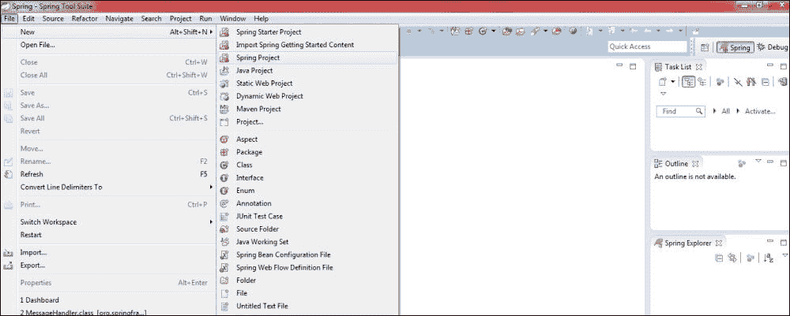
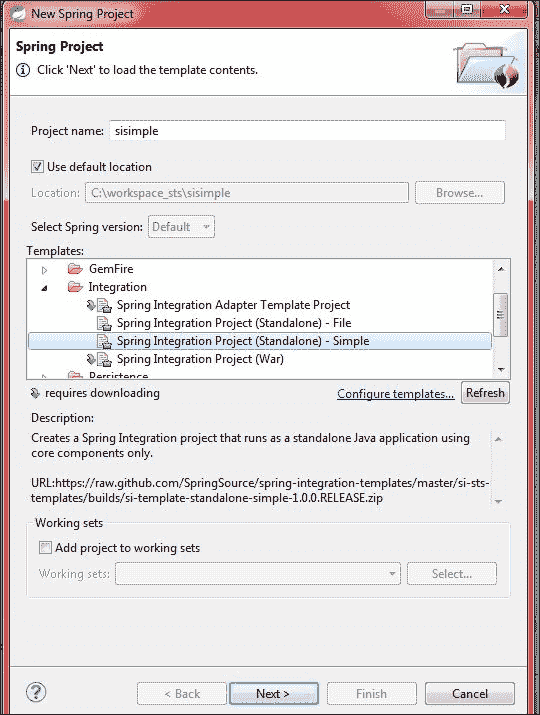
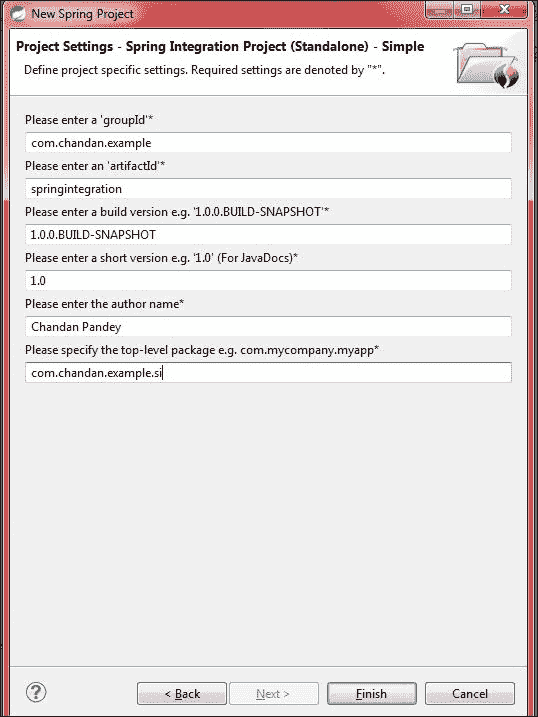
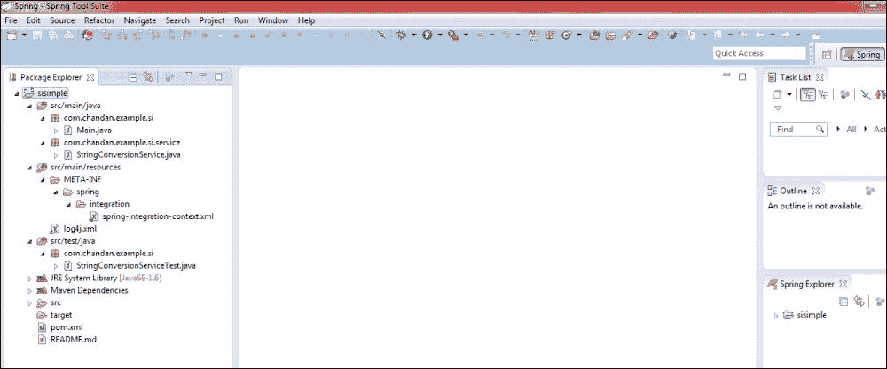
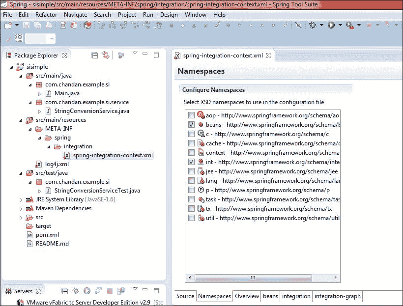
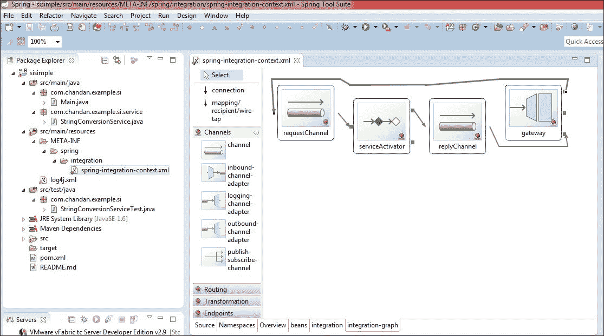
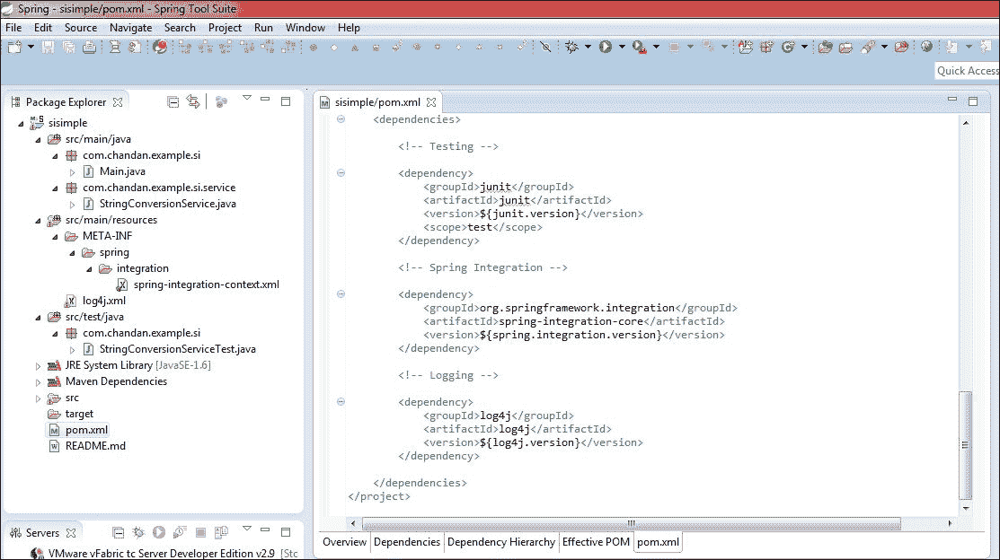

# 第一章：入门

在本章中，我们将设置我们的开发环境，并讨论如何最大限度地利用**SpringSource Tool Suite**（**STS**）。虽然任何流行的 Java 开发 IDE，如*Eclipse*、*intelliJ*、*NetBeans*和其他 IDE 都可以用于开发 Spring Integration 解决方案，但引领 Spring Integration 的公司 Pivotal 建议您使用基于 Eclipse 的**STS**。

# 设置 STS

STS 集成了许多现成的插件、可视化编辑器和其他特性，这些使得开发 Spring 驱动的企业应用变得容易。IDE 的外观和感觉与 Eclipse 非常相似。按照以下步骤安装 STS：

1.  JDK 1.6 及以上是必备条件，请从[`www.oracle.com/technetwork/java/javase/downloads/java-archive-downloads-javase6-419409.html`](http://www.oracle.com/technetwork/java/javase/downloads/java-archive-downloads-javase6-419409.html)下载并安装。

1.  按照文档中的说明设置`JAVA_HOME`属性：[`docs.oracle.com/cd/E19182-01/820-7851/inst_cli_jdk_javahome_t/index.html`](https://docs.oracle.com/cd/E19182-01/820-7851/inst_cli_jdk_javahome_t/index.html)。

1.  从[`spring.io/tools/sts`](http://spring.io/tools/sts)下载 STS。

1.  下载的文件是 ZIP 格式。解压到喜欢的文件夹，就绪。

1.  转到`<安装目录>\sts-bundle\sts-3.6.1.RELEASE`。`STS.exe`文件是启动 IDE 的可执行文件。

1.  这一步是可选的，但可以帮助编辑器高效运行——更改内存分配参数。找到`STS.ini`（与`STS.exe`在同一文件夹中）并将`Xmx`的值更改为 2 GB，例如`Xmx2048m`。

# 创建你的第一个项目

以下步骤将帮助你创建第一个项目：

1.  通过导航到**文件** | **Spring 项目**创建一个 Spring Integration 项目，如图所示：

1.  在模板部分，选择**Spring Integration Project - Simple**。提供一个项目名称，例如`sisimple`，如图所示：

1.  填写创建基于 Maven 的项目所需的信息，如图所示：

1.  点击**完成**，这将创建一个我们提供的名称（`sisimple`）的项目，如图所示：

这个项目尽可能简单。下面我们快速看一下生成的 Java 类：

+   `Main.java`：此文件位于路径：`/sisimple/src/main/java/com/chandan/example/si/`。它有主方法，并将用于运行这个示例。从包浏览器中右键点击此文件，然后点击**运行为** | **Java 应用程序**——这将启动程序。这个类有引导 Spring Integration 配置文件并加载其中定义的组件的代码。此外，它还将用户输入转换为大写。

+   `StringConversionService.java`：此文件位于路径：`/sisimple/src/main/java/com/chandan/example/si/service/`。这个服务接口用于将用户输入转换为大写。

+   `spring-integration-context.xml`：此文件位于路径：`/sisimple/src/main/resources/META-INF/spring/integration/`。这是 Spring Integration 的配置文件。它包含了基于 XML 的 Spring Integration 组件的声明。

+   `log4j.xml`：此文件位于路径：`/sisimple/src/main/resources/`。这是`Log4j`的配置文件。可以编辑此文件以控制日志级别、输出器以及其他与日志相关的内容。

+   `StringConversionServiceTest.java`：此文件位于路径：`/sisimple/src/test/java/com/chandan/example/si/`。这是`StringConversionService`的测试文件。这将用于运行针对服务类进行的测试。

+   `pom.xml`：这是用于 rmaven 依赖管理的文件，位于`/sisimple/`目录下。它包含了项目所用到的所有依赖项的条目。

在没有建立起一些理论概念的情况下，就解释这些类和配置文件中的每一个组件可能会有些繁琐和过于提前——我们将随着章节的推进，详细讨论每一个元素。

# STS 视觉编辑器

STS 提供了视觉方式来添加不同的命名空间。定位到`/sisimple/src/main/resources/META-INF/spring/integration/`下的`spring-integration-context.xml`并打开它。这是默认的 Spring 配置文件。点击**命名空间**标签来管理 Spring Integration 的不同命名空间。下面的截图显示了此示例项目的导入命名空间：

在同一个编辑器中，点击**Integration-graph**标签将打开一个视觉编辑器，可以用来添加、修改或删除 Spring Integration 的端点、通道和其他组件。下面的截图包含了我们示例项目的集成图：

让我们快速查看一下生成的 Maven POM 文件——总体来说，有三个依赖项；仅有一个是 Spring Integration 的，另外两个是*Junit*和*log4j*，如下面的截图所示：

# Spring Integration Scala DSL

该项目还处于非常早期的阶段，是一个孵化项目。Scala DSL 不应该与 Scala 中提供的其他 EIP 实现混淆——相反，它是建立在 Spring Integration 之上的，提供基于 DSL 的配置和流程管理。

### 注意

请访问[Spring Integration Scala DSL 官方博客](http://spring.io/blog/2012/03/05/introducing-spring-integration-scala-dsl/)和[GitHub 页面](https://github.com/spring-projects/spring-integration-dsl-groovy)。

# 摘要

在本章中，您学习了如何设置您的 IDE 并创建了一个基本项目。我们还尝试了 STS 的视觉编辑器，并简要介绍了即将到来的 Spring Integration 的 Scala DSL。我们将在后续章节中利用这些知识使用 STS 构建一个引人注目的 Spring Integration 应用程序。

在下一章中，我们将介绍如何在应用程序中摄取消息，然后是如何处理它们。
