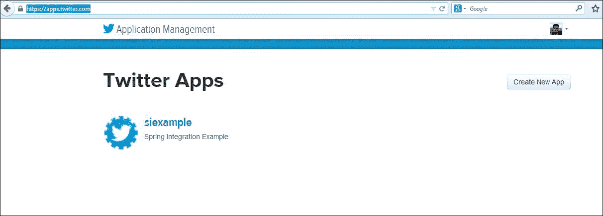
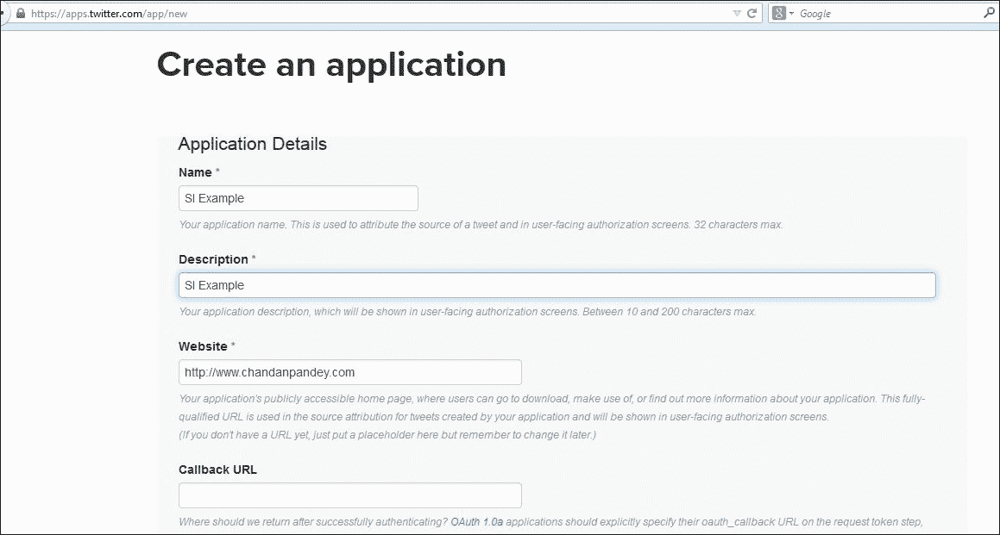
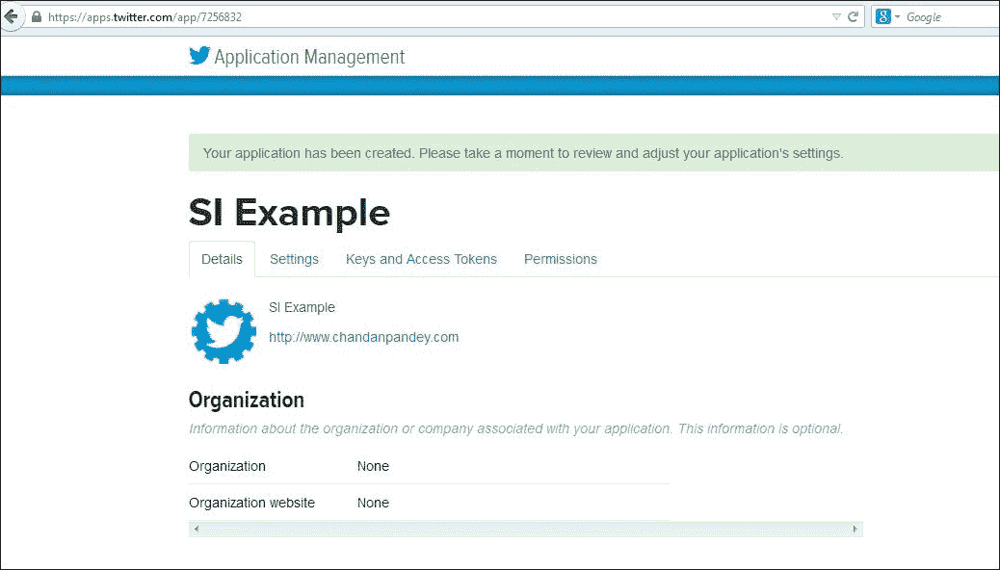
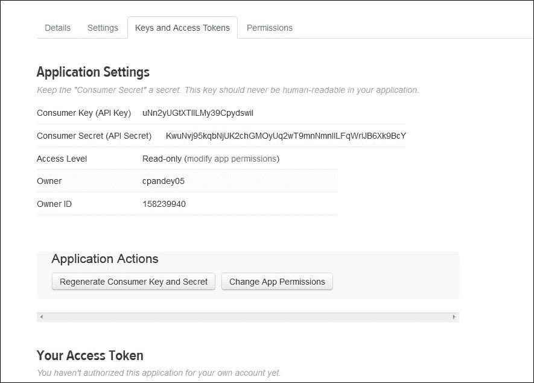
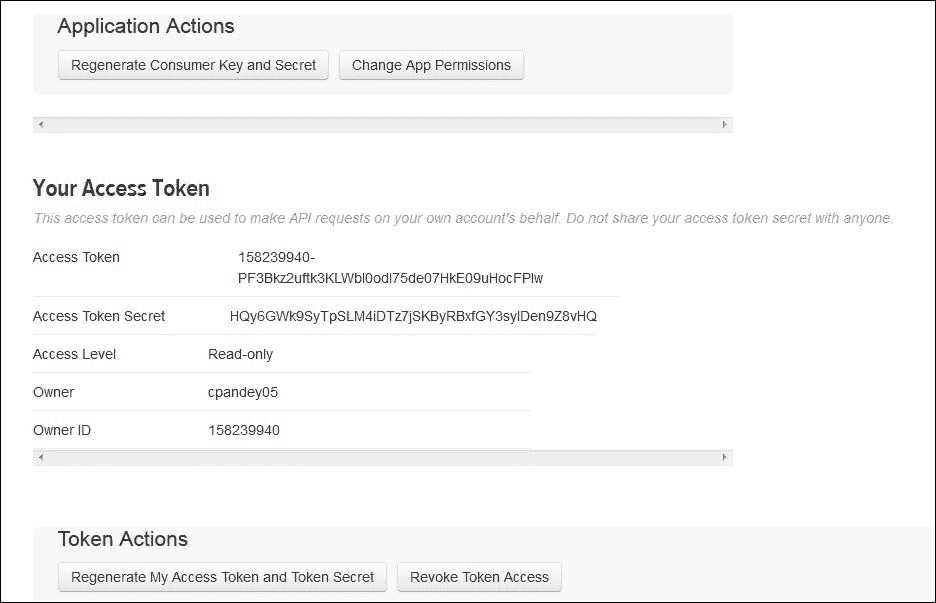
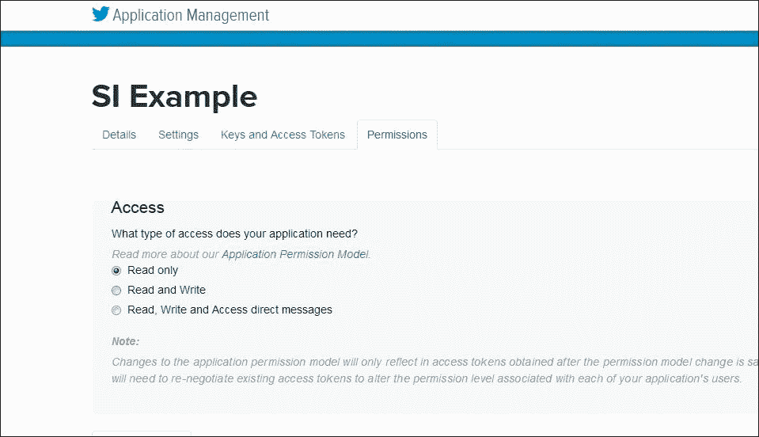

# 第六章：与外部系统的集成

在上一章中，我们讨论了帮助系统内部消息流转的 Spring Integration 组件。在本章中，让我们进一步拉动杠杆，看看 Spring Integration 在实际集成挑战方面有什么箱子。我们将涵盖 Spring Integration 对外部组件的支持，并详细介绍以下主题：

+   处理文件

+   FTP/FTPS 上的文件交换

+   社交集成

+   企业消息传递

+   调用和消费 HTTP 端点

+   网络服务

+   数据库集成

+   流式处理

# 处理文件

最常见且原始的通信方式之一就是通过文件。即使在数据库出现之后，文件系统仍未失去其相关性，我们经常需要处理它们——在遗留应用中，用于转储报告、共享位置等等。

那么，在 Java 中如何处理文件呢？获取文件句柄，打开一个流，对其进行操作，然后关闭它。一些琐碎的事情需要 10-15 行代码。但是，如果你忘记关闭流或者引用的文件已经被移除怎么办？代码行会随着我们处理所有角落案例而增加。Spring Integration 对文件支持非常好。它提供了适配器和网关，可以以最少的代码行处理文件读写操作。

## 先决条件

要使用前面提到的文件组件，我们需要以如下方式声明 Spring 命名空间支持和 Maven 入口：

+   命名空间支持可以通过使用以下代码片段添加：

    ```java
    xmlns:int-file 
      ="http://www.springframework.org/schema/integration/file"
    xsi:schemaLocation= 
    "http://www.springframework.org/schema/integration/file http://www.springframework.org/schema/integration/file/spring-integration-file.xsd">
    ```

+   通过使用以下代码片段添加 Maven 入口：

    ```java
    <dependency>
        <groupId>org.springframework.integration</groupId>
        <artifactId>spring-integration-file</artifactId>
        <version>${spring.integration.version}</version>
    </dependency>
    ```

我们现在可以开始编写我们的 Spring Integration 文件组件了。让我们讨论基于两种类型操作的 Spring 文件支持：读取文件和写入文件。

## 读取文件

Spring Integration 提供了一个适配器，可以从目录中读取文件，并将其作为`Message<File>`发布在通道上，供其他消费者消费。让我们看一个片段来了解它是如何配置的：

```java
<int-file:inbound-channel-adapter 
  id="fileAdapter" 
  directory="C:\Chandan\Projects\inputfolderforsi" 
  channel="filesOutputChannel" 
  prevent-duplicates="true" 
  filename-pattern="*.txt">
    <int:poller fixed-rate="1000" />
    <int-file:nio-locker/>
  </int-file:inbound-channel-adapter>
```

前面的配置足以从*目录*读取文件并将其放在指定的*通道*上。让我们看看这些元素：

+   `int-file:inbound-channel-adapter`：这是文件支持的命名空间

+   `directory`：这是要从中读取文件的目录

+   `channel`：这是应该写入文件的通道

+   `prevent-duplicates`：如果启用此选项，则在早期运行中已经拾取的文件不会再次拾取

+   `filename-pattern`：这是应拾取的文件的名字模式

+   `int:poller`：这是应该轮询文件的速度

+   `int-file:nio-locker`：如果有多个消费者，这将锁定文件，以防止同时选择相同的文件

您可能已经意识到，尽管配置简单，但很多事情都在幕后进行，例如防止重复、过滤文件、避免并发访问等。我们将详细讨论这些内容，但在那之前，让我们先看看为这个适配器幕后工作的类。

### 幕后

前一个示例中声明的适配器利用了`FileReadingMessageSource`，这是`MessageSource`的一个实现。它根据目录中的文件创建消息如下：

```java
<bean 
  id="pollableFileSource" 
  class="org.springframework.integration.file.
    FileReadingMessageSource" 
  p:directory="C:\Chandan\Projects\inputfolderforsi" />
```

在 bean 声明级别，我们可以注入过滤器、锁机制等——但由于我们使用 Spring Integration，它免去了我们在 bean 声明级别的工作。相反，我们可以使用 Spring Integration 暴露的适配器。

### 过滤器

过滤器是一个强大的概念，可以用来防止重复，根据名称模式选择文件，自定义读取的文件列表，以及在将所需内容呈现给下一个端点之前执行许多其他拦截。对于大多数常见任务，都有预定义的过滤器，但在 Spring 的精神下，我们也可以有自定义实现，并将它们注入由 Spring Integration 提供的适配器中。过滤器必须是`FileListFilter`的一个实例，默认使用的过滤器是`AcceptOnceFileListFilter`。此过滤器跟踪处理过的文件，但实现是在内存中。这意味着如果服务器在处理文件时重新启动，它将失去对已处理文件的跟踪，并将重新阅读相同的文件。为了解决这个问题，应使用`FileSystemPersistentAcceptOnceFileListFilter`的实例，通过利用`MetadataStore`实现来跟踪处理过的文件。

此外，文件名模式和`Reg Ex`过滤器可供使用，可以根据它们的名称或通过与指定的`Reg Ex`匹配来过滤文件。让我们通过一个快速示例来看看这两个过滤器的使用：

```java
<int-file:inbound-channel-adapter 
  id="filestest1"
  directory="file:${input.directory}"
  filename-pattern="testing*" />

<int-file:inbound-channel-adapter 
  id="filestest2"
  directory="file:${input.directory}"
  filename-regex="testing[0-9]+\.jpg" />
```

假设我们想要一个自定义过滤器，它可以很容易地被定义和使用。代码如下：

```java
public class CustomFilter implements FileListFilter<Feed> {
  public List< Feed > filterFiles(Feed [] feeds) {
    List< Feed > filteredList = new ArrayList< Feed >();
    // implement your filtering logic here
    return filteredList;
  }
}
```

### 防止重复

防止重复是过滤器的一个子集，用于过滤已经选择的文件。使用`prevent-duplicates`，我们可以指示适配器只查找唯一的文件。这里的唯一问题是，重复检查限于会话，因为读者不存储任何状态。如果读者重新启动，它将再次阅读所有文件——即使它们之前已经被阅读过。

### 并发访问

这是企业中具有多个消费者非常常见的用例，我们希望能够维护被消费文件的完整性。我们可以以下面这种方式使用`java.nio`锁来锁定文件，以确保它们不被并发访问：

```java
<int-file:inbound-channel-adapter 
  id="fileReader"
  directory="C:\Chandan\Projects\inputfolderforsi"  
  prevent-duplicates="true">
    <int-file:nio-locker/>
</int-file:inbound-channel-adapter>
```

这段代码并没有限制我们只能使用`java.nio.locker`。 Instead of using the `java.nio` locker, we can provide custom lockers as well:

```java
<int-file:inbound-channel-adapter 
  id="fileAdapter"
  directory="C:\Chandan\Projects\inputfolderforsi" 
  prevent-duplicates="true">
  <int-file:locker ref="customLocker"/>
</int-file:inbound-channel-adapter>
```

### 提示

解锁不是显式的。通过调用`FileLocker.unlock(File file)`来执行解锁；否则，在一段时间内会导致内存泄漏。

## 写文件

Spring Integration 提供了出站适配器，这是入站适配器的对立面。这意味着它从一个通道中消耗文件并将其写入一个目录。内部地，Spring Integration 使用`FileWritingMessageHandler`实例将消息写入文件系统，并且可以使用这个类的实现。这个类可以处理文件、字符串或字节数组有效载荷。像往常一样，没有必要使用低级类；相反，可以 spring 暴露的适配器和网关。让我们将出站适配器连接到写入文件的入站适配器通道：

```java
<int-file:outbound-channel-adapter 
  channel="filesOutputChannel" directory="C:\Chandan\Projects\outputfolderforsi" 
  delete-source-files="true"/>
```

让我们讨论每个元素代表的内容：

+   `int-file:outbound-channel-adapter`：为出站通道适配器提供文件命名空间支持

+   `channel`：这是文件将被写入作为 Spring Integration 消息的通道。

+   `directory`：这是从中选择文件的目录。

+   `delete-source-files`：如果将此设置为真，处理完文件后将会删除这些文件。

在写文件时，我们需要考虑诸如新文件的名字应该是什么，应该写入哪个目录，原始文件应该如何处理等问题。让我们快速触及这些方面。

### 命名文件

默认情况下，当文件写入目录时，文件名将被保留。然而，这可以通过提供`FileNameGenerator`实现来覆盖。这个类负责生成文件名——默认情况下`FileNameGenerator`查找与常量`FileHeaders.FILENAME`匹配的消息头。

### 目标目录

主要有三种方法来定位目标目录：

+   静态地定义一个目录属性，该属性将把每个消息导向一个固定的目录。

+   定义一个目录表达式属性，它应该是一个有效的**Spring 表达式语言**（**SpEL**）表达式。这个表达式对每个消息进行评估，并且可以使用消息头动态指定输出文件目录。该表达式必须解析为字符串或`java.io.File`，并且必须指向有效的目录。

+   最后一个选项是自动创建目录。如果目标目录缺失，它将会自动创建，包括其父目录。这是默认行为；要禁用此功能，将`auto-create-directory`属性设置为`false`。

### 处理现有文件名

如果正在写的文件已经存在怎么办？采取正确的途径是使用`mode`属性。以下四个选项中的一个可用：

+   `REPLACE`：这是默认模式。如果文件已存在，它将被简单地覆盖。

+   `APPEND`：这将把传入文件的内容追加到现有文件中。

+   `FAIL`：如果预期没有重复，应使用此模式。如果文件已存在，这将抛出`MessageHandlingException`。

+   `IGNORE`：如果目标文件存在时不需要采取任何操作，应使用此选项。

到目前为止，我们已经涵盖了文件系统的大多数方面。然而，如果我们想在将消息写入目录之后处理消息呢？Spring Integration 提供了一个出口网关，在这里可能很有用。让我们来看看这个简单的例子：

```java
<int-file:outbound-gateway 
  request-channel="filesOutputChannel"
  reply-channel="filesOutputChannelGateway"
  directory="C:\Chandan\Projects\outputfolderforsi\filegateway"
  mode="REPLACE" delete-source-files="true"/>
```

标签与输出适配器的标签相同；区别在于它将文件放置在由`reply-channel`指定的通道上以供进一步处理。

让我们编写一个简单的服务激活器来处理这些文件：

```java
<int:service-activator 
  id="fileSa" 
  ref="commonServiceActivator"
  method="printFileName" input-channel="filesOutputChannelGateway"/>
```

### 文件转换器

文件转换器用于将从一个文件读取的数据转换为对象，反之亦然。Spring Integration 提供了一些常见的转换器，如文件到字节、文件到字符串等，但我们可以随时扩展框架接口以定义更高级和适当的文件转换器。

让我们用一个快速讨论来结束本节，讨论一些由 spring 提供的隐式文件转换器。让我们从这个例子开始：

```java
<int-file:file-to-bytes-transformer  
  input-channel="input" 
  output-channel="output"
  delete-files="true"/>

<int-file:file-to-string-transformer 
  input-channel="input" 
  output-channel="output"
  delete-files="true" 
  charset="UTF-8"/>
```

如前面的片段所示，Spring Integration 为大多数常见用例提供了隐式转换器，如文件到字节和文件到字符串。转换器不仅限于这两个用例——可以通过实现转换器接口或扩展`AbstractFilePayloadTransformer`来定义自定义转换器。

# FTP/FTPS

**FTP**，或**文件传输协议**，用于跨网络传输文件。FTP 通信由两部分组成：服务器和客户端。客户端与服务器建立会话后，它可以下载或上传文件。Spring Integration 提供了作为客户端的组件，并连接到 FTP 服务器与其通信。那么服务器——它将连接到哪个服务器？如果您有访问任何公共或托管 FTP 服务器的机会，请使用它。否则，尝试本节中示例的最简单方法是设置 FTP 服务器的本地实例。本 book 中的 FTP 设置超出了范围。

## 先决条件

要使用 Spring Integration 组件进行 FTP/FTPS，我们需要在我们的配置文件中添加一个命名空间，然后在`pom.xml`文件中添加 Maven 依赖项。应进行以下操作：

+   可以通过使用以下代码片段添加命名空间支持：

    ```java
    xmlns:int-ftp=
      "http://www.springframework.org/schema/integration/ftp"
    xsi:schemaLocation=
      "http://www.springframework.org/schema/integration/ftp
    http://www.springframework.org/schema/integration/ftp/spring-integration-ftp.xsd"
    ```

+   可以通过使用以下代码片段添加 Maven 条目：

    ```java
      <dependency>
        <groupId>org.springframework.integration</groupId>
        <artifactId>spring-integration-ftp</artifactId>
        <version>${spring.integration.version}</version>
      </dependency>
    ```

一旦命名空间可用并且 JAR 已下载，我们就可以使用这些组件了。如前所述，Spring Integration 的客户端组件需要与 FTP 服务器建立会话。会话的详细信息封装在会话工厂中；让我们看看一个会话工厂配置示例：

```java
<bean id="ftpClientSessionFactory"
  class="org.springframework.integration.ftp.session.DefaultFtpSessionFactory">
  <property name="host" value="localhost"/>
  <property name="port" value="21"/>
  <property name="username" value="testuser"/>
  <property name="password" value="testuser"/>
</bean>
```

`DefaultFtpSessionFactory`类在此处工作，并接受以下参数：

+   运行 FTP 服务器的宿主机。

+   服务器正在运行的端口

+   用户名

+   服务器的密码

会话池为工厂维护，当需要时返回一个实例。Spring 负责验证永远不会返回过期的会话。

## 从 FTP 服务器下载文件

入站适配器可用于从服务器读取文件。最重要的方面是我们在上一节中讨论的会话工厂。以下代码片段配置了一个 FTP 入站适配器，从远程目录下载文件并使其可用于处理：

```java
<int-ftp:inbound-channel-adapter 
  channel="ftpOutputChannel"
  session-factory="ftpClientSessionFactory"
  remote-directory="/"
  local-directory="C:\\Chandan\\Projects\\siexample\\ftp\\ftplocalfolder"
  auto-create-local-directory="true"
  delete-remote-files="true"
  filename-pattern="*.txt"
  local-filename-generator-expression="#this.toLowerCase() + '.trns'">
  <int:poller fixed-rate="1000"/>
</int-ftp:inbound-channel-adapter> 
```

让我们快速浏览一下此代码中使用的标签：

+   `int-ftp:inbound-channel-adapter`：这是 FTP 入站适配器的命名空间支持。

+   `channel`：下载的文件将被作为消息放在这个通道上。

+   `session-factory`：这是一个封装了连接服务器详细信息的工厂实例。

+   `remote-directory`：这是适配器应该监听文件新到达的服务器目录。

+   `local-directory`：这是下载文件应该被倾倒的本地目录。

+   `auto-create-local-directory`：如果启用，如果缺失，将创建本地目录结构。

+   `delete-remote-files`：如果启用，下载成功后将在远程目录上删除文件。这将有助于避免重复处理。

+   `filename-pattern`：这可以用作过滤器，但只有与指定模式匹配的文件才会被下载。

+   `local-filename-generator-expression`：这可以用来自动生成本地文件名。

入站适配器是一个特殊的监听器，监听远程目录上的事件，例如，在创建新文件时触发的事件。此时，它将启动文件传输。它创建一个类型为`Message<File>`的有效负载，并将其放在输出通道上。默认情况下，保留文件名，并在本地目录中创建与远程文件同名的新文件。这可以通过使用`local-filename-generator-expression`来覆盖。

### 未完成文件

在远程服务器上，可能还有一些文件正在被写入的过程中。通常，它们的扩展名是不同的，例如，`filename.actualext.writing`。避免读取未完成文件的最佳方法是使用文件名模式，只复制那些已经完全写入的文件。

## 将文件上传到 FTP 服务器

```java
server's remote directory. The remote server session is determined as usual by the session factory. Make sure the username configured in the session object has the necessary permission to write to the remote directory. The following configuration sets up a FTP adapter that can upload files in the specified directory:
```

```java
  <int-ftp:outbound-channel-adapter channel="ftpOutputChannel"
    remote-directory="/uploadfolder"
    session-factory="ftpClientSessionFactory"
    auto-create-directory="true">
  </int-ftp:outbound-channel-adapter>
```

以下是对使用标签的简要描述：

+   `int-ftp:outbound-channel-adapter`：这是 FTP 出站适配器的命名空间支持。

+   `channel`：这是要写入远程服务器的通道的名称。

+   `remote-directory`：这是文件将被放置的远程目录。会话工厂中配置的用户必须有适当的权限。

+   `session-factory`：这封装了连接 FTP 服务器的详细信息。

+   `auto-create-directory`：如果启用，这将会在远程目录缺失时自动创建，并且给定的用户应该有足够的权限。

通道上的载荷不一定是文件类型；它可以是以下之一：

+   `java.io.File`：一个 Java 文件对象。

+   `byte[]`：这是一个代表文件内容的字节数组。

+   `java.lang.String`：这是代表文件内容的文本。

### 避免部分写入的文件

远程服务器上的文件只有在完全写入时才可用，而不是当它们还是部分写入时。Spring 使用将文件写入临时位置的机制，并且仅在文件完全写入后才发布其可用性。默认情况下，后缀被写入，但可以通过使用`temporary-file-suffix`属性来更改它。可以通过将`use-temporary-file-name`设置为`false`来完全禁用它。

## FTP 出站网关

网关，按定义，是一个双向组件：它接受输入并提供一个用于进一步处理的结果。那么 FTP 的输入和输出是什么？它向 FTP 服务器发出命令并返回命令的结果。以下命令将向服务器发出带有`–l`选项的`ls`命令。结果是一个包含每个文件名的字符串对象的列表，这些文件将被放在`reply-channel`上。代码如下：

```java
<int-ftp:outbound-gateway id="ftpGateway"
    session-factory="ftpClientSessionFactory"
    request-channel="commandInChannel"
    command="ls"
    command-options="-1"
    reply-channel="commandOutChannel"/>
```

标签相当简单：

+   `int-ftp:outbound-gateway`：这是 FTP 出站网关的命名空间支持。

+   `session-factory`：这是用于连接 FTP 服务器的细节的包装器。

+   `command`：这是要发出的命令。

+   `command-options`：这是命令的选项。

+   `reply-channel`：这是命令的响应，放在这个通道上。

## FTPS 支持

为了支持 FTPS，需要做的只是更改工厂类——应使用`org.springframework.integration.ftp.session.DefaultFtpsSessionFactory`的实例。注意`DefaultFtpsSessionFactory`中的`s`。一旦使用这个工厂创建了会话，它就准备好通过安全通道进行通信。以下是安全会话工厂配置的示例：

```java
<bean id="ftpSClientFactory"
  class="org.springframework.integration.ftp.session.DefaultFtpsSessionFactory">
  <property name="host" value="localhost"/>
  <property name="port" value="22"/>
  <property name="username" value="testuser"/>
  <property name="password" value="testuser"/>
</bean>
```

虽然这很显然，但我还是要提醒你，FTP 服务器必须配置为支持安全连接并打开适当的*端口*。

# 社交集成

当今任何应用程序如果它不提供对社交消息的支持就不完整。Spring Integration 为许多社交接口提供内置支持，例如电子邮件、Twitter 提要等等。本节我们将讨论 Twitter 的实现。在 2.1 版本之前，Spring Integration 依赖于 Twitter4J API 进行 Twitter 支持，但现在它利用 Spring 的社交模块进行 Twitter 集成。Spring Integration 提供了一个接口，用于接收和发送推文以及搜索和发布搜索结果的消息。Twitter 使用`oauth`进行身份验证。应用程序必须在开始开发 Twitter 之前进行注册。

## 先决条件

在我们可以在 Spring Integration 示例中使用 Twitter 组件之前，需要完成以下步骤：

+   **Twitter 账户设置：**需要一个 Twitter 账户。执行以下步骤以获取允许用户使用 Twitter API 的密钥：

    1.  访问[`apps.twitter.com/`](https://apps.twitter.com/)。

    1.  登录到您的账户。

    1.  点击**创建新应用**。

    1.  输入诸如**应用程序名称**、**描述**、**网站**等信息。所有字段都是自解释的，也提供了适当的帮助。字段**网站**的值不必须是有效的——在正确的格式中输入一个任意的网站名称。

    1.  点击**创建您的应用程序**按钮。如果应用程序创建成功，将显示确认消息，并且将出现**应用程序管理**页面，如下所示：

    1.  转到**密钥和访问令牌**标签，并记下**应用程序设置**下的**消费者密钥（API 密钥）**和**消费者密钥密钥（API 密钥密钥）**的详细信息，如下面的屏幕截图所示：

    1.  你需要额外的访问令牌，这样应用程序才能使用 Twitter 的 API。点击**创建我的访问令牌**；生成这些令牌需要一点时间。一旦生成，记下**访问令牌**和**访问令牌密钥**的值。

    1.  转到**权限**标签，并提供**读取、写入**和**访问直接消息**的权限。

        完成所有这些步骤后，再加上所需的密钥和访问令牌，我们就可以使用 Twitter 了。让我们将这些信息存储在`twitterauth.properties`属性文件中：

        ```java
        twitter.oauth.apiKey= lnrDlMXSDnJumKLFRym02kHsy
        twitter.oauth.apiSecret= 6wlriIX9ay6w2f6at6XGQ7oNugk6dqNQEAArTsFsAU6RU8F2Td
        twitter.oauth.accessToken= 158239940-FGZHcbIDtdEqkIA77HPcv3uosfFRnUM30hRix9TI
        twitter.oauth.accessTokenSecret= H1oIeiQOlvCtJUiAZaachDEbLRq5m91IbP4bhg1QPRDeh
        ```

正如我提到的，模板封装了所有的值。以下是参数的顺序：

+   `apiKey`

+   `apiSecret`

+   `accessToken`

+   `accessTokenSecret`

所有设置就绪后，我们现在做一些实际的工作：

+   可以通过使用以下代码片段来添加命名空间支持：

    ```java
    <beans xmlns=
      "http://www.springframework.org/schema/beans"
      xmlns:xsi=
      "http://www.w3.org/2001/XMLSchema-instance"
      xmlns:int=
      "http://www.springframework.org/schema/integration"
      xmlns:int-twitter=
      "http://www.springframework.org/schema/integration/twitter"
      xsi:schemaLocation=
      "http://www.springframework.org/schema/integration http://www.springframework.org/schema/integration/spring-integration.xsd
      http://www.springframework.org/schema/beans http://www.springframework.org/schema/beans/spring-beans.xsd
      http://www.springframework.org/schema/integration/twitter http://www.springframework.org/schema/integration/twitter/spring-integration-twitter.xsd">
    ```

+   可以通过使用以下代码片段来添加 Maven 入口：

    ```java
    <dependency>
      <groupId>org.springframework.integration</groupId>
      <artifactId>spring-integration-twitter</artifactId>
      <version>${spring.integration.version}</version>
    </dependency>
    ```

## 接收推文

此代码中的组件如下所述：

+   `int-twitter:inbound-channel-adapter`：这是 Twitter 的入站通道适配器的命名空间支持。

+   `twitter-template`：这是最重要的方面。Twitter 模板封装了要使用哪个账户轮询 Twitter 网站。前面代码片段中给出的详细信息是虚构的；它应该用真实的连接参数替换。

+   `channel`: 消息会被投放到这个频道。

这些适配器进一步用于其他应用程序，例如搜索消息、接收直接消息以及接收提到您账户的推文等。让我们快速查看这些适配器的代码片段。我不会深入每个细节；它们与之前讨论的几乎相同。

+   **搜索**：此适配器有助于搜索查询标签中配置的参数的推文。代码如下：

    ```java
    <int-twitter:search-inbound-channel-adapter id="testSearch"
      twitter-template="twitterTemplate"
      query="#springintegration"
      channel="twitterSearchChannel">
    </int-twitter:search-inbound-channel-adapter>
    ```

+   **获取直接消息**：此适配器允许我们接收使用中账户的直接消息（在 Twitter 模板中配置的账户）。代码如下：

    ```java
    <int-twitter:dm-inbound-channel-adapter id="testdirectMessage"
      twitter-template="twiterTemplate"
      channel="twitterDirectMessageChannel">
    </int-twitter:dm-inbound-channel-adapter>
    ```

+   **获取提及消息**：此适配器允许我们通过 `@用户` 标签（在 Twitter 模板中配置的账户）接收提到配置账户的消息。代码如下：

    ```java
    <int-twitter:mentions-inbound-channel-adapter id="testmentionMessage"
      twitter-template="twiterTemplate"
      channel="twitterMentionMessageChannel">
    </int-twitter:mentions-inbound-channel-adapter>
    ```

## 发送推文

Twitter 暴露出站适配器以发送消息。以下是一个示例代码：

```java
  <int-twitter:outbound-channel-adapter
    twitter-template="twitterTemplate"
    channel="twitterSendMessageChannel"/>
```

无论什么消息放在 `twitterSendMessageChannel` 频道上，都会通过此适配器发布推文。与入站网关类似，出站网关也提供发送直接消息的支持。以下是一个出站适配器的简单示例：

```java
<int-twitter:dm-outbound-channel-adapter 
  twitter-template="twitterTemplate" 
  channel="twitterSendDirectMessage"/>
```

任何放在 `twitterSendDirectMessage` 频道上的消息都会直接发送给用户。但是，消息将要发送给哪个用户的名字在哪里？它由消息中的一个头 `TwitterHeaders.DM_TARGET_USER_ID` 决定。这可以通过编程方式填充，或使用丰富器或 SpEL。例如，可以通过以下方式编程添加：

```java
Message message = MessageBuilder.withPayload("Chandan")
  .setHeader(TwitterHeaders.DM_TARGET_USER_ID, "test_id").build();
```

Alternatively, it can be populated by using a header enricher, as follows: 通过使用头丰富器，如下所示：

```java
<int:header-enricher input-channel="twitterIn"
  output-channel="twitterOut">
  <int:header name="twitter_dmTargetUserId" value=" test_id "/>
</int:header-enricher>
```

## Twitter 搜索出站网关

由于网关提供双向窗口，搜索出站网关可用于发出动态搜索命令并接收结果作为集合。如果没有找到结果，集合为空。让我们配置一个搜索出站网关，如下所示：

```java
  <int-twitter:search-outbound-gateway id="twitterSearch"
    request-channel="searchQueryChannel" 
    twitter-template="twitterTemplate" 
    search-args-expression="#springintegration" 
    reply-channel="searchQueryResultChannel"/>
```

以下代码标签的含义：

+   `int-twitter:search-outbound-gateway`: 这是 Twitter 搜索出站网关的命名空间。

+   `request-channel`: 用于将搜索请求发送到这个网关的频道。

+   `twitter-template`：这是 Twitter 模板引用

+   `search-args-expression`：此参数用于查询标签中的搜索

+   `reply-channel`：在这个频道上填充搜索结果。

这让我们有足够的内容开始使用 Spring 框架的社会整合方面。

# 企业消息传递

没有 JMS 的企业景观是不完整的——它是企业集成中最常用的媒介之一。Spring 为此提供了非常好的支持。Spring Integration 在此基础上构建，为接收和消费来自许多中间件代理（如 ActiveMQ、RabbitMQ、Rediss 等）的消息提供了适配器和网关。

Spring Integration 提供入站和出站适配器，用于发送和接收消息，同时还提供了网关，这些网关可以在请求/回复场景中使用。让我们更详细地了解这些实现。预计需要对 JMS 机制及其概念有一个基本了解。在这里甚至连 JMS 的介绍都不可能涵盖。让我们从先决条件开始。

## 先决条件

要使用 Spring Integration 消息组件、命名空间和相关 Maven，应添加以下依赖项：

+   可以通过使用以下代码片段来添加命名空间支持：

    ```java
    xmlns: int-jms= 
      "http://www.springframework.org/schema/integration/jms"
      xsi:schemaLocation="http://www.springframework.org/schema/integration/jms http://www.springframework.org/schema/integration/jms/spring-integration-jms.xsd">
    ```

+   可以通过以下代码片段提供 Maven 入口：

    ```java
    <dependency>
      <groupId>org.springframework.integration</groupId>
      <artifactId>spring-integration-jms</artifactId>
      <version>${spring.integration.version}</version>
    </dependency>
    ```

在添加这两个依赖之后，我们就准备好使用组件了。但在我们可以使用适配器之前，我们必须配置一个底层消息代理。让我们配置 ActiveMQ。在`pom.xml`中添加以下内容：

```java
  <dependency>
    <groupId>org.apache.activemq</groupId>
    <artifactId>activemq-core</artifactId>
    <version>${activemq.version}</version>
    <exclusions>
      <exclusion>
        <artifactId>spring-context</artifactId>
        <groupId>org.springframework</groupId>
      </exclusion>
    </exclusions>
  </dependency>
  <dependency>
    <groupId>org.springframework</groupId>
    <artifactId>spring-jms</artifactId>
    <version>${spring.version}</version>
    <scope>compile</scope>
  </dependency>
```

在此之后，我们准备创建一个连接工厂和 JMS 队列，这些队列将由适配器用于通信。首先，创建一个会话工厂。正如您将注意到的，这被包裹在 Spring 的`CachingConnectionFactory`中，但底层提供者是 ActiveMQ：

```java
<bean id="connectionFactory" class="org.springframework.jms.connection.CachingConnectionFactory">
  <property name="targetConnectionFactory">
    <bean class="org.apache.activemq.ActiveMQConnectionFactory">
      <property name="brokerURL" value="vm://localhost"/>
    </bean>
  </property>
</bean>
```

让我们创建一个队列，以便用于检索和放置消息：

```java
<bean 
  id="feedInputQueue" 
  class="org.apache.activemq.command.ActiveMQQueue"> 
  <constructor-arg value="queue.input"/>
</bean>
```

现在，我们准备从队列中发送和接收消息。让我们逐一查看每个消息。

## 接收消息——入站适配器

Spring Integration 提供两种接收消息的方式：轮询和事件监听器。它们都基于 Spring 框架对 JMS 的全面支持。轮询适配器使用`JmsTemplate`，而事件驱动适配器使用`MessageListener`。正如名称所示，轮询适配器会不断轮询队列以等待新消息的到来，如果找到消息，则将其放入配置的通道中。另一方面，在事件驱动适配器的情况下，通知配置适配器是服务器的责任。

### 轮询适配器

让我们从一个代码示例开始：

```java
<int-jms:inbound-channel-adapter 
  connection-factory="connectionFactory" 
  destination="feedInputQueue" 
  channel="jmsProcessedChannel"> 
  <int:poller fixed-rate="1000" />
</int-jms:inbound-channel-adapter>
```

```java
`int-jms:inbound-channel-adapter`: This is the namespace support for the JMS inbound adapter`connection-factory`: This is the encapsulation for the underlying JMS provider setup, such as ActiveMQ`destination`: This is the JMS queue where the adapter is listening for incoming messages`channel`: This is the channel on which incoming messages should be put
```

有一个轮询器元素，因此很明显它是一个基于轮询的适配器。它可以通过两种方式之一进行配置：通过提供 JMS 模板或使用连接工厂和目标。我使用了后者的方法。前面的适配器在目标中提到了一个轮询队列，一旦它收到任何消息，它就会将消息放入`channel`属性中配置的通道中。

### 事件驱动的适配器

与轮询适配器类似，事件驱动适配器也需要引用实现`AbstractMessageListenerContainer`接口的类或需要一个连接工厂和目的地。再次，我将使用后一种方法。这是一个示例配置：

```java
<int-jms:message-driven-channel-adapter 
  connection-factory="connectionFactory"
  destination="feedInputQueue"
  channel="jmsProcessedChannel"/>
```

这里没有轮询器子元素。一旦消息到达其目的地，适配器就会被调用，将其放入配置的通道。

## 发送消息——出站适配器

出站适配器将通道上的消息转换为 JMS 消息，并将其放入配置的队列中。为了将 Spring Integration 消息转换为 JMS 消息，出站适配器使用`JmsSendingMessageHandler`。这是一个`MessageHandler`的实现。出站适配器应该使用`JmsTemplate`或与目的地队列一起配置连接工厂。与前面的示例保持一致，我们将采用后一种方法，如下所示：

```java
<int-jms:outbound-channel-adapter
  connection-factory="connectionFactory"
  channel="jmsChannel"
  destination="feedInputQueue"/>
```

这个适配器接收来自`jmsChannel`的 Spring Integration 消息，将其转换为 JMS 消息，并将其放入目标地。

## 网关

网关提供请求/回复行为，而不是单向发送或接收。例如，在发送消息后，我们可能期望有一个回复，或者在接收到消息后我们可能想发送一个确认。

### 入站网关

入站网关在预期请求回复功能时提供了入站适配器的替代方案。入站网关是一个基于事件的实现，监听队列上的消息，将其转换为 Spring `Message`，并将其放入通道。这是一个示例代码：

```java
<int-jms:inbound-gateway 
  request-destination="feedInputQueue"
  request-channel="jmsProcessedChannel"/>
```

然而，这就是入站适配器所做的——甚至配置也很相似，除了命名空间。那么区别在哪里呢？区别在于回复回复目的地。一旦消息放入通道，它将沿着线路传播，在某个阶段会产生一个回复并作为确认发送回来。当入站网关接收到这个回复时，将创建一个 JMS 消息并将其放回回复目的地队列。那么，回复目的地在哪里呢？回复目的地以下列方式之一决定：

1.  原始消息有一个属性`JMSReplyTo`，如果存在，它具有最高的优先级。

1.  入站网关寻找一个配置好的默认回复目的地，它可以作为名称或直接引用通道。为了将通道作为直接引用指定默认回复目的地，应使用 default-reply-destination 标签。

如果网关找不到前面两种方法中的任何一种，它将抛出一个异常。

### 出站网关

在预期有回复的发送消息场景中应使用出站网关。让我们从一个例子开始：

```java
<int-jms:outbound-gateway 
  request-channel="jmsChannel"
  request-destination="feedInputQueue"
  reply-channel="jmsProcessedChannel" />
```

前面的配置将消息发送到`request-destination`。当收到确认时，它可以从配置的`reply-destination`中获取。如果没有配置`reply-destination`，将创建 JMS `TemporaryQueues`。

# HTTP

Spring Integration 提供了访问外部 HTTP 服务以及将 HTTP 服务暴露给外部应用程序的支持。

## 先决条件

让我们添加一个命名空间和相关 Maven 依赖项，以便在我们的应用程序中可以使用 Spring Integration 的 HTTP 组件：

+   可以使用以下代码片段添加命名空间支持：

    ```java
    <beans xmlns=
      "http://www.springframework.org/schema/beans"
      xmlns:xsi=
      "http://www.w3.org/2001/XMLSchema-instance"
      xmlns:int=
      "http://www.springframework.org/schema/integration"
      xmlns:int-http=
      "http://www.springframework.org/schema/integration/http"
      xsi:schemaLocation=
      "http://www.springframework.org/schema/beans http://www.springframework.org/schema/beans/spring-beans.xsd
      http://www.springframework.org/schema/integration http://www.springframework.org/schema/integration/spring-integration.xsd
      http://www.springframework.org/schema/integration/http http://www.springframework.org/schema/integration/http/spring-integration-http.xsd">
    ```

+   可以通过以下代码添加 Maven 条目：

    ```java
      <dependency>
        <groupId>org.springframework.integration</groupId>
        <artifactId>spring-integration-http</artifactId>
        <version>${spring.integration.version}</version>
      </dependency>
      <dependency>
        <groupId>org.springframework</groupId>
        <artifactId>spring-webmvc</artifactId>
        <version>${spring.version}</version>
      </dependency>   
    ```

## HTTP 入站网关

入站网关将 HTTP 服务暴露给外部世界，例如，基于 REST 的 Web 服务。应用程序必须部署在 Jetty 或 Tomcat 等 Web 容器中，以便入站适配器或网关正常工作。实现入站组件的最简单方法是使用 Spring 的`HttpRequestHandlerServlet`类，并在`web.xml`文件中定义它。这是一个示例条目：

```java
<servlet>
  <servlet-name>inboundGateway</servlet-name>
  <servlet-class> o.s.web.context.support.HttpRequestHandlerServlet 
  </servlet-class>
</servlet>
```

或者，我们可以使用 spring MVC 支持。这是我们示例中使用的方法；让我们来看看`web.xml`文件：

```java
<?xml version="1.0" encoding="UTF-8"?>
<web-app    xsi:schemaLocation="http://java.sun.com/xml/ns/javaee http://java.sun.com/xml/ns/javaee/web-app_2_5.xsd" id="WebApp_ID" version="2.5">
  <display-name>testhttpinbound</display-name>
  <servlet>
    <servlet-name>testhttpinbound</servlet-name>
    <servlet-class>org.springframework.web.servlet.DispatcherServlet</servlet-class>
    <init-param>
      <param-name>contextConfigLocation</param-name>
      <param-value>/WEB-INF/http-inbound-config.xml</param-value>
    </init-param>
    <load-on-startup>1</load-on-startup>
  </servlet>
  <servlet-mapping>
    <servlet-name>testhttpinbound</servlet-name>
    <url-pattern>/*</url-pattern>
  </servlet-mapping>
</web-app>
```

`org.springframework.web.servlet.DispatcherServlet`类是一个标准的 Spring MVC 控制器。请注意配置参数，`http-inbound-config.xml`。这是将包含网关声明的文件：

```java
<int-http:inbound-gateway 
  request-channel="receiveChannel" 
  path="receiveGateway" 
  supported-methods="GET"/>
```

此代码中使用的组件在以下子弹点中解释：

+   `int-http:inbound-gateway`: 这是对 HTML 网关的命名空间支持。

+   `request-channel`: 这会将传入的请求负载放入通道中。

+   `path`：这是对外来请求暴露的路径。

+   `supported-methods`: 这是一个用逗号分隔的支持方法列表，这些方法使用 HTTP 协议。

在以下代码中，服务激活器监听输入通道上的负载并在入站网关发送响应之前对其进行修改：

```java
<int:service-activator 
  input-channel="receiveChannel" 
  expression="payload + ' hmm, you get what you give!!'"/>
```

`HttpMessageConverter`可以用来将`HttpServletRequest`转换为`Messages`。网关元素根据它是否只需要返回一个响应（例如 200 成功）还是需要返回一个带有视图的响应，产生不同的实例。如果响应是一个视图，它产生一个`HttpRequestHandlingController`实例。否则，它产生一个`HandlingMessagingGateway`实例。要渲染视图，可以使用 Spring MVC 支持的任何视图渲染技术。

对于只需要确认请求成功的请求，可以使用适配器而不是网关：

```java
<int-http:inbound-channel-adapter 
  channel="testchannel" 
  supported-methods="GET,POST" 
  name="/test" 
  view-name="testMessageView" />
```

## HTTP 出站网关

出站网关用于调用由外部 HTTP 组件发布的服务。让我们用我们之前的例子来测试这个。创建一个包含入站网关的应用程序 war，并在容器中部署它。我们可以使用以下出站网关示例来调用 HTTP 请求：

```java
<int-http:outbound-gateway 
  request-channel="outboundRequestChannel" url="http://localhost:8080/httpinbound/receiveGateway"
  http-method="GET"
  expected-response-type="java.lang.String"/>
```

此代码中使用的组件在以下子弹点中解释：

+   `int-http:outbound-gateway`: 这是对 HTTP 出站网关的命名空间支持。

+   `channel`: 根据这个通道上的消息，它将尝试击中 URL。

+   `url`：这是对外部 URL 的请求。

+   `http-method`：这指定了在发送请求时应使用哪些 HTTP 方法

+   `expected-response-type`：这是期望的响应类型（默认情况下，它是`String`）

除了网关，还可以使用适配器。唯一的区别是适配器不会在回复通道上发送响应。在幕后，出站适配器使用 Spring 框架的`RestTemplate`。以下代码片段添加了出站适配器：

```java
<int-http:outbound-channel-adapter 
  id="feedAdapter" 
  url=" http://localhost:8080/httpinbound/receiveGateway" 
  channel="feedUpdates" 
  http-method="POST"/>
```

# Web 服务

HTTP 适配器和网关为基于 REST 的 Web 服务提供支持，但 Spring Integration 还支持基于 XML 的 Web 服务，如 SOAP。入站适配器或网关用于创建和暴露 Web 服务端点，而出站适配器或网关用于调用外部服务。Spring Integration 对 Web 服务的支持建立在 spring `ws` 项目之上。我不会涵盖 spring `ws` 或任何特定的 SOAP 细节，如`wsdl`、头部、正文或负载。相反，我们将展示 Spring Integration 封装器。

## 前提条件

可以通过包含以下命名空间和 Maven 依赖项来添加 Web 服务支持：

+   可以使用以下代码片段添加命名空间支持：

    ```java
    <beans xmlns=
      "http://www.springframework.org/schema/beans"
      xmlns:xsi=
      "http://www.w3.org/2001/XMLSchema-instance"
      xmlns:int=
      "http://www.springframework.org/schema/integration"
      xmlns:int-ws=
      "http://www.springframework.org/schema/integration/ws"
      xsi:schemaLocation=
      "http://www.springframework.org/schema/integration/ws http://www.springframework.org/schema/integration/ws/spring-integration-ws.xsd
      http://www.springframework.org/schema/integration http://www.springframework.org/schema/integration/spring-integration.xsd
      http://www.springframework.org/schema/beans http://www.springframework.org/schema/beans/spring-beans.xsd">
    ```

+   可以通过以下代码添加 Maven 条目：

    ```java
      <dependency>
        <groupId>org.springframework.integration</groupId>
        <artifactId>spring-integration-xml</artifactId>
        <version>${spring.integration.version}</version>
      </dependency>
      <dependency>
        <groupId>org.springframework.integration</groupId>
        <artifactId>spring-integration-ws</artifactId>
        <version>${spring.integration.version}</version>
      </dependency> 
      <dependency>
        <groupId>com.sun.xml.messaging.saaj</groupId>
        <artifactId>saaj-impl</artifactId>
        <version>${saaj.version}</version>
      </dependency>
      <dependency>
        <groupId>javax.activation</groupId>
        <artifactId>activation</artifactId>
        <version>${javax-activation.version}</version>
      </dependency>
    ```

## 入站网关

入站网关将暴露一个 SOAP 服务以处理外部请求，然后将其转换为消息并发布到通道。需要一个前端控制器来拦截请求并将它们传递给配置的网关；它是`org.springframework.ws.transport.http.MessageDispatcherServlet`的一个实例。这应该在`web.xml`文件中进行配置：

```java
<?xml version="1.0" encoding="ISO-8859-1" standalone="no"?>
<web-app   version="2.4" xsi:schemaLocation="http://java.sun.com/xml/ns/j2ee http://java.sun.com/xml/ns/j2ee/web-app_2_4.xsd">
  <description>ws-inbound-webservice</description>

<servlet> 
  <servlet-name>springwsinbound</servlet-name> 
  <servlet-class>
    org.springframework.ws.transport.http.MessageDispatcherServlet
  </servlet-class>
  <init-param>
    <param-name>contextConfigLocation</param-name>
    <param-value>
      WEB-INF/ws-inbound-config.xml
    </param-value>
  </init-param>
  <load-on-startup>1</load-on-startup>
</servlet>

  <servlet-mapping>
    <servlet-name>springwsinbound</servlet-name>
    <url-pattern>/testwsservice</url-pattern>
  </servlet-mapping>

  <welcome-file-list>
    <welcome-file>index.html</welcome-file>
  </welcome-file-list>

</web-app>
```

必须提供一个`org.springframework.ws.server.EndpointMapping`的实现来将 servlet 与端点之间进行映射。这可以在 Java 配置类或属性文件中进行配置。让我们将其放在属性文件中并将其作为`contextConfigLocation`注入：

```java
<bean class=
  "org.springframework.ws.server.endpoint.mapping.UriEndpointMapping">
  <property name="defaultEndpoint" ref="ws-inbound-gateway"/>
</bean>
```

`org.springframework.ws.server.endpoint.mapping.UriEndpointMapping`类执行 servlet 到`Message`的映射。

之后，我们有服务激活器，它可以改变响应或对其执行一些操作：

```java
  <int:channel id="input"/>

  <int-ws:inbound-gateway 
    id="ws-inbound-gateway" 
request-channel="input"/>

  <int:service-activator 
    input-channel="input">
    <bean class="com.cpandey.siexample.TestWsInbound"/>
  </int:service-activator>
```

## 出站网关

这甚至更容易；出站网关可以接受一个 URI 并调用服务，如下所示：

```java
<int-ws:outbound-gateway
  uri=" http://www.w3schools.com/webservices/tempconvert.asmx"
  request-channel=" fahrenheitChannel" 
  reply-channel="responses" />
```

在前面的代码中，应该在`request-channel`上放置一个有效的 SOAP 负载；这将由网关用来调用配置的服务。响应的负载发布在`reply-channel`上。以下是一个调用前面服务的示例代码片段：

```java
ClassPathXmlApplicationContext context =
  new ClassPathXmlApplicationContext("/META-INF/spring/integration/temperatureConversion.xml");

DestinationResolver<MessageChannel> channelResolver = new BeanFactoryChannelResolver(context);

// Compose the XML message according to the server's schema

String requestXml =
  "<FahrenheitToCelsius 
  xmlns=\"http://www.w3schools.com/webservices/\">" +
  "    <Fahrenheit>90.0</Fahrenheit>" +
  "</FahrenheitToCelsius>";

// Create the Message object
Message<String> message = MessageBuilder.withPayload(requestXml).build();

// Send the Message to the handler's input channel
MessageChannel channel = channelResolver.resolveDestination("fahrenheitChannel");
channel.send(message);
```

# 数据库 SQL

很难想象没有数据库的企业应用程序；它是最古老和最常用的桥接机制之一。Spring Integration 提供了从数据库读取和写入数据库的支持。再次，这种支持是基于 Spring 框架对数据库支持的基础之上的。它提供了入站和出站适配器、网关，甚至还有针对存储过程的特定适配器。让我们来看看其中的一些，其他的可以使用相同的模式。

## 先决条件

在讨论如何使用 Spring Integration 的数据库支持之前，让我们添加必要的命名空间和 Maven 依赖项：

+   可以通过以下代码片段添加命名空间支持：

    ```java
    xmlns:int-jdbc=
    "http://www.springframework.org/schema/integration/jdbc"
    xmlns:jdbc=
    "http://www.springframework.org/schema/jdbc"
    xsi:schemaLocation="
    http://www.springframework.org/schema/integration/jdbc
    http://www.springframework.org/schema/integration/jdbc/spring-integration-jdbc.xsd
    http://www.springframework.org/schema/jdbc http://www.springframework.org/schema/jdbc/spring-jdbc.xsd>
    ```

+   可以通过以下代码片段添加 Maven 入口：

    ```java
      <dependency>
        <groupId>org.springframework.integration</groupId>
        <artifactId>spring-integration-jdbc</artifactId>
        <version>${spring.integration.version}</version>
      </dependency>
    ```

### 数据源

在我们可以使用组件之前，我们需要定义一个数据源。数据源是一个封装数据库连接细节的包装器。以下是一个针对内存数据库 H2 的示例数据源：

```java
<jdbc:embedded-database id="dataSource" type="H2"/>
```

为了简单起见，我将使用一个内存数据库。但这与 Spring Integration 无关；可以为 Spring 支持的任何数据库配置数据源。在`pom.xml`中包含以下依赖项，以使用内存数据库：

```java
  <dependency>
    <groupId>com.h2database</groupId>
    <artifactId>h2</artifactId>
    <version>1.3.168</version>
  </dependency>
```

现在，我们已经准备好了数据源。让我们用一些测试数据来初始化它；再次，Spring 提供了易于使用的组件，可以在几行配置中完成我们的任务：

```java
<jdbc:initialize-database data-source="dataSource" ignore-failures="DROPS">
  <jdbc:script location="classpath:H2DB-DropScript.sql" />
  <jdbc:script location="classpath:H2DB-CreateScript.sql" />
  <jdbc:script location="classpath:H2DB-InsertScript.sql" />
</jdbc:initialize-database>
```

有了前面的配置，我们现在可以探索 Spring 提供的适配器、网关和其他组件。

## 从数据库读取——入站适配器

入站适配器需要一个对`JdbcTemplate`或数据源的引用。我们将坚持使用数据源。它的任务是从数据库中读取数据，并将结果放置在指定的通道上。默认情况下，消息载荷是整个结果集，表示为一个列表。可以通过定义`RowMapper`策略来更改结果集类型，Spring 为此提供了支持：

```java
<int-jdbc:inbound-channel-adapter channel="printSqlResult"
  data-source="dataSource"
  query="select * from PEOPLE where name = 'Chandan'"
  update="update PEOPLE set name = 'ChandanNew' where name = 'Chandan'">
</int-jdbc:inbound-channel-adapter>
```

```java
`int-jdbc:inbound-channel-adapter`: This is the namespace support for the inbound channel adapter`data-source`: This is a reference to the datasource that encapsulates database connection details`query`: This is the query to be fired`update`: This is any update query to be fired that can be used to avoid duplicate processing
```

此配置将连接到数据源中配置的数据库。在我们这个案例中，它是一个内存数据库，即 H2。它将执行查询并发出更新。结果将被放置在配置的通道上。在下一轮轮询周期中，当我们想要过滤掉已经处理过的记录时，更新查询非常有用。

### 事务支持

入站适配器的事务支持可以与轮询器一起包装：

```java
<int-jdbc:inbound-channel-adapter 
  query="somequery"
  channel="testChannel" 
  data-source="dataSource" update="someupdate">
    <int:poller fixed-rate="1000">
      <int:transactional/>
    </int:poller>
</int-jdbc:inbound-channel-adapter>
```

当事务作为轮询器的子元素时，查询和更新将在同一个事务中执行。应该定义一个有效的事务管理器；这与 Spring Integration 无关。相反，应该定义基于 Spring 的实体管理器和事务管理器（这与 Spring Integration 无关；相反，这是标准的 Spring 数据库支持内容）。代码如下：

```java
<bean id="transactionManager" 
  class=
  "org.springframework.orm.jpa.JpaTransactionManager">
  <constructor-arg ref="entityManagerFactory" />
</bean>

<bean id="entityManagerFactory"
  class=
  "org.springframework.orm.jpa.LocalContainerEntityManagerFactoryBean">
  <property name="dataSource"          ref="dataSource" />
  <property name="jpaVendorAdapter"    ref="vendorAdaptor"/>
  <property name="packagesToScan"      value="com.cpandey.siexample.pojo"/>
</bean>

<bean id="abstractVendorAdaptor" abstract="true">
  <property name="generateDdl" value="true" />
  <property name="database"    value="H2" />
  <property name="showSql"     value="false"/>
</bean>

<bean id="entityManager" 
  class=
  "org.springframework.orm.jpa.support.SharedEntityManagerBean">
  <property name="entityManagerFactory" ref="entityManagerFactory"/>
</bean>

<bean id="vendorAdaptor" 
  class=
  "org.springframework.orm.jpa.vendor.HibernateJpaVendorAdapter"
  parent="abstractVendorAdaptor">
</bean>
```

## 向数据库写入——出站适配器

出站适配器可用于将数据插入数据库；它可以使用通道上的消息来构建查询并执行它。以下代码将添加出站适配器：

```java
<int-jdbc:outbound-channel-adapter 
  channel="printSqlResult"
  data-source="dataSource"
  query="insert into PEOPLE p(ID, NAME, CREATED_DATE_TIME) values(2, :payload[NAME], NOW())">
</int-jdbc:outbound-channel-adapter>
```

此操作从有效负载中提取一个值，并将数据写入数据库。将写入的数据库取决于数据源。

## 入站和出站网关

网关结合了输入和输出适配器功能；它发起一个查询并在回复通道上发布回复：

```java
<int-jdbc:outbound-gateway
  update="insert into PEOPLE (ID, NAME, CREATED_DATE_TIME) values (3, :payload[NAME], NOW())"
  request-channel="insertChannel" 
  reply-channel="printSqlResult" 
  data-source="dataSource" />
```

出站网关需要一个引用，该引用用于决定连接到哪个数据库。

# 流处理

Spring Integration 为流提供了两个隐式组件：一个用于读取流，另一个用于写入流。这个部分很小——让我们快速进入代码！

## 先决条件

首先，让我们添加命名空间和 Maven 依赖项：

+   可以使用以下代码添加命名空间支持：

    ```java
    <?xml version="1.0" encoding="UTF-8"?>
      <beans:beans xmlns:int-stream=
        "http://www.springframework.org/schema/integration/stream"

        xsi:schemaLocation=
        "http://www.springframework.org/schema/beans
        http://www.springframework.org/schema/beans/spring-beans.xsd
        http://www.springframework.org/schema/integration/stream
        http://www.springframework.org/schema/integration/stream/spring-integration-stream.xsd">
    ```

+   Maven 依赖项可以使用以下代码片段添加：

    ```java
      <dependency>
        <groupId>org.springframework.integration</groupId>
        <artifactId>spring-integration-stream</artifactId>
        <version>${spring.integration.version}</version>
      </dependency>
    ```

在前面的包含之后，我们准备好使用适配器了。

## 从流中读取

Spring Integration 提供了一个 STDIN 适配器，该适配器从 `stdin` 读取。这个 `stdin` 是什么？任何写在命令行上的东西，例如 Java 中的 `System.in`。以下代码片段用于添加 STDIN 适配器：

```java
<int-stream:stdin-channel-adapter 
  id="stdin" 
  channel="stdInChannel"/>
```

在这里，`int-stream:stdin-channel-adapter` 是命名空间支持，通道适配器将把写入控制台的消息放进去。

如果我们想要获得一些内部视图，Spring 分别使用 `ByteStreamReadingMessageSource` 或 `CharacterStreamReadingMessageSource`，它们是 `MessageSource` 的实现，以提供适配器功能。`ByteStreamReadingMessageSource` 需要 `InputStream`，而 `CharacterStreamReadingMessageSource` 需要 `Reader`，如下面的代码片段所示：

```java
<bean 
  class=
  "org.springframework.integration.stream.ByteStreamReadingMessageSource">
  <constructor-arg ref="inputStream"/>
</bean>

<bean 
  class="org.springframework.integration.stream.CharacterStreamReadingMessageSource">
    <constructor-arg ref="reader"/>
</bean>
```

## 写入流

Spring 还提供了一个类似的适配器，用于将消息写入控制台：`stdout`。它将通道上收到的任何消息打印到控制台。让我们在前面的代码中插入一个 `stdout` 适配器，输出将被定向到控制台：

```java
<int-stream:stdout-channel-adapter 
  id="stdout" 
  channel="stdInChannel" 
  append-newline="true"/> 
```

`int-stream:stdout-channel-adapter` 是命名空间，适配器将轮询通道中的消息，然后将每个消息打印到控制台。`append-newline` 将添加一个新行到输出。

在幕后，Spring 框架使用 either `ByteStreamWritingMessageHandler` 或 `CharacterStreamWritingMessageHandler`。它们分别需要一个 `OutputStream` 和 `Writer` 的引用：

```java
<bean 
  class="org.springframework.integration.stream.ByteStreamWritingMessageHandler">
  <constructor-arg ref="outputStream"/>
</bean>

<bean 
  class="org.springframework.integration.stream.CharacterStreamWritingMessageHandler">
  <constructor-arg ref="writer"/>
</bean>
```

这是一个很长的章节，我们都应该休息一下了！

# 总结

本章展示了 Spring Integration 在处理复杂集成时提供的简单性和抽象能力，无论是基于文件的、HTTP 的、JMS 的还是其他任何集成机制。不要恐慌；我保证接下来的几章会相对简短，我们将讨论 Spring Integration 的可测试性、性能和管理的主题，最后以一个端到端的示例来结束。在下一章中，我们将介绍如何将 Spring Batch 和 Spring Integration 集成，以充分利用这两个框架的优势。
