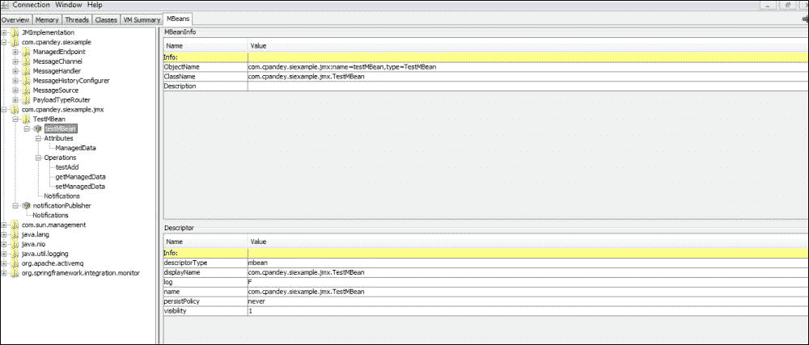
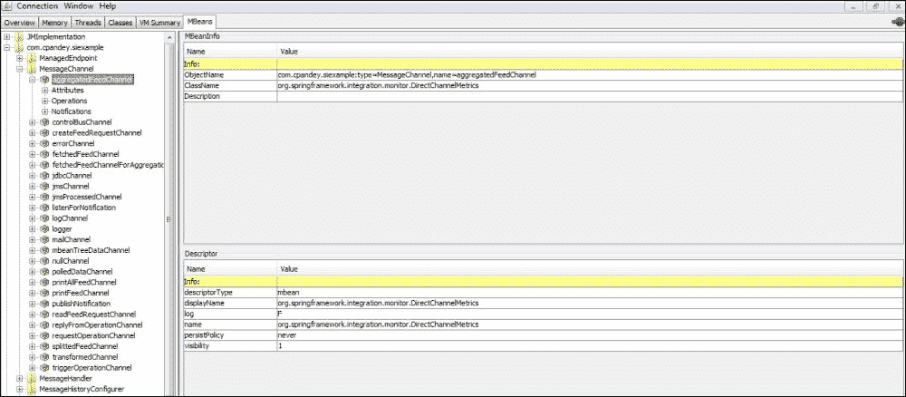

# 第九章：监控、管理和扩展

在上一章中，我们覆盖了最重要的方面之一——测试。我们将通过覆盖以下主题来结束对 Spring Integration 的讨论：

+   监控和管理

+   扩展

正如我们在各章中见证的那样，企业系统是异构的、脱节的，并且容易失败。使它们之间能够通信的一个重要方面是能够监控出了什么问题、哪些组件过载以及通信的关键统计信息——这将有助于提高系统的可靠性和效率。Spring 框架为监控和管理提供了相当的支持，让我们讨论如何利用它。

# 监控和管理

监控和管理操作有多种方法；例如，最常见的方法是使用 Java 的 JMX 支持，另一种选择是远程调用命令，或者监控和记录事件的发生——让我们覆盖最常用的方法。

## JMX 支持

**JMX**，是**Java 管理扩展**的缩写，不需要介绍——它是远程监控应用程序的标准方式。任何应用程序都可以提供 MBean 的实现，然后可以查询以获取暴露的管理信息。Spring Integration 提供了一个标准组件，可以用来监控通道、适配器和其他可用组件。标准的 JMX 可以扩展以获取更具体的信息。

### 先决条件

在我们可以使用 Spring Integration 的 JMX 支持之前，我们需要添加名称空间声明和 maven 依赖项：

+   **名称空间支持**：这可以通过以下代码片段添加：

    ```java
    <beans 

      xmlns:int-jmx="http://www.springframework.org/schema/integration/jmx"
      xsi:schemaLocation="http://www.springframework.org/schema/integration http://www.springframework.org/schema/integration/spring-integration.xsd
        http://www.springframework.org/schema/beans http://www.springframework.org/schema/beans/spring-beans.xsd
        http://www.springframework.org/schema/context http://www.springframework.org/schema/context/spring-context.xsd
        http://www.springframework.org/schema/integration/jmx http://www.springframework.org/schema/integration/jmx/spring-integration-jmx.xsd">
    ```

+   **Maven 依赖**：这可以通过以下代码片段添加：

    ```java
    <dependency>
      <groupId>org.springframework.integration</groupId>
      <artifactId>spring-integration-jmx</artifactId>
      <version>${spring.integration.version}</version>
    </dependency>
    ```

+   **初始化服务器**：在传统的 Java/Spring 应用程序中，我们需要编写代码来启动平台 MBean 服务器，并导出我们的 MBeans，但 Spring 提供了标签来实现相同的任务。要创建和启动一个 MBean 服务器，只需使用以下代码行：

    ```java
      <context:mbean-server/>
    ```

    为了导出定义的 MBeans，以下代码行就足够了：

    ```java
      <context:mbean-export/>
    ```

+   **管理注解**：Spring 框架暴露了一些注解，可以用来标记将被管理或有助于管理和监控的组件。例如，`@ManagedResource`表示参与管理和监控的类，而`@ManagedAttribute`和`@ManagedOperation`分别表示类属性和操作的成员级别参与。启用`<context:mbean-export/>`将扫描并导出这些 bean 和管理节点。让我们写一个示例 MBean 并导出它，我们将在示例中使用它：

    ```java
    import javax.management.Notification;
    import org.springframework.jmx.export.annotation.ManagedAttribute;
    import org.springframework.jmx.export.annotation.ManagedOperation;
    import org.springframework.jmx.export.annotation.ManagedResource;
    import org.springframework.jmx.export.notification.NotificationPublisher;
    import org.springframework.jmx.export.notification.NotificationPublisherAware;
    import org.springframework.stereotype.Component;

    @Component
    @ManagedResource
    public class TestMBean implements NotificationPublisherAware{
      private NotificationPublisher notificationPublisher;
      private String managedData;

      @ManagedAttribute
      public String getManagedData() {
        return managedData;
      }
      @ManagedAttribute
      public void setManagedData(String managedData) {
        this.managedData = managedData;
      }
      @ManagedOperation
      public Integer testAdd(Integer num1, Integer num2) {
        notificationPublisher.sendNotification(new Notification("testAdd", this, 0));
        return num1 + num2;
      }
      @Override
      public void setNotificationPublisher(NotificationPublisher notificationPublisher) {
        this.notificationPublisher = notificationPublisher;
      }
    }
    ```

    由于使用了这些注解，这个类将被作为 MBean 导出。此外，这个类实现了`NotificationPublisherAware`，可以用来发送通知。我们将在下一个示例中看到它的使用。

+   **JConsole**：要连接和监控 JMX bean，最简单的方法是使用`Jconsole`。它随 JDK 一起提供——在`JDK_INSTALLATION_PATH/bin/Jconsole.exe`查找它。默认情况下，JConsole 将选择一个随机端口，但要对 JMX 端口进行明确控制，请使用以下参数启动 Spring Integration 应用程序：

    ```java
        -Dcom.sun.management.jmxremote
        -Dcom.sun.management.jmxremote.port=6969
        -Dcom.sun.management.jmxremote.ssl=false
        -Dcom.sun.management.jmxremote.authenticate=false
    ```

### 通知监听通道适配器

```java
<int-jmx:notification-listening-channel-adapter id="notifListener" channel="listenForNotification" object-name="com.cpandey.siexample.jmx:name=testMBean,type=TestMBean"/>
```

让我们看看使用的组件：

+   `int-jmx:notification-listening-channel-adapter`：这是通知监听通道适配器的命名空间支持。

+   `channel`：这是接收到的通知将被作为消息放入的通道。

+   `object-name`：这是发布通知的 MBean 的名称。

要测试这个适配器，请按照以下步骤操作：

1.  加载配置上下文：

    ```java
    import org.springframework.context.support.AbstractApplicationContext;
    import org.springframework.context.support.ClassPathXmlApplicationContext;

    public final class FeedsExample {
      private FeedsExample() { }

      public static void main(final String... args) {
        final AbstractApplicationContext context = new ClassPathXmlApplicationContext("classpath:META-INF/spring/integration/spring-integration-context.xml");
      }
    }
    ```

1.  启动`Jconsole`并连接到`FeedsExample`。

1.  `Jconsole`将列出`TestMBean`暴露的方法和属性。

1.  调用 add 操作，导致`Testbean`发送一个通知。

1.  负载将被放在`listenForNotification`通道上。

让我们编写一个可以触发前面代码段的小类：

```java
import org.springframework.context.support.AbstractApplicationContext;
import org.springframework.context.support.ClassPathXmlApplicationContext;
import org.springframework.integration.support.MessageBuilder;
import org.springframework.messaging.MessageChannel;

public class NotificationPublisher {
  public static void main(String[] args) {
    final AbstractApplicationContext context = new ClassPathXmlApplicationContext("classpath:META-INF/spring/integration/spring-integration-context.xml");
    try {
      Thread.sleep(60000);
    } catch (InterruptedException e) {
      //do nothing
    }
    MessageChannel publishNotification = context.getBean("publishNotification", MessageChannel.class);
    publishNotification.send(MessageBuilder.withPayload("Sample Message").build());

    MessageChannel triggerOperationChannel = context.getBean("triggerOperationChannel", MessageChannel.class);
    triggerOperationChannel.send(MessageBuilder.withPayload("Trigger Method Adapter").build());

    MessageChannel requestOperationChannel = context.getBean("requestOperationChannel", MessageChannel.class);
    requestOperationChannel.send(MessageBuilder.withPayload("Trigger Method Gateway").build());

    MessageChannel input = context.getBean("controlBusChannel", MessageChannel.class);
    String controlMessage = "@controlBusTest.controlTestOperation()";
    LOGGER.info("Sending message: " + controlMessage);
    input.send(MessageBuilder.withPayload(controlMessage).build());

    try {
      Thread.sleep(180000);
    } catch (InterruptedException e) {
      //do nothing
    }
    context.stop();
  }
}
```

前面代码段类的很简单；它加载上下文，获取通道的引用，使用 Spring Integration 支持类`MessageBuilder`构建负载，然后将其放在通道上。一旦消息放在这个通道上，将生成一个事件并发送给订阅者。引入了等待以允许`Jconsole`连接一些时间。

### 属性轮询通道适配器

正如其名称所示，它轮询由 MBean 管理的属性。需要轮询的属性名称和包含属性的 MBean 对象名称是必需的。以下代码是属性轮询通道适配器的快速示例配置：

```java
  <int:channel id="polledDataChannel"/>
  <int-jmx:attribute-polling-channel-adapter id="attribPoller" channel="polledDataChannel" object-name="com.cpandey.siexample.jmx:name=testMBean, type=TestMBean"
    attribute-name="ManagedData">
    <int:poller max-messages-per-poll="1" fixed-rate="5000"/>
  </int-jmx:attribute-polling-channel-adapter>
```

前面的配置轮询`TestMbean`的`ManagedData`属性。如果属性值发生变化，变化值将被放在通道上。我们可以有一个简单的服务，如以下代码行所示，为其提供测试：

```java
  <int:service-activator ref="commonServiceActivator" method="attributePolled" input-channel="polledDataChannel"/>
```

### 树轮询通道适配器

树轮询通道适配器本身查询 JMX 树并发送负载，负载是 MBean 对象的图形。我们可以使用查询进一步细化图形——让我们编写以下示例配置：

```java
  <int:channel id="mbeanTreeDataChannel"/>
  <int-jmx:tree-polling-channel-adapter  id="treePoller" 
    channel="mbeanTreeDataChannel"    	
    query-name="com.cpandey.siexample.jmx:type=*">
      <int:poller max-messages-per-poll="1" fixed-rate="5000"/>
  </int-jmx:tree-polling-channel-adapter>
```

我们可以使用以下代码段来触发前面的适配器：

```java
    MessageChannel triggerOperationChannel = context.getBean("triggerOperationChannel", MessageChannel.class);
    triggerOperationChannel.send(MessageBuilder.withPayload("Trigger Method Adapter").build());
```

### 调用出站网关的操作

像往常一样，`Gateway`用于将响应供进一步处理——在这种情况下，在调用操作后，响应将放回`replychannel`以供进一步处理，如下代码行所示：

```java
  <int:channel id="requestOperationChannel"/>
  <int:channel id="replyFromOperationChannel"/>
  <int-jmx:operation-invoking-outbound-gateway id="triggerOperationGateway" request-channel="requestOperationChannel" reply-channel="replyFromOperationChannel" object-name="com.cpandey.siexample.jmx:name=testMBean, type=TestMBean" operation-name="getManagedData"/>
```

```java
following lines of code:
```

```java
    MessageChannel requestOperationChannel = context.getBean("requestOperationChannel", MessageChannel.class);
    requestOperationChannel.send(MessageBuilder.withPayload("Trigger Method Gateway").build());
```

一个简单的服务激活器可以插入以验证网关返回的结果。

```java
<int:service-activator ref="commonServiceActivator" method="operationInvokedGateway" input-channel="replyFromOperationChannel"/>
```

### `MBean`导出器

那么标准 Spring 集成组件呢：`MessageChannels`、网关和其他组件？嗯，它们可以通过以下单行配置暴露出来以供监控：

```java
  <int-jmx:mbean-export 
    default-domain="com.cpandey.siexample"
    server="mbeanServer"/>
```

让我们快速看一下所使用的元素：

+   `default-domain`：这是可选的，如果留空，将使用`org.springframework.integration`作为默认域

+   `server`：这是使用`<context:mbean-server/>`创建的`mbeanServer`的引用

在结束 JMX 的讨论之前，让我们看看 JConsole 的快照。以下是我们所暴露的自定义 MBeans 和监听器的屏幕截图：



以下是我们定义在应用程序中的 Spring Integration 所有组件的屏幕截图：



我们可以观察到两个方面：

+   Spring Integration 包，列出了所有的 Spring Integration 组件

+   暴露用户定义 MBean 的 Feeds 示例

这些适配器的属性和值是非常直观的，我会留给你们去进一步探索这些。

## 跟踪消息

```java
<int:message-history/>
```

一旦添加了这个，所有这条消息传递过的组件（假设这些组件有一个`id`标签）都会添加一个审计消息。让我们看以下的例子：

```java
  <int:message-history/>

  <!-- Notification listening channel adapter -->
  <int-jmx:notification-listening-channel-adapter id="notifListener"
    channel="listenForNotification"
    object-name="com.cpandey.siexample.jmx:name=testMBean,type=TestMBean"/>

  <!-- Notification publishing channel adapter -->
  <int:channel id="publishNotification"/>
  <int-jmx:notification-publishing-channel-adapter id="publishListener"
    channel="publishNotification"
    object-name="com.cpandey.siexample.jmx:name=notificationPublisher"
    default-notification-type="default.notification.type"/>
```

在这个代码样本中，我们在开始处声明了`<int:message-history/>`。同时，注意下一个组件`notifListener`和`publishListener`有一个 ID 标签。有了这个配置，当消息通过这些组件时，会立即添加元数据。

## 线路窃听

这非常简单——它是一个拦截器，可以配置在任何通道上，并且会“窥视”通过该通道的所有消息。这可以用于调试、记录关键信息等。让我们在监听监控事件的通道上添加一个拦截器：

```java
  <int:channel id="listenForNotification">
    <int:interceptors>
      <int:wire-tap channel="logger"/>
    </int:interceptors>
  </int:channel>

<int:logging-channel-adapter 
  log-full-message="true" id="logger" level="INFO"/>
```

添加这些配置后，通过这个通道的所有消息都将被记录。

## 控制总线

我们在 Spring Integration 中有用于应用程序级消息的元素。那么使用同样的系统来触发一些动作怎么样？控制总线的背后的想法正是如此——我们可以定义通道，然后，基于该通道上的载荷，它可以调用管理操作。让我们看一个例子：

```java
  <int:channel id="controlBusChannel"/>
  <int:control-bus input-channel="controlBusChannel"/>
```

下面几行代码给出了向此总线发送控制消息的一个类：

```java
import org.apache.log4j.Logger;
import org.springframework.jmx.export.annotation.ManagedOperation;
import org.springframework.stereotype.Component;

@Component
public class ControlBusTest {
  private static final Logger LOGGER = Logger.getLogger(ControlBusTest.class);
  @ManagedOperation
  public void controlTestOperation() {
    LOGGER.info("controlTestOperation");
  }
}

MessageChannel input = context.getBean("controlBusChannel", MessageChannel.class);
String controlMessage = "@controlBusTest.controlTestOperation()";
LOGGER.info("Sending message: " + controlMessage);
input.send(MessageBuilder.withPayload(controlMessage).build());
```

有了这个，让我们结束管理和监控的讨论。在下一节中，我们将探讨应用程序设计的一个重要方面——可扩展性。

# 扩展

系统的可扩展性是最重要的非功能性需求之一。正如我们所知，扩展系统基本上有两种方式：垂直扩展和水平扩展。**垂直扩展**指的是向现有系统添加更多的处理能力——如果你内存不足，增加内存；如果 CPU 周期变短，增加一些核心或进行其他更改。挑战不大！另一方面，**水平扩展**指的是添加更多的物理节点，以分布式方式处理请求，在 DB 和消息代理组件中增加冗余。显然，这需要一个经过深思熟虑的设计。让我们看看可以用来扩展 Spring 应用程序的几种方法。

## 线程

扩展系统最常见的方法是引入并行处理。然而，在你学习如何做到这一点之前，让我们注意以下陷阱：

+   应该评估创建线程是否会有帮助

+   应根据机器能力创建线程

+   我们应该考虑其他端点的延迟

+   应该清理线程

所以让我们从一个例子开始。我们讨论了 FTP，如果有成千上万的文件可供处理，并且我们希望并行处理它们，这该如何实现？我们可以使用`TaskExecutors`，如下例所示：

```java
<bean id="ftpTaskExecutor" class="org.springframework.scheduling.concurrent.ThreadPoolTaskExecutor">
  <property name="maxPoolSize" value="15"/>
  <property name="threadNamePrefix" value="ftpService-"/>
</bean>

<int:service-activator ref="ftpFileProcessor" method="parserFeedsFromFtp" input-channel="ftpInputChannel" output-channel="ftpOutputChannel">
    <int:poller fixed-rate="1000" receive-timeout="6000" task-executor=" ftpTaskExecutor"></int:poller>
</int:service-activator>
```

那么前面的代码中发生了什么？首先，我们定义了一个任务执行器——与 Spring 集成无关。你可以看到这里使用了 Spring 框架中的`org.springframework.scheduling.concurrent.ThreadPoolTaskExecutor`类。然后，我们将这个与服务激活器的轮询器关联起来。现在将创建一个服务池，它将并行处理输入通道上的文件。

显而易见，Spring Integration 利用了 Spring 框架对执行器的支持。前面的代码直接使用了 bean，但 Spring 也提供了命名空间支持：

```java
<task:executor id="executor"/>
```

底层抽象是`org.springframework.core.task.TaskExecutor`。每当需要执行一个任务时，它会被提交给任务执行器；分配和回收线程是任务执行器的职责。让我们以前面示例中的轮询器为例，如果轮询通道上的元素是无状态的且可以并发处理，我们可以在那里使用执行器：

```java
<poller id="defaultPoller" fixed-delay="1000 "default="true" task-executor="executor"/>
```

如果我们有一个任务执行器来维护一个底层线程池，那么我们可以指定要维护的最大线程数，同时考虑到物理资源限制：

```java
<task:executor id="taskExecutor" pool-size="10"/>
```

## 爬取状态

当没有状态时，并发工作；那么，有哪些用例我们希望在扩展的同时管理状态是强制性的呢？例如，如果载荷太大，我们会等待所有载荷被处理，同时阻塞消费者吗？在第七章，*与 Spring Batch 集成*中，我们提到可以触发下载，然后等待下载完成的 event；在那时，消费者将启动。同样，我们有一些可以利用的方法；实际上，我们在之前的章节中已经介绍了这些内容，所以我将简要介绍如何利用持久存储来扩展状态。

### 消息存储

正如名字 suggests，我们可以暂时存储消息，直到满足某些条件。例如，如果你还记得，Aggregator 是 Spring Integration 的一个组件，它关联并暂时存储消息，直到完成条件满足。类似的概念可以用于扩展，其中任务可以暂时搁置，只有当所有其他协调成员都可用时才处理。让我们以一个 feed 的例子来说明，有些 feed 可能附带图片。文本部分将立即交付，而图片交付可能需要很长时间。我们可以配置聚合器，当所有部分到达时释放消息。我们已经在第五章，*消息流*中介绍了如何做到这一点！

### 收据

这个概念非常简单，不是等待所有组件到达，而是在某个已知位置存储一部分，并有一个指向它的指针。当最后一个块到达时，使用指针“认领”所有其他部分。显然，这适用于我们可以将有效载荷分解为独立单元并且系统可以知道最终数据包到达的情况。一旦实现，下游组件只有在所有部分都可用时才会收到数据包——它们不必等待或被阻塞以完成数据包的到达。

# 总结

在本章中，我们简要了解了 Spring Integration 框架的监控和管理方面，例如我们如何关注隐式和用户定义的集成组件，如何发送和接收事件并执行操作，还有许多其他方面。我们还介绍了如何使用线程来扩展应用程序以及几种扩展状态的方法。这使得我们的理论之旅告一段落。在下一章中，我们将编写一个端到端的应用程序，结束我们的 Spring Integration 之旅！
