# 第三章。高级 Spring Boot 特性

在上一课中，我们通过异常处理、HATEOAS、缓存和国际化扩展了我们的微服务。在本课中，让我们将注意力转向将我们的服务部署到生产环境。为了能够将服务部署到生产环境，我们需要能够设置和创建配置、部署和监控服务的功能。

在本课中，我们将回答以下问题：

+   如何外部化应用程序配置？

+   如何使用配置文件来配置特定环境的值？

+   如何将我们的应用程序部署到云中？

+   什么是嵌入式服务器？如何使用 Tomcat、Jetty 和 Undertow？

+   Spring Boot Actuator 提供了哪些监控功能？

+   如何使用 Spring Boot 成为更高效的开发者？

# 外部化配置

应用程序通常只构建一次（在 JAR 或 WAR 文件中），然后部署到多个环境中。以下图显示了应用程序可以部署的一些不同环境：

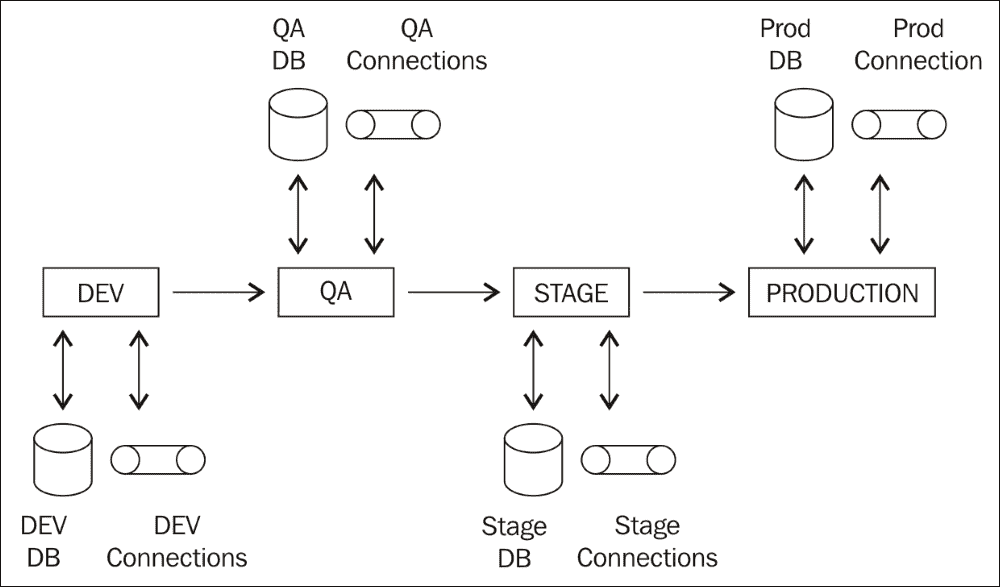

在上述每个环境中，应用程序通常具有以下特点：

+   数据库连接

+   多个服务的连接

+   特定环境配置

将在不同环境之间发生变化的配置外部化到配置文件或数据库中是一种良好的实践。

Spring Boot 提供了一种灵活、标准化的外部化配置方法。

在本节中，我们将探讨以下内容：

+   如何在服务内部使用`application.properties`中的属性？

+   如何让类型安全的配置属性使应用程序配置变得轻而易举？

+   Spring Boot 为**Spring 配置文件**提供了哪些支持？

+   如何在`application.properties`中配置属性？

在 Spring Boot 中，`application.properties`是默认的配置值来源文件。Spring Boot 可以从类路径上的任何位置获取`application.properties`文件。通常，`application.properties`位于`src\main\resources`，如下面的截图所示：


在第 2 课“扩展微服务”中，我们通过`application.properties`中的配置示例来查看自定义 Spring Security 的方法：

```java
    security.basic.enabled=false
    management.security.enabled=false
    security.user.name=user-name
    security.user.password=user-password
    security.oauth2.client.clientId: clientId
    security.oauth2.client.clientSecret: clientSecret
    security.oauth2.client.authorized-grant-types:                
    authorization_code,refresh_token,password
    security.oauth2.client.scope: openid
```

与这些类似，所有其他 Spring Boot 启动器、模块和框架都可以通过`application.properties`中的配置进行自定义。在下一节中，我们将探讨 Spring Boot 为这些框架提供的某些配置选项。

## 通过`application.properties`自定义框架

在本节中，我们将讨论一些可以通过`application.properties`配置的重要事项。

### 注意

对于完整的列表，请参阅[`docs.spring.io/spring-boot/docs/current-SNAPSHOT/reference/htmlsingle/#common-application-properties`](https://docs.spring.io/spring-boot/docs/current-SNAPSHOT/reference/htmlsingle/#common-application-properties)。

### 日志

可以配置的一些事项如下：

+   日志配置文件的位置

+   日志文件的位置

+   日志级别

以下代码片段展示了几个示例：

```java
# Location of the logging configuration file.
  logging.config=
# Log file name.
  logging.file=
# Configure Logging level. 
# Example `logging.level.org.springframework=TRACE`
  logging.level.*=
```

### 内嵌服务器配置

内嵌服务器是 Spring Boot 最重要的特性之一。可以通过应用程序属性配置的一些内嵌服务器特性包括：

+   服务器端口

+   SSL 支持和配置

+   访问日志配置

以下代码片段展示了可以通过应用程序属性配置的一些内嵌服务器特性：

```java
# Path of the error controller.
server.error.path=/error 
# Server HTTP port
server.port=8080
# Enable SSL support.
server.ssl.enabled=
# Path to key store with SSL certificate
server.ssl.key-store=
# Key Store Password
server.ssl.key-store-password=
# Key Store Provider
server.ssl.key-store-provider=
# Key Store Type
server.ssl.key-store-type=
# Should we enable access log of Tomcat?
server.tomcat.accesslog.enabled=false
# Maximum number of connections that server can accept
server.tomcat.max-connections=
```

### Spring MVC

Spring MVC 可以通过`application.properties`进行广泛的配置。以下是一些重要的配置：

```java
# Date format to use. For instance `dd/MM/yyyy`.
 spring.mvc.date-format=
# Locale to use.
 spring.mvc.locale=
# Define how the locale should be resolved.
 spring.mvc.locale-resolver=accept-header
# Should "NoHandlerFoundException" be thrown if no Handler is found?
 spring.mvc.throw-exception-if-no-handler-found=false
# Spring MVC view prefix. Used by view resolver.
 spring.mvc.view.prefix=
# Spring MVC view suffix. Used by view resolver.
 spring.mvc.view.suffix=
```

### Spring Starter Security

Spring Security 可以通过`application.properties`进行广泛的配置。以下示例展示了与 Spring Security 相关的一些重要配置选项：

```java
# Set true to Enable basic authentication
 security.basic.enabled=true
# Provide a Comma-separated list of uris you would want to secure
 security.basic.path=/**
# Provide a Comma-separated list of paths you don't want to secure
 security.ignored=
# Name of the default user configured by spring security
 security.user.name=user
# Password of the default user configured by spring security. 
 security.user.password=
# Roles granted to default user
 security.user.role=USER
```

### 数据源、JDBC 和 JPA

数据源、JDBC 和 JPA 也可以通过`application.properties`进行广泛的配置。以下是一些重要的选项：

```java
# Fully qualified name of the JDBC driver. 
 spring.datasource.driver-class-name=
# Populate the database using 'data.sql'.
 spring.datasource.initialize=true
# JNDI location of the datasource.
 spring.datasource.jndi-name=
# Name of the datasource.
 spring.datasource.name=testdb
# Login password of the database.
 spring.datasource.password=
# Schema (DDL) script resource references.
 spring.datasource.schema=
# Db User to use to execute DDL scripts
 spring.datasource.schema-username=
# Db password to execute DDL scripts
 spring.datasource.schema-password=
# JDBC url of the database.
 spring.datasource.url=
# JPA - Initialize the schema on startup.
 spring.jpa.generate-ddl=false
# Use Hibernate's newer IdentifierGenerator for AUTO, TABLE and SEQUENCE.
 spring.jpa.hibernate.use-new-id-generator-mappings=
# Enable logging of SQL statements.
 spring.jpa.show-sql=false
```

### 其他配置选项

可以通过`application.properties`配置的一些其他事项如下：

+   配置文件

+   HTTP 消息转换器（Jackson/JSON）

+   事务管理

+   国际化

以下示例展示了可以通过应用程序属性配置的一些配置选项：

```java
# Comma-separated list (or list if using YAML) of active profiles.
 spring.profiles.active=
# HTTP message conversion. jackson or gson
 spring.http.converters.preferred-json-mapper=jackson
# JACKSON Date format string. Example `yyyy-MM-dd HH:mm:ss`.
 spring.jackson.date-format=
# Default transaction timeout in seconds.
 spring.transaction.default-timeout=
# Perform the rollback on commit failures.
 spring.transaction.rollback-on-commit-failure=
# Internationalization : Comma-separated list of basenames
 spring.messages.basename=messages
# Cache expiration for resource bundles, in sec. -1 will cache for ever
 spring.messages.cache-seconds=-1
```

## Application.Properties 中的自定义属性

到目前为止，我们已经探讨了使用 Spring Boot 提供的预构建属性来配置各种框架。在本节中，我们将探讨创建我们应用程序特定的配置，这些配置也可以在`application.properties`中进行配置。

让我们考虑一个例子。我们希望能够与外部服务交互。我们希望能够外部化此服务 URL 的配置。

以下示例展示了我们如何在`application.properties`中配置外部服务：

```java
   somedataservice.url=http://abc.service.com/something
```

我们想在数据服务中使用`somedataservice.url`属性的值。以下代码片段展示了如何在示例数据服务中实现这一点。

```java
    @Component
    public class SomeDataService {
      @Value("${somedataservice.url}")
      private String url;
      public String retrieveSomeData() {
        // Logic using the url and getting the data
       return "data from service";
      }
    }
```

有两点需要注意：

+   `@Component public class SomeDataService`: 数据服务 bean 由于`@Component`注解而被 Spring 管理。

+   `@Value("${somedataservice.url}")`: `somedataservice.url`的值将被自动注入到`url`变量中。该`url`值可以在 bean 的方法中使用。

### 配置属性 - 类型安全的配置管理

虽然`@Value`注解提供了动态配置，但它也有一些缺点：

+   如果我们想在服务中使用三个属性值，我们需要使用`@Value`注解三次来自动注入它们。

+   `@Value` 注解和消息的键将在应用程序中分散。如果我们想在应用程序中找到可配置值的列表，我们必须在应用程序中搜索`@Value`注解。

Spring Boot 通过强类型的 `ConfigurationProperties` 功能提供了一种更好的应用程序配置方法。这允许我们做以下事情：

+   在预定义的 Bean 结构中包含所有属性

+   这个 Bean 将作为所有应用程序属性的集中存储。

+   配置 Bean 可以在需要应用程序配置的地方进行自动注入。

以下是一个示例配置 Bean：

```java
    @Component
    @ConfigurationProperties("application")
    public class ApplicationConfiguration {
      private boolean enableSwitchForService1;
      private String service1Url;
      private int service1Timeout;
      public boolean isEnableSwitchForService1() {
        return enableSwitchForService1;
      }
     public void setEnableSwitchForService1
     (boolean enableSwitchForService1) {
        this.enableSwitchForService1 = enableSwitchForService1;
      }
     public String getService1Url() {
       return service1Url;
     }
     public void setService1Url(String service1Url) {
       this.service1Url = service1Url;
     }
     public int getService1Timeout() {
       return service1Timeout;
     }
     public void setService1Timeout(int service1Timeout) {
       this.service1Timeout = service1Timeout;
    }
  }
```

以下是一些需要注意的重要事项：

+   `@ConfigurationProperties("application")` 是用于外部化配置的注解。我们可以将此注解添加到任何类中，以绑定到外部属性。双引号中的值--application--在将外部配置绑定到此 Bean 时用作前缀。

+   我们在 Bean 中定义了多个可配置的值。

+   由于绑定是通过 Java Bean 属性描述符发生的，因此需要 getters 和 setters。

下面的代码片段显示了如何在`application.properties`中定义这些属性的值：

```java
    application.enableSwitchForService1=true
    application.service1Url=http://abc-dev.service.com/somethingelse
    application.service1Timeout=250
```

以下是一些需要注意的重要事项：

+   `application`: 前缀是在定义配置 Bean 时作为 `@ConfigurationProperties("application")` 的一部分定义的

+   值是通过将前缀附加到属性名称来定义的

我们可以通过将 `ApplicationConfiguration` 自动注入到 Bean 中来在其他 Bean 中使用配置属性：

```java
    @Component
    public class SomeOtherDataService {
      @Autowired
      private ApplicationConfiguration configuration;
      public String retrieveSomeData() {
        // Logic using the url and getting the data
        System.out.println(configuration.getService1Timeout());
        System.out.println(configuration.getService1Url());
        System.out.println(configuration.isEnableSwitchForService1());
        return "data from service";
      }
    }
```

以下是一些需要注意的重要事项：

+   `@Autowired private ApplicationConfiguration configuration`: `ApplicationConfiguration` 被自动注入到 `SomeOtherDataService`

+   `configuration.getService1Timeout(), configuration.getService1Url(), configuration.isEnableSwitchForService1()`: 可以通过配置 Bean 上的 getter 方法在 Bean 方法中访问这些值

默认情况下，将外部配置值绑定到配置属性 Bean 的任何失败都会导致服务器启动失败。这防止了由于在生产环境中运行配置错误的应用程序而产生的问题。

让我们使用错误的配置服务超时来查看会发生什么：

```java
    application.service1Timeout=SOME_MISCONFIGURATION
```

应用程序将无法启动并出现错误。

```java
***************************
 APPLICATION FAILED TO START
 ***************************
Description:
Binding to target com.mastering.spring.springboot.configuration.ApplicationConfiguration@79d3473e failed:

Property: application.service1Timeout
Value: SOME_MISCONFIGURATION
Reason: Failed to convert property value of type 'java.lang.String' to required type 'int' for property 'service1Timeout'; nested exception is org.springframework.core.convert.ConverterNotFoundException: No converter found capable of converting from type [java.lang.String] to type [int]

Action:
Update your application's configuration
```

## 配置文件

到目前为止，我们探讨了如何将应用程序配置外部化到属性文件中，即`application.properties`。我们想要实现的是在不同的环境中，相同的属性可以有不同的值。

配置文件提供了一种在不同环境中提供不同配置的方法。

下面的代码片段显示了如何在`application.properties`中配置活动配置文件：

```java
    spring.profiles.active=dev
```

一旦配置了活动配置文件，你就可以在`application-{profile-name}.properties`中定义特定于该配置文件的属性。对于`dev`配置文件，属性文件的名称将是`application-dev.properties`。以下示例显示了`application-dev.properties`中的配置：

```java
    application.enableSwitchForService1=true
    application.service1Url=http://abc-dev.service.com/somethingelse
    application.service1Timeout=250
```

如果活动配置文件是`dev`，则`application-dev.properties`中的值将覆盖`application.properties`中的默认配置。

我们可以有多个环境的配置，如下所示：

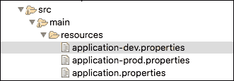

### 基于配置文件的 Bean 配置

配置文件也可以用来定义不同环境中的不同 bean 或不同的 bean 配置。所有标记了`@Component`或`@Configuration`的类也可以通过额外的`@Profile`注解来指定启用 bean 或配置的配置文件。

让我们考虑一个例子。一个应用程序需要在不同的环境中启用不同的缓存。在`dev`环境中，它使用一个非常简单的缓存。在生产环境中，我们希望使用分布式缓存。这可以通过配置文件来实现。

以下 bean 显示了在`dev`环境中启用的配置：

```java
    @Profile("dev")
    @Configuration
    public class DevSpecificConfiguration {
      @Bean
      public String cache() {
        return "Dev Cache Configuration";
      }
    }
```

以下 bean 显示了在生产环境中启用的配置：

```java
    @Profile("prod")
    @Configuration
    public class ProdSpecificConfiguration {
      @Bean
      public String cache() {
        return "Production Cache Configuration - Distributed Cache";
      }
   }
```

根据配置的活动配置文件，选择相应的配置。注意，在这个例子中，我们实际上并没有配置分布式缓存。我们返回一个简单的字符串来展示配置文件可以用来实现这类变化。

## 应用配置值的其他选项

到目前为止，我们采取的方法是使用`application.properties`或`application-{profile-name}.properties`中的键值对来配置应用程序属性。

Spring Boot 提供了许多其他配置应用程序属性的方法。

列出的是提供应用程序配置的一些重要方式：

+   命令行参数

+   创建名为`SPRING_APPLICATION_JSON`的系统属性并包含 JSON 配置

+   `ServletConfig init`参数

+   `ServletContext init`参数

+   Java 系统属性（`System.getProperties()`）

+   操作系统环境变量

+   `.jar`文件外的特定配置文件的应用程序属性，位于应用程序的类路径中（`application-{profile}.properties`）

+   打包在您的`.jar`文件内的特定配置文件的应用程序属性（`application-{profile}.properties`和 YAML 变体）

+   `.jar`文件外的应用程序属性

+   打包在`.jar`文件内的应用程序属性

更多信息可以在 Spring Boot 文档中找到：[`docs.spring.io/spring-boot/docs/current-SNAPSHOT/reference/htmlsingle/#boot-features-external-config`](http://docs.spring.io/spring-boot/docs/current-SNAPSHOT/reference/htmlsingle/#boot-features-external-config)。

列表顶部的方案比列表底部的方案具有更高的优先级。例如，如果在启动应用程序时提供了名为 `spring.profiles.active` 的命令行参数，它将覆盖通过 `application.properties` 提供的任何配置，因为命令行参数具有更高的优先级。

这为确定您希望在不同环境中如何配置应用程序提供了极大的灵活性。

## YAML 配置

Spring Boot 也支持使用 YAML 来配置你的属性。

**YAML** 是 **YAML Ain't Markup Language** 的缩写。它是一种人类可读的结构化格式。YAML 通常用于配置文件。

要了解 YAML 的基本语法，请查看以下示例（`application.yaml`）。这显示了我们的应用程序配置如何在 YAML 中指定。

```java
spring:
   profiles:
      active: prod
security:
   basic:
      enabled: false
   user:
      name=user-name
      password=user-password
oauth2:
   client:
      clientId: clientId
      clientSecret: clientSecret
      authorized-grant-types: authorization_code,refresh_token,password
      scope: openid
application:
   enableSwitchForService1: true
   service1Url: http://abc-dev.service.com/somethingelse
   service1Timeout: 250
```

如您所见，YAML 配置比 `application.properties` 更易于阅读，因为它允许更好地对属性进行分组。

YAML 的另一个优点是它允许你在单个配置文件中指定多个配置文件的配置。以下片段显示了示例：

```java
application:
  service1Url: http://service.default.com
---	
spring:
  profiles: dev
  application:
    service1Url: http://service.dev.com
---
spring:
   profiles: prod
   application:
    service1Url: http://service.prod.com
```

在此示例中，`http://service.dev.com` 将在 `dev` 配置文件中使用，而 `http://service.prod.com` 在 `prod` 配置文件中使用。在所有其他配置文件中，将使用 `http://service.default.com` 作为服务 URL。

# 嵌入式服务器

Spring Boot 带入的一个重要概念之一是嵌入式服务器。

让我们先了解传统 Java 网络应用程序部署与这种称为嵌入式服务器的新概念之间的区别。

传统上，使用 Java 网络应用程序，我们构建 **Web 应用程序存档**（**WAR**）或 **企业应用程序存档**（**EAR**），并将它们部署到服务器上。在我们可以在服务器上部署 WAR 之前，需要在服务器上安装一个 web 服务器或应用程序服务器。应用程序服务器将位于服务器上安装的 Java 实例之上。因此，在我们部署应用程序之前，需要在机器上安装 Java 和一个应用程序（或 web 服务器）。以下图显示了 Linux 中的示例安装：

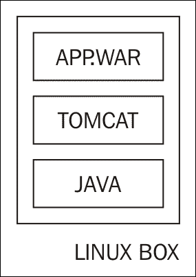

Spring Boot 引入了嵌入式服务器的概念，其中 web 服务器是应用程序可部署部分——JAR。要使用嵌入式服务器部署应用程序，只要服务器上安装了 Java 就足够了。以下图显示了示例安装：

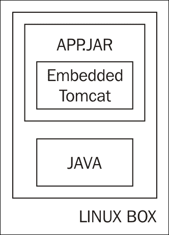

当我们使用 Spring Boot 构建任何应用程序时，默认是构建一个 JAR。使用 `spring-boot-starter-web`，默认嵌入式服务器是 Tomcat。

当我们使用 `spring-boot-starter-web` 时，可以在 Maven 依赖项部分看到一些与 Tomcat 相关的依赖项。这些依赖项将作为应用程序部署包的一部分包含：

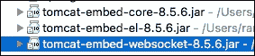

要部署应用程序，我们需要构建一个 JAR。我们可以使用以下命令构建 JAR：

```java
mvn clean install

```

以下截图显示了创建的 JAR 的结构。

`BOOT-INF\classes` 包含所有与应用程序相关的类文件（来自`src\main\java`）以及来自`src\main\resources`的应用程序属性：

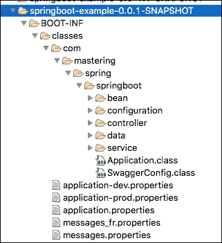

以下截图显示了`BOOT-INF\lib`中的一些库：

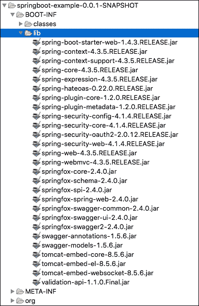

`BOOT-INF\lib` 包含应用程序的所有 JAR 依赖项。其中包含三个特定的 Tomcat JAR。这三个 JAR 使得当应用程序作为 Java 应用程序运行时可以启动嵌入式 Tomcat 服务。正因为如此，一个 Java 安装就足够在服务器上部署此应用程序。

## 切换到 Jetty 和 Undertow

以下截图显示了切换到使用 Jetty 嵌入式服务器所需的更改。

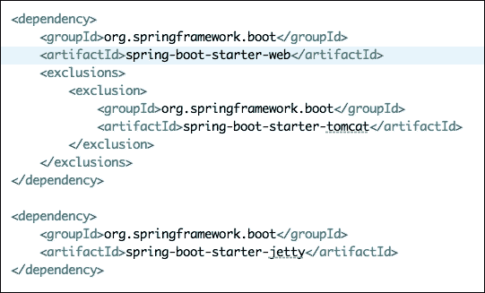

我们需要做的只是排除`spring-boot-starter-web`中的 Tomcat 启动器依赖项，并包含`spring-boot-starter-jetty`中的依赖项。

你现在可以在 Maven 依赖项部分看到许多 Jetty 依赖项。以下截图显示了几个与 Jetty 相关的依赖项：

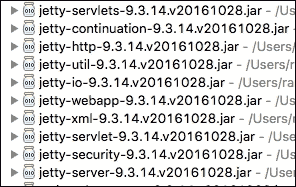

切换到 Undertow 同样简单。使用`spring-boot-starter-undertow`代替`spring-boot-starter-jetty`：

```java
    <dependency>
      <groupId>org.springframework.boot</groupId>
      <artifactId>spring-boot-starter-undertow</artifactId>
   </dependency>
```

## 构建 WAR 文件

Spring Boot 还提供了构建传统 WAR 文件而不是使用 JAR 的选项。

首先，我们需要将`pom.xml`中的打包方式改为`WAR`：

```java
    <packaging>war</packaging>
```

我们希望防止将 tomcat 服务器作为依赖项嵌入到 WAR 文件中。我们可以通过修改嵌入式服务器（以下示例中的 Tomcat）的依赖项，使其作用域为提供。以下代码片段显示了确切细节：

```java
    <dependency>
      <groupId>org.springframework.boot</groupId>
      <artifactId>spring-boot-starter-tomcat</artifactId>
      <scope>provided</scope>
   </dependency>
```

当你构建 WAR 文件时，不会包含 Tomcat 依赖项。我们可以使用这个 WAR 文件部署到应用程序服务器，如 WebSphere 或 Weblogic，或者一个网络服务器，如 Tomcat。

# 开发者工具

Spring Boot 提供了可以提升开发 Spring Boot 应用程序体验的工具。其中之一就是 Spring Boot 开发者工具。

要使用 Spring Boot 开发者工具，我们需要包含一个依赖项：

```java
    <dependencies>
     <dependency>
       <groupId>org.springframework.boot</groupId>
       <artifactId>spring-boot-devtools</artifactId>
       <optional>true</optional>
     </dependency>
   </dependencies>
```

默认情况下，Spring Boot 开发者工具禁用了视图模板和静态文件的缓存。这使得开发者能够在他们做出更改后立即看到更改。

另一个重要特性是当类路径中的任何文件发生变化时自动重启。因此，应用程序在以下场景下会自动重启：

+   当我们对控制器或服务类进行修改时

+   当我们对属性文件进行修改时

Spring Boot 开发者工具的优点如下：

+   开发者不需要每次都停止和启动应用程序。一旦有变化，应用程序就会自动重启。

+   Spring Boot 开发者工具中的重启功能是智能的。它只重新加载正在积极开发的类。它不会重新加载第三方 JAR（使用两个不同的类加载器）。因此，当应用程序中的某些内容发生变化时，重启速度比冷启动应用程序要快得多。

## Live Reload

Spring Boot 开发者工具的另一个有用功能是 **实时重新加载**。您可以从 [`livereload.com/extensions/`](http://livereload.com/extensions/) 下载适用于您浏览器的特定插件。

您可以通过点击浏览器中的按钮来启用实时重新加载。以下截图显示了 Safari 浏览器中的按钮。它在地址栏旁边的右上角。

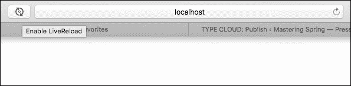

如果在浏览器中显示的页面或服务上有代码更改，它们将自动用新内容刷新。不再需要点击刷新按钮了！

# Spring Boot Actuator

当应用程序部署到生产环境时：

+   我们希望立即知道是否有某个服务宕机或运行非常缓慢

+   我们希望立即知道是否有任何服务器没有足够的空闲空间或内存

这被称为 **应用程序监控**。

**Spring Boot Actuator** 提供了许多生产就绪的监控功能。

我们将通过添加一个简单的依赖项来添加 Spring Boot Actuator：

```java
    <dependencies>
      <dependency>
        <groupId>org.springframework.boot</groupId>
        <artifactId>spring-boot-starter-actuator</artifactId>
     </dependency>
   </dependencies>
```

一旦将 Actuator 添加到应用程序中，它就会启用许多端点。当我们启动应用程序时，我们会看到许多新增的映射。以下截图显示了启动日志中这些新映射的摘录：

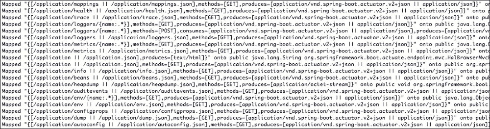

Actuator 公开了许多端点。Actuator 端点（`http://localhost:8080/application`）充当所有其他端点的发现。以下截图显示了从 Postman 执行请求时的响应：

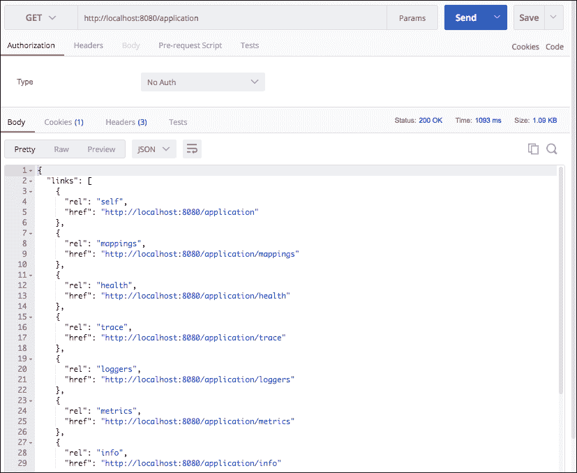

## HAL 浏览器

许多这些端点公开了大量数据。为了更好地可视化信息，我们将在应用程序中添加一个 **HAL 浏览器**：

```java
    <dependency>
      <groupId>org.springframework.data</groupId>
      <artifactId>spring-data-rest-hal-browser</artifactId>
    </dependency>
```

Spring Boot Actuator 在从 Spring Boot 应用程序和环境捕获的所有数据周围公开了 REST API。HAL 浏览器使 Spring Boot Actuator API 的可视化表示成为可能：

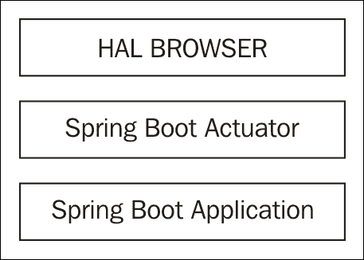

当我们在浏览器中启动 `http://localhost:8080/application` 时，我们可以看到 actuator 公开的所有 URL。

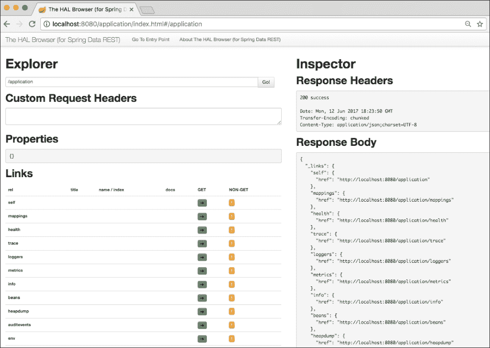

让我们通过 HAL 浏览器浏览 actuator 作为不同端点的一部分公开的所有信息。

## 配置属性

`configprops` 端点提供了有关可以通过应用程序属性配置的配置选项的信息。它基本上是一个所有 `@ConfigurationProperties` 的汇总列表。以下截图显示了 HAL 浏览器中的 `configprops`：

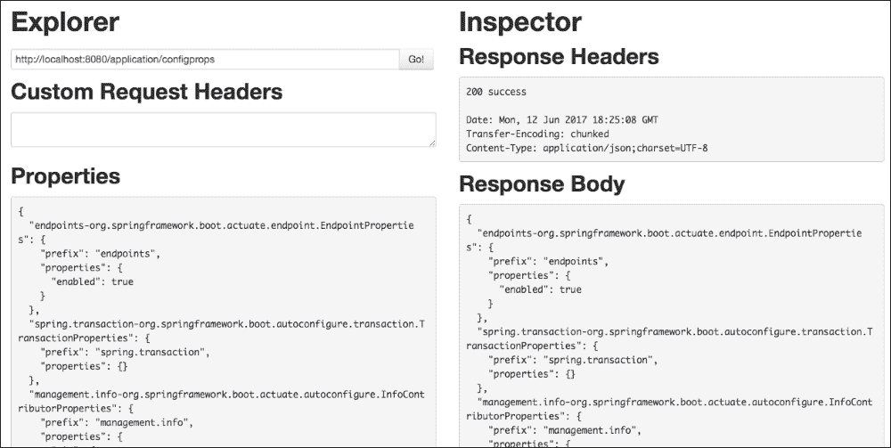

为了说明一个已知示例，以下服务响应的部分显示了 Spring MVC 可用的配置选项：

```java
"spring.mvc-  org.springframework.boot.autoconfigure.web.WebMvcProperties": {
   "prefix": "spring.mvc",
   "properties": {
                   "dateFormat": null,
                   "servlet": {
                     "loadOnStartup": -1
                  },
   "staticPathPattern": "/**",
   "dispatchOptionsRequest": true,
   "dispatchTraceRequest": false,
   "locale": null,
   "ignoreDefaultModelOnRedirect": true,
   "logResolvedException": true,
   "async": {
              "requestTimeout": null
            },
   "messageCodesResolverFormat": null,
   "mediaTypes": {},
   "view": {
             "prefix": null,
             "suffix": null
           },
   "localeResolver": "ACCEPT_HEADER",
   "throwExceptionIfNoHandlerFound": false
    }
 }
```

### 注意

为了为 Spring MVC 提供配置，我们在属性中结合了前缀和路径。例如，要配置`loadOnStartup`，我们使用名为`spring.mvc.servlet.loadOnStartup`的属性。

## 环境细节

**环境**（**env**）端点提供了有关操作系统、JVM 安装、类路径、系统环境变量以及配置在各种应用程序属性文件中的值的详细信息。以下截图显示了 HAL 浏览器中的环境端点：

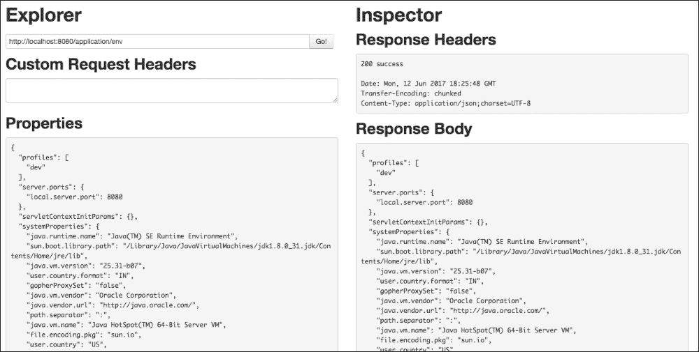

下面展示了从`/application/env`服务响应中提取的内容。它显示了几个系统细节以及应用程序配置的详细信息：

```java
"systemEnvironment": {
    "JAVA_MAIN_CLASS_13377": "com.mastering.spring.springboot.Application",
    "PATH": "/usr/bin:/bin:/usr/sbin:/sbin",
    "SHELL": "/bin/bash",
    "JAVA_STARTED_ON_FIRST_THREAD_13019": "1",
    "APP_ICON_13041": "../Resources/Eclipse.icns",
    "USER": "rangaraokaranam",
    "TMPDIR": "/var/folders/y_/x4jdvdkx7w94q5qsh745gzz00000gn/T/",
    "SSH_AUTH_SOCK": "/private/tmp/com.apple.launchd.IcESePQCLV/Listeners",
    "XPC_FLAGS": "0x0",
    "JAVA_STARTED_ON_FIRST_THREAD_13041": "1",
    "APP_ICON_11624": "../Resources/Eclipse.icns",
    "LOGNAME": "rangaraokaranam",
    "XPC_SERVICE_NAME": "0",
    "HOME": "/Users/rangaraokaranam"
  },
  "applicationConfig: [classpath:/application-prod.properties]": {
    "application.service1Timeout": "250",
    "application.service1Url": "http://abc-    prod.service.com/somethingelse",
    "application.enableSwitchForService1": "false"
  },
```

## 健康

健康服务提供了有关磁盘空间和应用程序状态的信息。以下截图显示了从 HAL 浏览器执行的服务：

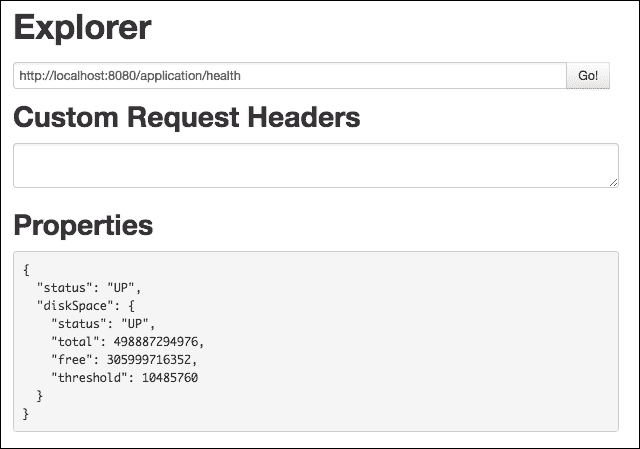

## 映射

映射端点提供了有关从应用程序公开的不同服务端点的信息：

+   URI

+   请求方法

+   实例化 bean

+   暴露服务的控制器方法

映射提供了所有`@RequestMapping`路径的汇总列表。以下是从`/application/mappings`端点响应中提取的内容：

```java
"{[/welcome-internationalized],methods=[GET]}": {
   "bean": "requestMappingHandlerMapping",
   "method": "public java.lang.String 
    com.mastering.spring.springboot.controller.
    BasicController.msg(java.uti l.Locale)"
 },
 "{[/welcome],methods=[GET]}": {
    "bean": "requestMappingHandlerMapping",
    "method": "public java.lang.String 
     com.mastering.spring.springboot.controller.
     BasicController.welcome()"
 },
 "{[/welcome-with-object],methods=[GET]}": {
     "bean": "requestMappingHandlerMapping",
     "method": "public com.mastering.spring.springboot.
      bean.WelcomeBeancom.mastering.spring.springboot.
      controller.BasicController.welcomeWithObject()"
 },
 "{[/welcome-with-parameter/name/{name}],methods=[GET]}": {
      "bean": "requestMappingHandlerMapping",
      "method": "public 
       com.mastering.spring.springboot.bean.WelcomeBean   
       com.mastering.spring.springboot.controller.
       BasicController.welcomeWithParameter(java.lang.String)"
 },
 "{[/users/{name}/todos],methods=[POST]}": {
       "bean": "requestMappingHandlerMapping",
       "method": "org.springframework.http.ResponseEntity<?>    
        com.mastering.spring.springboot.controller.
        TodoController.add(java.lang.String,com.mastering.spring.
        springboot.bean.Todo)"
  },
 "{[/users/{name}/todos],methods=[GET]}": {
        "bean": "requestMappingHandlerMapping",
        "method": "public java.util.List<com.mastering.spring.
         springboot.bean.Todo> 
         com.mastering.spring.springboot.controller.
         TodoController.retrieveTodos(java.lang.String)"
 },
 "{[/users/{name}/todos/{id}],methods=[GET]}": {
        "bean": "requestMappingHandlerMapping",
        "method": "public 
         org.springframework.hateoas.Resource<com.mastering.
         spring.springboot.bean.Todo>  
         com.mastering.spring.springboot.controller.
         TodoController.retrieveTodo(java.lang.String,int)"
 },
```

## 实例化 bean

实例化 bean 端点提供了加载到 Spring 上下文中的 bean 的详细信息。这在调试与 Spring 上下文相关的任何问题时非常有用。

```java
An extract from the response of the /application/beans endpoint is shown below:
  {
     "bean": "basicController",
     "aliases": [],
     "scope": "singleton",
     "type": "com.mastering.spring.springboot.
      controller.BasicController",
     "resource": "file [/in28Minutes/Workspaces/
      SpringTutorial/mastering-spring-lesson-5-6-  
      7/target/classes/com/mastering/spring/springboot/
      controller/BasicController.class]",
      "dependencies": [
                     "messageSource"
                    ]
   },
   {
      "bean": "todoController",
      "aliases": [],
      "scope": "singleton",
      "type": "com.mastering.spring.springboot.
       controller.TodoController",
       "resource": "file [/in28Minutes/Workspaces/SpringTutorial/
       mastering-spring-lesson-5-6-
       7/target/classes/com/mastering/spring/
       springboot/controller/TodoController.class]",
       "dependencies": [
                      "todoService"
                     ]
    }
```

它显示了两个 bean 的详细信息：`basicController`和`todoController`。你可以看到以下所有 bean 的详细信息：

+   实例化 bean 的名称及其别名

+   豆类的范围

+   实例化 bean 的类型

+   创建此 bean 的类的确切位置

+   实例化 bean 的依赖项

## 指标

指标端点显示了以下重要指标：

+   服务器--空闲内存、处理器、运行时间等

+   JVM--有关堆、线程、垃圾回收、会话等的详细信息

+   应用程序服务提供的响应

下面展示了`/application/metrics`端点响应的提取内容：

```java
{
 "mem": 481449,
 "mem.free": 178878,
 "processors": 4,
 "instance.uptime": 1853761,
 "uptime": 1863728,
 "systemload.average": 2.3349609375,
 "heap.committed": 413696,
 "heap.init": 65536,
 "heap.used": 234817,
 "heap": 932352,
 "nonheap.committed": 69248,
 "nonheap.init": 2496,
 "nonheap.used": 67754,
 "nonheap": 0,
 "threads.peak": 23,
 "threads.daemon": 21,
 "threads.totalStarted": 30,
 "threads": 23,
 "classes": 8077,
 "classes.loaded": 8078,
 "classes.unloaded": 1,
 "gc.ps_scavenge.count": 15,
 "gc.ps_scavenge.time": 242,
 "gc.ps_marksweep.count": 3,
 "gc.ps_marksweep.time": 543,
 "httpsessions.max": -1,
 "httpsessions.active": 0,
 "gauge.response.actuator": 8,
 "gauge.response.mappings": 12,
 "gauge.response.beans": 83,
 "gauge.response.health": 14,
 "gauge.response.root": 9,
 "gauge.response.heapdump": 4694,
 "gauge.response.env": 6,
 "gauge.response.profile": 12,
 "gauge.response.browser.star-star": 10,
 "gauge.response.actuator.root": 2,
 "gauge.response.configprops": 272,
 "gauge.response.actuator.star-star": 13,
 "counter.status.200.profile": 1,
 "counter.status.200.actuator": 8,
 "counter.status.200.mappings": 1,
 "counter.status.200.root": 5,
 "counter.status.200.configprops": 1,
 "counter.status.404.actuator.star-star": 3,
 "counter.status.200.heapdump": 1,
 "counter.status.200.health": 1,
 "counter.status.304.browser.star-star": 132,
 "counter.status.302.actuator.root": 4,
 "counter.status.200.browser.star-star": 37,
 "counter.status.200.env": 2,
 "counter.status.302.root": 5,
 "counter.status.200.beans": 1,
 "counter.status.200.actuator.star-star": 210,
 "counter.status.302.actuator": 1
 }
```

## 自动配置

自动配置是 Spring Boot 最重要的功能之一。自动配置端点（`/application/autoconfig`）公开了与自动配置相关的详细信息。它显示了正匹配和负匹配，并详细说明了为什么特定的自动配置成功或失败。

以下是从响应中提取的一些正匹配项：

```java
"positiveMatches": {
  "AuditAutoConfiguration#auditListener": [
   {
     "condition": "OnBeanCondition",
     "message": "@ConditionalOnMissingBean (types:     
      org.springframework.boot.actuate.audit.
      listener.AbstractAuditListener; SearchStrategy: all) did not find 
      any beans"
   }
 ],
 "AuditAutoConfiguration#authenticationAuditListener": [
 {
   "condition": "OnClassCondition",
   "message": "@ConditionalOnClass found required class
   'org.springframework.security.authentication.
   event.AbstractAuthenticationEvent'"
 },
```

以下是从响应中提取的一些负匹配项：

```java
"negativeMatches": {
  "CacheStatisticsAutoConfiguration.
   CaffeineCacheStatisticsProviderConfiguration": [
 {
   "condition": "OnClassCondition",
   "message": "@ConditionalOnClass did not find required class  
   'com.github.benmanes.caffeine.cache.Caffeine'"
 }
 ],
   "CacheStatisticsAutoConfiguration.
   EhCacheCacheStatisticsProviderConfiguration": [
 {
   "condition": "OnClassCondition",
   "message": "@ConditionalOnClass did not find required classes
   'net.sf.ehcache.Ehcache',   
   'net.sf.ehcache.statistics.StatisticsGateway'"
 }
 ],
```

所有这些详细信息对于调试自动配置非常有用。

## 调试

在调试问题时，有三个 actuator 端点非常有用：

+   `/application/heapdump`：提供堆转储

+   `/application/trace`：提供由应用程序服务的最后几个请求的跟踪信息

+   `/application/dump`: 提供线程转储

# 将应用程序部署到云

Spring Boot 对大多数流行的云**平台即服务**（**PaaS**）提供商有很好的支持。

其中一些流行的如下所示：

+   Cloud Foundry

+   Heroku

+   OpenShift

+   **亚马逊网络服务**（**AWS**）

在本节中，我们将专注于将我们的应用程序部署到 Cloud Foundry。

## Cloud Foundry

Cloud Foundry 的 Java 构建包对 Spring Boot 有很好的支持。我们可以部署基于 JAR 的独立应用程序以及传统的 Java EE WAR 应用程序。

Cloud Foundry 提供了一个 Maven 插件来部署应用程序：

```java
<build>
   <plugins>
      <plugin>
         <groupId>org.cloudfoundry</groupId>
         <artifactId>cf-maven-plugin</artifactId>
         <version>1.1.2</version>
      </plugin>
   </plugins>
</build>
```

在我们能够部署我们的应用程序之前，我们需要配置应用程序的目标和部署应用程序的空间。

以下是涉及的步骤：

+   我们需要在[`account.run.pivotal.io/sign-up`](https://account.run.pivotal.io/sign-up)创建一个 Pivotal Cloud Foundry 账户。

+   一旦我们有了账户，我们可以在[`run.pivotal.io`](https://run.pivotal.io)登录以创建一个组织和空间。准备好 org 和 space 的详细信息，因为我们需要它们来部署应用程序。

我们可以使用`org`和`space`的配置来更新插件：

```java
<build>
   <plugins>
      <plugin>
         <groupId>org.cloudfoundry</groupId>
         <artifactId>cf-maven-plugin</artifactId>
         <version>1.1.2</version>
         <configuration>
            <target>http://api.run.pivotal.io</target>
            <org>in28minutes</org>
            <space>development</space>
            <memory>512</memory>
            <env>
               <ENV-VAR-NAME>prod</ENV-VAR-NAME>
            </env>
         </configuration>
      </plugin>
   </plugins>
</build>
```

我们需要使用命令提示符或终端上的 Maven 插件登录到 Cloud Foundry：

```java
mvn cf:login -Dcf.username=<<YOUR-USER-ID>> -Dcf.password=<<YOUR-PASSWORD>>

```

如果一切顺利，您将看到如下所示的消息：

```java
 [INFO] ------------------------------------------------------------------
 [INFO] Building Your First Spring Boot Example 0.0.1-SNAPSHOT
 [INFO] -----------------------------------------------------------------
 [INFO]
 [INFO] --- cf-maven-plugin:1.1.2:login (default-cli) @ springboot-for-beginners-example ---
 [INFO] Authentication successful
 [INFO] -----------------------------------------------------------------
 [INFO] BUILD SUCCESS
 [INFO] -----------------------------------------------------------------
 [INFO] Total time: 14.897 s
 [INFO] Finished at: 2017-02-05T16:49:52+05:30
 [INFO] Final Memory: 22M/101M
 [INFO] -----------------------------------------------------------------

```

一旦您能够登录，您可以将应用程序推送到 Cloud Foundry：

```java
mvn cf:push

```

一旦我们执行了命令，Maven 将编译、运行测试、构建应用程序 JAR 或 WAR 文件，然后将其部署到云：

```java
 [INFO] Building jar: /in28Minutes/Workspaces/SpringTutorial/springboot-for-beginners-example-rest-service/target/springboot-for-beginners-example-0.0.1-SNAPSHOT.jar
 [INFO]
 [INFO] --- spring-boot-maven-plugin:1.4.0.RELEASE:repackage (default) @ springboot-for-beginners-example ---
 [INFO]
 [INFO] <<< cf-maven-plugin:1.1.2:push (default-cli) < package @ springboot-for-beginners-example <<<
 [INFO]
 [INFO] --- cf-maven-plugin:1.1.2:push (default-cli) @ springboot-for-beginners-example ---
 [INFO] Creating application 'springboot-for-beginners-example'
 [INFO] Uploading '/in28Minutes/Workspaces/SpringTutorial/springboot-for-beginners-example-rest-service/target/springboot-for-beginners-example-0.0.1-SNAPSHOT.jar'
 [INFO] Starting application
 [INFO] Checking status of application 'springboot-for-beginners-example'
 [INFO] 1 of 1 instances running (1 running)
 [INFO] Application 'springboot-for-beginners-example' is available at 'http://springboot-for-beginners-example.cfapps.io'
 [INFO] ----------------------------------------------------------------- [INFO] BUILD SUCCESS
 [INFO] ----------------------------------------------------------------- [INFO] Total time: 02:21 min
 [INFO] Finished at: 2017-02-05T16:54:55+05:30
 [INFO] Final Memory: 29M/102M
 [INFO] -----------------------------------------------------------------

```

一旦应用程序在云上运行，我们可以使用日志中的 URL 来启动应用程序：[`springboot-for-beginners-example.cfapps.io`](http://springboot-for-beginners-example.cfapps.io)。

### 注意

您可以在[`docs.run.pivotal.io/buildpacks/java/build-tool-int.html#maven`](https://docs.run.pivotal.io/buildpacks/java/build-tool-int.html#maven)找到更多关于 Cloud Foundry 的 Java 构建包的信息。

# 摘要

Spring Boot 使基于 Spring 的应用程序开发变得简单。它使我们能够非常快速地创建生产就绪的应用程序。

在本课中，我们了解了 Spring Boot 提供的不同外部配置选项。我们查看嵌入式服务器并将测试应用程序部署到 PaaS 云平台--Cloud Foundry。我们探讨了如何在生产中使用 Spring Boot Actuator 来监控我们的应用程序。最后，我们查看使开发者更高效的功能--Spring Boot 开发者工具和实时重载。

通过这种方式，我们已经到达了这本书的结尾。希望您有一个顺利的旅程，并且从使用 Spring Boot 构建微服务中获得了大量的知识。

我祝愿您未来的项目一切顺利。继续学习和探索！

# 评估

1.  The ________ 端点提供有关操作系统、JVM 安装、类路径、系统环境变量以及配置在各种应用程序属性文件中的值的详细信息。

1.  以下哪个是由云提供给 Cloud Foundry 的？

    1.  软件即服务

    1.  平台即服务

    1.  基础设施即服务

    1.  以上所有选项

1.  判断以下哪个是正确的：Spring MVC 可以通过`application.properties`进行广泛的配置。

1.  以下哪个 actuator 端点在调试时提供了应用程序最近服务的几个请求的跟踪。

    1.  `/applications/trace`

    1.  `/application/tracing`

    1.  `/app/trace`

    1.  `/apps/tracing`

1.  _________ 使得基于 Spring 的应用开发变得简单，因为它能让你快速创建生产就绪的应用程序。
