# 第一章：解密微服务

微服务是一种软件开发的架构风格和方法，以满足现代业务需求。微服务并非是创新，而是从以前的架构风格中演变而来。

我们将从更近距离地观察微服务架构从传统的大型架构演变而来。我们还将研究微服务的定义、概念和特点。最后，我们将分析微服务的典型用例，并建立微服务与其他架构方法（如面向服务的架构（SOA）和十二要素应用）之间的相似性和关系。十二要素应用定义了一套针对云平台开发应用程序的软件工程原则。

在本章中，您将学习以下内容：

+   微服务的演进

+   带有示例的微服务架构的定义

+   微服务架构的概念和特点

+   微服务架构的典型用例

+   微服务与 SOA 和十二要素应用的关系

# 微服务的演进

微服务是继 SOA 之后越来越受欢迎的架构模式之一，与 DevOps 和云相辅相成。微服务的演进受到了现代业务中颠覆性数字创新趋势和过去几年技术演进的极大影响。我们将在本节中研究这两个因素。

## 业务需求作为微服务演进的催化剂

在这个数字转型的时代，企业越来越多地采用技术作为大幅增加其收入和客户群的关键推动力之一。企业主要利用社交媒体、移动、云、大数据和物联网作为实现颠覆性创新的工具。利用这些技术，企业找到了快速渗透市场的新途径，这严重挑战了传统的 IT 交付机制。

以下图表显示了传统开发和微服务在面对敏捷性、交付速度和规模等新企业挑战方面的状态。

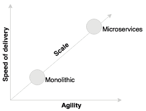

### 提示

微服务承诺比传统的大型应用程序更具敏捷性、交付速度和规模。

过去企业投资于数年的大型应用程序开发的时代已经过去了。企业不再有兴趣开发整合的应用程序来管理他们的端到端业务功能，就像几年前那样。

以下图表显示了传统的大型应用程序和微服务在周转时间和成本方面的比较。

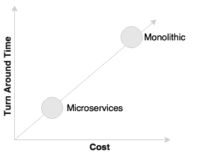

### 提示

微服务提供了一种开发快速敏捷应用程序的方法，从而降低总体成本。

例如，如今，航空公司或金融机构不再投资于重建他们的核心大型主机系统，以避免另一个庞大的怪物。零售商和其他行业也不再重建重量级供应链管理应用程序，比如他们传统的 ERP 系统。焦点已转向构建满足业务特定需求的快速解决方案，以最敏捷的方式进行。

让我们举个例子，一个在线零售商正在使用传统的大型应用程序。如果零售商希望通过根据客户的过往购物、偏好等个性化客户的产品来创新销售，并且还希望根据客户购买倾向来为客户提供产品，他们将快速开发个性化引擎或根据客户的即时需求提供优惠，并将其插入他们的传统应用程序中。

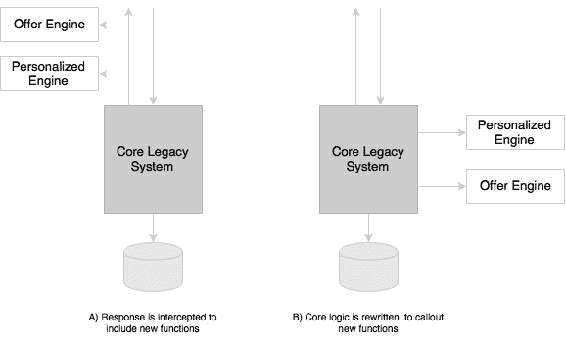

如前面的图表所示，与其投资于重建核心遗留系统，这将通过将响应通过新功能传递来完成，如图中标有**A**的部分所示，或者通过修改核心遗留系统以调用这些功能作为处理的一部分，如图中标有**B**的部分所示。这些功能通常被编写为微服务。

这种方法为组织提供了大量的机会，以较低的成本在实验模式下快速尝试新功能。企业可以随后验证关键绩效指标，并根据需要修改或替换这些实现。

### 提示

现代架构期望最大化替换其部分并最小化替换其部分的成本。微服务方法是实现这一目标的手段。

## 技术作为微服务演变的催化剂

新兴技术也使我们重新思考构建软件系统的方式。例如，几十年前，我们甚至无法想象没有两阶段提交的分布式应用程序。后来，NoSQL 数据库使我们有了不同的思考方式。

同样，技术上的这种范式转变已经重塑了软件架构的所有层面。

HTML 5 和 CSS3 的出现以及移动应用程序的进步重新定位了用户界面。诸如 Angular、Ember、React、Backbone 等客户端 JavaScript 框架因其客户端渲染和响应式设计而广受欢迎。

随着云采用成为主流，**平台即服务**（**PaaS**）提供商，如 Pivotal CF、AWS、Salesforce.com、IBM 的 Bluemix、RedHat 的 OpenShift 等，使我们重新思考构建中间件组件的方式。Docker 带来的容器革命从根本上影响了基础设施领域。如今，基础设施被视为一种商品服务。

集成景观也随着**集成平台即服务**（**iPaaS**）的出现而发生了变化。Dell Boomi、Informatica、MuleSoft 等平台是 iPaaS 的例子。这些工具帮助组织将集成边界延伸到传统企业之外。

NoSQL 已经彻底改变了数据库领域。几年前，我们只有几种流行的数据库，都基于关系数据建模原则。今天我们有了一个很长的数据库列表：Hadoop、Cassandra、CouchDB、Neo 4j 等等。每个数据库都解决了特定的架构问题。

## 命令式架构演变

应用架构一直在与不断变化的业务需求和技术的发展一起不断演进。架构已经经历了古老的主机系统的演变，到完全抽象的云服务，比如 AWS Lambda。

### 提示

使用 AWS Lambda，开发人员现在可以将他们的“功能”放入一个完全托管的计算服务中。

在[`aws.amazon.com/documentation/lambda/`](https://aws.amazon.com/documentation/lambda/)了解更多关于 Lambda 的信息。

不同的架构方法和风格，如主机、客户端服务器、N 层和面向服务的架构，在不同的时间段都很受欢迎。无论选择哪种架构风格，我们总是用来构建单片架构的一种或另一种形式。微服务架构的演变是现代业务需求（如敏捷性和交付速度）、新兴技术以及从以前一代架构中学到的结果。

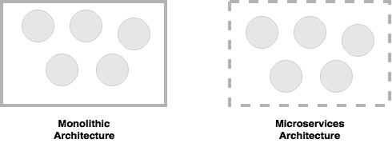

微服务帮助我们打破了单片应用程序的边界，并构建了一个逻辑上独立的更小的系统，如前面的图表所示。

### 提示

如果我们将单片应用程序视为一组逻辑子系统，包含有物理边界，那么微服务就是一组没有封闭物理边界的独立子系统。

# 什么是微服务？

微服务是许多组织今天使用的一种架构风格，作为实现高度敏捷性、交付速度和规模的游戏规则改变者。微服务为我们提供了一种开发更加物理分离的模块化应用程序的方式。

微服务并非创造出来的。许多组织，如 Netflix、亚马逊和 eBay，成功地使用分而治之的技术，将其单片应用程序功能性地分割成更小的原子单元，每个单元执行单一功能。这些组织解决了他们在单片应用程序中遇到的一些问题。

在这些组织的成功之后，许多其他组织开始将这种模式作为重构其单片应用程序的常见模式。后来，倡导者将这种模式称为微服务架构。

微服务源自 Alistair Cockburn 提出的六边形架构的概念。六边形架构也被称为端口和适配器模式。

### 提示

在[`alistair.cockburn.us/Hexagonal+architecture`](http://alistair.cockburn.us/Hexagonal+architecture)了解更多关于六边形架构。

微服务是一种建立 IT 系统的架构风格或方法，作为一组自治、自包含和松耦合的业务能力：

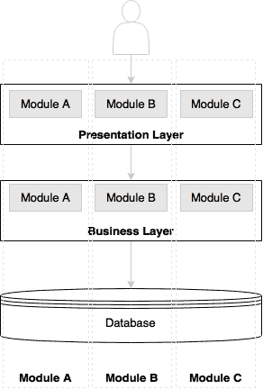

前面的图表描述了传统的 N 层应用程序架构，包括表示层、业务层和数据库层。模块**A**、**B**和**C**代表三种不同的业务能力。图表中的层代表架构关注点的分离。每个层包含与该层相关的所有三种业务能力。表示层包含所有三个模块的 Web 组件，业务层包含所有三个模块的业务组件，数据库托管所有三个模块的表。在大多数情况下，层是可以物理分开的，而层内的模块是硬连接的。

现在让我们来看看基于微服务的架构。

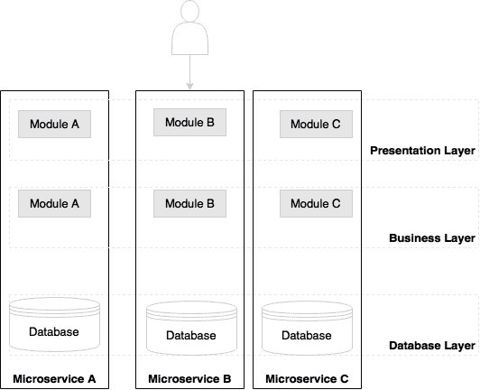

正如前面的图表所示，微服务架构中的边界是相反的。每个垂直切片代表一个微服务。每个微服务都有自己的表示层、业务层和数据库层。微服务是与业务能力对齐的。通过这样做，对一个微服务的更改不会影响其他微服务。

微服务的通信或传输机制没有标准。一般来说，微服务使用广泛采用的轻量级协议进行通信，如 HTTP 和 REST，或者消息协议，如 JMS 或 AMQP。在特定情况下，可以选择更优化的通信协议，如 Thrift、ZeroMQ、Protocol Buffers 或 Avro。

由于微服务更加符合业务能力，并且具有独立可管理的生命周期，它们是企业在采用 DevOps 和云时的理想选择。DevOps 和云是微服务的两个方面。

### 提示

DevOps 是一种 IT 重新调整，缩小传统 IT 开发和运营之间的差距，以提高效率。

了解更多关于 DevOps：

[`dev2ops.org/2010/02/what-is-devops/`](http://dev2ops.org/2010/02/what-is-devops/)

# 微服务-蜂窝类比

蜂窝是一个理想的类比，用来代表演进的微服务架构。

在现实世界中，蜜蜂通过排列六边形蜂窝来建造蜂巢。它们从小开始，使用不同的材料来建造蜂窝。建造是基于当时可用的材料。重复的蜂窝形成了一个模式，并形成了一个坚固的结构。蜂巢中的每个蜂房都是独立的，但也与其他蜂房集成在一起。通过添加新的蜂房，蜂巢有机地增长成一个大而坚固的结构。每个蜂房内部的内容是抽象的，对外不可见。一个蜂房的损坏不会影响其他蜂房，蜜蜂可以重建这些蜂房而不影响整个蜂巢。

# 微服务的原则

在这一部分，我们将研究微服务架构的一些原则。这些原则在设计和开发微服务时是“必须具备”的。

## 每个服务只有一个责任

单一责任原则是 SOLID 设计模式的一部分所定义的原则之一。它指出一个单元应该只有一个责任。

### 提示

在这里了解更多关于 SOLID 设计模式的信息：

[`c2.com/cgi/wiki?PrinciplesOfObjectOrientedDesign`](http://c2.com/cgi/wiki?PrinciplesOfObjectOrientedDesign)

这意味着一个单元，无论是类、函数还是服务，都应该只有一个责任。在任何时候，两个单元都不应该共享一个责任，或者一个单元有多个责任。一个具有多个责任的单元表示紧密耦合。

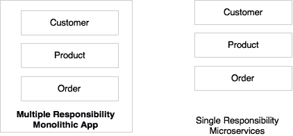

如前图所示，**Customer**、**Product**和**Order**是电子商务应用程序的不同功能。与其将它们全部构建到一个应用程序中，最好是有三个不同的服务，每个负责一个业务功能，这样对一个责任的更改不会影响其他责任。在前述情景中，**Customer**、**Product**和**Order**将被视为三个独立的微服务。

## 微服务是自治的

微服务是自包含的、独立部署的、自治的服务，完全负责业务能力及其执行。它们捆绑了所有依赖，包括库依赖，以及抽象物理资源的执行环境，如 Web 服务器、容器或虚拟机。

微服务和 SOA 之间的一个主要区别在于它们的自治级别。虽然大多数 SOA 实现提供服务级别的抽象，但微服务更进一步，抽象了实现和执行环境。

在传统的应用程序开发中，我们构建一个 WAR 或 EAR，然后将其部署到 JEE 应用服务器，如 JBoss、WebLogic、WebSphere 等。我们可能会将多个应用程序部署到同一个 JEE 容器中。在微服务方法中，每个微服务将被构建为一个 fat Jar，嵌入所有依赖项，并作为一个独立的 Java 进程运行。

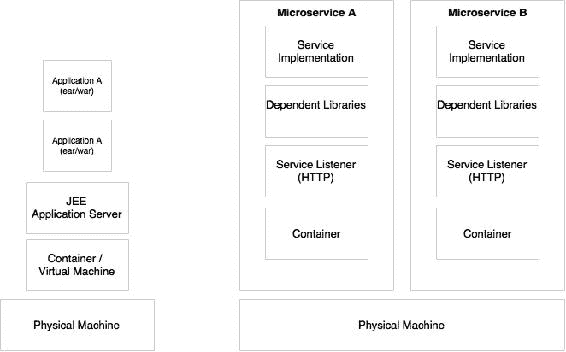

微服务也可以获得自己的容器来执行，如前图所示。容器是可移植的、独立可管理的、轻量级的运行时环境。容器技术，如 Docker，是微服务部署的理想选择。

# 微服务的特点

本章前面讨论的微服务定义是任意的。倡导者和实践者对微服务有着强烈但有时不同的看法。对于微服务并没有一个单一、具体和普遍接受的定义。然而，所有成功的微服务实现都表现出一些共同的特征。因此，重要的是要理解这些特征，而不是坚持理论上的定义。本节详细介绍了一些共同的特征。

## 服务是一等公民

在微服务世界中，服务是一等公民。微服务将服务端点公开为 API，并抽象了所有实现细节。内部实现逻辑、架构和技术（包括编程语言、数据库、服务质量机制等）完全隐藏在服务 API 的后面。

此外，在微服务架构中，不再有应用程序开发；相反，组织专注于服务开发。在大多数企业中，这需要应用程序构建方式的重大文化转变。

在**客户资料**微服务中，诸如数据结构、技术、业务逻辑等的内部细节被隐藏起来。它们不会暴露或对任何外部实体可见。访问是通过服务端点或 API 进行限制的。例如，客户资料微服务可以公开**注册客户**和**获取客户**作为其他人与之交互的两个 API。

### 微服务中的服务特性

由于微服务在某种程度上类似于 SOA，因此在微服务中也适用于 SOA 中定义的许多服务特性。

以下是一些适用于微服务的服务特性：

+   **服务契约**：与 SOA 类似，微服务通过明确定义的服务契约进行描述。在微服务世界中，JSON 和 REST 被普遍接受用于服务通信。在 JSON/REST 的情况下，有许多用于定义服务契约的技术。JSON Schema、WADL、Swagger 和 RAML 是一些例子。

+   **松耦合**：微服务是独立的和松耦合的。在大多数情况下，微服务接受事件作为输入，并以另一个事件作为响应。消息传递、HTTP 和 REST 通常用于微服务之间的交互。基于消息的端点提供更高级别的解耦。

+   **服务抽象**：在微服务中，服务抽象不仅是服务实现的抽象，还提供了所有库和环境细节的完全抽象，正如前面讨论的那样。

+   **服务重用**：微服务是粗粒度可重用的业务服务。这些服务可以被移动设备和桌面渠道、其他微服务，甚至其他系统访问。

+   **无状态性**：设计良好的微服务是无状态的，不共享任何共享状态或由服务维护的对话状态。如果需要维护状态，它们会在数据库中维护，可能是在内存中。

+   **服务可发现性**：微服务是可发现的。在典型的微服务环境中，微服务会自我宣传其存在，并使自己可供发现。当服务终止时，它们会自动从微服务生态系统中退出。

+   **服务互操作性**：服务是可互操作的，因为它们使用标准协议和消息交换标准。消息传递、HTTP 等被用作传输机制。在微服务世界中，REST/JSON 是开发可互操作服务最流行的方法。在需要进一步优化通信的情况下，可以使用其他协议，如 Protocol Buffers、Thrift、Avro 或 Zero MQ。然而，使用这些协议可能会限制服务的整体互操作性。

+   **服务可组合性**：微服务是可组合的。服务可组合性是通过服务编排或服务编舞来实现的。

### 提示

有关 SOA 原则的更多细节可以在以下找到：

[`serviceorientation.com/serviceorientation/index`](http://serviceorientation.com/serviceorientation/index)

## 微服务是轻量级的

设计良好的微服务与单一业务能力对齐，因此它们只执行一个功能。因此，在大多数实现中，我们看到的共同特征是具有较小足迹的微服务。

在选择支持技术（如 Web 容器）时，我们必须确保它们也是轻量级的，以便整体占用空间保持可管理。例如，Jetty 或 Tomcat 作为微服务的应用容器，与 WebLogic 或 WebSphere 等更复杂的传统应用服务器相比更好。

与 VMWare 或 Hyper-V 等虚拟化技术相比，Docker 等容器技术还可以帮助我们尽可能地减少基础设施的占用空间。

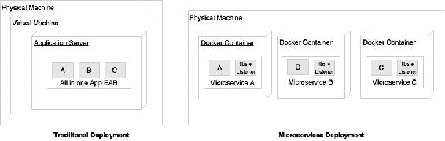

如前图所示，微服务通常部署在 Docker 容器中，这些容器封装了业务逻辑和所需的库。这有助于我们在新机器上或完全不同的托管环境甚至不同的云提供商之间快速复制整个设置。由于没有物理基础设施依赖，容器化的微服务非常易于移植。

## 多语言架构的微服务

由于微服务是自治的，并且将一切都抽象在服务 API 后面，因此可能会有不同的微服务采用不同的架构。微服务实现中常见的一些特征包括：

+   不同的服务使用相同技术的不同版本。一个微服务可能是基于 Java 1.7 编写的，另一个可能是基于 Java 1.8 的。

+   不同的语言用于开发不同的微服务，例如一个微服务用 Java 开发，另一个用 Scala 开发。

+   使用不同的架构，例如一个微服务使用 Redis 缓存来提供数据，而另一个微服务可能使用 MySQL 作为持久性数据存储。

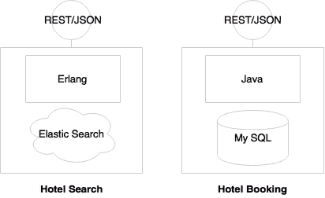

在前面的例子中，由于**酒店搜索**预计具有高交易量和严格的性能要求，因此使用 Erlang 进行实现。为了支持预测搜索，使用 Elasticsearch 作为数据存储。同时，**酒店预订**需要更多的 ACID 事务特性。因此，它使用 MySQL 和 Java 进行实现。内部实现被隐藏在定义为 REST/JSON over HTTP 的服务端点后面。

## 微服务环境中的自动化

大多数微服务实现都是从开发到生产的最大程度自动化的。

由于微服务将单片应用程序分解为多个较小的服务，大型企业可能会看到微服务的激增。除非自动化到位，否则大量微服务很难管理。微服务的较小占用空间也有助于我们自动化微服务的开发到部署生命周期。总的来说，微服务是端到端自动化的，例如自动化构建、自动化测试、自动化部署和弹性扩展。

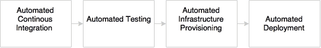

如前图所示，在开发、测试、发布和部署阶段通常会应用自动化：

+   开发阶段使用版本控制工具（如 Git）与**持续集成**（**CI**）工具（如 Jenkins、Travis CI 等）进行自动化。这也可能包括代码质量检查和单元测试的自动化。微服务也可以实现每次代码提交时进行完整构建的自动化。

+   测试阶段将使用 Selenium、Cucumber 和其他 AB 测试策略等测试工具进行自动化。由于微服务与业务能力对齐，因此相对于单片应用程序，自动化的测试用例数量较少，因此每次构建都可以进行回归测试。

+   基础设施的配置是通过诸如 Docker 之类的容器技术进行的，再加上诸如 Chef 或 Puppet 之类的发布管理工具，以及诸如 Ansible 之类的配置管理工具。自动化部署使用诸如 Spring Cloud、Kubernetes、Mesos 和 Marathon 之类的工具进行处理。

## 具有支持生态系统的微服务

大多数大规模的微服务实现都有一个支持生态系统。生态系统的能力包括 DevOps 流程、集中式日志管理、服务注册表、API 网关、广泛的监控、服务路由和流量控制机制。

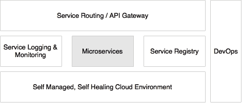

当前图表中所代表的支持能力齐备时，微服务运行良好。

## 微服务是分布式和动态的

成功的微服务实现将逻辑和数据封装在服务内部。这导致了两种非常规的情况：分布式数据和逻辑以及分散的治理。

与将所有逻辑和数据整合到一个应用边界的传统应用程序相比，微服务将数据和逻辑分散化。每个服务都与特定的业务能力对齐，拥有自己的数据和逻辑。

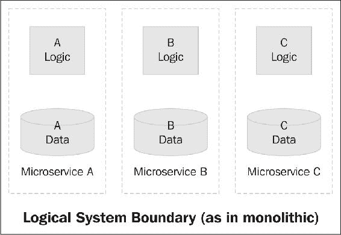

前面图表中的虚线表示逻辑单片应用边界。当我们将其迁移到微服务时，每个微服务 A、B 和 C 都创建了自己的物理边界。

微服务通常不使用像 SOA 中那样的集中式治理机制。微服务实现的一个共同特点是它们不依赖于重量级的企业级产品，如企业服务总线（ESB）。相反，业务逻辑和智能被嵌入到服务本身中。

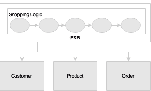

前面图表中显示了典型的 SOA 实现。购物逻辑完全在 ESB 中实现，通过编排由客户、订单和产品提供的不同服务。另一方面，在微服务方法中，购物本身将作为一个独立的微服务运行，以一种相当解耦的方式与客户、产品和订单进行交互。

SOA 实现严重依赖于静态注册表和存储库配置来管理服务和其他工件。微服务为此带来了更加动态的特性。因此，静态治理方法被视为在维护最新信息方面的负担。这就是为什么大多数微服务实现使用自动化机制从运行时拓扑动态构建注册表信息。

## 反脆弱性、快速失败和自愈

反脆弱性是 Netflix 成功实验的一种技术。这是现代软件开发中构建故障安全系统的最强大方法之一。

### 提示

反脆弱性概念是由纳西姆·尼古拉斯·塔勒布在他的书《反脆弱：从混乱中获益的事物》中引入的。

在反脆弱性实践中，软件系统不断受到挑战。软件系统通过这些挑战不断发展，并在一段时间内变得越来越擅长应对这些挑战。亚马逊的 GameDay 练习和 Netflix 的 Simian Army 是这种反脆弱性实验的很好例子。

快速失败是另一个用于构建容错、弹性系统的概念。这种理念主张期望系统出现故障，而不是构建永远不会出现故障的系统。重要的是系统能够多快地失败，以及如果失败了，它能够多快地从失败中恢复。采用这种方法，重点从“平均故障间隔时间”（MTBF）转移到“平均恢复时间”（MTTR）。这种方法的一个关键优势是，如果出现问题，系统会自行终止，并且下游功能不会受到压力。

自愈在微服务部署中通常被使用，系统会自动从失败中学习并进行调整。这些系统还可以防止未来的失败。

# 微服务示例

在实施微服务时，没有“一刀切”的方法。在本节中，将分析不同的示例来阐明微服务的概念。

## 假期门户网站示例

在第一个示例中，我们将回顾一个假期门户网站，**Fly By Points**。Fly By Points 收集了当客户通过在线网站预订酒店、航班或汽车时积累的积分。当客户登录 Fly By Points 网站时，他/她可以看到积累的积分、通过兑换积分可以获得的个性化优惠以及即将到来的旅行（如果有的话）。

假设前一页是登录后的主页。**Jeo**有两次即将到来的旅行，四个个性化的优惠和 21,123 积分。当用户点击每个框时，将查询并显示详细信息。

假期门户网站采用了基于 Java Spring 的传统单体应用架构，如下所示：

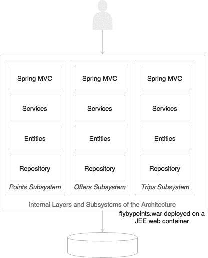

如前图所示，假期门户网站的架构是基于 Web 的模块化架构，各层之间有明确的分离。按照通常的做法，假期门户网站也部署为单个 WAR 文件，放在诸如 Tomcat 之类的 Web 服务器上。数据存储在一个全面的关系型数据库中。当业务增长、用户基数扩大并且复杂性增加时，交易量也会成比例增加。在这一点上，企业应该考虑将单体应用重新架构为微服务，以获得更快的交付速度、灵活性和可管理性。

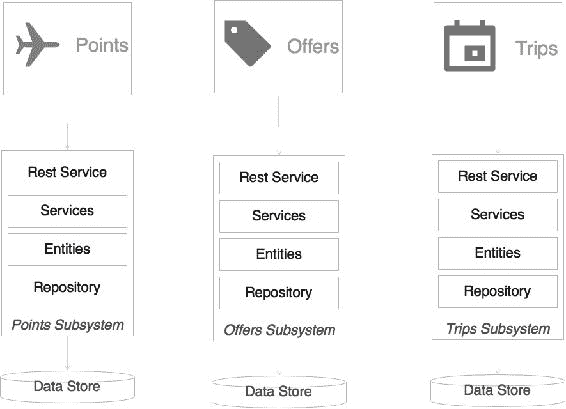

检查这个应用程序的简单微服务版本时，我们可以立即注意到架构中的一些事情：

+   每个子系统现在都成为了一个独立的系统，即一个微服务。有三个微服务代表三个业务功能：**Trips**、**Offers**和**Points**。每个微服务都有自己的内部数据存储和中间层。每个服务的内部结构保持不变。

+   每个服务都封装了自己的数据库以及自己的 HTTP 监听器。与之前的模型相反，没有 Web 服务器或 WAR。相反，每个服务都有自己的嵌入式 HTTP 监听器，如 Jetty、Tomcat 等。

+   每个微服务都会暴露一个 REST 服务来操作属于该服务的资源/实体。

假设呈现层是使用客户端 JavaScript MVC 框架（如 Angular JS）开发的。这些客户端框架能够直接调用 REST 调用。

当网页加载时，三个框，Trips、Offers 和 Points 将显示出来，包括积分、优惠数量和旅行次数等详细信息。每个框都会独立地通过 REST 对应的后端微服务进行异步调用。服务层之间没有依赖关系。当用户点击任何一个框时，屏幕将进行过渡并加载所点击项目的详细信息。这将通过对应微服务的另一个调用来完成。

## 基于微服务的订单管理系统

让我们再来看一个微服务示例：在线零售网站。在这种情况下，我们将更多地关注后端服务，比如处理订单事件的订单服务，当客户通过网站下订单时会生成订单事件：

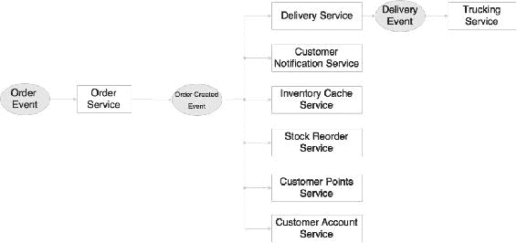

这个微服务系统完全基于反应式编程实践设计。

### 提示

在以下网址阅读有关响应式编程的更多信息：

[`www.reactivemanifesto.org`](http://www.reactivemanifesto.org)

当事件发布时，许多微服务准备好在接收事件时启动。它们每一个都是独立的，不依赖于其他微服务。这种模型的优势在于我们可以不断添加或替换微服务以满足特定需求。

在上图中，显示了八个微服务。在**订单事件**到达时，发生以下活动：

1.  订单服务在接收到订单事件时启动。订单服务创建订单并将详细信息保存到自己的数据库中。

1.  如果订单成功保存，订单服务将创建并发布订单成功事件。

1.  当订单成功事件到达时，一系列操作发生。

1.  交付服务接受事件并放置交付记录以将订单交付给客户。这反过来生成交付事件并发布事件。

1.  运输服务接收交付事件并处理。例如，运输服务创建运输计划。

1.  客户通知服务向客户发送通知，通知客户订单已经下达。

1.  库存缓存服务使用可用产品数量更新库存缓存。

1.  库存重新订购服务检查库存限制是否足够，并在需要时生成补货事件。

1.  客户积分服务根据此购买重新计算客户的忠诚积分。

1.  **客户账户服务**更新客户账户中的订单历史记录。

在这种方法中，每个服务只负责一个功能。服务接受并生成事件。每个服务都是独立的，不知道自己的邻居。因此，邻居可以像蜂窝类比中提到的那样有机地增长。新服务可以根据需要添加。添加新服务不会影响任何现有服务。

## 旅行代理门户的示例

这第三个示例是一个简单的旅行代理门户应用程序。在这个例子中，我们将看到同步的 REST 调用以及异步事件。

在这种情况下，门户只是一个包含多个菜单项或链接的容器应用程序。当请求特定页面时，例如当单击菜单或链接时，它们将从特定的微服务加载。

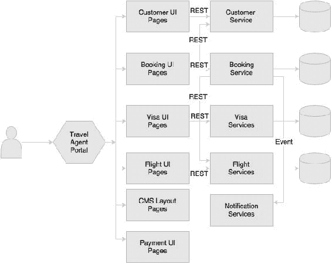

当客户请求预订时，内部发生以下事件：

1.  旅行代理打开航班 UI，搜索航班，并为客户确定合适的航班。在幕后，航班 UI 是从航班微服务加载的。航班 UI 只与航班微服务内部的自己的后端 API 交互。在这种情况下，它通过 REST 调用航班微服务来加载要显示的航班。

1.  然后，旅行代理通过访问客户 UI 查询客户详细信息。与航班 UI 类似，客户 UI 是从客户微服务加载的。客户 UI 中的操作将在客户微服务上调用 REST 调用。在这种情况下，通过调用客户微服务上的适当 API 加载客户详细信息。

1.  然后，旅行代理检查客户的签证详细信息，以确定客户是否有资格前往所选国家。这也遵循前两点中提到的相同模式。

1.  接下来，旅行代理使用预订微服务的预订 UI 进行预订，这再次遵循相同的模式。

1.  支付页面是从支付微服务加载的。一般来说，支付服务有额外的约束条件，比如 PCIDSS 合规性（保护和加密数据在传输和静态数据）。微服务方法的优势在于，与单体应用相比，其他微服务不需要考虑 PCIDSS 的监管范围，而单体应用中整个应用都受 PCIDSS 规则的约束。支付也遵循前面描述的模式。

1.  一旦预订提交，预订微服务调用航班服务来验证和更新航班预订。这种编排是作为预订微服务的一部分定义的。进行预订的智能也保存在预订微服务中。作为预订过程的一部分，它还验证、检索和更新客户微服务。

1.  最后，预订微服务发送预订事件，通知服务接收并向客户发送通知。

这里的有趣因素是，我们可以在不影响其他微服务的情况下更改微服务的用户界面、逻辑和数据。

这是一种清晰而整洁的方法。可以通过组合不同微服务的不同屏幕来构建许多门户应用程序，特别是针对不同的用户群体。整体行为和导航将由门户应用程序控制。

除非页面是根据这种方法设计的，否则这种方法会面临许多挑战。请注意，网站布局和静态内容将由**内容管理系统**（**CMS**）作为布局模板加载。或者，这些内容可以存储在 Web 服务器上。网站布局可能包含从微服务在运行时加载的 UI 片段。

# 微服务的好处

微服务相对于传统的多层、单片架构有许多优势。本节解释了微服务架构方法的一些关键优势。

## 支持多语言架构

有了微服务，架构师和开发人员可以为每个微服务选择合适的架构和技术。这样可以灵活地以更具成本效益的方式设计更合适的解决方案。

由于微服务是自治和独立的，每个服务可以使用自己的架构或技术，或者不同版本的技术运行。

以下是一个简单、实际的微服务多语言架构的示例。

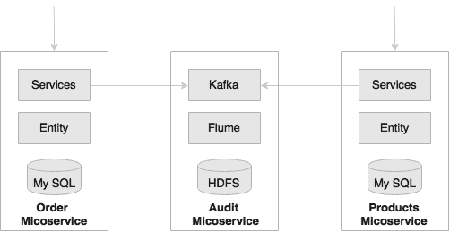

有一个要求对所有系统交易进行审计，并记录诸如请求和响应数据、发起交易的用户、调用的服务等交易细节。

如前图所示，核心服务如订单和产品微服务使用关系型数据存储，而审计微服务将数据持久化在 Hadoop 文件系统（HDFS）中。在存储大数据量的情况下，关系型数据存储既不理想也不划算，比如审计数据。在单体架构中，应用通常使用一个共享的单一数据库来存储订单、产品和审计数据。

在这个例子中，审计服务是一个使用不同架构的技术微服务。同样，不同的功能服务也可以使用不同的架构。

在另一个例子中，可能有一个运行在 Java 7 上的预订微服务，而搜索微服务可能在 Java 8 上运行。同样，订单微服务可以用 Erlang 编写，而交付微服务可以使用 Go 语言。这些在单体架构中都是不可能的。

## 促进实验和创新

现代企业正在追求快速成功。微服务是企业实施颠覆性创新的关键推动因素之一，因为它们提供了实验和快速失败的能力。

由于服务相当简单且规模较小，企业可以承担尝试新的流程、算法、业务逻辑等。对于大型单片应用程序，实验并不容易；也不直接或成本效益高。企业必须花费巨资来构建或更改应用程序以尝试新的东西。使用微服务，可以编写一个小型微服务来实现目标功能，并以一种反应式的方式将其插入系统中。然后可以对新功能进行几个月的实验，如果新的微服务不如预期那样工作，我们可以更改或替换为另一个。与单片方法相比，变更成本将大大降低。

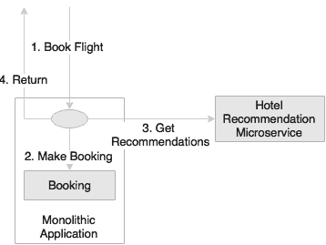

在另一个航空公司预订网站的示例中，航空公司希望在其预订页面上显示个性化的酒店推荐。这些推荐必须显示在预订确认页面上。

如前图所示，编写一个可以插入单片应用程序预订流程的微服务比在单片应用程序本身中包含此要求更方便。航空公司可以选择从一个简单的推荐服务开始，并不断用更新的版本替换，直到满足所需的准确性。

## 弹性和可选择性可扩展

由于微服务是较小的工作单元，它们使我们能够实现选择性的可伸缩性。

不同功能在应用程序中可能有不同的可伸缩性要求。作为单个 WAR 或 EAR 打包的单片应用程序只能作为一个整体进行扩展。当 I/O 密集型功能以高速数据流进行传输时，很容易降低整个应用程序的服务水平。

在微服务的情况下，每个服务都可以独立地进行横向或纵向扩展。由于可在每个服务上选择性地应用可伸缩性，因此与微服务方法相比，扩展的成本相对较低。

在实践中，有许多不同的方法可用于扩展应用程序，这在很大程度上取决于应用程序的架构和行为。**Scale Cube**主要定义了扩展应用程序的三种方法：

+   通过水平克隆应用程序来扩展*x*轴

+   通过分割不同的功能来扩展*y*轴

+   通过分区或分片数据来扩展*z*轴

### 提示

在以下网站了解有关 Scale Cube 的更多信息：

[`theartofscalability.com/`](http://theartofscalability.com/)

当将*y*轴扩展应用于单片应用程序时，它将单片应用程序分解为与业务功能对齐的较小单元。许多组织成功地应用了这种技术，摆脱了单片应用程序。原则上，功能的结果单元符合微服务的特征。

例如，在典型的航空公司网站上，统计数据表明，航班搜索与航班预订的比例可能高达 500:1。这意味着每 500 次搜索交易就会有一次预订交易。在这种情况下，搜索需要比预订功能多 500 倍的可伸缩性。这是选择性扩展的理想用例。

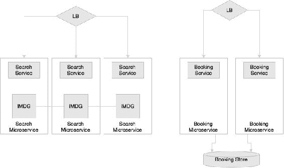

解决方案是将搜索请求和预订请求区分对待。在单片架构中，这只有在规模立方体的*z*扩展中才可能。然而，这种方法很昂贵，因为在*z*规模中，整个代码库都会被复制。

在前面的图表中，搜索和预订被设计为不同的微服务，以便搜索可以与预订不同比例地扩展。在图表中，搜索有三个实例，预订有两个实例。选择性的可伸缩性不仅限于实例的数量，如图表所示，还包括微服务的架构方式。在搜索的情况下，可以使用诸如 Hazelcast 之类的**内存数据网格**（**IMDG**）作为数据存储。这将进一步提高搜索的性能和可伸缩性。当实例化一个新的搜索微服务实例时，将向 IMDG 集群添加一个额外的 IMDG 节点。预订不需要相同级别的可伸缩性。在预订的情况下，预订的两个实例都连接到同一个数据库实例。

## 允许替换

微服务是自包含的、独立的部署模块，使得可以用另一个类似的微服务替换一个微服务。

许多大型企业遵循购买与自建政策来实施软件系统。一个常见的情况是大部分功能在内部开发，而从外部专家购买某些特定的能力。这在传统的单片应用程序中存在挑战，因为这些应用程序组件高度内聚。试图将第三方解决方案插入单片应用程序会导致复杂的集成。而在微服务中，这不是事后想法。从架构上看，一个微服务可以很容易地被另一个内部开发的微服务或者来自第三方的微服务所替代。

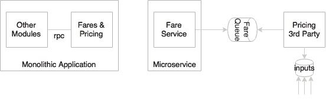

航空公司业务中的定价引擎是复杂的。不同航线的票价是使用复杂的数学公式计算的，称为定价逻辑。航空公司可以选择从市场上购买定价引擎，而不是自行开发产品。在单片架构中，定价是票价和预订的一个功能。在大多数情况下，定价、票价和预订都是硬编码的，几乎不可能分离。

在设计良好的微服务系统中，预订、票价和定价将是独立的微服务。替换定价微服务对其他任何服务的影响将最小，因为它们都是松散耦合和独立的。今天，它可能是第三方服务；明天，它可能很容易被另一个第三方或自行开发的服务所替代。

## 使有机系统建设成为可能

微服务帮助我们构建有机性质的系统。这在逐步将单片系统迁移到微服务时非常重要。

有机系统是指随着时间的推移，通过不断添加更多功能而横向增长的系统。在实践中，一个应用程序在其生命周期内增长得难以想象地庞大，而且在大多数情况下，应用程序的可管理性在同一时期内急剧减少。

微服务是关于独立可管理的服务。这使我们能够在需要时不断添加更多的服务，对现有服务的影响最小。构建这样的系统并不需要巨额资本投资。因此，企业可以将其作为运营支出的一部分不断建设。

多年前，一家航空公司建立了一个忠诚度系统，针对个人乘客。一切都很顺利，直到航空公司开始向其企业客户提供忠诚度福利。企业客户是以公司为单位分组的个人。由于当前系统的核心数据模型是扁平的，针对个人，企业环境需要对核心数据模型进行根本性的改变，因此需要大量的重塑，以满足这一要求。

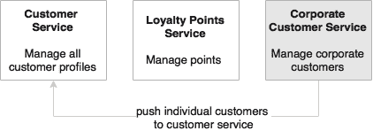

如前图所示，在基于微服务的架构中，客户信息将由客户微服务管理，忠诚度将由忠诚度积分微服务管理。

在这种情况下，很容易添加一个新的企业客户微服务来管理企业客户。当一个公司注册时，个别成员将被推送到客户微服务中，以便像往常一样管理他们。企业客户微服务通过从客户微服务中聚合数据来提供企业视图。它还将提供支持企业特定业务规则的服务。采用这种方法，添加新服务对现有服务的影响将最小化。

## 帮助减少技术债务

由于微服务体积较小且依赖性较小，它们允许以最小成本迁移使用末期技术的服务。

技术变化是软件开发中的障碍之一。在许多传统的单片应用程序中，由于技术的快速变化，今天的下一代应用程序甚至在发布到生产之前就可能成为遗留系统。架构师和开发人员倾向于通过添加抽象层来保护技术变化。然而，实际上，这种方法并不能解决问题，反而导致了过度设计的系统。由于技术升级通常是风险和昂贵的，并且对业务没有直接回报，因此业务可能不愿意投资于减少应用程序的技术债务。

使用微服务，可以单独为每个服务更改或升级技术，而不是升级整个应用程序。

例如，将使用 EJB 1.1 和 Hibernate 编写的五百万行代码升级到 Spring、JPA 和 REST 服务几乎等同于重写整个应用程序。在微服务世界中，这可以逐步完成。

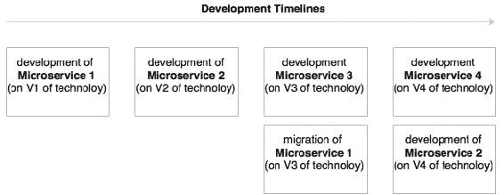

如前图所示，旧版本的服务在旧版本的技术上运行，而新服务开发可以利用最新的技术。与增强单片应用程序相比，使用末期技术迁移微服务的成本要低得多。

## 允许不同版本的共存

由于微服务将服务运行时环境与服务本身打包在一起，这使得同一环境中可以存在多个服务版本。

将出现需要同时运行同一服务的多个版本的情况。零停机推广，其中必须从一个版本平稳地切换到另一个版本，就是这样一个情况的例子，因为会有一个时间窗口，两个服务必须同时运行。对于单片应用程序来说，这是一个复杂的过程，因为在集群的一个节点中升级新服务是很麻烦的，例如，这可能导致类加载问题。金丝雀发布，其中新版本只发布给少数用户以验证新服务，是另一个需要多个服务版本共存的例子。

使用微服务，这两种情况都很容易管理。由于每个微服务都使用独立的环境，包括像 Tomcat 或 Jetty 嵌入式的服务监听器，因此可以发布多个版本并在没有太多问题的情况下进行平稳过渡。当消费者查找服务时，他们会寻找特定版本的服务。例如，在金丝雀发布中，新用户界面发布给用户 A。当用户 A 发送请求到微服务时，它会查找金丝雀发布版本，而所有其他用户将继续查找上一个生产版本。

在数据库层面需要注意确保数据库设计始终向后兼容，以避免破坏更改。

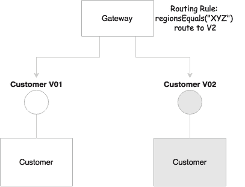

如前图所示，**客户**服务的版本 1 和 2 可以共存，因为它们不会相互干扰，考虑到它们各自的部署环境。路由规则可以在网关处设置，以将流量转发到特定实例，如图所示。或者，客户端可以在请求本身中请求特定版本。在图中，网关根据请求的来源地选择版本。

## 支持自组织系统的构建

微服务帮助我们构建自组织系统。自组织系统支持将自动化部署，具有弹性，并展现自愈和自学习能力。

在良好架构的微服务系统中，服务不知道其他服务。它接受来自选定队列的消息并处理它。在处理结束时，它可能发送另一条消息，触发其他服务。这使我们可以将任何服务放入生态系统中，而无需分析对整个系统的影响。根据输入和输出，服务将自组织到生态系统中。不需要额外的代码更改或服务编排。没有中央大脑来控制和协调流程。

想象一下，现有的通知服务监听**INPUT**队列并将通知发送到**SMTP**服务器，如下图所示：

支持自组织系统的构建

假设以后需要引入一个个性化引擎，负责将消息的语言更改为客户的母语，以在发送给客户之前个性化消息，个性化引擎负责将消息的语言更改为客户的母语。

支持自组织系统的构建

使用微服务，将创建一个新的个性化微服务来执行此任务。输入队列将在外部配置服务器中配置为 INPUT，并且个性化服务将从 INPUT 队列中获取消息（之前由通知服务使用），并在完成处理后将消息发送到 OUTPUT 队列。通知服务的输入队列将然后发送到 OUTPUT。从下一刻起，系统将自动采用这种新的消息流。

## 支持事件驱动架构

微服务使我们能够开发透明的软件系统。传统系统通过本机协议相互通信，因此表现为黑匣子应用程序。业务事件和系统事件，除非明确发布，否则很难理解和分析。现代应用程序需要数据进行业务分析，以了解动态系统行为，并分析市场趋势，它们还需要响应实时事件。事件是数据提取的有用机制。

良好架构的微服务始终使用事件作为输入和输出。这些事件可以被任何服务利用。一旦提取，事件可以用于各种用例。

例如，业务希望实时查看按产品类型分类的订单速度。在单片系统中，我们需要考虑如何提取这些事件。这可能会对系统造成改变。

支持事件驱动架构

在微服务世界中，**订单事件**在订单创建时已经发布。这意味着只需要添加一个新的服务来订阅相同的主题，提取事件，执行请求的聚合，并推送另一个事件供仪表板消费。

## 启用 DevOps

微服务是 DevOps 的关键推动因素之一。DevOps 被广泛采用作为许多企业的实践，主要是为了提高交付速度和敏捷性。成功采用 DevOps 需要文化变革、流程变革以及架构变革。DevOps 主张具有敏捷开发、高速发布周期、自动化测试、自动化基础设施配置和自动化部署。

用传统的单片应用程序自动化所有这些过程是非常难以实现的。微服务并不是终极答案，但在许多 DevOps 实施中，微服务处于中心舞台。许多 DevOps 工具和技术也围绕着微服务的使用而不断发展。

考虑一个需要数小时才能完成完整构建并且需要 20 到 30 分钟才能启动应用程序的单片应用程序；可以看出这种应用程序不太适合 DevOps 自动化。很难在每次提交时自动化持续集成。由于大型的单片应用程序不太适合自动化，连续测试和部署也很难实现。

另一方面，小型微服务更易于自动化，并且因此更容易支持这些要求。

微服务还可以为开发提供更小、更专注的敏捷团队。团队将根据微服务的边界进行组织。

# 与其他架构风格的关系

现在我们已经看到了微服务的特点和好处，在本节中，我们将探讨微服务与其他密切相关的架构风格（如 SOA 和十二要素应用）的关系。

## 与 SOA 的关系

SOA 和微服务遵循类似的概念。在本章的前面，我们讨论了微服务是从 SOA 发展而来的，并且许多服务特点在这两种方法中都是共通的。

然而，它们是相同的还是不同的？

由于微服务是从 SOA 发展而来的，许多微服务的特点与 SOA 相似。让我们首先来看一下 SOA 的定义。

*The Open Group*联盟对 SOA 的定义如下：

> “面向服务的架构（SOA）是一种支持服务定位的架构风格。服务定位是一种以服务和基于服务的开发思维方式以及服务的结果。
> 
> 一个服务：
> 
> 是一个可重复的业务活动的逻辑表示，具有指定的结果（例如，检查客户信用、提供天气数据、整合钻井报告）
> 
> 它是自包含的。
> 
> 它可能由其他服务组成。
> 
> 对于服务的消费者来说，这是一个“黑匣子”。

我们也在微服务中观察到了类似的方面。那么，微服务有什么不同之处呢？答案是：这取决于情况。

对于上一个问题的答案可能是肯定的，也可能是否定的，这取决于组织及其对 SOA 的采用。SOA 是一个更广泛的术语，不同的组织以不同的方式来解决不同的组织问题。微服务和 SOA 之间的区别在于组织如何对待 SOA。

为了明确，将研究一些案例。

### 面向服务的集成

面向服务的集成是指许多组织使用的基于服务的集成方法。

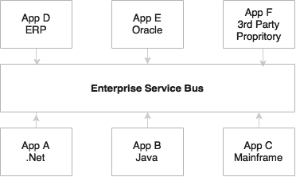

许多组织主要使用 SOA 来解决其集成复杂性，也被称为集成意大利面。一般来说，这被称为**面向服务的集成**（**SOI**）。在这种情况下，应用程序通过一个通用的集成层使用标准协议和消息格式进行通信，例如基于 SOAP/XML 的 Web 服务通过 HTTP 或 JMS。这些类型的组织专注于**企业集成模式**（**EIP**）来建模其集成需求。这种方法严重依赖于重量级的 ESB，如 TIBCO Business Works、WebSphere ESB、Oracle ESB 等。大多数 ESB 供应商还打包了一套相关产品，如规则引擎、业务流程管理引擎等，作为 SOA 套件。这些组织的集成深深扎根于他们的产品中。他们要么在 ESB 层中编写繁重的编排逻辑，要么在服务总线中编写业务逻辑本身。在这两种情况下，所有企业服务都通过 ESB 部署和访问。这些服务通过企业治理模型进行管理。对于这样的组织，微服务与 SOA 完全不同。

### 遗留系统现代化

SOA 也用于在遗留应用程序之上构建服务层。

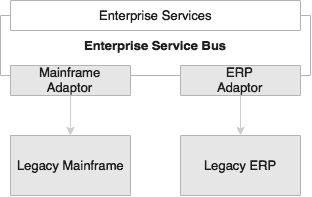

另一类组织将在转型项目或遗留现代化项目中使用 SOA。在这种情况下，服务是在 ESB 层构建和部署的，通过 ESB 适配器连接到后端系统。对于这些组织来说，微服务与 SOA 是不同的。

### 面向服务的应用程序

一些组织在应用程序级别采用 SOA。

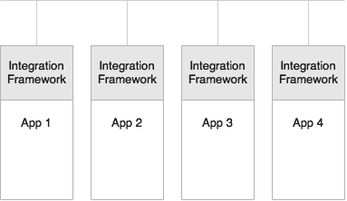

在这种方法中，轻量级的集成框架，如 Apache Camel 或 Spring Integration，被嵌入到应用程序中，用于处理与服务相关的横切能力，如协议转换、并行执行、编排和服务集成。由于一些轻量级集成框架具有本地 Java 对象支持，这样的应用程序甚至会使用本地**普通旧 Java 对象**（**POJO**）服务进行集成和服务之间的数据交换。因此，所有服务都必须打包为一个单体 Web 存档。这样的组织可能会将微服务视为其 SOA 的下一个逻辑步骤。

### 使用 SOA 进行单体迁移

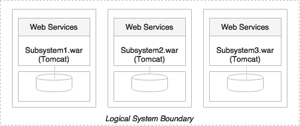

最后一种可能性是在单体系统达到瓶颈后，将单体应用程序转换为更小的单元。他们会将应用程序分解为更小的、可以物理部署的子系统，类似于前面解释的*y*轴扩展方法，并将它们部署为 Web 服务器上的 Web 存档或部署为一些自制容器上的 JAR 文件。这些作为服务的子系统将使用 Web 服务或其他轻量级协议在服务之间交换数据。他们还将使用 SOA 和服务设计原则来实现这一点。对于这样的组织，他们可能倾向于认为微服务只是新瓶装旧酒。

## 与十二要素应用的关系

云计算是一种快速发展的技术之一。云计算承诺了许多好处，如成本优势、速度、灵活性和弹性。有许多云提供商提供不同的服务。他们降低了成本模型，使其对企业更具吸引力。不同的云提供商，如 AWS、微软、Rackspace、IBM、谷歌等，使用不同的工具、技术和服务。另一方面，企业意识到这个不断发展的战场，因此，他们正在寻找从锁定到单一供应商的风险降低的选择。

许多组织将它们的应用程序迁移到云中。在这种情况下，应用程序可能无法实现云平台所承诺的所有好处。有些应用程序需要进行彻底改造，而有些可能只需要在移动到云之前进行小的调整。这在很大程度上取决于应用程序的架构和开发方式。

例如，如果应用程序的生产数据库服务器 URL 被硬编码为应用程序 WAR 的一部分，那么在将应用程序移动到云之前，需要对其进行修改。在云中，基础设施对应用程序是透明的，特别是物理 IP 地址不能被假定。

我们如何确保应用程序，甚至微服务，可以在多个云提供商之间无缝运行，并利用云服务的优势，比如弹性？

在开发云原生应用程序时，遵循一定的原则是很重要的。

### 提示

云原生是指开发能够在云环境中高效工作的应用程序的术语，理解和利用云行为，比如弹性、基于利用率的计费、故障感知等。

由 Heroku 提出的 Twelve-Factor App 是一种描述现代云就绪应用程序所期望具备的特征的方法论。Twelve-Factor App 同样适用于微服务。因此，理解 Twelve-Factor App 是很重要的。

### 单一的代码库

代码库原则建议每个应用程序都有一个单一的代码库。可以部署多个相同代码库的实例，比如开发、测试和生产。代码通常在诸如 Git、Subversion 等源代码控制系统中进行管理。

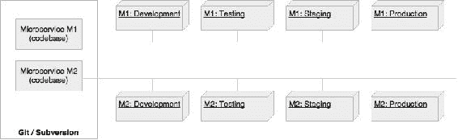

将相同的理念应用于微服务，每个微服务都应该有自己的代码库，并且这个代码库不与任何其他微服务共享。这也意味着一个微服务有且仅有一个代码库。

### 捆绑依赖

根据这一原则，所有应用程序应该将它们的依赖项与应用程序捆绑在一起。借助 Maven 和 Gradle 等构建工具，我们可以在`pom.xml`或`.gradle`文件中明确管理依赖项，并使用诸如 Nexus 或 Archiva 之类的中央构建存储库将它们链接起来。这确保了版本的正确管理。最终的可执行文件将被打包为 WAR 文件或可执行的 JAR 文件，嵌入所有的依赖项。

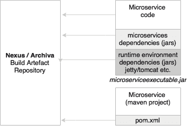

在微服务的背景下，这是一个必须遵循的基本原则。每个微服务应该将所有所需的依赖项和执行库（如 HTTP 监听器等）捆绑在最终的可执行包中。

### 外部化配置

这一原则建议从代码中外部化所有配置参数。应用程序的配置参数在不同的环境中会有所不同，比如对外部系统的电子邮件 ID 或 URL 的支持，用户名、密码、队列名称等。这些在开发、测试和生产环境中都会有所不同。所有服务配置都应该被外部化。

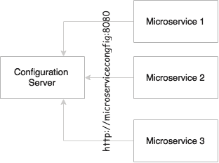

同样的原则对于微服务也是显而易见的。微服务的配置参数应该从外部源加载。这也将有助于自动化发布和部署过程，因为这些环境之间唯一的区别是配置参数。

### 后端服务是可寻址的

所有后端服务都应该通过可寻址的 URL 访问。所有服务在其执行周期中需要与一些外部资源进行通信。例如，它们可能会监听或发送消息到消息系统，发送电子邮件，将数据持久化到数据库等等。所有这些服务都应该通过 URL 可达，而不需要复杂的通信要求。

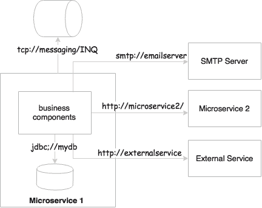

在微服务世界中，微服务要么通过消息系统发送或接收消息，要么可以接受或发送消息到其他服务 API。在常规情况下，这些要么是使用 REST 和 JSON 的 HTTP 端点，要么是基于 TCP 或 HTTP 的消息端点。

### 构建、发布和运行之间的隔离

这一原则主张在构建、发布和运行阶段之间进行强大的隔离。构建阶段指的是通过包含所有所需资产来编译和生成二进制文件。发布阶段指的是将二进制文件与特定于环境的配置参数相结合。运行阶段指的是在特定的执行环境中运行应用程序。流水线是单向的，因此不可能将运行阶段的更改传播回构建阶段。基本上，这也意味着不建议为生产进行特定的构建；而是必须通过流水线进行。

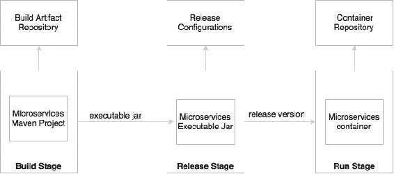

在微服务中，构建将创建可执行的 JAR 文件，包括诸如 HTTP 监听器之类的服务运行时。在发布阶段，这些可执行文件将与发布配置（如生产 URL 等）相结合，创建一个发布版本，很可能是类似 Docker 的容器。在运行阶段，这些容器将通过容器调度程序部署到生产环境。

### 无状态，共享无事务处理

这一原则建议进程应该是无状态的并且不共享任何东西。如果应用程序是无状态的，那么它就是容错的，并且可以很容易地扩展。

所有微服务都应设计为无状态函数。如果有存储状态的要求，应该使用后备数据库或内存缓存来完成。

### 通过端口绑定公开服务

预期十二要素应用程序是自包含的。传统上，应用程序部署到服务器上：Web 服务器或应用服务器，如 Apache Tomcat 或 JBoss。十二要素应用程序不依赖外部 Web 服务器。HTTP 监听器，如 Tomcat 或 Jetty，必须嵌入到服务本身中。

端口绑定是微服务能够自主和自包含的基本要求之一。微服务将服务监听器嵌入到服务本身作为其一部分。

### 并发性以扩展规模

这一原则规定进程应该被设计为通过复制进程来扩展。这是在进程内使用线程之外的另一种方法。

在微服务世界中，服务被设计为扩展而不是扩大。*x*轴扩展技术主要用于通过启动另一个相同的服务实例来扩展服务。根据流量流动，服务可以弹性地扩展或收缩。此外，微服务可能利用并行处理和并发框架来进一步加快或扩展事务处理。

### 具有最小开销的可处置性

这一原则主张以最小的启动和关闭时间以及优雅的关闭支持构建应用程序。在自动化部署环境中，我们应该能够尽快启动或关闭实例。如果应用程序的启动或关闭需要相当长的时间，将对自动化产生不利影响。启动时间与应用程序的大小成正比。在针对自动扩展的云环境中，我们应该能够快速启动新实例。这也适用于推广新版本的服务。

在微服务上下文中，为了实现完全自动化，将应用程序的大小保持尽可能小，启动和关闭时间尽可能短是非常重要的。微服务还应考虑对象和数据的延迟加载。

### 开发和生产的对等性

这个原则强调了尽可能保持开发和生产环境的相同重要性。例如，让我们考虑一个具有多个服务或进程的应用程序，比如作业调度服务、缓存服务和一个或多个应用程序服务。在开发环境中，我们倾向于在一台机器上运行它们，而在生产环境中，我们将为每个进程提供独立的机器来运行。这主要是为了管理基础设施的成本。缺点是，如果生产环境出现问题，就没有相同的环境来重新生成和修复问题。

这个原则不仅适用于微服务，也适用于任何应用程序开发。

### 外部化日志

十二要素应用程序永远不会尝试存储或传输日志文件。在云中，最好避免本地 I/O。如果在特定基础设施中 I/O 速度不够快，可能会造成瓶颈。解决这个问题的方法是使用集中式日志框架。Splunk、Greylog、Logstash、Logplex 和 Loggly 是一些日志传输和分析工具的例子。推荐的方法是通过连接 logback appenders 将日志传输到一个中央存储库，并写入其中一个传输点。

在微服务生态系统中，这一点非常重要，因为我们正在将一个系统分解成许多较小的服务，这可能导致日志的去中心化。如果它们将日志存储在本地存储中，将极其难以在服务之间进行日志相关性的对比。

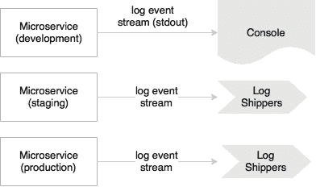

在开发中，微服务可以将日志流重定向到`stdout`，而在生产中，这些流将被日志传输器捕获，并发送到中央日志服务进行存储和分析。

### 打包管理进程

除了应用程序服务，大多数应用程序还提供管理任务。这个原则建议对应用程序服务和管理任务使用相同的发布包以及相同的环境。管理代码也应该与应用程序代码一起打包。

这个原则不仅适用于微服务，也适用于任何应用程序开发。

# 微服务用例

微服务并不是万能药，也不会解决当今世界的所有架构挑战。关于何时使用微服务并没有硬性规定或严格的指导方针。

微服务可能并不适用于每种用例。微服务的成功很大程度上取决于用例的选择。首要活动是对用例进行酸碱试验，以检验其是否符合微服务的好处。酸碱试验必须涵盖我们在本章前面讨论过的所有微服务的好处。对于给定的用例，如果没有可量化的好处，或者成本超过了好处，那么该用例可能不适合微服务。

让我们讨论一些常用的适合微服务架构的场景：

+   由于需要改进可伸缩性、可管理性、灵活性或交付速度，迁移单片应用程序。另一个类似的情况是重写一个即将到期且被广泛使用的遗留应用程序。在这两种情况下，微服务都提供了一个机会。使用微服务架构，可以通过逐步将功能转换为微服务来重新平台化遗留应用程序。这种方法有好处。不需要巨额的前期投资，不会对业务造成重大干扰，也没有严重的业务风险。由于服务依赖关系已知，可以很好地管理微服务的依赖关系。

+   诸如集成优化服务、预测服务、价格计算服务、预测服务、报价服务、推荐服务等的实用计算场景都是微服务的良好候选者。这些是独立的无状态计算单元，接受特定数据，应用算法，并返回结果。独立的技术服务，如通信服务、加密服务、认证服务等也是微服务的良好候选者。

+   在许多情况下，我们可以构建无头业务应用程序或具有自主性质的服务，例如支付服务、登录服务、航班搜索服务、客户档案服务、通知服务等等。这些通常在多个渠道中被重复使用，因此很适合构建为微服务。

+   可能存在微型或宏型应用程序，用于单一目的并执行单一职责。一个简单的时间跟踪应用程序就是这一类的例子。它所做的就是捕获时间、持续时间和执行的任务。常用的企业应用程序也是微服务的候选者。

+   良好架构、响应式客户端 MVC web 应用程序的后端服务（**后端即服务**（**BaaS**）场景）根据用户导航需求加载数据。在大多数情况下，数据可能来自于多个逻辑上不同的数据源，就像之前提到的 *飞越点* 示例一样。

+   高度敏捷的应用程序、需要快速交付或上市时间、创新试点、选择进行 DevOps 的应用程序、创新型系统的应用程序等等也可以被视为微服务架构的潜在候选者。

+   我们可以预期从微服务中获益的应用程序，例如多语言要求、需要 **命令查询职责分离**（**CQRS**）等等，也是微服务架构的潜在候选者。

如果使用案例属于这些类别之一，它就是微服务架构的潜在候选者。

有一些情况下，我们应该考虑避免使用微服务：

+   如果组织的政策被迫使用集中管理的重量级组件，例如 ESB 来托管业务逻辑，或者如果组织有任何其他阻碍微服务基本原则的政策，那么微服务就不是正确的解决方案，除非组织流程得到放松。

+   如果组织的文化、流程等等是基于传统的瀑布交付模型、漫长的发布周期、矩阵团队、手动部署和繁琐的发布流程、没有基础设施供应等等，那么微服务可能不适合。这是康威定律的基础。这一定律指出组织结构与其创建的软件之间存在着强烈的联系。

### 提示

阅读更多关于康威定律的信息：

[`www.melconway.com/Home/Conways_Law.html`](http://www.melconway.com/Home/Conways_Law.html)

## 微服务的早期采用者

许多组织已经成功地踏上了微服务世界的旅程。在本节中，我们将研究一些微服务领域的先驱者，分析他们为什么这样做以及他们是如何做到的。最后我们将进行一些分析以得出一些结论：

+   Netflix（[www.netflix.com](http://www.netflix.com)）：Netflix 是一家国际点播媒体流媒体公司，在微服务领域是先驱。Netflix 将大量开发传统单片代码的开发人员转变为生产微服务的较小开发团队。这些微服务共同工作，向数百万 Netflix 客户流媒体数字媒体。在 Netflix，工程师们从单片开始，经历了痛苦，然后将应用程序分解为松散耦合且与业务能力对齐的较小单元。

+   Uber（[www.uber.com](http://www.uber.com)）：Uber 是一家国际运输网络公司，于 2008 年开始使用单片架构和单一代码库。所有服务都嵌入到单片应用程序中。当 Uber 将业务从一个城市扩展到多个城市时，挑战开始了。Uber 随后通过将系统分解为较小的独立单元，转向基于 SOA 的架构。每个模块都交给不同的团队，并授权他们选择自己的语言、框架和数据库。Uber 在其生态系统中部署了许多使用 RPC 和 REST 的微服务。

+   Airbnb（[www.airbnb.com](http://www.airbnb.com)）：Airbnb 是提供可信住宿市场的世界领先公司，开始使用一个执行业务所需功能的单片应用程序。随着流量增加，Airbnb 面临可扩展性问题。单一代码库变得过于复杂，导致关注点分离不良，并出现性能问题。Airbnb 将其单片应用程序分解为在单独机器上运行的具有单独部署周期的独立代码库的较小部分。Airbnb 围绕这些服务开发了自己的微服务或 SOA 生态系统。

+   Orbitz（[www.orbitz.com](http://www.orbitz.com)）：Orbitz 是一个在线旅行门户，在 2000 年代开始使用单片架构，有 Web 层、业务层和数据库层。随着 Orbitz 业务的扩展，他们面临了单片分层架构的可管理性和可扩展性问题。Orbitz 随后经历了持续的架构变化。后来，Orbitz 将其单片应用程序分解为许多较小的应用程序。

+   eBay（[www.ebay.com](http://www.ebay.com)）：eBay 是最大的在线零售商之一，于上世纪 90 年代末开始使用单片 Perl 应用程序和 FreeBSD 作为数据库。随着业务的增长，eBay 经历了扩展问题。它一直在投资改进其架构。在 2000 年代中期，eBay 转向基于 Java 和 Web 服务的较小分解系统。他们采用了数据库分区和功能分离以满足所需的可扩展性。

+   亚马逊（[www.amazon.com](http://www.amazon.com)）：亚马逊是最大的在线零售商之一，于 2001 年运行了一个基于 C++的大型单片应用程序。这个良好架构的单片应用程序基于分层架构，有许多模块化组件。然而，所有这些组件都紧密耦合。因此，亚马逊无法通过将团队分成较小的组来加快其开发周期。亚马逊随后将代码分离为独立的功能服务，用 Web 服务封装，并最终发展为微服务。

+   Gilt（[www.gilt.com](http://www.gilt.com)）：Gilt 是一个在线购物网站，于 2007 年开始使用分层单片 Rails 应用程序和后端的 Postgres 数据库。与许多其他应用程序类似，随着流量增加，Web 应用程序无法提供所需的弹性。Gilt 通过引入 Java 和多语言持久性进行了架构改造。后来，Gilt 转向使用微服务概念的许多较小的应用程序。

+   **Twitter**（[www.twitter.com](http://www.twitter.com)）：Twitter，最大的社交网站之一，于 2000 年代中期开始使用三层单片的 rails 应用程序。后来，当 Twitter 的用户基数增长时，他们经历了一次架构重构周期。通过这次重构，Twitter 从典型的 Web 应用程序转向了基于 API 的事件驱动核心。Twitter 使用 Scala 和 Java 开发具有多语言持久性的微服务。

+   **耐克**（[www.nike.com](http://www.nike.com)）：耐克，全球服装和鞋类领导者，将他们的单片应用程序转变为微服务。与许多其他组织类似，耐克也是运行在古老的遗留应用程序上，几乎不稳定。在他们的旅程中，耐克转向了重量级商业产品，目标是稳定遗留应用程序，但最终变成了昂贵的单片应用程序，难以扩展，发布周期长，并且需要太多手动工作来部署和管理应用程序。后来，耐克转向了基于微服务的架构，大大缩短了开发周期。

## 共同主题是单片迁移

当我们分析前述企业时，有一个共同的主题。所有这些企业都是从单片应用程序开始，并通过应用他们以前版本的学习和痛点，转变为微服务架构。

即使在今天，许多初创公司也是从单体开始，因为这样更容易开始、概念化，然后在需求出现时慢慢转向微服务。单片到微服务的迁移场景有一个额外的优势：它们有所有的信息提前准备好，可以随时进行重构。

然而，对于所有这些企业来说，单片转变的催化剂是不同的。一些共同的动机是缺乏可伸缩性、长时间的开发周期、流程自动化、可管理性以及业务模式的变化。

虽然单片迁移是毫无疑问的，但也有机会从头开始构建微服务。与其构建从头开始的系统，不如寻找为业务快速赢得的机会，例如为航空公司的端到端货物管理系统添加卡车服务，或者为零售商的忠诚度系统添加客户评分服务。这些可以作为独立的微服务实现，并与它们各自的单片应用程序交换消息。

另一个观点是，许多组织仅将微服务用于业务关键的客户参与应用程序，而将其余的遗留单片应用程序采取自己的轨迹。

另一个重要观察是，先前检查的大多数组织在微服务旅程中处于不同的成熟水平。当 eBay 在 2000 年代初从单片应用程序过渡时，他们将应用程序在功能上分割成更小、独立、可部署的单元。这些逻辑上划分的单元被封装在 Web 服务中。虽然单一责任和自治性是它们的基本原则，但这些架构受限于当时可用的技术和工具。像 Netflix 和 Airbnb 这样的组织构建了自己的能力来解决他们面临的具体挑战。总之，所有这些都不是真正的微服务，而是遵循相同特征的小型、与业务对齐的服务。

没有所谓的“确定或最终的微服务”状态。这是一个不断发展和成熟的过程。架构师和开发人员的口头禅是可替代性原则；建立一种最大限度地提高替换其部分的能力并最小化替换成本的架构。最重要的是，企业不应该只是追随炒作来开发微服务。

# 总结

在本章中，您通过一些例子了解了微服务的基础知识。

我们探讨了微服务从传统的单片应用程序的演变。我们研究了一些现代应用架构所需的原则和思维转变。我们还看了一下微服务的特点和好处以及使用案例。在本章中，我们建立了微服务与面向服务的架构和十二要素应用的关系。最后，我们分析了来自不同行业的一些企业的例子。

在下一章中，我们将开发一些示例微服务，以更清晰地了解本章的内容。
