# 第三章：应用微服务概念

微服务是好的，但如果没有得到妥善构思，也可能是一种恶。错误的微服务解释可能导致无法挽回的失败。

本章将探讨实际实施微服务的技术挑战。它还将提供成功微服务开发的关键设计决策指南。还将审查关于微服务的一些常见关注点的解决方案和模式。本章还将审查企业规模微服务开发中的挑战，以及如何克服这些挑战。更重要的是，将在最后建立一个微服务生态系统的能力模型。

在本章中，您将了解以下内容：

+   在开发微服务时需要考虑不同设计选择和模式之间的权衡

+   开发企业级微服务的挑战和反模式

+   微服务生态系统的能力模型

# 模式和常见设计决策

近年来，微服务已经获得了巨大的流行。它们已经成为架构师的首选，将 SOA 放在了后台。尽管承认微服务是开发可扩展的云原生系统的工具，但成功的微服务需要精心设计以避免灾难。微服务并非一刀切，也不是解决所有架构问题的通用解决方案。

一般来说，微服务是构建轻量级、模块化、可扩展和分布式系统的绝佳选择。过度设计、错误的用例和误解很容易将系统变成灾难。在选择正确的用例对于开发成功的微服务至关重要，同样重要的是通过进行适当的权衡分析做出正确的设计决策。在设计微服务时需要考虑许多因素，如下面的详细部分所述。

## 建立适当的微服务边界

关于微服务最常见的问题之一是关于服务的大小。微服务可以有多大（迷你单片）或多小（纳米服务），或者是否有合适大小的服务？大小真的很重要吗？

一个快速的答案可能是“每个微服务一个 REST 端点”，或者“少于 300 行代码”，或者“执行单一职责的组件”。但在我们选择这些答案之前，还有很多分析工作要做，以了解我们服务的边界。

**领域驱动设计**（**DDD**）定义了**有界上下文**的概念。有界上下文是一个较大的领域或系统的子域或子系统，负责执行特定的功能。

### 提示

在[`domainlanguage.com/ddd/`](http://domainlanguage.com/ddd/)了解更多关于 DDD 的信息。

以下图表是领域模型的一个示例：


在金融后勤系统中，系统发票、会计、结算等代表不同的有界上下文。这些有界上下文是与业务能力密切相关的强烈隔离的领域。在金融领域，发票、会计和结算是不同的业务能力，通常由财务部门下的不同子单位处理。

有界上下文是确定微服务边界的好方法。每个有界上下文可以映射到一个单独的微服务。在现实世界中，有界上下文之间的通信通常耦合较少，而且经常是断开的。

尽管真实世界的组织边界是建立有界上下文的最简单机制，但由于组织结构内在问题，这些边界在某些情况下可能会被证明是错误的。例如，业务能力可以通过不同的渠道进行交付，如前台办事处、在线、漫游代理等。在许多组织中，业务单位可能是根据交付渠道而不是实际的基础业务能力进行组织的。在这种情况下，组织边界可能无法提供准确的服务边界。

自上而下的领域分解可能是建立正确有界上下文的另一种方式。

建立微服务边界没有银弹，通常这是非常具有挑战性的。在将单块应用程序迁移到微服务的情况下，建立边界要容易得多，因为现有系统的服务边界和依赖关系是已知的。另一方面，在绿地微服务开发中，依赖关系很难事先建立。

设计微服务边界的最实用方法是将手头的情景运行通过多种可能的选项，就像服务试纸测试一样。请记住，可能有多个条件匹配给定情景，这将导致权衡分析。

以下情景可能有助于定义微服务边界。

### 自主功能

如果正在审查的功能本质上是自主的，那么它可以被视为微服务边界。自主服务通常对外部功能的依赖较少。它们接受输入，使用内部逻辑和数据进行计算，并返回结果。所有实用功能，如加密引擎或通知引擎，都是直接的候选者。

接受订单、处理订单，然后通知卡车服务的交付服务是另一个自主服务的例子。基于缓存的座位可用性信息进行在线航班搜索是另一个自主功能的例子。

### 可部署单元的大小

大多数微服务生态系统将利用自动化，如自动集成、交付、部署和扩展。覆盖更广泛功能的微服务会导致更大的部署单元。大型部署单元在自动文件复制、文件下载、部署和启动时间方面存在挑战。例如，服务的大小随着它实现的功能密度的增加而增加。

一个良好的微服务确保其可部署单元的大小保持可管理。

### 最合适的功能或子域

分析从单块应用程序中分离出来的最有用的组件是非常重要的。这在将单块应用程序分解为微服务时特别适用。这可能基于资源密集性、所有权成本、业务利益或灵活性等参数。

在典型的酒店预订系统中，大约 50-60%的请求是基于搜索的。在这种情况下，移出搜索功能可能会立即带来灵活性、业务利益、成本降低、资源释放等。

### 多语言体系结构

微服务的一个关键特征是支持多语言体系结构。为了满足不同的非功能性和功能性要求，组件可能需要不同的处理方式。这可能是不同的体系结构、不同的技术、不同的部署拓扑等。当组件被识别出来时，要根据多语言体系结构的要求对它们进行审查。

在前面提到的酒店预订场景中，预订微服务可能需要事务完整性，而搜索微服务可能不需要。在这种情况下，预订微服务可能会使用 ACID 兼容的数据库，如 MySQL，而搜索微服务可能会使用最终一致的数据库，如 Cassandra。

### 选择性扩展

选择性扩展与先前讨论的多语言体系结构相关。在这种情况下，所有功能模块可能不需要相同级别的可扩展性。有时，根据可扩展性要求确定边界可能是合适的。

例如，在酒店预订场景中，搜索微服务必须比许多其他服务（如预订微服务或通知微服务）扩展得多，因为搜索请求的速度更快。在这种情况下，一个独立的搜索微服务可以在 Elasticsearch 或内存数据网格上运行，以获得更好的响应。

### 小而敏捷的团队

微服务使得敏捷开发成为可能，小而专注的团队开发饼图的不同部分。可能存在不同组织或不同地理位置的团队，或者技能水平不同的团队构建系统的部分的情况。例如，在制造业中，这种方法是常见的做法。

在微服务的世界中，这些团队中的每一个都构建不同的微服务，然后将它们组合在一起。尽管这不是分解系统的理想方式，但组织可能最终会陷入这种情况。因此，这种方法不能完全被排除。

在在线产品搜索场景中，一个服务可以根据客户的需求提供个性化的选项。这可能需要复杂的机器学习算法，因此需要一个专业团队。在这种情况下，这个功能可以由一个独立的专业团队构建为一个微服务。

### 单一责任

理论上，单一责任原则可以应用于方法、类或服务。然而，在微服务的背景下，并不一定对应于单个服务或端点。

更实际的方法可能是将单一责任转化为单一业务能力或单一技术能力。根据*单一责任*原则，一个责任不能被多个微服务共享。同样，一个微服务不应执行多个责任。

然而，也可能存在特殊情况，其中单个业务能力分布在多个服务之间。其中一种情况是管理客户档案，可能会出现使用两个不同的微服务来管理读取和写入的情况，使用**命令查询责任分离**（**CQRS**）方法来实现一些质量属性。

### 可复制性或可变性

创新和速度在 IT 交付中至关重要。微服务的边界应该被确定为每个微服务都可以轻松地从整个系统中分离出来，重新编写的成本最小。如果系统的一部分只是一个实验，最好将其作为一个微服务隔离起来。

一个组织可能会开发一个推荐引擎或客户排名引擎作为一个实验。如果业务价值没有实现，那么就放弃该服务，或者用另一个替换它。

许多组织遵循创业公司的模式，重视功能的实现和快速交付。这些组织可能不会过分担心架构和技术，而是关注哪些工具或技术可以更快地提供解决方案。组织越来越倾向于通过组合几个服务来开发**最小可行产品**（**MVPs**），并允许系统不断演进。在系统不断演进、服务逐渐重写或替换的情况下，微服务在这些情况下发挥着至关重要的作用。

### 耦合和内聚

耦合和内聚是决定服务边界的两个最重要的参数。微服务之间的依赖关系必须经过仔细评估，以避免高度耦合的接口。功能分解，以及建模依赖树，可以帮助确定微服务的边界。避免过于啰嗦的服务、过多的同步请求-响应调用以及循环同步依赖是三个关键点，因为这些很容易破坏系统。一个成功的方程是在微服务内保持高内聚性，在微服务之间保持松耦合。除此之外，确保事务边界不要跨微服务。一流的微服务将在接收到事件作为输入时做出反应，执行一些内部功能，最终发送另一个事件。作为计算功能的一部分，它可能会读取和写入数据到自己的本地存储。

### 将微服务视为产品

领域驱动设计还建议将一个有界上下文映射到一个产品。根据领域驱动设计，每个有界上下文都是一个理想的产品候选者。将微服务视为一个独立的产品。当微服务边界确定后，从产品的角度评估它们，看它们是否真的符合产品的标准。对于业务用户来说，从产品的角度思考边界会更容易。产品边界可能有许多参数，如针对的社区、部署灵活性、可销售性、可重用性等。

## 设计通信风格

微服务之间的通信可以设计为同步（请求-响应）或异步（发送并忘记）风格。

### 同步风格通信

以下图表显示了一个示例的请求/响应式服务：

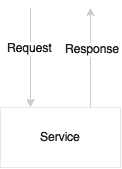

在同步通信中，没有共享状态或对象。当调用者请求服务时，它传递所需的信息并等待响应。这种方法有许多优点。

应用程序是无状态的，从高可用性的角度来看，可以有许多活跃的实例运行，接受流量。由于没有其他基础设施依赖，如共享的消息服务器，管理开销更少。在任何阶段出现错误时，错误将立即传播回调用者，使系统保持一致状态，而不会损害数据完整性。

同步请求-响应通信的缺点是用户或调用者必须等待请求的过程完成。因此，调用线程将等待响应，因此这种方式可能会限制系统的可扩展性。

同步风格在微服务之间添加了硬依赖关系。如果服务链中的一个服务失败，整个服务链将失败。为了使服务成功，所有依赖的服务都必须正常运行。许多故障场景必须使用超时和循环来处理。

### 异步风格通信

以下图表是一个设计用于接受异步消息作为输入，并异步发送响应供其他消费者使用的服务：


异步风格基于反应式事件循环语义，解耦了微服务。这种方法提供了更高级别的可扩展性，因为服务是独立的，可以在内部生成线程来处理负载的增加。当负载过重时，消息将被排队在消息服务器中以供以后处理。这意味着如果其中一个服务减速，它不会影响整个链条。这提供了更高级别的服务之间的解耦，因此维护和测试将更简单。

缺点是它对外部消息服务器有依赖性。处理消息服务器的容错性是复杂的。消息通常使用主/备份语义。因此，处理消息系统的持续可用性更难实现。由于消息通常使用持久性，需要更高级别的 I/O 处理和调优。

### 如何决定选择哪种风格？

这两种方法都有各自的优点和限制。无法只使用一种方法开发系统。根据用例需要，需要结合两种方法。原则上，异步方法非常适合构建真正可扩展的微服务系统。然而，试图将所有东西都建模为异步会导致复杂的系统设计。

在终端用户点击 UI 获取配置文件详细信息的情境中，以下示例是什么样子的？

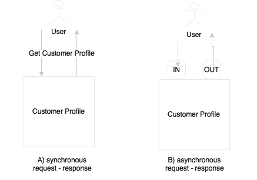

这可能是向后端系统发出简单查询以在请求-响应模型中获取结果。这也可以通过将消息推送到输入队列，并在输出队列中等待响应，直到收到给定关联 ID 的响应来以异步风格建模。然而，尽管我们使用异步消息传递，用户仍然在整个查询的持续时间内被阻塞。

另一个用例是用户点击 UI 搜索酒店，如下图所示：

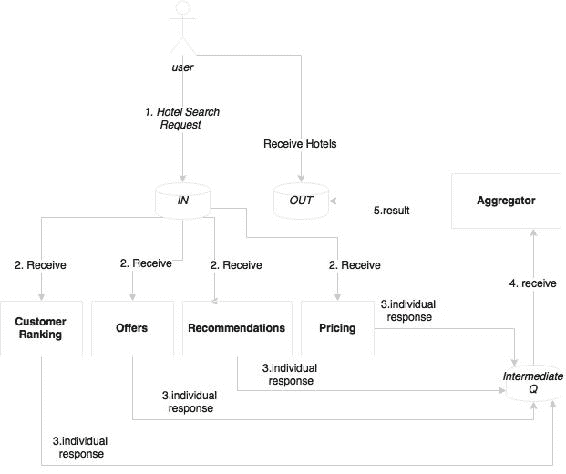

这与先前的情景非常相似。然而，在这种情况下，我们假设这个业务功能在将酒店列表返回给用户之前会触发一系列内部活动。例如，当系统接收到这个请求时，它会计算客户排名，根据目的地获取优惠，根据客户偏好获取推荐，根据客户价值和收入因素优化价格等等。在这种情况下，我们有机会并行地执行许多这些活动，以便在向客户呈现结果之前汇总所有这些结果。如前图所示，几乎任何计算逻辑都可以插入到监听**IN**队列的搜索管道中。

在这种情况下，一个有效的方法是从同步请求响应开始，以后根据需要引入异步风格。

以下示例展示了完全异步风格的服务交互：

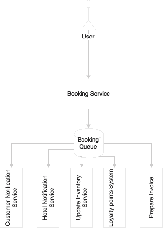

当用户点击预订功能时，服务被触发。同样，它是一种同步风格的通信。预订成功后，它会向客户的电子邮件地址发送消息，向酒店的预订系统发送消息，更新缓存库存，更新忠诚积分系统，准备发票，或许还有其他操作。与其让用户陷入长时间等待状态，更好的方法是将服务分解成片段。让用户等待，直到预订服务创建了一个预订记录。在成功完成后，将发布一个预订事件，并向用户返回确认消息。随后，所有其他活动将并行异步地发生。

在这三个例子中，用户都需要等待响应。使用新的 Web 应用程序框架，可以异步发送请求，并定义回调方法，或设置观察者以获取响应。因此，用户不会完全被阻止执行其他活动。

总的来说，在微服务世界中，异步风格总是更好的，但确定正确的模式应纯粹基于优点。如果在异步风格中建模事务没有优点，那么在找到吸引人的案例之前，请使用同步风格。在建模用户驱动的请求时，使用反应式编程框架以避免复杂性，以异步风格建模。

## 微服务的编排

可组合性是服务设计原则之一。这导致了谁负责组合服务的混乱。在 SOA 世界中，ESB 负责组合一组细粒度的服务。在一些组织中，ESB 扮演代理的角色，服务提供者自己组合和公开粗粒度的服务。在 SOA 世界中，处理这种情况有两种方法。

第一种方法是编排，如下图所示：

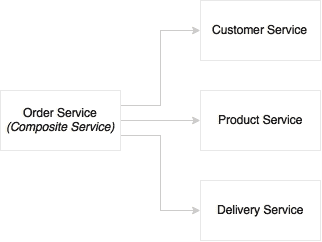

在编排方法中，多个服务被组合在一起以获得完整的功能。一个中央大脑充当编排者。如图所示，订单服务是一个组合服务，将编排其他服务。主进程可能有顺序和并行分支。每个任务将由原子任务服务完成，通常是一个 Web 服务。在 SOA 世界中，ESB 扮演编排的角色。编排的服务将由 ESB 作为组合服务公开。

第二种方法是协同，如下图所示：

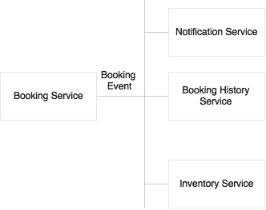

在协同方法中，没有中央大脑。在这种情况下，一个事件，例如预订事件，由生产者发布，许多消费者等待事件，并独立对传入事件应用不同的逻辑。有时，事件甚至可以嵌套，其中消费者可以发送另一个事件，该事件将被另一个服务消费。在 SOA 世界中，调用者向 ESB 推送消息，下游流程将由消费服务自动确定。

微服务是自治的。这基本上意味着在理想情况下，完成其功能所需的所有组件都应该在服务内部。这包括数据库、内部服务的编排、内在状态管理等。服务端点提供粗粒度的 API。只要不需要外部接触点，这是完全可以的。但实际上，微服务可能需要与其他微服务交流以完成其功能。

在这种情况下，协同是连接多个微服务的首选方法。遵循自治原则，一个组件坐在微服务外部并控制流程并不是理想的选择。如果用例可以以协同方式建模，那将是处理情况的最佳方式。

但在所有情况下可能无法建模协同。这在下图中显示：

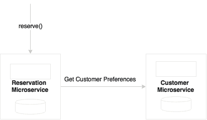

在上面的例子中，预订和客户是两个微服务，具有明确定义的功能责任。当预订希望在创建预订时获取客户偏好时，可能会出现这样的情况。在开发复杂系统时，这些是非常正常的情况。

我们能否将客户移到预订中，以便预订可以自行完成？如果根据各种因素将客户和预订确定为两个微服务，将客户移到预订可能不是一个好主意。在这种情况下，我们迟早会遇到另一个单片应用程序。

我们能否将预订客户的调用设置为异步？这个例子在下图中显示：

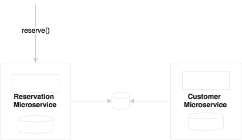

预订需要客户偏好才能进行，因此可能需要对客户进行同步阻塞调用。通过异步建模来进行适配实际上并没有意义。

我们能否只取出编排部分，然后创建另一个复合微服务，然后将预订和客户组合起来？

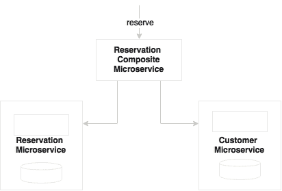

这在微服务内部组合多个组件的方法中是可以接受的。但创建一个复合微服务可能不是一个好主意。我们最终会创建许多与业务不对齐的微服务，这些微服务将不是自治的，并且可能会导致许多细粒度的微服务。

我们能否通过在预订中保留偏好数据的从属副本来复制客户偏好？

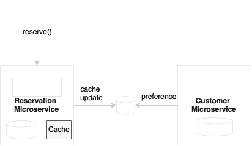

只要主服务器发生变化，变更就会传播。在这种情况下，预订可以使用客户偏好而无需进行调用。这是一个有效的想法，但我们需要仔细分析这一点。今天我们复制客户偏好，但在另一种情况下，我们可能希望联系客户服务，看看客户是否被列入了预订的黑名单。在决定复制哪些数据时，我们必须非常小心。这可能会增加复杂性。

## 微服务中有多少个端点？

在许多情况下，开发人员对每个微服务的端点数量感到困惑。问题实际上是是否限制每个微服务只有一个端点还是多个端点：

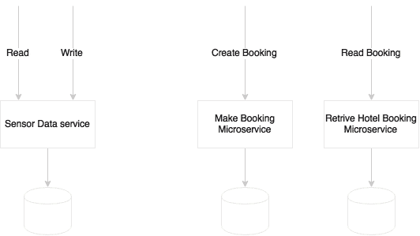

端点的数量并不是一个决定性因素。在某些情况下，可能只有一个端点，而在其他一些情况下，一个微服务可能有多个端点。例如，考虑一个传感器数据服务，它收集传感器信息，并具有两个逻辑端点：创建和读取。但为了处理 CQRS，我们可能会创建两个单独的物理微服务，就像前面图表中的**预订**一样。多语言架构可能是另一种情况，我们可能会将端点拆分成不同的微服务。

考虑到通知引擎，通知将会在事件发生时发送出去。通知的过程，比如数据准备、人员识别和传递机制，对于不同的事件是不同的。此外，我们可能希望在不同的时间窗口内以不同的方式扩展这些过程。在这种情况下，我们可能决定将每个通知端点拆分成一个单独的微服务。

在另一个例子中，积分微服务可能有多个服务，比如积分、兑换、转移和余额。我们可能不希望对这些服务进行不同对待。所有这些服务都是相互连接的，并且使用积分表进行数据操作。如果我们为每个服务创建一个端点，我们最终会陷入这样一种情况：许多细粒度的服务从同一个数据存储或复制的相同数据存储中访问数据。

简而言之，端点的数量不是一个设计决策。一个微服务可以承载一个或多个端点。为微服务设计适当的边界上下文更为重要。

## 每个虚拟机一个微服务，还是多个？

一个微服务可以通过复制部署来实现可扩展性和可用性，部署在多个**虚拟机**（**VMs**）中。这是一个不需要大脑的决定。问题是是否可以在一个虚拟机中部署多个微服务？这种方法有其利弊。这个问题通常在服务简单且流量较少时出现。

考虑一个例子，我们有一对微服务，总交易量少于 10 笔每分钟。还假设可用的最小虚拟机大小是 2 核 8GB 内存。进一步假设在这种情况下，一个 2 核 8GB 的虚拟机可以处理 10-15 笔每分钟的交易而不会出现性能问题。如果我们为每个微服务使用不同的虚拟机，可能不是成本有效的，因为许多供应商根据核心数收费。

解决这个问题的最简单方法是提出几个问题：

+   虚拟机是否有足够的容量来在高峰使用时运行这两个服务？

+   我们是否想要以不同的方式处理这些服务以实现 SLA（选择性扩展）？例如，对于可伸缩性，如果我们有一个全包式虚拟机，我们将不得不复制复制所有服务的虚拟机。

+   是否存在冲突的资源需求？例如，不同的操作系统版本，JDK 版本等。

如果您所有的答案都是*否*，那么也许我们可以从共部署开始，直到遇到改变部署拓扑的情况。然而，我们必须确保这些服务不共享任何东西，并且作为独立的操作系统进程运行。

话虽如此，在一个拥有成熟的虚拟化基础设施或云基础设施的组织中，这可能并不是一个巨大的问题。在这样的环境中，开发人员不需要担心服务运行的位置。开发人员甚至可能不考虑容量规划。服务将部署在计算云中。根据基础设施的可用性、SLA 和服务的性质，基础设施自我管理部署。AWS Lambda 就是这样一个服务的很好的例子。

## 规则引擎-共享还是嵌入？

规则是任何系统的重要组成部分。例如，一个资格服务可能在做出是或否决定之前执行多个规则。我们要么手工编写规则，要么使用规则引擎。许多企业在规则存储库中集中管理规则，并在中央执行它们。这些企业规则引擎主要用于为业务提供编写和管理规则以及从中央存储库重用规则的机会。**Drools**是一种流行的开源规则引擎。IBM、FICO 和 Bosch 是商业领域的一些先驱。这些规则引擎提高了生产率，实现了规则、事实、词汇的重用，并使用 rete 算法提供更快的规则执行。

在微服务的背景下，中央规则引擎意味着从微服务向中央规则引擎扩展调用。这也意味着服务逻辑现在在两个地方，一部分在服务内部，一部分在服务外部。然而，在微服务的背景下，目标是减少外部依赖：

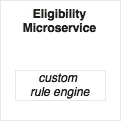

如果规则足够简单，数量不多，仅在服务范围内使用，并且不向业务用户公开进行编写，那么手工编码业务规则可能比依赖企业规则引擎更好：

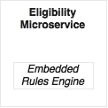

如果规则很复杂，限于服务上下文，并且不提供给业务用户，那么最好在服务内使用嵌入式规则引擎：

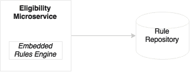

如果规则由业务管理和编写，或者规则很复杂，或者我们正在从其他服务领域重用规则，那么具有本地嵌入执行引擎的中央编写存储库可能是更好的选择。

请注意，这必须经过仔细评估，因为并非所有供应商都支持本地规则执行方法，可能存在技术依赖，比如只能在特定应用服务器内运行规则等。

## BPM 和工作流的作用

**业务流程管理**（**BPM**）和**智能业务流程管理**（**iBPM**）是用于设计、执行和监控业务流程的工具套件。

BPM 的典型用例包括：

+   协调长时间运行的业务流程，其中一些流程由现有资产实现，而其他一些领域可能是利基领域，并且没有具体的流程实现。BPM 允许组合这两种类型，并提供端到端的自动化流程。这通常涉及系统和人员的交互。

+   以流程为中心的组织，比如那些实施了六西格玛的组织，希望监控其流程以持续改进效率。

+   采用自上而下的方法对业务流程进行再造，重新定义组织的业务流程。

BPM 适用于微服务世界的两种情况：

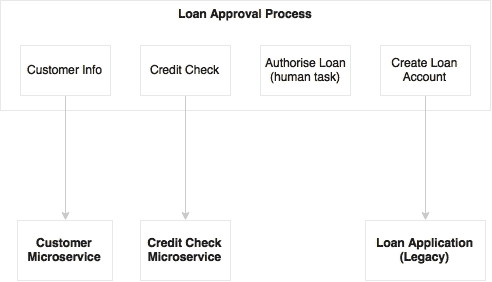

第一个场景是业务流程再造，或者说是将端到端的长时间运行的业务流程串联起来，正如前面所述。在这种情况下，BPM 在更高的层面上运行，它可以通过串联多个粗粒度的微服务、现有的遗留连接器和人员交互来自动化跨职能、长时间运行的业务流程。如前图所示，贷款批准 BPM 调用微服务以及遗留应用服务。它还整合了人员任务。

在这种情况下，微服务是实现子流程的无头服务。从微服务的角度来看，BPM 只是另一个消费者。在这种方法中需要注意避免接受来自 BPM 流程的共享状态以及将业务逻辑转移到 BPM 中：

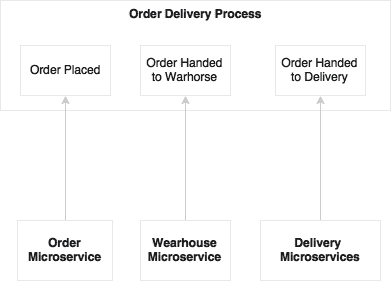

第二个场景是监控流程，并优化其效率。这与完全自动化、异步编排的微服务生态系统密切相关。在这种情况下，微服务和 BPM 作为独立的生态系统运行。微服务在各种时间框架内发送事件，比如流程开始、状态变化、流程结束等。这些事件被 BPM 引擎用于绘制和监控流程状态。对于这种情况，我们可能不需要一个完整的 BPM 解决方案，因为我们只是模拟一个业务流程来监控其效率。在这种情况下，订单交付流程并不是 BPM 的实现，而更像是一个监控仪表板，用于捕获和显示流程的进展。

总之，BPM 仍然可以在更高的层面上用于组合多个微服务的情况，其中端到端的跨职能业务流程通过自动化系统和人员交互进行建模。一个更好、更简单的方法是拥有一个业务流程仪表板，微服务向其提供状态变化事件，就像第二个场景中提到的那样。

## 微服务能共享数据存储吗？

原则上，微服务应该抽象出展示、业务逻辑和数据存储。如果按照指南拆分服务，每个微服务逻辑上可以使用独立的数据库：

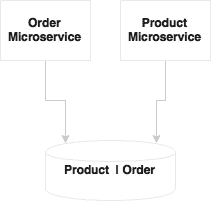

在前图中，**产品**和**订单**微服务共享一个数据库和一个数据模型。共享数据模型、共享模式和共享表在开发微服务时是灾难的根源。这在开始阶段可能还好，但在开发复杂的微服务时，我们往往会在数据模型之间添加关系，添加连接查询等。这可能导致物理数据模型紧密耦合。

如果服务只有少量表，可能不值得投资一个像 Oracle 数据库实例这样的完整数据库实例。在这种情况下，仅进行模式级别的分离就足够了：

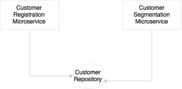

可能存在一些情况，我们倾向于考虑为多个服务使用共享数据库。以企业级管理的客户数据存储库或主数据为例，客户注册和客户分割微服务在逻辑上共享相同的客户数据存储库。

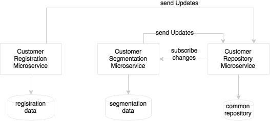

如前图所示，在这种情况下的另一种方法是通过为这些服务添加一个本地事务数据存储来将微服务的事务数据存储与企业数据存储库分开。这将帮助服务在重新设计本地数据存储以优化其用途时具有灵活性。企业客户存储库在客户数据存储库发生任何更改时发送更改事件。同样，如果事务数据存储中的任何更改，这些更改都必须发送到中央客户存储库。

## 设置事务边界

操作系统中的事务用于通过将多个操作组合成一个原子块来维护存储在 RDBMS 中的数据的一致性。它们要么提交整个操作，要么回滚整个操作。分布式系统遵循分布式事务的概念，采用两阶段提交。如果异构组件（如 RPC 服务、JMS 等）参与事务，则特别需要这一点。

在微服务中是否有事务的位置？事务并不是坏事，但应该谨慎使用，通过分析我们要做什么来使用事务。

对于给定的微服务，可以选择像 MySQL 这样的 RDBMS 作为后备存储，以确保 100%的数据完整性，例如库存或库存管理服务，其中数据完整性至关重要。在微系统中使用本地事务定义事务边界是合适的。然而，在微服务环境中应避免分布式全局事务。需要进行适当的依赖性分析，以尽可能确保事务边界不跨越两个不同的微服务。

### 修改用例以简化事务要求

最终一致性比跨多个微服务的分布式事务是更好的选择。最终一致性减少了很多开销，但应用程序开发人员可能需要重新思考他们编写应用程序代码的方式。这可能包括重新设计函数、对操作进行排序以最小化故障、批量插入和修改操作、重新设计数据结构，最后是抵消效果的补偿操作。

一个经典的问题是酒店预订用例中的最后一个房间售罄的情况。如果只剩下一个房间，有多个客户预订这个可用的房间怎么办？有时业务模型的变化会使这种情况影响较小。我们可以设置一个“预订不足”配置文件，其中可预订房间的实际数量可以低于实际房间数量（*可预订=可用-3*），以预期会有一些取消。在这个范围内的任何预订都将被接受为“待确认”，只有在确认付款后才会向客户收费。预订将在一定的时间窗口内得到确认。

现在考虑一种情况，我们正在在像 CouchDB 这样的 NoSQL 数据库中创建客户配置文件。在传统的 RDBMS 方法中，我们首先插入客户，然后一次性插入客户的地址、配置文件详细信息，然后是偏好。在使用 NoSQL 时，我们可能不会执行相同的步骤。相反，我们可能准备一个包含所有细节的 JSON 对象，并一次性将其插入 CouchDB。在这种情况下，不需要显式的事务边界。

### 分布式事务场景

在微服务中，如果需要，理想的情况是在微服务内使用本地事务，并完全避免分布式事务。可能存在这样的情况，即在执行一个服务结束时，我们可能希望向另一个微服务发送消息。例如，假设旅行预订有一个轮椅请求。一旦预订成功，我们将不得不向另一个处理辅助预订的微服务发送一个轮椅预订的消息。预订请求本身将在本地事务上运行。如果发送此消息失败，我们仍然处于事务边界内，可以回滚整个事务。如果我们创建了一个预订并发送了消息，但在发送消息后遇到了预订错误，预订事务失败，随后预订记录被回滚？现在我们陷入了一个不必要创建孤立轮椅预订的情况：

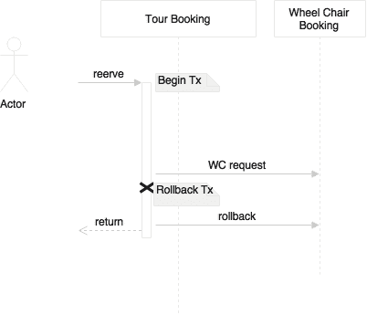

我们可以通过几种方式来解决这种情况。第一种方法是延迟发送消息直到最后。这确保在发送消息后减少任何失败的机会。即使在发送消息后发生故障，也会运行异常处理例程，也就是我们发送一个补偿消息来撤销轮椅预订。

## 服务端点设计考虑

微服务的一个重要方面是服务设计。服务设计有两个关键元素：合同设计和协议选择。

### 合同设计

服务设计的首要原则是简单。服务应该设计为消费者消费。复杂的服务合同会降低服务的可用性。**KISS**（**保持简单愚蠢**）原则帮助我们更快地构建更高质量的服务，并降低维护和更换的成本。**YAGNI**（**你不会需要它**）是支持这一想法的另一个原则。预测未来的需求并构建系统实际上并不能未雨绸缪。这导致了大量的前期投资以及更高的维护成本。

进化式设计是一个很好的概念。只需进行足够的设计来满足当下的需求，并不断改变和重构设计以适应新功能的需求。话虽如此，除非有强有力的治理措施，否则这可能并不简单。

**消费者驱动的合同**（**CDC**）是支持进化式设计的一个很好的想法。在许多情况下，当服务合同发生变化时，所有消费应用都必须经过测试。这使得变更变得困难。CDC 有助于建立对消费应用的信心。CDC 倡导每个消费者以测试用例的形式向提供者提供他们的期望，以便提供者在服务合同发生变化时将它们用作集成测试。

波斯特尔定律在这种情况下也是相关的。波斯特尔定律主要涉及 TCP 通信；然而，这同样适用于服务设计。在服务设计方面，服务提供者在接受消费者请求时应尽可能灵活，而服务消费者应遵守与提供者达成的合同。

### 协议选择

在 SOA 世界中，HTTP/SOAP 和消息传递是服务交互的默认协议。微服务遵循相同的服务交互设计原则。松耦合也是微服务世界的核心原则之一。

微服务将应用程序分解为许多物理独立的可部署服务。这不仅增加了通信成本，还容易受到网络故障的影响。这也可能导致服务性能不佳。

#### 面向消息的服务

如果我们选择异步通信方式，用户是断开连接的，因此响应时间不会直接受到影响。在这种情况下，我们可以使用标准的 JMS 或 AMQP 协议进行通信，JSON 作为有效载荷。通过 HTTP 进行消息传递也很受欢迎，因为它减少了复杂性。许多新进入消息服务的公司支持基于 HTTP 的通信。异步 REST 也是可能的，在调用长时间运行的服务时非常方便。

#### HTTP 和 REST 端点

对于互操作性、协议处理、流量路由、负载平衡、安全系统等方面，通过 HTTP 进行通信总是更好的。由于 HTTP 是无状态的，它更适合处理无关联的无状态服务。大多数开发框架、测试工具、运行时容器、安全系统等都更友好地支持 HTTP。

随着 REST 和 JSON 的流行和接受，它是微服务开发者的默认选择。HTTP/REST/JSON 协议栈使构建互操作系统变得非常容易和友好。HATEOAS 是一种新兴的设计模式，用于设计渐进式渲染和自助导航。正如前一章讨论的那样，HATEOAS 提供了一种将资源链接在一起的机制，以便消费者可以在资源之间导航。RFC 5988 - Web Linking 是另一个即将推出的标准。

#### 优化的通信协议

如果服务的响应时间要求严格，那么我们需要特别关注通信方面。在这种情况下，我们可以选择替代协议，如 Avro、Protocol Buffers 或 Thrift 来进行服务之间的通信。但这限制了服务的互操作性。权衡是在通信开销与在多个服务中复制库之间。自定义二进制协议需要仔细评估，因为它们在消费者和生产者两端绑定了本地对象。这可能会导致类版本不匹配的问题，比如基于 Java 的 RPC 风格通信中的类版本不匹配问题。

#### API 文档

最后一点：一个好的 API 不仅要简单，还应该有足够的文档供消费者使用。今天有许多工具可用于记录 REST-based 服务，如 Swagger、RAML 和 API Blueprint。

## 处理共享库

微服务背后的原则是它们应该是自治的和自包含的。为了遵循这个原则，可能会出现需要复制代码和库的情况。这些可以是技术库或功能组件。


例如，对于航班升舱的资格将在办理登机手续时和登机时进行检查。如果办理登机手续和登机是两个不同的微服务，我们可能需要在两个服务中都复制资格规则。这是添加依赖与代码重复之间的权衡。

与添加额外的依赖相比，嵌入代码可能更容易，因为它能够更好地管理发布和提高性能。但这违反了 DRY 原则。

### 注意

**DRY 原则**

系统中的每一条知识都必须有一个单一、明确、权威的表示。

这种方法的缺点是，如果共享库出现错误或需要增强，就必须在多个地方进行升级。这可能不是一个严重的挫折，因为每个服务可以包含共享库的不同版本：


将共享库开发为另一个微服务本身的替代选项需要仔细分析。如果从业务能力的角度来看它并不合格作为一个微服务，那么它可能会增加更多的复杂性而不是有用性。权衡分析在通信开销与在多个服务中复制库之间。

## 微服务中的用户界面

微服务原则主张将微服务作为从数据库到表示的垂直切片：

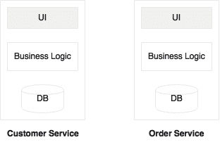

实际上，我们得到了构建快速 UI 和移动应用程序的需求，这些应用程序整合了现有的 API。在现代情景中，这并不罕见，业务希望从 IT 获得快速的周转时间：

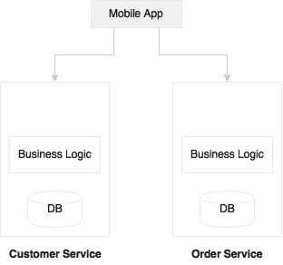

移动应用程序的渗透是这种方法的原因之一。在许多组织中，将有移动开发团队坐在业务团队旁边，通过结合和整合来自多个内部和外部来源的 API 开发快速移动应用程序。在这种情况下，我们可能只是暴露服务，并让移动团队按照业务的要求来实现。在这种情况下，我们将构建无头微服务，并让移动团队构建一个表示层。

另一个问题类别是业务可能希望构建面向社区的综合网络应用程序：

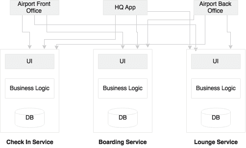

例如，业务可能希望开发一个面向机场用户的离港控制应用程序。离港控制网络应用程序可能具有办理登机手续、休息室管理、登机等功能。这些可能被设计为独立的微服务。但从业务的角度来看，所有这些都需要被整合到一个单一的网络应用程序中。在这种情况下，我们将不得不通过从后端整合服务来构建网络应用程序。

一种方法是构建一个容器网络应用程序或占位符网络应用程序，它链接到后端的多个微服务。在这种情况下，我们开发全栈微服务，但由此产生的屏幕可以嵌入到另一个占位符网络应用程序中。这种方法的一个优点是你可以有多个针对不同用户群体的占位符网络应用程序，如前图所示。我们可以使用 API 网关来避免这些交叉连接。我们将在下一节中探讨 API 网关。

## 微服务中使用 API 网关

随着像 AngularJS 这样的客户端 JavaScript 框架的发展，服务器被期望暴露 RESTful 服务。这可能会导致两个问题。第一个问题是合同期望不匹配。第二个问题是多次调用服务器来渲染页面。

我们从合同不匹配的情况开始。例如，`GetCustomer`可能返回一个具有许多字段的 JSON：

```java
Customer {
  Name: 
  Address: 
  Contact: 
}
```

在前面的情况下，`Name`、`Address`和`Contact`是嵌套的 JSON 对象。但移动客户端可能只期望基本信息，比如名字和姓氏。在 SOA 世界中，ESB 或移动中间件完成了为客户端转换数据的工作。微服务的默认方法是获取`Customer`的所有元素，然后客户端负责过滤元素。在这种情况下，网络的负担就在于网络。

我们可以考虑几种方法来解决这个问题：

```java
Customer {
  Id: 1
  Name: /customer/name/1
  Address: /customer/address/1
  Contact: /customer/contact/1
}
```

在第一种方法中，最小的信息与链接一起发送，如 HATEOAS 部分所述。在前面的情况下，对于客户 ID`1`，有三个链接，这将帮助客户端访问特定的数据元素。这个例子是一个简单的逻辑表示，不是实际的 JSON。在这种情况下，移动客户端将获得基本的客户信息。客户端进一步使用链接来获取额外所需的信息。

第二种方法是在客户端发起 REST 调用时使用的，它还将所需字段作为查询字符串的一部分发送。在这种情况下，客户端发送一个带有`firstname`和`lastname`作为查询字符串的请求，以表明客户端只需要这两个字段。缺点是它会导致复杂的服务器端逻辑，因为它必须基于字段进行过滤。服务器必须根据传入的查询发送不同的元素。

第三种方法是引入一定程度的间接性。在这种情况下，一个网关组件位于客户端和服务器之间，并根据消费者的规范转换数据。这是一个更好的方法，因为我们不会妥协后端服务契约。这导致了所谓的 UI 服务。在许多情况下，API 网关充当后端的代理，公开一组特定于消费者的 API：

微服务中使用 API 网关

我们可以以两种方式部署 API 网关。第一种是每个微服务一个 API 网关，如图**A**所示。第二种方法（图**B**）是为多个服务使用一个通用 API 网关。选择取决于我们要寻找什么。如果我们将 API 网关用作反向代理，那么可以使用诸如 Apigee、Mashery 等现成的网关作为共享平台。如果我们需要对流量塑形和复杂转换进行精细控制，那么每个服务的自定义 API 网关可能更有用。

相关问题是，我们将不得不从客户端向服务器发出许多调用。如果我们参考第一章中的度假示例，*解密微服务*，您会知道为了呈现每个小部件，我们必须向服务器发出调用。尽管我们只传输数据，但仍可能对网络造成重大负担。这种方法并不完全错误，因为在许多情况下，我们使用响应式设计和渐进式设计。数据将根据用户导航按需加载。为了做到这一点，客户端中的每个小部件都应以懒惰模式独立地向服务器发出调用。如果带宽是一个问题，那么 API 网关就是解决方案。API 网关充当中间人，从多个微服务中组合和转换 API。

## 在微服务中使用 ESB 和 iPaaS

从理论上讲，SOA 并不完全依赖于 ESB，但现实情况是，ESB 一直是许多 SOA 实施的核心。在微服务世界中，ESB 的角色将是什么？

总的来说，微服务是具有较小占地面积的完全云原生系统。微服务的轻量特性使得部署、扩展等自动化成为可能。相反，企业 ESB 具有沉重的特性，大多数商业 ESB 都不友好于云。ESB 的关键特性是协议调解、转换、编排和应用适配器。在典型的微服务生态系统中，我们可能不需要这些功能。

对于微服务相关的有限 ESB 功能，已经可以使用更轻量级的工具，如 API 网关。编排从中央总线转移到了微服务本身。因此，在微服务的情况下，不需要集中的编排能力。由于服务设置为接受更通用的消息交换样式，使用 REST/JSON 调用，因此不需要协议调解。我们从 ESB 中获得的最后一部分功能是连接回传统系统的适配器。在微服务的情况下，服务本身提供了具体的实现，因此不需要传统的连接器。因此，ESB 在微服务世界中没有自然的空间。

许多组织将 ESB 建立为其应用集成（EAI）的支柱。这些组织的企业架构政策是围绕 ESB 构建的。在使用 ESB 进行集成时，可能存在许多企业级政策，如审计、日志记录、安全性、验证等。然而，微服务倡导更加分散的治理。如果与微服务集成，ESB 将是一种过度杀伤力。

并非所有服务都是微服务。企业拥有遗留应用程序、供应商应用程序等。遗留服务使用 ESB 与微服务连接。ESB 仍然在遗留集成和供应商应用程序集成中占据一席之地。

随着云的发展，ESB 的能力已不足以管理云之间、云与本地等之间的集成。**集成平台即服务**（**iPaaS**）正在成为下一代应用集成平台，进一步减少了 ESB 的作用。在典型部署中，iPaaS 调用 API 网关来访问微服务。

## 服务版本考虑

当我们允许服务发展时，需要考虑的一个重要方面是服务版本控制。服务版本控制应该是提前考虑的，而不是事后的想法。版本控制帮助我们发布新服务而不会破坏现有的消费者。新旧版本将同时部署。

语义版本广泛用于服务版本控制。语义版本有三个组成部分：**主要**、**次要**和**补丁**。主要用于有破坏性变化时，次要用于向后兼容的变化，补丁用于向后兼容的错误修复。

当微服务中有多个服务时，版本控制可能会变得复杂。与操作级别相比，对服务级别进行版本控制总是更简单的。如果其中一个操作发生变化，服务将升级并部署到 V2。版本变化适用于服务中的所有操作。这是不可变服务的概念。

我们可以以三种不同的方式对 REST 服务进行版本控制：

+   URI 版本控制

+   媒体类型版本控制

+   自定义标头

在 URI 版本控制中，版本号包含在 URL 中。在这种情况下，我们只需要担心主要版本。因此，如果有次要版本变化或补丁，消费者不需要担心变化。将最新版本别名为非版本化的 URI 是一个好的做法，如下所示：

```java
/api/v3/customer/1234
/api/customer/1234  - aliased to v3.

@RestController("CustomerControllerV3")
@RequestMapping("api/v3/customer")
public class CustomerController {

}
```

一个稍微不同的方法是将版本号作为 URL 参数的一部分：

```java
api/customer/100?v=1.5
```

在媒体类型版本控制的情况下，版本由客户端在 HTTP `Accept`标头中设置如下：

```java
Accept:  application/vnd.company.customer-v3+json
```

版本控制的一个不太有效的方法是在自定义标头中设置版本：

```java
@RequestMapping(value = "/{id}", method = RequestMethod.GET, headers = {"version=3"})
public Customer getCustomer(@PathVariable("id") long id) {
     //other code goes here.
}
```

在 URI 方法中，客户端消费服务很简单。但这也存在一些固有问题，比如嵌套 URI 资源的版本控制可能会很复杂。事实上，与媒体类型方法相比，迁移客户端稍微复杂，服务的多个版本存在缓存问题等。然而，这些问题并不足以让我们不选择 URI 方法。大多数大型互联网公司，如谷歌、Twitter、LinkedIn 和 Salesforce 都在采用 URI 方法。

## 设计跨域

在微服务中，不能保证服务将从相同的主机或相同的域运行。复合 UI Web 应用程序可能调用多个微服务来完成任务，这些微服务可能来自不同的域和主机。

CORS 允许浏览器客户端向托管在不同域上的服务发送请求。这在基于微服务的架构中是必不可少的。

一种方法是允许所有微服务允许来自其他受信任域的跨域请求。第二种方法是使用 API 网关作为客户端的单一受信任域。

## 处理共享参考数据

在拆分大型应用程序时，我们经常看到的一个常见问题是主数据或参考数据的管理。参考数据更像是不同微服务之间需要共享的数据。城市主数据、国家主数据等将被用于许多服务，如航班时刻表、预订等。

有几种方法可以解决这个问题。例如，在相对静态、永远不会改变的数据的情况下，每个服务都可以在所有微服务内部硬编码这些数据： 

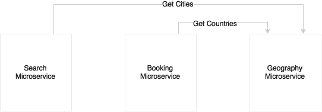

另一种方法，如前图所示，是将其构建为另一个微服务。这是一个很好、干净、整洁的方法，但缺点是每个服务可能需要多次调用主数据。如**搜索**和**预订**示例图中所示，有事务性微服务，它们使用**地理**微服务来访问共享数据：


另一种选择是将数据复制到每个微服务中。没有单一所有者，但每个服务都有其所需的主数据。更新时，所有服务都会更新。这非常有利于性能，但必须在所有服务中复制代码。在所有微服务之间保持数据同步也很复杂。如果代码库和数据简单或数据更为静态，这种方法是有意义的。

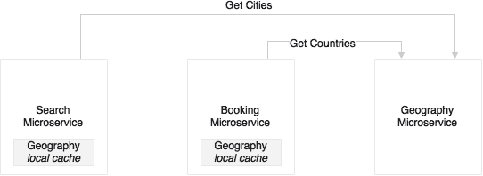

另一种方法类似于第一种方法，但每个服务都有所需数据的本地近缓存，该缓存将逐步加载。根据数据量，也可以使用 Ehcache 等本地嵌入式缓存或 Hazelcast 或 Infinispan 等数据网格。这是对依赖于主数据的大量微服务最优先的方法。

## 微服务和批量操作

由于我们已经将单片应用程序分解为更小、更专注的服务，不再可能跨微服务数据存储使用连接查询。这可能导致一种情况，即一个服务可能需要其他服务的许多记录来执行其功能。

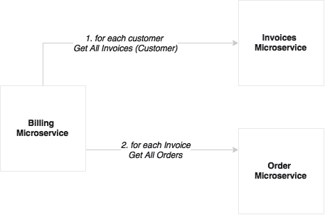

例如，月度计费功能需要处理许多客户的发票才能进行计费。更复杂的是，发票可能有很多订单。当我们将计费、发票和订单分解为三个不同的微服务时，出现的挑战是**计费**服务必须查询**发票**服务以获取所有发票，然后对每张发票调用**订单**服务以获取订单。这不是一个好的解决方案，因为发送到其他微服务的调用次数很高：

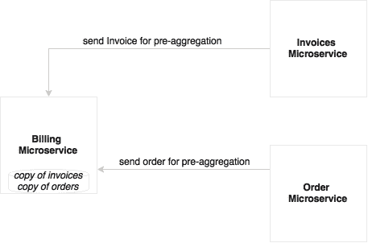

我们可以考虑两种解决方法。第一种方法是在创建数据时预先聚合数据。创建订单时，会发送一个事件。收到事件后，**计费**微服务会在内部持续聚合数据以进行月度处理。在这种情况下，**计费**微服务无需外出处理。这种方法的缺点是数据重复。

第二种方法是，在无法进行预聚合时，使用批处理 API。在这种情况下，我们调用`GetAllInvoices`，然后使用多个批次，每个批次进一步使用并行线程获取订单。Spring Batch 在这些情况下很有用。

# 微服务挑战

在前一节中，您了解了应采取的正确设计决策以及应用的权衡。在本节中，我们将回顾一些微服务的挑战，以及如何解决这些挑战以实现成功的微服务开发。

## 数据孤岛

微服务抽象出自己的本地事务存储，用于其自己的事务目的。存储类型和数据结构将针对微服务提供的服务进行优化。

例如，如果我们想要开发客户关系图，我们可以使用图形数据库如 Neo4j、OrientDB 等。使用类似 Elasticsearch 或 Solr 的索引搜索数据库进行预测性文本搜索，以便根据护照号码、地址、电子邮件、电话等任何相关信息找到客户可能是最好的。

这将使我们陷入将数据分散为异构数据岛的独特境地。例如，客户、忠诚积分、预订等是不同的微服务，因此使用不同的数据库。如果我们想要通过组合来自所有三个数据存储的数据进行近实时分析所有高价值客户，那该怎么办？这在单片应用中很容易，因为所有数据都存在于单个数据库中：

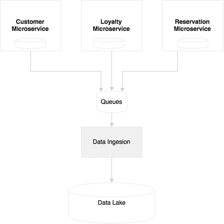

为了满足这一要求，需要一个数据仓库或数据湖。传统的数据仓库如 Oracle、Teradata 等主要用于批量报告。但是使用 NoSQL 数据库（如 Hadoop）和微批处理技术，可以通过数据湖的概念实现近实时分析。与传统的专为批量报告而构建的仓库不同，数据湖存储原始数据，而不假设数据将如何使用。现在真正的问题是如何将数据从微服务传输到数据湖中。

从微服务到数据湖或数据仓库的数据传输可以通过多种方式进行。传统的 ETL 可能是其中之一。由于我们允许通过 ETL 进行后门入口，并且打破了抽象，因此这不被认为是数据移动的有效方式。更好的方法是从微服务发送事件，例如客户注册、客户更新事件等。数据摄取工具消耗这些事件，并将状态更改适当地传播到数据湖。数据摄取工具是高度可扩展的平台，如 Spring Cloud Data Flow、Kafka、Flume 等。

## 日志记录和监控

日志文件是分析和调试的好信息。由于每个微服务都是独立部署的，它们会发出单独的日志，可能存储在本地磁盘上。这导致了日志的碎片化。当我们在多台机器上扩展服务时，每个服务实例可能会产生单独的日志文件。这使得通过日志挖掘极其困难来调试和理解服务的行为。

将**订单**、**交付**和**通知**作为三种不同的微服务进行检查，我们发现没有办法将跨越它们的客户交易相关联：

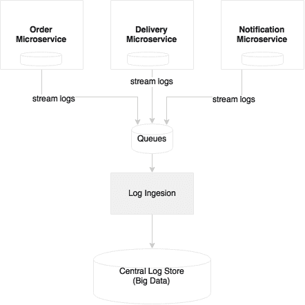

在实施微服务时，我们需要能够将每个服务的日志传输到一个集中管理的日志存储库。采用这种方法，服务不必依赖本地磁盘或本地 I/O。第二个优势是日志文件是集中管理的，并且可用于各种分析，如历史、实时和趋势。通过引入相关 ID，可以轻松跟踪端到端的交易。

对于大量的微服务以及多个版本和服务实例，很难找出哪个服务在哪个服务器上运行，这些服务的健康状况，服务依赖关系等。这在与特定或固定服务器集标记的单片应用中要容易得多。

除了了解部署拓扑和健康状况外，还需要面对识别服务行为、调试和识别热点的挑战。需要强大的监控能力来管理这样的基础设施。

我们将在第七章*日志记录和监控微服务*中涵盖日志记录和监控方面。

## 依赖管理

依赖管理是大规模微服务部署中的关键问题之一。我们如何识别并减少变更的影响？我们如何知道所有依赖服务是否正常运行？如果其中一个依赖服务不可用，服务会如何表现？

过多的依赖可能会给微服务带来挑战。以下是四个重要的设计方面：

+   通过正确设计服务边界来减少依赖关系。

+   尽量设计松散耦合的依赖关系来减少影响。此外，通过异步通信方式设计服务交互。

+   使用断路器等模式解决依赖问题。

+   使用可视化依赖图监控依赖关系。

## 组织文化

微服务实施中最大的挑战之一是组织文化。为了利用微服务的交付速度，组织应该采用敏捷开发流程、持续集成、自动化 QA 检查、自动交付流水线、自动化部署和自动基础设施配置。

遵循瀑布式开发或重量级发布管理流程的组织，以及发布周期不频繁的挑战是微服务开发的挑战。不足的自动化也是微服务部署的挑战。

简而言之，云和 DevOps 是微服务开发的支持要素。这些对于成功实施微服务至关重要。

## 治理挑战

微服务实施了分散的治理，这与传统的 SOA 治理形成鲜明对比。组织可能会发现很难适应这种变化，这可能会对微服务的开发产生负面影响。

分散治理模型带来了许多挑战。我们如何了解谁在使用服务？我们如何确保服务的重复使用？我们如何定义组织中可用的服务？我们如何确保执行企业政策？

首先要有一套标准、最佳实践和指南，说明如何实现更好的服务。这些应该以标准库、工具和技术的形式提供给组织。这确保了开发的服务是高质量的，并且它们是以一致的方式开发的。

第二个重要的考虑是有一个地方，所有利益相关者不仅可以看到所有服务，还可以看到它们的文档、合同和服务级别协议。Swagger 和 API Blueprint 通常用于处理这些要求。

## 运营开销

微服务部署通常会增加可部署单元和虚拟机（或容器）的数量。这会增加显着的管理开销并增加运营成本。

对于单个应用程序，在本地数据中心中专门使用一定数量的容器或虚拟机可能没有太多意义，除非业务利益非常高。成本通常随着规模经济而降低。在共享基础设施中部署大量微服务更有意义，因为这些微服务不是针对特定的虚拟机或容器。基础设施自动化、配置、容器化部署等能力对于大规模微服务部署至关重要。没有这种自动化，将导致显着的运营开销和成本增加。

对于许多微服务来说，**可配置项**（**CIs**）的数量变得太高，这些 CIs 部署在的服务器数量也可能是不可预测的。这使得在传统的**配置管理数据库**（**CMDB**）中管理数据变得极其困难。在许多情况下，动态发现当前运行的拓扑比静态配置的 CMDB 式部署拓扑更有用。

## 测试微服务

微服务也对服务的可测试性提出了挑战。为了实现完整的服务功能，一个服务可能依赖于另一个服务，而另一个服务又依赖于另一个服务，无论是同步还是异步。问题是我们如何测试端到端的服务以评估其行为？在测试时，依赖的服务可能可用，也可能不可用。

服务虚拟化或服务模拟是测试服务的技术之一，可以在没有实际依赖关系的情况下进行测试。在测试环境中，当服务不可用时，模拟服务可以模拟实际服务的行为。微服务生态系统需要服务虚拟化能力。然而，这可能无法完全保证，因为模拟服务可能无法模拟许多边缘情况，特别是当存在深层依赖关系时。

另一种方法，正如前面讨论的，是使用消费者驱动的合同。翻译后的集成测试用例可以涵盖服务调用的几乎所有边缘情况。

测试自动化、适当的性能测试和持续交付方法，如 A/B 测试、未来标志、金丝雀测试、蓝绿部署和红黑部署，都可以降低生产发布的风险。

## 基础设施供应

正如在操作开销下简要提到的，手动部署可能严重挑战微服务的部署。如果部署中存在手动元素，部署者或运维管理员应该了解运行拓扑，手动重新路由流量，然后逐个部署应用程序，直到所有服务都升级完成。随着许多服务器实例的运行，这可能导致重大的操作开销。此外，在这种手动方法中出现错误的机会很高。

微服务需要支持弹性云一样的基础设施，可以自动提供虚拟机或容器，自动部署应用程序，调整流量流向，将新版本复制到所有实例，并优雅地淘汰旧版本。自动化还负责根据需求添加容器或虚拟机来弹性扩展，并在负载低于阈值时缩减规模。

在具有许多微服务的大型部署环境中，我们可能还需要额外的工具来管理可以进一步自动启动或销毁服务的虚拟机或容器。

# 微服务能力模型

在我们总结本章之前，我们将根据本章描述的设计指南和常见模式和解决方案来审查微服务的能力模型。

以下图表描述了微服务的能力模型：

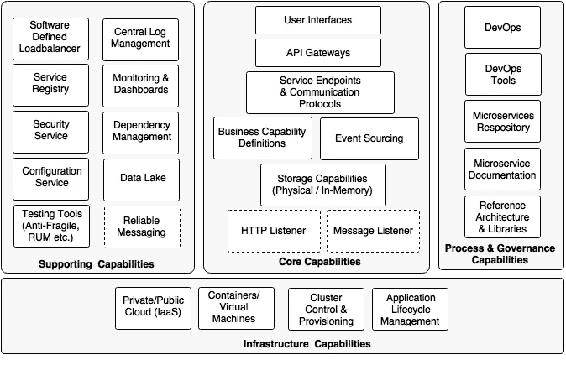

能力模型大致分为四个领域：

+   **核心能力**：这些是微服务本身的一部分

+   **支持能力**：这些是支持核心微服务实施的软件解决方案

+   **基础设施能力**：这些是成功实施微服务的基础设施级别期望

+   **治理能力**：这更多是过程、人员和参考信息

## 核心能力

核心能力的解释如下：

+   **服务监听器**（HTTP/消息）：如果微服务启用了基于 HTTP 的服务端点，则 HTTP 监听器嵌入在微服务中，从而消除了对外部应用服务器的需求。HTTP 监听器在应用启动时启动。如果微服务基于异步通信，则会启动消息监听器而不是 HTTP 监听器。还可以考虑其他协议。如果微服务是定时服务，则可能没有任何监听器。Spring Boot 和 Spring Cloud Streams 提供了这种能力。

+   存储能力：微服务具有某种存储机制，用于存储与业务能力相关的状态或事务数据。这是可选的，取决于实现的能力。存储可以是物理存储（如 MySQL 等关系型数据库管理系统；Hadoop、Cassandra、Neo 4J、Elasticsearch 等 NoSQL 数据库），也可以是内存存储（如 Ehcache 等缓存，Hazelcast、Infinispan 等数据网格）。

+   业务能力定义：这是微服务的核心，业务逻辑在其中实现。这可以用任何适用的语言实现，如 Java、Scala、Conjure、Erlang 等。实现所需的所有业务逻辑将嵌入在微服务中。

+   事件溯源：微服务向外部世界发送状态更改，而不必真正担心这些事件的目标消费者。其他微服务、审计服务、复制服务或外部应用程序等都可以消费这些事件。这使得其他微服务和应用程序可以响应状态更改。

+   服务端点和通信协议：这些定义了外部消费者使用的 API。这些可以是同步端点或异步端点。同步端点可以基于 REST/JSON 或其他协议，如 Avro、Thrift、Protocol Buffers 等。异步端点通过 Spring Cloud Streams 支持的 RabbitMQ、其他消息服务器或其他消息样式实现，如 ZeroMQ。

+   API 网关：API 网关通过代理服务端点或组合多个服务端点提供一定程度的间接性。API 网关还可用于执行策略。它还可以提供实时负载平衡能力。市场上有许多 API 网关可用。Spring Cloud Zuul、Mashery、Apigee 和 3scale 是 API 网关提供商的一些例子。

+   用户界面：通常，用户界面也是微服务的一部分，用于用户与微服务实现的业务能力进行交互。这些可以用任何技术实现，并且与通道和设备无关。

## 基础设施能力

对于成功部署和管理大规模微服务，需要某些基础设施能力。在大规模部署微服务时，如果没有适当的基础设施能力，可能会面临挑战，并导致失败：

+   云：在传统的数据中心环境中，微服务的实施是困难的，因为需要长时间来配置基础设施。即使为每个微服务专门配置大量基础设施，也可能不具有成本效益。在数据中心内部管理它们可能会增加所有权成本和运营成本。云式基础设施更适合微服务部署。

+   容器或虚拟机：管理大型物理机器不具有成本效益，而且也很难管理。物理机器也很难处理自动容错。许多组织采用虚拟化技术，因为它能够充分利用物理资源，并提供资源隔离。它还减少了管理大型物理基础设施组件的开销。容器是虚拟机的下一代。VMWare、Citrix 等公司提供虚拟机技术。Docker、Drawbridge、Rocket 和 LXD 是一些容器技术。

+   集群控制和配置：一旦我们有大量容器或虚拟机，就很难自动管理和维护它们。集群控制工具在容器之上提供统一的操作环境，并在多个服务之间共享可用容量。Apache Mesos 和 Kubernetes 是集群控制系统的例子。

+   **应用程序生命周期管理**：应用程序生命周期管理工具有助于在启动新容器时调用应用程序，或在容器关闭时终止应用程序。应用程序生命周期管理允许脚本应用程序部署和发布。它自动检测故障情况，并对这些故障做出响应，从而确保应用程序的可用性。这与集群控制软件协同工作。Marathon 部分地满足了这一能力。

## 支持能力

支持能力并不直接与微服务相关，但对于大规模微服务开发至关重要。

+   **软件定义的负载均衡器**：负载均衡器应该足够智能，能够理解部署拓扑的变化，并做出相应的响应。这摆脱了在负载均衡器中配置静态 IP 地址、域别名或集群地址的传统方法。当新服务器添加到环境中时，它应该自动检测到，并通过避免任何手动交互将它们包含在逻辑集群中。同样，如果服务实例不可用，它应该从负载均衡器中移除。Ribbon、Eureka 和 Zuul 的组合在 Spring Cloud Netflix 中提供了这一能力。

+   **中央日志管理**：正如本章前面探讨的，需要一个能够集中所有服务实例发出的日志并带有相关性 ID 的能力。这有助于调试、识别性能瓶颈和预测分析。其结果反馈到生命周期管理器中，以采取纠正措施。

+   **服务注册表**：服务注册表为服务提供了一个运行时环境，使其能够在运行时自动发布其可用性。注册表将是了解任何时候服务拓扑的良好信息来源。Spring Cloud 的 Eureka、Zookeeper 和 Etcd 是一些可用的服务注册表工具。

+   **安全服务**：分布式微服务生态系统需要一个用于管理服务安全的中央服务器。这包括服务认证和令牌服务。基于 OAuth2 的服务广泛用于微服务安全。Spring Security 和 Spring Security OAuth 是构建这一能力的良好选择。

+   **服务配置**：所有服务配置应该按照十二要素应用程序原则进行外部化。一个集中的服务用于所有配置是一个不错的选择。Spring Cloud Config 服务器和 Archaius 是现成的配置服务器。

+   **测试工具（反脆弱性、RUM 等）**：Netflix 使用 Simian Army 进行反脆弱性测试。成熟的服务需要持续的挑战来检验服务的可靠性，以及良好的备用机制。Simian Army 组件创建各种错误场景，以探索系统在故障情况下的行为。

+   **监控和仪表板**：微服务还需要强大的监控机制。这不仅仅是基础设施级别的监控，还包括服务级别的监控。Spring Cloud Netflix Turbine、Hysterix Dashboard 等提供服务级别信息。像 AppDynamic、New Relic、Dynatrace 以及 statd、Sensu、Spigo 等端到端监控工具可以为微服务监控增加价值。

+   **依赖和 CI 管理**：我们还需要工具来发现运行时拓扑、服务依赖关系，并管理可配置项。基于图形的 CMDB 是管理这些场景最明显的工具。

+   **数据湖**：正如本章前面讨论的，我们需要一种机制来合并存储在不同微服务中的数据，并进行近实时分析。数据湖是实现这一目标的不错选择。Spring Cloud Data Flow、Flume 和 Kafka 等数据摄取工具用于消费数据。HDFS、Cassandra 等用于存储数据。

+   **可靠的消息传递**：如果通信是异步的，我们可能需要可靠的消息传递基础设施服务，如 RabbitMQ 或任何其他可靠的消息传递服务。云消息传递或作为服务的消息传递是互联网规模基于消息的服务端点的流行选择。

## 流程和治理能力

拼图中的最后一块是微服务所需的流程和治理能力：

+   **DevOps**：成功实施微服务的关键是采用 DevOps。DevOps 通过支持敏捷开发、高速交付、自动化和更好的变更管理来补充微服务开发。

+   **DevOps 工具**：敏捷开发、持续集成、持续交付和持续部署的 DevOps 工具对于成功交付微服务至关重要。需要大量强调自动化功能、真实用户测试、合成测试、集成、发布和性能测试。

+   **微服务仓库**：微服务仓库是微服务的版本化二进制文件存放的地方。这可以是一个简单的 Nexus 仓库，也可以是一个容器仓库，比如 Docker 注册表。

+   **微服务文档**：正确记录所有微服务非常重要。Swagger 或 API Blueprint 有助于实现良好的微服务文档。

+   **参考架构和库**：参考架构在组织级别提供了蓝图，以确保服务按照一定的标准和指南以一致的方式开发。其中许多可以转化为许多可重用的库，以强制执行服务开发理念。

# 总结

在本章中，您学习了处理微服务开发中可能出现的实际场景。

您学习了各种解决常见微服务问题的解决方案选项和模式。我们审查了开发大规模微服务时遇到的许多挑战，以及如何有效解决这些挑战。

我们还为基于微服务的生态系统构建了一个能力参考模型。该能力模型有助于解决构建互联网规模微服务时的差距。本章学到的能力模型将是本书的支柱。其余章节将深入探讨能力模型。

在下一章中，我们将解决一个现实世界的问题，并使用微服务架构对其进行建模，以了解如何将我们的学习转化为实践。
