# 第四章：微服务演进-案例研究

与 SOA 一样，微服务架构可以根据手头的问题在不同组织中有不同的解释。除非详细研究一个相当大的真实问题，否则微服务概念很难理解。

本章将介绍 BrownField 航空公司（BF），一个虚构的廉价航空公司，以及他们从单体**乘客销售和服务**（**PSS**）应用到下一代微服务架构的过程。本章将详细研究 PSS 应用，并解释从单体系统到基于微服务的架构的挑战、方法和转型步骤，遵循前一章中解释的原则和实践。

这个案例研究的目的是让我们尽可能接近实际情况，以便将架构概念确立下来。

在本章结束时，您将学到以下内容：

+   将单体系统迁移到基于微服务的真实案例，以 BrownField 航空公司的 PSS 应用为例

+   迁移单体应用程序到微服务的各种方法和过渡策略

+   使用 Spring 框架组件设计一个新的未来主义微服务系统来替代 PSS 应用程序

# 审查微服务能力模型

本章的示例探讨了第三章中讨论的微服务能力模型中的以下微服务能力：

+   **HTTP 监听器**

+   **消息监听器**

+   **存储能力（物理/内存）**

+   **业务能力定义**

+   **服务端点和通信协议**

+   **用户界面**

+   **安全服务**

+   **微服务文档**

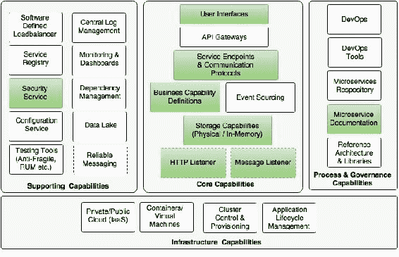

在第二章中，*使用 Spring Boot 构建微服务*，我们独立探讨了所有这些能力，包括如何保护 Spring Boot 微服务。本章将基于一个真实案例构建一个全面的微服务示例。

### 提示

本章的完整源代码可在代码文件的`第四章`项目中找到。

# 了解 PSS 应用

BrownField 航空公司是增长最快的低成本地区航空公司之一，从其枢纽直飞 100 多个目的地。作为一家初创航空公司，BrownField 航空公司从少数目的地和少量飞机开始运营。BrownField 开发了自己的 PSS 应用来处理他们的乘客销售和服务。

## 业务流程视图

这个用例为了讨论目的而大大简化了。以下图表中的流程视图显示了 BrownField 航空公司当前 PSS 解决方案涵盖的端到端乘客服务操作：

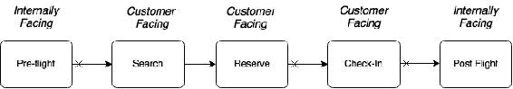

当前解决方案正在自动化某些面向客户的功能以及某些面向内部的功能。有两个面向内部的功能，**Pre-flight**和**Post-flight**。**Pre-flight**功能包括规划阶段，用于准备飞行计划、计划、飞机等。**Post-flight**功能由后勤部门用于收入管理、会计等。**搜索**和**预订**功能是在线座位预订流程的一部分，**办理登机手续**是在机场接受乘客的过程。**办理登机手续**也可以通过互联网向最终用户提供在线办理登机手续。

在前面的图表中，箭头开头的交叉标记表示它们是断开的，并且发生在不同的时间轴上。例如，乘客可以提前 360 天预订，而办理登机手续通常发生在飞机起飞前 24 小时。

## 功能视图

以下图表显示了 BrownField 航空公司 PSS 景观的功能构建块。每个业务流程及其相关的子功能都在一行中表示：

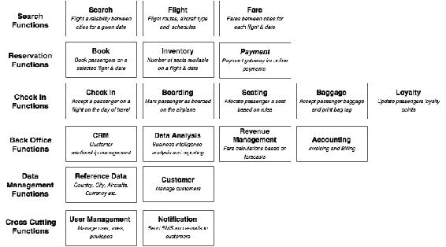

前面图表中显示的每个子功能都解释了它在整个业务流程中的作用。一些子功能参与了多个业务流程。例如，库存在搜索和预订中都有使用。为了避免任何复杂情况，这在图表中没有显示。数据管理和交叉子功能在许多业务功能中使用。

## 架构视图

为了有效管理端到端的乘客操作，BrownField 在近十年前开发了一款内部 PSS 应用程序。这款良好架构的应用程序是使用 Java 和 JEE 技术结合当时最先进的开源技术开发的。

整体架构和技术如下图所示：

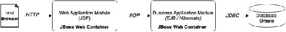

架构有明确定义的边界。此外，不同的关注点被分隔到不同的层中。Web 应用程序被开发为*N*层、基于组件的模块化系统。功能通过以 EJB 端点形式定义的明确定义的服务契约相互交互。

## 设计视图

应用程序有许多逻辑功能分组或子系统。此外，每个子系统都有许多组件，组织如下图所示：

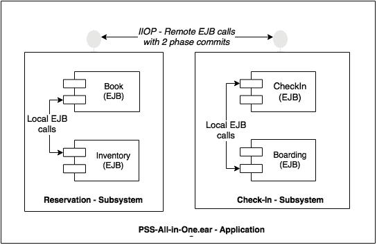

子系统通过使用 IIOP 协议进行远程 EJB 调用相互交互。事务边界跨越子系统。子系统内的组件通过本地 EJB 组件接口相互通信。理论上，由于子系统使用远程 EJB 端点，它们可以在不同的物理分离的应用服务器上运行。这是设计目标之一。

## 实施视图

以下图表中的实施视图展示了子系统及其组件的内部组织。图表的目的也是展示不同类型的构件：

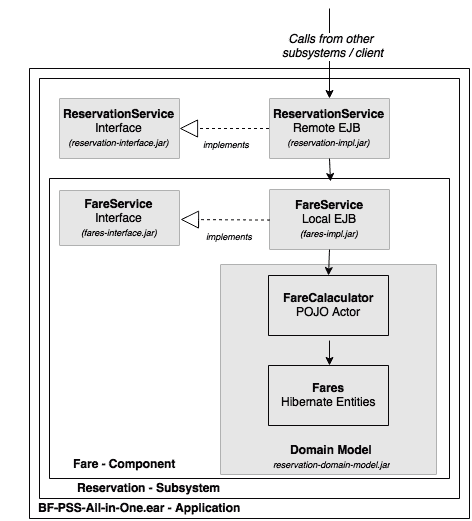

在前面的图表中，灰色阴影框被视为不同的 Maven 项目，并转化为物理构件。子系统和组件都遵循“按接口编程”的原则进行设计。接口被打包为单独的 JAR 文件，以便客户端与实现分离。业务逻辑的复杂性被隐藏在领域模型中。本地 EJB 被用作组件接口。最后，所有子系统被打包到一个单一的 EAR 中，并部署在应用服务器中。

## 部署视图

应用程序的初始部署如下图所示，简单而直接：

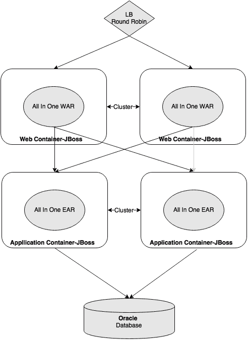

Web 模块和业务模块被部署到单独的应用服务器集群中。通过向集群添加更多应用服务器来实现水平扩展应用程序。

零停机部署通过创建一个备用集群，并优雅地将流量转移到该集群来处理。一旦主集群被打补丁升级到新版本并重新投入使用，备用集群就会被销毁。大多数数据库更改都设计为向后兼容，但破坏性更改会导致应用程序中断。

# 巨石的消亡

PSS 应用程序表现良好，成功支持所有业务需求以及预期的服务水平。在最初的几年里，系统在业务的有机增长中没有任何问题。

业务在一段时间内实现了巨大的增长。车队规模显著增加，新目的地被添加到网络中。由于这种快速增长，预订数量增加，导致交易量急剧增加，达到最初估计的 200 到 500 倍。

## 痛点

业务的快速增长最终使应用程序承受了压力。出现了奇怪的稳定性问题和性能问题。新的应用程序发布开始破坏工作代码。此外，变更的成本和交付速度开始深刻影响业务运营。

进行了端到端架构审查，并暴露了系统的弱点以及许多故障的根本原因，如下所示：

+   **稳定性**：稳定性问题主要是由于线程阻塞，限制了应用服务器接受更多交易的能力。线程阻塞主要是由于数据库表锁。内存问题也是稳定性问题的另一个原因。还存在一些资源密集型操作的问题，这些问题影响了整个应用程序。

+   **故障**：故障窗口的增加主要是由于服务器启动时间的增加。这个问题的根本原因归结为 EAR 的体积过大。在任何故障窗口期间，消息堆积导致故障窗口后立即对应用的大量使用。由于一切都打包在一个单独的 EAR 中，任何小的应用代码更改都会导致完全重新部署。之前描述的零停机部署模型的复杂性，以及服务器启动时间的增加，都增加了故障的数量和持续时间。

+   **敏捷性**：随着时间的推移，代码的复杂性也大大增加，部分原因是在实施变更时缺乏纪律。因此，变更变得更难实施。此外，影响分析变得过于复杂。因此，不准确的影响分析经常导致修复破坏了工作代码。应用构建时间大大增加，从几分钟到几个小时，导致开发生产率不可接受的下降。构建时间的增加还导致构建自动化困难，并最终停止了**持续集成**（**CI**）和单元测试。

## 临时修复

性能问题部分通过在规模立方体中应用 Y 轴扩展方法来解决，如第一章 *解密微服务*中所述。全面的 EAR 部署到多个不相交的集群中。安装了软件代理，以选择性地将流量路由到指定的集群，如下图所示：

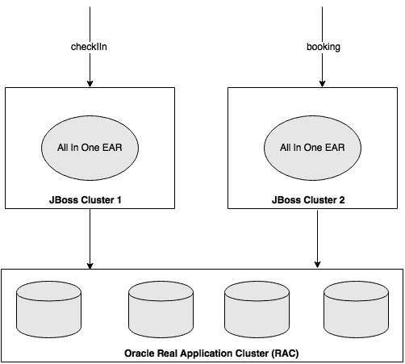

这有助于 BrownField 的 IT 扩展应用服务器。因此，稳定性问题得到了控制。然而，这很快在数据库层面导致了瓶颈。Oracle 的**Real Application Cluster**（**RAC**）被实施为解决这个问题的解决方案。

这种新的扩展模型减少了稳定性问题，但以增加的复杂性和所有权成本为代价。技术债务也随着时间的推移而增加，导致了一种状态，即完全重写是减少这种技术债务的唯一选择。

## 回顾

尽管应用程序架构良好，但功能组件之间存在明显的分离。它们松散耦合，通过标准化接口编程，并且具有丰富的领域模型。

显而易见的问题是，为什么这样一个设计良好的应用程序未能达到预期？架构师还能做些什么？

重要的是要了解随着时间的推移出现了什么问题。在本书的背景下，了解微服务如何避免这些情况再次发生也很重要。我们将在接下来的章节中研究其中一些情况。

### 共享数据

几乎所有功能模块都需要参考数据，例如航空公司的详细信息，飞机的详细信息，机场和城市的列表，国家，货币等等。例如，票价是根据出发地（城市）计算的，航班是在出发地和目的地（机场）之间的，办理登机手续是在出发机场（机场）进行的，等等。在某些功能中，参考数据是信息模型的一部分，而在另一些功能中，它用于验证目的。

这些参考数据大部分既不是完全静态的，也不是完全动态的。当航空公司开通新航线时，可能会增加一个国家、城市、机场等。当航空公司购买新飞机或更改现有飞机的座位配置时，飞机参考数据可能会发生变化。

参考数据的常见用法之一是根据某些参考数据过滤操作数据。例如，假设用户希望查看所有飞往某个国家的航班。在这种情况下，事件的流程可能如下：找到所选国家的所有城市，然后找到所有城市的机场，然后发送请求以获取所有飞往该国家中所识别的机场的航班列表。

在设计系统时，架构师考虑了多种方法。将参考数据作为独立子系统分离是考虑的选项之一，但这可能会导致性能问题。团队决定采用异常处理的方法来处理参考数据，与其他事务相比。考虑到前面讨论的查询模式的性质，该方法是将参考数据用作共享库。

在这种情况下，允许子系统直接访问参考数据，而不是通过 EJB 接口。这也意味着无论子系统如何，Hibernate 实体都可以将参考数据用作它们实体关系的一部分。

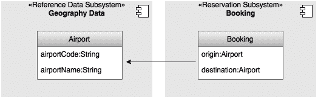

如前图所示，预订子系统中的**Booking**实体被允许使用参考数据实体，例如**Airport**，作为它们的关系的一部分。

### 单一数据库

尽管在中间层强制执行了足够的分离，但所有功能都指向单一数据库，甚至是相同的数据库架构。单一架构方法带来了一系列问题。

#### 本地查询

Hibernate 框架提供了对底层数据库的良好抽象。它生成高效的 SQL 语句，在大多数情况下使用特定的方言针对数据库。然而，有时编写本地 JDBC SQL 可以提供更好的性能和资源效率。在某些情况下，使用本地数据库函数可以获得更好的性能。

单一数据库方法在开始时效果很好。但随着时间的推移，它为开发人员打开了一个漏洞，通过连接不同子系统拥有的数据库表。本地 JDBC SQL 是执行这一操作的良好工具。

以下图表显示了使用本地 JDBC SQL 连接两个子系统拥有的两个表的示例：

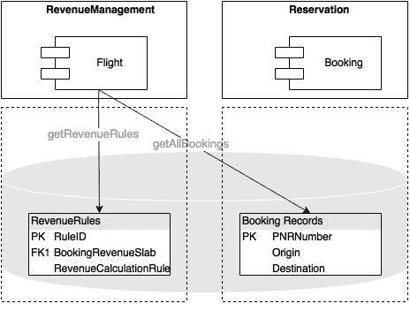

如前图所示，会计组件需要从预订组件获取给定城市当天的所有预订记录，以便进行日终结算。基于子系统的设计要求会计组件向预订组件发起服务调用，以获取给定城市的所有预订记录。假设这会导致*N*条预订记录。现在，对于每条预订记录，会计组件必须执行数据库调用，以查找与每条预订记录附加的票价代码相关的适用规则。这可能导致*N+1*个 JDBC 调用，效率低下。虽然可以使用批量查询或并行和批量执行等解决方法，但这将导致增加编码工作量和增加复杂性。开发人员通过本地 JDBC 查询来解决这个问题，作为一种易于实现的快捷方式。基本上，这种方法可以将调用次数从*N+1*减少到单个数据库调用，编码工作量最小。

这种习惯继续下去，许多 JDBC 本地查询连接跨多个组件和子系统的表。这不仅导致组件之间耦合度高，还导致代码难以发现和难以检测。

#### 存储过程

由于使用单个数据库而出现的另一个问题是复杂存储过程的使用。一些在中间层编写的复杂数据中心逻辑性能不佳，导致响应缓慢、内存问题和线程阻塞问题。

为了解决这个问题，开发人员决定将一些复杂的业务逻辑从中间层移动到数据库层，通过在存储过程中直接实现逻辑。这个决定改善了一些交易的性能，并消除了一些稳定性问题。随着时间的推移，越来越多的存储过程被添加。然而，这最终破坏了应用程序的模块化。

### 领域边界

尽管领域边界已经建立，但所有组件都打包在一个单独的 EAR 文件中。由于所有组件都设置在单个容器上运行，开发人员可以自由引用这些边界之间的对象。随着时间的推移，项目团队发生了变化，交付压力增加，复杂性大大增加。开发人员开始寻找快速解决方案，而不是正确的解决方案。应用程序的模块化特性逐渐消失。

如下图所示，跨子系统边界创建了 Hibernate 关系：

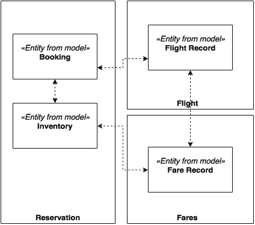

# 微服务解救

BrownField 航空公司没有太多的改进机会来支持不断增长的业务需求。BrownField 航空公司希望以渐进式方法而不是革命性模式重新平台化系统。

在这些情况下，微服务是一种理想选择，可以在最小干扰业务的情况下转换传统的单块应用：

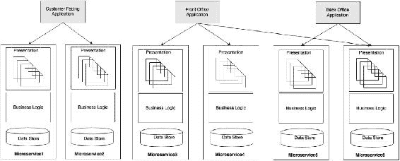

如前图所示，目标是转向基于微服务的架构，与业务能力对齐。每个微服务将包含数据存储、业务逻辑和表示层。

BrownField 航空公司采取的方法是构建多个面向特定用户群体的 Web 门户应用程序，如面向客户、前台和后台。这种方法的优势在于对建模的灵活性，以及对不同社区进行不同对待的可能性。例如，面向互联网的层的政策、架构和测试方法与面向内部网的 Web 应用程序不同。面向互联网的应用程序可以利用 CDN（内容传送网络）尽可能地将页面靠近客户端，而内部网应用程序可以直接从数据中心提供页面。

# 业务案例

在为迁移建立业务案例时，一个常见的问题是“微服务架构如何避免在另外五年内重新出现相同的问题？”

微服务提供了一系列的好处，你在第一章中学到了，但在这种情况下，重要的是列出其中一些关键的好处：

+   **服务依赖**：在从单片应用程序迁移到微服务时，依赖关系更为明确，因此架构师和开发人员更有能力避免破坏依赖关系，并未来保护依赖关系问题。来自单片应用程序的经验帮助架构师和开发人员设计一个更好的系统。

+   **物理边界**：微服务在所有领域都强制实施物理边界，包括数据存储、业务逻辑和表示层。由于它们的物理隔离，跨子系统或微服务的访问是真正受限制的。除了物理边界，它们甚至可以在不同的技术上运行。

+   **选择性扩展**：在微服务架构中，可以进行选择性的扩展。与单片场景中使用的 Y-比例方法相比，这提供了一种更具成本效益的扩展机制。

+   **技术过时**：技术迁移可以应用于微服务级别，而不是整体应用级别。因此，它不需要巨额投资。

# 规划演变

要打破拥有数百万行代码的应用程序并不简单，特别是如果代码具有复杂的依赖关系。我们如何打破它？更重要的是，我们从哪里开始，以及如何解决这个问题？

## 进化方法

解决这个问题的最佳方法是建立一个过渡计划，并逐渐将功能迁移到微服务。在每一步，都会在单片应用程序之外创建一个微服务，并将流量转移到新服务，如下图所示：

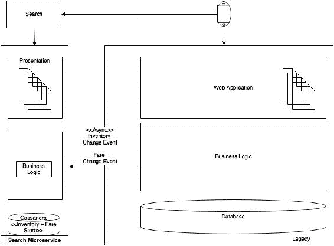

为了成功地运行这次迁移，需要从过渡的角度回答一些关键问题：

+   识别微服务的边界

+   为迁移优先考虑微服务

+   在过渡阶段处理数据同步

+   处理用户界面集成，与旧用户界面和新用户界面一起工作

+   在新系统中处理参考数据

+   测试策略以确保业务能力完整且正确重现

+   微服务开发的任何先决条件的识别，如微服务能力、框架、流程等

## 识别微服务边界

首要的活动是识别微服务的边界。这是问题中最有趣的部分，也是最困难的部分。如果边界的识别不正确，迁移可能会导致更复杂的可管理性问题。

就像在 SOA 中一样，服务分解是识别服务的最佳方式。然而，需要注意的是，分解停止于业务能力或有界上下文。在 SOA 中，服务分解进一步到原子、细粒度的服务级别。

顶部向下的方法通常用于域分解。在打破现有系统的情况下，自下而上的方法也很有用，因为它可以利用现有单片应用程序的许多实际知识、功能和行为。

先前的分解步骤将给出潜在的微服务列表。重要的是要注意，这不是最终的微服务列表，但它作为一个很好的起点。我们将通过一些过滤机制来得到最终的列表。在这种情况下，功能分解的第一步将类似于本章前面介绍的功能视图下显示的图表。

### 分析依赖关系

接下来的步骤是分析我们在上一节中创建的候选微服务之间的依赖关系。在这项活动结束时，将生成一个依赖图。

### 注意

这项工作需要一个由架构师、业务分析师、开发人员、发布管理和支持人员组成的团队。

生成依赖图的一种方法是列出遗留系统的所有组件并叠加依赖关系。这可以通过结合以下一种或多种方法来完成：

+   分析手动代码并重新生成依赖关系。

+   利用开发团队的经验重新生成依赖关系。

+   使用 Maven 依赖图。我们可以使用一些工具来重新生成依赖图，如 PomExplorer、PomParser 等。

+   使用性能工程工具，如 AppDynamics 来识别调用堆栈和依赖关系。

假设我们按照以下图表中显示的函数及其依赖关系进行复制：

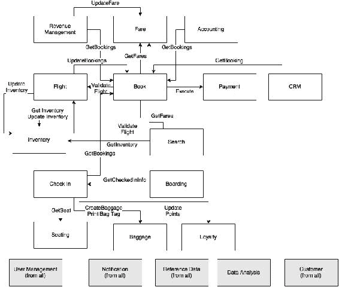

不同模块之间存在许多来回的依赖关系。底层显示了跨模块使用的横切能力。在这一点上，模块更像是意大利面而不是自主单元。

接下来的步骤是分析这些依赖关系，并提出一个更好、更简化的依赖映射。

#### 事件与查询相对

依赖关系可以是基于查询或基于事件的。基于事件的对可扩展系统更好。有时，可以将基于查询的通信转换为基于事件的通信。在许多情况下，这些依赖关系存在是因为业务组织是这样管理的，或者是由于旧系统处理业务情景的方式。

从先前的图表中，我们可以提取出收入管理和票价服务：

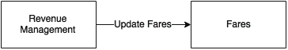

收入管理是一个用于根据预订需求预测计算最佳票价数值的模块。如果起始地和目的地之间的票价发生变化，收入管理将调用票价模块上的更新票价来更新票价模块中的相应票价。

另一种思考方式是，票价模块订阅了收入管理以获取票价变化，而收入管理在票价变化时发布。这种反应式编程方法通过这种方式给予了额外的灵活性，使得票价和收入管理模块可以保持独立，并通过可靠的消息传递系统进行连接。这种模式也可以应用于从办理登机到忠诚度和登机模块等许多其他情景。

接下来，检查 CRM 和 Booking 的情景：


这种情景与先前解释的情景略有不同。CRM 模块用于管理乘客投诉。当 CRM 收到投诉时，它会检索相应乘客的预订数据。实际上，投诉数量与预订数量相比可以忽略不计。如果我们盲目地应用先前的模式，即 CRM 订阅所有预订，我们会发现这是不划算的：


检查预订和预订模块之间的另一个场景。办理登机是否可以监听预订事件，而不是调用预订模块上的获取预订服务？这是可能的，但这里的挑战是，预订可以提前 360 天发生，而办理登机通常只在飞行起飞前 24 小时开始。提前 360 天在办理登机模块中复制所有预订和预订更改将不是一个明智的决定，因为办理登机直到飞行起飞前 24 小时才需要这些数据。

另一个选择是，当航班开放办理登机手续时（起飞前 24 小时），办理登机会调用预订模块上的服务，以获取给定航班的预订快照。一旦完成，办理登机可以订阅该航班的预订事件。在这种情况下，使用了基于查询和基于事件的组合方法。通过这样做，除了减少这两个服务之间的查询次数外，还减少了不必要的事件和存储。

简而言之，并没有一种政策适用于所有情况。每种情况都需要逻辑思维，然后应用最合适的模式。

#### 事件而不是同步更新

除了查询模型，依赖关系也可以是更新事务。考虑收入管理和预订之间的情况：

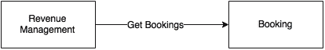

为了对当前需求进行预测和分析，收入管理需要获取所有航班的所有预订。当前的方法如依赖图所示，收入管理有一个调用预订模块上的获取预订的定时作业，以获取自上次同步以来的所有增量预订（新预订和更改）。

另一种方法是在预订模块中即时将新预订和预订更改作为异步推送发送。相同的模式可以应用于许多其他场景，例如从预订到会计，从航班到库存，以及从航班到预订。在这种方法中，源服务将所有状态更改事件发布到主题。所有感兴趣的方都可以订阅此事件流并在本地存储。这种方法消除了许多硬连接，并保持系统松散耦合。

依赖关系在下一个图中描述：

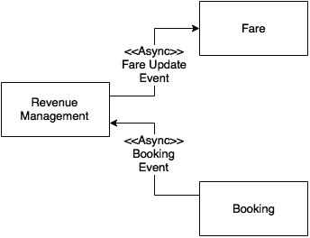

在前面的图中所示的情况下，我们改变了依赖关系，并将它们转换为异步事件。

最后一个要分析的情况是预订模块向库存模块的更新库存调用：


当预订完成时，库存状态将通过减少存储在库存服务中的库存来更新。例如，当有 10 个经济舱座位可用时，在预订结束时，我们必须将其减少到 9 个。在当前系统中，预订和更新库存在同一事务边界内执行。这是为了处理只剩下一个座位的情况，而多个客户正在尝试预订。在新设计中，如果我们应用相同的事件驱动模式，将库存更新作为事件发送到库存可能会使系统处于不一致的状态。这需要进一步分析，我们将在本章后面解决这个问题。

#### 挑战要求

在许多情况下，可以通过重新审视需求来实现目标状态：

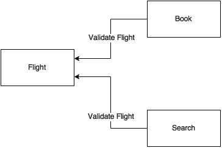

有两个验证航班的调用，一个来自预订，另一个来自搜索模块。验证航班的调用是为了验证来自不同渠道的输入航班数据。最终目标是避免存储或服务不正确的数据。当客户进行航班搜索时，比如说“BF100”，系统会验证这个航班以查看以下内容：

+   这是否是一个有效的航班？

+   那天是否有这个特定日期的航班？

+   这次航班有没有设置任何预订限制？

另一种解决方法是根据这些给定条件调整航班的库存。例如，如果航班有限制，更新库存为零。在这种情况下，智能将保留在航班中，并持续更新库存。就搜索和预订而言，两者只是查找库存，而不是为每个请求验证航班。与原始方法相比，这种方法更有效。

接下来我们将审查支付用例。支付通常是一个独立的功能，因为安全约束的性质，如 PCIDSS 类似的标准。捕获支付的最明显方式是将浏览器重定向到支付服务中托管的支付页面。由于卡处理应用程序属于 PCIDSS 的范围，因此明智地删除支付服务的任何直接依赖关系。因此，我们可以删除预订到支付的直接依赖，并选择 UI 级别的集成。

#### 挑战服务边界

在这一部分，我们将根据需求和依赖图，审查一些服务边界，考虑登记和其对座位和行李的依赖关系。

座位功能基于飞机座位分配的当前状态运行一些算法，并找出最佳方式来安置下一个乘客，以满足重量和平衡要求。这是基于一些预定义的业务规则。然而，除了登记，没有其他模块对座位功能感兴趣。从业务能力的角度来看，座位只是登记的一个功能，而不是一个独立的业务能力。因此，最好将这个逻辑嵌入到登记本身。

行李也是一样的。BrownField 有一个独立的行李处理系统。PSS 上下文中的行李功能是打印行李标签以及将行李数据存储在登记记录中。这个特定功能没有与任何业务能力相关联。因此，最好将这个功能移动到登记本身。

重新设计后，预订、搜索和库存功能如下图所示：

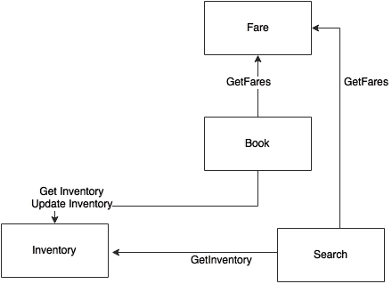

同样，库存和搜索更多地是预订模块的支持功能。它们与任何业务能力都不对齐。与之前的判断类似，最好将搜索和库存功能移动到预订中。假设，暂时将搜索、库存和预订移动到一个名为预订的单一微服务中。

根据 BrownField 的统计数据，搜索交易的频率比预订交易高 10 倍。此外，与预订相比，搜索不是一项产生收入的交易。由于这些原因，我们需要为搜索和预订采用不同的可扩展性模型。如果搜索交易突然激增，预订不应受到影响。从业务角度来看，为了保存有效的预订交易，放弃搜索交易更为可接受。

这是一个多语种需求的例子，它推翻了业务能力的对齐。在这种情况下，将搜索作为一个独立的服务，与预订服务分开更有意义。假设我们移除搜索。现在只有库存和预订留在预订中。现在搜索必须返回到预订中执行库存搜索。这可能会影响预订交易：

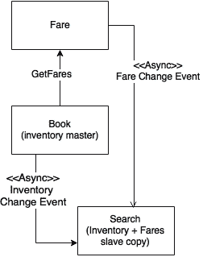

更好的方法是将库存与预订模块一起，并在搜索下保留库存的只读副本，同时通过可靠的消息系统持续同步库存数据。由于库存和预订都是同地的，这也解决了需要进行两阶段提交的需求。由于它们都是本地的，它们可以很好地与本地事务一起工作。

现在让我们挑战票价模块的设计。当客户在给定日期搜索 A 和 B 之间的航班时，我们希望同时显示航班和票价。这意味着我们的只读库存副本也可以同时组合票价和库存。搜索将订阅票价以获取任何票价变更事件。智能仍然留在票价服务中，但它不断将票价更新发送到搜索下的缓存票价数据。

#### 最终依赖图

仍然有一些同步调用，暂时我们将保持它们不变。

通过应用所有这些变化，最终的依赖图将如下所示：

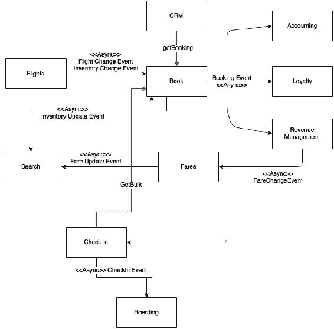

现在我们可以安全地将前图中的每个方框视为一个微服务。我们已经确定了许多依赖关系，并且将其中许多建模为异步的。整个系统基本上是以反应式风格设计的。在图中仍然显示了一些同步调用，如从办理登机手续获取批量、从 CRM 获取预订和从预订获取票价等，这些同步调用根据权衡分析实际上是必需的。

## 为迁移微服务设置优先级

我们已经确定了基于微服务的架构的第一次版本。下一步，我们将分析优先级，并确定迁移顺序。这可以通过考虑以下多个因素来完成：

+   **依赖性**：决定优先级的参数之一是依赖图。从服务依赖图中，具有较少依赖或根本没有依赖的服务易于迁移，而复杂的依赖关系则更难。具有复杂依赖关系的服务还需要将依赖模块与其一起迁移。

会计、忠诚度、CRM 和登机手续与预订和办理登机手续相比具有较少的依赖关系。具有高依赖性的模块在迁移时也会有更高的风险。

+   **交易量**：另一个可以应用的参数是分析交易量。迁移具有最高交易量的服务将减轻现有系统的负担。从 IT 支持和维护的角度来看，这将具有更多的价值。然而，这种方法的缺点是风险因素更高。

如前所述，搜索请求的数量是预订请求的十倍。在搜索和预订之后，办理登机手续的请求是交易量第三高的。

+   **资源利用率**：资源利用率是基于当前利用率来衡量的，例如 CPU、内存、连接池、线程池等。将资源密集型服务从传统系统中迁移出去可以为其他服务提供帮助。这有助于其余模块的更好运行。

航班、收入管理和会计是资源密集型服务，因为它们涉及数据密集型交易，如预测、计费、航班时间表更改等。

+   **复杂性**：复杂性可能是根据与服务相关的业务逻辑来衡量的，例如功能点、代码行数、表数、服务数等。与更复杂的模块相比，较不复杂的模块易于迁移。

与登机、搜索和办理登机手续服务相比，预订服务非常复杂。

+   **业务重要性**：业务重要性可以基于收入或客户体验。高度关键的模块提供更高的业务价值。

从业务角度来看，预订是最赚钱的服务，而办理登机手续是业务关键的，因为它可能导致航班延误，这可能导致收入损失以及客户不满意。

+   **变更速度**：变更速度表示在短时间内针对某个功能的变更请求数量。这意味着交付的速度和灵活性。具有高变更速度请求的服务比稳定模块更适合迁移。

统计数据显示，搜索、预订和票价经常发生变化，而办理登机手续是最稳定的功能。

+   **创新**：作为颠覆性创新过程的一部分的服务需要优先于基于更成熟业务流程的后勤功能。与在微服务世界应用创新相比，传统系统中的创新更难实现。

大多数创新都围绕搜索、预订、票价、收入管理和办理登机手续，而不是后勤会计。

根据 BrownField 的分析，搜索具有最高优先级，因为它需要创新，变更速度高，业务关键性较低，并且对业务和 IT 都有更好的缓解。搜索服务与传统系统没有最小的依赖性要求将数据同步回去。

## 迁移期间的数据同步

在过渡阶段，传统系统和新的微服务将并行运行。因此，保持两个系统之间的数据同步非常重要。

最简单的选择是使用任何数据同步工具在数据库级别同步两个系统之间的数据。当新旧系统都建立在相同的数据存储技术上时，这种方法效果很好。如果数据存储技术不同，复杂性将更高。这种方法的第二个问题是我们允许了一个后门入口，因此将微服务的内部数据存储暴露出去。这违反了微服务的原则。

在我们得出通用解决方案之前，让我们逐个案例来看待。以下图表显示了在搜索被移除后的数据迁移和同步方面：

迁移期间的数据同步

让我们假设我们使用 NoSQL 数据库来在搜索服务下保留库存和票价。在这种特殊情况下，我们只需要传统系统使用异步事件向新服务提供数据。我们将不得不对现有系统进行一些更改，以便发送票价变更或任何库存变更作为事件。搜索服务然后接受这些事件，并将它们本地存储到本地 NoSQL 存储中。

在复杂的预订服务的情况下，这会更加繁琐。

在这种情况下，新的预订微服务将库存变更事件发送到搜索服务。除此之外，传统应用还必须将票价变更事件发送到搜索。预订然后将新的预订服务存储在其 My SQL 数据存储中。

迁移期间的数据同步

最复杂的部分是预订服务，必须将预订事件和库存事件发送回传统系统。这是为了确保传统系统中的功能继续像以前一样工作。最简单的方法是编写一个更新组件，接受事件并更新旧的预订记录表，以便其他传统模块不需要进行更改。我们将继续进行此操作，直到没有任何传统组件在引用预订和库存数据。这将帮助我们最小化传统系统中的更改，从而减少失败的风险。

简而言之，单一方法可能不足以。需要基于不同模式的多管齐下的方法。

## 管理参考数据

将单体应用程序迁移到微服务的最大挑战之一是管理参考数据。一个简单的方法是将参考数据构建为另一个微服务，如下图所示：

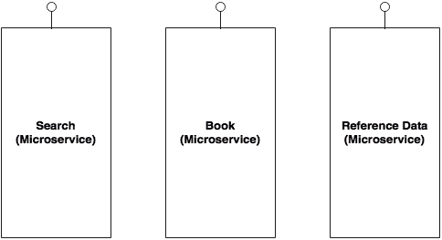

在这种情况下，需要参考数据的人员应该通过微服务端点访问它。这是一个结构良好的方法，但可能会导致性能问题，就像在原始的旧系统中遇到的问题一样。

另一种方法是将参考数据作为所有管理和 CRUD 功能的微服务。然后在每个服务下创建一个近缓存，从主服务中逐步缓存数据。一个薄的参考数据访问代理库将被嵌入到这些服务中。参考数据访问代理抽象了数据是来自缓存还是远程服务的细节。

这在下一个图中有所描述。给定图中的主节点是实际的参考数据微服务：

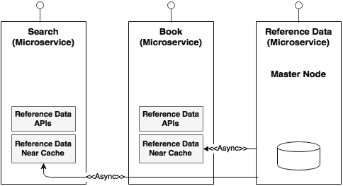

挑战在于在主节点和从节点之间同步数据。对于那些频繁更改的数据缓存，需要订阅机制。

更好的方法是用内存数据网格替换本地缓存，如下图所示：

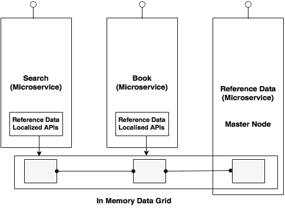

参考数据微服务将写入数据网格，而嵌入在其他服务中的代理库将具有只读 API。这消除了对数据订阅的要求，更加高效和一致。

## 用户界面和 Web 应用程序

在过渡阶段，我们必须同时保留旧的和新的用户界面。通常有三种一般性方法用于处理这种情况。

第一种方法是将旧的和新的用户界面作为独立的用户应用程序，彼此之间没有链接，如下图所示：

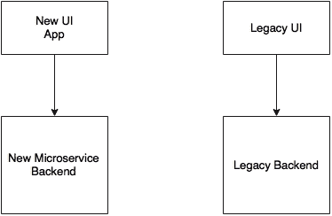

用户登录到新应用程序以及旧应用程序，就像两个不同的应用程序，它们之间没有单点登录（SSO）。这种方法简单，没有额外开销。在大多数情况下，除非针对两个不同的用户群体，否则业务可能不会接受这种方法。

第二种方法是将旧用户界面作为主要应用程序，然后在用户请求新应用程序的页面时将页面控件转移到新用户界面：

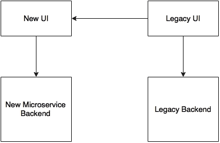

在这种情况下，由于旧应用程序和新应用程序都是在 Web 浏览器窗口中运行的 Web 应用程序，用户将获得无缝的体验。必须在旧和新用户界面之间实现 SSO。

第三种方法是直接将现有的旧用户界面集成到新的微服务后端，如下图所示：

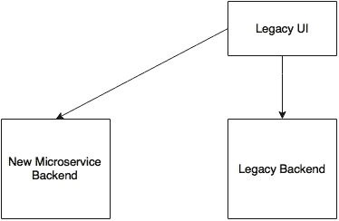

在这种情况下，新的微服务被构建为无展示层的无头应用程序。这可能是具有挑战性的，因为它可能需要对旧的用户界面进行许多更改，比如引入服务调用、数据模型转换等。

在最后两种情况中的另一个问题是如何处理资源和服务的认证。

### 会话处理和安全性

假设新服务是基于 Spring Security 编写的，采用基于令牌的授权策略，而旧应用程序使用自定义构建的身份存储进行身份验证。

下图显示了如何在旧服务和新服务之间进行集成：

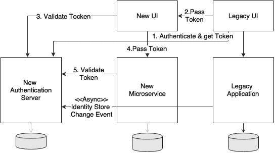

如前图所示，最简单的方法是使用 Spring Security 构建一个新的身份存储和认证服务作为一个新的微服务。这将用于我们所有未来的资源和服务保护，对于所有微服务。

现有的用户界面应用程序对新的身份验证服务进行身份验证，并获得一个令牌。这个令牌将被传递给新的用户界面或新的微服务。在这两种情况下，用户界面或微服务将调用身份验证服务来验证给定的令牌。如果令牌有效，那么用户界面或微服务接受调用。

问题在于，遗留身份存储必须与新的身份存储同步。

## 测试策略

从测试的角度来看，一个重要的问题是如何确保所有功能在迁移之前和之后都能正常工作？

在迁移或重构之前，应编写针对正在迁移的服务的集成测试用例。这可以确保一旦迁移完成，我们能够得到相同的预期结果，并且系统的行为保持不变。必须建立一个自动化的回归测试包，并且每次在新旧系统中进行更改时都必须执行。

对于每个服务，我们需要一个针对 EJB 端点的测试，另一个针对微服务端点的测试：

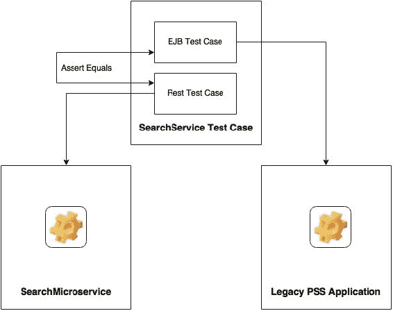

## 构建生态系统能力

在我们着手实际迁移之前，我们必须构建所有在能力模型下提到的微服务的能力，如第三章*应用微服务概念*中所记录的。这些是开发基于微服务的系统的先决条件。

除了这些能力，还需要预先构建某些应用功能，如参考数据、安全和 SSO，以及客户和通知。数据仓库或数据湖也是必需的先决条件。一个有效的方法是以增量方式构建这些能力，直到真正需要为止。

# 只有在必要的情况下才迁移模块。

在之前的章节中，我们已经研究了从单片应用转变为微服务的方法和步骤。重要的是要理解，除非真的需要，否则没有必要将所有模块迁移到新的微服务架构中。一个主要原因是这些迁移会产生成本。

我们将在这里审查一些这样的情景。BrownField 已经决定使用外部收入管理系统来取代 PSS 收入管理功能。BrownField 也正在将他们的会计功能集中化，因此，不需要迁移遗留系统的会计功能。在这一点上，迁移 CRM 并不会给业务增加太多价值。因此，决定将 CRM 保留在遗留系统中。业务计划作为他们的云策略的一部分转移到基于 SaaS 的 CRM 解决方案。还要注意，中途停止迁移可能会严重影响系统的复杂性。

# 目标架构

以下图表中的架构蓝图将之前的讨论整合成了一个架构视图。图表中的每个块代表一个微服务。阴影框是核心微服务，其他的是支持微服务。图表还显示了每个微服务的内部能力。用户管理已移至目标架构中的安全性下：

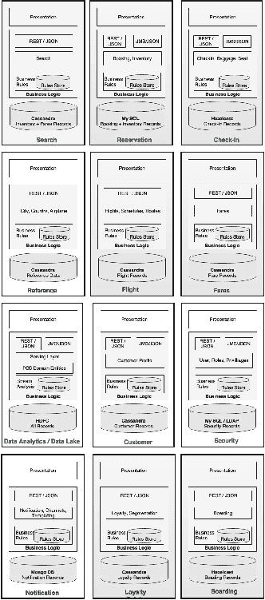

每个服务都有自己的架构，通常包括表示层、一个或多个服务端点、业务逻辑、业务规则和数据库。正如我们所看到的，我们使用不同的数据库选择，这些数据库更适合每个微服务。每个微服务都是自治的，服务之间的编排很少。大多数服务使用服务端点相互交互。

## 微服务的内部分层

在本节中，我们将进一步探讨微服务的内部结构。没有标准可供遵循微服务的内部架构。经验法则是在简单的服务端点背后抽象实现。

典型的结构看起来像下图所示：

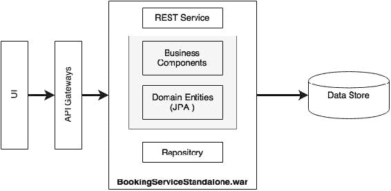

UI 通过服务网关访问 REST 服务。API 网关可以是每个微服务一个，也可以是多个微服务一个，这取决于我们想要用 API 网关做什么。微服务可以暴露一个或多个 rest 端点。这些端点反过来连接到服务内的一个业务组件。业务组件然后借助领域实体执行所有业务功能。存储库组件用于与后端数据存储交互。

## 编排微服务

预订编排的逻辑和规则执行位于预订服务内。大脑仍然在预订服务内，以一个或多个预订业务组件的形式。在内部，业务组件编排其他业务组件或甚至外部服务暴露的私有 API：


如前图所示，预订服务内部调用更新其自己组件的库存，而不是调用票价服务。

这项活动是否需要编排引擎？这取决于需求。在复杂的情况下，我们可能需要同时做很多事情。例如，内部创建预订应用了许多预订规则，它验证票价，验证库存，然后才创建预订。我们可能希望并行执行它们。在这种情况下，我们可以使用 Java 并发 API 或反应式 Java 库。

在极其复杂的情况下，我们可以选择集成框架，如 Spring Integration 或 Apache Camel 的嵌入模式。

## 与其他系统集成

在微服务世界中，我们使用 API 网关或可靠的消息总线来与其他非微服务集成。

假设 BrownField 中有另一个系统需要预订数据。不幸的是，该系统无法订阅预订微服务发布的预订事件。在这种情况下，可以使用**企业应用集成**（**EAI**）解决方案，它监听我们的预订事件，然后使用本地适配器更新数据库。

## 管理共享库

某些业务逻辑在多个微服务中使用。在这种情况下，这些共享库将在两个微服务中复制。

## 处理异常

检查预订场景以了解不同的异常处理方法。在下面的服务序列图中，有三条用叉号标记的线。这些是异常可能发生的潜在区域：

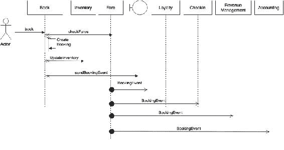

预订和票价之间存在同步通信。如果票价服务不可用怎么办？如果票价服务不可用，将错误返回给用户可能会导致收入损失。另一种想法是信任作为传入请求的一部分的票价。当我们提供搜索时，搜索结果也将包含票价。当用户选择航班并提交时，请求将包含所选的票价。如果票价服务不可用，我们信任传入的请求，并接受预订。我们将使用断路器和一个备用服务，该服务仅以特殊状态创建预订，并将预订排队等待手动操作或系统重试。

如果创建预订失败怎么办？如果创建预订意外失败，更好的选择是将消息返回给用户。我们可以尝试替代选项，但这可能会增加系统的整体复杂性。对于库存更新也是如此。

在创建预订和更新库存的情况下，我们避免了创建预订后库存更新出现意外失败的情况。由于库存很关键，最好将创建预订和更新库存都放在本地事务中。这是可能的，因为这两个组件都在同一子系统下。

如果考虑登记场景，登记向登机和预订发送事件，如下图所示：

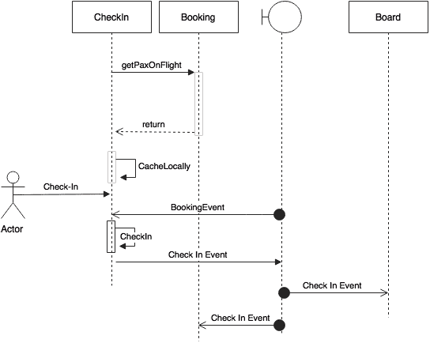

考虑一种情况，即在完成登记后立即发生登记服务失败。其他消费者处理了此事件，但实际的登记被回滚了。这是因为我们没有使用两阶段提交。在这种情况下，我们需要一种回滚该事件的机制。这可以通过捕获异常并发送另一个“取消登记”事件来实现。

在这种情况下，需要注意的是为了最小化补偿事务的使用，发送登记事件被移至登记事务的末尾。这减少了发送事件后失败的机会。

另一方面，如果登记成功，但发送事件失败怎么办？我们可以考虑两种方法。第一种方法是调用备用服务将其存储在本地，然后使用另一个扫描程序在以后的某个时间发送事件。甚至可以多次重试。这可能会增加更多的复杂性，并且在所有情况下可能不高效。另一种方法是将异常返回给用户，以便用户可以重试。然而，从客户参与的角度来看，这可能并不总是好的。另一方面，前一种选项对于系统的健康状况更好。需要进行权衡分析，以找出给定情况的最佳解决方案。

# 目标实现视图

下图表示了 BrownField PSS 微服务系统的实现视图：

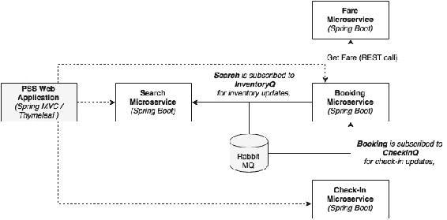

如前图所示，我们正在实施四个微服务作为示例：搜索、票价、预订和登记。为了测试应用程序，使用了 Spring MVC 和 Thymeleaf 模板开发了一个网站应用程序。异步消息传递是通过 RabbitMQ 实现的。在此示例实现中，使用默认的 H2 数据库作为内存存储以进行演示。

本节中的代码演示了本章*审查微服务能力模型*部分中强调的所有功能。

## 实现项目

BrownField 航空公司的 PSS 微服务系统的基本实现有五个核心项目，如下表所总结。该表还显示了这些项目使用的端口范围，以确保整本书的一致性：

| 微服务 | 项目 | 端口范围 |
| --- | --- | --- |
| 预订微服务 | `chapter4.book` | `8060`-`8069` |
| 办理登机手续微服务 | `chapter4.checkin` | `8070`-`8079` |
| 航班微服务 | `chapter4.fares` | `8080`-`8089` |
| 搜索微服务 | `chapter4.search` | `8090`-`8099` |
| 网站 | `chapter4.website` | `8001` |

该网站是用于测试 PSS 微服务的 UI 应用程序。

在本示例中，所有微服务项目都遵循与下图中所示的包结构相同的模式：

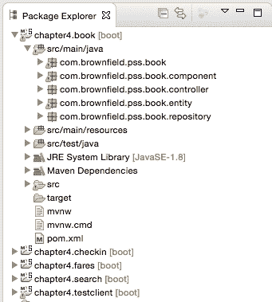

以下是不同包及其用途的解释：

+   根文件夹（`com.brownfield.pss.book`）包含默认的 Spring Boot 应用程序。

+   `component`包承载所有服务组件，业务逻辑在其中实现。

+   控制器包承载着 REST 端点和消息端点。控制器类在内部利用组件类进行执行。

+   `entity`包含用于映射到数据库表的 JPA 实体类。

+   存储库类被打包在`repository`包中，并且基于 Spring Data JPA。

## 运行和测试项目

按照下面列出的步骤构建和测试本章开发的微服务： 

1.  使用 Maven 构建每个项目。确保`test`标志关闭。测试程序假定其他依赖服务正在运行。如果依赖服务不可用，则测试将失败。在我们的示例中，预订和票价有直接依赖关系。我们将学习如何在第七章, *记录和监控微服务*中避免这种依赖关系：

```java
mvn -Dmaven.test.skip=true install

```

1.  运行 RabbitMQ 服务器：

```java
rabbitmq_server-3.5.6/sbin$ ./rabbitmq-server

```

1.  在单独的终端窗口中运行以下命令：

```java
java -jar target/fares-1.0.jar
java -jar target/search-1.0.jar
java -jar target/checkin-1.0.jar
java -jar target/book-1.0.jar
java -jar target/website-1.0.jar

```

1.  网站项目有一个`CommandLineRunner`，它在启动时执行所有测试用例。一旦所有服务成功启动，就在浏览器中打开`http://localhost:8001`。

1.  浏览器要求输入基本安全凭据。使用`guest`或`guest123`作为凭据。本示例仅显示了具有基本身份验证机制的网站安全性。如第二章, *使用 Spring Boot 构建微服务*中所述，可以使用 OAuth2 实现服务级安全性。

1.  输入正确的安全凭据会显示以下屏幕。这是我们 BrownField PSS 应用程序的主屏幕：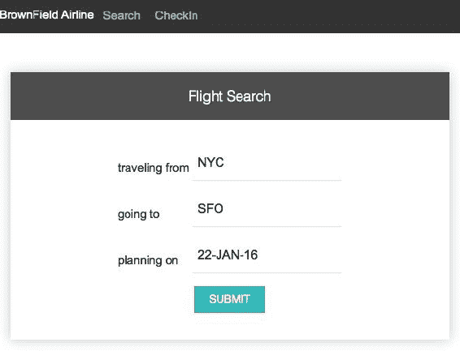

1.  **提交**按钮调用搜索微服务以获取满足屏幕上条件的可用航班。在搜索微服务启动时预先填充了一些航班。如有需要，编辑搜索微服务代码以输入额外的航班。

1.  下一个截图显示了带有航班列表的输出屏幕。**预订**链接将带我们到所选航班的预订屏幕：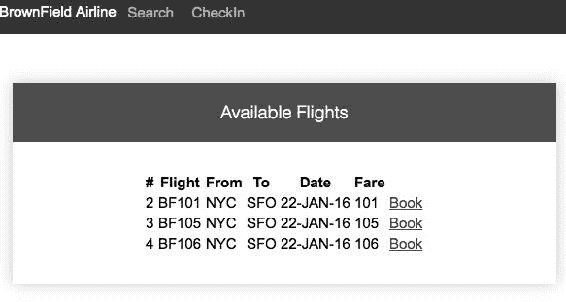

1.  下一个截图显示了预订屏幕。用户可以输入乘客信息，并通过点击**确认**按钮来创建预订。这会调用预订微服务，以及内部的票价服务。它还会向搜索微服务发送一条消息：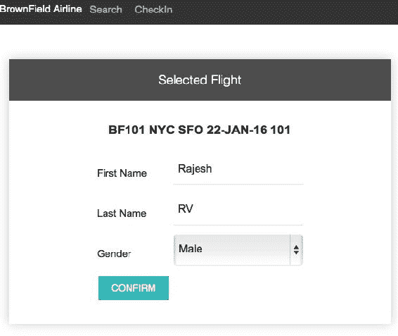

1.  如果预订成功，下一个确认屏幕将显示预订参考号码：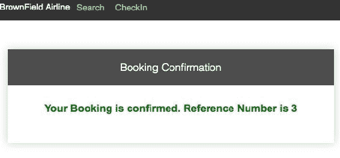

1.  让我们测试办理登机手续微服务。可以通过点击屏幕顶部的**办理登机手续**菜单来完成。使用前一步获得的预订参考号码来测试办理登机手续。如下图所示：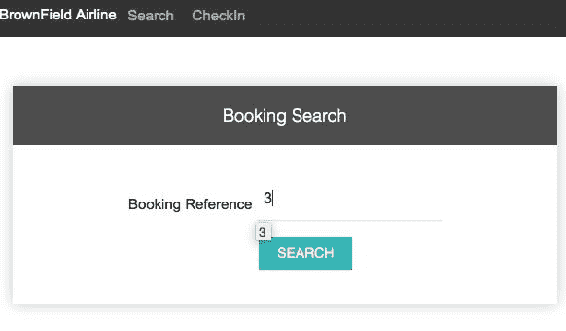

1.  在上一个屏幕上点击**搜索**按钮会调用 Booking 微服务，并检索预订信息。点击**办理登机手续**链接进行办理登机手续。这会调用办理登机微服务：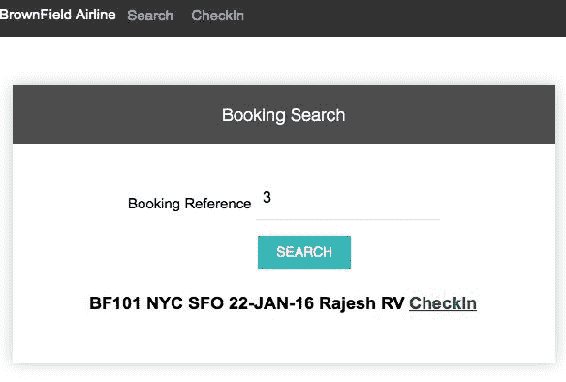

1.  如果办理登机成功，它会显示确认消息，如下一张截图所示，并附有确认号。这是通过内部调用办理登机服务来完成的。办理登机服务向 Booking 发送消息以更新登机状态：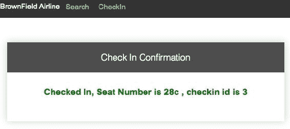

# 摘要

在本章中，我们使用基本的 Spring Boot 功能实现并测试了 BrownField PSS 微服务。我们学习了如何使用微服务架构处理真实用例。

我们审查了从单体应用程序向微服务的真实世界演变的各个阶段。我们还评估了多种方法的利弊，以及迁移单体应用程序时遇到的障碍。最后，我们解释了我们审查的用例的端到端微服务设计。还验证了一个完整的微服务实现的设计和实施。

在下一章中，我们将看到 Spring Cloud 项目如何帮助我们将开发的 BrownField PSS 微服务转换为互联网规模的部署。
