# 第五章：使用 Spring Cloud 扩展微服务

为了管理互联网规模的微服务，需要比 Spring Boot 框架提供的能力更多。Spring Cloud 项目有一套专门构建的组件，可以轻松实现这些额外的能力。

本章将深入了解 Spring Cloud 项目的各个组件，如 Eureka、Zuul、Ribbon 和 Spring Config，将它们与第三章*应用微服务概念*中讨论的微服务能力模型进行对比。它将演示 Spring Cloud 组件如何帮助扩展上一章中开发的 BrownField 航空公司 PSS 微服务系统。

到本章结束时，您将了解以下内容：

+   Spring Config 服务器用于外部化配置

+   Eureka 服务器用于服务注册和发现

+   Zuul 作为服务代理和网关的相关性

+   自动微服务注册和服务发现的实现

+   Spring Cloud 消息传递用于异步微服务组合

# 审查微服务能力

本章的示例探讨了微服务能力模型中讨论的微服务能力模型中的以下微服务能力，*应用微服务概念* 第三章：

+   **软件定义的负载均衡器**

+   **服务注册表**

+   **配置服务**

+   **可靠的云消息传递**

+   **API 网关**

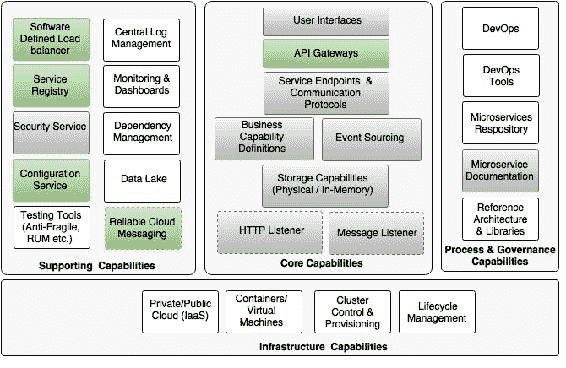

# 审查 BrownField 的 PSS 实现

在第四章*微服务演进-案例研究*中，我们使用 Spring 框架和 Spring Boot 为 BrownField 航空公司设计和开发了基于微服务的 PSS 系统。从开发的角度来看，实现是令人满意的，并且它可以满足低交易量的需求。然而，这对于部署具有数百甚至数千个微服务的大型企业规模部署来说还不够好。

在第四章*微服务演进-案例研究*中，我们开发了四个微服务：搜索、预订、票价和办理登机手续。我们还开发了一个网站来测试这些微服务。

到目前为止，我们在微服务实现中已经完成了以下工作：

+   每个微服务都公开一组 REST/JSON 端点，用于访问业务能力

+   每个微服务使用 Spring 框架实现特定的业务功能。

+   每个微服务使用 H2 作为内存数据库存储自己的持久数据

+   微服务使用 Spring Boot 构建，其中嵌入了 Tomcat 服务器作为 HTTP 监听器

+   RabbitMQ 被用作外部消息服务。搜索、预订和办理登机手续通过异步消息进行交互

+   Swagger 与所有微服务集成，用于记录 REST API。

+   开发了基于 OAuth2 的安全机制来保护微服务

# 什么是 Spring Cloud？

Spring Cloud 项目是 Spring 团队的一个总称项目，它实现了分布式系统所需的一组常见模式，作为一组易于使用的 Java Spring 库。尽管它的名字是 Spring Cloud，但它本身并不是一个云解决方案。相反，它提供了在开发应用程序时所需的一些关键能力，这些应用程序遵循十二要素应用程序原则，并且使用 Spring Cloud，开发人员只需专注于使用 Spring Boot 构建业务能力，并利用 Spring Cloud 提供的分布式、容错和自愈能力。

Spring Cloud 的解决方案对部署环境是不可知的，可以在桌面 PC 或弹性云中开发和部署。使用 Spring Cloud 开发的云就绪解决方案也是不可知的，并且可以在许多云提供商（如 Cloud Foundry、AWS、Heroku 等）之间进行移植。如果不使用 Spring Cloud，开发人员将最终使用云供应商原生提供的服务，导致与 PaaS 提供商的深度耦合。开发人员的另一个选择是编写大量样板代码来构建这些服务。Spring Cloud 还提供了简单易用的 Spring 友好 API，抽象了云提供商的服务 API，比如 AWS 通知服务的 API。

基于 Spring 的“约定优于配置”方法，Spring Cloud 默认所有配置，并帮助开发人员快速启动。Spring Cloud 还隐藏了复杂性，并提供简单的声明性配置来构建系统。Spring Cloud 组件的较小占用空间使其对开发人员友好，也使其易于开发云原生应用程序。

Spring Cloud 为开发人员提供了许多解决方案选择。例如，服务注册表可以使用流行的选项，如 Eureka、ZooKeeper 或 Consul 来实现。Spring Cloud 的组件相当解耦，因此开发人员可以灵活选择所需的内容。

### 注意

**Spring Cloud 和 Cloud Foundry 有什么区别？**

Spring Cloud 是一个用于开发互联网规模的 Spring Boot 应用程序的开发工具包，而 Cloud Foundry 是一个用于构建、部署和扩展应用程序的开源平台即服务。

## Spring Cloud 发布

Spring Cloud 项目是一个包含不同组件组合的 Spring 项目。这些组件的版本在`spring-cloud-starter-parent` BOM 中定义。

在本书中，我们依赖于 Spring Cloud 的`Brixton.RELEASE`版本。

```java
  <dependency>
    <groupId>org.springframework.cloud</groupId>
    <artifactId>spring-cloud-dependencies</artifactId>
    <version>Brixton.RELEASE</version>
    <type>pom</type>
    <scope>import</scope>
  </dependency>
```

`spring-cloud-starter-parent`定义了其子组件的不同版本如下：

```java
<spring-cloud-aws.version>1.1.0.RELEASE</spring-cloud-aws.version>
<spring-cloud-bus.version>1.1.0.RELEASE</spring-cloud-bus.version>
<spring-cloud-cloudfoundry.version>1.0.0.RELEASE</spring-cloud-cloudfoundry.version>
<spring-cloud-commons.version>1.1.0.RELEASE</spring-cloud-commons.version>
<spring-cloud-config.version>1.1.0.RELEASE</spring-cloud-config.version>
<spring-cloud-netflix.version>1.1.0.RELEASE</spring-cloud-netflix.version>
<spring-cloud-security.version>1.1.0.RELEASE</spring-cloud-security.version>
<spring-cloud-cluster.version>1.0.0.RELEASE</spring-cloud-cluster.version>
<spring-cloud-consul.version>1.0.0.RELEASE</spring-cloud-consul.version>
<spring-cloud-sleuth.version>1.0.0.RELEASE</spring-cloud-sleuth.version>
<spring-cloud-stream.version>1.0.0.RELEASE</spring-cloud-stream.version>
<spring-cloud-zookeeper.version>1.0.0.RELEASE </spring-cloud-zookeeper.version>
```

### 注意

Spring Cloud 发布的名称按字母顺序排列，从 A 开始，遵循伦敦地铁站的名称。**Angel**是第一个发布版本，**Brixton**是第二个发布版本。

## Spring Cloud 组件

每个 Spring Cloud 组件都专门解决某些分布式系统功能。以下图表底部的灰色框显示了这些功能，放在这些功能上面的框展示了 Spring Cloud 子项目解决这些功能的能力：

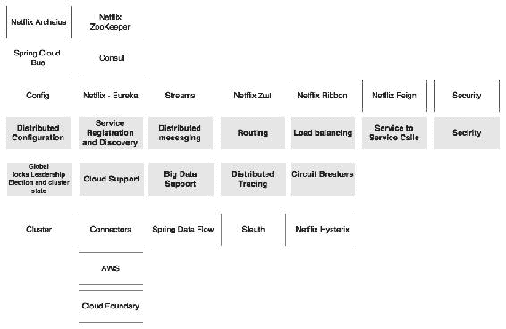

Spring Cloud 的能力解释如下：

+   **分布式配置**：当有许多微服务实例在不同的配置文件下运行时，配置属性很难管理，比如开发、测试、生产等。因此，重要的是以受控的方式集中管理它们。分布式配置管理模块是为了外部化和集中微服务配置参数。Spring Cloud Config 是一个外部化配置服务器，使用 Git 或 SVN 作为后备存储库。Spring Cloud Bus 提供了对配置更改的支持，可以传播给多个订阅者，通常是一个微服务实例。另外，ZooKeeper 或 HashiCorp 的 Consul 也可以用于分布式配置管理。

+   **路由**：路由是一个 API 网关组件，主要用于类似于反向代理的功能，将消费者的请求转发给服务提供者。网关组件还可以执行基于软件的路由和过滤。Zuul 是一个轻量级的 API 网关解决方案，为开发人员提供了对流量整形和请求/响应转换的精细控制。

+   负载均衡：负载均衡能力需要一个软件定义的负载均衡器模块，它可以使用各种负载均衡算法将请求路由到可用的服务器。Ribbon 是一个支持这种能力的 Spring Cloud 子项目。Ribbon 可以作为一个独立的组件工作，也可以与 Zuul 集成并无缝地进行流量路由。

+   服务注册和发现：服务注册和发现模块使服务能够在服务可用并准备接受流量时以编程方式向存储库注册。微服务会公布它们的存在，并使它们可以被发现。消费者可以查找注册表以获取服务可用性和端点位置的视图。注册表在许多情况下更多地是一个垃圾场。但是注册表周围的组件使生态系统变得智能。在 Spring Cloud 下存在许多支持注册和发现能力的子项目。Eureka、ZooKeeper 和 Consul 是实现注册能力的三个子项目。

+   服务间调用：Spring Cloud 下的 Spring Cloud Feign 子项目提供了一种声明性的方式来以同步方式进行 RESTful 服务间调用。声明性方法允许应用程序使用 POJO（Plain Old Java Object）接口而不是低级 HTTP 客户端 API。Feign 在内部使用响应式库进行通信。

+   断路器：断路器子项目实现了断路器模式。当主要服务遇到故障时，断路器会断开电路，将流量转移到另一个临时的备用服务。当服务恢复正常时，它还会自动重新连接到主要服务。最后，它提供了一个监控仪表板，用于监控服务状态的变化。Spring Cloud Hystrix 项目和 Hystrix Dashboard 分别实现了断路器和仪表板。

+   全局锁、领导选举和集群状态：在处理大规模部署时，这种能力对于集群管理和协调是必需的。它还为各种目的提供全局锁，如序列生成。Spring Cloud Cluster 项目使用 Redis、ZooKeeper 和 Consul 实现了这些能力。

+   安全性：安全性能力是为了构建云原生分布式系统的安全性，使用外部授权提供者（如 OAuth2）。Spring Cloud Security 项目使用可定制的授权和资源服务器实现了这一能力。它还提供了 SSO 能力，在处理许多微服务时是必不可少的。

+   大数据支持：大数据支持能力是与大数据解决方案相关的数据服务和数据流所需的能力。Spring Cloud Streams 和 Spring Cloud Data Flow 项目实现了这些能力。Spring Cloud Data Flow 是 Spring XD 的重新设计版本。

+   分布式跟踪：分布式跟踪能力有助于跟踪和关联跨多个微服务实例的转换。Spring Cloud Sleuth 通过在各种分布式跟踪机制（如 Zipkin 和 HTrace）之上提供 64 位 ID 的支持来实现这一点。

+   分布式消息传递：Spring Cloud Stream 在可靠的消息传递解决方案（如 Kafka、Redis 和 RabbitMQ）之上提供了声明性的消息集成。

+   云支持：Spring Cloud 还提供了一组能力，它们在不同的云提供商（如 Cloud Foundry 和 AWS）之上提供各种连接器、集成机制和抽象。

### Spring Cloud 和 Netflix OSS

许多用于微服务部署的 Spring Cloud 组件来自**Netflix 开源软件**（**Netflix OSS**）中心。Netflix 是微服务领域的先驱和早期采用者之一。为了管理大规模的微服务，Netflix 的工程师们提出了许多自制工具和技术来管理他们的微服务。这些工具和技术基本上是为了填补在 AWS 平台上管理 Netflix 服务时认识到的一些软件缺陷。后来，Netflix 将这些组件开源，并在 Netflix OSS 平台上提供给公众使用。这些组件在生产系统中被广泛使用，并在 Netflix 的大规模微服务部署中经过了实战测试。

Spring Cloud 为这些 Netflix OSS 组件提供了更高级别的抽象，使其更适合 Spring 开发人员使用。它还提供了一种声明性机制，与 Spring Boot 和 Spring 框架紧密集成和对齐。

# 为 BrownField PSS 设置环境

在本章中，我们将使用 Spring Cloud 的功能修改在第四章中开发的 BrownField PSS 微服务。我们还将研究如何使用 Spring Cloud 组件使这些服务达到企业级水平。

本章的后续部分将探讨如何使用 Spring Cloud 项目提供的一些开箱即用的功能，将在上一章中开发的微服务扩展到云规模部署。本章的其余部分将探讨 Spring Cloud 的功能，如使用 Spring Config 服务器进行配置，基于 Ribbon 的服务负载平衡，使用 Eureka 进行服务发现，使用 Zuul 进行 API 网关，最后，使用 Spring Cloud 消息传递进行基于消息的服务交互。我们将通过修改在第四章中开发的 BrownField PSS 微服务来演示这些功能，*微服务演进-案例研究*。

为了准备本章的环境，将项目导入并重命名（`chapter4.*`为`chapter5.*`）到一个新的 STS 工作空间中。

### 注意

本章的完整源代码可在代码文件的`第五章`项目中找到。

# Spring Cloud Config

Spring Cloud Config 服务器是一个外部化的配置服务器，应用程序和服务可以在其中存储、访问和管理所有运行时配置属性。Spring Config 服务器还支持配置属性的版本控制。

在之前的 Spring Boot 示例中，所有配置参数都是从打包在项目内的属性文件（`application.properties`或`application.yaml`）中读取的。这种方法很好，因为所有属性都从代码中移到了属性文件中。然而，当微服务从一个环境移动到另一个环境时，这些属性需要进行更改，这需要重新构建应用程序。这违反了十二要素应用程序原则之一，即倡导一次构建并将二进制文件移动到不同环境中。

更好的方法是使用配置文件。如在第二章中讨论的，配置文件用于将不同环境的不同属性进行分区。特定于配置文件的配置将被命名为`application-{profile}.properties`。例如，`application-development.properties`表示针对开发环境的属性文件。

然而，这种方法的缺点是配置静态地打包到应用程序中。对配置属性的任何更改都需要重新构建应用程序。

有多种方法可以将应用程序部署包中的配置属性外部化。可通过多种方式从外部源读取可配置属性：

+   从使用 JNDI 命名空间（`java:comp/env`）的外部 JNDI 服务器

+   使用 Java 系统属性（`System.getProperties()`）或使用`-D`命令行选项

+   使用`PropertySource`配置：

```java
@PropertySource("file:${CONF_DIR}/application.properties")
  public class ApplicationConfig {
}
```

+   使用命令行参数指向外部位置的文件：

```java
java -jar myproject.jar --spring.config.location=

```

JNDI 操作昂贵，缺乏灵活性，难以复制，并且没有版本控制。`System.properties`对于大规模部署来说不够灵活。最后两个选项依赖于服务器上挂载的本地或共享文件系统。

对于大规模部署，需要一个简单而强大的集中式配置管理解决方案：

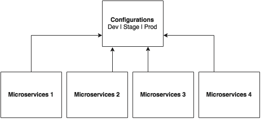

如前图所示，所有微服务都指向一个中央服务器以获取所需的配置参数。然后，这些微服务在本地缓存这些参数以提高性能。Config 服务器将配置状态更改传播给所有订阅的微服务，以便本地缓存的状态可以更新为最新更改。Config 服务器还使用配置文件来解析特定于环境的值。

如下截图所示，Spring Cloud 项目下有多个选项可用于构建配置服务器。**Config Server**、**Zookeeper Configuration**和**Consul Configuration**都是可选项。但本章将仅关注 Spring Config 服务器的实现：

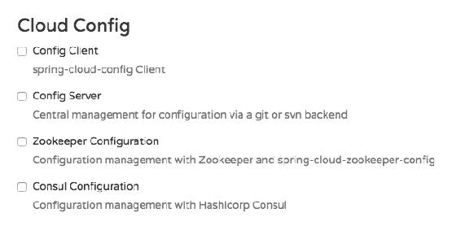

Spring Config 服务器将属性存储在诸如 Git 或 SVN 之类的版本控制存储库中。Git 存储库可以是本地的或远程的。对于大规模分布式微服务部署，首选高可用的远程 Git 服务器。

Spring Cloud Config 服务器架构如下图所示：

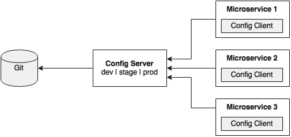

如前图所示，嵌入在 Spring Boot 微服务中的 Config 客户端使用简单的声明性机制从中央配置服务器进行配置查找，并将属性存储到 Spring 环境中。配置属性可以是应用级配置，如每日交易限额，也可以是基础设施相关配置，如服务器 URL、凭据等。

与 Spring Boot 不同，Spring Cloud 使用一个引导上下文，这是主应用程序的父上下文。引导上下文负责从 Config 服务器加载配置属性。引导上下文寻找`bootstrap.yaml`或`bootstrap.properties`来加载初始配置属性。要使这在 Spring Boot 应用程序中工作，将`application.*`文件重命名为`bootstrap.*`。

## 接下来是什么？

接下来的几节演示了如何在实际场景中使用 Config 服务器。为了做到这一点，我们将修改我们的搜索微服务（`chapter5.search`）以使用 Config 服务器。下图描述了这种情况：

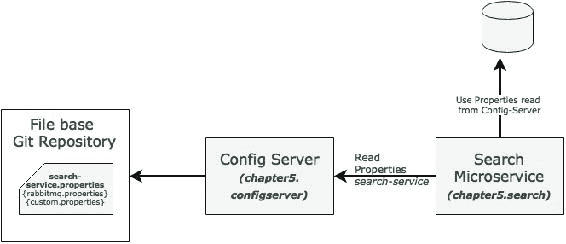

在此示例中，搜索服务将通过传递服务名称在启动时读取 Config 服务器。在这种情况下，搜索服务的服务名称将是`search-service`。为`search-service`配置的属性包括 RabbitMQ 属性以及自定义属性。

### 注意

本节的完整源代码可在代码文件的`chapter5.configserver`项目中找到。

## 设置 Config 服务器

创建新的 Config 服务器使用 STS 需要遵循以下步骤：

1.  创建一个新的**Spring Starter Project**，并选择**Config Server**和**Actuator**，如下图所示：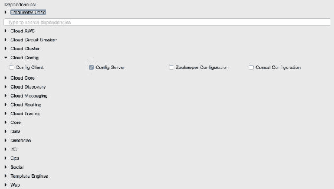

1.  设置一个 Git 存储库。这可以通过指向远程 Git 配置存储库来完成，比如[`github.com/spring-cloud-samples/config-repo`](https://github.com/spring-cloud-samples/config-repo)上的存储库。这个 URL 是一个指示性的 URL，是 Spring Cloud 示例使用的 Git 存储库。我们将不得不使用我们自己的 Git 存储库。

1.  或者，可以使用基于本地文件系统的 Git 存储库。在真实的生产场景中，建议使用外部 Git。本章中的配置服务器将使用基于本地文件系统的 Git 存储库进行演示。

1.  输入下面列出的命令来设置本地 Git 存储库：

```java
$ cd $HOME
$ mkdir config-repo
$ cd config-repo
$ git init .
$ echo message : helloworld > application.properties
$ git add -A .
$ git commit -m "Added sample application.properties"

```

```java
application.properties with a message property and value helloworld is also created.
```

文件`application.properties`是为演示目的而创建的。我们将在后续章节中更改这一点。

1.  下一步是更改配置服务器中的配置，以使用在上一步中创建的 Git 存储库。为了做到这一点，将文件`application.properties`重命名为`bootstrap.properties`：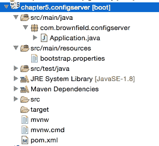

1.  编辑新的`bootstrap.properties`文件的内容，使其与以下内容匹配：

```java
server.port=8888
spring.cloud.config.server.git.uri: file://${user.home}/config-repo
```

端口`8888`是配置服务器的默认端口。即使没有配置`server.port`，配置服务器也应该绑定到`8888`。在 Windows 环境中，文件 URL 需要额外的`/`。

1.  可选地，将自动生成的`Application.java`的默认包从`com.example`重命名为`com.brownfield.configserver`。在`Application.java`中添加`@EnableConfigServer`：

```java
@EnableConfigServer
@SpringBootApplication
public class ConfigserverApplication {
```

1.  通过右键单击项目并将其作为 Spring Boot 应用程序运行来运行配置服务器。

1.  访问`http://localhost:8888/env`，以查看服务器是否正在运行。如果一切正常，这将列出所有环境配置。请注意，`/env`是一个执行器端点。

1.  检查`http://localhost:8888/application/default/master`，以查看特定于`application.properties`的属性，这些属性是在之前的步骤中添加的。浏览器将显示在`application.properties`中配置的属性。浏览器应该显示类似以下内容的内容：

```java
{"name":"application","profiles":["default"],"label":"master","version":"6046fd2ff4fa09d3843767660d963866ffcc7d28","propertySources":[{"name":"file:///Users/rvlabs /config-repo /application.properties","source":{"message":"helloworld"}}]}
```

## 理解配置服务器 URL

在上一节中，我们使用了`http://localhost:8888/application/default/master`来探索属性。我们如何解释这个 URL？

URL 中的第一个元素是应用程序名称。在给定的示例中，应用程序名称应该是`application`。应用程序名称是给定应用程序的逻辑名称，使用 Spring Boot 应用程序的`bootstrap.properties`中的`spring.application.name`属性。每个应用程序必须有一个唯一的名称。配置服务器将使用名称来解析并从配置服务器存储库中获取适当的属性。应用程序名称有时也被称为服务 ID。如果有一个名为`myapp`的应用程序，则配置存储库中应该有一个`myapp.properties`来存储与该应用程序相关的所有属性。

URL 的第二部分表示配置文件。可以在存储库中为应用程序配置多个配置文件。配置文件可以在各种场景中使用。两个常见的场景是分隔不同的环境，如`Dev`、`Test`、`Stage`、`Prod`等，或者分隔服务器配置，如`Primary`、`Secondary`等。第一个表示应用程序的不同环境，而第二个表示部署应用程序的不同服务器。

配置文件名是将用于匹配存储库中文件名的逻辑名称。默认配置文件名为`default`。要为不同的环境配置属性，我们必须根据以下示例配置不同的文件。在这个例子中，第一个文件是为开发环境而设，而第二个文件是为生产环境而设：

```java
application-development.properties
application-production.properties
```

这些分别可以使用以下 URL 访问：

+   http://localhost:8888/application/development

+   http://localhost:8888/application/production

URL 的最后一部分是标签，默认情况下命名为`master`。标签是一个可选的 Git 标签，如果需要的话可以使用。

简而言之，URL 基于以下模式：`http://localhost:8888/{name}/{profile}/{label}`。

配置也可以通过忽略配置文件来访问。在前面的例子中，以下所有三个 URL 都指向相同的配置：

+   http://localhost:8888/application/default

+   http://localhost:8888/application/master

+   http://localhost:8888/application/default/master

有一个选项可以为不同的配置文件使用不同的 Git 存储库。这对于生产系统是有意义的，因为对不同存储库的访问可能是不同的。

### 从客户端访问配置服务器

在上一节中，已设置并通过 Web 浏览器访问了配置服务器。在本节中，将修改搜索微服务以使用配置服务器。搜索微服务将充当配置客户端。

按照以下步骤使用配置服务器而不是从`application.properties`文件中读取属性：

1.  将 Spring Cloud Config 依赖项和执行器（如果尚未就位）添加到`pom.xml`文件中。执行器对于刷新配置属性是强制性的：

```java
  <dependency>
    <groupId>org.springframework.cloud</groupId>
    <artifactId>spring-cloud-starter-config</artifactId>
  </dependency>
```

1.  由于我们正在修改之前章节的 Spring Boot 搜索微服务，因此必须添加以下内容以包含 Spring Cloud 依赖项。如果项目是从头开始创建的，则不需要这样做：

```java
  <dependencyManagement>
    <dependencies>
      <dependency>
        <groupId>org.springframework.cloud</groupId>
        <artifactId>spring-cloud-dependencies</artifactId>
        <version>Brixton.RELEASE</version>
        <type>pom</type>
        <scope>import</scope>
      </dependency>
    </dependencies>
  </dependencyManagement>
```

1.  下一个屏幕截图显示了 Cloud starter 库选择屏幕。如果应用是从头开始构建的，请按照以下屏幕截图中显示的方式选择库：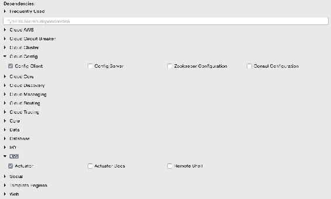

1.  将`application.properties`重命名为`bootstrap.properties`，并添加应用程序名称和配置服务器 URL。如果配置服务器在本地主机上的默认端口（`8888`）上运行，则配置服务器 URL 是非强制性的：

新的`bootstrap.properties`文件将如下所示：

```java
spring.application.name=search-service 
spring.cloud.config.uri=http://localhost:8888

server.port=8090

spring.rabbitmq.host=localhost
spring.rabbitmq.port=5672
spring.rabbitmq.username=guest
spring.rabbitmq.password=guest
```

`search-service`是为搜索微服务指定的逻辑名称。这将被视为服务 ID。配置服务器将在存储库中查找`search-service.properties`以解析属性。

1.  为`search-service`创建一个新的配置文件。在创建 Git 存储库的`config-repo`文件夹下创建一个新的`search-service.properties`。请注意，`search-service`是在`bootstrap.properties`文件中为搜索微服务指定的服务 ID。将特定于服务的属性从`bootstrap.properties`移动到新的`search-service.properties`文件中。以下属性将从`bootstrap.properties`中删除，并添加到`search-service.properties`中：

```java
spring.rabbitmq.host=localhost
spring.rabbitmq.port=5672
spring.rabbitmq.username=guest
spring.rabbitmq.password=guest
```

1.  为了演示属性的集中配置和更改的传播，向属性文件中添加一个新的特定于应用程序的属性。我们将添加`originairports.shutdown`来临时将某个机场从搜索中移除。用户在搜索关闭列表中提到的机场时将不会得到任何航班：

```java
originairports.shutdown=SEA
```

在此示例中，当使用`SEA`作为起始地进行搜索时，我们将不返回任何航班。

1.  通过执行以下命令将此新文件提交到 Git 存储库中：

```java
git add –A .
git commit –m "adding new configuration" 

```

1.  最终的`search-service.properties`文件应如下所示：

```java
spring.rabbitmq.host=localhost
spring.rabbitmq.port=5672
spring.rabbitmq.username=guest
spring.rabbitmq.password=guest
originairports.shutdown:SEA
```

1.  `chapter5.search`项目的`bootstrap.properties`应如下所示：

```java
spring.application.name=search-service
server.port=8090
spring.cloud.config.uri=http://localhost:8888
```

1.  修改搜索微服务代码以使用配置参数`originairports.shutdown`。必须在类级别添加`RefreshScope`注解，以允许在更改时刷新属性。在这种情况下，我们将在`SearchRestController`类中添加一个刷新范围：

```java
@RefreshScope
```

1.  添加以下实例变量作为新属性的占位符，该属性刚刚添加到配置服务器中。`search-service.properties`文件中的属性名称必须匹配：

```java
  @Value("${originairports.shutdown}")
  private String originAirportShutdownList;
```

1.  更改应用程序代码以使用此属性。这是通过修改`search`方法来完成的：

```java
  @RequestMapping(value="/get", method = RequestMethod.POST)
  List<Flight> search(@RequestBody SearchQuery query){
    logger.info("Input : "+ query);
  if(Arrays.asList(originAirportShutdownList.split(",")).contains(query.getOrigin())){
    logger.info("The origin airport is in shutdown state");
    return new ArrayList<Flight>();
  }
  return searchComponent.search(query);
  }
```

`search`方法被修改为读取参数`originAirportShutdownList`，并查看请求的起始地是否在关闭列表中。如果匹配，则搜索方法将返回一个空的航班列表，而不是继续进行实际搜索。

1.  启动配置服务器。然后启动 Search 微服务。确保 RabbitMQ 服务器正在运行。

1.  修改`chapter5.website`项目以匹配`bootstrap.properties`的内容，如下所示，以利用配置服务器：

```java
spring.application.name=test-client
server.port=8001
spring.cloud.config.uri=http://localhost:8888
```

1.  将`Application.java`中的`CommandLineRunner`的`run`方法更改为查询 SEA 作为起始机场：

```java
SearchQuery = new SearchQuery("SEA","SFO","22-JAN-16");
```

1.  运行`chapter5.website`项目。`CommandLineRunner`现在将返回一个空的航班列表。服务器将打印以下消息：

```java
The origin airport is in shutdown state

```

## 处理配置更改

本节将演示如何在发生更改时传播配置属性：

1.  将`search-service.properties`文件中的属性更改为以下内容：

```java
originairports.shutdown:NYC
```

在 Git 存储库中提交更改。刷新此服务的配置服务器 URL（`http://localhost:8888/search-service/default`），并查看属性更改是否反映出来。如果一切正常，我们将看到属性更改。前面的请求将强制配置服务器再次从存储库中读取属性文件。

1.  再次运行网站项目，并观察`CommandLineRunner`的执行。请注意，在这种情况下，我们没有重新启动 Search 微服务或配置服务器。服务将像以前一样返回一个空的航班列表，并且仍然会报错如下：

```java
The origin airport is in shutdown state

```

这意味着更改不会反映在 Search 服务中，服务仍然使用旧版本的配置属性。

1.  为了强制重新加载配置属性，请调用 Search 微服务的`/refresh`端点。这实际上是执行器的刷新端点。以下命令将向`/refresh`端点发送一个空的 POST：

```java
curl –d {} localhost:8090/refresh

```

1.  重新运行网站项目，并观察`CommandLineRunner`的执行。这应该返回我们从 SEA 请求的航班列表。请注意，如果预订服务没有运行，网站项目可能会失败。

`/refresh`端点将刷新本地缓存的配置属性，并从配置服务器重新加载新值。

## 用于传播配置更改的 Spring Cloud Bus

采用上述方法，可以在不重新启动微服务的情况下更改配置参数。当服务运行的实例只有一个或两个时，这是很好的。如果有很多实例会发生什么？例如，如果有五个实例，那么我们必须针对每个服务实例进行`/refresh`。这绝对是一项繁琐的活动：

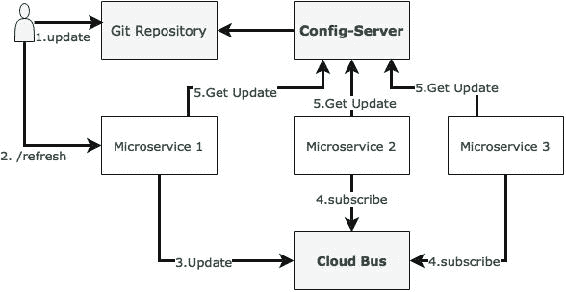

Spring Cloud Bus 提供了一种机制，可以在不知道有多少实例或它们的位置的情况下刷新多个实例之间的配置。当有许多微服务的服务实例运行或有许多不同类型的微服务运行时，这是特别方便的。这是通过将所有服务实例连接到单个消息代理来完成的。每个实例都订阅更改事件，并在需要时刷新其本地配置。通过调用任一实例的`/bus/refresh`端点来触发此刷新，然后通过云总线和公共消息代理传播更改。

在此示例中，RabbitMQ 被用作 AMQP 消息代理。按照以下记录的步骤来实现这一点：

1.  在`chapter5.search`项目的`pom.xml`文件中添加一个新的依赖项，以引入 Cloud Bus 依赖项：

```java
<dependency>
   <groupId>org.springframework.cloud</groupId>
   <artifactId>spring-cloud-starter-bus-amqp</artifactId>
</dependency>
```

1.  Search 微服务还需要连接到 RabbitMQ，但这已经在`search-service.properties`中提供了。

1.  重建并重新启动搜索微服务。在这种情况下，我们将从命令行运行两个搜索微服务实例，如下所示：

```java
java -jar -Dserver.port=8090  search-1.0.jar 
java -jar -Dserver.port=8091  search-1.0.jar

```

搜索服务的两个实例现在将运行，一个在端口`8090`上，另一个在`8091`上。

1.  重新运行网站项目。这只是为了确保一切正常。此时，搜索服务应返回一个航班。

1.  现在，使用以下值更新`search-service.properties`，并提交到 Git：

```java
originairports.shutdown:SEA
```

1.  运行以下命令来执行`/bus/refresh`。请注意，我们正在针对一个实例运行新的总线端点，本例中为`8090`：

```java
curl –d {} localhost:8090/bus/refresh

```

1.  立即，我们将看到两个实例的以下消息：

```java
Received remote refresh request. Keys refreshed [originairports.shutdown]

```

总线端点会将消息内部发送到消息代理，最终被所有实例消耗，重新加载其属性文件。也可以通过指定应用程序名称来对特定应用程序应用更改，如下所示：

```java
/bus/refresh?destination=search-service:**
```

我们还可以通过将属性名称设置为参数来刷新特定属性。

## 为配置服务器设置高可用性

前几节探讨了如何设置配置服务器，允许实时刷新配置属性。但是，在这种架构中，配置服务器是一个单点故障。

在上一节建立的默认架构中存在三个单点故障。其中一个是配置服务器本身的可用性，第二个是 Git 仓库，第三个是 RabbitMQ 服务器。

以下图表显示了配置服务器的高可用性架构：

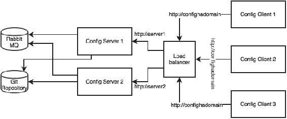

以下是架构机制和原理的解释：

配置服务器需要高可用性，因为如果配置服务器不可用，服务将无法引导。因此，需要冗余的配置服务器以实现高可用性。但是，在服务引导后，如果配置服务器不可用，应用程序可以继续运行。在这种情况下，服务将使用上次已知的配置状态运行。因此，配置服务器的可用性不像微服务的可用性那样关键。

为了使配置服务器具有高可用性，我们需要多个配置服务器实例。由于配置服务器是一个无状态的 HTTP 服务，可以并行运行多个配置服务器实例。根据配置服务器的负载，必须调整实例的数量。`bootstrap.properties`文件无法处理多个服务器地址。因此，应配置多个配置服务器以在负载均衡器或本地 DNS 后运行，并具有故障转移和回退功能。负载均衡器或 DNS 服务器的 URL 将配置在微服务的`bootstrap.properties`文件中。这是在假设 DNS 或负载均衡器具有高可用性并能够处理故障转移的情况下。

在生产场景中，不建议使用基于本地文件的 Git 仓库。配置服务器通常应该由高可用性的 Git 服务支持。可以通过使用外部高可用性的 Git 服务或高可用性的内部 Git 服务来实现。也可以考虑使用 SVN。

也就是说，已经引导的配置服务器始终能够使用配置的本地副本进行工作。因此，只有在需要扩展配置服务器时才需要高可用性的 Git。因此，这也不像微服务可用性或配置服务器可用性那样重要。

### 注意

设置高可用性的 GitLab 示例可在[`about.gitlab.com/high-availability/`](https://about.gitlab.com/high-availability/)找到。

RabbitMQ 也必须配置为高可用性。RabbitMQ 的高可用性仅需要动态推送配置更改到所有实例。由于这更多是离线受控活动，因此不需要与组件所需的高可用性相同。

RabbitMQ 高可用性可以通过使用云服务或本地配置的高可用性 RabbitMQ 服务来实现。

### 注意

为 Rabbit MQ 设置高可用性的步骤在[`www.rabbitmq.com/ha.html`](https://www.rabbitmq.com/ha.html)中有记录。

## 监控配置服务器的健康状况

配置服务器只是一个 Spring Boot 应用程序，默认配置有一个执行器。因此，所有执行器端点都适用于配置服务器。可以使用以下执行器 URL 监控服务器的健康状况：`http://localhost:8888/health`。

## 配置服务器用于配置文件

我们可能会遇到需要完整的配置文件（如`logback.xml`）进行外部化的情况。配置服务器提供了一种配置和存储此类文件的机制。通过使用以下 URL 格式可以实现：`/{name}/{profile}/{label}/{path}`。

名称、配置文件和标签的含义与之前解释的相同。路径表示文件名，例如`logback.xml`。

## 完成使用配置服务器的更改

为了构建完成 BrownField 航空公司的 PSS 的能力，我们必须利用配置服务器来完成所有服务。在给定的示例中，`chapter5.*`中的所有微服务都需要进行类似的更改，以便查找配置服务器以获取配置参数。

以下是一些关键的更改考虑：

+   预订组件中的票价服务 URL 也将被外部化：

```java
private static final String FareURL = "/fares";

@Value("${fares-service.url}")
private String fareServiceUrl;

Fare = restTemplate.getForObject(fareServiceUrl+FareURL +"/get?flightNumber="+record.getFlightNumber()+"&flightDate="+record.getFlightDate(),Fare.class);
```

```java
fares-service.url.
```

+   目前我们没有将搜索、预订和办理登机服务中使用的队列名称外部化。在本章后面，这些将被更改为使用 Spring Cloud Streams。

# Feign 作为声明式 REST 客户端

```java
Fare fare = restTemplate.getForObject(FareURL +"/get?flightNumber="+record.getFlightNumber()+"&flightDate="+record.getFlightDate(),Fare.class);
```

为了使用 Feign，首先需要更改`pom.xml`文件以包含 Feign 依赖项，如下所示：

```java
<dependency>
  <groupId>org.springframework.cloud</groupId>
  <artifactId>spring-cloud-starter-feign</artifactId>
</dependency>
```

对于新的 Spring Starter 项目，可以从 starter 库选择屏幕或[`start.spring.io/`](http://start.spring.io/)中选择**Feign**。这在**Cloud Routing**下可用，如下截图所示：

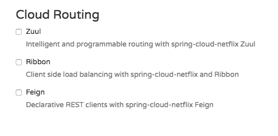

下一步是创建一个新的`FareServiceProxy`接口。这将充当实际票价服务的代理接口：

```java
@FeignClient(name="fares-proxy", url="localhost:8080/fares")
public interface FareServiceProxy {
  @RequestMapping(value = "/get", method=RequestMethod.GET)
  Fare getFare(@RequestParam(value="flightNumber") String flightNumber, @RequestParam(value="flightDate") String flightDate);
}
```

`FareServiceProxy`接口有一个`@FeignClient`注解。此注解告诉 Spring 基于提供的接口创建一个 REST 客户端。值可以是服务 ID 或逻辑名称。`url`表示目标服务运行的实际 URL。`name`或`value`是必需的。在这种情况下，由于我们有`url`，因此`name`属性是无关紧要的。

使用此服务代理调用票价服务。在预订微服务中，我们必须告诉 Spring 存在于 Spring Boot 应用程序中的 Feign 客户端，这些客户端需要被扫描和发现。这将通过在`BookingComponent`的类级别添加`@EnableFeignClients`来完成。可选地，我们也可以给出要扫描的包名。

更改`BookingComponent`，并对调用部分进行更改。这就像调用另一个 Java 接口一样简单：

```java
Fare = fareServiceProxy.getFare(record.getFlightNumber(), record.getFlightDate());
```

重新运行预订微服务以查看效果。

`FareServiceProxy`接口中的票价服务的 URL 是硬编码的：`url="localhost:8080/fares"`。

目前我们会保持这样，但在本章后面我们会进行更改。

# 用于负载均衡的 Ribbon

在以前的设置中，我们总是使用单个微服务实例运行。URL 在客户端和服务对服务调用中都是硬编码的。在现实世界中，这不是一种推荐的方法，因为可能会有多个服务实例。如果有多个实例，那么理想情况下，我们应该使用负载均衡器或本地 DNS 服务器来抽象实际实例位置，并在客户端中配置别名或负载均衡器地址。然后，负载均衡器接收别名，并将其解析为可用实例之一。通过这种方法，我们可以在负载均衡器后面配置尽可能多的实例。这也有助于我们处理对客户端透明的服务器故障。

这可以通过 Spring Cloud Netflix Ribbon 实现。Ribbon 是一个客户端负载均衡器，可以在一组服务器之间进行轮询负载平衡。Ribbon 库可能还有其他负载平衡算法。Spring Cloud 提供了一种声明性的方式来配置和使用 Ribbon 客户端。

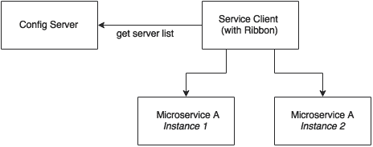

如前图所示，Ribbon 客户端会查找配置服务器以获取可用微服务实例列表，并默认应用轮询负载平衡算法。

为了使用 Ribbon 客户端，我们将不得不将以下依赖项添加到`pom.xml`文件中：

```java
<dependency>
  <groupId>org.springframework.cloud</groupId>
  <artifactId>spring-cloud-starter-ribbon</artifactId>
</dependency>
```

在从头开始开发的情况下，可以从 Spring Starter 库或[`start.spring.io/`](http://start.spring.io/)中选择。Ribbon 在**Cloud Routing**下可用：


更新预订微服务配置文件`booking-service.properties`，以包含一个新属性，用于保留票价微服务的列表：

```java
fares-proxy.ribbon.listOfServers=localhost:8080,localhost:8081
```

回到上一节中创建的`FareServiceProxy`类并编辑，以使用 Ribbon 客户端，我们注意到`@RequestMapping`注解的值从`/get`更改为`/fares/get`，以便我们可以轻松地将主机名和端口移动到配置中：

```java
@FeignClient(name="fares-proxy")
@RibbonClient(name="fares")
public interface FareServiceProxy {
  @RequestMapping(value = "fares/get", method=RequestMethod.GET)
```

现在我们可以运行两个 Fares 微服务实例。在`8080`上启动一个，另一个在`8081`上启动：

```java
java -jar -Dserver.port=8080 fares-1.0.jar
java -jar -Dserver.port=8081 fares-1.0.jar

```

运行预订微服务。当预订微服务启动时，`CommandLineRunner`会自动插入一条预订记录。这将进入第一个服务器。

运行网站项目时，它调用预订服务。这个请求将进入第二个服务器。

在预订服务上，我们看到以下跟踪，其中说有两个服务器被列入：

```java
DynamicServerListLoadBalancer:{NFLoadBalancer:name=fares-proxy,current 

list of Servers=[localhost:8080, localhost:8081],Load balancer stats=Zone stats: {unknown=[Zone:unknown;  Instance count:2;  Active connections count: 0;  Circuit breaker tripped count: 0;  Active connections per server: 0.0;]
}, 

```

# Eureka 用于注册和发现

到目前为止，我们已经实现了外部化配置参数以及在许多服务实例之间的负载平衡。

基于 Ribbon 的负载平衡对于大多数微服务需求是足够的。然而，在一些情况下，这种方法存在一些不足之处：

+   如果有大量的微服务，并且我们想要优化基础设施利用率，我们将不得不动态更改服务实例的数量和相关服务器。在配置文件中预测和预配置服务器 URL 并不容易。

+   针对高度可扩展的微服务的云部署，静态注册和发现不是一个好的解决方案，考虑到云环境的弹性特性。

+   在云部署方案中，IP 地址是不可预测的，并且在文件中静态配置将会很困难。每次地址发生变化时，我们都必须更新配置文件。

Ribbon 方法部分地解决了这个问题。使用 Ribbon，我们可以动态更改服务实例，但是每当我们添加新的服务实例或关闭实例时，我们将不得不手动更新配置服务器。尽管配置更改将自动传播到所有所需的实例，但手动配置更改在大规模部署中将无法使用。在管理大规模部署时，尽可能地进行自动化是至关重要的。

为了弥补这一差距，微服务应该通过动态注册服务可用性来自我管理其生命周期，并为消费者提供自动化发现。

## 理解动态服务注册和发现

动态注册主要是从服务提供者的角度来看的。通过动态注册，当启动新服务时，它会自动在中央服务注册表中列出其可用性。同样，当服务停止服务时，它会自动从服务注册表中删除。注册表始终保持服务的最新信息，以及它们的元数据。

动态发现适用于服务消费者的角度。动态发现是指客户端查找服务注册表以获取服务拓扑的当前状态，然后相应地调用服务。在这种方法中，不是静态配置服务 URL，而是从服务注册表中获取 URL。

客户端可以保留注册表数据的本地缓存，以加快访问速度。一些注册表实现允许客户端监视他们感兴趣的项目。在这种方法中，注册表服务器中的状态更改将传播到感兴趣的各方，以避免使用过时的数据。

有许多选项可用于动态服务注册和发现。Netflix Eureka、ZooKeeper 和 Consul 作为 Spring Cloud 的一部分可用，如下所示：[`start.spring.io/`](http://start.spring.io/)。Etcd 是 Spring Cloud 之外可用的另一个服务注册表，用于实现动态服务注册和发现。在本章中，我们将重点关注 Eureka 的实现：

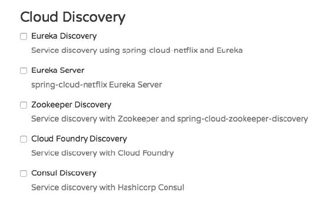

## 理解 Eureka

Spring Cloud Eureka 也来自 Netflix OSS。Spring Cloud 项目为集成 Eureka 与基于 Spring 的应用程序提供了一种 Spring 友好的声明性方法。Eureka 主要用于自注册、动态发现和负载平衡。Eureka 在内部使用 Ribbon 进行负载平衡：

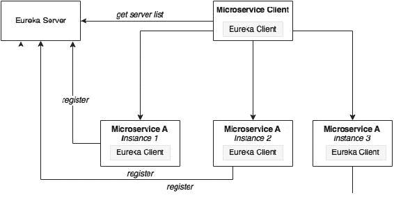

如前图所示，Eureka 由服务器组件和客户端组件组成。服务器组件是所有微服务注册其可用性的注册表。注册通常包括服务标识和其 URL。微服务使用 Eureka 客户端注册其可用性。消费组件也将使用 Eureka 客户端来发现服务实例。

当微服务引导启动时，它会联系 Eureka 服务器，并使用绑定信息宣布自己的存在。注册后，服务端点每 30 秒向注册表发送 ping 请求以更新其租约。如果服务端点在几次尝试中无法更新其租约，该服务端点将从服务注册表中移除。注册信息将被复制到所有 Eureka 客户端，以便客户端必须为每个请求去远程 Eureka 服务器。Eureka 客户端从服务器获取注册信息，并在本地进行缓存。之后，客户端使用该信息来查找其他服务。此信息会定期更新（每 30 秒），通过获取上次获取周期和当前获取周期之间的增量更新。

当客户端想要联系微服务端点时，Eureka 客户端根据请求的服务 ID 提供当前可用服务的列表。Eureka 服务器具有区域感知能力。在注册服务时也可以提供区域信息。当客户端请求服务实例时，Eureka 服务会尝试找到在同一区域运行的服务。然后，Ribbon 客户端会在 Eureka 客户端提供的这些可用服务实例之间进行负载均衡。Eureka 客户端和服务器之间的通信是使用 REST 和 JSON 进行的。

## 设置 Eureka 服务器

在本节中，我们将介绍设置 Eureka 服务器所需的步骤。

### 注意

本节的完整源代码可在代码文件的`chapter5.eurekaserver`项目中找到。请注意，Eureka 服务器的注册和刷新周期需要长达 30 秒。因此，在运行服务和客户端时，请等待 40-50 秒。

1.  启动一个新的 Spring Starter 项目，并选择**Config Client**，**Eureka Server**和**Actuator**：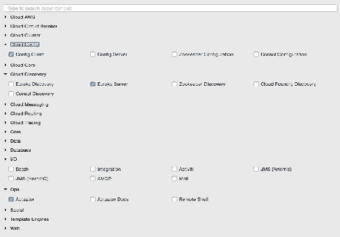

Eureka 服务器的项目结构如下图所示：

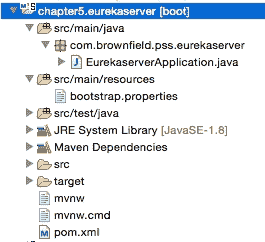

请注意，主应用程序的名称为`EurekaserverApplication.java`。

1.  将`application.properties`重命名为`bootstrap.properties`，因为这是使用 Config 服务器。与之前一样，在`bootstrap.properties`文件中配置 Config 服务器的详细信息，以便它可以找到 Config 服务器实例。`bootstrap.properties`文件将如下所示：

```java
spring.application.name=eureka-server1
server.port:8761
spring.cloud.config.uri=http://localhost:8888
```

Eureka 服务器可以以独立模式或集群模式设置。我们将从独立模式开始。默认情况下，Eureka 服务器本身也是另一个 Eureka 客户端。当有多个 Eureka 服务器运行以实现高可用性时，这是特别有用的。客户端组件负责从其他 Eureka 服务器同步状态。通过配置`eureka.client.serviceUrl.defaultZone`属性，Eureka 客户端将其对等方。

在独立模式中，我们将`eureka.client.serviceUrl.defaultZone`指向同一个独立实例。稍后我们将看到如何以集群模式运行 Eureka 服务器。

1.  创建一个`eureka-server1.properties`文件，并将其更新到 Git 存储库中。`eureka-server1`是在上一步中应用的`bootstrap.properties`文件中给出的应用程序的名称。如下所示，`serviceUrl`指向同一个服务器。一旦添加了以下属性，就将文件提交到 Git 存储库中：

```java
spring.application.name=eureka-server1
eureka.client.serviceUrl.defaultZone:http://localhost:8761/eureka/
eureka.client.registerWithEureka:false
eureka.client.fetchRegistry:false
```

1.  更改默认的`Application.java`。在这个例子中，包也被重命名为`com.brownfield.pss.eurekaserver`，类名改为`EurekaserverApplication`。在`EurekaserverApplication`中，添加`@EnableEurekaServer`：

```java
@EnableEurekaServer
@SpringBootApplication
public class EurekaserverApplication {
```

1.  现在我们准备启动 Eureka 服务器。确保 Config 服务器也已启动。右键单击应用程序，然后选择**Run As** | **Spring Boot App**。应用程序启动后，在浏览器中打开`http://localhost:8761`以查看 Eureka 控制台。

1.  在控制台中，请注意**当前在 Eureka 中注册的实例**下没有实例注册。由于没有启用 Eureka 客户端的服务，因此此时列表为空。

1.  对我们的微服务进行一些更改将启用使用 Eureka 服务的动态注册和发现。为此，首先我们必须将 Eureka 依赖项添加到`pom.xml`文件中。如果服务是使用 Spring Starter 项目新建的，那么选择**Config Client**，**Actuator**，**Web**以及**Eureka discovery**客户端如下所示：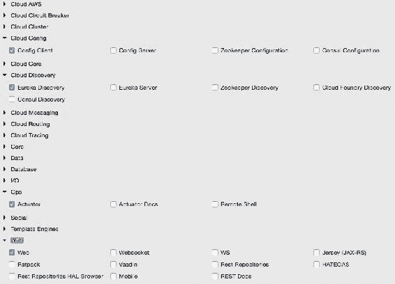

1.  由于我们正在修改我们的微服务，在它们的`pom.xml`文件中添加以下附加依赖项：

```java
<dependency>
  <groupId>org.springframework.cloud</groupId>
  <artifactId>spring-cloud-starter-eureka</artifactId>
</dependency>
```

1.  必须在各自的配置文件中的`config-repo`下的所有微服务中添加以下属性。这将帮助微服务连接到 Eureka 服务器。更新完成后提交到 Git：

```java
eureka.client.serviceUrl.defaultZone: http://localhost:8761/eureka/
```

1.  在各自的 Spring Boot 主类中的所有微服务中添加`@EnableDiscoveryClient`。这要求 Spring Boot 在启动时注册这些服务，以宣传它们的可用性。

1.  启动除预订之外的所有服务器。由于我们在预订服务上使用了 Ribbon 客户端，当我们将 Eureka 客户端添加到类路径中时，行为可能会有所不同。我们将很快解决这个问题。

1.  转到 Eureka URL（`http://localhost:8761`），您可以看到所有三个实例都正在运行：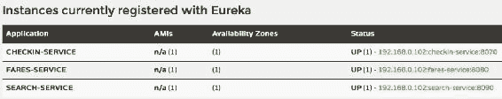

是时候解决预订的问题了。我们将删除之前的 Ribbon 客户端，改用 Eureka。Eureka 在内部使用 Ribbon 进行负载平衡。因此，负载平衡行为不会改变。

1.  删除以下依赖项：

```java
<dependency>
  <groupId>org.springframework.cloud</groupId>
  <artifactId>spring-cloud-starter-ribbon</artifactId>
</dependency>
```

1.  还要从`FareServiceProxy`类中删除`@RibbonClient(name="fares")`注释。

1.  将`@FeignClient(name="fares-service")`更新为匹配实际票价微服务的服务 ID。在这种情况下，`fare-service`是配置在票价微服务的`bootstrap.properties`中的服务 ID。这是 Eureka 发现客户端发送到 Eureka 服务器的名称。服务 ID 将用作 Eureka 服务器中注册的服务的键。

1.  还要从`booking-service.properties`文件中删除服务器列表。使用 Eureka，我们将从 Eureka 服务器动态发现此列表：

```java
fares-proxy.ribbon.listOfServers=localhost:8080, localhost:8081
```

1.  启动预订服务。您将看到`CommandLineRunner`成功创建了一个预订，其中涉及使用 Eureka 发现机制调用票价服务。返回 URL 以查看所有注册的服务：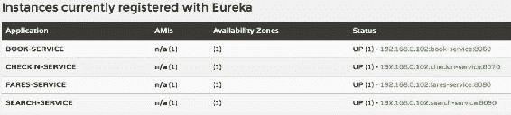

1.  更改网站项目的`bootstrap.properties`文件，以利用 Eureka 而不是直接连接到服务实例。在这种情况下，我们将不使用 Feign 客户端。相反，为了演示目的，我们将使用负载平衡的`RestTemplate`。将这些更改提交到 Git 存储库：

```java
spring.application.name=test-client
eureka.client.serviceUrl.defaultZone: http://localhost:8761/eureka/
```

1.  在`Application`类中添加`@EnableDiscoveryClient`，使客户端具有 Eureka 意识。

1.  编辑`Application.java`和`BrownFieldSiteController.java`。添加三个`RestTemplate`实例。这次，我们用`@Loadbalanced`对它们进行注释，以确保我们使用 Eureka 和 Ribbon 的负载平衡功能。`RestTemplate`无法自动注入。因此，我们必须提供以下配置条目：

```java
@Configuration
class AppConfiguration {
    @LoadBalanced
    @Bean
    RestTemplate restTemplate() {
        return new RestTemplate();
    }
}
@Autowired
RestTemplate searchClient;

@Autowired
RestTemplate bookingClient;

@Autowired
RestTemplate checkInClient;
```

1.  我们使用这些`RestTemplate`实例来调用微服务。用在 Eureka 服务器中注册的服务 ID 替换硬编码的 URL。在下面的代码中，我们使用服务名称`search-service`、`book-service`和`checkin-service`，而不是显式的主机名和端口：

```java
Flight[] flights = searchClient.postForObject("http://search-service/search/get", searchQuery, Flight[].class);

long bookingId = bookingClient.postForObject("http://book-service/booking/create", booking, long.class);

long checkinId = checkInClient.postForObject("http://checkin-service/checkin/create", checkIn, long.class);
```

1.  现在我们准备运行客户端。运行网站项目。如果一切正常，网站项目的`CommandLineRunner`将成功执行搜索、预订和办理登机手续。也可以通过将浏览器指向`http://localhost:8001`来测试相同的情况。

## Eureka 的高可用性

```java
The client URLs point to each other, forming a peer network as shown in the following configuration:
```

```java
eureka-server1.properties
eureka.client.serviceUrl.defaultZone:http://localhost:8762/eureka/
eureka.client.registerWithEureka:false
eureka.client.fetchRegistry:false

eureka-server2.properties
eureka.client.serviceUrl.defaultZone:http://localhost:8761/eureka/
eureka.client.registerWithEureka:false
eureka.client.fetchRegistry:false
```

更新 Eureka 的`bootstrap.properties`文件，并将应用程序名称更改为`eureka`。由于我们使用了两个配置文件，根据启动时提供的活动配置文件，配置服务器将寻找`eureka-server1`或`eureka-server2`：

```java
spring.application.name=eureka
spring.cloud.config.uri=http://localhost:8888
```

启动两个 Eureka 服务器的实例，`server1`在`8761`上，`server2`在`8762`上：

```java
java -jar –Dserver.port=8761 -Dspring.profiles.active=server1 demo-0.0.1-SNAPSHOT.jar
java -jar –Dserver.port=8762 -Dspring.profiles.active=server2 demo-0.0.1-SNAPSHOT.jar

```

我们所有的服务仍然指向第一个服务器`server1`。打开两个浏览器窗口：`http://localhost:8761`和`http://localhost:8762`。

启动所有微服务。打开`8761`的那个将立即反映出更改，而另一个将需要 30 秒才能反映出状态。由于这两个服务器都在一个集群中，状态在这两个服务器之间是同步的。如果我们将这些服务器放在负载均衡器/DNS 后面，那么客户端将始终连接到其中一个可用的服务器。

完成此练习后，切换回独立模式进行剩余的练习。

# Zuul 代理作为 API 网关

在大多数微服务实现中，内部微服务端点不会暴露在外部。它们被保留为私有服务。一组公共服务将使用 API 网关向客户端公开。有许多原因可以这样做：

+   只有一组精选的微服务是客户端所需的。

+   如果需要应用特定于客户端的策略，可以在一个地方应用它们，而不是在多个地方。这种情况的一个例子是跨域访问策略。

+   在服务端点上实现特定于客户端的转换很困难。

+   如果需要数据聚合，特别是在带宽受限的环境中避免多个客户端调用，那么中间需要一个网关。

Zuul 是一个简单的网关服务或边缘服务，非常适合这些情况。Zuul 也来自 Netflix 微服务产品系列。与许多企业 API 网关产品不同，Zuul 为开发人员提供了根据特定要求进行配置或编程的完全控制：

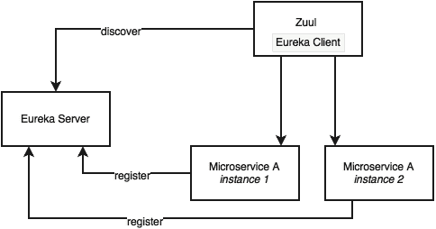

Zuul 代理在内部使用 Eureka 服务器进行服务发现，并使用 Ribbon 在服务实例之间进行负载平衡。

Zuul 代理还能够进行路由、监控、管理弹性、安全等。简单来说，我们可以将 Zuul 视为反向代理服务。使用 Zuul，我们甚至可以通过在 API 层覆盖它们来改变底层服务的行为。

## 设置 Zuul

与 Eureka 服务器和 Config 服务器不同，在典型的部署中，Zuul 是特定于一个微服务的。但是，也有部署方式，其中一个 API 网关覆盖多个微服务。在这种情况下，我们将为我们的每个微服务添加 Zuul：Search、Booking、Fare 和 Check-in：

### 注意

本节的完整源代码可在代码文件的`chapter5.*-apigateway`项目中找到。

1.  逐个转换微服务。从 Search API Gateway 开始。创建一个新的 Spring Starter 项目，并选择**Zuul**、**Config Client**、**Actuator**和**Eureka Discovery**：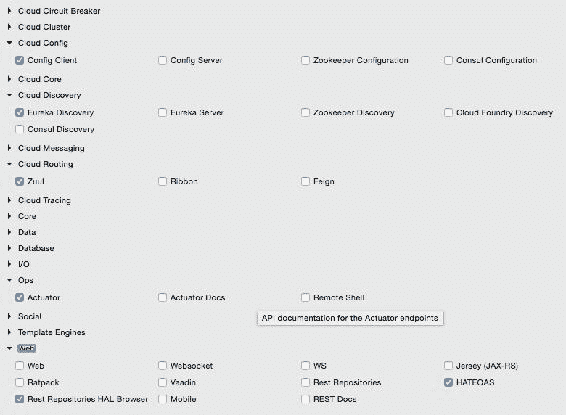

`search-apigateway`的项目结构如下图所示：

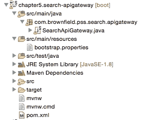

1.  下一步是将 API 网关与 Eureka 和 Config 服务器集成。创建一个名为`search-apigateway.property`的文件，其中包含下面给出的内容，并提交到 Git 存储库。

此配置还设置了如何转发流量的规则。在这种情况下，API 网关上的任何请求都应该发送到`search-service`的`/api`端点：

```java
spring.application.name=search-apigateway
zuul.routes.search-apigateway.serviceId=search-service
zuul.routes.search-apigateway.path=/api/**
eureka.client.serviceUrl.defaultZone:http://localhost:8761/eureka/
```

`search-service`是搜索服务的服务 ID，并将使用 Eureka 服务器进行解析。

1.  更新`search-apigateway`的`bootstrap.properties`文件如下。在这个配置中没有什么新的内容——服务的名称、端口和 Config 服务器的 URL：

```java
spring.application.name=search-apigateway
server.port=8095
spring.cloud.config.uri=http://localhost:8888
```

1.  编辑`Application.java`。在这种情况下，包名和类名也更改为`com.brownfield.pss.search.apigateway`和`SearchApiGateway`。还要添加`@EnableZuulProxy`以告诉 Spring Boot 这是一个 Zuul 代理：

```java
@EnableZuulProxy
@EnableDiscoveryClient
@SpringBootApplication
public class SearchApiGateway {
```

1.  将其作为 Spring Boot 应用程序运行。在此之前，请确保 Config 服务器、Eureka 服务器和 Search 微服务正在运行。

1.  更改网站项目的`CommandLineRunner`以及`BrownFieldSiteController`以利用 API 网关：

```java
Flight[] flights = searchClient.postForObject("http://search-apigateway/api/search/get", searchQuery, Flight[].class); 
```

在这种情况下，Zuul 代理充当反向代理，将所有微服务端点代理给消费者。在前面的例子中，Zuul 代理并没有增加太多价值，因为我们只是将传入的请求传递给相应的后端服务。

当我们有一个或多个以下要求时，Zuul 特别有用：

+   在网关上强制执行身份验证和其他安全策略，而不是在每个微服务端点上执行。网关可以在将请求传递给相关服务之前处理安全策略、令牌处理等。它还可以根据一些业务策略进行基本拒绝，例如阻止来自某些黑名单用户的请求。

+   商业洞察和监控可以在网关级别实施。收集实时统计数据，并将其推送到外部系统进行分析。这将很方便，因为我们可以在一个地方做到这一点，而不是在许多微服务中应用它。

+   API 网关在需要基于细粒度控制的动态路由的场景中非常有用。例如，根据“原始国家”等业务特定值发送请求到不同的服务实例。另一个例子是来自一个地区的所有请求都要发送到一组服务实例。还有一个例子是所有请求特定产品的请求都必须路由到一组服务实例。

+   处理负载削减和限流要求是另一种 API 网关非常有用的场景。这是当我们必须根据设置的阈值来控制负载，例如一天内的请求数。例如，控制来自低价值第三方在线渠道的请求。

+   Zuul 网关在细粒度负载均衡场景中非常有用。Zuul、Eureka 客户端和 Ribbon 共同提供对负载均衡需求的细粒度控制。由于 Zuul 实现只是另一个 Spring Boot 应用程序，开发人员可以完全控制负载均衡。

+   Zuul 网关在需要数据聚合要求的场景中也非常有用。如果消费者需要更高级别的粗粒度服务，那么网关可以通过代表客户端内部调用多个服务来内部聚合数据。当客户端在低带宽环境中工作时，这是特别适用的。

Zuul 还提供了许多过滤器。这些过滤器分为前置过滤器、路由过滤器、后置过滤器和错误过滤器。正如名称所示，这些过滤器在服务调用的生命周期的不同阶段应用。Zuul 还为开发人员提供了编写自定义过滤器的选项。为了编写自定义过滤器，需要从抽象的`ZuulFilter`中扩展，并实现以下方法：

```java
public class CustomZuulFilter extends ZuulFilter{
public Object run(){}
public boolean shouldFilter(){}
public int filterOrder(){}
public String filterType(){}
```

一旦实现了自定义过滤器，将该类添加到主上下文中。在我们的示例中，将其添加到`SearchApiGateway`类中，如下所示：

```java
@Bean
public CustomZuulFilter customFilter() {
    return new CustomZuulFilter();
}
```

如前所述，Zuul 代理是一个 Spring Boot 服务。我们可以以我们想要的方式以编程方式定制网关。如下所示，我们可以向网关添加自定义端点，然后可以调用后端服务：

```java
@RestController 
class SearchAPIGatewayController {

  @RequestMapping("/")
  String greet(HttpServletRequest req){
    return "<H1>Search Gateway Powered By Zuul</H1>";
  }
}
```

在前面的情况下，它只是添加了一个新的端点，并从网关返回一个值。我们还可以进一步使用`@Loadbalanced RestTemplate`来调用后端服务。由于我们有完全的控制权，我们可以进行转换、数据聚合等操作。我们还可以使用 Eureka API 来获取服务器列表，并实现完全独立的负载均衡或流量整形机制，而不是 Ribbon 提供的开箱即用的负载均衡特性。

## Zuul 的高可用性

Zuul 只是一个无状态的带有 HTTP 端点的服务，因此我们可以拥有任意数量的 Zuul 实例。不需要亲和力或粘性。然而，Zuul 的可用性非常关键，因为从消费者到提供者的所有流量都通过 Zuul 代理。然而，弹性扩展要求并不像后端微服务那样关键，那里发生了所有繁重的工作。

Zuul 的高可用性架构取决于我们使用 Zuul 的场景。典型的使用场景包括：

+   当客户端 JavaScript MVC（如 AngularJS）从远程浏览器访问 Zuul 服务时。

+   另一个微服务或非微服务通过 Zuul 访问服务

在某些情况下，客户端可能没有能力使用 Eureka 客户端库，例如，基于 PL/SQL 编写的旧应用程序。在某些情况下，组织政策不允许 Internet 客户端处理客户端负载均衡。对于基于浏览器的客户端，可以使用第三方的 Eureka JavaScript 库。

这一切归结于客户端是否使用 Eureka 客户端库。基于此，我们可以通过两种方式设置 Zuul 的高可用性。

### 当客户端也是 Eureka 客户端时，Zuul 的高可用性

在这种情况下，由于客户端也是另一个 Eureka 客户端，因此可以像其他微服务一样配置 Zuul。Zuul 使用服务 ID 向 Eureka 注册自己。然后客户端使用 Eureka 和服务 ID 来解析 Zuul 实例：

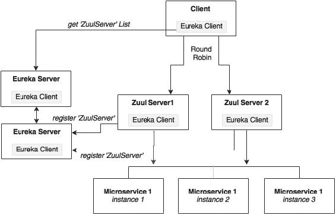

在前面的图表中显示，Zuul 服务使用服务 ID 在 Eureka 中注册自己，在我们的情况下是`search-apigateway`。Eureka 客户端使用 ID `search-apigateway` 请求服务器列表。Eureka 服务器根据当前的 Zuul 拓扑返回服务器列表。基于这个列表，Eureka 客户端选择一个服务器并发起调用。

如前所述，客户端使用服务 ID 来解析 Zuul 实例。在下面的情况中，`search-apigateway`是在 Eureka 中注册的 Zuul 实例 ID：

```java
Flight[] flights = searchClient.postForObject("http://search-apigateway/api/search/get", searchQuery, Flight[].class); 
```

### 当客户端不是 Eureka 客户端时的高可用性

在这种情况下，客户端无法使用 Eureka 服务器进行负载均衡。如下图所示，客户端将请求发送到负载均衡器，然后负载均衡器识别正确的 Zuul 服务实例。在这种情况下，Zuul 实例将在负载均衡器后面运行，例如 HAProxy 或类似 NetScaler 的硬件负载均衡器：

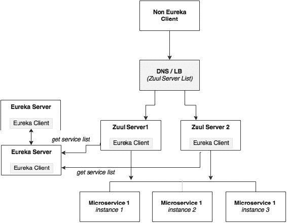

微服务仍然会通过 Eureka 服务器由 Zuul 进行负载均衡。

## 为所有其他服务完成 Zuul

为了完成这个练习，为所有的微服务添加 API 网关项目（将它们命名为`*-apigateway`）。需要完成以下步骤来实现这个任务：

1.  为每个服务创建新的属性文件，并检入 Git 存储库。

1.  将`application.properties`更改为`bootstrap.properties`，并添加所需的配置。

1.  在每个`*-apigateway`项目的`Application.java`中添加`@EnableZuulProxy`。

1.  在每个`*-apigateway`项目的`Application.java`文件中添加`@EnableDiscoveryClient`。

1.  可选地，更改默认生成的包名和文件名。

最终，我们将拥有以下 API 网关项目：

+   `chapter5.fares-apigateway`

+   `chapter5.search-apigateway`

+   `chapter5.checkin-apigateway`

+   `chapter5.book-apigateway`

# 用于响应式微服务的流

Spring Cloud Stream 提供了对消息基础设施的抽象。底层的消息实现可以是 RabbitMQ、Redis 或 Kafka。Spring Cloud Stream 提供了一个声明性的方法来发送和接收消息：

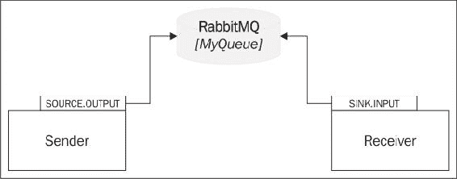

如前图所示，Cloud Stream 基于**源**和**接收器**的概念工作。源代表消息发送者的视角，而接收器代表消息接收者的视角。

在图中所示的例子中，发送者定义了一个名为`Source.OUTPUT`的逻辑队列，发送者向其发送消息。接收者定义了一个名为`Sink.INPUT`的逻辑队列，从中接收者检索消息。`OUTPUT`到`INPUT`的物理绑定通过配置进行管理。在这种情况下，两者链接到同一个物理队列——RabbitMQ 上的`MyQueue`。因此，一端的`Source.OUTPUT`指向`MyQueue`，另一端的`Sink.INPUT`指向相同的`MyQueue`。

Spring Cloud 提供了在一个应用程序中使用多个消息提供程序的灵活性，例如将来自 Kafka 的输入流连接到 Redis 输出流，而无需管理复杂性。Spring Cloud Stream 是基于消息的集成的基础。Cloud Stream 模块子项目是另一个 Spring Cloud 库，提供了许多端点实现。

作为下一步，重新构建云流的微服务间消息通信。如下图所示，我们将在搜索微服务下定义一个连接到`InventoryQ`的`SearchSink`。预订将为发送库存更改消息定义一个`BookingSource`连接到`InventoryQ`。类似地，登记定义了一个用于发送登记消息的`CheckinSource`。预订定义了一个接收器`BookingSink`，用于接收消息，都绑定到 RabbitMQ 上的`CheckinQ`队列：

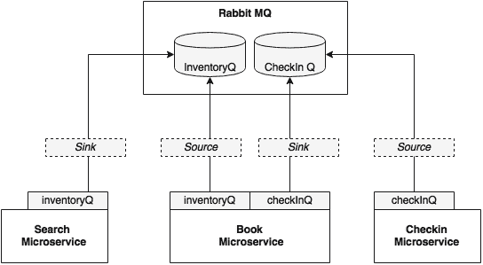

在这个例子中，我们将使用 RabbitMQ 作为消息代理：

1.  将以下 Maven 依赖项添加到预订、搜索和登记中，因为这三个模块使用消息传递：

```java
<dependency>
  <groupId>org.springframework.cloud</groupId>
  <artifactId>spring-cloud-starter-stream-rabbit</artifactId>
</dependency>
```

1.  将以下两个属性添加到`booking-service.properties`中。这些属性将逻辑队列`inventoryQ`绑定到物理`inventoryQ`，逻辑`checkinQ`绑定到物理`checkinQ`：

```java
spring.cloud.stream.bindings.inventoryQ.destination=inventoryQ
spring.cloud.stream.bindings.checkInQ.destination=checkInQ
```

1.  将以下属性添加到`search-service.properties`中。这个属性将逻辑队列`inventoryQ`绑定到物理`inventoryQ`：

```java
spring.cloud.stream.bindings.inventoryQ.destination=inventoryQ
```

1.  将以下属性添加到`checkin-service.properties`中。这个属性将逻辑队列`checkinQ`绑定到物理`checkinQ`：

```java
spring.cloud.stream.bindings.checkInQ.destination=checkInQ
```

1.  将所有文件提交到 Git 存储库。

1.  下一步是编辑代码。搜索微服务从预订微服务中消费消息。在这种情况下，预订是源，搜索是接收器。

在预订服务的`Sender`类中添加`@EnableBinding`。这将使 Cloud Stream 根据类路径中可用的消息代理库进行自动配置。在我们的情况下，这是 RabbitMQ。参数`BookingSource`定义了用于此配置的逻辑通道：

```java
@EnableBinding(BookingSource.class)
public class Sender {
```

1.  在这种情况下，`BookingSource`定义了一个名为`inventoryQ`的消息通道，它在配置中与 RabbitMQ 的`inventoryQ`物理绑定。`BookingSource`使用注解`@Output`来指示这是输出类型的消息，即从模块发出的消息。这些信息将用于消息通道的自动配置：

```java
interface BookingSource {
    public static String InventoryQ="inventoryQ"; 
    @Output("inventoryQ")
    public MessageChannel inventoryQ();      
}
```

1.  我们可以使用 Spring Cloud Stream 提供的默认`Source`类，而不是定义自定义类，如果服务只有一个源和一个接收器：

```java
public interface Source {
  @Output("output")
  MessageChannel output();
}
```

1.  在发送器中定义一个基于`BookingSource`的消息通道。以下代码将注入一个名为`inventory`的输出消息通道，该通道已在`BookingSource`中配置：

```java
  @Output (BookingSource.InventoryQ)
  @Autowired
  private MessageChannel;
```

1.  重新实现`BookingSender`中的`send`消息方法：

```java
public void send(Object message){
  messageChannel.
    send(MessageBuilder.withPayload(message).
    build());
}
```

1.  现在以与预订服务相同的方式将以下内容添加到`SearchReceiver`类中：

```java
@EnableBinding(SearchSink.class)
public class Receiver {
```

1.  在这种情况下，`SearchSink`接口将如下所示。这将定义它连接的逻辑接收器队列。在这种情况下，消息通道被定义为`@Input`，以指示该消息通道用于接受消息：

```java
interface SearchSink {
    public static String INVENTORYQ="inventoryQ"; 
    @Input("inventoryQ")
    public MessageChannel inventoryQ();
}
```

1.  修改搜索服务以接受此消息：

```java
@ServiceActivator(inputChannel = SearchSink.INVENTORYQ)
public void accept(Map<String,Object> fare){
        searchComponent.updateInventory((String)fare.
        get("FLIGHT_NUMBER"),(String)fare.
        get("FLIGHT_DATE"),(int)fare.
        get("NEW_INVENTORY"));
}
```

1.  我们仍然需要我们在配置文件中拥有的 RabbitMQ 配置来连接到消息代理： 

```java
spring.rabbitmq.host=localhost
spring.rabbitmq.port=5672
spring.rabbitmq.username=guest
spring.rabbitmq.password=guest
server.port=8090
```

1.  运行所有服务，并运行网站项目。如果一切正常，网站项目将成功执行搜索、预订和办理登机手续功能。也可以通过浏览器指向 `http://localhost:8001` 进行测试。

# 总结 BrownField PSS 架构

以下图表显示了我们使用 Config 服务器、Eureka、Feign、Zuul 和 Cloud Streams 创建的整体架构。该架构还包括所有组件的高可用性。在这种情况下，我们假设客户端使用 Eureka 客户端库：

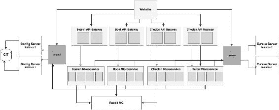

以下表格给出了项目及其监听的端口的摘要：

| 微服务 | 项目 | 端口 |
| --- | --- | --- |
| 预订微服务 | `chapter5.book` | `8060` 到 `8064` |
| 办理登机手续微服务 | `chapter5.checkin` | `8070` 到 `8074` |
| 票价微服务 | `chapter5.fares` | `8080` 到 `8084` |
| 搜索微服务 | `chapter5.search` | `8090` 到 `8094` |
| 网站客户端 | `chapter5.website` | `8001` |
| Spring Cloud Config 服务器 | `chapter5.configserver` | `8888`/`8889` |
| Spring Cloud Eureka 服务器 | `chapter5.eurekaserver` | `8761`/`8762` |
| 预订 API 网关 | `chapter5.book-apigateway` | `8095` 到 `8099` |
| 办理登机手续 API 网关 | `chapter5.checkin-apigateway` | `8075` 到 `8079` |
| 票价 API 网关 | `chapter5.fares-apigateway` | `8085` 到 `8089` |
| 搜索 API 网关 | `chapter5.search-apigateway` | `8065` 到 `8069` |

按照以下步骤进行最终运行：

1.  运行 RabbitMQ。

1.  使用根级别的 `pom.xml` 构建所有项目：

```java
mvn –Dmaven.test.skip=true clean install 

```

1.  从各自的文件夹运行以下项目。在启动下一个服务之前，请记得等待 40 到 50 秒。这将确保依赖服务在我们启动新服务之前已注册并可用：

```java
java -jar target/fares-1.0.jar
java -jar target/search-1.0.jar
java -jar target/checkin-1.0.jar
java -jar target/book-1.0.jar
java –jar target/fares-apigateway-1.0.jar
java –jar target/search-apigateway-1.0.jar
java –jar target/checkin-apigateway-1.0.jar
java –jar target/book-apigateway-1.0.jar
java -jar target/website-1.0.jar

```

1.  打开浏览器窗口，指向 `http://localhost:8001`。按照第四章中的*运行和测试项目*部分中提到的步骤进行操作，*微服务演进-案例研究*。

# 摘要

在本章中，您学习了如何使用 Spring Cloud 项目扩展十二要素 Spring Boot 微服务。然后，您学到的知识被应用到了我们在上一章中开发的 BrownField 航空公司的 PSS 微服务中。

然后，我们探讨了 Spring Config 服务器以外部化微服务的配置，以及部署高可用性的 Config 服务器的方法。我们还讨论了使用 Feign 进行声明式服务调用，研究了 Ribbon 和 Eureka 用于负载平衡、动态服务注册和发现的用法。通过实现 Zuul 来检查 API 网关的实现。最后，我们以使用 Spring Cloud Stream 进行响应式风格的微服务集成来结束。

BrownField 航空公司的 PSS 微服务现在可以在互联网规模上部署。其他 Spring Cloud 组件，如 Hyterix、Sleuth 等，将在第七章中介绍，*微服务的日志记录和监控*。下一章将演示自动缩放功能，扩展 BrownField PSS 实现。
