# 第六章：自动缩放微服务

Spring Cloud 提供了必要的支持，以便在规模上部署微服务。为了充分发挥类似云的环境的全部功能，微服务实例还应能够根据流量模式自动扩展和收缩。

本章将详细介绍如何通过有效使用从 Spring Boot 微服务收集的执行器数据来控制部署拓扑，从而使微服务能够弹性增长和收缩，并实现一个简单的生命周期管理器。

在本章结束时，您将学习以下主题：

+   自动缩放的基本概念和不同的自动缩放方法

+   在微服务的上下文中，生命周期管理器的重要性和能力

+   检查自定义生命周期管理器以实现自动缩放

+   从 Spring Boot 执行器中以编程方式收集统计信息，并将其用于控制和塑造传入流量

# 审查微服务能力模型

本章将涵盖微服务能力模型中讨论的**应用生命周期管理**能力，该能力在第三章中讨论，*应用微服务概念*，如下图所示：

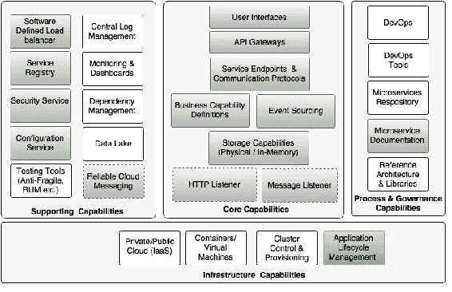

在本章中，我们将看到生命周期管理器的基本版本，这将在后续章节中得到增强。

# 使用 Spring Cloud 扩展微服务

在第五章中，*使用 Spring Cloud 扩展微服务*，您学习了如何使用 Spring Cloud 组件扩展 Spring Boot 微服务。我们实现的 Spring Cloud 的两个关键概念是自注册和自发现。这两个能力使得微服务部署自动化。通过自注册，微服务可以在实例准备好接受流量时，通过向中央服务注册表注册服务元数据来自动宣传服务的可用性。一旦微服务注册，消费者就可以通过发现注册表服务实例来从下一刻开始消费新注册的服务。注册表是这种自动化的核心。

这与传统 JEE 应用服务器采用的传统集群方法有很大不同。在 JEE 应用服务器的情况下，服务器实例的 IP 地址在负载均衡器中更多地是静态配置的。因此，在互联网规模的部署中，集群方法并不是自动缩放的最佳解决方案。此外，集群还带来其他挑战，例如它们必须在所有集群节点上具有完全相同的二进制版本。还有可能一个集群节点的故障会因节点之间的紧密依赖关系而影响其他节点。

注册表方法将服务实例解耦。它还消除了在负载均衡器中手动维护服务地址或配置虚拟 IP 的需要：

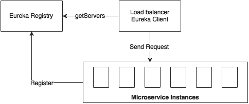

如图所示，在我们的自动化微服务部署拓扑中有三个关键组件：

+   **Eureka**是微服务注册和发现的中央注册组件。消费者和提供者都使用 REST API 来访问注册表。注册表还保存服务元数据，如服务标识、主机、端口、健康状态等。

+   **Eureka**客户端与**Ribbon**客户端一起提供客户端动态负载平衡。消费者使用 Eureka 客户端查找 Eureka 服务器，以识别目标服务的可用实例。Ribbon 客户端使用此服务器列表在可用的微服务实例之间进行负载平衡。类似地，如果服务实例停止服务，这些实例将从 Eureka 注册表中移除。负载均衡器会自动对这些动态拓扑变化做出反应。

+   第三个组件是使用 Spring Boot 开发的**微服务**实例，并启用了执行器端点。

然而，这种方法存在一个缺陷。当需要额外的微服务实例时，需要手动启动一个新实例。在理想情况下，启动和停止微服务实例也需要自动化。

例如，当需要添加另一个搜索微服务实例来处理流量增加或负载突发情况时，管理员必须手动启动一个新实例。同样，当搜索实例一段时间处于空闲状态时，需要手动将其从服务中移除，以实现最佳的基础设施使用。这在服务在按使用量付费的云环境中尤为重要。

# 理解自动扩展的概念

自动扩展是一种根据资源使用情况自动扩展实例的方法，以通过复制要扩展的服务来满足 SLA。

系统会自动检测流量增加，启动额外的实例，并使它们可用于处理流量。同样，当流量减少时，系统会自动检测并通过将活动实例从服务中收回来减少实例数量：

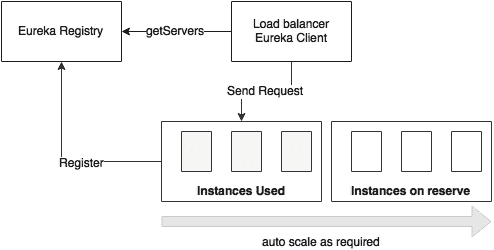

如前图所示，通常使用一组预留机器来进行自动扩展。

由于许多云订阅都是基于按使用量付费的模式，因此在针对云部署时，这是一种必要的能力。这种方法通常被称为**弹性**。它也被称为**动态资源配置和取消配置**。自动扩展是一种针对具有不同流量模式的微服务的有效方法。例如，会计服务在月末和年末流量会很高。永久预留实例来处理这些季节性负载是没有意义的。

在自动扩展方法中，通常有一个资源池，其中有一些备用实例。根据需求，实例将从资源池移动到活动状态，以满足多余的需求。这些实例没有预先标记为任何特定的微服务，也没有预先打包任何微服务二进制文件。在高级部署中，Spring Boot 二进制文件可以根据需要从 Nexus 或 Artifactory 等存储库中下载。

## 自动扩展的好处

实施自动扩展机制有许多好处。在传统部署中，管理员针对每个应用程序预留一组服务器。通过自动扩展，不再需要这种预分配。这种预分配的服务器可能导致服务器利用不足。在这种情况下，即使相邻服务需要额外的资源，空闲服务器也无法利用。

对于数百个微服务实例，为每个微服务预分配固定数量的服务器并不划算。更好的方法是为一组微服务预留一定数量的服务器实例，而不是预先分配或标记它们与微服务相关。根据需求，一组服务可以共享一组可用资源。通过这种方式，微服务可以通过最佳地利用资源在可用的服务器实例之间动态移动：

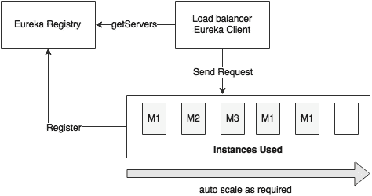

如前图所示，**M1**微服务有三个实例，**M2**有一个实例，**M3**有一个实例正在运行。还有另一台服务器保持未分配。根据需求，未分配的服务器可以用于任何微服务：**M1**、**M2**或**M3**。如果**M1**有更多的服务请求，那么未分配的实例将用于**M1**。当服务使用量下降时，服务器实例将被释放并移回池中。稍后，如果**M2**的需求增加，同一服务器实例可以使用**M2**激活。

自动扩展的一些关键好处包括：

+   **它具有高可用性和容错性**：由于存在多个服务实例，即使一个失败，另一个实例也可以接管并继续为客户提供服务。这种故障转移对消费者来说是透明的。如果此服务没有其他实例可用，自动扩展服务将识别此情况并启动另一台带有服务实例的服务器。由于启动或关闭实例的整个过程是自动的，因此服务的整体可用性将高于没有自动扩展的系统。没有自动扩展的系统需要手动干预以添加或删除服务实例，在大规模部署中将很难管理。

例如，假设有两个**预订**服务实例正在运行。如果流量增加，通常情况下，现有实例可能会过载。在大多数情况下，整套服务将被堵塞，导致服务不可用。在自动扩展的情况下，可以快速启动新的**预订**服务实例。这将平衡负载并确保服务可用性。

+   **它增加了可伸缩性**：自动扩展的关键好处之一是水平可伸缩性。自动扩展允许我们根据流量模式自动选择性地扩展或缩减服务。

+   **它具有最佳的使用和节省成本**：在按使用量付费的订阅模型中，计费是基于实际资源利用率的。采用自动扩展方法，实例将根据需求启动和关闭。因此，资源得到了最佳利用，从而节省成本。

+   **它优先考虑某些服务或服务组**：通过自动扩展，可以优先考虑某些关键交易而不是低价值交易。这将通过从低价值服务中移除实例并重新分配给高价值服务来实现。这也将消除低优先级交易在高价值交易因资源不足而受阻时大量利用资源的情况。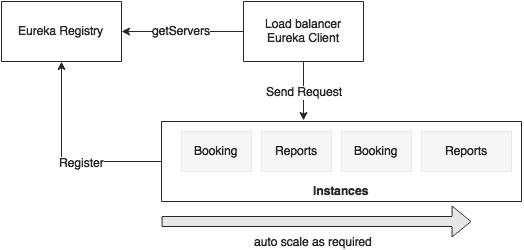

例如，**预订**和**报告**服务以两个实例运行，如前图所示。假设**预订**服务是一个收入生成服务，因此价值高于**报告**服务。如果对**预订**服务的需求更大，那么可以设置策略将一个**报告**服务从服务中移除，并释放此服务器供**预订**服务使用。

## 不同的自动扩展模型

自动扩展可以应用于应用程序级别或基础设施级别。简而言之，应用程序扩展是通过仅复制应用程序二进制文件进行扩展，而基础设施扩展是复制整个虚拟机，包括应用程序二进制文件。

### 应用程序的自动扩展

在这种情况下，扩展是通过复制微服务而不是底层基础设施（如虚拟机）来完成的。假设有一组可用于扩展微服务的 VM 或物理基础设施。这些 VM 具有基本镜像，以及诸如 JRE 之类的任何依赖项。还假设微服务在性质上是同质的。这样可以灵活地重用相同的虚拟或物理机器来运行不同的服务：

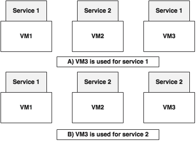

如前图所示，在**场景 A**中，**VM3**用于**Service 1**，而在**场景 B**中，相同的**VM3**用于**Service 2**。在这种情况下，我们只交换了应用程序库，而没有交换底层基础设施。

这种方法可以更快地实例化，因为我们只处理应用程序二进制文件，而不是底层的虚拟机。切换更容易更快，因为二进制文件体积较小，也不需要操作系统启动。然而，这种方法的缺点是，如果某些微服务需要操作系统级调整或使用多语言技术，那么动态交换微服务将不会有效。

### 云中的自动扩展

与前一种方法相比，在这种情况下，基础设施也是自动配置的。在大多数情况下，这将根据需求创建新的 VM 或销毁 VM：

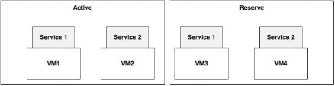

如前图所示，保留实例是作为具有预定义服务实例的 VM 映像创建的。当对**Service 1**有需求时，**VM3**被移动到活动状态。当对**Service 2**有需求时，**VM4**被移动到活动状态。

如果应用程序依赖于基础设施级别的参数和库，例如操作系统，这种方法是有效的。此外，这种方法对于多语言微服务更好。缺点是 VM 镜像的重量级和启动新 VM 所需的时间。在这种情况下，与传统的重量级虚拟机相比，轻量级容器（如 Docker）更受青睐。

## 云中的自动扩展

弹性或自动扩展是大多数云提供商的基本功能之一。云提供商使用基础设施扩展模式，如前一节所讨论的。这些通常基于一组池化的机器。

例如，在 AWS 中，这是基于引入具有预定义 AMI 的新 EC2 实例。AWS 支持使用自动扩展组来进行自动扩展。每个组都设置了最小和最大数量的实例。AWS 确保在这些范围内根据需求进行实例扩展。在可预测的流量模式下，可以根据时间表配置预配。AWS 还提供了应用程序自定义自动扩展策略的能力。

Microsoft Azure 还支持根据 CPU、消息队列长度等资源利用率进行自动扩展。IBM Bluemix 支持根据 CPU 使用率进行自动扩展。

其他 PaaS 平台，如 CloudBees 和 OpenShift，也支持 Java 应用程序的自动扩展。Pivotal Cloud Foundry 通过 Pivotal Autoscale 支持自动扩展。扩展策略通常基于资源利用率，如 CPU 和内存阈值。

有一些组件在云顶部运行，并提供细粒度的控制来处理自动扩展。Netflix Fenzo、Eucalyptus、Boxfuse 和 Mesosphere 是这一类组件中的一些。

# 自动扩展方法

自动扩展是通过考虑不同的参数和阈值来处理的。在本节中，我们将讨论通常应用于决定何时扩展或缩小的不同方法和策略。

## 根据资源约束进行扩展

这种方法是基于通过监控机制收集的实时服务指标。通常，资源扩展方法是基于机器的 CPU、内存或磁盘做出决策。也可以通过查看服务实例本身收集的统计数据来实现，比如堆内存使用情况。

典型的策略可能是当机器的 CPU 利用率超过 60%时，启动另一个实例。同样，如果堆大小超过一定阈值，我们可以添加一个新实例。资源利用率低于设定阈值时，也可以缩减计算能力。这是通过逐渐关闭服务器来实现的：

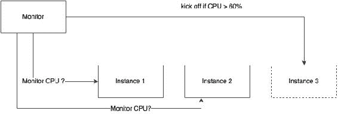

在典型的生产场景中，不会在第一次阈值违规时创建额外的服务。最合适的方法是定义一个滑动窗口或等待期。

以下是一些例子：

+   **响应滑动窗口**的一个例子是，如果特定交易的 60%响应时间在 60 秒的采样窗口中一直超过设定的阈值，就增加服务实例

+   在**CPU 滑动窗口**中，如果 CPU 利用率在 5 分钟的滑动窗口中一直超过 70%，那么会创建一个新实例

+   **异常滑动窗口**的一个例子是，如果在 60 秒的滑动窗口中有 80%的交易或连续 10 次执行导致特定系统异常，比如由于线程池耗尽而导致连接超时，那么会创建一个新的服务实例

在许多情况下，我们会将实际预期的阈值设定为较低的阈值。例如，不是将 CPU 利用率阈值设定为 80%，而是设定为 60%，这样系统有足够的时间来启动一个实例，而不会停止响应。同样，在缩减规模时，我们会使用比实际阈值更低的阈值。例如，我们将使用 40%的 CPU 利用率来缩减规模，而不是 60%。这样可以让我们有一个冷却期，以便在关闭实例时不会出现资源竞争。

基于资源的扩展也适用于服务级参数，如服务的吞吐量、延迟、应用程序线程池、连接池等。这些也可以是在应用程序级别，比如基于内部基准测试的服务实例中处理的**销售订单**数量。

## 特定时间段的扩展

基于时间的扩展是一种根据一天、一个月或一年的某些时段来扩展服务的方法，以处理季节性或业务高峰。例如，一些服务可能在办公时间内经历更多的交易，而在非办公时间内交易数量明显较少。在这种情况下，白天，服务会自动扩展以满足需求，并在非办公时间自动缩减：

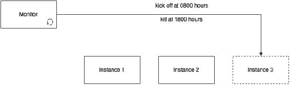

全球许多机场对夜间着陆施加限制。因此，与白天相比，夜间在机场办理登机手续的乘客数量较少。因此，在夜间减少实例数量是成本有效的。

## 基于消息队列长度的扩展

当微服务基于异步消息传递时，这种方法特别有用。在这种方法中，当队列中的消息超过一定限制时，会自动添加新的消费者：

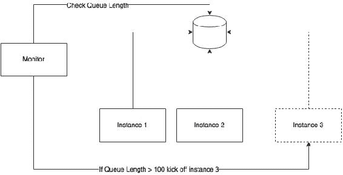

这种方法是基于竞争消费者模式。在这种情况下，一组实例用于消费消息。根据消息阈值，会添加新实例来消费额外的消息。

## 基于业务参数的扩展

在这种情况下，增加实例是基于某些业务参数的，例如，在处理**销售结束**交易之前立即启动一个新实例。一旦监控服务接收到预先配置的业务事件（例如**销售结束前 1 小时**），将会预先启动一个新实例，以预期大量交易。这将根据业务规则提供基于细粒度控制的扩展：

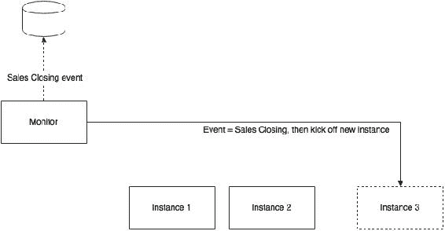

## 预测自动扩展

预测扩展是一种新的自动扩展范式，不同于传统的基于实时指标的自动扩展。预测引擎将采用多个输入，例如历史信息，当前趋势等，来预测可能的流量模式。根据这些预测进行自动扩展。预测自动扩展有助于避免硬编码规则和时间窗口。相反，系统可以自动预测这些时间窗口。在更复杂的部署中，预测分析可能使用认知计算机制来预测自动扩展。

在突发流量激增的情况下，传统的自动扩展可能无法帮助。在自动扩展组件能够对情况做出反应之前，激增已经发生并损害了系统。预测系统可以理解这些情况并在它们实际发生之前进行预测。一个例子是在计划的停机后立即处理一大堆请求。

Netflix Scryer 是这样一个系统的例子，它可以提前预测资源需求。

# 自动扩展 BrownField PSS 微服务

在本节中，我们将研究如何增强第五章中开发的微服务，*使用 Spring Cloud 扩展微服务*，以实现自动扩展。我们需要一个组件来监视某些性能指标并触发自动扩展。我们将称这个组件为**生命周期管理器**。

服务生命周期管理器或应用程序生命周期管理器负责检测扩展需求并相应地调整实例数量。它负责动态启动和关闭实例。

在本节中，我们将研究一个原始的自动扩展系统，以了解基本概念，这将在后面的章节中得到增强。

## 自动扩展系统所需的功能

典型的自动扩展系统具有以下图表中显示的功能：

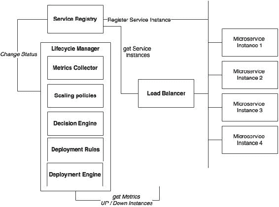

在微服务的自动扩展生态系统中涉及的组件如下所述：

+   **微服务**：这些是一组正在运行的微服务实例，它们不断发送健康和指标信息。或者，这些服务公开执行器端点以进行指标收集。在前面的图表中，这些被表示为**微服务 1**到**微服务 4**。

+   **服务注册表**：服务注册表跟踪所有服务、它们的健康状态、它们的元数据和它们的端点 URI。

+   **负载均衡器**：这是一个客户端负载均衡器，它查找服务注册表以获取有关可用服务实例的最新信息。

+   **生命周期管理器**：生命周期管理器负责自动扩展，具有以下子组件：

+   **指标收集器**：指标收集单元负责从所有服务实例收集指标。生命周期管理器将汇总这些指标。它还可以保持一个滑动时间窗口。这些指标可以是基础设施级别的指标，例如 CPU 使用率，也可以是应用程序级别的指标，例如每分钟的交易数。

+   **扩展策略**：扩展策略只是指示何时扩展和缩小微服务的一组规则，例如，在 5 分钟的滑动时间窗口内，CPU 使用率超过 60%的 90%。

+   **决策引擎**：决策引擎负责根据汇总的指标和扩展策略做出扩展或缩减的决策。

+   **部署规则**：部署引擎使用部署规则来决定部署服务时要考虑哪些参数。例如，服务部署约束可能要求实例必须分布在多个可用区域，或者服务需要至少 4GB 的内存。

+   **部署引擎**：基于决策引擎的决策，部署引擎可以启动或停止微服务实例，或通过改变服务的健康状态来更新注册表。例如，它将健康状态设置为“暂时停用”以暂时移除服务。

## 使用 Spring Boot 实现自定义生命周期管理器

本节介绍的生命周期管理器是一个最小实现，用于理解自动扩展的能力。在后面的章节中，我们将使用容器和集群管理解决方案来增强这个实现。Ansible、Marathon 和 Kubernetes 是一些有用的工具，用于构建这种能力。

在本节中，我们将使用 Spring Boot 为第五章中开发的服务实现一个应用级自动扩展组件，*使用 Spring Cloud 扩展微服务*。

## 理解部署拓扑

以下图表显示了 BrownField PSS 微服务的示例部署拓扑：

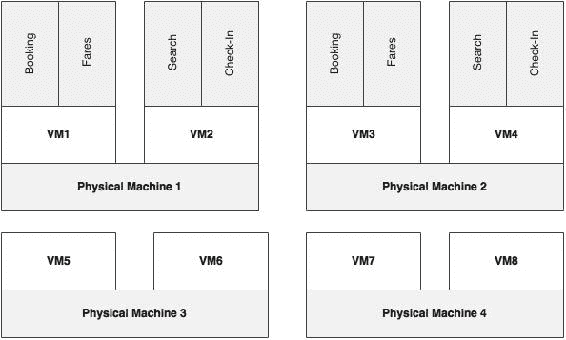

如图所示，有四台物理机器。从四台物理机器创建了八个虚拟机。每台物理机器能够承载两个虚拟机，每个虚拟机能够运行两个 Spring Boot 实例，假设所有服务具有相同的资源需求。

四台虚拟机**VM1**到**VM4**是活动的，用于处理流量。**VM5**到**VM8**被保留用于处理可扩展性。**VM5**和**VM6**可以用于任何微服务，并且也可以根据扩展需求在微服务之间切换。冗余服务使用来自不同物理机器创建的虚拟机，以提高容错性。

我们的目标是在流量增加时使用四个虚拟机**VM5**到**VM8**扩展任何服务，并在负载不足时缩减。我们解决方案的架构如下。

## 理解执行流程

请查看以下流程图：

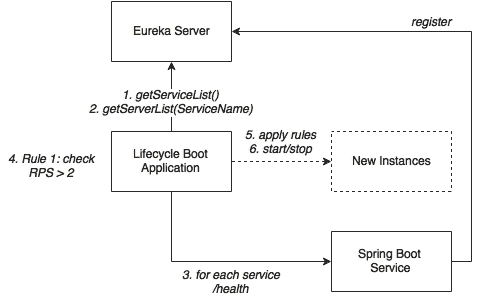

如前图所示，以下活动对我们很重要：

+   Spring Boot 服务代表了诸如搜索、预订、票价和办理登机等微服务。这些服务在启动时会自动将端点详细信息注册到 Eureka 注册表。这些服务启用了执行器，因此生命周期管理器可以从执行器端点收集指标。

+   生命周期管理器服务实际上就是另一个 Spring Boot 应用程序。生命周期管理器具有一个指标收集器，它运行一个后台作业，定期轮询 Eureka 服务器，并获取所有服务实例的详细信息。然后，指标收集器调用 Eureka 注册表中注册的每个微服务的执行器端点，以获取健康和指标信息。在真实的生产场景中，采用订阅方法进行数据收集更好。

+   通过收集的指标信息，生命周期管理器执行一系列策略，并根据这些策略决定是否扩展或缩减实例。这些决策要么是在特定虚拟机上启动特定类型的新服务实例，要么是关闭特定实例。

+   在关闭的情况下，它使用执行器端点连接到服务器，并调用关闭服务来优雅地关闭一个实例。

+   在启动新实例的情况下，生命周期管理器的部署引擎使用扩展规则并决定在哪里启动新实例以及启动实例时要使用的参数。然后，它使用 SSH 连接到相应的 VM。一旦连接，它通过传递所需的约束作为参数来执行预安装的脚本（或将此脚本作为执行的一部分）。此脚本从中央 Nexus 存储库中获取应用程序库，其中保存了生产二进制文件，并将其初始化为 Spring Boot 应用程序。端口号由生命周期管理器参数化。目标机器上需要启用 SSH。

在本例中，我们将使用**TPM**（**每分钟事务数**）或**RPM**（**每分钟请求数**）作为决策的采样指标。如果搜索服务的 TPM 超过 10，那么它将启动一个新的搜索服务实例。同样，如果 TPM 低于 2，其中一个实例将被关闭并释放回池中。

在启动新实例时，将应用以下策略：

+   任何时候的服务实例数应该至少为 1，最多为 4。这也意味着至少一个服务实例将始终处于运行状态。

+   定义了一个扩展组，以便在不同物理机器上创建一个新实例的 VM 上。这将确保服务在不同的物理机器上运行。

这些策略可以进一步增强。生命周期管理器理想情况下提供通过 REST API 或 Groovy 脚本自定义这些规则的选项。

## 生命周期管理器代码演示

我们将看一下如何实现一个简单的生命周期管理器。本节将演示代码，以了解生命周期管理器的不同组件。

### 提示

完整的源代码在代码文件中的`第六章`项目中可用。`chapter5.configserver`，`chapter5.eurekaserver`，`chapter5.search`和`chapter5.search-apigateway`分别复制并重命名为`chapter6.*`。

执行以下步骤来实现自定义生命周期管理器：

1.  创建一个新的 Spring Boot 应用程序，并将其命名为`chapter6.lifecyclemanager`。项目结构如下图所示：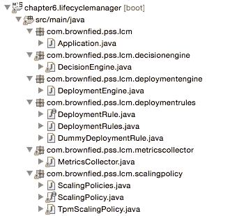

此示例的流程图如下图所示：

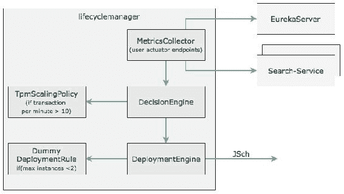

此图的组件在此处详细解释。

1.  创建一个`MetricsCollector`类，其中包含以下方法。在 Spring Boot 应用程序启动时，将使用`CommandLineRunner`调用此方法，如下所示：

```java
public void start(){
  while(true){ 
    eurekaClient.getServices().forEach(service -> {        System.out.println("discovered service "+ service);
      Map metrics = restTemplate.getForObject("http://"+service+"/metrics",Map.class);
      decisionEngine.execute(service, metrics);
    });  
  }    
}
```

前面的方法查找在 Eureka 服务器中注册的服务并获取所有实例。在现实世界中，实例应该发布指标到一个共同的地方，指标聚合将在那里发生，而不是轮询。

1.  以下的`DecisionEngine`代码接受指标并应用特定的扩展策略来确定服务是否需要扩展：

```java
  public boolean execute(String serviceId, Map metrics){
  if(scalingPolicies.getPolicy(serviceId).execute(serviceId, metrics)){    
      return deploymentEngine.scaleUp(deploymentRules.getDeploymentRules(serviceId), serviceId);  
    }
    return false;
  }
```

1.  根据服务 ID，将挑选并应用与服务相关的策略。在这种情况下，`TpmScalingPolicy`中实现了最小 TPM 扩展策略，如下所示：

```java
public class TpmScalingPolicy implements ScalingPolicy {
  public boolean execute(String serviceId, Map metrics){
    if(metrics.containsKey("gauge.servo.tpm")){
      Double tpm = (Double) metrics.get("gauge.servo.tpm");
      System.out.println("gauge.servo.tpm " + tpm);
      return (tpm > 10);
    }
    return false;
  }
}
```

1.  如果策略返回`true`，`DecisionEngine`将调用`DeploymentEngine`来启动另一个实例。`DeploymentEngine`使用`DeploymentRules`来决定如何执行扩展。规则可以强制执行最小和最大实例数，在哪个区域或机器上启动新实例，新实例所需的资源等。`DummyDeploymentRule`只需确保最大实例数不超过 2。

1.  在这种情况下，`DeploymentEngine`使用 JCraft 的**JSch**（**Java Secure Channel**）库来 SSH 到目标服务器并启动服务。这需要以下额外的 Maven 依赖项：

```java
<dependency>
    <groupId>com.jcraft</groupId>
    <artifactId>jsch</artifactId>
    <version>0.1.53</version>
</dependency>
```

1.  当前的 SSH 实现足够简单，因为我们将在未来的章节中更改它。在这个例子中，`DeploymentEngine`通过 SSH 库向目标机器发送以下命令：

```java
 String command ="java -jar -Dserver.port=8091 ./work/codebox/chapter6/chapter6.search/target/search-1.0.jar";

```

与 Nexus 的集成是通过目标机器使用带有 Nexus CLI 的 Linux 脚本或使用`curl`来完成的。在这个例子中，我们不会探索 Nexus。

1.  下一步是更改搜索微服务以公开一个新的 TPM 量规。我们必须更改之前开发的所有微服务以提交这个额外的指标。

本章我们只会检查搜索，但为了完成它，所有服务都必须更新。为了获得 `gauge.servo.tpm` 指标，我们必须在所有微服务中添加 `TPMCounter`。

以下代码计算了一个滑动窗口内的交易次数：

```java
class TPMCounter {
  LongAdder count;
  Calendar expiry = null; 
  TPMCounter(){
    reset();
  }  
  void reset (){
    count = new LongAdder();
    expiry = Calendar.getInstance();
    expiry.add(Calendar.MINUTE, 1);
  }
  boolean isExpired(){
    return Calendar.getInstance().after(expiry);
  }
  void increment(){
     if(isExpired()){
       reset();
     }
     count.increment();
  }
}
```

1.  以下代码需要添加到`SearchController`中以设置`tpm`值：

```java
class SearchRestController {
  TPMCounter tpm = new TPMCounter();
  @Autowired
  GaugeService gaugeService;
   //other code 
```

1.  以下代码来自`SearchRestController`的 get REST 端点（搜索方法），它将`tpm`值作为量规提交给执行器端点：

```java
tpm.increment();
gaugeService.submit("tpm", tpm.count.intValue()); 
```

## 运行生命周期管理器

执行以下步骤来运行前一节中开发的生命周期管理器：

1.  编辑`DeploymentEngine.java`并更新密码以反映机器的密码，如下所示。这是 SSH 连接所需的：

```java
session.setPassword("rajeshrv");
```

1.  通过从根文件夹（`第六章`）运行 Maven 来构建所有项目，使用以下命令：

```java
mvn -Dmaven.test.skip=true clean install

```

1.  然后，按以下方式运行 RabbitMQ：

```java
./rabbitmq-server

```

1.  确保配置服务器指向正确的配置存储库。我们需要为生命周期管理器添加一个属性文件。

1.  从各自的项目文件夹运行以下命令：

```java
java -jar target/config-server-0.0.1-SNAPSHOT.jar
java -jar target/eureka-server-0.0.1-SNAPSHOT.jar
java -jar target/lifecycle-manager-0.0.1-SNAPSHOT.jar
java -jar target/search-1.0.jar
java -jar target/search-apigateway-1.0.jar
java -jar target/website-1.0.jar

```

1.  一旦所有服务都启动了，打开浏览器窗口并加载 `http://localhost:8001`。

1.  连续执行 11 次航班搜索，在一分钟内依次执行。这将触发决策引擎实例化搜索微服务的另一个实例。

1.  打开 Eureka 控制台（`http://localhost:8761`）并观察第二个**SEARCH-SERVICE**。一旦服务器启动，实例将如下所示出现：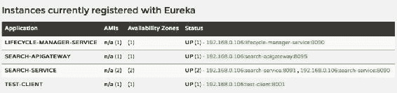

# 摘要

在本章中，您了解了在部署大规模微服务时自动缩放的重要性。

我们还探讨了自动缩放的概念以及自动缩放的不同模型和方法，例如基于时间、基于资源、基于队列长度和预测性的方法。然后我们审查了生命周期管理器在微服务环境中的作用并审查了它的能力。最后，我们通过审查一个简单的自定义生命周期管理器的示例实现来结束本章，该示例是在 BrownField PSS 微服务环境中。

自动缩放是处理大规模微服务时所需的重要支持能力。我们将在第九章中讨论生命周期管理器的更成熟的实现，*使用 Mesos 和 Marathon 管理 Docker 化的微服务*。

下一章将探讨对于成功的微服务部署至关重要的日志记录和监控能力。
