# 第七章：微服务的日志记录和监控

由于互联网规模微服务部署的分布式特性，最大的挑战之一是对单个微服务进行日志记录和监控。通过相关不同微服务发出的日志来跟踪端到端事务是困难的。与单片应用程序一样，没有单一的监控窗格来监视微服务。

本章将介绍微服务部署中日志记录和监控的必要性和重要性。本章还将进一步探讨解决日志记录和监控的挑战和解决方案，涉及多种潜在的架构和技术。

通过本章结束时，您将了解以下内容：

+   日志管理的不同选项、工具和技术

+   在跟踪微服务中使用 Spring Cloud Sleuth

+   微服务端到端监控的不同工具

+   使用 Spring Cloud Hystrix 和 Turbine 进行电路监控

+   使用数据湖来实现业务数据分析

# 审查微服务能力模型

在本章中，我们将从第三章中讨论的微服务能力模型中探讨以下微服务能力：

+   **中央日志管理**

+   **监控和仪表板**

+   **依赖管理**（监控和仪表板的一部分）

+   **数据湖**

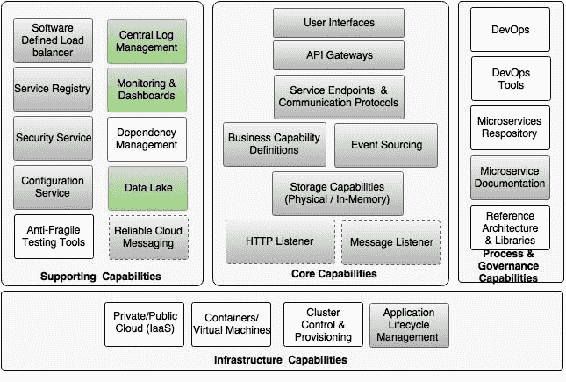

# 了解日志管理的挑战

日志只是来自运行进程的事件流。对于传统的 JEE 应用程序，有许多框架和库可用于日志记录。Java Logging（JUL）是 Java 本身提供的一个选项。Log4j、Logback 和 SLF4J 是其他一些流行的日志记录框架。这些框架支持 UDP 和 TCP 协议进行日志记录。应用程序将日志条目发送到控制台或文件系统。通常采用文件回收技术来避免日志填满所有磁盘空间。

日志处理的最佳实践之一是在生产环境中关闭大部分日志条目，因为磁盘 IO 的成本很高。磁盘 IO 不仅会减慢应用程序的速度，还会严重影响可伸缩性。将日志写入磁盘还需要高磁盘容量。磁盘空间不足的情况可能导致应用程序崩溃。日志框架提供了在运行时控制日志以限制打印内容的选项。这些框架大多提供对日志控制的细粒度控制。它们还提供在运行时更改这些配置的选项。

另一方面，如果适当分析，日志可能包含重要信息并具有很高的价值。因此，限制日志条目基本上限制了我们理解应用程序行为的能力。

从传统部署到云部署后，应用程序不再锁定到特定的预定义机器。虚拟机和容器不是与应用程序硬连接的。用于部署的机器可能会不时更改。此外，诸如 Docker 之类的容器是短暂的。这基本上意味着不能依赖磁盘的持久状态。一旦容器停止并重新启动，写入磁盘的日志就会丢失。因此，我们不能依赖本地机器的磁盘来写入日志文件。

正如我们在第一章中讨论的那样，*解密微服务*，十二要素应用程序的原则之一是避免应用程序自身路由或存储日志文件。在微服务的情况下，它们将在隔离的物理或虚拟机上运行，导致日志文件分散。在这种情况下，几乎不可能跟踪跨多个微服务的端到端事务：

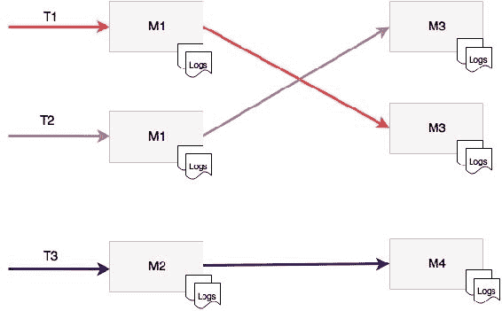

如图所示，每个微服务都会向本地文件系统发出日志。在这种情况下，微服务 M1 调用 M3。这些服务将它们的日志写入自己的本地文件系统。这使得难以关联和理解端到端的事务流。此外，如图所示，有两个 M1 的实例和两个 M2 的实例在两台不同的机器上运行。在这种情况下，很难实现对服务级别的日志聚合。

# 集中式日志解决方案

为了解决前面提到的挑战，传统的日志解决方案需要认真重新思考。新的日志解决方案除了解决前面提到的挑战外，还应该支持以下总结的能力：

+   能够收集所有日志消息并对其进行分析

+   能够关联和跟踪端到端的交易

+   能够保留日志信息以进行趋势分析和预测的更长时间段

+   消除对本地磁盘系统的依赖能力

+   能够聚合来自多个来源的日志信息，如网络设备、操作系统、微服务等

解决这些问题的方法是集中存储和分析所有日志消息，而不管日志的来源是什么。新日志解决方案采用的基本原则是将日志存储和处理与服务执行环境分离。与在微服务执行环境中存储和处理大量日志消息相比，大数据解决方案更适合存储和处理大量日志消息。

在集中式日志解决方案中，日志消息将从执行环境发货到中央大数据存储。日志分析和处理将使用大数据解决方案进行处理：

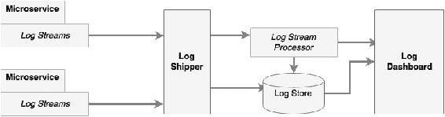

如前面的逻辑图所示，集中式日志解决方案中有许多组件，如下所示：

+   日志流：这些是源系统输出的日志消息流。源系统可以是微服务、其他应用程序，甚至是网络设备。在典型的基于 Java 的系统中，这相当于流式处理 Log4j 日志消息。

+   日志发货人：日志发货人负责收集来自不同来源或端点的日志消息。然后，日志发货人将这些消息发送到另一组端点，例如写入数据库，推送到仪表板，或将其发送到流处理端点进行进一步的实时处理。

+   日志存储：日志存储是存储所有日志消息以进行实时分析、趋势分析等的地方。通常，日志存储是一个能够处理大数据量的 NoSQL 数据库，例如 HDFS。

+   日志流处理器：日志流处理器能够分析实时日志事件以进行快速决策。流处理器会采取行动，如向仪表板发送信息、发送警报等。在自愈系统的情况下，流处理器甚至可以采取行动来纠正问题。

+   日志仪表板：仪表板是用于显示日志分析结果的单一窗格，如图表和图形。这些仪表板是为运营和管理人员准备的。

这种集中式方法的好处是没有本地 I/O 或阻塞磁盘写入。它也不使用本地机器的磁盘空间。这种架构在根本上类似于大数据处理的 Lambda 架构。

### 注意

要了解更多关于 Lambda 架构的信息，请访问[`lambda-architecture.net`](http://lambda-architecture.net)。

每条日志消息中都需要有上下文、消息和关联 ID。上下文通常包括时间戳、IP 地址、用户信息、进程详细信息（如服务、类和函数）、日志类型、分类等。消息将是简单的自由文本信息。关联 ID 用于建立服务调用之间的链接，以便跨微服务的调用可以被追踪。

# 日志解决方案的选择

有多种选择可用于实现集中式日志记录解决方案。这些解决方案使用不同的方法、架构和技术。重要的是要了解所需的功能，并选择满足需求的正确解决方案。

## 云服务

有许多云日志服务可用，例如 SaaS 解决方案。

Loggly 是最受欢迎的基于云的日志服务之一。Spring Boot 微服务可以使用 Loggly 的 Log4j 和 Logback appender 直接将日志消息流式传输到 Loggly 服务中。

如果应用程序或服务部署在 AWS 上，AWS CloudTrail 可以与 Loggly 集成进行日志分析。

Papertrial、Logsene、Sumo Logic、Google Cloud Logging 和 Logentries 是其他基于云的日志解决方案的例子。

云日志服务通过提供简单易集成的服务，消除了管理复杂基础设施和大型存储解决方案的开销。然而，在选择云日志服务时，延迟是需要考虑的关键因素之一。

## 现成的解决方案

有许多专门设计的工具，可以在本地数据中心或云中安装，提供端到端的日志管理功能。

Graylog 是流行的开源日志管理解决方案之一。Graylog 使用 Elasticsearch 进行日志存储，使用 MongoDB 作为元数据存储。Graylog 还使用 GELF 库进行 Log4j 日志流式传输。

Splunk 是一种流行的商业工具，用于日志管理和分析。与其他解决方案使用日志流式传输相比，Splunk 使用日志文件传输方法来收集日志。

## 最佳集成

最后一种方法是选择最佳的组件并构建自定义的日志解决方案。

### 日志收集器

有一些日志收集器可以与其他工具结合使用，构建端到端的日志管理解决方案。不同的日志收集工具之间的功能有所不同。

Logstash 是一个强大的数据管道工具，可用于收集和传输日志文件。Logstash 充当代理，提供一种接受来自不同来源的流数据并将其同步到不同目的地的机制。Log4j 和 Logback appender 也可以用于将日志消息直接从 Spring Boot 微服务发送到 Logstash。Logstash 的另一端连接到 Elasticsearch、HDFS 或任何其他数据库。

Fluentd 是另一个与 Logstash 非常相似的工具，Logspout 也是如此，但后者更适合基于 Docker 容器的环境。

### 日志流处理器

流处理技术可选择用于即时处理日志流。例如，如果 404 错误持续作为对特定服务调用的响应发生，这意味着服务出现了问题。这种情况必须尽快处理。在这种情况下，流处理器非常有用，因为它们能够对传统的反应式分析无法处理的某些事件流做出反应。

用于流处理的典型架构是将 Flume 和 Kafka 与 Storm 或 Spark Streaming 结合在一起。Log4j 具有 Flume appender，用于收集日志消息。这些消息被推送到分布式 Kafka 消息队列中。流处理器从 Kafka 收集数据，并在发送到 Elasticsearch 和其他日志存储之前即时处理它们。

Spring Cloud Stream、Spring Cloud Stream 模块和 Spring Cloud Data Flow 也可用于构建日志流处理。

### 日志存储

实时日志消息通常存储在 Elasticsearch 中。Elasticsearch 允许客户端基于文本索引进行查询。除了 Elasticsearch，HDFS 也常用于存储归档的日志消息。MongoDB 或 Cassandra 用于存储月度聚合交易计数等摘要数据。离线日志处理可以使用 Hadoop 的 MapReduce 程序来完成。

### 仪表板

中央日志解决方案所需的最后一部分是仪表板。用于日志分析的最常用的仪表板是基于 Elasticsearch 数据存储的 Kibana。Graphite 和 Grafana 也用于显示日志分析报告。

## 自定义日志实现

之前提到的工具可以用来构建自定义端到端的日志解决方案。自定义日志管理最常用的架构是 Logstash、Elasticsearch 和 Kibana 的组合，也称为 ELK 堆栈。

### 注意

本章的完整源代码可在代码文件的“第七章”项目下找到。将`chapter5.configserver`、`chapter5.eurekaserver`、`chapter5.search`、`chapter5.search-apigateway`和`chapter5.website`复制到一个新的 STS 工作空间中，并将它们重命名为`chapter7.*`。

以下图显示了日志监控流程：

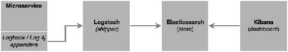

在本节中，将研究使用 ELK 堆栈的自定义日志解决方案的简单实现。

按照以下步骤实现用于日志记录的 ELK 堆栈：

1.  从[`www.elastic.co`](https://www.elastic.co)下载并安装 Elasticsearch、Kibana 和 Logstash。

1.  更新 Search 微服务（chapter7.search）。审查并确保 Search 微服务中有一些日志语句。日志语句并不特别，只是使用`slf4j`进行简单的日志记录。

```java
import org.slf4j.Logger;
import org.slf4j.LoggerFactory;
  //other code goes here
  private static final Logger logger = LoggerFactory.getLogger(SearchRestController.class);
//other code goes here

logger.info("Looking to load flights...");
for (Flight flight : flightRepository.findByOriginAndDestinationAndFlightDate("NYC", "SFO", "22-JAN-16")) {
      logger.info(flight.toString());
}
```

1.  在 Search 服务的`pom.xml`文件中添加`logstash`依赖项，以将`logback`集成到 Logstash 中，如下所示：

```java
<dependency>
  <groupId>net.logstash.logback</groupId>
  <artifactId>logstash-logback-encoder</artifactId>
  <version>4.6</version>
</dependency>
```

1.  此外，通过以下行将`logback`版本降级以与 Spring 1.3.5.RELEASE 兼容：

```java
<logback.version>1.1.6</logback.version>
```

1.  覆盖默认的 Logback 配置。可以通过在`src/main/resources`下添加一个新的`logback.xml`文件来完成，如下所示：

```java
<?xml version="1.0" encoding="UTF-8"?>
<configuration>
    <include resource="org/springframework/boot/logging/logback/defaults.xml"/>
  <include resource="org/springframework/boot/logging/logback/console-appender.xml" />
    <appender name="stash" class="net.logstash.logback.appender.LogstashTcpSocketAppender">
        <destination>localhost:4560</destination>
        <!-- encoder is required -->
        <encoder class="net.logstash.logback.encoder.LogstashEncoder" />
    </appender>
  <root level="INFO">
    <appender-ref ref="CONSOLE" />
    <appender-ref ref="stash" />
  </root>
</configuration>
```

前面的配置通过添加一个新的 TCP 套接字`appender`来覆盖默认的 Logback 配置，该套接字将所有日志消息流式传输到在端口`4560`上监听的 Logstash 服务。重要的是要添加一个编码器，如前面的配置中所述。

1.  创建如下代码所示的配置，并将其存储在`logstash.conf`文件中。该文件的位置不重要，因为在启动 Logstash 时将作为参数传递。此配置将从在`4560`端口上监听的套接字接收输入，并将输出发送到在`9200`端口上运行的 Elasticsearch。 `stdout`是可选的，并设置为 debug：

```java
input {
  tcp {
     port => 4560
     host => localhost
  }
}
output {
elasticsearch { hosts => ["localhost:9200"] }
  stdout { codec => rubydebug }
}
```

1.  从各自的安装文件夹运行 Logstash、Elasticsearch 和 Kibana，如下所示：

```java
./bin/logstash -f logstash.conf
./bin/elasticsearch
./bin/kibana

```

1.  运行 Search 微服务。这将调用单元测试用例，并导致打印前面提到的日志语句。

1.  转到浏览器，访问 Kibana，网址为`http://localhost:5601`。

1.  转到“Settings” | “Configure an index pattern”，如下所示：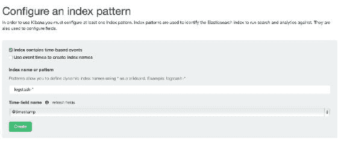

1.  转到“Discover”菜单查看日志。如果一切顺利，我们将看到 Kibana 截图如下。请注意，日志消息显示在 Kibana 屏幕上。

Kibana 提供了开箱即用的功能，可以使用日志消息构建摘要图表和图形：

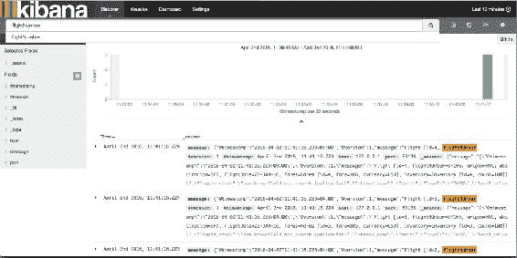

## 使用 Spring Cloud Sleuth 进行分布式跟踪

前一节通过集中日志数据解决了微服务的分布式和碎片化日志问题。通过集中的日志解决方案，我们可以将所有日志存储在一个中央位置。然而，要跟踪端到端的事务仍然几乎是不可能的。为了进行端到端跟踪，跨越微服务的事务需要有一个相关 ID。

Twitter 的 Zipkin、Cloudera 的 HTrace 和 Google 的 Dapper 系统是分布式跟踪系统的例子。Spring Cloud 使用 Spring Cloud Sleuth 库在这些系统之上提供了一个包装组件。

分布式跟踪使用**跨度**和**跟踪**的概念。跨度是一个工作单元；例如，调用一个服务由一个 64 位的跨度 ID 标识。一组跨度形成一个类似树状结构的跟踪。使用跟踪 ID，可以跟踪端到端的调用：

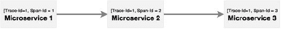

如图所示，**微服务 1**调用**微服务 2**，**微服务 2**调用**微服务 3**。在这种情况下，如图所示，相同的跟踪 ID 在所有微服务之间传递，可以用来跟踪端到端的事务。

为了演示这一点，我们将使用搜索 API 网关和搜索微服务。必须在搜索 API 网关（`chapter7.search-apigateway`）中添加一个新的端点，该端点在内部调用搜索服务以返回数据。如果没有跟踪 ID，几乎不可能追踪或链接来自网站到搜索 API 网关到搜索微服务的调用。在这种情况下，只涉及两到三个服务，而在复杂的环境中，可能有许多相互依赖的服务。

按照以下步骤使用 Sleuth 创建示例：

1.  更新搜索和搜索 API 网关。在此之前，需要将 Sleuth 依赖项添加到各自的 POM 文件中，可以通过以下代码完成：

```java
<dependency>
  <groupId>org.springframework.cloud</groupId>
  <artifactId>spring-cloud-starter-sleuth</artifactId>
</dependency>
```

1.  在构建新服务的情况下，选择**Sleuth**和**Web**，如下所示：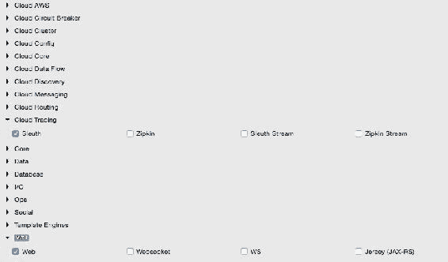

1.  在搜索服务以及 Logback 配置中添加 Logstash 依赖，如前面的示例所示。

1.  接下来是在 Logback 配置中添加两个属性：

```java
<property name="spring.application.name" value="search-service"/>
<property name="CONSOLE_LOG_PATTERN" value="%d{yyyy-MM-dd HH:mm:ss.SSS} [${spring.application.name}] [trace=%X{X-Trace-Id:-},span=%X{X-Span-Id:-}] [%15.15t] %-40.40logger{39}: %m%n"/>
```

第一个属性是应用程序的名称。在这里给出的名称是服务 ID：在搜索和搜索 API 网关中分别是`search-service`和`search-apigateway`。第二个属性是一个可选的模式，用于打印带有跟踪 ID 和跨度 ID 的控制台日志消息。前面的改变需要应用到两个服务中。

1.  在 Spring Boot 应用程序类中添加以下代码片段，以指示 Sleuth 何时开始一个新的跨度 ID。在这种情况下，使用`AlwaysSampler`表示每次调用服务时都必须创建跨度 ID。这个改变需要应用在两个服务中：

```java
  @Bean
    public AlwaysSampler defaultSampler() {
      return new AlwaysSampler();
    }
```

1.  在搜索 API 网关中添加一个新的端点，该端点将调用搜索服务，如下所示。这是为了演示跟踪 ID 在多个微服务之间的传播。网关中的这个新方法通过调用搜索服务返回机场的操作中心，如下所示：

```java
  @RequestMapping("/hubongw")
  String getHub(HttpServletRequest req){
    logger.info("Search Request in API gateway for getting Hub, forwarding to search-service ");
    String hub = restTemplate.getForObject("http://search-service/search/hub", String.class);
    logger.info("Response for hub received,  Hub "+ hub);
    return hub; 
  }
```

1.  在搜索服务中添加另一个端点，如下所示：

```java
  @RequestMapping("/hub")
  String getHub(){
    logger.info("Searching for Hub, received from search-apigateway ");
    return "SFO"; 
  }
```

1.  添加后，运行两个服务。使用浏览器（`http://localhost:8095/hubongw`）在网关的新中心（`/hubongw`）端点上进行访问。

如前所述，搜索 API 网关服务运行在`8095`上，搜索服务运行在`8090`上。

1.  查看控制台日志以查看打印的跟踪 ID 和跨度 ID。第一个打印来自搜索 API 网关，第二个来自搜索服务。请注意，在这两种情况下，跟踪 ID 都是相同的，如下所示：

```java
2016-04-02 17:24:37.624 [search-apigateway] [trace=8a7e278f-7b2b-43e3-a45c-69d3ca66d663,span=8a7e278f-7b2b-43e3-a45c-69d3ca66d663] [io-8095-exec-10] c.b.p.s.a.SearchAPIGatewayController    : Response for hub received,  Hub DXB

2016-04-02 17:24:37.612 [search-service] [trace=8a7e278f-7b2b-43e3-a45c-69d3ca66d663,span=fd309bba-5b4d-447f-a5e1-7faaab90cfb1] [nio-8090-exec-1] c.b.p.search.component.SearchComponent  : Searching for Hub, received from search-apigateway
```

1.  打开 Kibana 控制台并使用控制台中打印的跟踪 ID 搜索跟踪 ID。在这种情况下，它是 `8a7e278f-7b2b-43e3-a45c-69d3ca66d663`。如下面的截图所示，使用跟踪 ID，可以跟踪跨多个服务的服务调用: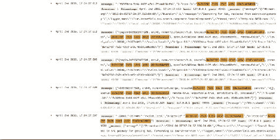

# 监控微服务

微服务是真正的分布式系统，具有流动的部署拓扑。如果没有复杂的监控系统，运维团队可能会在管理大规模微服务时遇到麻烦。传统的单片应用部署仅限于已知服务、实例、机器等。这比可能在不同机器上运行的大量微服务实例更容易管理。更复杂的是，这些服务会动态改变其拓扑。集中式日志记录能力只解决了问题的一部分。运维团队了解运行时部署拓扑和系统行为至关重要。这需要比集中式日志记录更多的东西。

一般应用程序监控更多是一组指标、聚合和它们对某些基线值的验证。如果有服务级别的违规，监控工具会生成警报并将其发送给管理员。对于数百甚至数千个相互连接的微服务，传统的监控实际上并没有真正提供真正的价值。在大规模微服务中实现一刀切的监控或使用单一视图监控所有东西并不容易实现。

微服务监控的主要目标之一是从用户体验的角度了解系统的行为。这将确保端到端的行为是一致的，并符合用户的预期。

## 监控挑战

与分散的日志记录问题类似，监控微服务的关键挑战在于微服务生态系统中有许多移动部分。

典型问题总结如下:

+   统计数据和指标分散在许多服务、实例和机器中。

+   可能会使用异构技术来实现微服务，这使得事情变得更加复杂。单一的监控工具可能无法提供所有所需的监控选项。

+   微服务部署拓扑是动态的，无法预先配置服务器、实例和监控参数。

许多传统监控工具适用于监控单片应用程序，但在监控大规模、分布式、相互关联的微服务系统方面表现不佳。许多传统监控系统是基于代理的，需要在目标机器或应用程序实例上预先安装代理。这带来了两个挑战:

+   如果代理需要与服务或操作系统进行深度集成，那么在动态环境中将很难管理。

+   如果这些工具在监控或为应用程序进行仪器化时增加了开销，可能会导致性能问题

许多传统工具需要基线指标。这些系统使用预设规则，例如如果 CPU 利用率超过 60% 并保持在这个水平 2 分钟，那么应该向管理员发送警报。在大规模的互联网部署中，预先配置这些值非常困难。

新一代的监控应用程序通过自学习应用程序的行为并设置自动阈值值。这使管理员免于进行这种乏味的任务。自动基线有时比人类预测更准确:

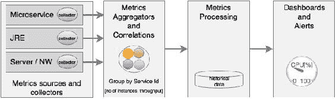

如图所示，微服务监控的关键领域包括:

+   **指标来源和数据收集器**：在源头进行指标收集，可以通过服务器将指标信息推送到中央收集器，也可以通过嵌入轻量级代理来收集信息。数据收集器从不同来源收集监控指标，如网络、物理机器、容器、软件组件、应用程序等。挑战在于使用自动发现机制而不是静态配置来收集这些数据。

这可以通过在源机器上运行代理、从源头流式传输数据或定期轮询来完成。

+   **指标的聚合和关联**：需要聚合能力来聚合从不同来源收集的指标，如用户交易、服务、基础设施、网络等。聚合可能具有挑战性，因为它需要一定程度上理解应用程序的行为，如服务依赖关系、服务分组等。在许多情况下，这些是根据来源提供的元数据自动制定的。

通常，这是由一个中间人接受指标来完成的。

+   **处理指标和可操作见解**：一旦数据被聚合，下一步就是进行测量。通常使用设定的阈值进行测量。在新一代监控系统中，这些阈值是自动发现的。监控工具然后分析数据并提供可操作的见解。

这些工具可能使用大数据和流分析解决方案。

+   **警报、操作和仪表板**：一旦发现问题，就必须通知相关人员或系统。与传统系统不同，微服务监控系统应能够实时采取行动。积极的监控对于实现自愈至关重要。仪表板用于显示 SLA、KPI 等。

仪表板和警报工具能够满足这些要求。

微服务监控通常有三种方法。实际上，需要结合这些方法才能有效监控：

+   **应用性能监控**（**APM**）：这更多地是一种传统的系统指标收集、处理、警报和仪表板呈现的方法。这些更多来自系统的角度。应用拓扑发现和可视化是许多 APM 工具实施的新功能。不同 APM 提供商之间的能力有所不同。

+   **合成监控**：这是一种技术，用于使用在生产环境或类似生产环境中的多个测试场景进行端到端交易来监控系统的行为。收集数据以验证系统的行为和潜在热点。合成监控还有助于了解系统的依赖关系。

+   **实时用户监控**（**RUM**）或**用户体验监控**：这通常是一个基于浏览器的软件，记录真实用户的统计数据，如响应时间、可用性和服务水平。对于微服务，由于发布周期更频繁、拓扑结构更动态，用户体验监控更为重要。

## 监控工具

有许多工具可用于监控微服务。许多工具之间也存在重叠。监控工具的选择实际上取决于需要监控的生态系统。在大多数情况下，需要多个工具来监控整个微服务生态系统。

本节的目标是让我们熟悉一些常见的微服务友好的监控工具：

+   AppDynamics、Dynatrace 和 New Relic 是 Gartner Magic Quadrant 2015 年 APM 领域的顶级商业供应商。这些工具对微服务友好，可以在单个控制台中有效支持微服务监控。Ruxit、Datadog 和 Dataloop 是其他专为基本上友好的分布式系统而构建的商业产品。多个监控工具可以使用插件向 Datadog 提供数据。

+   云供应商都有自己的监控工具，但在许多情况下，这些监控工具本身可能不足以进行大规模微服务监控。例如，AWS 使用 CloudWatch，Google Cloud Platform 使用 Cloud Monitoring 来收集来自各种来源的信息。

+   一些数据收集库，如 Zabbix、statd、collectd、jmxtrans 等，以较低的级别收集运行时统计数据、指标、量规和计数。通常，这些信息被馈送到数据收集器和处理器，如 Riemann、Datadog 和 Librato，或者仪表板，如 Graphite。

+   Spring Boot Actuator 是收集微服务指标、量规和计数的好工具，正如我们在《使用 Spring Boot 构建微服务》的第二章中讨论的那样。Netflix Servo 是一种类似于 Actuator 的度量收集器，QBit 和 Dropwizard 度量也属于同一类度量收集器。所有这些度量收集器都需要聚合器和仪表板来促进全尺寸监控。

+   通过日志进行监控是一种流行但不太有效的微服务监控方法。在这种方法中，正如在前一节中讨论的那样，日志消息从各种来源（如微服务、容器、网络等）传送到一个中央位置。然后，我们可以使用日志文件来跟踪交易、识别热点等。Loggly、ELK、Splunk 和 Trace 是这一领域的候选者。

+   Sensu 是开源社区中用于微服务监控的流行选择。Weave Scope 是另一个工具，主要针对容器化部署。Spigo 是一个专为微服务监控系统，与 Netflix 堆栈紧密结合。

+   Pingdom、New Relic Synthetics、Runscope、Catchpoint 等提供了在实时系统上进行合成交易监控和用户体验监控的选项。

+   Circonus 更多地被归类为 DevOps 监控工具，但也可以进行微服务监控。Nagios 是一种流行的开源监控工具，但更多地属于传统的监控系统。

+   Prometheus 提供了一个时间序列数据库和可视化 GUI，可用于构建自定义监控工具。

## 监控微服务的依赖关系

当有大量具有依赖关系的微服务时，重要的是要有一个监控工具，可以显示微服务之间的依赖关系。静态配置和管理这些依赖关系并不是一种可扩展的方法。有许多有用的工具可以监控微服务的依赖关系，如下所示：

+   像 AppDynamics、Dynatrace 和 New Relic 这样的监控工具可以绘制微服务之间的依赖关系。端到端事务监控也可以跟踪事务依赖关系。其他监控工具，如 Spigo，也对微服务依赖管理很有用。

+   CMDB 工具，如 Device42 或专门的工具，如 Accordance，对于管理微服务的依赖关系非常有用。Veritas Risk Advisor（VRA）也对基础设施发现非常有用。

+   使用图形数据库（如 Neo4j）进行自定义实现也是有用的。在这种情况下，微服务必须预先配置其直接和间接的依赖关系。在服务启动时，它会发布并与 Neo4j 数据库交叉检查其依赖关系。

## Spring Cloud Hystrix 用于容错微服务

本节将探讨 Spring Cloud Hystrix 作为一种容错和延迟容忍微服务实现的库。Hystrix 基于*失败快速*和*快速恢复*原则。如果服务出现问题，Hystrix 有助于隔离它。它通过回退到另一个预先配置的回退服务来快速恢复。Hystrix 是 Netflix 的另一个经过实战检验的库。Hystrix 基于断路器模式。

### 注意

在[`msdn.microsoft.com/en-us/library/dn589784.aspx`](https://msdn.microsoft.com/en-us/library/dn589784.aspx)上阅读有关断路器模式的更多信息。

在本节中，我们将使用 Spring Cloud Hystrix 构建一个断路器。执行以下步骤来更改 Search API Gateway 服务，以将其与 Hystrix 集成：

1.  更新 Search API Gateway 服务。为服务添加 Hystrix 依赖项。如果从头开始开发，请选择以下库：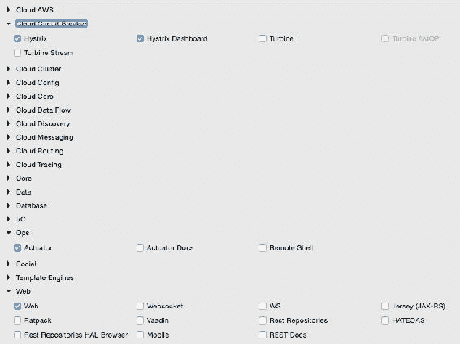

1.  在 Spring Boot 应用程序类中，添加`@EnableCircuitBreaker`。这个命令将告诉 Spring Cloud Hystrix 为这个应用程序启用断路器。它还公开了用于指标收集的`/hystrix.stream`端点。

1.  为 Search API Gateway 服务添加一个组件类，其中包含一个方法；在这种情况下，这是用`@HystrixCommand`注释的`getHub`。这告诉 Spring 这个方法容易失败。Spring Cloud 库包装这些方法以处理容错和延迟容忍，通过启用断路器。Hystrix 命令通常跟随一个回退方法。在失败的情况下，Hystrix 会自动启用提到的回退方法，并将流量转移到回退方法。如下面的代码所示，在这种情况下，`getHub`将回退到`getDefaultHub`：

```java
@Component  
class SearchAPIGatewayComponent { 
  @LoadBalanced
  @Autowired 
  RestTemplate restTemplate;

  @HystrixCommand(fallbackMethod = "getDefaultHub")
  public String getHub(){
    String hub = restTemplate.getForObject("http://search-service/search/hub", String.class);
    return hub;
  }
  public String getDefaultHub(){
    return "Possibily SFO";
  }
}
```

1.  `SearchAPIGatewayController`的`getHub`方法调用`SearchAPIGatewayComponent`的`getHub`方法，如下所示：

```java
@RequestMapping("/hubongw") 
String getHub(){
  logger.info("Search Request in API gateway for getting Hub, forwarding to search-service ");
  return component.getHub(); 
}
```

1.  这个练习的最后一部分是构建一个 Hystrix 仪表板。为此，构建另一个 Spring Boot 应用程序。在构建此应用程序时，包括 Hystrix、Hystrix 仪表板和执行器。

1.  在 Spring Boot 应用程序类中，添加`@EnableHystrixDashboard`注释。

1.  启动 Search 服务、Search API Gateway 和 Hystrix 仪表板应用程序。将浏览器指向 Hystrix 仪表板应用程序的 URL。在本例中，Hystrix 仪表板在端口`9999`上启动。因此，打开 URL`http://localhost:9999/hystrix`。

1.  将显示类似于以下屏幕截图的屏幕。在 Hystrix 仪表板中，输入要监视的服务的 URL。

在这种情况下，Search API Gateway 正在端口`8095`上运行。因此，`hystrix.stream`的 URL 将是`http://localhost:8095/hytrix.stream`，如下所示：

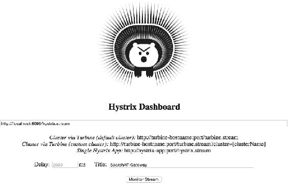

1.  Hystrix 仪表板将显示如下：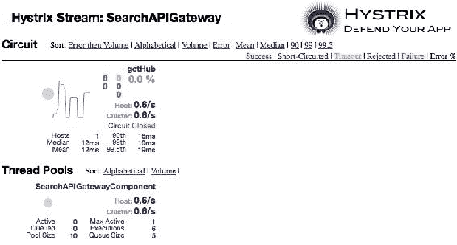

### 提示

请注意，至少必须执行一个事务才能看到显示。这可以通过访问`http://localhost:8095/hubongw`来实现。

1.  通过关闭 Search 服务创建一个故障场景。请注意，当访问 URL`http://localhost:8095/hubongw`时，将调用回退方法。

1.  如果连续失败，则断路器状态将更改为打开。这可以通过多次访问上述 URL 来实现。在打开状态下，原始服务将不再被检查。Hystrix 仪表板将显示断路器的状态为**打开**，如下面的屏幕截图所示。一旦断路器打开，系统将定期检查原始服务的状态以进行恢复。当原始服务恢复时，断路器将恢复到原始服务，并且状态将设置为**关闭**：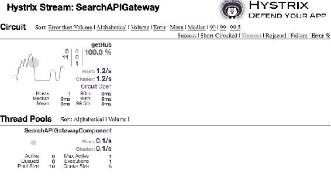

### 注意

要了解每个参数的含义，请访问 Hystrix wiki [`github.com/Netflix/Hystrix/wiki/Dashboard`](https://github.com/Netflix/Hystrix/wiki/Dashboard)。

## 使用 Turbine 聚合 Hystrix 流

在上一个示例中，我们的微服务的`/hystrix.stream`端点在 Hystrix 仪表板中给出。Hystrix 仪表板一次只能监视一个微服务。如果有许多微服务，则 Hystrix 仪表板指向的服务必须每次切换要监视的微服务时更改。一次只查看一个实例是很繁琐的，特别是当有多个微服务实例或多个微服务时。

我们必须有一种机制来聚合来自多个`/hystrix.stream`实例的数据，并将其合并成单个仪表板视图。Turbine 正是这样做的。Turbine 是另一个服务器，它从多个实例收集 Hystrix 流，并将它们合并成一个`/turbine.stream`实例。现在，Hystrix 仪表板可以指向`/turbine.stream`以获取合并信息：

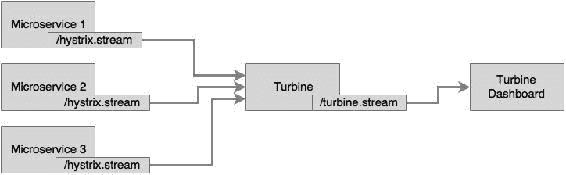

### 提示

Turbine 目前仅适用于不同的主机名。每个实例必须在单独的主机上运行。如果您在同一主机上本地测试多个服务，则更新主机文件（`/etc/hosts`）以模拟多个主机。完成后，必须配置`bootstrap.properties`如下：

```java
eureka.instance.hostname: localdomain2
```

此示例展示了如何使用 Turbine 监视多个实例和服务之间的断路器。在此示例中，我们将使用搜索服务和搜索 API 网关。Turbine 内部使用 Eureka 来解析配置用于监视的服务 ID。

执行以下步骤来构建和执行此示例：

1.  Turbine 服务器可以作为另一个 Spring Boot 应用程序创建，使用 Spring Boot Starter 选择 Turbine 以包括 Turbine 库。

1.  创建应用程序后，在主 Spring Boot 应用程序类中添加`@EnableTurbine`。在此示例中，Turbine 和 Hystrix 仪表板都配置为在同一个 Spring Boot 应用程序上运行。通过向新创建的 Turbine 应用程序添加以下注释，可以实现这一点：

```java
@EnableTurbine
@EnableHystrixDashboard
@SpringBootApplication
public class TurbineServerApplication {
```

1.  将以下配置添加到`.yaml`或属性文件中，以指向我们感兴趣监视的实例：

```java
spring:
   application:
     name : turbineserver
turbine:
   clusterNameExpression: new String('default')
   appConfig : search-service,search-apigateway
server:
  port: 9090
eureka:
  client:
    serviceUrl:
       defaultZone: http://localhost:8761/eureka/
```

1.  上述配置指示 Turbine 服务器查找 Eureka 服务器以解析`search-service`和`search-apigateway`服务。`search-service`和`search-apigateways`服务 ID 用于向 Eureka 注册服务。Turbine 使用这些名称通过与 Eureka 服务器检查来解析实际的服务主机和端口。然后，它将使用此信息从每个实例中读取`/hystrix.stream`。Turbine 然后读取所有单独的 Hystrix 流，将它们聚合，并在 Turbine 服务器的`/turbine.stream` URL 下公开它们。

1.  集群名称表达式指向默认集群，因为在此示例中没有进行显式集群配置。如果手动配置了集群，则必须使用以下配置：

```java
turbine:
  aggregator:
    clusterConfig: [comma separated clusternames]
```

1.  将搜索服务的`SearchComponent`更改为添加另一个断路器，如下所示：

```java
  @HystrixCommand(fallbackMethod = "searchFallback")
  public List<Flight> search(SearchQuery query){
```

1.  此外，在搜索服务的主应用程序类中添加`@EnableCircuitBreaker`。

1.  将以下配置添加到搜索服务的`bootstrap.properties`中。这是因为所有服务都在同一主机上运行：

```java
Eureka.instance.hostname: localdomain1
```

1.  同样，在搜索 API 网关服务的`bootstrap.properties`中添加以下内容。这是为了确保两个服务使用不同的主机名：

```java
eureka.instance.hostname: localdomain2
```

1.  在此示例中，我们将运行两个`search-apigateway`实例：一个在`localdomain1:8095`上，另一个在`localdomain2:8096`上。我们还将在`localdomain1:8090`上运行一个`search-service`实例。

1.  使用命令行覆盖运行微服务以管理不同的主机地址，如下所示：

```java
java -jar -Dserver.port=8096 -Deureka.instance.hostname=localdomain2 -Dserver.address=localdomain2 target/chapter7.search-apigateway-1.0.jar
java -jar -Dserver.port=8095 -Deureka.instance.hostname=localdomain1 -Dserver.address=localdomain1 target/chapter7.search-apigateway-1.0.jar
java -jar -Dserver.port=8090 -Deureka.instance.hostname=localdomain1 -Dserver.address=localdomain1 target/chapter7.search-1.0.jar

```

1.  通过将浏览器指向`http://localhost:9090/hystrix`来打开 Hystrix 仪表板。

1.  与其给出`/hystrix.stream`，这次我们将指向`/turbine.stream`。在这个例子中，Turbine 流正在`9090`上运行。因此，在 Hystrix 仪表板中要给出的 URL 是`http://localhost:9090/turbine.stream`。

1.  通过打开浏览器窗口并访问以下两个 URL 来触发一些事务：`http://localhost:8095/hubongw`和`http://localhost:8096/hubongw`。

完成后，仪表板页面将显示**getHub**服务。

1.  运行`chapter7.website`。使用网站`http://localhost:8001`执行搜索事务。

在执行前面的搜索之后，仪表板页面将显示**search-service**。如下截图所示：

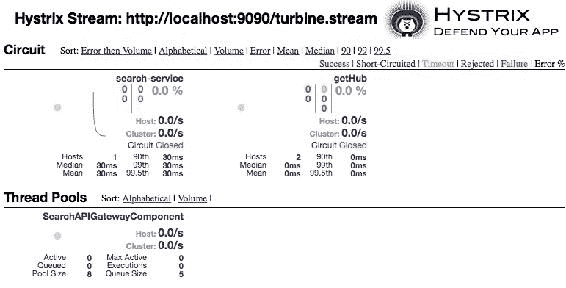

正如我们在仪表板中所看到的，**search-service**来自 Search 微服务，而**getHub**来自 Search API 网关。由于我们有两个 Search API 网关的实例，**getHub**来自两个主机，由**Hosts 2**表示。

# 使用数据湖进行数据分析

与分段日志和监控的情景类似，分段数据是微服务架构中的另一个挑战。分段数据在数据分析中带来了挑战。这些数据可能用于简单的业务事件监控、数据审计，甚至从数据中推导出业务智能。

数据湖或数据中心是处理这种情况的理想解决方案。事件源架构模式通常用于将状态和状态变化作为事件与外部数据存储共享。当状态发生变化时，微服务将状态变化作为事件发布。感兴趣的各方可以订阅这些事件，并根据自己的需求进行处理。中央事件存储也可以订阅这些事件，并将它们存储在大数据存储中进行进一步分析。

常用的数据处理架构如下图所示：

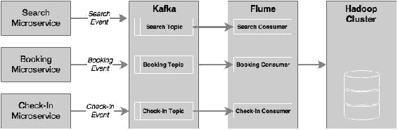

从微服务生成的状态变化事件——在我们的案例中是**Search**、**Booking**和**Check-In**事件——被推送到分布式高性能消息系统，如 Kafka。数据摄取服务，如 Flume，可以订阅这些事件并将其更新到 HDFS 集群中。在某些情况下，这些消息将通过 Spark Streaming 实时处理。为了处理事件的异构来源，Flume 也可以在事件源和 Kafka 之间使用。

Spring Cloud Streams、Spring Cloud Streams 模块和 Spring Data Flow 也是用于高速数据摄取的替代方案。

# 总结

在本章中，您了解了处理互联网规模微服务时日志记录和监控所面临的挑战。

我们探讨了集中式日志记录的各种解决方案。您还了解了如何使用 Elasticsearch、Logstash 和 Kibana（ELK）实现自定义集中式日志记录。为了理解分布式跟踪，我们使用 Spring Cloud Sleuth 升级了 BrownField 微服务。

在本章的后半部分，我们深入探讨了微服务监控解决方案所需的能力以及监控的不同方法。随后，我们检查了一些可用于微服务监控的工具。

通过 Spring Cloud Hystrix 和 Turbine 进一步增强了 BrownField 微服务，以监控服务间通信的延迟和故障。示例还演示了如何使用断路器模式在发生故障时回退到另一个服务。

最后，我们还提到了数据湖的重要性以及如何在微服务环境中集成数据湖架构。

微服务管理是我们在处理大规模微服务部署时需要解决的另一个重要挑战。下一章将探讨容器如何帮助简化微服务管理。
