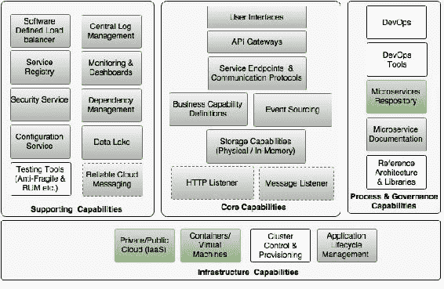
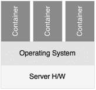
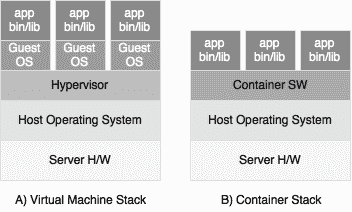
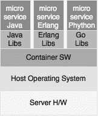
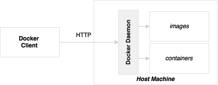
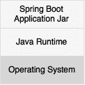
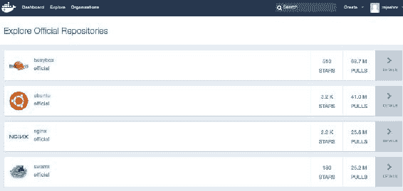
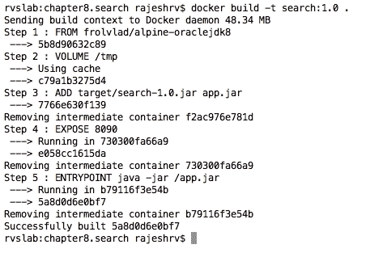
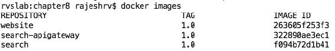
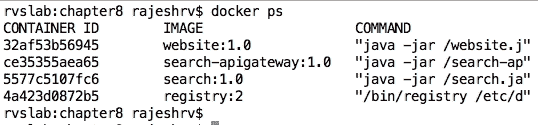

# 第八章：使用 Docker 容器化微服务

在微服务的上下文中，容器化部署是锦上添花。它通过自包含底层基础设施来帮助微服务更加自治，从而使微服务与云中立。

本章将介绍虚拟机镜像的概念和相关性，以及微服务的容器化部署。然后，本章将进一步使读者熟悉使用 Spring Boot 和 Spring Cloud 开发的 BrownField PSS 微服务构建 Docker 镜像。最后，本章还将介绍如何在类生产环境中管理、维护和部署 Docker 镜像。

通过本章结束时，您将了解以下内容：

+   容器化概念及其在微服务上下文中的相关性

+   构建和部署微服务作为 Docker 镜像和容器

+   以 AWS 作为基于云的 Docker 部署的示例

# 审查微服务能力模型

在本章中，我们将探讨第三章中讨论的微服务能力模型中的以下微服务能力：

+   容器和虚拟机

+   私有/公共云

+   微服务仓库

该模型如下图所示：



# 了解 BrownField PSS 微服务中的空白

在第五章*使用 Spring Cloud 扩展微服务*中，BrownField PSS 微服务使用 Spring Boot 和 Spring Cloud 开发。这些微服务部署为版本化的 fat JAR 文件，特别是在本地开发机器上的裸金属上。

在第六章*微服务自动扩展*中，通过自定义生命周期管理器添加了自动扩展能力。在第七章*日志和监控微服务*中，通过集中日志和监控解决方案解决了围绕日志和监控的挑战。

我们的 BrownField PSS 实施仍然存在一些空白。到目前为止，该实施尚未使用任何云基础设施。专用机器，如传统的单片应用部署，不是部署微服务的最佳解决方案。自动化，如自动配置、按需扩展、自助服务和基于使用量的付款，是管理大规模微服务部署所需的基本能力。一般来说，云基础设施提供所有这些基本能力。因此，具有前述能力的私有或公共云更适合部署互联网规模的微服务。

此外，在裸金属上运行一个微服务实例并不划算。因此，在大多数情况下，企业最终会在单个裸金属服务器上部署多个微服务。在单个裸金属上运行多个微服务可能会导致“吵闹的邻居”问题。在同一台机器上运行的微服务实例之间没有隔离。因此，部署在单台机器上的服务可能会占用其他服务的空间，从而影响其性能。

另一种方法是在虚拟机上运行微服务。然而，虚拟机的性能较重。因此，在物理机上运行许多较小的虚拟机并不高效。这通常会导致资源浪费。在共享虚拟机以部署多个服务的情况下，我们将面临与前述共享裸金属相同的问题。

在基于 Java 的微服务的情况下，共享 VM 或裸机来部署多个微服务也会导致在微服务之间共享 JRE。这是因为在我们的 BrownField PSS 抽象中创建的 fat JAR 仅包含应用程序代码及其依赖项，而不包括 JRE。在安装在机器上的 JRE 上进行任何更新都会对部署在该机器上的所有微服务产生影响。同样，如果特定微服务需要 OS 级参数、库或调整，则在共享环境中很难对其进行管理。

一个微服务原则坚持认为它应该是自包含的，并通过完全封装其端到端运行时环境来实现自主性。为了符合这一原则，所有组件，如操作系统、JRE 和微服务二进制文件，都必须是自包含和隔离的。实现这一点的唯一选择是遵循每个 VM 部署一个微服务的方法。然而，这将导致虚拟机的利用率不足，并且在许多情况下，由于这种情况而产生的额外成本可能会抵消微服务的好处。

# 什么是容器？

容器并不是革命性的、开创性的概念。它们已经实践了相当长的时间。然而，由于广泛采用云计算，世界正在见证容器的重新进入。传统虚拟机在云计算领域的缺陷也加速了容器的使用。像**Docker**这样的容器提供商大大简化了容器技术，这也使得容器技术在当今世界得到了广泛的应用。最近 DevOps 和微服务的流行也促成了容器技术的重生。

那么，什么是容器？容器在操作系统之上提供了私有空间。这种技术也被称为操作系统虚拟化。在这种方法中，操作系统的内核提供了隔离的虚拟空间。这些虚拟空间中的每一个被称为一个容器或**虚拟引擎**（**VE**）。容器允许进程在主机操作系统之上的隔离环境中运行。多个容器在同一主机上运行的表示如下：



容器是构建、运输和运行组件化软件的简单机制。通常，容器打包了运行应用程序所必需的所有二进制文件和库。容器保留自己的文件系统、IP 地址、网络接口、内部进程、命名空间、操作系统库、应用程序二进制文件、依赖项和其他应用程序配置。

组织使用数十亿个容器。此外，许多大型组织都在大力投资容器技术。Docker 遥遥领先于竞争对手，得到了许多大型操作系统供应商和云提供商的支持。**Lmctfy**、**SystemdNspawn**、**Rocket**、**Drawbridge**、**LXD**、**Kurma**和**Calico**是其他一些容器化解决方案。开放容器规范也正在开发中。

# VM 和容器之间的区别

几年前，**Hyper-V**、**VMWare**和**Zen**等 VM 是数据中心虚拟化的热门选择。企业通过实施虚拟化而节省了成本，而不是传统的裸机使用。它还帮助许多企业以更加优化的方式利用其现有基础设施。由于 VM 支持自动化，许多企业发现他们在虚拟机上的管理工作更少。虚拟机还帮助组织获得应用程序运行的隔离环境。

乍一看，虚拟化和容器化表现出完全相同的特征。然而，总的来说，容器和虚拟机并不相同。因此，在虚拟机和容器之间进行苹果对苹果的比较是不公平的。虚拟机和容器是两种不同的技术，解决虚拟化的不同问题。这种差异可以从以下图表中看出：



与容器相比，虚拟机的操作级别要低得多。虚拟机提供硬件虚拟化，如 CPU、主板、内存等。虚拟机是一个独立的单元，内嵌操作系统，通常称为**客户操作系统**。虚拟机复制整个操作系统，并在虚拟机内部运行，不依赖于主机操作系统环境。由于虚拟机嵌入了完整的操作系统环境，因此它们在性质上比较笨重。这既是优势也是劣势。优势在于虚拟机为在虚拟机上运行的进程提供了完全隔离。劣势在于它限制了在裸机上启动虚拟机的数量，因为虚拟机的资源需求。

虚拟机的大小直接影响其启动和停止时间。由于启动虚拟机会启动操作系统，因此虚拟机的启动时间通常较长。虚拟机更适合基础设施团队，因为管理虚拟机需要较低水平的基础设施能力。

在容器世界中，容器不会模拟整个硬件或操作系统。与虚拟机不同，容器共享主机内核和操作系统的某些部分。在容器的情况下，没有客户操作系统的概念。容器在主机操作系统的顶部直接提供了一个隔离的执行环境。这既是它的优势也是劣势。优势在于它更轻，更快。由于同一台机器上的容器共享主机操作系统，容器的整体资源利用率相当小。因此，与笨重的虚拟机相比，可以在同一台机器上运行许多较小的容器。由于同一主机上的容器共享主机操作系统，也存在一些限制。例如，在容器内部无法设置 iptables 防火墙规则。容器内的进程与在同一主机上运行的不同容器的进程完全独立。

与虚拟机不同，容器镜像在社区门户网站上是公开可用的。这使得开发人员的生活变得更加轻松，因为他们不必从头开始构建镜像；相反，他们现在可以从认证来源获取基础镜像，并在下载的基础镜像上添加额外的软件组件层。

容器的轻量化特性也为自动化构建、发布、下载、复制等提供了大量机会。通过几个命令下载、构建、运行容器或使用 REST API 使容器更加适合开发人员。构建一个新的容器不会超过几秒钟。容器现在也是持续交付流水线的一部分。

总之，容器相对于虚拟机有许多优势，但虚拟机也有其独特的优势。许多组织同时使用容器和虚拟机，例如在虚拟机上运行容器。

# 容器的优势

我们已经考虑了容器相对于虚拟机的许多优势。本节将解释容器的整体优势，超越虚拟机的优势：

+   自包含：容器将必要的应用程序二进制文件和它们的依赖项打包在一起，以确保在开发、测试或生产等不同环境之间没有差异。这促进了十二要素应用程序和不可变容器的概念。Spring Boot 微服务捆绑了所有必需的应用程序依赖项。容器通过嵌入 JRE 和其他操作系统级别的库、配置等，进一步扩展了这一边界。

+   轻量级：总的来说，容器体积小，占用空间少。最小的容器 Alpine 大小不到 5MB。使用 Alpine 容器和 Java 8 打包的最简单的 Spring Boot 微服务只有大约 170MB 的大小。虽然大小仍然偏大，但比通常几 GB 的 VM 镜像要小得多。容器的较小占用空间不仅有助于快速启动新容器，还使构建、部署和存储更加容易。

+   可扩展：由于容器镜像体积小，在启动时没有操作系统引导，容器通常更快地启动和关闭。这使得容器成为云友好的弹性应用程序的热门选择。

+   可移植：容器在不同机器和云提供商之间提供可移植性。一旦容器构建完成所有依赖项，它们可以在多台机器或多个云提供商之间移植，而不依赖于底层机器。容器可以从桌面移植到不同的云环境。

+   较低的许可成本：许多软件许可条款是基于物理核心的。由于容器共享操作系统，并且在物理资源级别上没有虚拟化，因此在许可成本方面具有优势。

+   DevOps：容器的轻量级占用空间使得容易自动化构建，并从远程存储库发布和下载容器。这使得在敏捷和 DevOps 环境中易于使用，通过与自动交付流水线集成。容器还支持“构建一次”的概念，通过在构建时创建不可变容器，并在多个环境之间移动它们。由于容器并不深入基础设施，多学科的 DevOps 团队可以将容器作为日常生活的一部分进行管理。

+   版本控制：容器默认支持版本。这有助于构建有版本的工件，就像有版本的存档文件一样。

+   可重用：容器镜像是可重用的工件。如果一个镜像是通过组装一些库来实现某个目的，它可以在类似的情况下被重复使用。

+   不可变的容器：在这个概念中，容器在使用后被创建和销毁。它们永远不会被更新或打补丁。不可变的容器在许多环境中被使用，以避免部署单元的补丁复杂性。打补丁会导致无法追踪和无法一致地重新创建环境。

# 微服务和容器

微服务和容器之间没有直接关系。微服务可以在没有容器的情况下运行，容器可以运行单片应用程序。然而，微服务和容器之间存在一个甜蜜点。

容器适用于单片应用程序，但单片应用程序的复杂性和大小可能会削弱容器的一些优势。例如，使用单片应用程序可能不容易快速启动新容器。除此之外，单片应用程序通常具有本地环境依赖，如本地磁盘、与其他系统的独立依赖等。这些应用程序很难通过容器技术进行管理。这就是微服务与容器相辅相成的地方。

以下图表显示了在同一主机上运行的三个多语言微服务，并共享相同的操作系统，但抽象了运行时环境：



当管理许多多语言微服务时，容器的真正优势可以看出来，例如，一个微服务用 Java 编写，另一个微服务用 Erlang 或其他语言编写。容器帮助开发人员以平台和技术无关的方式打包任何语言或技术编写的微服务，并统一分布到多个环境中。容器消除了处理多语言微服务的不同部署管理工具的需求。容器不仅抽象了执行环境，还抽象了如何访问服务。无论使用何种技术，容器化的微服务都会暴露 REST API。一旦容器启动运行，它就会绑定到某些端口并暴露其 API。由于容器是自包含的，并在服务之间提供完全的堆栈隔离，在单个 VM 或裸金属上，可以以统一的方式运行多个异构微服务并处理它们。

# Docker 简介

前面的部分讨论了容器及其优势。容器已经在业界使用多年，但 Docker 的流行使容器有了新的前景。因此，许多容器定义和观点都源自 Docker 架构。Docker 如此受欢迎，以至于容器化甚至被称为**dockerization**。

Docker 是一个基于 Linux 内核构建、运输和运行轻量级容器的平台。Docker 默认支持 Linux 平台。它还支持 Mac 和 Windows，使用**Boot2Docker**，它运行在 Virtual Box 之上。

亚马逊**EC2 容器服务**（**ECS**）在 AWS EC2 实例上对 Docker 有开箱即用的支持。Docker 可以安装在裸金属上，也可以安装在传统的虚拟机上，如 VMWare 或 Hyper-V。

## Docker 的关键组件

Docker 安装有两个关键组件：**Docker 守护程序**和**Docker 客户端**。Docker 守护程序和 Docker 客户端都作为单个二进制文件分发。

以下图表显示了 Docker 安装的关键组件：



### Docker 守护程序

Docker 守护程序是运行在主机上的服务器端组件，负责构建、运行和分发 Docker 容器。Docker 守护程序暴露 API 供 Docker 客户端与守护程序交互。这些 API 主要是基于 REST 的端点。可以想象 Docker 守护程序是运行在主机上的控制器服务。开发人员可以以编程方式使用这些 API 来构建自定义客户端。

### Docker 客户端

Docker 客户端是一个远程命令行程序，通过套接字或 REST API 与 Docker 守护程序进行交互。CLI 可以在与守护程序相同的主机上运行，也可以在完全不同的主机上运行，并远程连接到守护程序。Docker 用户使用 CLI 构建、运输和运行 Docker 容器。

## Docker 概念

Docker 架构围绕着一些概念构建：镜像、容器、注册表和 Dockerfile。

### Docker 镜像

Docker 的一个关键概念是镜像。Docker 镜像是操作系统库、应用程序及其库的只读副本。一旦创建了镜像，它就保证在任何 Docker 平台上运行而不需要修改。

在 Spring Boot 微服务中，Docker 镜像打包了操作系统，如 Ubuntu、Alpine、JRE 和 Spring Boot fat 应用程序 JAR 文件。它还包括运行应用程序和暴露服务的指令：



如图所示，Docker 镜像基于分层架构，其中基本镜像是 Linux 的各种版本之一。如前图所示，每个层都添加到具有前一个镜像作为父层的基本镜像层中。Docker 使用联合文件系统的概念将所有这些层组合成单个镜像，形成单个文件系统。

在典型情况下，开发人员不会从头开始构建 Docker 镜像。操作系统的镜像，或其他常见的库，如 Java 8 镜像，都可以从可信任的来源公开获取。开发人员可以在这些基本镜像的基础上开始构建。在 Spring 微服务中，基本镜像可以是 JRE 8，而不是从 Ubuntu 等 Linux 发行版镜像开始。

每次重新构建应用程序时，只有更改的层会被重新构建，其余层保持不变。所有中间层都被缓存，因此，如果没有更改，Docker 会使用先前缓存的层并在其上构建。在同一台机器上运行具有相同类型基本镜像的多个容器将重用基本镜像，从而减小部署的大小。例如，在主机上，如果有多个使用 Ubuntu 作为基本镜像运行的容器，它们都会重用相同的基本镜像。这也适用于发布或下载镜像时：

Docker 镜像

如图所示，图像中的第一层是称为`bootfs`的引导文件系统，类似于 Linux 内核和引导加载程序。引导文件系统充当所有图像的虚拟文件系统。

在引导文件系统之上，放置了操作系统文件系统，称为`rootfs`。根文件系统向容器添加了典型的操作系统目录结构。与 Linux 系统不同，在 Docker 的情况下，`rootfs`处于只读模式。

根据需求，其他所需的镜像被放置在`rootfs`之上。在我们的情况下，这些是 JRE 和 Spring Boot 微服务的 JAR 文件。当容器被初始化时，会在所有其他文件系统之上放置一个可写文件系统以供进程运行。进程对底层文件系统所做的任何更改都不会反映在实际容器中。相反，这些更改会被写入可写文件系统。这个可写文件系统是易失性的。因此，一旦容器停止，数据就会丢失。因此，Docker 容器是短暂的。

Docker 内部打包的基本操作系统通常是 OS 文件系统的最小副本。实际上，运行在其上的进程可能并不使用整个 OS 服务。在 Spring Boot 微服务中，很多情况下，容器只是启动一个 CMD 和 JVM，然后调用 Spring Boot 的 fat JAR。

### Docker 容器

Docker 容器是 Docker 镜像的运行实例。容器在运行时使用主机操作系统的内核。因此，它们与在同一主机上运行的其他容器共享主机内核。Docker 运行时确保容器进程使用内核功能（如**cgroups**和操作系统的内核**namespace**）分配其自己的隔离进程空间。除了资源隔离，容器还有自己的文件系统和网络配置。

实例化的容器可以具有特定的资源分配，如内存和 CPU。从相同镜像初始化的容器可以具有不同的资源分配。Docker 容器默认获得独立的**子网**和**网关**。网络有三种模式。

### Docker 注册表

Docker 注册表是 Docker 镜像发布和下载的中心位置。URL [`hub.docker.com`](https://hub.docker.com)是 Docker 提供的中央注册表。Docker 注册表有公共镜像，可以下载并用作基本注册表。Docker 还有私有镜像，专门针对在 Docker 注册表中创建的帐户。Docker 注册表的截图如下所示：



Docker 还提供**Docker Trusted Registry**，可用于在本地部署注册表。

### Dockerfile

Dockerfile 是一个包含构建 Docker 镜像的指令的构建或脚本文件。Dockerfile 中可以记录多个步骤，从获取基本镜像开始。Dockerfile 是一个通常命名为 Dockerfile 的文本文件。`docker build`命令查找 Dockerfile 以获取构建指令。可以将 Dockerfile 比作 Maven 构建中使用的`pom.xml`文件。

# 在 Docker 中部署微服务

本节将通过展示如何为我们的 BrownField PSS 微服务构建容器来实现我们的学习。

### 注意

本章的完整源代码可在代码文件的`第八章`项目中找到。将`chapter7.configserver`，`chapter7.eurekaserver`，`chapter7.search`，`chapter7.search-apigateway`和`chapter7.website`复制到新的 STS 工作区，并将它们重命名为`chapter8.*`。

执行以下步骤来构建 BrownField PSS 微服务的 Docker 容器：

1.  从官方 Docker 网站[`www.docker.com`](https://www.docker.com)安装 Docker。

按照所选操作系统的下载和安装说明，使用**开始**链接。安装后，使用以下命令验证安装：

```java
$docker –version
Docker version 1.10.1, build 9e83765

```

1.  在本节中，我们将看看如何将**Search**(`chapter8.search`)微服务，**Search API Gateway**(`chapter8.search-apigateway`)微服务和**Website**(`chapter8.website`) Spring Boot 应用程序 docker 化。

1.  在进行任何更改之前，我们需要编辑`bootstrap.properties`，将配置服务器 URL 从 localhost 更改为 IP 地址，因为在 Docker 容器内无法解析 localhost。在现实世界中，这将指向 DNS 或负载均衡器，如下所示：

```java
spring.cloud.config.uri=http://192.168.0.105:8888
```

### 注意

用您的机器的 IP 地址替换 IP 地址。

1.  同样，在 Git 存储库上编辑`search-service.properties`，将 localhost 更改为 IP 地址。这适用于 Eureka URL 以及 RabbitMQ URL。更新后提交回 Git。您可以通过以下代码执行此操作：

```java
spring.application.name=search-service
spring.rabbitmq.host=192.168.0.105
spring.rabbitmq.port=5672
spring.rabbitmq.username=guest
spring.rabbitmq.password=guest
orginairports.shutdown:JFK
eureka.client.serviceUrl.defaultZone: http://192.168.0.105:8761/eureka/
spring.cloud.stream.bindings.inventoryQ=inventoryQ
```

1.  通过取消注释以下行来更改 RabbitMQ 配置文件`rabbitmq.config`，以提供对 guest 的访问。默认情况下，guest 只能从本地主机访问：

```java
    {loopback_users, []}
```

`rabbitmq.config`的位置对于不同的操作系统是不同的。

1.  在 Search 微服务的根目录下创建一个 Dockerfile，如下所示：

```java
FROM frolvlad/alpine-oraclejdk8
VOLUME /tmp
ADD  target/search-1.0.jar search.jar
EXPOSE 8090
ENTRYPOINT ["java","-jar","/search.jar"]
```

以下是对 Dockerfile 内容的快速检查：

+   `FROM frolvlad/alpine-oraclejdk8`：这告诉 Docker 构建使用特定的`alpine-oraclejdk8`版本作为此构建的基本镜像。`frolvlad`表示定位`alpine-oraclejdk8`镜像的存储库。在这种情况下，它是使用 Alpine Linux 和 Oracle JDK 8 构建的镜像。这将帮助我们将应用程序层叠在基本镜像之上，而无需自己设置 Java 库。在这种情况下，由于此镜像在我们的本地镜像存储中不可用，Docker 构建将继续从远程 Docker Hub 注册表下载此镜像。

+   `VOLUME /tmp`：这允许容器访问主机机器中指定的目录。在我们的情况下，这指向 Spring Boot 应用程序为 Tomcat 创建工作目录的`tmp`目录。`tmp`目录对于容器来说是一个逻辑目录，间接指向主机的一个本地目录。

+   `ADD target/search-1.0.jar search.jar`: 这将应用程序二进制文件添加到容器中，并指定目标文件名。在这种情况下，Docker 构建将`target/search-1.0.jar`复制到容器中作为`search.jar`。

+   `EXPOSE 8090`: 这是告诉容器如何进行端口映射。这将`8090`与内部 Spring Boot 服务的外部端口绑定。

+   `ENTRYPOINT ["java","-jar", "/search.jar"]`: 这告诉容器在启动时要运行哪个默认应用程序。在这种情况下，我们指向 Java 进程和 Spring Boot fat JAR 文件来启动服务。

1.  下一步是从存储 Dockerfile 的文件夹运行`docker build`。这将下载基础镜像，并依次运行 Dockerfile 中的条目，如下所示：

```java
docker build –t search:1.0 .

```

这个命令的输出将如下所示：



1.  对 Search API Gateway 和 Website 重复相同的步骤。

1.  创建完镜像后，可以通过输入以下命令来验证。这个命令将列出镜像及其详细信息，包括镜像文件的大小：

```java
docker images

```

输出将如下所示：



1.  接下来要做的是运行 Docker 容器。可以使用`docker run`命令来完成这个操作。这个命令将加载并运行容器。在启动时，容器调用 Spring Boot 可执行 JAR 来启动微服务。

在启动容器之前，请确保 Config 和 Eureka 服务器正在运行：

```java
docker run --net host -p 8090:8090 -t search:1.0
docker run --net host -p 8095:8095 -t search-apigateway:1.0
docker run --net host -p 8001:8001 -t website:1.0

```

前面的命令启动了 Search 和 Search API Gateway 微服务以及网站。

在这个例子中，我们使用主机网络`(--net host`)而不是桥接网络，以避免 Eureka 注册到 Docker 容器名称。这可以通过覆盖`EurekaInstanceConfigBean`来纠正。从网络角度来看，主机选项比桥接选项更少隔离。主机与桥接的优势和劣势取决于项目。

1.  一旦所有服务都完全启动，可以使用`docker ps`命令进行验证，如下面的屏幕截图所示：

1.  下一步是将浏览器指向`http://192.168.99.100:8001`。这将打开 BrownField PSS 网站。

注意 IP 地址。这是 Docker 机器的 IP 地址，如果你在 Mac 或 Windows 上使用 Boot2Docker 运行。在 Mac 或 Windows 上，如果不知道 IP 地址，则输入以下命令来找出默认机器的 Docker 机器 IP 地址：

```java
docker-machine ip default

```

如果 Docker 在 Linux 上运行，那么这就是主机 IP 地址。

对**Booking**、**Fares**、**Check-in**和它们各自的网关微服务应用相同的更改。

# 在 Docker 上运行 RabbitMQ

由于我们的示例也使用了 RabbitMQ，让我们探讨如何将 RabbitMQ 设置为 Docker 容器。以下命令从 Docker Hub 拉取 RabbitMQ 镜像并启动 RabbitMQ：

```java
docker run –net host rabbitmq3

```

确保`*-service.properties`中的 URL 已更改为 Docker 主机的 IP 地址。在 Mac 或 Windows 的情况下，应用之前的规则来找出 IP 地址。

# 使用 Docker 注册表

Docker Hub 提供了一个集中存储所有 Docker 镜像的位置。这些镜像可以存储为公共或私有。在许多情况下，由于安全相关的问题，组织会在本地部署自己的私有注册表。

执行以下步骤来设置和运行本地注册表：

1.  以下命令将启动一个注册表，将注册表绑定到端口`5000`上：

```java
docker run -d -p 5000:5000 --restart=always --name registry registry:2

```

1.  将`search:1.0`标记到注册表，如下所示：

```java
docker tag search:1.0 localhost:5000/search:1.0

```

1.  然后，通过以下命令将镜像推送到注册表：

```java
docker push localhost:5000/search:1.0

```

1.  从注册表中拉取镜像，如下所示：

```java
docker pull localhost:5000/search:1.0

```

## 设置 Docker Hub

在上一章中，我们使用了本地 Docker 注册表。本节将展示如何设置和使用 Docker Hub 来发布 Docker 容器。这是一个方便的机制，可以全球访问 Docker 镜像。在本章的后面部分，Docker 镜像将从本地机器发布到 Docker Hub，并从 EC2 实例下载。

为此，创建一个公共 Docker Hub 账户和一个存储库。对于 Mac，按照以下 URL 的步骤进行：[`docs.docker.com/mac/step_five/`](https://docs.docker.com/mac/step_five/)。

在本例中，使用`brownfield`用户名创建了 Docker Hub 账户。

在这种情况下，注册表充当微服务存储库，其中所有 docker 化的微服务将被存储和访问。这是微服务能力模型中解释的能力之一。

## 将微服务发布到 Docker Hub

要将 docker 化的服务推送到 Docker Hub，请按照以下步骤进行。第一条命令标记 Docker 镜像，第二条命令将 Docker 镜像推送到 Docker Hub 存储库：

```java
docker tag search:1.0brownfield/search:1.0
docker push brownfield/search:1.0

```

要验证容器镜像是否已发布，请转到 Docker Hub 存储库`https://hub.docker.com/u/brownfield`。

对所有其他 BrownField 微服务也重复此步骤。在此步骤结束时，所有服务将被发布到 Docker Hub。

# 云上的微服务

微服务能力模型中提到的能力之一是使用云基础设施进行微服务。在本章的前面部分，我们还探讨了使用云进行微服务部署的必要性。到目前为止，我们还没有将任何东西部署到云上。由于我们总共有八个微服务——`Config-server`、`Eureka-server`、Turbine、RabbitMQ、Elasticsearch、Kibana 和 Logstash——在我们的整体 BrownField PSS 微服务生态系统中，很难在本地机器上运行所有这些微服务。

在本书的其余部分，我们将使用 AWS 作为云平台来部署 BrownField PSS 微服务。

## 在 AWS EC2 上安装 Docker

在本节中，我们将在 EC2 实例上安装 Docker。

本例假设读者熟悉 AWS，并且在 AWS 上已经创建了一个账户。

执行以下步骤在 EC2 上设置 Docker：

1.  启动一个新的 EC2 实例。在这种情况下，如果我们必须同时运行所有实例，可能需要一个大实例。本例使用**t2.large**。

在本例中，使用以下 Ubuntu AMI 镜像：`ubuntu-trusty-14.04-amd64-server-20160114.5 (ami-fce3c696)`。

1.  连接到 EC2 实例并运行以下命令：

```java
sudo apt-get update 
sudo apt-get install docker.io

```

1.  上述命令将在 EC2 实例上安装 Docker。使用以下命令验证安装：

```java
docker version

```

# 在 EC2 上运行 BrownField 服务

在本节中，我们将在创建的 EC2 实例上设置 BrownField 微服务。在这种情况下，构建设置在本地桌面机器上，并且二进制文件将部署到 AWS。

执行以下步骤在 EC2 实例上设置服务：

1.  通过以下命令安装 Git：

```java
sudo apt-get install git

```

1.  在任意文件夹上创建一个 Git 存储库。

1.  更改配置服务器的`bootstrap.properties`，指向为本例创建的适当 Git 存储库。

1.  更改所有微服务的`bootstrap.properties`，指向使用 EC2 实例的私有 IP 地址的配置服务器。

1.  将本地 Git 存储库中的所有`*.properties`复制到 EC2 Git 存储库并执行提交。

1.  更改`*.properties`文件中的 Eureka 服务器 URL 和 RabbitMQ URL，以匹配 EC2 私有 IP 地址。完成后将更改提交到 Git。

1.  在本地机器上重新编译所有项目，并为`search`、`search-apigateway`和`website`微服务创建 Docker 镜像。将它们全部推送到 Docker Hub 注册表。

1.  从本地机器复制配置服务器和 Eureka 服务器的二进制文件到 EC2 实例。

1.  在 EC2 实例上设置 Java 8。

1.  然后，按顺序执行以下命令：

```java
java –jar config-server.jar 
java –jar eureka-server.jar 
docker run –net host rabbitmq:3
docker run --net host -p 8090:8090 rajeshrv/search:1.0
docker run --net host -p 8095:8095 rajeshrv/search-apigateway:1.0
docker run --net host -p 8001:8001 rajeshrv/website:1.0

```

1.  通过打开网站的 URL 并执行搜索来检查所有服务是否正常工作。请注意，在这种情况下我们将使用公共 IP 地址：`http://54.165.128.23:8001`。

# 更新生命周期管理器

在第六章中，*自动缩放微服务*，我们考虑了一个生命周期管理器来自动启动和停止实例。我们使用 SSH 并执行 Unix 脚本来在目标机器上启动 Spring Boot 微服务。使用 Docker，我们不再需要 SSH 连接，因为 Docker 守护程序提供了基于 REST 的 API 来启动和停止实例。这极大地简化了生命周期管理器的部署引擎组件的复杂性。

在本节中，我们不会重写生命周期管理器。总的来说，我们将在下一章中替换生命周期管理器。

# 容器化的未来 - 单内核和强化安全

容器化仍在不断发展，但采用容器化技术的组织数量近年来有所增加。虽然许多组织正在积极采用 Docker 和其他容器技术，但这些技术的缺点仍在于容器的大小和安全问题。

目前，Docker 镜像通常很大。在一个弹性自动化的环境中，容器经常被创建和销毁，大小仍然是一个问题。更大的大小表示更多的代码，更多的代码意味着更容易受到安全漏洞的影响。

未来绝对在小型容器中。Docker 正在研究单内核，轻量级内核可以在低功率的物联网设备上运行 Docker。单内核不是完整的操作系统，但它们提供了支持部署应用程序所需的基本库。

容器的安全问题被广泛讨论和辩论。关键的安全问题围绕用户命名空间隔离或用户 ID 隔离。如果容器在根目录上，则可以默认获取主机的根权限。使用来自不受信任来源的容器镜像是另一个安全问题。Docker 正在尽快弥合这些差距，但有许多组织使用虚拟机和 Docker 的组合来规避一些安全顾虑。

# 总结

在本章中，您了解了在处理互联网规模的微服务时需要具有云环境的必要性。

我们探讨了容器的概念，并将其与传统虚拟机进行了比较。您还学习了 Docker 的基础知识，我们解释了 Docker 镜像、容器和注册表的概念。在微服务的背景下解释了容器的重要性和好处。

然后，本章转向了一个实际示例，通过将 BrownField 微服务 docker 化。我们演示了如何在 Docker 上部署之前开发的 Spring Boot 微服务。通过探索本地注册表以及 Docker Hub 来推送和拉取 docker 化的微服务，您学习了注册表的概念。

作为最后一步，我们探讨了如何在 AWS 云环境中部署一个 dockerized 的 BrownField 微服务。
