# 第九章：使用 Mesos 和 Marathon 管理 docker 化的微服务

在互联网规模的微服务部署中，要管理成千上万个 docker 化的微服务并不容易。必须有一个基础设施抽象层和一个强大的集群控制平台，才能成功地管理互联网规模的微服务部署。

本章将解释在云环境中部署大规模微服务时，需要使用 Mesos 和 Marathon 作为基础设施抽象层和集群控制系统，以实现优化的资源使用。本章还将提供在云环境中设置 Mesos 和 Marathon 的逐步方法。最后，本章将演示如何在 Mesos 和 Marathon 环境中管理 docker 化的微服务。

在本章结束时，您将学到：

+   需要有一个抽象层和集群控制软件

+   从微服务的角度看 Mesos 和 Marathon

+   使用 Mesos 和 Marathon 管理 docker 化的 BrownField 航空公司 PSS 微服务

# 审查微服务能力模型

在本章中，我们将探讨微服务能力模型中的**集群控制和供应**微服务能力，该模型在第三章中讨论了*应用微服务概念*：

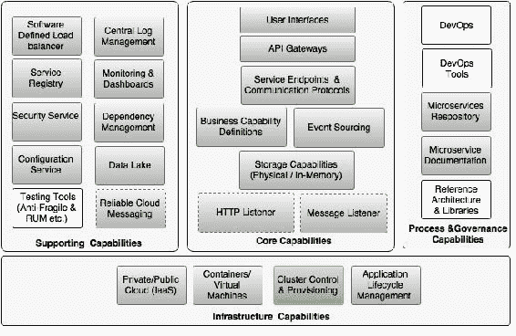

# 缺失的部分

在第八章中，我们讨论了如何将 BrownField 航空公司的 PSS 微服务 docker 化。Docker 帮助打包了 JVM 运行时和应用程序的 OS 参数，这样在将 docker 化的微服务从一个环境移动到另一个环境时就不需要特别考虑。Docker 提供的 REST API 简化了生命周期管理器与目标机器在启动和停止构件时的交互。

在大规模部署中，有数百甚至数千个 Docker 容器，我们需要确保 Docker 容器以自己的资源约束运行，例如内存、CPU 等。除此之外，可能还会为 Docker 部署设置规则，例如不应在同一台机器上运行容器的复制副本。此外，需要建立一种机制，以最佳地利用服务器基础设施，避免产生额外成本。

有些组织处理数十亿个容器。手动管理它们几乎是不可能的。在大规模 Docker 部署的情况下，需要回答一些关键问题：

+   如何管理成千上万的容器？

+   如何监视它们？

+   在部署构件时，我们如何应用规则和约束？

+   如何确保我们正确利用容器以获得资源效率？

+   如何确保至少在任何时候运行一定数量的最小实例？

+   如何确保依赖服务正在运行？

+   如何进行滚动升级和优雅迁移？

+   如何回滚故障部署？

所有这些问题都指向了需要解决两个关键能力的需求，这两个能力如下：

+   提供统一抽象的集群抽象层，覆盖许多物理或虚拟机器。

+   一个集群控制和初始化系统，以智能地管理集群抽象之上的部署

生命周期管理器理想地处理这些情况。可以向生命周期管理器添加足够的智能来解决这些问题。但是，在尝试修改生命周期管理器之前，重要的是更深入地了解集群管理解决方案的作用。

# 为什么集群管理很重要

由于微服务将应用程序分解为不同的微应用程序，许多开发人员请求更多的服务器节点进行部署。为了正确管理微服务，开发人员倾向于每个 VM 部署一个微服务，这进一步降低了资源利用率。在许多情况下，这导致 CPU 和内存的过度分配。

在许多部署中，微服务的高可用性要求迫使工程师为冗余添加越来越多的服务实例。实际上，尽管它提供了所需的高可用性，但这将导致服务器实例的资源利用不足。

一般来说，与单片应用程序部署相比，微服务部署需要更多的基础设施。由于基础设施成本的增加，许多组织未能看到微服务的价值：

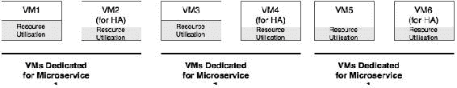

为了解决之前提到的问题，我们需要一个具备以下功能的工具：

+   自动化一系列活动，如高效地将容器分配给基础设施，并使开发人员和管理员对此保持透明

+   为开发人员提供一个抽象层，使他们可以在不知道要使用哪台机器来托管他们的应用程序的情况下，部署他们的应用程序到数据中心

+   针对部署工件设置规则或约束

+   为开发人员和管理员提供更高级别的灵活性，同时减少管理开销，或许还能减少人为干预

+   通过最大限度地利用可用资源来以成本效益的方式构建、部署和管理应用程序

容器在这个背景下解决了一个重要问题。我们选择的任何具备这些功能的工具都可以以统一的方式处理容器，而不考虑底层的微服务技术。

# 集群管理的作用是什么？

典型的集群管理工具帮助虚拟化一组机器，并将它们作为单个集群进行管理。集群管理工具还帮助在机器之间移动工作负载或容器，同时对消费者保持透明。技术布道者和实践者使用不同的术语，如集群编排、集群管理、数据中心虚拟化、容器调度器、容器生命周期管理、容器编排、数据中心操作系统等。

许多这些工具目前既支持基于 Docker 的容器，也支持非容器化的二进制部署，比如独立的 Spring Boot 应用程序。这些集群管理工具的基本功能是将实际的服务器实例与应用程序开发人员和管理员抽象出来。

集群管理工具帮助自助服务和基础设施的预配，而不是要求基础设施团队分配所需的具有预定义规格的机器。在这种自动化的集群管理方法中，机器不再提前预配和预分配给应用程序。一些集群管理工具还帮助在许多异构机器或数据中心之间虚拟化数据中心，并创建一个弹性的、类似私有云的基础设施。集群管理工具没有标准的参考模型。因此，供应商之间的功能差异很大。

集群管理软件的一些关键功能总结如下：

+   **集群管理**：它将一组虚拟机和物理机作为单个大型机器进行管理。这些机器在资源能力方面可能是异构的，但它们基本上都是运行 Linux 操作系统的机器。这些虚拟集群可以在云上、本地或两者的组合上形成。

+   **部署**：它处理大量机器的应用程序和容器的自动部署。它支持应用程序容器的多个版本，还支持跨大量集群机器的滚动升级。这些工具还能够处理故障推广的回滚。

+   **可扩展性**：它处理应用程序实例的自动和手动扩展，以优化利用率为主要目标。

+   **健康**：它管理集群、节点和应用程序的健康状况。它会从集群中删除故障机器和应用实例。

+   **基础设施抽象化**：它将开发人员与应用程序部署的实际机器抽象出来。开发人员不需要担心机器、其容量等等。完全由集群管理软件决定如何调度和运行应用程序。这些工具还将机器细节、其容量、利用率和位置从开发人员那里抽象出来。对于应用程序所有者来说，这些等同于一个具有几乎无限容量的单个大型机器。

+   **资源优化**：这些工具的固有行为是以高效的方式在一组可用的机器上分配容器工作负载，从而降低所有权成本。可以有效地使用简单到极其复杂的算法来提高利用率。

+   **资源分配**：它根据资源可用性和应用程序开发人员设置的约束来分配服务器。资源分配基于这些约束、亲和规则、端口需求、应用程序依赖性、健康状况等。

+   **服务可用性**：确保服务在集群中的某个地方正常运行。在发生机器故障时，集群控制工具会自动通过在集群中的其他机器上重新启动这些服务来处理故障。

+   **灵活性**：这些工具能够快速地将工作负载分配给可用资源，或者在资源需求发生变化时将工作负载移动到其他机器上。还可以根据业务的关键性、业务优先级等设置约束，重新调整资源。

+   **隔离**：其中一些工具可以直接提供资源隔离。因此，即使应用程序未经容器化，仍然可以实现资源隔离。

用于资源分配的算法种类繁多，从简单算法到复杂算法，再到机器学习和人工智能。常用的算法包括随机算法、装箱算法和分散算法。根据资源可用性设置的约束将覆盖默认算法：

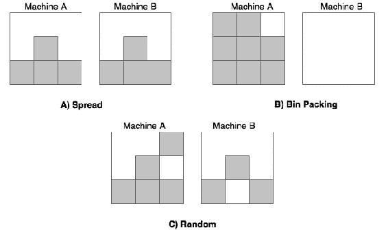

上图显示了这些算法如何填充可用的机器部署。在这种情况下，演示了两台机器：

+   **分散**：此算法在可用的机器上均匀分配工作负载。这在图**A**中显示。

+   **装箱**：此算法尝试逐个填充数据机器，并确保最大限度地利用机器。在使用按需付费的云服务时，装箱算法尤其有效。这在图**B**中显示。

+   **随机**：此算法随机选择机器，并在随机选择的机器上部署容器。这在图**C**中显示。

有可能使用认知计算算法，如机器学习和协同过滤来提高效率。诸如**超额分配**之类的技术允许通过为高优先级任务分配未充分利用的资源来更好地利用资源，例如为收入产生服务分配最佳努力任务，如分析、视频、图像处理等。

# 与微服务的关系

如果微服务基础架构没有得到适当的配置，很容易导致过度的基础架构，从而增加拥有成本。正如前面所讨论的，具有集群管理工具的类似云的环境对于处理大规模微服务时实现成本效益至关重要。

使用 Spring Cloud 项目进行加速的 Spring Boot 微服务是利用集群管理工具的理想候选工作负载。由于基于 Spring Cloud 的微服务不知道位置，这些服务可以在集群中的任何位置部署。每当服务启动时，它们会自动注册到服务注册表并宣布其可用性。另一方面，消费者始终在注册表中查找可用的服务实例。这样，应用程序支持完全流动的结构，而不预设部署拓扑。通过 Docker，我们能够抽象运行时，使服务能够在任何基于 Linux 的环境中运行。

# 与虚拟化的关系

集群管理解决方案在许多方面与服务器虚拟化解决方案不同。集群管理解决方案作为应用程序组件运行在 VM 或物理机上。

# 集群管理解决方案

市场上有许多集群管理软件工具可用。对它们进行苹果对苹果的比较是不公平的。尽管没有一对一的组件，但它们之间在功能上有许多重叠的领域。在许多情况下，组织使用一个或多个这些工具的组合来满足他们的需求。

以下图表显示了微服务环境下集群管理工具的位置：

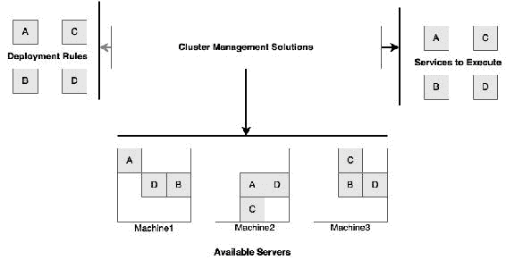

在本节中，我们将探讨市场上可用的一些流行的集群管理解决方案。

## Docker Swarm

Docker Swarm 是 Docker 的本地集群管理解决方案。Swarm 与 Docker 有本地和更深层次的集成，并公开与 Docker 远程 API 兼容的 API。Docker Swarm 在逻辑上将一组 Docker 主机分组，并将它们作为单个大型 Docker 虚拟主机进行管理。与应用程序管理员和开发人员决定将容器部署在哪个主机不同，这个决策将被委托给 Docker Swarm。Docker Swarm 将根据装箱和扩展算法决定使用哪个主机。

由于 Docker Swarm 基于 Docker 的远程 API，对于已经使用 Docker 的人来说，其学习曲线比任何其他容器编排工具都要窄。然而，Docker Swarm 是市场上相对较新的产品，它只支持 Docker 容器。

Docker Swarm 使用**管理器**和**节点**的概念。管理器是管理人员与 Docker 容器进行交互和调度的单一点。节点是部署和运行 Docker 容器的地方。

## Kubernetes

Kubernetes（k8s）来自谷歌的工程，使用 Go 语言编写，并在谷歌进行了大规模部署的实战测试。与 Swarm 类似，Kubernetes 帮助管理跨节点集群的容器化应用程序。Kubernetes 帮助自动化容器部署、调度和容器的可伸缩性。Kubernetes 支持许多有用的功能，例如自动渐进式部署、版本化部署以及容器的弹性，如果容器由于某种原因失败。

Kubernetes 架构具有**主节点**，**节点**和**Pods**的概念。主节点和节点一起形成一个 Kubernetes 集群。主节点负责在多个节点之间分配和管理工作负载。节点只是一个虚拟机或物理机。节点进一步细分为 Pods。一个节点可以托管多个 Pods。一个或多个容器被分组并在一个 Pod 内执行。Pods 还有助于管理和部署共同服务以提高效率。Kubernetes 还支持标签的概念，作为键值对来查询和找到容器。标签是用户定义的参数，用于标记执行共同类型工作负载的某些类型的节点，例如前端 Web 服务器。部署在集群上的服务获得一个单一的 IP/DNS 来访问该服务。

Kubernetes 对 Docker 有开箱即用的支持；然而，与 Docker Swarm 相比，Kubernetes 的学习曲线更陡峭。RedHat 作为其 OpenShift 平台的一部分，为 Kubernetes 提供商业支持。

## Apache Mesos

Mesos 是由加州大学伯克利分校最初开发的开源框架，被 Twitter 大规模使用。Twitter 主要使用 Mesos 来管理庞大的 Hadoop 生态系统。

Mesos 与之前的解决方案略有不同。Mesos 更像是一个资源管理器，依赖其他框架来管理工作负载的执行。Mesos 位于操作系统和应用程序之间，提供了一个逻辑机器集群。

Mesos 是一个分布式系统内核，它将许多计算机逻辑分组和虚拟化为一个大型机器。Mesos 能够将多种异构资源分组到一个统一的资源集群上，应用程序可以在其上部署。因此，Mesos 也被称为在数据中心构建私有云的工具。

Mesos 具有**主节点**和**从节点**的概念。与之前的解决方案类似，主节点负责管理集群，而从节点运行工作负载。Mesos 内部使用 ZooKeeper 进行集群协调和存储。Mesos 支持框架的概念。这些框架负责调度和运行非容器化应用程序和容器。Marathon，Chronos 和 Aurora 是用于调度和执行应用程序的流行框架。Netflix Fenzo 是另一个开源的 Mesos 框架。有趣的是，Kubernetes 也可以用作 Mesos 框架。

Marathon 支持 Docker 容器以及非容器化应用程序。Spring Boot 可以直接在 Marathon 中配置。Marathon 提供了许多开箱即用的功能，例如支持应用程序依赖关系，将应用程序分组以扩展和升级服务，启动和关闭健康和不健康的实例，推出推广，回滚失败的推广等。

Mesosphere 为 Mesos 和 Marathon 提供商业支持，作为其 DCOS 平台的一部分。

## Nomad

HashiCorp 的 Nomad 是另一个集群管理软件。Nomad 是一个集群管理系统，它抽象了较低级别的机器细节和它们的位置。Nomad 的架构与之前探讨的其他解决方案相比更简单。Nomad 也更轻量级。与其他集群管理解决方案类似，Nomad 负责资源分配和应用程序的执行。Nomad 还接受用户特定的约束，并根据此分配资源。

Nomad 具有**服务器**的概念，所有作业都由其管理。一个服务器充当**领导者**，其他充当**跟随者**。Nomad 具有**任务**的概念，这是最小的工作单位。任务被分组成**任务组**。一个任务组有在相同位置执行的任务。一个或多个任务组或任务被管理为**作业**。

Nomad 支持许多工作负载，包括 Docker，开箱即用。Nomad 还支持跨数据中心的部署，并且具有区域和数据中心感知能力。

## 舰队

Fleet 是 CoreOS 的集群管理系统。它在较低级别上运行，并在 systemd 之上工作。Fleet 可以管理应用程序依赖关系，并确保所有所需的服务在集群中的某个地方运行。如果服务失败，它会在另一个主机上重新启动服务。在分配资源时可以提供亲和性和约束规则。

Fleet 具有**引擎**和**代理**的概念。在集群中任何时候只有一个引擎，但有多个代理。任务提交给引擎，代理在集群机器上运行这些任务。

Fleet 也支持 Docker。

# 使用 Mesos 和 Marathon 进行集群管理

正如我们在前一节中讨论的，有许多集群管理解决方案或容器编排工具可供选择。不同的组织根据其环境选择不同的解决方案来解决问题。许多组织选择 Kubernetes 或带有 Marathon 等框架的 Mesos。在大多数情况下，Docker 被用作默认的容器化方法来打包和部署工作负载。

在本章的其余部分，我们将展示 Mesos 如何与 Marathon 一起提供所需的集群管理能力。许多组织使用 Mesos，包括 Twitter、Airbnb、Apple、eBay、Netflix、PayPal、Uber、Yelp 等。

## 深入了解 Mesos

Mesos 可以被视为数据中心内核。DCOS 是 Mesos 的商业版本，由 Mesosphere 支持。为了在一个节点上运行多个任务，Mesos 使用资源隔离概念。Mesos 依赖于 Linux 内核的**cgroups**来实现类似容器方法的资源隔离。它还支持使用 Docker 进行容器化隔离。Mesos 支持批处理工作负载以及 OLTP 类型的工作负载：

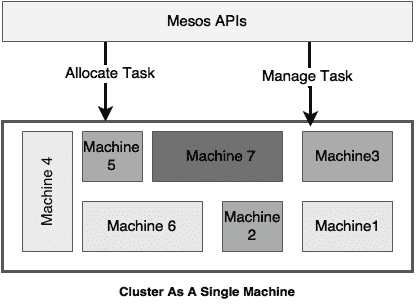

Mesos 是一个在 Apache 许可下的开源顶级 Apache 项目。Mesos 将 CPU、内存和存储等较低级别的计算资源从较低级别的物理或虚拟机中抽象出来。

在我们研究为什么需要 Mesos 和 Marathon 之前，让我们先了解 Mesos 架构。

### Mesos 架构

以下图表显示了 Mesos 的最简单的架构表示。Mesos 的关键组件包括一个 Mesos 主节点，一组从属节点，一个 ZooKeeper 服务和一个 Mesos 框架。Mesos 框架进一步分为两个组件：调度程序和执行程序：

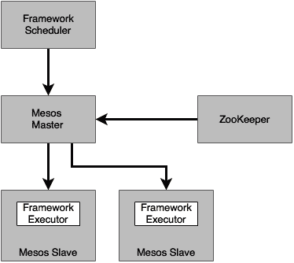

前面图表中的方框解释如下：

+   **主节点**：Mesos 主节点负责管理所有 Mesos 从属节点。Mesos 主节点从所有从属节点获取资源可用性信息，并负责根据特定资源策略和约束适当地填充资源。Mesos 主节点从所有从属机器中抢占可用资源，并将它们汇集为一个单一的大型机器。主节点根据这个资源池向运行在从属机器上的框架提供资源。

为了实现高可用性，Mesos 主节点由 Mesos 主节点的备用组件支持。即使主节点不可用，现有任务仍然可以执行。但是，在没有主节点的情况下无法调度新任务。主节点备用节点是等待活动主节点故障并在故障发生时接管主节点角色的节点。它使用 ZooKeeper 进行主节点领导者选举。领导者选举必须满足最低法定人数要求。

+   **从属节点**：Mesos 从属节点负责托管任务执行框架。任务在从属节点上执行。Mesos 从属节点可以以键值对的形式启动，例如*数据中心=X*。这在部署工作负载时用于约束评估。从属机器与 Mesos 主节点共享资源可用性。

+   ZooKeeper：ZooKeeper 是 Mesos 中使用的集中协调服务器，用于协调 Mesos 集群中的活动。在 Mesos 主节点故障的情况下，Mesos 使用 ZooKeeper 进行领导者选举。

+   框架：Mesos 框架负责理解应用程序的约束，接受主节点的资源提供，并最终在主节点提供的从属资源上运行任务。Mesos 框架由两个组件组成：框架调度程序和框架执行程序：

+   调度程序负责注册到 Mesos 并处理资源提供

+   执行程序在 Mesos 从属节点上运行实际程序

框架还负责执行某些策略和约束。例如，一个约束可以是，假设最少有 500MB 的 RAM 可用于执行。

框架是可插拔组件，可以用另一个框架替换。框架工作流程如下图所示：

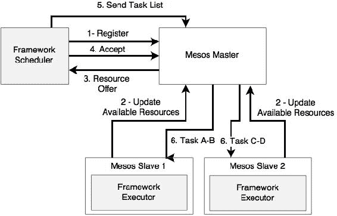

在前面的工作流程图中表示的步骤如下所述：

1.  框架向 Mesos 主节点注册并等待资源提供。调度程序可能有许多任务在其队列中等待执行，具有不同的资源约束（例如，在此示例中为任务 A 到 D）。在这种情况下，任务是安排的工作单元，例如 Spring Boot 微服务。

1.  Mesos 从属将可用资源提供给 Mesos 主节点。例如，从属会广告其机器上可用的 CPU 和内存。

1.  然后，Mesos 主节点根据设置的分配策略创建资源提供，并将其提供给框架的调度组件。分配策略确定资源将提供给哪个框架以及将提供多少资源。可以通过插入额外的分配策略来自定义默认策略。

1.  基于约束、能力和策略的调度框架组件可能接受或拒绝资源提供。例如，如果资源不足，框架会拒绝资源提供，根据设置的约束和策略。

1.  如果调度程序组件接受资源提供，它将提交一个或多个任务的详细信息给 Mesos 主节点，每个任务都有资源约束。例如，在这个例子中，它准备好提交任务 A 到 D。

1.  Mesos 主节点将任务列表发送给资源可用的从属。安装在从属机器上的框架执行程序组件会接收并运行这些任务。

Mesos 支持许多框架，例如：

+   用于长时间运行的进程（例如 Web 应用程序）的 Marathon 和 Aurora

+   用于大数据处理的 Hadoop、Spark 和 Storm

+   用于批处理调度的 Chronos 和 Jenkins

+   用于数据管理的 Cassandra 和 Elasticsearch

在本章中，我们将使用 Marathon 来运行 docker 化的微服务。

### Marathon

Marathon 是 Mesos 框架实现之一，可以运行容器和非容器执行。Marathon 特别设计用于长时间运行的应用程序，例如 Web 服务器。Marathon 确保使用 Marathon 启动的服务即使 Mesos 上托管的从属失败也能继续可用。这将通过启动另一个实例来完成。

Marathon 是用 Scala 编写的，具有高度可扩展性。Marathon 提供 UI 以及 REST API 与 Marathon 交互，例如启动、停止、扩展和监视应用程序。

与 Mesos 类似，Marathon 的高可用性是通过运行指向 ZooKeeper 实例的多个 Marathon 实例来实现的。其中一个 Marathon 实例充当领导者，其他实例处于待机模式。如果领先的主节点失败，将进行领导者选举，并确定下一个活动主节点。

Marathon 的一些基本特性包括：

+   设置资源约束

+   应用程序的扩展、缩减和实例管理

+   应用程序版本管理

+   启动和关闭应用程序

Marathon 的一些高级功能包括：

+   滚动升级、滚动重启和回滚

+   蓝绿部署

# 为 BrownField 微服务实现 Mesos 和 Marathon

在本节中，将部署在 AWS 云中并使用 Mesos 和 Marathon 进行管理的 docker 化的 Brownfield 微服务，该微服务在第八章中开发。

为了演示目的，解释中只涵盖了三个服务（**搜索**、**搜索 API 网关**和**网站**）：

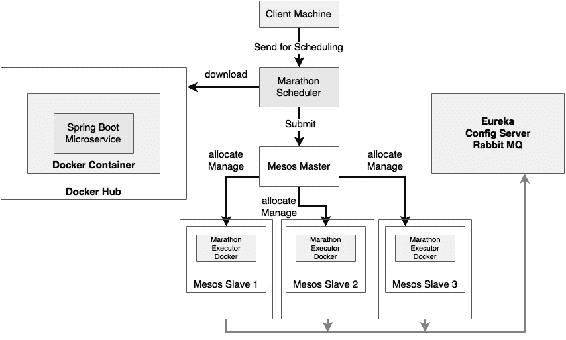

目标状态实现的逻辑架构如上图所示。该实现使用多个 Mesos 从属实例来执行 docker 化的微服务，其中包括一个 Mesos 主节点。使用 Marathon 调度程序组件来调度 docker 化的微服务。docker 化的微服务托管在 Docker Hub 注册表上。docker 化的微服务使用 Spring Boot 和 Spring Cloud 实现。

以下图表显示了物理部署架构：

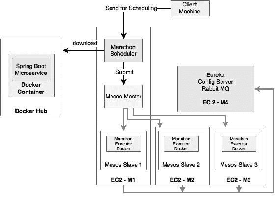

如上图所示，在本示例中，我们将使用四个 EC2 实例：

+   **EC2-M1**：这个托管了 Mesos 主节点、ZooKeeper、Marathon 调度程序和一个 Mesos 从属实例

+   **EC2-M2**：这个托管了一个 Mesos 从属实例

+   **EC2-M3**：这个托管了另一个 Mesos 从属实例

+   **EC2-M4**：这个托管了 Eureka、配置服务器和 RabbitMQ

对于真正的生产设置，需要多个 Mesos 主节点以及多个 Marathon 实例来实现容错。

## 设置 AWS

启动四个将用于此部署的**t2.micro** EC2 实例。所有四个实例必须在同一个安全组中，以便实例可以使用它们的本地 IP 地址相互看到。

以下表格显示了机器详细信息和 IP 地址，仅供参考和链接后续指令：

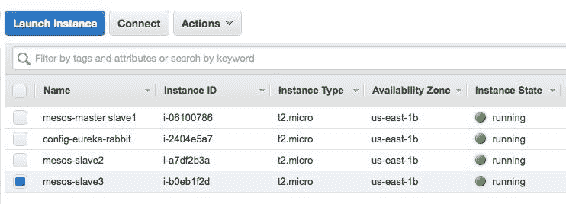

| 实例 ID | 私有 DNS/IP | 公有 DNS/IP |
| --- | --- | --- |
| `i-06100786` | `ip-172-31-54-69.ec2.internal``172.31.54.69` | `ec2-54-85-107-37.compute-1.amazonaws.com``54.85.107.37` |
| `i-2404e5a7` | `ip-172-31-62-44.ec2.internal``172.31.62.44` | `ec2-52-205-251-150.compute-1.amazonaws.com``52.205.251.150` |
| `i-a7df2b3a` | `ip-172-31-49-55.ec2.internal``172.31.49.55` | `ec2-54-172-213-51.compute-1.amazonaws.com``54.172.213.51` |
| `i-b0eb1f2d` | `ip-172-31-53-109.ec2.internal``172.31.53.109` | `ec2-54-86-31-240.compute-1.amazonaws.com``54.86.31.240` |

根据您的 AWS EC2 配置替换 IP 和 DNS 地址。

## 安装 ZooKeeper、Mesos 和 Marathon

在部署中将使用以下软件版本。本节中的部署遵循前一节中解释的物理部署架构：

+   Mesos 版本 0.27.1

+   Docker 版本 1.6.2，构建 7c8fca2

+   Marathon 版本 0.15.3

### 注意

有关设置 ZooKeeper、Mesos 和 Marathon 的详细说明，请参阅[`open.mesosphere.com/getting-started/install/`](https://open.mesosphere.com/getting-started/install/)。

执行以下步骤进行最小化安装 ZooKeeper、Mesos 和 Marathon 以部署 BrownField 微服务：

1.  作为先决条件，所有机器上必须安装 JRE 8。执行以下命令：

```java
sudo apt-get -y install oracle-java8-installer

```

1.  通过以下命令在所有标记为 Mesos 从属实例的机器上安装 Docker：

```java
sudo apt-get install docker

```

1.  打开终端窗口并执行以下命令。这些命令设置了用于安装的存储库：

```java
sudo apt-key adv --keyserver hkp://keyserver.ubuntu.com:80 --recv E56151BF
DISTRO=$(lsb_release -is | tr '[:upper:]' '[:lower:]')
CODENAME=$(lsb_release -cs)
# Add the repository
echo "deb http://repos.mesosphere.com/${DISTRO} ${CODENAME} main" | \
 sudo tee /etc/apt/sources.list.d/mesosphere.list
sudo apt-get -y update

```

1.  执行以下命令安装 Mesos 和 Marathon。这也将安装 Zookeeper 作为依赖项：

```java
sudo apt-get -y install mesos marathon

```

在为 Mesos slave 执行保留的三个 EC2 实例上重复上述步骤。作为下一步，必须在为 Mesos 主节点标识的机器上配置 ZooKeeper 和 Mesos。

### 配置 ZooKeeper

连接到为 Mesos 主节点和 Marathon 调度器保留的机器。在这种情况下，`172.31.54.69`将用于设置 ZooKeeper、Mesos 主节点和 Marathon。

ZooKeeper 需要进行两个配置更改，如下：

1.  第一步是将`/etc/zookeeper/conf/myid`设置为介于`1`和`255`之间的唯一整数，如下所示：

```java
Open vi /etc/zookeeper/conf/myid and set 1\. 

```

1.  下一步是编辑`/etc/zookeeper/conf/zoo.cfg`。更新文件以反映以下更改：

```java
# specify all zookeeper servers
# The first port is used by followers to connect to the leader
# The second one is used for leader election
server.1= 172.31.54.69:2888:3888
#server.2=zookeeper2:2888:3888
#server.3=zookeeper3:2888:3888
```

用相关的私有 IP 地址替换 IP 地址。在这种情况下，我们将只使用一个 ZooKeeper 服务器，但在生产场景中，需要多个服务器以实现高可用性。

### 配置 Mesos

对 Mesos 配置进行更改，以指向 ZooKeeper，设置仲裁，并通过以下步骤启用 Docker 支持：

1.  编辑`/etc/mesos/zk`以设置以下值。这是为了将 Mesos 指向 ZooKeeper 实例进行仲裁和领导者选举：

```java
zk:// 172.31.54.69:2181/mesos 
```

1.  编辑`/etc/mesos-master/quorum`文件，并将值设置为`1`。在生产场景中，可能需要最少三个仲裁：

```java
vi /etc/mesos-master/quorum

```

1.  默认的 Mesos 安装不支持 Mesos slave 上的 Docker。为了启用 Docker，更新以下`mesos-slave`配置：

```java
echo 'docker,mesos' > /etc/mesos-slave/containerizers

```

### 作为服务运行 Mesos、Marathon 和 ZooKeeper

所有必需的配置更改都已实施。启动 Mesos、Marathon 和 Zookeeper 的最简单方法是将它们作为服务运行，如下所示：

+   以下命令启动服务。服务需要按以下顺序启动：

```java
sudo service zookeeper start
sudo service mesos-master start
sudo service mesos-slave start
sudo service marathon start

```

+   在任何时候，可以使用以下命令来停止这些服务：

```java
sudo service zookeeper stop
sudo service mesos-master stop
sudo service mesos-slave stop
sudo service marathon stop

```

+   一旦服务启动并运行，使用终端窗口验证服务是否正在运行：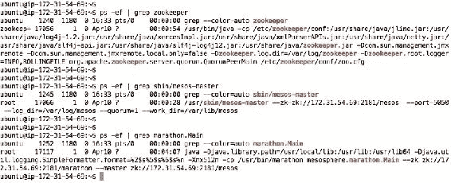

#### 在命令行中运行 Mesos slave

在这个例子中，我们将使用命令行版本来调用 Mesos slave，以展示额外的输入参数，而不是使用 Mesos slave 服务。停止 Mesos slave，并使用此处提到的命令行来重新启动 slave：

```java
$sudo service mesos-slave stop

$sudo /usr/sbin/mesos-slave  --master=172.31.54.69:5050 --log_dir=/var/log/mesos --work_dir=/var/lib/mesos --containerizers=mesos,docker --resources="ports(*):[8000-9000, 31000-32000]"

```

所使用的命令行参数解释如下：

+   `--master=172.31.54.69:5050`：此参数用于告诉 Mesos slave 连接到正确的 Mesos 主节点。在这种情况下，只有一个主节点在`172.31.54.69:5050`运行。所有的 slave 都连接到同一个 Mesos 主节点。

+   `--containerizers=mesos,docker`：此参数用于启用对 Docker 容器执行以及在 Mesos slave 实例上的非容器化执行的支持。

+   `--resources="ports(*):[8000-9000, 31000-32000]`：此参数表示 slave 在绑定资源时可以提供两个端口范围。`31000`到`32000`是默认范围。由于我们使用以`8000`开头的端口号，因此很重要告诉 Mesos slave 也允许从`8000`开始暴露端口。

执行以下步骤来验证 Mesos 和 Marathon 的安装：

1.  在所有为 slave 指定的三个实例上执行前面步骤中提到的命令来启动 Mesos slave。由于它们都连接到同一个主节点，因此可以在所有三个实例上使用相同的命令。

1.  如果 Mesos slave 成功启动，控制台中将出现类似以下的消息：

```java
I0411 18:11:39.684809 16665 slave.cpp:1030] Forwarding total oversubscribed resources

```

上述消息表明 Mesos slave 开始定期向 Mesos 主节点发送资源可用性的当前状态。

1.  打开`http://54.85.107.37:8080`来检查 Marathon UI。用 EC2 实例的公共 IP 地址替换 IP 地址：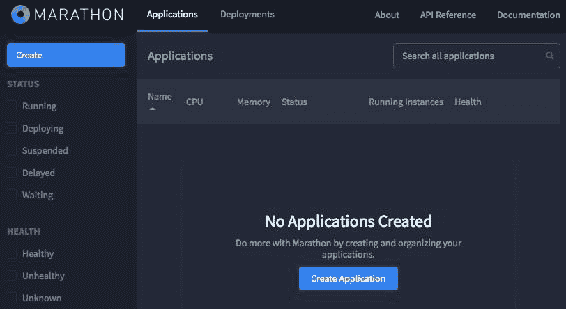

由于目前尚未部署任何应用程序，因此 UI 的**应用程序**部分为空。

1.  打开运行在端口`5050`上的 Mesos UI，访问`http://54.85.107.37:5050`：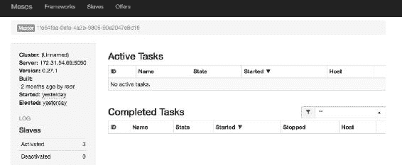

控制台的**从属**部分显示有三个已激活的 Mesos 从属可用于执行。它还表明没有活动任务。

### 准备 BrownField PSS 服务

在上一节中，我们成功地设置了 Mesos 和 Marathon。在本节中，我们将看看如何部署之前使用 Mesos 和 Marathon 开发的 BrownField PSS 应用程序。

### 注意

本章的完整源代码可在代码文件的`第九章`项目中找到。将`chapter8.configserver`、`chapter8.eurekaserver`、`chapter8.search`、`chapter8.search-apigateway`和`chapter8.website`复制到一个新的 STS 工作区，并将它们重命名为`chapter9.*`。

1.  在部署任何应用程序之前，我们必须在其中一个服务器上设置配置服务器、Eureka 服务器和 RabbitMQ。按照第八章中描述的*在 EC2 上运行 BrownField 服务*部分中描述的步骤，使用 Docker 容器化微服务。或者，我们可以在前一章中用于此目的的相同实例上使用。

1.  将所有`bootstrap.properties`文件更改为反映配置服务器的 IP 地址。

1.  在部署我们的服务之前，微服务需要进行一些特定的更改。当在 BRIDGE 模式下运行 docker 化的微服务时，我们需要告诉 Eureka 客户端要使用的主机名。默认情况下，Eureka 使用**实例 ID**进行注册。然而，这并不有用，因为 Eureka 客户端将无法使用实例 ID 查找这些服务。在上一章中，使用了 HOST 模式而不是 BRIDGE 模式。

主机名设置可以使用`eureka.instance.hostname`属性来完成。然而，在特定情况下在 AWS 上运行时，另一种方法是在微服务中定义一个 bean 来获取 AWS 特定的信息，如下所示：

```java
@Configuration
class EurekaConfig { 
@Bean
    public EurekaInstanceConfigBean eurekaInstanceConfigBean() {
    EurekaInstanceConfigBean config = new EurekaInstanceConfigBean(new InetUtils(new InetUtilsProperties()));
AmazonInfo info = AmazonInfo.Builder.newBuilder().autoBuild("eureka");
        config.setDataCenterInfo(info);
        info.getMetadata().put(AmazonInfo.MetaDataKey.publicHostname.getName(), info.get(AmazonInfo.MetaDataKey.publicIpv4));
        config.setHostname(info.get(AmazonInfo.MetaDataKey.localHostname));       
config.setNonSecurePortEnabled(true);
config.setNonSecurePort(PORT); 
config.getMetadataMap().put("instanceId",  info.get(AmazonInfo.MetaDataKey.localHostname));
return config;
}
```

上述代码使用亚马逊主机信息使用 Netflix API 提供了自定义的 Eureka 服务器配置。该代码使用私有 DNS 覆盖了主机名和实例 ID。端口从配置服务器中读取。该代码还假定每个服务一个主机，以便端口号在多次部署中保持不变。这也可以通过在运行时动态读取端口绑定信息来覆盖。

上述代码必须应用于所有微服务。

1.  使用 Maven 重新构建所有微服务。构建并推送 Docker 镜像到 Docker Hub。三个服务的步骤如下所示。对所有其他服务重复相同的步骤。在执行这些命令之前，工作目录需要切换到相应的目录：

```java
docker build -t search-service:1.0 .
docker tag search-service:1.0 rajeshrv/search-service:1.0
docker push rajeshrv/search-service:1.0

docker build -t search-apigateway:1.0 .
docker tag search-apigateway:1.0 rajeshrv/search-apigateway:1.0
docker push rajeshrv/search-apigateway:1.0

docker build -t website:1.0 .
docker tag website:1.0 rajeshrv/website:1.0
docker push rajeshrv/website:1.0

```

### 部署 BrownField PSS 服务

Docker 镜像现在已发布到 Docker Hub 注册表。执行以下步骤来部署和运行 BrownField PSS 服务：

1.  在专用实例上启动配置服务器、Eureka 服务器和 RabbitMQ。

1.  确保 Mesos 服务器和 Marathon 正在配置 Mesos 主服务器的机器上运行。

1.  按照之前描述的在所有机器上运行 Mesos 从属的命令行来运行 Mesos 从属。

1.  此时，Mesos Marathon 集群已经启动并准备好接受部署。可以通过为每个服务创建一个 JSON 文件来进行部署，如下所示：

```java
{
  "id": "search-service-1.0",
  "cpus": 0.5,
  "mem": 256.0,
  "instances": 1,
  "container": {
   "docker": {
    "type": "DOCKER",
      "image": "rajeshrv/search-service:1.0",
       "network": "BRIDGE",
       "portMappings": [
        {  "containerPort": 0, "hostPort": 8090 }
      ]
    }
  }
}
```

上述 JSON 代码将存储在`search.json`文件中。同样，也为其他服务创建一个 JSON 文件。

JSON 结构解释如下：

+   `id`：这是应用程序的唯一 ID。这可以是一个逻辑名称。

+   `cpus`和`mem`：这为应用程序设置了资源约束。如果资源提供不满足这个资源约束，Marathon 将拒绝来自 Mesos 主服务器的资源提供。

+   `instances`：这决定了要启动多少个此应用程序的实例。在前面的配置中，默认情况下，一旦部署，它就会启动一个实例。Marathon 在任何时候都会保持所述实例的数量。

+   `container`：此参数告诉 Marathon 执行器使用 Docker 容器进行执行。

+   `image`：这告诉 Marathon 调度器要使用哪个 Docker 镜像进行部署。在这种情况下，它将从 Docker Hub 仓库`rajeshrv`下载`search-service:1.0`镜像。

+   `network`：此值用于 Docker 运行时建议在启动新的 Docker 容器时使用的网络模式。这可以是 BRIDGE 或 HOST。在这种情况下，将使用 BRIDGE 模式。

+   `portMappings`：端口映射提供了如何映射内部和外部端口的信息。在前面的配置中，主机端口设置为`8090`，这告诉 Marathon 执行器在启动服务时使用`8090`。由于容器端口设置为`0`，相同的主机端口将分配给容器。如果主机端口值为`0`，Marathon 会选择随机端口。

1.  还可以使用 JSON 描述符进行额外的健康检查，如下所示：

```java
"healthChecks": [
    {
      "protocol": "HTTP",
      "portIndex": 0,
      "path": "/admin/health",
      "gracePeriodSeconds": 100,
      "intervalSeconds": 30,
      "maxConsecutiveFailures": 5
    }
  ]
```

1.  创建并保存此 JSON 代码后，使用 Marathon 的 REST API 将其部署到 Marathon：

```java
curl -X POST http://54.85.107.37:8080/v2/apps -d @search.json -H "Content-type: application/json"

```

对所有其他服务也重复此步骤。

上述步骤将自动将 Docker 容器部署到 Mesos 集群，并启动服务的一个实例。

### 审查部署

具体步骤如下：

1.  打开 Marathon UI。如下图所示，UI 显示所有三个应用程序都已部署，并处于**运行**状态。它还指示**1 个 1**实例处于**运行**状态：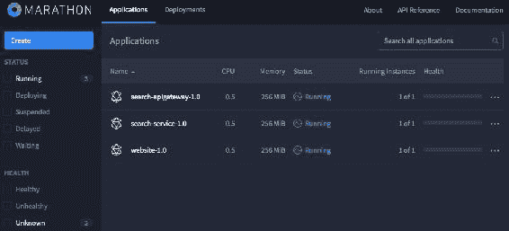

1.  访问 Mesos UI。如下图所示，有三个**活动任务**，全部处于**运行**状态。它还显示了这些服务运行的主机：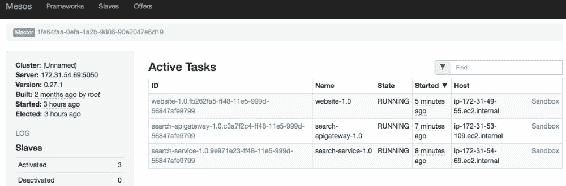

1.  在 Marathon UI 中，点击正在运行的应用程序。以下屏幕截图显示了**search-apigateway-1.0**应用程序。在**实例**选项卡中，显示了服务绑定的 IP 地址和端口：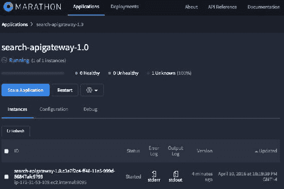

**扩展应用程序**按钮允许管理员指定需要多少个服务实例。这可用于扩展和缩减实例。

1.  打开 Eureka 服务器控制台，查看服务的绑定情况。如屏幕截图所示，当服务注册时，**AMI**和**可用区**会反映出来。访问`http://52.205.251.150:8761`：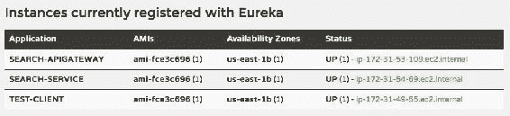

1.  在浏览器中打开`http://54.172.213.51:8001`，验证**Website**应用程序。

# 生命周期管理器的位置

生命周期管理器在第六章中介绍，具有根据需求自动扩展或缩减实例的能力。它还具有根据策略和约束条件在一组机器上决定部署何处和如何部署应用程序的能力。生命周期管理器的能力如下图所示：

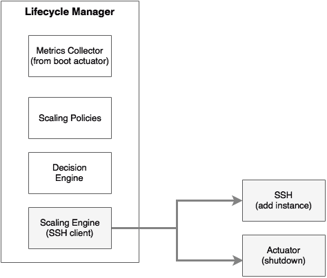

Marathon 具有根据策略和约束条件管理集群和集群部署的能力。可以使用 Marathon UI 更改实例的数量。

我们的生命周期管理器和 Marathon 之间存在冗余的能力。有了 Marathon，就不再需要 SSH 工作或机器级脚本。此外，部署策略和约束条件可以委托给 Marathon。Marathon 提供的 REST API 可以用于启动扩展功能。

**Marathon 自动缩放**是 Mesosphere 的一个自动缩放的概念验证项目。Marathon 自动缩放提供基本的自动缩放功能，如 CPU、内存和请求速率。

## 重写生命周期管理器与 Mesos 和 Marathon

我们仍然需要一个定制的生命周期管理器来收集来自 Spring Boot 执行器端点的指标。如果缩放规则超出了 CPU、内存和缩放速率，定制的生命周期管理器也很方便。

以下图表显示了使用 Marathon 框架更新的生命周期管理器：

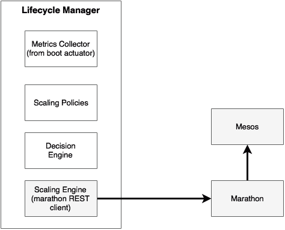

在这种情况下，生命周期管理器收集来自不同 Spring Boot 应用程序的执行器指标，将它们与其他指标结合起来，并检查特定的阈值。根据缩放策略，决策引擎通知缩放引擎是缩小还是扩大。在这种情况下，缩放引擎只是一个 Marathon REST 客户端。这种方法比我们早期使用 SSH 和 Unix 脚本的原始生命周期管理器实现更清洁、更整洁。

# 技术元模型

我们已经涵盖了使用 BrownField PSS 微服务的许多内容。以下图表通过将所有使用的技术汇总到技术元模型中来总结了这一点。

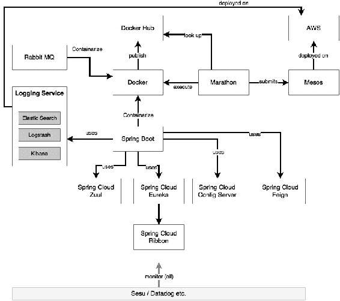

# 总结

在本章中，您了解了集群管理和初始化系统在大规模高效管理 docker 化微服务的重要性。

在深入研究 Mesos 和 Marathon 之前，我们探讨了不同的集群控制或集群编排工具。我们还在 AWS 云环境中实施了 Mesos 和 Marathon，以演示如何管理为 BrownField PSS 开发的 docker 化微服务。

在本章末尾，我们还探讨了生命周期管理器在 Mesos 和 Marathon 中的位置。最后，我们基于 BrownField PSS 微服务实现，总结了本章的技术元模型。

到目前为止，我们已经讨论了成功实施微服务所需的所有核心和支持技术能力。成功的微服务实施还需要超越技术的流程和实践。下一章，也是本书的最后一章，将涵盖微服务的流程和实践视角。
