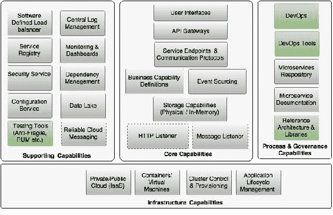
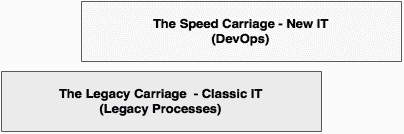
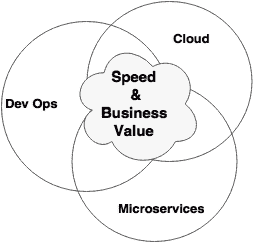
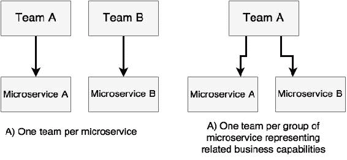
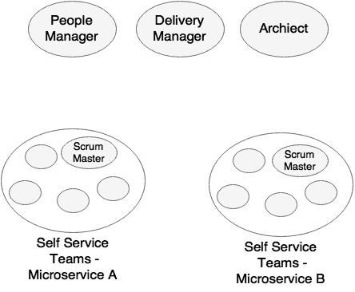
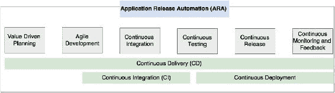

# 第十章：微服务开发生命周期

与**软件开发生命周期**（**SDLC**）类似，了解微服务开发生命周期流程的各个方面对于成功实施微服务架构至关重要。

本章将重点关注使用 BrownField 航空公司 PSS 微服务示例的开发过程和实践。此外，本章将描述在符合 DevOps 实践的情况下，构建开发团队、开发方法论、自动化测试和微服务的持续交付的最佳实践。最后，本章将通过阐明参考架构在微服务的分散治理方法中的重要性来结束。

通过本章结束时，您将了解以下主题：

+   在微服务开发的背景下审查 DevOps

+   定义微服务的生命周期和相关流程

+   围绕互联网规模的微服务的开发、测试和部署的最佳实践

# 审查微服务能力模型

本章将涵盖在第三章 *应用微服务概念*中讨论的微服务能力模型中的以下微服务能力：

+   DevOps

+   DevOps 工具

+   参考架构和库

+   测试工具（反脆弱、RUM 等）

# 精益 IT 的新口号-DevOps

我们在第二章 *使用 Spring Boot 构建微服务*中讨论了 DevOps 的定义。以下是对 DevOps 定义的快速回顾。

Gartner 对 DevOps 的定义如下：

> "DevOps 代表了 IT 文化的变革，侧重于通过采用敏捷、精益实践在系统导向方法的背景下实现快速的 IT 服务交付。DevOps 强调人（和文化），并致力于改善运营和开发团队之间的协作。DevOps 实施利用技术-特别是可以利用越来越可编程和动态的基础设施的自动化工具，从生命周期的角度来看。"

DevOps 和微服务是独立发展的。第一章 *解密微服务*，探讨了微服务的演变。在本节中，我们将回顾 DevOps 的演变，然后看看 DevOps 如何支持微服务的采用。

在数字颠覆的时代，为了支持现代业务，IT 组织必须掌握两个关键领域：交付速度和价值驱动的交付。这显然是除了精通领先技术之外的事情。

许多 IT 组织未能掌握这种变革，导致业务用户感到沮丧。为了克服这种情况，许多业务部门开始在其控制下启动自己的影子 IT 或隐形 IT。然后一些聪明的 IT 组织采用了精益 IT 模型来应对这些情况。

然而，许多组织仍然因为传统系统和流程的沉重包袱而在这一转变中挣扎。Gartner 提出了**速度分层应用策略**的概念。Gartner 认为，只有某些类型的应用程序或某些业务领域需要高速。Gartner 将其称为**创新系统**。创新系统需要比**记录系统**更快的创新。由于创新系统需要快速创新，因此对于这类应用程序来说，精益的 IT 交付模型是必不可少的。从业者将精益的 IT 模型宣扬为 DevOps。

组织采用的两种关键策略来采用 DevOps。

一些组织将 DevOps 定位为填补现有流程中的空白的过程。这些组织采用了 DevOps 旅程的渐进策略。采用路径从敏捷开发开始，然后逐步采用持续集成、自动化测试和发布到生产环境，然后采用所有 DevOps 实践。这类组织面临的挑战是实现全部益处的时间以及由于传统流程而导致的混合文化。

因此，许多组织采取了颠覆性的方法来采用 DevOps。这将通过将 IT 分成两层甚至两个不同的 IT 单元来实现。IT 的高速层使用 DevOps 风格的实践，从而彻底改变组织的文化，与传统流程和实践没有关联。将识别出一个选择性应用集群，并将其移至基于业务价值的新 IT：

DevOps 的目的不仅仅是降低成本。它还使业务能够通过快速将想法转化为产品来打破竞争对手。DevOps 以多种方式攻击传统 IT 问题，如此处所述。

## 减少浪费

DevOps 流程和实践本质上加快了交付速度，从而提高了质量。交付速度是通过减少 IT 浪费来实现的。这是通过避免对业务或期望的业务结果没有价值的工作来实现的。IT 浪费包括软件缺陷、生产力问题、流程开销、决策时间滞后、报告层面的时间、内部治理、过度估计等等。通过减少这些浪费，组织可以根本性地提高交付速度。主要通过采用敏捷流程、工具和技术来减少浪费。

## 自动化每一个可能的步骤

通过自动化手动执行的任务，可以显著提高交付速度和交付质量。自动化的范围从规划到客户反馈。自动化减少了将业务想法转化为产品的时间。这也减少了许多手动的门禁检查、官僚决策等。自动化的监控机制和反馈回到开发工厂，得到修复并快速转移到生产环境。

## 价值驱动交付

DevOps 通过价值驱动交付减少了 IT 与业务之间的差距。价值驱动交付通过理解真正的业务价值，将 IT 与业务紧密对齐，并通过快速交付这些价值来帮助业务，从而获得竞争优势。这类似于影子 IT 概念，其中 IT 与业务部门共同办公，并快速交付业务需求，而不是等待重型项目投资交付周期。

传统上，IT 与业务部门部分脱节，并且以 IT 关键绩效指标为主，比如成功项目交付的数量，而在新模式中，IT 与业务共享关键绩效指标。举例来说，一个新的 IT 关键绩效指标可能是 IT 帮助业务实现销售订单增长 10%，或者导致客户获取增长 20%。这将把 IT 的组织定位从仅仅是一个支持组织转变为业务伙伴。

## 弥合开发和运营之间的鸿沟

传统上，IT 在开发和运营方面有不同的团队。在许多情况下，它们通过逻辑障碍进行区分。DevOps 减少了开发和运营团队之间的差距，从而潜在地减少了浪费并提高了质量。多学科团队共同解决手头的问题，而不是互相指责。

通过 DevOps，运维团队将对开发团队开发的服务和应用程序有相当好的了解。同样，开发团队将对应用程序使用的基础设施组件和配置有很好的掌握。因此，运维团队可以根据服务行为做出决策，而不是在设计基础设施组件时强制执行标准组织政策和规则。这最终将有助于 IT 组织提高产品质量以及解决事件和问题管理的时间。

在 DevOps 世界中，通过高速变更的自动化实现交付速度，通过自动化和人员实现质量。通过效率、交付速度、质量和创新能力实现业务价值。通过自动化、生产力和减少浪费实现成本降低。

# 会见三人组-微服务、DevOps 和云

这三者-云、微服务和 DevOps-针对一组共同的目标：交付速度、业务价值和成本效益。所有三者可以独立存在和发展，但它们相互补充，以实现期望的共同目标。着手其中任何一个的组织自然倾向于考虑其他两个，因为它们密切相关：

许多组织从 DevOps 作为组织实践开始，以实现高速发布周期，但最终转向微服务架构和云。微服务和云不一定需要支持 DevOps。然而，自动化大型单片应用程序的发布周期并没有太多意义，在许多情况下，这是不可能实现的。在这种情况下，实施 DevOps 时，微服务架构和云将会很有用。

如果我们抛硬币，云不需要微服务架构来实现其好处。然而，要有效地实施微服务，云和 DevOps 都是必不可少的。

总之，如果一个组织的目标是以成本效益的方式实现高速交付和质量，这三者共同可以带来巨大的成功。

## 云作为微服务的自助服务基础设施

云的主要驱动力是提高敏捷性和降低成本。通过减少基础设施的配置时间，可以提高交付速度。通过最佳利用基础设施，可以降低成本。因此，云直接有助于实现交付速度和成本的双重目标。

如第九章中所讨论的，*使用 Mesos 和 Marathon 管理 Docker 化的微服务*，如果没有具有集群管理软件的云基础设施，部署微服务时很难控制基础设施成本。因此，具有自助服务能力的云对于微服务实现其全部潜力的好处至关重要。在微服务的背景下，云不仅帮助抽象物理基础设施，还提供了动态配置和自动部署的软件 API。这被称为**基础设施即代码**或**软件定义基础设施**。

## DevOps 作为微服务的实践和流程

微服务是一种能够快速交付的架构风格。然而，单独的微服务无法提供期望的好处。一个基于微服务的项目，交付周期为 6 个月，无法实现期望的交付速度或业务敏捷性。微服务需要一套支持的交付实践和流程，才能有效实现其目标。

DevOps 是微服务交付的基础流程和实践的理想候选者。DevOps 的流程和实践与微服务架构的理念相契合。

# 微服务开发的实践要点

为了成功交付微服务，需要考虑一系列从开发到交付的实践，包括 DevOps 理念。在前几章中，您了解了微服务的不同架构能力。在本节中，我们将探讨微服务开发的非架构方面。

## 理解业务动机和价值

微服务不应该只是为了实现一种小众的架构风格而被使用。在选择微服务作为某个问题的架构解决方案之前，了解业务价值和业务关键绩效指标非常重要。对业务动机和业务价值的深刻理解将帮助工程师们以成本效益的方式专注于实现这些目标。

业务动机和价值应该证明选择微服务的合理性。此外，使用微服务，业务价值应该从业务角度实现。这将避免 IT 投资于微服务，但业务没有利用微服务所带来的任何好处的情况。在这种情况下，基于微服务的开发将成为企业的负担。

## 从项目开发到产品开发的思维方式转变

如第一章中所讨论的，*解密微服务*，微服务更加符合产品开发。使用微服务交付的业务能力应被视为产品。这也符合 DevOps 理念。

项目开发和产品开发的思维方式是不同的。产品团队总是有一种所有权感，并对他们所生产的产品负责。因此，产品团队总是努力提高产品的质量。产品团队不仅负责交付软件，还负责产品的生产支持和维护。

产品团队通常直接与他们正在开发产品的业务部门联系在一起。一般来说，产品团队既有 IT 代表又有业务代表。因此，产品思维与实际业务目标密切相关。产品团队随时了解他们为实现业务目标所增加的价值。产品的成功直接取决于产品所获得的业务价值。

由于高速发布周期，产品团队总是对他们的交付感到满意，并且总是努力改进。这给团队带来了更多的积极动力。

在许多情况下，典型的产品团队是为长期而获得资金支持并保持完整性的。因此，产品团队的凝聚力更强。由于团队规模较小，这些团队专注于根据他们日常的学习经验改进他们的流程。

产品开发中的一个常见陷阱是 IT 人员代表业务参与产品团队。这些 IT 代表可能并不完全理解业务愿景。此外，他们可能没有权力代表业务做出决定。这种情况可能导致与业务的不一致，并很快导致失败。

同时，考虑团队的协同工作也很重要，业务和 IT 代表在同一地方工作。团队的协同工作增加了 IT 和业务团队之间的联系，减少了沟通成本。

## 选择开发理念

不同的组织采取不同的方法来开发微服务，无论是迁移还是新开发。选择适合组织的方法非常重要。有各种各样的方法可供选择，本节将解释其中的一些。

### 设计思维

设计思维是一种主要用于创新型开发的方法。这是一种从最终用户的角度探索系统的方法：客户看到什么，以及他们如何体验解决方案。然后基于观察、模式、直觉和访谈建立一个故事。

设计思维通过采用一些理论、逻辑推理和对问题的假设，快速设计解决方案。在达成一致的解决方案之前，这些概念通过头脑风暴得到扩展。

一旦解决方案确定，就会快速建立原型，以考虑客户对其的反应，然后相应地调整解决方案。当团队获得满意的结果时，下一步是扩大产品规模。请注意，原型可能是代码形式，也可能不是。

设计思维使用以人为中心的思维，包括情感、共鸣、直觉和想象力。在这种方法中，即使是已知的问题，解决方案也会被重新思考，以找到创新和更好的解决方案。

### 创业模式

越来越多的组织都在遵循创业哲学来提供解决方案。组织内部创建创业团队，使命是提供特定的解决方案。这些团队远离日常组织活动，专注于实现他们的使命。

许多初创公司都以一个小而专注的团队开始——一个高度凝聚的单位。这个团队不担心他们如何实现事情；相反，他们关注的是他们想要实现什么。一旦他们有了一个产品，团队就会考虑正确的构建和扩展方式。

这种方法通过首先考虑生产来实现快速交付。这种方法的优势在于团队不受组织治理和政治挑战的干扰。团队被授权进行创新思考，创新并交付成果。通常，这些团队表现出更高的所有权水平，这是成功的关键因素之一。这些团队只采用足够的流程和纪律来推动解决方案。他们还采用快速失败的方法，尽早进行调整。

### 敏捷实践

最常用的方法是敏捷开发方法。在这种方法中，软件以增量、迭代的方式交付，使用敏捷宣言中提出的原则。这种开发方法使用敏捷方法，如 Scrum 或 XP。敏捷宣言定义了敏捷软件开发团队应该关注的四个关键点：

+   个体和互动胜过流程和工具

+   可工作的软件胜过详尽的文档

+   与合同谈判相比，与客户合作

+   响应变化胜过遵循计划

### 注意

敏捷软件开发的 12 个原则可以在[`www.agilemanifesto.org/principles.html`](http://www.agilemanifesto.org/principles.html)找到。

## 使用最小可行产品的概念

不论之前解释的开发哲学如何，对于为了速度和敏捷性开发微服务系统来说，识别**最小可行产品**（MVP）是至关重要的。

Eric Ries 在开创精益创业运动时，将 MVP 定义为：

> “最小可行产品是新产品的那个版本，它允许团队以最少的努力收集关于客户的最大量的验证学习。”

MVP 方法的目标是快速构建一个展示软件最重要方面的软件。MVP 方法实现了一个想法的核心概念，并可能选择那些为业务增加最大价值的功能。它有助于获得早期反馈，然后在构建重型产品之前进行必要的调整。

MVP 可能是一个针对有限用户群体的成熟服务，或者是针对更广泛用户群体的部分服务。来自客户的反馈在 MVP 方法中非常重要。因此，将 MVP 发布给真实用户非常重要。

## 克服遗留热点

在着手微服务开发之前，了解组织中的环境和政治挑战是很重要的。

在微服务中，通常会直接或间接地依赖其他遗留应用程序。直接遗留集成的常见问题是遗留应用程序的开发周期缓慢。例如，一个创新的铁路预订系统依赖于一个古老的**事务处理设施**（**TPF**）来实现一些核心后端功能，比如预订。当将遗留的单片应用迁移到微服务时，这种情况尤其常见。在许多情况下，遗留系统继续以非敏捷方式进行开发，发布周期较长。在这种情况下，微服务开发团队可能无法因为与遗留系统的耦合而快速移动。集成点可能会严重拖累微服务的开发。组织政治挑战使情况变得更糟。

没有解决这个问题的万能方法。文化和流程差异可能是一个持续的问题。许多企业都会对这些遗留系统进行重点关注和投资，以支持快速移动的微服务。对这些遗留平台进行有针对性的 C 级干预可以减少开销。

## 解决数据库方面的挑战

自动化是微服务开发的关键。自动化数据库是许多微服务开发中的关键挑战之一。

在许多组织中，数据库管理员在数据库管理中扮演着关键角色，他们喜欢以不同的方式处理他们控制的数据库。保密性和数据访问控制也被认为是数据库管理员集中管理所有数据的原因。

许多自动化工具专注于应用逻辑。因此，许多开发团队完全忽视了数据库自动化。忽视数据库自动化可能严重影响整体效益，并可能使微服务开发偏离轨道。

为了避免这种情况，必须像应用程序一样对待数据库，具有适当的源代码控制和变更管理。在选择数据库时，考虑自动化也是一个关键因素。

在 NoSQL 数据库的情况下，数据库自动化要容易得多，但在传统的关系数据库管理系统中很难管理。**数据库生命周期管理**（**DLM**）作为一个概念在 DevOps 世界中很受欢迎，特别是用于处理数据库自动化。诸如 DBmaestro、Redgate DLM、Datical DB 和 Delphix 等工具支持数据库自动化。

## 建立自组织团队

微服务开发中最重要的活动之一是建立正确的开发团队。正如许多 DevOps 流程所建议的，一个小而专注的团队总是能够取得最好的结果。

由于微服务与业务能力对齐，并且是相当松散耦合的产品，因此最好为每个微服务设立一个专门的团队。可能会出现同一团队拥有来自同一业务领域的多个微服务的情况，代表相关能力。这些通常由微服务的耦合和大小决定。

团队规模是建立有效的微服务开发团队的重要因素。一般的观念是，团队规模不应超过 10 人。最佳交付的推荐规模在 4 到 7 之间。Amazon.com 的创始人 Jeff Bezos 提出了双比萨团队的理论。杰夫的理论认为，如果团队规模变大，就会面临沟通问题。较大的团队需要达成共识，这会导致增加浪费。大团队也会失去所有权和责任。一个标准是产品负责人应该有足够的时间与团队中的个人交谈，让他们理解他们正在交付的价值。

团队被期望在构思、分析、开发和支持服务方面承担完全的责任。来自 Amazon.com 的 Werner Vogels 称之为*你构建它，你运行它*。根据 Werner 的理论，开发人员更加关注开发质量的代码，以避免意外的支持电话。团队成员包括全栈开发人员和运维工程师。这样的团队完全了解所有领域。开发人员了解运营，运营团队了解应用程序。这不仅减少了团队之间的混乱，还提高了质量。

团队应该具备多学科技能，以满足交付服务所需的所有能力。理想情况下，团队不应依赖外部团队来交付服务的各个组成部分。相反，团队应该是自给自足的。然而，在大多数组织中，挑战在于稀缺的专业技能。例如，组织中可能没有很多图数据库的专家。解决这个问题的一种常见方法是使用顾问的概念。顾问是专家，并被聘用来获得团队面临的特定问题的专业知识。一些组织还使用共享或平台团队来提供一些常见的能力。

团队成员应该完全了解产品，不仅从技术角度，还从业务案例和业务 KPI 的角度。团队应该在交付产品以及共同实现业务目标方面拥有集体所有权。

敏捷软件开发也鼓励建立自组织团队。自组织团队作为一个紧密的单位，找到了作为团队实现目标的方法。团队自动调整自己并分配责任。团队成员是自我管理的，并有权在日常工作中做出决策。这种团队的沟通和透明度非常重要。这强调了需要共同定位和合作，以实现高带宽的沟通：

在前面的图表中，**微服务 A**和**微服务 B**都代表相关的业务能力。自组织团队平等对待团队中的每个人，团队内部没有太多的等级和管理开销。在这种情况下，管理会很薄。团队中不会有太多指定的垂直技能，比如团队负责人、UX 经理、开发经理、测试经理等等。在典型的微服务开发中，共享的产品经理、共享的架构师和共享的人员经理足以管理不同的微服务团队。在一些组织中，架构师也承担交付的责任。

自组织团队具有一定程度的自治权，并且有权以快速和敏捷的方式做出决策，而不必等待长时间运行的官僚决策过程，这种过程存在于许多企业中。在许多情况下，企业架构和安全性被视为事后考虑。然而，从一开始就将它们纳入是很重要的。在赋予团队最大自由度的同时，对开发人员的决策能力进行全面自动化的 QA 和合规性同样重要，以确保偏差能够尽早被捕捉到。

团队之间的沟通很重要。然而，在理想的世界中，它应该仅限于微服务之间的接口。团队之间的集成理想情况下应该通过消费者驱动的合同来处理，以测试脚本的形式，而不是通过描述各种场景的大型接口文档。当服务不可用时，团队应该使用模拟服务实现。

## 构建自助式云

在着手进行微服务之前，一个关键方面是构建一个云环境。当只有少量服务时，可以通过手动将它们分配到一组预先指定的虚拟机来轻松管理它们。

然而，微服务开发人员需要的不仅仅是一个 IaaS 云平台。团队中的开发人员和运维工程师都不应该担心应用程序部署在何处以及部署的最佳方式。他们也不应该担心如何管理容量。

这种复杂程度需要一个具有自助式能力的云平台，就像我们在第九章中讨论的那样，*使用 Mesos 和 Marathon 管理 Docker 化的微服务*，使用 Mesos 和 Marathon 集群管理解决方案。在第八章中讨论的容器化部署，*使用 Docker 容器化微服务*，在管理和端到端自动化中也很重要。构建这种自助式云生态系统是微服务开发的先决条件。

## 构建微服务生态系统

正如我们在第三章中讨论的能力模型，*应用微服务概念*，微服务需要许多其他能力。在实施大规模微服务之前，所有这些能力都应该就位。

这些能力包括服务注册、发现、API 网关和外部化配置服务。所有这些都由 Spring Cloud 项目提供。集中日志记录、监控等能力也是微服务开发的先决条件。

## 定义 DevOps 风格的微服务生命周期流程

DevOps 是微服务开发的最合适实践。已经实践 DevOps 的组织不需要另一种实践来进行微服务开发。

在本节中，我们将探讨微服务开发的生命周期。我们将从微服务的角度探索 DevOps 流程和实践，而不是为微服务重新发明流程。

在探索 DevOps 流程之前，让我们澄清一些 DevOps 世界中常用的术语：

+   **持续集成**（**CI**）：这在指定环境中连续自动化应用程序构建和质量检查，可以按时间触发方式或开发人员提交方式进行。CI 还将代码指标发布到中央仪表板，以及将二进制构件发布到中央存储库。CI 在敏捷开发实践中很受欢迎。

+   **持续交付**（**CD**）：这自动化了从构思到生产的软件交付实践。在非 DevOps 模型中，这以前被称为**应用生命周期管理**（**ALM**）。持续交付的一个常见解释是它是持续集成的下一个演进，它将 QA 周期整合到集成管道中，并使软件准备好发布到生产环境。需要手动操作才能将其移动到生产环境。

+   **持续部署**：这是一种自动化将应用程序二进制文件部署到一个或多个环境的方法，通过管理二进制文件的移动和相关配置参数。持续部署也被认为是持续交付的下一个演进，通过将自动发布流程整合到持续交付管道中。

+   **应用发布自动化**（**ARA**）：ARA 工具帮助监视和管理端到端的交付管道。ARA 工具使用 CI 和 CD 工具，并管理发布管理批准的附加步骤。ARA 工具还能够在不同环境中部署发布，并在部署失败时回滚。ARA 提供了一个完全协调的工作流管道，通过整合许多专门的工具来实现交付生命周期，如存储库管理、质量保证、部署等。XL Deploy 和 Automic 是一些 ARA 工具。

以下图表显示了微服务开发的 DevOps 流程：

现在让我们进一步探讨微服务开发的这些生命周期阶段。

### 价值驱动的规划

价值驱动的规划是敏捷开发实践中使用的术语。在微服务开发中，价值驱动的规划非常重要。在价值驱动的规划中，我们将确定要开发哪些微服务。最重要的是确定对业务价值最高和风险最低的需求。在从头开始开发微服务时，会使用 MVP 理念。在从单块到微服务的迁移中，我们将使用第三章中提供的指南，*应用微服务概念*，来确定首先采取哪些服务。选择的微服务预期能够精确地为业务提供预期的价值。作为价值驱动的规划的一部分，必须确定用于衡量这个价值的业务 KPI。

### 敏捷开发

一旦确定了微服务，开发必须采用敏捷方法，遵循敏捷宣言的原则。大多数组织在微服务开发中使用 Scrum 方法论。

### 持续集成

持续集成步骤应该自动构建各个团队成员产生的源代码并生成二进制文件。重要的是只构建一次，然后将二进制文件移动到后续阶段。持续集成还作为构建管道的一部分执行各种 QA，如代码覆盖率、安全检查、设计准则和单元测试用例。持续集成通常将二进制文件交付给二进制文件存储库，并将二进制文件部署到一个或多个环境中。部分功能测试也作为持续集成的一部分进行。

### 持续测试

一旦持续集成生成了二进制文件，它们就会被移动到测试阶段。在这个阶段，将启动完全自动化的测试循环。自动化测试作为测试阶段的一部分也很重要。自动化测试有助于提高可交付成果的质量。测试可能会在多个环境中进行，这取决于测试的类型。这可能从集成测试环境到生产环境，甚至在生产环境中进行测试。

### 持续发布

持续发布到生产环境负责实际部署、基础设施供应和发布。通过应用一定的规则，二进制文件会自动发货并部署到生产环境。许多组织在暂存环境中停止自动化，并使用手动批准步骤来移动到生产环境。

### 持续监控和反馈

持续监控和反馈阶段是敏捷微服务开发中最重要的阶段。在 MVP 场景中，这个阶段提供了有关 MVP 的初始接受情况的反馈，并评估了所开发服务的价值。在功能添加场景中，这进一步提供了有关用户如何接受这个新功能的见解。根据反馈，服务进行调整，然后重复相同的周期。

## 自动化持续交付管道

在前一节中，我们讨论了微服务开发的生命周期。生命周期阶段可以根据组织的需求以及应用程序的性质进行调整。在本节中，我们将看一下一个样本持续交付管道以及实施样本管道的工具集。

有许多工具可用于构建端到端管道，无论是在开源空间还是商业空间。组织可以选择他们选择的产品来连接管道任务。

### 提示

参考 XebiaLabs 周期表，了解构建持续交付管道的工具参考。网址为[`xebialabs.com/periodic-table-of-devops-tools/`](https://xebialabs.com/periodic-table-of-devops-tools/)。

最初设置管道可能会很昂贵，因为它们需要许多工具集和环境。组织可能无法立即从实施交付管道中获得成本效益。此外，构建管道需要高性能资源。大型构建管道可能涉及数百台机器。从一个端到另一个端将更改移动到管道需要数小时。因此，对于不同的微服务需要不同的管道非常重要。这也有助于解耦不同微服务的发布。

在管道中，应该使用并行处理在不同环境中执行测试。并且尽可能并行执行测试用例是很重要的。因此，根据应用程序的性质设计管道是很重要的。没有一刀切的情况。

管道的重点在于端到端的自动化，从开发到生产，并且在出现问题时快速失败。

以下管道是微服务的一个指示性示例，并探讨了在开发微服务管道时应考虑的不同能力：

自动化持续交付管道

持续交付管道阶段在以下部分进行了解释。

### 开发

开发阶段从开发的角度来看有以下活动。本节还指出了一些可以在开发阶段使用的工具。这些工具是除了规划、跟踪和沟通工具（如敏捷 JIRA、Slack 等）之外，敏捷开发团队使用的。看一下以下内容：

+   源代码：开发团队需要 IDE 或开发环境来编写源代码。在大多数组织中，开发人员可以自由选择他们想要的 IDE。话虽如此，IDE 可以与许多工具集成以检测违反指南的情况。一般来说，Eclipse IDE 具有用于静态代码分析和代码矩阵的插件。SonarQube 是一个集成其他插件的例子，例如用于代码约定的 Checkstyle，用于检测不良实践的 PMD，用于检测潜在错误的 FindBugs，以及用于代码覆盖率的 Cobertura。还建议使用 Eclipse 插件，如 ESVD、Find Security Bugs、SonarQube Security Rules 等，以检测安全漏洞。

+   单元测试用例：开发团队还使用 JUnit、NUnit、TestNG 等工具生成单元测试用例。单元测试用例针对组件、存储库、服务等进行编写。这些单元测试用例与本地 Maven 构建集成。针对微服务端点的单元测试用例（服务测试）作为回归测试包。如果使用 AngularJS 编写 Web UI，可以使用 Karma 进行测试。

+   消费者驱动契约：开发人员还编写 CDC 来测试与其他微服务的集成点。契约测试用例通常以 JUnit、NUnit、TestNG 等形式编写，并添加到前面步骤中提到的服务测试包中。

+   模拟测试：开发人员还编写模拟来模拟集成端点以执行单元测试用例。通常使用 Mockito、PowerMock 等进行模拟测试。一旦确定了服务契约，部署基于契约的模拟服务是一个良好的做法。这对于后续阶段的服务虚拟化是一个简单的机制。

+   行为驱动设计（BDD）：敏捷团队还使用 BDD 工具（如 Cucumber）编写 BDD 场景。通常，这些场景针对微服务契约或微服务 Web 应用程序公开的用户界面。这些场景分别使用 JUnit 和 Selenium WebDriver 的 Cucumber。不同的场景用于功能测试、用户旅程测试以及验收测试。

+   源代码存储库：源代码存储库是开发的一部分。开发人员通过 IDE 插件将他们的代码提交到中央存储库。许多组织使用每个微服务一个存储库的常见模式。这样可以阻止其他微服务开发人员修改其他微服务或根据其他微服务的内部表示编写代码。Git 和 Subversion 是流行的源代码存储库选择。

+   构建工具：构建工具（如 Maven 或 Gradle）用于管理依赖关系和构建目标工件，例如 Spring Boot 服务。构建本身集成了许多情况，例如基本质量检查、安全检查和单元测试用例、代码覆盖率等。这些与 IDE 类似，特别是当开发人员不使用 IDE 时。作为 IDE 的一部分考虑的工具也作为 Maven 插件可用。开发团队在项目的 CI 阶段之前不使用 Docker 等容器。所有工件都必须正确进行版本控制以适应每一次更改。

+   工件存储库：工件存储库在开发过程中扮演着关键角色。工件存储库是存储所有构建工件的地方。工件存储库可以是 Artifactory、Nexus 或类似产品。

+   数据库模式：Liquibase 和 Flyway 通常用于管理、跟踪和应用数据库更改。Maven 插件允许与 Liquibase 或 Flyway 库进行交互。模式更改被版本化和维护，就像源代码一样。

### 持续集成

一旦代码提交到存储库，下一个阶段——持续集成，就会自动开始。这是通过配置 CI 管道来实现的。该阶段使用存储库快照构建源代码并生成可部署的构件。不同的组织使用不同的事件来启动构建。CI 启动事件可能是每次开发人员提交或基于时间窗口，如每天、每周等。

CI 工作流程是该阶段的关键方面。持续集成工具，如 Jenkins、Bamboo 等，扮演着编排构建管道的中心角色。该工具配置了要调用的活动工作流程。工作流程会自动执行配置的步骤，如构建、部署和 QA。在开发人员提交或一定频率上，CI 启动工作流程。

在持续集成工作流程中进行以下活动：

1.  构建和 QA：工作流程监听 Git Webhooks 以进行提交。一旦检测到变化，第一步是从存储库下载源代码。对下载的快照源代码进行构建。作为构建的一部分，会自动执行许多 QA 检查，类似于在开发环境中执行的 QA。这些包括代码质量检查、安全检查和代码覆盖率。许多 QA 都是使用诸如 SonarQube 之类的工具进行的，还有前面提到的插件。它还收集诸如代码覆盖率等代码指标，并将其发布到用于分析的中央数据库。使用 OWASP ZAP Jenkins 的插件执行额外的安全检查。作为构建的一部分，还会执行 JUnit 或类似的用于编写测试用例的工具。如果 Web 应用程序支持 Karma 进行 UI 测试，Jenkins 也能够运行使用 Karma 编写的 Web 测试。如果构建或 QA 失败，它会按照系统中的配置发送警报。

1.  **打包**：一旦构建和 QA 通过，CI 会创建一个可部署的软件包。在我们的微服务案例中，它会生成 Spring Boot 独立的 JAR。建议在集成构建的过程中构建 Docker 镜像。这是我们构建二进制构件的唯一地方。构建完成后，它会将不可变的 Docker 镜像推送到 Docker 注册表。这可以是在 Docker Hub 上或私有的 Docker 注册表上。在这个阶段，正确地对容器进行版本控制非常重要。

1.  **集成测试**：Docker 镜像被移动到集成环境，进行回归测试（服务测试）等。该环境具有其他依赖的微服务功能，如 Spring Cloud、日志记录等。所有依赖的微服务也存在于此环境中。如果实际的依赖服务尚未部署，将使用服务虚拟化工具，如 MockServer。或者，由各自的开发团队将服务的基本版本推送到 Git。一旦成功部署，Jenkins 会触发服务测试（针对服务的 JUnits）、一组在 Selenium WebDriver 中编写的端到端健全性测试（在 Web 的情况下）以及使用 OWASP ZAP 进行安全测试。

### 自动化测试

在宣布构建准备投入生产之前，需要执行许多类型的测试作为自动交付过程的一部分。测试可能通过将应用程序移动到多个环境中进行。每个环境都专门用于特定类型的测试，如验收测试、性能测试等。这些环境都受到充分的监控，以收集相应的指标。

在复杂的微服务环境中，测试不应该被视为最后一分钟的门禁检查；相反，测试应该被视为提高软件质量以及避免最后一分钟失败的一种方式。左移测试是一种尽早将测试移到发布周期中的方法。自动化测试将软件开发转变为每天开发和每天测试的模式。通过自动化测试用例，我们将避免手动错误以及完成测试所需的工作。

CI 或 ARA 工具用于在多个测试环境中移动 Docker 镜像。一旦部署在环境中，测试用例将根据环境的目的执行。默认情况下，会执行一组理智测试来验证测试环境。

在本节中，我们将涵盖自动交付流程中所需的所有测试类型，而不管环境如何。我们已经将一些测试类型视为开发和集成环境的一部分。在本节的后面，我们还将对测试用例与执行环境进行映射。

#### 自动化候选测试

在本节中，我们将探讨在设计端到端交付流程时候自动化的不同类型的测试。关键的测试类型描述如下。

##### 自动化理智测试

在从一个环境迁移到另一个环境时，建议运行一些理智测试，以确保所有基本事项都正常工作。这是使用 JUnit 服务测试、Selenium WebDriver 或类似工具创建的测试包。重要的是要仔细识别和编写所有关键的服务调用。特别是如果微服务使用同步依赖进行集成，最好考虑这些场景，以确保所有依赖服务也正常运行。

##### 回归测试

回归测试确保软件的更改不会破坏系统。在微服务环境中，回归测试可以在服务级别（Rest API 或消息端点）进行，并使用 JUnit 或类似的框架编写，如前所述。当依赖服务不可用时，会使用服务虚拟化。Karma 和 Jasmine 可用于 Web UI 测试。

在微服务用于 Web 应用程序背后的情况下，使用 Selenium WebDriver 或类似工具准备回归测试包，并在 UI 级别进行测试，而不是专注于服务端点。或者，也可以使用 BDD 工具，如 Cucumber 与 JUnit 或 Cucumber 与 Selenium WebDriver，来准备回归测试包。CI 工具如 Jenkins 或 ARA 用于自动触发回归测试包。还有其他商业工具，如 TestComplete，也可以用于构建回归测试包。

##### 自动化功能测试

功能测试用例通常针对消费微服务的 UI。这些是基于用户故事或功能的业务场景。这些功能测试在每次构建时执行，以确保微服务的性能符合预期。

BDD 通常用于开发功能测试用例。通常在 BDD 中，业务分析师用特定领域的语言但用简单的英语编写测试用例。然后开发人员添加脚本来执行这些场景。自动化的 Web 测试工具如 Selenium WebDriver 在这种情况下非常有用，还有 BDD 工具如 Cucumber，JBehave，SpecFlow 等。在无头微服务的情况下使用 JUnit 测试用例。有一些流水线将回归测试和功能测试结合为一个步骤，并使用相同的测试用例。

##### 自动化验收测试

这与前面的功能测试用例非常相似。在许多情况下，自动接受测试通常使用屏幕剧本或旅程模式，并应用于 Web 应用程序级别。在构建测试用例时使用客户视角，而不是特性或功能。这些测试模拟用户流程。

BDD 工具，如 Cucumber、JBehave 和 SpecFlow 通常与 JUnit 或 Selenium WebDriver 一起在这些场景中使用，如前面的场景中所讨论的。功能测试和接受测试中测试用例的性质是不同的。通过将它们与 Jenkins 集成，可以实现接受测试包的自动化。市场上还有许多其他专门的自动接受测试工具。FitNesse 就是这样一种工具。

##### 性能测试

将性能测试自动化作为交付管道的一部分非常重要。这将性能测试从门控模型转变为交付管道的一个组成部分。通过这样做，可以在构建周期的早期阶段识别瓶颈。在一些组织中，性能测试仅针对重大发布进行，但在其他组织中，性能测试是管道的一部分。性能测试有多种选择。诸如 JMeter、Gatling、Grinder 等工具可用于负载测试。这些工具可以集成到 Jenkins 工作流程中进行自动化。然后可以使用 BlazeMeter 等工具进行测试报告。

应用性能管理工具，如 AppDynamics、New Relic、Dynatrace 等，作为交付管道的一部分提供质量指标。这可以在性能测试环境中使用这些工具来完成。在某些管道中，这些工具被集成到功能测试环境中，以获得更好的覆盖范围。Jenkins 具有插件来获取测量数据。

##### 真实用户流程模拟或旅程测试

这是另一种测试形式，通常用于分期和生产环境。这些测试在分期和生产环境中持续运行，以确保所有关键交易的执行符合预期。这比典型的 URL ping 监控机制更有用。通常类似于自动接受测试，这些测试用例模拟用户在现实世界中发生的旅程。这也有助于检查依赖的微服务是否正常运行。这些测试用例可以是接受测试用例的一个子集，或者使用 Selenium WebDriver 创建的测试包。

##### 自动化安全测试

确保自动化不违反组织的安全政策非常重要。安全是最重要的事情，为了速度而牺牲安全是不可取的。因此，将安全测试作为交付管道的一部分是很重要的。一些安全评估已经集成在本地构建环境以及集成环境中，例如 SonarQube、Find Security Bugs 等。一些安全方面作为功能测试用例的一部分。诸如 BDD-Security、Mittn 和 Gauntlt 等工具是遵循 BDD 方法的其他安全测试自动化工具。可以使用 ImmuniWeb 等工具进行 VAPT。OWASP ZAP 和 Burp Suite 是安全测试中的其他有用工具。

##### 探索性测试

探索性测试是测试人员或业务用户采用的手动测试方法，用于验证他们认为自动化工具可能无法捕捉的特定场景。测试人员以任何他们想要的方式与系统交互，而不带有偏见。他们利用自己的智慧来识别他们认为某些特殊用户可能会探索的场景。他们还通过模拟某些用户行为进行探索性测试。

##### A/B 测试、金丝雀测试和蓝绿部署

将应用程序移至生产时，通常会应用 A/B 测试、蓝绿部署和金丝雀测试。A/B 测试主要用于审查变更的有效性以及市场对变更的反应。新功能会向一定数量的用户推出。金丝雀发布是将新产品或功能先移至特定社区，然后再完全推向所有客户。蓝绿部署是从 IT 角度来看的一种部署策略，用于测试服务的新版本。在这种模式下，蓝色和绿色版本在某个时间点同时运行，然后从一个版本优雅地迁移到另一个版本。

##### 其他非功能测试

在生产之前执行高可用性和抗脆弱性测试（故障注入测试）也很重要。这有助于开发人员发现在真实生产场景中可能发生的未知错误。通常通过破坏系统的组件来理解它们的故障转移行为来完成。这也有助于测试系统中的断路器和备用服务。在这些情况下，Simian Army 等工具非常有用。

##### 在生产中进行测试

在生产中进行测试（TiP）与其他环境一样重要，因为我们只能模拟到一定程度。通常有两种类型的测试针对生产环境执行。第一种方法是以连续的方式运行真实用户流或旅程测试，模拟各种用户操作。这是使用 Real User Monitoring（RUM）工具之一，如 AppDynamics 自动化的。第二种方法是窃听生产中的消息，将它们在暂存环境中执行，然后将结果与生产环境中的结果进行比较。

##### 抗脆弱性测试

通常在与生产环境相同的预生产环境中进行抗脆弱性测试，甚至在生产环境中通过在环境中制造混乱来观察应用程序如何响应并从这些情况中恢复。随着时间的推移，应用程序能够自动从大多数故障中恢复。Simian Army 是 Netflix 的一个这样的工具。Simian Army 是专为 AWS 环境构建的一套产品。Simian Army 用于使用一组自主猴子在预生产或生产环境中制造混乱的破坏性测试。混沌猴、清洁工猴和一致性猴是 Simian Army 的一些组件。

#### 目标测试环境

针对不同的测试环境和这些环境中执行的测试类型如下：

+   开发环境：开发环境用于测试编码风格检查、不良实践、潜在错误、单元测试和基本安全扫描。

+   集成测试环境：集成环境用于跨多个微服务的单元测试和回归测试。一些基本的与安全相关的测试也在集成测试环境中执行。

+   性能和诊断：性能测试在性能测试环境中执行。应用程序性能测试工具部署在这些环境中，以收集性能指标并识别瓶颈。

+   功能测试环境：功能测试环境用于执行健全性测试和功能测试包。

+   UAT 环境：UAT 环境具有健全性测试、自动接受测试包和用户旅程模拟。

+   暂存：预生产环境主要用于健全性测试、安全性、抗脆弱性、网络测试等。它也用于用户旅程模拟和探索性测试。

+   生产：用户旅程模拟和 RUM 测试在生产环境中持续执行。

在多个环境中提供适当的数据以支持测试用例是最大的挑战。Delphix 是一种有效处理跨多个环境的测试数据的工具。

### 持续部署

持续部署是将应用程序部署到一个或多个环境，并相应地配置和提供这些环境的过程。如第九章中所讨论的，*使用 Mesos 和 Marathon 管理 Docker 化的微服务*，基础设施配置和自动化工具促进了部署自动化。

从部署的角度来看，一旦所有质量检查成功完成，发布的 Docker 镜像会自动移动到生产环境。在这种情况下，生产环境必须是基于云的，具有 Mesos 或 Marathon 等集群管理工具。必须具有监控能力的自助式云环境是强制性的。

集群管理和应用程序部署工具确保应用程序依赖项得到正确部署。这会自动部署所有需要的依赖项，以防缺失。它还确保在任何时间点都运行最少数量的实例。在发生故障时，它会自动回滚部署。它还会优雅地回滚升级。

Ansible、Chef 或 Puppet 是将配置和二进制文件移动到生产环境中的有用工具。可以使用 Ansible playbook 概念来启动具有 Marathon 和 Docker 支持的 Mesos 集群。

### 监控和反馈

一旦应用程序在生产环境中部署，监控工具会持续监控其服务。监控和日志管理工具收集和分析信息。根据反馈和所需的纠正措施，信息被反馈给开发团队采取纠正措施，并通过流水线将更改推回生产。诸如 APM、Open Web Analytics、Google Analytics、Webalizer 等工具对监控 Web 应用程序非常有用。真实用户监控应提供端到端的监控。QuBit、Boxever、Channel Site、MaxTraffic 等工具也对分析客户行为非常有用。

## 自动化配置管理

配置管理也必须从微服务和 DevOps 的角度重新思考。使用新的配置管理方法，而不是使用传统的静态配置的 CMDB。手动维护 CMDB 已不再是一个选择。静态管理的 CMDB 需要大量单调的任务来维护条目。同时，由于部署拓扑的动态性质，以一致的方式维护数据是非常困难的。

CMDB 的新样式会根据运行拓扑自动创建配置项配置。这些应该是基于发现的，以获取最新的信息。新的 CMDB 应该能够管理裸金属、虚拟机和容器。

# 微服务开发治理、参考架构和库

拥有整体企业参考架构和微服务开发的标准工具集非常重要，以确保开发以一致的方式进行。这有助于个别微服务团队遵守某些最佳实践。每个团队可能会确定适合其开发的专业技术和工具。在多语言微服务开发中，显然有不同团队使用多种技术。然而，他们必须遵守总体原则和实践。

为了快速取得成功并利用时间表，微服务开发团队在某些情况下可能会偏离这些做法。只要团队在他们的待办事项中添加重构任务，这是可以接受的。在许多组织中，尽管团队试图从企业中重复使用某些东西，但重复使用和标准化通常是事后想到的。

重要的是要确保服务在企业中被编目并可见。这提高了微服务的重复使用机会。

# 摘要

在本章中，您了解了微服务与 DevOps 之间的关系。我们还审查了开发微服务时的一些实践要点。最重要的是，您了解了微服务开发生命周期。

在本章的后面，我们还研究了如何将微服务交付流水线从开发自动化到生产。作为其中的一部分，我们研究了一些在自动化微服务交付流水线时有帮助的工具和技术。最后，我们强调了微服务治理中参考架构的重要性。

将本书涵盖的微服务概念、挑战、最佳实践和各种能力结合起来，是开发成功的大规模微服务的完美配方。
