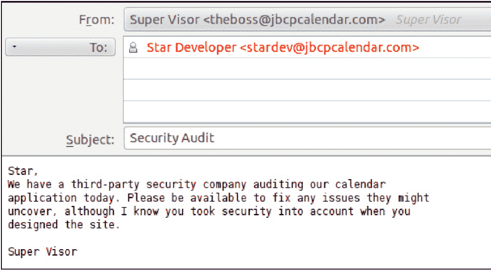
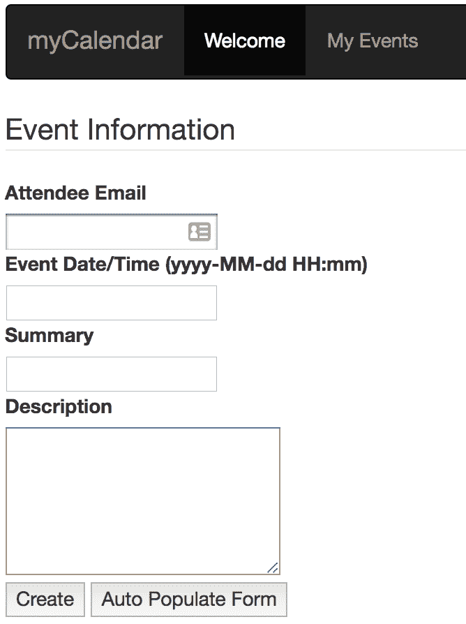
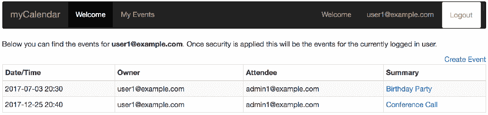
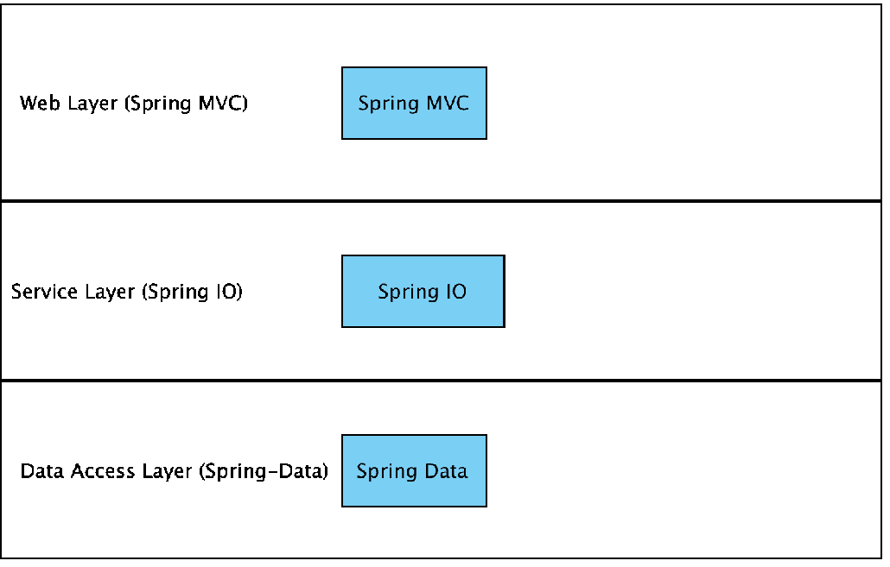
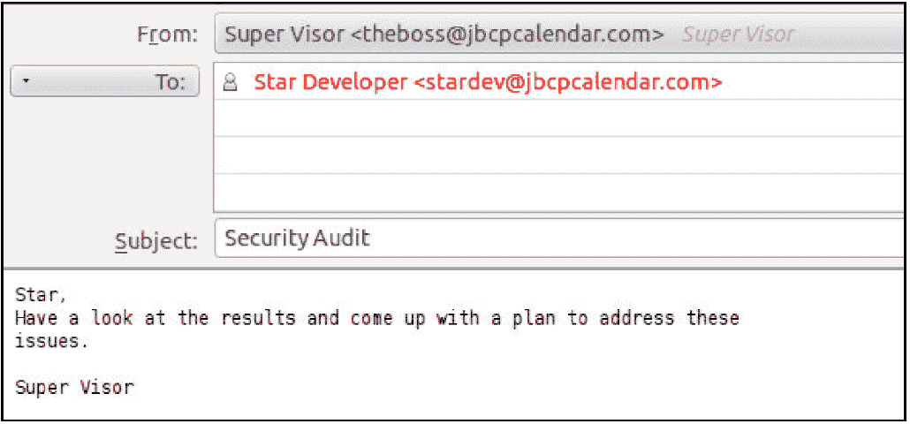
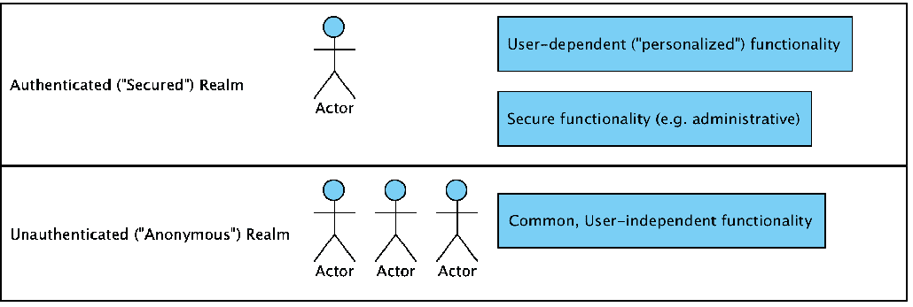
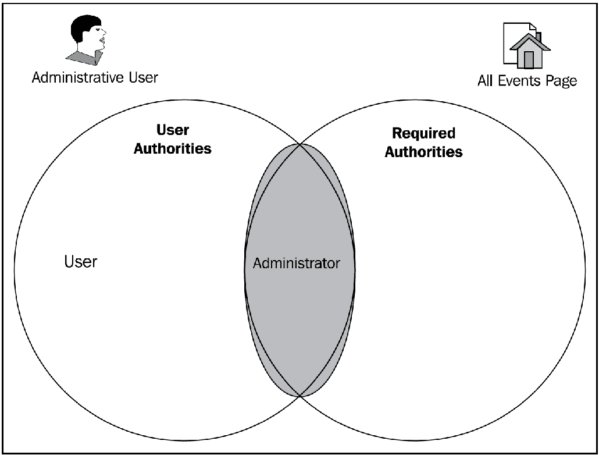
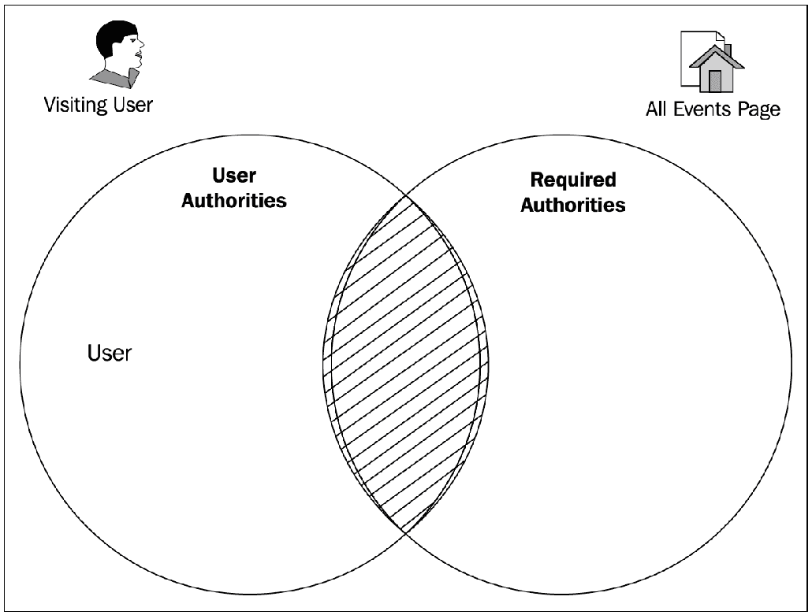

# 第一章：不安全应用程序的解剖

安全性可以说是 21 世纪任何基于 web 的应用程序最关键的架构组件之一。在一个恶意软件、犯罪分子和流氓员工始终存在并积极测试软件漏洞的时代，明智而全面地使用安全性是您将负责的任何项目的关键要素。

本书是为了遵循一种我们认为是解决复杂主题的有用前提的发展模式-以 Spring 4.2 为基础的基于 web 的应用程序，并理解使用 Spring Security 4.2 对其进行安全保护的核心概念和策略。我们通过为每个章节提供完整的 web 应用程序样例代码来补充这种方法。

无论您是否已经使用 Spring Security，或者对将软件的基本使用提升到更复杂的下一个级别感兴趣，您在这本书中都能找到帮助。在本章中，我们将涵盖以下主题：

+   虚构安全审计的结果

+   基于 web 的应用程序的一些常见安全问题

+   几个核心软件安全术语和概念

如果您已经熟悉基本的安全术语，您可以跳到第二章，*开始使用 Spring Security*，我们从框架的基本功能开始使用。

# 安全审计

在你作为**吉姆·鲍勃圆形裤子在线日历**（JBCPCalendar.com）的软件开发人员的工作中，早晨很早，你在喝第一杯咖啡的过程中收到了以下来自你上司的电子邮件：

什么？你在设计应用程序时没有考虑到安全性？实际上，到目前为止，你甚至不确定什么是安全审计。听起来你从安全审计师那里还有很多要学习的！在本章的后部分，我们将回顾什么是审计以及审计的结果。首先，让我们花一点时间检查一下正在审查的应用程序。

# 关于示例应用程序

虽然我们在本书中逐步进行的一个虚构场景，但应用程序的设计和我们对其所做的更改是基于 Spring-based 应用程序的真实世界使用情况。日历应用程序允许用户创建和查看事件：

在输入新事件的详细信息后，您将看到以下屏幕截图：

应用程序被设计为简单，以便我们可以专注于安全的重要方面，而不是陷入**对象关系映射** (**ORM**)和复杂 UI 技术的细节中。我们期待你会参考附录中的其他补充材料（本书*补充材料*部分）来覆盖作为示例代码一部分提供的一些基本功能。

代码是用 Spring 和 Spring Security 4.2 编写的，但将许多示例适应到 Spring Security 的其他版本相对容易。参考第十六章 16.html、*迁移到 Spring Security 4.2*中的讨论，了解 Spring Security 3 和 4.2 之间的详细变化，以帮助将示例翻译为 Spring Security 4 的语法。

请不要将这个应用程序作为构建真实在线日历应用程序的基础。它故意被构建为简单，并专注于我们在本书中说明的概念和配置。

# JBCP 日历应用程序架构

网络应用程序遵循标准的三层架构，包括 Web、服务和服务访问层，如下面的图表所示：

你可以在附录的*补充材料*部分找到有关 MVC 架构的额外材料。

Web 层封装了 MVC 代码和功能。在这个示例应用程序中，我们将使用 Spring MVC 框架，但我们同样可以轻松地使用**Spring Web Flow** (**SWF**)、**Apache Struts**，甚至是像**Apache Wicket**这样的 Spring 友好的 Web 堆栈。

在典型的利用 Spring Security 的网络应用程序中，Web 层是许多配置和代码增强发生的地方。例如，`EventsController`类用于将 HTTP 请求转换为将事件持久化到数据库中。如果你没有太多 Web 应用程序和 Spring MVC 的经验，仔细审查基线代码并确保你理解它是明智的，在我们进入更复杂的主题之前。再次强调，我们试图使网站尽可能简单，日历应用程序的构建只是为了提供一个合理的标题和轻量级的结构。

你可以在*附录*、*附加参考资料*中找到设置示例应用程序的详细说明。

服务层封装了应用程序的业务逻辑。在我们的示例应用程序中，我们使用`DefaultCalendarService`作为非常轻量级的外观，覆盖数据访问层，以说明关于保护应用程序服务方法的特定要点。服务层还用于在单个方法调用内操作 Spring Security API 和我们的日历 API。我们将在第三章 03.html、*自定义认证*中详细讨论这一点。

在一个典型的 Web 应用程序中，这个层次将包含业务规则验证、业务对象的组合和分解，以及诸如审计的交叉关注点。

数据访问层封装了负责操作数据库表内容的代码。在许多 Spring 应用程序中，这就是您会看到 ORM（如 Hibernate 或 JPA）使用的地方。它向服务层暴露基于对象的 API。在我们的示例应用程序中，我们使用基本的 JDBC 功能来实现对内存中 H2 数据库的持久化。例如，`JdbcEventDao`用于将事件对象保存到数据库中。

在一个典型的 Web 应用程序中，会使用更全面的数据访问解决方案。由于 ORM（对象关系映射），以及更一般的数据访问，对一些开发者来说可能比较困惑，因此这是我们选择尽可能简化清晰明了的区域。

# 应用程序技术

我们努力使应用程序尽可能容易运行，通过专注于几乎每个 Spring 开发者都会在其开发机器上拥有的基本工具和技术。尽管如此，我们还是在附录中提供了*入门*部分，作为补充信息，即*使用 JBCP 日历示例代码入门*。

与示例代码集成的主要方法是提供与 Gradle 兼容的项目。由于许多 IDE 与 Gradle 集成丰富，用户应该能够将代码导入支持 Gradle 的任何 IDE。由于许多开发者使用 Gradle，我们认为这是包装示例的最直接方法。无论您熟悉的开发环境是什么，希望您能找到一种方法来完成这本书中的示例。

许多 IDE 提供 Gradle 工具，可以自动为您下载 Spring 和 Spring Security 4.2 的 Javadoc 和源代码。然而，可能有时这是不可能的。在这种情况下，您需要下载 Spring 4.2 和 Spring Security 4.2 的完整版本。Javadoc 和源代码是顶级的。如果您感到困惑或需要更多信息，示例可以为您提供额外的支持或信心，以帮助您的学习。访问附录中的*补充材料*部分，即*附加参考资料*，以查找有关 Gradle 的额外信息，包括运行示例、获取源代码和 Javadoc，以及不使用 Gradle 构建项目的替代方案。

# 审查审计结果

让我们回到我们的电子邮件，看看审计进展如何。哦哦，结果看起来不太好：

**应用程序审计结果**

这个应用程序表现出以下不安全行为：

+   由于缺乏 URL 保护和一般认证，不经意的权限提升

+   不当或不存在授权使用

+   缺少数据库凭据安全

+   个人身份信息或敏感信息容易访问或未加密

+   由于缺乏 SSL 加密，传输层保护不安全。

+   风险等级：高

我们建议，在这些问题得到解决之前，该应用程序应下线。

哎呀！这个结果对我们公司来说看起来很糟糕。我们最好尽快解决这些问题。

第三方安全专家通常被公司（或其合作伙伴或客户）雇佣，通过结合白帽黑客、源代码审查和与应用程序开发人员和架构师正式或非正式的交谈，审计他们软件安全的效果。

**白帽黑客**或**道德黑客**是由专业人士进行的，他们受雇于公司，指导公司如何更好地保护自己，而不是出于恶意的目的。

通常，安全审计的目的是为了向管理层或客户提供信心，确保已经遵循了基本的安全开发实践，以确保客户数据和系统功能的完整性和安全性。根据软件目标行业的不同，审计员还可能使用行业特定的标准或合规性指标对其进行测试。

在你的职业生涯中某个时候可能会遇到的两个具体安全标准是**支付卡行业数据安全标准**（**PCI DSS**）和**健康保险隐私和责任法案**（**HIPAA**）隐私规则。这两个标准旨在通过结合流程和软件控制来确保特定敏感信息（如信用卡和医疗信息）的安全。许多其他行业和国家有关于敏感信息或**个人可识别信息**（**PII**）类似的规则。不遵循这些标准不仅是不好的实践，还可能在你或你的公司发生安全漏洞时暴露你或你的公司承担重大责任（更不用说坏新闻了）。

收到安全审计的结果可能是一次大开眼界的经历。按照要求改进软件可以是一个自我教育和软件改进的完美机会，并允许您实施导致安全软件的实践和政策。

让我们回顾一下审计员的调查结果，并详细制定一个解决它们的计划。

# 认证

认证是开发安全应用程序时必须深入理解的两个关键安全概念之一（另一个是授权）。**认证**的目的是确定谁正在尝试请求资源。你可能在日常生活中在线和离线环境下对认证熟悉，如下所述：

+   **基于凭证的认证**：当你登录基于网页的邮箱账户时，你很可能会提供你的用户名和密码。邮箱提供商将其用户名与数据库中的已知用户匹配，并验证你的密码与他们的记录相符。这些凭证是邮箱系统用来验证你是系统有效用户的东西。首先，我们将使用这种认证方式来保护 JBCP 日历应用程序的敏感区域。从技术上讲，邮箱系统不仅可以在数据库中检查凭证，还可以在任何地方进行检查，例如，企业目录服务器如**微软活动目录**。本书涵盖了这类集成的大部分内容。

+   **双因素认证**：当你从银行的自动取款机取款时，你需要刷一下你的身份证，并输入你的个人识别码，然后才能取出现金或进行其他交易。这种认证方式与用户名和密码认证相似，不同之处在于用户名编码在卡的磁条上。物理卡片和用户输入的 PIN 码的组合使得银行能够确保你应该有权限访问该账户。密码和物理设备（你的塑料 ATM 卡）的组合是双因素认证的一种普遍形式。在一个专业、注重安全的环境中，这种类型的设备经常用于访问高度安全的系统，尤其是与财务或个人身份信息有关的系统。例如**RSA SecurID**这样的硬件设备，结合基于时间硬件设备和基于服务器的认证软件，使得环境极端难以被妥协。

+   **硬件认证**：早上启动你的车时，你将金属钥匙插入点火器并转动它来启动汽车。虽然这可能感觉与另外两个例子不同，但是钥匙上的凸起和点火开关中的滚珠正确匹配，作为一种硬件认证形式。

实际上有数十种认证方式可以应用于软件和硬件安全问题，每种方式都有其优缺点。我们将在本书的第一半部分回顾这些方法，并将其应用于 Spring Security。我们的应用程序缺乏任何类型的认证，这就是审计包括无意中提升权限风险的原因。

通常，一个软件系统会被划分为两个高层次领域，例如未认证（或匿名）和已认证，如下面的屏幕截图所示：

匿名区域的应用程序功能是独立于用户身份的功能（想想一个在线应用程序的欢迎页面）。

匿名区域不会做以下这些事情：

+   要求用户登录系统或以其他方式识别自己才能使用

+   显示敏感信息，如姓名、地址、信用卡和订单

+   提供操作系统或其数据整体状态的功能

系统的未认证区域旨在供所有人使用，甚至是那些我们尚未明确识别的用户。然而，可能是在这些区域出现了对已识别用户的其他功能（例如，无处不在的`欢迎 {First Name}`文本）。通过使用 Spring Security 标签库，完全支持向已认证用户显示内容的选择性，并在第十一章 *细粒度访问控制* 中进行了介绍。

我们将在第二章 *开始使用 Spring Security* 中解决这个问题，并使用 Spring Security 的自动配置能力实现基于表单的认证。之后，我们将探讨执行认证的各种其他方式（这通常涉及与企业或其他外部认证存储系统的集成）。

# 授权

不当或不存在使用授权

授权是两个核心安全概念中的第二个，对于实现和理解应用程序安全至关重要。**授权**使用在身份验证过程中验证的信息来确定是否应授予对特定资源的访问权限。围绕应用程序的授权模型，授权将应用程序功能和数据分区，以便这些项目的可用性可以通过将特权、功能和数据的组合与用户匹配来控制。我们应用程序在审计此阶段的失败表明应用程序的功能不受用户角色的限制。想象一下，如果你正在运营一个电子商务网站，而查看、取消或修改订单和客户信息的能力对网站上的任何用户都可用！

授权通常涉及以下两个方面，这两个方面结合在一起描述了受保护系统的可访问性：

+   第一个方面是将一个已认证的主体映射到一个或多个权限（通常称为**角色**）。例如，您网站的临时用户可能被视为具有访客权限，而网站管理员可能被分配管理权限。

+   第二个方面是将权限检查分配给系统的受保护资源。这通常在系统开发时完成，要么通过代码中的显式声明，要么通过配置参数。例如，允许查看其他用户事件的屏幕应该只对具有管理权限的用户可用。

一个受保护的资源可能是系统中应基于用户权限而有条件地可用的任何方面。

基于 Web 的应用程序的安全资源可能是个别 Web 页面，网站的整个部分，或个别页面的部分。相反，安全业务资源可能是类上的方法调用或个别业务对象。

你可能想象有一个权限检查，它会检查主体，查找其用户账户，并确定主体是否实际上是管理员。如果这个权限检查确定试图访问受保护区域的主体实际上是管理员，那么请求将会成功。然而，如果主体没有足够的权限，请求应该被拒绝。

让我们 closer look at a particular example of a secured resource, the All Events page. The All Events page requires administrative access (after all, we don't want regular users viewing other users' events), and as such, looks for a certain level of authority in the principal accessing it.

如果我们思考当一个网站管理员试图访问受保护资源时决策可能是如何做出的，我们会想象实际权限与所需权限的检查可以用集合论简洁地表达。我们可能会选择用**维恩**图表示这个决定：

**用户权限**（用户和管理员）和**所需权限**（管理员）之间有一个交集，所以用户被提供访问权限。

与未经授权的用户相比如下：

权限集合是分开的，没有公共元素。所以，用户被拒绝访问页面。因此，我们已经演示了访问资源授权的基本原则。

在现实中，有真实的代码在做这个决定，其结果是用户被授权或拒绝访问请求的保护资源。我们将在第二章，*Spring Security 入门*中讨论基本授权问题，随后在第十二章访问控制列表和第十三章自定义授权中讨论更高级的授权。

# 数据库凭据安全

数据库凭据不安全或容易访问。通过检查应用程序源代码和配置文件，审计员注意到用户密码以明文形式存储在配置文件中，这使得恶意用户能够轻松访问服务器并访问应用程序。

由于应用程序包含个人和财务数据，恶意用户能够访问任何数据可能会使公司面临身份盗窃或篡改的风险。对我们来说，保护访问应用程序所使用的凭据应该是首要任务，并且确保安全的一个关键一步是确保一个失败点不会使整个系统受到威胁。

我们将检查 Spring Security 中用于凭据存储的数据库访问层配置，这在第四章“*基于 JDBC 的认证*”中讨论。在这一章中，我们还将探讨内置技术以提高存储在数据库中的密码的安全性。

# 敏感信息

可识别或敏感信息容易访问或未加密。审计员注意到系统中一些重要且敏感的数据完全是未加密或未在任何地方遮蔽的。幸运的是，有一些简单的设计模式和工具可以让我们安全地保护这些信息，并且 Spring Security 支持基于注解的 AOP。

# 传输层保护

由于缺乏 SSL 加密，存在不安全的传输层保护。

虽然在线应用程序包含私人信息，在现实世界中，没有 SSL 保护的运行是不可想象的，不幸的是，JBCP 日历正是这种情况。SSL 保护确保浏览器客户端与 Web 应用程序服务器之间的通信安全，防止多种篡改和窥探。

在“*Tomcat 中的 HTTPS 设置*”部分，附录中的“*附加参考资料*”中，我们将回顾使用传输层安全作为应用程序安全结构定义的一部分的基本选项。

# 使用 Spring Security 4.2 解决安全问题

Spring Security 4.2 提供了丰富的资源，使得许多常见的安 全实践可以简单地声明或配置。在接下来的章节中，我们将结合源代码和应用程序配置的更改来解决安全审计员提出（还有更多）的所有关注问题，从而确信我们的日历应用程序是安全的。

使用 Spring Security 4.2，我们将能够做出以下更改来增加我们应用程序的安全性：

+   将系统中的用户划分为用户类

+   为用户角色分配授权级别

+   为用户类分配用户角色

+   在全球范围内对应用程序资源应用认证规则

+   在应用程序架构的所有层次上应用授权规则

+   防止旨在操纵或窃取用户会话的常见攻击

# 为什么使用 Spring Security？

Spring Security 存在于 Java 第三方库的宇宙中，填补了 Spring Framework 最初引入时所填补的空白。像**Java Authentication and Authorization Service** (**JAAS**)或**Java EE Security**这样的标准确实提供了一些执行某些认证和授权功能的方法，但 Spring Security 之所以获胜，是因为它以简洁和合理的方式包含了您需要实现端到端应用程序安全解决方案的所有内容。

此外，Spring Security 吸引了许多人，因为它提供了与许多常见企业认证系统的外盒集成；因此，它可以在很少的努力（超出配置）下适应大多数情况。

它被广泛使用，因为没有其他主流框架真正像它这样！

# 总结

在本章中，我们回顾了一个未受保护的 Web 应用程序的常见风险点和示例应用程序的基本架构。我们还讨论了保护应用程序的策略。

在下一章中，我们将探讨如何快速设置 Spring Security 并了解它的工作原理。
