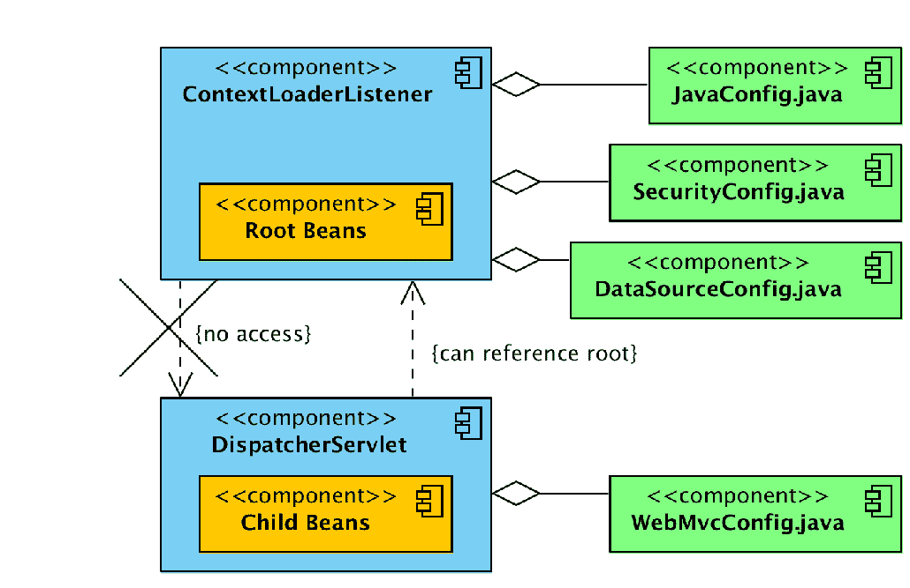
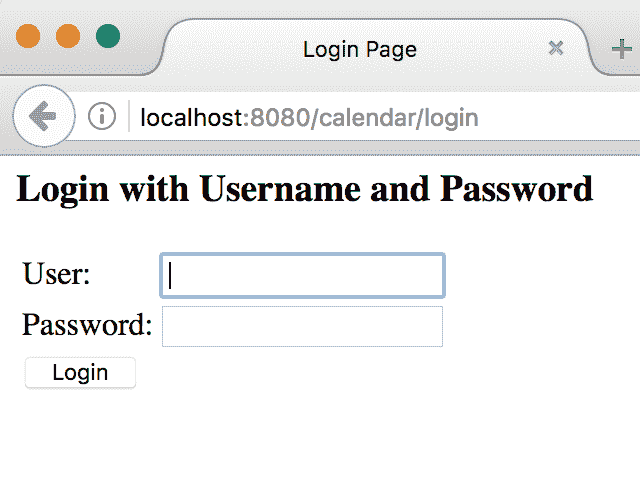
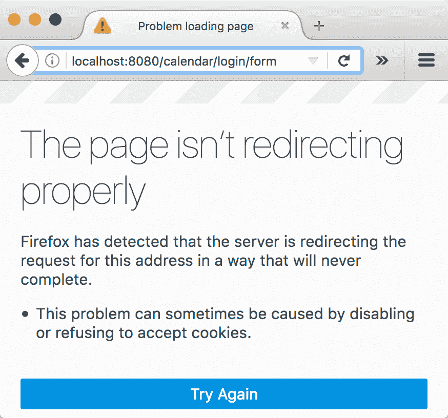
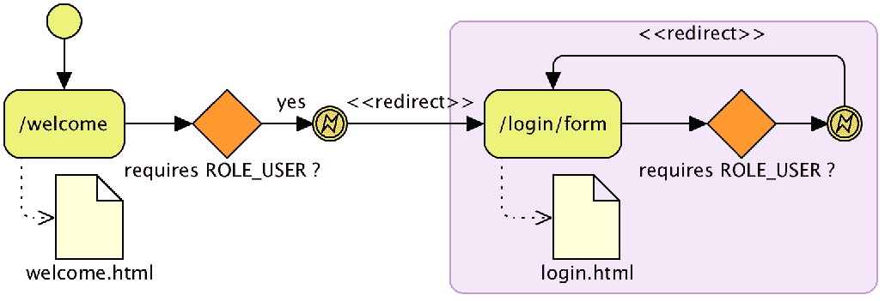

# 第二章：开始使用 Spring Security

在本章中，我们将对 Spring Security 应用最小的配置来开始解决我们的第一个发现-由于缺乏 URL 保护而不经意间提升了权限，以及第一章中讨论的安全审计*不安全应用程序的剖析*中的通用认证。然后，我们将在此基础上构建，为我们的用户提供定制化的体验。本章旨在让您开始使用 Spring Security，并为您提供执行任何其他安全相关任务的基础。

在本章中，我们将介绍以下主题：

+   在 JBCP 日历应用程序上实现基本的安全性，使用 Spring Security 中的自动配置选项

+   学习如何定制登录和登出体验

+   配置 Spring Security 以根据 URL 不同地限制访问

+   利用 Spring Security 的表达式基础访问控制

+   使用 Spring Security 中的 JSP 库条件性地显示有关登录用户的基本信息

+   根据用户的角色确定登录后用户的默认位置

# 你好，Spring Security

虽然 Spring Security 的配置可能非常复杂，但该产品的创建者考虑周到，为我们提供了一个非常简单的机制，通过这个机制可以以一个强有力的基础启用软件的大部分功能。从这个基础出发，进一步的配置将允许对应用程序的安全行为进行细粒度的详细控制。

我们将从第一章的*不安全应用程序的剖析*中的未受保护的日历应用程序开始，将其转变为一个使用基本用户名和密码认证的安全网站。这种认证仅仅是为了说明启用我们的 Web 应用程序的 Spring Security 步骤；您将看到这种方法中有明显的缺陷，这将导致我们进行进一步的配置细化。

# 导入示例应用程序

我们鼓励您将`chapter02.00-calendar`项目导入您的 IDE，并通过从本章获取源代码来跟随，如附录*附加参考资料*中的*使用 JBCP 日历示例代码*一节所述。

对于每个章节，您会发现有代表书中检查点的代码多个版本。这使得您可以很容易地将您的作品与正确答案进行比较。在每个章节的开头，我们将导入该章节的第一个版本作为起点。例如，在本章中，我们从`chapter02.00-calendar`开始，第一个检查点将是`chapter02.01-calendar`。在附录*附加参考资料*中，所以一定要查阅它以获取详细信息。

# 更新您的依赖项

第一步是更新项目的依赖关系，以包括必要的 Spring Security JAR 文件。更新从之前导入的示例应用程序中获取的 Gradle `build.gradle`文件，以包括我们将在接下来的几节中使用的 Spring Security JAR 文件。

在整本书中，我们将演示如何使用 Gradle 提供所需的依赖项。`build.gradle`文件位于项目的根目录中，代表构建项目所需的所有内容（包括项目的依赖项）。请记住，Gradle 将为列出的每个依赖项下载传递依赖项。所以，如果您使用另一种机制来管理依赖项，请确保您也包括了传递依赖项。在手动管理依赖项时，了解 Spring Security 参考资料中包括其传递依赖项的列表是有用的。可以在附录中的*补充材料*部分的*附加参考资料*中找到 Spring Security 参考资料的链接。

让我们看一下以下的代码片段：

```java
    build.gradle:
    dependencies {
        compile "org.springframework.security:spring-security-  
        config:${springSecurityVersion}"
        compile "org.springframework.security:spring-security- 
        core:${springSecurityVersion}"
        compile "org.springframework.security:spring-security- 
        web:${springSecurityVersion}"
        ...
    }
```

# 使用 Spring 4.3 和 Spring Security 4.2

Spring 4.2 是一致使用的。我们提供的示例应用程序展示了前一个选项的示例，这意味着您不需要进行任何额外的工作。

在下面的代码中，我们展示了添加到 Gradle `build.gradle`文件的一个示例片段，以利用 Gradle 的依赖管理功能；这确保了整个应用程序中使用正确的 Spring 版本。我们将利用 Spring IO **物料清单**（**BOM**）依赖，这将确保通过 BOM 导入的所有依赖版本正确地一起工作：

```java
    build.gradle
    // Spring Security IO with ensures correct Springframework versions
    dependencyManagement {
         imports {
            mavenBom 'io.spring.platform:platform-bom:Brussels-${springIoVersion}'
        }
    }
    dependencies {
        ...
    }
```

如果您正在使用 Spring Tool Suite，每次更新`build.gradle`文件时，请确保您右键点击项目，导航到 Gradle | 刷新 Gradle 项目，并选择确定以更新所有依赖项。

关于 Gradle 如何处理传递依赖项以及 BOM 的信息，请参考附录中*补充材料*部分列出的 Gradle 文档。

# 实现 Spring Security XML 配置文件

配置过程的下一步是创建一个 Java 配置文件，代表所有用于覆盖标准 Web 请求的 Spring Security 组件。

在`src/main/java/com/packtpub/springsecurity/configuration/`目录下创建一个新的 Java 文件，命名为`SecurityConfig.java`，并包含以下内容。此文件展示了我们应用程序中每个页面对用户登录的要求，提供了一个登录页面，对用户进行了身份验证，并要求登录的用户对每个 URL 元素关联一个名为`USER`的角色：

```java
    //src/main/java/com/packtpub/springsecurity/configuration/
    SecurityConfig.java

    @Configuration
    @EnableWebSecurity
    public class SecurityConfig extends WebSecurityConfigurerAdapter {
        @Override
        public void configure(final AuthenticationManagerBuilder auth) throws Exception     
        {
            auth.inMemoryAuthentication().withUser("user1@example.com")
            .password("user1").roles("USER");
        }
        @Override
        protected void configure(final HttpSecurity http) throws Exception {
            http.authorizeRequests()
                    .antMatchers("/**").access("hasRole('USER')")
                    // equivalent to <http auto-config="true">
                    .and().formLogin()
                    .and().httpBasic()
                    .and().logout()
                    // CSRF is enabled by default (will discuss later)
                    .and().csrf().disable();
        }
    }
```

如果你使用的是 Spring Tool Suite，你可以通过按 *F3* 轻松查看 `WebSecurityConfigurerAdapter`。记住，下一个检查点（`chapter02.01-calendar`）有一个可行的解决方案，所以文件也可以从那里复制。

这是确保我们的 Web 应用程序使用最小标准配置安全所需的唯一 Spring Security 配置。这种使用 Spring Security 特定 Java 配置的配置方式被称为**Java 配置**。

让我们花一分钟来分析这个配置，以便我们能了解发生了什么。在 `configure(HttpSecurity)` 方法中，`HttpSecurity` 对象创建了一个 Servlet 过滤器，该过滤器确保当前登录的用户与适当的角色关联。在这个实例中，过滤器将确保用户与 `ROLE_USER` 关联。重要的是要理解，角色的名称是任意的。稍后，我们将创建一个具有 `ROLE_ADMIN` 的用户，并允许此用户访问当前用户无法访问的额外 URL。

在 `configure(AuthenticationManagerBuilder)` 方法中，`AuthenticationManagerBuilder` 对象是 Spring Security 认证用户的方式。在这个实例中，我们使用内存数据存储来比较用户名和密码。

我们给出的例子和解释有些牵强。一个内存中的认证存储在生产环境中是行不通的。然而，它让我们能够快速启动。随着本书的进行，我们将逐步改进对 Spring Security 的理解，同时更新我们的应用程序以使用生产级别的安全配置。

从 Spring 3.1 开始，对 **Java 配置** 的通用支持已添加到 Spring 框架中。自从 Spring Security 3.2 发布以来，就有了 Spring Security Java 配置支持，这使用户能够不使用任何 XML 轻松配置 Spring Security。如果你熟悉第六章 LDAP 目录服务 和 Spring Security 文档，那么你应该会在它和 **Security Java Configuration** 支持之间找到很多相似之处。

# 更新你的 web.xml 文件

接下来的步骤涉及对 `web.xml` 文件进行一系列更新。有些步骤已经完成，因为应用程序已经使用 Spring MVC。然而，我们会回顾这些要求，以确保在您使用不支持 Spring 的应用程序中理解更基本的 Spring 要求。

# ContextLoaderListener 类

更新`web.xml`文件的第一步是删除它，并用`javax.servlet.ServletContainerInitializer`替换它，这是 Servlet 3.0+初始化的首选方法。Spring MVC 提供了`o.s.w.WebApplicationInitializer`接口，利用这一机制。在 Spring MVC 中，首选的方法是扩展`o.s.w.servlet.support.AbstractAnnotationConfigDispatcherServletInitializer`。`WebApplicationInitializer`类是多态的`o.s.w.context.AbstractContextLoaderInitializer`，并使用抽象的`createRootApplicationContext()`方法创建一个根`ApplicationContext`，然后将其委托给`ContextLoaderListener`，后者注册在`ServletContext`实例中，如下代码片段所示：

```java
    //src/main/java/c/p/s/web/configuration/WebAppInitializer

    public class WebAppInitializer extends   
    AbstractAnnotationConfigDispatcherServletInitializer {
        @Override
        protected Class<?>[] getRootConfigClasses() {
            return new Class[] { JavaConfig.class, SecurityConfig.class,    
            DataSourceConfig.class };
        }
        ...
    }
```

更新后的配置现在将从此 WAR 文件的类路径中加载`SecurityConfig.class`。

# ContextLoaderListener 与 DispatcherServlet 对比

`o.s.web.servlet.DispatcherServlet`接口指定了通过`getServletConfigClasses()`方法独立加载的配置类：

```java
    //src/main/java/c/p/s/web/configuration/WebAppInitializer

    public class WebAppInitializer extends     
    AbstractAnnotationConfigDispatcherServletInitializer {
        ...
        @Override
        protected Class<?>[] getServletConfigClasses() {
            return new Class[] { WebMvcConfig.class };
        }
        ...
        @Override
        public void onStartup(final ServletContext servletContext) throws  
        ServletException {
            // Registers DispatcherServlet
            super.onStartup(servletContext);
        }
    }
```

`DispatcherServlet`类创建了`o.s.context.ApplicationContext`，它是根`ApplicationContext`接口的子接口。通常，Spring MVC 特定组件是在`DispatcherServlet`的`ApplicationContext`接口中初始化的，而其余的则是由`ContextLoaderListener`加载的。重要的是要知道，子`ApplicationContext`中的 Bean（如由`DispatcherServlet`创建的）可以引用父`ApplicationContext`中的 Bean（如由`ContextLoaderListener`创建的），但父`ApplicationContext`接口不能引用子`ApplicationContext`中的 Bean。

以下图表说明了**子 Bean**可以引用**根 Bean**，但**根 Bean**不能引用**子 Bean**：



与大多数 Spring Security 的使用场景一样，我们不需要 Spring Security 引用任何 MVC 声明的 Bean。因此，我们决定让`ContextLoaderListener`初始化所有 Spring Security 的配置。

# springSecurityFilterChain 过滤器

下一步是配置`springSecurityFilterChain`以拦截所有请求，通过创建`AbstractSecurityWebApplicationInitializer`的实现。确保`springSecurityFilterChain`首先声明至关重要，以确保在调用任何其他逻辑之前请求是安全的。为了确保`springSecurityFilterChain`首先加载，我们可以使用如下配置中的`@Order(1)`：

```java
    //src/main/java/c/p/s/web/configuration/SecurityWebAppInitializer

    @Order(1)
    public class SecurityWebAppInitializer extends     
 AbstractSecurityWebApplicationInitializer {
        public SecurityWebAppInitializer() {
            super();
        }
    }
```

`SecurityWebAppInitializer`类将自动为应用程序中的每个 URL 注册`springSecurityFilterChain`过滤器，并将添加`ContextLoaderListener`，后者加载`SecurityConfig`。

# DelegatingFilterProxy 类

`o.s.web.filter.DelegatingFilterProxy`类是 Spring Web 提供的 Servlet 过滤器，它将所有工作委派给`ApplicationContext`根目录下的一个 Spring bean，该 bean 必须实现`javax.servlet.Filter`。由于默认情况下是通过名称查找 bean，使用`<filter-name>`值，我们必须确保我们使用`springSecurityFilterChain`作为`<filter-name>`的值。我们可以在以下代码片段中找到`o.s.web.filter.DelegatingFilterProxy`类对于我们`web.xml`文件的工作伪代码：

```java
    public class DelegatingFilterProxy implements Filter {
      void doFilter(request, response, filterChain) {
        Filter delegate = applicationContet.getBean("springSecurityFilterChain")
        delegate.doFilter(request,response,filterChain);
      }
    }
```

# `FilterChainProxy`类

当与 Spring Security 一起使用时，`o.s.web.filter.DelegatingFilterProxy`将委派给 Spring Security 的`o.s.s.web.FilterChainProxy`接口，该接口是在我们的最小`security.xml`文件中创建的。`FilterChainProxy`类允许 Spring Security 条件性地将任意数量的 Servlet 过滤器应用于 Servlet 请求。我们将在书的其余部分了解更多关于 Spring Security 过滤器的内容，以及它们在确保我们的应用程序得到适当保护方面的作用。`FilterChainProxy`的工作伪代码如下：

```java
    public class FilterChainProxy implements Filter {
  void doFilter(request, response, filterChain) {
    // lookup all the Filters for this request
    List<Filter> delegates =       lookupDelegates(request,response)
    // invoke each filter unless the delegate decided to stop
    for delegate in delegates {
      if continue processing
        delegate.doFilter(request,response,filterChain)
    }
    // if all the filters decide it is ok allow the 
    // rest of the application to run
    if continue processing
      filterChain.doFilter(request,response)  }
    }

```

由于`DelegatingFilterProxy`和`FilterChainProxy`都是 Spring Security 的前门，当在 Web 应用程序中使用时，您会在尝试了解发生了什么时添加一个调试点。

# 运行受保护的应用程序

如果您还没有这样做，请重新启动应用程序并访问`http://localhost:8080/`。您将看到以下屏幕：



太棒了！我们使用 Spring Security 在应用程序中实现了一个基本的安全层。在此阶段，您应该能够使用`user1@example.com`作为用户和`user1`作为密码登录。您将看到日历欢迎页面，该页面从高层次描述了应用程序在安全性方面的预期。

您的代码现在应该看起来像`chapter02.01-calendar`。

# 常见问题

许多用户在将 Spring Security 首次实现到他们的应用程序时遇到了麻烦。下面列出了一些常见问题和建议。我们希望确保您能够运行示例应用程序并跟随教程！

+   在将 Spring Security 放入应用程序之前，请确保您能够构建和部署应用程序。

+   如有需要，请回顾一些关于您 Servlet 容器的入门示例和文档。

+   通常使用 IDE（如 Eclipse）运行您的 Servlet 容器是最简单的。不仅部署通常是无缝的，控制台日志也易于查看以查找错误。您还可以在战略位置设置断点，以便在异常触发时更好地诊断错误。

+   请确保您使用的 Spring 和 Spring Security 版本匹配，并且没有意外的 Spring JAR 作为您应用程序的一部分残留。如前所述，当使用 Gradle 时，最好在依赖管理部分声明 Spring 依赖项。

# 稍微加工一下

停在这个步骤，思考一下我们刚刚构建的内容。你可能已经注意到了一些明显的问题，这需要一些额外的工作和了解 Spring Security 产品知识，我们的应用程序才能准备好上线。尝试列出一个你认为在安全实现准备好公开面对网站之前需要做的更改清单。

应用 Hello World Spring Security 实现速度之快让人眼花缭乱，并为我们提供了登录页面、用户名和基于密码的认证，以及在我们日历应用程序中自动拦截 URL。然而，自动配置设置提供的与我们最终目标之间的差距如下所述：

+   虽然登录页面很有帮助，但它完全通用，与我们 JBCP 日历应用程序的其余部分看起来不一样。我们应该添加一个与应用程序外观和感觉集成的登录表单。

+   用户没有明显的方式登出。我们已经锁定了应用程序中的所有页面，包括欢迎页面，潜在的用户可能想以匿名方式浏览该页面。我们需要重新定义所需的角色以适应匿名、认证和行政用户。

+   我们没有显示任何上下文信息来告知用户他们已经认证。如果能显示一个类似于欢迎`user1@example.com`的问候语会很好。

+   我们不得不在`SecurityConfig`配置文件中硬编码用户的用户名、密码和角色信息。回想一下我们添加的`configure(AuthenticationManagerBuilder)`方法的这一部分：

```java
        auth.inMemoryAuthentication().withUser("user1@example.com")
        .password("user1").roles("USER");
```

+   你可以看到用户名和密码就在文件里。我们不太可能想要为系统中的每个用户在文件中添加一个新的声明！为了解决这个问题，我们需要用另一种认证方式更新配置。

我们将在本书的第一半中探索不同的认证选项。

# 登出配置

Spring Security 的`HttpSecurity`配置自动添加了对用户登出的支持。所需的所有操作是创建一个指向`/j_spring_security_logout`的链接。然而，我们将演示如何通过执行以下步骤自定义用于用户登出的 URL：

1.  如下更新 Spring Security 配置：

```java
        //src/main/java/com/packtpub/springsecurity/configuration/
        SecurityConfig.java

        http.authorizeRequests()
        ...
       .logout()
       .logoutUrl("/logout")
       .logoutSuccessUrl("/login?logout");
```

1.  你必须为用户提供一个可以点击的链接以登出。我们将更新`header.html`文件，以便在每一页上出现`Logout`链接：

```java
        //src/main/webapp/WEB-INF/templates/fragments/header.html

        <div id="navbar" ...>
         ...
           <ul class="nav navbar-nav pull-right">
             <li><a id="navLogoutLink" th:href="@{/logout}">
               Logout</a></li>
           </ul>
            ...
        </div>
```

1.  最后一步是更新`login.html`文件，当`logout`参数存在时，显示一条表示登出成功的消息：

```java
        //src/main/webapp/WEB-INF/templates/login.html

        <div th:if="${param.logout != null}" class="alert 
        alert-success"> You have been logged out.</div>
          <label for="username">Username</label>
          ...
```

你的代码现在应该看起来像`chapter02.02-calendar`。

# 页面没有正确重定向。

如果你还没有这么做，重启应用程序并在 Firefox 中访问`http://localhost:8080`；你会看到一个错误，如下面的屏幕截图所示：



哪里出了问题？问题在于，由于 Spring Security 不再渲染登录页面，我们必须允许所有人（而不仅仅是`USER`角色）访问登录页面。如果不允许访问登录页面，会发生以下情况：

1.  在浏览器中请求欢迎页面。

1.  Spring Security 发现欢迎页面需要`USER`角色，而我们尚未认证，因此它将浏览器重定向到登录页面。

1.  浏览器请求登录页面。

1.  Spring Security 发现登录页面需要`USER`角色，而我们还没有认证，所以它将浏览器重定向到登录页面。

1.  浏览器再次请求登录页面。

1.  Spring Security 发现登录页面需要`USER`角色，如图所示：



此过程可能会无限重复。幸运的是，Firefox 意识到发生了太多重定向，停止执行重定向，并显示一个非常有用的错误信息。在下一节中，我们将学习如何通过配置不同的 URL 来修复此错误，这些 URL 根据它们需要的访问权限不同。

# 基于表达式的授权。

你可能已经注意到，允许所有人访问远不如我们期望的简洁。幸运的是，Spring Security 可以利用**Spring 表达式语言**（**SpEL**）来确定用户是否有授权。在下面的代码片段中，你可以看到使用 SpEL 与 Spring Security 时的更新：

```java
    //src/main/java/com/packtpub/springsecurity/configuration/
    SecurityConfig.java

    http.authorizeRequests()
        .antMatchers("/").access("hasAnyRole('ANONYMOUS', 'USER')")
        .antMatchers("/login/*").access("hasAnyRole('ANONYMOUS', 'USER')")
        .antMatchers("/logout/*").access("hasAnyRole('ANONYMOUS', 'USER')")
        .antMatchers("/admin/*").access("hasRole('ADMIN')")
        .antMatchers("/events/").access("hasRole('ADMIN')")
        .antMatchers("/**").access("hasRole('USER')")
```

你可能会注意到`/events/`的安全约束很脆弱。例如，`/events` URL 不受 Spring Security 的保护，以限制`ADMIN`角色。这证明了我们需要确保提供多层次的安全性。我们将在第十一章中利用这种弱点，进行*细粒度访问控制*。

将`access`属性从`hasAnyRole('ANONYMOUS', 'USER')`更改为`permitAll()`可能看起来并不重要，但这只是 Spring Security 表达式强大功能的冰山一角。我们将在书的第二部分更详细地讨论访问控制和 Spring 表达式。运行应用程序以验证更新是否有效。

您的代码现在应该看起来像`chapter02.04-calendar`。

# 有条件地显示认证信息。

目前，我们的应用程序没有关于我们是否登录的任何指示。事实上，它看起来好像我们总是登录，因为`Logout`链接总是显示。在本节中，我们将演示如何使用 Thymeleaf 的 Spring Security 标签库显示认证用户的用户名，并根据条件显示页面的部分内容。我们通过执行以下步骤来实现：

1.  更新您的依赖项，包括`thymeleaf-extras-springsecurity4` JAR 文件。由于我们正在使用 Gradle，我们将在`build.gradle`文件中添加一个新的依赖项声明，如下所示：

```java
        //build.gradle

           dependency{
              ...
              compile 'org.thymeleaf.extras:thymeleaf-
              extras-springsecurity4'
         }
```

1.  接下来，我们需要如下向 Thymeleaf 引擎添加 `SpringSecurityDialect`：

```java
        //src/com/packtpub/springsecurity/web/configuration/
        ThymeleafConfig.java

            @Bean
            public SpringTemplateEngine templateEngine(
             final ServletContextTemplateResolver resolver)   
            {
                SpringTemplateEngine engine = new SpringTemplateEngine();
               engine.setTemplateResolver(resolver);
 engine.setAdditionalDialects(new HashSet<IDialect>() {{ add(new LayoutDialect()); add(new SpringSecurityDialect()); }});                return engine;
            }
```

1.  更新 `header.html` 文件以利用 Spring Security 标签库。你可以按照如下方式找到更新：

```java
        //src/main/webapp/WEB-INF/templates/fragments/header.html

            <html xmlns:th="http://www.thymeleaf.org" 
 xmlns:sec="http://www.thymeleaf.org/thymeleaf- 
            extras-springsecurity4">
            ...
        <div id="navbar" class="collapse navbar-collapse">
            ...
            <ul class="nav navbar-nav pull-right" 
 sec:authorize="isAuthenticated()">
                <li>
                    <p class="navbar-text">Welcome <div class="navbar-text"  
                    th:text="${#authentication.name}">User</div></p>
                </li>
                <li>
                    <a id="navLogoutLink" class="btn btn-default" 
                    role="button" th:href="@{/logout}">Logout</a>
                </li>
                <li>&nbsp;|&nbsp;</li>
            </ul>
            <ul class="nav navbar-nav pull-right" 
 sec:authorize=" ! isAuthenticated()">
                <li><a id="navLoginLink" class="btn btn-default" 
                role="button"  
                th:href="@{/login/form}">Login</a></li>
                <li>&nbsp;|&nbsp;</li>
            </ul>
            ...
```

`sec:authorize` 属性确定用户是否以 `isAuthenticated()` 值认证，并在用户认证时显示 HTML 节点，如果用户没有认证，则隐藏节点。`access` 属性应该非常熟悉，来自 `antMatcher().access()` 元素。实际上，这两个组件都利用了相同的 SpEL 支持。Thymeleaf 标签库中有不使用表达式的属性。然而，使用 SpEL 通常是更受欢迎的方法，因为它更强大。

`sec:authentication` 属性将查找当前的 `o.s.s.core.Authentication` 对象。`property` 属性将找到 `o.s.s.core.Authentication` 对象的 `principal` 属性，在这个例子中是 `o.s.s.core.userdetails.UserDetails`。然后它获取 `UserDetails` 的 `username` 属性并将其渲染到页面。如果这些细节让你感到困惑，不要担心。我们将在第三章 *自定义认证* 中更详细地介绍这一点。

如果你还没有这样做，请重新启动应用程序以查看我们所做的更新。此时，你可能会意识到我们仍在显示我们没有访问权的链接。例如，`user1@example.com` 不应该看到“所有事件”页面的链接。请放心，当我们详细介绍标签时，我们将在第十一章 *细粒度访问控制* 中解决这个问题。

你的代码现在应该看起来像这样：`chapter02.05-calendar`。

# 登录后的行为自定义。

我们已经讨论了如何自定义用户在登录过程中的体验，但有时在登录后自定义行为是必要的。在本节中，我们将讨论 Spring Security 在登录后的行为，并提供一个简单的方法来自定义此行为。

在默认配置中，Spring Security 在成功认证后有两个不同的流程。第一个场景是如果一个用户从未访问过需要认证的资源。在这种情况下，成功登录后，用户将被发送到 `defaultSuccessUrl()` 方法，该方法链接到 `formLogin()` 方法。如果未定义，`defaultSuccessUrl()` 将是应用程序的上下文根。

如果用户在认证之前请求了一个受保护的页面，Spring Security 将使用 `o.s.s.web.savedrequest.RequestCache` 记住在认证之前访问的最后一個受保护的页面。在认证成功后，Spring Security 会将用户发送到在认证之前访问的最后一個受保护的页面。例如，如果一个未认证的用户请求“我的事件”页面，他们将被发送到登录页面。

成功认证后，他们将被发送到之前请求的“我的事件”页面。

一个常见的需求是自定义 Spring Security，使其根据用户的角色发送用户到不同的`defaultSuccessUrl()`方法。让我们来看看如何通过执行以下步骤来实现这一点：

1.  第一步是配置`defaultSuccessUrl()`方法，它在`formLogin()`方法之后链式调用。大胆地更新`security.xml`文件，使用`/default`而不是上下文根：

```java
        //src/main/java/com/packtpub/springsecurity/configuration/
        SecurityConfig.java

          .formLogin()
                      .loginPage("/login/form")
                      .loginProcessingUrl("/login")
                      .failureUrl("/login/form?error")
                      .usernameParameter("username")
                      .passwordParameter("password")
 .defaultSuccessUrl("/default")                      .permitAll()
```

1.  下一步是创建一个处理`/default`的控制器。在下面的代码中，你会发现一个示例 Spring MVC 控制器`DefaultController`，它演示了如何将管理员重定向到所有事件页面，并将其他用户重定向到欢迎页面。在以下位置创建一个新的文件：

```java
        //src/main/java/com/packtpub/springsecurity/web/controllers/
        DefaultController.java

            // imports omitted
            @Controller 
            public class DefaultController {
           @RequestMapping("/default") 
             public String defaultAfterLogin(HttpServletRequest request) { 
                 if (request.isUserInRole("ADMIN")) { 
                     return "redirect:/events/"; 
                 } 
                 return "redirect:/"; 
             }
        }
```

在 Spring Tool Suite 中，你可以使用*Shift* + *Ctrl* + *O* 来自动添加缺少的导入。

关于`DefaultController`及其工作方式有一点需要注意。首先是 Spring Security 使`HttpServletRequest`参数意识到当前登录的用户。在这个实例中，我们能够不依赖 Spring Security 的任何 API 来检查用户属于哪个角色。这是好的，因为如果 Spring Security 的 API 发生变化，或者我们决定要切换我们的安全实现，我们需要更新的代码就会更少。还应注意的是，尽管我们用 Spring MVC 控制器实现这个控制器，但我们的`defaultSuccessUrl()`方法如果需要，可以由任何控制器实现（例如，Struts，一个标准的 servlet 等）处理。

1.  如果你希望总是去到`defaultSuccessUrl()`方法，你可以利用`defaultSuccessUrl()`方法的第二个参数，这是一个`Boolean`用于始终使用。我们不会在我们的配置中这样做，但你可以如下看到一个例子：

```java
        .defaultSuccessUrl("/default", true)
```

1.  你现在可以尝试一下了。重新启动应用程序并直接转到我的事件页面，然后登录；你会发现你在我的事件页面。

1.  然后，退出并尝试以`user1@example.com`的身份登录。

1.  你应该在欢迎页面。退出并以`admin1@example.com`的身份登录，然后你会被

    被发送到所有事件页面。

你的代码现在应该看起来像`chapter02.06-calendar`。

# 总结

在本章中，我们已经应用了非常基础的 Spring Security 配置，解释了如何自定义用户的登录和登出体验，并演示了如何在我们的网络应用程序中显示基本信息，例如用户名。

在下一章中，我们将讨论 Spring Security 中的认证是如何工作的，以及我们如何可以根据自己的需求来定制它。
