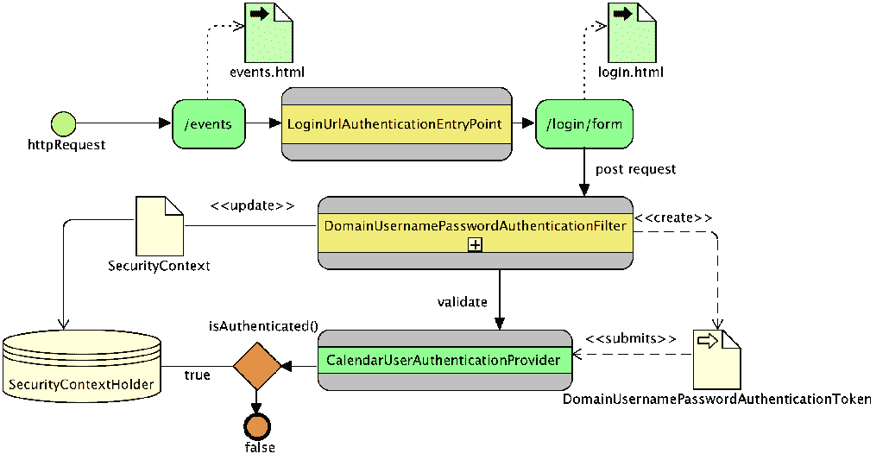

# 第三章：自定义认证

在第二章，*使用 Spring Security 入门*，我们展示了如何使用内存中的数据存储来认证用户。在本章中，我们将探讨如何通过将 Spring Security 的认证支持扩展到使用我们现有的 API 集来解决一些常见的世界问题。通过这种探索，我们将了解 Spring Security 用于认证用户所使用的每个构建块。

在本章中，我们将介绍以下主题：

+   利用 Spring Security 的注解和基于 Java 的配置

+   发现如何获取当前登录用户的具体信息

+   在创建新账户后添加登录的能力

+   学习向 Spring Security 指示用户已认证的最简单方法

+   创建自定义`UserDetailsService`和`AuthenticationProvider`实现，以适当地将应用程序的其他部分与 Spring Security 解耦

+   添加基于域的认证，以演示如何使用不仅仅是用户名和密码进行认证

# JBCP 日历架构

在附录中，*附加参考资料*。

由于本章是关于将 Spring Security 与自定义用户和 API 集成的，我们将从对 JBCP 日历应用程序中的域模型的快速介绍开始。

# 日历用户对象

我们的日历应用程序使用一个名为`CalendarUser`的域对象，其中包含有关我们的用户的信息，如下所示：

```java
    //src/main/java/com/packtpub/springsecurity/domain/CalendarUser.java

    public class CalendarUser implements Serializable {
       private Integer id;
       private String firstName;
       private String lastName;
       private String email;
       private String password;
       ... accessor methods omitted ..
    }
```

# 事件对象

我们的应用程序有一个`Event`对象，其中包含有关每个事件的详细信息，如下所示：

```java
    //src/main/java/com/packtpub/springsecurity/domain/Event.java

    public class Event {
       private Integer id;
       private String summary;
       private String description;
       private Calendar when;
       private CalendarUser owner;
       private CalendarUser attendee;
       ... accessor methods omitted ..
    }
```

# 日历服务接口

我们的应用程序包含一个`CalendarService`接口，可以用来访问和存储我们的域对象。`CalendarService`的代码如下：

```java
    //src/main/java/com/packtpub/springsecurity/service/CalendarService.java

    public interface CalendarService {
       CalendarUser getUser(int id);
       CalendarUser findUserByEmail(String email);
       List<CalendarUser> findUsersByEmail(String partialEmail);
       int createUser(CalendarUser user);
       Event getEvent(int eventId);
       int createEvent(Event event);
       List<Event> findForUser(int userId);
       List<Event> getEvents();
    }
```

我们不会讨论`CalendarService`中使用的方法，但它们应该是相当直接的。如果您想了解每个方法的作用，请查阅示例代码中的 Javadoc。

# 用户上下文接口

像大多数应用程序一样，我们的应用程序需要与我们当前登录的用户进行交互。我们创建了一个非常简单的接口，名为`UserContext`，用于管理当前登录的用户，如下所示：

```java
    //src/main/java/com/packtpub/springsecurity/service/UserContext.java

    public interface UserContext {
       CalendarUser getCurrentUser();
       void setCurrentUser(CalendarUser user);
    }
```

这意味着我们的应用程序可以调用`UserContext.getCurrentUser()`来获取当前登录用户的信息。它还可以调用`UserContext.setCurrentUser(CalendarUser)`来指定哪个用户已登录。在本章后面，我们将探讨如何编写实现此接口的实现，该实现使用 Spring Security 访问我们当前的用户并使用`SecurityContextHolder`获取他们的详细信息。

Spring Security 提供了很多不同的方法来验证用户。然而，最终结果是 Spring Security 会将`o.s.s.core.context.SecurityContext`填充为`o.s.s.core.Authentication`。`Authentication`对象代表了我们在认证时收集的所有信息（用户名、密码、角色等）。然后`SecurityContext`接口被设置在`o.s.s.core.context.SecurityContextHolder`接口上。这意味着 Spring Security 和开发者可以使用`SecurityContextHolder`来获取关于当前登录用户的信息。以下是一个获取当前用户名的示例：

```java
    String username = SecurityContextHolder.getContext()
       .getAuthentication()
       .getName();
```

需要注意的是，应该始终对`Authentication`对象进行`null`检查，因为如果用户没有登录，这个对象可能是`null`。

# `SpringSecurityUserContext`接口

当前的`UserContext`实现`UserContextStub`是一个总是返回相同用户的存根。这意味着无论谁登录，My Events 页面都会显示相同的用户。让我们更新我们的应用程序，利用当前 Spring Security 用户的用户名，来确定在 My Events 页面上显示哪些事件。

你应该从`chapter03.00-calendar`中的示例代码开始。

请按照以下步骤操作：

1.  第一步是将`UserContextStub`上的`@Component`属性注释掉，以便我们的应用程序不再使用我们的扫描结果。

`@Component`注解与在`com/packtpub/springsecurity/web/configuration/WebMvcConfig.java`中找到的`@ComponentScan`注解一起使用，用于自动创建 Spring bean，而不是为每个 bean 创建显式的 XML 或 Java 配置。您可以在[`static.springsource.org/spring/docs/current/spring-framework-reference/html/`](http://static.springsource.org/spring/docs/current/spring-framework-reference/html/)中了解更多关于 Spring 扫描类路径的信息。

请查看以下代码片段：

```java
        //src/main/java/com/packtpub/springsecurity/service/UserContextStub.java

        ...
        //@Component
        public class UserContextStub implements UserContext {
        ...
```

1.  下一步是利用`SecurityContext`来获取当前登录的用户。在本章的代码中，我们包含了`SpringSecurityUserContext`，它已经集成了必要的依赖项，但没有任何实际功能。

1.  打开`SpringSecurityUserContext.java`文件，添加`@Component`注解。接下来，替换`getCurrentUser`实现，如下面的代码片段所示：

```java
        //src/main/java/com/packtpub/springsecurity/service/
        SpringSecurityUserContext.java

        @Component
        public class SpringSecurityUserContext implements UserContext {
          private final CalendarService calendarService;
          private final UserDetailsService userDetailsService;
        @Autowired
        public SpringSecurityUserContext(CalendarService calendarService, 
        UserDetailsService userDetailsService) {
           this.calendarService = calendarService;
           this.userDetailsService = userDetailsService;
        }
        public CalendarUser getCurrentUser() {
           SecurityContext context = SecurityContextHolder.getContext();
           Authentication authentication = context.getAuthentication();
           if (authentication == null) {
             return null;
           }
           String email = authentication.getName();
           return calendarService.findUserByEmail(email);
        }
        public void setCurrentUser(CalendarUser user) {
           throw new UnsupportedOperationException();
        }
        }
```

我们的代码从当前 Spring Security 的`Authentication`对象中获取用户名，并利用该用户名通过电子邮件地址查找当前的`CalendarUser`对象。由于我们的 Spring Security 用户名是一个电子邮件地址，因此我们能够使用电子邮件地址将`CalendarUser`与 Spring Security 用户关联起来。请注意，如果我们打算关联账户，通常我们希望能够用我们生成的键来做这件事，而不是可能改变的东西（也就是说，电子邮件地址）。我们遵循只向应用程序返回我们的域对象的良好实践。这确保了我们的应用程序只认识我们的`CalendarUser`对象，从而与 Spring Security 解耦。

这段代码可能看起来与我们使用`sec:authorize="isAuthenticated()"`时出奇地相似。

在第二章*Spring Security 入门*中使用的`tag`属性，来显示当前用户的用户名。实际上，Spring Security 标签库正是像我们在这里一样使用`SecurityContextHolder`。我们本可以使用我们的`UserContext`接口将当前用户放在`HttpServletRequest`上，从而摆脱对 Spring Security 标签库的依赖。

1.  启动应用程序，访问`http://localhost:8080/`，并使用`admin1@example.com`作为用户名和`admin1`作为密码登录。

1.  访问我的事件页面，您将看到只显示当前用户的那些事件，该用户是所有者或参与者。

1.  尝试创建一个新事件；您会观察到事件的所有者现在与登录的用户相关联。

1.  退出应用程序，然后用`user1@example.com`作为用户名和`user1`作为密码重复这些步骤。

您的代码现在应该看起来像`chapter03.01-calendar`。

# 使用 SecurityContextHolder 登录新用户

一个常见的需求是允许用户创建一个新的账户，然后自动登录到应用程序。在本节中，我们将描述最简单的方法来指示用户已认证，通过利用`SecurityContextHolder`。

# 在 Spring Security 中管理用户

在第一章*一个不安全应用程序的剖析*中提供的应用程序，提供了一个创建新的`CalendarUser`对象的机制，因此，在用户注册后，创建我们的`CalendarUser`对象应该相对简单。然而，Spring Security 对`CalendarUser`一无所知。这意味着我们还需要在 Spring Security 中添加一个新的用户。别担心，我们会在本章后面消除对用户双重维护的需要。

Spring Security 提供了一个`o.s.s.provisioning.UserDetailsManager`接口来管理用户。还记得我们的内存中的 Spring Security 配置吗？

```java
    auth.inMemoryAuthentication().
    withUser("user").password("user").roles("USER");
```

`.inMemoryAuthentication()`方法创建了一个名为`o.s.s.provisioning.InMemoryUserDetailsManager`的内存实现`UserDetailsManager`，该实现可以用来创建一个新的 Spring Security 用户。

当从 XML 配置转换为基于 Java 的配置时，Spring Security 中存在一个限制，即 Spring Security DSL 目前不支持暴露多个 bean。关于这个问题已经打开了一个 JIRA，链接为[`jira.spring.io/browse/SPR-13779.`](https://jira.spring.io/browse/SPR-13779)

让我们看看如何通过执行以下步骤来管理 Spring Security 中的用户：

1.  为了通过基于 Java 的配置暴露`UserDetailsManager`，我们需要在`WebSecurityConfigurerAdapter` DSL 之外创建`InMemoryUserDetailsManager`：

```java
        //src/main/java/com/packtpub/springsecurity/configuration/
        SecurityConfig.java

        @Bean
        @Override
        public UserDetailsManager userDetailsService() {
           InMemoryUserDetailsManager manager = new 
           InMemoryUserDetailsManager();
           manager.createUser(
               User.withUsername("user1@example.com")
                   .password("user1").roles("USER").build());
           manager.createUser(
               User.withUsername("admin1@example.com")
                   .password("admin1").roles("USER", "ADMIN").build());
           return manager;
        }
```

1.  一旦我们在 Spring 配置中暴露了`UserDetailsManager`接口，我们所需要做的就是更新我们现有的`CalendarService`实现，`DefaultCalendarService`，以在 Spring Security 中添加用户。对`DefaultCalendarService.java`文件进行以下更新：

```java
        //src/main/java/com/packtpub/springsecurity/service/
        DefaultCalendarService.java

        public int createUser(CalendarUser user) {
            List<GrantedAuthority> authorities = AuthorityUtils.
            createAuthorityList("ROLE_USER");
            UserDetails userDetails = new User(user.getEmail(),
            user.getPassword(), authorities);
           // create a Spring Security user
           userDetailsManager.createUser(userDetails);
           // create a CalendarUser
           return userDao.createUser(user);
        }
```

1.  为了利用`UserDetailsManager`，我们首先将`CalendarUser`转换为 Spring Security 的`UserDetails`对象。

1.  后来，我们使用`UserDetailsManager`来保存`UserDetails`对象。转换是必要的，因为 Spring Security 不知道如何保存我们的自定义`CalendarUser`对象，所以我们必须将`CalendarUser`映射到 Spring Security 理解的对象。您会注意到`GrantedAuthority`对象对应于我们`SecurityConfig`文件中的`authorities`属性。我们为了简单起见并因为我们的现有系统没有角色概念而硬编码这个值。

# 登录新用户到应用程序

现在我们能够向系统添加新用户，我们需要指示用户已认证。更新`SpringSecurityUserContext`以在 Spring Security 的`SecurityContextHolder`对象上设置当前用户，如下所示：

```java
    //src/main/java/com/packtpub/springsecurity/service/
    SpringSecurityUserContext.java

    public void setCurrentUser(CalendarUser user) {
      UserDetails userDetails = userDetailsService.
      loadUserByUsername(user.getEmail());
      Authentication authentication = new   
      UsernamePasswordAuthenticationToken(userDetails, user.getPassword(),
      userDetails.getAuthorities());
      SecurityContextHolder.getContext().
      setAuthentication(authentication);
    }
```

我们首先执行的步骤是将我们的`CalendarUser`对象转换为 Spring Security 的`UserDetails`对象。这是必要的，因为正如 Spring Security 不知道如何保存我们的自定义`CalendarUser`对象一样，Spring Security 也不理解如何使用我们的自定义`CalendarUser`对象做出安全决策。我们使用 Spring Security 的`o.s.s.core.userdetails.UserDetailsService`接口来获取我们通过`UserDetailsManager`保存的相同的`UserDetails`对象。`UserDetailsService`接口提供了`UserDetailsManager`对象的功能的一个子集，通过用户名查找。

接下来，我们创建一个`UsernamePasswordAuthenticationToken`对象，并将`UserDetails`、密码和`GrantedAuthority`放入其中。最后，我们在`SecurityContextHolder`上设置认证。在 Web 应用程序中，Spring Security 会自动将`SecurityContext`对象与`SecurityContextHolder`中的 HTTP 会话关联起来。

重要的是，Spring Security 不能被指示忽略一个 URL（即使用`permitAll()`方法），正如在第二章《开始使用 Spring Security》中讨论的那样，其中访问或设置了`SecurityContextHolder`。这是因为 Spring Security 将忽略该请求，因此不会为后续请求持久化`SecurityContext`。允许访问使用`SecurityContextHolder`的 URL 的正确方法是指定`antMatchers()`方法的`access`属性（即`antMatchers(¦).permitAll()`）。

值得一提的是，我们本可以直接通过创建一个新的`o.s.s.core.userdetails.User`对象来转换`CalendarUser`，而不是在`UserDetailsService`中查找。例如，下面的代码也可以认证用户：

```java
List<GrantedAuthority> authorities =
AuthorityUtils.createAuthorityList("ROLE_USER");
UserDetails userDetails = new User("username","password",authorities); Authentication authentication = new UsernamePasswordAuthenticationToken ( userDetails,userDetails.getPassword(),userDetails.getAuthorities());
SecurityContextHolder.getContext()
.setAuthentication(authentication);
```

这种方法的优点在于，我们无需再次访问数据存储。在我们这个案例中，数据存储是一个内存中的数据存储，但这也可能是由一个数据库支持的，这可能会带来一些安全风险。这种方法的一个缺点是我们无法复用代码太多。由于这种方法调用不频繁，我们选择复用代码。通常，最佳做法是单独评估每种情况，以确定哪种方法最合适。

# 更新 SignupController

应用程序有一个`SignupController`对象，该对象处理创建新的`CalendarUser`对象的 HTTP 请求。最后一步是更新`SignupController`以创建我们的用户，然后指示他们已经登录。对`SignupController`进行以下更新：

```java
//src/main/java/com/packtpub/springsecurity/web/controllers/
SignupController.java

@RequestMapping(value="/signup/new", method=RequestMethod.POST)
public String signup(@Valid SignupForm signupForm,
BindingResult result, RedirectAttributes redirectAttributes) {
... existing validation ¦
user.setPassword(signupForm.getPassword());
int id = calendarService.createUser(user);
user.setId(id);
userContext.setCurrentUser(user);
redirectAttributes.addFlashAttribute("message", "Success");
return "redirect:/";
}
```

如果你还没有这么做，请重新启动应用程序，访问`http://localhost:8080/`，创建一个新的用户，并查看新用户是否自动登录。

你的代码现在应该看起来像`chapter03.02-calendar`。

# 创建自定义 UserDetailsService 对象

虽然我们能够将我们的领域模型（`CalendarUser`）与 Spring Security 的领域模型（`UserDetails`）关联起来，但我们不得不维护用户的多个表示。为了解决这种双重维护，我们可以实现一个自定义的`UserDetailsService`对象，将我们现有的`CalendarUser`领域模型转换为 Spring Security`UserDetails`接口的实现。通过将我们的`CalendarUser`对象转换为`UserDetails`，Spring Security 可以使用我们的自定义领域模型做出安全决策。这意味着我们将不再需要管理用户的两种不同表示。

# 日历用户详细信息服务类

到目前为止，我们需要两种不同的用户表示：一种用于 Spring Security 做出安全决策，另一种用于我们的应用程序将我们的领域对象关联起来。创建一个名为`CalendarUserDetailsService`的新类，使 Spring Security 意识到我们的`CalendarUser`对象。这将确保 Spring Security 可以根据我们的领域模型做出决策。按照如下方式创建一个名为`CalendarUserDetailsService.java`的新文件：

```java
//src/main/java/com/packtpub/springsecurity/core/userdetails/
CalendarUserDetailsService.java

// imports and package declaration omitted

@Component
public class CalendarUserDetailsService implements
UserDetailsService {
private final CalendarUserDao calendarUserDao;
@Autowired
public CalendarUserDetailsService(CalendarUserDao
   calendarUserDao) {
   this.calendarUserDao = calendarUserDao;
}
public UserDetails loadUserByUsername(String username) throws
   UsernameNotFoundException {
   CalendarUser user = calendarUserDao.findUserByEmail(username);
  if (user == null) {
     throw new UsernameNotFoundException("Invalid
       username/password.");
   }
   Collection<? extends GrantedAuthority> authorities =
     CalendarUserAuthorityUtils.createAuthorities(user);
   return new User(user.getEmail(), user.getPassword(),
     authorities);
}
}
```

在 Spring Tool Suite 中，您可以使用*Shift*+*Ctrl*+*O*快捷键轻松添加缺少的导入。另外，您还可以从下一个检查点（`chapter03.03-calendar`）复制代码。

在这里，我们使用`CalendarUserDao`通过电子邮件地址获取`CalendarUser`。我们确保不返回`null`值；相反，应该抛出`UsernameNotFoundException`异常，因为返回`null`会破坏`UserDetailsService`接口。

然后我们将`CalendarUser`转换为由用户实现的`UserDetails`。

现在我们利用提供的示例代码中提供的工具类`CalendarUserAuthorityUtils`。这将根据电子邮件地址创建`GrantedAuthority`，以便我们可以支持用户和管理员。如果电子邮件地址以`admin`开头，则用户被视为`ROLE_ADMIN, ROLE_USER`。否则，用户被视为`ROLE_USER`。当然，在实际应用程序中我们不会这样做，但正是这种简单性让我们能够专注于本课。

# 配置 UserDetailsService

现在我们已经有一个新的`UserDetailsService`对象，让我们更新 Spring Security 配置以使用它。由于我们利用类路径扫描和`@Component`注解，我们的`CalendarUserDetailsService`类自动添加到 Spring 配置中。这意味着我们只需要更新 Spring Security 以引用我们刚刚创建的`CalendarUserDetailsService`类。我们还可以删除`configure()`和`userDetailsService()`方法，因为我们现在提供了自己的`UserDetailsService`实现。按照如下方式更新`SecurityConfig.java`文件：

```java
//src/main/java/com/packtpub/springsecurity/configuration/SecurityConfig.java

@Override
public void configure(AuthenticationManagerBuilder auth) throws Exception {
    ...
}
@Bean
@Override
public UserDetailsManager userDetailsService() {
    ...
}
```

# 删除对 UserDetailsManager 的引用

我们需要删除在`DefaultCalendarService`中使用`UserDetailsManager`进行同步的代码，该代码将 Spring Security 的`o.s.s.core.userdetails.User`接口和`CalendarUser`同步。首先，由于 Spring Security 现在引用`CalendarUserDetailsService`，所以这段代码是不必要的。其次，由于我们移除了`inMemoryAuthentication()`方法，我们 Spring 配置中没有定义`UserDetailsManager`对象。删除在`DefaultCalendarService`中找到的所有对`UserDetailsManager`的引用。更新将类似于以下示例片段：

```java
//src/main/java/com/packtpub/springsecurity/service/
DefaultCalendarService.java

public class DefaultCalendarService implements CalendarService {
   private final EventDao eventDao;
   private final CalendarUserDao userDao;
   @Autowired
   public DefaultCalendarService(EventDao eventDao,CalendarUserDao userDao) {
       this.eventDao = eventDao;
       this.userDao = userDao;
   }
   ...
   public int createUser(CalendarUser user) {
       return userDao.createUser(user);
   }
}
```

启动应用程序并查看 Spring Security 的内存中`UserDetailsManager`对象已不再必要（我们已将其从我们的`SecurityConfig.java`文件中删除）。

您的代码现在应该看起来像`chapter03.03-calendar`。

# 日历用户详细信息对象

我们已经成功消除了同时管理 Spring Security 用户和我们自己的`CalendarUser`对象的需求。然而，我们仍然需要不断在两者之间进行转换，这很麻烦。相反，我们将创建一个`CalendarUserDetails`对象，该对象可以被称为`UserDetails`和`CalendarUser`。使用以下代码更新`CalendarUserDetailsService`：

```java
//src/main/java/com/packtpub/springsecurity/core/userdetails/
CalendarUserDetailsService.java

public UserDetails loadUserByUsername(String username) throws
UsernameNotFoundException {
...
return new CalendarUserDetails(user);
}
private final class CalendarUserDetails extends CalendarUser 
implements UserDetails {
CalendarUserDetails(CalendarUser user) {
   setId(user.getId());
   setEmail(user.getEmail());
   setFirstName(user.getFirstName());
   setLastName(user.getLastName());
   setPassword(user.getPassword());
}
public Collection<? extends GrantedAuthority>
   getAuthorities() {
   return CalendarUserAuthorityUtils.createAuthorities(this);
}
public String getUsername() {
   return getEmail();
}
public boolean isAccountNonExpired() { return true; }
public boolean isAccountNonLocked() { return true; }
public boolean isCredentialsNonExpired() { return true; }
public boolean isEnabled() { return true; }
}
```

在下一节中，我们将看到我们的应用程序现在可以引用当前`CalendarUser`对象的主体认证。然而，Spring Security 仍然可以将`CalendarUserDetails`视为一个`UserDetails`对象。

# 简化`SpringSecurityUserContext`

我们已经更新了`CalendarUserDetailsService`，使其返回一个扩展了`CalendarUser`并实现了`UserDetails`的`UserDetails`对象。这意味着，我们不需要在两个对象之间进行转换，只需简单地引用一个`CalendarUser`对象。按照以下方式更新`SpringSecurityUserContext`：

```java
public class SpringSecurityUserContext implements UserContext {
public CalendarUser getCurrentUser() {
   SecurityContext context = SecurityContextHolder.getContext();
   Authentication authentication = context.getAuthentication();
   if(authentication == null) {
      return null;
   }
   return (CalendarUser) authentication.getPrincipal();
}

public void setCurrentUser(CalendarUser user) {
   Collection authorities =
     CalendarUserAuthorityUtils.createAuthorities(user);
   Authentication authentication = new      UsernamePasswordAuthenticationToken(user,user.getPassword(), authorities);
   SecurityContextHolder.getContext()
     .setAuthentication(authentication);
}
}
```

更新不再需要使用`CalendarUserDao`或 Spring Security 的`UserDetailsService`接口。还记得我们上一节中的`loadUserByUsername`方法吗？这个方法调用的结果成为认证的主体。由于我们更新的`loadUserByUsername`方法返回一个扩展了`CalendarUser`的对象，我们可以安全地将`Authentication`对象的主体转换为`CalendarUser`。当调用`setCurrentUser`方法时，我们可以将一个`CalendarUser`对象作为主体传递给`UsernamePasswordAuthenticationToken`构造函数。这允许我们在调用`getCurrentUser`方法时仍然将主体转换为`CalendarUser`对象。

# 显示自定义用户属性

现在`CalendarUser`已经填充到 Spring Security 的认证中，我们可以更新我们的 UI 来显示当前用户的姓名，而不是电子邮件地址。使用以下代码更新`header.html`文件：

```java
    //src/main/resources/templates/fragments/header.html

    <ul class="nav navbar-nav pull-right" 
 sec:authorize="isAuthenticated()">
       <li id="greeting">
           <p class="navbar-text">Welcome <div class="navbar-text"   
           th:text="${#authentication.getPrincipal().getName()}">
           User</div></p>
       </li>
```

内部地，`"${#authentication.getPrincipal().getName()}"`标签属性执行以下代码。请注意，高亮显示的值与我们在`header.html`文件中指定的认证标签的`property`属性相关联：

```java
    SecurityContext context = SecurityContextHolder.getContext();
    Authentication authentication = context.getAuthentication();
    CalendarUser user = (CalendarUser) authentication.getPrincipal();
    String firstAndLastName = user.getName();
```

重启应用程序，访问`http://localhost:8080/`，登录以查看更新。 Instead of seeing the current user's email, you should now see their first and last names.（您现在应该看到的是当前用户的姓名，而不是电子邮件地址。）

您的代码现在应该看起来像`chapter03.04-calendar`。

# 创建一个自定义的`AuthenticationProvider`对象

Spring Security 委托一个`AuthenticationProvider`对象来确定用户是否已认证。这意味着我们可以编写自定义的`AuthenticationProvider`实现来告知 Spring Security 如何以不同方式进行认证。好消息是 Spring Security 提供了一些`AuthenticationProvider`对象，所以大多数时候你不需要创建一个。事实上，到目前为止，我们一直在使用 Spring Security 的`o.s.s.authentication.dao.DaoAuthenticationProvider`对象，它比较`UserDetailsService`返回的用户名和密码。

# 日历用户认证提供者

在本文节的其余部分，我们将创建一个名为`CalendarUserAuthenticationProvider`的自定义`AuthenticationProvider`对象，它将替换`CalendarUserDetailsService`。然后，我们将使用`CalendarUserAuthenticationProvider`来考虑一个额外的参数，以支持来自多个域的用户认证。

我们必须使用一个`AuthenticationProvider`对象而不是`UserDetailsService`，因为`UserDetails`接口没有领域参数的概念。

创建一个名为`CalendarUserAuthenticationProvider`的新类，如下所示：

```java
    //src/main/java/com/packtpub/springsecurity/authentication/
    CalendarUserAuthenticationProvider.java

    // ¦ imports omitted ...

    @Component
    public class CalendarUserAuthenticationProvider implements
    AuthenticationProvider {
    private final CalendarService calendarService;
    @Autowired
    public CalendarUserAuthenticationProvider
    (CalendarService    calendarService) {
       this.calendarService = calendarService;
    }
    public Authentication authenticate(Authentication
       authentication) throws AuthenticationException {
           UsernamePasswordAuthenticationToken token =   
           (UsernamePasswordAuthenticationToken) 
       authentication;
       String email = token.getName();
       CalendarUser user = null;
       if(email != null) {
         user = calendarService.findUserByEmail(email);
       }
       if(user == null) {
         throw new UsernameNotFoundException("Invalid
         username/password");
       }
       String password = user.getPassword();
       if(!password.equals(token.getCredentials())) {
         throw new BadCredentialsException("Invalid
         username/password");
       }
       Collection<? extends GrantedAuthority> authorities =
         CalendarUserAuthorityUtils.createAuthorities(user);
       return new UsernamePasswordAuthenticationToken(user, password,
         authorities);
    }
    public boolean supports(Class<?> authentication) {
       return UsernamePasswordAuthenticationToken
         .class.equals(authentication);
     }
    }
```

记得在 Eclipse 中你可以使用*Shift*+*Ctrl*+*O*快捷键轻松添加缺失的导入。另外，你也可以从`chapter03.05-calendar`中复制实现。

在 Spring Security 可以调用`authenticate`方法之前，`supports`方法必须对将要传递进去的`Authentication`类返回`true`。在这个例子中，`AuthenticationProvider`可以认证用户名和密码。我们不接受`UsernamePasswordAuthenticationToken`的子类，因为可能有我们不知道如何验证的额外字段。

`authenticate`方法接受一个代表认证请求的`Authentication`对象作为参数。在实际中，它是我们需要尝试验证的用户输入。如果认证失败，该方法应该抛出一个`o.s.s.core.AuthenticationException`异常。如果认证成功，它应该返回一个包含用户适当的`GrantedAuthority`对象的`Authentication`对象。返回的`Authentication`对象将被设置在`SecurityContextHolder`上。如果无法确定认证，该方法应该返回`null`。

认证请求的第一步是从我们需要的`Authentication`对象中提取信息以认证用户。在我们这个案例中，我们提取用户名并通过电子邮件地址查找`CalendarUser`，就像`CalendarUserDetailsService`所做的那样。如果提供的用户名和密码匹配`CalendarUser`，我们将返回一个带有适当`GrantedAuthority`的`UsernamePasswordAuthenticationToken`对象。否则，我们将抛出一个`AuthenticationException`异常。

还记得登录页面是如何利用`SPRING_SECURITY_LAST_EXCEPTION`解释登录失败的原因吗？`AuthenticationProvider`中抛出的`AuthenticationException`异常的消息是最后一个`AuthenticationException`异常，在登录失败时会在我们的登录页面上显示。

# 配置`CalendarUserAuthenticationProvider`对象

让我们执行以下步骤来配置`CalendarUserAuthenticationProvider`：

1.  更新`SecurityConfig.java`文件以引用我们新创建的`CalendarUserAuthenticationProvider`对象，并删除对`CalendarUserDetailsService`的引用，如下代码片段所示：

```java
        //src/main/java/com/packtpub/springsecurity/configuration/
        SecurityConfig.java

 @Autowired CalendarUserAuthenticationProvider cuap;        @Override
        public void configure(AuthenticationManagerBuilder auth) 
        throws Exception {
           auth.authenticationProvider(cuap);
        }
```

1.  重启应用程序并确保一切仍然正常工作。作为用户，我们并没有察觉到任何不同。然而，作为开发者，我们知道`CalendarUserDetails`已经不再需要；我们仍然能够显示当前用户的姓名和姓氏，Spring Security 仍然能够利用`CalendarUser`进行认证。

您的代码现在应该看起来像`chapter03.05-calendar`。

# 使用不同参数进行认证

`AuthenticationProvider`的一个优点是它可以接受任何你想要的参数进行认证。例如，也许你的应用程序使用一个随机标识符进行认证，或者也许它是一个多租户应用程序，需要用户名、密码和域名。在下一节中，我们将更新`CalendarUserAuthenticationProvider`以支持多个域名。

域名是一种定义用户范围的方式。例如，如果我们一次性部署了一个应用但多个客户都在使用这个部署，每个客户可能都需要一个名为`admin`的用户。通过在用户对象中添加一个域名，我们可以确保每个用户都是独一无二的，同时还能满足这一需求。

# `DomainUsernamePasswordAuthenticationToken`类

当用户进行认证时，Spring Security 会将一个`Authentication`对象提交给`AuthenticationProvider`，其中包含用户提供的信息。当前的`UsernamePasswordAuthentication`对象只包含用户名和密码字段。创建一个包含`domain`字段的`DomainUsernamePasswordAuthenticationToken`对象，如下代码片段所示：

```java
    //src/main/java/com/packtpub/springsecurity/authentication/
    DomainUsernamePasswordAuthenticationToken.java

    public final class DomainUsernamePasswordAuthenticationToken extends     
    UsernamePasswordAuthenticationToken {
            private final String domain;
            // used for attempting authentication
           public DomainUsernamePasswordAuthenticationToken(String
           principal, String credentials, String domain) {
              super(principal, credentials);
              this.domain = domain;
            } 
    // used for returning to Spring Security after being
    //authenticated
    public DomainUsernamePasswordAuthenticationToken(CalendarUser
       principal, String credentials, String domain,
       Collection<? extends GrantedAuthority> authorities) {
         super(principal, credentials, authorities);
         this.domain = domain;
       }
    public String getDomain() {
       return domain;
    }
    }
```

# 更新`CalendarUserAuthenticationProvider`

接下来让我们看看更新`CalendarUserAuthenticationProvider.java`文件以下步骤：

1.  现在，我们需要更新`CalendarUserAuthenticationProvider`以使用域名字段，如下所示：

```java
        //src/main/java/com/packtpub/springsecurity/authentication/
        CalendarUserAuthenticationProvider.java

        public Authentication authenticate(Authentication authentication) 
        throws AuthenticationException {
             DomainUsernamePasswordAuthenticationToken token =
             (DomainUsernamePasswordAuthenticationToken) authentication;
        String userName = token.getName();
        String domain = token.getDomain();
        String email = userName + "@" + domain;
        ... previous validation of the user and password ...
        return new DomainUsernamePasswordAuthenticationToken(user,
        password, domain, authorities);
        }
        public boolean supports(Class<?> authentication) {
          return DomainUsernamePasswordAuthenticationToken
          .class.equals(authentication);
        }
```

1.  我们首先更新`supports`方法，以便 Spring Security 会将`DomainUsernamePasswordAuthenticationToken`传递到我们的`authenticate`方法中。

1.  然后我们利用域名信息来创建我们的电子邮件地址和进行认证，就像我们之前所做的那样。坦白说，这个例子有些牵强。然而，这个例子能够说明如何使用一个附加参数进行认证。

1.  现在，`CalendarUserAuthenticationProvider`接口可以利用新的域字段了。然而，用户无法指定域。为此，我们必须更新我们的`login.html`文件。

# 在登录页面上添加域

打开`login.html`文件，添加一个名为`domain`的新输入，如下所示：

```java
    //src/main/resources/templates/login.html

    ...
    <label for="username">Username</label>
    <input type="text" id="username" name="username"/>
    <label for="password">Password</label>
    <input type="password" id="password" name="password"/>
    <label for="domain">Domain</label>
    <input type="text" id="domain" name="domain"/>
    ¦
```

现在，当用户尝试登录时，将提交域。然而，Spring Security 不知道如何使用这个域来创建一个`DomainUsernamePasswordAuthenticationToken`对象并将其传递给`AuthenticationProvider`。为了解决这个问题，我们需要创建`DomainUsernamePasswordAuthenticationFilter`。

# `DomainUsernamePasswordAuthenticationFilter`类

Spring Security 提供了一系列作为用户认证控制器的 servlet 过滤器。这些过滤器作为`FilterChainProxy`对象的代理之一，我们在第二章中讨论过，*Spring Security 入门*。以前，`formLogin()`方法指导 Spring Security 使用`o.s.s.web.authentication.UsernamePasswordAuthenticationFilter`作为登录控制器。过滤器的工作是执行以下任务：

+   从 HTTP 请求中获取用户名和密码。

+   使用从 HTTP 请求中获取的信息创建一个`UsernamePasswordAuthenticationToken`对象。

+   请求 Spring Security 验证`UsernamePasswordAuthenticationToken`。

+   如果验证令牌，它将在`SecurityContextHolder`上设置返回的认证，就像我们为新用户注册账户时所做的那样。我们需要扩展`UsernamePasswordAuthenticationFilter`以利用我们新创建的`DoainUsernamePasswordAuthenticationToken`对象。

+   创建一个`DomainUsernamePasswordAuthenticationFilter`对象，如下所示：

```java
        //src/main/java/com/packtpub/springsecurity/web/authentication/
        DomainUsernamePasswordAuthenticationFilter.java

        public final class
        DomainUsernamePasswordAuthenticationFilter extends 
         UsernamePasswordAuthenticationFilter {
        public Authentication attemptAuthentication
        (HttpServletRequest request,HttpServletResponse response) throws
        AuthenticationException {
               if (!request.getMethod().equals("POST")) {
                 throw new AuthenticationServiceException
                 ("Authentication method not supported: " 
                  + request.getMethod());
               }
           String username = obtainUsername(request);
           String password = obtainPassword(request);
           String domain = request.getParameter("domain");
           // authRequest.isAuthenticated() = false since no
           //authorities are specified
           DomainUsernamePasswordAuthenticationToken authRequest
           = new DomainUsernamePasswordAuthenticationToken(username, 
           password, domain);
          setDetails(request, authRequest);
          return this.getAuthenticationManager()
          .authenticate(authRequest);
          }
        }
```

新的`DomainUsernamePasswordAuthenticationFilter`对象将执行以下任务：

+   从`HttpServletRequest`方法获取用户名、密码和域。

+   使用从 HTTP 请求中获取的信息创建我们的`DomainUsernamePasswordAuthenticationToken`对象。

+   请求 Spring Security 验证`DomainUsernamePasswordAuthenticationToken`。工作委托给`CalendarUserAuthenticationProvider`。

+   如果验证令牌，其超类将在`SecurityContextHolder`上设置由`CalendarUserAuthenticationProvider`返回的认证，就像我们在用户创建新账户后进行认证一样。

# 更新我们的配置

现在我们已经创建了所有需要的额外参数的代码，我们需要配置 Spring Security 使其能够意识到这个参数。以下代码片段包括了我们`SecurityConfig.java`文件以支持我们的额外参数所需的必要更新：

```java
//src/main/java/com/packtpub/springsecurity/configuration/
SecurityConfig.java

@Override
protected void configure(final HttpSecurity http) throws Exception {
   http.authorizeRequests()
       ...
       .and().exceptionHandling()
           .accessDeniedPage("/errors/403")
           .authenticationEntryPoint(
               loginUrlAuthenticationEntryPoint())
       .and().formLogin()
           .loginPage("/login/form")
           .loginProcessingUrl("/login")
           .failureUrl("/login/form?error")
           .usernameParameter("username")
           .passwordParameter("password")
           .defaultSuccessUrl("/default", true)
           .permitAll()
         ...
          // Add custom UsernamePasswordAuthenticationFilter
 .addFilterAt( domainUsernamePasswordAuthenticationFilter(), UsernamePasswordAuthenticationFilter.class) ; }
@Bean public DomainUsernamePasswordAuthenticationFilter domainUsernamePasswordAuthenticationFilter()
 throws Exception {   DomainUsernamePasswordAuthenticationFilter dupaf = new DomainUsernamePasswordAuthenticationFilter(
                            super.authenticationManagerBean());
   dupaf.setFilterProcessesUrl("/login");
   dupaf.setUsernameParameter("username");
   dupaf.setPasswordParameter("password");
   dupaf.setAuthenticationSuccessHandler(
           new SavedRequestAwareAuthenticationSuccessHandler(){{
               setDefaultTargetUrl("/default");
           }}
   );
   dupaf.setAuthenticationFailureHandler(
           new SimpleUrlAuthenticationFailureHandler(){{
                setDefaultFailureUrl("/login/form?error");
           }}
);
 dupaf.afterPropertiesSet();
   return dupaf;
}
@Bean public LoginUrlAuthenticationEntryPoint loginUrlAuthenticationEntryPoint(){
   return new LoginUrlAuthenticationEntryPoint("/login/form");
}
```

前一个代码段配置了我们在 Spring Security 配置中的标准 bean。我们展示这个是为了表明它是可以做到的。然而，在本书的其余部分，我们将标准 bean 配置放在自己的文件中，因为这样可以减少配置的冗余。如果你遇到困难，或者不喜欢输入所有这些内容，你可以从 `chapter03.06-calendar` 复制它。

以下是一些配置更新的亮点：

+   我们覆盖了 `defaultAuthenticationEntryPoint`，并添加了对 `o.s.s.web.authentication.LoginUrlAuthenticationEntryPoint` 的引用，它决定了当请求受保护的资源且用户未认证时会发生什么。在我们这个案例中，我们被重定向到了一个登录页面。

+   我们移除了 `formLogin()` 方法，并使用 `.addFilterAt()` 方法将我们的自定义过滤器插入到 `FilterChainProxy` 中。这个位置表示 `FilterChain` 代理的委托考虑的顺序，且不能与另一个过滤器重叠，但可以替换当前位置的过滤器。我们用自定义过滤器替换了 `UsernamePasswordAuthenticationFilter`。

+   我们为我们的自定义过滤器添加了配置，该配置引用了由 `configure(AuthenticationManagerBuilder)` 方法创建的认证管理器。

以下图表供您参考：



现在你可以重新启动应用程序，并尝试以下步骤，如前所示的图表，来理解所有部分是如何组合在一起的：

1.  访问 `http://localhost:8080/events`。

1.  Spring Security 将拦截受保护的 URL 并使用 `LoginUrlAuthenticationEntryPoint` 对象来处理它。

1.  `LoginUrlAuthenticationEntryPoint` 对象将会把用户重定向到登录页面。输入用户名 `admin1`，域名 `example.com`，以及密码 `admin1`。

1.  `DomainUserPasswordAuthenticationFilter` 对象将拦截登录请求的过程。然后它将从 HTTP 请求中获取用户名、域名和密码，并创建一个 `DomainUsernamePasswordAuthenticationToken` 对象。

1.  `DomainUserPasswordAuthenticationFilter` 对象提交 `DomainUsernamePasswordAuthenticationToken` 到 `CalendarUserAuthenticationProvider`。

1.  `CalendarUserAuthenticationProvider` 接口验证 `DomainUsernamePasswordAuthenticationToken`，然后返回一个认证的 `DomainUsernamePasswordAuthenticationToken` 对象（也就是说，`isAuthenticated()` 返回 `true`）。

1.  `DomainUserPasswordAuthenticationFilter` 对象用 `DomainUsernamePasswordAuthenticationToken` 更新 `SecurityContext`，并将其放在 `SecurityContextHolder` 上。

你的代码应该看起来像 `chapter03.06-calendar`。

# 应该使用哪种认证方式？

我们已经介绍了认证的三种主要方法，那么哪一种最好呢？像所有解决方案一样，每种方法都有其优点和缺点。你可以通过参考以下列表来找到特定类型认证的使用情况：

+   `SecurityContextHolder`：直接与`SecurityContextHolder`交互无疑是认证用户的最简单方式。当你正在认证一个新创建的用户或以非传统方式进行认证时，它工作得很好。通过直接使用`SecurityContextHolder`，我们不必与 Spring Security 的许多层进行交互。缺点是我们无法获得 Spring Security 自动提供的一些更高级的功能。例如，如果我们想在登录后把用户发送到之前请求的页面，我们还需要手动将此集成到我们的控制器中。

+   `UserDetailsService`：创建一个自定义的`UserDetailsService`对象是一个简单的机制，它允许 Spring Security 根据我们自定义的领域模型做出安全决策。它还提供了一种机制，以便与其他 Spring Security 特性进行钩接。例如，Spring Security 在使用第七章*记住我服务*中介绍的内置记住我支持时需要`UserDetailsService`。当认证不是基于用户名和密码时，`UserDetailsService`对象不起作用。

+   `AuthenticationProvider`：这是扩展 Spring Security 最灵活的方法。它允许用户使用任何我们希望的参数进行认证。然而，如果我们希望利用如 Spring Security 的记住我等特性，我们仍然需要`UserDetailsService`。

# 总结

本章通过实际问题介绍了 Spring Security 中使用的基本构建块。它还向我们展示了如何通过扩展这些基本构建块使 Spring Security 针对我们的自定义领域对象进行认证。总之，我们了解到`SecurityContextHolder`接口是确定当前用户的核心位置。它不仅可以被开发者用来访问当前用户，还可以设置当前登录的用户。

我们还探讨了如何创建自定义的`UserDetailsService`和`AuthenticationProvider`对象，以及如何使用不仅仅是用户名和密码进行认证。

在下一章中，我们将探讨一些基于 JDBC 的认证的内置支持。
