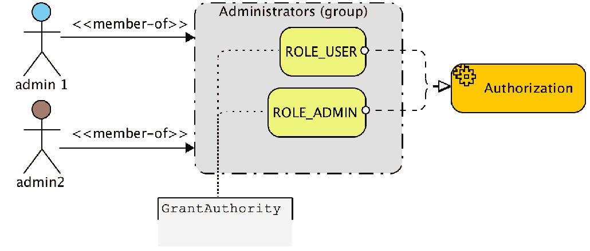
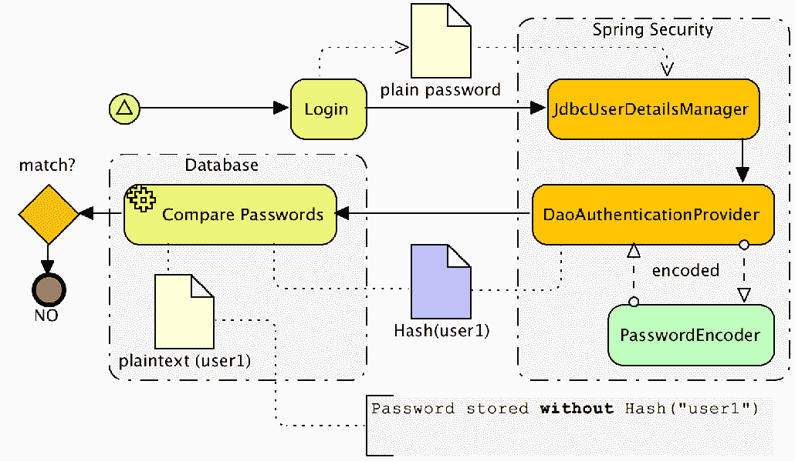
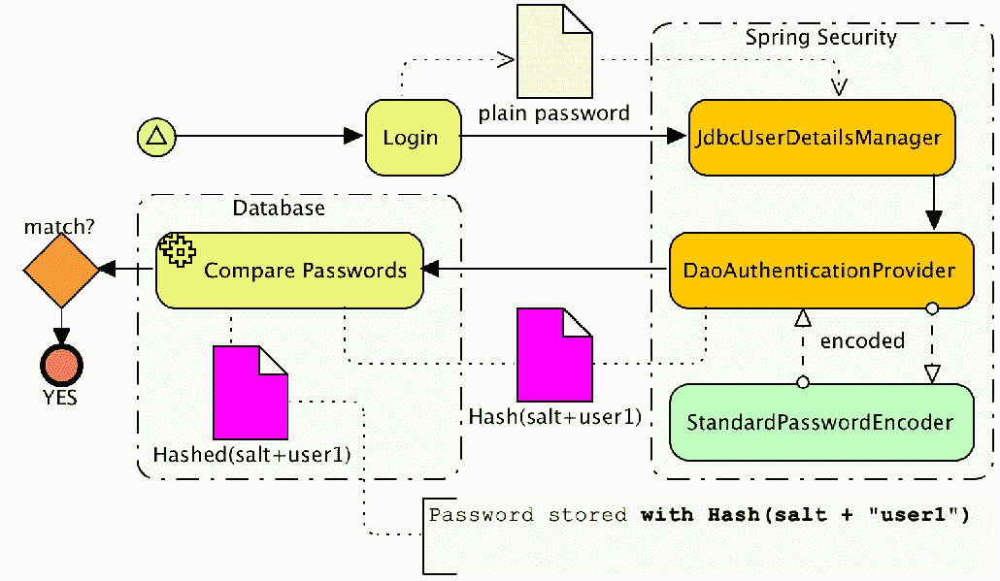

# 第四章：JDBC 基础认证

在上一章中，我们看到了如何扩展 Spring Security 以利用我们的`CalendarDao`接口和现有的领域模型来对用户进行身份验证。在本章中，我们将了解如何使用 Spring Security 的内置 JDBC 支持。为了保持简单，本章的示例代码基于我们在第二章，《使用 Spring Security 入门》中设置的 Spring Security。在本章中，我们将涵盖以下主题：

+   使用 Spring Security 内置的基于 JDBC 的认证支持

+   利用 Spring Security 的基于组授权来简化用户管理

+   学习如何使用 Spring Security 的`UserDetailsManager`接口

+   配置 Spring Security 以利用现有的`CalendarUser`模式对用户进行身份验证

+   学习如何使用 Spring Security 的新加密模块来保护密码

+   使用 Spring Security 的默认 JDBC 认证

如果你的应用程序尚未实现安全功能，或者你的安全基础设施正在使用一个数据库，Spring Security 提供了开箱即用的支持，可以简化你安全需求的解决。Spring Security 为用户、权限和组提供了一个默认模式。如果这还不能满足你的需求，它允许用户查询和管理被自定义。在下一节中，我们将介绍如何使用 Spring Security 设置 JDBC 认证的基本步骤。

# 所需的依赖项

我们的应用程序已经定义了本章所需的所有必要依赖项。然而，如果你正在使用 Spring Security 的 JDBC 支持，你可能会希望在你的`build.gradle`文件中列出以下依赖项。重要的是要强调，你将使用的 JDBC 驱动将取决于你正在使用的哪个数据库。请查阅你的数据库供应商的文档，了解需要为你的数据库安装哪个驱动。

请记住，所有的 Spring 版本需要一致，所有的 Spring Security 版本也需要一致（这包括传递依赖版本）。如果你在自己的应用程序中遇到难以解决的问题，你可以在`build.gradle`中定义依赖管理部分来强制执行这一点，如第二章，《使用 Spring Security 入门》所示。如前所述，使用示例代码时，你不需要担心这个问题，因为我们已经为你设置了必要的依赖项。

下面的代码片段定义了本章所需的依赖项，包括 Spring Security 和 JDBC 依赖项：

```java
    //build.gradle

    dependencies {
    ...
    // Database:
 compile('org.springframework.boot:spring-boot-starter-jdbc') compile('com.h2database:h2')    // Security:
 compile('org.springframework.boot:spring-boot-starter-security') testCompile('org.springframework.security:spring-security-test')       ....
    }
```

# 使用 H2 数据库

这个练习的第一部分涉及设置一个基于 Java 的 H2 关系数据库实例，其中包含 Spring Security 的默认模式。我们将配置 H2 在内存中运行，使用 Spring 的`EmbeddedDatabase`配置特性——一种比

手动设置数据库。你可以在 H2 网站上的[`www.h2database.com/`](http://www.h2database.com/)找到更多信息。

请记住，在我们的示例应用程序中，我们主要使用 H2，因为它的设置非常简单。Spring Security 可以与任何支持 ANSI SQL 的数据库无缝工作。如果你在跟随示例操作，我们鼓励你调整配置并使用你偏好的数据库。由于我们不想让本书的这部分内容专注于数据库设置的复杂性，因此我们选择了便利性而不是现实性作为练习的目的。

# 提供的 JDBC 脚本

我们已经在`src/main/resources/database/h2/`目录下提供了所有用于在 H2 数据库中创建模式和数据的 SQL 文件。所有以`security`为前缀的文件是为了支持 Spring Security 的默认 JDBC 实现。所有以`calendar`为前缀的 SQL 文件是 JBCP 日历应用程序的定制 SQL 文件。希望这能稍微简化样例的运行。如果你在自己的数据库实例中跟随操作，你可能需要调整模式定义语法以适应你的特定数据库。可以在 Spring Security 参考资料中找到其他数据库模式。你可以在书的附录*附加参考资料*中找到指向 Spring Security 参考资料的链接。

# 配置 H2 嵌入式数据库

为了配置 H2 嵌入式数据库，我们需要创建一个`DataSource`并运行 SQL 来创建 Spring Security 的表结构。我们需要更新在启动时加载的 SQL，以包括 Spring Security 的基本模式定义、Spring Security 用户定义以及用户权限映射。你可以在以下代码片段中找到`DataSource`定义和相关更新：

```java
    //src/main/java/com/packtpub/springsecurity/configuration/DataSourceConfig.java

    @Bean
    public DataSource dataSource() {
    return new EmbeddedDatabaseBuilder()
       .setName("dataSource")
 .setType(EmbeddedDatabaseType.H2)       .addScript("/database/h2/calendar-schema.sql")
       .addScript("/database/h2/calendar-data.sql")
 .addScript("/database/h2/security-schema.sql") .addScript("/database/h2/security-users.sql") .addScript("/database/h2/security-user-authorities.sql")       .build();
    }
```

记住，`EmbeddedDatabaseBuilder()`方法只在内存中创建数据库，所以你不会在磁盘上看到任何东西，也无法使用标准工具来查询它。然而，你可以使用嵌入在应用程序中的 H2 控制台与数据库进行交互。你可以通过查看我们应用程序的欢迎页面的说明来学习如何使用它。

# 配置 JDBC UserDetailsManager 实现

我们将修改`SecurityConfig.java`文件，声明我们使用 JDBC`UserDetailsManager`实现，而不是我们在第二章，*开始使用 Spring Security*中配置的 Spring Security 内存中的`UserDetailsService`实现。这是通过简单地更改`UserDetailsManager`声明来完成的，如下所示：

```java
    //src/main/java/com/packtpub/springsecurity/configuration/SecurityConfig.java

    ¦
    @Bean
    @Override
    public UserDetailsManager userDetailsService() {
 JdbcUserDetailsManager manager = new JdbcUserDetailsManager(); manager.setDataSource(dataSource); return manager;    }
    ¦
```

我们将替换之前的`configure(AuthenticationManagerBuilder)`方法及其所有子元素，使用如前一个代码片段所示的`userDetailsService()`方法。

# 默认的 Spring Security 用户模式

让我们来看看用于初始化数据库的每个 SQL 文件。我们添加的第一个脚本包含了默认的 Spring Security 用户及其权限的架构定义。接下来的脚本已从 Spring Security 的参考资料中改编，列在附录中的*附加参考资料*，以具有明确命名的约束，使故障排除更容易：

```java
    //src/main/resources/database/h2/security-schema.sql

    create table users(
       username varchar(256) not null primary key,
       password varchar(256) not null,
       enabled boolean not null
    );
    create table authorities (
       username varchar(256) not null,
       authority varchar(256) not null,
       constraint fk_authorities_users
           foreign key(username) references users(username)
    );
    create unique index ix_auth_username on authorities (username,authority);
```

# 定义用户

下一个脚本是负责定义我们应用程序中的用户。包含的 SQL 语句创建了到目前为止在整个书中使用的相同用户。该文件还添加了一个额外的用户`disabled1@example.com`，由于我们指示用户为禁用状态，因此该用户将无法登录：

```java
    //src/main/resources/database/h2/security-users.sql

    insert into users (username,password,enabled)
       values ('user1@example.com','user1',1);
    insert into users (username,password,enabled)
       values ('admin1@example.com','admin1',1);
    insert into users (username,password,enabled)
       values ('user2@example.com','admin1',1);
    insert into users (username,password,enabled)
       values ('disabled1@example.com','disabled1',0);
```

# 定义用户权限

您可能已经注意到没有指示用户是管理员还是普通用户。下一个文件指定了用户与相应权限的直接映射。如果一个用户没有映射到权限，Spring Security 将不允许该用户登录：

```java
    //src/main/resources/database/h2/security-user-authorities.sql

    insert into authorities(username,authority)
       values ('user1@example.com','ROLE_USER');
    insert into authorities(username,authority)
      values ('admin1@example.com','ROLE_ADMIN');
    insert into authorities(username,authority)
       values ('admin1@example.com','ROLE_USER');
    insert into authorities(username,authority)
       values ('user2@example.com','ROLE_USER');
    insert into authorities(username,authority)
       values ('disabled1@example.com','ROLE_USER');
```

在将 SQL 添加到嵌入式数据库配置之后，我们应该能够启动应用程序并登录。尝试使用`disabled1@example.com`作为`username`和`disabled1`作为`password`登录新用户。注意 Spring Security 不允许用户登录并提供错误消息`Reason: User is disabled`。

您的代码现在应该看起来像这样：`calendar04.01-calendar`。

# `UserDetailsManager`接口

我们在第三章，*自定义认证*中已经利用了 Spring Security 中的`InMemoryUserDetailsManager`类，在`SpringSecurityUserContext`实现的`UserContext`中查找当前的`CalendarUser`应用程序。这使我们能够确定在查找 My Events 页面的活动时应使用哪个`CalendarUser`。 第三章，*自定义认证*还演示了如何更新`DefaultCalendarService.java`文件以利用`InMemoryUserDetailsManager`，以确保我们创建`CalendarUser`时创建了一个新的 Spring Security 用户。本章正好重用了相同的代码。唯一的区别是`UserDetailsManager`实现由 Spring Security 的`JdbcUserDetailsManager`类支持，该类使用数据库而不是内存数据存储。

`UserDetailsManager`还提供了哪些其他功能？

尽管这些功能通过额外的 JDBC 语句相对容易编写，但 Spring Security 实际上提供了开箱即用的功能，以支持许多常见的**创建、读取、更新和删除**（**CRUD**）操作，这些操作针对 JDBC 数据库中的用户。这对于简单的系统来说很方便，也是一个很好的基础，可以在此基础上构建用户可能有的任何自定义要求：

| **方法** | **描述** |
| --- | --- |
| `void createUser(UserDetails user)` | 它使用给定的`UserDetails`信息创建一个新的用户，包括任何声明的`GrantedAuthority`权威。 |
| `void updateUser(final UserDetails user)` | 它使用给定的`UserDetails`信息更新用户。它更新`GrantedAuthority`并从用户缓存中移除用户。 |
| `void deleteUser(String username)` | 它删除给定用户名的用户，并将用户从用户缓存中移除。 |
| `boolean userExists(String username)` | 它表示是否具有给定用户名的活动用户或非活动用户存在。 |
| `void changePassword(String oldPassword, String newPassword)` | 它更改当前登录用户的密码。为了使操作成功，用户必须提供正确的密码。 |

如果`UserDetailsManager`没有为您的应用程序提供所有必要的方法，您可以扩展该接口以提供这些自定义要求。例如，如果您需要能够在管理视图中列出所有可能用户的权限，您可以编写自己的接口并实现此方法，使其指向与您当前使用的`UserDetailsManager`实现相同的存储库。

# 基于组的访问控制

`JdbcUserDetailsManager`类支持通过将`GrantedAuthority`分组到称为组的逻辑集合中，为用户和`GrantedAuthority`声明之间添加一个间接层的能力。

用户随后被分配一个或多个组，他们的成员资格赋予了一组`GrantedAuthority`声明：



正如您在前面的图表中所看到的，这种间接性允许通过简单地将新用户分配到现有组中来为多个用户分配相同的角色集。这与我们迄今为止看到的行为不同，以前我们直接将`GrantedAuthority`分配给个别用户。

这种将常见权限集打包的方法在以下场景中很有帮助：

+   您需要将用户划分为具有组之间一些重叠角色的社区。

+   您想要为某一类用户全局更改授权。例如，如果您有一个供应商组，您可能想要启用或禁用他们对应用程序特定部分的使用。

+   您有很多用户，而且不需要对用户级别的授权进行配置。

除非您的应用程序用户基数非常小，否则您很可能正在使用基于组的访问控制。虽然基于组的访问控制比其他策略稍微复杂一些，但管理用户访问的灵活性和简单性使得这种复杂性是值得的。这种通过组聚合用户权限的间接技术通常被称为**基于组的访问控制**（**GBAC**）。

GBAC 是市场上几乎所有受保护的操作系统或软件包中常见的做法。**微软** **活动目录**（**AD**）是基于大规模 GBAC 的最显著实现之一，这是因为它将 AD 用户分入组并分配给这些组的权限。通过使用 GBAC，大型 AD 基础组织的权限管理变得简单得多。

尝试思考您使用的软件的安全模型-用户、组和权限是如何管理的？安全模型编写方式的优势和劣势是什么？

让我们给 JBCP 日历应用程序增加一个抽象层，并将基于组的授权概念应用于该网站。

# 配置基于组的访问控制

我们将在应用程序中添加两个组：普通用户，我们将其称为`Users`，以及管理用户，我们将其称为`Administrators`。我们的现有账户将通过一个额外的 SQL 脚本与适当的组关联。

# 配置 JdbcUserDetailsManager 以使用组

默认情况下，Spring Security 不使用 GBAC。因此，我们必须指导 Spring Security 启用组的使用。修改`SecurityConfig.java`文件以使用`GROUP_AUTHORITIES_BY_USERNAME_QUERY`，如下所示：

```java
    //src/main/java/com/packtpub/springsecurity/configuration/SecurityConfig.java

    private static String GROUP_AUTHORITIES_BY_USERNAME_QUERY = " "+
 "select g.id, g.group_name, ga.authority " + "from groups g, group_members gm, " + "group_authorities ga where gm.username = ? " + "and g.id = ga.group_id and g.id = gm.group_id";    @Override
    public void configure(AuthenticationManagerBuilder auth) throws Exception {
 auth .jdbcAuthentication() .dataSource(dataSource) .groupAuthoritiesByUsername( GROUP_AUTHORITIES_BY_USERNAME_QUERY );    }
```

# 使用 GBAC JDBC 脚本

接下来，我们需要更新在启动时加载的脚本。我们需要删除`security-user-authorities.sql`映射，以便用户不再通过直接映射来获取他们的权限。然后我们需要添加两个额外的 SQL 脚本。更新`DataSource`bean 配置以加载 GBAC 所需的 SQL，如下所示：

```java
    //src/main/java/com/packtpub/springsecurity/configuration/DataSourceConfig.java

    @Bean
    public DataSource dataSource() {
       return new EmbeddedDatabaseBuilder()
         .setName("dataSource")
         .setType(EmbeddedDatabaseType.H2)
         .addScript("/database/h2/calendar-schema.sql")
         .addScript("/database/h2/calendar-data.sql")
         .addScript("/database/h2/security-schema.sql")
         .addScript("/database/h2/security-users.sql")
 .addScript("/database/h2/security-groups-schema.sql") .addScript("/database/h2/security-groups-mappings.sql")         .build();
    }
```

# 基于组的模式

可能很显然，但我们添加的第一个 SQL 文件包含了对模式的支持以支持基于组的授权的更新。您可以在以下代码片段中找到文件的正文：

```java
    //src/main/resources/database/h2/security-groups-schema.sql

    create table groups (
    id bigint generated by default as identity(start with 0) primary key,
    group_name varchar(256) not null
    );
    create table group_authorities (
      group_id bigint not null,
      authority varchar(256) not null,
      constraint fk_group_authorities_group
      foreign key(group_id) references groups(id)
    );
    create table group_members (
      id bigint generated by default as identity(start with 0) primary key,
      username varchar(256) not null,
      group_id bigint not null,\
```

```java
      constraint fk_group_members_group
      foreign key(group_id) references groups(id)\
    );
```

# 组权限映射

现在我们需要将我们的现有用户映射到组，并将组映射到权限。这在`security-groups-mappings.sql`文件中完成。基于组的映射很方便，因为通常，组织已经有了出于各种原因的逻辑用户组。通过利用现有用户分组，我们可以大大简化我们的配置。这就是间接层如何帮助我们。我们在以下组映射中包括了组定义、组到权限的映射以及几个用户：

```java
    //src/main/resources/database/h2/security-groups-mappings.sql

    -- Create the Groups

    insert into groups(group_name) values ('Users');
    insert into groups(group_name) values ('Administrators');

    -- Map the Groups to Roles

    insert into group_authorities(group_id, authority)
    select id,'ROLE_USER' from groups where group_name='Users';
    insert into group_authorities(group_id, authority)
    select id,'ROLE_USER' from groups where
    group_name='Administrators';
    insert into group_authorities(group_id, authority)
    select id,'ROLE_ADMIN' from groups where
    group_name='Administrators';

    -- Map the users to Groups

    insert into group_members(group_id, username)
    select id,'user1@example.com' from groups where
    group_name='Users';
    insert into group_members(group_id, username)
    select id,'admin1@example.com' from groups where
    group_name='Administrators';
    ...
```

启动应用程序，它将表现得和以前一样；然而，用户和角色之间的额外抽象层简化了大量用户组的管理。

您的代码现在应该看起来像`calendar04.02-calendar`。

# 支持自定义模式

新用户在开始使用 Spring Security 时，通常会通过将 JDBC 用户、组或角色映射适应现有的模式。即使遗留数据库不符合 Spring Security 预期的模式，我们仍然可以配置`JdbcDaoImpl`以与之对应。

现在，我们将更新 Spring Security 的 JDBC 支持，使其使用我们的现有`CalendarUser`数据库以及新的`calendar_authorities`表。

我们可以轻松地更改`JdbcUserDetailsManager`的配置，以利用此架构并覆盖 Spring Security 期望的表定义和列，这些表定义和列是我们用于 JBCP 日历应用程序的。

# 确定正确的 JDBC SQL 查询

`JdbcUserDetailsManager`类有三个 SQL 查询，每个查询都有明确定义的参数和返回的列集合。我们必须根据预期的功能确定我们将分配给这些查询的 SQL。`JdbcUserDetailsManager`中使用的每个 SQL 查询都将其作为登录时呈现的用户名作为唯一参数：

| `**命名空间查询属性名称**` | `**描述**` | `**预期的 SQL 列**` |
| --- | --- | --- |
| `users-by-username-query` | 返回与用户名匹配的一个或多个用户；只使用第一个用户。 | `Username` (`string`)`Password` (`string`)`Enabled` (`Boolean`) |
| `authorities-by-username-query` | 直接向用户返回一个或多个授予的权限。通常在禁用 GBAC 时使用。 | `Username` (`string`)`GrantedAuthority` (`string`) |
| `group-authorities-by-username-query` | 返回通过组成员身份提供给用户的授予权限和组详细信息。当启用 GBAC 时使用。 | `Group Primary Key` (任何)`Group Name` (任何)`GrantedAuthority` (字符串) |

请注意，在某些情况下，返回的列没有被默认的`JdbcUserDetailsManager`实现使用，但它们无论如何都必须返回。

# 更新加载的 SQL 脚本

我们需要初始化具有自定义架构的`DataSource`，而不是使用 Spring Security 的默认架构。按照以下方式更新`DataSourceConfig.java`文件：

```java
    //src/main/java/com/packtpub/springsecurity/configuration/DataSourceConfig.java

    @Bean
    public DataSource dataSource() {
    return new EmbeddedDatabaseBuilder()
       .setName("dataSource")
     .setType(EmbeddedDatabaseType.H2)
       .addScript("/database/h2/calendar-schema.sql")
       .addScript("/database/h2/calendar-data.sql")
 .addScript("/database/h2/calendar-authorities.sql")       .build();
    }
```

请注意，我们已经移除了所有以`security`开头的脚本，并将它们替换为`calendar-authorities.sql`。

# 日历用户权限 SQL

您可以在以下代码片段中查看`CalendarUser`权限映射：

```java
    //src/main/resources/database/h2/calendar-authorities.sql

    create table calendar_user_authorities (
       id bigint identity,
       calendar_user bigint not null,
       authority varchar(256) not null,
    );
    -- user1@example.com
    insert into calendar_user_authorities(calendar_user, authority)
       select id,'ROLE_USER' from calendar_users where
       email='user1@example.com';
    -- admin1@example.com
    insert into calendar_user_authorities(calendar_user, authority)
       select id,'ROLE_ADMIN' from calendar_users where     
       email='admin1@example.com';
    insert into calendar_user_authorities(calendar_user, authority)
       select id,'ROLE_USER' from calendar_users where
       email='admin1@example.com';
    -- user2@example.com
    insert into calendar_user_authorities(calendar_user, authority)
       select id,'ROLE_USER' from calendar_users where
     email='user2@example.com';
```

请注意，我们使用`id`作为外键，这比使用用户名作为外键（如 Spring Security 所做的那样）要好。通过使用`id`作为外键，我们可以允许用户轻松地更改他们的用户名。

# 插入自定义权限

当我们添加一个新的`CalendarUser`类时，我们需要更新`DefaultCalendarService`以使用我们的自定义架构为用户插入权限。这是因为虽然我们重用了用户定义的架构，但我们在现有的应用程序中没有定义自定义权限。按照以下方式更新`DefaultCalendarService`：

```java
    //src/main/java/com/packtpub/springsecurity/service/DefaultCalendarService.java

    import org.springframework.jdbc.core.JdbcOperations;
    ...
    public class DefaultCalendarService implements CalendarService {
       ...
       private final JdbcOperations jdbcOperations;
       @Autowired
          public DefaultCalendarService(EventDao eventDao, 
          CalendarUserDao userDao, JdbcOperations jdbcOperations) {
           ...
           this.jdbcOperations = jdbcOperations;
       }
       ...
       public int createUser(CalendarUser user) {
           int userId = userDao.createUser(user);
           jdbcOperations.update(
             "insert into calendar_user_authorities(calendar_user,authority) 
             values(?,?)", userId, "ROLE_USER");
           return userId;
       }
    }
```

您可能注意到了用于插入我们用户的`JdbcOperations`接口。这是 Spring 提供的一个方便的模板，它有助于管理诸如连接和事务处理之类的样板代码。有关详细信息，请参阅本书附录*附加参考资料*，以找到 Spring 参考资料。

# 配置`JdbcUserDetailsManager`以使用自定义 SQL 查询。

为了使用我们非标准架构的自定义 SQL 查询，我们只需更新我们的`userDetailsService()`方法以包括新的查询。这和启用 GBAC 支持的过程非常相似，只不过我们这次不使用默认的 SQL，而是使用我们修改后的 SQL。注意我们移除了我们旧的`setGroupAuthoritiesByUsernameQuery()`方法调用，因为在这个例子中我们不会使用它，以保持事情的简单性：

```java
    //src/main/java/com/packtpub/springsecurity/configuration/SecurityConfig.java

 private static String CUSTOM_USERS_BY_USERNAME_QUERY = ""+ "select email, password, true " + "from calendar_users where email = ?"; private static String CUSTOM_AUTHORITIES_BY_USERNAME_QUERY = ""+ "select cua.id, cua.authority " + "from calendar_users cu, calendar_user_authorities "+ "cua where cu.email = ? "+ "and cu.id = cua.calendar_user";    @Override
    public void configure(AuthenticationManagerBuilder auth) throws Exception {
    auth
       .jdbcAuthentication()
       .dataSource(dataSource)
 .usersByUsernameQuery(USERS_BY_USERNAME_QUERY) .authoritiesByUsernameQuery( AUTHORITIES_BY_USERNAME_QUERY );    }
```

这是使用 Spring Security 从现有的非默认架构中读取设置所需的所有配置！启动应用程序并确保一切正常运行。

你的代码现在应该看起来像这样：`calendar04.03-calendar`。

请记住，使用现有架构通常需要扩展`JdbcUserDetailsManager`以支持密码的更改、用户账户的更名和其他用户管理功能。

如果你使用`JdbcUserDetailsManager`来执行用户管理任务，那么这个类中有超过 20 个可以通过配置访问的 SQL 查询。然而，只有三个是可以通过命名空间配置访问的。请参阅 Javadoc 或源代码，以查看`JdbcUserDetailsManager`使用的查询的默认值。

# 配置安全密码。

你可能会记得，在第一章，《不安全应用程序的剖析》，的安全审计中，存储在明文中的密码的安全是审计员的首要任务。实际上，在任何一个安全系统中，密码的安全是验证主体信任和权威性的关键方面。一个完全安全的系统的设计者必须确保密码以恶意用户几乎不可能妥协的方式存储。

以下一般规则应适用于数据库中存储的密码：

+   密码不应当以明文（纯文本）形式存储。

+   用户提供的密码必须与数据库中记录的密码进行比较。

+   不应在用户请求时（即使用户忘记了）向用户提供密码。

对于大多数应用程序来说，最适合这些要求的是单向编码，也就是密码的**哈希**。使用密码学哈希可以提供诸如安全和唯一性等重要特性，这对于正确验证用户非常重要，而且一旦哈希，密码就不能从存储的值中提取。

在大多数安全的应用设计中，当请求时既不需要也不应该检索用户的实际密码，因为在不具备适当额外凭证的情况下向用户提供其密码可能会带来重大的安全风险。相反，大多数应用会提供用户重置密码的能力，要么通过提供额外凭证（如他们的社会安全号码、出生日期、税务 ID 或其他个人信息），要么通过基于电子邮件的系统。

存储其他类型的敏感信息

适用于密码的大部分指南同样适用于其他类型的敏感信息，包括社会安全号码和信用卡信息（尽管根据应用程序，其中一些可能需要解密的能力）。以多种方式存储此类信息，例如，客户的完整 16 位信用卡号码以高度加密的形式存储，但最后四位可能以明文形式存储。作为参考，想想任何显示`XXXX XXXX XXXX 1234`以帮助您识别存储的信用卡的互联网商务网站。

您可能已经在思考，鉴于我们使用 SQL 来为 H2 数据库填充用户这一显然不切实际的方法，我们是如何编码密码的？H2 数据库，或者大多数其他数据库，并没有将加密方法作为内置数据库函数提供。

通常，引导过程（用初始用户和数据填充系统）是通过 SQL 加载和 Java 代码的组合来处理的。根据应用程序的复杂性，这个过程可能会变得非常复杂。

对于 JBCP 日历应用程序，我们将保留`dataSource()`bean 声明和`DataSource`在相应的 SQL 中的代码名称，然后添加一些 SQL，将密码更改为它们的散列值。

# 密码编码器（PasswordEncoder）方法

Spring Security 中的密码散列是由`o.s.s.authentication.encoding.PasswordEncoder`接口的实现定义的。通过`AuthenticationManagerBuilder`元素中的`passwordEncoder()`方法配置密码编码器是简单的，如下所示：

```java
    auth
       .jdbcAuthentication()
       .dataSource(dataSource)
       .usersByUsernameQuery(CUSTOM_USERS_BY_USERNAME_QUERY)
       .authoritiesByUsernameQuery(CUSTOM_AUTHORITIES_BY_USERNAME_QUERY)
 .passwordEncoder(passwordEncoder());
```

您会高兴地了解到，Spring Security 随带有一系列`passwordEncoder`的实现，适用于不同的需求和安全要求。

下面的表格提供了一系列内置实现类及其优点。请注意，所有实现都位于`o.s.s.authentication.encoding`包中：

| **实现类** | **描述** | **哈希值** |
| --- | --- | --- |
| `PlaintextPasswordEncoder` | 它将密码编码为明文；这是默认选项。 | `&lt;p>plaintext` |
| `Md4PasswordEncoderPasswordEncoder` | 这个编码器使用`MD4`散列算法。`MD4`散列算法不是一个安全的算法——不建议使用这个编码器。 | `md4` |
| `Md5PasswordEncoderPassword` | 这个编码器使用`MD5`单向编码算法。 |  |
| `ShaPasswordEncoderPasswordEncoder` | 这个编码器使用`SHA`单向编码算法。此编码器可以支持可配置的编码强度级别。 | `sha``sha-256` |
| `LdapShaPasswordEncoder` | 在与 LDAP 身份验证存储集成时使用的`LdapSha`和`LdapSsha`算法的实现。我们将在第六章，*LDAP 目录服务*中了解更多关于这个算法，届时我们将覆盖 LDAP。 | `{sha}``{ssha}` |

与其他 Spring Security 领域的许多方面一样，也可以通过实现`PasswordEncoder`来引用 bean 定义，以提供更精确的配置，并允许`PasswordEncoder`通过依赖注入与其他 bean 连接。对于 JBCP 日历应用程序，我们需要使用这种 bean 引用方法来哈希新创建用户的密码。

让我们通过以下步骤了解为 JBCP 日历应用程序配置基本密码编码的过程。

# 配置密码编码

配置基本密码编码涉及两个步骤：在 SQL 脚本执行后，将加载到数据库中的密码进行哈希，并确保 Spring Security 配置为与`PasswordEncoder`一起工作。

# 配置 PasswordEncoder 方法

首先，我们将声明一个`PasswordEncoder`实例作为一个普通的 Spring bean，如下所示：

```java
    //src/main/java/com/packtpub/springsecurity/configuration/SecurityConfig.java

    @Bean
    public ShaPasswordEncoder passwordEncoder(){
       return new ShaPasswordEncoder(256);
    }
```

您会注意到我们使用的是`SHA-256` `PasswordEncoder`实现。这是一个高效的单向加密算法，通常用于密码存储。

# 使 Spring Security 了解 PasswordEncoder 方法

我们需要配置 Spring Security 以引用`PasswordEncoder`，这样它可以在用户登录时对呈现的密码进行编码和比较。只需添加一个`passwordEncoder`方法，并参考我们在上一步定义的 bean ID：

```java
    //src/main/java/com/packtpub/springsecurity/configuration/SecurityConfig.java

    @Override
    public void configure(AuthenticationManagerBuilder auth) 
    throws Exception {
    auth
       .jdbcAuthentication()
       .dataSource(dataSource)
       .usersByUsernameQuery(CUSTOM_USERS_BY_USERNAME_QUERY)
       .authoritiesByUsernameQuery(
           CUSTOM_AUTHORITIES_BY_USERNAME_QUERY)
 .passwordEncoder(passwordEncoder())     ;
    }
```

如果您在此时尝试应用程序，您会发现之前有效的登录凭据现在被拒绝。这是因为存储在数据库中的密码（使用`calendar-users.sql`脚本加载）不是以与密码编码器匹配的`hash`形式存储。我们需要将存储的密码更新为哈希值。

# 存储密码的哈希

如以下图表所示，当用户提交密码时，Spring Security 哈希提交的密码，然后将其与数据库中的未哈希密码进行比较：



这意味着用户无法登录我们的应用程序。为了解决这个问题，我们将更新在启动时加载的 SQL，以将密码更新为哈希值。如下更新`DataSourceConfig.java`文件：

```java
    //src/main/java/com/packtpub/springsecurity/configuration/DataSourceConfig.java

    @Bean
    public DataSource dataSource() {
    return new EmbeddedDatabaseBuilder()
       .setName("dataSource")
       .setType(EmbeddedDatabaseType.H2)
       .addScript("/database/h2/calendar-schema.sql")
       .addScript("/database/h2/calendar-data.sql")
       .addScript("/database/h2/calendar-authorities.sql")
 .addScript("/database/h2/calendar-sha256.sql")       .build();
    }
```

`calendar-sha256.sql`文件简单地将现有密码更新为其预期的哈希值，如下所示：

```java
   update calendar_users set password =      
   '0a041b9462caa4a31bac3567e0b6e6fd9100787db2ab433d96f6d178cabfce90' 
   where email = 'user1@example.com';
```

我们是如何知道要更新密码的值的？我们已经提供了`o.s.s.authentication.encoding.Sha256PasswordEncoderMain`，以展示如何使用配置的`PasswordEncoder`接口来散列现有的密码。相关代码如下：

```java
    ShaPasswordEncoder encoder = new ShaPasswordEncoder(256); 
    String encodedPassword = encoder.encodePassword(password, null);
```

# 散列新用户的密码

如果我们尝试运行应用程序并创建一个新用户，我们将无法登录。这是因为新创建的用户的密码还没有被散列。我们需要更新`DefaultCalendarService`以散列密码。确保新创建用户的密码被散列，请进行以下更新：

```java
    //src/main/java/com/packtpub/springsecurity/service/DefaultCalendarService.java

    import org.springframework.security.authentication.encoding.PasswordEncoder;
    // other imports omitted
    public class DefaultCalendarService implements CalendarService {
       ...
       private final PasswordEncoder passwordEncoder;
       @Autowired
       public DefaultCalendarService(EventDao eventDao, 
       CalendarUserDao userDao, JdbcOperations jdbcOperations, 
       PasswordEncoder passwordEncoder) {
       ...
       this.passwordEncoder = passwordEncoder;
       }
       ...
       public int createUser(CalendarUser user) {
           String encodedPassword = passwordEncoder.
           encodePassword(user.getPassword(), null);
           user.setPassword(encodedPassword);
```

```java
           ...
          return userId;
       }
    }
```

# 不太安全

启动应用程序。尝试使用`user1`作为密码创建一个新用户。退出应用程序，然后按照欢迎页面的说明打开 H2 控制台并查看所有用户的密码。你注意到新创建用户和`user1@example.com`的散列值是相同的值吗？我们现在发现另一个用户的密码有点令人不安。我们将使用一种名为**加盐**的技术来解决这个问题。

您的代码现在应该看起来像这样：`calendar04.04-calendar`。

你想给密码加些盐吗？如果安全审计员检查数据库中编码的密码，他会发现一些仍然让他担心网站安全的东西。让我们检查以下几个用户的存储用户名和密码值：

| **用户名** | **明文密码** | **散列密码** |
| --- | --- | --- |
| `admin1@example.com` | `admin1` | `25f43b1486ad95a1398e3eeb3d83bc4010015fcc9bed b35b432e00298d5021f7` |
| `user1@example.com` | `user1` | `0a041b9462caa4a31bac3567e0b6e6fd9100787db2ab 433d96f6d178cabfce90` |

这看起来非常安全——加密后的密码显然与原始密码没有任何相似之处。审计员会担心什么？如果我们添加一个新用户，而这个新用户的密码恰好与我们的`user1@example.com`用户相同呢？

| **用户名** | **明文密码** | **散列密码** |
| --- | --- | --- |
| `hacker@example.com` | `user1` | `0a041b9462caa4a31bac3567e0b6e6fd9100787d b2ab433d96f6d178cabfce90` |

现在，请注意`hacker@example.com`用户的加密密码与真实用户完全相同！因此，如果黑客以某种方式获得了读取数据库中加密密码的能力，他们可以将自己的已知密码的加密表示与用户账户的未知密码进行比较，看它们是否相同！如果黑客有权访问执行此分析的自动化工具，他们可能在几小时内就能威胁到用户的账户。

虽然猜测一个密码很困难，但黑客可以提前计算出所有的散列值并将散列值与原始密码的映射存储起来。然后，通过查找散列值来确定原始密码，只需常数时间即可。这是一种名为**彩虹表**的黑客技术。

向加密密码中添加另一层安全性的一个常见且有效的方法是使用**盐值**。盐值是一个第二个明文组件，它在与明文密码连接后进行哈希之前，以确保必须使用两个因素来生成（从而比较）哈希密码值。适当选择的盐值可以保证没有任何两个密码会有相同的哈希值，从而防止了我们审计员所担忧的情况，并避免了多种常见的暴力破解密码技术。

最佳实践的盐值通常属于以下三个类别之一：

+   它们是从与用户相关的某些数据算法生成的，例如用户创建的时间戳

+   它们是随机生成的并以某种形式存储

+   它们与用户密码记录一起明文或双向加密

记住，因为`salt`添加到明文密码中，所以它不能单向加密——应用程序需要能够查找或推导出给定用户记录的适当`salt`值，以便计算密码的`hash`，并与进行身份验证时存储的用户`hash`进行比较。

# 在 Spring Security 中使用盐值

Spring Security 3.1 提供了一个新的加密模块，该模块包含在`spring-security-core`模块中，也可以在`spring-security-crypto`中单独使用。`crypto`模块包含自己的`o.s.s.crypto.password.PasswordEncoder`接口。实际上，使用这个接口是编码密码的首选方法，因为它会使用随机的`salt`来加密密码。在撰写本文时，有以下三个实现`o.s.s.crypto.password.PasswordEncoder`：

| **类** | **描述** |
| --- | --- |
| `o.s.s.crypto.bcrypt.BCryptPasswordEncoder` | 这个类使用`bcrypt`哈希函数。它支持盐值和随时间推移减慢速度的能力，随着技术的改进。这有助于保护免受暴力搜索攻击。 |
| `o.s.s.crypto.password.NoOpPasswordEncoder` | 这个类不进行编码（它以明文形式返回密码）。 |
| `o.s.s.crypto.password.StandardPasswordEncoder` | 这个类使用多次迭代和随机盐值的`SHA-256`。 |

对那些熟悉 Spring Security 3.0 的人来说，`salt`曾经是通过`o.s.s.authentication.dao.SaltSource`提供的。尽管仍然支持，但本书不演示这种机制，因为它不是提供`salt`的首选机制。

# 更新 Spring Security 配置

可以通过更新 Spring Security 配置来实现。删除旧的`ShaPasswordEncoder`编码器，并添加新的`StandardPasswordEncoder`编码器，如下所示：

```java
    //src/main/java/com/packtpub/springsecurity/configuration/SecurityConfig.java

    @Bean
    public PasswordEncoder passwordEncoder(){
       return new StandardPasswordEncoder();
    }
```

# 迁移现有密码

让我们来看看以下步骤，了解迁移现有密码：

1.  我们需要更新我们现有的密码，使其使用新`PasswordEncoder`类产生的值。如果您想生成自己的密码，可以使用以下代码片段：

```java
        StandardPasswordEncoder encoder = new StandardPasswordEncoder();
        String encodedPassword = encoder.encode("password");
```

1.  删除之前使用的`calendar-sha256.sql`文件，并按照以下方式添加提供的`saltedsha256.sql`文件：

```java
      //src/main/java/com/packtpub/springsecurity/configuration/
      DataSourceConfig.java

      @Bean
      public DataSource dataSource() {
      return new EmbeddedDatabaseBuilder()
         .setName("dataSource")
         .setType(EmbeddedDatabaseType.H2)
         .addScript("/database/h2/calendar-schema.sql")
         .addScript("/database/h2/calendar-data.sql"
         .addScript("/database/h2/calendar-authorities.sql")
 .addScript("/database/h2/calendar-saltedsha256.sql")         .build();
      }
```

# 更新 DefaultCalendarUserService

我们之前定义的`passwordEncoder()`方法足够智能，可以处理新的密码编码器接口。然而，`DefaultCalendarUserService`需要更新到新的接口。对`DefaultCalendarUserService`类进行以下更新：

```java
    //src/main/java/com/packtpub/springsecurity/service/DefaultCalendarService.java

    import org.springframework.security.authentication.encoding.PasswordEncoder;
    import org.springframework.security.crypto.password.PasswordEncoder;

    // other imports omitted

    public class DefaultCalendarService implements CalendarService {
    ...      
    public int createUser(CalendarUser user) {
       String encodedPassword = passwordEncoder.encode(user.getPassword());
       user.setPassword(encodedPassword);
       ...
       return userId;
    }
    }
```

# 尝试使用加盐密码

启动应用程序，尝试使用密码`user1`创建另一个用户。使用 H2 控制台比较新用户的密码，并观察它们是不同的。

您的代码现在应该看起来像这样：`calendar04.05-calendar`。

现在 Spring Security 会生成一个随机的`salt`，然后将其与密码结合后再进行哈希处理。接着，它将这个随机的`salt`添加到明文密码的前面，以便进行密码校验。存储的密码可以总结如下：

```java
    salt = randomsalt()
    hash = hash(salt+originalPassword)
    storedPassword = salt + hash
```

这是对新创建密码进行哈希处理的伪代码。

要验证用户，可以从存储的密码中提取`salt`和`hash`，因为`salt`和`hash`都是固定长度的。然后，可以将提取的`hash`与新的`hash`进行比较，新的`hash`是通过提取的`salt`和输入的密码计算得出的：



以下是对加盐密码进行验证的伪代码：

```java
    storedPassword = datasource.lookupPassword(username)
    salt, expectedHash = extractSaltAndHash(storedPassword)
    actualHash = hash(salt+inputedPassword)
    authenticated = (expectedHash == actualHash)
```

# 总结

在本章中，我们学习了如何使用 Spring Security 内置的 JDBC 支持。具体来说，我们了解到 Spring Security 为新的应用程序提供了一个默认模式。我们还探索了如何实现 GBAC，以及它如何使用户管理变得更容易。

我们还学会了如何将 Spring Security 的 JDBC 支持与现有的数据库集成，以及如何通过哈希处理和使用随机生成的`salt`来保护我们的密码。

在下一章中，我们将探讨**Spring Data**项目以及如何配置 Spring Security 使用**对象关系映射**（**ORM**）来连接 RDBMS，以及文档数据库。
