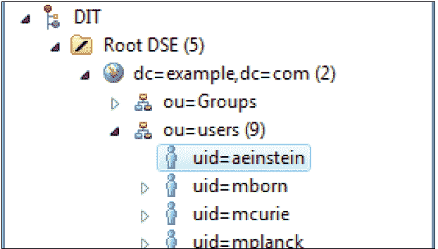
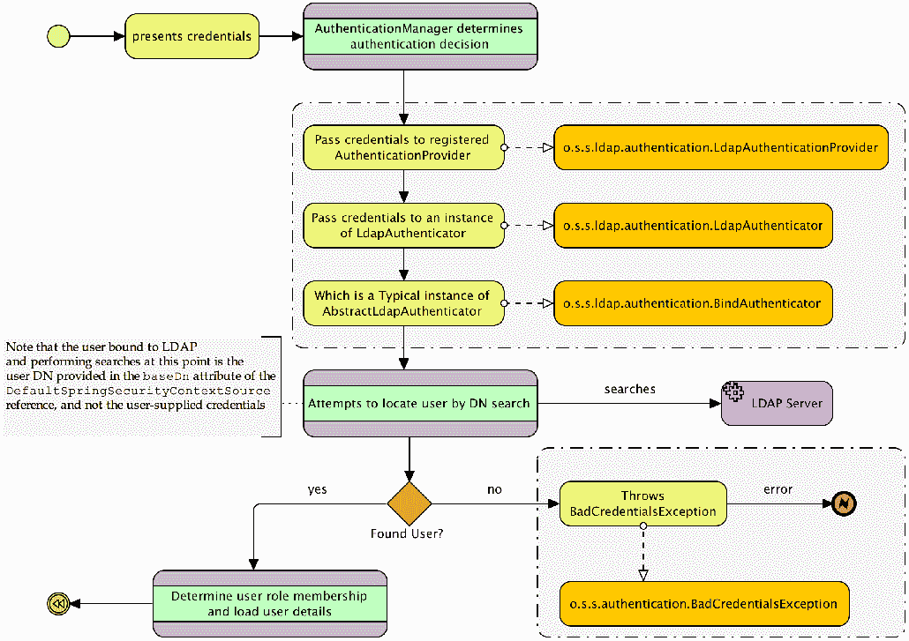
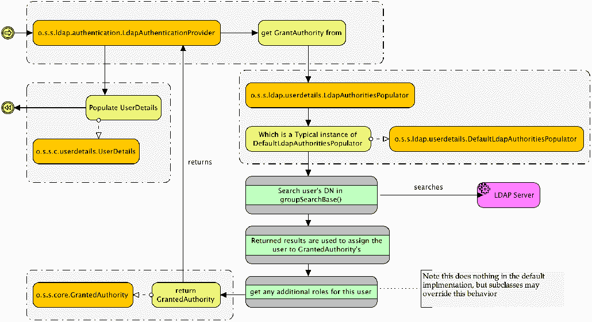
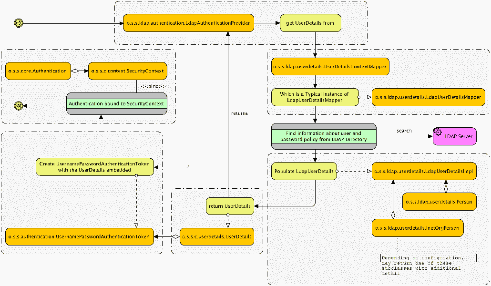
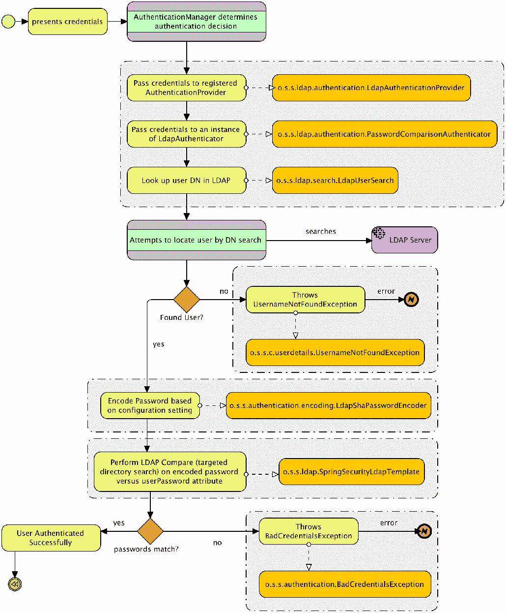
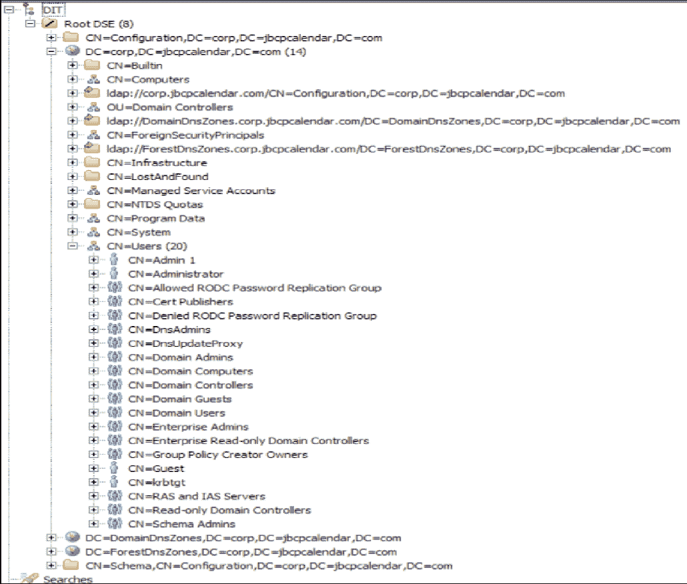

# 第六章：LDAP 目录服务

在本章中，我们将回顾**轻量级目录访问协议**（**LDAP**）并学习如何将其集成到 Spring Security 启用的应用程序中，为感兴趣的各方提供认证、授权和用户信息服务。

在本章中，我们将介绍以下主题：

+   学习与 LDAP 协议和服务器实现相关的一些基本概念

+   在 Spring Security 中配置自包含 LDAP 服务器

+   启用 LDAP 认证和授权

+   理解 LDAP 搜索和用户匹配背后的模型

+   从标准 LDAP 结构中检索额外的用户详细信息

+   区分 LDAP 认证方法并评估每种类型的优缺点

+   显式使用**Spring bean**声明配置 Spring Security LDAP

+   连接到外部 LDAP 目录

+   探索对 Microsoft AD 的内置支持

+   我们还将探讨如何在处理自定义 AD 部署时为 Spring Security 定制更多灵活性

# 理解 LDAP

LDAP 起源于 30 多年前的概念性目录模型-类似于组织结构图和电话簿的结合。如今，LDAP 越来越多地被用作集中企业用户信息、将成千上万的用户划分为逻辑组以及在不同系统之间统一共享用户信息的方法。

出于安全考虑，LDAP 常被用于实现集中化的用户名和密码验证-用户的凭据存储在 LDAP 目录中，代表用户对目录进行认证请求。这使得管理员的管理工作得到简化，因为用户凭据-登录 ID、密码及其他详细信息-都存储在 LDAP 目录的单一位置中。此外，诸如组织结构、团队分配、地理位置和企业层级等信息，都是基于用户在目录中的位置来定义的。

# LDAP

到目前为止，如果你以前从未使用过 LDAP，你可能会想知道它是什么。我们将通过 Apache Directory Server 2.0.0-M231.5 示例目录中的屏幕截图来展示一个 LDAP 架构示例，如下面的屏幕截图所示：



从特定用户条目`uid=admin1@example.com`（在前面的屏幕截图中突出显示）开始，我们可以通过在这个树节点开始并向上升级来推断`admin1`的组织成员资格。我们可以看到用户`aeinstein`是组织单位（`ou=users`）的成员，而这个单位本身是域`example.com`的一部分（在前面的屏幕截图中显示的缩写`dc`代表域组件）。在这个之前是 LDAP 树本身的组织元素（`DIT`和`Root DSE`），这在 Spring Security 的上下文中与我们无关。用户`aeinstein`在 LDAP 层次结构中的位置在语义上和定义上都是有意义的-你可以想象一个更复杂的层次结构，轻松地说明一个大型组织的组织和部门界限。

沿着树向下走到一个单独的叶节点形成的从上到下的完整路径是由沿途的所有中间节点组成的一个字符串，就像`admin1`的节点路径一样，如下所示：

```java
    uid=admin1,ou=users,dc=example,dc=com
```

前面的节点路径是唯一的，被称为节点的** Distinguished Name** (**DN**)。Distinguished Name 类似于数据库的主键，允许在复杂的树结构中唯一标识和定位一个节点。在 Spring Security LDAP 集成中，我们将看到节点的 DN 在认证和搜索过程中被广泛使用。

请注意，在与`admin1`相同组织级别的列表中还有几个其他用户。所有这些用户都被假设为与`admin1`处于相同的组织位置。尽管这个例子中的组织结构相对简单和平坦，但 LDAP 的结构是任意灵活的，可能有多个嵌套层次和逻辑组织。

Spring Security LDAP 支持由 Spring LDAP 模块提供([`www.springsource.org/ldap`](http://www.springsource.org/ldap))，该模块实际上是从 Spring 框架核心和 Spring Security 项目分离出来的一个独立项目。它被认为是稳定的，并提供了一组有助于包装标准 Java LDAP 功能的封装器。

# 常见的 LDAP 属性名称

树中的每个实际条目都是由一个或多个对象类定义的。对象类是组织的一个逻辑单位，将一组语义上相关的属性组合在一起。通过将树中的条目声明为特定对象类的一个实例，如一个人，LDAP 目录的组织者就能够向目录的用户提供一个清晰的指示，表明目录中的每个元素代表什么。

LDAP 有一套丰富的标准模式，涵盖可用的 LDAP 对象类及其适用的属性（以及其他大量信息）。如果您计划进行广泛的 LDAP 工作，强烈建议您查阅一本好的参考指南，例如书籍《Zytrax OpenLDAP》的附录（[`www.zytrax.com/books/ldap/ape/`](http://www.zytrax.com/books/ldap/ape/)），或《Internet2 Consortium 的与人员相关的模式指南》([`middleware.internet2.edu/eduperson/`](http://middleware.internet2.edu/eduperson/))。

在前一部分中，我们了解到 LDAP 树中的每个条目都有一个 DN，它唯一地标识树中的条目。DN 由一系列属性组成，其中一个（或更多）用于唯一标识表示 DN 的条目向下走的路径。由于 DN 描述的路径的每个段代表一个 LDAP 属性，你可以参考可用的、定义良好的 LDAP 模式和对象类，以确定任何给定 DN 中的每个属性的含义。

我们在下面的表格中包含了一些常见属性和它们的意义。这些属性通常是组织属性——意思是它们通常用于定义 LDAP 树的组织结构——并且按从上到下的顺序排列在你可能在典型 LDAP 安装中看到的结构：

| **属性名称** | **描述** | **示例** |
| --- | --- | --- |
| `dc` | **域组件**：通常是 LDAP 层次结构中的最高级别组织。 | `dc=jbcpcalendar,dc=com` |
| `c` | **国家**：一些 LDAP 层次结构按国家进行高层次的结构化。 | `c=US` |
| `o` | **组织名称**：这是一个用于分类 LDAP 资源的父级商业组织。 | `o=Oracle Corporation` |
| `ou` | **组织单位**：这是一个通常在组织内的分部商业组织。 | `ou=Product Development` |
| `cn` | **通用名称**：这是对象的共同名称，或唯一名称或人类可读名称。对于人类，这通常是人的全名，而对于 LDAP 中的其他资源（如计算机等），它通常是主机名。 | `cn=Super Visor``cn=Jim Bob` |
| `uid` | **用户 ID**：尽管不是组织性质的，但`uid`属性通常是 Spring 在用户认证和搜索时查找的。 | `uid=svisor` |
| `userPassword` | **用户密码**：此属性存储与该属性关联的`person`对象的密码。它通常是使用`SHA`或其他类似方法进行单向散列的。 | `userPassword=plaintext``userPassword={SHA}cryptval` |

然而，前表中的属性通常是的目录树的组织属性，因此，它们可能形成各种搜索表达式或映射，以便配置 Spring Security 与 LDAP 服务器进行交互。

记住，有数百个标准的 LDAP 属性-这些只是你在与一个完全填充的 LDAP 服务器集成时可能会看到的很小的一部分。

# 更新我们的依赖项

我们已经为您本章所需的所有依赖项，所以你不需要对你的`build.gradle`文件做任何更新。然而，如果你只是想为你的应用程序添加 LDAP 支持，你需要在`build.gradle`中添加`spring-security-ldap`作为依赖项，如下所示：

```java
    //build.gradle

    dependencies {
    // LDAP:
    compile('org.springframework.boot:spring-boot-starter-data-ldap')
    compile("org.springframework.ldap:spring-ldap-core")
    compile("org.springframework.security:spring-security-ldap")
 compile("org.springframework:spring-tx")    compile("com.unboundid:unboundid-ldapsdk")
       ...
    }
```

由于 Gradle 的一个艺术品解析问题，`spring-tx`必须被引入，否则 Gradle 会获取一个较旧的版本，无法使用。

如前所述，Spring Security 的 LDAP 支持是建立在 Spring LDAP 之上的。Gradle 会自动将这些依赖作为传递依赖引入，因此无需明确列出。

如果你在你的网络应用程序中使用**ApacheDS**运行 LDAP 服务器，正如我们在我们的日历应用程序中所做的那样，你需要添加 ApacheDS 相关的 JAR 包依赖。由于这些更新已经被包含在我们的示例应用程序中，所以无需对示例应用程序进行这些更新。请注意，如果你连接到一个外部的 LDAP 服务器，这些依赖是不必要的：

```java
//build.gradle

    compile 'org.apache.directory.server:apacheds-core:2.0.0-M23'
    compile 'org.apache.directory.server:apacheds-protocol-ldap:2.0.0-M23'
    compile 'org.apache.directory.server:apacheds-protocol-shared:2.0.0
    -M23'
```

配置嵌入式 LDAP 集成

现在让我们启用基于 LDAP 的 JBCP 日历应用程序认证。幸运的是，这是一个相对简单的练习，使用嵌入式 LDAP 服务器和一个示例 LDIF 文件。在这个练习中，我们将使用为这本书创建的 LDIF 文件，旨在捕获许多与 LDAP 和 Spring Security 相关的常见配置场景。我们还包含了一些其他示例 LDIF 文件，其中一些来自 Apache DS 2.0.0-M23，还有一个来自 Spring Security 单元测试，你可以选择实验它们。

# 配置 LDAP 服务器引用

第一步是配置嵌入式 LDAP 服务器。Spring Boot 会自动配置一个嵌入式 LDAP 服务器，但我们还需要稍微调整一下配置。对你的`application.yml`文件进行以下更新：

```java
      //src/main/resources/application.yml

      spring:
      ## LDAP
 ldap: embedded: 
```

```java
 ldif: classpath:/ldif/calendar.ldif base-dn: dc=jbcpcalendar,dc=com port: 33389
```

你应该从`chapter06.00-calendar`的源代码开始。

我们从`classpath`加载`calendar.ldif`文件，并使用它来填充 LDAP 服务器。`root`属性使用指定的 DN 声明 LDAP 目录的根。这应该与我们在使用的 LDIF 文件中的逻辑根 DN 相对应。

请注意，对于嵌入式 LDAP 服务器，`base-dn`属性是必需的。如果没有指定或指定不正确，你可能会在 Apache DS 服务器的初始化过程中收到几个奇怪的错误。还要注意，`ldif`资源应该只加载一个`ldif`，否则服务器将无法启动。Spring Security 要求一个资源，因为使用诸如`classpath*:calendar.ldif`的东西不能提供所需要的确切排序。

我们将在 Spring Security 配置文件中重新使用这里定义的 bean ID，当我们声明 LDAP 用户服务和其他配置元素时。在使用内置 LDAP 模式时，`<ldap-server>`声明上的所有其他属性都是可选的。

# 启用 LDAP AuthenticationProviderNext 接口

接下来，我们需要配置另一个`AuthenticationProvider`接口，以将用户凭据与 LDAP 提供者进行核对。只需更新 Spring Security 配置，使用`o.s.s.ldap.authentication.LdapAuthenticationProvider`引用，如下所示：

```java
    //src/main/java/com/packtpub/springsecurity/configuration/SecurityConfig.java

    @Override
    public void configure(AuthenticationManagerBuilder auth)
    throws Exception {
       auth
 .ldapAuthentication() .userSearchBase("") .userSearchFilter("(uid={0})") .groupSearchBase("ou=Groups") .groupSearchFilter("(uniqueMember={0})") .contextSource(contextSource()) .passwordCompare() .passwordAttribute("userPassword");    }
    @Bean
    public DefaultSpringSecurityContextSource contextSource() {
 return new DefaultSpringSecurityContextSource( Arrays.asList("ldap://localhost:33389/"), "dc=jbcpcalendar,dc=com");
    }
```

我们稍后会讨论这些属性。现在，先让应用程序恢复正常运行，然后尝试使用`admin1@example.com`作为用户名和`admin1`作为密码登录。你应该可以登录！

您的源代码应该看起来像`chapter05.01-calendar`。

# 调试内置 LDAP

你很可能会遇到嵌入式 LDAP 的难以调试的问题。Apache DS 通常对其错误信息不太友好，在 Spring Security 嵌入式模式下更是如此。如果你在尝试通过浏览器访问应用程序时遇到`404`错误，有很大可能性是没有正确启动。如果你无法运行这个简单示例，需要检查以下几点：

+   确保在您的`configuration`文件中的`DefaultSpringSecurityContextSource`声明上设置了`baseDn`属性，并确保它与在启动时加载的 LDIF 文件中定义的根匹配。如果您遇到引用缺失分区错误，很可能是漏掉了`root`属性或与您的 LDIF 文件不匹配。

+   请注意，嵌入式 LDAP 服务器启动失败并不是致命失败。为了诊断加载 LDIF 文件时的错误，您需要确保适当的日志设置，包括 Apache DS 服务器的日志记录，至少在错误级别启用。LDIF 加载器位于`org.apache.directory.server.protocol.shared.store`包下，应使用此包来启用 LDIF 加载错误的日志记录。

+   如果应用服务器非正常关闭，你可能需要删除临时目录（Windows 系统中的`%TEMP%`或 Linux 系统中的`/tmp`）中的某些文件，以便再次启动服务器。关于这方面的错误信息（幸运的是）相当清晰。不幸的是，内置的 LDAP 不如内置的 H2 数据库那么无缝且易于使用，但它仍然比尝试下载和配置许多免费的外部 LDAP 服务器要容易得多。

一个出色的工具，用于调试或访问一般 LDAP 服务器的是 Apache Directory Studio 项目，该项目提供独立版本和 Eclipse 插件版本。免费下载可在[`directory.apache. Org/studio/`](http://directory.apache.org/studio/)找到。如果你想跟随本书，现在可能想下载 Apache Directory Studio 2.0.0-M23。

# 了解 Spring LDAP 认证如何工作

我们看到我们能够使用在 LDAP 目录中定义的用户登录。但是，当用户发出登录请求时，在 LDAP 中实际上会发生什么？LDAP 认证过程有三个基本步骤：

1.  将用户提供的凭据与 LDAP 目录进行认证。

1.  基于用户在 LDAP 中的信息，确定其`GrantedAuthority`对象。

1.  从 LDAP 条目预加载用户信息到一个自定义的`UserDetails`对象中，供应用程序进一步使用。

# 验证用户凭据

对于第一步，即对 LDAP 目录进行认证，一个自定义认证提供者被连接到`AuthenticationManager`。`o.s.s.ldap.authentication.LdapAuthenticationProvider`接口接受用户提供的凭据，并将它们与 LDAP 目录进行验证，如下面的图所示：



我们可以看到`o.s.s.ldap.authentication.LdapAuthenticator`接口定义了一个委派，以允许提供者以可定制的方式提出认证请求。我们到目前为止隐式配置的实现，`o.s.s.ldap.authentication.BindAuthenticator`，尝试使用用户的凭据以登录到 LDAP 服务器，好像是用户自己建立连接一样。对于内嵌服务器，这对于我们的认证需求是充分的；然而，外部 LDAP 服务器可能更严格，在这些服务器上，用户可能不允许绑定到 LDAP 目录。幸运的是，存在一种替代的认证方法，我们将在本章后面探索。

如前图所示，请注意，搜索是在由`DefaultSpringSecurityContextSource`参考的`baseDn`属性创建的 LDAP 上下文中执行的。对于内嵌服务器，我们不使用这些信息，但对于外部服务器参考，除非提供`baseDn`，否则会使用匿名绑定。对于需要有效凭据才能搜索 LDAP 目录的组织来说，保留对目录中信息公共可用的某些控制是非常常见的，因此，在现实世界场景中`baseDn`几乎总是必需的。`baseDn`属性代表具有对目录进行绑定并执行搜索的有效访问权限的用户的全 DN。

# 使用 Apache Directory Studio 演示认证过程

我们将通过使用 Apache Directory Studio 1.5 连接到我们的内嵌 LDAP 实例并执行 Spring Security 正在执行的相同步骤来演示认证过程是如何工作的。在整个模拟中我们将使用`user1@example.com`。这些步骤将有助于确保对幕后发生的事情有坚实的基础，并有助于在您遇到难以确定正确配置的情况下提供帮助。

确保日历应用程序已经启动并运行。接下来，启动 Apache Directory Studio 1.5 并关闭欢迎屏幕。

# 匿名绑定到 LDAP

第一步是以匿名方式绑定到 LDAP。由于我们没有在`DefaultSpringSecurityContextSource`对象上指定`baseDn`和`password`属性，因此绑定是匿名的。在 Apache Directory Studio 中，使用以下步骤创建一个连接：

1.  点击文件 | 新建 | LDAP 浏览器 | LDAP 连接。

1.  点击下一步。

1.  输入以下信息，然后点击下一步：

    +   连接名称：`calendar-anonymous`

    +   主机名：`localhost`

    +   端口：``33389``

1.  我们没有指定`baseDn`，因此选择无认证作为认证方法。

1.  点击完成。

您可以安全地忽略指示没有默认架构信息的存在的消息。现在您应该可以看到，您已经连接到了内嵌的 LDAP 实例。

# 搜索用户

现在我们已经有了一个连接，我们可以使用它来查找我们希望绑定的用户的 DN，通过执行以下步骤：

1.  右键点击`DIT`并选择新建 | 新搜索。

1.  输入搜索基础`dc=jbcpcalendar,dc=com`。这对应于我们的`DefaultSpringSecurityContextSource`对象的`baseDn`属性，我们指定的。

1.  输入过滤器`uid=user1@example.com`。这对应于我们为`AuthenticationManagerBuilder`的`userSearchFilter`方法指定的值。注意我们包括了括号，并用`{0}`值替换了我们尝试登录的用户名。

1.  点击搜索。

1.  点击我们搜索返回的单个结果的 DN。现在您可以看到我们的 LDAP 用户被显示出来。注意这个 DN 与我们搜索的值匹配。记住这个 DN，因为它将在我们下一步中使用。

# 以用户身份绑定到 LDAP

现在我们已经找到了我们用户的完整 DN，我们需要尝试以该用户身份绑定到 LDAP 以验证提交的密码。这些步骤与我们已经完成的匿名绑定相同，只是我们将指定我们要认证的用户的凭据。

在 ApacheDS 中，使用以下步骤创建一个连接：

1.  选择文件 | 新建 | LDAP 浏览器 | LDAP 连接。

1.  点击下一步。

1.  输入以下信息，然后点击下一步：

    +   连接名称：`calendar-user1`

    +   主机名：`localhost`

    +   端口：`33389`

1.  将认证方法保留为简单认证。

1.  从我们的搜索结果中输入 DN 作为`Bind DN`。值应该是`uid=admin1@example.com,ou=Users,dc=jbcpcalendar,dc=com`。

1.  `Bind`密码应该是登录时提交的用户密码。在我们这个案例中，我们希望使用`admin1`来进行成功的认证。如果输入了错误的密码，我们将无法连接，Spring Security 会报告一个错误。

1.  点击完成。

当 Spring Security 能够成功绑定提供的用户名和密码时，它会确定这个用户的用户名和密码是正确的（这类似于我们能够创建一个连接）。Spring Security 然后将继续确定用户的角色成员资格。

# 确定用户角色成员资格

在用户成功对 LDAP 服务器进行身份验证后，下一步必须确定授权信息。授权是由主体的角色列表定义的，LDAP 身份验证用户的角色成员资格是根据以下图表所示确定的：



我们可以看到，在用户对 LDAP 进行身份验证后，`LdapAuthenticationProvider`委托给`LdapAuthoritiesPopulator`。`DefaultLdapAuthoritiesPopulator`接口将尝试在 LDAP 层次结构的另一个条目或其下查找已验证用户的 DN。在用户角色分配的位置搜索的 DN 定义在`groupSearchBase`方法中；在我们的示例中，我们将此设置为`groupSearchBase("ou=Groups")`。当用户的 DN 位于`groupSearchBase` DN 下方的 LDAP 条目中时，在该条目中找到用户 DN 的属性用于赋予他们角色。

如何将 Spring Security 角色与 LDAP 用户相关联可能会有些令人困惑，所以让我们看看 JBCP 日历 LDAP 存储库，并了解用户与角色关联是如何工作的。`DefaultLdapAuthoritiesPopulator`接口使用`AuthenticationManagerBuilder`声明中的几个方法来管理对用户角色的搜索。这些属性大约按以下顺序使用：

1.  `groupSearchBase`：它定义了 LDAP 集成应该查找用户 DN 的一个或多个匹配项的基础 DN。默认值是从 LDAP 根进行搜索，这可能会很昂贵。

1.  `groupSearchFilter`：它定义了用于匹配用户 DN 到位于`groupSearchBase`下条目的属性的 LDAP 搜索过滤器。这个搜索过滤器有两个参数——第一个（`{0}`）是用户的 DN，第二个（`{1}`）是用户的名字。默认值是`uniqueMember={0}`。

1.  `groupRoleAttribute`：它定义了匹配条目的属性，该属性将用于组成用户的`GrantedAuthority`对象。默认值是`cn`。

1.  `rolePrefix`：它将被添加到在`groupRoleAttribute`中找到的值前面，以构成 Spring Security 的`GrantedAuthority`对象。默认值是`ROLE_`。

这可能有点抽象，对于新开发者来说难以理解，因为它与我们迄今为止在 JDBC 和 JPA 基础上的`UserDetailsService`实现非常不同。让我们继续通过`user1@example.com`用户在 JBCP 日历 LDAP 目录中走一遍登录过程。

# 使用 Apache Directory Studio 确定角色

我们现在将尝试使用 Apache Directory Studio 确定我们的用户角色。使用我们之前创建的`calendar-user1`连接，执行以下步骤：

1.  在`DIT`上右键点击，选择新建 | 新搜索。

1.  输入搜索基础`ou=Groups,dc=jbcpcalendar,dc=com`。这对应于我们为`AuthenticationManagerBuilder`对象指定的`DefaultSpringSecurityContextSource`对象中的`baseDn`属性，加上我们为`AuthenticationManagerBuilder`对象指定的`groupSearchBase`属性。

1.  输入过滤器`uniqueMember=uid=user1@example.com,ou=Users,dc=jbcpcalendar,dc=com`。这对应于默认的`groupSearchFilter`属性（`uniqueMember={0}`）。注意我们已经用我们在上一步骤中找到的用户的全 DN 替换了`{0}`值。

1.  点击搜索。

1.  你会观察到，在我们的搜索结果中只有`User`组返回。点击我们搜索返回的单个结果的 DN。现在你可以在 Apache DS 中看到`User`组。注意该组有一个`uniqueMember`属性，包含了我们的用户和其他用户的全 DN。

现在，Spring Security 会为每个搜索结果创建一个`GrantedAuthority`对象，通过将找到的组的名称强制转换为大写并在组名称前加上`ROLE_`前缀。伪代码看起来类似于以下代码片段：

```java
    foreach group in groups:

    authority = ("ROLE_"+group).upperCase()

    grantedAuthority = new GrantedAuthority(authority)
```

Spring LDAP 和你的灰质一样灵活。请记住，虽然这是一种组织 LDAP 目录以与 Spring Security 兼容的方法，但典型的使用场景正好相反——一个已经存在的 LDAP 目录需要与 Spring Security 进行集成。在许多情况下，你将能够重新配置 Spring Security 以处理 LDAP 服务器的层次结构；然而，关键是你需要有效地规划并理解 Spring 在查询时如何与 LDAP 合作。用你的大脑，规划用户搜索和组搜索，并提出你能想到的最优计划——尽量保持搜索的范围最小和尽可能精确。

你能描述一下我们的`admin1@example.com`用户登录结果会有何不同吗？如果你此刻感到困惑，我们建议你稍作休息，尝试使用 Apache Directory Studio 浏览嵌入式 LDAP 服务器，该服务器通过运行应用程序进行配置。如果你尝试按照之前描述的算法自己搜索目录，那么你可能会更容易掌握 Spring Security 的 LDAP 配置流程。

# 映射 UserDetails 的额外属性

最后，一旦 LDAP 查询为用户分配了一组`GrantedAuthority`对象，`o.s.s.ldap.userdetails.LdapUserDetailsMapper`将咨询`o.s.s.ldap.userdetails.UserDetailsContextMapper`，以检索任何其他详细信息，以填充应用程序使用的`UserDetails`对象。

使用`AuthenticationManagerBuilder`，到目前为止，我们已经配置了`LdapUserDetailsMapper`将用于从 LDAP 目录中用户的条目中获取信息，并填充`UserDetails`对象：



我们马上看到如何配置`UserDetailsContextMapper`从标准的 LDAP `person`和`inetOrgPerson`对象中获取大量信息。带有基础`LdapUserDetailsMapper`，存储的不仅仅是`username`、`password`和`GrantedAuthority`。

尽管在 LDAP 用户认证和详细信息检索的背后涉及更多的机械设备，但你会注意到整个过程似乎与我们在第四章中研究的 JDBC 认证（认证用户并填充`GrantedAuthority`） somewhat similar（有所相似）。与 JDBC 认证一样，可以执行 LDAP 集成的高级配置。让我们深入了解一下有什么可能性！

# 高级 LDAP 配置

一旦我们超越了 LDAP 集成的基础知识，Spring Security LDAP 模块中还有许多其他配置能力，这些能力仍然符合`WebSecurityConfigurerAdapter`风格的配置。这包括检索用户个人信息、用户认证的额外选项以及将 LDAP 用作与标准`DaoAuthenticationProvider`类结合的`UserDetailsService`接口。

# JBCP LDAP 用户示例

我们在 JBCP 日历`LDIF`文件中提供了许多不同的用户。以下快速参考表可能会帮助您进行高级配置练习或自我探索：

| **用户名/密码** | **角色（们）** | **密码编码** |
| --- | --- | --- |
| `admin1@example.com`/`admin1` | `ROLE_ADMIN`, `ROLE_USER` | 纯文本 |
| `user1@example.com`/`user1` | `ROLE_USER` | 纯文本 |
| `shauser@example.com`/`shauser` | `ROLE_USER` | `{sha}` |
| `sshauser@example.com`/`sshauser` | `ROLE_USER` | `{ssha}` |
| `hasphone@example.com`/`hasphone` | `ROLE_USER` | 纯文本（在`telephoneNumber`属性中） |

我们将在下一节解释为什么密码编码很重要。

# 密码对比与绑定认证

某些 LDAP 服务器将被配置为不允许某些个别用户直接绑定到服务器，或者不允许使用匿名绑定（到目前为止我们一直在用于用户搜索的绑定方式）。这在希望限制能够从目录中读取信息的用户集的大型组织中较为常见。

在这些情况下，标准的 Spring Security LDAP 认证策略将不起作用，必须使用替代策略，由`o.s.s.ldap.authentication.PasswordComparisonAuthenticator`实现：

类`BindAuthenticator`）：



`PasswordComparisonAuthenticator`接口连接到 LDAP，搜索与用户提供的用户名匹配的 DN。然后将用户提供的密码与匹配的 LDAP 条目上的`userPassword`属性进行比较。如果编码的密码匹配，用户将被认证，流程继续，与`BindAuthenticator`类似。

# 配置基本的密码比较

配置密码比较认证而不是绑定认证，只需在`AuthenticationManagerBuilder`声明中添加一个方法即可。更新`SecurityConfig.java`文件，如下所示：

```java
    //src/main/java/com/packtpub/springsecurity/configuration/SecurityConfig.java

    @Override
    public void configure(AuthenticationManagerBuilder auth)
       throws Exception {
       auth
         .ldapAuthentication()
         .userSearchBase("")
         .userSearchFilter("(uid={0})")
         .groupSearchBase("ou=Groups")
         .groupSearchFilter("(uniqueMember={0})")
         .contextSource(contextSource())
 .passwordCompare() .passwordEncoder(new LdapShaPasswordEncoder()) .passwordAttribute("userPassword");    }
```

`PasswordCompareConfigurer`类通过声明`passwordCompare`方法来使用，该类使用`PlaintextPasswordEncoder`进行密码编码。要使用`SHA-1`密码算法，我们需要设置一个密码编码器，我们可以使用`o.s.s.a.encoding.LdapShaPasswordEncoder`为`SHA`支持（回想我们在第四章，*基于 JDBC 的认证*中广泛讨论了`SHA-1`密码算法）。

在我们的`calendar.ldif`文件中，我们将`password`字段设置为`userPassword`。`PasswordCompareConfigurer`类的默认`password`属性是`password`。因此，我们还需要使用`passwordAttribute`方法覆盖`password`属性。

在重启服务器后，您可以尝试使用`shauser@example.com`作为`用户名`和`shauser`作为`密码`登录。

您的代码应类似于`chapter06.02-calendar`。

# LDAP 密码编码和存储

LDAP 对多种密码编码算法提供了普遍支持，这些算法从明文到单向散列算法-类似于我们在前一章中探讨的-带有基于数据库的认证。LDAP 密码最常用的存储格式是`SHA`（`SHA-1`单向散列）和`SSHA`（`SHA-1`单向散列加盐值）。许多 LDAP 实现广泛支持的其他密码格式在*RFC 2307*中详细记录，*作为网络信息服务使用的 LDAP 方法*（[`tools.ietf.org/html/rfc2307`](http://tools.ietf.org/html/rfc2307)）。*RFC 2307*的设计者在密码存储方面做了一件非常聪明的事情。保存在目录中的密码当然是用适当的算法（如`SHA`等）进行编码，然后，它们前面加上用于编码密码的算法。这使得 LDAP 服务器很容易支持多种密码编码算法。例如，一个`SHA`编码的密码在目录中以`{SHA}5baa61e4c9b93f3f0682250b6cf8331b7ee68fd8`的形式存储。

我们可以看到，密码存储算法非常清楚地用`{SHA}`标记表示，并与密码一起存储。

`SSHA`记号试图将强大的`SHA-1`散列算法与密码加盐结合起来，以防止字典攻击。正如我们在上一章中回顾的密码加盐一样，在计算散列之前将盐添加到密码中。当散列密码存储在目录中时，盐值附加在散列密码后面。密码前缀`{SSHA}`，以便 LDAP 目录知道需要以不同的方式比较用户提供的密码。大多数现代 LDAP 服务器将`SSHA`作为默认的密码存储算法。

# 密码比较认证的缺点

既然你已经了解了 LDAP 如何使用密码，并且我们已经设置了`PasswordComparisonAuthenticator`，那么你觉得如果你使用以`SSHA`格式存储密码的`sshauser@example.com`用户登录会发生什么？

好的，放下书本试试，然后回来。

你的登录被拒绝了，对吧？然而你还是能够以 SHA 编码密码的用户登录。为什么？当我们在使用绑定认证时，密码编码和存储很重要。你认为为什么？

使用绑定认证时，它不重要，因为 LDAP 服务器负责处理用户的认证和验证。使用密码比较认证时，Spring Security LDAP 负责以目录期望的格式编码密码，然后将其与目录进行匹配以验证认证。

出于安全考虑，密码比较认证实际上无法从目录中读取密码（读取目录密码通常被安全策略禁止）。相反，`PasswordComparisonAuthenticator`执行一个以用户目录条目为根的 LDAP 搜索，试图与由 Spring Security 编码的密码的`password`属性和值相匹配。

所以，当我们尝试使用`sshauser@example.com`登录时，`PasswordComparisonAuthenticator`正在使用配置的`SHA`算法编码密码，并尝试进行简单匹配，这失败了，因为该用户的目录密码以`SSHA`格式存储。

我们当前的配置已使用`LdapShaPasswordEncoder`支持了`SHA`和`SSHA`，所以目前仍然无法工作。让我们来思考可能的原因。记住，`SSHA`使用的是加盐密码，盐值与密码一起存储在 LDAP 目录中。然而，`PasswordComparisonAuthenticator`的编码方式使其无法从 LDAP 服务器读取任何内容（这通常违反了不允许绑定的公司的安全策略）。因此，当`PasswordComparisonAuthenticator`计算散列密码时，它无法确定要使用哪个盐值。

总之，`PasswordComparisonAuthenticator` 在某些有限的特定情况下非常有价值，其中目录本身的安全性是一个关注点，但它永远不可能像直接绑定身份验证那样灵活。

# 配置 UserDetailsContextMapper 对象

如我们之前所提到的，`o.s.s.ldap.userdetails.UserDetailsContextMapper` 接口的一个实例用于将用户的 LDAP 服务器条目映射到内存中的 `UserDetails` 对象。默认的 `UserDetailsContextMapper` 对象行为类似于 `JpaDaoImpl`，考虑到返回的 `UserDetails` 对象中填充的详细信息级别 - 也就是说，除了用户名和密码之外，没有返回很多信息。

然而，LDAP 目录 potentially potentially 包含比用户名、密码和角色更多的个人信息。Spring Security 附带了两种从标准 LDAP 对象架构 - `person` 和 `inetOrgPerson` 中提取更多用户数据的方法。

# 隐式配置 UserDetailsContextMapper

为了配置一个不同的 `UserDetailsContextMapper` 实现，而不是默认的实现，我们只需要声明我们想要 `LdapAuthenticationProvider` 返回哪个 `LdapUserDetails` 类。安全命名空间解析器足够智能，可以根据请求的 `LdapUserDetails` 接口类型实例化正确的 `UserDetailsContextMapper` 实现。

让我们重新配置我们的 `SecurityConfig.java` 文件，以使用 `inetOrgPerson` 映射器版本。更新 `SecurityConfig.java` 文件，如下所示：

```java
    //src/main/java/com/packtpub/springsecurity/configuration/SecurityConfig.java

    @Override
    public void configure(AuthenticationManagerBuilder auth)
    throws Exception {
       auth
           .ldapAuthentication()
           .userSearchBase("")
           .userSearchFilter("(uid={0})")
           .groupSearchBase("ou=Groups")
           .groupSearchFilter("(uniqueMember={0})")
 .userDetailsContextMapper( new InetOrgPersonContextMapper())           .contextSource(contextSource())
           .passwordCompare()
              // Supports {SHA} and {SSHA}
               .passwordEncoder(new LdapShaPasswordEncoder())
               .passwordAttribute("userPassword");
    }
```

如果我们移除 `passwordEncoder` 方法，那么使用 `SHA` 密码的 LDAP 用户将无法进行身份验证。

如果你重新启动应用程序并尝试以 LDAP 用户身份登录，你会看到什么都没有变化。实际上，`UserDetailsContextMapper` 在幕后已经更改为在用户目录条目中可用 `inetOrgPerson` 架构属性时读取附加详细信息。

尝试使用 `admin1@example.com` 作为 `username` 和 `admin1` 作为 `password` 进行身份验证。它应该无法进行身份验证。

# 查看附加用户详细信息

为了在这个领域帮助你，我们将向 JBCP 日历应用程序添加查看当前账户的能力。我们将使用这个页面来展示如何使用更丰富的个人和 `inetOrgPerson` LDAP 架构为您的 LDAP 应用程序提供额外的（可选）信息。

你可能注意到这一章带有一个额外的控制器，名为 `AccountController`。你可以看到相关的代码，如下所示：

```java
    //src/main/java/com/packtpub/springsecurity/web/controllers/AccountController.java

    ...
    @RequestMapping("/accounts/my")
    public String view(Model model) {
    Authentication authentication = SecurityContextHolder.
    getContext().getAuthentication();
    // null check on authentication omitted
    Object principal = authentication.getPrincipal();
    model.addAttribute("user", principal);
    model.addAttribute("isLdapUserDetails", principal instanceof
    LdapUserDetails);
    model.addAttribute("isLdapPerson", principal instanceof Person);
    model.addAttribute("isLdapInetOrgPerson", principal instanceof
    InetOrgPerson);
    return "accounts/show";
    }
    ...
```

前面的代码将通过`LdapAuthenticationProvider`从`Authentication`对象中检索存储在`UserDetails`对象（主体）中，并确定它是哪种类型的`LdapUserDetailsImplinterface`。页面代码本身将根据已绑定到用户认证信息的`UserDetails`对象类型显示各种详细信息，正如我们在下面的 JSP 代码中所看到的那样。我们已经包括了 JSP：

```java
    //src/main/resources/templates/accounts/show.html

    <dl>
       <dt>Username</dt>
       <dd id="username" th:text="${user.username}">ChuckNorris</dd>
       <dt>DN</dt>
       <dd id="dn" th:text="${user.dn}"></dd>
       <span th:if="${isLdapPerson}">
           <dt>Description</dt>
           <dd id="description" th:text="${user.description}"></dd>
           <dt>Telephone</dt>
           <dd id="telephoneNumber" th:text="${user.telephoneNumber}"></dd>
           <dt>Full Name(s)</dt>
           <span th:each="cn : ${user.cn}">
           <dd th:text="${cn}"></dd>
           </span>
       </span>
       <span th:if="${isLdapInetOrgPerson}">
           <dt>Email</dt>
           <dd id="email" th:text="${user.mail}"></dd>
           <dt>Street</dt>
           <dd id="street" th:text="${user.street}"></dd>
       </span>
    </dl>
```

实际需要做的工作只是在我们`header.html`文件中添加一个链接，如下面的代码片段所示：

```java
    //src/main/resources/templates/fragments/header.html

    <li>
    <p class="navbar-text">Welcome &nbsp;
 <a id="navMyAccount" th:href="@{/accounts/my}">         <div class="navbar-text" th:text="${#authentication.name}">
         User</div>
 </a>    </p>
    </li>
```

我们增加了以下两个用户，您可以使用它们来检查可用数据元素的区别：

| **用户名** | **密码** | **类型** |
| --- | --- | --- |
| `shainet@example.com` | `shainet` | `inetOrgPerson` |
| `shaperson@example.com` | `shaperson` | `person` |

您的代码应该像`chapter05.03-calendar`。

通过在右上角点击用户名，重新启动服务器并检查各种用户类型的账户详情页面。你会注意到，当`UserDetails`类配置为使用`inetOrgPerson`时，尽管返回的是`o.s.s.ldap.userdetails.InetOrgPerson`，但字段可能填充也可能不填充，这取决于目录条目的可用属性。

实际上，`inetOrgPerson`有更多我们在这个简单页面上说明的属性。您可以在*RFC 2798*中查看完整列表，《inetOrgPerson LDAP 对象类的定义》([`tools.ietf.org/html/rfc2798`](http://tools.ietf.org/html/rfc2798))。

您可能会注意到，没有支持在对象条目上指定但不符合标准架构的额外属性的功能。标准的`UserDetailsContextMapper`接口不支持任意属性的列表，但通过使用`userDetailsContextMapper`方法，仍然可以通过引用您自己的`UserDetailsContextMapper`接口来定制它。

# 使用替代密码属性

在某些情况下，可能需要使用替代的 LDAP 属性来进行身份验证，而不是`userPassword`。这可能发生在公司部署了自定义 LDAP 架构，或者不需要强密码管理（可以说，这从来不是一个好主意，但在现实世界中确实会发生）的情况下。

`PasswordComparisonAuthenticator`接口还支持将用户密码与替代的 LDAP 条目属性进行验证的能力，而不是标准的`userPassword`属性。这非常容易配置，我们可以通过使用明文`telephoneNumber`属性来演示一个简单的例子。按照以下方式更新`SecurityConfig.java`：

```java
    //src/main/java/com/packtpub/springsecurity/configuration/SecurityConfig.java

    @Override
    public void configure(AuthenticationManagerBuilder auth)
    throws Exception {
       auth
         .ldapAuthentication()
         .userSearchBase("")
         .userSearchFilter("(uid={0})")
        .groupSearchBase("ou=Groups")
         .groupSearchFilter("(uniqueMember={0})")
         .userDetailsContextMapper(new InetOrgPersonContextMapper())
         .contextSource(contextSource())
         .passwordCompare()
            .passwordAttribute("telephoneNumber");
    }
```

我们可以重新启动服务器，并尝试使用`hasphone@example.com`作为`username`和`0123456789`作为`password`（电话号码）属性进行登录。

您的代码应该像`chapter05.04-calendar`。

当然，这种基于`PasswordComparisonAuthenticator`的认证方式具有我们之前讨论过的所有风险；然而，了解它是明智的，以防在 LDAP 实现中遇到它。

# 使用 LDAP 作为 UserDetailsService

需要指出的一点是，LDAP 也可以用作`UserDetailsService`。正如我们将在书中稍后讨论的，`UserDetailsService`是启用 Spring Security 基础架构中各种其他功能所必需的，包括记住我和 OpenID 认证功能。

我们将修改我们的`AccountController`对象，使其使用`LdapUserDetailsService`接口来获取用户。在这样做之前，请确保删除以下代码片段中的`passwordCompare`方法：

```java
    //src/main/java/com/packtpub/springsecurity/configuration/SecurityConfig.java

    @Override
    public void configure(AuthenticationManagerBuilder auth)
    throws Exception {
       auth
         .ldapAuthentication()
         .userSearchFilter("(uid={0})")
         .groupSearchBase("ou=Groups")
         .userDetailsContextMapper(new InetOrgPersonContextMapper())
         .contextSource(contextSource());
    }
```

# 配置 LdapUserDetailsService

将 LDAP 配置为`UserDetailsService`的功能与配置 LDAP`AuthenticationProvider`非常相似。与 JDBC`UserDetailsService`一样，LDAP`UserDetailsService`接口被配置为`<http>`声明的兄弟。请对`SecurityConfig.java`文件进行以下更新：

```java
    //src/main/java/com/packtpub/springsecurity/configuration/SecurityConfig.java

    @Bean
    @Override
    public UserDetailsService userDetailsService() {
       return super.userDetailsService();
   }
```

从功能上讲，`o.s.s.ldap.userdetails.LdapUserDetailsService`的配置几乎与`LdapAuthenticationProvider`完全相同，不同之处在于这里没有尝试使用主体的用户名来绑定 LDAP。相反，`DefaultSpringSecurityContextSource`提供的凭据本身就是参考，用来执行用户查找。

不要犯一个非常常见的错误，即如果你打算使用 LDAP 本身来验证用户，就不要将`AuthenticationManagerBuilder`配置为引用`LdapUserDetailsService`的`UserDetailsService`！如前所述，由于安全原因，通常无法从 LDAP 中检索`password`属性，这使得`UserDetailsService`对于认证毫无用处。如前所述，`LdapUserDetailsService`使用与`DefaultSpringSecurityContextSource`声明一起提供的`baseDn`属性来获取其信息-这意味着它不会尝试将用户绑定到 LDAP，因此可能不会如你所预期的那样运行。

# 更新 AccountController 以使用 LdapUserDetailsService

现在我们将更新`AccountController`对象，使其使用`LdapDetailsUserDetailsService`接口来查找它显示的用户：

```java
    //src/main/java/com/packtpub/springsecurity/web/controllers/AccountController.java

    @Controller
    public class AccountController {
    private final UserDetailsService userDetailsService;
    @Autowired
    public AccountController(UserDetailsService userDetailsService) {
       this.userDetailsService = userDetailsService;
    }
    @RequestMapping("/accounts/my")
    public String view(Model model) {
       Authentication authentication = SecurityContextHolder.
       getContext().getAuthentication();
       // null check omitted
       String principalName = authentication.getName();
       Object principal = userDetailsService.
       loadUserByUsername(principalName);
       ...
    }
    }
```

显然，这个例子有点傻，但它演示了如何使用`LdapUserDetailsService`。请重新启动应用程序，使用`username`为`admin1@example.com`和`password`为`admin1`来尝试一下。你能弄清楚如何修改控制器以显示任意用户的信息吗？

你能弄清楚应该如何修改安全设置以限制管理员访问吗？

你的代码应该看起来像`chapter05.05-calendar`。

# 将 Spring Security 与外部 LDAP 服务器集成

测试了与嵌入式 LDAP 服务器的基本集成之后，你可能会想要与一个外部 LDAP 服务器进行交互。幸运的是，这非常直接，并且可以使用稍微不同的语法，外加我们提供给设置嵌入式 LDAP 服务器的相同的`DefaultSpringSecurityContextSource`指令来实现。

更新 Spring Security 配置以连接到端口`33389`的外部 LDAP 服务器，如下所示：

```java
    //src/main/java/com/packtpub/springsecurity/configuration/SecurityConfig.java

    @Override
    public void configure(AuthenticationManagerBuilder auth)
    throws Exception {
       auth
        .ldapAuthentication()
         .userSearchFilter("(uid={0})")
         .groupSearchBase("ou=Groups")
         .userDetailsContextMapper(new InetOrgPersonContextMapper())
         //.contextSource(contextSource())
 .contextSource() .managerDn("uid=admin,ou=system") .managerPassword("secret") .url("ldap://localhost:33389/dc=jbcpcalendar,dc=com");    }
```

这里的主要区别（除了 LDAP URL 之外）在于提供了账户的 DN 和密码。账户（实际上是可选的）应该被允许绑定到目录并在所有相关的 DN 上执行用户和组信息的搜索。这些凭据应用于 LDAP 服务器 URL 后，用于在 LDAP 安全系统中的其余 LDAP 操作。

请注意，许多 LDAP 服务器还支持通过 SSL 加密的 LDAP（LDAPS）——这当然是从安全角度考虑的首选，并且得到了 Spring LDAP 堆栈的支持。只需在 LDAP 服务器 URL 的开头使用`ldaps://`。LDAPS 通常运行在 TCP 端口`636`上。请注意，有许多商业和非商业的 LDAP 实现。您将用于连接性、用户绑定和`GrantedAuthoritys`填充的确切配置参数将完全取决于供应商和目录结构。在下一节中，我们将介绍一个非常常见的 LDAP 实现，即 Microsoft AD。

如果你没有可用的 LDAP 服务器并且想尝试一下，可以添加以下代码到你的`SecurityConfig.java`文件中，以此启动我们一直在使用的嵌入式 LDAP 服务器：

```java
    //src/main/java/com/packtpub/springsecurity/configuration/SecurityConfig.java

    @Override
    public void configure(AuthenticationManagerBuilder auth)
    throws Exception {
       auth
         .ldapAuthentication()
         .userSearchBase("")
         .userSearchFilter("(uid={0})")
         .groupSearchBase("ou=Groups")
         .groupSearchFilter("(uniqueMember={0})")
         .userDetailsContextMapper(new InetOrgPersonContextMapper())
 .contextSource() .managerDn("uid=admin,ou=system") .managerPassword("secret") .url("ldap://localhost:10389/dc=jbcpcalendar,dc=com") .root("dc=jbcpcalendar,dc=com") .ldif("classpath:/ldif/calendar.ldif")           .and()
               .passwordCompare()
                .passwordEncoder(new LdapShaPasswordEncoder())
                .passwordAttribute("userPassword")
       ;
    }
```

如果这还不能让你信服，可以尝试使用 Apache Directory Studio 启动一个 LDAP 服务器，并把它里面的`calendar.ldif`文件导入进去。这样你就可以连接到外部的 LDAP 服务器了。然后重启应用程序，使用`username`为`shauser@example.com`和`password`为`shauser`来尝试这个。

你的代码应该看起来像`chapter05.06-calendar`。

# 显式 LDAP bean 配置

在本节中，我们将引导您完成一系列必要的 bean 配置，以显式配置与外部 LDAP 服务器的连接和实现对外部服务器进行身份验证所需的`LdapAuthenticationProvider`接口。与其他显式 bean-based 配置一样，除非您发现自己处于业务或技术要求无法支持安全命名空间配置方式的情况，否则您真的应该避免这样做。如果是这种情况，请继续阅读！

# 配置外部 LDAP 服务器引用

为了实现此配置，我们将假设我们有一个本地 LDAP 服务器正在端口`10389`上运行，具有与上一节中提供的`DefaultSpringSecurityContextSource`接口对应的相同配置。所需的 bean 定义已经在`SecurityConfig.java`文件中提供。实际上，为了保持事情简单，我们提供了整个`SecurityConfig.java`文件。请查看以下代码片段中的 LDAP 服务器参考：

```java
    //src/main/java/com/packtpub/springsecurity/configuration/SecurityConfig.java

    @Bean
    public DefaultSpringSecurityContextSource contextSource() {return new    
    DefaultSpringSecurityContextSource(
       Arrays.asList("ldap://localhost:10389/"), 
       "dc=jbcpcalendar,dc=com"){{
          setUserDn("uid=admin,ou=system");
          setPassword("secret");
    }};
    }
```

接下来，我们需要配置`LdapAuthenticationProvider`，这有点复杂。

# 配置`LdapAuthenticationProvider`接口

如果您已经阅读并理解了本章中的解释，描述了 Spring Security LDAP 认证背后的原理，这个 bean 配置将完全可理解，尽管有点复杂。我们将使用以下特性配置`LdapAuthenticationProvider`：

+   用户凭据绑定认证（不进行密码比较）

+   在`UserDetailsContextMapper`中使用`InetOrgPerson`

请查看以下步骤：

1.  让我们开始吧-我们首先探索已经配置好的`LdapAuthenticationProvider`接口，如下所示：

```java
        //src/main/java/com/packtpub/springsecurity/configuration/
        SecurityConfig.java

        @Bean
        public LdapAuthenticationProvider authenticationProvider 
        (BindAuthenticator ba,LdapAuthoritiesPopulator lap,
         \UserDetailsContextMapper cm){
            return new LdapAuthenticationProvider(ba, lap){{
              setUserDetailsContextMapper(cm);
           }};
        }
```

1.  下一个为我们提供的 bean 是`BindAuthenticator`，支持`FilterBasedLdapUserSearch`bean 用于在 LDAP 目录中定位用户 DN，如下所示：

```java
        //src/main/java/com/packtpub/springsecurity/configuration/
        SecurityConfig.java

        @Bean
        public BindAuthenticator bindAuthenticator
        (FilterBasedLdapUserSearch userSearch)
        {
            return new BindAuthenticator(contextSource()){{
               setUserSearch(userSearch);
           }};
       }
        @Bean
        public FilterBasedLdapUserSearch filterBasedLdapUserSearch(){
           return new FilterBasedLdapUserSearch("", 
           //user-search-base "(uid={0})", //user-search-filter
           contextSource()); //ldapServer
        }
```

最后，`LdapAuthoritiesPopulator`和`UserDetailsContextMapper`执行我们本章早些时候探讨的角色：

```java
            //src/main/java/com/packtpub/springsecurity/configuration/
            SecurityConfig.java

            @Bean
            public LdapAuthoritiesPopulator authoritiesPopulator(){
               return new DefaultLdapAuthoritiesPopulator(contextSource(),
               "ou=Groups"){{
                  setGroupSearchFilter("(uniqueMember={0})");
           }};
        }
        @Bean
        public userDetailsContextMapper userDetailsContextMapper(){
           return new InetOrgPersonContextMapper();
        }
```

1.  在下一步中，我们必须更新 Spring Security 以使用我们显式配置的`LdapAuthenticationProvider`接口。更新`SecurityConfig.java`文件以使用我们的新配置，确保您删除旧的`ldapAuthentication`方法，如下所示：

```java
        //src/main/java/com/packtpub/springsecurity/configuration/
        SecurityConfig.java

 @Autowired private LdapAuthenticationProvider authenticationProvider;        @Override
        public void configure(AuthenticationManagerBuilder auth)
        throws Exception {
 auth.authenticationProvider(authenticationProvider);        }
```

至此，我们已经使用显式的 Spring bean 表示法完全配置了 LDAP 身份验证。在 LDAP 集成中使用此技术在某些情况下是有用的，例如当安全命名空间不暴露某些配置属性，或者需要提供针对特定业务场景的自定义实现类时。我们将在本章后面探讨这样一个场景，即如何通过 LDAP 连接到 Microsoft AD。

1.  请启动应用程序并尝试使用`username`为`shauser@example.com`和`password`为`shauser`的配置。假设您有一个外部运行的 LDAP 服务器，或者您保留了对配置的内存中`DefaultSpringSecurityContextSource`对象，一切应该仍然可以正常工作。

您的代码应该看起来像`chapter05.07-calendar`。

# 将角色发现委派给 UserDetailsService

一种填充可用于显式 bean 配置的用户角色的技术是实现`UserDetailsService`中按用户名查找用户的支持，并从此来源获取`GrantedAuthority`对象。配置像替换带有`ldapAuthoritiesPopulator` ID 的 bean 一样简单，使用一个更新的`UserDetailsServiceLdapAuthoritiesPopulator`对象，带有对`UserDetailsService`的引用。确保您在`SecurityConfig.java`文件中进行以下更新，并确保您移除之前的`ldapAuthoritiesPopulator`bean 定义：

```java
    //src/main/java/com/packtpub/springsecurity/configuration/SecurityConfig.java

    //@Bean
    //public LdapAuthoritiesPopulator authoritiesPopulator(){
        //return new DefaultLdapAuthoritiesPopulator(contextSource(),
       //"ou=Groups"){{
              //setGroupSearchFilter("(uniqueMember={0})");
        //   }};
      //}
    @Bean
    public LdapAuthoritiesPopulator authoritiesPopulator(
       UserDetailsService userDetailsService){ 
 return new UserDetailsServiceLdapAuthoritiesPopulator
         (userDetailsService);
    }
```

我们还需要确保我们已经定义了`userDetailsService`。为了简单起见，请添加如下所示的内存`UserDetailsService`接口：

```java
    //src/main/java/com/packtpub/springsecurity/configuration/SecurityConfig.java

    @Bean
    @Override
    public UserDetailsManager userDetailsService() {
       InMemoryUserDetailsManager manager = new 
        InMemoryUserDetailsManager();
       manager.createUser(User.withUsername("user1@example.com")
       .password("user1").roles("USER").build());
       manager.createUser(
           User.withUsername("admin1@example.com")
               .password("admin1").roles("USER", "ADMIN").build());
       return manager;
    }
```

现在您应该能够使用`admin1@example.com`作为`username`和`admin1`作为`password`进行身份验证。当然，我们也可以用这种在内存中的`UserDetailsService`接口替换我们在第四章《基于 JDBC 的认证》和第五章《使用 Spring Data 的认证》中讨论的基于 JDBC 或 JPA 的接口。

您的代码应该看起来像`chapter05.08-calendar`。

您可能会注意到这种方法在管理上的问题是，用户名和角色必须在 LDAP 服务器和`UserDetailsService`使用的存储库中进行管理-这可能对于大型用户基础来说不是一个可扩展的模型。

这种情况更常见的使用方式是在需要通过 LDAP 身份验证来确保受保护应用程序的用户是有效的企业用户，但应用程序本身希望存储授权信息。这使得潜在的应用程序特定数据不会出现在 LDAP 目录中，这可以是一个有益的关注点分离。

# 通过 LDAP 集成微软 Active Directory

微软 AD 的一个方便的功能不仅仅是它与基于微软 Windows 的网络架构的无缝集成，而且还因为它可以配置为使用 LDAP 协议暴露 AD 的内容。如果您在一个大量利用微软 Windows 的公司工作，那么您很可能要针对您的 AD 实例进行任何 LDAP 集成。

根据您对微软 AD 的配置（以及目录管理员的配置意愿，以支持 Spring Security LDAP），您可能会在将 AD 信息映射到 Spring Security 系统中的用户`GrantedAuthority`对象上遇到困难，而不是在认证和绑定过程中遇到困难。

在我们 LDAP 浏览器中的 JBCP 日历企业 AD LDAP 树与以下屏幕截图相似：



这里您看不到的是我们之前在样本 LDAP 结构中看到的`ou=Groups`；这是因为 AD 将组成员资格存储在用户自身的 LDAP 条目的属性中。

让我们用最近学到的显式 bean 配置知识来编写一个`LdapAuthoritiesPopulator`的实现，这个实现可以从用户的`memberOf`属性中获取`GrantedAuthority`。在下一节中，你可以找到这个章节示例代码中提供的`ActiveDirectoryLdapAuthoritiesPopulator.java`文件：

```java
    //src/main/java/com/packtpub/springsecurity/ldap/userdetails/ad/
    ActiveDirectoryLdapAuthoritiesPopulator.java

    public final class ActiveDirectoryLdapAuthoritiesPopulator
    implements LdapAuthoritiesPopulator {
       public Collection<? extends GrantedAuthority>
         getGrantedAuthorities(DirContextOperations userData, String
          username) {
           String[] groups = userData.getStringAttributes("memberOf");
           List<GrantedAuthority> authorities = new 
            ArrayList<GrantedAuthority>();
         for (String group : groups) {
           LdapRdn authority = new DistinguishedName(group).removeLast();
           authorities.add(new SimpleGrantedAuthority
           (authority.getValue()));
       }
       return authorities;
    }
    }
```

现在，我们需要修改我们的配置以支持我们的 AD 结构。假设我们是从前一部分详细介绍的 bean 配置开始的，做以下更新：

```java
    //src/main/java/com/packtpub/springsecurity/configuration/SecurityConfig.java

    @Bean
    public DefaultSpringSecurityContextSource contextSource() {
       return new DefaultSpringSecurityContextSource(Arrays.asList
       ("ldap://corp.jbcpcalendar.com/"), "dc=corp,dc=jbcpcalendar,
        dc=com"){{     
             setUserDn("CN=Administrator,CN=Users," +                  
             "DC=corp,DC=jbcpcalendar,DC=com");
             setPassword("admin123!");
       }};
    }
    @Bean
    public LdapAuthenticationProvider authenticationProvider(                                    
    BindAuthenticator ba, LdapAuthoritiesPopulator lap){
       // removed UserDetailsContextMapper
       return new LdapAuthenticationProvider(ba, lap);
    }
    @Bean
    public FilterBasedLdapUserSearch filterBasedLdapUserSearch(){
       return new FilterBasedLdapUserSearch("CN=Users", //user-search-base
 "(sAMAccountName={0})", //user-search-filter       contextSource()); //ldapServer
    }
    @Bean
    public LdapAuthoritiesPopulator authoritiesPopulator(){
 return new ActiveDirectoryLdapAuthoritiesPopulator();    }
```

如果你定义了它，你将希望在`SecurityConfig.java`文件中删除`UserDetailsService`声明。最后，你还需要从`AccountController`中删除对`UserDetailsService`的引用。

`sAMAccountName`属性是我们在标准 LDAP 条目中使用的`uid`属性的 AD 等效物。尽管大多数 AD LDAP 集成可能比这个例子更复杂，但这应该能给你一个起点，让你跳进去并探索你对 Spring Security LDAP 集成的内部工作原理的概念理解；即使是支持一个复杂的集成也会容易得多。

如果你想要运行这个示例，你需要一个运行中的 AD 实例，其模式与屏幕截图中显示的模式匹配。另一种选择是调整配置以匹配你的 AD 模式。玩转 AD 的一个简单方法是安装**Active Directory Lightweight Directory Services**，可以在[`www.microsoft.com/download/en/details.aspx?id=14683`](http://www.microsoft.com/download/en/details.aspx?id=14683)找到。你的代码应该看起来像`chapter05.09-calendar`。

# Spring Security 4.2 中的内置 AD 支持

Spring Security 在 Spring Security 3.1 中增加了 AD 支持。事实上，前一部分的`ActiveDirectoryLdapAuthoritiesPopulator`类就是基于新增加的支持。为了使用 Spring Security 4.2 中的内置支持，我们可以用以下配置替换我们的整个`SecurityConfig.java`文件：

```java
    //src/main/java/com/packtpub/springsecurity/configuration/SecurityConfig.java

    @Bean
    public AuthenticationProvider authenticationProvider(){
 ActiveDirectoryLdapAuthenticationProvider ap = new 
       ActiveDirectoryLdapAuthenticationProvider("corp.jbcpcalendar.com",
       "ldap://corp.jbcpcalendar.com/");
 ap.setConvertSubErrorCodesToExceptions(true);       return ap;
    }
```

当然，如果你打算使用它，你需要确保将其连接到`AuthenticationManager`。我们已经完成了这一点，但你可以在以下代码片段中找到配置的样子：

```java
    //src/main/java/com/packtpub/springsecurity/configuration/SecurityConfig.java

    @Autowired
    private AuthenticationProvider authenticationProvider;
    @Override
    public void configure(AuthenticationManagerBuilder auth)
    throws Exception {
       auth.authenticationProvider(authenticationProvider);
   }
```

关于提供的`ActiveDirectoryLdapAuthenticationProvider`类，以下几点需要注意：

+   需要进行身份验证的用户必须能够绑定到 AD（没有管理员用户。

+   默认的方法是搜索用户的`memberOf`属性来填充用户的权限。

+   用户必须包含一个名为`userPrincipalName`的属性，其格式为`username@<domain>`。这里，`<domain>`是`ActiveDirectoryLdapAuthenticationProvider`的第一个构造参数。这是因为，在绑定发生之后，就是这样找到`memberOf`查找上下文的。

由于现实世界中发生的复杂 LDAP 部署，内置支持很可能会提供一个指导，告诉你如何与自定义 LDAP 架构集成。

# 摘要

我们看到，当请求时，LDAP 服务器可以可靠地提供认证和授权信息，以及丰富的用户配置文件信息。在本章中，我们介绍了 LDAP 术语和概念，以及 LDAP 目录可能如何通常组织以与 Spring Security 配合工作。我们还探索了从 Spring Security 配置文件中配置独立（嵌入式）和外部 LDAP 服务器的方法。

我们讨论了将用户对 LDAP 仓库的认证和授权，以及随后映射到 Spring Security 参与者。我们还了解了 LDAP 中认证方案、密码存储和安全机制的差异，以及它们在 Spring Security 中的处理方式。我们还学会了将用户详细属性从 LDAP 目录映射到`UserDetails`对象，以便在 LDAP 和 Spring 启用应用程序之间进行丰富的信息交换。我们还明确地为 LDAP 配置了 bean，并讨论了这种方法的优缺点。

我们还讨论了与 AD 的集成。

在下一章中，我们将讨论 Spring Security 的**记住我**功能，该功能允许用户会话在关闭浏览器后仍然安全地保持。
