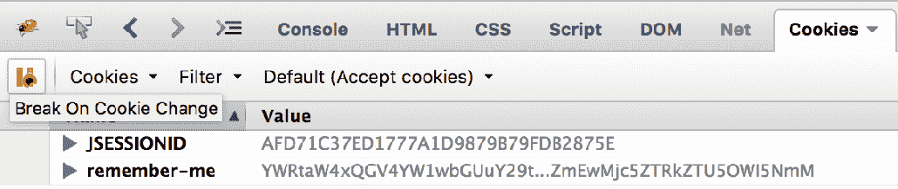
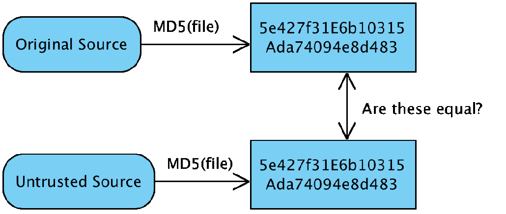
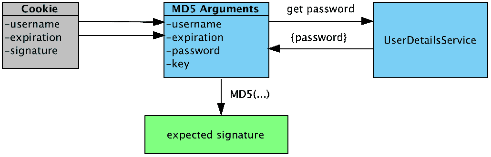
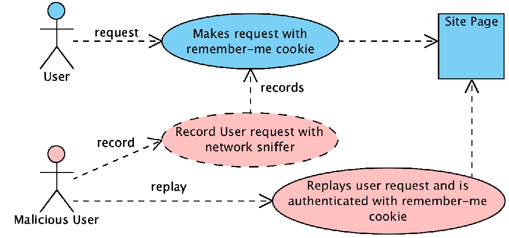
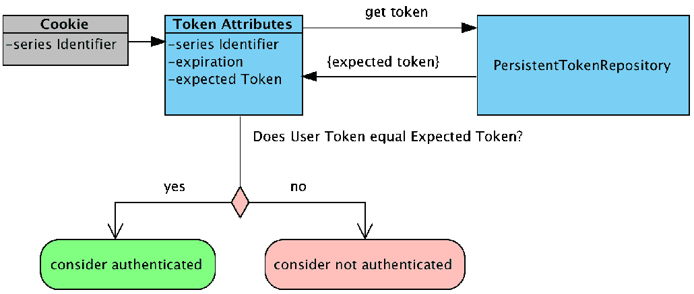
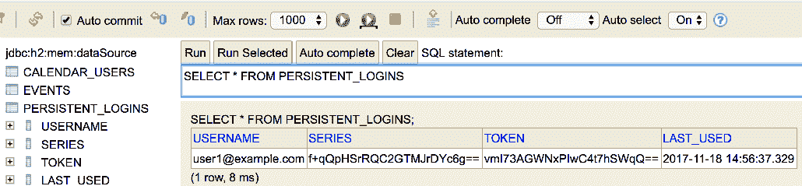
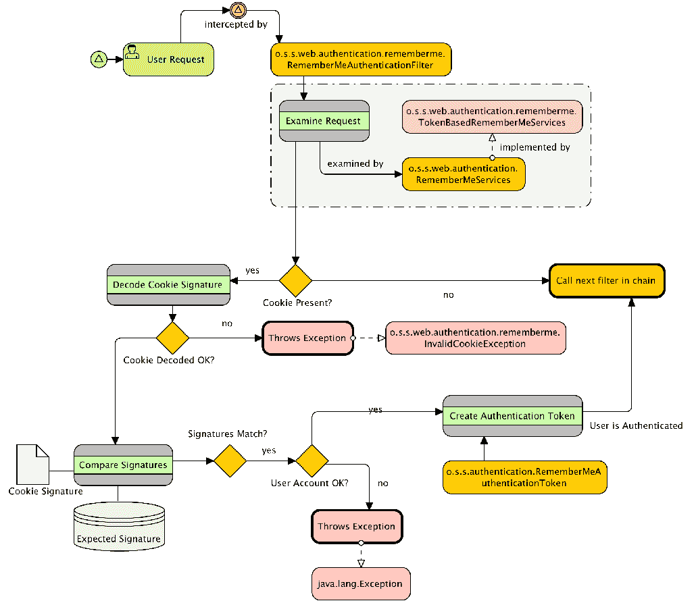

# 第七章：记住我服务

在本章中，我们将添加一个应用程序即使在会话过期且浏览器关闭后也能记住用户的功能。本章将涵盖以下主题：

+   讨论什么是记住我

+   学习如何使用基于**令牌的记住我**功能

+   讨论记住我有多安全，以及使其更安全的各种方法

+   启用基于持久性的记住我功能，以及使用它时要考虑的额外问题

+   介绍整体的记住我架构

+   学习如何创建一个限制在用户 IP 地址上的自定义记住我实现

# 什么是记住我？

为网站的常客提供的一个便利功能是记住我功能。此功能允许用户在浏览器关闭后选择被记住。在 Spring Security 中，这是通过在用户浏览器中存储一个记住我 cookie 来实现的。如果 Spring Security 识别到用户正在出示一个记住我 cookie，那么用户将自动登录应用程序，无需输入用户名或密码。

什么是 cookie？

Cookie 是客户端（即 Web 浏览器）保持状态的一种方式。有关 cookie 的更多信息，请参考其他在线资源，例如维基百科（[`en.wikipedia.org/wiki/HTTP_cookie`](http://en.wikipedia.org/wiki/HTTP_cookie)）。

Spring Security 在本章提供了以下两种不同的策略，我们将在此讨论：

+   第一个是基于令牌的记住我功能，它依赖于加密签名

+   第二个方法，基于**持久性的记住我**功能，需要一个数据存储（数据库）

如我们之前提到的，我们将在本章中详细讨论这些策略。为了启用记住我功能，必须显式配置记住我功能。让我们先尝试基于令牌的记住我功能，看看它如何影响登录体验的流程。

# 依赖项

基于令牌的记住我部分除了第第二章 *Spring Security 入门*中的基本设置外，不需要其他依赖项。然而，如果你正在使用基于持久性的记住我功能，你需要在你的`pom.xml`文件中包含以下额外的依赖项。我们已经在章节的示例中包含了这些依赖项，所以不需要更新示例应用程序：

```java
    //build.gradle

    dependencies {
    // JPA / ORM / Hibernate:
 compile('org.springframework.boot:spring-boot-starter-data-jpa')    // H2 RDBMS
 runtime('com.h2database:h2')       ...
    }
```

# 基于令牌的记住我功能

Spring Security 提供了记住我功能的两种不同实现。我们将首先探索如何设置基于令牌的记住我服务。

# 配置基于令牌的记住我功能

完成此练习将允许我们提供一种简单且安全的方法，使用户在较长时间内保持登录。开始时，请执行以下步骤：

1.  修改`SecurityConfig.java`配置文件，添加`rememberMe`方法。

请查看以下代码片段：

```java
        //src/main/java/com/packtpub/springsecurity/configuration/
        SecurityConfig.java

        @Override
        protected void configure(HttpSecurity http) throws Exception {
           ...
           http.rememberMe().key("jbcpCalendar")
           ...
        }
```

你应该从`chapter07.00-calendar`开始。

1.  如果我们现在尝试运行应用程序，我们会发现流程中没有不同。这是因为我们还需要在登录表单中添加一个字段，允许用户选择此功能。编辑`login.html`文件，并添加一个复选框，如下面的代码片段所示：

```java
        //src/main/resources/templates/login.html

        <input type="password" id="password" name="password"/>
 <label for="remember-me">Remember Me?</label> <input type="checkbox" id="remember-me" name="remember_me" value="true"/>
        <div class="form-actions">
           <input id="submit" class="btn" name="submit" type="submit" 
           value="Login"/>
        </div>
```

您的代码应该看起来像`chapter07.01-calendar`。

1.  当我们下次登录时，如果选择了记住我框，则在用户的浏览器中设置了记住我 cookie。

Spring Security 理解它应该通过检查 HTTP 参数`remember_me`来记住用户。

在 Spring Security 3.1 及更早版本中，记住我表单字段的默认参数是`spring_security_remember_me`。现在，在 Spring Security 4.x 中，默认的记住我表单字段是`remember-me`。这可以通过`rememberMeParameter`方法来覆盖。

1.  如果用户然后关闭他的浏览器，重新打开它以登录 JBCP 日历网站的认证页面，他/她不会第二次看到登录页面。现在试试自己-选择记住我选项登录，将主页添加到书签中，然后重新启动浏览器并访问主页。您会看到，您会立即成功登录，而无需再次提供登录凭据。如果这种情况出现在您身上，这意味着您的浏览器或浏览器插件正在恢复会话。

先尝试关闭标签页，然后再关闭浏览器。

另一个有效的方法是使用浏览器插件，如**Firebug**（[`addons.mozilla.org/en-US/firefox/addon/firebug/`](https://addons.mozilla.org/en-US/firefox/addon/firebug/)），以删除`JSESSIONID`cookie。这通常可以在开发和验证您网站上此类功能时节省时间和烦恼。

登录后选择记住我，你应该会看到已经设置了两个 cookie，`JSESSIONID`和`remember-me`，如下面的截图所示：



# 基于令牌的记住我功能是如何工作的

记住我功能在用户的浏览器中设置一个 cookie，包含一个 Base64 编码的字符串，包含以下内容：

+   用户名

+   过期日期/时间

+   `expiration`日期/时间的 MD5 散列值、`username`、`password`以及`rememberMe`方法的`key`属性。

这些被组合成一个单一的 cookie 值，存储在浏览器中供以后使用。

# MD5

MD5 是几种著名的加密散列算法之一。加密散列算法计算具有任意长度的输入数据的最紧凑且唯一的文本表示，称为**摘要**。这个摘要可以用来确定是否应该信任一个不可信的输入，通过将不可信输入的摘要与预期输入的有效摘要进行比较。

以下图表说明了它是如何工作的：



例如，许多开源软件网站允许镜像站点分发它们的软件，以帮助提高下载速度。然而，作为软件的用户，我们希望确保软件是真实的，并且不包含任何病毒。软件分发商将计算并在其网站上发布与他们已知的好版本软件对应的预期 MD5 校验和。然后，我们可以从任何位置下载文件。在安装软件之前，我们对下载的文件计算不信任的 MD5 校验和。然后，我们将不信任的 MD5 校验和与预期的 MD5 校验和进行比较。如果这两个值匹配，我们就知道可以安全地安装我们下载的文件。如果这两个值不匹配，我们不应该信任下载的文件并删除它。

尽管无法从哈希值中获取原始数据，但 MD5 算法存在多种攻击风险，包括利用算法本身的弱点以及彩虹表攻击。彩虹表通常包含数百万输入值预先计算的哈希值。这使得攻击者可以在彩虹表中查找哈希值，并确定实际的（未哈希）值。Spring Security 通过在哈希值中包括过期日期、用户的密码和记住我键来对抗这种风险。

# 记住我签名

我们可以看到 MD5 如何确保我们下载了正确的文件，但这与 Spring Security 的记住我服务有何关联呢？与下载的文件类似，cookie 是不信任的，但如果我们能验证来自我们应用程序的签名，我们就可以信任它。当带有记住我 cookie 的请求到来时，其内容被提取，期望的签名与 cookie 中找到的签名进行比较。计算期望签名的步骤在下图中说明：



记住我 cookie 包含**用户名**、**过期时间**和一个**签名**。Spring Security 将从中提取**用户名**和**过期时间**。然后使用来自 cookie 的`username`通过`UserDetailsService`查找**密码**。**密钥**已知，因为它是通过`rememberMe`方法提供的。现在所有参数都知道了，Spring Security 可以使用**用户名**、**过期时间**、**密码**和**密钥**计算期望的签名。然后，它将期望签名与 cookie 中的**签名**进行比较。

如果两个签名匹配，我们可以确信**用户名**和**过期日期**是有效的。不知道记住我密钥（只有应用程序知道）和用户密码（只有这个用户知道）的情况下伪造签名几乎是不可能的。这意味着如果签名匹配且令牌没有过期，用户可以登录。

您可能已经预见到，如果用户更改了他们的用户名或密码，设置的任何记住我令牌将不再有效。确保如果您允许用户更改账户这些部分，您要向用户提供适当的消息。在本章后面，我们将查看一个仅依赖于用户名而非密码的替代记住我实现。

请注意，仍然可以区分已通过记住我 cookie 进行身份验证的用户和提供用户名和密码（或等效）凭据的用户。当我们调查记住我功能的安全性时，我们将很快尝试这一点。

# 基于令牌的记住我配置指令

以下是对记住我功能默认行为进行更改的两个常见配置更改：

| **属性** | **描述** |
| --- | --- |
| `key` | 定义用于生成记住我 cookie 签名时使用的唯一键。 |
| `tokenValiditySeconds` | 定义时间长度（以秒为单位）。记住我 cookie 将被视为用于身份验证的有效 cookie。它还用于设置 cookie 的过期时间戳。 |

正如您可能从讨论 cookie 内容是如何散列中推断出`key`属性对记住我功能的安全性至关重要。确保您选择的键很可能是您应用程序唯一的，并且足够长，以至于它不能轻易被猜测。

考虑到本书的目的，我们保留了键值相对简单，但如果你在自己的应用程序中使用记住我，建议你的键包含应用程序的唯一名称，并且至少 36 个随机字符长。密码生成工具（在 Google 中搜索“在线密码生成器”）是获得假随机字母数字和特殊字符混合来组成你的记住我键的好方法。对于存在于多个环境中的应用程序（例如开发、测试和生产），记住我 cookie 值也应该包括这个事实。这将防止在测试过程中无意中使用错误的环境的记住我 cookie！

生产应用程序中的一个示例键值可能与以下内容相似：

```java
    prodJbcpCalendar-rmkey-paLLwApsifs24THosE62scabWow78PEaCh99Jus
```

`tokenValiditySeconds`方法用于设置记住我令牌在自动登录功能中不再被接受的时间秒数，即使它本身是一个有效的令牌。相同的属性也用于设置用户浏览器上记住我 cookie 的最大生命周期。

记住我会话 cookie 的配置

如果`tokenValiditySeconds`设置为`-1`，登录 cookie 将被设置为会话 cookie，用户关闭浏览器后它不会持续存在。令牌将在用户不关闭浏览器的情况下，有效期为两周的不可配置长度。不要将此与存储用户会话 ID 的 cookie 混淆——它们名称相似，但完全是两回事！

您可能注意到我们列出的属性非常少。别担心，我们将在本章中花时间介绍一些其他配置属性。

# 记住我是否安全？

任何为了用户方便而添加的安全相关特性都有可能使我们精心保护的网站面临安全风险。默认形式的记住我功能，存在用户 cookie 被拦截并恶意用户重复使用的风险。以下图表说明了这可能如何发生：



使用 SSL（在附录*附加参考资料*中有所涉及）和其他网络安全技术可以减轻这类攻击，但要注意还有其他技术，比如**跨站脚本攻击**（**XSS**），可能会窃取或破坏记住的用户会话。虽然这对用户方便，但如果我们不慎使用记住的会话，可能会导致财务或其他个人信息被无意修改或可能被盗用。

虽然本书没有详细讨论恶意用户行为，但在实现任何安全系统时，了解可能试图攻击您客户或员工的用户所采用的技术是很重要的。XSS 就是这样的技术，但还有很多其他技术。强烈建议您查阅*OWASP 前十名文章*（[`www.owasp.org/index.php/Category:OWASP_Top_Ten_Project`](http://www.owasp.org/index.php/Category:OWASP_Top_Ten_Project)）获取一个不错的列表，并且也可以获取一本关于网络应用安全性的参考书籍，在这本书中，许多演示的技术都适用于任何技术。

保持方便和安全之间平衡的一种常见方法是识别网站上可能存在个人或敏感信息的职能位置。然后，您可以使用`fullyAuthenticated`表达式确保这些位置通过检查用户角色以及他们是否使用完整用户名和密码进行身份验证的保护。我们将在下一节更详细地探讨这一特性。

# 记住我功能的授权规则

我们将在第十一章细粒度访问控制*中全面探讨高级授权技术*，不过，重要的是要意识到可以根据记住的认证会话与否来区分访问规则。

假设我们想要限制尝试访问 H2 `admin` 控制台的用户只能是使用用户名和密码认证的管理员。这与其他主要面向消费者的商业网站的行为类似，这些网站在输入密码之前限制对网站高级部分的访问。请记住，每个网站都是不同的，所以不要盲目地将此类规则应用于您的安全网站。对于我们的示例应用程序，我们将专注于保护 H2 数据库控制台。更新`SecurityConfig.java`文件以使用关键词`fullyAuthenticated`，确保尝试访问 H2 数据库的记住用户被拒绝访问。这显示在下面的代码片段中：

```java
    //src/main/java/com/packtpub/springsecurity/configuration/SecurityConfig.java

    @Override
    protected void configure(HttpSecurity http) throws Exception {
       ...
       http.authorizeRequests()
 .antMatchers("/admin/*") .access("hasRole(ADMIN) and isFullyAuthenticated()")       ...
       http.rememberMe().key("jbcpCalendar")
    }
```

现有的规则保持不变。我们增加了一条规则，要求查询账户信息时必须拥有适当的`GrantedAuthority` of `ROLE_ADMIN`，并且用户已经完全认证；也就是说，在这个认证会话期间，他们实际上提供了一个用户名和密码或其他合适的凭据。注意这里 SpEL 逻辑运算符的语法-`AND`，`OR`和`NOT`用于 SpEL 中的逻辑运算符。SpEL 设计者考虑得很周到，因为`&&`运算符在 XML 中表示起来会很不方便，尽管前面的例子是使用基于 Java 的配置！

你的代码应该看起来像`chapter07.02-calendar`。

登录使用用户名`admin1@example.com`和密码`admin1`，确保选择记住我功能。访问 H2 数据库控制台，你会看到访问被授权。现在，删除`JSESSIONID` cookie（或者关闭标签页，然后关闭所有浏览器实例），确保仍然可以访问所有事件页面。现在，导航到 H2 控制台，观察访问被拒绝。

这种方法结合了记住我功能的易用性增强和通过要求用户提供完整的凭据来访问敏感信息的安全性。在本章的其余部分，我们将探讨其他使记住我功能更加安全的方法。

# 持久的记住我

Spring Security 提供了通过利用`RememberMeServices`接口的不同实现来更改验证记住我 cookie 的方法的能力。在本节中，我们将讨论如何使用数据库来持久记住我令牌，以及这如何提高我们应用程序的安全性。

# 使用基于持久性的记住我功能

在此点修改我们的记住我配置以持久化到数据库是出奇地简单。Spring Security 配置解析器将识别`rememberMe`方法上的新`tokenRepository`方法，只需切换实现类即可`RememberMeServices`。现在让我们回顾一下完成此操作所需的步骤。

# 添加 SQL 创建记住我模式

我们将包含预期模式的 SQL 文件放在了`resources`文件夹中，位置与第三章 *自定义认证*中的位置相同。您可以在下面的代码片段中查看模式定义：

```java
    //src/main/resources/schema.sql

    ...
    create table persistent_logins (
       username varchar_ignorecase(100) not null,
       series varchar(64) primary key,
       token varchar(64) not null,
       last_used timestamp not null
    );
    ...
```

# 使用记住我模式初始化数据源

Spring Data 将自动使用`schema.sql`初始化嵌入式数据库，如前一部分所述。请注意，但是，对于 JPA，为了创建模式并使用`data.sql`文件来种子数据库，我们必须确保设置了`ddl-auto`到 none，如下面的代码所示：

```java
    //src/main/resources/application.yml

    spring:
    jpa:
       database-platform: org.hibernate.dialect.H2Dialect
       hibernate:
 ddl-auto: none
```

# 配置基于持久化的记住我功能

最后，我们需要对`rememberMe`声明进行一些简要的配置更改，以指向我们正在使用的数据源，如下面的代码片段所示：

```java
   //src/main/java/com/packtpub/springsecurity/configuration/SecurityConfig.java

   @Autowired
   @SuppressWarnings("SpringJavaAutowiringInspection")
 private DataSource dataSource;    @Autowired
 private PersistentTokenRepository persistentTokenRepository;    @Override
    protected void configure(HttpSecurity http) throws Exception {
       ...
       http.rememberMe()
           .key("jbcpCalendar")
 .tokenRepository(persistentTokenRepository)       ...
    }
 @Bean public PersistentTokenRepository persistentTokenRepository() { JdbcTokenRepositoryImpl db = new JdbcTokenRepositoryImpl(); db.setDataSource(dataSource); return db; }
```

这就是我们需要做的，以便切换到基于持久化的记住我认证。大胆地启动应用程序并尝试一下。从用户的角度来看，我们感觉不到任何区别，但我们知道支持这个功能的实现已经发生了变化。

您的代码应该看起来像`chapter07.03-calendar`。

# 持久化基于的记住我功能是如何工作的？

持久化基于的记住我服务不是验证 cookie 中的签名，而是验证令牌是否存在于数据库中。每个持久记住我 cookie 包括以下内容：

+   **序列标识符**：这标识了用户的初始登录，并且每次用户自动登录到原始会话时都保持一致。

+   **令牌值**：每次用户使用记住我功能进行身份验证时都会变化的唯一值。

请查看以下图表：



当记住我 cookie 提交时，Spring Security 将使用`o.s.s.web.authentication.rememberme.PersistentTokenRepository`实现来查找期望的令牌值和使用提交序列标识的过期时间。然后，它将比较 cookie 中的令牌值与期望的令牌值。如果令牌没有过期且两个令牌匹配，用户被认为是认证的。将生成一个新的记住我 cookie，具有相同的序列标识符、新的令牌值和更新的过期日期。

如果在数据库中找到了提交的序列令牌，但令牌不匹配，可以假设有人偷了记住我 cookie。在这种情况下，Spring Security 将终止这些记住我令牌，并警告用户他们的登录已经被泄露。

存储的令牌可以在数据库中找到，并通过 H2 控制台查看，如下面的屏幕截图所示：



# JPA 基础持久化令牌存储库

正如我们之前章节所看到的，使用 Spring Data 项目来映射我们的数据库可以大大简化我们的工作。因此，为了保持一致性，我们将重构我们的基于 JDBC 的`PersistentTokenRepository`接口，该接口使用`JdbcTokenRepositoryImpl`，改为基于 JPA 的。我们将通过执行以下步骤来实现：

1.  首先，让我们创建一个领域对象来保存持久登录，如下面的代码片段所示：

```java
        //src/main/java/com/packtpub/springsecurity/domain/
        PersistentLogin.java 

        import org.springframework.security.web.authentication.rememberme.
        PersistentRememberMeToken;
        import javax.persistence.*;
        import java.io.Serializable;
        import java.util.Date;
        @Entity
        @Table(name = "persistent_logins")
        public class PersistentLogin implements Serializable {
           @Id
           private String series;
           private String username;
           private String token;
           private Date lastUsed;
           public PersistentLogin(){}
           public PersistentLogin(PersistentRememberMeToken token){
               this.series = token.getSeries();
               this.username = token.getUsername();
               this.token = token.getTokenValue();
               this.lastUsed = token.getDate();
           }
          ...
```

1.  接下来，我们需要创建一个`o.s.d.jpa.repository.JpaRepository`仓库实例，如下面的代码片段所示：

```java
        //src/main/java/com/packtpub/springsecurity/repository/
        RememberMeTokenRepository.java

        import com.packtpub.springsecurity.domain.PersistentLogin;
        import org.springframework.data.jpa.repository.JpaRepository;
        import java.util.List;
        public interface RememberMeTokenRepository extends  
        JpaRepository<PersistentLogin, String> {
            PersistentLogin findBySeries(String series);
            List<PersistentLogin> findByUsername(String username);
        }
```

1.  现在，我们需要创建一个自定义的`PersistentTokenRepository`接口来替换`Jdbc`实现。我们必须重写四个方法，但代码应该相当熟悉，因为我们所有操作都将使用 JPA：

```java
         //src/main/java/com/packtpub/springsecurity/web/authentication/
         rememberme/JpaPersistentTokenRepository.java:

         ...
         public class JpaPersistentTokenRepository implements 
         PersistentTokenRepository {
               private RememberMeTokenRepository rememberMeTokenRepository;
               public JpaPersistentTokenRepository
               (RememberMeTokenRepository rmtr) {
                  this.rememberMeTokenRepository = rmtr;
           }
           @Override
           public void createNewToken(PersistentRememberMeToken token) {
               PersistentLogin newToken = new PersistentLogin(token);
               this.rememberMeTokenRepository.save(newToken);
           }
          @Override
          public void updateToken(String series, String tokenValue, 
          Date lastUsed) {
               PersistentLogin token = this.rememberMeTokenRepository
               .findBySeries(series);
               if (token != null) {
                   token.setToken(tokenValue);
                   token.setLastUsed(lastUsed);
                   this.rememberMeTokenRepository.save(token);
               }
           }
        @Override
           public PersistentRememberMeToken 
           getTokenForSeries(String seriesId) {
               PersistentLogin token = this.rememberMeTokenRepository
               .findBySeries(seriesId);
               return new PersistentRememberMeToken(token.getUsername(),
               token.getSeries(), token.getToken(), token.getLastUsed());
           }
           @Override
         public void removeUserTokens(String username) {
             List<PersistentLogin> tokens = this.rememberMeTokenRepository
             .findByUsername(username);
              this.rememberMeTokenRepository.delete(tokens);
           }
        }
```

1.  现在，我们需要在`SecurityConfig.java`文件中做些修改，以声明新的`PersistentTokenTokenRepository`接口，但其余的配置与上一节保持不变，如下面的代码片段所示：

```java
            //src/main/java/com/packtpub/springsecurity/configuration/
            SecurityConfig.java

            //@Autowired
            //@SuppressWarnings("SpringJavaAutowiringInspection")
            //private DataSource dataSource;
            @Autowired
 private PersistentTokenRepository persistentTokenRepository;            ...
 @Bean public PersistentTokenRepository persistentTokenRepository( RememberMeTokenRepository rmtr) { return new JpaPersistentTokenRepository(rmtr); }
```

1.  这就是我们将 JDBC 更改为基于 JPA 的持久化记住我认证所需要做的一切。现在启动应用程序并尝试一下。从用户的角度来看，我们并没有注意到任何区别，但我们知道支持这一功能的实现已经发生了变化。

你的代码应该看起来像`chapter07.04-calendar`。

# 自定义 RememberMeServices

到目前为止，我们使用了一个相当简单的`PersistentTokenRepository`实现。我们使用了基于 JDBC 和基于 JPA 的实现。这为 cookie 持久化提供了有限的控制；如果我们想要更多控制，我们将把我们自己的`PersistentTokenRepository`接口包装在`RememberMeServices`中。Barry Jaspan 有一篇关于*改进持久登录 Cookie 最佳实践*的优秀文章（[`jaspan.com/improved_persistent_login_cookie_best_practice`](http://jaspan.com/improved_persistent_login_cookie_best_practice)）。Spring Security 有一个略有修改的版本，如前所述，称为`PersistentTokenBasedRememberMeServices`，我们可以将其包装在我们的自定义`PersistentTokenRepository`接口中，并在我们的记住我服务中使用。

在下一节中，我们将把我们的现有`PersistentTokenRepository`接口包装在`PersistentTokenBasedRememberMeServices`中，并使用`rememberMeServices`方法将其连接到我们的记住我声明：

```java
    //src/main/java/com/packtpub/springsecurity/configuration/SecurityConfig.java

    //@Autowired
    //private PersistentTokenRepository persistentTokenRepository;
    @Autowired
    private RememberMeServices rememberMeServices;
    @Override
    protected void configure(HttpSecurity http) throws Exception {
       ...
       http.rememberMe()
           .key("jbcpCalendar")
 .rememberMeServices(rememberMeServices)       ...
    }
 @Bean public RememberMeServices rememberMeServices
    (PersistentTokenRepository ptr){ PersistentTokenBasedRememberMeServices rememberMeServices = new 
       PersistentTokenBasedRememberMeServices("jbcpCalendar", 
userDetailsService, ptr);
 rememberMeServices.setAlwaysRemember(true); return rememberMeServices; }
```

你的代码应该看起来像`chapter07.05-calendar`。

基于数据库的持久令牌是否更安全？

就像`TokenBasedRememberMeServices`一样，持久化令牌可能会因 cookie 窃取或其他中间人技术而受到威胁。正如附录中提到的，使用 SSL 可以绕过中间人技术。如果你正在使用 Servlet 3.0 环境（即 Tomcat 7+），Spring Security 会将 cookie 标记为`HttpOnly`，这将有助于减轻在应用程序中出现 XSS 漏洞时 cookie 被窃取的风险。要了解更多关于`HttpOnly`属性的信息，请参阅本章前面提供的关于 cookie 的外部资源。

使用基于持久化的记住我功能的一个优点是我们可以检测 cookie 是否被泄露。如果正确的一系列令牌和一个不正确的令牌被呈现，我们知道使用该系列令牌的任何记住我功能都应被视为被泄露，我们应该终止与它关联的任何会话。由于验证是状态 ful 的，我们还可以在不更改用户密码的情况下终止特定的记住我功能。

# 清理过期的记住我会话

使用基于持久化的记住我功能的缺点是，没有内置的支持来清理过期的会话。为了做到这一点，我们需要实现一个后台进程来清理过期的会话。我们在本章的示例代码中包含了用于执行清理的代码。

为了简洁起见，我们显示一个不执行验证或错误处理的版本，如下面的代码片段所示。你可以在本章的示例代码中查看完整版本：

```java
    //src/main/java/com/packtpub/springsecurity/web/authentication/rememberme/
    JpaTokenRepositoryCleaner.java

    public class JpaTokenRepositoryImplCleaner
    implements Runnable {
       private final RememberMeTokenRepository repository;
       private final long tokenValidityInMs;
       public JpaTokenRepositoryImplCleaner(RememberMeTokenRepository 
       repository, long tokenValidityInMs) {
           if (rememberMeTokenRepository == null) {
               throw new IllegalArgumentException("jdbcOperations cannot 
               be null");
           }
           if (tokenValidityInMs < 1) {
               throw new IllegalArgumentException("tokenValidityInMs 
               must be greater than 0\. Got " + tokenValidityInMs);
           }
           this. repository = repository;
           this.tokenValidityInMs = tokenValidityInMs;
       }
           public void run() {
           long expiredInMs = System.currentTimeMillis() 
           - tokenValidityInMs;             
              try {
               Iterable<PersistentLogin> expired = 
               rememberMeTokenRepository
               .findByLastUsedAfter(new Date(expiredInMs));
               for(PersistentLogin pl: expired){
                   rememberMeTokenRepository.delete(pl);
               }
           } catch(Throwable t) {...}
       }
    }
```

本章的示例代码还包括一个简单的 Spring 配置，每十分钟执行一次清理器。如果你不熟悉 Spring 的任务抽象并且想学习，那么你可能想阅读更多关于它在 Spring 参考文档中的内容：[`docs.spring.io/spring/docs/current/spring-framework-reference/html/scheduling.html`](https://docs.spring.io/spring/docs/current/spring-framework-reference/html/scheduling.html)。你可以在以下代码片段中找到相关的配置。为了清晰起见，我们将这个调度器放在`JavaConfig.java`文件中：

```java
    //src/main/java/com/packtpub/springsecurity/configuration/
    JavaConfig.java@Configuration

    @Import({SecurityConfig.class})
 @EnableScheduling    public class JavaConfig {
 @Autowired private RememberMeTokenRepository rememberMeTokenRepository; @Scheduled(fixedRate = 10_000) public void tokenRepositoryCleaner(){ Thread trct = new Thread(new JpaTokenRepositoryCleaner(
 rememberMeTokenRepository, 60_000L));
 trct.start(); }    }
```

请记住，此配置不是集群友好的。因此，如果部署到集群，清理器将针对应用程序部署到的每个 JVM 执行一次。

启动应用程序并尝试更新。提供的配置将确保每十分钟执行一次清理器。你可能想让清理任务更频繁地运行，通过修改`@Scheduled`声明来清理最近使用的记住我令牌。然后，你可以创建几个记住我令牌，并通过在 H2 数据库控制台查询它们来查看它们是否被删除。

你的代码应该看起来像`chapter07.06-calendar`。

# 记住我架构

我们已经介绍了`TokenBasedRememberMeServices`和`PersistentTokenBasedRememberMeServices`的基本架构，但我们还没有描述总体架构。让我们看看所有 remember-me 部件是如何组合在一起的。

以下图表说明了验证基于令牌的 remember-me 令牌过程中涉及的不同组件：



与 Spring Security 的任何一个过滤器一样，`RememberMeAuthenticationFilter`是从`FilterChainProxy`内部调用的。`RememberMeAuthenticationFilter`的工作是检查请求，如果它感兴趣，就采取行动。`RememberMeAuthenticationFilter`接口将使用`RememberMeServices`实现来确定用户是否已经登录。`RememberMeServices`接口通过检查 HTTP 请求中的 remember-me cookie，然后使用我们之前讨论过的基于令牌的验证或基于持久性的验证来验证。如果令牌检查无误，用户将登录。

# Remember-me 与用户生命周期

`RememberMeServices`的实现在整个用户生命周期中（认证用户的会话生命周期）的几个点被调用。为了帮助您理解 remember-me 功能，了解 remember-me 服务在生命周期功能通知的时间点可能会有所帮助：

| **操作** | **应该发生什么？** | **调用的 RememberMeServices 方法** |
| --- | --- | --- |
| 登录成功 | 实现设置 remember-me cookie（如果已发送`form`参数） | `loginSuccess` |
| 登录失败 | 如果存在，实现应取消 cookie | `loginFailed` |
| 用户登出 | 如果存在，实现应取消 cookie | `logout` |

`RememberMeServices`接口上没有`logout`方法。相反，每个`RememberMeServices`实现也实现了`LogoutHandler`接口，该接口包含了`logout`方法。通过实现`LogoutHandler`接口，每个`RememberMeServices`实现可以在用户登出时执行必要的清理工作。

了解`RememberMeServices`在哪里以及如何与用户的生命周期相关联，在我们开始创建自定义认证处理程序时将非常重要，因为我们需要确保任何认证处理器一致地对待`RememberMeServices`，以保持这种功能的有效性和安全性。

# 限制 remember-me 功能到 IP 地址

让我们把我们对记住我架构的理解付诸实践。一个常见的要求是，任何记住我令牌都应与创建它的用户的 IP 地址绑定。这为记住我功能增加了额外的安全性。为此，我们只需要实现一个自定义的`PersistentTokenRepository`接口。我们将要做的配置更改将说明如何配置自定义的`RememberMeServices`。在本节中，我们将查看`IpAwarePersistentTokenRepository`，该类包含在章节源代码中。`IpAwarePersistentTokenRepository`接口确保内部将系列标识与当前用户的 IP 地址结合，而外部仅包含标识。这意味着无论何时查找或保存令牌，都会使用当前 IP 地址来查找或持久化令牌。在以下代码片段中，你可以看到`IpAwarePersistentTokenRepository`是如何工作的。如果你想要更深入地了解，我们鼓励你查看随章节提供的源代码。

查找 IP 地址的技巧是使用 Spring Security 的`RequestContextHolder`。相关代码如下：

需要注意的是，为了使用`RequestContextHolder`，你需要确保你已经设置了你的`web.xml`文件以使用`RequestContextListener`。我们已经为我们的示例代码完成了这个设置。然而，这在使用示例代码的外部应用程序中可能很有用。参考`IpAwarePersistentTokenRepository`的 Javadoc，了解如何进行此设置的详细信息。

请查看以下代码片段：

```java
    //src/main/java/com/packtpub/springsecurity/web/authentication/rememberme/
    IpAwarePersistentTokenRepository.java

    private String ipSeries(String series) {
    ServletRequestAttributes attributes = (ServletRequestAttributes)
    RequestContextHolder.getRequestAttributes();
    return series + attributes.getRequest().getRemoteAddr();
    }
```

我们可以在此基础上构建方法，强制保存的令牌中包含在系列标识中的 IP 地址，如下所示：

```java
    public void createNewToken(PersistentRememberMeToken token) {
      String ipSeries = ipSeries(token.getSeries());
      PersistentRememberMeToken ipToken = tokenWithSeries(token, ipSeries);
      this.delegateRepository.createNewToken(ipToken);
    }
```

你可以看到我们首先创建了一个新的系列，并将其与 IP 地址连接起来。`tokenWithSeries`方法只是一个创建具有所有相同值的新令牌的助手，除了新的系列。然后我们将包含 IP 地址的新系列标识的新令牌提交给`delegateRepsository`，这是`PersistentTokenRepository`的原始实现。

无论何时查找令牌，我们都要求将当前用户的 IP 地址附加到系列标识上。这意味着用户无法获取不同 IP 地址的用户的令牌：

```java
    public PersistentRememberMeToken getTokenForSeries(String seriesId) {
       String ipSeries = ipSeries(seriesId);
       PersistentRememberMeToken ipToken = delegateRepository.
       getTokenForSeries(ipSeries);
       return tokenWithSeries(ipToken, seriesId);
    }
```

剩余的代码非常相似。内部我们构建的系列标识将附加到 IP 地址上，外部我们只展示原始系列标识。通过这样做，我们实施了这样的约束：只有创建了记住我令牌的用户才能使用它。

让我们回顾一下本章示例代码中包含的 Spring 配置，用于`IpAwarePersistentTokenRepository`。在以下代码片段中，我们首先创建了一个`IpAwarePersistentTokenRepository`声明，它包装了一个新的`JpaPersistentTokenRepository`声明。然后通过实例化`OrderedRequestContextFilter`接口来初始化一个`RequestContextFilter`类：

```java
    //src/main/java/com/packtpub/springsecurity/web/configuration/WebMvcConfig.java

    @Bean
    public IpAwarePersistentTokenRepository 
    tokenRepository(RememberMeTokenRepository rmtr) {
       return new IpAwarePersistentTokenRepository(
               new JpaPersistentTokenRepository(rmtr)
       );
    }
    @Bean
    public OrderedRequestContextFilter requestContextFilter() {
       return new OrderedRequestContextFilter();
    }
```

为了让 Spring Security 使用我们的自定义`RememberMeServices`，我们需要更新我们的安全配置以指向它。接着，在`SecurityConfig.java`中进行以下更新：

```java
    //src/main/java/com/packtpub/springsecurity/configuration/SecurityConfig.java

     @Override
     protected void configure(HttpSecurity http) throws Exception {
       ...
       // remember me configuration
      http.rememberMe()
           .key("jbcpCalendar")
 .rememberMeServices(rememberMeServices);     }
    @Bean
 public RememberMeServices rememberMeServices
    (PersistentTokenRepository ptr){
       PersistentTokenBasedRememberMeServices rememberMeServices = new 
       PersistentTokenBasedRememberMeServices("jbcpCalendar", 
       userDetailsService, ptr);
       return rememberMeServices;
    }
```

现在，大胆尝试启动应用程序。您可以使用第二台计算机和插件（如 Firebug），来操作您的 remember-me cookie。如果您尝试从一个计算机使用 remember-me cookie 在另一台计算机上，Spring Security 现在将忽略 remember-me 请求并删除相关 cookie。

您的代码应类似于`chapter07.07-calendar`。

请注意，基于 IP 的 remember-me 令牌如果用户位于共享或负载均衡的网络基础架构后面，例如多 WAN 企业环境，可能会出现意外行为。然而，在大多数场景下，向 remember-me 功能添加 IP 地址为用户提供了一个额外的、受欢迎的安全层。

# 自定义 cookie 和 HTTP 参数名称

好奇的用户可能会想知道 remember-me 表单字段的预期值是否可以更改为 remember-me，或者 cookie 名称是否可以更改为 remember-me，以使 Spring Security 的使用变得模糊。这个更改可以在两个位置中的一个进行。请按照以下步骤查看：

1.  首先，我们可以在`rememberMe`方法中添加额外的方法，如下所示：

```java
        //src/main/java/com/packtpub/springsecurity/configuration/
        SecurityConfig.java

        http.rememberMe()
               .key("jbcpCalendar")
 .rememberMeParameter("jbcpCalendar-remember-me") .rememberMeCookieName("jbcpCalendar-remember-me");
```

1.  此外，既然我们已经将自定义的`RememberMeServices`实现声明为 Spring bean，我们只需定义更多的属性来更改复选框和 cookie 名称，如下所示：

```java
        //src/main/java/com/packtpub/springsecurity/configuration/
        SecurityConfig.java

        @Bean
        public RememberMeServices rememberMeServices
        (PersistentTokenRepository ptr){
           PersistentTokenBasedRememberMeServices rememberMeServices = new 
           PersistentTokenBasedRememberMeServices("jbcpCalendar", 
           userDetailsService, ptr);
 rememberMeServices.setParameter("obscure-remember-me"); rememberMeServices.setCookieName("obscure-remember-me");           return rememberMeServices;
        }
```

1.  不要忘记将`login.html`页面更改为设置复选框`form`字段的名称，并与我们声明的参数值相匹配。接着，按照以下内容更新`login.html`：

```java
        //src/main/resources/templates/login.html

        <input type="checkbox" id="remember" name=" obscure-remember-me" 
        value="true"/>
```

1.  我们鼓励您在此处进行实验，以确保您了解这些设置之间的关系。大胆尝试启动应用程序并尝试一下。

您的代码应类似于`chapter07.08-calendar`。

# 总结

本章解释并演示了 Spring Security 中 remember-me 功能的用法。我们从最基本的设置开始，学习了如何逐步使该功能更加安全。具体来说，我们了解了基于令牌的 remember-me 服务以及如何对其进行配置。我们还探讨了基于持久性的 remember-me 服务如何提供额外的安全功能，它是如何工作的，以及在使用它们时需要考虑的额外因素。

我们还介绍了创建自定义 remember-me 实现的过程，该实现将 remember-me 令牌限制为特定的 IP 地址。我们还看到了使 remember-me 功能更加安全的各种其他方法。

接下来是基于证书的认证，我们将讨论如何使用受信任的客户端证书来进行认证。
