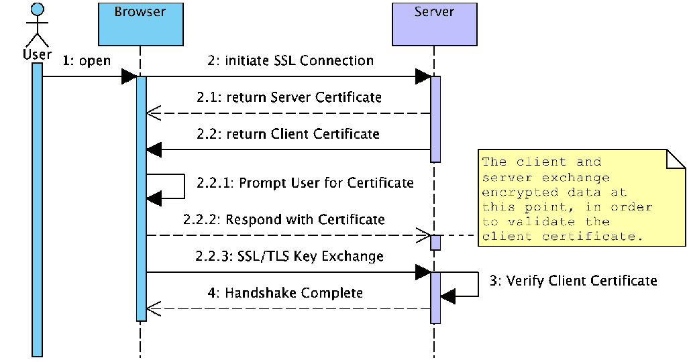
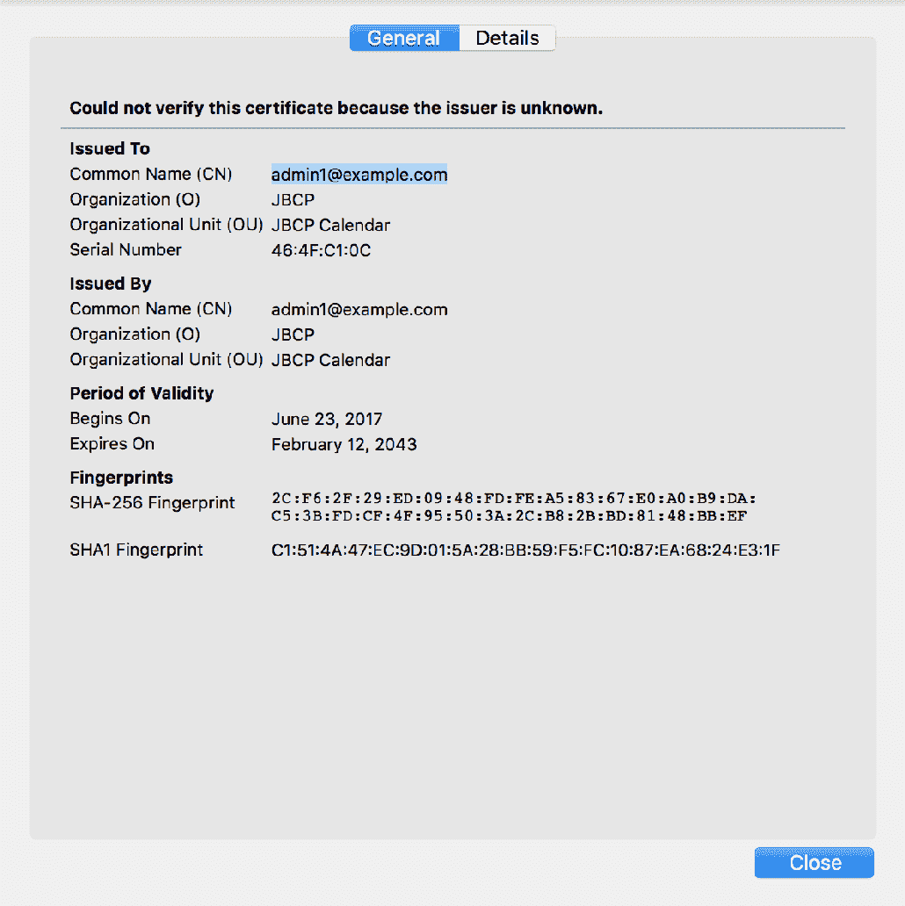
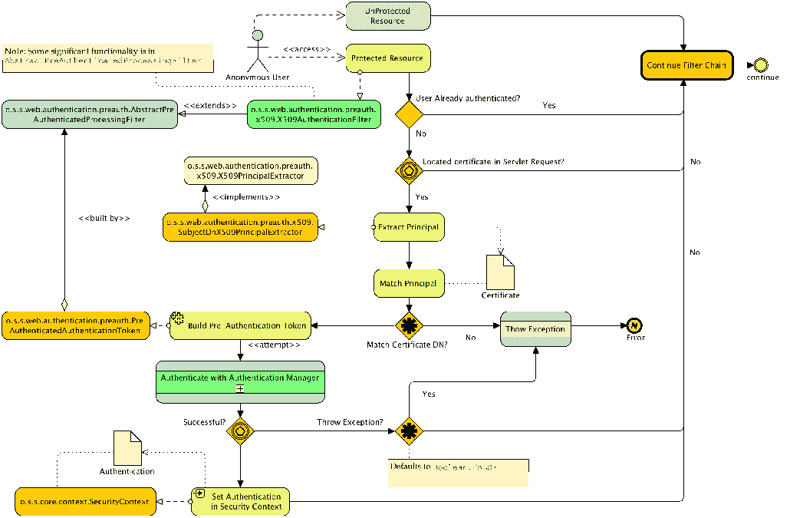
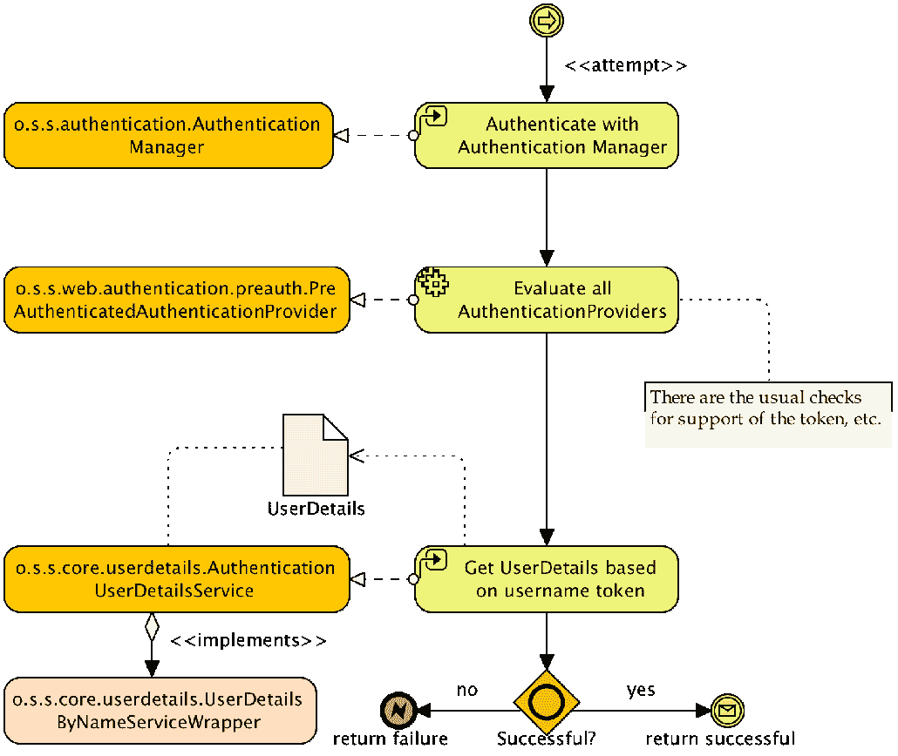
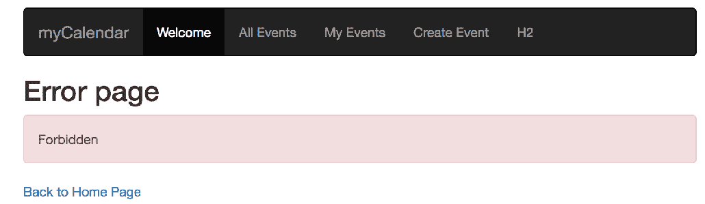

# 第八章：使用 TLS 的客户端证书认证

尽管用户名和密码认证极其普遍，正如我们在第一章《不安全应用程序的剖析》和第二章《Spring Security 入门》中讨论的，存在允许用户呈现不同类型凭证的认证形式。Spring Security 也迎合了这些要求。在本章中，我们将超越基于表单的认证，探索使用可信客户端证书的认证。

在本章的进程中，我们将涵盖以下主题：

+   学习客户端证书认证是如何在用户的浏览器和符合要求的服器之间进行协商的。

+   配置 Spring Security 以使用客户端证书认证用户

+   了解 Spring Security 中客户端证书认证的架构

+   探索与客户端证书认证相关的高级配置选项

+   回顾客户端证书认证的优点、缺点和常见故障排除步骤

# 客户端证书认证是如何工作的？

客户端证书认证需要服务器请求信息以及浏览器响应，以协商客户端（即用户的浏览器）与服务器应用程序之间的可信认证关系。这种信任关系是通过使用可信和可验证凭据的交换建立起来的，这些凭据被称为**证书**。

与我们迄今为止所看到的大部分内容不同，在客户端证书认证中，Servlet 容器或应用服务器本身通常负责通过请求证书、评估它并接受它作为有效认证来协商浏览器与服务器之间的信任关系。

客户端证书认证也被称为**相互认证**，是**安全套接层**（**SSL**）协议及其继承者**传输层安全**（**TLS**）协议的一部分。由于相互认证是 SSL 和 TLS 协议的一部分，因此需要一个 HTTPS 连接（使用 SSL 或 TLS 加密）才能使用客户端证书认证。有关 Spring Security 中 SSL/TLS 支持的详细信息，请参阅我们在附录*附加参考资料*中的讨论和 SSL/TLS 的实现。在 Tomcat（或您一直用来跟随示例的应用服务器）中设置 SSL/TLS 是实现客户端证书认证的必要条件。与附录*附加参考资料*中的内容一样，在本章剩余部分我们将 SSL/TLS 简称为 SSL。

下面的序列图说明了客户端浏览器与 Web 服务器协商 SSL 连接并验证用于相互认证的客户端证书的信任时的交互：



我们可以看到，两个证书（服务器和客户端证书）的交换为双方提供了认证，证明双方是已知的并且可以被信任继续安全地对话。为了清晰起见，我们省略了 SSL 握手的一些细节和证书本身的检查；然而，我们鼓励你进一步阅读有关 SSL 和 TLS 协议以及证书的一般内容，因为这些主题有很多很好的参考指南。关于客户端证书展示，可以阅读*RFC 5246*，*传输层安全（TLS）协议版本 1.2*（[`tools.ietf.org/html/rfc5246`](http://tools.ietf.org/html/rfc5246)），如果你想要了解更多细节，*SL 和 TLS：设计和管理安全系统，Eric Rescorla，Addison-Wesley*（[`www.amazon.com/SSL-TLS-Designing-Building-Systems/dp/0201615983`](https://www.amazon.com/SSL-TLS-Designing-Building-Systems/dp/0201615983)）对协议及其实现有非常详细的回顾。

客户端证书认证的另一个名称是 X.509 认证。术语 X.509 来源于 ITU-T 组织最初发布的 X.509 标准，用于基于 X.500 标准的目录（你可能还记得第六章，*LDAP 目录服务*中提到的 LDAP 的起源）。后来，这个标准被修改用于保护互联网通信。

我们在这里提到这一点是因为 Spring Security 中与这个问题相关的许多类都提到了 X.509。记住 X.509 本身并没有定义相互认证协议，而是定义了证书的格式和结构以及包括受信任的证书颁发机构在内的内容。

# 设置客户端证书认证基础架构

遗憾的是，对于你这样的个人开发者来说，能够实验性地使用客户端证书认证需要一些复杂的配置和设置，这在前期的集成中相对容易与 Spring Security 结合。由于这些设置步骤经常给第一次开发者带来很多问题，所以我们觉得带你走过这些步骤是很重要的。

我们假设你正在使用一个本地的、自签名的服务器证书、自签名的客户端证书和 Apache Tomcat。这符合大多数开发环境；然而，你可能有访问有效的服务器证书、证书颁发机构（CA）或其他应用服务器的权限。如果是这种情况，你可以将这些设置说明作为指导，并类似地配置你的环境。请参考附录中的 SSL 设置说明，*附加参考材料*，以获得在独立环境中配置 Tomcat 和 Spring Security 以使用 SSL 的帮助。

# 理解公钥基础设施的目的

本章主要关注于设置一个自包含的开发环境，用于学习和教育目的。然而，在大多数情况下，当你将 Spring Security 集成到现有的基于客户端证书的安全环境中时，将会有大量的基础设施（通常是硬件和软件的组合）已经到位，以提供诸如证书发放和管理、用户自我服务以及吊销等功能。这种类型的环境定义了一个公钥基础设施——硬件、软件和安全策略的组合，结果是一个高度安全的以认证为驱动的网络生态系统。

除了用于 Web 应用程序认证之外，这些环境中的证书或硬件设备还可以用于安全的、不可撤回的电子邮件（使用 S/MIME）、网络认证，甚至物理建筑访问（使用基于 PKCS 11 的硬件设备）。

尽管这种环境的运维开销可能很高（并且需要 IT 和流程卓越才能实施良好），但可以说这是技术专业人员可能使用的最安全的运行环境之一。

# 创建客户端证书密钥对

自签名客户端证书的创建方式与自签名服务器证书的创建方式相同——通过使用`keytool`命令生成密钥对。客户端证书密钥对的区别在于，它需要密钥库对浏览器可用，并需要将客户端的公钥加载到服务器的信任库中（我们稍后会解释这是什么）。

如果你现在不想生成自己的密钥，你可以跳到下一节，并使用示例章节中的`./src/main/resources/keys`文件夹中的示例证书。否则，按照如下方式创建客户端密钥对：

```java
keytool -genkeypair -alias jbcpclient -keyalg RSA -validity 365 -keystore jbcp_clientauth.p12 -storetype PKCS12
```

你可以在 Oracle 的网站上找到关于`keytool`的额外信息，以及所有的配置选项，链接在这里 [`docs.oracle.com/javase/8/docs/technotes/tools/unix/keytool.html/keytool.html`](http://docs.oracle.com/javase/8/docs/technotes/tools/unix/keytool.html/keytool.html)。

`keytool`的大部分参数对于这个用例来说是相当任意的。然而，当提示设置客户端证书的第一个和最后一个名字（所有者的 DN 的部分，即 common name）时，请确保第一个提示的答案与我们在 Spring Security JDBC 存储中设置的用户相匹配。例如，`admin1@example.com`是一个合适的值，因为我们已经在 Spring Security 中设置了`admin1@example.com`用户。命令行交互的示例如下：

```java
What is your first and last name?
[Unknown]: admin1@example.com
... etc
Is CN=admin1@example.com, OU=JBCP Calendar, O=JBCP, L=Park City, ST=UT, C=US correct?
[no]: yes
```

我们将看到为什么这是重要的，当我们配置 Spring Security 以从证书认证的用户那里获取信息。在我们可以在 Tomcat 中设置证书认证之前，还有最后一个步骤，将在下一节中解释。

# 配置 Tomcat 信任库

回想一下，密钥对定义包括一个私钥和一个公钥。就像 SSL 证书验证并确保服务器通信的有效性一样，客户端证书的有效性需要由创建它的认证机构来验证。

因为我们已经使用`keytool`命令创建了自己的自签名客户端证书，Java 虚拟机不会默认信任它，因为它并非由可信的证书机构分配。

让我们来看看以下步骤：

1.  我们需要迫使 Tomcat 识别证书为可信证书。我们通过导出密钥对的公钥并将其添加到 Tomcat 信任库来实现。

1.  如果你现在不想执行这一步，你可以使用`.src/main/resources/keys`中的现有信任库，并跳到本节后面的`server.xml`配置部分。

1.  我们将公钥导出到一个名为`jbcp_clientauth.cer`的标准证书文件中，如下所示：

```java
 keytool -exportcert -alias jbcpclient -keystore jbcp_clientauth.p12 
      -storetype PKCS12 -storepass changeit -file jbcp_clientauth.cer
```

1.  接下来，我们将把证书导入信任库（这将创建信任库，但在典型的部署场景中，你可能已经在信任库中有一些其他证书）：

```java
 keytool -importcert -alias jbcpclient -keystore tomcat.truststore 
      -file jbcp_clientauth.cer
```

前面的命令将创建一个名为`tomcat.truststore`的信任库，并提示你输入密码（我们选择了密码`changeit`）。你还将看到一些关于证书的信息，并最终被要求确认你是否信任该证书，如下所示：

```java
 Owner: CN=admin1@example.com, OU=JBCP Calendar, O=JBCP, L=Park City,
      ST=UT, C=US Issuer: CN=admin1@example.com, OU=JBCP Calendar, O=JBCP, L=Park City,
      ST=UT, C=US Serial number: 464fc10c Valid from: Fri Jun 23 11:10:19 MDT 2017 until: Thu Feb 12 10:10:19 
      MST 2043      //Certificate fingerprints:

 MD5: 8D:27:CE:F7:8B:C3:BD:BD:64:D6:F5:24:D8:A1:8B:50 SHA1: C1:51:4A:47:EC:9D:01:5A:28:BB:59:F5:FC:10:87:EA:68:24:E3:1F SHA256: 2C:F6:2F:29:ED:09:48:FD:FE:A5:83:67:E0:A0:B9:DA:C5:3B:
      FD:CF:4F:95:50:3A:
      2C:B8:2B:BD:81:48:BB:EF Signature algorithm name: SHA256withRSA Version: 3      //Extensions

 #1: ObjectId: 2.5.29.14 Criticality=false
 SubjectKeyIdentifier [
 KeyIdentifier [
 0000: 29 F3 A7 A1 8F D2 87 4B   EA 74 AC 8A 4B BC 4B 5D 
      )......K.t..K.K]
 0010: 7C 9B 44 4A                                       ..DJ
 ]
 ]
 Trust this certificate? [no]: yes
```

记住新`tomcat.truststore`文件的位置，因为我们将需要在 Tomcat 配置中引用它。

密钥库和信任库之间有什么区别？

**Java 安全套接字扩展**（**JSSE**）文档将密钥库定义为私钥及其对应公钥的存储机制。密钥库（包含密钥对）用于加密或解密安全消息等。信任库旨在存储验证身份时信任的通信伙伴的公钥（与证书认证中使用的信任库类似）。然而，在许多常见的管理场景中，密钥库和信任库被合并为单个文件（在 Tomcat 中，这可以通过使用连接器的`keystoreFile`和`truststoreFile`属性来实现）。这些文件本身的格式可以完全相同。实际上，每个文件可以是任何 JSSE 支持的密钥库格式，包括**Java 密钥库**（**JKS**）、PKCS 12 等。

1.  如前所述，我们假设您已经配置了 SSL 连接器，如附录*附加参考材料*中所概述。如果您在`server.xml`中看不到`keystoreFile`或`keystorePass`属性，这意味着您应该访问附录*附加参考材料*来设置 SSL。

1.  最后，我们需要将 Tomcat 指向信任库并启用客户端证书认证。这通过在 Tomcat `server.xml`文件中的 SSL 连接器添加三个附加属性来完成，如下所示：

```java
//sever.xml

<Connector port="8443" protocol="HTTP/1.1" SSLEnabled="true"
maxThreads="150" scheme="https" secure="true"
sslProtocol="TLS"
keystoreFile="<KEYSTORE_PATH>/tomcat.keystore"
keystorePass="changeit"
truststoreFile="<CERT_PATH>/tomcat.truststore"
truststorePass="changeit"
clientAuth="true"
/>
```

`server.xml`文件可以在`TOMCAT_HOME/conf/server.xml`找到。如果你使用 Eclipse 或 Spring Tool Suite 与 Tomcat 交互，你会找到一个名为`Servers`的项目，包含`server.xml`。例如，如果你使用的是 Tomcat 8，你 Eclipse 工作区中的路径可能类似于`/Servers/Tomcat v7.0 Server`在`localhost-config/server.xml`。

1.  这应该是触发 Tomcat 在建立 SSL 连接时请求客户端证书的剩余配置。当然，你希望确保你用完整的路径替换了`<CERT_PATH>`和`<KEYSTORE_PATH>`。例如，在基于 Unix 的操作系统上，路径可能看起来像这样：`/home/mickknutson/packt/chapter8/keys/tomcat.keystore`。

1.  大胆尝试启动 Tomcat，确保服务器在日志中没有错误地启动。

还有方法可以配置 Tomcat，使其可选地使用客户端证书认证——我们将在本章后面启用这个功能。现在，我们要求使用客户端证书才能甚至连接到 Tomcat 服务器。这使得诊断你是否正确设置了这一点变得更容易！

# 在 Spring Boot 中配置 Tomcat

我们还可以配置 Spring Boot 中的内嵌 Tomcat 实例，这是我们本章剩余时间将如何与 Tomcat 工作的方式。

配置 Spring Boot 使用我们新创建的证书，就像 YAML 条目的属性一样简单，如下面的代码片段所示：

```java
    server:
    port: 8443
    ssl:
       key-store: "classpath:keys/jbcp_clientauth.p12"
       key-store-password: changeit
       keyStoreType: PKCS12
       keyAlias: jbcpclient
       protocol: TLS
```

最后一步是将证书导入客户端浏览器。

# 将证书密钥对导入浏览器

根据你使用的浏览器，导入证书的过程可能会有所不同。我们将为 Firefox、Chrome 和 Internet Explorer 的安装提供说明，但如果您使用的是其他浏览器，请查阅其帮助部分或您最喜欢的搜索引擎以获得帮助。

# 使用 Firefox

执行以下步骤，在 Firefox 中导入包含客户端证书密钥对的密钥库：

1.  点击编辑|首选项。

1.  点击高级按钮。

1.  点击加密标签。

1.  点击查看证书按钮。证书管理器窗口应该打开。

1.  点击您的证书标签。

1.  点击导入...按钮。

1.  浏览到你保存`jbcp_clientauth.p12`文件的位置并选择它。你将需要输入你创建文件时使用的密码（即`changeit`）。

客户端证书应该被导入，你会在列表上看到它。

# 使用 Chrome

执行以下步骤，在 Chrome 中导入包含客户端证书密钥对的密钥库：

1.  点击浏览器工具栏上的扳手图标。

1.  选择设置。

1.  点击显示高级设置...。

1.  在 HTTPS/SSL 部分，点击管理证书...按钮。

1.  在您的证书标签中，点击导入...按钮。

1.  浏览到您保存`jbcp_clientauth.p12`文件的位置并选择它。

1.  您需要输入创建文件时使用的密码（即`changeit`）。

1.  点击确定。

# 使用 Internet Explorer

由于 Internet Explorer 与 Windows 操作系统紧密集成，因此导入密钥库稍微容易一些。让我们来看看以下步骤：

1.  在 Windows 资源管理器中双击`jbcp_clientauth.p12`文件。证书导入向导窗口应该会打开。

1.  点击下一步，接受默认值，直到您需要输入证书密码为止。

1.  输入证书密码（即`changeit`）并点击下一步。

1.  接受默认的自动选择证书存储选项并点击下一步。

1.  点击完成。

为了验证证书是否正确安装，您需要执行另一系列步骤：

1.  在 Internet Explorer 中打开工具菜单 (*Alt* + *X*)。

1.  点击互联网选项菜单项。

1.  点击内容标签。

1.  点击证书按钮。

1.  如果还没有选择，点击个人标签。您应该在这里看到证书列表。

# 完成测试

现在，您应该能够使用客户端证书连接到 JBCP 日历网站。导航到`https://localhost:8443/`，注意使用 HTTPS 和`8443`。如果一切设置正确，当您尝试访问网站时，应该会提示您输入证书——在 Firefox 中，证书显示如下：



然而，您会发现，如果您尝试访问网站的保护区域，例如我的活动部分，您会被重定向到登录页面。这是因为我们还没有配置 Spring Security 来识别证书中的信息——在这个阶段，客户端和服务器之间的协商已经在 Tomcat 服务器本身停止了。

您应该从`chapter08.00-calendar`开始编写代码。

# 解决客户端证书认证问题

不幸的是，如果我们说第一次正确配置客户端证书认证很容易，没有出错，那就是在骗您。事实是，尽管这是一个非常强大且优秀的的安全装置，但浏览器和 web 服务器制造商的文档都很差，而且当出现错误信息时，充其量是令人困惑，最差的情况是具有误导性。

请记住，到目前为止，我们根本没有让 Spring Security 参与进来，所以调试器很可能帮不了您（除非您手头有 Tomcat 源代码）。有一些常见的错误和需要检查的事情。

当您访问网站时，没有提示您输入证书。这可能有多种可能的原因，这也是最难解决的问题之一。以下是一些需要检查的内容：

1.  确保证书已安装在您正在使用的浏览器客户端中。有时，如果您之前尝试访问该网站并被拒绝，您可能需要重启整个浏览器（关闭所有窗口）。

1.  确保你正在访问服务器的 SSL 端口（在开发环境中通常是`8443`），并且在你的 URL 中选择了 HTTPS 协议。在不安全的浏览器连接中不会呈现客户端证书。确保浏览器也信任服务器的 SSL 证书，即使你不得不强制它信任自签名的证书。

1.  确保您已在您的 Tomcat 配置中添加了`clientAuth`指令（或您正在使用的任何应用程序服务器的等效配置）。

1.  如果其他方法都失败了，请使用网络分析器或包嗅探器，如 Wireshark ([`www.wireshark.org/`](http://www.wireshark.org/)) 或 Fiddler2 ([`www.fiddler2.com/`](http://www.fiddler2.com/))，以查看通过网络的流量和 SSL 密钥交换（首先与您的 IT 部门确认-许多公司不允许在他们的网络上使用这类工具）。

1.  如果您使用的是自签名的客户端证书，请确保公钥已导入服务器的信任存储中。如果您使用的是 CA 分配的证书，请确保 CA 被 JVM 信任，或者 CA 证书已导入服务器的信任存储中。

1.  特别是，Internet Explorer 根本不报告客户端证书失败的详细信息（它只报告一个通用的“页面无法显示”错误）。如果您看到的问题可能与客户端证书有关，请使用 Firefox 进行诊断。

# 在 Spring Security 中配置客户端证书认证

与迄今为止我们使用的认证机制不同，使用客户端证书认证会导致服务端预先对用户的请求进行认证。由于服务器（Tomcat）已经确认用户提供了有效且可信赖的证书，Spring Security 可以简单地信任这一有效性的断言。

安全登录过程中的一个重要组件仍然缺失，那就是认证用户的授权。这就是我们的 Spring Security 配置发挥作用的地方-我们必须向 Spring Security 添加一个组件，该组件将识别用户 HTTP 会话（由 Tomcat 填充）中的证书认证信息，然后将呈现的凭据与 Spring Security `UserDetailsService`的调用进行验证。`UserDetailsService`的调用将导致确定证书中声明的用户是否对 Spring Security 已知，然后根据通常的登录规则分配`GrantedAuthority`。

# 使用安全命名空间配置客户端证书认证

尽管 LDAP 配置的复杂性令人望而却步，但配置客户端证书认证却是一种受欢迎的解脱。如果我们使用安全命名空间配置方式，在`HttpSecurity`声明中添加客户端证书认证只需简单的一行配置更改。接着，你可以对提供的`SecurityConfig.java`配置文件进行以下修改：

```java
//src/main/java/com/packtpub/springsecurity/configuration/SecurityConfig.java
    http.x509().userDetailsService(userDetailsService);
```

请注意`.x509()`方法引用了我们现有的`userDetailsService()`配置。为了简单起见，我们使用了在第五章中介绍的`UserDetailsServiceImpl`实现，关于*使用 Spring Data 进行认证*。然而，我们很容易用其他任何实现来替换它（即在第四章中介绍的基于 LDAP 或 JDBC 的实现，关于*基于 JDBC 的认证*）。

重启应用程序后，系统会再次提示您提供客户端证书，但这次，您应该能够访问需要授权的网站区域。如果您启用了日志（如果有），从日志中可以看到您已以`admin1@example.com`用户身份登录。

你的代码应该看起来像`chapter08.01-calendar`。

# **Spring Security**是如何使用证书信息的？

如前所述，Spring Security 在证书交换中的作用是提取 presented certificate 中的信息，并将用户的凭据映射到用户服务。我们在使用`.x509()`方法时没有看到使其成为可能的精灵。回想一下，当我们设置客户端证书时，与证书关联的类似 LDAP DN 的 DN 如下所示：

```java
    Owner: CN=admin@example.com, OU=JBCP Calendar, O=JBCP, L=Park City, ST=UT, C=US
```

Spring Security 使用 DN 中的信息来确定主体的实际用户名，并将在`UserDetailsService`中查找此信息。特别是，它允许指定一个正则表达式，用于匹配与证书建立的 DN 的一部分，并使用这部分 DN 作为主体名称。`.x509()`方法的隐式默认配置如下：

```java
  http.x509()
   .userDetailsService(userDetailsService)
 .subjectPrincipalRegex("CN=(.*?),");
```

我们可以看到，这个正则表达式会将`admin1@example.com`值作为主体名称匹配。这个正则表达式必须包含一个匹配组，但可以配置以支持您应用程序的用户名和 DN 发行需求。例如，如果您组织证书的 DN 包括`email`或`userid`字段，正则表达式可以修改为使用这些值作为认证主体的名称。

# **Spring Security**客户端证书认证是如何工作的

让我们通过以下图表回顾一下涉及客户端证书评审和评估的各种参与者，以及将之转化为 Spring Security 认证会话的过程：



我们可以看到`o.s.s.web.authentication.preauth.x509.X509AuthenticationFilter`负责检查未经认证用户的请求以查看是否提交了客户端证书。如果它看到请求包括有效的客户端证书，它将使用`o.s.s.web.authentication.preauth.x509.SubjectDnX509PrincipalExtractor`提取主题，使用与证书所有者 DN 匹配的正则表达式，如前所述。

请注意，尽管前面的图表显示未经认证的用户会检查证书，但在呈现的证书标识的用户与先前认证的用户不同时，也会执行检查。这将导致使用新提供的凭据发起新的认证请求。这个原因应该很清楚-任何时候用户呈现一组新的凭据，应用程序都必须意识到这一点，并负责任地做出反应，确保用户仍然能够访问它。

一旦证书被接受（或被拒绝/忽略），与其他认证机制一样，将构建一个`Authentication`令牌并传递给`AuthenticationManager`进行认证。现在我们可以回顾一下`o.s.s.web.authentication.preauth.PreAuthenticatedAuthenticationProvider`处理认证令牌的非常简短的说明：



虽然我们不会详细介绍它们，但 Spring Security 支持许多其他预认证机制。一些例子包括 Java EE 角色映射（`J2eePreAuthenticatedProcessingFilter`），WebSphere 集成（`WebSpherePreAuthenticatedProcessingFilter`）和 Site Minder 风格认证（`RequestHeaderAuthenticationFilter`）。如果你理解了客户端证书认证的流程，理解这些其他认证类型要容易得多。

# 处理未经认证请求的`AuthenticationEntryPoint`

由于`X509AuthenticationFilter`如果在认证失败将继续处理请求，我们需要处理用户未能成功认证并请求受保护资源的情况。Spring Security 允许开发人员通过插入自定义`o.s.s.web.AuthenticationEntryPoint`实现来定制这种情况。在默认的表单登录场景中，`LoginUrlAuthenticationEntryPoint`用于将用户重定向到登录页面，如果他们被拒绝访问受保护的资源且未经认证。

相比之下，在典型的客户端证书认证环境中，其他认证方法根本不被支持（记住 Tomcat 在任何 Spring Security 表单登录发生之前都会期望证书）。因此，保留重定向到表单登录页面的默认行为是没有意义的。相反，我们将修改入口点，简单地返回一个`HTTP 403 Forbidden`消息，使用`o.s.s.web.authentication.Http403ForbiddenEntryPoint`。在你的`SecurityConfig.java`文件中，进行以下更新：

```java
    //src/main/java/com/packtpub/springsecurity/configuration/SecurityConfig.java

    @Autowired
 private Http403ForbiddenEntryPoint forbiddenEntryPoint;    http.exceptionHandling()
 .authenticationEntryPoint(forbiddenEntryPoint)       .accessDeniedPage("/errors/403");
    ...
    @Bean
    public Http403ForbiddenEntryPoint forbiddenEntryPoint(){
       return new Http403ForbiddenEntryPoint();
    }
```

现在，如果一个用户尝试访问一个受保护的资源并且无法提供有效的证书，他们将看到以下页面，而不是被重定向到登录页面：



你的代码现在应该看起来像`chapter08.02-calendar`。

其他常见于客户端证书认证的配置或应用程序流程调整如下：

+   彻底移除基于表单的登录页面。

+   移除登出链接（因为浏览器总是会提交用户的证书，所以没有登出的理由）。

+   移除重命名用户账户和更改密码的功能。

+   移除用户注册功能（除非你能够将其与发放新证书相关联）。

# 支持双模式认证。

也有可能一些环境同时支持基于证书和基于表单的认证。如果你们环境是这样的，用 Spring Security 支持它是可能的（并且很简单）。我们只需保留默认的`AuthenticationEntryPoint`接口（重定向到基于表单的登录页面）不变，如果用户没有提供客户端证书，就允许用户使用标准的登录表单登录。

如果你选择以这种方式配置你的应用程序，你将需要调整 Tomcat 的 SSL 设置（根据你的应用程序服务器适当更改）。将`clientAuth`指令更改为`want`，而不是`true`：

```java
   <Connector port="8443" protocol="HTTP/1.1" SSLEnabled="true"
       maxThreads="150" scheme="https" secure="true"
       sslProtocol="TLS"
       keystoreFile="conf/tomcat.keystore"
       keystorePass="password"
       truststoreFile="conf/tomcat.truststore"
       truststorePass="password"
       clientAuth="want"
       />
```

我们还需要移除上一次练习中我们配置的`authenticationEntryPoint()`方法，这样如果用户在浏览器首次查询时无法提供有效的证书，标准的基于表单的认证工作流程就会接管。

虽然这样做很方便，但是关于双模式（基于表单和基于证书）认证还有几件事情需要记住，如下：

+   大多数浏览器如果一次证书认证失败，将不会重新提示用户输入证书，所以要确保你的用户知道他们可能需要重新进入浏览器以再次提交他们的证书。

+   回想一下，使用证书认证用户时不需要密码；然而，如果您仍在使用`UserDetailsService`来支持您的表单认证用户，这可能就是您用来向`PreAuthenticatedAuthenticationProvider`提供关于您用户信息的同一个`UserDetailsService`对象。这可能带来潜在的安全风险，因为您打算仅使用证书登录的用户可能会潜在地使用表单登录凭据进行认证。

解决此问题有几种方法，它们如下列所示：

+   确保使用证书进行身份验证的用户在您的用户存储中有适当强度的密码。

+   考虑自定义您的用户存储，以清楚地标识出可以使用表单登录的用户。这可以通过在持有用户账户信息的表中添加一个额外字段来跟踪，并对`JpaDaoImpl`对象使用的 SQL 查询进行少量调整。

+   为使用证书认证的用户配置一个单独的用户详细信息存储，以完全将他们与可以使用表单登录的用户隔离开来。

+   双重认证模式可以成为您网站的强大补充，并且可以有效地和安全地部署，前提是您要牢记在哪些情况下用户将被授予访问权限。

# 使用 Spring Bean 配置客户端证书认证

在本章的早些时候，我们回顾了参与客户端证书认证的类的流程。因此，使用显式 Bean 配置 JBCP 日历对我们来说应该是直接的。通过使用显式配置，我们将有更多的配置选项可供使用。让我们看看如何使用显式配置：

```java
    //src/main/java/com/packtpub/springsecurity/configuration/SecurityConfig.java

    @Bean
    public X509AuthenticationFilter x509Filter(AuthenticationManager  
    authenticationManager){
       return new X509AuthenticationFilter(){{
           setAuthenticationManager(authenticationManager);
       }};
    }
   @Bean
    public PreAuthenticatedAuthenticationProvider    
    preauthAuthenticationProvider(AuthenticationUserDetailsService   
    authenticationUserDetailsService){
       return new PreAuthenticatedAuthenticationProvider(){{
         setPreAuthenticatedUserDetailsService(authenticationUserDetailsService);
       }};
    }
    @Bean
    public UserDetailsByNameServiceWrapper   
    authenticationUserDetailsService(UserDetailsService userDetailsService){
       return new UserDetailsByNameServiceWrapper(){{
           setUserDetailsService(userDetailsService);
       }};
    }
```

我们还需要删除`x509()`方法，将`x509Filter`添加到我们的过滤器链中，并将我们的`AuthenticationProvider`实现添加到`AuthenticationManger`中：

```java
    //src/main/java/com/packtpub/springsecurity/configuration/SecurityConfig.java

    @Override
    protected void configure(HttpSecurity http) throws Exception {
       http.x509()
 //.userDetailsService(userDetailsService)           .x509AuthenticationFilter(x509Filter());
    ...
    }
    @Override
    public void configure(AuthenticationManagerBuilder auth)
    throws Exception {
       auth
 .authenticationProvider(preAuthAuthenticationProvider)         .userDetailsService(userDetailsService)
         .passwordEncoder(passwordEncoder());
    }
```

现在，尝试一下应用程序。从用户的角度来看，并没有发生太多变化，但作为开发者，我们已经为许多额外的配置选项打开了大门。

您的代码现在应该看起来像`chapter08.03-calendar`。

# 基于 Bean 配置的其他功能

使用基于 Spring Bean 的配置提供了通过暴露未通过安全命名空间样式配置的 bean 属性而获得的其他功能。

`X509AuthenticationFilter`上可用的额外属性如下：

| **属性** | **描述** | **默认值** |
| --- | --- | --- |
| `continueFilterChainOnUnsuccessfulAuthentication` | 如果为 false，失败的认证将抛出异常，而不是允许请求继续。这通常会在预期并且需要有效证书才能访问受保护的站点时设置。如果为 true，即使认证失败，过滤器链也将继续。 | `true` |
| `checkForPrincipalChanges` | 如果为真，过滤器将检查当前认证的用户名是否与客户端证书中呈现的用户名不同。如果是这样，将执行新的证书的认证，并使 HTTP 会话无效（可选，参见下一个属性）。如果为假，一旦用户认证成功，他们即使提供不同的凭据也将保持认证状态。 | `false` |
| `invalidateSessionOn PrincipalChange` | 如果为真，且请求中的主体发生变化，将在重新认证之前使用户的 HTTP 会话无效。如果为假，会话将保持不变——请注意这可能引入安全风险。 | `true` |

`PreAuthenticatedAuthenticationProvider`实现有几个有趣的属性可供我们使用，如下表所示：

| **属性** | **描述** | **默认值** |
| --- | --- | --- |
| `preAuthenticatedUser` `DetailsService` | 此属性用于从证书中提取的用户名构建完整的`UserDetails`对象。 | 无 |
| `throwExceptionWhen` `TokenRejected` | 如果为真，当令牌构建不正确（不包含用户名或证书）时，将抛出`BadCredentialsException`异常。在仅使用证书的环境中通常设置为`true`。 | 无 |

除了这些属性，还有许多其他机会可以实现接口或扩展与证书认证相关的类，以进一步自定义您的实现。

# 实现客户端证书认证时的考虑

客户端证书认证虽然非常安全，但并不适合所有人，也不适用于每种情况。

以下是客户端证书认证的优点：

+   证书建立了一个双方（客户端和服务器）互相信任和可验证的框架，以确保双方都是他们所说的自己。

+   如果正确实现，基于证书的认证比其他形式的认证更难伪造或篡改。

+   如果使用得到良好支持的浏览器并正确配置，客户端证书认证可以有效地作为单点登录解决方案，实现对所有基于证书的安全应用的透明登录。

以下是客户端证书认证的缺点：

+   证书的使用通常要求整个用户群体都拥有证书。这可能导致用户培训负担和行政负担。大多数在大规模部署基于证书的认证的组织必须为证书维护、过期跟踪和用户支持提供足够的自助和帮助台支持。

+   使用证书通常是一个要么全部要么全无的事务，这意味着由于 web 服务器配置的复杂性或应用程序支持不足，不提供混合模式认证和支持非证书用户。

+   证书的使用可能不会得到您用户群体中所有用户的支持，包括使用移动设备的用户。

+   正确配置支持基于证书认证的基础设施可能需要高级的 IT 知识。

正如你所见，客户端证书认证既有优点也有缺点。当正确实现时，它可以为用户提供非常方便的访问方式，并具有极具吸引力的安全性和不可否认性属性。你需要确定你的具体情况以判断这种认证方式是否合适。

# 摘要

在本章中，我们研究了客户端基于证书认证的架构、流程以及 Spring Security 的支持。我们涵盖了客户端证书（相互）认证的概念和总体流程。我们探讨了配置 Apache Tomcat 以支持自签名的 SSL 和客户端证书场景的重要步骤。

我们还学习了如何配置 Spring Security 以理解客户端呈现的基于证书的凭据。我们涵盖了与证书认证相关的 Spring Security 类的架构。我们还知道如何配置 Spring bean 风格的客户端证书环境。我们还讨论了这种认证方式的优缺点。

对于不熟悉客户端证书的开发人员来说，他们可能会对这种环境中的许多复杂性感到困惑。我们希望这一章节使得这个复杂主题变得更容易理解和实现！在下一章节中，我们将讨论如何使用 OpenID 实现单点登录。
