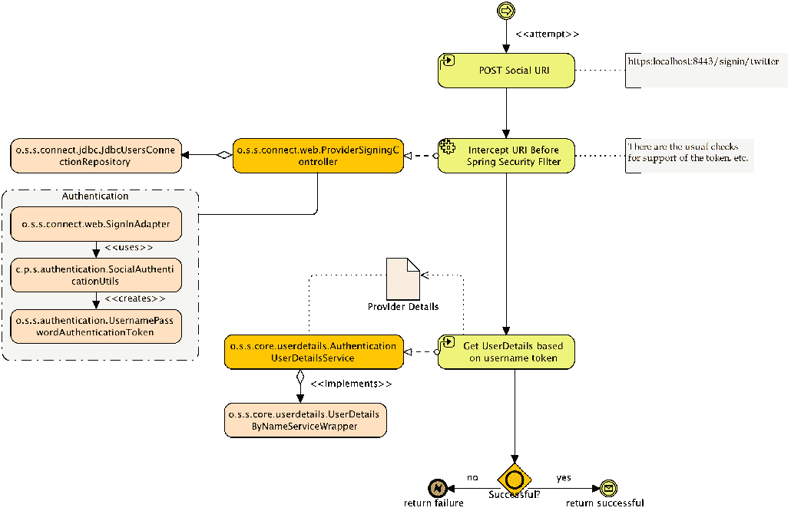
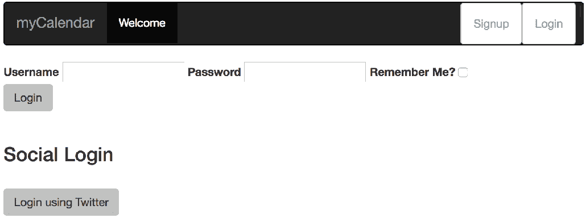
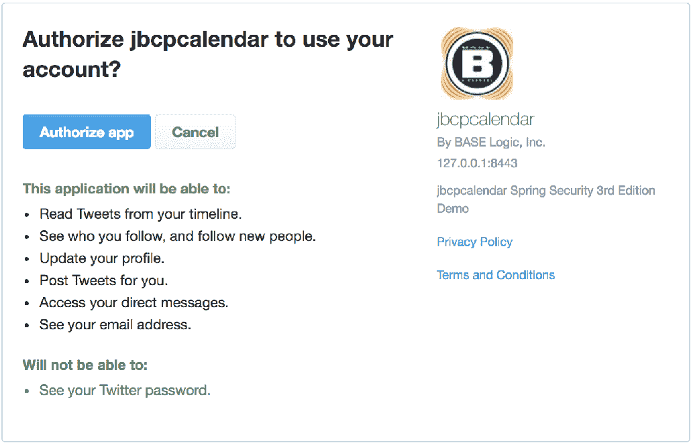
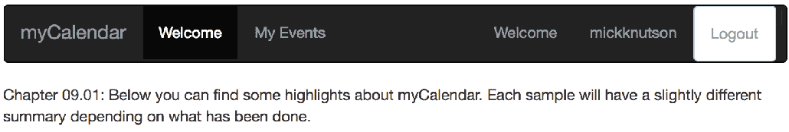
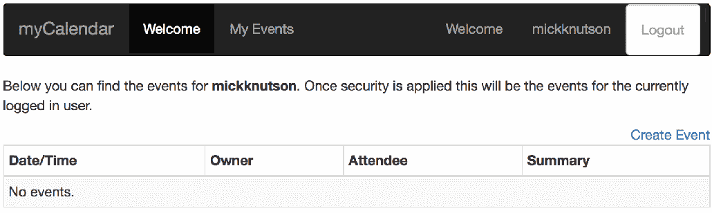
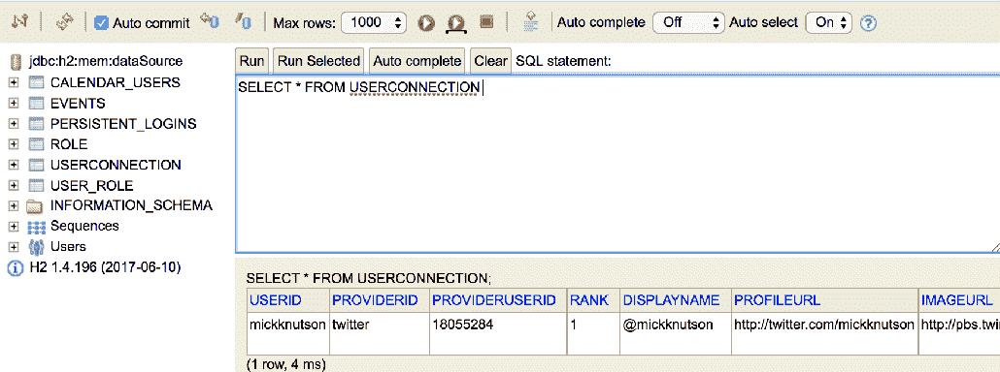
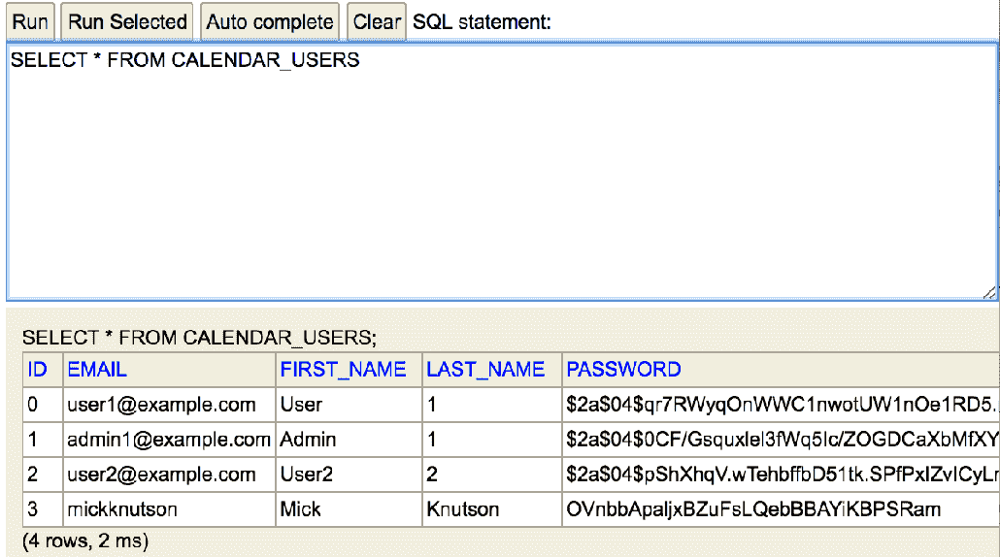
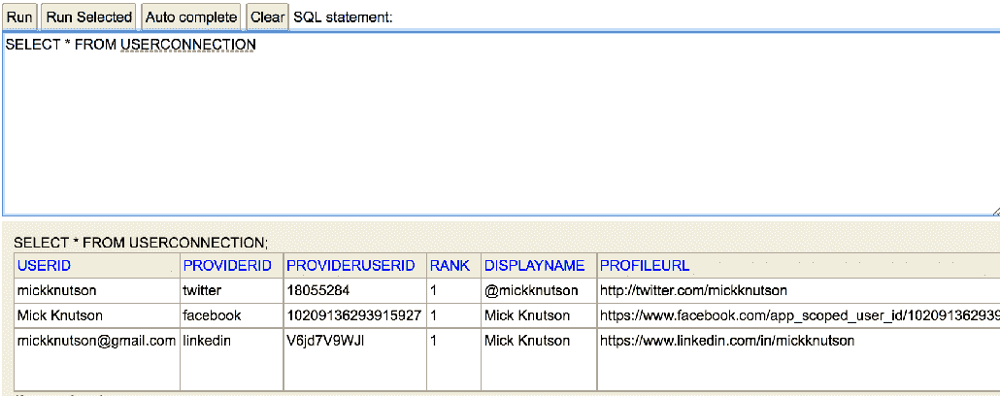
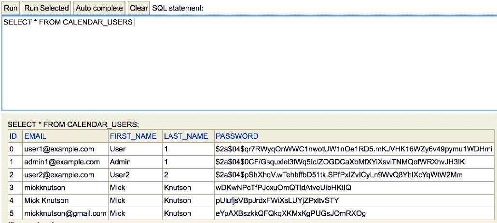
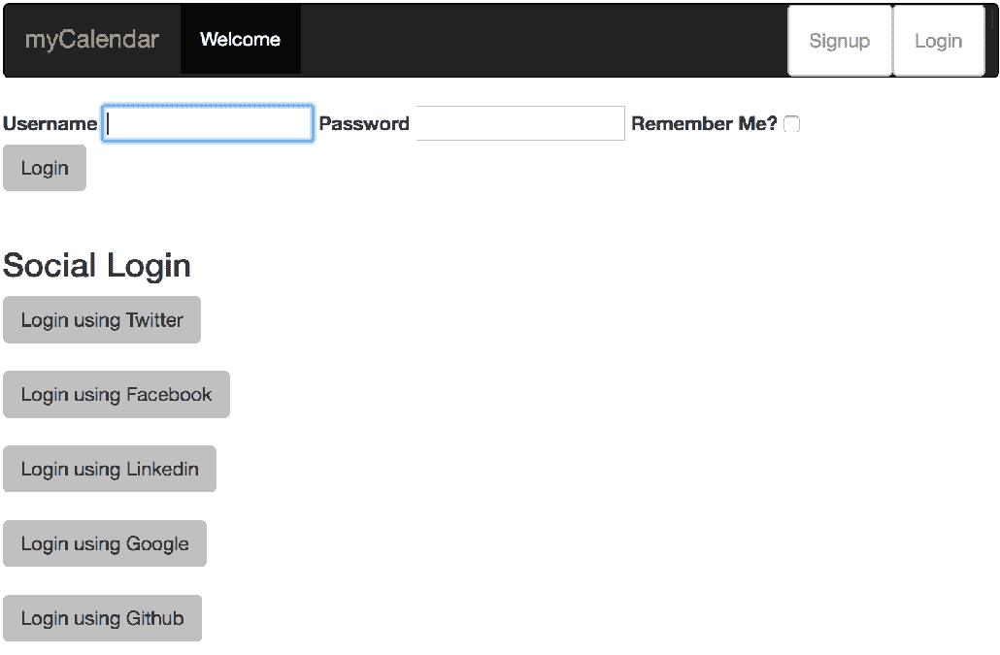

# 第九章：向 OAuth 2 敞开大门

**OAuth 2** 是一种非常流行的可信身份管理形式，允许用户通过一个可信的提供商来管理他们的身份。这一方便的功能为用户提供了将密码和个人信息存储在可信的 OAuth 2 提供商处的安全性，必要时可以披露个人信息。此外，支持 OAuth 2 的网站提供了用户提供的 OAuth 2 凭据确实是他们所说的那个人的信心。

在本章中，我们将涵盖以下主题：

+   学习在 5 分钟内设置自己的 OAuth 2 应用程序

+   配置 JBCP 日历应用程序，实现 OAuth 2 的快速实施

+   学习 OAuth 2 的概念架构以及它如何为你的网站提供可信的用户访问

+   实现基于 OAuth 2 的用户注册

+   实验 OAuth 2 属性交换以实现用户资料功能

+   展示我们如何触发与先前 OAuth 2 提供商的自动认证

+   检查基于 OAuth 2 的登录所提供的安全性

# 充满希望的 OAuth 2 世界

作为应用程序开发者，你可能经常听到 OAuth 2 这个词。OAuth 2 已在全球 Web 服务和软件公司中得到广泛采用，是这些公司互动和共享信息方式的核心部分。但它到底是什么呢？简而言之，OAuth 2 是一个允许不同方以安全和可靠的方式共享信息和资源的协议。

那么 OAuth 1.0 呢？

出于同样的动机，OAuth 1.0 在 2007 年被设计和批准。然而，它因过于复杂而受到批评，并且由于不精确的规范导致实现不安全。所有这些问题都导致了 OAuth 1.0 采用率低下，最终导致了 OAuth 2 的设计和创建。OAuth 2 是 OAuth 1.0 的继承者。

值得注意的是，OAuth 2 与 OAuth 1.0 不兼容，因此 OAuth 2 应用程序无法与 OAuth 1.0 服务提供商集成。

这种通过可信第三方登录的方式已经存在很长时间了，以许多不同的形式存在（例如，**Microsoft Passport** 在网上成为一段时间内较为知名的集中登录服务）。OAuth 2 的显著优势在于，OAuth 2 提供商只需实现公开的 OAuth 2 协议，即可与任何寻求与 OAuth 2 集成登录的网站兼容。

你可以参考 OAuth 2.0 规范：[`tools.ietf.org/html/rfc6749`](https://tools.ietf.org/html/rfc6749)。

以下图表说明了网站在登录过程中集成 OAuth 2 与例如 Facebook OAuth 2 提供商之间的高级关系：



我们可以看到，提交表单 POST 将启动对 OAuth 提供者的请求，导致提供者显示一个授权对话框，询问用户是否允许`jbcpcalendar`从您的 OAuth 提供者账户中获取特定信息的权限。这个请求包含一个名为`code`的`uri`参数。一旦授权，用户将被重定向回`jbcpcalendar`，`code`参数将包含在`uri`参数中。然后，请求再次重定向到 OAuth 提供者，以授权`jbcpcalendar`。OAuth 提供者随后响应一个`access_token`，该`access_token`可用于访问`jbcpcalendar`被授予访问权的用户 OAuth 信息。

不要盲目信任 OAuth 2 ！

在这里，你可以看到一个可能会误导系统用户的根本假设。我们可以注册一个 OAuth 2 提供者的账户，这样我们就可以假装是 James Gosling，尽管显然我们不是。不要错误地假设，仅仅因为一个用户有一个听起来令人信服的 OAuth 2（或 OAuth 2 代理提供者），就不需要额外的身份验证方式，认为他就是那个真实的人。换一种方式考虑，如果有人来到你的门前，只是声称他是 James Gosling，你会不会在核实他的身份证之前就让他进来？

启用了 OAuth 2 的应用程序然后将用户重定向到 OAuth 2 提供者，用户向提供者展示他的凭据，提供者负责做出访问决定。一旦提供者做出了访问决定，提供者将用户重定向到原始网站，现在可以确信用户的真实性。一旦尝试过，OAuth 2 就很容易理解了。现在让我们把 OAuth 2 添加到 JBCP 日历登录屏幕上！

# 注册 OAuth 2 应用程序

为了充分利用本节中的练习（并能够测试登录），您需要创建一个具有服务提供者的应用程序。目前，Spring Social 支持 Twitter、Facebook、Google、LinkedIn 和 GitHub，而且支持列表还在增加。

为了充分利用本章中的练习，我们建议您至少拥有 Twitter 和 GitHub 的账户。我们已经为`jbcpcalendar`应用设置了账户，我们将在本章剩余时间里使用它。

# 使用 Spring Security 启用 OAuth 认证

我们可以看到，在接下来的几章中，外部认证提供者之间有一个共同的主题。Spring Security 为实际开发在 Spring 生态系统之外的提供者集成提供了方便的包装器。

在这种情况下，Spring Social 项目（[`projects.spring.io/spring-social/`](http://projects.spring.io/spring-social/)）为 Spring Security OAuth 2 功能提供了基础的 OAuth 2 提供者发现和请求/响应协商。

# 额外的必需依赖

让我们来看看以下步骤：

1.  为了使用 OAuth，我们需要包含特定提供者的依赖及其传递依赖。这可以通过更新`build.gradle`文件在 Gradle 中完成，如下代码片段所示：

```java
        //build.gradle

        compile("org.springframework.boot:spring-boot-starter-
        social-facebook")
        compile("org.springframework.boot:spring-boot-starter-
        social-linkedin")
        compile("org.springframework.boot:spring-boot-starter-
        social-twitter")
```

1.  使用 Spring Boot 包括了对 Facebook、Twitter 和 LinkedIn 启动依赖的引用，如前文代码片段所示。要添加其他提供者，我们必须包含提供者的依赖并指定版本。这可以通过更新`build.gradle`文件在 Gradle 中完成，如下代码片段所示：

```java
        //build.gradle

        compile("org.springframework.social:spring-social-google:
        latest.release ")
        compile("org.springframework.social:spring-social-github:
        latest.release ")
        compile("org.springframework.social:spring-social-linkedin:
        latest.release ")
```

你应该从`chapter09.00-calendar`的源代码开始。

1.  当编写 OAuth 登录表单时，我们需要将`username`和`password`字段替换为 OAuth 字段。现在请对您的`login.html`文件进行以下更新：

```java
        //src/main/resources/templates/login.html

         <div class="form-actions">
            <input id="submit" class="btn" name="submit" type="submit" 
            value="Login"/>
           </div>
         </form>
       <br/>
         <h3>Social Login</h3>
       <br />
        <form th:action="@{/signin/twitter}" method="POST"
        class="form-horizontal">
         <input type="hidden" name="scope" value="public_profile" />
        <div class="form-actions">
        <input id="twitter-submit" class="btn" type="submit" 
        value="Login using  
        Twitter"/>
         </div>
        </form>
       </div>
```

1.  我们可以对注册表单进行类似的编辑，如下代码片段所示：

```java
         //src/main/resources/templates/signup/form.html

        </fieldset>
        </form>
         <br/>
           <h3>Social Login</h3>
         <br/>
 <form th:action="@{/signin/twitter}" method="POST" 
           class="form-horizontal">
 <input type="hidden" name="scope" value="public_profile" />        <div class="form-actions">
         <input id="twitter-submit" class="btn" type="submit" 
         value="Login using Twitter"/>
        </div>
        </form>
         </div>
```

你会注意到我们已经添加了一个范围字段来定义我们在认证过程中感兴趣的 OAuth 2 详细信息。

**OAuth 2.0 API 范围：**范围允许提供商定义客户端应用程序可访问的 API 数据。当提供商创建一个 API 时，他们会为每个表示的 API 定义一个范围和动作。一旦创建了 API 并定义了范围，客户端应用程序在启动授权流程时可以请求这些定义的权限，并将它们作为范围请求参数的一部分包含在访问令牌中。

每个提供商可能有略有不同的 API 范围，例如`r_basicprofile`和`r_emailaddress`，但 API 范围也限于应用程序配置。因此，一个应用程序可能只请求访问电子邮件或联系人，而不是整个用户资料或如发帖到用户墙等提供商动作。

你会注意到我们没有为 OAuth 2 登录提供**记住我**选项。这是由于事实，从提供商到网站以及返回的重定向会导致**记住我**复选框值丢失，因此当用户成功认证后，他们不再有**记住我**选项被标记。这虽然不幸，但最终增加了 OAuth 2 作为我们网站登录机制的安全性，因为 OAuth 2 强制用户在每次登录时与提供商建立一个可信关系。

# 在 Spring Security 中配置 OAuth 2 支持

使用**Spring Social**，我们可以为拦截提供商表单提交启用 OAuth 2 特定的提供商端点。

# 本地用户连接存储库（UserConnectionRepository）

`UsersConnectionRepository`接口是用于管理用户与服务提供商连接的全球存储的数据访问接口。它提供了适用于多个用户记录的数据访问操作，如下代码片段所示：

```java
    //src/main/java/com/packtpub/springsecurity/configuration/SocialConfig.java

    @Autowired

    private UsersConnectionRepository usersConnectionRepository;

    @Autowired

     private ProviderConnectionSignup providerConnectionSignup;

    @Bean

    public ProviderSignInController providerSignInController() {

       ((JdbcUsersConnectionRepository) usersConnectionRepository)

       .setConnectionSignUp(providerConnectionSignup);

       ...

    }

```

# 为提供商详情创建本地数据库条目

Spring Security 提供了支持，将提供者详情保存到一组单独的数据库表中，以防我们想在本地数据存储中保存用户，但不想将那些数据包含在现有的`User`表中：

```java
    //src/main/java/com/packtpub/springsecurity/configuration/
    SocialDatabasePopulator.java

    @Component
    public class SocialDatabasePopulator
    implements InitializingBean {
       private final DataSource dataSource;
       @Autowired
    public SocialDatabasePopulator(final DataSource dataSource) {
    this.dataSource = dataSource;
     }
    @Override
    public void afterPropertiesSet() throws Exception {
       ClassPathResource resource = new ClassPathResource(
       "org/springframework/social/connect/jdbc/
       JdbcUsersConnectionRepository.sql");
       executeSql(resource);
     }
    private void executeSql(final Resource resource) {
     ResourceDatabasePopulator populator = new ResourceDatabasePopulator();
     populator.setContinueOnError(true);
     populator.addScript(resource);
     DatabasePopulatorUtils.execute(populator, dataSource);
     }
  }
```

这个`InitializingBean`接口在加载时执行，并将执行位于类路径中的`spring-social-core-[VERSION].jar`文件内的`JdbcUsersConnectionRepository.sql`，将以下模式种子到我们的本地数据库中：

```java
    spring-social-core-  [VERSION].jar#org/springframework/social/connect/jdbc/
    JdbcUsersConnectionRepository.sql

    create table UserConnection(
      userId varchar(255) not null,
      providerId varchar(255) not null,
      providerUserId varchar(255),
      rank int not null,
      displayName varchar(255),
      profileUrl varchar(512),
      imageUrl varchar(512),
      accessToken varchar(512) not null,
      secret varchar(512),
      refreshToken varchar(512),
      expireTime bigint,
      primary key (userId, providerId, providerUserId));

      create unique index UserConnectionRank on UserConnection(userId, providerId,  
      rank);
```

现在我们已经有一个表来存储提供者详情，我们可以配置`ConnectionRepository`在运行时保存提供者详情。

# 自定义 UserConnectionRepository 接口

我们需要创建一个`UserConnectionRepository`接口，我们可以利用`JdbcUsersConnectionRepository`作为实现，它是基于我们加载时生成的`JdbcUsersConnectionRepository.sql`模式：

```java
      //src/main/java/com/packtpub/springsecurity/configuration/

      DatabaseSocialConfigurer.java

      public class DatabaseSocialConfigurer extends SocialConfigurerAdapter {

        private final DataSource dataSource;

        public DatabaseSocialConfigurer(DataSource dataSource) {

         this.dataSource = dataSource;

       }

      @Override

      public UsersConnectionRepository getUsersConnectionRepository(

      ConnectionFactoryLocator connectionFactoryLocator) {

          TextEncryptor textEncryptor = Encryptors.noOpText();

          return new JdbcUsersConnectionRepository(

          dataSource, connectionFactoryLocator, textEncryptor);

     }

      @Override

     public void addConnectionFactories(ConnectionFactoryConfigurer config,

     Environment env) {

          super.addConnectionFactories(config, env);

       }

   }

```

现在，每次用户连接到注册的提供者时，连接详情将被保存到我们的本地数据库中。

# 连接注册流程

为了将提供者详情保存到本地存储库，我们创建了一个`ConnectionSignup`对象，这是一个命令，在无法从`Connection`映射出`userid`的情况下注册新用户，允许在提供者登录尝试期间从连接数据隐式创建本地用户配置文件：

```java
    //src/main/java/com/packtpub/springsecurity/authentication/
    ProviderConnectionSignup.java

    @Service
     public class ProviderConnectionSignup implements ConnectionSignUp {
        ...; 
    @Override
    public String execute(Connection<?> connection) {
       ...
     }
    }
```

# 执行 OAuth 2 提供商连接工作流

为了保存提供者详情，我们需要从提供者获取可用细节，这些细节通过 OAuth 2 连接可用。接下来，我们从可用细节创建一个`CalendarUser`表。注意我们需要至少创建一个`GrantedAuthority`角色。在这里，我们使用了`CalendarUserAuthorityUtils#createAuthorities`来创建`ROLE_USER` `GrantedAuthority`：

```java
    //src/main/java/com/packtpub/springsecurity/authentication/
    ProviderConnectionSignup.java

    @Service
    public class ProviderConnectionSignup implements ConnectionSignUp {
         ...
    @Override
    public String execute(Connection<?> connection) {
        UserProfile profile = connection.fetchUserProfile();
        CalendarUser user = new CalendarUser();
        if(profile.getEmail() != null){
             user.setEmail(profile.getEmail());
          }
        else if(profile.getUsername() != null){
             user.setEmail(profile.getUsername());
         }
        else {
             user.setEmail(connection.getDisplayName());
         }
             user.setFirstName(profile.getFirstName());
             user.setLastName(profile.getLastName());
             user.setPassword(randomAlphabetic(32));
             CalendarUserAuthorityUtils.createAuthorities(user);
             ...
         }
      }

```

# 添加 OAuth 2 用户

既然我们已经从我们的提供者详情中创建了`CalendarUser`，我们需要使用`CalendarUserDao`将那个`User`账户保存到我们的数据库中。然后我们返回`CalendarUser`的电子邮件，因为这是我们一直在 JBCP 日历中使用的用户名：

```java
//src/main/java/com/packtpub/springsecurity/authentication/
ProviderConnectionSignup.java

@Service
public class ProviderConnectionSignup
implements ConnectionSignUp {
 @Autowired private CalendarUserDao calendarUserDao;  @Override
 public String execute(Connection<?> connection) {...
calendarUserDao.createUser(user); return user.getEmail();
   }
}
```

现在，我们已经根据提供者详情在数据库中创建了一个本地`User`账户。

这是一个额外的数据库条目，因为我们已经在之前的`UserConnection`表中保存了提供者详情。

# OAuth 2 控制器登录流程

现在，为了完成`SocialConfig.java`配置，我们需要构建`ProviderSignInController`，它使用`ConnectionFactoryLocator`、`usersConnectionRepository`和`SignInAdapter`进行初始化。`ProviderSignInController`接口是一个用于处理提供者用户登录流程的 Spring MVC 控制器。对`/signin/{providerId}`的 HTTP `POST`请求会使用`{providerId}`启动用户登录。提交对`/signin/{providerId}?oauth_token&oauth_verifier||code`的 HTTP `GET`请求将接收`{providerId}`身份验证回调并建立连接。

`ServiceLocator`接口用于创建`ConnectionFactory`实例。此工厂支持通过`providerId`和`apiType`查找，基于 Spring Boot 的`AutoConfiguration`中包含的服务提供商：

```java
    //src/main/java/com/packtpub/springsecurity/configuration/SocialConfig.java

    @Autowired
    private ConnectionFactoryLocator connectionFactoryLocator;
    @Bean
    public ProviderSignInController providerSignInController() {
        ...
        return new ProviderSignInController(connectionFactoryLocator,
        usersConnectionRepository, authSignInAdapter());
    }
```

这将允许拦截特定提供商`uri`的提交，并开始 OAuth 2 连接流程。

# 自动用户认证

让我们来看看以下步骤：

1.  `ProviderSignInController`控制器使用一个认证`SignInAdapter`进行初始化，该适配器用于通过使用指定 ID 登录本地用户账户来完成提供商登录尝试：

```java
        //src/main/java/com/packtpub/springsecurity/configuration/
        SocialConfig.java

        @Bean
        public SignInAdapter authSignInAdapter() {
           return (userId, connection, request) -> {
             SocialAuthenticationUtils.authenticate(connection);
             return null;
           };
         }
```

1.  在前面的代码片段中，在`SingInAdapter`bean 中，我们使用了一个自定义认证工具方法，以`UsernamePasswordAuthenticationToken`的形式创建了一个`Authentication`对象，并基于 OAuth 2 提供商返回的详情将其添加到`SecurityContext`中：

```java
        //src/main/java/com/packtpub/springsecurity/authentication/
        SocialAuthenticationUtils.java

        public class SocialAuthenticationUtils {
       public static void authenticate(Connection<?> connection) {
         UserProfile profile = connection.fetchUserProfile();
         CalendarUser user = new CalendarUser();
         if(profile.getEmail() != null){
             user.setEmail(profile.getEmail());
           }
         else if(profile.getUsername() != null){
             user.setEmail(profile.getUsername());
          }
         else {
             user.setEmail(connection.getDisplayName());
           }
             user.setFirstName(profile.getFirstName());
             user.setLastName(profile.getLastName());
             UsernamePasswordAuthenticationToken authentication = new  
             UsernamePasswordAuthenticationToken(user, null,        
             CalendarUserAuthorityUtils.createAuthorities(user));
             SecurityContextHolder.getContext()
             .setAuthentication(authentication);
           }
        }
```

连接到提供商所需的最详细信息是创建提供商应用时获得的应用程序 ID 和密钥：

```java
        //src/main/resources/application.yml:

        spring
        ## Social Configuration:
        social:
        twitter:
 appId: cgceheRX6a8EAE74JUeiRi8jZ
 appSecret: XR0J2N0Inzy2y2poxzot9oSAaE6MIOs4QHSWzT8dyeZaaeawep
```

1.  现在我们有了连接到 Twitter JBCP 日历所需的所有详细信息，我们可以启动 JBCP 日历并使用 Twitter 提供商登录。

您的代码现在应该看起来像`chapter09.01-calendar`。

1.  在此阶段，您应该能够使用 Twitter 的 OAuth 2 提供商完成完整的登录。发生的重定向如下，首先，我们启动以下屏幕快照所示的 OAuth 2 提供商登录：



我们随后被重定向到服务提供商授权页面，请求用户授予`jbcpcalendar`应用以下屏幕快照所示的权限：



1.  授权`jbcpcalendar`应用后，用户被重定向到`jbcpcalendar`应用，并使用提供商显示名称自动登录：



1.  在此阶段，用户存在于应用程序中，并且具有单个`GrantedAuthority`的`ROLE_USER`认证和授权，但如果导航到我的事件，用户将被允许查看此页面。然而，`CalendarUser`中不存在任何事件：



1.  尝试为该用户创建事件，以验证用户凭据是否正确创建在`CalendarUser`表中。

1.  为了验证提供商详情是否正确创建，我们可以打开 H2 管理控制台并查询`USERCONNECTION`表，以确认已保存以下屏幕快照所示的标准连接详情：



1.  此外，我们还可以验证已填充了服务提供商详情的`CALENDAR_USERS`表：



现在我们已经在本地数据库中注册了用户，并且我们还可以根据对特定提供者详细信息的授权访问与注册提供者进行交互。

# 额外的 OAuth 2 提供者

我们已经成功集成了一个 OAuth 2 提供者，使用 Spring Social 当前支持的三个当前提供者之一。还有几个其他提供者可用；我们将添加更多提供者，以便用户有多一个选择。Spring Social 目前原生支持 Twitter，Facebook 和 LinkedIn 提供者。包括其他提供者将需要额外的库来实现此支持，这将在本章后面部分介绍。

让我们看看以下步骤：

1.  为了将 Facebook 或 LinkedIn 提供者添加到 JBCP 日历应用程序中，需要设置其他应用程序属性，并且每个配置的提供者将自动注册：

# OAuth 2 用户注册问题

如果在支持多个提供者的情况下，需要解决的一个问题是在各个提供者返回的详细信息之间的用户名冲突。

如果您使用列表中的每个提供者登录到 JBCP 日历应用程序，然后查询存储在 H2 中的数据，您会发现基于用户账户详细信息，数据可能相似，如果不是完全相同。

在下面的`USERCONNECTION`表中，我们可以看到来自每个提供者的`USERID`列数据是相似的：



在`CALENDARUSER`表中，我们有两个可能的问题。首先，用于`EMAIL`的用户详细信息对于某些提供者来说并不是电子邮件。其次，两个不同提供者的用户标识符仍然可能相同：



我们不会深入探讨检测和解决这个可能问题的各种方法，但值得在未来参考中注意。

# 注册非标准 OAuth 2 提供者

为了包括其他提供者，我们需要执行一些额外的步骤来将自定义提供者包括到登录流程中，如下所示：

1.  对每个提供者，我们需要在我们的`build.gradle`文件中包括提供者依赖项，如下所示：

```java
        //build.gradle

        dependencies {
          ...
          compile("org.springframework.social:spring-social-google:
          ${springSocialGoogleVersion}")
          compile("org.springframework.social:spring-social-github:
          ${springSocialGithubVersion}")
        }
```

1.  接下来，我们将使用以下为每个提供者的`appId`和`appSecret`键将提供者注册到 JBCP 日历应用程序：

```java
        //src/main/resources/application.yml

        spring:
          social:
            # Google
 google:
 appId: 947438796602-uiob88a5kg1j9mcljfmk00quok7rphib.apps.
                 googleusercontent.com
 appSecret: lpYZpF2IUgNXyXdZn-zY3gpR
           # Github
 github:
 appId: 71649b756d29b5a2fc84
 appSecret: 4335dcc0131ed62d757cc63e2fdc1be09c38abbf
```

1.  每个新提供者必须通过添加相应的`ConnectionFactory`接口进行注册。我们可以为每个新提供者添加一个新的`ConnectionFactory`条目到自定义的`DatabaseSocialConfigurer.java`文件中，如下所示：

```java
        //src/main/java/com/packtpub/springsecurity/configuration/
        DatabaseSocialConfigurer.java

        public class DatabaseSocialConfigurer 
        extends SocialConfigurerAdapter {
           ...
        @Override
        public void addConnectionFactories(
        ConnectionFactoryConfigurer config, Environment env) {
               super.addConnectionFactories(config, env);

            // Adding GitHub Connection with properties
           // from application.yml
 config.addConnectionFactory(
 new GitHubConnectionFactory(
 env.getProperty("spring.social.github.appId"),
 env.getProperty("spring.social.github.appSecret")));
          // Adding Google Connection with properties
```

```java
         // from application.yml
 config.addConnectionFactory(
 new GoogleConnectionFactory(
 env.getProperty("spring.social.google.appId"),
 env.getProperty("spring.social.google.appSecret")));
             }
         }
```

1.  现在我们可以将新的登录选项添加到我们的`login.html`文件和`form.html`注册页面，为每个新提供者包括一个新的`<form>`标签：

```java
        //src/main/resources/templates/login.html

        <h3>Social Login</h3>
        ...
 <form th:action="@{/signin/google}" method="POST"        class="form-horizontal">
        <input type="hidden" name="scope" value="profile" />
        <div class="form-actions">
           <input id="google-submit" class="btn" type="submit" 
           value="Login using  
           Google"/>
        </div>
      </form>
     <br />

 <form th:action="@{/signin/github}" method="POST"       class="form-horizontal">
       <input type="hidden" name="scope" value="public_profile" />
       <div class="form-actions">
         <input id="github-submit" class="btn" type="submit"
         value="Login using  
         Github"/>
       </div>
     </form&gt;
```

1.  现在，我们有了连接到 JBCP 日历额外提供者的所需详细信息。我们可以重新启动 JBCP 日历应用程序，并尝试使用额外的 OAuth 2.0 提供商登录。现在登录时，我们应该会看到额外的提供商选项，如下面的屏幕截图所示：



# OAuth 2.0 安全吗？

由于 OAuth 2.0 支持依赖于 OAuth 2.0 提供者的可信度以及提供者响应的可验证性，因此安全性是至关重要的，以便应用程序对用户的 OAuth 2.0 登录有信心。

幸运的是，OAuth 2.0 规范的设计者非常清楚这个担忧，并实施了一系列验证步骤，以防止响应伪造、重放攻击和其他类型的篡改，如下所述：

+   **响应伪造**由于结合了由 OAuth 2.0 启用的网站在初始请求之前创建的共享密钥，以及响应本身的一路哈希消息签名而得以防止。没有访问共享密钥-和签名算法的恶意用户-篡改任何响应字段中的数据将生成无效的响应。

+   **重放攻击**由于包括了 nonce（一次性使用的随机密钥）而得以防止，该密钥应该被 OAuth 2.0 启用的网站记录，因此它永远不能被重新使用。这样，即使用户试图重新发行响应 URL，也会失败，因为接收网站会确定 nonce 已经被先前使用，并将请求无效。

+   可能导致用户交互被破坏的最有可能的攻击形式是一个中间人攻击，在这种攻击中，恶意用户可以拦截用户与他们计算机和 OAuth 2.0 提供商之间的交互。在这种情况下的假设攻击者可能处于记录用户浏览器与 OAuth 2.0 提供商之间的对话，以及当请求发起时记录密钥的立场。在这种情况下，攻击者需要非常高的复杂性水平，以及 OAuth 2.0 签名规范的相对完整的实现-简而言之，这不太可能以任何常规性发生。

# 总结

在本章中，我们回顾了 OAuth 2.0，这是一种相对较新的用户认证和凭据管理技术。OAuth 2.0 在网络上有非常广泛的应用，并且在过去的两年内在可用性和接受度上取得了很大的进步。大多数现代网络上的面向公众的网站都应该计划支持某种形式的 OAuth 2.0，JBCP 日历应用程序也不例外！

在本书中，我们学习了 OAuth 2.0 认证机制及其高级架构和关键术语。我们还了解了 JBCP 日历应用程序中的 OAuth 2.0 登录和自动用户注册。

我们还介绍了使用 OAuth 2.0 的自动登录以及 OAuth 2.0 登录响应的安全性。

我们介绍了使用 Spring Security 实现的最简单的单点登录机制之一。其中一个缺点是它不支持单点登出标准的机制。在下一章中，我们将探讨 CAS，另一种支持单点登出的标准单点登录协议。
