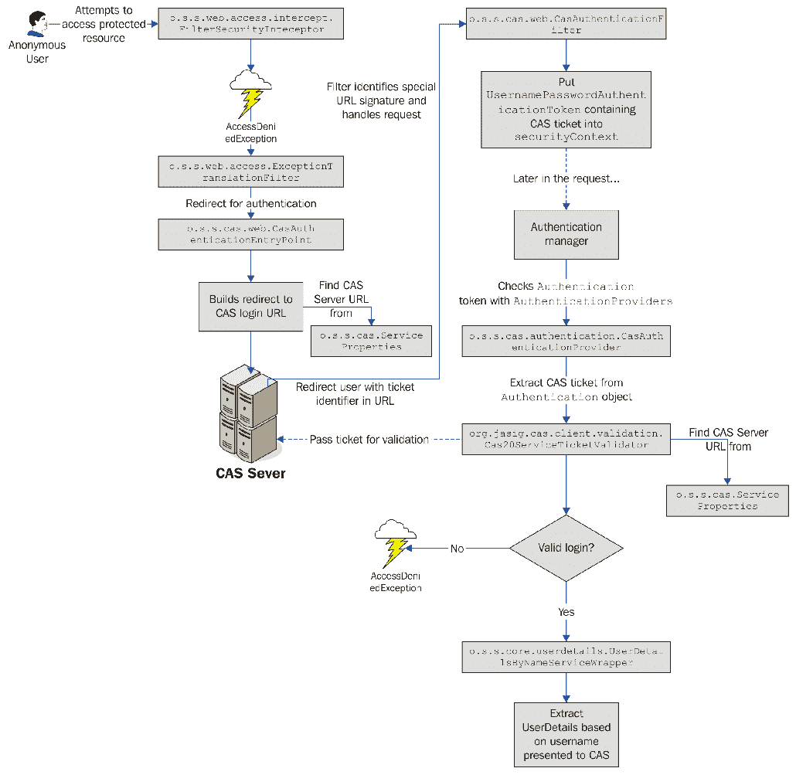
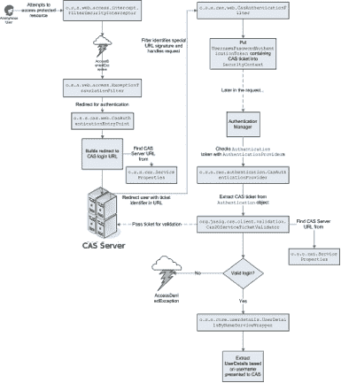
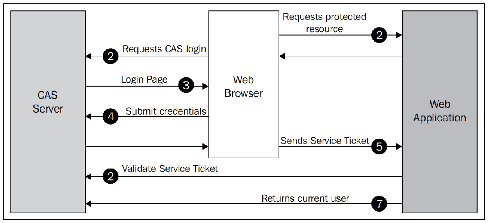
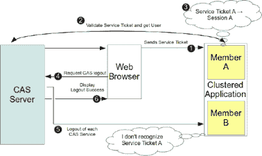
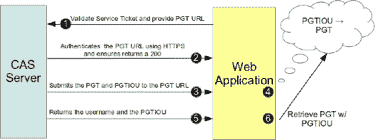
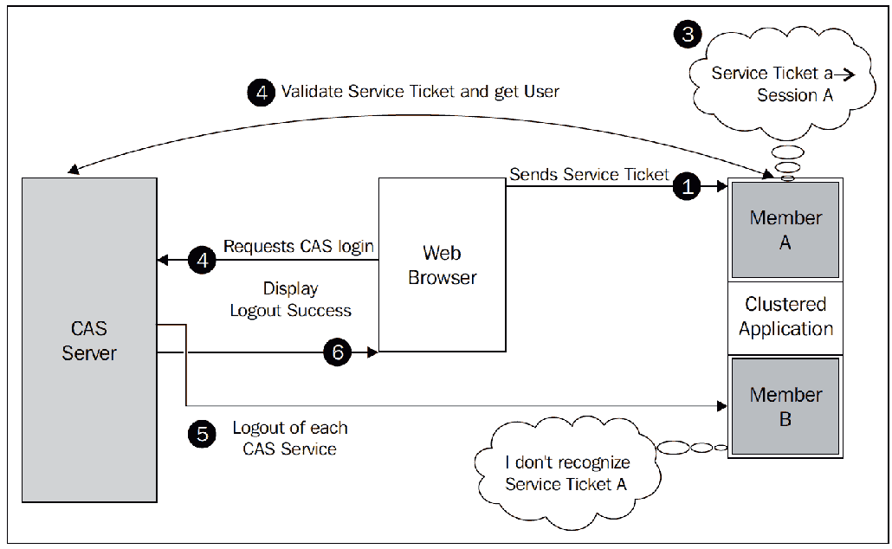

# 第十章：使用中央认证服务的单点登录

在本章中，我们将探讨如何使用**中央认证服务**（**CAS**）作为 Spring Security 基础应用程序的单点登录门户。

在本章中，我们将涵盖以下主题：

+   学习关于 CAS，其架构以及它如何使系统管理员和任何大小的组织受益

+   了解如何重新配置 Spring Security 以处理认证请求的拦截并重定向到 CAS

+   配置 JBCP 日历应用程序以使用 CAS 单点登录

+   了解如何执行单一登出，并配置我们的应用程序以支持它

+   讨论如何使用 CAS 代理票证认证服务，并配置我们的应用程序以利用代理票证认证

+   讨论如何使用推荐的 war 覆盖方法定制**JA-SIG CAS**服务器

+   将 CAS 服务器与 LDAP 集成，并通过 CAS 将数据从 LDAP 传递到 Spring Security

# 介绍中央认证服务

CAS 是一个开源的单点登录服务器，为组织内的基于 web 的资源提供集中访问控制和认证。对于管理员来说，CAS 的好处是显而易见的，它支持许多应用程序和多样化的用户社区。好处如下：

+   资源（应用程序）的个人或组访问可以在一个位置进行配置

+   对各种认证存储（用于集中用户管理）的广泛支持，为广泛的跨机器环境提供单一的认证和控制点

+   通过 CAS 客户端库为基于 web 和非基于 web 的 Java 应用程序提供广泛的认证支持

+   通过 CAS 提供单一引用点用户凭据（ via CAS），因此 CAS 客户端应用程序无需了解用户的凭据，或知道如何验证它们

在本章中，我们将不太多关注 CAS 的管理，而是关注认证以及 CAS 如何为我们的网站用户充当认证点。尽管 CAS 通常在企业或教育机构的内部网络环境中看到，但它也可以在诸如 Sony Online Entertainment 公共面向网站等高知名度位置找到使用。

# 高级 CAS 认证流程

在较高层次上，CAS 由 CAS 服务器组成，这是确定认证的中心 web 应用程序，还有 CAS 服务，这是使用 CAS 服务器进行认证的不同的 web 应用程序。CAS 的基本认证流程通过以下动作进行：

1.  用户尝试访问网站上的受保护资源。

1.  用户通过浏览器从 CAS 服务请求登录到 CAS 服务器。

1.  CAS 服务器负责用户认证。如果用户尚未认证到 CAS 服务器，它会请求用户提供凭证。在下面的图中，用户被呈现一个登录页面。

1.  用户提交凭证（即用户名和密码）。

1.  如果用户的凭证有效，CAS 服务器将通过浏览器重定向一个服务票证。服务票证是一次性使用的令牌，用于标识用户。

1.  CAS 服务调用 CAS 服务器来验证票证是否有效，是否已过期等。注意这一步不是通过浏览器进行的。

1.  CAS 服务器回应一个断言，表示信任已经建立。如果票证可以接受，信任已经建立，用户可以通过正常的授权检查继续操作。

视觉上，它表现为以下 diagram:



我们可以看到，CAS 服务器与安全应用程序之间有很高的交互性，在建立用户的信任之前需要进行几次数据交换握手。这种复杂性的结果是一个相当难以通过常见技术进行欺骗的单点登录协议（假设已经实施了其他网络安全措施，如使用 SSL 和网络监控）。

既然我们已经了解了一般情况下 CAS 认证是如何工作的，现在让我们看看它如何应用于 Spring Security。

# Spring Security 和 CAS

Spring Security 与 CAS 有很强的集成能力，尽管它不像我们在这本书的后半部分所探讨的 OAuth2 和 LDAP 集成那样紧密地集成在安全命名空间配置风格中。相反，大部分配置依赖于从安全命名空间元素到 bean 声明的 bean 导线和引用配置。

使用 Spring Security 进行 CAS 认证的两个基本部分包括以下内容：

+   替换标准的`AuthenticationEntryPoint`实现，该实现通常处理将未认证的用户重定向到登录页面的操作，改为将用户重定向到 CAS 服务器。

+   处理服务票证，当用户从 CAS 服务器重定向回受保护的资源时，通过使用自定义 servlet 过滤器

关于 CAS 的一个重要理解是，在典型的部署中，CAS 旨在替代您应用程序的所有其他登录机制。因此，一旦我们为 Spring Security 配置了 CAS，我们的用户必须将 CAS 作为唯一身份验证机制来使用。在大多数情况下，这并不是问题；如我们在上一节中讨论的，CAS 旨在代理身份验证请求到一个或多个身份验证存储（类似于 Spring Security 委托数据库或 LDAP 进行身份验证时）。从之前的图表中，我们可以看到，我们的应用程序不再检查其自己的身份验证存储来验证用户。相反，它通过使用服务票证来确定用户。然而，如我们稍后讨论的，最初，Spring Security 仍然需要一个数据存储来确定用户的授权。我们将在本章后面讨论如何移除这个限制。

在完成与 Spring Security 的基本 CAS 集成后，我们可以从主页上删除登录链接，并享受自动重定向到 CAS 登录界面的便利，在此界面中我们尝试访问受保护的资源。当然，根据应用程序的不同，允许用户明确登录（以便他们可以看到自定义内容等）也可能很有好处。

# 必需的依赖项

在我们进展太远之前，我们应该确保我们的依赖项已经更新。我们可以看到，以下是我们添加的依赖项列表，以及关于何时需要它们的注释：

```java
    //build.gradle

    dependencies {
    // CAS:
    compile('org.springframework.security:spring-security-cas')
    ...
    }
```

# 安装和配置 CAS

CAS 的好处之一是有一个非常 dedicated 的团队，他们为开发高质量的软件和准确、简洁的文档做出了出色的 job。如果您选择跟随本章中的示例，建议您阅读适合您 CAS 平台的入门手册。您可以在[`apereo.github.io/cas/5.1.x/index.html`](https://apereo.github.io/cas/5.1.x/index.html)找到此手册。

为了使集成尽可能简单，我们为本章 included 了一个 CAS 服务器应用程序，可以在 Spring Tool Suite 或 IntelliJ 中部署，还可以附带日历应用程序。本章中的示例将假设 CAS 部署在`https://localhost:9443/cas/`，日历应用程序部署在`https://localhost:8443/`。为了使 CAS 正常工作，必须使用 HTTPS。关于设置 HTTPS 的详细说明，请参阅附录*附加参考资料*。

本章中的示例是使用最新的 CAS 服务器版本（写作时为 5.1.2）编写的。请注意，在 5.x 版本中，对 CAS 的某些后端类进行了重大更改。因此，如果您使用的是服务器的前一个版本，这些说明可能会有所不同或显著不同。

接下来，我们配置用于 CAS 认证的组件。

你应该从`chapter10.00-calendar`和`chapter10.00-cas-server`开始章节，引入源代码。

# 配置基本的 CAS 集成

由于 Spring Security 命名空间不支持 CAS 配置，我们需要实现很多步骤才能让基本设置工作。为了了解发生了什么，你可以参考以下图表。

不用担心现在就理解整个图表，因为我们将其分解成小块，以便更容易消化：



# 创建 CAS ServiceProperties 对象

Spring Security 设置依赖于一个`o.s.s.cas.ServiceProperties`bean 来存储关于 CAS 服务的常见信息。`ServiceProperties`对象在协调各种 CAS 组件之间的数据交换中扮演角色-它被用作一个数据对象来存储共享的（并且预期是匹配的）Spring CAS 堆栈中的各个参与者的 CAS 配置设置。你可以查看以下代码段中包含的配置：

```java
    //src/main/java/com/packtpub/springsecurity/configuration/CasConfig.java

    static{
    System.setProperty("cas.server", "https://localhost:9443/cas");
     System.setProperty("cas.server.login", 
     "https://localhost:9443/cas/login");
    System.setProperty("cas.service", 
     "https://localhost:8443");
    System.setProperty("cas.service.login", 
    "https://localhost:8443/login");
     }
    @Value("#{systemProperties['cas.service.login']}")
    private String calendarServiceLogin;
    @Bean
    public ServiceProperties serviceProperties(){
     return new ServiceProperties(){{
    setService(calendarServiceLogin);
     }};
    }
```

你可能注意到了，我们利用系统属性使用了名为`${cas.service}`和`${cas.server}`的变量。这两个值都可以包含在你的应用程序中，Spring 会自动将它们替换为在`PropertySources`配置中提供的值。这是一种常见的策略，当部署 CAS 服务时，由于 CAS 服务器很可能从开发环境过渡到生产环境，所以 CAS 服务器可能会发生变化。在这个实例中，我们默认使用`localhost:9443`作为 CAS 服务器，`localhost:8443`作为日历应用程序。当应用程序部署到生产环境时，可以通过系统参数来覆盖这个配置。另外，配置可以外部化到一个 Java 属性文件中。任一机制都允许我们适当外部化配置。

# 添加 CasAuthenticationEntryPoint 对象

如本章开头简要提到的，Spring Security 使用一个`o.s.s.web.AuthenticationEntryPoint`接口来请求用户的凭据。通常，这涉及到将用户重定向到登录页面。对于 CAS，我们需要将用户重定向到 CAS 服务器以请求登录。当我们重定向到 CAS 服务器时，Spring Security 必须包含一个`service`参数，指示 CAS 服务器应该发送服务票证的位置。幸运的是，Spring Security 提供了`o.s.s.cas.web.CasAuthenticationEntryPoint`对象，专门为此目的设计。示例应用程序中的配置如下：

```java
    //src/main/java/com/packtpub/springsecurity/configuration/CasConfig.java

    @Value("#{systemProperties['cas.server.login']}")
    private String casServerLogin;
    @Bean
    public CasAuthenticationEntryPoint casAuthenticationEntryPoint(){
     return new CasAuthenticationEntryPoint(){{
     setServiceProperties(serviceProperties());
     setLoginUrl(casServerLogin);
     }};
    }
```

`CasAuthenticationEntryPoint`对象使用`ServiceProperties`类来指定用户认证后要发送服务票据的位置。CAS 允许根据配置对每个用户、每个应用程序进行选择性授权。我们将在配置处理该 URL 的 servlet 过滤器时立即检查这个 URL 的详细信息。接下来，我们需要更新 Spring Security 以使用具有`casAuthenticationEntryPoint` ID 的 bean。将以下内容更新到我们的`SecurityConfig.java`文件中：

```java
    //src/main/java/com/packtpub/springsecurity/configuration/
    SecurityConfig.java

    @Autowired
    private CasAuthenticationEntryPoint casAuthenticationEntryPoint;
    @Override
    protected void configure(HttpSecurity http) throws Exception {
      ...
    // Exception Handling
     http.exceptionHandling()
     .authenticationEntryPoint(casAuthenticationEntryPoint)
     .accessDeniedPage("/errors/403");
    ...
```

最后，我们需要确保`CasConfig.java`文件被 Spring 加载。更新`SecurityConfig.java`文件，如下所示：

```java
    //src/main/java/com/packtpub/springsecurity/configuration/
    SecurityConfig.java

    @Configuration
    @EnableWebSecurity(debug = true)
    @EnableGlobalAuthentication
    @Import(CasConfig.class)
    public class SecurityConfig extends WebSecurityConfigurerAdapter {
```

你需要做的最后一件事是删除现有的`UserDetailsService`对象作为`AuthenticationManager`的`userDetailsService`实现，因为它不再需要，因为`CasAuthenticationEntryPoint`在`SecurityConfig.java`文件中取代了它：

```java
    src/main/java/com/packtpub/springsecurity/configuration/
    SecurityConfig.java
    @Override
    public void configure(AuthenticationManagerBuilder auth)
    throws Exception {
    super.configure(auth);
    //auth.userDetailsService(userDetailsService)
     // .passwordEncoder(passwordEncoder());
    }
```

如果你在这个时候启动应用程序并尝试访问“我的事件”页面，你将会立即被重定向到 CAS 服务器进行认证。CAS 的默认配置允许任何用户名与密码相等的用户进行认证。所以，你应该能够使用用户名`admin1@example.com`和密码`admin1@example.com`（或`user1@example.com`/`user1@example.com`）登录。

然而，你会注意到，即使在登录之后，你也会立即被重定向回 CAS 服务器。这是因为尽管目标应用程序能够接收到票据，但它无法进行验证，因此 CAS 将`AccessDeniedException`对象处理为对票据的拒绝。

# 使用 CasAuthenticationProvider 对象证明真实性

如果你一直跟随本书中 Spring Security 的逻辑流程，那么你应该已经知道接下来会发生什么——`Authentication`令牌必须由一个适当的`AuthenticationProvider`对象进行检查。CAS 也不例外，因此，这个谜题的最后一片拼图就是在`AuthenticationManager`内部配置一个`o.s.s.cas.authentication.CasAuthenticationProvider`对象。

让我们来看看以下步骤：

1.  首先，我们将在`CasConfig.java`文件中声明 Spring bean，如下所示：

```java
        //src/main/java/com/packtpub/springsecurity/configuration/
        CasConfig.java

        @Bean
        public CasAuthenticationProvider casAuthenticationProvider() {
           CasAuthenticationProvider casAuthenticationProvider = new
           CasAuthenticationProvider();
           casAuthenticationProvider.setTicketValidator(ticketValidator());
           casAuthenticationProvider.setServiceProperties
           (serviceProperties());
           casAuthenticationProvider.setKey("casJbcpCalendar");
           casAuthenticationProvider.setAuthenticationUserDetailsService(
             userDetailsByNameServiceWrapper);
             return casAuthenticationProvider;
        }
```

1.  接下来，我们将在`SecurityConfig.java`文件中配置对新`AuthenticationProvider`对象的引用，该文件包含我们的`AuthenticationManager`声明：

```java
        //src/main/java/com/packtpub/springsecurity/configuration/
        SecurityConfig.java

        @Autowired
        private CasAuthenticationProvider casAuthenticationProvider;
        @Override
        public void configure(final AuthenticationManagerBuilder auth)
        throws Exception   
        {
         auth.authenticationProvider(casAuthenticationProvider);
        }
```

1.  如果你之前练习中有任何其他`AuthenticationProvider`引用，请记得将它们与 CAS 一起移除。所有这些更改都在前面的代码中有所展示。现在，我们需要处理`CasAuthenticationProvider`类中的其他属性和 bean 引用。`ticketValidator`属性指的是`org.jasig.cas.client.validation.TicketValidator`接口的实现；由于我们使用的是 CAS 3.0 认证，我们将声明一个`org.jasig.cas.client.validation.Cas30ServiceTicketValidator`实例，如下所示：

```java
        //src/main/java/com/packtpub/springsecurity/configuration/
        CasConfig.java

        @Bean
        public Cas30ProxyTicketValidator ticketValidator(){
         return new Cas30ProxyTicketValidator(casServer);
        }
```

这个类提供的构造参数应该（再次）指的是访问 CAS 服务器的 URL。你会注意到，在这个阶段，我们已经从`org.springframework.security`包中移出，进入到`org.jasig`，这是 CAS 客户端 JAR 文件的一部分。在本章后面，我们将看到`TicketValidator`接口也有实现（仍在 CAS 客户端的 JAR 文件中），支持使用 CAS 的其他认证方法，例如代理票和 SAML 认证。

接下来，我们可以看到`key`属性；这个属性仅用于验证`UsernamePasswordAuthenticationToken`的完整性，可以任意定义。

正如我们在第八章《使用 TLS 的客户端证书认证》中所看到的，`authenticationUserDetailsService`属性指的是一个`o.s.s.core.userdetails.AuthenticationUserDetailsService`对象，该对象用于将`Authentication`令牌中的用户名信息转换为完全填充的`UserDetails`对象。当前实现通过查找 CAS 服务器返回的用户名并使用`UserDetailsService`对象查找`UserDetails`来实现这一转换。显然，这种技术只有在确认`Authentication`令牌的完整性未被破坏时才会使用。我们将此对象配置为对我们`CalendarUserDetailsService`实现的`UserDetailsService`接口的引用：

```java
    //src/main/java/com/packtpub/springsecurity/configuration/CasConfig.java

    @Bean
    public UserDetailsByNameServiceWrapper
    authenticationUserDetailsService(
      final UserDetailsService userDetailsService){
      return new UserDetailsByNameServiceWrapper(){{
      setUserDetailsService(userDetailsService);
      }};
    }
```

你可能会好奇为什么没有直接引用`UserDetailsService`接口；原因在于，正如 OAuth2 一样，之后将会有额外的先进配置选项，这将允许使用 CAS 服务器的信息来填充`UserDetails`对象。

你的代码应该看起来像`chapter10.01-calendar`和`chapter10.01-cas-server`。

此时，我们应该能够启动 CAS 服务器和 JBCP 日历应用程序。然后你可以访问`https://localhost:8443/`，并选择所有事件，这将引导你到 CAS 服务器。之后你可以使用用户名`admin1@example.com`和密码`admin1@example.com`登录。验证成功后，你将被重定向回 JBCP 日历应用程序。干得好！

如果您遇到问题，很可能是由于不正确的 SSL 配置。请确保您已经按照附录中的*附加参考材料*所述设置了信任库文件为`tomcat.keystore`。

# 单点登出

您可能会注意到，如果您从应用程序中登出，会得到登出确认页面。然而，如果您点击受保护的页面，比如我的事件页面，您仍然会被认证。问题在于，登出仅在本地发生。所以，当您请求 JBCP 日历应用程序中的另一个受保护资源时，会从 CAS 服务器请求登录。由于用户仍然登录到 CAS 服务器，它会立即返回一个服务票据，并将用户重新登录到 JBCP 日历应用程序。

这也就意味着，如果用户已经通过 CAS 服务器登录了其他应用程序，由于我们的日历应用程序不知道其他应用程序的情况，他们仍然会对那些应用程序进行身份验证。幸运的是，CAS 和 Spring Security 为这个问题提供了一个解决方案。正如我们可以从 CAS 服务器请求登录一样，我们也可以请求登出。您可以看到以下关于在 CAS 中登出工作方式的的高级示意图：



以下步骤解释了单点登出是如何进行的：

1.  用户请求从 Web 应用程序登出。

1.  然后 Web 应用程序通过浏览器重定向到 CAS 服务器，请求登出 CAS。

1.  CAS 服务器识别用户，然后向每个已认证的 CAS 服务发送登出请求。请注意，这些登出请求不是通过浏览器发生的。

1.  CAS 服务器通过提供原始的服务票据来指示哪个用户应该登出，该票据用于登录用户。然后应用程序负责确保用户登出。

1.  CAS 服务器向用户显示登出成功页面。

# 配置单点登出

单点登出的配置相对简单：

1.  第一步是在我们的`SecurityConfig.java`文件中指定一个`logout-success-url`属性，该属性是 CAS 服务器的登出 URL。这意味着在本地登出后，我们将自动将用户重定向到 CAS 服务器的登出页面：

```java
        //src/main/java/com/packtpub/springsecurity/configuration/
        SecurityConfig.java

        @Value("#{systemProperties['cas.server']}/logout")
        private static String casServerLogout;
        @Override
        protected void configure(final HttpSecurity http)
        throws Exception {
         ...
         http.logout()
        .logoutUrl("/logout")
        .logoutSuccessUrl(casServerLogout)
        .permitAll();
        }
```

由于我们只有一个应用程序，所以这是我们需要的，以使看起来像是在发生单点登出。这是因为我们在重定向到 CAS 服务器登出页面之前已经从我们的日历应用程序中登出。这意味着当 CAS 服务器将登出请求发送给日历应用程序时，用户已经登出了。

1.  如果有多个应用程序，用户从另一个应用程序登出，CAS 服务器会将登出请求发送给我们的日历应用程序，而不会处理登出事件。这是因为我们的应用程序没有监听这些登出事件。解决方案很简单；我们必须创建一个`SingleSignoutFilter`对象，如下所示：

```java
        //src/main/java/com/packtpub/springsecurity/configuration/
        CasConfig.java

        @Bean
        public SingleSignOutFilter singleSignOutFilter() {
           return new SingleSignOutFilter();
        }
```

1.  接下来，我们需要让 Spring Security 意识到我们`SecurityCOnfig.java`文件中的`singleLogoutFilter`对象，通过将其作为`<custom-filter>`元素包括在内。将单次登出过滤器放在常规登出之前，以确保它接收到登出事件，如下所示：

```java
        //src/main/java/com/packtpub/springsecurity/configuration/
        SecurityConfig.java

        @Autowired
        private SingleSignOutFilter singleSignOutFilter;
        @Override
        protected void configure(HttpSecurity http) throws Exception {
          ...
         http.addFilterAt(casFilter, CasAuthenticationFilter.class);
         http.addFilterBefore(singleSignOutFilter, LogoutFilter.class);
        // Logout
        http.logout()
         .logoutUrl("/logout")
         .logoutSuccessUrl(casServerLogout)
         .permitAll();
        }
```

1.  在正常情况下，我们需要对`web.xml`或`ApplicationInitializer`文件进行一些更新。然而，对于我们的日历应用程序，我们已经对我们的`CasConfig.java`文件进行了更新，如下所示：

```java
        //src/main/java/com/packtpub/springsecurity/configuration/
        CasConfig.java

        @Bean
        public ServletListenerRegistrationBean
        <SingleSignOutHttpSessionListener>
        singleSignOutHttpSessionListener() {
          ServletListenerRegistrationBean<SingleSignOutHttpSessionListener> 
          listener = new     
          ServletListenerRegistrationBean<>();
          listener.setEnabled(true);
          listener.setListener(new SingleSignOutHttpSessionListener());
          listener.setOrder(1);
          return listener;
        }
        @Bean
        public FilterRegistrationBean 
        characterEncodingFilterRegistration() {
          FilterRegistrationBean registrationBean = 
          new FilterRegistrationBean
          (characterEncodingFilter());
          registrationBean.setName("CharacterEncodingFilter");
          registrationBean.addUrlPatterns("/*");
          registrationBean.setOrder(1);
          return registrationBean;
        }
        private CharacterEncodingFilter characterEncodingFilter() {
           CharacterEncodingFilter filter = new CharacterEncodingFilter(
             filter.setEncoding("UTF-8");
             filter.setForceEncoding(true);
             return filter;
        }
```

首先，我们添加了`SingleSignoutHttpSessionListener`对象，以确保删除服务票证与`HttpSession`的映射。我们还添加了`CharacterEncodingFilter`，正如 JA-SIG 文档所推荐的那样，以确保在使用`SingleSignOutFilter`时字符编码正确。

1.  继续启动应用程序并尝试登出。你会观察到你实际上已经登出了。

1.  现在，尝试重新登录并直接访问 CAS 服务器的登出 URL。对于我们设置，URL 是`https://localhost:9443/cas/logout`。

1.  现在，尝试访问 JBCP 日历应用程序。你会观察到，在没有重新认证的情况下，你无法访问该应用程序。这证明了单次登出是有效的。

你的代码应该看起来像`chapter10.02-calendar`和`chapter10.02-cas-server`。

# 集群环境

我们没有在单次登出初始图中提到的一件事是如何执行登出。不幸的是，它是通过将服务票证与`HttpSession`的映射作为内存映射存储来实现的。这意味着在集群环境中，单次登出将无法正确工作：



考虑以下情况：

+   用户登录到**集群成员 A**

+   **集群成员 A**验证服务票证

+   然后，在内存中记住服务票证与用户会话的映射

+   用户请求从**CAS 服务器**登出

**CAS 服务器**向 CAS 服务发送登出请求，但**集群成员 B**接到了登出请求。它在它的内存中查找，但没有找到**服务票证 A**的会话，因为它只存在于**集群成员 A**中。这意味着，用户没有成功登出。

寻求此功能的用户可能需要查看 JA-SIG JIRA 队列和论坛中解决此问题的方案。实际上，一个工作补丁已经提交到了[`issues.jasig.org/browse/CASC-114`](https://issues.jasig.org/browse/CASC-114)。记住，论坛和 JA-SIG JIRA 队列中有许多正在进行讨论和提案，所以在决定使用哪个解决方案之前，你可能想要四处看看。关于与 CAS 的集群，请参考 JA-SIG 在[`wiki.jasig.org/display/CASUM/Clustering+CAS`](https://wiki.jasig.org/display/CASUM/Clustering+CAS)的集群文档。

# 无状态服务的代理票证认证

使用 CAS 集中我们的认证似乎很适合 web 应用程序，但如果我们想使用 CAS 调用 web 服务呢？为了支持这一点，CAS 有一个代理票证（**PT**）的概念。以下是它如何工作的图表：



流程与标准的 CAS 认证流程相同，直到以下事情发生：

1.  当包含一个额外参数时，**服务票证**被验证，这个参数叫做代理票证回调 URL（**PGT URL**）。

1.  **CAS 服务器**通过**HTTPS**调用**PGT URL**来验证**PGT URL**是否如它所声称的那样。像大多数 CAS 一样，这是通过与适当 URL 执行 SSL 握手来完成的。

1.  **CAS 服务器**提交**代理授权票**（**PGT**）和**代理授权票我欠你**（**PGTIOU**）到**PGT URL**，通过**HTTPS**确保票证提交到它们声称的来源。

1.  **PGT URL**接收到两个票证，并必须存储**PGTIOU**与**PGT**的关联。

1.  **CAS 服务器**最终在*步骤 1*中返回一个响应，其中包括用户名和**PGTIOU**。

1.  CAS 服务可以使用**PGTIOU**查找**PGT**。

# 配置代理票证认证

既然我们已经知道 PT 认证是如何工作的，我们将更新我们当前的配置，通过执行以下步骤来获取 PGT：

1.  第一步是添加一个对`ProxyGrantingTicketStorage`实现的引用。接着，在我们的`CasConfig.java`文件中添加以下代码：

```java
        //src/main/java/com/packtpub/springsecurity/configuration/
        CasConfig.java

       @Bean
       public ProxyGrantingTicketStorage pgtStorage() {
        return new ProxyGrantingTicketStorageImpl();
        }
        @Scheduled(fixedRate = 300_000)
        public void proxyGrantingTicketStorageCleaner(){
          pgtStorage().cleanUp();
        }
```

1.  `ProxyGrantingTicketStorageImpl`实现是一个内存中映射，将 PGTIOU 映射到 PGT。正如登出时一样，这意味着在集群环境中使用此实现会有问题。参考 JA-SIG 文档，确定如何在集群环境中设置：`[`wiki.jasig.org/display/CASUM/Clustering+CAS`](https://wiki.jasig.org/display/CASUM/Clustering+CAS)`

1.  我们还需要定期通过调用其`cleanUp()`方法来清理`ProxyGrantingTicketStorage`。正如你所看到的，Spring 的任务抽象使这非常简单。你可以考虑调整配置，清除`Ticket`在一个适合你环境的单独线程池中。更多信息，请参考 Spring 框架参考文档中*任务执行*和*调度*部分：[`static.springsource.org/spring/docs/current/spring-framework-reference/html/scheduling.html`](http://static.springsource.org/spring/docs/current/spring-framework-reference/html/scheduling.html)。

1.  现在我们需要使用我们刚刚创建的`ProxyGrantingTicketStorage`。我们只需要更新`ticketValidator`方法，使其引用我们的存储并知道 PGT URL。对`CasConfig.java`进行以下更新：

```java
        //src/main/java/com/packtpub/springsecurity/configuration/
        CasConfig.java

        @Value("#{systemProperties['cas.calendar.service']}/pgtUrl")
        private String calendarServiceProxyCallbackUrl;
        @Bean
        public Cas30ProxyTicketValidator ticketValidator(){
          Cas30ProxyTicketValidator tv = new 
          Cas30ProxyTicketValidator(casServer);
          tv.setProxyCallbackUrl(calendarServiceProxyCallbackUrl);
          tv.setProxyGrantingTicketStorage(pgtStorage());
          return tv;
            }
```

1.  我们需要做的最后更新是我们的`CasAuthenticationFilter`对象，当 PGT URL 被调用时，将 PGTIOU 存储到 PGT 映射中我们的`ProxyGrantingTicketStorage`实现。确保`proxyReceptorUrl`属性与`Cas20ProxyTicketValidator`对象的`proxyCallbackUrl`属性相匹配，以确保 CAS 服务器将票证发送到我们的应用程序正在监听的 URL。在`security-cas.xml`中进行以下更改：

```java
        //src/main/java/com/packtpub/springsecurity/configuration/
        CasConfig.java

        @Bean
        public CasAuthenticationFilter casFilter() {
           CasAuthenticationFilter caf = new CasAuthenticationFilter();
        caf.setAuthenticationManager(authenticationManager);
        caf.setFilterProcessesUrl("/login");
        caf.setProxyGrantingTicketStorage(pgtStorage());
        caf.setProxyReceptorUrl("/pgtUrl");
         return caf;
        }
```

既然我们已经有了一个 PGT，我们该怎么办呢？服务票证是一次性使用的令牌。然而，PGT 可以用来生成 PT。让我们看看我们可以如何使用 PGT 创建一个 PT。

您会注意到`proxyCallBackUrl`属性与我们的上下文相关`proxyReceptorUrl`属性的绝对路径相匹配。由于我们将我们的基本应用程序部署到`https://${cas.service }/`，我们`proxyReceptor` URL 的完整路径将是`https://${cas.service }/pgtUrl`。

# 使用代理票证

我们现在可以使用我们的 PGT 创建一个 PT 来验证它对一个服务。这个操作在本书中包含的`EchoController`类中非常简单地演示了。您可以在以下代码片段中看到相关的部分。有关更多详细信息，请参阅示例的源代码：

```java
    //src/main/java/com/packtpub/springsecurity/web/controllers/
    EchoController.java

    @ResponseBody
   @RequestMapping("/echo")
    public String echo() throws UnsupportedEncodingException {
      final CasAuthenticationToken token = (CasAuthenticationToken)
     SecurityContextHolder.getContext().getAuthentication();
    final String proxyTicket = token.getAssertion().getPrincipal()
    .getProxyTicketFor(targetUrl);
    return restClient.getForObject(targetUrl+"?ticket={pt}",
    String.class, proxyTicket);
    }
```

这个控制器是一个构造的例子，它将获取一个 PT，用于验证对当前登录用户的所有事件进行 RESTful 调用的请求。然后它将 JSON 响应写入页面。让一些用户感到困惑的是，`EchoController`对象实际上正在对同一应用程序中的`MessagesController`对象进行 RESTful 调用。这意味着日历应用程序对自己进行 RESTful 调用[。](https://localhost:8443/calendar/rest-client)

大胆地访问`https://localhost:8443/echo`来看它的实际效果。这个页面看起来很像 CAS 登录页面（除了 CSS）。这是因为控制器试图回显我们的“我的事件”页面，而我们的应用程序还不知道如何验证 PT。这意味着它被重定向到 CAS 登录页面。让我们看看我们如何可以验证代理票证。

您的代码应该看起来像`chapter10.03-calendar`和`chapter10.03-cas-server`。

# 验证代理票证

让我们来看看以下步骤，了解验证代理票证的方法：

1.  我们首先需要告诉`ServiceProperties`对象我们希望验证所有票证，而不仅仅是那些提交到`filterProcessesUrl`属性的票证。对`CasConfig.java`进行以下更新：

```java
        //src/main/java/com/packtpub/springsecurity/configuration/
        CasConfig.java

        @Bean
        public ServiceProperties serviceProperties(){
          return new ServiceProperties(){{
             setService(calendarServiceLogin);
             setAuthenticateAllArtifacts(true);
          }};
        }
```

1.  然后我们需要更新我们的`CasAuthenticationFilter`对象，使其知道我们希望认证所有工件（即，票证）而不是只监听特定的 URL。我们还需要使用一个`AuthenticationDetailsSource`接口，当在任意 URL 上验证代理票证时，可以动态提供 CAS 服务 URL。这是因为当一个 CAS 服务询问票证是否有效时，它也必须提供创建票证所用的 CAS 服务 URL。由于代理票证可以发生在任何 URL 上，我们必须能够动态发现这个 URL。这是通过利用`ServiceAuthenticationDetailsSource`对象来完成的，它将提供 HTTP 请求中的当前 URL：

```java
        //src/main/java/com/packtpub/springsecurity/configuration/
        CasConfig.java

        @Bean
        public CasAuthenticationFilter casFilter() {
          CasAuthenticationFilter caf = new CasAuthenticationFilter();
          caf.setAuthenticationManager(authenticationManager);
          caf.setFilterProcessesUrl("/login");
          caf.setProxyGrantingTicketStorage(pgtStorage());
          caf.setProxyReceptorUrl("/pgtUrl");
          caf.setServiceProperties(serviceProperties());
          caf.setAuthenticationDetailsSource(new        
          ServiceAuthenticationDetailsSource(serviceProperties())
        );
         return caf;
        }
```

1.  我们还需要确保我们使用的是`Cas30ProxyTicketValidator`对象，而不是`Cas30ServiceTicketValidator`实现，并指出我们想要接受哪些代理票证。我们将配置我们的接受来自任何 CAS 服务的代理票证。在生产环境中，您可能希望考虑只限制那些可信的 CAS 服务：

```java
        //src/main/java/com/packtpub/springsecurity/configuration/
        CasConfig.java

        @Bean
        public Cas30ProxyTicketValidator ticketValidator(){
          Cas30ProxyTicketValidator tv = new 
          Cas30ProxyTicketValidator(casServer);
          tv.setProxyCallbackUrl(calendarServiceProxyCallbackUrl);
```

```java
          tv.setProxyGrantingTicketStorage(pgtStorage());
          tv.setAcceptAnyProxy(true);
          return tv;
        }
```

1.  最后，我们希望能够为我们的`CasAuthenticationProvider`对象提供一个缓存，这样我们就不需要为每个服务调用而访问 CAS 服务：

```java
        //src/main/java/com/packtpub/springsecurity/configuration/
        CasConfig.java

        @Bean
        public CasAuthenticationProvider casAuthenticationProvider() {
         CasAuthenticationProvider cap = new CasAuthenticationProvider();
         cap.setTicketValidator(ticketValidator());
         cap.setServiceProperties(serviceProperties());
         cap.setKey("casJbcpCalendar");
         cap.setAuthenticationUserDetailsService
         (userDetailsByNameServiceWrapper);
         cap.setStatelessTicketCache(ehCacheBasedTicketCache());
         return cap;
       }
      @Bean
      public EhCacheBasedTicketCache ehCacheBasedTicketCache() {
        EhCacheBasedTicketCache cache = new EhCacheBasedTicketCache();
        cache.setCache(ehcache());
        return cache;
      }
     @Bean(initMethod = "initialise", destroyMethod = "dispose")
     public Cache ehcache() {
       Cache cache = new Cache("casTickets", 50, true, false, 3_600,  900);
       return cache;
     }
```

1.  正如您可能已经猜到的那样，缓存需要我们章节开头提到的`ehcache`依赖。接着重新启动应用程序，并再次访问`https://localhost:8443/echo`。这次，您应该看到一个 JSON 响应，响应我们的事件页面调用。

您的代码应该看起来像`chapter10.04-calendar`和`chapter10.04-cas-server`。

# 定制 CAS 服务器

本节中的所有更改都将是针对 CAS 服务器，而不是日历应用程序。本节仅旨在介绍配置 CAS 服务器的入门，因为详细的设置确实超出了本书的范围。正如日历应用程序的更改一样，我们鼓励您跟随本章中的更改。更多信息，您可以参考 JA-SIG CAS 维基百科页面在[`wiki.jasig.org/display/CAS/Home`](https://wiki.jasig.org/display/CAS/Home)。

# CAS WAR 覆盖

定制 CAS 的首选方式是使用 Maven 或 Gradle War 覆盖。通过这种机制，您可以从 UI 到认证 CAS 服务的方法改变一切。WAR 覆盖的概念很简单。您添加一个 WAR 覆盖`cas-server-webapp`作为一个依赖，然后提供额外的文件，这些文件将与现有的 WAR 覆盖合并。有关关于 CAS WAR 覆盖的更多信息，请参考 JA-SIG 文档在[`wiki.jasig.org/display/CASUM/Best+Practice+-+Setting+Up+CAS+Locally+using+the+Maven2+WAR+Overlay+Method`](https://wiki.jasig.org/display/CASUM/Best+Practice+-+Setting+Up+CAS+Locally+using+the+Maven2+WAR+Overlay+Method)。

# CAS 内部认证是如何工作的？

在我们深入讨论 CAS 配置之前，我们将简要说明 CAS 认证处理的标准行为。以下图表应帮助你理解允许 CAS 与我们的内置 LDAP 服务器通信所需的配置步骤：



虽然之前的图表描述了 CAS 服务器本身内部认证的流程，但如果你正在实现 Spring Security 和 CAS 之间的集成，你可能需要调整 CAS 服务器的配置。因此，理解 CAS 认证的高级工作原理是很重要的。

CAS 服务器的`org.jasig.cas.authentication.AuthenticationManager`接口（不要与 Spring Security 中同名的接口混淆）负责根据提供的凭据对用户进行认证。与 Spring Security 类似，凭据的实际处理委托给一个（或多个）实现`org.jasig.cas.authentication.handler.AuthenticationHandler`接口的处理类（我们认识到 Spring Security 中相应的接口是`AuthenticationProvider`）。

最后，`org.jasig.cas.authentication.principal.CredentialsToPrincipalResolver`接口用于将传入的凭据转换为完整的`org.jasig.cas.authentication.principal.Principal`对象（在 Spring Security 中实现`UserDetailsService`时，会有类似的行为）。

虽然这不是对 CAS 服务器后台功能的全面回顾，但这应该能帮助你理解接下来的几个练习中的配置步骤。我们鼓励你阅读 CAS 的源代码，并参考在 JA-SIG CAS 维基百科页面上的网络文档，网址为[`www.ja-sig.org/wiki/display/CAS`](http://www.ja-sig.org/wiki/display/CAS)。

# 配置 CAS 以连接到我们的内置 LDAP 服务器。

默认配置的`org.jasig.cas.authentication.principal.UsernamePasswordCredentialsToPrincipalResolver`对象不允许我们返回属性信息并展示 Spring Security CAS 集成的这一特性，因此我们建议使用一个允许这样做的实现。

如果你已经完成了上一章的 LDAP 练习，那么配置和使用一个简单的认证处理程序（尤其是`org.jasig.cas.adaptors.ldap.BindLdapAuthenticationHandler`）会很容易，它与我们在上一章中使用的内置 LDAP 服务器通信。我们将引导你通过配置 CAS，使其在以下指南中返回用户 LDAP 属性。

所有的 CAS 配置都将在 CAS 安装的`WEB-INF/deployerConfigContext.xml`文件中进行，通常涉及将类声明插入到已经存在的配置文件段中。我们已经从`cas-server-webapp`中提取了默认的`WEB-INF/deployerConfigContext.xml`文件，并将其放在了`cas-server/src/main/webapp/WEB-INF`中。

如果这份文件的内容对你来说很熟悉，那是因为 CAS 像 JBCP 日历一样，也是使用 Spring 框架来进行配置的。我们建议如果你想要深入理解这些配置设置是如何工作的，最好使用一个好的 IDE 并且有一个方便的 CAS 源代码参考。记住，在本节以及所有引用到`WEB-INF/deployerConfigContext.xml`的部分，我们指的是 CAS 安装，而不是 JBCP 日历。

让我们来看看以下步骤：

1.  首先，我们将在`SimpleTestUsernamePasswordAuthenticationHandler`对象的位置添加一个新的`BindLdapAuthenticationHandler`对象，该对象将尝试将用户绑定到 LDAP（正如我们在第六章，*LDAP 目录服务*中所做的那样）。

1.  `AuthenticationHandler`接口将被放置在`authenticationManager`bean 的`authenticationHandlers`属性中：

```java
        //cas-server/src/main/webapp/WEB-INF/deployerConfigContext.xml

        <property name="authenticationHandlers">
        <list>
         ... remove ONLY
        SimpleTestUsernamePasswordAuthenticationHandler ...
        <bean class="org.jasig.cas.adaptors
        .ldap.BindLdapAuthenticationHandler">
        <property name="filter" value="uid=%u"/>
        <property name="searchBase" value="ou=Users"/>
        <property name="contextSource" ref="contextSource"/>
         </bean>
        </list>
        </property>
```

别忘了删除对`SimpleTestUsernamePasswordAuthenticationHandler`对象的引用，或者至少将其定义移到`BindLdapAuthenticationHandler`对象之后，否则，你的 CAS 认证将不会使用 LDAP，而是使用代理处理器！

1.  你会注意到对一个`contextSource`bean 的引用；这定义了`org.springframework.ldap.core.ContextSource`实现，CAS 将使用它来与 LDAP 进行交互（是的，CAS 也使用 Spring LDAP）。我们将在文件的末尾使用 Spring Security 命名空间来简化其定义，如下所示：

```java
    //cas-server/src/main/webapp/WEB-INF/deployerConfigContext.xml

    <sec:ldap-server id="contextSource"  
     ldif="classpath:ldif/calendar.ldif" root="dc=jbcpcalendar,dc=com" />
    </beans>
```

这创建了一个使用随本章提供的`calendar.ldif`文件的嵌入式 LDAP 实例。当然，在生产环境中，你希望指向一个真实的 LDAP 服务器。

1.  最后，我们需要配置一个新的`org.jasig.cas.authentication.principal.CredentialsToPrincipalResolver`对象。这个对象负责将用户提供的凭据（CAS 已经使用`BindLdapAuthenticationHandler`对象进行认证的）翻译成一个完整的`org.jasig.cas.authentication.principal.Principal`认证主体。你会注意到这个类中有许多配置选项，我们将略过它们。当你深入探索 CAS 时，你可以自由地研究它们。

1.  删除`UsernamePasswordCredentialsToPrincipalResolver`，并向 CAS`authenticationManager`bean 的`credentialsToPrincipalResolvers`属性中添加以下内联 bean 定义：

```java
        //cas-server/src/main/webapp/WEB-INF/deployerConfigContext.xml

       <property name="credentialsToPrincipalResolvers">
        <list>
        <!-- REMOVE UsernamePasswordCredentialsToPrincipalResolver -->
        <bean class="org.jasig.cas.authentication.principal
        .HttpBasedServiceCredentialsToPrincipalResolver" />
        <bean class="org.jasig.cas.authentication.principal
        .CredentialsToLDAPAttributePrincipalResolver">
        <property name="credentialsToPrincipalResolver">
        <bean class="org.jasig.cas.authentication.principal
        .UsernamePasswordCredentialsToPrincipalResolver"/>
        </property>
        <property name="filter" value="(uid=%u)"/>
        <property name="principalAttributeName" value="uid"/>
        <property name="searchBase" value="ou=Users"/>
        <property name="contextSource" ref="contextSource"/>
        <property name="attributeRepository" ref="attributeRepository"/>
        </bean>
        </list>
        </property>
```

你会注意到，与 Spring Security LDAP 配置一样，CAS 中有很多同样的行为，原则是基于 DN 在目录的子树下基于属性匹配进行搜索。

请注意，我们尚未亲自为 ID 为`attributeRepository`的 bean 配置，这应该指的是`org.jasig.services.persondir.IPersonAttributeDao`的一个实现。CAS 随带有一个默认配置，其中包括这个接口的一个简单实现`org.jasig.services.persondir.support.StubPersonAttributeDao`，这将足以直到我们在后面的练习中配置基于 LDAP 的属性。

您的代码应该看起来像`chapter10.05-calendar`和`chapter10.05-cas-server`。

所以，现在我们已经在大 CAS 中配置了基本的 LDAP 身份验证。在这个阶段，您应该能够重新启动 CAS，启动 JBCP 日历（如果它还没有运行），并使用`admin1@example.com`/`admin`或`user1@example.com/user1`对它进行身份验证。去尝试看看它是否有效。如果它不起作用，尝试检查日志并将您的配置与示例配置进行比较。

如第五章中所讨论的，*使用 Spring Data 进行身份验证*，您可能会遇到启动应用程序时出现问题，无论临时目录`apacheds-spring-security`是否仍然存在。如果应用程序似乎不存在，检查日志并查看是否需要删除`apacheds-spring-security`目录。

# 从 CAS 断言获取 UserDetails 对象

直到这一点，我们一直通过从我们的`InMemoryUserDetailsManager`对象获取角色来使用 CAS 进行身份验证。然而，我们可以像对待 OAuth2 一样，从 CAS 断言中创建`UserDetails`对象。第一步是配置 CAS 服务器以返回附加属性。

# 在 CAS 响应中返回 LDAP 属性

我们知道 CAS 可以在 CAS 响应中返回用户名，但它也可以在 CAS 响应中返回任意属性。让我们看看我们如何更新 CAS 服务器以返回附加属性。再次强调，本节中的所有更改都在 CAS 服务器中，而不是在日历应用程序中。

# 将 LDAP 属性映射到 CAS 属性

第一步需要我们将 LDAP 属性映射到 CAS 断言中的属性（包括我们期望包含用户`GrantedAuthority`的`role`属性）。

我们将在 CAS 的`deployerConfigContext.xml`文件中添加另一段配置。这一新的配置是必需的，以指导 CAS 如何将来自 CAS`Principal`对象的属性映射到 CAS`IPersonAttributes`对象，这最终将作为票证验证的一部分序列化。这个 bean 配置应该替换相同名称的 bean-即`attributeRepository`-如下所示：

```java
    //cas-server/src/main/webapp/WEB-INF/deployerConfigContext.xml

    <bean id="attributeRepository" class="org.jasig.services.persondir
    .support.ldap.LdapPersonAttributeDao">
    <property name="contextSource" ref="contextSource"/>
    <property name="requireAllQueryAttributes" value="true"/>
    <property name="baseDN" value="ou=Users"/>
    <property name="queryAttributeMapping">
    <map>
     <entry key="username" value="uid"/>
    </map>
     </property>
    <property name="resultAttributeMapping">
    <map>
    <entry key="cn" value="FullName"/>
    <entry key="sn" value="LastName"/>
    <entry key="description" value="role"/>
    </map>
    </property>
    </bean>
```

这里的幕后功能确实令人困惑——本质上，这个类的目的是将`Principal`映射回 LDAP 目录。（这是`queryAttributeMapping`属性，它将`Principal`的`username`字段映射到 LDAP 查询中的`uid`属性。）提供的`baseDN`Java Bean 属性使用 LDAP 查询（`uid=user1@example.com`）进行搜索，并从匹配的条目中读取属性。这些属性使用`resultAttributeMapping`属性中的键/值对映射回`Principal`。我们认识到，LDAP 的`cn`和`sn`属性被映射到有意义的名称，并且`description`属性被映射到用于确定我们用户角色的属性。

复杂性的一部分源于这样一个事实：这部分功能被包装在一个名为`Person Directory`的单独项目中（[`www.ja-sig.org/wiki/display/PD/Home`](http://www.ja-sig.org/wiki/display/PD/Home)），该项目旨在将关于一个人的多个信息源聚合到一个单一的视图中。`Person Directory`的设计如此，它并不直接与 CAS 服务器绑定，并且可以作为其他应用程序的一部分被复用。这种设计选择的一个缺点是，它使得 CAS 配置的一些方面比最初看起来要复杂。

排查 CAS 中的 LDAP 属性映射问题

我们很想设置与第六章中使用的 Spring Security LDAP 相同的查询类型（*LDAP 目录服务*），以便能够将`Principal`映射到完整的 LDAP 别名，然后使用该 DN 通过匹配`groupOfUniqueNames`条目的`uniqueMember`属性来查找组成员。不幸的是，CAS LDAP 代码目前还没有这种灵活性，导致结论，更高级的 LDAP 映射将需要对 CAS 的基本类进行扩展。

# 授权 CAS 服务访问自定义属性

接下来，我们将需要授权任何通过 HTTPS 访问这些属性的 CAS 服务。为此，我们可以更新`RegisteredServiceImpl`，其描述为`仅允许 HTTPS URL`（在`InMemoryServiceRegistryDaoImpl`中），如下所示：

```java
    //cas-server/src/main/webapp/WEB-INF/deployerConfigContext.xml

    <bean class="org.jasig.cas.services.RegisteredServiceImpl">
      <property name="id" value="1" />
      <property name="name" value="HTTPS" />
      <property name="description" value="Only Allows HTTPS Urls" />
      <property name="serviceId" value="https://**" />
      <property name="evaluationOrder" value="10000002" />
      <property name="allowedAttributes">
      <list>
        <value>FullName</value>
        <value>LastName</value>
        <value>role</value>
     </list>
    </property>
    </bean>
```

# 从 CAS 获取 UserDetails

当我们第一次将 CAS 与 Spring Security 集成时，我们配置了`UserDetailsByNameServiceWrapper`，它简单地将呈现给 CAS 的用户名转换为从`UserDetailsService`获取的`UserDetails`对象，我们所引用的（在我们的案例中，它是`InMemoryUserDetailsManager`）。现在既然 CAS 正在引用 LDAP 服务器，我们可以设置`LdapUserDetailsService`，正如我们在第六章末尾讨论的那样（*LDAP 目录服务*），并且一切都会正常工作。请注意，我们已经回到修改日历应用程序，而不是 CAS 服务器。

# `GrantedAuthorityFromAssertionAttributesUser`对象

现在我们已经修改了 CAS 服务器以返回自定义属性，接下来我们将尝试 Spring Security CAS 集成的另一个功能-从 CAS 断言本身填充`UserDetails`的能力！实际上，这就像将`AuthenticationUserDetailsService`实现更改为`o.s.s.cas.userdetails.GrantedAuthorityFromAssertionAttributesUserDetailsService`对象一样简单，该对象的任务是读取 CAS 断言，查找某个属性，并将该属性的值直接映射到用户的`GrantedAuthority`对象。假设有一个名为 role 的属性将随断言返回。我们只需在`CaseConfig.xml`文件中配置一个新的`authenticationUserDetailsService` bean（确保替换之前定义的`authenticationUserDetailsService` bean）：

```java
    //src/main/java/com/packtpub/springsecurity/configuration/CasConfig.java

    @Bean
    public AuthenticationUserDetailsService userDetailsService(){
       GrantedAuthorityFromAssertionAttributesUserDetailsService uds
       = new GrantedAuthorityFromAssertionAttributesUserDetailsService(
       new String[]{"role"}
    );
     return uds;
    }
```

你还需要将从`SecurityConfig.java`文件中的`userDetailsService` bean 删除，因为现在它不再需要了。

# 使用 SAML 1.1 的替代票证认证。

**安全断言标记语言**（**SAML**）是一个使用结构化 XML 断言的标准、跨平台身份验证协议。SAML 被许多产品支持，包括 CAS（实际上，我们将在后面的章节中查看 Spring Security 本身对 SAML 的支持）。

虽然标准的 CAS 协议可以扩展以返回属性，但 SAML 安全断言 XML 方言解决了属性传递的一些问题，使用了我们之前描述的 CAS 响应协议。幸运的是，在`CasSecurity.java`中配置的`TicketValidator`实现从 CAS 票证验证切换到 SAML 票证验证就像改变以下`ticketValidator`一样简单：

```java
    //src/main/java/com/packtpub/springsecurity/configuration/CasConfig.java

    @Bean
    public Saml11TicketValidator ticketValidator(){
      return new Saml11TicketValidator(casServer);
    }
```

你会注意到再也没有对 PGT URL 的引用。这是因为`Saml11TicketValidator`对象不支持 PGT。虽然两者都可以存在，但我们选择删除任何对代理票证认证的引用，因为我们不再使用代理票证认证。如果你不想在本练习中删除它，不用担心；只要你的`ticketValidator` bean ID 与之前的代码片段相似，它就不会阻止我们的应用程序运行。

通常，建议使用 SAML 票证验证而不是 CAS 2.0 票证验证，因为它增加了更多的非否认功能，包括`timestamp`验证，并以标准方式解决了属性问题。

重新启动 CAS 服务器和 JBCP 日历应用程序。然后你可以访问`https://localhost:8443`，并看到我们的日历应用程序可以从 CAS 响应中获取`UserDetails`。

你的代码现在应该看起来像`chapter10.06-calendar`和`chapter10.06-cas-server`。

# 属性检索有什么用？

记住，CAS 为我们的应用程序提供了一层抽象，消除了我们应用程序直接访问用户存储库的能力，而是强制所有此类访问通过 CAS 作为代理进行。

这非常强大！这意味着我们的应用程序不再关心用户存储在什么类型的存储库中，也不必担心如何访问它们——这进一步证实了通过 CAS 进行身份验证足以证明用户应该能够访问我们的应用程序。对于系统管理员来说，这意味着如果 LDAP 服务器被重新命名、移动或进行其他调整，他们只需要在单一位置——CAS 中重新配置它。通过 CAS 集中访问允许在组织的整体安全架构中具有高度的灵活性和适应性。

这个故事讲述了从 CAS 获取属性的有用性；现在所有通过 CAS 验证的应用程序对用户有相同的视图，并且可以在任何 CAS 启用的环境中一致地显示信息。

请注意，一旦验证通过，Spring Security CAS 不再需要 CAS 服务器，除非用户需要重新验证。这意味着存储在应用程序中用户`Authentication`对象中的属性和其他用户信息可能会随时间变得过时，并且可能与源 CAS 服务器不同步。请注意适当地设置会话超时，以避免这个潜在的问题！

# 额外的 CAS 功能

CAS 提供了通过 Spring Security CAS 包装器暴露之外的高级配置功能。其中一些包括以下功能：

+   为在 CAS 服务器上配置的时间窗口内访问多个 CAS 安全应用程序的用户提供透明的单点登录。应用程序可以通过在`TicketValidator`上设置`renew`属性为`true`来强制用户向 CAS 进行身份验证；在用户试图访问应用程序的受保护区域时，您可能希望在自定义代码中有条件地设置此属性。

+   获取服务票证的 RESTful API。

+   JA-SIG 的 CAS 服务器也可以作为 OAuth2 服务器。如果你想想，这是有道理的，因为 CAS 与 OAuth2 非常相似。

+   为 CAS 服务器提供 OAuth 支持，以便它可以获取委派 OAuth 提供者（即 Google）的访问令牌，或者使 CAS 服务器本身成为 OAuth 服务器。

我们鼓励您探索 CAS 客户端和服务器的全部功能，并向 JA-SIG 社区论坛中的热心人士提问！

# 总结

在本章中，我们学习了关于 CAS 单点登录门户的知识，以及它是如何与 Spring Security 集成的，我们还涵盖了 CAS 架构以及在 CAS 启用环境中参与者之间的通信路径。我们还看到了 CAS 启用应用程序对应用开发人员和系统管理员的益处。我们还学习了如何配置 JBCP 日历与基本 CAS 安装进行交互。我们还涵盖了 CAS 的单一登出支持的用途。

我们同样了解了代理票证认证是如何工作的，以及如何利用它来认证无状态服务。

我们还涵盖了更新 CAS 以与 LDAP 交互，以及将 LDAP 数据与我们的 CAS 启用应用程序共享的任务。我们还学习了如何使用行业标准的 SAML 协议实现属性交换。

我们希望这一章是对单点登录世界的一个有趣的介绍。市场上还有许多其他单点登录系统，大部分是商业的，但 CAS 无疑是开源 SSO 世界中的领导者之一，是任何组织构建 SSO 能力的一个优秀平台。

在下一章中，我们将学习更多关于 Spring Security 授权的内容。
