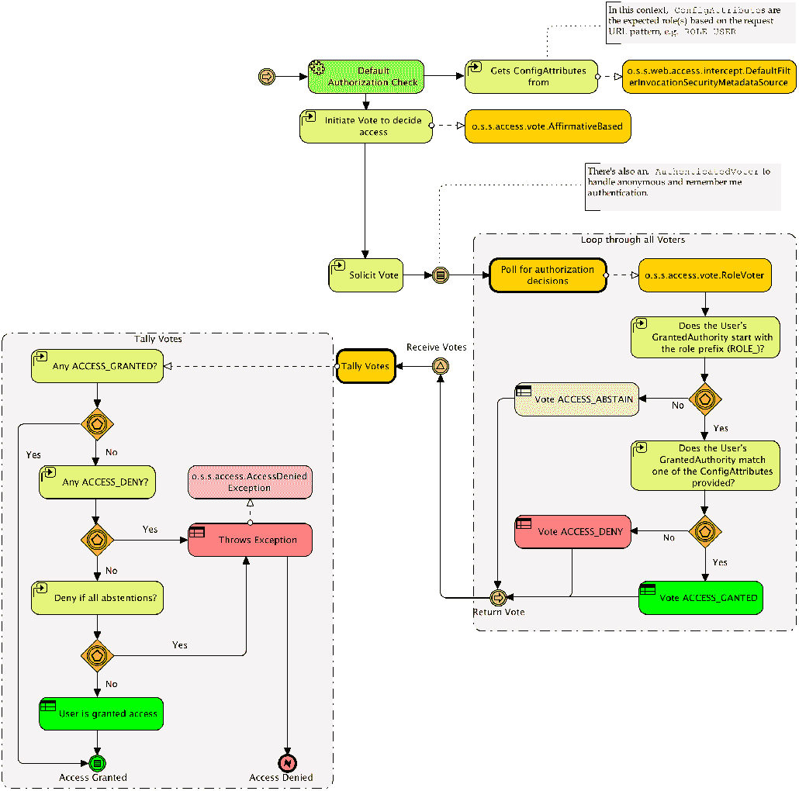
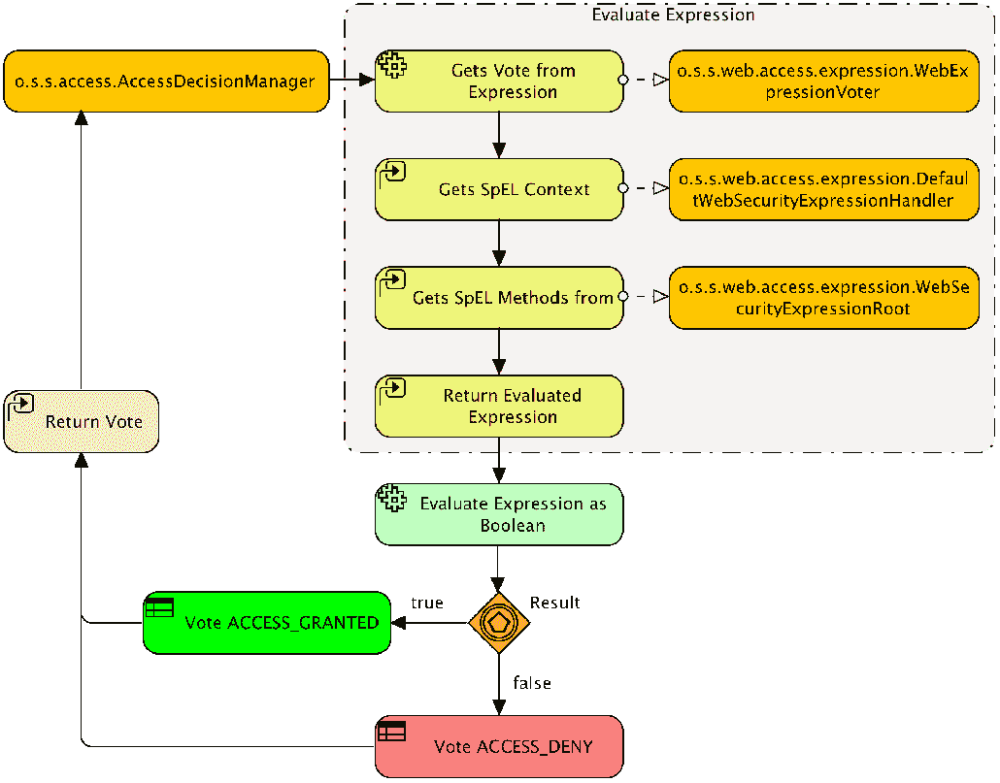
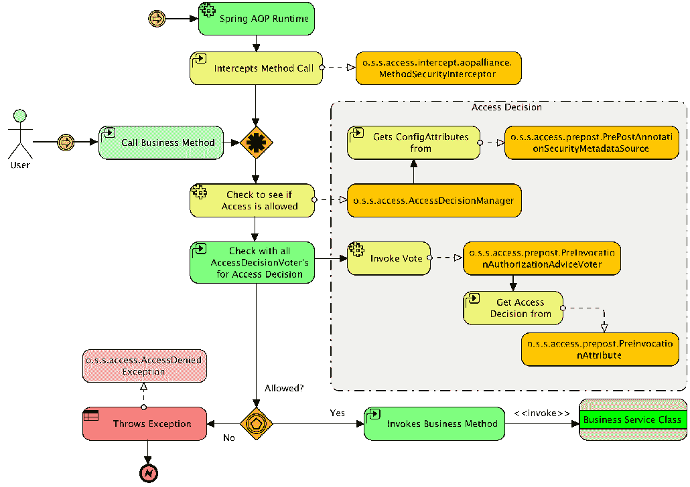
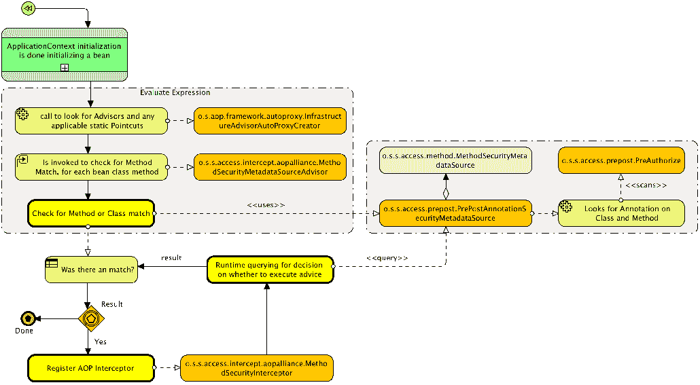

# 第十二章：自定义授权

在本章中，我们将为 Spring Security 的关键授权 API 编写一些自定义实现。一旦我们完成这些工作，我们将使用对自定义实现的理解来了解 Spring Security 的授权架构是如何工作的。

在本章中，我们将涵盖以下主题：

+   了解授权是如何工作的

+   编写一个自定义的`SecurityMetaDataSource`，而不是`antMatchers()`方法，由数据库支持。

+   创建一个自定义 SpEL 表达式

+   实现一个自定义的`PermissionEvaluator`对象，允许我们的权限被封装

# 授权请求

与认证过程一样，Spring Security 提供了一个`o.s.s.web.access.intercept.FilterSecurityInterceptor` servlet 过滤器，负责决定是否接受特定请求。在调用过滤器时，主体已经被认证，所以系统知道一个有效的用户已经登录；记住我们在第三章，自定义认证中实现了`List<GrantedAuthority> getAuthorities()`方法，该方法返回主体的一个权限列表。通常，授权过程将使用这个方法（由`Authentication`接口定义）的信息来确定，对于一个特定的请求，是否应允许该请求。

请记住，授权是一个二进制决策——用户要么有权访问受保护的资源，要么没有。在授权方面没有模棱两可。

智能面向对象设计在 Spring Security 框架中无处不在，授权决策管理也不例外。

在 Spring Security 中，`o.s.s.access.AccessDecisionManager`接口规定了两个简单且符合逻辑的方法，适合于请求的决策处理流程，如下所示：

+   `Supports`：这个逻辑操作实际上包括两个方法，允许`AccessDecisionManager`实现报告它是否支持当前请求。

+   `Decide`：这允许`AccessDecisionManager`实现基于请求上下文和安全配置来验证是否应允许访问和接受请求。实际上`Decide`方法没有返回值，而是通过抛出异常来报告请求的拒绝。

特定类型的异常可以进一步规定应用程序为解决授权决定所采取的动作。`o.s.s.access.AccessDeniedException`接口是在授权领域中最常见的异常，并通过过滤器链值得特殊处理。

`AccessDecisionManager`的实现完全可以通过标准 Spring bean 绑定和引用进行配置。默认的`AccessDecisionManager`实现提供了一个基于`AccessDecisionVoter`和投票聚合的访问授予机制。

选民是授权序列中的参与者，其任务是评估以下任何或所有内容：

+   请求受保护资源的上下文（例如，请求 IP 地址的 URL）

+   用户提交的凭证（如果有的话）

+   正在访问的受保护资源

+   系统的配置参数，以及资源本身

`AccessDecisionManager`的实现还负责将被请求资源的访问声明（在代码中表示为`o.s.s.access.ConfigAttribute`接口的实现）传递给选民。对于 Web URL，选民将了解关于资源的访问声明的信息。如果我们查看我们非常基本的配置文件的 URL 拦截声明，我们将看到`ROLE_USER`被声明为用户正在尝试访问的资源的访问配置，如下所示：

```java
    .antMatchers("/**").hasRole("USER");
```

根据选民的了解，它将决定用户是否应该有权访问资源。Spring Security 允许选民做出三种决定之一，其逻辑定义映射到接口中的常量，如下表所示：

| **决策类型** | **描述** |
| --- | --- |
| `授权 (ACCESS_GRANTED)` | 选民建议给予对资源的访问权限。 |
| `拒绝 (ACCESS_DENIED)` | 选民建议拒绝对资源的访问。 |

| `弃权 (ACCESS_ABSTAIN)` | 选民弃权（不对资源的访问做出决定）。这可能发生的原因很多，比如：

+   选民没有确凿的信息

+   选民无法对这种类型的请求做出决定

|

正如您可能从与访问决策相关的对象和接口的设计中猜测的那样，Spring Security 的这部分已经被设计为可以应用于不仅仅是 Web 领域的验证和访问控制场景。当我们在本章后面讨论方法级安全时，我们将遇到选民和访问决策管理器。

当我们将所有这些内容组合在一起时，Web 请求的默认授权检查的整体流程类似于以下图表：



我们可以看到，`ConfigAttribute`的抽象允许从配置声明中传递数据（保存在`o.s.s.web.access.intercept.DefaultFilterinvocationSecurityMetadataSource`接口中）给负责处理`ConfigAttribute`的选民，而不需要任何中介类了解`ConfigAttribute`的内容。这种关注点的分离为构建新类型的安全声明（例如我们稍后将在方法安全中看到的声明）提供了坚实的基础，同时利用相同的访问决策模式。

# 访问决策聚合的配置

Spring Security 实际上允许在安全命名空间中配置`AccessDecisionManager`。`<http>`元素上的`access-decision-manager-ref`属性允许你指定一个 Spring bean 引用，以引用`AccessDecisionManager`的实现。Spring Security 随货提供了这个接口的三个实现，全部在`o.s.s.access.vote`包中，如下所示：

| **类名** | **描述** |
| --- | --- |
| `AffirmativeBased` | 如果有任何投票者授予访问权限，则立即授予访问权限，不顾之前的拒绝。 |
| `ConsensusBased` | 由多数票（批准或拒绝）决定`AccessDecisionManager`的决策。决胜票和空票（仅包含弃权）的处理是可配置的。 |
| `UnanimousBased` | 所有投票者必须授予访问权限，否则，拒绝访问。 |

# 配置一个 UnanimousBased 访问决策管理器

如果我们想要修改我们的应用程序以使用访问决策管理器，我们需要进行两项修改。为此，我们需要在我们的`SecurityConfig.java`文件中的`http`元素中添加`accessDecisionManager`条目，如下所示：

```java
    //src/main/java/com/packtpub/springsecurity/configuration/
    SecurityConfig.java

    http.authorizeRequests()
         .anyRequest()
         .authenticated()
         .accessDecisionManager(accessDecisionManager());
```

这是一个标准的 Spring bean 引用，所以这应该对应于 bean 的`id`属性。我们然后可以定义`UnanimousBased` bean，如下面的代码片段所示。请注意，我们实际上不会在练习中使用这个配置：

```java
//src/main/java/com/packtpub/springsecurity/configuration/SecurityConfig.java

@Bean
public AccessDecisionManager accessDecisionManager() {
   List<AccessDecisionVoter<? extends Object>> decisionVoters
           = Arrays.asList(
           new AuthenticatedVoter(),
           new RoleVoter(),
           new WebExpressionVoter()
   );

   return new UnanimousBased(decisionVoters);
}
```

您可能想知道`decisionVoters`属性是关于什么。这个属性在我们声明自己的`AccessDecisionManager`之前是自动配置的。默认的`AccessDecisionManager`类需要我们声明一个投票者列表，这些投票者被咨询以做出认证决策。这里列出的两个投票者是安全命名空间配置提供的默认值。

Spring Security 没有包含多种投票者，但它实现一个新的投票者是微不足道的。正如我们将在本章后面看到的，在大多数情况下，创建自定义投票者是不必要的，因为这通常可以通过自定义表达式或甚至自定义`o.s.s.access.PermissionEvaluator`来实现。

这里提到的两个投票者实现如下：

| **类名** | **描述** | **示例** |
| --- | --- | --- |
| `o.s.s.access.vote.RoleVoter` | 检查用户具有匹配的声明角色。期望属性定义一个以逗号分隔的名称列表。前缀是期望的，但可选配置。 | `access="ROLE_USER,ROLE_ADMIN"` |

| `o.s.s.access.vote.AuthenticatedVoter` | 支持特殊声明，允许通配符匹配：

+   `IS_AUTHENTICATED_FULLY` 如果提供了新的用户名和密码，则允许访问。

+   `IS_AUTHENTICATED_REMEMBERED` 如果用户使用记住我功能进行了认证，则允许访问。

+   `IS_AUTHENTICATED_ANONYMOUSLY` 如果用户是匿名的，则允许访问

| `access="IS_AUTHENTICATED_ANONYMOUSLY"` |
| --- |

# 基于表达式的请求授权

正如您可能预期的那样，SpEL 处理由不同的`Voter`实现提供，即`o.s.s.web.access.expression.WebExpressionVoter`，它知道如何评估 SpEL 表达式。`WebExpressionVoter`类为这个目的依赖于`SecurityExpressionHandler`接口的实现。`SecurityExpressionHandler`接口负责评估表达式以及提供在表达式中被引用的安全特定方法。这个接口的默认实现暴露了定义在`o.s.s.web.access.expression.WebSecurityExpressionRoot`类中的方法。

这些类之间的流程和关系在下方的图表中显示：



既然我们知道如何请求授权工作，那么通过实现一些关键接口的几个自定义实现来巩固我们的理解吧。

# 自定义请求授权

Spring Security 授权的真正力量在于它如何适应定制化需求。让我们探索几个场景，以帮助加深对整体架构的理解。

# 动态定义 URL 的访问控制

Spring Security 为将`ConfigAttribute`对象映射到资源提供了多种方法。例如，`antMatchers()`方法确保它对开发人员来说简单易用，以便在他们 web 应用程序中限制对特定 HTTP 请求的访问。在幕后，`o.s.s.acess.SecurityMetadataSource`的实现被填充了这些映射，并查询它以确定为了被授权对任何给定的 HTTP 请求进行操作需要什么。

虽然`antMatchers()`方法非常简单，但有时可能希望提供一个自定义机制来确定 URL 映射。一个这样的例子可能是如果一个应用程序需要能够动态提供访问控制规则。让我们展示将我们的 URL 授权配置移动到数据库需要做什么。

# 配置 RequestConfigMappingService

第一步是能够从数据库中获取必要的信息。这将替换从我们的安全豆配置中读取`antMatchers()`方法的逻辑。为了实现这一点，章节示例代码中包含了`JpaRequestConfigMappingService`，它将从数据库中获取表示为`RequestConfigMapping`的 ant 模式和表达式的映射。这个相当简单的实现如下所示：

```java
    // src/main/java/com/packtpub/springsecurity/web/access/intercept/
   JpaRequestConfigMappingService.java

    @Repository("requestConfigMappingService")
    public class JpaRequestConfigMappingService
    implements RequestConfigMappingService {
       @Autowired
   private SecurityFilterMetadataRepository securityFilterMetadataRepository;

   @Autowired
   public JpaRequestConfigMappingService(
           SecurityFilterMetadataRepository sfmr
   ) {
       this.securityFilterMetadataRepository = sfmr;
   }

   @Override
   public List<RequestConfigMapping> getRequestConfigMappings() {
       List<RequestConfigMapping> rcm =
           securityFilterMetadataRepository
               .findAll()
               .stream()
               .sorted((m1, m2) -> {
               return m1.getSortOrder() - m2.getSortOrder()
               })
               .map(md -> {
                   return new RequestConfigMapping(
                            new AntPathRequestMatcher 
                             (md.getAntPattern()),
                             new SecurityConfig 
                             (md.getExpression()));
              }).collect(toList());
       return rcm;
   }
}
```

需要注意的是，就像`antMatchers()`方法一样，顺序很重要。因此，我们确保结果按`sort_order`列排序。服务创建了一个`AntRequestMatcher`，并将其关联到`SecurityConfig`，这是一个`ConfigAttribute`实例。这将为 HTTP 请求到`ConfigAttribute`对象的映射提供支持，这些对象可以被 Spring Security 用来保护我们的 URL。

我们需要创建一个域对象，以便 JPA 将其映射如下：

```java
// src/main/java/com/packtpub/springsecurity/domain/SecurityFilterMetadata.java

@Entity
@Table(name = "security_filtermetadata")
public class SecurityFilterMetadata implements Serializable {

   @Id
   @GeneratedValue(strategy = GenerationType.AUTO)
   private Integer id;
   private String antPattern;
   private String expression;
   private Integer sortOrder;

... setters / getters ...
}
```

最后，我们需要创建一个 Spring Data 仓库对象，如下所示：

```java
    // src/main/java/com/packtpub/springsecurity/repository/
    SecurityFilterMetadataRepository.java

   public interface SecurityFilterMetadataRepository
   extends JpaRepository<SecurityFilterMetadata, Integer> {}
```

为了让新服务能工作，我们需要初始化我们的数据库，包括架构和访问控制映射。和实现服务一样，我们的架构相当简单：

```java
// src/main/resources/schema.sql

...
create table security_filtermetadata (
 id         INTEGER GENERATED BY DEFAULT AS IDENTITY,
 ant_pattern VARCHAR(1024) NOT NULL unique,
 expression VARCHAR(1024) NOT NULL,
 sort_order INTEGER NOT NULL,
 PRIMARY KEY (id) 
);
```

然后我们可以使用相同的`antMatchers()`映射从我们的`SecurityConfig.java`文件来生成`schema.sql`文件：

```java
// src/main/resources/data.sql

*--* Security Filter Metadata *--* 
insert into security_filtermetadata(id,ant_pattern,expression,sort_order) values (110, '/admin/h2/**','permitAll',10);

insert into security_filtermetadata(id,ant_pattern,expression,sort_order) values (115, '/','permitAll',15);

insert into security_filtermetadata(id,ant_pattern,expression,sort_order) values (120, '/login/*','permitAll',20);

insert into security_filtermetadata(id,ant_pattern,expression,sort_order) values (140, '/logout','permitAll',30);

insert into security_filtermetadata(id,ant_pattern,expression,sort_order) values (130, '/signup/*','permitAll',40);

insert into security_filtermetadata(id,ant_pattern,expression,sort_order) values (150, '/errors/**','permitAll',50);

insert into security_filtermetadata(id,ant_pattern,expression,sort_order) values (160, '/admin/**','hasRole("ADMIN")',60);

insert into security_filtermetadata(id,ant_pattern,expression,sort_order) values (160, '/events/','hasRole("ADMIN")',60);

insert into security_filtermetadata(id,ant_pattern,expression,sort_order) values (170, '/**','hasRole("USER")',70);
```

此时，你的代码应该以`chapter13.00-calendar`开始。

# 自定义 SecurityMetadataSource 实现

为了让 Spring Security 了解我们的 URL 映射，我们需要提供一个自定义的`FilterInvocationSecurityMetadataSource`实现。`FilterInvocationSecurityMetadataSource`包扩展了`SecurityMetadataSource`接口，对于特定的 HTTP 请求，它提供了 Spring Security 确定是否应授予访问权限所需的信息。让我们看看如何利用我们的`RequestConfigMappingService`接口来实现一个`SecurityMetadataSource`接口：

```java
    //src/main/java/com/packtpub/springsecurity/web/access/intercept/
    FilterInvocationServiceSecurityMetadataSource.java

    @Component("filterInvocationServiceSecurityMetadataSource")
    public class FilterInvocationServiceSecurityMetadataSource implements
    FilterInvocationSecurityMetadataSource, InitializingBean{
           ¦ constructor and member variables omitted ...

       public Collection<ConfigAttribute> getAllConfigAttributes() {
           return this.delegate.getAllConfigAttributes();
       }

       public Collection<ConfigAttribute> getAttributes(Object object) {
           return this.delegate.getAttributes(object);
       }

       public boolean supports(Class<?> clazz) {
           return this.delegate.supports(clazz);
       }

       public void afterPropertiesSet() throws Exception {
       List<RequestConfigMapping> requestConfigMappings =
       requestConfigMappingService.getRequestConfigMappings();
       LinkedHashMap requestMap = new 
       LinkedHashMap(requestConfigMappings.size());
       for(RequestConfigMapping requestConfigMapping 
       requestConfigMappings) {
           RequestMatcher matcher = 
               requestConfigMapping.getMatcher();
           Collection<ConfigAttribute> attributes =
                   requestConfigMapping.getAttributes();
           requestMap.put(matcher,attributes);
       }
           this.delegate =
           new 
           ExpressionBasedFilterInvocationSecurityMetadataSource
          (requestMap,expressionHandler);
       }
    }
```

我们可以使用我们的`RequestConfigMappingService`接口创建一个`RequestMatcher`对象的映射到`ConfigAttribute`对象的映射。然后我们将工作委托给`ExpressionBasedFilterInvocationSecurityMetadataSource`的一个实例。为了简单起见，当前的实现将需要重新启动应用程序以获取更改。然而，通过一些小的改动，我们可以避免这种不便。

# 注册一个自定义 SecurityMetadataSource

现在，剩下要做的就是配置`FilterInvocationServiceSecurityMetadataSource`。唯一的问题是 Spring Security 不支持直接配置自定义的`FilterInvocationServiceSecurityMetadataSource`接口。这并不太难，因此我们将在`SecurityConfig`文件中用我们的`FilterSecurityInterceptor`注册这个`SecurityMetadataSource`：

```java
    // src/main/java/com/packtpub/springsecurity/configuration/
    SecurityConfig.java

   @Override
    public void configure(final WebSecurity web) throws Exception {
       ...
       final HttpSecurity http = getHttp();
       web.postBuildAction(() -> {
       FilterSecurityInterceptor fsi = http.getSharedObject
       (FilterSecurityInterceptor.class);
       fsi.setSecurityMetadataSource(metadataSource);
       web.securityInterceptor(fsi);
       });
    }
```

这设置了我们自定义的`SecurityMetadataSource`接口，将其作为默认元数据源与`FilterSecurityInterceptor`对象关联。

# 移除我们的 antMatchers()方法

现在既然数据库正在被用来映射我们的安全配置，我们可以在`SecurityConfig.java`文件中删除`antMatchers()`方法。大胆地删除它们，使得配置看起来类似于以下的代码片段：

```java
    // src/main/java/com/packtpub/springsecurity/configuration/
    SecurityConfig.java

    @Override
    protected void configure(HttpSecurity http) throws Exception {

    // No interceptor methods
    // http.authorizeRequests()
    //     .antMatchers("/").permitAll()
         ...

    http.formLogin()
         ...

    http.logout()
         ...
```

如果你使用了`http antMatchers`表达式中的任何一个，那么自定义表达式处理程序将不会被调用。

现在你应该能够启动应用程序并测试，以确保我们的 URL 已经被正确保护。我们的用户不会注意到任何区别，但我们知道现在我们的 URL 映射已经保存在数据库中了。

你的代码现在应该看起来像`chapter13.01-calendar`。

# 创建一个自定义表达式

`o.s.s.access.expression.SecurityExpresssionHandler`接口是 Spring Security 如何抽象 Spring 表达式的创建和初始化的方式。就像`SecurityMetadataSource`接口一样，有一个用于创建 web 请求表达式的实现，还有一个用于保护方法的实现。在本节中，我们将探讨如何轻松添加新表达式。

# 配置自定义 SecurityExpressionRoot

假设我们想要支持一个名为`isLocal`的自定义 web 表达式，如果主机是 localhost 则返回`true`，否则返回`false`。这个新方法可以用来为我们的 SQL 控制台提供额外的安全性，通过确保它只从部署 web 应用程序的同一台机器访问。

这是一个人为的例子，因为它不会增加任何安全益处，因为主机来自 HTTP 请求的头部。这意味着即使恶意用户请求一个外部域，他们也可以注入一个声明主机是 localhost 的头部。

所有我们见过的表达式都是可用的，因为`SecurityExpressionHandler`接口通过一个`o.s.s.access.expression.SecurityExpressionRoot`实例使它们可用。如果你打开这个对象，你会找到我们在 Spring 表达式中使用的方法和属性（即`hasRole`、`hasPermission`等），这在 web 和方法安全性中都很常见。一个子类提供了特定于 web 和方法表达式的方法。例如，`o.s.s.web.access.expression.WebSecurityExpressionRoot`为 web 请求提供了`hasIpAddress`方法。

要创建一个自定义 web `SecurityExpressionhandler`，我们首先需要创建一个定义我们的`isLocal`方法的`WebSecurityExpressionRoot`子类：

```java
    //src/main/java/com/packtpub/springsecurity/web/access/expression/
    CustomWebSecurityExpressionRoot.java

    public class CustomWebSecurityExpressionRoot extends
     WebSecurityExpressionRoot {

      public CustomWebSecurityExpressionRoot(Authentication a, 
      FilterInvocation fi) {
       super(a, fi);
       }

      public boolean isLocal() {
            return "localhost".equals(request.getServerName());
       }
   }
```

重要的是要注意`getServerName()`返回的是在`Host`头值中提供的值。这意味着恶意用户可以将不同的值注入到头中以绕过约束。然而，大多数应用服务器和代理可以强制`Host`头的值。在利用这种方法之前，请阅读适当的文档，以确保恶意用户不能注入`Host`头值以绕过这样的约束。

# 配置自定义 SecurityExpressionHandler

为了让我们的新方法变得可用，我们需要创建一个使用我们新根对象的定制`SecurityExpressionHandler`接口。这就像扩展`WebSecurityExpressionHandler`一样简单：

```java
    //src/main/java/com/packtpub/springsecurity/web/access/expression/
    CustomWebSecurityExpressionHandler.java

    @Component
    public class CustomWebSecurityExpressionHandler extends  
           DefaultWebSecurityExpressionHandler {
       private final AuthenticationTrustResolver trustResolver =
       new AuthenticationTrustResolverImpl();

       protected SecurityExpressionOperations
       createSecurityExpressionRoot(Authentication authentication, 
       FilterInvocation fi)    
    {
          WebSecurityExpressionRoot root = new 
          CustomWebSecurityExpressionRoot(authentication, fi);
           root.setPermissionEvaluator(getPermissionEvaluator());
           root.setTrustResolver(trustResolver);
           root.setRoleHierarchy(getRoleHierarchy());
         return root;
       }
    }
```

我们执行父类所做的相同步骤，只不过我们使用`CustomWebSecurityExpressionRoot`，它包含了新方法。`CustomWebSecurityExpressionRoot`成为我们 SpEL 表达式的根。

有关详细信息，请参阅 Spring 参考文档中的 SpEL 文档：[`static.springsource.org/spring/docs/current/spring-framework-reference/html/expressions.html`](http://static.springsource.org/spring/docs/current/spring-framework-reference/html/expressions.html)。

# 配置和使用 CustomWebSecurityExpressionHandler

让我们来看看配置`CustomWebSecurityExpressionHandler`的以下步骤：

1.  我们现在需要配置`CustomWebSecurityExpressionHandler`。幸运的是，这可以通过使用 Spring Security 命名空间配置支持很容易地完成。在`SecurityConfig.java`文件中添加以下配置：

```java
    // src/main/java/com/packtpub/springsecurity/configuration/
    SecurityConfig.java

    http.authorizeRequests()
       .expressionHandler(customWebSecurityExpressionHandler);
```

1.  现在，让我们更新我们的初始化 SQL 查询以使用新的表达式。更新`data.sql`文件，要求用户为`ROLE_ADMIN`，并且请求来自本地机器。你会注意到，由于 SpEL 支持 Java Bean 约定，我们能够写本地而不是`isLocal`：

```java
       // src/main/resources/data.sql

      insert into security_filtermetadata(id,ant_pattern,expression,sort_order) 
      values (160, '/admin/**','local and hasRole("ADMIN")',60);
```

1.  重新启动应用程序，使用`localhost:8443/admin/h2`和`admin1@example.com/admin1`访问 H2 控制台，以查看管理控制台。如果使用`127.0.0.1:8443/admin/h2`和`admin1@example.com admin1`访问 H2 控制台，将显示访问被拒绝的页面。

你的代码应该看起来像`chapter13.02-calendar`。

# CustomWebSecurityExpressionHandler 的替代方案

使用自定义表达式而不是`CustomWebSecurityExpressionHandler`接口的另一种方法是在 web 上添加一个`@Component`，如下所示：

```java
    // src/main/java/com/packtpub/springsecurity/web/access/expression/
    CustomWebExpression.java

    @Component
     public class CustomWebExpression {
       public boolean isLocal(Authentication authentication,
                          HttpServletRequest request) {
       return "localhost".equals(request.getServerName());
   }
}
```

现在，让我们更新我们的初始化 SQL 查询，以使用新的表达式。你会注意到，由于 SpEL 支持 Java Bean 约定，我们能够直接引用`@Component`：

```java
// src/main/resources/data.sql

insert into security_filtermetadata(id,ant_pattern,expression,sort_order) values (160, '/admin/**','@customWebExpression.isLocal(authentication, request) and hasRole("ADMIN")',60);
```

# 方法安全性是如何工作的？

方法安全性的访问决策机制-是否允许给定请求-与 web 请求访问的访问决策逻辑概念上是相同的。`AccessDecisionManager`轮询一组`AccessDecisionVoters`，每个都可以提供允许或拒绝访问的决定，或者弃权。`AccessDecisionManager`的具体实现聚合了投票者的决定，并得出一个总体的决定来允许方法调用。

由于 servlet 过滤器的可用性使得拦截（以及总结拒绝）可安全请求相对简单，web 请求访问决策过程较为简单。由于方法调用可以来自任何地方，包括 Spring Security 没有直接配置的代码区域，Spring Security 设计者选择使用 Spring 管理的 AOP 方法来识别、评估和保护方法调用。

以下高级流程图展示了在方法调用授权决策中涉及的主要参与者：



我们可以看到，Spring Security 的`o.s.s.access.intercept.aopalliance.MethodSecurityInterceptor`被标准的 Spring AOP 运行时调用，以拦截感兴趣的方法调用。从这里，是否允许一个方法调用的逻辑相对直接，如之前的流程图所示。

在这个阶段，我们可能会对方法安全特性性能感到好奇。显然，`MethodSecurityInterceptor`不能为应用程序中的每个方法调用都进行调用——那么方法或类上的注解是如何导致 AOP 拦截的呢？

首先，默认情况下，AOP 代理不会为所有 Spring 管理的 bean 调用。相反，如果 Spring Security 配置中定义了`@EnableGlobalMethodSecurity`，将注册一个标准的 Spring AOP `o.s.beans.factory.config.BeanPostProcessor`，该处理器将内省 AOP 配置，以查看是否有任何 AOP 顾问指示需要代理（及拦截）。这个工作流程是标准的 Spring AOP 处理（称为 AOP 自动代理），本质上并没有任何特定于 Spring Security 的功能。所有注册的`BeanPostProcessor`在 spring `ApplicationContext`初始化之后运行，此时 Spring bean 配置已经完成。

AOP 自动代理功能查询所有注册的`PointcutAdvisor`，以查看是否有关键的 AOP 切点可以解析应该应用 AOP 建议的方法调用。Spring Security 实现了`o.s.s.access.intercept.aopalliance.MethodSecurityMetadataSourceAdvisor`类，该类检查所有配置的方法安全，并设置适当的 AOP 拦截。请注意，只有声明了方法安全规则的接口或类才会被 AOP 代理！

请注意，强烈建议您在接口上声明 AOP 规则（和其他安全注解），而不是在实现类上。虽然使用 CGLIB 代理与 Spring 可用，但使用类可能会意外地改变应用程序的行为，并且从语义上讲，使用 AOP 在接口上声明安全（比在类上）通常更正确。`MethodSecurityMetadataSourceAdvisor`将决定影响方法的建议委托给一个`o.s.s.access.method.MethodSecurityMetadataSource`实例。每种方法安全注解都有自己的`MethodSecurityMetadataSource`实现，该实现用于依次内省每个方法和类，并添加在运行时执行的 AOP 建议。

以下图表展示了这一过程是如何发生的：



根据您应用程序中配置的 Spring bean 数量，以及您拥有的受保护方法注解的数量，添加方法安全代理可能会增加初始化 ApplicationContext 所需的时间。然而，一旦 Spring 上下文初始化完成，对个别代理 bean 的性能影响可以忽略不计。

既然我们已经了解了如何使用 AOP 将 Spring Security 应用于实际场景，那么接下来让我们通过创建一个自定义`PermissionEvaluator`来加深对 Spring Security 授权的理解。

# 创建自定义 PermissionEvaluator

在上一章中，我们展示了如何使用 Spring Security 内置的`PermissionEvaluator`实现，`AclPermissionEvaluator`，来限制对应用程序的访问。虽然这个实现很强大，但很多时候可能会比必要的更复杂。我们还发现 SpEL 可以制定复杂的表达式来保护我们的应用程序。虽然简单，使用复杂表达式的一个缺点是逻辑不集中。幸运的是，我们可以很容易地创建一个自定义`PermissionEvaluator`，它能够集中我们的授权逻辑，同时避免使用 ACLs 的复杂性。

# 日历权限评估器

下面是一个不包含任何验证的我们自定义`PermissionEvaluator`的简化版本：

```java
//src/main/java/com/packtpub/springsecurity/access/CalendarPermissionEvaluator.java

public final class CalendarPermissionEvaluator implements PermissionEvaluator {
   private final EventDao eventDao;

   public CalendarPermissionEvaluator(EventDao eventDao) {
       this.eventDao = eventDao;
   }

   public boolean hasPermission(Authentication authentication, Object 
   targetDomainObject, Object permission) {
       // should do instanceof check since could be any domain object
       return hasPermission(authentication, (Event) targetDomainObject, permission);
   }

   public boolean hasPermission(Authentication authentication, 
   Serializable targetId, String targetType,
           Object permission) {
       // missing validation and checking of the targetType
       Event event = eventDao.getEvent((Integer)targetId);
       return hasPermission(authentication, event, permission);
   }

   private boolean hasPermission(Authentication authentication, 
   Event event, Object permission) {
       if(event == null) {
           return true;
       }
       String currentUserEmail = authentication.getName();
       String ownerEmail = extractEmail(event.getOwner());
       if("write".equals(permission)) {
           return currentUserEmail.equals(ownerEmail);
       } else if("read".equals(permission)) {
           String attendeeEmail = 
           extractEmail(event.getAttendee());
           return currentUserEmail.equals(attendeeEmail) || 
           currentUserEmail.equals(ownerEmail);
       }
       throw new IllegalArgumentException("permission 
       "+permission+" is not supported.");
   }

   private String extractEmail(CalendarUser user) {
       if(user == null) {
           return null;
       }
       return user.getEmail();
   }
}
```

这个逻辑与我们已经使用的 Spring 表达式相当相似，不同之处在于它区分了读取和写入权限。如果当前用户的用户名与`Event`对象的拥有者邮箱匹配，那么授予读取和写入权限。如果当前用户的邮箱与参与者邮箱匹配，则授予读取权限。否则，拒绝访问。

需要注意的是，对于每个领域对象，都会使用一个单独的`PermissionEvaluator`。因此，在现实世界中，我们必须首先进行`instanceof`检查。例如，如果我们还希望保护我们的`CalendarUser`对象，这些对象可以传递给这个相同的实例。关于这些小改动的完整示例，请参考书中包含的示例代码。

# 配置 CalendarPermissionEvaluator

然后，我们可以利用本书提供的`CustomAuthorizationConfig.java`配置，提供一个使用我们的`CalendarPermissionEvaluator`的`ExpressionHandler`，如下所示：

```java
 //src/main/java/com/packtpub/springsecurity/configuration/
 CustomAuthorizationConfig.java

@Bean
public DefaultMethodSecurityExpressionHandler defaultExpressionHandler(EventDao eventDao){
   DefaultMethodSecurityExpressionHandler deh = new DefaultMethodSecurityExpressionHandler();
   deh.setPermissionEvaluator(
           new CalendarPermissionEvaluator(eventDao));
   return deh;
}
```

配置应该类似于第十二章的配置，*访问控制列表*，不同之处在于我们现在使用的是我们的`CalendarPermissionEvaluator`类，而不是`AclPermissionEvaluator`。

接下来，我们在`SecurityConfig.java`中添加以下配置，通知 Spring Security 使用我们的自定义`ExpressionHandler`。

```java
    //src/main/java/com/packtpub/springsecurity/configuration/SecurityConfig.java
    http.authorizeRequests().expressionHandler
    (customWebSecurityExpressionHandler);
```

在配置中，我们确保`prePostEnabled`被启用，并将配置指向我们的`ExpressionHandler`定义。再次强调，配置应该与第十一章的配置非常相似，*细粒度访问控制*。

# 保护我们的 CalendarService

最后，我们可以用`@PostAuthorize`注解来保护我们的`CalendarService getEvent(int eventId)`方法。你会注意到这一步与我们在第一章中的操作完全相同，*不安全应用程序的剖析*，我们只是改变了`PermissionEvaluator`的实现：

```java
    //src/main/java/com/packtpub/springsecurity/service/CalendarService.java

    @PostAuthorize("hasPermission(returnObject,'read')")
    Event getEvent(int eventId);
```

如果你还没有这么做，重新启动应用程序，以用户名/密码`admin1@example.com/admin1`登录，并使用欢迎页面上的链接访问电话会议事件(`events/101`)。将显示访问被拒绝的页面。然而，我们希望能够像`ROLE_ADMIN`用户一样访问所有事件。

# 自定义 PermissionEvaluator 的好处

只有一个方法被保护，更新注解以检查用户是否有`ROLE_ADMIN`角色或权限将是微不足道的。然而，如果我们保护了所有使用事件的我们的服务方法，这将会变得非常繁琐。相反，我们只需更新我们的`CalendarPermissionEvaluator`。做出以下更改：

```java
private boolean hasPermission(Authentication authentication, Event event, Object permission) {
   if(event == null) {
       return true;
   }
   GrantedAuthority adminRole =
           new SimpleGrantedAuthority("ROLE_ADMIN");
   if(authentication.getAuthorities().contains(adminRole)) {
       return true;
   }
   ...
}
```

现在，重新启动应用程序并重复前面的练习。这次，电话会议事件将成功显示。你可以看到，将我们的授权逻辑封装起来可以非常有用。然而，有时扩展表达式本身可能是有用的。

你的代码应该看起来像`chapter13.03-calendar`。

# 摘要

阅读本章后，你应该对 Spring Security 如何为 HTTP 请求和方法工作有一个坚实的基础。有了这个知识，以及提供的具体示例，你也应该知道如何扩展授权以满足你的需求。特别是，在本章中，我们介绍了 Spring Security 的 HTTP 请求和方法的授权架构。我们还展示了如何从数据库配置受保护的 URL。

我们还看到了如何创建一个自定义`PermissionEvaluator`对象和自定义 Spring Security 表达式。

在下一章中，我们将探讨 Spring Security 如何进行会话管理。我们还将了解如何使用它来限制对我们应用程序的访问。
