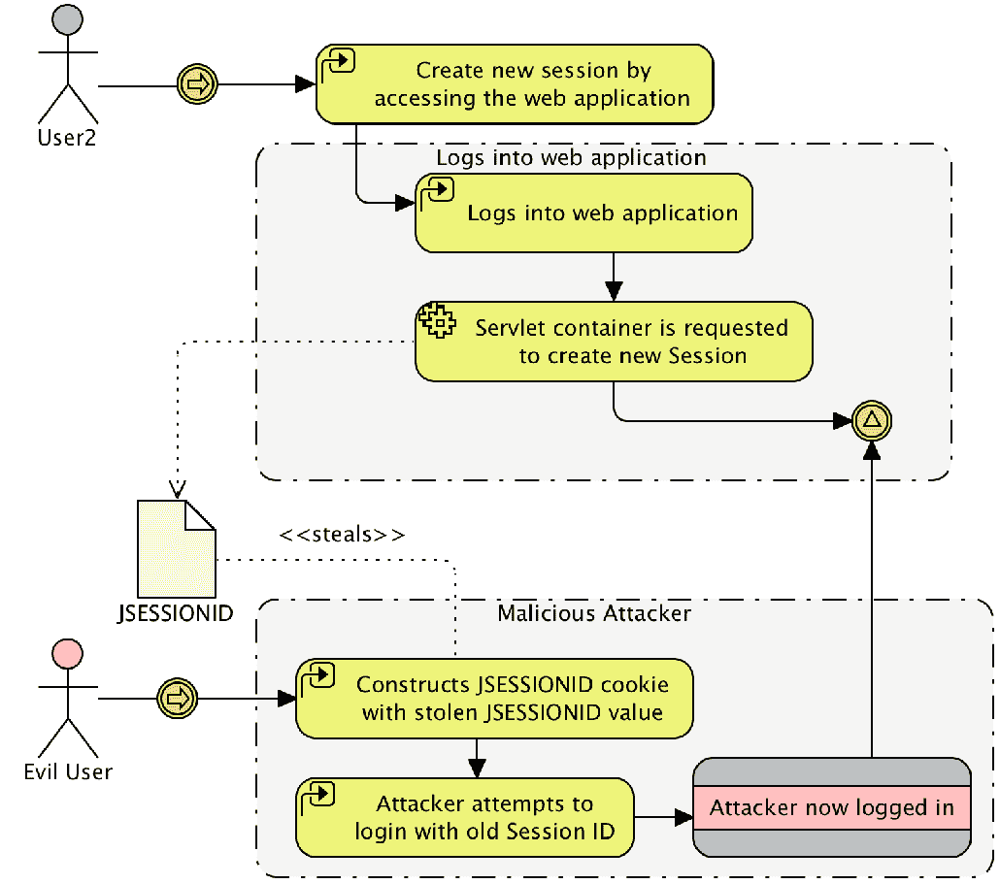
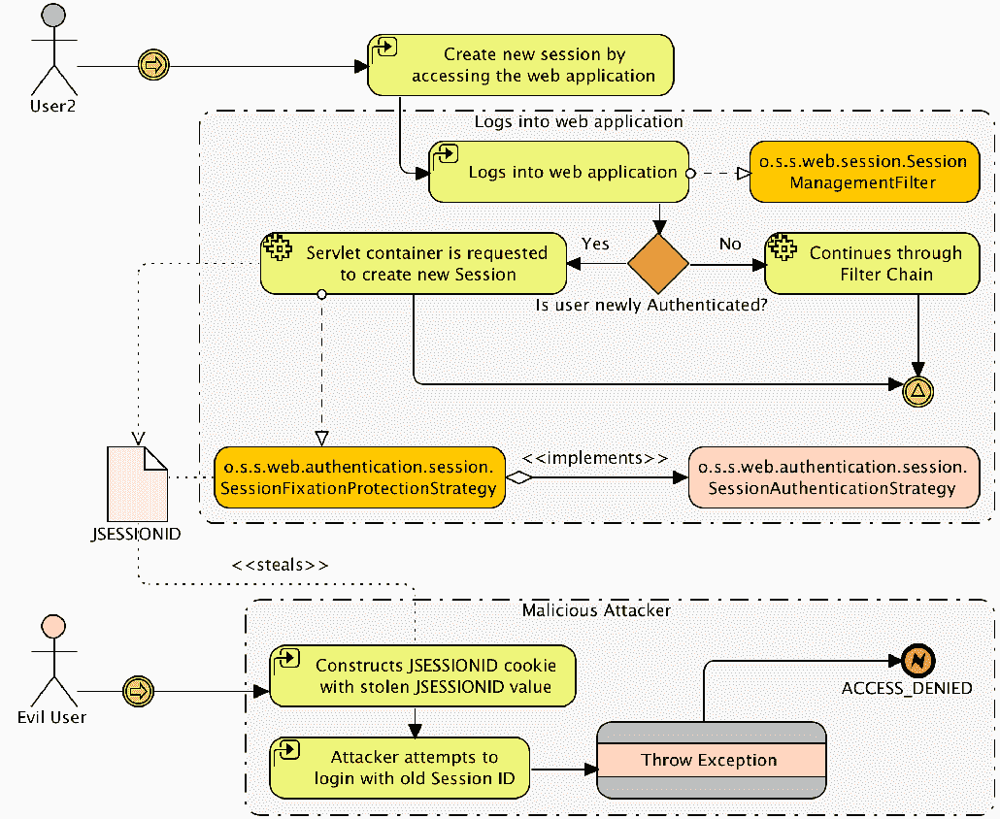
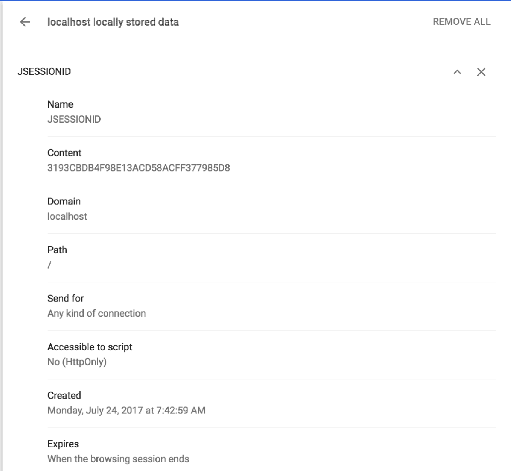
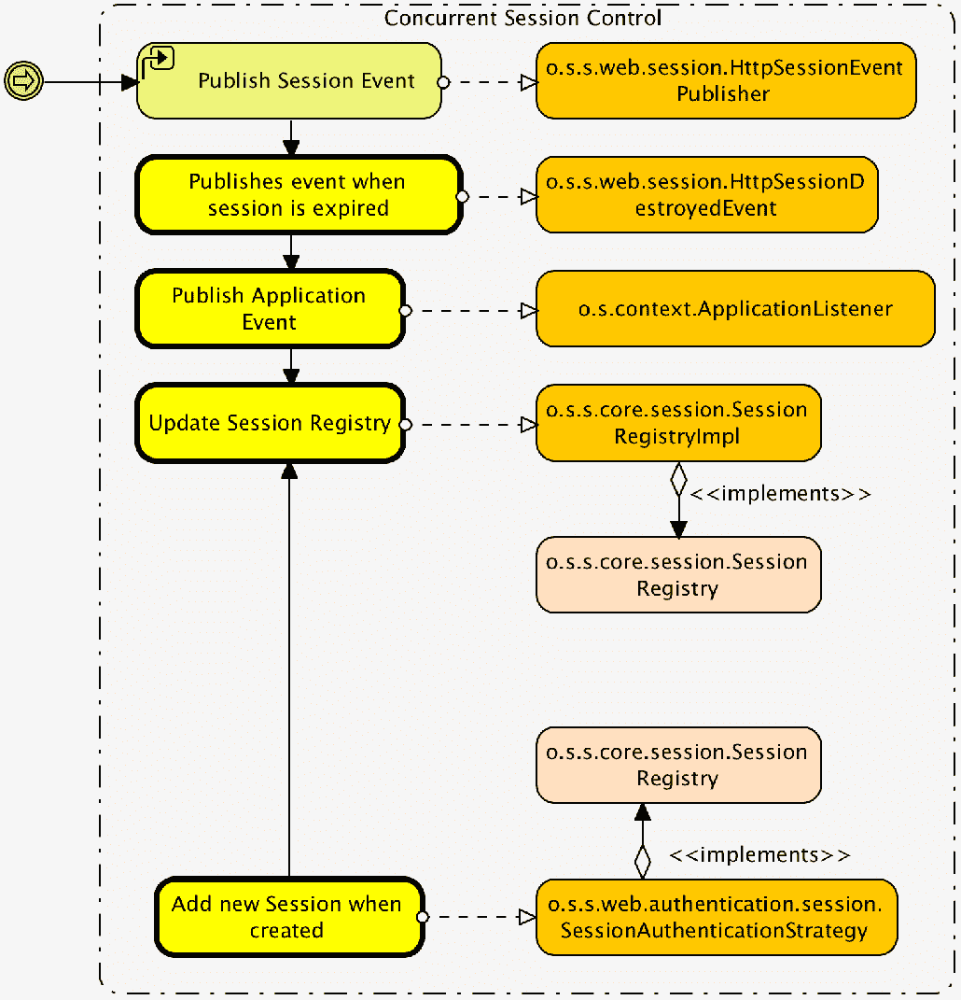
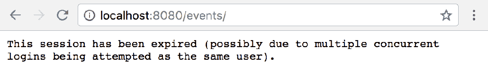
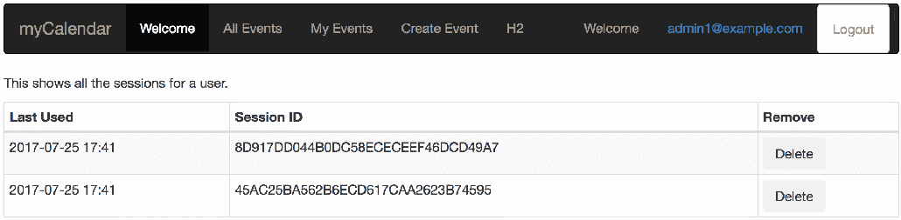
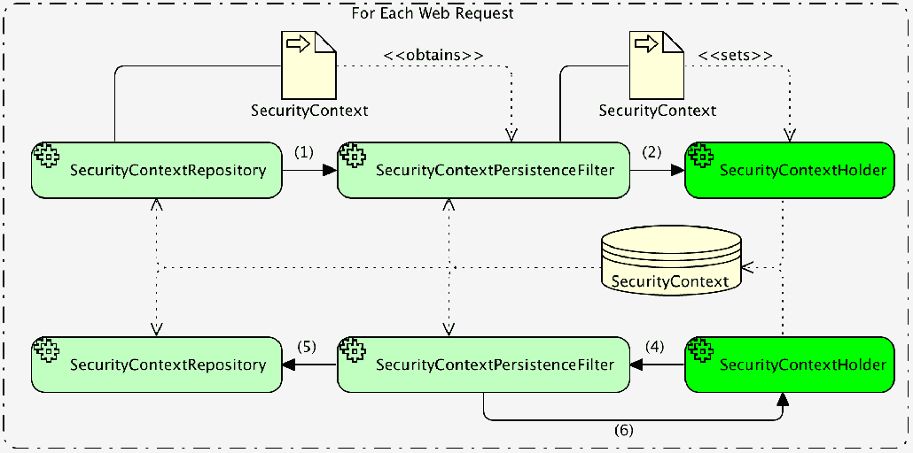

# 第十三章：会话管理

本章讨论 Spring Security 的会话管理功能。它从举例说明 Spring Security 如何防御会话固定开始。然后我们将讨论并发控制如何被利用来限制按用户许可的软件的访问。我们还将看到会话管理如何被利用进行管理功能。最后，我们将探讨`HttpSession`在 Spring Security 中的使用以及我们如何控制其创建。

以下是在本章中将会讨论的主题列表：

+   会话管理/会话固定

+   并发控制

+   管理已登录用户

+   如何使用`HttpSession`在 Spring Security 中以及如何控制其创建

+   如何使用`DebugFilter`类发现`HttpSession`的创建位置

# 配置会话固定保护

因为我们正在使用配置命名空间的风格，会话固定保护已经为我们配置好了。如果我们想要显式配置它以反映默认设置，我们会这样做：

```java
    http.sessionManagement()
    .sessionFixation().migrateSession();
```

**会话固定保护**是框架的一个特性，除非你试图充当恶意用户，否则你很可能会注意到它。我们将向你展示如何模拟一个会话窃取攻击；在我们这样做之前，了解会话固定做什么以及它防止的攻击类型是很重要的。

# 理解会话固定攻击

会话固定是一种攻击方式，恶意用户试图窃取系统的未经验证用户的会话。这可以通过使用各种技术来完成，这些技术使攻击者获得用户的唯一会话标识（例如，`JSESSIONID`）。如果攻击者创建一个包含用户`JSESSIONID`标识的 cookie 或 URL 参数，他们就可以访问用户的会话。

尽管这显然是一个问题，但通常情况下，如果一个用户未经验证，他们还没有输入任何敏感信息。如果用户验证后仍然使用相同的会话标识，这个问题变得更加严重。如果验证后仍然使用相同的标识，攻击者可能现在甚至不需要知道用户的用户名或密码就能访问到验证用户的会话！

到此为止，你可能会不屑一顾，认为这在现实世界中极不可能发生。实际上，会话窃取攻击经常发生。我们建议你花些时间阅读一下由**开放网络应用安全项目**（**OWASP**）组织发布的关于这个主题的非常有益的文章和案例研究([`www.owasp.org/`](http://www.owasp.org/)）。特别是，你可能想要阅读 OWASP top 10 列表。攻击者和恶意用户是真实存在的，如果你不了解他们常用的技术，也不知道如何避免它们，他们可能会对你用户、应用程序或公司造成真正的损害。

以下图表说明了会话固定攻击是如何工作的：



既然我们已经了解了这种攻击是如何工作的，我们将看看 Spring Security 能做些什么来防止它。

# 使用 Spring Security 预防会话固定攻击

如果我们能够防止用户在认证前拥有的相同会话在认证后被使用，我们就可以有效地使攻击者对会话 ID 的了解变得无用。Spring Security 会话固定保护通过在用户认证时明确创建新会话并使他们的旧会话失效来解决此问题。

让我们来看一下以下的图表：



我们可以看到一个新的过滤器`o.s.s.web.session.SessionManagementFilter`负责评估特定用户是否新认证。如果用户是新的认证，一个配置的`o.s.s.web.authentication.session.SessionAuthenticationStrategy`接口决定了要做什么。`o.s.s.web.authentication.session.SessionFixationProtectionStrategy`将创建一个新会话（如果用户已经有一个），并将现有会话的内容复制到新会话中。这就差不多结束了——看起来很简单。然而，正如我们之前看到的图表所示，它有效地阻止了恶意用户在未知用户认证后重新使用会话 ID。

# 模拟会话固定攻击

此时，你可能想了解模拟会话固定攻击涉及什么：

1.  你首先需要在`SecurityConfig.java`文件中禁用会话固定保护，通过将`sessionManagement()`方法作为`http`元素的子项添加。

你应该从`chapter14.00-calendar`的代码开始。

让我们来看一下以下的代码片段：

```java
    //src/main/java/com/packtpub/springsecurity/configuration/
    SecurityConfig.java

    http.sessionManagement().sessionFixation().none();
```

你的代码现在应该看起来像`chapter14.01-calendar`。

1.  接下来，你需要打开两个浏览器。我们将在 Google Chrome 中初始化会话，从中窃取它，然后我们的攻击者将在 Firefox 中使用窃取的会话登录。我们将使用 Google Chrome 和 Firefox 的 Web 开发者插件来查看和操作 Cookie。Firefox 的 Web 开发者插件可以从[`addons.mozilla.org/en-US/firefox/addon/web-developer/`](https://addons.mozilla.org/en-US/firefox/addon/web-developer/)下载。Google Chrome 的 Web 开发者工具是内置的。

1.  在 Google Chrome 中打开 JBCP 日历主页。

1.  接下来，从主菜单中，导航到编辑 | 首选项 | 底层设置。在隐私类别下，点击内容设置...按钮。接下来，在 Cookie 设置中，点击所有 Cookie 和站点数据...按钮。最后，在搜索框中输入`localhost`，如下所示：



1.  选择 `JSESSIONID` cookie，将内容值复制到剪贴板，并登录 JBCP 日历应用程序。如果您重复查看 Cookie 信息命令，您会发现您登录后 `JSESSIONID` 没有改变，使您容易受到会话固定攻击！

1.  在 Firefox 中，打开 JBCP 日历网站。您会被分配一个会话 cookie，您可以通过按 *Ctrl* + *F2* 打开底部的 Cookie 控制台来查看，然后输入 `cookie list [enter]` 以显示当前页面的 cookie。

1.  为了完成我们的黑客攻击，我们将点击编辑 Cookie 选项，并粘贴我们从 Google Chrome 复制到剪贴板的 `JSESSIONID` cookie，如下图所示：


1.  请记住，最新版本的 Firefox 也包括网络开发者工具。但是，您需要确保您使用的是扩展程序，而不是内置的，因为它提供了额外的功能。

我们的会话固定黑客攻击完成了！如果您现在在 Firefox 中重新加载页面，您将看到您以使用 Google Chrome 登录的同一用户身份登录，但不知道用户名和密码。您担心恶意用户了吗？

现在，重新启用会话固定保护并再次尝试此练习。您将看到，在这种情况下，用户登录后 `JSESSIONID` 发生了变化。根据我们对会话固定攻击发生方式的理解，这意味着我们已将不知情的用户成为这种攻击受害者的可能性降低。干得好！

谨慎的开发人员应该注意，窃取会话 cookie 有很多方法，其中一些（如 XSS）可能会使即使启用了会话固定保护的网站也变得脆弱。请咨询 OWASP 网站，以获取有关预防这类攻击的额外资源。

# 比较会话固定保护选项

`session-fixation-protection` 属性的以下三个选项允许您更改其行为，如下所示：

| **属性值** | **描述** |
| --- | --- |
| `none()` | 此选项禁用会话固定保护（除非其他 `sessionManagement()` 属性非默认），并且不配置 `SessionManagementFilter`。 |
| `migrateSession()` | 当用户认证并分配新会话时，确保将旧会话的所有属性移动到新会话。 |
| `newSession()` | 当用户认证成功后，将创建一个新会话，不会迁移旧会话（未认证）的任何属性。 |

在大多数情况下，`migrateSession()` 的默认行为对于希望在用户认证后保留用户会话重要属性（如点击兴趣和购物车）的网站将是适当的。

# 限制每个用户的并发会话数

在软件行业，软件通常按用户数出售。这意味着，作为软件开发者，我们有兴趣确保每个用户只存在一个会话，以防止账户共享。Spring Security 的并发会话控制确保单一用户不能同时拥有超过固定数量的活跃会话（通常是 1 个）。确保这个最大限制得到执行涉及几个组件协同工作，以准确追踪用户会话活动的变化。

让我们配置这个特性，回顾一下它如何工作，然后测试它！

# 配置并发会话控制

既然我们已经理解了并发会话控制中涉及的不同组件，那么设置它应该更有意义。让我们查看以下步骤来配置并发会话控制：

1.  首先，你按照如下方式更新你的`security.xml`文件：

```java
        // src/main/java/com/packtpub/springsecurity/configuration/
        SecurityConfig.java

        http.sessionManagement().maximumSessions(1)
```

1.  接下来，我们需要在`SecurityConfig.java`部署描述符中启用`o.s.s.web.session.HttpSessionEventPublisher`，以便 Servlet 容器将通过`HttpSessionEventPublisher`通知 Spring Security 关于会话生命周期事件，如下所示：

```java
        // src/main/java/com/packtpub/springsecurity/configuration/ 
        SecurityConfig.java

        @Bean
        public HttpSessionEventPublisher httpSessionEventPublisher() {
            return new HttpSessionEventPublisher();
        }
```

有了这两个配置项，并发会话控制现在将被激活。让我们看看它实际做了什么，然后我们将展示如何测试它。

# 理解并发会话控制

并发会话控制使用`o.s.s.core.session.SessionRegistry`来维护一个活跃 HTTP 会话列表以及与之关联的认证用户。当会话被创建和过期时，注册表会根据`HttpSessionEventPublisher`发布的会话生命周期事件实时更新，以跟踪每个认证用户的活跃会话数量。

请参考以下图表：



`SessionAuthenticationStrategy`的扩展`o.s.s.web.authentication.session.ConcurrentSessionControlStrategy`是跟踪新会话和实施并发控制的方法。每当用户访问受保护的网站时，`SessionManagementFilter`用来检查活跃会话与`SessionRegistry`。如果用户的活跃会话不在`SessionRegistry`跟踪的活跃会话列表中，那么最不常使用的会话将被立即过期。

修改后的并发会话控制过滤器链中的第二个参与者是`o.s.s.web.session.ConcurrentSessionFilter`。此过滤器将识别已过期的会话（通常是已被 Servlet 容器过期或被`ConcurrentSessionControlStrategy`接口强制过期的会话）并通知用户他们的会话已过期。

既然我们已经理解了并发会话控制是如何工作的，那么复现一个实施该控制的情景应该对我们来说很容易。

你的代码现在应该看起来像`chapter14.02-calendar`。

# 测试并发会话控制

正如我们在验证会话固定保护时所做的那样，我们需要通过执行以下步骤来访问两个网络浏览器：

1.  在 Google Chrome 中，以`user1@example.com/user1`的身份登录网站。

1.  现在，在 Firefox 中，以同一用户身份登录网站。

1.  最后，回到 Google Chrome 中执行任何操作。你会看到一个指示你的会话已过期的消息，如下面的屏幕截图所示：



如果你在使用这个应用程序时收到这条消息，你可能会感到困惑。这是因为显然这并不是一种友好的方式，用来通知一次只能有一个用户访问应用程序。然而，它确实说明会话已被软件强制过期。

并发会话控制对于新接触 Spring Security 的用户来说通常是一个很难理解的概念。许多用户试图在不真正理解它如何工作以及它的好处的情况下实现它。如果你正在尝试启用这个强大的功能，但它似乎并没有像你期望的那样工作，请确保你已经正确配置了所有内容，然后回顾本节中的理论解释-希望它们能帮助你理解可能出错了什么！

当会话过期事件发生时，我们可能需要将用户重定向到登录页面，并给他们一个消息来指出出了什么问题。

# 配置过期会话重定向

幸运的是，有一个简单的方法可以将用户重定向到一个友好的页面（通常是登录页面），当他们在并发会话控制中被标记时-只需指定`expired-url`属性，并将其设置为应用程序中的有效页面。如下更新你的`security.xml`文件：

```java
    //src/main/java/com/packtpub/springsecurity/configuration/SecurityConfig.java

    http.sessionManagement()
    .maximumSessions(1)
 .expiredUrl("/login/form?expired")    ;
```

在我们的应用程序的情况下，这将把用户重定向到标准的登录表单。然后我们将使用查询参数来显示一个友好的消息，表明我们确定他们有多个活动会话，应该重新登录。更新你的`login.html`页面，使用此参数来显示我们的消息：

```java
    //src/main/resources/templates/login.html

    ...
    <div th:if="${param.expired != null}" class="alert alert-success">
    <strong>Session Expired</strong>
   <span>You have been forcibly logged out due to multiplesessions 
   on the same account (only one activesession per user is allowed).</span>
   </div>
    <label for="username">Username</label>
```

然后尝试通过在 Google Chrome 和 Firefox 中分别以`admin1@example.com`/`admin1`的身份登录用户。这次，你应该会看到一个带有自定义错误消息的登录页面。

你的代码现在应该看起来像`chapter14.03-calendar`。

# 并发控制常见问题

登录同一用户时不会触发登出事件的原因有几个。第一个原因是在使用自定义`UserDetails`（如我们在第三章，*自定义认证*中做的那样）时，而`equals`和`hashCode`方法没有得到正确实现。这是因为默认的`SessionRegistry`实现使用内存映射来存储`UserDetails`。为了解决这个问题，你必须确保你已经正确实现了`hashCode`和 equals 方法。

第二个问题发生在重启应用程序容器时，而用户会话被持久化到磁盘上。当容器重新启动后，已经使用有效会话登录的用户将登录。然而，用于确定用户是否已经登录的`SessionRegistry`内存映射将会是空的。这意味着 Spring Security 会报告用户没有登录，尽管用户实际上已经登录了。为了解决这个问题，需要一个自定义的`SessionRegistry`，同时禁用容器内的会话持久化，或者你必须实现一个特定于容器的解决方案，以确保在启动时将持久化的会话填充到内存映射中。

另一个原因是，在撰写本文时，对于记住我功能还没有实现并发控制。如果用户使用记住我功能进行身份验证，那么这种并发控制将不会被强制执行。有一个 JIRA 问题是用来实现这个功能的，如果你的应用程序需要记住我功能和并发控制，那么请参考它以获取任何更新：[`jira.springsource.org/browse/SEC-2028`](https://jira.springsource.org/browse/SEC-2028)。

我们将要讨论的最后一个常见原因是，在默认的`SessionRegistry`实现下，并发控制在集群环境中将无法工作。如前所述，默认实现使用一个内存映射。这意味着如果`user1`登录到应用程序服务器 A，他们登录的事实将与该服务器相关联。因此，如果`user1`然后认证到应用程序服务器 B，之前关联的认证对应用程序服务器 B 来说是未知的。

# 阻止认证，而不是强制登出

Spring Security 还可以阻止用户如果已经有一个会话的情况下登录到应用程序。这意味着，Spring Security 不是强制原始用户登出，而是阻止第二个用户登录。配置更改如下所示：

```java
    //src/main/java/com/packtpub/springsecurity/configuration/SecurityConfig.java

    http.sessionManagement()
    .maximumSessions(1)
    .expiredUrl("/login/form?expired")
 .maxSessionsPreventsLogin(true);
```

进行更新后，使用 Google Chrome 登录日历应用程序。现在，尝试使用相同的用户名尝试使用 Firefox 登录日历应用程序。你应该会看到我们自定义的错误信息，来自我们的`login.html`文件。

你的代码现在应该看起来像`chapter14.04-calendar`。

这种方法的缺点可能不经过深思熟虑不容易看出。试着在不登出的情况下关闭 Google Chrome，然后再次打开它。现在，尝试再次登录应用程序。你会观察到无法登录。这是因为当浏览器关闭时，`JSESSIONID` cookie 被删除。然而，应用程序并不知道这一点，所以用户仍然被认为是认证的。你可以把这看作是一种内存泄漏，因为`HttpSession`仍然存在，但是没有指向它（`JSESSIONID` cookie 已经消失了）。直到会话超时，我们的用户才能再次认证。幸运的是，一旦会话超时，我们的`SessionEventPublisher`接口将把用户从我们的`SessionRegistry`接口中移除。我们从这一点可以得出的结论是，如果用户忘记登出并关闭浏览器，他们将无法再次登录应用程序，直到会话超时。

就像在第七章 *记住我服务* 中一样，这个实验如果浏览器在关闭后决定记住一个会话，可能就不会工作。通常，如果插件或浏览器被配置为恢复会话，这种情况会发生。在这种情况下，你可能想手动删除`JSESSIONID` cookie 来模拟浏览器被关闭。

# 并发会话控制的其他好处

并发会话控制的一个好处是`SessionRegistry`存在用以跟踪活动（可选地，已过期）会话。这意味着我们可以通过执行以下步骤来获取关于我们系统中的用户活动（至少是认证用户）的运行时信息：

1.  即使你不想启用并发会话控制，你也可以这样做。只需将`maximumSessions`设置为`-1`，会话跟踪将保持启用，尽管不会强制执行最大值。相反，我们将使用本章`SessionConfig.java`文件中提供的显式 bean 配置，如下所示：

```java
        //src/main/java/com/packtpub/springsecurity/configuration/
        SessionConfig.java

        @Bean
        public SessionRegistry sessionRegistry(){
         return new SessionRegistryImpl();
        }
```

1.  我们已经将`SessionConfig.java`文件的导入添加到了`SecurityConfig.java`文件中。所以，我们只需要在我们的`SecurityConfig.java`文件中引用自定义配置。用以下代码片段替换当前的`sessionManagement`和`maximumSessions`配置：

```java
        //src/main/java/com/packtpub/springsecurity/configuration/
        SecurityConfig.java

        http.sessionManagement()
        .maximumSessions(-1)
        .sessionRegistry(sessionRegistry)
        .expiredUrl("/login/form?expired")
        .maxSessionsPreventsLogin(true);
```

你的代码现在应该看起来像`chapter14.05-calendar`。

现在，我们的应用程序将允许同一用户进行无限次数的认证。然而，我们可以使用`SessionRegistry`强制登出用户。让我们看看如何使用这些信息来增强我们用户的安全性。

# 为用户显示活动会话

你可能已经看到过许多网站允许用户查看和强制登出他们账户的会话。我们可以很容易地利用这个强制登出功能来完成同样的操作。我们已经提供了`UserSessionController`，它获取当前登录用户的活动会话。你可以看到实现如下：

```java
    //src/main/java/com/packtpub/springsecurity/web/controllers/
    UserSessionController.java

    @Controller
    public class UserSessionController {
     private final SessionRegistry sessionRegistry;
    @Autowired
     public UserSessionController(SessionRegistry sessionRegistry) {
      this.sessionRegistry = sessionRegistry;
    }
      @GetMapping("/user/sessions/")
    public String sessions(Authentication authentication, ModelMap model) {
    List<SessionInformation> sessions = sessionRegistry.getAllSessions
    (authentication.getPrincipal(), false);
    model.put("sessions", sessions);
      return "user/sessions";
     }
      @DeleteMapping(value="/user/sessions/{sessionId}")
     public String removeSession(@PathVariable String sessionId,
      RedirectAttributes redirectAttrs) {
    SessionInformation sessionInformation = sessionRegistry.
    getSessionInformation(sessionId);
    if(sessionInformation != null) {
       sessionInformation.expireNow();
    }
```

```java
       redirectAttrs.addFlashAttribute("message", "Session was removed");
       return "redirect:/user/sessions/";
       }
    }
```

我们的会话方法将使用 Spring MVC 自动获取当前的 Spring Security `Authentication`。如果我们没有使用 Spring MVC，我们也可以从`SecurityContextHolder`获取当前的`Authentication`，如在第三章中*自定义认证*所讨论的。然后使用主体来获取当前用户的所有`SessionInformation`对象。通过遍历我们`sessions.html`文件中的`SessionInformation`对象，如下所示，轻松显示信息：

```java
//src/main/resources/templates/sessions.html

...
<tr th:each="session : ${sessions}">
<td th:text="${#calendars.format(session.lastRequest, 'yyyy-MM-dd HH:mm')}">
</td>
<td th:text="${session.sessionId}"></td>
<td>
<form action="#" th:action="@{'/user/sessions/{id}'(id=${session.sessionId})}"
th:method="delete" cssClass="form-horizontal">
<input type="submit" value="Delete" class="btn"/>
</form>
</td>
</tr>
...
```

现在你可以安全地启动 JBCP 日历应用程序，并使用`user1@example.com`/`user1`在 Google Chrome 中登录。然后，使用 Firefox 登录，并点击右上角的`user1@example.com`链接。接下来，您将在显示上看到两个会话列表，如下面的屏幕截图所示：



在 Firefox 中，点击第一个会话的删除按钮。这会将请求发送到我们`UserSessionsController`的`deleteSession`方法。这表示会话应该被终止。现在，在 Google Chrome 内导航到任何页面。您将看到自定义消息，称会话已被强制终止。虽然消息可以更新，但我们看到这对于用户终止其他活动会话是一个很好的功能。

其他可能的用途包括允许管理员列出和管理所有活动会话，显示网站上的活动用户数，甚至扩展信息以包括诸如 IP 地址或位置信息之类的内容。

# Spring Security 如何使用 HttpSession 方法？

我们已经讨论过 Spring Security 如何使用`SecurityContextHolder`来确定当前登录的用户。然而，我们还没有解释 Spring Security 是如何自动填充`SecurityContextHolder`的。这个秘密在于`o.s.s.web.context.SecurityContextPersistenceFilter`过滤器和`o.s.s.web.context.SecurityContextRepository`接口。让我们来看看下面的图表：



下面是对前述图表中每个步骤的解释：

1.  在每次网络请求的开始，`SecurityContextPersistenceFilter`负责通过`SecurityContextRepository`获取当前的`SecurityContext`实现。

1.  紧接着，它在`SecurityContextHolder`上设置了`SecurityContext`。

1.  对于随后的网络请求，`SecurityContext`可以通过`SecurityContextHolder`获得。例如，如果一个 Spring MVC 控制器或`CalendarService`想要访问`SecurityContext`，它可以通过`SecurityContextHolder`来访问。

1.  然后，在每个请求的末尾，`SecurityContextPersistenceFilter`从`SecurityContextHolder`中获取`SecurityContext`。

1.  紧接着，`SecurityContextPersistenceFilter`在每次请求结束时将`SecurityContext`保存到`SecurityContextRepository`中。这确保了如果在 web 请求期间的任何时刻更新了`SecurityContext`（也就是说，如在[第三章](https://cdp.packtpub.com/spring_security__third_edition/wp-admin/post.php?post=42&action=edit) *自定义认证*中用户创建新账户时），`SecurityContext`会被保存。

1.  最后，`SecurityContextPersistenceFilter`清除了`SecurityContextHolder`。

现在产生的问题是这与`HttpSession`有什么关系？这一切都是通过默认的`SecurityContextRepository`实现联系在一起的，该实现使用`HttpSession`。

# HttpSessionSecurityContextRepository 接口

默认实现的`SecurityContextRepository`，`o.s.s.web.context.HttpSessionSecurityContextRepository`，使用`HttpSession`来检索和存储当前的`SecurityContext`实现。并没有提供其他`SecurityContextRepository`的实现。然而，由于`HttpSession`的使用被`SecurityContextRepository`接口抽象了，如果我们愿意，可以很容易地编写自己的实现。

# 配置 Spring Security 如何使用 HttpSession

Spring Security 有能力配置何时由 Spring Security 创建会话。这可以通过`http`元素的`create-session`属性来完成。下面表格总结了选项的概要：

| **属性值** | **描述** |
| --- | --- |
| `ifRequired` | 如果需要（默认值），Spring Security 将创建一个会话。 |
| `always` | 如果不存在会话，Spring Security 将主动创建一个会话。 |
| `never` | Spring Security 永远不会创建会话，但如果应用程序创建了会话，它将利用该会话。这意味着如果存在`HttpSession`方法，`SecurityContext`将被持久化或从中检索。 |
| `stateless` | Spring Security 不会创建会话，并将忽略会话以获取 Spring `Authentication`。在这种情况下，总是使用`NullSecurityContextRepository`，它总是声明当前的`SecurityContext`为`null`。 |

在实践中，控制会话的创建可能比最初看起来要困难。这是因为属性只控制了 Spring Security 对`HttpSession`使用的一部分。它不适用于应用程序中的其他组件，比如 JSP。为了帮助找出`HttpSession`方法是在何时创建的，我们可以在 Spring Security 中添加`DebugFilter`。

# 使用 Spring Security 的 DebugFilter 进行调试

让我们来看看以下步骤，学习如何使用 Spring Security 的`DebugFilter`进行调试：

1.  更新你的`SecurityConfig.java`文件，使其会话策略为`NEVER`。同时，在`@EnableWebSecurity`注解上添加`debug`标志为`true`，这样我们就可以追踪会话是在何时创建的。更新如下所示：

```java
        //src/main/java/com/packtpub/springsecurity/configuration/
        SecurityConfig.java

       @Configuration
        @Enable WebSecurity(debug = true)
        public class SecurityConfig extends WebSecurityConfigurerAdapter {
           ...
          http.sessionManagement()
         .sessionCreationPolicy(SessionCreationPolicy.NEVER);
```

1.  启动应用程序时，你应该会看到类似以下代码写入标准输出。如果你还没有做，确保你已经为 Spring Security 调试器类别启用日志记录：

```java
            ********************************************************************  
            **********       Security debugging is enabled.             *************
            **********   This may include sensitive information.     *************
            **********     Do not use in a production system!         *************
            ********************************************************************
```

1.  现在，清除你的 cookies（这可以在 Firefox 中通过*Shift* + *Ctrl* + *Delete*完成），启动应用程序，直接导航到`http://localhost:8080`。当我们像章节早期那样查看 cookies 时，我们可以看到尽管我们声明 Spring Security 不应该创建`HttpSession`，但`JSESSIONID`仍然被创建了。再次查看日志，你会看到创建`HttpSession`的代码调用栈如下：

```java
            ************************************************************
            2017-07-25 18:02:31.802 INFO 71368 --- [nio-8080-exec-1] 
            Spring Security Debugger                 :
            ************************************************************
            New HTTP session created: 2A708D1C3AAD508160E6189B69D716DB
```

1.  在这个实例中，我们的 JSP 页面负责创建新的`HttpSession`方法。实际上，所有 JSP 默认都会创建新的`HttpSession`方法，除非你在每个 JSP 文件的顶部包含以下代码：

```java
        <%@ page session="false" %>
```

`DebugFilter`还有许多其他用途，我们鼓励你自己去探索，例如，确定一个请求将匹配特定的 URL，哪些 Spring Security 过滤器被调用等等。

# 总结

阅读本章后，你应该熟悉 Spring Security 如何管理会话以及如何防范会话固定攻击。我们也知道如何使用 Spring Security 的并发控制来防止同一个用户多次认证。

我们还探索了并发控制的使用，以允许用户终止与他们账户相关的会话。同时，我们看到了如何配置 Spring Security 的会话创建。我们还介绍了如何使用 Spring Security 的`DebugFilter`过滤器来解决与 Spring 相关的问题。

我们还学习了安全性，包括确定`HttpSession`方法何时被创建以及是什么原因导致了它的创建。

这结束了我们关于 Spring Security 会话管理的讨论。在下一章，我们将讨论一些关于将 Spring Security 与其他框架集成的具体内容。
