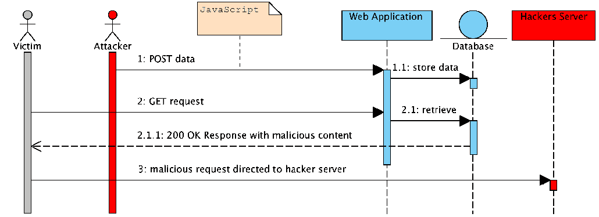
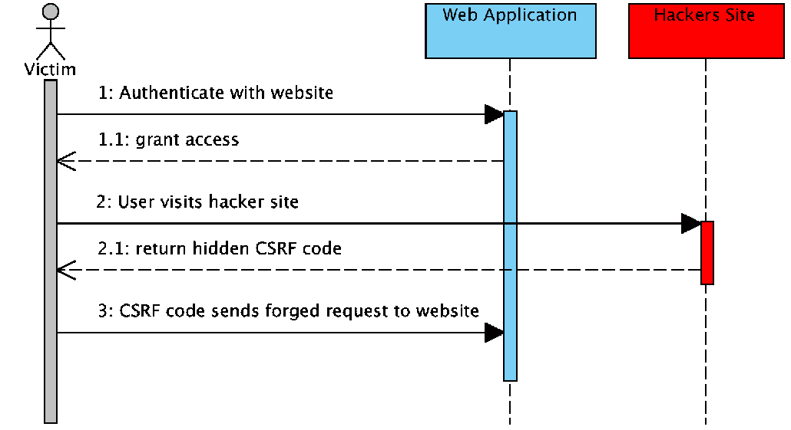
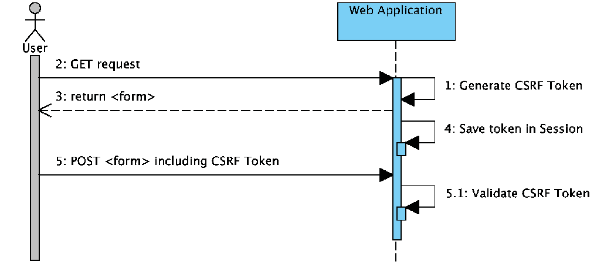

# 第十四章：额外的 Spring Security 特性

在这一章中，我们将探讨一些到目前为止本书中尚未涵盖的 Spring Security 特性，包括以下主题：

+   **跨站脚本攻击**（**XSS**）

+   **跨站请求伪造**（**CSRF**）

+   同步器令牌

+   **点击劫持**

我们将了解如何使用以下方法包含各种 HTTP 头以保护常见安全漏洞：

+   `Cache-Control`

+   `Content-Type Options`

+   **HTTP 严格传输安全**（**HSTS**）

+   `X-Frame-Options`

+   `X-XSS-Protection`

在阅读这一章之前，你应该已经对 Spring Security 的工作原理有了了解。这意味着你应该已经能够在一个简单的 web 应用程序中设置身份验证和授权。如果你还不能做到这一点，你需要在继续学习这一章之前确保你已经阅读了 第三章，*自定义身份验证*。如果你牢记 Spring Security 的基本概念并且理解你正在集成的框架，那么集成其他框架就相对简单了。

# 安全漏洞

在互联网时代，有很多可能被利用的漏洞。要了解更多关于基于 web 的漏洞，一个很好的资源是**开放网络应用安全项目**（**OWASP**），它的网址是 [`www.owasp.org`](https://www.owasp.org/).

除了是一个了解各种漏洞的伟大资源外，OWASP 还根据行业趋势对最 10 个漏洞进行了分类。

# 跨站脚本攻击

跨站脚本攻击涉及已经被注入到信任网站的恶意脚本。

XSS 攻击发生在一个攻击者利用一个允许未经审查的输入发送到网站的给定 web 应用程序时，通常以基于浏览器的脚本的形式，然后由网站的不同用户执行。

基于向网站提供验证过的或未编码的信息，攻击者可以利用很多形式。

这个问题核心在于期望用户信任网站发送的信息。最终用户的浏览器没有办法知道这个脚本不应该被信任，因为它来自一个它们正在浏览的网站。因为它认为脚本来自一个信任的来源，恶意脚本就可以访问浏览器中保留的与该网站一起使用的任何 cookie、会话令牌或其他敏感信息。

XSS 攻击可以通过以下序列图来描述：



# 跨站请求伪造

CSRF 攻击通过诱骗受害者提交恶意请求来攻击受害者。这种攻击继承或劫持受害者的身份和特权，并在受害者的名义上执行未经授权的功能和访问。

对于网络应用程序，大多数浏览器会自动包含与该网站关联的凭据，这包括用户会话、Cookie、IP 地址、Windows 域凭据等等。

因此，如果一个用户当前在一个网站上已认证，那么该网站将无法区分由受害者发送的伪造请求和合法的法院请求。

CSRF 攻击针对的是在服务器上引起状态变化的功能，比如更改受害者的电子邮件地址或密码，或者进行金融交易。

这迫使受害者获取对攻击者不利的数据，因为攻击者不会收到响应；受害者会。因此，CSRF 攻击针对的是状态更改请求。

以下序列图详细说明了 CSRF 攻击是如何发生的：



为了尝试防止 CSRF，可以采取几种不同的设计措施，然而，诸如秘密 Cookie、HTTP POST 请求、多步骤交易、URL 重写和 HTTPS 等措施，绝不可能防止此类攻击。

OWASP 的前 10 大安全漏洞列表详细介绍了 CSRF，作为第八常见的攻击，详情请见[`www.owasp.org/index.php/Cross-Site_Request_Forgery_(CSRF)`](https://www.owasp.org/index.php/Cross-Site_Request_Forgery_(CSRF))。

# 同步器令牌

解决这个问题的一种方法是使用同步器令牌模式。这个解决方案要求每个请求除了我们的会话 Cookie 外，还需要一个作为 HTTP 参数的随机生成的令牌。当提交一个请求时，服务器必须查找参数的预期值并将其与请求中的实际值进行比较。如果值不匹配，请求应该失败。

《跨站请求伪造（CSRF）预防速查表》建议使用同步器令牌模式作为防止 CSRF 攻击的可行解决方案：[`www.owasp.org/index.php/Cross-Site_Request_Forgery_(CSRF)_Prevention_Cheat_Sheet#General_Recommendation:_Synchronizer_Token_Pattern`](https://www.owasp.org/index.php/Cross-Site_Request_Forgery_(CSRF)_Prevention_Cheat_Sheet#General_Recommendation:_Synchronizer_Token_Pattern)

放宽期望值意味着只要求每个更新状态的 HTTP 请求中包含令牌。由于同源策略可以确保恶意网站无法读取响应，因此这样做是安全的。另外，我们不希望在每个 HTTP `GET`请求中包含随机令牌，因为这可能导致令牌泄露。

让我们看看例子会如何改变。假设生成的随机令牌以 HTTP 参数`named _csrf`的形式存在。例如，转账请求如下所示：

```java
POST /transfer HTTP/1.1
Host: bank.example.com
Cookie: JSESSIONID=randomid; Domain=bank.example.com; Secure; HttpOnly
Content-Type: application/x-www-form-urlencoded
amount=100.00&routingNumber=1234&account=9876&_csrf=<secure-random token>
```

您会注意到我们添加了带有随机值的`_csrf`参数。现在，恶意网站将无法猜测`_csrf`参数的正确值（必须在恶意网站上显式提供）并且在服务器将实际令牌与预期令牌比较时，传输将会失败。

以下图表显示了同步令牌模式的标准用例：



# 在 Spring Security 中的同步器令牌支持

Spring Security 提供了默认启用的同步器令牌支持。您可能在前几章中注意到，在我们的`SecurityConfig.java`文件中，我们禁用了 CSRF 保护，如下面的代码片段所示：

```java
//src/main/java/com/packtpub/springsecurity/configuration/SecurityConfig.java

protected void configure(HttpSecurity http) throws Exception {
...
// CSRF protection is enabled by default.
http.csrf().disable(); ...
}
```

到目前为止，在本书中，我们已经禁用了同步器令牌保护，以便我们可以专注于其他安全问题。

如果我们在这个时候启动应用程序，我们可以走过安全流程，但不会有任何页面的同步器令牌支持被添加。

您应该从`chapter16.00-calendar`的代码开始。

# 何时使用 CSRF 保护

建议您对任何可以由浏览器或普通用户处理的请求使用 CSRF 保护。如果您只是创建一个被非浏览器客户端使用的服务，您很可能会想要禁用 CSRF 保护。

# CSRF 保护与 JSON

一个常见的问题是：我需要为 JavaScript 发出的 JSON 请求提供保护吗？简短的答案是，视情况而定。然而，您必须非常小心，因为存在可以影响 JSON 请求的 CSRF 利用方式。例如，恶意用户可以使用以下表单创建一个 CSRF 攻击：

```java
    <form action="https://example.com/secureTransaction" method="post"   
    enctype="text/plain">
    <input name='{"amount":100,"routingNumber":"maliciousRoutingNumber",
    "account":"evilsAccountNumber", "ignore_me":"' value='test"}'
    type='hidden'>
    <input type="submit" value="Win Money!"/>
    </form>This will produce the following JSON structure{ "amount":   
    100,"routingNumber": "maliciousRoutingNumber","account": 
    "maliciousAccountNumber","ignore_me": "=test"
    }
```

如果一个应用程序没有验证 Content-Type 方法，那么它将受到这种利用的影响。根据设置，一个验证 Content-Type 方法的 Spring MVC 应用程序仍然可以通过将 URL 后缀更新为以`.json`结尾来被利用，如下面的代码所示：

```java
    <form action="https://example.com/secureTransaction.json" method="post"        
    enctype="text/plain">
    <input name='{"amount":100,"routingNumber":"maliciousRoutingNumber",
    "account":"maliciousAccountNumber", "ignore_me":"' value='test"}' 
    type='hidden'>
    <input type="submit" value="Win Money!"/>
    </form>
```

# CSRF 与无状态浏览器应用程序

如果您的应用程序是无状态的，那并不意味着您就受到了保护。实际上，如果用户不需要在网页浏览器中为特定请求执行任何操作，他们仍然可能受到 CSRF 攻击的威胁。

例如，考虑一个使用自定义 cookie 的应用程序，它包含所有认证状态，而不是`JSESSIONID`cookie。当发生 CSRF 攻击时，自定义 cookie 将按照我们之前例子中`JSESSIONID`cookie 的方式随请求发送。

使用基本认证的用户也容易受到 CSRF 攻击，因为浏览器将自动在所有请求中包含用户名和密码，就像我们在之前的例子中`JSESSIONID` cookie 一样发送。

# 使用 Spring Security CSRF 保护

那么，使用 Spring Security 保护我们的网站免受 CSRF 攻击需要哪些步骤呢？使用 Spring Security 的 CSRF 保护的步骤如下：

1.  使用正确的 HTTP 动词。

1.  配置 CSRF 保护。

1.  包含 CSRF 令牌。

# 使用正确的 HTTP 动词

防止 CSRF 攻击的第一步是确保你的网站使用正确的 HTTP 动词。特别是，在 Spring Security 的 CSRF 支持可以发挥作用之前，你需要确信你的应用程序正在使用`PATCH`、`POST`、`PUT`和/或`DELETE`来处理任何改变状态的操作。

这不是 Spring Security 支持的限制，而是防止 CSRF 攻击的一般要求。原因是将私有信息包含在 HTTP `GET`方法中可能会导致信息泄露。

参考*RFC 2616*，*第 15.1.3 节*，*在 URI 中编码敏感信息*，以了解如何使用`POST`而不是`GET`来处理敏感信息的一般指导原则（[`www.w3.org/Protocols/rfc2616/rfc2616-sec15.html#sec15.1.3`](https://www.w3.org/Protocols/rfc2616/rfc2616-sec15.html#sec15.1.3)）。

# 配置 CSRF 保护

下一步是在你的应用程序中包含 Spring Security 的 CSRF 保护。一些框架通过使用户会话无效来处理无效的 CSRF 令牌，但这会带来它自己的问题。相反，默认情况下，Spring Security 的 CSRF 保护将产生 HTTP 403 禁止访问。这可以通过配置`AccessDeniedHandler`以不同的方式处理`InvalidCsrfTokenException`来自定义。

出于被动原因，如果你使用 XML 配置，必须使用`<csrf>`元素显式启用 CSRF 保护。查阅`<csrf>`元素的文档以获取其他自定义设置。

SEC-2347 被记录下来，以确保 Spring Security 4.x 的 XML 命名空间配置将默认启用 CSRF 保护（[`github.com/spring-projects/spring-security/issues/2574`](https://github.com/spring-projects/spring-security/issues/2574)）。

# 默认的 CSRF 支持

使用 Java 配置时，CSRF 保护默认启用。查阅`csrf()`的 Javadoc 以获取有关如何配置 CSRF 保护的其他自定义设置。

为了在这个配置中详细说明，我们将在`SecurityConfig.java`文件中添加 CSRS 方法，如下所示：

```java
//src/main/java/com/packtpub/springsecurity/configuration/SecurityConfig.java
    @Override
```

```java
    public void configure(HttpSecurity http) throws Exception {
 http.csrf();    }
```

# 在<Form>提交中包含 CSRF 令牌

最后一步是确保你在所有的`PATCH`、`POST`、`PUT`和`DELETE`方法中包含 CSRF 令牌。一种实现方法是使用`_csrf`请求属性来获取当前的`CsrfToken`令牌。以下是在 JSP 中这样做的一个例子：

```java
    <c:url var="logoutUrl" value="/logout"/>
    <form action="${logoutUrl}" method="post">
      <input type="submit" value="Log out" />
 <input type="hidden"name="${_csrf.parameterName}" value="${_csrf.token}"/>
    </form>
```

# 使用 Spring Security JSP 标签库包含 CSRF 令牌

如果启用了 CSRF 保护，此标记将插入一个带有正确名称和值的秘密表单字段，以供 CSRF 保护令牌使用。如果未启用 CSRF 保护，此标记将不输出任何内容。

通常，Spring Security 会自动为任何使用的`<form:form>`标签插入 CSRF 表单字段，但如果出于某种原因不能使用`<form:form>`，`csrfInput`是一个方便的替代品。

你应该在 HTML `<form></form>`块中放置这个标签，你通常会在其他输入字段中放置其他输入字段。不要在这个标签中放置 Spring `<form:form></form:form>`块。Spring Security 会自动处理 Spring 表单，如下所示：

```java
    <form method="post" action="/logout">
 <sec:csrfInput />      ...
    </form>
```

# 默认的 CSRF 令牌支持

如果你使用 Spring MVC `<form:form>`标签，或者 Thymeleaf 2.1+，并且你用`@EnableWebMvcSecurity`替换`@EnableWebSecurity`，`CsrfToken`令牌会自动包含在内（我们一直在处理`CsrfRequestDataValue`令牌）。

因此，在这本书中，我们已经使用 Thymeleaf 为所有的网页页面。如果我们启用 Spring Security 中的 CSRF 支持，Thymeleaf 默认具有 CSRF 支持。

你应该从`chapter16.01-calendar`的代码开始。

如果我们启动 JBCP 日历应用程序并导航到登录页面`https://localhost:8443/login.html`，我们可以查看生成的`login.html`页面的源代码，如下所示：

```java
    <form method="POST" action="/login" ...>
      ...
 <input type="hidden" name="_csrf" value="e86c9744-5b7d-4d5f-81d5-450463222908">
    </form>
```

# Ajax 和 JSON 请求

如果你使用 JSON，那么不可能在 HTTP 参数中提交 CSRF 令牌。相反，你可以在 HTTP 头中提交令牌。一个典型的模式是将 CSRF 令牌包括在你的`<meta>`HTML 标签中。一个在 JSP 中的示例如下：

```java
    <html>
       <head>
 <meta name="_csrf" content="${_csrf.token}"/>         <!-- default header name is X-CSRF-TOKEN -->
 <meta name="_csrf_header" content="${_csrf.headerName}"/>         ...
       </head>
     ¦
```

instead of manually creating the meta tags, you can use the simpler `csrfMetaTags` tag from the Spring Security JSP tag library.

# `csrfMetaTags`标签

如果启用了 CSRF 保护，这个标签将插入包含 CSRF 保护令牌表单字段、头部名称和 CSRF 保护令牌值的元标签。这些元标签对于在应用程序中的 JavaScript 中使用 CSRF 保护非常有用。

你应该在 HTML `<head></head>`块中放置`csrfMetaTags`标签，你通常会在其他元标签中放置其他元标签。一旦使用这个标签，你可以轻松地使用 JavaScript 访问表单字段名、头部名称和令牌值，如下所示：

```java
<html>
   <head>
       ...
 <sec:csrfMetaTags />       <script type="text/javascript" language="javascript">
 var csrfParameter = $("meta[name='_csrf_parameter']").attr("content"); var csrfHeader = $("meta[name='_csrf_header']").attr("content"); var csrfToken = $("meta[name='_csrf']").attr("content");           ...
       <script>
   </head>
   ...
```

如果未启用 CSRF 保护，`csrfMetaTags`不会输出任何内容。

# jQuery 使用

You can then include the token within all of your Ajax requests. If you were using jQuery, this could be done with the following code snippet:

```java
$(function () {
var token = $("meta[name='_csrf']").attr("content");
var header = $("meta[name='_csrf_header']").attr("content");
$(document).ajaxSend(function(e, xhr, options) {
   xhr.setRequestHeader(header, token);
});
});
```

# 使用 cujoJS 的 rest.js 模块

作为 jQuery 的替代品，我们建议使用 cujoJS 的`rest.js`模块。`rest.js`模块提供了高级支持，用于以 RESTful 方式处理 HTTP 请求和响应。其核心功能是能够对 HTTP 客户端进行上下文化处理，通过将拦截器链接到客户端来添加所需的行为，如下所示：

```java
    var client = rest.chain(csrf, {
    token: $("meta[name='_csrf']").attr("content"),
    name: $("meta[name='_csrf_header']").attr("content")
    });
```

配置的客户端可以与应用程序中需要对 CSRF 受保护资源进行请求的任何组件共享。`rest.js`与 jQuery 之间的一个重要区别是，仅使用配置的客户端发出的请求将包含 CSRF 令牌，而在 jQuery 中，所有请求都将包含令牌。能够确定哪些请求接收到令牌有助于防止泄露 CSRF 令牌给第三方。

有关`rest.js`的更多信息，请参考`rest.js`参考文档。

[(](https://github.com/cujojs/rest/tree/master/docs)[`github.com/cujojs/rest/tree/master/docs`](https://github.com/cujojs/rest/tree/master/docs)[).](https://github.com/cujojs/rest/tree/master/docs)

# CSRF 注意事项

在 Spring Security 中实现 CSRF 时，有几个注意事项你需要知道。

# 超时

一个问题是在`HttpSession`方法中存储了预期的 CSRF 令牌，所以一旦`HttpSession`方法过期，您配置的`AccessDeniedHandler`处理器将会接收到`InvalidCsrfTokenException`。如果您正在使用默认的`AccessDeniedHandler`处理器，浏览器将得到一个 HTTP 403，并显示一个糟糕的错误信息。

你可能会问为什么预期的`CsrfToken`令牌不是存储在 cookie 中。这是因为已知存在一些利用方式，其中头部（指定 cookie）可以由另一个域设置。

这是同样的原因，Ruby on Rails 不再在存在 X-Requested-With 头时跳过 CSRF 检查 ([`weblog.rubyonrails.org/2011/2/8/csrf-protection-bypass-in-ruby-on-rails/`](http://weblog.rubyonrails.org/2011/2/8/csrf-protection-bypass-in-ruby-on-rails/)).

Web 应用安全委员会(*Web Application Security Consortium*) ([`www.webappsec.org`](http://www.webappsec.org/))有一个详细的线程，讨论使用 CSRF 和 HTTP 307 重定向来执行 CSRF cookie 利用。

有关如何执行利用的具体细节，请参阅这个[www.webappsec.org](http://www.webappsec.org/)线程：[`lists.webappsec.org/pipermail/websecurity_lists.webappsec.org/2011-February/007533.html`](http://lists.webappsec.org/pipermail/websecurity_lists.webappsec.org/2011-February/007533.html)。

另一个缺点是，通过移除状态（超时），您失去了在某些东西被泄露时强制终止令牌的能力。

减轻活动用户遇到超时的一种简单方法是有一些 JavaScript，让用户知道他们的会话即将过期。用户可以点击一个按钮来继续并刷新会话。

另外，指定一个自定义的`AccessDeniedHandler`处理器可以让您以任何喜欢的方式处理`InvalidCsrfTokenException`，正如我们接下来代码中所看到的：

```java
//src/main/java/com/packtpub/springsecurity/configuration/SecurityConfig.java

@Override
public void configure(HttpSecurity http) throws Exception {
 http.exceptionHandling() .accessDeniedHandler(accessDeniedHandler); }
@Bean
public CustomAccessDeniedHandler accessDeniedHandler(){
 return new CustomAccessDeniedHandler(); }
```

# 登录

为了防止伪造登录请求，登录表单也应该受到 CSRF 攻击的保护。由于`CsrfToken`令牌存储在`HttpSession`中，这意味着一旦访问`CsrfToken`属性，就会立即创建一个`HttpSession`方法。虽然这在 RESTful/无状态架构中听起来很糟糕，但现实是状态是实现实际安全所必需的。如果没有状态，如果令牌被泄露，我们无能为力。实际上，CSRF 令牌的大小相当小，对架构的影响应该可以忽略不计。

攻击者可能会伪造一个请求，使用攻击者的凭据将受害者登录到目标网站，这被称为登录 CSRF([`en.wikipedia.org/wiki/Cross-site_request_forgery#Forging_login_requests`](https://en.wikipedia.org/wiki/Cross-site_request_forgery#Forging_login_requests))。

# 登出

添加 CSRF 将更新`LogoutFilter`过滤器，使其只使用 HTTP`POST`。这确保了登出需要 CSRF 令牌，并且恶意用户不能强制登出您的用户。

一种方法是使用`<form>`标签进行登出。如果你想要一个 HTML 链接，你可以使用 JavaScript 让链接执行 HTTP`POST`（可以是一个隐藏的表单）。对于禁用 JavaScript 的浏览器，你可以选择让链接带用户到执行 HTTP`POST`的登出确认页面。

如果你想使用 HTTP`GET`进行登出，你可以这样做，但请记住，这通常不推荐。例如，以下 Java 配置将在任何 HTTP 方法请求登出 URL 模式时执行登出：

```java
//src/main/java/com/packtpub/springsecurity/configuration/SecurityConfig.java

@Override
protected void configure(HttpSecurity http) throws Exception {
 http.logout() .logoutRequestMatcher( new AntPathRequestMatcher("/logout")); }
```

# 安全 HTTP 响应头

下面的部分讨论了 Spring Security 为将各种安全头添加到响应中提供的支持。

# 默认安全头

Spring Security 允许用户轻松地注入默认的安全头，以帮助保护他们的应用程序。以下是由 Spring Security 提供的当前默认安全头的列表：

+   `Cache-Control`

+   `Content-Type Options`

+   HTTP 严格传输安全

+   `X-Frame-Options`

+   `X-XSS-Protection`

虽然每个头都被认为是最佳实践，但应注意的是，并非所有客户端都使用这些头，因此鼓励进行额外测试。出于被动原因，如果你使用 Spring Security 的 XML 命名空间支持，你必须显式启用安全头。所有默认头都可以通过没有子元素的`<headers>`元素轻松添加。

*SEC-2348*被记录下来，以确保 Spring Security 4.x 的 XML 命名空间配置将默认启用安全头([`github.com/spring-projects/spring-security/issues/2575`](https://github.com/spring-projects/spring-security/issues/2575))。

如果你使用 Spring Security 的 Java 配置，所有的默认安全头都会被默认添加。它们可以通过 Java 配置禁用，如下所示：

```java
//src/main/java/com/packtpub/springsecurity/configuration/SecurityConfig.java

@Override
protected void configure(HttpSecurity http) throws Exception {
 http.headers().disable(); }
```

下面的代码将安全头添加到响应中。当使用`WebSecurityConfigurerAdapter`的默认构造函数时，这是默认激活的。接受`WebSecurityConfigurerAdapter`提供的默认值，或者只调用`headers()`方法而不调用其他方法，等效于以下代码片段：

```java
@Override
protected void configure(HttpSecurity http) throws Exception {
   http
 .headers() .contentTypeOptions() .and() .xssProtection() .and() .cacheControl() .and() .httpStrictTransportSecurity() .and() .frameOptions()         .and()
     ...;
}
```

一旦你指定了任何应该包括的头，那么只有这些头会被包括。例如，以下配置仅包括对 X-Frame-Options 的支持：

```java
@Override
protected void configure(HttpSecurity http) throws Exception {
   ...
 http.headers().frameOptions(); }
```

# Cache-Control

在过去，Spring Security 要求你必须为你的网络应用程序提供自己的 `Cache-Control` 方法。当时这看起来是合理的，但是浏览器缓存已经发展到包括对安全连接的缓存。这意味着一个用户可能查看一个认证过的页面，登出后，恶意用户就可以利用浏览器历史记录来查看缓存的页面。

为了帮助减轻这个问题，Spring Security 增加了对 `Cache-Control` 的支持，它将以下头部信息插入到你的响应中：

```java
Cache-Control: no-cache, no-store, max-age=0, must-revalidate
Pragma: no-cache
Expires: 0
```

仅仅添加 `headers()` 方法而没有子元素将会自动添加 `Cache-Control` 和其他很多保护选项。然而，如果你只想要 `Cache-Control`，你可以使用 Spring Security 的 Java 配置方法，如下所示：

```java
@Override
protected void configure(HttpSecurity http) throws Exception {
   http.headers()
 .cacheControl(); }
```

如果你想要缓存特定的响应，你的应用程序可以选择性地调用 `HttpServletResponse.setHeader(String,String)` 来覆盖 Spring Security 设置的头部。这对于确保诸如 CSS、JavaScript 和图片等被正确缓存很有用。

在使用 Spring Web MVC 时，这通常是在你的配置中完成的。例如，以下配置将确保为你的所有资源设置缓存头部：

```java
@EnableWebMvc
public class WebMvcConfiguration
extends WebMvcConfigurerAdapter {
   @Override
   public void addResourceHandlers(
                   ResourceHandlerRegistry registry) {
 registry .addResourceHandler("/resources/**") .addResourceLocations("/resources/") .setCachePeriod(3_155_6926);   }
   // ...
}
```

# Content-Type 选项

历史上，包括 Internet Explorer 在内的浏览器会尝试使用内容嗅探来猜测请求的内容类型。这允许浏览器通过猜测未指定内容类型的资源的內容类型来改进用户体验。例如，如果浏览器遇到一个没有指定内容类型的 JavaScript 文件，它将能够猜测内容类型并执行它。

还有许多其他的事情需要做，比如只在一个独特的域中显示文档，确保设置 Content-Type 头部，对文档进行清理等等，当允许内容上传时。然而，这些措施超出了 Spring Security 提供的范围。重要的是指出，在禁用内容嗅探时，你必须指定内容类型，以便一切正常工作。

内容嗅探的问题在于，这允许恶意用户使用多语言（一个可以作为多种内容类型有效的文件）来执行 XSS 攻击。例如，一些网站可能允许用户向网站提交一个有效的 PostScript 文档并查看它。恶意用户可能会创建一个同时是有效的 JavaScript 文件的 PostScript 文档，并利用它执行 XSS 攻击（[`webblaze.cs.berkeley.edu/papers/barth-caballero-song.pdf`](http://webblaze.cs.berkeley.edu/papers/barth-caballero-song.pdf)）。

可以通过向我们的响应中添加以下头部来禁用内容嗅探：

```java
    X-Content-Type-Options: nosniff
```

与`Cache-Control`元素一样，`nosniff`指令在没有子元素的情况下使用`headers()`方法时默认添加。在 Spring Security Java 配置中，`X-Content-Type-Options`头默认添加。如果您想对头部有更精细的控制，您可以显式指定内容类型选项，如下代码所示：

```java
@Override
protected void configure(HttpSecurity http) throws Exception {
   http.headers()
       .contentTypeOptions();
}
```

# HTTP 严格传输安全

当您输入您的银行网站时，您是输入`mybank.example.com`，还是输入`https://mybank.example.com`？如果您省略了 HTTPS 协议，您可能会受到中间人攻击的潜在威胁。即使网站执行重定向到`https://**my**bank.example.com`，恶意用户仍然可以拦截最初的 HTTP 请求并操纵响应（重定向到`https://**mi**bank.example.com`并窃取他们的凭据）。

许多用户省略了 HTTPS 协议，这就是为什么创建了 HSTS。

根据*RFC6797*，HSTS 头部仅注入到 HTTPS 响应中。为了使浏览器认可该头部，浏览器必须首先信任签署用于建立连接的 SSL 证书的 CA，而不仅仅是 SSL 证书（[`tools.ietf.org/html/rfc6797`](https://tools.ietf.org/html/rfc6797)）。

一旦`mybank.example.com`被添加为 HSTS 主机，浏览器就可以提前知道任何对`mybank.example.com`的请求都应该被解释为`https://mybank.example.com`。这大大减少了发生中间人攻击的可能性。

一个网站被标记为 HSTS 主机的途径之一是将主机预加载到浏览器中。另一个途径是在响应中添加`Strict-Transport-Security`头部。例如，下面的内容将指导浏览器将域名视为 HSTS 主机一年（一年大约有`31,536,000`秒）：

```java
    Strict-Transport-Security: max-age=31536000 ; includeSubDomains
```

可选的`includeSubDomains`指令告知 Spring Security，子域名（如`secure.mybank.example.com`）也应该被视为一个 HSTS 域名。

与其它头部一样，当在`headers()`方法中没有子元素指定时，Spring Security 将前一个头部添加到响应中，但当你使用 Java 配置时，它会自动添加。您还可以仅使用 HSTS 头部与`hsts()`方法一起使用，如下面的代码所示：

```java
@Override
protected void configure(HttpSecurity http) throws Exception {
   http.headers()
 .hsts(); }
```

# X-Frame-Options

允许您的网站被添加到框架中可能是一个安全问题。例如，通过巧妙的 CSS 样式，用户可能会被诱骗点击他们本不想点击的东西。

在[`www.youtube.com/watch?v=3mk0RySeNsU`](https://www.youtube.com/watch?v=3mk0RySeNsU)观看 Clickjacking 视频演示。

例如，一个已登录其银行的用户的可能会点击一个授予其他用户访问权限的按钮。这种攻击称为 Clickjacking。

在[`www.owasp.org/index.php/Clickjacking`](https://www.owasp.org/index.php/Clickjacking)阅读更多关于 Clickjacking 的信息。

处理 Clickjacking 的另一种现代方法是使用内容安全策略。Spring Security 不提供对此的支持，因为该规范尚未发布，而且相当复杂。然而，你可以使用静态头功能来实现这一点。要了解此问题的最新动态以及如何使用 Spring Security 实现它，请参阅*SEC-2117*在[`github.com/spring-projects/spring-security/issues/2342`](https://github.com/spring-projects/spring-security/issues/2342)。

有许多方法可以缓解 Clickjacking 攻击。例如，为了保护老式浏览器不受 Clickjacking 攻击，你可以使用破帧代码。虽然不是完美的，但破帧代码对于老式浏览器来说是最好的做法。

解决 Clickjacking 的更现代方法是使用`X-Frame-Options`头，如下所示：

```java
    X-Frame-Options: DENY
```

`X-Frame-Options`响应头指示浏览器防止任何在响应中包含此头的站点被渲染在框架内。与其他响应头一样，当没有子元素的`headers()`方法被指定时，此头会自动包含。你还可以明确指定 frame-options 元素以控制要添加到响应中的哪些头，如下所示：

```java
@Override
protected void configure(HttpSecurity http) throws Exception {
   http.headers()
 .frameOptions(); }
```

如果你想要更改`X-Frame-Options`头的值，那么你可以使用一个`XFrameOptionsHeaderWriter`实例。

一些浏览器内置了对过滤掉反射型 XSS 攻击的支持。这绝不是万无一失的，但它确实有助于 XSS 保护。

过滤通常默认启用，因此添加头 just 确保它已启用，并指示浏览器在检测到 XSS 攻击时应该做什么。例如，过滤器可能会尝试以最不具侵入性的方式更改内容以仍然呈现一切。有时，这种类型的替换本身可能成为一个 XSS 漏洞。相反，最好阻止内容，而不是尝试修复它。为此，我们可以添加以下头：

```java
    X-XSS-Protection: 1; mode=block
```

当使用`headers()`方法且没有子元素时，默认包含此标题。我们可以使用`xssProtection`元素明确地声明，如下所示：

```java
@Override
protected void configure(HttpSecurity http) throws Exception {
   http.headers()
       .xssProtection();
}
```

# 自定义头

Spring Security 具有机制，使其方便地向你的应用程序添加更多常见的 security headers。然而，它还提供了挂载点，以启用添加自定义头。

# 静态头

有时你可能希望向你的应用程序中注入自定义的安全头，但这些头并不是开箱即用的。例如，也许你希望提前支持内容安全策略，以确保资源只从同一来源加载。由于内容安全策略的支持尚未最终确定，浏览器使用两个常见的扩展头之一来实现此功能。这意味着我们将需要注入策略两次。以下代码段显示了头部的示例：

```java
X-Content-Security-Policy: default-src 'self'
X-WebKit-CSP: default-src 'self'
```

当使用 Java 配置时，这些头可以使用`header()`方法添加到响应中，如下所示：

```java
@Override
protected void configure(HttpSecurity http) throws Exception {
   http.headers()
       .addHeaderWriter(
         new StaticHeadersWriter(
               "X-Content-Security-Policy",
               "default-src 'self'"))
       .addHeaderWriter(
           new StaticHeadersWriter(
               "X-WebKit-CSP",
               "default-src 'self'"));
}
```

# `HeadersWriter`实例

当命名空间或 Java 配置不支持您想要的头时，您可以创建一个自定义`HeadersWriter`实例，甚至提供`HeadersWriter`的自定义实现。

让我们来看一个使用自定义实例`XFrameOptionsHeaderWriter`的例子。也许你想允许相同源的内容框架。这可以通过将策略属性设置为`SAMEORIGIN`轻松支持，但让我们来看一个更明确的例子，使用`ref`属性，如下面的代码片段所示：

```java
@Override
protected void configure(HttpSecurity http) throws Exception {
   http.headers()
       .addHeaderWriter(
           new XFrameOptionsHeaderWriter(
               XFrameOptionsMode.SAMEORIGIN));
}
```

# `DelegatingRequestMatcherHeaderWriter`类

有时，您可能只想为某些请求写入头。例如，也许您只想保护登录页面不被框架。您可以使用`DelegatingRequestMatcherHeaderWriter`类来实现。当使用 Java 配置时，可以用以下代码完成：

```java
@Override
protected void configure(HttpSecurity http) throws Exception {
 DelegatingRequestMatcherHeaderWriter headerWriter = new DelegatingRequestMatcherHeaderWriter( new AntPathRequestMatcher("/login"), new XFrameOptionsHeaderWriter());   http.headers()
       .addHeaderWriter(headerWriter);
}
```

# 总结

在本章中，我们介绍了几种安全漏洞，并使用了 Spring Security 来规避这些漏洞。阅读本章后，你应该理解 CSRF 的威胁以及使用同步令牌来预防 CSRF。

您还应该知道如何使用`Cache-Control`、`Content-Type Options`、HSTS、`X-Frame-Options`和`X-XSS-Protection`方法，将各种 HTTP 头包含在内，以保护免受常见安全漏洞的侵害。

在下一章中，我们将讨论如何从 Spring Security 3.x 迁移到 Spring Security 4.2。
