# 第十七章：附加参考资料

在本附录中，我们将介绍一些我们认为有帮助（并且大部分未文档化）但内容过于全面而无法插入各章节的参考资料。

# 使用 JBCP 日历示例代码开始

正如我们在第一章中描述的，《一个不安全应用程序的剖析》，我们假设你已经安装了一个 JDK。您可以从 Oracle 的网站[`www.oracle.com/technetwork/java/javase/downloads/index.html`](http://www.oracle.com/technetwork/java/javase/downloads/index.html)下载一个 JDK。为了运行代码示例，你需要安装 JDK 8。代码库使用了许多 JDK 8 的功能，这些功能与 JDK 7 不兼容，而且没有尝试解决 IDE 以及项目依赖项的各种 JDK 9 问题。

# Gradle 构建工具

本书中的所有代码都是使用 Gradle 构建工具构建的，并且是按章节组织的多模块构建。您可以在[`gradle.org/install/`](https://gradle.org/install/)找到获取 Gradle 的说明和选项。

由于源代码的根目录已经安装了 Gradle 包装器，因此不需要本地安装 Gradle。Gradle 包装器可以在任何子模块中安装。您可以在[`docs.gradle.org/current/userguide/gradle_wrapper.html`](https://docs.gradle.org/current/userguide/gradle_wrapper.html)找到有关 Gradle 包装器的更多信息。

下载示例代码

您可以从您在[`www.packtpub.com`](http://www.packtpub.com/)购买的所有 Packt 书籍的示例代码文件中下载。如果您在其他地方购买了这本书，您可以访问[`www.packtpub.com/support`](http://www.packtpub.com/support)并注册，以便将文件直接通过电子邮件发送给您。

# Gradle IDE 插件

代码库已经配置了 IntelliJ 和 Eclipse IDE 插件。这意味着 Gradle 可以创建所有必要的 IDE 项目文件，而不是手动导入代码库，尽管你并非强制使用这些插件。

要使用这些插件，请打开一个终端或命令提示符窗口，切换到代码库的根目录。要在 OSX 或 Linux 上执行插件，请发出以下命令：

```java
$ ./gradlew idea
```

运行此任务后，每个目录中都会有几个 IDEA 项目文件，如下面的屏幕截图所示：

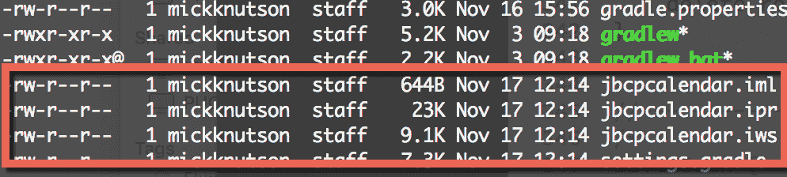

如果您是在 Windows 机器上，您将发出以下命令：

```java
C:\jbcdcalendar> gradlew.bat idea
```

之前的示例执行了`gradlew`脚本，这是 Gradle 包装器，然后给出了创建 IDE 文件的命令。IntelliJ 项目文件是通过`idea`任务创建的，而 STS 或任何基于 Eclipse 的 IDE 的项目文件是通过 eclipse 任务创建的。

运行 Eclipse 任务后，每个目录中都会有几个 Eclipse 项目文件和目录：

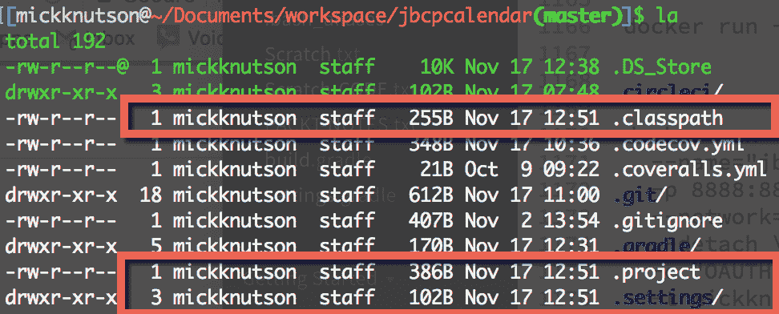

# IntelliJ IDEA

本书中使用的大多数图表都来自 Jet Brains 的 IntelliJ IDEA ([`www.jetbrains.com/idea/`](https://www.jetbrains.com/idea/)). IDEA 对多模块 Gradle 构建提供了很好的支持。

IDEA 将允许你导入一个现有项目，或者你可以简单地从源代码基的根目录打开`build.gradle`文件，IDEA 将为你创建必要的工作区文件。

一旦你使用 Gradle `idea`任务创建了 IDEA 项目文件，你就可以使用以下截图所示的导入项目选项来导入整个项目：

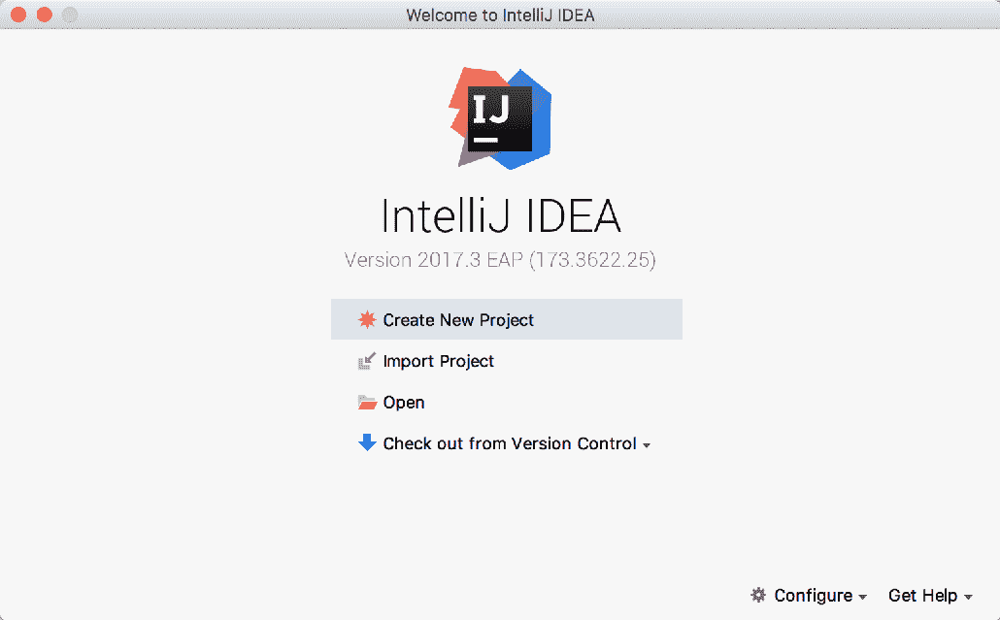

然后，你将被提示选择各种选项，以确定 IDEA 如何执行此 Gradle 构建，如下截图所示：

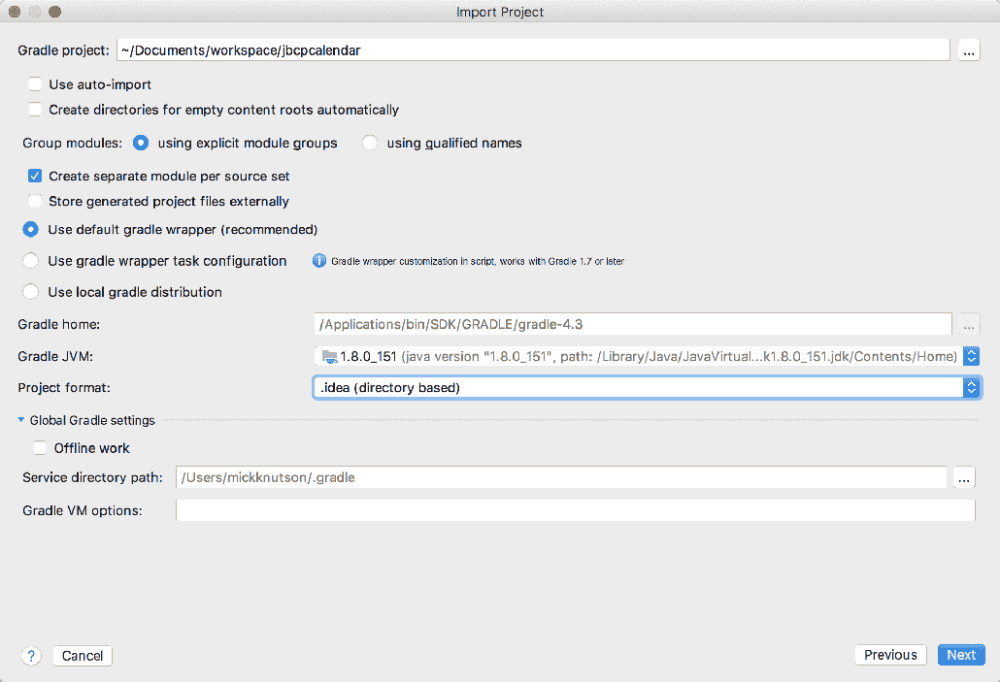

对于 IDEA 导入 Gradle 项目的一个特别说明

在前面的列表中，你会注意到有一个使用 Gradle 包装器任务配置的选项，以及被选中的默认 Gradle 包装器（推荐）选项。唯一的区别是使用 Gradle 包装器任务配置选项，这将在每个项目目录中创建一个 Gradle 包装器实例。如果你想在终端或命令行上执行构建命令，又不想安装 Gradle 的本地版本，这将很有帮助。否则，IDEA 为所有项目处理 Gradle 包装器调用。

一旦项目被导入，你将能够使用任何章节进行工作，布局如下截图所示：

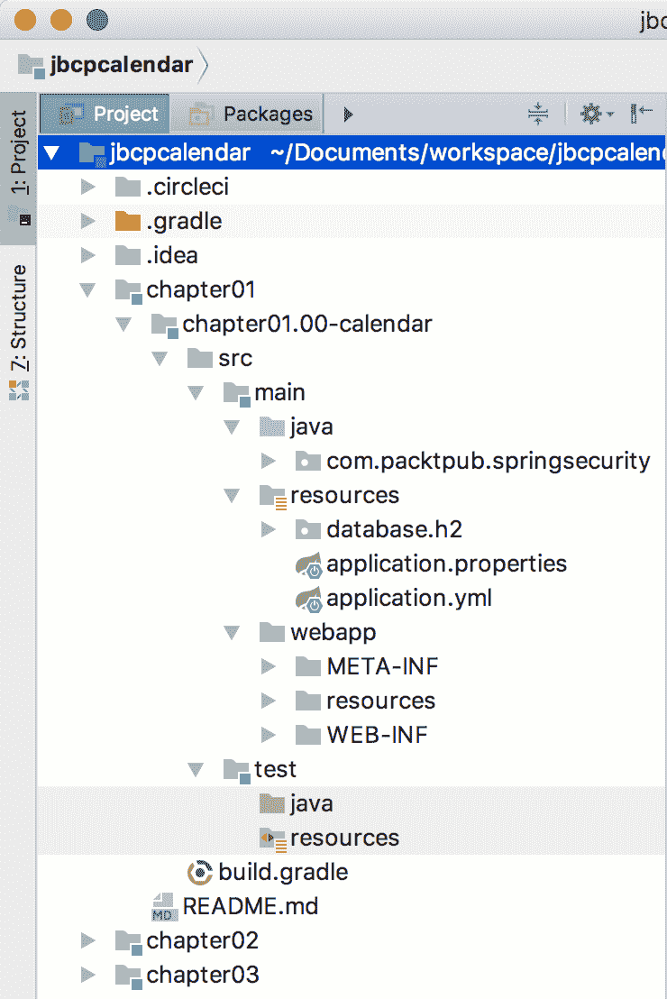

# Spring Tool Suite 或 Eclipse

如果使用 STS，我们假设你有访问**Spring Tool Suite** (**STS**) 3.9.1 的权限。你可以从[`spring.io/tools/sts`](https://spring.io/tools/sts)下载 STS。STS 3.9.1 基于 Eclipse Oxygen 1a (4.7.1a)并且你可以在[`www.eclipse.org/ide/`](https://www.eclipse.org/ide/)找到更多关于 Oxygen 版本的详细信息。

# 创建一个新的工作区

为了最小化与你的环境之间的差异，最好创建一个新的工作区，可以通过执行以下步骤来实现：

1.  当你第一次打开 STS 时，它会提示你输入工作区位置。如果你之前使用过 STS，你可能需要去文件|切换工作区|其他来创建一个新的工作区。我们建议输入不包含任何空格的工作区位置。例如，请查看以下截图：

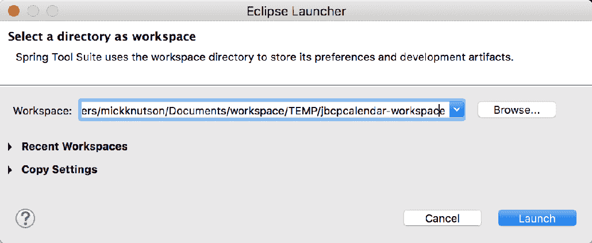

1.  一旦你创建了一个新的工作区，你将想要通过点击欢迎标签上的关闭按钮来退出欢迎屏幕，如下截图所示：

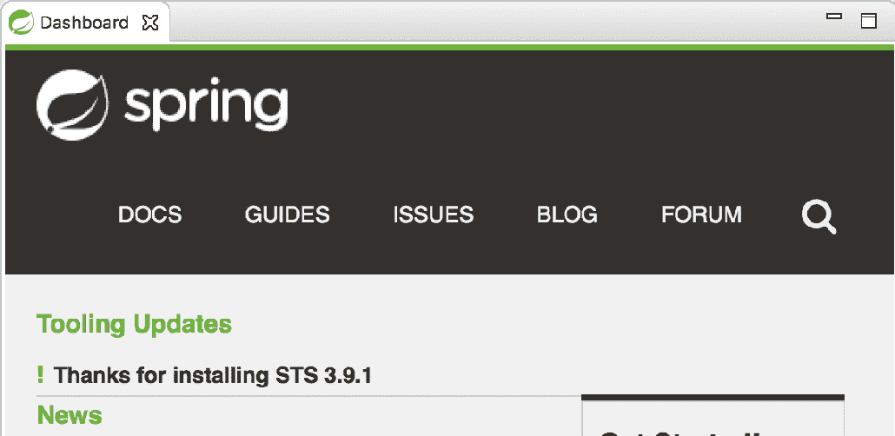

# 一个示例代码结构

示例代码以`.zip`文件的形式组织，包含了一个多模块 Gradle 项目的文件夹。每个文件夹都命名为`chapterNN`，其中`NN`是章节号。每个`chapterNN`文件夹还包括了包含每个里程碑项目的文件夹，文件夹格式为`chapterNN.mm-calendar`，其中`NN`是章节号，`mm`是该章节内的里程碑。为了简化操作，我们建议您将源代码解压到一个不包含任何空格的路径。每个里程碑都是章节内的检查点，允许您轻松地将自己的代码与书中的代码进行比较。例如，`chapter02.03-calendar`包含了第二章，*Spring Security 入门*，日历应用程序中的里程碑号`03`。前一个项目的位置将是`~/jbcpcalendar/chapter02/chapter02.03-calendar`。

第一章*一个不安全应用程序的剖析*和第二章*Spring Security 入门*作为 Spring IO 项目创建，没有使用 Spring Boot 作为项目基础。第三章*自定义认证*将日历项目转换为 Spring Boot 代码库，在第五章*使用 Spring Data 进行认证*中，JDBC 被 Spring Data 作为持久化机制所替代。

为了使每个章节尽可能独立，书中的大部分章节都是基于第九章，*开放 OpenID*，或第十五章，*额外的 Spring Security 特性*构建的。这意味着在大多数情况下，您可以阅读第九章，*开放 OpenID*，然后跳到书的其它部分。然而，这也意味着开始每个章节时，使用章节里程碑`00`的源代码非常重要，而不是继续使用上一章节的代码。这确保了您的代码从章节开始的地方开始。

虽然您可以在不执行任何步骤的情况下完成整本书，但我们建议您从每个章节的里程碑`00`开始，并实现书中的步骤。这将确保您能从书中获得最大的收益。您可以使用里程碑版本来复制大量代码，或者在遇到问题时比较您的代码。

# 导入示例代码

在我们可以将这个 Gradle 项目导入 Eclipse 之前，您必须在 Eclipse 市场安装一个 Gradle 插件。撰写本书时只有两个选项。一个是 Gradle IDE 包([`marketplace.eclipse.org/content/gradle-ide-pack`](http://marketplace.eclipse.org/content/gradle-ide-pack))，但这个项目没有得到维护，如果您安装这个插件，Eclipse 会警告您，并建议您迁移到**Buildship Gradle 集成**插件([`marketplace.eclipse.org/content/buildship-gradle-integration`](http://marketplace.eclipse.org/content/buildship-gradle-integration))。安装后，您将有一个导入现有 Gradle 项目的选项。

从我们全新的工作空间开始，执行以下步骤：

1.  点击文件|导入，选择现有 Gradle 项目，如下图所示：

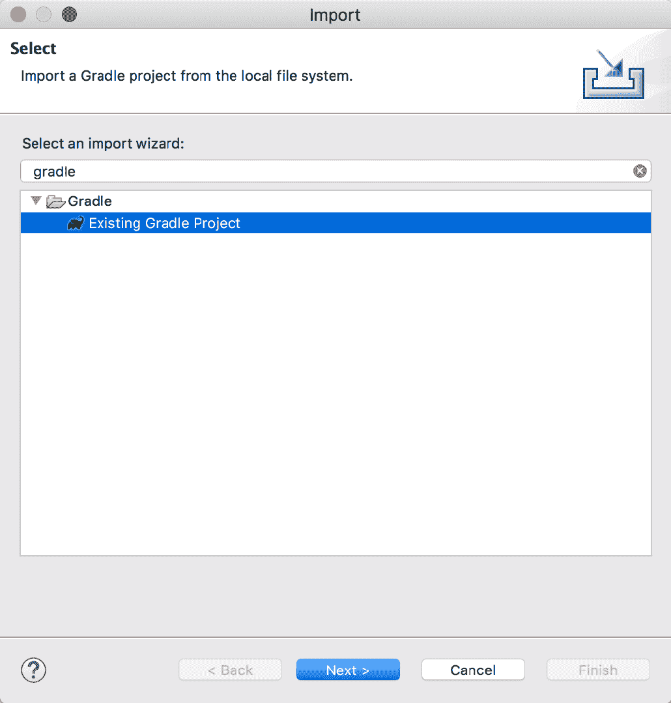

1.  点击下一步>，如下图所示：

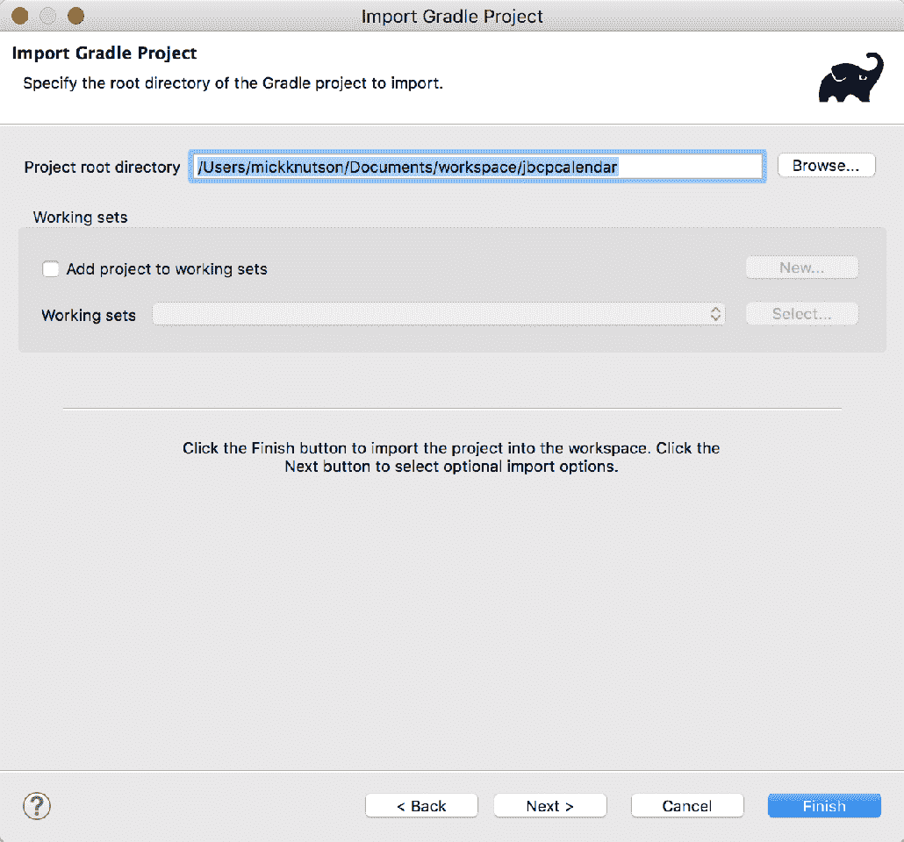

1.  点击下一步>，如下图所示：

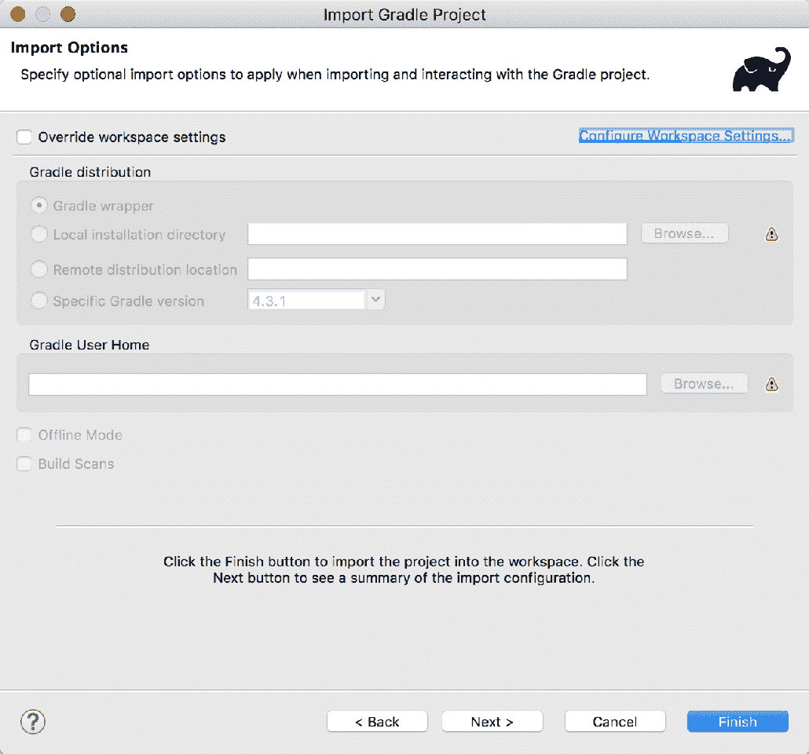

除非你想使用 Gradle 的本地安装，否则请确保保持默认设置。

1.  浏览您导出代码的位置，并选择代码的父文件夹。您将看到所有项目列表。您可以选择您感兴趣的项目，也可以选择所有项目。如果您决定导入所有项目，您可以轻松地关注当前章节，因为命名约定将确保项目按它们在书中出现的顺序排序：

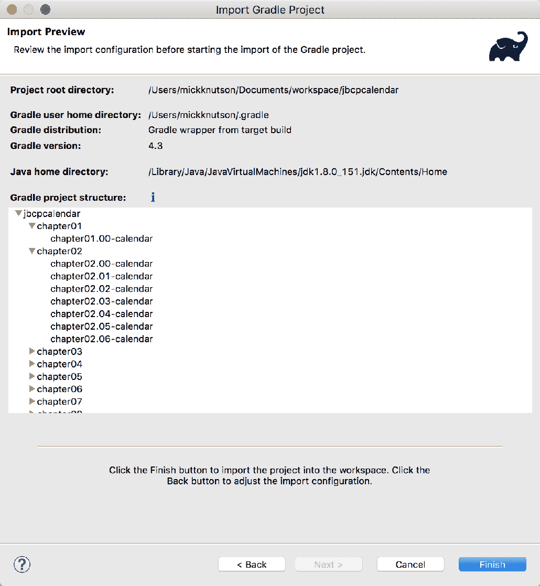

1.  点击完成。所选的所有项目将被导入。如果你不经常使用 Gradle，它将需要一点时间来下载你的依赖项。

需要连接互联网以下载依赖项。

每个部分的`README.md`文件中都可以找到运行项目的更新后的说明。这确保了，即使 STS 进行更新，代码仍然可以使用最新的工具进行构建和运行。

# 运行示例

为了在 IDEA 或 STS 中运行示例应用程序，需要做一些必要的事情。在所有项目中，Gradle 中已经配置了 Tomcat 插件，以帮助您更快地开始。

# 在 IDEA 中启动示例

可以通过为每个项目创建`运行/调试配置`条目来运行里程碑项目。

从我们全新的工作空间开始，执行以下步骤：

1.  点击文件|运行，选择编辑配置...，如下图所示：

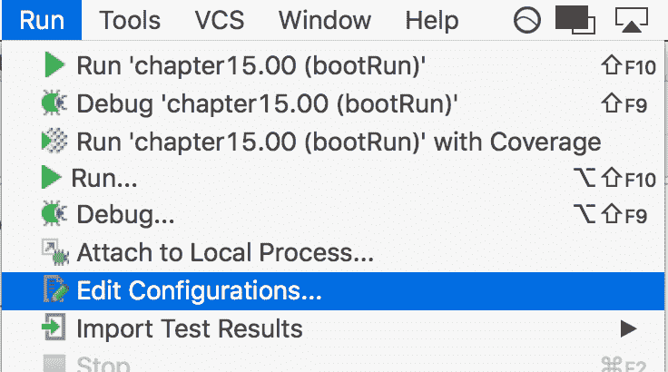

1.  您将看到添加新配置的选项。在左上角选择加号 (+) 符号来选择一个新的 Gradle 配置，如下图所示：

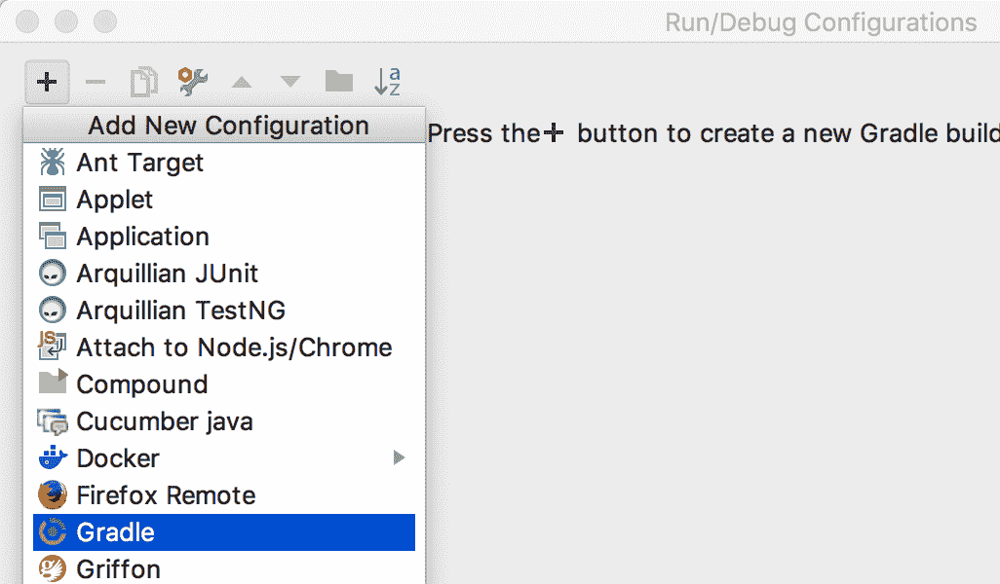

1.  现在，您可以给它起一个名字，比如`chapter15.00 (bootRun)`，并选择这个配置的实际里程碑目录。最后，在“任务”选项下输入`bootRun`以执行，如下图所示：

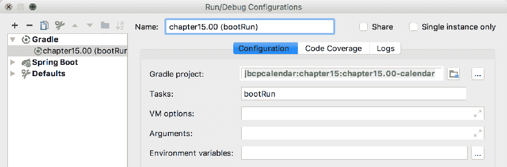

1.  选择您想要执行的配置；点击绿色的运行按钮，或者使用以下截图中显示的*Shift* + *F10*键：

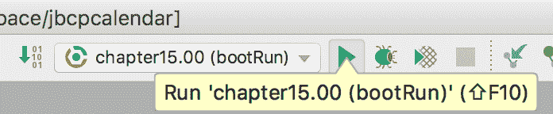

# Gradle 任务

在第一章，*一个不安全应用程序的剖析*，和第二章，*Spring Security 入门*中，运行项目的 Gradle 任务将是*tomcatRun*。本书其余章节中，使用了 Spring Boot，并且启动项目的 Gradle 任务将是`bootRun`。

# 在 STS 中启动示例

在 STS 中，还会创建一个运行配置，每个里程碑项目都需要包含相同的信息，如下图所示：

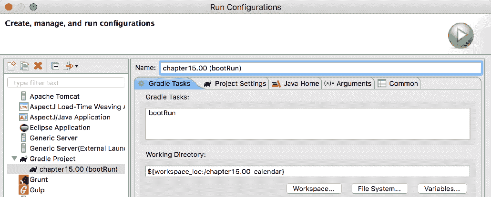

# 在 STS 中使用 HTTPS

书中某些章节示例代码（即第八章，*使用 TLS 的客户端证书认证*，第九章，*开放到 OAuth2*，和第十章，*与中央认证服务单点登录*)需要使用 HTTPS，以便示例代码能够工作。

所有项目都已配置为运行 HTTPS；大部分配置都在属性文件或 YAML 文件中管理。

现在，当您从 Gradle 在嵌入式 Tomcat 服务器上运行示例代码时，您可以连接到`http://localhost:8080`或`https://localhost:8443`。

# Tomcat 中的 HTTPS 设置

在本节中，我们将概述如何在 Tomcat 中设置 HTTPS，以向我们的应用程序提供 TLS。所有包含的项目都在一个内嵌的 Tomcat 实例中运行，但我们还将介绍证书创建过程以及运行这些应用程序在独立的 Tomcat 实例中的一些技巧。

# 生成服务器证书

如果您还没有证书，您必须首先生成一个。如果您愿意，可以跳过这一步，并使用位于本书示例源代码中`etc`目录下的`tomcat.keystore`文件。在命令提示符下输入以下命令行：

```java
$ keytool -genkey -alias jbcpcalendar -keypass changeit -keyalg RSA \
-keystore tomcat.keystore
Enter keystore password: changeit
Re-enter new password: changeitWhat is your first and last name? [Unknown]: localhost
What is the name of your organizational unit? [Unknown]: JBCP Calendar
What is the name of your organization? [Unknown]: JBCP
What is the name of your City or Locality? [Unknown]: Anywhere 
What is the name of your State or Province? [Unknown]: UT
What is the two-letter country code for this unit? [Unknown]: US
Is CN=localhost, OU=JBCP Calendar, O=JBCP, L=Anywhere, ST=UT, C=US correct? [no]: yes
```

大多数值都是可以自解释的，但您需要确保对“您的名字是什么？”的回答是您将要从哪个主机访问您的网络应用程序。这是确保 SSL 握手成功的必要条件。

现在您应该在当前目录下有一个名为`tomcat.keystore`的文件。您可以在同一目录下使用以下命令查看其内容：

```java
$ keytool -list -v -keystore tomcat.keystore
Enter keystore password: changeit
Keystore type: JKS
Keystore provider: SUN
...
Alias name: jbcpcalendar
...
Owner: CN=localhost, OU=JBCP Calendar, O=JBCP, L=Anywhere, ST=UT, C=US
Issuer: CN=localhost, OU=JBCP Calendar, O=JBCP, L=Anywhere, ST=UT, C=US
```

正如您可能已经猜到的那样，使用`changeit`作为密码是不安全的，因为这是许多 JDK 实现中使用的默认密码。在生产环境中，您应该使用一个安全的密码，而不是像`changeit`这样简单的东西。

有关`keytool`命令的额外信息，请参阅在 Oracle 网站上找到的文档[`docs.oracle.com/javase/9/tools/keytool.htm`](https://docs.oracle.com/javase/9/tools/keytool.htm)。如果您遇到问题，您可能还会发现*CAS SSL 故障排除和参考指南*很有帮助([`apereo.github.io/cas/5.1.x/installation/Troubleshooting-Guide.html`](https://apereo.github.io/cas/5.1.x/installation/Troubleshooting-Guide.html))。

# 配置 Tomcat 连接器以使用 SSL

在本节中，我们将讨论如何通过执行以下步骤来配置 Tomcat 8.5 连接器以使用 SSL：

1.  打开随下载提供的`server.xml`文件

    Tomcat 8.5。您可以在 Tomcat 服务器的主目录的`conf`目录中找到此文件。在您的`server.xml`文件中找到以下条目：

```java
    <!--
    <Connector port="8443" protocol="HTTP/1.1" SSLEnabled="true" maxThreads="150"    
    scheme="https" secure="true" clientAuth="false" sslProtocol="TLS" />
```

1.  取消注释连接器，并将`keystoreFile`属性的值更改为前一部分中 keystore 的位置。同时，确保更新`keystorePass`属性的值为您生成 keystore 时使用的密码。以下代码段显示了一个示例，但请确保更新`keystoreFile`和`keystorePass`的两个值：

```java
    <Connector port="8443" protocol="HTTP/1.1" SSLEnabled="true"  maxThreads="150"    
    scheme="https" secure="true" clientAuth="false" sslProtocol="TLS"
    keystoreFile="/home/mickknutson/packt/etc/tomcat.keystore"
    keystorePass="changeit"/>
```

1.  现在您应该能够启动 Tomcat 并通过`https://locahost:8443/`访问它。有关在 Tomcat 上配置 SSL 的更多信息，请参阅[`tomcat.apache.org/tomcat-8.5-doc/ssl-howto.html`](http://tomcat.apache.org/tomcat-8.5-doc/ssl-howto.html)上的*SSL 配置如何操作*。

# 基础 Tomcat SSL 终止指南

本节旨在帮助设置 Tomcat 以在使用 SSL 终止时使用 SSL。想法是外部实体（例如负载均衡器）管理 SSL 连接，而不是 Tomcat。这意味着客户端（即网页浏览器）到负载均衡器的连接通过 HTTPS 并且是安全的。负载均衡器到 Tomcat 的连接通过 HTTP 并且不安全。为了提供任何安全层次，负载均衡器到 Tomcat 的连接应该通过私有网络进行。

这种设置引起的问题是，Tomcat 现在会认为客户端使用 HTTP，因此会发送重定向，就好像有一个 HTTP 连接一样。为了解决这个问题，您可以修改配置，指示 Tomcat 它位于代理服务器后面。

以下示例是一个完整的连接器，将用于使用客户端证书验证的 Tomcat 部署：

```java
    //server.xml

    <Connector
    scheme="https"
    secure="true"
    proxyPort="443"
    proxyHost="example.com"
    port="8443"
    protocol="HTTP/1.1"
```

```java
    redirectPort="443"
    maxThreads="750"
    connectionTimeout="20000" />
```

`server.xml`文件可以在`TOMCAT_HOME/conf/server.xml`找到。如果您使用 Eclipse 或 Spring Tool Suite 与 Tomcat 交互，您将在包含`server.xml`文件的`Servers`项目中找到它。例如，如果您使用 Tomcat 8.5，则在 Eclipse 工作区中的路径可能类似于`/Servers/Tomcat v8.5 Server`在`localhost-config/server.xml`。

请注意，这里没有提到`keystore`，因为 Tomcat 不管理 SSL 连接。这种设置将重写`HttpServletRequest`对象，使其相信连接是 HTTPS，从而正确执行重定向。但是，它仍然会接受 HTTP 连接。如果客户端也可以建立 HTTP 连接，可以创建一个单独的连接器-一个不包括 HTTPS 设置的连接器。然后，代理服务器可以根据原始请求是 HTTP 还是 HTTPS，将请求发送到适当的连接器。

更多信息，请参考 *Tomcat Proxy How To* 文档位于

请参考 [`tomcat.apache.org/tomcat-8.5-doc/proxy-howto.html`](http://tomcat.apache.org/tomcat-8.5-doc/proxy-howto.html)。如果你正在处理不同的应用程序，你可以参考他们的文档来了解如何与代理服务器一起工作。

本部分包含了一个列出了书中使用的技术和概念的附加资源列表：

+   **Java 开发工具包下载**：请参考 [`www.oracle.com/technetwork/java/javase/downloads/index.html`](http://www.oracle.com/technetwork/java/javase/downloads/index.html) 以下载 JDK。

+   **MVC 架构**：请参考 [`en.wikipedia.org/wiki/Model%E2%80%93view%E2%80%93controller`](https://en.wikipedia.org/wiki/Model%E2%80%93view%E2%80%93controller) 。

+   **Spring Security 网站**：请参考 [`projects.spring.io/spring-security/`](https://projects.spring.io/spring-security/) 。从这个链接中你可以找到 Spring Security Javadoc、下载、源代码和参考资料的链接。

+   **Spring Framework:** 请参考 [`projects.spring.io/spring-framework/`](https://projects.spring.io/spring-framework/) 。从这个链接中你可以找到 Spring Framework Javadoc、下载、源代码和参考资料的链接。

+   **Spring Boot:** 请参考 [`projects.spring.io/spring-boot/`](https://projects.spring.io/spring-boot/)。从这个链接中你可以找到 Spring Boot Javadoc、下载、源代码和参考资料的链接。

+   **Spring Data:** 请参考 [`projects.spring.io/spring-data/`](https://projects.spring.io/spring-data/) 。从这个链接中你可以找到 Spring Data Javadoc、下载、源代码和参考资料的链接。在本书中，我们介绍了 Spring Data 的三个子项目，包括 Spring Data Rest ( [`projects.spring.io/spring-data-rest/`](https://projects.spring.io/spring-data-rest/) )，Spring Data JPA ( [`projects.spring.io/spring-data-jpa/`](https://projects.spring.io/spring-data-jpa/) )和 Spring Data MongoDB ( [`projects.spring.io/spring-data-mongodb/`](https://projects.spring.io/spring-data-mongodb/) )。

+   **Maven:** 有关 Maven 的更多信息，请访问他们的网站[`maven.apache.org`](https://maven.apache.org) 。有关 Maven 传递依赖项的更多信息，请参考《依赖机制简介》文档[`maven.apache.org/guides/introduction/introduction-to-dependency-mechanism.html#Transitive_Dependencies`](https://maven.apache.org/guides/introduction/introduction-to-dependency-mechanism.html#Transitive_Dependencies) 。

+   **使用 Gradle 构建:** Spring Security 使用 Gradle（ [`gradle.org`](https://gradle.org) ）进行构建，而不是使用 Maven。您可以参考[`docs.spring.io/spring-security/site/docs/4.2.x/reference/html/sample-apps.html`](https://docs.spring.io/spring-security/site/docs/4.2.x/reference/html/sample-apps.html) 中的示例，了解如何使用 Gradle 进行构建。

+   **对象关系映射（ORM）:** 您可以在维基百科上找到关于对象关系映射的更多一般信息，网址为[`en.wikipedia.org/wiki/Object-relational_mapping`](https://en.wikipedia.org/wiki/Object-relational_mapping) 。如果您想要更实用的指导，您可能还感兴趣的是 Hibernate（一个常见的 Java ORM 框架）的文档，网址为[`www.hibernate.org/`](http://www.hibernate.org/) 。

+   **Undertow:** Undertow 是一个用 Java 编写的轻量级、灵活、高性能的 Web 服务器，提供基于 NIO 的阻塞和非阻塞 API。在某些章节中，已经进行了相关工作，提供 Undertow 作为 Tomcat 的替代品。您可以在[`undertow.io/`](http://undertow.io/) 找到更多一般信息。

以下是一些 UI 技术：

+   **JSP:** 您可以在 Oracle 的网站上找到关于 JSPs 的更多信息，网址为[`javaee.github.io/tutorial/overview008.html#BNACM`](https://javaee.github.io/tutorial/overview008.html#BNACM) 。

+   **Thymeleaf:** 它是一个现代且吸引人的框架，为 JSPs 提供了极佳的选择。额外的好处是它提供了对 Spring 和 Spring Security 的即开箱支持。您可以在[`www.thymeleaf.org`](http://www.thymeleaf.org) 找到更多关于 Thymeleaf 的信息。
