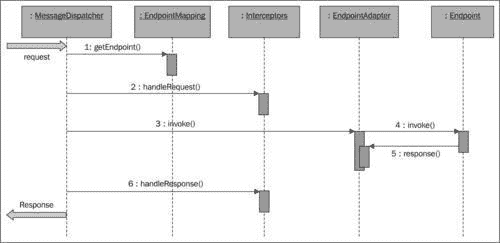
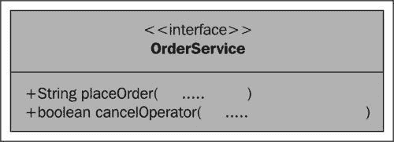
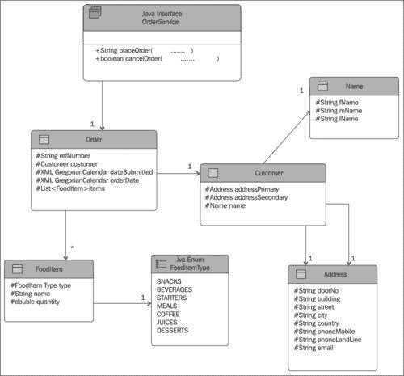

# 第一章：构建 SOAP Web 服务

在本章中，我们将涵盖：

+   使用 Maven 构建和运行 Spring-WS 项目

+   创建数据合同

+   使用`DispatcherServlet`设置 Web 服务

+   使用`MessageDispatcherServlet`简化 Web 服务的创建

+   在 JMS 传输上设置 Web 服务

+   在电子邮件传输上设置 Web 服务

+   在嵌入式 HTTP 服务器传输上设置 Web 服务

+   在 XMPP 传输上设置 Web 服务

+   为 Web 服务设置简单的端点映射

+   设置基于契约的 Web 服务

+   通过注释 payload-root 设置端点

+   设置一个与传输无关的 WS-Addressing 端点

+   使用 XPath 表达式设置端点

+   使用 DOM 处理传入的 XML 消息

+   使用 JDOM 处理传入的 XML 消息

+   使用 JAXB2 处理传入的 XML 消息

+   使用拦截器在服务器端验证 XML 消息

# 介绍

SOAP（Simple Object Access Protocol）旨在成为语言、传输和平台无关的，这是一种替代传统中间件技术（如 CORBA 和 DCOM）的选择。SOAP 也被设计为可扩展的。所谓的 WS-*标准——WS-Addressing、WS-Policy、WS-Security 等都是基于 SOAP 协议构建的。

使用 SOAP 的 Web 服务，以及 WSDL 和 XML 模式，已经成为交换基于 XML 的消息的标准。Spring Web 服务通过提供一套全面的 API 和配置，为灵活的 Web 服务的创建提供了便利。下图显示了 Spring-WS 在接收到传入消息时的工作方式（图表以抽象形式呈现）：



`MessageDispatcher`是 Spring Web 服务的中心点，将 Web 服务消息分派到注册的端点。在 Spring-WS 中，请求/响应消息被包装在`MessageContext`对象中，并且`MessageContext`将被传递给`MessageDispatcher`（在调用端点后，响应将被设置到`MessageContext`中）。当消息到达时，`MessageDispatcher`使用请求对象获取端点。（将请求映射到端点称为**端点映射**，可以通过使用应用程序上下文中的 bean 注册数据、扫描和自动检测注释来完成）。然后，`MessageDispatcher`通过使用端点，获取端点的拦截器（从零到多个），并在它们上调用`handleRequest`方法。

拦截器（这里是`EndpointInterceptor`）拦截请求/响应，在调用端点之前/之后执行一些操作。这个`EndpointInterceptor`在调用适当的端点之前/之后被调用，执行诸如日志记录、验证、安全等多个处理方面。接下来，`MessageDispatcher`获取适当的端点适配器，用于调用端点方法。每个适配器都专门用于调用具有特定方法参数和返回类型的方法。

最后，`EndpointAdapter`调用端点的方法，并将响应转换为所需的形式，并将其设置到`MessageContext`对象中。现在，最初传递给`MessageDispatcher`的消息上下文包含了响应对象，该对象将被转发给客户端（由`MessageDispatcher`的调用者）。

Spring-WS 只支持基于契约的开发风格，其中创建契约（XSD 或 WSDL）是第一步。使用 Spring-WS 构建基于契约的 Web 服务的必要步骤如下：

1.  合同定义（XSD 或 WSDL）

1.  创建端点：接收和处理传入消息的类。

1.  Spring bean 和端点的配置。

有两种类型的端点，即有效载荷端点和消息端点。虽然消息端点可以访问整个 XML SOAP 包络，有效载荷端点只能访问 SOAP 包络的有效载荷部分，也就是 SOAP 包络的主体。在本书中，重点是创建有效载荷端点。

在本章中，在解释从一组 XML 消息创建合同的教程之后，主要关注点将放在实现端点及其相关配置上。

为了说明 Web 服务的构建过程，本书使用了一个虚构的餐厅 Live Restaurant 的简单业务场景，该餐厅需要接受来自客户的在线订单。Live Restaurant 决定将其`OrderService`组件发布为 Web 服务。为简单起见，`OrderService`（Java 接口）只考虑了两个操作。



项目将遵循以下领域模型：



本书中的每个教程都将逐步构建项目的各个部分，使其成为完整的 Web 服务应用程序。Java 项目名称为`LiveRestaurant`，每个教程将使用项目的略有不同的版本，带有扩展名`_R-x.x`。例如，本章的第一个教程将使用`LiveRestaurant_R-1.1`作为 Web 服务服务器，`LiveRestaurant_R-1.1-Client`作为客户端的项目名称。

### 注意

本章的目标是设置 Web 服务，因此更多的重点是在服务器端代码和设置的解释上。本章中使用客户端代码来检查服务器的功能。有关客户端代码、设置和测试的更多内容将在接下来的章节中讨论。

# 使用 Maven 构建和运行 Spring-WS 项目

基于企业级开源技术的最新现代软件开发需要一代新的构建和项目管理工具。这些工具可以为构建、管理和部署小规模到大规模应用程序提供标准的方式。

Maven 是由 Apache 软件基金会托管的项目管理和自动化构建和部署工具。Maven 建立在 Ant 的功能基础之上，并添加了诸如特性依赖和项目管理等功能。Maven 最初用于 Java 编程，但也可以用于构建和管理其他编程语言编写的项目。近年来，Maven 已被用于自动化构建、管理和测试主要开源项目的部署过程。

本教程详细介绍了设置 Maven 用于构建、测试和部署本书中使用的项目所需的步骤。

## 准备工作

本教程需要安装以下软件或工具：

1.  Java 6 或更高版本和 Maven 3.0.2：有关下载和安装，请参阅[`maven.apache.org/`](http://maven.apache.org/)和[`www.oracle.com/technetwork/java/javase/downloads/index.html`](http://www.oracle.com/technetwork/java/javase/downloads/index.html)。

1.  将您的自定义存储库添加到`MAVEN_HOME/conf`或`.m2`文件夹下的`settings.xml`中（`MAVEN_HOME`是安装 Maven 的文件夹，`.m2`是 Maven 下载其构件的文件夹）。

稍后，您可以向自定义存储库添加额外的存储库。您可以通过将`activeByDefault`设置为`false`来禁用此存储库（包含存储库的文件位于`resources`文件夹中）：

```java
<profile>
<id>my-repository</id>
<activation>
<activeByDefault>true</activeByDefault>
</activation>
<!-- list of standard repository -->
<repositories>
...
...
<repository>
<id>maven2-repository.java.net</id>
<name>Java.net Repository for Maven</name>
<url>http://download.java.net/maven/2</url>
</repository>
....
<repository>
<id>maven1-repository.java.net</id>
<name>Java.net Repository for Maven</name>
<url>http://download.java.net/maven/1</url>
</repository>
</repositories>
</profile>

```

将 Maven 存储库包含到 Maven 构建中的另一种方法是直接在 POM 文件中包含存储库数据。本章的资源包的`Using Maven`文件夹中包含了包含存储库的两种方式的示例。

## 如何做...

1.  构建和部署项目。

```java
mvn clean package tomcat:run

```

1.  浏览以下 Web 服务 WSDL 文件：

```java
http://localhost:8080/LiveRestaurant/OrderService.wsdl

```

1.  浏览器的输出如下：

```java
<wsdl:definitions
targetNamespace="http://www.packtpub.com/liverestaurant/OrderService/schema">
<wsdl:types>
<schema elementFormDefault="qualified" targetNamespace="http://www.packtpub.com/liverestaurant/OrderService/schema">
<element name="placeOrderRequest">
<complexType>
<sequence>
<element name="order" type="QOrder:Order" />
</sequence>
</complexType>
........
</schema>
</wsdl:types>
.......
<wsdl:binding name="OrderServiceSoap11" type="tns:OrderService">
<soap:binding style="document"
transport="http://schemas.xmlsoap.org/soap/http" />
<wsdl:operation name="placeOrder">
<soap:operation soapAction="" />
<wsdl:input name="placeOrderRequest">
<soap:body use="literal" />
</wsdl:input>
<wsdl:output name="placeOrderResponse">
<soap:body use="literal" />
</wsdl:output>
</wsdl:operation>
<wsdl:operation name="cancelOrder">
<soap:operation soapAction="" />
<wsdl:input name="cancelOrderRequest">
<soap:body use="literal" />
</wsdl:input>
<wsdl:output name="cancelOrderResponse">
<soap:body use="literal" />
</wsdl:output>
</wsdl:operation>
</wsdl:binding>
<wsdl:service name="OrderServiceService">
<wsdl:port binding="tns:OrderServiceSoap11" name="OrderServiceSoap11">
<soap:address
location="http://localhost:8080/LiveRestaurant/spring-ws/OrderService" />
</wsdl:port>
</wsdl:service>
</wsdl:definitions>

```

1.  以下是 Maven 命令的输出：

```java
...........
[INFO] Building war: C:\...\LiveRestaurant.war
.......
[INFO] --- tomcat-maven-plugin:1.1:run ...@ LiveRestaurant ---
[INFO] Running war on http://localhost:8080/LiveRestaurant
[INFO] Creating Tomcat server configuration ...
Oct 15,...org.apache.catalina.startup.Embedded start
INFO: Starting tomcat server
Oct 15...org.apache.catalina.core.StandardEngine start
INFO: Starting Servlet Engine: Apache Tomcat/6.0.29
org.apache.catalina.core.ApplicationContext log
...Set web app root ..: 'webapp.root' = [...src\main\webapp\]
INFO: Initializing log4j from..WEB-INF\log4j.properties]
...
INFO: Initializing Spring FrameworkServlet 'spring-ws'
......
INFO .. - FrameworkServlet 'spring-ws': initialization ..
Oct .. org.apache.coyote.http11.Http11Protocol init
INFO: Initializing Coyote HTTP/1.1 on http-8080
Oct .. org.apache.coyote.http11.Http11Protocol start
INFO: Starting Coyote HTTP/1.1 on http-8080 

```

### 注意

要将 Maven 项目导入 Eclipse IDE，可以选择以下方法：

转到项目的根目录（\chapterOne\LiveRestaurant_R-1.1）并执行：

```java
mvn eclipse:eclipse -Declipse.projectNameTemplate="LiveRestaurant_R-1.1" 

```

然后，您可以将 Maven 项目导入 Eclipse 项目。

如果 Maven 找不到一个 JAR 文件，可以使用以下命令使用自定义存储库：

```java
mvn -P my-repository clean package tomcat:run 

```

## 工作原理...

`mvn clean package`将所需的组件安装到本地存储库，并创建项目的 WAR/JAR 文件：

```java
[INFO] Building war: ...LiveRestaurant.war 

```

`mvn tomcat:run`在 Tomcat 插件上运行项目的 WAR 文件。`mvn jetty:run`在 Jetty 插件上运行项目的 WAR 文件：

```java
INFO] --- tomcat-maven-plugin:1.1:... LiveRestaurant ---
[INFO] Running war on http://localhost:8080/LiveRestaurant
[INFO] Creating Tomcat server configuration at 

```

# 创建数据合同

WSDL 文档，也称为服务合同，提供了 Web 服务客户端和服务器交换数据的标准方式。使用 WSDL，客户端和服务器可以位于不同的应用程序或平台上。XML Schema Definition（XSD），也称为数据合同，描述了 Web 服务服务器和客户端之间交换的数据类型的结构。XSD 描述了类型、字段以及这些字段上的任何验证（如最大/最小或模式等）。虽然 WSDL 是特定于 Web 服务的，描述了 Web 服务的工件，如方法和通过这些方法传递的数据（WSDL 本身使用 XSD 进行描述），URL 等；XSD 只呈现数据的结构。

为了能够设置 Spring Web 服务，我们需要一个合同。有四种不同的方法可以为 XML 定义这样的合同：

+   DTDs

+   XML Schema（XSD）

+   RELAX NG

+   Schematron

DTDs 对命名空间的支持有限，因此不适用于 Web 服务。RELAX NG 和 Schematron 肯定比 XML Schema 更容易。不幸的是，它们在各个平台上的支持并不如此广泛。Spring-WS 使用 XML Schema。

数据合同是 Spring-WS 的中心，服务合同可以从数据合同中生成。创建 XSD 的最简单方法是从样本文档中推断出来。任何良好的 XML 编辑器或 Java IDE 都提供了这种功能。基本上，这些工具使用一些样本 XML 文档，并从中生成一个模式，用于验证它们。在这个配方中，我们将讨论样本 XML 数据消息以及如何将它们转换为单个模式文件。生成的模式文件在本书中用作数据合同。

## 准备工作

1.  安装 Java（如第一个配方中所述）。

1.  从[`xmlbeans.apache.org/`](http://xmlbeans.apache.org/)安装 xmlbeans-2.5.0。

1.  本配方的资源包含在文件夹 Create Data Contract 中。

## 如何做...

1.  将您的 XML 消息（placeOrderRequest.xml、placeOrderResponse、cancelOrderRequest.xml 和 cancelOrderResponse.xml）复制到`xmlbeans-2.5.0\bin`工作文件夹中。

1.  运行以下命令：

```java
inst2xsd -design rd -enumerations never placeOrderRequest.xml placeOrderResponse.xml cancelOrderRequest 

```

1.  上述命令创建了`schema0.xsd`模式文件。生成的模式结果肯定需要修改，但这是一个很好的起点。这是最终精心制作的模式（orderService.xsd）：

```java
<?xml version="1.0" encoding="UTF-8"?>
......
<schema...">
<element name="placeOrderRequest">
<complexType>
<sequence>
<element name="order" type="QOrder:Order"></element>
</sequence>
</complexType>
</element>
<element name="placeOrderResponse">
<complexType>
<sequence>
<element name="refNumber" type="string"></element>
</sequence>
</complexType>
</element>
.........
data contractdata contractcreating<complexType name="Order">
<sequence>
<element name="refNumber" type="string"></element>
<element name="customer" type="QOrder:Customer"></element>
<element name="dateSubmitted" type="dateTime"></element>
<element name="orderDate" type="dateTime"></element>
<element name="items" type="QOrder:FoodItem"
maxOccurs="unbounded" minOccurs="1">
</element>
</sequence>
</complexType>
<complexType name="Customer">
<sequence>
<element name="addressPrimary" type="QOrder:Address"></element>
<element name="addressSecondary" type="QOrder:Address"></element>
<element name="name" type="QOrder:Name"></element>
</sequence>
</complexType>
....
</schema>

```

### 工作原理...

首先需要输入和输出样本消息。在本书中，有四个 XML 消息（placeOrderRequest.xml、`placeOrderResponse、cancelOrderRequest.xml`和`cancelOrderResponse.xml`），所有的配方都使用这些消息数据格式进行通信。`Inst2xsd`从现有的 XML 样本消息生成模式文件。本配方的资源包含在本章的资源包中的`Create Data Contract`文件夹中。

# 使用 DispatcherServlet 设置 Web 服务

Spring-WS 提供了在 Java 平台上开发 Web 服务的最简单机制之一。这个配方专注于使用 Spring-WS 提供的 Spring-MVC `DispatcherServlet`和组件构建一个非常简单的 Web 服务。

## 准备工作

在这个配方中，项目的名称是`LiveRestaurant_R-1.2`，具有以下 Maven 依赖项：

+   `spring-ws-core-2.0.1.RELEASE.jar`

+   `log4j-1.2.9.jar`

## 如何做...

1.  从`resources`文件夹中复制服务合同（orderService.wsdl）。

1.  创建一个端点（OrderSeviceMessageReceiverEndpoint）。

1.  在服务器 Spring 配置文件（`Dispatcher-servlet.xml`）中配置端点、服务合同、`WebServiceMessageReceiverHandlerAdapter, MessageDispatcher`和`WsdlDefinitionHandlerAdapter`。

1.  在`web.xml`文件中配置`DispatcherServlet`。

1.  使用以下命令运行服务器：

```java
mvn clean package tomcat:run 

```

+   以下是输出：

```java
...........................
[INFO] Running war on http://localhost:8080/LiveRestaurant
...................................
18-Oct-2011 10:23:02.....ApplicationContext log
INFO: Initializing Spring FrameworkServlet 'Dispatcher'
18-Oct-2011 10:23:02 org.apache.coyote.http11.Http11Protocol init
INFO: Initializing Coyote HTTP/1.1 on http-8080
18-Oct-2011 10:23:02 org.apache.coyote.http11.Http11Protocol start
INFO: Starting Coyote HTTP/1.1 on http-8080 

```

1.  要浏览您的服务 WSDL，请在浏览器中打开以下链接：

```java
http://localhost:8080/LiveRestaurant/Dispatcher/OrderService.wsdl

```

1.  要进行测试，打开一个新的命令窗口，转到文件夹`LiveRestaurant_R-1.2-Client`，并运行以下命令：

```java
mvn clean package exec:java 

```

+   以下是服务器端输出：

```java
Inside method, OrderSeviceMethodEndpoint.receive - message content = <?xml version="1.0" encoding="UTF-8"?><tns:placeOrderRequest >
<tns:order>
<tns:refNumber>9999</tns:refNumber>
<tns:customer>
........
</tns:customer>
<tns:dateSubmitted>2008-09-29T05:49:45</tns:dateSubmitted>
<tns:orderDate>2014-09-19T03:18:33</tns:orderDate>
<!--1 or more repetitions:-->
<tns:items>
<tns:type>Snacks</tns:type>
<tns:name>Pitza</tns:name>
<tns:quantity>2</tns:quantity>
</tns:items>
</tns:order>
</tns:placeOrderRequest> 

```

## 它是如何工作的...

`DispatcherServlet`接收所有传入的请求，并根据请求上下文将请求转发到端点（请求 URL 的一般形式为`http://<host>:<port>/<appcontext>/<requestcontext>`（这里`appcontext`是 Liverestaurant，`requestcontext`应以`/Dispatcher/`开头）。以`/OrderService`结尾的请求上下文转到`OrderSeviceMessageReceiverEndpoint`，以`*.wsdl`结尾的请求转到`SimpleWsdl11Definition`）。

在`web.xml`中配置的`DispatcherServlet`负责接收所有具有 URL 映射`[/Dispatcher/*]`的请求。

```java
<servlet>
<servlet-name>Dispatcher</servlet-name>
<servlet-class>org.springframework.web.servlet.DispatcherServlet</servlet-class>
<load-on-startup>1</load-on-startup>
</servlet>
<servlet-mapping>
<servlet-name>Dispatcher</servlet-name>
<url-pattern>/Dispatcher/*</url-pattern>
</servlet-mapping>

```

您可以更改 URL 模式以满足您的需求。

`DispatcherServlet`在拦截 HTTP 请求并加载 Spring bean 配置文件方面起着重要作用。默认情况下，它通过名称`<servlet-name>-servlet.xml`来检测 bean 配置文件。由于我们在`web.xml`文件中将`DispatcherServlet`命名为`Dispatcher`，服务器会寻找`Dispatcher-servlet.xml`作为应用程序上下文文件名。您可以使用`web.xml`中的以下上下文`param`来配置另一个文件：

```java
<context-param>
<param-name>contextConfigLocation</param-name>
<param-value>/WEB-INF/classes/applicationContext.xml</param-value>
</context-param>

```

`DispatcherServlet`需要`WebServiceMessageReceiverHandlerAdapter, MessageDispatcher`和`WsdlDefinitionHandlerAdapter`的单独实例，这些实例在`Dispatcher-servlet.xml`中进行了配置。默认情况下，`DispatcherServlet`委托给控制器处理请求，但在配置文件中，它被配置为委托给`MessageDispatcher`（`WebServiceMessageReceiverHandlerAdapter）。SaajSoapMessageFactory`是 Spring-WS 中用于消息创建的特定消息工厂。

```java
<beans ...">
<bean class="org.springframework.ws.transport.http.WebServiceMessageReceiverHandlerAdapter">
<property name="messageFactory">
<bean class="org.springframework.ws.soap.saaj.SaajSoapMessageFactory"></bean>
</property>
</bean>
.......

```

让`DispatcherServlet`处理 WSDL 合同，需要在配置文件中注册`WsdlDefinitionHandlerAdapter`；它使用`WsdlDefinition`实现（`SimpleWsdl11Definition`）来读取 WSDL 文件源，并将其作为结果写入`HttpServletResponse`。

`SimpleUrlHandlerMapping`用于使用 URL 模式将客户端请求重定向到适当的端点。在这里，以`*.wsdl`结尾的请求 URL 将被重定向到`sampleServiceDefinition`（即使用`OrderService.wsdl`生成响应的`SimpleWsdl11Definition`），如果请求 URL 包含`/OrderService`，它将被重定向到`OrderSeviceMessageReceiverEndpoint。SOAPMessageDispatcher`用于将 SOAP 消息分派到已注册的端点（`OrderSeviceMessageReceiverEndpoint`）。

```java
.......
<bean class="org.springframework.web.servlet.handler.SimpleUrlHandlerMapping">
<property name="mappings">
<props>
<prop key="*.wsdl">sampleServiceDefinition</prop>
<prop key="/OrderService">OrderServiceEndpoint</prop>
</props>
</property>
<property name="defaultHandler" ref="messageDispatcher"/>
</bean>
<bean id="messageDispatcher" class="org.springframework.ws.soap.server.SoapMessageDispatcher"/>
<bean id="OrderServiceEndpoint" class="com.packtpub.liverestaurant.service.endpoint.OrderSeviceMessageReceiverEndpoint"/>
<bean class="org.springframework.ws.transport.http.WsdlDefinitionHandlerAdapter"/>
<bean id="sampleServiceDefinition" class="org.springframework.ws.wsdl.wsdl11.SimpleWsdl11Definition">
<property name="wsdl" value="/WEB-INF/OrderService.wsdl"/>
</bean>
</beans>
OrderSeviceMessageReceiverEndpoint is a very basic endpoint that get incoming message (messageContext.getRequest().getPayloadSource()) and prin it out:
........
public class OrderSeviceMessageReceiverEndpoint implements
WebServiceMessageReceiver {
public OrderSeviceMessageReceiverEndpoint() {
}
public void receive(MessageContext messageContext) throws Exception {
System.out
.println("Inside method, OrderSeviceMethodEndpoint.receive - message content = "
+ xmlToString(messageContext.getRequest().getPayloadSource()));
}

```

### 提示

您可以更改 URL 模式以满足您的需求。

```java
private String xmlToString(Source source) {
try {
StringWriter stringWriter = new StringWriter();
Result result = new StreamResult(stringWriter);
TransformerFactory factory = TransformerFactory.newInstance();
Transformer transformer = factory.newTransformer();
transformer.transform(source, result);
return stringWriter.getBuffer().toString();
} catch (TransformerConfigurationException e) {
e.printStackTrace();
} catch (TransformerException e) {
e.printStackTrace();
}
return null;
}
}

```

## 另请参阅

本章中的*使用 MessageDispatcherServlet 设置 Web 服务*食谱。

# 简化使用 MessageDispatcherServlet 创建 Web 服务

`MessageDispatcherServlet`是 Spring-WS 的核心组件。通过简单的配置，可以在几分钟内设置 Web 服务。这个 servlet 作为配置 Spring-MVC`DispatcherServlet`的替代方案而出现。与第二个食谱中*使用 DispatcherServlet 设置 Web 服务*一样，`DispatcherServlet`需要单独的`WebServiceMessageReceiverHandlerAdapter, MessageDispatcher`和`WsdlDefinitionHandlerAdapter`的实例。然而，`MessageDispatcherServlet`可以通过在应用程序上下文中设置来动态检测`EndpointAdapters, EndpointMappings, EndpointExceptionResolvers`和`WsdlDefinition`。

由于这是配置 Spring Web 服务的默认方法，因此将在后续配方中使用。在此配方中，详细介绍了设置 Spring-WS 的基本实现。更高级的实现将在后面的配方*设置基于契约的 Web 服务*中解释。

## 准备就绪

在此配方中，项目名称为 LiveRestaurant_R-1.3，具有以下 Maven 依赖项：

+   spring-ws-core-2.0.1.RELEASE.jar

+   `log4j-1.2.9.jar`

## 如何做...

1.  从资源文件夹（orderService.wsdl）复制服务合同。

1.  创建端点（OrderSeviceMethodEndpoint）。

1.  配置端点。服务合同在服务器 Spring 配置文件（spring-ws-servlet.xml）中。

1.  在 web.xml 文件中配置 MessageDispatcherServlet。

1.  使用以下命令运行服务器：

```java
mvn clean package tomcat:run 

```

+   成功运行服务器后的输出如下：

```java
...........................
[INFO] >>> tomcat-maven-plugin:1.1:run .. LiveRestaurant >>>
[..............
[INFO] Running war on http://localhost:8080/LiveRestaurant
[I...........
..XmlBeanDefinitionReader.. Loading..spring-ws-servlet.xml]
...
..SimpleMethodEndpointMapping#0, OrderService, OrderServiceEndpoint]; root of factory hierarchy
INFO [main] (SaajSoapMessageFactory.java:135) -..
INFO [main] (FrameworkServlet.java:320) - FrameworkServlet '
........
INFO: Starting Coyote HTTP/1.1 on http-8080 

```

1.  要浏览您的服务 WSDL，请在浏览器中打开以下链接：

```java
http://localhost:8080/LiveRestaurant/spring-ws/OrderService.wsdl

```

1.  要进行测试，打开一个新的命令窗口，转到文件夹 LiveRestaurant_R-1.3-Client，并运行以下命令：

```java
mvn clean package exec:java 

```

+   以下是服务器端的输出：

```java
Sent response
...
<tns:placeOrderResponse....>
<tns:refNumber>order-John_Smith_1234</tns:refNumber>
</tns:placeOrderResponse>
.....
for request
<tns:placeOrderRequest.... >
<tns:order>
<tns:refNumber>9999</tns:refNumber>
<tns:customer>
........
</tns:customer>
<tns:dateSubmitted>2008-09-29T05:49:45</tns:dateSubmitted>
<tns:orderDate>2014-09-19T03:18:33</tns:orderDate>
<!--1 or more repetitions:-->
<tns:items>
<tns:type>Snacks</tns:type>
<tns:name>Pitza</tns:name>
<tns:quantity>2</tns:quantity>
</tns:items>
</tns:order>
.... 

```

## 它是如何工作的...

MessageDispatcherServlet 在 web 配置文件 web.xml 中配置：

```java
<servlet>
<servlet-name>spring-ws</servlet-name>
<servlet-class>
org.springframework.ws.transport.http.MessageDispatcherServlet</servlet-class>
<load-on-startup>1</load-on-startup>
</servlet>
<servlet-mapping>
<servlet-name>spring-ws</servlet-name>
<url-pattern>/*</url-pattern>
</servlet-mapping>

```

### 提示

**下载示例代码**

您可以从[`www.PacktPub.com`](http://www.PacktPub.com)的帐户中下载您购买的所有 Packt 图书的示例代码文件。如果您在其他地方购买了本书，可以访问[`www.PacktPub.com/support`](http://www.PacktPub.com/support)并注册，以便文件直接通过电子邮件发送给您。

MessageDispatcherServlet 是处理传入 SOAP 请求的中心元素，借助其他组件（EndpointAdapters，EndpointMappings，EndpointExceptionResolvers 和 WsdlDefinition）。它结合了 DispatcherServlet 和 MessageDispatcher 的属性，以将请求分派到适当的端点。这是建议使用 Spring-WS 构建 Web 服务的标准 servlet。

由于 MessageDispatcherServlet 是从 FrameworkServlet 继承的，它会在类路径中查找名为<servlet-name>-servlet.xml 的配置文件（您可以使用 web.xml 中的 context-param，contextConfigLocation 设置更改配置文件名，如在配方*使用 DispatcherServlet 设置 Web 服务中所述）。在本例中，由于 web.xml 文件中的 servlet 名称设置为 Spring-WS，因此文件 spring-ws-servlet.xml 是 Web 服务配置文件。

然后，MessageDispatcherServlet 在配置文件中查找端点映射元素，以将客户端请求映射到端点。在这里，<sws:static-wsdl 设置 WSDL 格式的数据合同。这是在 spring-ws-servlet.xml 中配置的元素，用于设置 Web 服务：

```java
<bean class="org.springframework.ws.server.endpoint.mapping.SimpleMethodEndpointMapping">
<property name="endpoints">
<ref bean="OrderServiceEndpoint"/>
</property>
<property name="methodPrefix" value="handle"></property>
</bean>
<sws:static-wsdl id="OrderService" location="/WEB-INF/orderService.wsdl"/>
<bean id="OrderServiceEndpoint" class="com.packtpub.liverestaurant.service.endpoint.OrderSeviceMethodEndpoint">
</bean>

```

示例使用 SimpleMethodEndpointMapping 将客户端请求映射到 MethodEnpoints。它将传入请求映射到以消息的 handle+root 元素（handle+placeOrderRequest）开头的方法。在端点类（OrderSeviceMethodEndpoint）中，应定义一个名为 handleplaceOrderRequest 的方法。

在此方法中，参数源包括传入消息和从该参数中提取调用订单服务的输入参数，然后该方法调用 orderService 方法，并将传出消息包装在 StringSource 中，以发送回客户端：

```java
public class OrderSeviceMethodEndpoint {
OrderService orderService;
public void setOrderService(OrderService orderService) {
this.orderService = orderService;
}
public @ResponsePayload
Source handleplaceOrderRequest(@RequestPayload Source source) throws Exception {
//extract data from input parameter
String fName="John";
String lName="Smith";
String refNumber="1234";
return new StringSource(
"<tns:placeOrderResponse xmlns:tns=\"http://www.packtpub.com/liverestaurant/OrderService/schema\"><tns:refNumber>"+orderService.placeOrder(fName,lName,refNumber)+"</tns:refNumber></tns:placeOrderResponse>");
}

```

端点映射将在后面的配方中详细说明。

## 另请参阅

在本章中讨论的配方*使用 DispatcherServlet 设置 Web 服务，为 Web 服务设置简单的端点映射*和*设置基于契约的 Web 服务*。

# 在 JMS 传输上设置 Web 服务

HTTP 是最常见的 Web 服务协议。但是，Web 服务目前是建立在多种传输上的，每种传输都有不同的场景。

JMS 在 1999 年由 Sun Microsystems 包含在 Java 2、J2EE 中。使用 JMS，系统能够同步或异步通信，并基于点对点和发布-订阅模型。SOAP over JMS 继承了 JSM 的特性，并满足以下要求：

+   需要异步消息传递时

+   当消息消费者比生产者慢时

+   为了保证消息的传递

+   要有发布者/订阅者（多个）模型

+   当发送者/接收者可能断开连接时

Spring Web 服务提供了在 JMS 协议上设置 Web 服务的功能，该功能是建立在 Spring 框架中的 JMS 功能之上的。在这个配方中，介绍了如何在 JMS 上设置 Spring-WS。

## 准备工作

在这个配方中，项目的名称是 `LiveRestaurant_R-1.4`，具有以下 Maven 依赖项：

+   `spring-ws-core-2.0.1.RELEASE.jar`

+   `spring-ws-support-2.0.1.RELEASE.jar`

+   `spring-test-3.0.5.RELEASE.jar`

+   `spring-jms-3.0.5.RELEASE.jar`

+   `junit-4.7.jar`

+   `xmlunit-1.1.jar`

+   `log4j-1.2.9.jar`

+   `jms-1.1.jar`

+   `activemq-core-4.1.1.jar`

在这个配方中，使用 Apache ActiveMQ 来设置 JMS 服务器并创建 JMS 服务器相关的对象（这里使用了队列和代理）。Spring-WS 家族的 JAR 提供了设置 Spring-WS 的功能，而 `spring-jms` 和 `jms` JAR 提供了 Spring-WS 在 JMS 上建立的 JMS 功能。

## 如何做...

1.  创建端点 `(OrderSeviceMethodEndpoint)`。

1.  在 Spring 配置文件 (`applicationContext.xml`) 中配置 `MessageListenerContainer`、`MessageListener` 和 `connectionFactory`。

1.  在 `applicationContext.xml` 中配置包括端点映射的 `MessageDispatcher`。

1.  使用以下命令运行配方项目：

```java
mvn clean package 

```

1.  一旦项目成功运行，以下是输出：

```java
INFO [main] (SaajSoapMessageFactory.java:135) -..
INFO [main] (DefaultLifecycleProcessor.java:330) -..
INFO [main] .. - ActiveMQ 4.1.1 JMS Message Broker (localhost)..
..
INFO [JMX connector] ..
INFO [main]..ActiveMQ JMS Message Broker ..started
INFO [main] ..- Connector vm://localhost Started
.....
Received response ....
<tns:placeOrderResponse ..><tns:refNumber>..</tns:refNumber>
</tns:placeOrderResponse>....
for request ....
<tns:placeOrderRequest ....>
<tns:order>
<tns:refNumber>9999</tns:refNumber>
<tns:customer>
.....
</tns:customer>
<tns:dateSubmitted>2008-09-29T05:49:45</tns:dateSubmitted>
<tns:orderDate>2014-09-19T03:18:33</tns:orderDate>
<!--1 or more repetitions:-->
<tns:items>
<tns:type>Snacks</tns:type>
<tns:name>Pitza</tns:name>
<tns:quantity>2</tns:quantity>
</tns:items>
</tns:order>
</tns:placeOrderRequest>
........ 

```

## 工作原理...

`DefaultMessageListenerContainer` 监听 `destinationName` `(RequestQueue)` 以接收传入的消息。当消息到达时，此监听器将使用消息工厂 `(messageFactory)` 提取消息，并使用调度程序 `(messageDispatcher)` 将消息分派到端点 `(SimplePayloadEndpoint)`.............

在应用程序上下文中，`WebServiceMessageListener` 是 `MessageListenerContainer` 中的监听器。消息容器使用 `connectionfactory` 连接到目的地（RequestQueue）：

```java
<bean id="connectionFactory" class="org.apache.activemq.ActiveMQConnectionFactory">
<property name="brokerURL" value="vm://localhost?broker.persistent=false"/>
</bean>
<bean id="messageFactory" class="org.springframework.ws.soap.saaj.SaajSoapMessageFactory"/>
<bean class="org.springframework.jms.listener.DefaultMessageListenerContainer">
<property name="connectionFactory" ref="connectionFactory"/>
<property name="destinationName" value="RequestQueue"/>
<property name="messageListener">
<bean class="org.springframework.ws.transport.jms.WebServiceMessageListener">
<property name="messageFactory" ref="messageFactory"/>
<property name="messageReceiver" ref="messageDispatcher"/>
</bean>
</property>
</bean>

```

此监听器使用 `message Dispatcher` 和 `messageFactory` 来接收传入的消息并发送传出的 SOAP 消息。在 `messageDiapatcher` 中，包括端点的映射，设置端点 `(SimplePayloadEndpoint)` 和端点映射的类型 `(PayloadRootQNameEndpointMapping)`：

```java
<bean id="messageDispatcher" class="org.springframework.ws.soap.server.SoapMessageDispatcher">
<property name="endpointMappings">
<bean class="org.springframework.ws.server.endpoint.mapping.PayloadRootQNameEndpointMapping">
<property name="defaultEndpoint">
<bean class="com.packtpub.liverestaurant.service.endpoint.SimplePayloadEndpoint">
<property name="orderService">
<bean class="com.packtpub.liverestaurant.service.OrderServiceImpl"/>
</property>
</bean>
</property>
</bean>
</property>
</bean>

```

当请求到达服务器时，端点 `(SimplePayloadEndpoint)` 的 `invoke` 方法将被调用，并且将返回响应以发送回客户端：

```java
public class SimplePayloadEndpoint implements PayloadEndpoint {
OrderService orderService;
public void setOrderService(OrderService orderService) {
this.orderService = orderService;
}
public Source invoke(Source request) throws Exception {
//extract data from input parameter
String fName="John";
String lName="Smith";
String refNumber="1234";
return new StringSource(
"<tns:placeOrderResponse xmlns:tns=\"http://www.packtpub.com/liverestaurant/OrderService/schema\"><tns:refNumber>"+orderService.placeOrder(fName, lName, refNumber)+"</tns:refNumber></tns:placeOrderResponse>");
}

```

`JmsTransportWebServiceIntegrationTest` 包含在项目中，用于加载应用程序上下文，设置 JMS 服务器并测试 Web 服务。但这些细节在这里没有讨论。JMS 传输的客户端将在下一章中讨论。

## 另请参阅

在第二章中讨论了 *在 JMS 传输上创建 Web 服务客户端* 配方，*构建 SOAP Web 服务的客户端* 和在第十章中讨论了 *使用 JMS 作为底层通信协议暴露 Web 服务* 的配方，*Spring 远程调用*。

# 在电子邮件传输上设置 Web 服务

HTTP 容易理解，因此通常被定义和实现，但在任何情况下都不是 Web 服务的最合适的传输方式。

电子邮件传输的 Web 服务可以利用存储转发消息传递来提供 SOAP 的异步传输。此外，电子邮件上没有防火墙问题，那些能够相互通信的应用程序无需设置 Web 服务器来建立 Web 服务。这允许在 HTTP 不适用的许多场景中使用 SOAP 通过邮件传输。

设置 Web 服务通过 HTTP 不适合的原因，以及电子邮件可能作为传输协议的解决方案如下所列：

+   如果系统受到防火墙的保护，就无法控制 HTTP 请求/响应，但是电子邮件始终是可访问的。

+   如果系统不期望传统的请求/响应模型。例如，需要发布/订阅模型。

+   如果请求花费太长时间来完成。例如，如果服务器必须运行复杂和耗时的服务，客户端将收到 HTTP 超时错误。在这种情况下，通过电子邮件的 Web 服务更合适。

在这个配方中，介绍了通过电子邮件传输设置 Web 服务。为了加载应用程序上下文并测试 Web 服务，使用了一个测试类。这个类还启动和关闭服务器。

## 准备工作

在这个配方中，项目的名称是`LiveRestaurant_R-1.5`，具有以下 Maven 依赖项：

+   `spring-ws-core-2.0.1.RELEASE.jar`

+   `spring-ws-support-2.0.1.RELEASE.jar`

+   `spring-test-3.0.5.RELEASE.jar`

+   `mail-1.4.1.jar`

+   `mock-javamail-1.6.jar`

+   `junit-4.7.jar`

+   `xmlunit-1.1.jar`

在使用 JavaMail 进行测试的系统外设置邮件服务器是困难的。模拟 JavaMail 解决了这个问题，并为使用 JavaMail 的系统提供了可插拔的组件。系统可以使用这个组件来针对临时的内存*邮箱*发送/接收电子邮件。

## 如何做...

1.  创建端点`(SimplePayloadEndpoint)`。

1.  在`applicationContext.xml`中配置包含端点映射的`MessageReceiver`和`MessageDispatcher`。

1.  使用以下命令运行配方项目：

```java
mvn clean package 

```

+   以下是输出：

```java
........
INFO [main] ...- Creating SAAJ 1.3 MessageFactory with SOAP 1.1 Protocol
..- Starting mail receiver [imap://server@packtpubtest.com/INBOX]
....
Received response...
<tns:placeOrderResponse >
<tns:refNumber>...</tns:refNumber></tns:placeOrderResponse>
...for request ..
<tns:placeOrderRequest >
<tns:order>
<tns:refNumber>9999</tns:refNumber>
<tns:customer>
....
</tns:customer>
<tns:dateSubmitted>2008-09-29T05:49:45</tns:dateSubmitted>
<tns:orderDate>2014-09-19T03:18:33</tns:orderDate>
<!--1 or more repetitions:-->
<tns:items>
<tns:type>Snacks</tns:type>
<tns:name>Pitza</tns:name>
<tns:quantity>2</tns:quantity>
</tns:items>
</tns:order>
</tns:placeOrderRequest>
...... 

```

## 它是如何工作的...

发送到地址的消息将保存在收件箱中。消息接收器`(messageReceiver)`会在连续的间隔中监视收件箱，一旦检测到新的电子邮件，它就会读取电子邮件，提取消息，并将消息转发给消息调度程序`(messageDispatcher)`。消息调度程序将调用其默认端点`(SamplePayloadEndpoint)`内的`invoke`方法，并在处理程序方法`(invoke)`内将响应发送回客户端。

当加载应用程序上下文时，`MailMessageReceiver`启动邮件接收器及其收件箱文件夹`(imap://server@packtpubtest.com/INBOX)`，即临时内存收件箱。加载应用程序上下文后，`messageReceiver` bean 充当基于可插拔策略`(monotoringStrategy)`监视`INBOX`文件夹`(imap://server@packtpubtest.com/INBOX)`上的新消息的服务器监视器，轮询间隔为 1000 毫秒。`storeUri`是要监视传入消息的位置`(imap://server@packtpubtest.com/INBOX)`，`transportUri`是用于发送响应的邮件服务器：

```java
<bean id="messageFactory" class="org.springframework.ws.soap.saaj.SaajSoapMessageFactory"/>
<bean id="messagingReceiver" class="org.springframework.ws.transport.mail.MailMessageReceiver">
<property name="messageFactory" ref="messageFactory"/>
<property name="from" value="server@packtpubtest.com"/>
<property name="storeUri" value="imap://server@packtpubtest.com/INBOX"/>
<property name="transportUri" value="smtp://smtp.packtpubtest.com"/>
<property name="messageReceiver" ref="messageDispatcher"/>
<property name="session" ref="session"/>
<property name="monitoringStrategy">
<bean class="org.springframework.ws.transport.mail.monitor.Pop3PollingMonitoringStrategy">
<property name="pollingInterval" value="1000"/>
</bean>
</property>
</bean>

```

在`messageDiapatcher`中包含了端点映射，设置了端点`(SimplePayloadEndpoint)`和端点映射的类型`(PayloadRootQNameEndpointMapping)`：

```java
<bean id="messageDispatcher" class="org.springframework.ws.soap.server.SoapMessageDispatcher">
<property name="endpointMappings">
<bean class="org.springframework.ws.server.endpoint.mapping.PayloadRootQNameEndpointMapping">
<property name="defaultEndpoint">
<bean class="com.packtpub.liverestaurant.service.endpoint.SimplePayloadEndpoint">
<property name="orderService">
<bean class="com.packtpub.liverestaurant.service.OrderServiceImpl"/>
</property>
</bean>
</property>
</bean>
</property>
</bean>

```

`SimplePayloadEndpoint`接收请求并使用`OrderService`返回固定的虚拟响应。当请求到达服务器时，将调用`invoke`方法，并返回要发送回客户端的响应。

```java
public class SimplePayloadEndpoint implements PayloadEndpoint {
OrderService orderService;
public void setOrderService(OrderService orderService) {
this.orderService = orderService;
}
public Source invoke(Source request) throws Exception {
//extract data from input parameter
String fName="John";
String lName="Smith";
String refNumber="1234";
return new StringSource(
"<tns:placeOrderResponse xmlns:tns=\"http://www.packtpub.com/liverestaurant/OrderService/schema\"><tns:refNumber>"+orderService.placeOrder(fName, lName, refNumber)+"</tns:refNumber></tns:placeOrderResponse>");
}

```

为了测试这个配方，使用了`webServiceTemplate`。我们将在下一章讨论它。

`MailTransportWebServiceIntegrationTest`包含在项目中，用于加载应用程序上下文，设置邮件服务器并测试 Web 服务。

## 另请参阅

在第二章中讨论的*在电子邮件传输上创建 Web 服务客户端*配方，*构建 SOAP Web 服务的客户端*。

# 在嵌入式 HTTP 传输上设置 Web 服务

外部 HTTP 服务器可能能够提供多种功能，但它们不够轻便，需要配置才能设置。

Spring-WS 提供了一个功能，可以使用嵌入式 Sun 的 JRE 1.6 HTTP 服务器设置基于 HTTP 的 Web 服务。嵌入式 HTTP 服务器是一个轻量级的独立服务器，可以作为外部服务器的替代方案。在传统的外部服务器中，必须配置 Web 服务器的配置`(web.xml)`，而嵌入式 HTTP 服务器不需要任何部署描述符来操作，它唯一的要求是通过应用程序上下文配置服务器的实例。

在这个配方中，介绍了在嵌入式 HTTP 服务器上设置 Spring Web 服务。由于没有外部 HTTP 服务器，因此使用一个 Java 类来加载应用程序上下文并启动服务器。

## 准备工作

在这个配方中，项目的名称是`LiveRestaurant_R-1.6`，具有以下 Maven 依赖项：

+   `spring-ws-core-2.0.1.RELEASE.jar`

+   `log4j-1.2.9.jar`

## 如何做...

1.  从资源文件夹中复制服务契约`(OrderService.wsdl)`。

1.  创建一个服务及其实现，并使用`@Service("serviceName")`注解其实现`(OrderSevice,OrderServiceImpl)`。

1.  在应用程序上下文`(applicationContext)`中配置要自动扫描和检测的服务。

1.  在应用程序上下文中配置嵌入式 HTTP 服务器。

1.  添加一个具有主方法的 Java 类，以加载应用程序上下文来设置嵌入式 HTTP 服务器。

1.  使用以下命令运行服务器：

```java
mvn clean package exec:java 

```

1.  从`LiveRestaurant_R-1.6-Client`运行以下命令：

```java
mvn clean package exec:java 

```

+   当服务器成功运行时，以下是输出：

```java
<tns:placeOrderRequest >
<tns:order>
<tns:refNumber>order-John_Smith_1234</tns:refNumber>
<tns:customer>
.......
</tns:customer>
<tns:dateSubmitted>2008-09-29T05:49:45</tns:dateSubmitted>
<tns:orderDate>2014-09-19T03:18:33</tns:orderDate>
<!--1 or more repetitions:-->
<tns:items>
<tns:type>Snacks</tns:type>
<tns:name>Pitza</tns:name>
<tns:quantity>2</tns:quantity>
</tns:items>
</tns:order>
</tns:placeOrderRequest> 

```

+   以下是客户端的输出：

```java
<tns:placeOrderResponse ...><refNumber>order-John_Smith_1234</refNumber></tns:placeOrderResponse>>
......
..... 

```

## 它是如何工作的...

在应用程序上下文中，`SimpleHttpFactoryBean`创建一个简单的 HTTP 服务器（来自嵌入式 Sun 的 JRE 1.6），并在初始化时启动 HTTP 服务器，在销毁时停止它。

具有上下文属性的 HTTP 服务器使用服务类`(orderServiceImpl)`设置 Web 服务端点，并指定上下文内定义的 URL`(localhost:3478/OrderService)`。此服务接口在上下文属性中注册。

然而，服务实现是使用`component-scan`自动检测的。`HttpInvokerProxyFactoryBean`为特定服务器 URL 创建客户端代理。

```java
<context:annotation-config />
<context:component-scan base-package="com.packtpub.liverestaurant.service.endpoint" />
<bean id="httpServer" class="org.springframework.remoting.support.SimpleHttpServerFactoryBean">
<property name="contexts">
<util:map>
<entry key="/OrderService">
<bean class="org.springframework.remoting.httpinvoker.SimpleHttpInvokerServiceExporter">
<property name="serviceInterface" value="com.packtpub.liverestaurant.service.endpoint.IOrderServiceEndPoint" />
<property name="service" ref="orderServiceImpl" />
</bean>
</entry>
</util:map>
</property>
<property name="port" value="3478" />
<property name="hostname" value="localhost" />
</bean>

```

`IOrderServiceEndPointImpl`和`IOrderServiceEndPoint`是简单的服务接口和实现类。`IOrderServiceEndPointImpl`被`@Service`注解`(orderServiceImpl)`，并且将被检测为服务实现。

```java
package com.packtpub.liverestaurant.service.endpoint;
public interface OrderService {
String invoke(String request) throws Exception;
}
package com.packtpub.liverestaurant.service.endpoint;
import org.apache.log4j.Logger;
import org.springframework.stereotype.Service;
@Service("orderServiceImpl")
public class OrderServiceImpl implements OrderService {
static Logger logger = Logger.getLogger(OrderServiceImpl.class);
private static final String responseContent = "<tns:placeOrderResponse xmlns:tns=\"http://www.packtpub.com/liverestaurant/OrderService/schema\"><refNumber>Order Accepted!</refNumber></tns:placeOrderResponse>";
public String invoke(String request) throws Exception {
logger.info("invoke method request:"+request);
return responseContent;
}
}

```

`ServerStartUp.java`用于加载应用程序上下文并启动服务器：

```java
package com.packtpub.liverestaurant.server;
public class ServerStartUp {
public static void main(String[] args) throws IOException {
ClassPathXmlApplicationContext appContext = new ClassPathXmlApplicationContext("/applicationContext.xml");
System.out.println(appContext);
char c;
// Create a BufferedReader using System.in
BufferedReader br = new BufferedReader(new
InputStreamReader(System.in));
System.out.println("Enter any character to quit.");
c = (char) br.read();
appContext.close();
}

```

# 在 XMPP 传输上设置 Spring-WS

HTTP 通常用作 Web 服务传输协议。然而，它无法满足异步通信的要求。

XMPP 传输上的 Web 服务能够进行异步通信，客户端无需等待服务端的响应；相反，服务在完成过程后将响应发送给客户端。Spring-WS 2.0 包括 XMPP（Jabber）支持，其中 Web 服务可以通过 XMPP 协议进行通信。在这个配方中，介绍了在 XMPP 传输上设置 Spring-WS 的过程。由于没有外部 HTTP 服务器，因此使用一个测试类来加载应用程序上下文。

## 准备工作

在这个配方中，项目的名称是`LiveRestaurant_R-1.7`，具有以下 Maven 依赖项：

+   `spring-ws-core-2.0.1.RELEASE.jar`

+   `spring-ws-support-2.0.1.RELEASE.jar`

+   `spring-test-3.0.5.RELEASE.jar`

+   `junit-4.7.jar`

+   `xmlunit-1.1.jar`

+   `smack-3.1.0.jar`

## 如何做...

1.  创建一个端点`(SamplePlayLoadEndPoint)`。

1.  在应用程序上下文（`applicationContext.xml`）中配置与 XMPP 服务器的连接。

1.  在应用程序上下文中配置消息接收器。

1.  运行以下命令：

```java
mvn clean package 

```

+   以下是收到的响应：

```java
<placeOrderRequest ><id>9999</id></placeOrderRequest>
...
for request
...<placeOrderRequest ><id>9999</id></placeOrderRequet>... 

```

## 工作原理...

在应用程序上下文中，`messageFactory` bean 负责创建传入和传出的 SOAP 消息。`messageReceiver` bean 充当服务器，使用连接（到`XMPP 服务器：google talk`），并侦听具有用户名和密码的特定服务的主机。

```java
<bean id="messageFactory" class="org.springframework.ws.soap.saaj.SaajSoapMessageFactory"/>
<bean id="connection" class="org.springframework.ws.transport.xmpp.support.XmppConnectionFactoryBean">
<property name="host" value="talk.google.com"/>
<property name="username" value="yourUserName@gmail.com"/>
<property name="password" value="yourPassword"/>
<property name="serviceName" value="gmail.com"/>
</bean>
<bean id="messagingReceiver" class="org.springframework.ws.transport.xmpp.XmppMessageReceiver">
<property name="messageFactory" ref="messageFactory"/>
<property name="connection" ref="connection"/>
<property name="messageReceiver" ref="messageDispatcher"/>
</bean>

```

一旦客户端发送消息，它将通过消息分发器转发到端点（`SamplePlayLoadEndPoint`配置在`messageDispatcher`中），并将响应返回给客户端：

```java
<bean id="messageDispatcher"
class="org.springframework.ws.soap.server.SoapMessageDispatcher">
<property name="endpointMappings">
<bean class="org.springframework.ws.server.endpoint.mapping.PayloadRootQNameEndpointMapping">
<property name="defaultEndpoint"> <bean class="com.packtpub.liverestaurant.service.endpoint.SamplePlayLoadEndPoint"/>
</property> </bean>
</property>
</bean>

```

`Webservicetemplate`在这里用作客户端；将在下一章中讨论。

`SamplePlayLoadEndPoint`只接收请求并返回响应：

```java
public class SamplePlayLoadEndPoint implements PayloadEndpoint {
static Logger logger = Logger.getLogger(SamplePlayLoadEndPoint.class);
public Source invoke(Source request) throws Exception {
return request;
}

```

项目中包含一个测试类，用于加载应用程序上下文，设置 XMPP Web 服务服务器，并测试 Web 服务。

## 另请参阅

在第二章中讨论的*在 XMPP 传输上创建 Web 服务客户端*教程，*SOAP Web 服务的客户端*。

# 建立基于合同的 Web 服务

从 Java 代码生成 WSDL 和 XSD 合同并设置 Web 服务称为**合同后开发**。这种方法的主要缺点是 Web 服务的合同（WSDL 或 XSD）最终可能会发生变化，如果 Java 类发生任何更改。通过这种方式，客户端必须更新客户端类，这并不总是令人满意。合同优先方法被引入作为解决合同后瓶颈的替代方法。在合同优先方法中，合同（WSDL 或模式）是设置 Web 服务的主要工件。

合同优先方法相对于合同后方法的一些优点如下：

+   性能：在合同后方法中，可能会在客户端和服务器之间交换一些额外的数据，即 Java 代码的序列化，这会降低性能，而合同优先方法精确交换所需的数据并最大化性能。

+   一致性：在合同后方法中，不同的供应商可能会生成不同的 WSDL，而合同优先方法通过依赖于相同的合同来消除这个问题。

+   版本控制：更改合同后 Web 服务的版本意味着在客户端和服务器端更改 Java 类，如果有很多客户端调用 Web 服务，这可能最终会很昂贵，而在合同优先方法中，由于合同与实现解耦，版本控制可以通过在同一端点类中添加新的方法实现或使用样式表将旧消息格式转换为新消息格式来简单完成。

+   维护/增强成本：仅更改合同比在客户端和服务器端的 Java 代码中更改要便宜得多。在本教程中，我们将讨论如何使用 Spring-WS 建立基于合同的 Web 服务。

## 准备工作

在本教程中，项目名称为`LiveRestaurant_R-1.8`，具有以下 Maven 依赖项：

+   `spring-ws-core-2.0.1.RELEASE.jar`

+   `jdom-1.0.jar`

## 如何做...

1.  从资源文件夹复制数据合同（`orderService.xsd`）。

1.  创建一个端点（`OrderEndpoint`）。

1.  在服务器 Spring 配置文件（`spring-ws-servlet.xml`）中使用组件扫描配置端点的自动检测。

1.  配置从数据合同（`orderService.xsd`）动态生成 WSDL。

1.  使用以下命令运行服务器：

```java
mvn clean package tomcat:run 

```

1.  浏览以下链接以查看 WSDL：

```java
http://localhost:8080/LiveRestaurant/OrderService.wsdl

```

1.  从`LiveRestaurant_R-1.8-Client`运行客户端：

```java
mvn clean package 

```

+   当服务器成功运行时，以下是输出：

```java
Sent response....
<tns:placeOrderResponse ><tns:refNumber>tns:refNumber>order-John_S
mith_9999</tns:refNumber></tns:refNumber></
tns:placeOrderResponse>...
for request ...
<tns:placeOrderRequest >
<tns:order>
<tns:refNumber>9999</tns:refNumber>
<tns:customer>
....
</tns:customer>
<tns:dateSubmitted>2008-09-29T05:49:45</tns:dateSubmitted>
<tns:orderDate>2014-09-19T03:18:33</tns:orderDate>
<!--1 or more repetitions:-->
<tns:items>
<tns:type>Snacks</tns:type>
<tns:name>Pitza</tns:name>
<tns:quantity>2</tns:quantity>
</tns:items>
</tns:order>
</tns:placeOrderRequest> 

```

## 工作原理...

本配方的步骤与*使用 MessageDispatcherServlet 简化创建 Web 服务*的配方相同，只是端点处理方法的实现。

此注释作为`@Component`的特化，允许通过类路径扫描自动检测实现类，这在服务器应用程序上下文文件（`spring-ws-servlet.xml`）中进行了配置：

```java
<context:component-scan base-package="com.packtpub.liverestaurant.service"/>
<sws:annotation-driven/>

```

`OrderEndpoint`是本配方的`endPoint`，`@Endpoint`注释也与`@service`相同，允许通过类路径扫描自动检测实现类。具有根元素`placeOrderRequest`（`localPart = "placeOrderRequest"`）和命名空间`http://www.packtpub.com/liverestaurant/OrderService/schema`的请求将被转发到调用相应的方法（`handlePlaceOrderRequest`）。

```java
@Endpoint
public class OrderEndpoint {
private static final Log logger = LogFactory.getLog(OrderEndpoint.class);
private static final String NAMESPACE_URI = "http://www.packtpub.com/liverestaurant/OrderService/schema";
private OrderService orderService;
@Autowired
public OrderEndpoint(OrderService orderService) {
this.orderService = orderService;
}
@PayloadRoot(namespace = NAMESPACE_URI, localPart = "placeOrderRequest")
@ResponsePayload
public Source handlePancelOrderRequest(@RequestPayload Element placeOrderRequest) throws Exception {
String refNumber=placeOrderRequest.getElementsByTagNameNS(NAMESPACE_URI, "refNumber") .item(0).getTextContent();
String fName=placeOrderRequest.getElementsByTagNameNS(NAMESPACE_URI, "fName") .item(0).getTextContent();
String lName=placeOrderRequest.getElementsByTagNameNS(NAMESPACE_URI, "lName") .item(0).getTextContent();
return new StringSource(
"<tns:placeOrderResponse xmlns:tns=\"http://www.packtpub.com/liverestaurant/OrderService/schema\"><tns:refNumber>"+orderService.placeOrder(fName,lName, refNumber)+"</tns:refNumber></tns:placeOrderResponse>");
}
}

```

有关注释和请求如何映射到端点方法的其他详细信息包含在本章中。

`spring-ws-servlet.xml`文件中的以下设置会导致应用程序从数据合同（`orderService.xsd`）自动生成 WSDL 文件。

```java
<sws:dynamic-wsdl id="OrderService" portTypeName="OrderService" locationUri="http://localhost:8080/LiveRestaurant/spring-ws/OrderService"
targetNamespace="http://www.packtpub.com/liverestaurant/OrderService/schema">
<sws:xsd location="/WEB-INF/orderService.xsd"/>
</sws:dynamic-wsdl>

```

### 注意

尽管 WSDL 可以从数据合同（XSD）自动生成，但 Spring-WS 建议出于以下原因避免自动生成 WSDL：

+   为了保持发布之间的一致性（自动生成的不同版本的 WSDL 可能会有轻微差异）

+   WSDL 的自动生成速度较慢，尽管一旦生成，WSDL 将被缓存并在以后使用。

因此，Spring-WS 建议在开发时通过浏览器自动生成 WSDL 一次并保存，并使用静态 WSDL 来公开服务合同。

## 另请参阅

本章讨论的配方*通过注释有效载荷根设置端点，简化使用 MessageDispatcherServlet 创建 Web 服务*，以及第二章中讨论的*为 SOAP Web 服务构建客户端*配方。

还可以查看第十章中讨论的配方*Spring 远程调用*，了解如何设置基于契约的 Web 服务。

# 为 Web 服务设置简单的端点映射

本配方演示了一个非常简单的端点映射，将 Web 服务请求映射到 Java 类方法。

## 准备就绪

在本配方中，项目名称为`LiveRestaurant_R-1.9`，具有以下 Maven 依赖项：

+   `spring-ws-core-2.0.1.RELEASE.jar`

+   `log4j-12.9.jar`

## 如何做...

本配方的步骤与前一个配方*设置基于契约的 Web 服务*相同，只是端点的注册，即方法端点映射，并在`spring-ws-servlet.xml`中进行配置。

1.  基于方法映射标准（`SimpleMethodEndpointMapping`）定义端点（`OrderSeviceMethodEndpoint`）。

1.  在`spring-ws-servlet.xml`中配置方法端点映射。

1.  运行`mvn clean package tomcat:run`命令并浏览以查看 WSDL：

```java
http://localhost:8080/LiveRestaurant/OrderService.wsdl

```

1.  要测试，打开一个新的命令窗口，转到`Liverestaurant_R-1.9-Client`，并运行以下命令：

```java
mvn clean package exec:java 

```

+   以下是服务器端的输出：

```java
Sent response ..
<tns:placeOrderResponse ><tns:refNumber>order-John_Smith_1234</tns:refNumber>
</tns:placeOrderResponse>...
for request ...
<tns:placeOrderRequest >
<tns:order>
<tns:refNumber>order-9999</tns:refNumber>
<tns:customer>
........
</tns:customer>
<tns:dateSubmitted>2008-09-29T05:49:45</tns:dateSubmitted>
<tns:orderDate>2014-09-19T03:18:33</tns:orderDate>
<!--1 or more repetitions:-->
<tns:items>
<tns:type>Snacks</tns:type>
<tns:name>Pitza</tns:name>
<tns:quantity>2</tns:quantity>
</tns:items>
</tns:order>
</tns:placeOrderRequest> 

```

## 工作原理...

`SimpleMethodEndpointMapping`从请求有效负载的本地名称（`placeOrderRequest`）映射到 POJO 类的方法。以下是请求有效负载的示例（请注意请求有效负载的本地名称）：

```java
<tns:placeOrderRequest ...>
<tns:order>
......
</tns:order>
</tns:placeOrderRequest>

```

端点 bean 是使用`endpoints`属性注册的。该属性告诉您`endpoint`类（`OrderServiceEndpoint`）中应该有一个以`methodPrefix(handle)`开头并以请求有效负载本地名称（`placeOrderRequest`）结尾的方法。这通过在`spring-ws-servlet.xml`中使用配置增加了端点命名的灵活性：

```java
<bean class="org.springframework.ws.server.endpoint.mapping.SimpleMethodEndpointMapping">
<property name="endpoints">
<ref bean="OrderServiceEndpoint"/>
</property>
<property name="methodPrefix" value="handle"></property>
<property name="interceptors">
<list>
<bean
class="org.springframework.ws.server.endpoint.interceptor.PayloadLoggingInterceptor">
<property name="logRequest" value="true" />
<property name="logResponse" value="true" />
</bean>
</list>
</property>
</bean>
<bean id="OrderServiceEndpoint" class="com.packtpub.liverestaurant.service.endpoint.OrderSeviceMethodEndpoint">
</bean>

```

端点方法名称应与`handle+request`消息根名称匹配（`handleplaceOrderRequest`）。在方法的主体中，我们应该处理请求，并最终以`javax.xml.transform.Source`的形式返回响应：

```java
public class OrderSeviceMethodEndpoint {
private OrderService orderService;
@Autowired
public void setOrderService(OrderService orderService) {
this.orderService = orderService;
}
public @ResponsePayload Source handleplaceOrderRequest(@RequestPayload Source source) throws Exception {
//extract data from input parameter
String fName="John";
String lName="Smith";
String refNumber="1234";
return new StringSource(
"<tns:placeOrderResponse xmlns:tns=\"http://www.packtpub.com/liverestaurant/OrderService/schema\"><tns:refNumber>"+orderService.placeOrder(fName, lName, refNumber)+"</tns:refNumber></tns:placeOrderResponse>");
}
}

```

## 另请参阅

本章讨论的食谱*设置一个与传输无关的 WS-Addressing 端点*和*通过注释 payload-root 设置端点*。

# 通过注释 payload-root 设置端点

Spring-WS 通过其注解功能进一步简化了复杂 Web 服务的创建，并减少了 XML 中的代码和配置。

## 准备工作

在这个食谱中，项目的名称是`LiveRestaurant_R-1.10`，具有以下 Maven 依赖项：

+   `spring-ws-core-2.0.1.RELEASE.jar`

+   `log4j-12.9.jar`

## 如何做...

这个食谱的步骤与*设置一个基于契约的 Web 服务*的步骤相同，这里我们想要描述在`endpoint`类中使用注解的端点映射。

1.  运行以下命令：

```java
mvn clean package tomcat:run 

```

1.  浏览以下链接查看 WSDL：

```java
http://localhost:8080/LiveRestaurant/OrderService.wsdl

```

1.  要测试，打开一个新的命令窗口，转到`LiveRestaurant-1.10-Client`，并运行以下命令：

```java
mvn clean package exec:java 

```

+   以下是服务器端的输出：

```java
Sent response ..
<tns:placeOrderResponse ><tns:refNumber>order-John_Smith_1234</tns:refNumber>
</tns:placeOrderResponse>...
for request ...
<tns:placeOrderRequest >
<tns:order>
<tns:refNumber>order-9999</tns:refNumber>
<tns:customer>
........
</tns:customer>
<tns:dateSubmitted>2008-09-29T05:49:45</tns:dateSubmitted>
<tns:orderDate>2014-09-19T03:18:33</tns:orderDate>
<!--1 or more repetitions:-->
<tns:items>
<tns:type>Snacks</tns:type>
<tns:name>Pitza</tns:name>
<tns:quantity>2</tns:quantity>
</tns:items>
</tns:order>
</tns:placeOrderRequest> 

```

## 工作原理...

通过在 Spring-WS 配置文件（`spring-ws-servlet.xml`）中包含组件扫描和注解驱动的设置，Spring 容器将扫描整个包以查找端点、服务和依赖项，以相互注入和自动装配构建 Web 服务块。您在这里看不到适配器和其他处理程序，因为容器会智能地选择正确/默认的适配器，动态地（messageDispatcher 运行适配器的支持方法，从现有适配器列表中选择支持方法返回`true`的适配器）：

```java
<context:component-scan base-package="com.packtpub.liverestaurant.service"/>
<sws:annotation-driven/>
<sws:dynamic-wsdl id="OrderService" portTypeName="OrderService" locationUri="http://localhost:8080/LiveRestaurant/spring-ws/OrderService"
targetNamespace="http://www.packtpub.com/liverestaurant/OrderService/schema">
<sws:xsd location="/WEB-INF/orderService.xsd"/>
</sws:dynamic-wsdl>

```

`OrderSeviceAnnotationEndpoint`的`@Endpoint`注解使其成为一个端点，具有`PayloadRootAnnotationMethodEndpointMapping`，具有指向方法级别注解的方法端点映射：

```java
@Endpoint
public class OrderSeviceAnnotationEndpoint {
private final String SERVICE_NS = "http://www.packtpub.com/liverestaurant/OrderService/schema";
private OrderService orderService;
@Autowired
public OrderSeviceAnnotationEndpoint(OrderService orderService) {
this.orderService = orderService;
}
@PayloadRoot(localPart = "placeOrderRequest", namespace = SERVICE_NS)
public @ResponsePayload
Source handlePlaceOrderRequest(@RequestPayload Source source) throws Exception {
//extract data from input parameter
String fName="John";
String lName="Smith";
String refNumber="1234";
return new StringSource(
"<tns:placeOrderResponse xmlns:tns=\"http://www.packtpub.com/liverestaurant/OrderService/schema\"><tns:refNumber>"+orderService.placeOrder(fName, lName, refNumber)+"</tns:refNumber></tns:placeOrderResponse>");
}
@PayloadRoot(localPart = "cancelOrderRequest", namespace = SERVICE_NS)
public @ResponsePayload
Source handleCancelOrderRequest(@RequestPayload Source source) throws Exception {
//extract data from input parameter
boolean cancelled =true ;
return new StringSource(
"<tns:cancelOrderResponse xmlns:tns=\"http://www.packtpub.com/liverestaurant/OrderService/schema\"><cancelled>"+(cancelled?"true":"false")+"</cancelled></tns:cancelOrderResponse>");
}

```

`@PayloadRoot`帮助`MessageDispatcher`将请求映射到方法，借助参数注释`@RequestPayload`的帮助，该注释指定整个 SOAP 消息的确切消息有效负载部分作为方法的参数（它通过请求的根元素等于`localPart`来找到方法，例如，`placeOrderRequest`或`placeCancelRequest）。`@RequestPayload`告诉容器，要从 SOAP 消息中提取参数`RequestPayload`并在运行时注入到方法中作为参数。

返回类型注释`@ResponsePayload`指示`MessageDispatcher`，`javax.xml.transform.Source`的实例是`ResponsePayload`。聪明的 Spring-WS 框架在运行时检测这些对象的类型，并委托给适当的`PayloadMethodProcessor`。在这种情况下，它是`SourcePayloadMethodProcessor`，因为输入参数和返回值的类型都是`javax.xml.transform.Source`。

## 另请参阅

本章讨论的食谱*设置一个与传输无关的 WS-Addressing 端点*和*为 Web 服务设置一个简单的端点映射*。

# 设置一个与传输无关的 WS-Addressing 端点

在 XML 消息中使用 HTTP 传输信息来路由消息到端点，将数据和操作混合在一起，这些消息将被回复给请求的客户端。

WS-Addressing 通过将路由数据与 SOAP 头部中的数据分离并包含在其中来标准化路由机制。WS-Addressing 可能使用自己的元数据，而不是使用 HTTP 传输数据进行端点路由。此外，来自客户端的请求可能会返回到 WS-Addressing 中的不同客户端。例如，考虑来自客户端的以下请求，客户端可以将`ReplyTo`设置为自己的地址，将`FaultTo`设置为管理员端点地址。然后，服务器将成功消息发送到客户端，将故障消息发送到管理员地址`[<SOAP-ENV:Envelope xmlns:SOAP-ENV="http://schemas.xmlsoap.org/soap/envelope/">`。

```java
<SOAP-ENV:Header >
<wsa:To>server_uri</wsa:To>
<wsa:Action>action_uri</wsa:Action>
<wsa:From>client_address </wsa:From>
<wsa:ReplyTo>client_address</wsa:ReplyTo>
<wsa:FaultTo>admen_uri </wsa:FaultTo>
<wsa:MessageID>..</wsa:MessageID>
</SOAP-ENV:Header>
<SOAP-ENV:Body>
<tns:placeOrderRequest>....</tns:placeOrderReques>
</SOAP-ENV:Body></SOAP-ENV:Envelope>] 

```

在这个配方中，我们将使用 WS-Addressing 设置 Spring-WS。

## 准备就绪

在这个配方中，项目的名称是`LiveRestaurant_R-1.11`，具有以下 Maven 依赖项：

+   `spring-ws-core-2.0.1.RELEASE.jar`

+   `log4j-12.9.jar`

## 操作步骤...

这个配方的步骤与*通过注释负载根设置端点*的步骤相同，只是端点类不同。因此，请按照上述配方的步骤，并使用 WS-Addressing 标准定义一个新的端点。

1.  运行以下命令：

```java
mvn clean package tomcat:run 

```

1.  要进行测试，打开一个新的命令窗口到`Liverestaurant_R-1.11-Client`，并运行以下命令：

```java
mvn clean package exec:java

```

+   以下是服务器端的输出：

```java
Sent response <SOAP-ENV:Envelope ...><SOAP-ENV:Header...>
<wsa:To ...>http://www.w3.org/2005/08/addressing/anonymous</wsa:To>
<wsa:Action>http://www.packtpub.com/OrderService/OrdReqResponse</wsa:Action>
<wsa:MessageID>...</wsa:MessageID>
<wsa:RelatesTo>urn:uuid:2beaead4-c04f-487c-86fc-caab64ad8461</wsa:RelatesTo>
</SOAP-ENV:Header>
<SOAP-ENV:Body>
<tns:placeOrderResponse ...><tns:refNumber>order-John_Smith_1234</tns:refNumber></tns:placeOrderResponse>
</SOAP-ENV:Body></SOAP-ENV:Envelope>...
for request <SOAP-ENV:Envelope ..><SOAP-ENV:Header ...>
<wsa:To SOAP-..>http://www.packtpub.com/liverestaurant/OrderService/schema</wsa:To>
<wsa:Action>http://www.packtpub.com/OrderService/OrdReq</wsa:Action>
<wsa:MessageID>...</wsa:MessageID>
</SOAP-ENV:Header><SOAP-ENV:Body>
<tns:placeOrderRequest ...>
<tns:order>
<tns:refNumber>9999</tns:refNumber>
<tns:customer>
...
</tns:customer>
<tns:dateSubmitted>2008-09-29T05:49:45</tns:dateSubmitted>
<tns:orderDate>2014-09-19T03:18:33</tns:orderDate>
<!--1 or more repetitions:-->
<tns:items>
<tns:type>Snacks</tns:type>
<tns:name>Pitza</tns:name>
<tns:quantity>2</tns:quantity>
</tns:items>
</tns:order>
</tns:placeOrderRequest>
</SOAP-ENV:Body></SOAP-ENV:Envelope> 

```

## 它是如何工作的...

与前一个配方*通过注释负载根设置端点*相同，传入的 WS-Addressing SOAP 消息将被转发到端点`(OrderEndpoint)`，该端点由`@Endpoint`自动检测到。从输出中可以看出，头部被添加到 SOAP 信封中，WS-Addressing 用于端点方法的映射和调度目的。

```java
<SOAP-ENV:Header ...>
<wsa:To SOAP-..>http://www.packtpub.com/liverestaurant/OrderService/schema</wsa:To>
<wsa:Action>http://www.packtpub.com/OrderService/OrdReq</wsa:Action>
<wsa:MessageID>...</wsa:MessageID>
</SOAP-ENV:Header> 

```

在这个配方中，服务器应用了`AnnotationActionEndpointMapping`，它使用`@Action`（http://www.packtpub.com/OrderService/OrdReq）。`@Action`类似于`@PayloadRoot`，用于识别端点`(OrderEndpoint)`中的处理方法`(handleOrderRequest)`。

```java
@Endpoint
public class OrderEndpoint {
private OrderService orderService;
@Autowired
public void setOrderService(OrderService orderService) {
this.orderService = orderService;
}
@Action("http://www.packtpub.com/OrderService/OrdReq")
public @ResponsePayload
Source handleOrderRequest(@RequestPayload Source source) throws Exception {
//extract data from input parameter
String fName="John";
String lName="Smith";
String refNumber="1234";
return new StringSource(
"<tns:placeOrderResponse xmlns:tns=\"http://www.packtpub.com/liverestaurant/OrderService/schema\"><tns:refNumber>"+orderService.placeOrder(fName, lName, refNumber)+"</tns:refNumber></tns:placeOrderResponse>");
}
}

```

## 另请参阅

在[第二章中讨论的配方*为 WS-Addressing 端点创建 Web 服务客户端*，*构建 SOAP Web 服务的客户端*，以及在本章中讨论的配方*通过注释负载根设置端点*。

# 使用 XPath 表达式设置端点

Spring-WS 允许我们使用 XPath 表达式和注释从`端点`方法的签名中提取传递的参数。例如，在`端点`方法的`handleOrderRequest`（@RequestPayload `Source source`）中，如果要查找源对象中任何元素的值，必须使用 Java API 来提取该值。您可以通过在方法的签名中使用 XPath 来从传入的 XML 数据中提取数据来消除在处理程序方法中使用 Java API，如下所示：`handleOrderRequest(@XPathParam("/OrderRequest/message") String message)`。

这个配方演示了使用注释在端点映射中使用 XPath 表达式。

## 准备就绪

在这个配方中，项目的名称是`LiveRestaurant_R-1.12`，具有以下 Maven 依赖项：

+   `spring-ws-core-2.0.1.RELEASE.jar`

+   `log4j-12.9.jar`

## 操作步骤...

这个配方的步骤与*通过注释负载根设置端点*的步骤相同，只是端点处理方法的实现不同。因此，请按照上述配方的步骤，并使用 XPath 表达式从传入消息中提取数据并创建响应。

1.  从`LiveRestaurant_R-1.12`运行以下命令：

```java
mvn clean package tomcat:run 

```

1.  浏览以下链接以查看 Web 服务服务合同：

```java
http://localhost:8080/LiveRestaurant/OrderService.wsdl

```

1.  要进行测试，请打开一个新的命令窗口，转到`LiveRestaurant_R-1.12-Client`，并运行以下命令：

```java
mvn clean package exec:java s

```

+   以下是服务器端的输出：

```java
Sent response ..
<tns:placeOrderResponse xmlns:tns="">
<tns:refNumber>order-John_Smith_9999</tns:refNumber>
</tns:placeOrderResponse>
...
for request ...
<tns:placeOrderRequest >
<order>
<refNumber>9999</refNumber>
<customer>
......
</customer>
<dateSubmitted>2008-09-29T05:49:45</dateSubmitted>
<orderDate>2014-09-19T03:18:33</orderDate>
<items>
<type>Snacks</type>
<name>Pitza</name>
<quantity>2</quantity>
</items>
</order>
</tns:placeOrderRequest>
...
Sent response...
<tns:cancelOrderResponse >
<tns:cancelled>true</tns:cancelled>
</tns:cancelOrderResponse>
...
for request ...
<tns:cancelOrderRequest >
<refNumber>9999</refNumber>
</tns:cancelOrderRequest> 

```

## 它是如何工作的...

传递方法参数与通过注释有效负载根设置端点的方法相同，只是它使用了`@XPathParam`，它指定了消息中要作为参数传递给方法的数据的路径。在这里，`XpathParamMethodArgumentResolver`负责从消息中提取值并将其传递给方法。

注释`XpathParam`帮助`MethodArgumentResolvers（XpathParamMethodArgumentResolver）`从 XML 中提取信息并将节点值绑定到方法参数（使用`// cause`，整个消息被递归搜索，例如，`//lName`搜索整个`placeRequestRequest`消息）。相同的实现也用于方法`cancelOrderRequest：`

```java
@Endpoint
public class OrderEndpoint {
private final String SERVICE_NS = "http://www.packtpub.com/liverestaurant/OrderService/schema";
private OrderService orderService;
@Autowired
public OrderEndpoint(OrderService orderService) {
this.orderService = orderService;
}
@PayloadRoot(localPart = "placeOrderRequest", namespace = SERVICE_NS)
public @ResponsePayload
Source handleOrderRequest(@XPathParam("//fName") String fName,@XPathParam("//lName") String lName,@XPathParam("//refNumber") String refNumber) throws Exception {
return new StringSource(
"<tns:placeOrderResponse xmlns:tns=\"http://www.packtpub.com/liverestaurant/OrderService/schema\"><tns:refNumber>" + orderService.placeOrder(fName, lName, refNumber)+"</tns:refNumber></tns:placeOrderResponse>");
}
@PayloadRoot(localPart = "cancelOrderRequest", namespace = SERVICE_NS)
public @ResponsePayload
Source handleCancelOrderRequest(@XPathParam("//refNumber") String refNumber) throws Exception {
boolean cancelled = orderService.cancelOrder(refNumber);
return new StringSource(
"<tns:cancelOrderResponse xmlns:tns=\"http://www.packtpub.com/liverestaurant/OrderService/schema\"><cancelled>"+(cancelled?"true":"false")+"</cancelled></tns:cancelOrderResponse>");
}

```

方法参数可以是以下任何一种：

+   `boolean`或`Boolean`

+   `double`或`Double`

+   `String`

+   `Node`

+   `NodeList`

## 另请参阅

本章讨论了通过注释有效负载根来设置端点的方法。

# 使用 DOM 处理传入的 XML 消息

端点的实现要求我们获取传入的 XML 消息并提取其数据。在 Java 中，有各种方法（W3C DOM、SAX、XPath、JAXB、Castor、XMLBeans、JiBX 或 XStream）用于从输入的 XML 消息中提取数据，但大多数方法都不是语言中立的。

DOM 是为了语言中立而创建的，最初用于 JavaScript 操作 HTML 页面。在 Java 中，W3C DOM 库用于与 XML 数据交互。来自 W3C DOM 库的类，例如`org.w3c.dom.Document、org.w3c.dom.Element、org.w3c.dom.Node`和`org.w3c.dom.Text`，用于从输入的 XML 消息中提取数据。

在这个配方中，W3C DOM 用于从传入的消息中提取数据。

## 准备就绪

在这个配方中，项目的名称是`LiveRestaurant_R-1.13`，具有以下 Maven 依赖项：

+   `spring-ws-core-2.0.1.RELEASE.jar`

+   `log4j-1.2.9.jar`

## 如何做...

这个配方的步骤与通过注释有效负载根设置端点的配方相同，只是端点处理方法的实现不同。因此，按照所述的配方的步骤，并使用 DOM 从传入的消息中提取数据并创建响应。

1.  运行命令`mvn clean package tomcat:run`并浏览到以下链接：

```java
http://localhost:8080/LiveRestaurant/OrderService.wsdl

```

1.  要测试，打开一个新的命令窗口并运行以下命令：

```java
mvn clean package exec:java 

```

+   以下是服务器端的输出：

```java
Sent response ....
<placeOrderResponse >
<refNumber>order-John_Smith_1234</refNumber></placeOrderResponse>
...
for request ...
<tns:placeOrderRequest >
<tns:order>
<tns:refNumber>9999</tns:refNumber>
<tns:customer>
.... </tns:customer>
<tns:dateSubmitted>2008-09-29T05:49:45</tns:dateSubmitted>
<tns:orderDate>2014-09-19T03:18:33</tns:orderDate>
<!--1 or more repetitions:-->
<tns:items>
<tns:type>Snacks</tns:type>
<tns:name>Pitza</tns:name>
<tns:quantity>2</tns:quantity>
</tns:items>
</tns:order>
</tns:placeOrderRequest>
,

```

## 它是如何工作的...

传递方法参数与通过注释有效负载根设置端点的方法相同，只是我们使用了`@RequestPayload`，它指定了消息中要作为参数传递给方法的 DOM 元素数据。在这里，`DomPayloadMethodProcessor`负责从消息中提取值并将其传递给方法。由于返回类型也是由`@ResponsePayload`指定的 DOM 元素类型，因此`DomPayloadMethodProcessor`被用作返回处理程序。

`@PayloadRoot`注释告诉 Spring-WS`handleCancelOrderRequest`方法是 XML 消息的处理方法。此方法可以处理的消息类型由注释值指示（`@RequestPayload`元素告诉它是 DOM 元素类型）。在这种情况下，它可以处理具有`placeOrderRequest`本地部分和`http://www.packtpub.com/liverestaurant/OrderService/schema`命名空间的 XML 元素。

```java
@PayloadRoot(namespace = NAMESPACE_URI, localPart = "placeOrderRequest")
@ResponsePayload
public Element handlePlaceOrderRequest(@RequestPayload Element placeOrderRequest) throws Exception {
String refNumber=placeOrderRequest.getElementsByTagNameNS(NAMESPACE_URI, "refNumber") .item(0).getTextContent();
String fName=placeOrderRequest.getElementsByTagNameNS(NAMESPACE_URI, "fName") .item(0).getTextContent();
String lName=placeOrderRequest.getElementsByTagNameNS(NAMESPACE_URI, "lName") .item(0).getTextContent();

```

前面的代码从传入的 XML 消息（placeOrderRequest）中提取元素`refNumber、fName`和`lName`，通过方法`getElementsByTagNameNS`找到并返回`refNumber、fName`和`lName`元素中第一项的文本内容（通过`item(0).getTextContent()`）。

代码的以下部分通过创建`placeOrderResponse`元素（使用`document.createElementNS)来创建传出的 XML 消息）。然后，它创建子元素`refNumber`（使用`document.createElementNS)`并创建此元素的文本（使用`createTextNode 和 appendChild)。然后，它将`refNumber`元素附加到响应元素`placeOrderResponse`（使用`appendChild`方法）：

```java
Document document = documentBuilder.newDocument();
Element responseElement = document.createElementNS(NAMESPACE_URI,
"placeOrderResponse");
Element canElem=document.createElementNS(NAMESPACE_URI,"refNumber");
Text responseText = document.createTextNode(orderService.placeOrder(fName, lName, refNumber));
canElem.appendChild(responseText);
responseElement.appendChild(canElem);
return responseElement;

```

## 另请参阅

在本章讨论的配方*通过注释有效负载根设置端点*和在第二章中讨论的配方*在 HTTP 传输上创建 Web 服务客户端*，*构建 SOAP Web 服务的客户端*。

# 使用 JDOM 处理传入的 XML 消息

端点的实现要求我们获取传入的 XML 消息并提取其数据。DOM 可以从 XML 文档中提取数据，但它速度慢，消耗内存，并且具有非常基本的功能。

JDOM 文档不会构建到内存中；它是按需构建的（延迟初始化设计模式）。此外，JDOM 通过提供标准的基于 Java 的集合接口，使得在文档树中导航或操作元素更容易。在这个配方中，JDOM 用于从传入的消息中提取数据。

## 准备工作

在这个配方中，项目的名称是`LiveRestaurant_R-1.14`，具有以下 Maven 依赖项：

+   `spring-ws-core-2.0.1.RELEASE.jar`

+   `jdom-1.0.jar`

+   `log4j-1.2.9.jar`

+   `jaxen-1.1.jar`

+   `xalan-2.7.0.jar`

## 如何做...

这个配方的步骤与*通过注释有效负载根设置端点*配方的步骤相同，只是端点处理方法的实现不同。因此，请按照前述配方的步骤，使用 JDOM 从传入消息中提取数据，并创建响应。

1.  运行以下命令：

```java
mvn clean package tomcat:run 

```

1.  浏览以下链接：

```java
http://localhost:8080/LiveRestaurant/OrderService.wsdl

```

1.  要测试，打开一个新的命令窗口并运行以下命令：

```java
mvn exec:java exec:java 

```

+   以下是服务器端的输出：

```java
Sent response ...
<tns:placeOrderResponse >
<tns:refNumber>order-John_Smith_1234</tns:refNumber>
</tns:placeOrderResponse>....
for request ....
<tns:placeOrderRequest >
<tns:order>
<tns:refNumber>9999</tns:refNumber>
<tns:customer>
........
</tns:customer>
<tns:dateSubmitted>2008-09-29T05:49:45</tns:dateSubmitted>
<tns:orderDate>2014-09-19T03:18:33</tns:orderDate>
<!--1 or more repetitions:-->
<tns:items>
<tns:type>Snacks</tns:type>
<tns:name>Pitza</tns:name>
<tns:quantity>2</tns:quantity>
</tns:items>
</tns:order> 

```

## 它是如何工作的...

它的工作方式与前面的配方中解释的方式相同，只是在其方法实现中使用了`JDOM`。

代码的以下部分通过使用命名空间和 XPath 对象从传入的 XML 消息（placeOrderRequest）中提取值`refNumber, fName`和`lName`：

```java
Namespace namespace = Namespace.getNamespace("tns", NAMESPACE_URI);
XPath refNumberExpression = XPath.newInstance("//tns:refNumber");
refNumberExpression.addNamespace(namespace);
XPath fNameExpression = XPath.newInstance("//tns:fName");
fNameExpression.addNamespace(namespace);
XPath lNameExpression = XPath.newInstance("//tns:lName");
lNameExpression.addNamespace(namespace);
String refNumber = refNumberExpression.valueOf(placeOrderRequest);
String fName = fNameExpression.valueOf(placeOrderRequest);
String lName = lNameExpression.valueOf(placeOrderRequest);

```

代码的以下部分通过创建`placeOrderResponse`元素（使用`new Element(...))`）来创建传出消息。然后，它创建子元素`refNumber`（使用`new Element(...))`并创建此元素的文本（使用`setText(...))`。然后，它将消息元素附加到响应元素`placeOrderResponse`（使用`addContent`方法）：

```java
Namespace resNamespace = Namespace.getNamespace("tns", NAMESPACE_URI);
Element root = new Element("placeOrderResponse", resNamespace);
Element message = new Element("refNumber", resNamespace);
message.setText(orderService.placeOrder(fName, lName, refNumber));
root.addContent(message);
Document doc = new Document(root);
return doc.getRootElement();

```

## 另请参阅

在本章讨论的配方*通过注释有效负载根设置端点*和*使用 DOM 处理传入的 XML 消息*。

在第二章中讨论的配方*在 HTTP 传输上创建 Web 服务客户端*，*构建 SOAP Web 服务的客户端*。

# 使用 JAXB2 处理传入的 XML 消息

Java Architecture for XML Binding（JAXB）是用于对象-XML 编组的 Java 标准。JAXB 定义了一个用于从 XML 文档读取和写入 Java 对象的程序员 API。对象-XML 映射通常在类中进行注释。JAXB 提供了一组有用的注释，其中大多数具有默认值，使得这种编组工作变得容易。

这个配方演示了如何以非常简单的方式使用 JAXB 处理 Web 服务中的传入 XML 消息。为了简单起见，并且延续之前的配方，相同的配方被重新使用，稍微改进了将 XML 模式转换为域类的方法，以演示 JAXB 的用法。

## 准备工作

在这个配方中，项目的名称是`LiveRestaurant_R-1.15`，并且具有以下 Maven 依赖项：

+   `spring-ws-core-2.0.1.RELEASE.jar`

+   `log4j-1.2.9.jar`

## 如何做...

这个食谱的步骤与食谱*通过注释 payload-root 设置端点*的步骤相同，只是端点处理方法的实现不同。因此，按照前述食谱的步骤，并使用 JAXB Marshaller/Un-Mashaller 将有效载荷转换为 POJO。

1.  首先，我们定义了一组领域对象，我们需要从数据合同`OrderService.xsd`（参考食谱*使用 JAXB2 进行编组*）中编组到 XML/从 XML 中编组（参见第六章）。

1.  更改端点的实现`(OrderEndpoint)`以使用 JAXB。

1.  运行以下命令：

```java
mvn clean package tomcat:run 

```

1.  浏览以下链接：

```java
http://localhost:8080/LiveRestaurant/OrderService.wsdl

```

1.  要测试，打开一个新的命令窗口到`Liverestaurant_R-1.15-Client`并运行以下命令：

```java
mvn clean package exec:java 

```

+   以下是服务器端的输出：

```java
Sent response ....
<placeOrderResponse >
<refNumber>order-John_Smith_1234</refNumber>
</placeOrderResponse>....
....
<tns:placeOrderRequest >
<tns:order>
<tns:refNumber>9999</tns:refNumber>
<tns:customer>
........
</tns:customer>
<tns:dateSubmitted>2008-09-29T05:49:45</tns:dateSubmitted>
<tns:orderDate>2014-09-19T03:18:33</tns:orderDate>
<!--1 or more repetitions:-->
<tns:items>
<tns:type>Snacks</tns:type>
<tns:name>Pitza</tns:name>
<tns:quantity>2</tns:quantity>
</tns:items>
</tns:order>
</tns:placeOrderRequest> 

```

## 它是如何工作的...

在前面的代码中，XML 在运行时与 Java 类绑定使用`JAXB`。传入的 XML 被转换为 Java 对象（解组）并在处理对象后，结果对象被编组回 XML 然后返回给调用者：

```java
@PayloadRoot(localPart = "placeOrderRequest", namespace = SERVICE_NS)
public @ResponsePayload
Source handlePlaceOrderRequest(@RequestPayload Source source) throws Exception {
PlaceOrderRequest request = (PlaceOrderRequest) unmarshal(source, PlaceOrderRequest.class);
PlaceOrderResponse response = new PlaceOrderResponse();
String refNumber=request.getOrder().getRefNumber();
String fName=request.getOrder().getCustomer().getName().getFName();
String lName=request.getOrder().getCustomer().getName().getLName();
response.setRefNumber(orderService.placeOrder(fName,lName,refNumber));
return marshal(response);
}
private Object unmarshal(Source source, Class clazz) throws JAXBException {
JAXBContext context;
try {
context = JAXBContext.newInstance(clazz);
Unmarshaller um = context.createUnmarshaller();
return um.unmarshal(source);
} catch (JAXBException e) {
e.printStackTrace();
throw e;
}
}
private Source marshal(Object obj) throws JAXBException {
JAXBContext context = JAXBContext.newInstance(obj.getClass());
return new JAXBSource(context, obj);
}

```

`JAXB`上下文通过构造函数传递的 Java 类与类中的注释绑定，指示解组器在运行时将数据从 XML 标记实例化和加载到对象中。现在将对象传递给服务类`(OrderServiceImpl)`进行处理：

```java
public class OrderServiceImpl implements OrderService {
@Service
public class OrderServiceImpl implements OrderService {
public String placeOrder( String fName,String lName,String refNumber){
return "order-"+fName+"_"+lName+"_"+refNumber;
}
public boolean cancelOrder( String refNumber ){
return true;
}

```

这种方法允许开发人员使用简单的编组技术与 Java 对象而不是 XML 代码一起工作。

## 另请参阅

在本章中讨论的食谱*通过注释 payload-root 设置端点*。

在第六章中讨论的食谱*使用 JAXB2 进行编组*，*编组和对象-XML 映射（OXM）-使用编组器和解组器将 POJO 转换为 XML 消息/从 XML 消息转换为 POJO*。

# 使用拦截器在服务器端验证 XML 消息

数据合同是在设置 Spring-WS 时使用的基本概念。然而，在服务器端/客户端发送/回复 SOAP 消息之前，验证是一个基本要求。

Spring-WS 支持服务器端和客户端消息的验证。在这个食谱中，应用了服务器端验证，当不正确的请求到达服务器或不正确的响应从服务器发送到客户端时，它会抛出异常。

## 准备好

在这个食谱中，项目的名称是`LiveRestaurant_R-1.16`，具有以下 Maven 依赖项：

+   `spring-ws-core-2.0.1.RELEASE.jar`

+   `log4j-1.2.9.jar`

## 如何做...

这个食谱的步骤与*使用 DOM 处理传入的 XML 消息*的步骤相同，只是验证请求/响应消息的验证不同。

1.  修改`spring-ws-servlet.xml`以包括`PayloadValidatingInterceptor`。

1.  运行以下命令：

```java
mvn clean package tomcat:run 

```

1.  浏览以下链接：

```java
http://localhost:8080/LiveRestaurant/OrderService.wsdl

```

1.  要测试，打开一个新的命令窗口到`Liverestaurant_R-1.16-Client`并运行以下命令：

```java
mvn clean package exec:java 

```

+   以下是服务器端的输出：

```java
Sent response [...
<placeOrderResponse >
<refNumber>order-John_Smith_1234</refNumber>
</placeOrderResponse>...
for request ...
<tns:placeOrderRequest >
<tns:order>
<tns:refNumber>9999</tns:refNumber>
<tns:customer>
<tns:addressPrimary>
.....
</tns:addressPrimary>
.......
</tns:customer>
........
</tns:order>
</tns:placeOrderRequest>
WARN [http-8080-1] (AbstractFaultCreatingValidatingInterceptor.java:156) - XML validation error on request: cvc-complex-type.2.4.a: Invalid content was found s
tarting with element 'tns:address'. One of '{"http://www.packtpub.com/liverestaurant/OrderService/schema":addressPrimary}' is expected.
........ Sent response....
<faultcode>SOAP-ENV:Client</faultcode><faultstring xml:lang="en">Validation error</faultstring><detail><spring-ws:ValidationErr
or xmlns:spring-ws="http://springframework.org/spring-ws">cvc-complex-type.2.4.a: Invalid content was found starting with element 'tns:address'. One of '{"http:
//www.packtpub.com/liverestaurant/OrderService/schema":addressPrimary}' is expected.</spring-ws:ValidationError></detail></SOAP-ENV:Fault></SOAP-ENV:Body></SOAP
-ENV:Envelope>] 

```

## 它是如何工作的...

`spring-ws-servlet.xml`几乎与食谱*使用 DOM 处理传入的 XML 消息*中描述的相同，只是包括使用模式进行验证的拦截器`validateRequest`和`validateResponse`。

```java
<sws:interceptors>
<bean class="org.springframework.ws.soap.server.endpoint.interceptor.PayloadValidatingInterceptor">
<property name="schema" value="/WEB-INF/OrderService.xsd"/>
<property name="validateRequest" value="true"/>
<property name="validateResponse" value="true"/>
</bean>
<bean class="org.springframework.ws.server.endpoint.interceptor.PayloadLoggingInterceptor">
</bean>
</sws:interceptors>

```

当运行客户端时，将向服务器发送两个请求。第一个将被处理并将响应发送回客户端，而第二个包含错误的元素（地址而不是`addressPrimary`），将发送错误的响应：

```java
Sent response....
<faultcode>SOAP-ENV:Client</faultcode><faultstring xml:lang="en">Validation error</faultstring><detail><spring-ws:ValidationErr
or xmlns:spring-ws="http://springframework.org/spring-ws">cvc-complex-type.2.4.a: Invalid content was found starting with element 'tns:address'. One of '{"http: //www.packtpub.com/liverestaurant/OrderService/schema":addressPrimary}' is expected.</spring-ws:ValidationError></detail></SOAP-ENV:Fault></SOAP-ENV:Body></SOAP
-ENV:Envelope>]
.... 

```

## 另请参阅

在本章中讨论的食谱*通过注释 payload-root 设置端点*。

在第二章中讨论的食谱*在 HTTP 传输上创建 Web 服务客户端*。
