# 第三章：测试和监视 Web 服务

在本章中，我们将涵盖：

+   使用 Spring-JUnit 支持进行集成测试

+   使用`MockWebServiceClient`进行服务器端集成测试

+   使用`MockWebServiceServer`进行客户端集成测试

+   使用 TCPMon 监视 Web 服务的 TCP 消息

+   使用 soapUI 监视和负载/功能测试 Web 服务

# 介绍

新的软件开发策略需要全面的测试，以实现软件开发过程中的质量。测试驱动设计（TDD）是开发过程的一种演进方法，它结合了测试优先的开发过程和重构。在测试优先的开发过程中，您在编写完整的生产代码之前编写测试以简化测试。这种测试包括单元测试和集成测试。

Spring 提供了使用 spring-test 包的集成测试功能支持。这些功能包括依赖注入和在测试环境中加载应用程序上下文。

编写一个使用模拟框架（如 EasyMock 和 JMock）测试 Web 服务的单元测试非常容易。但是，它不测试 XML 消息的内容，因此不模拟测试的真实生产环境。

Spring Web-Services 2.0 提供了创建服务器端集成测试以及客户端集成测试的功能。使用这些集成测试功能，可以在不部署在服务器上时测试 SOAP 服务，当测试服务器端时，而在测试客户端时无需设置服务器。

在第一个配方中，我们将讨论如何使用 Spring 框架进行集成测试。在接下来的两个配方中，详细介绍了 Spring-WS 2.0 的集成测试的新功能。在最后两个配方中，介绍了使用 soapUI 和 TCPMon 等工具监视和测试 Web 服务。

# 使用 Spring-JUnit 支持进行集成测试

Spring 支持使用`org.springframework.test`包中的类进行集成测试。这些功能使用生产应用程序上下文或任何用于测试目的的自定义应用程序上下文在测试用例中提供依赖注入。本教程介绍了如何使用具有功能的 JUnit 测试用例，`spring-test.jar`，JUnit 4.7 和 XMLUnit 1.1。

### 注意

请注意，要运行集成测试，我们需要启动服务器。但是，在接下来的两个配方中，我们将使用 Spring-WS 2.0 的集成测试的新功能，无需启动服务器。

## 准备工作

在本配方中，项目名称为`LiveRestaurant_R-3.1`（服务器端 Web 服务），具有以下 Maven 依赖项：

+   `spring-ws-core-2.0.1.RELEASE.jar`

+   `log4j-1.2.9.jar`

以下是`LiveRestaurant_R-3.1-Client`（客户端 Web 服务）的 Maven 依赖项：

+   `spring-ws-core-2.0.1.RELEASE.jar`

+   `spring-test-3.0.5.RELEASE.jar`

+   `log4j-1.2.9.jar`

+   `junit-4.7.jar`

+   `xmlunit-1.1.jar`

## 如何做...

本教程使用了在第一章中讨论的*通过注释有效负载根设置端点*配方中使用的项目，*构建 SOAP Web 服务*，作为服务器端项目。以下是客户端设置：

1.  创建一个调用`src/test`中的`WebServiceTemplate`的 Web 服务服务器的测试类。

1.  在`applicationContext.xml`中配置`WebServiceTemplate`。

1.  从文件夹`Liverestaurant_R-3.1`运行以下命令：

```java
mvn clean package tomcat:run 

```

1.  打开一个新的命令窗口到`Liverestaurant_R-3.1-Client`并运行以下命令：

```java
mvn clean package. 

```

+   以下是客户端输出：

```java
.................
-------------------------------------------------------
T E S T S
-------------------------------------------------------
Running com.packtpub.liverestaurant.client.OrderServiceClientTest
............................
Tests run: 2, Failures: 0, Errors: 0, Skipped: 0, Time elapsed: 1.633 sec
Results :
Tests run: 2, Failures: 0, Errors: 0, Skipped: 0 

```

## 它是如何工作的...

服务器端项目设置了一个 Web 服务服务器，客户端项目运行集成测试，并向服务器发送预定义的请求消息，并从服务器获取响应消息。然后将服务器响应与预期响应进行比较。Web 服务的设置和 Web 服务的客户端已在前两章中详细介绍。这里只详细介绍测试框架。

在`OrderServiceClientTest.java`中，方法`setUpBefore()`将首先被调用以初始化数据（因为它被`@before`注释），然后将调用由`@Test`注释的测试方法（`testCancelOrderRequest`或`testPalceOrderRequest`），最后，方法`setUpAfter()`将被调用以释放资源（因为它被`@after`注释）。

当您运行`mvn clean package`时，Maven 会构建并运行`src/test/java`文件夹中的任何测试类。因此，在`OrderServiceClientTest.java`中，首先将加载测试应用程序上下文。在应用程序上下文中，只需要`WebServiceTemplate`的配置：

```java
<bean id="messageFactory" class="org.springframework.ws.soap.saaj.SaajSoapMessageFactory" />
<bean id="webServiceTemplate" class="org.springframework.ws.client.core.WebServiceTemplate">
<constructor-arg ref="messageFactory" />
<property name="defaultUri" value="http://localhost:8080/LiveRestaurant/spring-ws/OrderService" />
</bean>

```

在`OrderServiceClientTest.java`中，为了包含 Spring 依赖注入，并设置和运行测试，代码用一些信息进行了注释。JUnit `@RunWith`注解告诉 JUnit 使用 Spring `TestRunner`。Spring 的`@ContextConfiguration`注解告诉加载哪个应用程序上下文，并使用此上下文注入`applicationContext`和`webServiceTemplate`，这些都用`@Autowired`进行了注解：

```java
@RunWith(SpringJUnit4ClassRunner.class)
@ContextConfiguration("/applicationContext.xml")
public class OrderServiceClientTest {
@Autowired
private WebServiceTemplate webServiceTemplate;
........

```

JUnit 中的`@Before`告诉在运行测试用例之前运行标记的方法(`setUpBefore`)。JUnit `@After`导致在执行测试用例后调用标记的方法。JUnit 中的`@Test`将标记的方法(`testCancelOrderRequest`和`testPlaceOrderRequest`)转换为 JUnit 测试方法：

```java
@After
public void setUpAfter() {
applicationContext.close();
}
@Test
public final void testPlaceOrderRequest() throws Exception {
Result result = invokeWS(placeOrderRequest);
XMLAssert.assertXMLEqual("Invalid content received", getStringFromInputStream(placeOrderResponse), result.toString());
}
@Test
public final void testCancelOrderRequest() throws Exception {
Result result = invokeWS(cancelOrderRequest);
XMLAssert.assertXMLEqual("Invalid content received", getStringFromInputStream(cancelOrderResponse), result.toString());
}
private Result invokeWS(InputStream is) {
StreamSource source = new StreamSource(is);
StringResult result = new StringResult();
webServiceTemplate.sendSourceAndReceiveToResult(source, result);
return result;
}
public String getStringFromInputStream (InputStream is)
throws IOException {
BufferedInputStream bis = new BufferedInputStream(is);
ByteArrayOutputStream buf = new ByteArrayOutputStream();
int result = bis.read();
while(result != -1) {
byte b = (byte)result;
buf.write(b);
result = bis.read();
}
return buf.toString();
}

```

请注意，对于每个测试方法，`@After`和`@Before`方法将被执行一次。`XMLAssert.assertXMLEqual`比较实际结果和预期的 XML 消息。

### 提示

在实际情况下，数据将每天动态变化。我们应该能够根据日期和数据库动态构建数据。这有助于持续集成和一段时间内的冒烟测试。

## 另请参阅

在第一章中讨论的*通过注释 payload-root 设置端点*配方，*构建 SOAP Web 服务*。

在第二章中讨论的*在 HTTP 传输上创建 Web 服务客户端*配方，*构建 SOAP Web 服务的客户端*。

# 使用 MockWebServiceClient 进行服务器端集成测试

编写使用 EasyMock 和 JMock 等模拟框架测试 Web 服务的单元测试非常容易。但是，它不测试 XML 消息的内容，因此它不模拟测试的真实生产环境（因为这些模拟对象模拟软件的一部分，而这部分软件没有运行，这既不是单元测试也不是集成测试）。

Spring Web-Services 2.0 提供了创建服务器端集成测试的功能。使用这个功能，可以非常简单地测试 SOAP 服务，而无需在服务器上部署，也无需在 Spring 配置文件中配置测试客户端。

服务器端集成测试的主要类是`org.springframework.ws.test.server`包中的`MockWebServiceClient`。这个类创建一个请求消息，将请求发送到服务，并获取响应消息。客户端将响应与预期消息进行比较。

## 准备工作

在这个配方中，项目的名称是`LiveRestaurant_R-3.2`（作为包含使用`MockWebServiceClient`的测试用例的服务器端 Web 服务），并具有以下 Maven 依赖项：

+   `spring-ws-core-2.0.1.RELEASE.jar`

+   `spring-ws-test-2.0.1.RELEASE.jar`

+   `spring-test-3.0.5.RELEASE.jar`

+   `log4j-1.2.9.jar`

+   `junit-4.7.jar`

## 如何做...

这个配方使用了来自*通过注释 payload-root 设置端点*的项目，该项目在第一章中讨论，*构建 SOAP Web 服务*，作为服务器端项目。以下是测试用例的设置：

1.  在`pom.xml`中包含以下数据：

```java
<testResources>
<testResource>
<directory>src/main/webapp</directory>
</testResource>
</testResources>
</build>

```

1.  在`src/test/java`文件夹中添加测试用例类。

1.  对`Liverestaurant_R-3.2`运行以下命令：

```java
mvn clean package 

```

+   以下是服务器端的输出：

```java
..................
-------------------------------------------------------
T E S T S
-------------------------------------------------------
Running com.packtpub.liverestaurant.service.test.OrderServiceServerSideIntegrationTest
l.........
Tests run: 2, Failures: 0, Errors: 0, Skipped: 0, Time elapsed: 1.047 sec
Results :
Tests run: 2, Failures: 0, Errors: 0, Skipped: 0 

```

## 它是如何工作的...

在类`OrderServiceServerSideIntegrationTest.java`中，注释和单元测试材料与配方*使用 Spring-JUnit 支持进行集成测试*中使用的相同。唯一的区别是我们不在这里设置服务器。相反，我们在测试用例类中加载服务器应用上下文：

```java
@RunWith(SpringJUnit4ClassRunner.class)
@ContextConfiguration("/WEB-INF/spring-ws-servlet.xml")
public class OrderServiceServerSideIntegrationTest {
.......................

```

在`@Before`方法中，测试用例类初始化了客户端模拟对象和 XML 消息：

```java
@Before
public void createClient() {
wsMockClient = MockWebServiceClient.createClient(applicationContext);
placeOrderRequest = new OrderServiceServerSideIntegrationTest().getClass().getResourceAsStream("placeOrderRequest.xml");
cancelOrderRequest = new OrderServiceServerSideIntegrationTest().getClass().getResourceAsStream("cancelOrderRequest.xml");
placeOrderResponse = new OrderServiceServerSideIntegrationTest().getClass().getResourceAsStream("placeOrderResponse.xml");
cancelOrderRsponse = new OrderServiceServerSideIntegrationTest().getClass().getResourceAsStream("cancelOrderResponse.xml");
}

```

然后，它发送一条消息并接收响应。然后比较预期的响应和实际的响应：

```java
@After
public void setUpAfterClass() {
applicationContext.close();
}
@Test
public final void testPlaceOrderRequest() throws Exception {
Source requestPayload = new StreamSource(placeOrderRequest);
Source responsePayload = new StreamSource(placeOrderResponse);
wsMockClient.sendRequest(withPayload(requestPayload)).
andExpect(payload(responsePayload));
}
@Test
public final void testCancelOrderRequest() throws Exception {
Source requestPayload = new StreamSource(cancelOrderRequest);
Source responsePayload = new StreamSource(cancelOrderRsponse);
wsMockClient.sendRequest(withPayload(requestPayload)).
andExpect(payload(responsePayload));
}

```

在方法`createClient()中，MockWebServiceClient.createClient(applicationContext)`创建了客户端模拟对象（`wsMockClient`）的实例。在测试用例方法`(testCancelOrderRequest, testPlaceOrderRequest)`中，使用代码`wsMockClient.sendRequest(withPayload(requestPayload)).andExpect(payload(responsePayload))`，模拟客户端发送 XML 消息并将响应（来自服务器端点）与预期响应进行比较（客户端模拟知道来自应用上下文文件的服务器端点，当它向服务器发送请求时，调用端点方法并获取响应）。

## 另请参阅

在本章中讨论的配方*使用 Spring-JUnit 支持进行集成测试*和*使用 MockWebServiceServer 进行客户端集成测试*。

在第一章中讨论的配方*通过注释 payload-root 设置端点*，*构建 SOAP Web 服务*。

# 使用 MockWebServiceServer 进行客户端集成测试

编写一个使用模拟框架测试 Web 服务客户端的客户端单元测试非常容易。但是，它不会测试通过线路发送的 XML 消息的内容，特别是当模拟整个客户端类时。

Spring Web 服务 2.0 提供了创建客户端集成测试的功能。使用这个功能，很容易测试 SOAP 服务的客户端而不需要设置服务器。

客户端集成测试的主要类是`org.springframework.ws.test.server`包中的`MockWebServiceServer`。这个类接受来自客户端的请求消息，对其进行验证，然后将响应消息返回给客户端。

由于这个项目是使用`MockWebServiceServer`进行客户端测试集成，它不需要任何外部服务器端 Web 服务。

## 准备就绪

在这个配方中，项目的名称是`LiveRestaurant_R-3.3-Client`（作为客户端项目，包括使用`MockServiceServer`作为服务器的测试用例），并且具有以下 Maven 依赖项：

+   `spring-ws-core-2.0.1.RELEASE.jar`

+   `spring-ws-test-2.0.1.RELEASE.jar`

+   `spring-test-3.0.5.RELEASE.jar`

+   `log4j-1.2.9.jar`

+   `junit-4.7.jar`

## 如何做...

这个配方使用了来自*在 HTTP 传输上创建 Web 服务客户端*的客户端项目，该项目在第二章中讨论，*构建 SOAP Web 服务的客户端*。以下是测试用例的设置：

1.  在`src/test`下创建一个测试用例类。

1.  创建一个扩展`WebServiceGatewaySupport`的类来发送/接收消息。

1.  对`Liverestaurant_R-3.3-Client`运行以下命令：

```java
mvn clean package 

```

+   以下是客户端输出：

```java
**************************
-------------------------------------------------------
T E S T S
-------------------------------------------------------
Running com.packtpub.liverestaurant.client.test.ClientSideIntegrationTest
........
Tests run: 3, Failures: 0, Errors: 0, Skipped: 0, Time elapsed: 0.945 sec
Results :
Tests run: 3, Failures: 0, Errors: 0, Skipped: 0 

```

## 它是如何工作的...

测试用例类`ClientSideIntegrationTest.java`中的流程如下：

1.  使用`WebServiceGatewaySupport`（扩展`WebServiceGatewaySupport`的`OrderServiceClient`）创建`MockWebServiceServer`。您还可以使用`WebServiceTemplate`或使用`ApplicationContext`创建`MockWebServiceServer`。

1.  使用`RequestMatcher`设置请求期望，并使用`ResponseCreator`返回响应。

1.  通过使用`WebServiceTemplate`进行客户端调用。

1.  调用`verify`方法以确保满足所有期望。应用程序上下文文件只是`WebServiceTemplate`和`OrderServiceClient`的配置：

```java
<bean id="client" class=" com.packtpub.liverestaurant.client.test.OrderServiceClient">
<property name="webServiceTemplate" ref="webServiceTemplate"/>
</bean>
<bean id="webServiceTemplate" class="org.springframework.ws.client.core.WebServiceTemplate">
<property name="defaultUri" value="http://www.packtpub.com/liverestaurant/OrderService/schema"/>
</bean>
</beans>

```

在`ClientSideIntegrationTest.java`中，注释和单元测试材料与*使用 Spring-JUnit 支持进行集成测试*配方中使用的相同。方法`createServer()`使用`WebServiceGatewaySupport`（`OrderServiceClient`扩展`WebServiceGatewaySupport`）创建`MockWebServiceServer`：

```java
public class OrderServiceClient extends WebServiceGatewaySupport {
public Result getStringResult(Source source) {
StringResult result = new StringResult();
getWebServiceTemplate().sendSourceAndReceiveToResult(source, result);
return result;
}
}

```

在测试中，方法`testExpectedRequestResponse, mockServer.expect`设置了预期的请求和响应（`webServiceTemplate`在`client-integration-test.xml`中以“测试模式”配置。当调用`sendSourceAndReceiveToResult`方法时，模板会在没有任何真正的 HTTP 连接的情况下虚拟调用服务器）。然后`client.getStringResult`调用`webserviceTemplate`来调用服务器（`MockWebServiceServer`）。然后，`mockServer.verify`检查返回的响应是否与预期的响应匹配：

```java
@Test
public void testExpectedRequestResponse() throws Exception {
Source requestPayload = new StringSource(getStringFromInputStream(placeOrderRequest));
Source responsePayload = new StringSource(getStringFromInputStream(placeOrderResponse));
mockServer.expect(payload(requestPayload)).andRespond(withPayload(responsePayload));
Result result = client.getStringResult(requestPayload);
XMLAssert.assertXMLEqual("Invalid content received", xmlToString(responsePayload), result.toString());
mockServer.verify();
}

```

在测试方法`testSchema`中，使用了预期请求和响应的模式，而不是使用硬编码的请求/响应。此测试可以测试请求/响应的格式是否符合预期。如下所示：

```java
. @Test
public void testSchema() throws Exception {
Resource schema=new FileSystemResource("orderService.xsd");
mockServer.expect(validPayload(schema));
client.getStringResult(new StreamSource(placeOrderRequest));
mockServer.verify();
}

```

在测试方法`testSchemaWithWrongRequest`中，使用了预期请求和响应的模式。然而，客户端试图发送无效请求，这将导致失败：

```java
@Test(expected = AssertionError.class)
public void testSchemaWithWrongRequest() throws Exception {
Resource schema=new FileSystemResource("orderService.xsd");
mockServer.expect(validPayload(schema));
client.getStringResult(new StringSource(getStringFromInputStream(cancelOrderRequestWrong)));
mockServer.verify();
}

```

## 另请参阅

本章讨论了*使用 Spring-JUnit 支持进行集成测试*的配方。

# 使用 TCPMon 监视 Web 服务的 TCP 消息

**TCPMon**是一个带有 Swing UI 的 Apache 项目，它提供了监视客户端和服务器之间传输的基于 TCP 的消息的功能。还可以使用 TCPMon 向服务器发送 SOAP 消息。

本配方介绍了如何监视 Web 服务客户端和服务器之间传递的消息。此外，它还展示了如何使用 TCPMon 发送 SOAP 消息。该配方*使用 Spring-JUnit 支持进行集成测试*用于服务器端和客户端项目。

## 准备工作

从网站[`ws.apache.org/commons/tcpmon/download.cgi`](http://ws.apache.org/commons/tcpmon/download.cgi)下载并安装 TCPMon 1.0。

## 如何操作...

监视客户端和服务器之间的消息如下：

1.  在 Windows 上使用`tcpmon.bat（Linux 上的 tcpmon.sh）`运行它。

1.  在**Listen port #**和**Target port #**字段中输入值**8081**和**8080**，然后单击**Add**选项。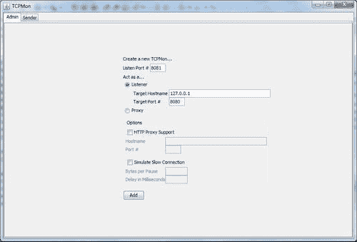

1.  更改`LiveRestaurant_R-3.1-Client`中的`applicationContext.xml`以使用**8081**端口进行`webserviceTemplate`：

```java
<bean id="messageFactory" class="org.springframework.ws.soap.saaj.SaajSoapMessageFactory" />
<bean id="webServiceTemplate" class="org.springframework.ws.client.core.WebServiceTemplate">
<constructor-arg ref="messageFactory" />
<property name="defaultUri" value="http://localhost:8081/LiveRestaurant/spring-ws/OrderService" />
</bean>

```

1.  使用以下命令从项目`LiveRestaurant_R-3.1`运行服务器：

```java
mvn clean package tomcat:run 

```

1.  从项目`LiveRestaurant_R-3.1-Client`中使用以下命令运行客户端：

```java
mvn clean package 

```

1.  转到**Port 8081**选项卡，查看请求和响应消息，如下截图所示：

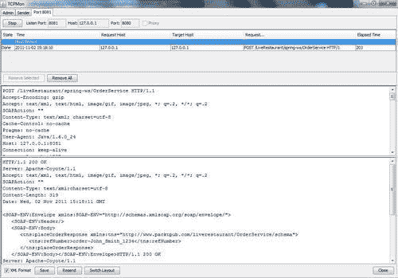

按以下方式向服务器发送 SOAP 请求：

转到**Sender**选项卡。输入 SOAP 服务地址和 SOAP 请求消息，然后单击**Send**按钮查看响应：

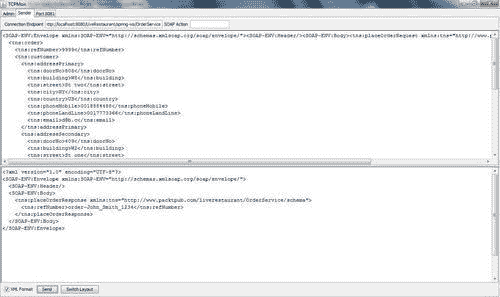

## 工作原理...

监视客户端和 Web 服务服务器之间传输的消息是 TCPMon 的最重要用途。此外，TCPMon 还可以用作客户端向 Web 服务服务器发送消息。这是一个中间角色，显示了客户端和服务器之间传输的消息。客户端必须指向中间件而不是服务器服务。

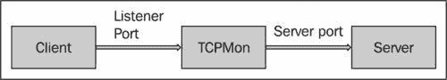

第二个活动（向服务器发送 SOAP 请求）显示使用 TCPMon 向服务器发送消息，接收响应，并在 TCPMon 上显示所有这些。

## 另请参阅

本章讨论了*使用 Spring-JUnit 支持进行集成测试*的方法。

# 使用 soapUI 监控和负载/功能测试 Web 服务

soapUI 是用于测试 Web 服务的开源测试解决方案。使用用户友好的 GUI，该工具提供了创建和执行自动功能和负载测试以及监控 SOAP 消息的功能。

本方法介绍了如何使用 soapUI 监控 Web 服务的 SOAP 消息以及功能和负载测试。为了设置 Web 服务，使用了`Recipe 3.1`，*使用 Spring-JUnit 支持进行集成测试*。

## 准备工作

通过执行以下步骤开始：

1.  安装并运行 soapUI 4.0 ([`www.soapui.org/`](http://www.soapui.org/))。

1.  从文件夹`LiveRestaurant_R-3.1`运行以下命令：

```java
mvn clean package tomcat:run 

```

## 如何操作...

要运行功能测试并监控 SOAP 消息，请执行以下步骤：

1.  右键单击**Projects**节点。选择**New soapUI Project**并输入 WSDL URL 和**Project Name**。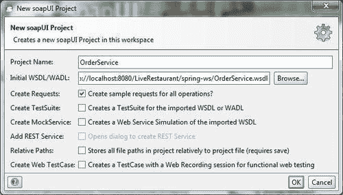

1.  在导航窗格中右键单击项目名称**OrderService**。选择**Launch HTTP Monitor**并启用**Set as Global Proxy**选项。单击**OK**按钮：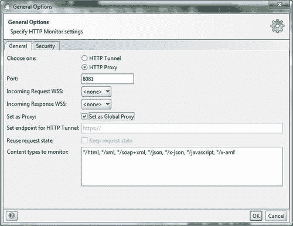

1.  展开**OrderService**方法**(cancelOrder**和**placeOrder)**。双击**cancelOrder**。单击**Submit Request to Specific Endpoint URL**（**Request1**屏幕左上角的绿色图标）。这是此操作的输出：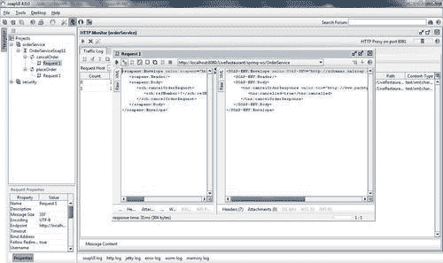

1.  右键单击**OrderServiceSoap11** | **Generate Test Suite** | **OK**。输入**OrderServiceSoap11 TestSuite**。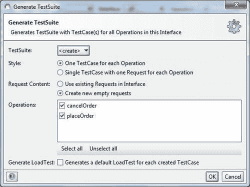

1.  在导航窗格中双击**OrderServiceSoap11 TestSuite**。单击运行所选的**TestCases**。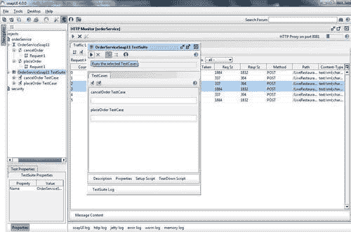

1.  当运行测试套件时，以下是输出：

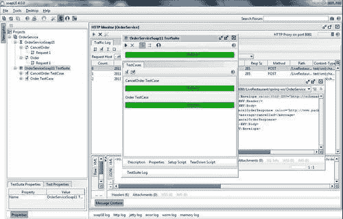

进行负载测试如下：

1.  右键单击**cancelOrder**测试用例。选择**New Local Test**并输入**Load Test Name**。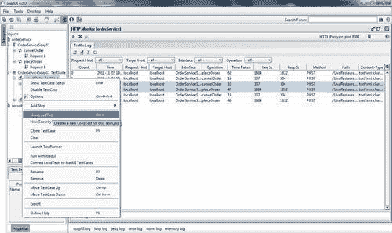

1.  双击**Load test name**。输入**Parameter**并单击**Run Load Test**。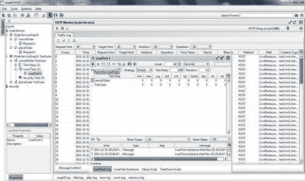

1.  以下是测试的输出：

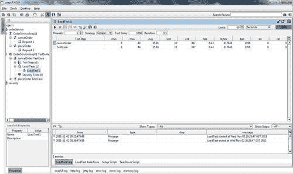

## 工作原理...

功能测试和监控 SOAP 消息：soapUI 提供三个级别的功能测试：测试套件、测试用例和测试步骤。

测试用例是从 WSDL 文件生成的单元测试，测试套件是这些单元测试的集合。测试步骤控制执行流程并验证要测试的服务的功能。例如，前面提到的**cancelOrder**测试套件中的一个测试用例可能首先测试数据库。如果有这样的订单可用，它会取消订单。

负载测试：soapUI 提供了在测试用例上运行多个线程（取决于您的计算机硬件限制）的功能。运行负载测试时，底层测试用例将在每个线程内部克隆。延迟设置让每个线程在开始之前等待，并让 Web 服务为每个线程休息。

## 另请参阅

本章讨论了*使用 Spring-JUnit 支持进行集成测试*的方法。
