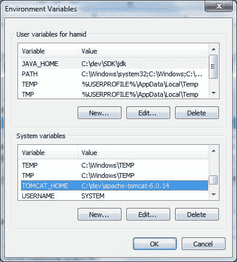
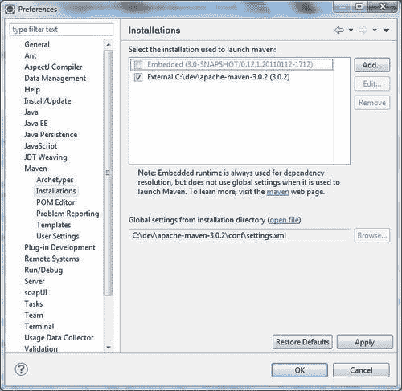
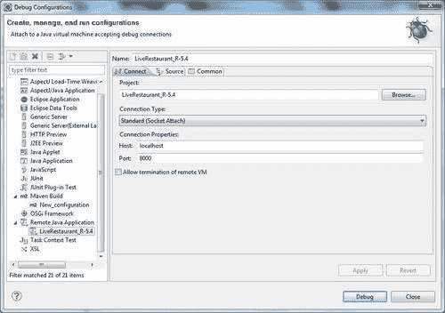
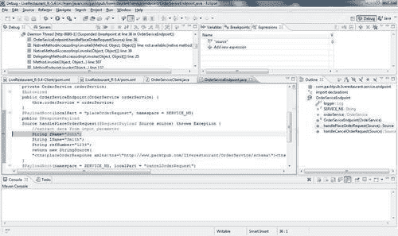

# 第五章：记录和跟踪 SOAP 消息

在本章中，我们将涵盖：

+   手动记录消息有效载荷

+   使用 log4j 记录请求和响应 SOAP 信封

+   使用 Spring-WS 的拦截器记录请求和响应

+   使用 Eclipse IDE 调试 Spring-WS

# 介绍

日志记录和跟踪是指捕获和记录有关软件程序执行的事件和数据结构，以提供审计跟踪。它有助于开发人员和支持团队收集有关软件程序执行的运行时信息。对于任何严肃的软件开发团队，实现系统日志记录非常重要。

对于 Web 服务开发，能够看到在客户端和服务器之间传输的 SOAP 消息非常有用。Spring Web 服务在 SOAP 消息到达时或发送前提供日志记录和跟踪。在 Spring-WS 中，日志记录由标准的 Commons Logging 接口管理。

通常，在 Spring 项目中，log4j 被用作具体的日志记录库（因为 Spring 日志功能是建立在 log4j 之上的）。本章介绍了记录 SOAP 消息的几种简单方法。

这里所示的配方可以应用于本书中任何配方的项目源。为了演示目的，使用了配方*通过注释负载根设置端点*的现有项目源，因为这可以应用于本书中使用的任何项目。

# 手动记录消息有效载荷

消息有效载荷是 SOAP 消息元素`SOAP-ENV:Body`的内容。这是整个 SOAP 信封的确切消息部分，用于请求和响应。

这个配方演示了从代码内部手动记录消息有效载荷。

## 准备工作

在这个配方中，项目的名称是`LiveRestaurant_R-5.1`（用于服务器端 Web 服务），具有以下 Maven 依赖项：

+   `spring-ws-core-2.0.1.RELEASE.jar`

+   `log4j-1.2.9.jar`

`LiveRestaurant_R-5.1-Client`（用于客户端），具有以下 Maven 依赖项：

+   `spring-ws-core-2.0.1.RELEASE.jar`

+   `log4j-1.2.9.jar`

## 如何做...

这个配方使用了第一章中使用的*通过注释负载根设置端点*的配方中使用的项目，*构建 SOAP Web 服务*。

1.  修改`log4j.properties`将日志级别默认设置为`INFO`。在`log4j.properties`中删除任何包或 API 的调试设置。

1.  修改`OrderServiceEndpoint`以创建两个`xmlToString`方法，并调用这两个方法将传入的消息转换为 String 并记录下来。

1.  在 Maven 嵌入的 Tomcat 服务器中构建和部署项目。从项目的根目录在命令行窗口中运行`mvn clean package tomcat:run`。

1.  要测试这个，打开一个新的命令行窗口，转到文件夹`LiveRestaurant_R-5.1-Client`并运行：`mvn clean package exec:java`。

1.  以下是服务器端控制台的输出：

```java
INFO [http-8080-1] (OrderSeviceEndpoint.java:49) -
Message Payload method handlePlaceOrderRequest start ====
<?xml version="1.0" encoding="UTF-8"?>
<tns:placeOrderRequest >
<tns:order>
<tns:refNumber>9999</tns:refNumber>
..........
</tns:customer>
<tns:dateSubmitted>2008-09-29T05:49:45</tns:dateSubmitted>
<tns:orderDate>2014-09-19T03:18:33</tns:orderDate>
<tns:items>
<tns:type>Snacks</tns:type>
<tns:name>Pitza</tns:name>
<tns:quantity>2</tns:quantity>
</tns:items>
</tns:order>
</tns:placeOrderRequest>
==== Message Payload End
........................
INFO [http-8080-1] (OrderSeviceEndpoint.java:67) -
Message Payload method handleCancelOrderRequest start ====
<?xml version="1.0" encoding="UTF-8"?>
<tns:cancelOrderRequest >
<tns:refNumber>9999</tns:refNumber>
</tns:cancelOrderRequest>
==== Message Payload End 

```

## 它是如何工作的...

代码简单地手动记录消息有效载荷，而不需要在应用程序的任何地方进行配置更改。在`log4j.properties`中的更改确保日志消息被打印到控制台（因为附加程序是`ConsoleAppender`），并且不打印调试消息：

```java
log4j.rootLogger=INFO, stdout
log4j.appender.stdout=org.apache.log4j.ConsoleAppender
log4j.appender.stdout.layout=org.apache.log4j.PatternLayout
# Pattern to output the caller's file name and line number.
log4j.appender.stdout.layout.ConversionPattern=%5p [%t] (%F:%L) - %m%n

```

方法`xmlToString(...)`将 XML 源/元素对象转换为`String`，使用`StringWriter`：

```java
private String xmlToString(Node node) {
try {
Source source = new DOMSource(node);
StringWriter stringWriter = new StringWriter();
Result result = new StreamResult(stringWriter);
TransformerFactory factory = TransformerFactory.newInstance();
Transformer transformer = factory.newTransformer();
transformer.transform(source, result);
return stringWriter.getBuffer().toString();
} catch (TransformerConfigurationException e) {
e.printStackTrace();
} catch (TransformerException e) {
e.printStackTrace();
}
return null;
}
private static String xmlToString(Source source) {
try {
StringWriter stringWriter = new StringWriter();
Result result = new StreamResult(stringWriter);
TransformerFactory factory = TransformerFactory.newInstance();
Transformer transformer = factory.newTransformer();
transformer.transform(source, result);
return stringWriter.getBuffer().toString();
} catch (TransformerConfigurationException e) {
e.printStackTrace();
} catch (TransformerException e) {
e.printStackTrace();
}
return null;
}

```

在`handleCancelOrderRequest()`和`handlePlaceOrderRequest()`方法中，调用`xmlToString()`传递`RequestPayload`的源/元素以将消息有效载荷返回为 String 实例，然后将其记录到配置的日志附加程序（在这种情况下是控制台）中：

```java
@PayloadRoot(localPart = "placeOrderRequest", namespace = SERVICE_NS)
public @ResponsePayload
Source handlePlaceOrderRequest(@RequestPayload Source source) throws Exception {
String placeOrderRequestMessage = xmlToString(source);
logger.info("\n\n Message Payload method handlePlaceOrderRequest start ==== \n\n\n " + placeOrderRequestMessage + "\n\n\n ==== Message Payload End\n\n");
//extract data from input parameter
String fName="John";
String lName="Smith";
String refNumber="1234";
return new StringSource(
"<tns:placeOrderResponse xmlns:tns=\"http://www.packtpub.com/liverestaurant/OrderService/schema\"><tns:refNumber>"+orderService.placeOrder(fName, lName, refNumber)+"</tns:refNumber></tns:placeOrderResponse>");
}
@PayloadRoot(namespace = SERVICE_NS, localPart = "cancelOrderRequest")
@ResponsePayload
public Source handleCancelOrderRequest(@RequestPayload Element cancelOrderRequest) throws Exception {
String refNumber=cancelOrderRequest.getElementsByTagNameNS(SERVICE_NS, "refNumber") .item(0).getTextContent();
String cancelOrderRequestMessage = xmlToString(cancelOrderRequest);
logger.info("\n\nMessage Payload method handleCancelOrderRequest start ==== \n\n\n " + cancelOrderRequestMessage + "\n\n\n ==== Message Payload End\n\n");
return new StringSource(
"<tns:cancelOrderResponse xmlns:tns=\"http://www.packtpub.com/liverestaurant/OrderService/schema\"><tns:cancelled>"+orderService.cancelOrder(refNumber)+"</tns:cancelled></tns:cancelOrderResponse>");
}

```

### 提示

作为良好的实践，我们以调试模式记录消息。为了获得更好的性能，我们做如下操作：

```java
If(logger.isDebugEnabled())
logger.debug(message);

```

在运行时，我们可以根据需求启用和禁用日志。

## 还有更多...

本配方中给出的示例使用`SimpleMethodEndpointMapping`，它以 XML Source（`javax.xml.transform.Source`）或 Element（`org.w3c.dom.Element`）对象的形式接收消息负载作为方法参数，并使用`RequestPayload`注解，而在其他情况下，传入消息将以不同的形式出现。例如，在编组端点中，输入已经是编组对象。在这些情况下，您需要采用适当的机制来转换传入的参数。之后的配方将为您提供有关日志记录和跟踪的其他方法的见解。

## 另请参阅

+   *通过注释 payload-root 设置端点*在第一章中，*构建 SOAP Web 服务*。

# 使用 log4j 记录请求和响应 SOAP 信封

Spring-WS 框架允许开发人员使用简单的日志记录器配置记录整个 SOAP 消息。本配方通过 log4j 日志记录框架配置框架的 SOAP 消息内部日志记录。

## 准备工作

在这个配方中，项目的名称是`LiveRestaurant_R-5.2`（用于服务器端 Web 服务），具有以下 Maven 依赖项：

+   `spring-ws-core-2.0.1.RELEASE.jar`

+   `log4j-1.2.9.jar`

它还有`LiveRestaurant_R-5.2-Client`（用于客户端）并具有以下 Maven 依赖项：

+   `spring-ws-core-2.0.1.RELEASE.jar`

+   `log4j-1.2.9.jar`

## 如何做...

本配方使用了配方*通过注释 payload-root 设置端点*中使用的项目：

1.  修改`log4j.properties`以设置消息跟踪。

1.  在 Maven 嵌入的 Tomcat 服务器中构建和部署项目。在命令行窗口中从项目的根目录运行`mvn clean package tomcat:run`。

1.  要测试这一点，打开一个新的命令行窗口，转到文件夹`LiveRestaurant_R-5.1-Client`，并运行`mvn clean package exec:java`。

以下是服务器端控制台的输出（请注意 Web 服务响应中生成的`SOAP-Env:Envelope`元素）：

```java
DEBUG [http-8080-1] (MessageDispatcher.java:167) - Received request
....
<SOAP-ENV:Envelope xmlns:SOAP-ENV="..."><SOAP-ENV:Body>
....
<tns:placeOrderRequest >
<tns:order>
<tns:refNumber>9999</tns:refNumber>
<tns:customer>
......
</tns:customer>
<tns:dateSubmitted>2008-09-29T05:49:45</tns:dateSubmitted>
<tns:orderDate>2014-09-19T03:18:33</tns:orderDate>
<tns:items>
<tns:type>Snacks</tns:type>
<tns:name>Pitza</tns:name>
<tns:quantity>2</tns:quantity>
</tns:items>
</tns:order>
</tns:placeOrderRequest>
</SOAP-ENV:Body></SOAP-ENV:Envelope>
....
DEBUG [http-8080-1] (MessageDispatcher.java:177) - Sent response
....
<SOAP-ENV:Envelope xmlns:SOAP-ENV="..."><SOAP-ENV:Body>
.....
<tns:placeOrderResponse >
<tns:refNumber>order-John_Smith_1234</tns:refNumber></tns:placeOrderResponse>
</SOAP-ENV:Body></SOAP-ENV:Envelope>
...
DEBUG [http-8080-1] (MessageDispatcher.java:167) - Received request ...
<SOAP-ENV:Envelope xmlns:SOAP-ENV="..."><SOAP-ENV:Body>
....
<tns:cancelOrderRequest >
<tns:refNumber>9999</tns:refNumber>
</tns:cancelOrderRequest>
</SOAP-ENV:Body></SOAP-ENV:Envelope>
...
DEBUG [http-8080-1] (MessageDispatcher.java:177) - Sent response
...
<SOAP-ENV:Envelope xmlns:SOAP-ENV="..."><SOAP-ENV:Body>
.....
<tns:cancelOrderResponse >
<tns:cancelled>true</tns:cancelled></tns:cancelOrderResponse>
</SOAP-ENV:Body></SOAP-ENV:Envelope>
... 

```

## 工作原理...

Spring-WS 框架的核心组件`MessageDispatcher`在`receive()`方法中接收到每个传入的 SOAP 消息后，会从`MessageContext`中提取消息内容，并在跟踪或调试启用时记录日志。

在`receive()`方法中，它检查命名日志实例的日志设置，`org.springframework.ws.server.MessageTracing.received`检查记录 SOAP 请求，`org.springframework.ws.server.MessageTracing.sent`检查 SOAP 响应。如果这些设置的值为`TRACE`或`DEBUG`，它将打印相应请求或响应的整个 SOAP 信封：

```java
log4j.rootLogger=INFO, stdout, R
log4j.appender.stdout=org.apache.log4j.ConsoleAppender
log4j.appender.stdout.layout=org.apache.log4j.PatternLayout
# Pattern to output the caller's file name and line number.
log4j.appender.stdout.layout.ConversionPattern=%5p [%t] (%F:%L) - %m%n
#RollingFileAppender
log4j.appender.R=org.apache.log4j.RollingFileAppender
log4j.appender.R.File=LiveRestaurant.log
log4j.appender.R.MaxFileSize=100KB
# Keep one backup file
log4j.appender.R.MaxBackupIndex=1
log4j.appender.R.layout=org.apache.log4j.PatternLayout
log4j.appender.R.layout.ConversionPattern=%p %t %c - %m%n
log4j.logger.org.springframework.ws.server.MessageTracing.received=TRACE
log4j.logger.org.springframework.ws.server.MessageTracing.sent=TRACE

```

跟踪或调试的最简单设置是在`log4j.properties`中，如前所述。

### 提示

以前，出于安全目的，消息是加密的，因此启用日志记录并不总是有用的。最好在输入方法内完成解密后记录消息。

## 另请参阅

+   *通过注释 payload-root 设置端点*在第一章中，*构建 SOAP Web 服务*。

# 使用 Spring-WS 的拦截器记录请求和响应

Spring-WS 提供了记录传入/传出消息的功能。这些功能是通过使用`PayloadLoggingInterceptor`和`SoapEnvelopeLoggingInterceptor`类来实现的，这些类使用**Commons Logging Log**进行记录。虽然`PayloadLoggingInterceptor`仅记录消息的有效负载，但`SoapEnvelopeLoggingInterceptor`记录整个 SOAP 信封，包括标头。要使用这两个拦截器激活日志记录功能，`log4j`属性文件中的日志属性应设置为拦截器包的调试。

在这个配方中，解释了使用`PayloadLoggingInterceptor`和`SoapEnvelopeLoggingInterceptor`记录 Web 服务消息。

## 准备工作

在本教程中，项目的名称是`LiveRestaurant_R-5.3`（用于服务器端 Web 服务），并具有以下 Maven 依赖项：

+   `spring-ws-core-2.0.1.RELEASE.jar`

+   `log4j-1.2.9.jar`

以及`LiveRestaurant_R-5.3-Client`（用于客户端）和以下 Maven 依赖项：

+   `spring-ws-core-2.0.1.RELEASE.jar`

+   `log4j-1.2.9.jar`

## 如何做...

本教程使用了教程*通过注释 payload-root 设置端点*中使用的项目：

1.  打开`log4j.properties`并将日志设置为调试`org.springframework.ws.server.endpoint.interceptor`包。

1.  在服务器端应用程序上下文中注册`PayloadLoggingInterceptor`。

1.  在 Maven 嵌入式 Tomcat 服务器中构建和部署项目。从项目的根目录在命令行窗口中运行`mvn clean package tomcat:run`。

1.  要测试这一点，打开一个新的命令行窗口，转到文件夹`LiveRestaurant_R-5.3-Client`，然后运行`mvn clean package exec:java`。

以下是服务器端控制台的输出：

```java
DEBUG [http-8080-1] (AbstractLoggingInterceptor.java:160) - Request:
<tns:placeOrderRequest >
<tns:order>
<tns:refNumber>9999</tns:refNumber>
<tns:customer>
......
</tns:customer>
<tns:dateSubmitted>2008-09-29T05:49:45</tns:dateSubmitted>
<tns:orderDate>2014-09-19T03:18:33</tns:orderDate>
<tns:items>
<tns:type>Snacks</tns:type>
<tns:name>Pitza</tns:name>
<tns:quantity>2</tns:quantity>
</tns:items>
</tns:order>
</tns:placeOrderRequest>
DEBUG [http-8080-1] (AbstractLoggingInterceptor.java:160) - Response:
<tns:placeOrderResponse >
<tns:refNumber>order-John_Smith_1234</tns:refNumber></tns:placeOrderResponse>
DEBUG [http-8080-1] (AbstractLoggingInterceptor.java:160) - Request:
<tns:cancelOrderRequest >
<tns:refNumber>9999</tns:refNumber>
</tns:cancelOrderRequest>
DEBUG [http-8080-1] (AbstractLoggingInterceptor.java:160) - Response:
<tns:cancelOrderResponse >
<tns:cancelled>true</tns:cancelled>
</tns:cancelOrderResponse> 

```

要使用`SoapEnvelopeLoggingInterceptor`记录 Web 服务消息，请按照以下步骤操作：

1.  在服务器端应用程序上下文中注册`SoapEnvelopeLoggingInterceptor`。

1.  打开`log4j.properties`并将日志设置为调试`org.springframework.ws.soap.server.endpoint.interceptor`包。

1.  在 Maven 嵌入式 Tomcat 服务器中构建和部署项目。从项目的根目录在命令行窗口中运行`mvn clean package tomcat:run`。

1.  要测试这一点，打开一个新的命令行窗口，转到文件夹`LiveRestaurant_R-5.3-Client`，然后运行`mvn clean package exec:java`。

以下是服务器端控制台的输出：

```java
DEBUG [http-8080-1] (AbstractLoggingInterceptor.java:160) - Request:
<SOAP-ENV:Envelope xmlns:SOAP-ENV=....">
<SOAP-ENV:Header/><SOAP-ENV:Body>
<tns:placeOrderRequest >
<tns:order>
<tns:refNumber>9999</tns:refNumber>
<tns:customer>
.....
</tns:customer>
<tns:dateSubmitted>2008-09-29T05:49:45</tns:dateSubmitted>
<tns:orderDate>2014-09-19T03:18:33</tns:orderDate>
<tns:items>
<tns:type>Snacks</tns:type>
<tns:name>Pitza</tns:name>
<tns:quantity>2</tns:quantity>
</tns:items>
</tns:order>
</tns:placeOrderRequest>
</SOAP-ENV:Body></SOAP-ENV:Envelope>
DEBUG [http-8080-1] (AbstractLoggingInterceptor.java:160) - Response:
<SOAP-ENV:Envelope xmlns:SOAP-ENV=..."><SOAP-ENV:Header/><SOAP-ENV:Body>
<tns:placeOrderResponse >
<tns:refNumber>order-John_Smith_1234</tns:refNumber>
</tns:placeOrderResponse>
</SOAP-ENV:Body></SOAP-ENV:Envelope>
DEBUG [http-8080-1] (AbstractLoggingInterceptor.java:160) - Request:
<SOAP-ENV:Envelope xmlns:SOAP-ENV="..."><SOAP-ENV:Header/><SOAP-ENV:Body>
<tns:cancelOrderRequest >
<tns:refNumber>9999</tns:refNumber>
</tns:cancelOrderRequest>
</SOAP-ENV:Body></SOAP-ENV:Envelope>
DEBUG [http-8080-1] (AbstractLoggingInterceptor.java:160) - Response:
<SOAP-ENV:Envelope xmlns:SOAP-ENV="..."><SOAP-ENV:Header/><SOAP-ENV:Body>
<tns:cancelOrderResponse >
<tns:cancelled>true</tns:cancelled></tns:cancelOrderResponse>
</SOAP-ENV:Body></SOAP-ENV:Envelope>

```

## 它是如何工作的...

当消息被接收时，`MessageDispatcherServlet`调用拦截器（如果有），以及在调用端点中的处理程序方法之前和向客户端发送响应之前。

仅在`spring-ws-servlet.xml`中注册`PayloadLoggingInterceptor`会记录消息的有效负载：

```java
<sws:interceptors>
<bean class="org.springframework.ws.server.endpoint.interceptor.PayloadLoggingInterceptor"/>
</sws:interceptors>

```

同样，在`spring-ws-servlet.xml`中注册`SoapEnvelopeLoggingInterceptor`会记录整个消息的 SOAP Envelope：

```java
<sws:interceptors>
<bean class="org.springframework.ws.soap.server.endpoint.interceptor.SoapEnvelopeLoggingInterceptor"/>
</sws:interceptors>

```

在这两种情况下，这些拦截器的包名称应设置为用于记录目的的 debug：

```java
........
log4j.appender.R.layout=org.apache.log4j.PatternLayout
log4j.appender.R.layout.ConversionPattern=%p %t %c - %m%n
log4j.logger.org.springframework.ws.soap.server.endpoint.interceptor=debug
log4j.logger.org.springframework.ws.server.endpoint.interceptor=debug

```

## 还有更多...

将`PayloadLoggingInterceptor`的`logRequest`和`logResponse`属性设置为 true/false，启用/禁用请求/响应消息的记录。

```java
<bean class="org.springframework.ws.server.endpoint.interceptor.PayloadLoggingInterceptor">
<property name="logRequest" value="false" />
<property name="logResponse" value="true" />
</bean>

```

除了`logRequest`和`logResponse`之外，`SoapEnvelopeLoggingInterceptor`还有一个`logFault`属性，将这些设置为 true/false，启用/禁用请求/响应/故障消息的记录：

```java
....
<bean class="org.springframework.ws.soap.server.endpoint.interceptor.SoapEnvelopeLoggingInterceptor">
<property name="logRequest" value="false" />
<property name="logResponse" value="true" />
<property name="logFault" value="true" ></property>
</bean>

```

## 另请参阅

+   *通过注释 payload-root 设置端点*在第一章中，*构建 SOAP Web 服务*。

+   *使用 Log4j 记录请求和响应 SOAP Envelope*

# 使用 Eclipse IDE 调试 Spring-WS

在开发阶段调试应用程序的能力是 IDE 最重要的功能之一，因为它可以帮助开发人员轻松找出错误，从而加快开发速度。对于更复杂的服务器端应用程序，调试能力对于发现缺陷更为重要。附加到 Eclipse 等 IDE 的远程调试器可以显著缩短问题分析时间，并使过程更加愉快。

Eclipse 可以配置为在嵌入式和远程服务器中进行 Web/app 服务器调试。本教程解释了如何在 Eclipse 内部以 Web 应用程序的形式调试 Spring-WS 项目，使用外部远程 Tomcat 实例。

## 准备就绪

要开始：

1.  安装 Apache-Tomcat-6.0.14。

1.  下载并安装 Eclipse IDE for Java EE Developers Helios。

在本教程中，项目的名称是`LiveRestaurant_R-5.4`（用于服务器端 WebService），并具有以下 Maven 依赖项：

+   `spring-ws-core-2.0.1.RELEASE.jar`

+   `log4j-1.2.9.jar`

它还有`LiveRestaurant_R-5.4-Client`（用于客户端）和以下 Maven 依赖项：

+   `spring-ws-core-2.0.1.RELEASE.jar`

+   `log4j-1.2.9.jar`

## 如何做...

1.  在 Linux 的用户主目录`(/home/weblogic)`中修改配置文件，或者在 Windows 的系统变量中为 Tomcat 进行设置。

安装 Tomcat 后：在 Linux 上>编辑.profile>，添加以下内容以用于 Tomcat：

```java
export TOMCAT_HOME=/opt2/apache-tomcat-6.0.14
export PATH=$TOMCAT_HOME:$PATH

```

1.  在 Windows 上>编辑系统变量，如下图所示设置 Tomcat 的系统变量：

1.  在`$TOMCAT_HOME/conf/tomcat-users.xml`文件中，将角色设置为`manager`，`username`和`password`如下：

```java
<?xml version='1.0' encoding='utf-8'?>
<tomcat-users>
<role rolename="manager"/>
<user username="tomcat" password="tomcat" roles="manager"/>
</tomcat-users>

```

1.  在`MAVEN_HOME/conf/settings.xml`文件中，以及如果有任何`.m2/settings.xml`（`.m2`是 maven 存储库文件夹），添加一个名为`tomcat`的用户登录配置，密码为`tomcat`，如下所示：

```java
<server>
<id>myserver</id>
<username>tomcat</username>
<password>tomcat</password>
</server>

```

1.  在文件末尾修改`debug.sh/debug.bat TOMCAT_HOME/bin/`：

在 Windows 上，修改 debug.bat：

```java
set JPDA_TRANSPORT=dt_socket
set JPDA_ADDRESS=8000
call "%EXECUTABLE%" jpda start %CMD_LINE_ARGS%

```

1.  在 Linux 上，修改 debug.sh：

```java
export JPDA_ADDRESS=8000
export JPDA_TRANSPORT=dt_socket
exec "$PRGDIR"/"$EXECUTABLE" jpda start "$@"

```

1.  在 Linux/Windows 上使用`TOMCAT_HOME/bin/`中的`debug.sh/debug.bat`运行 Tomcat。

1.  修改`LiveRestaurant_R-5.4`的`pom.xml`文件：

```java
<!-- <plugin>
<groupId>org.codehaus.mojo</groupId>
<artifactId>tomcat-maven-plugin</artifactId>
<version>1.1</version>
</plugin> -->
<plugin>
<groupId>org.codehaus.mojo</groupId>
<artifactId>tomcat-maven-plugin</artifactId>
<version>1.1</version>
<configuration>
<server>myserver</server>
<path>/LiveRestaurant</path>
</configuration>
</plugin>

```

1.  将项目`LiveRestaurant_R-5.4`导入 Eclipse，并在`com.packtpub.liverestaurant.service.endpoint.OrderEndpoint.java`类的`handleCancelOrderRequest`方法中设置断点。

1.  从`LiveRestaurant_R-5.4`运行`mvn clean package`，然后将 WAR 文件复制到`tomcat/webapp`（应用将被部署到 Tomcat 中）。

1.  在 Eclipse 中设置 Maven 安装：**Windows** | **Preferences** | **Maven** | **Installations**，点击**Add**按钮，并设置外部 Maven：

1.  打开 Eclipse。右键单击**LiveRestaurant_R-5.4** | **Debug as** | **Debug Configurations** | **Remote Java Application**，点击**New**，然后点击**Debug**按钮：

1.  从项目`LiveRestaurant_R-5.4-Client`中运行`mvn clean package`

这是测试的输出：



1.  现在可以尝试不同的调试应用程序选项，例如：

+   Step Over (F5)

+   Step Into (F5)

+   Step Out (F7)

+   观察

+   检查

## 工作原理...

此处使用**Java Debugger (JDB)**工具来帮助在本地和服务器上找到并修复 Java 语言程序中的错误。JDB 是**Java Platform Debugging Architecture** (JPDA)的一部分，为您构建 Java 平台的最终用户调试器应用程序提供了所需的基础设施。

要在 Java EE 应用程序服务器或 Servlet 容器（如 Tomcat）中使用 JDB，必须首先启用调试并通过 JPDA 端口（默认端口为 1044）将其附加到调试器。在第 4 步，JPDA 端口设置为 8000。此处使用`debug.bat/debug.sh`启动服务器，而不是`run.bat/run.sh`，这意味着服务器以调试模式启动。

JDB 参数指定调试器的操作方式。例如，`JPDA_TRANSPORT=dt_socket`指示 JVM 调试器连接将通过套接字进行，而`JPDA_ADDRESS=8000`参数通知端口号将为 8000。

然后 Eclipse IDE 将连接到接受调试连接的 JVM。该项目被设置为 Eclipse 内的远程 Java 应用程序，监听相同的端口，即 8000，以进行任何调试活动。接下来，将在服务类中设置断点，该断点将在运行时由 JDB 管理和重定向到 IDE。

当`LiveRestaurant_R-5.4-Client`项目作为服务的客户端程序执行时，服务类`OrderServiceEndpoint`被调用，并在处于调试模式的 JVM 中命中断点。它通知前端 JDI 的实现位置以及在这种情况下的 IDE。

## 还有更多...

类似于 Tomcat 服务器，您可以将任何应用程序服务器附加到 Eclipse、Net Beans 或 JDeveloper 等 IDE。概念是相同的。但是，每个应用程序服务器和 IDE 的步骤可能会有所不同。

### 提示

启用调试模式时，尝试将消息在给定层中所花费的总时间作为 XML 消息中的一个属性发送。这有助于在性能测试中进行故障排除。
