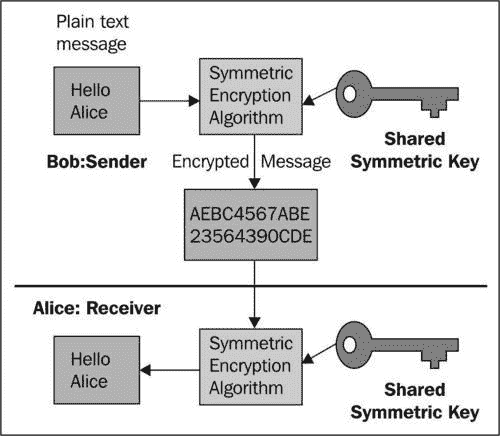
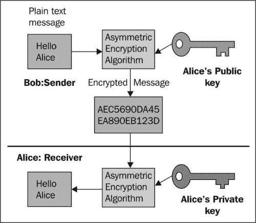

# 第七章：使用 XWSS 库保护 SOAP Web 服务

在本章中，我们将涵盖：

+   使用用户名令牌和明文/摘要密码对 Web 服务调用进行身份验证

+   使用 Spring 安全对 Web 服务调用进行身份验证，以验证用户名令牌和明文/摘要密码

+   使用 JAAS 服务对 Web 服务调用进行身份验证，以验证用户名令牌

+   准备成对和对称密钥库

+   使用数字签名保护 SOAP 消息

+   使用 X509 证书对 Web 服务调用进行身份验证

+   加密/解密 SOAP 消息

# 介绍

WS-Security（WSS）由 OASIS 发布，是 SOAP 的扩展，提供 Web 服务的安全标准功能。 XML 和 Web 服务安全（XWSS）是 SUN 对 WSS 的实现，包含在 Java Web 服务开发人员包（WSDP）中。

XWSS 是一种消息级安全，其中安全数据包含在 SOAP 消息/附件中，并允许安全信息随消息或附件一起传输。例如，在签署消息时，将从消息的部分加密生成的安全令牌添加到消息中，以供特定接收者使用。当发送者发送此消息时，此令牌保持在加密形式并随消息一起传输。当接收者收到此消息时，只有具有特定解密密钥的人才能解密令牌。因此，如果在传输此消息期间，任何未经授权的接收者（没有特定密钥的人）收到此消息，他/她无法解密令牌（此令牌将用于检查原始消息是否已更改）。可以通过在接收端（从传入消息中）重新生成令牌并将其与随消息一起传入的令牌进行比较来进行消息的原始性验证。

`EndpointInterceptor`，顾名思义，拦截请求并在调用端点之前执行某些操作。在之前的章节中，已经解释了`SoapEnvelopeLoggingInterceptor，PayloadLoggingInterceptor`和`PayloadValidatingInterceptor`用于记录和验证目的。

在本章和下一章中，将解释`SecurityInterceptors`。

Spring-WS `XwsSecurityInterceptor`是用于在调用端点之前对请求消息执行安全操作的`EndpointInterceptor`。这个基于 XWSS 的拦截器需要一个策略配置文件来运行。这是一个可以包含多个安全要求的策略配置文件的示例：

```java
<xwss:SecurityConfiguration ...>
<xwss:RequireTimestamp .../>
<xwss:RequireUsernameToken ...../>
........
</xwss:SecurityConfiguration>

```

安全拦截器使用此配置来查找接收到的 SOAP 消息中期望的安全信息（在接收方），以及要添加到传出消息中的信息（在发送方）。

此外，此拦截器需要一个或多个`callBackHandlers`用于安全操作，如身份验证，签署传出消息，验证传入消息的签名，解密和加密。这些`callBackHandlers`需要在应用程序上下文文件中注册：

```java
<sws:interceptors>
<bean
class="...XwsSecurityInterceptor">
<property name="policyConfiguration" value="/WEB-INF/securityPolicy.xml" />
<property name="policyConfiguration" value="/WEB-INF/securityPolicy.xml" />
<property name="callbackHandlers">
<list>
<ref bean="callbackHandler1" />
<ref bean="callbackHandler2" />
..............
</list>
</property>
</bean>
</sws:interceptors>
<bean id="callbackHandler1"
class=".....SimplePasswordValidationCallbackHandler">
<property name="users">
<props>
<prop key="admin">secret</prop>
<prop key="clinetUser">pass</prop>
</props>
</property>
</bean>
.........

```

本章介绍了如何将 Spring-WS XWSS 应用于不同的安全操作。在每个配方的项目中，客户端通过在传出消息中添加或修改数据来应用安全操作，并将其发送到服务器。服务器接收消息，提取安全信息，并根据安全信息是否符合预期要求继续处理消息；否则，将故障消息返回给客户端。

为简化起见，本章中的大多数示例使用了在第三章中讨论的*使用 Spring-JUnit 支持进行集成测试*示例中使用的项目，用于设置服务器并由客户端发送和接收消息。但是，在最后一个示例中，使用了来自*为 WS-Addressing 端点创建 Web 服务客户端*示例中讨论的第二章中的项目，用于服务器和客户端。

# 使用明文/摘要用户名令牌进行 Web 服务调用的身份验证

身份验证简单地意味着检查服务的调用者是否是他们声称的人。检查调用者的身份验证的一种方式是检查密码。

XWSS 提供 API 来从传入的 SOAP 消息中获取用户名和密码，并将它们与配置文件中定义的内容进行比较。通过为消息的发送方和接收方定义策略文件来实现此目标，发送方在传出消息中包含用户名令牌，而接收方在接收消息时期望收到此用户名令牌以进行身份验证。

传输明文密码会使 SOAP 消息不安全。 XWSS 提供了在策略文件中配置设置以在发送方消息中包含密码的摘要（由特定算法生成的密码文本的哈希）的配置。在服务器端，服务器将传入消息中包含的摘要密码与从配置文件中设置的摘要密码进行比较（请参见`spring-ws-servlet.xml`中`callbackHandler` bean 内的属性用户）使用发送方端上的相同算法。本教程展示了如何使用用户名令牌和明文/摘要密码对 Web 服务调用进行身份验证。本教程包含两种情况。在第一种情况下，密码将以明文格式传输。但是，在第二种情况下，通过更改策略文件配置，密码将以摘要格式传输。

## 准备工作

在本教程中，项目名称为`LiveRestaurant_R-7.1`（用于服务器端 Web 服务），具有以下 Maven 依赖项：

+   `spring-ws-security-2.0.1.RELEASE.jar`

+   `spring-expression-3.0.5.RELEASE.jar`

+   `log4j-1.2.9.jar`

`LiveRestaurant_R-7.1-Client`（用于客户端 Web 服务）具有以下 Maven 依赖项：

+   `spring-ws-security-2.0.1.RELEASE.jar`

+   `spring-ws-test-2.0.0.RELEASE.jar`

+   `spring-expression-3.0.5.RELEASE.jar`

+   `log4j-1.2.9.jar`

+   `junit-4.7.jar`

## 如何做...

以下步骤实现使用用户名令牌和明文密码进行身份验证：

1.  在`LiveRestaurant_R-7.1-Client`的应用程序上下文文件（`applicationContext.xml`）中注册安全拦截器（`XwsSecurityInterceptor`）和`callbackHandler`（`SimplePasswordValidationCallbackHandler`）。

1.  为`LiveRestaurant_R-7.1-Client`添加安全策略文件（`securityPolicy.xml`）。

1.  在`LiveRestaurant_R-7.1`的应用程序上下文文件（`spring-ws-servlet.xml`）中注册安全拦截器（`XwsSecurityInterceptor`）和`callbackHandler`（`SimplePasswordValidationCallbackHandler`）。

1.  为`LiveRestaurant_R-7.1`添加安全策略文件（`securityPolicy.xml`）。

1.  从`Liverestaurant_R-7.1`运行以下命令：

```java
mvn clean package tomcat:run 

```

1.  从`Liverestaurant_R-7.1-Client`运行以下命令：

```java
mvn clean package 

```

+   以下是客户端输出（请注意下划线部分中密码标签`wsse:Password ...#PasswordText`）：

```java
INFO: ==== Sending Message Start ====
<SOAP-ENV:Envelope ...">
<SOAP-ENV:Header>
<wsse:Security ..>
<wsu:Timestamp ...>
<wsu:Created>2011-11-06T07:19:16.225Z</wsu:Created>
<wsu:Expires>2011-11-06T07:24:16.225Z</wsu:Expires>
</wsu:Timestamp>
<wsse:UsernameToken .....>
<wsse:Username>clinetUser</wsse:Username>
<wsse:Password ...#PasswordText">****</wsse:Password>
<wsse:Nonce ..#Base64Binary">...</wsse:Nonce>
<wsu:Created>2011-11-06T07:19:16.272Z</wsu:Created>
</wsse:UsernameToken>
</wsse:Security>
</SOAP-ENV:Header>
<SOAP-ENV:Body>
<tns:placeOrderRequest >
.....
.......
</tns:placeOrderRequest>
</SOAP-ENV:Body>
</SOAP-ENV:Envelope>
==== Sending Message End ====
.....
INFO: ==== Received Message Start ====
......
<SOAP-ENV:Envelope....">
<SOAP-ENV:Header/>
<SOAP-ENV:Body>
<tns:placeOrderResponse .....>
<tns:refNumber>order-John_Smith_1234</tns:refNumber>
</tns:placeOrderResponse>
</SOAP-ENV:Body>
</SOAP-ENV:Envelope>
==== Received Message End ==== 

```

以下步骤实现使用用户名令牌和摘要密码进行身份验证：

1.  修改`Liverestaurant_R-7.1`的安全策略文件（`securityPolicy.xml`），以从传入消息中获取摘要密码。

1.  修改 `Liverestaurant_R-7.1-Client` 的安全策略文件（`securityPolicy.xml`）以发送摘要密码。

1.  从 `Liverestaurant_R-7.1` 运行以下命令：

```java
mvn clean package tomcat:run 

```

1.  从 `Liverestaurant_R-7.1-Client` 运行以下命令：

```java
mvn clean package 

```

+   以下是客户端输出（请注意密码标签 wsse:Password ...#PasswordDigest）在下划线部分内：

```java
Nov 6, 2011 12:19:25 PM com.sun.xml.wss.impl.filter.DumpFilter process
INFO: ==== Sending Message Start ====
..
<SOAP-ENV:Envelope .../">
<SOAP-ENV:Header>
<wsse:Security ...>
<wsu:Timestamp ..>
<wsu:Created>2011-11-06T08:19:25.515Z</wsu:Created>
<wsu:Expires>2011-11-06T08:24:25.515Z</wsu:Expires>
</wsu:Timestamp>
<wsse:UsernameToken...>
<wsse:Username>clinetUser</wsse:Username>
<wsse:Password ...#PasswordDigest">****</wsse:Password>
<wsse:Nonce ...#Base64Binary">...</wsse:Nonce>
<wsu:Created>2011-11-06T08:19:25.562Z</wsu:Created>
</wsse:UsernameToken>
</wsse:Security>
</SOAP-ENV:Header>
<SOAP-ENV:Body>
<tns:placeOrderRequest..">
......
</tns:placeOrderRequest>
</SOAP-ENV:Body>
</SOAP-ENV:Envelope>
==== Sending Message End ====
........
INFO: ==== Received Message Start ====
<?xml version="1.0" ...>
<SOAP-ENV:Header/>
<SOAP-ENV:Body>
<tns:placeOrderResponse ...>
<tns:refNumber>order-John_Smith_1234</tns:refNumber>
</tns:placeOrderResponse>
</SOAP-ENV:Body>
</SOAP-ENV:Envelope>
==== Received Message End ==== 

```

## 工作原理...

`Liverestaurant_R-7.1` 项目是一个服务器端 Web 服务，需要其客户端发送带有用户名令牌和密码的消息。`Liverestaurant_R-7.1-Client` 项目是一个客户端测试项目，向服务器发送带有用户名令牌和密码的消息。

在服务器端，`XwsSecurityInterceptor` 强制服务器对所有传入消息应用 `securityPolicy.xml` 中的策略，并使用 `SimplePasswordValidationCallbackHandler` 来比较传入消息的用户名/密码与服务器配置文件中包含的用户名/密码（请参阅 `callbackHandler` bean 中的属性 users）：

```java
<sws:interceptors>
...
<bean class="org.springframework.ws.soap.security.xwss.XwsSecurityInterceptor">
<property name="policyConfiguration" value="/WEB-INF/securityPolicy.xml" />
<property name="callbackHandlers">
<list>
<ref bean="callbackHandler" />
</list>
</property>
</bean>
</sws:interceptors>
<bean id="callbackHandler"
class="org.springframework.ws.soap.security.xwss.callback.SimplePasswordValidationCallbackHandler">
<property name="users">
<props>
<prop key="admin">secret</prop>
<prop key="clinetUser">pass</prop>
</props>
</property> 
</bean>

```

在 `securityPolicy.xml` 文件中，`<xwss:RequireUsernameToken passwordDigestRequired="false" nonceRequired="true"/>` 要求传入消息具有非加密密码的用户名令牌。`useNonce="true`" 表示每个传入消息都将具有一个与上一条消息不相等的随机数：

```java
<xwss:SecurityConfiguration dumpMessages="true" >
<xwss:RequireTimestamp maxClockSkew="60" timestampFreshnessLimit="300"/>
<xwss:RequireUsernameToken passwordDigestRequired="false" nonceRequired="true"/>
</xwss:SecurityConfiguration>

```

在客户端，`XwsSecurityInterceptor` 强制客户端对所有传出消息应用 `securityPolicy.xml` 中的策略：

```java
<bean id="webServiceTemplate" class="org.springframework.ws.client.core.WebServiceTemplate">
....
<property name="interceptors">
<list>
<ref local="xwsSecurityInterceptor" />
</list>
</property>
</bean>
<bean id="xwsSecurityInterceptor"
class="org.springframework.ws.soap.security.xwss.XwsSecurityInterceptor">
<property name="policyConfiguration" value="/securityPolicy.xml"/>
<property name="callbackHandlers">
<list>
<ref bean="callbackHandler"/>
</list>
</property>
</bean>
<bean id="callbackHandler" class="org.springframework.ws.soap.security.xwss.callback.SimplePasswordValidationCallbackHandler"/>

```

在 `securityPolicy.xml` 文件中，`<xwss:UsernameToken name="clinetUser" password="pass" digestPassword="false" useNonce="true"/>` 包括所有传出消息的带有密码的用户名令牌：

```java
<xwss:SecurityConfiguration dumpMessages="true" >
<xwss:Timestamp />
<xwss:UsernameToken name="clinetUser" password="pass" digestPassword="false" useNonce="true"/> ...
</xwss:SecurityConfiguration>

```

在这里，`useNonce="true`" 表示每个请求将随着每条消息发送一个新的随机数（`Nonce` 有助于防止用户名令牌被劫持）。

在使用带有明文密码的用户名令牌进行身份验证的情况下，由于在客户端和服务器端策略文件中都有 `digestPassword="false`"，因此在输出结果中可以看到客户端发送的消息中包含用户名和明文密码：

```java
<wsse:UsernameToken ....>
<wsse:Username>clinetUser</wsse:Username>
<wsse:Password ..>****</wsse:Password>
...
</wsse:UsernameToken> 

```

然而，在使用摘要用户名令牌和摘要密码进行身份验证的第二种情况中，由于在客户端和服务器端策略文件中都有 `digestPassword="true`"，密码的摘要包含在用户名令牌中：

```java
<wsse:UsernameToken ....>
<wsse:Username>clinetUser</wsse:Username>
<wsse:Password ...#PasswordDigest">****</wsse:Password>
...
</wsse:UsernameToken> 

```

在这种情况下，服务器将传入的 SOAP 消息摘要密码与 `spring-ws-servlet.xml` 中计算的摘要密码进行比较。通过这种方式，与密码以明文传输的第一种情况相比，通信将更加安全（明文密码可以轻松从 SOAP 消息中提取。但是，使用 SSL 连接可以保护此类通信）。

## 另请参阅...

本章讨论的配方 *使用 Spring 安全验证 Web 服务调用以验证带有明文/摘要密码的用户名令牌，使用 JAAS 服务验证用户名令牌的 Web 服务调用* 和 *使用 X509 证书验证 Web 服务调用*。

# 使用 Spring 安全验证 Web 服务调用以验证带有明文/摘要密码的用户名令牌

在这里，我们使用了第一个配方中使用的相同身份验证方法。唯一的区别是这里使用了 Spring Security 框架进行身份验证。由于 Spring Security 框架超出了本书的范围，因此这里没有进行描述。但是，您可以在 Spring Security 参考文档中阅读更多相关信息（[`www.springsource.org/security`](http://www.springsource.org/security)）。

与本章的第一个配方相同，这个配方也包含两种情况。在第一种情况下，密码将以明文格式传输。在第二种情况下，通过更改策略文件的配置，密码将以摘要格式传输。

## 准备就绪

在这个配方中，项目的名称是`LiveRestaurant_R-7.2`（用于服务器端 Web 服务），具有以下 Maven 依赖项：

+   `spring-ws-security-2.0.1.RELEASE.jar`

+   `spring-expression-3.0.5.RELEASE.jar`

+   `log4j-1.2.9.jar`

`LiveRestaurant_R-7.2-Client`（用于客户端 Web 服务）具有以下 Maven 依赖项：

+   `spring-ws-security-2.0.1.RELEASE.jar`

+   `spring-ws-test-2.0.0.RELEASE.jar`

+   `spring-expression-3.0.5.RELEASE.jar`

+   `log4j-1.2.9.jar`

+   `junit-4.7.jar`

## 如何做...

在这个配方中，所有步骤与前一个配方*使用用户名令牌对 Web 服务调用进行身份验证*中的步骤相同，只是服务器端应用程序上下文文件（`spring-ws.servlet.xml`）回调处理程序更改并使用 DAO 层来获取数据：

以下步骤实现了使用 Spring Security 对带有明文密码的用户名令牌进行身份验证的 Web 服务调用的身份验证：

1.  在`LiveRestaurant_R-7.2`的应用程序上下文文件（`spring-ws-servlet.xml`）中注册安全拦截器（`XwsSecurityInterceptor`）和`callbackHandler`（`SpringPlainTextPasswordValidationCallbackHandler`）。

1.  添加 DAO 层类以获取数据。

1.  从`Liverestaurant_R-7.2`运行以下命令：

```java
mvn clean package tomcat:run 

```

1.  从`Liverestaurant_R-7.2-Client`运行以下命令：

```java
mvn clean package 

```

+   以下是客户端输出：

```java
Nov 6, 2011 1:42:37 PM com.sun.xml.wss.impl.filter.DumpFilter process
INFO: ==== Sending Message Start ====
...
<SOAP-ENV:Envelope ....>
<SOAP-ENV:Header>
<wsse:Security ...>
<wsu:Timestamp....>
<wsu:Created>2011-11-06T09:42:37.391Z</wsu:Created>
<wsu:Expires>2011-11-06T09:47:37.391Z</wsu:Expires>
</wsu:Timestamp>
<wsse:UsernameToken ...>
<wsse:Username>clinetUser</wsse:Username>
<wsse:Password ...#PasswordText">****</wsse:Password>
<wsse:Nonce ...#Base64Binary">...</wsse:Nonce>
<wsu:Created>2011-11-06T09:42:37.442Z</wsu:Created>
</wsse:UsernameToken>
</wsse:Security>
</SOAP-ENV:Header>
<SOAP-ENV:Body>
<tns:placeOrderRequest ...>
......
</tns:placeOrderRequest>
</SOAP-ENV:Body>
</SOAP-ENV:Envelope>
==== Sending Message End ====
INFO: ==== Received Message Start ====
<SOAP-ENV:Envelope ...">
<SOAP-ENV:Header/>
<SOAP-ENV:Body>
<tns:placeOrderResponse ....">
<tns:refNumber>order-John_Smith_1234</tns:refNumber>
</tns:placeOrderResponse>
</SOAP-ENV:Body>
</SOAP-ENV:Envelope>
==== Received Message End ==== 

```

以下步骤实现了使用 Spring Security 对摘要用户名令牌进行身份验证的 Web 服务调用的身份验证：

1.  在服务器应用程序上下文文件（`spring-ws-servlet.xml`）中将`springSecurityHandler`修改为`SpringDigestPasswordValidationCallbackHandler`。

1.  修改安全策略文件（`securityPolicy.xml`）在服务器端和客户端都使用摘要密码。

1.  从`Liverestaurant_R-7.2`运行以下命令：

```java
mvn clean package tomcat:run 

```

1.  从`Liverestaurant_R-7.2-Client`运行以下命令：

```java
mvn clean package 

```

+   以下是客户端输出：

```java
Nov 6, 2011 2:04:37 PM com.sun.xml.wss.impl.filter.DumpFilter process
INFO: ==== Sending Message Start ====
...
<SOAP-ENV:Envelope ...>
<SOAP-ENV:Header>
<wsse:Security ...>
<wsu:Timestamp ...>
<wsu:Created>2011-11-06T10:04:36.622Z</wsu:Created>
<wsu:Expires>2011-11-06T10:09:36.622Z</wsu:Expires>
</wsu:Timestamp>
<wsse:UsernameToken...>
<wsse:Username>clinetUser</wsse:Username>
<wsse:Password #PasswordDigest">****</wsse:Password>
<wsse:Nonce #Base64Binary">...</wsse:Nonce>
<wsu:Created>2011-11-06T10:04:36.683Z</wsu:Created>
</wsse:UsernameToken>
</wsse:Security>
</SOAP-ENV:Header>
<SOAP-ENV:Body>
<tns:placeOrderRequest >
......
</tns:placeOrderRequest>
</SOAP-ENV:Body>
</SOAP-ENV:Envelope>
==== Sending Message End ====
Nov 6, 2011 2:04:37 PM com.sun.xml.wss.impl.filter.DumpFilter process
INFO: ==== Received Message Start ====
<?xml version="1.0" encoding="UTF-8"?><SOAP-ENV:Envelope xmlns:SOAP-ENV="http://schemas.xmlsoap.org/soap/envelope/">
<SOAP-ENV:Header/>
<SOAP-ENV:Body>
<tns:placeOrderResponse...">
<tns:refNumber>order-John_Smith_1234</tns:refNumber>
</tns:placeOrderResponse>
</SOAP-ENV:Body>
</SOAP-ENV:Envelope>
==== Received Message End ==== 

```

## 工作原理...

在`Liverestaurant_R-7.2`项目中，客户端和服务器端的安全方面几乎与我们在配方*使用用户名和明文/摘要密码令牌对 Web 服务调用进行身份验证*中使用的`Liverestaurant_R-7.1`相同，除了在服务器端验证用户。Spring Security 类负责通过与来自 DAO 层的数据进行比较来验证用户和密码（而不是在`spring-ws-servlet.xml`中硬编码用户名/密码）。此外，与成功验证的用户（与用户名和密码匹配）相关的其他数据（如`权限、是否帐户已锁定、是否帐户已过期`等）可以从 DAO 层获取并返回用于授权任务或用于验证帐户的到期日期以及检查帐户是否已锁定。

在第一种情况下，`CallbackHandler SpringPlainTextPasswordValidationCallbackHandler` 比较了传入 SOAP 消息中包含的明文密码和从 DAO 层获取的明文密码。

```java
<sws:interceptors>
<bean
....
<bean class="org.springframework.ws.soap.security.xwss.XwsSecurityInterceptor">
<property name="policyConfiguration" value="/WEB-INF/securityPolicy.xml"/>
<property name="callbackHandlers">
<list>
<ref bean="springSecurityHandler"/>
</list>
</property>
</bean>
</sws:interceptors>
<bean id="springSecurityHandler"
class="org.springframework.ws.soap.security.xwss.callback.SpringPlainTextPasswordValidationCallbackHandler">
<property name="authenticationManager" ref="authenticationManager"/>
</bean>
....

```

然而，在第二个测试中，`CallbackHandler` 是 `SpringDigestPasswordValidationCallbackHandler`，它比较了传入 SOAP 消息中包含的摘要密码和从 DAO 层获取的密码的摘要。

```java
<bean id="springSecurityHandler"
class="org.springframework.ws.soap.security.xwss.callback.SpringDigestPasswordValidationCallbackHandler">
<property name="userDetailsService" ref="userDetailsService"/>
</bean>

```

`springSecurityHandler`使用`MyUserDetailService.java`，它应该实现 Spring 的`UserDetailService`来从提供者获取用户名，并从 DAO 层内部获取该用户的所有信息（例如密码、角色、是否过期等）。

```java
public class MyUserDetailService implements UserDetailsService {
@Override
public UserDetails loadUserByUsername(String username)
throws UsernameNotFoundException, DataAccessException {
return getUserDataFromDao(username);
}
private MyUserDetail getUserDataFromDao(String username) {
/**
*Real scenario: find user data from a DAO layer by userName,
* if this user name found, populate MyUserDetail with its data(username, password,Role, ....).
*/
MyUserDetail mydetail=new MyUserDetail(username,"pass",true,true,true,true);
mydetail.getAuthorities().add(new GrantedAuthorityImpl("ROLE_GENERAL_OPERATOR"));
return mydetail;
}

```

该服务最终返回了在`MyUserDetails.java`中填充的数据，该类应该实现 Spring 的`UserDetails`。

```java
public class MyUserDetail implements UserDetails {
private String password;
private String userName;
private boolean isAccountNonExpired;
private boolean isAccountNonLocked;
private boolean isCredentialsNonExpired;
private boolean isEnabled;
public static Collection<GrantedAuthority> authority =
new ArrayList<GrantedAuthority>();
public MyUserDetail( String userName, String password,boolean isAccountNonExpired, boolean isAccountNonlocked,boolean isCredentialsNonExpired, boolean isEnabled){
this.userName=userName;
this.password=password;
this.isAccountNonExpired=isAccountNonExpired;
this.isAccountNonLocked=isAccountNonlocked;
this.isCredentialsNonExpired=isCredentialsNonExpired;
this.isEnabled=isEnabled;
}
@Override
public Collection<GrantedAuthority> getAuthorities() {
return authority;
}
.....
}

```

现在，如果`UserDetails`数据与传入消息的用户名/密码匹配，则返回响应；否则，返回 SOAP 故障消息。

与 7.1 项目一样，在服务器端/客户端的`securityPolicy.xml`中将`digestPassword`设置为`true/false`会导致密码以明文或摘要格式传输。

### 提示

在实时环境中，我们从不配置明文密码选项。这是一个让黑客启用和禁用的好选项。我们在实时环境中从不需要这样的选项。无论任何类型的系统或应用程序配置，密码始终以加密格式传输。

## 另请参阅...

在本章中讨论的示例*使用 Spring 安全性对用户名令牌进行身份验证，使用 JAAS 服务对用户名令牌进行身份验证*和*使用 X509 证书对 Web 服务调用进行身份验证*。

# 使用 JAAS 服务对用户名令牌进行身份验证的 Web 服务调用

我们使用与第一个示例中使用的相同的使用明文用户名令牌的身份验证任务。唯一的区别是这里使用 Java 身份验证和授权服务（JAAS）进行身份验证和授权。由于 JAAS 框架超出了本书的范围，因此这里没有描述。但是，您可以在参考文档中阅读有关 JAAS 的更多信息（[`download.oracle.com/javase/6/docs/technotes/guides/security/jaas/JAASRefGuide.html`](http://download.oracle.com/javase/6/docs/technotes/guides/security/jaas/JAASRefGuide.html)）。

`xwss`包中的`JaasPlainTextPasswordValidationCallbackHandler`是调用在 JAAS 配置文件中配置的`Login`模块的 API。

## 准备工作

在这个示例中，项目的名称是`LiveRestaurant_R-7.3`（用于服务器端 Web 服务），具有以下 Maven 依赖项：

+   `spring-ws-security-2.0.1.RELEASE.jar`

+   `spring-expression-3.0.5.RELEASE.jar`

+   `log4j-1.2.9.jar`

`LiveRestaurant_R-7.3-Client`（用于客户端 Web 服务）具有以下 Maven 依赖项：

+   `spring-ws-security-2.0.1.RELEASE.jar`

+   `spring-ws-test-2.0.0.RELEASE.jar`

+   `spring-expression-3.0.5.RELEASE.jar`

+   `log4j-1.2.9.jar`

+   `junit-4.7.jar`

## 如何操作...

在这个示例中，所有步骤与前一个示例*使用用户名令牌和明文/摘要密码进行 Web 服务调用身份验证*相同，只是服务器端应用程序上下文文件（`spring-ws.servlet.xml`）的回调处理程序更改并使用 JAAS 框架作为身份验证和授权服务：

1.  在服务器端应用程序上下文文件（`spring-ws.servlet.xml`）中注册 JAAS`callbackHandler`（`JaasPlainTextPasswordValidationCallbackHandler`）。

1.  添加 JAAS 框架所需的类（`RdbmsPrincipal`、`RdbmsCredential`和`RdbmsPlainTextLoginModule`）和配置文件（`jaas.config`）。

1.  从`Liverestaurant_R-7.3`运行以下命令：

```java
mvn clean package tomcat:run -Djava.security.auth.login.config="src/main/resources/jaas.config" 

```

1.  从`Liverestaurant_R-7.3-Client`运行以下命令：

```java
mvn clean package 

```

+   以下是客户端的输出：

```java
INFO: ==== Sending Message Start ====
....
<SOAP-ENV:Envelope ....">
<SOAP-ENV:Header>
<wsse:Security ....>
<wsu:Timestamp ...>
<wsu:Created>2011-11-06T11:59:09.712Z</wsu:Created>
<wsu:Expires>2011-11-06T12:04:09.712Z</wsu:Expires>
</wsu:Timestamp>
<wsse:UsernameToken ...>
<wsse:Username>clinetUser</wsse:Username>
<wsse:Password ....#PasswordText">****</wsse:Password>
<wsse:Nonce ...0#Base64Binary">...</wsse:Nonce>
<wsu:Created>2011-11-06T11:59:09.774Z</wsu:Created>
</wsse:UsernameToken>
</wsse:Security>
</SOAP-ENV:Header>
<SOAP-ENV:Body>
<tns:placeOrderRequest...>
.....
</tns:placeOrderRequest>
</SOAP-ENV:Body>
</SOAP-ENV:Envelope>
==== Sending Message End ====
...
INFO: ==== Received Message Start ====
...
<SOAP-ENV:Envelope ...>
<SOAP-ENV:Header>
<wsse:Security ...>
<wsu:Timestamp ....>
<wsu:Created>2011-11-06T11:59:11.630Z</wsu:Created>
<wsu:Expires>2011-11-06T12:04:11.630Z</wsu:Expires>
</wsu:Timestamp>
</wsse:Security>
</SOAP-ENV:Header>
<SOAP-ENV:Body>
<tns:placeOrderResponse ...>
<tns:refNumber>order-John_Smith_1234</tns:refNumber>
</tns:placeOrderResponse>
</SOAP-ENV:Body>
</SOAP-ENV:Envelope>
==== Received Message End ==== 

```

## 工作原理...

在`Liverestaurant_R-7.3`项目中，关于客户端和服务器端的安全性几乎与我们在*使用用户名和明文/摘要密码令牌对 Web 服务调用进行身份验证*示例中使用的`Liverestaurant_R-7.1`项目相同，除了在服务器端验证用户。一个 JAAS 框架负责通过比较传入消息的用户名/密码与从数据源（这里是数据库）获取的数据来验证用户和密码。

客户端发送包含明文用户名令牌的请求 SOAP 消息。服务器接收此消息并使用 JAAS 框架将传入消息的用户名/密码与 JAAS 从 DAO 层获取的内容进行比较。如果匹配，则返回正常响应；否则返回失败消息。

在 `spring-ws-servlet.xml` 中，`JaasPlainTextPasswordValidationCallbackHandler` 被注册为一个回调处理程序，它使用 `RdbmsPlainText` 作为可插拔的 JAAS 登录模块进行用户名/密码身份验证：

```java
<sws:interceptors>
.......
<bean class="org.springframework.ws.soap.security.xwss.XwsSecurityInterceptor">
<property name="policyConfiguration" value="/WEB-INF/securityPolicy.xml" />
<property name="callbackHandlers">
<list>
<ref bean="jaasValidationHandler" />
</list>
</property>
</bean>
</sws:interceptors>
<bean id="jaasValidationHandler" class="org.springframework.ws.soap.security.xwss.callback.jaas.JaasPlainTextPasswordValidationCallbackHandler">
<property name="loginContextName" value="RdbmsPlainText" />
</bean>

```

当服务器端使用 `mvn -Djava.security.auth.login.config="src/main/resources/jaas.config`" 运行时，它使用 `jaas.config` 文件来定位在服务器端应用程序上下文中注册的 JAAS 登录模块（`RdbmsPlainTextLoginModule`）：

```java
RdbmsPlainText {
com.packtpub.liverestaurant.service.security.RdbmsPlainTextLoginModule Required;
};

```

将从 `RdbmsPlainTextLoginModule.java` 的 `login` 方法中调用以从 DAO 层获取用户密码和凭据。如果获取的密码与传入消息的密码匹配，则设置凭据并返回 `true`；否则，抛出异常，导致服务器向客户端发送故障消息：

```java
public class RdbmsPlainTextLoginModule implements LoginModule {
private Subject subject;
private CallbackHandler callbackHandler;
private boolean success;
private List<RdbmsPrincipal> principals = new ArrayList<RdbmsPrincipal>();
private List<RdbmsCredential> credentials = new ArrayList<RdbmsCredential>();
@Override
public void initialize(Subject subject, CallbackHandler callbackHandler,
Map<String, ?> sharedState, Map<String, ?> options) {
.....
}
@Override
public boolean login() throws LoginException {
......
}
private List<String> getAllPermission(String username) {
......
}
private boolean authenticate(String username,String password)
{
....
}
public boolean commit() throws LoginException {
.....
}
@Override
public boolean logout() throws LoginException {
.....
}
}

```

### 注意

在重要的应用程序中，甚至用户名也是加密的。这提供了更多的安全性，竞争对手无法猜测哪些用户来自哪个位置，使用 ISP 级别的过滤。黑客猜测或跟踪用户名，并发送重复请求以加载不必要的数据到服务器。在这个配方中，由于密码以明文格式传输，建议使用 SSL 连接。Spring-WS 还支持 `JaasCertificateValidationCallbackHandler`，它使用证书进行身份验证。这个处理程序在这里没有使用。但是，您可以在以下网址找到更多信息：

[`static.springsource.org/spring-ws/site/apidocs/org/springframework/ws/soap/security/xwss/callback/jaas/JaasCertificateValidationCallbackHandler.html`](http://static.springsource.org/spring-ws/site/apidocs/org/springframework/ws/soap/security/xwss/callback/jaas/JaasCertificateValidationCallbackHandler.html)。

## 另请参阅...

在本章中讨论了使用用户名令牌和明文/摘要密码进行 Web 服务调用身份验证、使用 Spring Security 对用户名令牌进行身份验证以及使用 X509 证书进行身份验证的配方。

# 准备配对和对称密钥库

为了为 Web 服务调用添加更多安全措施，我们需要一些额外的操作，如对 Web 服务消息进行签名和验证签名、加密/解密以及使用证书进行身份验证。XWSS 使用密钥库提供这些操作。`java.security.KeyStore` 类为加密密钥和证书提供了内存容器。此类可以包括三种类型的条目：

+   包含私钥和公钥证书的私钥条目（请注意，这里的公钥包含在 X.509 证书中，私钥和公钥证书的组合被称为**密钥对**）

+   包含对称密钥的秘密密钥条目

+   信任的证书条目，其中包含一个受信任的证书（此证书是另一方的证书，作为受信任的证书导入，这意味着所有者密钥存储在第三方属于另一方证书的公钥）

密钥库可以包含一个到多个条目。密钥库中的别名用于区分条目。私钥和证书由一个别名引用，而任何其他受信任的证书或秘密密钥条目则由密钥库中的不同个别别名引用。

在本章的前面，介绍了使用用户名令牌对 Web 服务调用进行身份验证。可以使用证书对 Web 服务调用进行身份验证。在本章的后面，将介绍使用证书进行身份验证。此外，这些证书可以用于证书验证、签名验证和加密。

**Java keytool** 是一个生成和存储密钥和证书在密钥库文件中的工具。这个密钥库由一个密钥库密码保护。此外，还有一个密码保护私钥。

在本配方中，使用 keytool 生成具有对称密钥条目、私钥条目（私钥和公钥证书对）和受信任证书条目的密钥库。这些密钥稍后将在本章和第八章以及*Securing SOAP Web-Services using WSS4J Library*中用于签名和验证 Web 服务消息的签名、加密/解密和使用证书进行身份验证。

## 准备工作

按照第一个配方中描述的安装 Java。

## 如何操作...

要生成一个具有别名*symmetric*的秘密密钥条目的密钥库，请运行以下命令（此密钥库稍后用于对称加密/解密）：

```java
keytool -genseckey -alias 'symmetric' -keyalg 'DESede' -keystore symmetricStore.jks -storepass 'symmetricPassword' -keypass 'keyPassword' -storetype "JCEKS" 

```

要生成一个具有私钥条目或密钥对（包含私钥和公钥证书对）的密钥库，请按照以下步骤进行：

1.  要生成接收方（服务器端）的密钥库，请运行以下命令并按照命令提示进行：

```java
keytool -genkey -alias server -keyalg RSA -keystore serverStore.jks -validity 3653
Enter keystore password:serverPassword
Re-enter new password:serverPassword
What is your first and last name?
[Unknown]: MyFirstName MyLastName
What is the name of your organizational unit?
[Unknown]: Software
What is the name of your organization?
[Unknown]: MyCompany
What is the name of your City or Locality?
[Unknown]: MyCity
What is the name of your State or Province?
[Unknown]: MyProvince
What is the two-letter country code for this unit?
[Unknown]: ME
Is CN=MyFirstName MyLastName, OU=Software, O=MyCompany, L=MyCity, ST=MyProvince, C=ME correct?
[no]: yes
Enter key password for <server>
(RETURN if same as keystore password):serPkPassword
Re-enter new password:serPkPassword 

```

1.  要生成发送方（客户端端）的密钥库，请运行以下命令并按照命令提示进行：

```java
keytool -genkey -alias client -keyalg RSA -keystore clientStore.jks -validity 3653
Enter keystore password:clientPassword
Re-enter new password:clientPassword
What is your first and last name?
[Unknown]: MyFirstName MyLastName
What is the name of your organizational unit?
[Unknown]: Software
What is the name of your organization?
[Unknown]: MyCompany
What is the name of your City or Locality?
[Unknown]: MyCity
What is the name of your State or Province?
[Unknown]: MyProvince
What is the two-letter country code for this unit?
[Unknown]: ME
Is CN=MyFirstName MyLastName, OU=Software, O=MyCompany, L=MyCity, ST=MyProvince, C=ME correct?
[no]: yes
Enter key password for <server>
(RETURN if same as keystore password):cliPkPassword
Re-enter new password:cliPkPassword 

```

1.  要查看密钥库中生成的私钥条目，请运行以下命令（请注意在下划线文本中的`privateKeyEntry`）：

```java
keytool -list -v -keystore serverStore.jks -storepass serverPassword
Keystore type: JKS
Keystore provider: SUN
Your keystore contains 1 entry
Alias name: server
Creation date: 26-Jul-2011
Entry type: PrivateKeyEntry
Certificate chain length: 1
Certificate[1]:
Owner: CN=MyFirstName MyLastName, OU=Software, O=MyCompany, L=MyCity, ST=MyProvince, C=ME
Issuer: CN=MyFirstName MyLastName, OU=Software, O=MyCompany, L=MyCity, ST=MyProvince, C=ME
Serial number: 4e2ebd0c
Valid from: Tue Jul 26 17:11:40 GST 2011 until: Mon Jul 26 17:11:40 GST 2021
Certificate fingerprints:
MD5: 9E:DF:5E:18:F5:F6:52:4A:B6:9F:67:04:39:C9:57:66
SHA1: C5:0B:8C:E6:B6:02:BD:38:56:CD:BB:50:CC:C6:BA:74:86:27:6C:C7
Signature algorithm name: SHA1withRSA
Version: 3 

```

1.  要从具有私钥条目的密钥库生成证书（公钥），请在客户端/服务器端的密钥库上运行以下命令：

```java
keytool -export -file clientStore.cert -keystore clientStore.jks -storepass clientPassword -alias client
keytool -export -file serverStore.cert -keystore serverStore.jks -storepass serverPassword -alias server 

```

1.  要将发送方（客户端）的公钥证书导入接收方（服务器）的密钥库，请在服务器端的密钥库上运行以下命令（此证书将存储为密钥库中的受信任证书条目，别名为*client）*：

```java
keytool -import -file clientStore.cert -keystore serverStore.jks -storepass serverPassword -alias client
Owner: CN=MyFirstName MyLastName, OU=Software, O=MyCompany, L=MyCity, ST=MyProvince, C=ME
Issuer: CN=MyFirstName MyLastName, OU=Software, O=MyCompany, L=MyCity, ST=MyProvince, C=ME
Serial number: 4e2ebf1e
Valid from: Tue Jul 26 17:20:30 GST 2011 until: Mon Jul 26 17:20:30 GST 2021
Certificate fingerprints:
MD5: FD:BE:98:72:F0:C8:50:D5:4B:10:B0:80:3F:D4:43:E8
SHA1: 91:FB:9D:1B:69:E9:5F:0B:97:8C:E2:FE:49:0E:D8:CD:25:FB:D8:18
Signature algorithm name: SHA1withRSA
Version: 3
Trust this certificate? [no]: yes
Certificate was added to keystore 

```

1.  要将接收方（服务器）的公钥证书导入发送方（客户端）的密钥库，请在发送方（客户端端）的密钥库上运行以下命令（此证书将存储为密钥库中的受信任证书条目，别名为*server）*：

```java
keytool -import -file serverStore.cert -keystore clientStore.jks -storepass clientPassword -alias server
Owner: CN=MyFirstName MyLastName, OU=Software, O=MyCompany, L=MyCity, ST=MyProvince, C=ME
Issuer: CN=MyFirstName MyLastName, OU=Software, O=MyCompany, L=MyCity, ST=MyProvince, C=ME
Serial number: 4e2ebf1e
Valid from: Tue Jul 26 17:20:30 GST 2011 until: Mon Jul 26 17:20:30 GST 2021
Certificate fingerprints:
MD5: FD:BE:98:72:F0:C8:50:D5:4B:10:B0:80:3F:D4:43:E8
SHA1: 91:FB:9D:1B:69:E9:5F:0B:97:8C:E2:FE:49:0E:D8:CD:25:FB:D8:18
Signature algorithm name: SHA1withRSA
Version: 3
Trust this certificate? [no]: yes
Certificate was added to keystore 

```

1.  要查看密钥库中服务器的私钥条目和受信任证书条目，请运行以下命令（请注意在下划线文本中的`trustedCertEntry`和`privateKeyEntry`）：

```java
keytool -list -v -keystore serverStore.jks -storepass serverPassword
Keystore type: JKS
Keystore provider: SUN
Your keystore contains 2 entries
Alias name: client
Creation date: 26-Jul-2011
Entry type: trustedCertEntry
Owner: CN=MyFirstName MyLastName, OU=Software, O=MyCompany, L=MyCity, ST=MyProvince, C=ME
Issuer: CN=MyFirstName MyLastName, OU=Software, O=MyCompany, L=MyCity, ST=MyProvince, C=ME
Serial number: 4e2ebf1e
Valid from: Tue Jul 26 17:20:30 GST 2011 until: Mon Jul 26 17:20:30 GST 2021
Certificate fingerprints:
MD5: FD:BE:98:72:F0:C8:50:D5:4B:10:B0:80:3F:D4:43:E8
SHA1: 91:FB:9D:1B:69:E9:5F:0B:97:8C:E2:FE:49:0E:D8:CD:25:FB:D8:18
Signature algorithm name: SHA1withRSA
Version: 3
*******************************************
*******************************************
Alias name: server
Creation date: 26-Jul-2011
Entry type: PrivateKeyEntry
Certificate chain length: 1
Certificate[1]:
Owner: CN=MyFirstName MyLastName, OU=Software, O=MyCompany, L=MyCity, ST=MyProvince, C=ME
Issuer: CN=MyFirstName MyLastName, OU=Software, O=MyCompany, L=MyCity, ST=MyProvince, C=ME
Serial number: 4e2ebd0c
Valid from: Tue Jul 26 17:11:40 GST 2011 until: Mon Jul 26 17:11:40 GST 2021
Certificate fingerprints:
MD5: 9E:DF:5E:18:F5:F6:52:4A:B6:9F:67:04:39:C9:57:66
SHA1: C5:0B:8C:E6:B6:02:BD:38:56:CD:BB:50:CC:C6:BA:74:86:27:6C:C7
Signature algorithm name: SHA1withRSA
Version: 3
*******************************************
******************************************* 

```

1.  要查看密钥库中客户端的私钥条目和受信任证书条目，请运行以下命令：

```java
keytool -list -v -keystore clientStore.jks -storepass clientPassword
Keystore type: JKS
Keystore provider: SUN
Your keystore contains 2 entries
Alias name: client
Creation date: 26-Jul-2011
Entry type: PrivateKeyEntry
Certificate chain length: 1
Certificate[1]:
Owner: CN=MyFirstName MyLastName, OU=Software, O=MyCompany, L=MyCity, ST=MyProvince, C=ME
Issuer: CN=MyFirstName MyLastName, OU=Software, O=MyCompany, L=MyCity, ST=MyProvince, C=ME
Serial number: 4e2ebf1e
Valid from: Tue Jul 26 17:20:30 GST 2011 until: Mon Jul 26 17:20:30 GST 2021
Certificate fingerprints:
MD5: FD:BE:98:72:F0:C8:50:D5:4B:10:B0:80:3F:D4:43:E8
SHA1: 91:FB:9D:1B:69:E9:5F:0B:97:8C:E2:FE:49:0E:D8:CD:25:FB:D8:18
Signature algorithm name: SHA1withRSA
Version: 3
*******************************************
******************************************
Alias name: server
Creation date: 26-Jul-2011
Entry type: trustedCertEntry
Owner: CN=MyFirstName MyLastName, OU=Software, O=MyCompany, L=MyCity, ST=MyProvince, C=ME
Issuer: CN=MyFirstName MyLastName, OU=Software, O=MyCompany, L=MyCity, ST=MyProvince, C=ME
Serial number: 4e2ebd0c
Valid from: Tue Jul 26 17:11:40 GST 2011 until: Mon Jul 26 17:11:40 GST 2021
Certificate fingerprints:
MD5: 9E:DF:5E:18:F5:F6:52:4A:B6:9F:67:04:39:C9:57:66
SHA1: C5:0B:8C:E6:B6:02:BD:38:56:CD:BB:50:CC:C6:BA:74:86:27:6C:C7
Signature algorithm name: SHA1withRSA
Version: 3
*******************************************
******************************************* 

```

## 工作原理...

首先生成一个对称密钥库，可以由客户端和服务器共享进行加密和解密。此命令生成对称密钥库：

```java
keytool -genseckey -alias 'symmetric' -keyalg 'DESede' -keystore symmetricStore.jks -storepass 'symmetricPassword' -keypass 'keyPassword' -storetype "JCEKS" 

```

要生成一个具有私钥条目和受信任证书条目的密钥库，首先应该为客户端和服务器端生成一个密钥对（私钥和公钥证书）密钥库。

然后应该从客户端/服务器密钥库中导出公钥证书。最后，应该将客户端证书导入服务器密钥库，并将服务器证书导入客户端密钥库（此导入的证书将被称为**受信任证书)**。

```java
keytool -genkey -alias aliasName -keyalg RSA -keystore keyStoreFileName.jks -validity 3653 

```

上述命令生成一个具有私钥条目的密钥库，其中`aliasName`是密钥库的标识符。有效期是此密钥有效的天数。

```java
keytool -export -file clientStore.cert -keystore clientStore.jks -storepass clientPassword -alias client 

```

上述命令导出嵌入在密钥库中私钥条目内的公钥证书。

```java
keytool -import -file clientStore.cert -keystore serverStore.jks -storepass serverPassword -alias client

```

上述命令将从客户端密钥库中导入生成的公钥证书到服务器密钥库中（此导入的证书将被称为受信任证书）。

有关加密和密钥库的更多信息可以在以下网址找到：

[`docs.oracle.com/javase/1.5.0/docs/api/java/security/KeyStore.html`](http://docs.oracle.com/javase/1.5.0/docs/api/java/security/KeyStore.html).

[`en.wikipedia.org/wiki/Category:Public-key_cryptography`](http://en.wikipedia.org/wiki/Category:Public-key_cryptography).

## 另请参阅...

本章讨论了*使用数字签名保护 SOAP 消息*，*使用 X509 证书对 Web 服务调用进行身份验证*以及*加密/解密 SOAP 消息*的方法。

# 使用数字签名保护 SOAP 消息

**数字签名**的目的是验证接收到的消息是否被篡改，以证明发送者是他/她声称的身份（身份验证），并证明来自特定发送者的操作。对消息进行数字签名意味着添加哈希数据，即将一段信息（令牌）添加到 SOAP 信封中。接收者需要从传入的消息中重新生成自己的哈希并将其与发送者的哈希进行比较。如果接收者的哈希与发送者的哈希匹配，则实现了数据完整性，接收者将继续进行；否则，它将向发送者返回一个 SOAP 故障消息。

为了验证发送者，发送者应使用自己的私钥加密签名令牌。接收者应在接收者密钥库中拥有发送者的公钥证书（该证书称为受信任证书，并位于受信任证书条目下）以解密发送者的签名令牌，并重复已解释的步骤以检查消息完整性。现在，如果消息完整性得到保证，则证明了发送者的身份验证（因为只有嵌入在接收者密钥库中的发送者证书才能解密发送者的加密签名）。此外，还证明了发送者发送消息的行为（因为在接收者端成功解密签名表明发送者已经使用自己的私钥对其进行了加密）。

在本章中，发送方（客户端）对消息进行签名，并使用其自己的私钥（在客户端密钥库中）对签名进行加密。在接收方（服务器）端，服务器密钥库中的客户端公钥证书（该证书称为受信任证书，并位于密钥库中的受信任证书条目下）将用于解密令牌的签名；然后服务器验证签名令牌。

## 准备工作

在本章中，项目名称为`LiveRestaurant_R-7.4`（用于服务器端 Web 服务），具有以下 Maven 依赖项：

+   `spring-ws-security-2.0.1.RELEASE.jar`

+   `spring-expression-3.0.5.RELEASE.jar`

+   `log4j-1.2.9.jar`

`LiveRestaurant_R-7.4-Client`（用于客户端 Web 服务）具有以下 Maven 依赖项：

+   `spring-ws-security-2.0.1.RELEASE.jar`

+   `spring-ws-test-2.0.0.RELEASE.jar`

+   `spring-expression-3.0.5.RELEASE.jar`

+   `log4j-1.2.9.jar`

+   `junit-4.7.jar`

## 如何做...

1.  将`serverStore.jks`复制到服务器端，将`clientStore.jks`复制到客户端（这些密钥库已在本章中的*准备配对和对称密钥库*中生成）。

1.  在服务器端配置安全策略文件（`securityPolicy.xml`）以期望在客户端签署传入消息时附带签名令牌，并在客户端签署传出消息时签署。

1.  在服务器端应用程序上下文文件中注册`keyStoreHAndler`（KeyStoreCallbackHandler）和`trustStore`（KeyStoreFactoryBean）。

1.  在客户端应用程序上下文文件中注册`keyStoreHAndler`（KeyStoreCallbackHandler）和`keyStore`（KeyStoreFactoryBean）。

1.  从`Liverestaurant_R-7.4`运行以下命令：

```java
mvn clean package tomcat:run 

```

1.  从`Liverestaurant_R-7.4-Client`运行以下命令：

```java
mvn clean package 

```

+   以下是客户端输出（注意下划线文本中的`ds:Signature`标签）：

```java
INFO: ==== Sending Message Start ====
....
<SOAP-ENV:Envelope.....>
<SOAP-ENV:Header>
<wsse:Security ....>
...
<ds:Signature ....>
<ds:SignedInfo>
.....
</ds:SignedInfo>
<ds:SignatureValue>....</ds:SignatureValue>
<ds:KeyInfo>
<wsse:SecurityTokenReference .........>
<wsse:Reference ..../>
</wsse:SecurityTokenReference>
</ds:KeyInfo>
</ds:Signature>
</wsse:Security>
</SOAP-ENV:Header>
<SOAP-ENV:Body....>
<tns:placeOrderRequest ...>
......
</tns:placeOrderRequest>
</SOAP-ENV:Body>
</SOAP-ENV:Envelope>
==== Sending Message End ====....
<SOAP-ENV:Header/>
<SOAP-ENV:Body>
<tns:placeOrderResponse ....>
<tns:refNumber>order-John_Smith_1234</tns:refNumber>
</tns:placeOrderResponse>
</SOAP-ENV:Body>
</SOAP-ENV:Envelope>
==== Received Message End ==== 

```

## 工作原理...

服务器端的安全策略要求客户端在消息中包含二进制签名令牌。客户端策略文件中的设置将签名令牌包含在传出消息中。客户端使用其自己的私钥（包含在客户端密钥库中）来加密消息的签名令牌。在服务器端，服务器密钥库中包含的客户端公钥证书（证书称为受信任证书，并位于密钥库中的受信任证书条目下），将用于解密传入的签名令牌。然后服务器继续进行签名的验证。

在策略文件中的以下服务器端安全配置会导致服务器期望从传入消息中获得安全令牌（用于验证传入消息）：

```java
<xwss:RequireSignature requireTimestamp="false" />
</xwss:SecurityConfiguration>

```

然而，在客户端，策略文件中的这个安全配置会导致客户端在传出消息中的 SOAP 消息中包含安全令牌：

```java
<xwss:Sign includeTimestamp="false">
</xwss:Sign>

```

在客户端应用程序上下文中的以下设置会导致客户端使用`clientStore.jks`中的私钥来加密消息的签名令牌。私钥的密码是`cliPkPassword`，私钥条目的别名是`client`，并且通过读取密钥库`clientStore.jks`并使用密钥库密码`clientPassword`生成密钥库 bean：

```java
<bean id="keyStore" class="org.springframework.ws.soap.security.support.KeyStoreFactoryBean">
<property name="password" value="clientPassword" />
<property name="location" value="/clientStore.jks" />
</bean>
<bean id="keyStoreHandler" class="org.springframework.ws.soap.security.xwss.callback.KeyStoreCallbackHandler">
<property name="keyStore" ref="keyStore" />
<property name="privateKeyPassword" value="cliPkPassword" />
<property name="defaultAlias" value="client" />
</bean>

```

在服务器端，服务器配置文件中的以下设置会导致服务器首先使用服务器密钥库中的客户端证书（证书称为受信任证书）解密签名令牌。然后验证传入消息的签名（以查看原始消息是否被篡改）：

```java
<bean id="keyStoreHandler" class="org.springframework.ws.soap.security.xwss.callback.KeyStoreCallbackHandler">
<property name="trustStore" ref="trustStore"/>
</bean>
<bean id="trustStore" class="org.springframework.ws.soap.security.support.KeyStoreFactoryBean">
<property name="location" value="/WEB-INF/serverStore.jks" />
<property name="password" value="serverPassword" />
</bean>

```

## 另请参阅...

本章讨论的*准备配对和对称密钥存储*和*使用 X509 证书对 Web 服务调用进行身份验证*示例。

# 使用 X509 证书对 Web 服务调用进行身份验证

在前一个示例中，通过更改发送方（客户端）安全策略文件，发送方可以在传出消息中包含客户端的证书。然后在接收方（服务器）在验证签名之前，服务器会尝试通过比较传入消息中的客户端证书与服务器密钥库中嵌入的客户端证书（受信任证书）来对发送方进行身份验证。此外，在这个示例中，客户端证书包含在发送方的传出消息中，并且在接收方，用于提取证书中包含的数据进行身份验证和授权目的。

`SpringCertificateValidationCallbackHandler`，来自 XWSS 包，可以提取证书数据（例如`CN=MyFirstName MyLastName`），这些数据可以用于身份验证和授权。

在这个示例中，我们利用*使用数字签名保护 SOAP 消息*示例来进行签名和签名验证。然后使用`SpringCertificateValidationCallbackHandler`进行身份验证，使用从 DAO 层获取的数据以及对 Web 服务调用的授权。

## 准备工作

在这个示例中，项目的名称是`LiveRestaurant_R-7.5`（用于服务器端 Web 服务），它具有以下 Maven 依赖项：

+   `spring-ws-security-2.0.1.RELEASE.jar`

+   `spring-expression-3.0.5.RELEASE.jar`

+   `log4j-1.2.9.jar`

`LiveRestaurant_R-7.5-Client`（用于客户端 Web 服务）具有以下 Maven 依赖项：

+   `spring-ws-security-2.0.1.RELEASE.jar`

+   `spring-ws-test-2.0.0.RELEASE.jar`

+   `spring-expression-3.0.5.RELEASE.jar`

+   `log4j-1.2.9.jar`

+   `junit-4.7.jar`

## 操作步骤...

在这个配方中，所有步骤与前一个配方*使用数字签名保护 SOAP 消息*中的步骤相同，除了修改客户端的策略文件，将客户端证书包含在传出消息中以及服务器端应用程序上下文文件（`spring-ws.servlet.xml`）的更改，并且使用 DAO 层来获取数据：

1.  在服务器端应用程序上下文文件（spring-ws-servlet.xml）中注册`springSecurityCertificateHandler`。

1.  修改客户端安全策略文件，将客户端证书包含在传出消息中。

1.  添加 DAO 层类以获取数据。

以下是客户端输出（请注意下划线文本中的 X509 客户端认证）：

```java
INFO: ==== Sending Message Start ====
<?xml...>
<SOAP-ENV:Header>
<wsse:Security ...>
<wsse:BinarySecurityToken...wss-x509-token-..>.....</wsse:BinarySecurityToken>
<ds:Signature .....>
<ds:SignedInfo>
......
</ds:SignedInfo>
<ds:SignatureValue>.....</ds:SignatureValue>
<ds:KeyInfo>
<wsse:SecurityTokenReference...>
<wsse:Reference ...wss-x509-token-profile-1.0.../>
</wsse:SecurityTokenReference>
</ds:KeyInfo>
</ds:Signature>
</wsse:Security>
</SOAP-ENV:Header>
<SOAP-ENV:Body ....>
<tns:placeOrderRequest ...>
.....
</tns:placeOrderRequest>
</SOAP-ENV:Body>
</SOAP-ENV:Envelope>
==== Sending Message End ====
INFO: ==== Received Message Start ====
<?xml version="1.0" ....>
<SOAP-ENV:Header/>
<SOAP-ENV:Body>
<tns:placeOrderResponse >
<tns:refNumber>order-John_Smith_1234</tns:refNumber>
</tns:placeOrderResponse>
</SOAP-ENV:Body>
</SOAP-ENV:Envelope>
==== Received Message End ==== 

```

## 工作原理...

关于签名的一切都与配方*使用数字签名保护 SOAP 消息*中描述的一样。此外，客户端证书包含在传出消息中，并在服务器端提取客户端证书数据进行一些处理操作。

一旦客户端证书被提取（即嵌入在传入消息中），就可以通过检索用户名或其他信息进行身份验证。

在客户端策略文件中包含以下部分会导致客户端在传出消息中包含自己的公钥证书：

```java
<xwss:X509Token certificateAlias="client" />

```

在签名消息时在调用者消息中嵌入客户端证书会导致服务器在签名验证之前验证此证书与服务器密钥库中包含的证书（发送方受信任的证书条目）的证书。此验证确认调用者是其所声称的人。但是，如果需要检查账户的激活/锁定或需要授权调用者访问特定资源，则在服务器配置文件中配置的`springSecurityCertificateHandler`会处理这些任务：

```java
<bean class="org.springframework.ws.soap.security.xwss.XwsSecurityInterceptor">
<property name="policyConfiguration" value="/WEB-INF/securityPolicy.xml"/>
<property name="secureResponse" value="false" />
<property name="callbackHandlers">
<list>
<ref bean="keyStoreHandler"/>
<ref bean="springSecurityCertificateHandler"/>
</list>
</property>
</bean>
</sws:interceptors>
<bean id="springSecurityCertificateHandler"
class="org.springframework.ws.soap.security.xwss.callback.SpringCertificateValidationCallbackHandler">
<property name="authenticationManager" ref="authenticationManager"/>
</bean>
<bean id="authenticationManager"
class="org.springframework.security.authentication.ProviderManager">
<property name="providers">
<bean class="org.springframework.ws.soap.security.x509.X509AuthenticationProvider">
<property name="x509AuthoritiesPopulator">
<bean class="org.springframework.ws.soap.security.x509.populator.DaoX509AuthoritiesPopulator">
<property name="userDetailsService" ref="userDetailsService"/>
</bean>
</property>
</bean>
</property>
</bean>
<bean id="userDetailsService" class="com.packtpub.liverestaurant.service.dao.MyUserDetailService" />

```

此处理程序使用调用`DaoX509AuthoritiesPopulator`的身份验证管理器，该管理器应用自定义服务类`MyUserDetailService`进行身份验证，并提取用于授权目的的用户凭据：

```java
public class MyUserDetailService implements UserDetailsService {
@Override
public UserDetails loadUserByUsername(String username)
throws UsernameNotFoundException, DataAccessException {
return findUserDetailFromDAO(username);
}
private UserDetails findUserDetailFromDAO(String userName)throws UsernameNotFoundException{
MyUserDetail mydetail=null;
/**
*Real scenario: Find user-name from DAO layer, if user found, get data from the DAO and set MyUserDetail otherwise throw UsernameNotFoundException.
*/
if(! userName.equals("MyFirstName MyLastName")){
throw new UsernameNotFoundException("User name not found");
}
mydetail=new MyUserDetail(userName,"fetchedPassword",true,true,true,true,new GrantedAuthorityImpl("ROLE_GENERAL_OPERATOR"));
return mydetail;
}
}

```

## 参见...

本章讨论的*使用数字签名保护 SOAP 消息*和*准备对和对称密钥库*的配方。

# 加密/解密 SOAP 消息

加密是将可读或明文数据格式转换为不可读的加密格式或密文的过程，使用特定算法。这些算法称为加密算法，需要加密密钥。解密只是加密的反向操作；它使用解密密钥将密文转换回可读或明文数据格式。加密和解密密钥可以相同也可以不同。如果加密和解密密钥相同，并且发送方和接收方共享密钥，则该密钥称为**对称**或**秘密密钥**。加密和解密密钥可以不同，在这种情况下，该密钥称为**非对称**或**公钥**。

以下图表展示了对称密钥用于加密/解密的用法。发送方和接收方可以共享相同的密钥，这被称为对称密钥。拥有此密钥的人可以解密/加密消息。例如，发送方使用对称密钥进行加密，接收方使用对称密钥进行解密：



以下图表展示了公钥/私钥用于加密/解密的用法。作为发送方的 Bob 获取 Alice 的公钥，加密一条消息并发送给 Alice。因为只有她拥有自己的私钥，她可以解密消息：



在这个配方中，发送方（客户端）以三种不同的情况对消息进行加密并将其发送给接收方（服务器）。在第一种情况下，对称密钥（在具有客户端和服务器相同的秘密密钥条目的存储中）用于在客户端进行加密和在服务器端进行解密。然后，在第二种情况下，接收方（服务器）在发送方（客户端）的密钥库中使用的接收方（服务器）的公钥证书（在接收方受信任的证书条目内）用于数据加密，并且接收方（服务器）的私钥在服务器端密钥库上用于解密。

由于在`annotation`端点映射（`PayloadRootAnnotationMethodEndpointMapping`）中对整个有效负载进行加密会使路由信息（例如`localPart = "placeOrderRequest"，namespace = "http://www.packtpub.com/liverestaurant/OrderService/schema"`，包含在有效负载中）与整个有效负载一起加密，因此无法使用`annotation`端点映射。相反，使用`SoapActionAnnotationMethodEndpointMapping`寻址样式进行端点映射。在这种情况下，路由数据包含在 SOAP 标头中，而在注释端点映射中，它包含在有效负载中。尽管有效负载的一部分加密可以与有效负载注释端点映射一起使用，但为了一致性，整个配方使用`SoapActionAnnotationMethodEndpointMapping`寻址样式。

有关端点映射的更多信息，请参阅第一章中讨论的配方*通过注释有效负载根设置端点*和*设置传输中立 WS-Addressing 端点*，*构建 SOAP Web 服务*。

在前两种情况下，整个有效负载用于加密/解密。XWSS 策略配置文件使得可能对有效负载部分进行加密/解密。在第三种情况下，只有有效负载的一部分被设置为加密/解密的目标。

## 准备工作

在这个配方中，项目的名称是`LiveRestaurant_R-7.6`（用于服务器端 Web 服务），并具有以下 Maven 依赖项：

+   `spring-ws-security-2.0.1.RELEASE.jar`

+   `spring-expression-3.0.5.RELEASE.jar`

+   `log4j-1.2.9.jar`

+   `mail-1.4.1.jar`

+   `saaj-api-1.3.jar`

+   `saaj-impl-1.3.2.jar`

`LiveRestaurant_R-7.6-Client`（用于客户端 Web 服务）具有以下 Maven 依赖项：

+   `spring-ws-security-2.0.1.RELEASE.jar`

+   `spring-ws-test-2.0.0.RELEASE.jar`

+   `spring-expression-3.0.5.RELEASE.jar`

+   `log4j-1.2.9.jar`

+   `junit-4.7.jar`

## 如何做...

以下步骤使用共享对称密钥（`symmetricStore.jks`）实现加密/解密：

1.  在服务器/客户端应用程序上下文中注册`keyStoreHandler`和`symmetricStore`。将对称密钥库（`symmetricStore.jks`）复制到服务器/客户端文件夹（此密钥库已在本章讨论的*准备对和对称密钥库*配方中生成）。

1.  在服务器端配置安全策略文件（`securityPolicy.xml`）以期望来自其客户端的消息加密，并在客户端端加密传出消息。

1.  从`Liverestaurant_R-7.6`运行以下命令：

```java
mvn clean package tomcat:run 

```

1.  从`Liverestaurant_R-7.6-Client`运行以下命令：

```java
mvn clean package 

```

+   以下是客户端输出（请注意输出中的下划线部分）：

```java
INFO: ==== Received Message Start ====
....
<SOAP-ENV:Envelope ....>
<SOAP-ENV:Header>
<wsse:Security ....>
.......
</wsse:Security>
</SOAP-ENV:Header>
<SOAP-ENV:Body>
<xenc:EncryptedData.....">
<xenc:EncryptionMethod ....>
<ds:KeyInfo ...xmldsig#">
<ds:KeyName>symmetric</ds:KeyName>
</ds:KeyInfo>
<xenc:CipherData>
<xenc:CipherValue>
3esI76ANNDEIZ5RWJt.....
</xenc:CipherValue>
</xenc:CipherData>
</xenc:EncryptedData>
</SOAP-ENV:Body>
</SOAP-ENV:Envelope>
==== Received Message End ====
Nov 7, 2011 11:48:46 PM com.sun.xml.wss.impl.filter.DumpFilter process
INFO: ==== Sending Message Start ====
<?xml version="1.0" ...
><SOAP-ENV:Envelope ...>
<SOAP-ENV:Header/>
<SOAP-ENV:Body>
<tns:placeOrderResponse >
<tns:refNumber>order-John_Smith_1234</tns:refNumber>
</tns:placeOrderResponse>
</SOAP-ENV:Body>
</SOAP-ENV:Envelope>
==== Sending Message End ==== 

```

以下步骤使用服务器信任的证书（或公钥）在客户端密钥库（`clientStore.jks`）上进行加密，并在服务器端密钥库（`serverStore.jks`）上使用服务器私钥进行解密：

1.  修改`securityPolicy.xml`以使用客户端端的服务器信任证书（包含在`clientStore.jks`中）对消息进行加密，并在服务器端使用服务器私钥（包含在`serverStore.jks`中）进行解密。

1.  在服务器端和客户端应用程序上下文中注册`keyStoreHandler`和`keyStore`，在客户端上注册`keyStoreHandler`和`trustStore`。将`clientStore.jks`复制到客户端，将`serverStore.jks`复制到服务器文件夹（此密钥库已在本章讨论的*准备对和对称密钥库*中生成）。

1.  在服务器端配置安全策略文件（`securityPolicy.xml`）以期望来自其客户端的消息加密，并在客户端端加密传出消息。

1.  从`Liverestaurant_R-7.6`运行以下命令：

```java
mvn clean package tomcat:run 

```

1.  从`Liverestaurant_R-7.6-Client`运行以下命令：

```java
mvn clean package 

```

+   以下是客户端输出（注意输出中的下划线部分）：

```java
INFO: ==== Sending Message Start ====
...
<SOAP-ENV:Envelope ....>
<SOAP-ENV:Header>
<wsse:Security ...>
........
</wsse:Security>
</SOAP-ENV:Header>
<SOAP-ENV:Body>
<xenc:EncryptedData....>
<xenc:EncryptionMethod .../>
<ds:KeyInfo >
<wsse:SecurityTokenReference...>
<wsse:Reference ..../>
</wsse:SecurityTokenReference>
</ds:KeyInfo>
<xenc:CipherData>
...
</xenc:CipherValue>
</xenc:CipherData>
</xenc:EncryptedData>
</SOAP-ENV:Body>
</SOAP-ENV:Envelope>
==== Sending Message End ====
Nov 8, 2011 12:12:11 AM com.sun.xml.wss.impl.filter.DumpFilter process
INFO: ==== Received Message Start ====
<SOAP-ENV:Envelope ....>
<SOAP-ENV:Header/>
<SOAP-ENV:Body>
<tns:placeOrderResponse >
<tns:refNumber>order-John_Smith_1234</tns:refNumber>
</tns:placeOrderResponse>
</SOAP-ENV:Body>
</SOAP-ENV:Envelope>
==== Received Message End ==== 

```

以下步骤实现了负载的部分加密/解密：

1.  修改客户端/服务器端的`securityPolicy.xml`以设置加密的目标。

1.  从`Liverestaurant_R-7.6`运行以下命令：

```java
mvn clean package tomcat:run 

```

1.  从`Liverestaurant_R-7.6-Client`运行以下命令：

```java
mvn clean package 

```

+   以下是客户端输出（注意输出中的下划线部分）：

```java
INFO: ==== Sending Message Start ====
...
<SOAP-ENV:Envelope ....>
<SOAP-ENV:Header>
<wsse:Security ....>
........
</wsse:Security>
</SOAP-ENV:Header>
<SOAP-ENV:Body>
<tns:placeOrderRequest ...>
<xenc:EncryptedData .....>
..........
<xenc:CipherData>
<xenc:CipherValue>NEeTuduV....
..........
</xenc:CipherValue>
</xenc:CipherData>
</xenc:EncryptedData>
</tns:placeOrderRequest>
</SOAP-ENV:Body>
</SOAP-ENV:Envelope>
==== Sending Message End ====
Nov 8, 2011 12:18:39 AM com.sun.xml.wss.impl.filter.DumpFilter process
INFO: ==== Received Message Start ====
....
<SOAP-ENV:Envelope ...>
<SOAP-ENV:Header/>
<SOAP-ENV:Body>
<tns:placeOrderResponse ....>
<tns:refNumber>order-John_Smith_1234</tns:refNumber>
</tns:placeOrderResponse>
</SOAP-ENV:Body>
</SOAP-ENV:Envelope>
==== Received Message End ==== 

```

## 工作原理...

在第一种情况下，客户端和服务器共享对称密钥。客户端使用对称密钥加密整个负载并将其发送到服务器。在服务器端，相同的密钥将用于解密负载。然而，在第二和第三种情况下，客户端存储中嵌入的服务器证书用于负载的加密，服务器端的服务器存储中的私钥将用于解密。

服务器/客户端策略文件中的`RequireEncryption/Encrypt`标签导致客户端加密消息，服务器解密消息。`keyAlias`是在对称密钥库生成时设置的别名。客户端和服务器端策略文件中的以下部分针对要加密/解密的消息信封的部分。`qname: {http://schemas.xmlsoap.org/soap/envelope/}Body`导致仅使用 SOAP 信封的主体部分进行加密/解密。

```java
---server policy file
<xwss:RequireEncryption>
<xwss:SymmetricKey keyAlias="symmetric" />
<xwss:EncryptionTarget type="qname" value="{http://schemas.xmlsoap.org/soap/envelope/}Body" enforce="true"
contentOnly="true" />
</xwss:RequireEncryption>
---client policy file
<xwss:Encrypt>
<xwss:SymmetricKey keyAlias="symmetric" />
<xwss:Target type="qname">{http://schemas.xmlsoap.org/soap/envelope/}Body
</xwss:Target>
</xwss:Encrypt>

```

服务器和客户端配置文件中的这一部分导致对称存储用于加密。`callbackHandler`（`keyStoreHandlerBean`）使用具有密钥密码`keyPassword`的对称密钥库（`symmetricStore bean`）。`KeyStore` bean 将通过从密钥库位置（`symmetricStore.jks`）读取并使用密钥库密码`symmetricPassword`，类型设置为 JCEKS（密码和类型在对称密钥库生成时设置）生成。

```java
<bean id="keyStoreHandler" class="org.springframework.ws.soap.security.xwss.callback.KeyStoreCallbackHandler">
<property name="symmetricStore" ref="symmetricStore" />
<property name="symmetricKeyPassword" value="keyPassword" />
</bean>
<bean id="symmetricStore"
class="org.springframework.ws.soap.security.support.KeyStoreFactoryBean">
<property name="password" value="symmetricPassword" />
<property name="location" value="/WEB-INF/symmetricStore.jks" />
<property name="type" value="JCEKS" />
</bean>

```

在第二种情况下，几乎所有设置都相同，只是客户端使用服务器公钥进行加密，服务器使用服务器存储私钥进行解密。服务器端配置文件中的以下部分导致服务器使用服务器端密钥库中的服务器私钥进行解密。私钥密码为`serPkPasswords`，密钥库中私钥条目的别名为*server*。`KeyStore` bean 将通过从密钥库文件（`serverStore.jks`）读取并使用密码`serverPassword`（密码和别名在密钥库生成时设置）生成。

```java
---server configuration
<bean id="keyStoreHandler"
class="org.springframework.ws.soap.security.xwss.callback.KeyStoreCallbackHandler">
<property name="keyStore" ref="keyStore" />
<property name="privateKeyPassword" value="serPkPassword" />
<property name="defaultAlias" value="server" />
</bean>
<bean id="keyStore"
class="org.springframework.ws.soap.security.support.KeyStoreFactoryBean">
<property name="location" value="/WEB-INF/serverStore.jks" />
<property name="password" value="serverPassword" />
</bean>

```

客户端配置文件中的这一部分导致客户端使用服务器证书（公钥）在客户端信任存储中进行加密。`KeyStore`（这里是信任存储）bean 将通过从`clientStore.jks`读取并使用密码`clientPAssword`生成。

```java
---client configuration
<bean id="keyStoreHandler"
class="org.springframework.ws.soap.security.xwss.callback.KeyStoreCallbackHandler">
<property name="trustStore" ref="trustStore"/>
</bean>
<bean id="trustStore"
class="org.springframework.ws.soap.security.support.KeyStoreFactoryBean">
<property name="location" value="/clientStore.jks" />
<property name="password" value="clientPassword" />
</bean>

```

在客户端和服务器端的策略文件中，以下行导致服务器公钥在客户端进行加密，服务器存储中的私钥用于解密。

```java
<xwss:X509Token certificateAlias="server"/>

```

在第三种情况下，服务器和客户端的策略文件中的以下部分只会导致负载的一部分被加密：

```java
<xwss:Target type="qname">{http://www.packtpub.com/LiveRestaurant/placeOrderService/schema}OrderRequest</xwss:Target>

```

### 提示

在加密整个负载时，使用 WS-Addressing，因为路由信息将包含在标头中。

### 注意

密钥库、密钥管理、密钥的频繁更新以及证书是独立的领域，不是本书的一部分。选择最佳选项需要更多的研究，这是与架构相关工作的一部分。

## 另请参阅...

本章讨论了《使用数字签名保护 SOAP 消息》和《准备成对和对称密钥库》的配方。

本书讨论了《创建用于 WS-Addressing 端点的 Web 服务客户端》一章中的配方，该章节可在《第二章构建 SOAP Web 服务的客户端》中找到。
