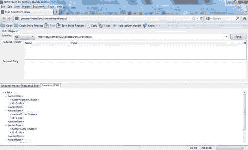
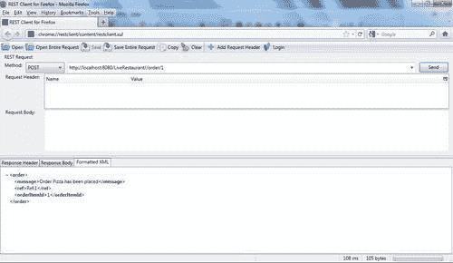
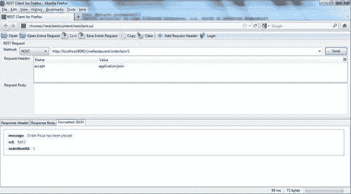
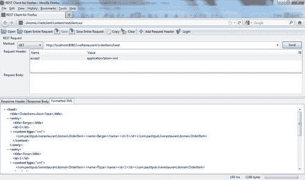

# 第九章：RESTful Web 服务

在本章中，我们将涵盖：

+   使用 Spring MVC 中的 RESTful 功能设置 Spring RESTful Web 服务

+   使用`RESTClient`工具访问 Spring RESTful Web 服务

+   使用 HTTP 消息转换设置 Spring RESTful Web 服务

+   为 Spring RESTful Web 服务创建 WS 客户端，使用 Spring 模板类

# 介绍

**简单对象访问协议（SOAP）**允许应用程序使用 XML 作为通信格式进行通信（SOAP 很容易理解），但由于它是基于 XML 的，即使对于非常简单的 Web 服务场景，它也往往冗长。

**表述性状态转移（REST）**，由 Roy Fielding 于 2000 年发表的博士论文，旨在简化 Web 服务的使用。

SOAP 使用大量 XML（看起来非常复杂）进行通信，而 REST 使用非常轻量级和易读的数据（例如，请求 URI[`localhost:8080/LiveRestaurant/customerAccount/234`](http://localhost:8080/LiveRestaurant/customerAccount/234)返回`123-3456`）。将此简单请求和响应与 SOAP 请求/响应信封进行比较，这些信封已经在本书的前几章中介绍过。由于 REST Web 服务实现非常灵活且非常简单，因此不需要工具包。但是，基于 SOAP 的 Web 服务需要工具来简化（例如，要调用 SOAP Web 服务，您将使用工具为合同后的 Web 服务类生成客户端代理类，或者使用工具从合同优先的 Web 服务中生成域类）。在前几章中，您将意识到合同优先的 Web 服务有多么严格（它必须与合同匹配）。REST Web 服务的请求/响应格式完全由开发人员决定，并且可以尽可能轻松地设计。在使用 SOAP Web 服务时，使用 JavaScript 并不容易（需要大量代码）。使用 AJAX 技术和 JSON 格式简化了 REST 的使用。

以下是 REST 的一些缺点：REST 仅适用于 HTTP；调用 RESTful Web 服务受到 HTTP 动词的限制：GET、POST、PUT 和 DELETE。

RESTful 是建立在 REST 原则之上的，其中使用 HTTP 的方法基于其概念。例如，HTTP 的`GET、POST、PUT`和`DELETE`都在 RESTful 架构中使用，与 HTTP 的含义相匹配。

RESTful Web 服务公开其资源的状态。在本章中，例如，RESTful 服务公开了获取在线餐厅中可用订单项目列表和订单对象的服务。要获取可用订单项目列表，使用`GET`方法，而要下订单，则使用`POST`方法。`PUT`方法可用于添加/更新条目，`DELETE`方法可用于删除条目。

以下是用于进行 RESTful Web 服务调用并获取可用订单项目列表的示例 URL：

[`localhost:8080/LiveRestaurant/orderItems`](http://localhost:8080/LiveRestaurant/orderItems)。

以下是返回响应（响应格式不一定是 XML 格式；它可以是 JSON、纯文本或任何格式）：

```java
<list>
<orderItem>
<name>Burger</name>
<id>0</id>
</orderItem>
<orderItem>
<name>Pizza</name>
<id>1</id>
</orderItem>
<orderItem>
<name>Sushi</name><id>2</id>
</orderItem>
<orderItem>
<name>Salad</name>
<id>3</id>
</orderItem>
</list> 

```

RESTful Web 服务有几种实现，例如`Restlet、RestEasy`和`Jersey`。其中，Jersey 是这一组中最重要的实现，是 JAX-RS（JSR 311）的实现。

Spring 作为 Java EE 广泛使用的框架，在 3.0 版本中引入了对 RESTful Web 服务的支持。RESTful 已经集成到 Spring 的 MVC 层中，允许应用程序使用 RESTful 功能构建 Spring。其中最重要的功能包括：

+   **注释**，例如`@RequestMapping`和`@PathVariable`，用于 URI 映射和传递参数。

+   `ContentNegotiatingViewResolver`，允许使用不同的 MIME 类型（如`text/xml、text/json`和`text/plain`）

+   `HttpMessageConverter`允许基于客户端请求（如 ATOM、XML 和 JSON）生成多种表示。

# 使用 Spring MVC 中的 RESTful 特性设置 Spring RESTful Web 服务。

Spring 3.0 支持基于 Spring MVC 的 RESTful Web 服务。Spring 使用注解来设置 RESTful Web 服务，并需要在 Spring 应用程序上下文文件中进行配置以扫描注解。需要一个 Spring MVC 控制器来设置 RESTful Web 服务。`@Controller`注解标记一个类为 MVC 控制器。`@RequestMapping`注解将传入的请求映射到控制器类中的适当 Java 方法。使用这个注解，你可以定义 URI 和 HTTP 方法，这些方法映射到 Java 类方法。例如，在下面的例子中，如果请求 URI 后跟着`/orderItems`，那么方法`loadOrderItems`将被调用，`@PathVariable`用于将请求参数（`{cayegoryId}`）的值注入到方法参数中（`String cayegoryId`）：

```java
@RequestMapping( value="/orderItem/{cayegoryId}", method=RequestMethod.GET )
public ModelAndView loadOrderItems(@PathVariable String cayegoryId)
{...}

```

在这个示例中，介绍了使用 Spring 3 MVC 实现 RESTful Web 服务。这个 Web 服务的客户端项目在这里实现了，但将在本章的最后一个示例中详细介绍：*使用 Spring 模板类为 Spring RESTful Web 服务创建 WS 客户端*。

## 准备工作

在这个示例中，项目的名称是`LiveRestaurant_R-9.1`（`LiveRestaurant_R-9.1-Client`项目包含在代码中用于测试目的），具有以下 Maven 依赖项：

+   `com.springsource.javax.servlet-2.5.0.jar`

+   `spring-oxm-3.0.5.RELEASE.jar`

+   `spring-web-3.0.5.RELEASE.jar`

+   `spring-webmvc-3.0.5.RELEASE.jar`

+   `xstream-1.3.1.jar`

+   `commons-logging-1.1.1.jar`

`spring-oxm`是 Spring 对对象/XML 映射的支持，`spring-web`和`spring-webmvc`是对 Seb 和 MVC 支持的支持，`xstream`是用于对象/XML 映射框架的支持。

## 如何做...

1.  在`web.xml`文件中配置`MessageDispatcherServlet`（URL：http://<host>:<port>/<appcontext>/*将被转发到此 servlet）。

1.  定义控制器文件（`OrderController.java`）。

1.  定义领域 POJO（`Order.java,OrderItem.java`）和服务（`OrderService, OrderServiceImpl`）。

1.  配置服务器端应用程序上下文文件（`order-servlet.xml`）。

1.  在`Liverestaurant_R-9.1`上运行以下命令：

```java
mvn clean package tomcat:run 

```

1.  在`Liverestaurant_R-9.1-Client`上运行以下命令：

```java
mvn clean package 

```

+   这是客户端输出：

```java
.... Created POST request for "http://localhost:8080/LiveRestaurant/order/1"
.....Setting request Accept header to [application/xml, text/xml, application/*+xml]
.... POST request for "http://localhost:8080/LiveRestaurant/order/1" resulted in 200 (OK)
.....Reading [com.packtpub.liverestaurant.domain.Order] as "application/xml;charset=ISO-8859-1"
.....
.....Created GET request for "http://localhost:8080/LiveRestaurant/orderItems"
.....Setting request Accept header to [application/xml, text/xml, application/*+xml]
.....GET request for "http://localhost:8080/LiveRestaurant/orderItems" resulted in 200 (OK) 

```

1.  浏览到此链接：[`localhost:8080/LiveRestaurant/orderItems`](http://localhost:8080/LiveRestaurant/orderItems)，您将得到以下响应：

```java
<list>
<orderItem>
<name>Burger</name>
<id>0</id>
</orderItem>
<orderItem>
<name>Pizza</name>
<id>1</id>
</orderItem>
<orderItem>
<name>Sushi</name><id>2</id>
</orderItem>
<orderItem>
<name>Salad</name>
<id>3</id>
</orderItem>
</list> 

```

## 它是如何工作的...

该应用程序是一个 MVC Web 项目，其中一个控制器返回 Spring 的`Model`和`View`对象。Spring 的`MarshallingView`将模型对象编组成 XML，使用`marshaller`（`XStreamMarshaller`），并将 XML 发送回客户端。

所有请求将到达`DispatcherServlet`，它将被转发到控制器`OrderController`，根据请求 URI，将调用适当的方法返回响应给调用者。`web.xml`中的以下配置将所有请求转发到`DispatcherServlet`：

```java
<servlet>
<servlet-name>order</servlet-name>
<servlet-class>
org.springframework.web.servlet.DispatcherServlet
</servlet-class>
<load-on-startup>1</load-on-startup>
</servlet>
<servlet-mapping>
<servlet-name>order</servlet-name>
<url-pattern>/*</url-pattern>
</servlet-mapping>

```

在`order-context.xml`中的以下设置导致 Spring 检测包中的所有注解（包括`OrderService`和`OrderController`）。`BeanNameViewResolver`用于将名称（`OrderController`中的`orderXmlView`）映射到视图（`orderXmlView` bean），它是`org.springframework.web.servlet.view.xml.MarshallingView`的实例：

```java
<context:component-scan base-package= "com.packtpub.liverestaurant.orderservice" />
<bean class= "org.springframework.web.servlet.view.BeanNameViewResolver" />
<bean id="orderXmlView" class= "org.springframework.web.servlet.view.xml.MarshallingView">
...
</bean>

```

`@Controller`标记`OrderController`类为 MVC 模式中的控制器。所有调用请求将被转发到该类，并根据请求 URI，将调用适当的方法。例如，如果来自调用者请求的 HTTP `POST`方法的 URI 类似于`http://<host>:<port>/<appcontext>/order/1`，则将调用`placeOrder`方法。

```java
@RequestMapping(value = "/order/{orderId}", method = RequestMethod.POST)
public ModelAndView placeOrder(@PathVariable String orderId) {..}

```

`@PathVariable`导致从 URI 中注入并传递给`placeOrder`方法的`orderId`参数。

方法的主体`placeOrder`调用`OrderService`接口的方法并返回`Order`对象：

```java
Order order = orderService.placeOrder(orderId);
ModelAndView mav = new ModelAndView("orderXmlView", BindingResult.MODEL_KEY_PREFIX + "order", order);
return mav;

```

然后，它基于将`Order`对象编组成 XML 格式来构建视图，使用`Marshallingview` bean（MVC 中的视图使用`XStreamMarshaller`将模型对象编组成 XML 格式），并将其返回给服务的调用者。

```java
<bean id="orderXmlView" class= "org.springframework.web.servlet.view.xml.MarshallingView">
<constructor-arg>
<bean class="org.springframework.oxm.xstream.XStreamMarshaller">
<property name="autodetectAnnotations" value="true"/>
</bean>
</constructor-arg>
</bean>

```

`loadOrderItems`方法的工作方式相同，只是 URI 应该类似于以下模式：`http://<host>:<port>/<appcontext>/orderItems`，使用 HTTP `GET`：

```java
@RequestMapping(value = "/orderItems", method = RequestMethod.GET)
public ModelAndView loadOrderItems() {
List<OrderItem> orderItems = orderService.listOrderItems();
ModelAndView modelAndView = new ModelAndView("orderXmlView", BindingResult.MODEL_KEY_PREFIX + "orderItem", orderItems);
return modelAndView;
}

```

在本教程中，数据库活动未实现。但是，在实际应用中，可以使用 HTTP 方法`DELETE`从数据库中删除实体（例如`orderItem`），并且可以使用`PUT`方法更新记录（例如`order`）。

## 另请参阅...

在本书中：

第六章，*编组和对象-XML 映射（OXM）*：

*使用 XStream 进行编组*

# 使用 REST 客户端工具访问 Spring RESTful Web-Service

**REST Client**是一个用于调用和测试 RESTful Web-Services 的应用程序。REST Client 作为 Firefox/Flock 附加组件提供。Firefox REST Client 支持所有 HTTP 方法，**RFC2616（HTTP/1.1）**和**RFC2518（WebDAV）**。使用此附加组件，您可以构建自己定制的 URI，添加标头，将其发送到 RESTful Web-Services，并获取响应。

在本教程中，我们将学习如何使用 Firefox REST Client 测试 RESTful Web-Service 的呈现方式。本教程使用本章的第一个教程，*使用 Spring MVC 中的 RESTful 功能设置 Spring RESTful Web-Service*，作为 RESTful Web-Services。

## 准备工作

下载并安装 Firefox 的以下附加组件：

[`addons.mozilla.org/en-US/firefox/addon/restclient/`](http://https://addons.mozilla.org/en-US/firefox/addon/restclient/)。

## 如何做...

1.  从本章运行`LiveRestaurant_R-9.1`。

1.  打开 Firefox 浏览器，转到**工具 | Rest Client**。

1.  将**方法**更改为**GET**，并输入 URL：[`localhost:8080/LiveRestaurant/orderItems`](http://localhost:8080/LiveRestaurant/orderItems)，然后单击**发送**：

这是结果：



1.  将**方法**更改为**POST**，输入 URL：[`localhost:8080/LiveRestaurant/order/1`](http://localhost:8080/LiveRestaurant/order/1)，然后单击**发送**：



## 另请参阅...

在本章中：

使用 Spring MVC 中的 RESTful 功能设置 Spring RESTful Web-Service

# 使用 HTTP 消息转换设置 Spring RESTful Web-Service

HTTP 协议上的客户端和服务器使用文本格式交换数据。最终，需要接受不同的请求格式，并将文本格式转换为有意义的格式，例如对象或 JSON 格式。Spring 提供了提供从相同文本格式到多个请求/演示的功能。

Spring 3 引入了`ContentNegotiatingViewResolver`，它可以从相同的 URI 选择各种视图，并提供多个演示。

执行相同任务的另一种方法是使用`HttpMessageConverter`接口和`@ResponseBody`注解。Spring 中`HttpMessageConverter`接口的实现将 HTTP 消息转换为多种格式。其广泛使用的实现包括：

+   `StringHttpMessageConverter`实现从 HTTP 请求/响应中读取/写入文本。这是默认转换器。

+   `MarshallingHttpMessageConverter`实现从文本 HTTP 请求/响应中编组/解组对象。它获取构造函数参数以指定编组器的类型（如`Jaxb，XStream`等）。

+   `MappingJacksonHttpMessageConverter`实现将文本转换为 JSON 数据格式，反之亦然。

在本示例中，使用`MarshallingHttpMessageConverter, MappingJacksonHttpMessageConverter`和`AtomFeedHttpMessageConverter`进行消息转换。由于此项目类似于本章的第一个示例，*使用 Spring MVC 中的 RESTful 功能设置 Spring RESTful Web 服务*，因此它被重用作项目的模板。本示例的区别在于控制器实现和应用程序上下文配置。

这个 Web 服务的客户端项目在这里实现，但将在本章的最后一个示例中详细介绍，*使用 Spring 模板类为 Spring RESTful Web 服务创建 WS 客户端*。

## 准备工作

在本示例中，项目名称为`LiveRestaurant_R-9.2（LiveRestaurant_R-9.2-Client`在本示例中包含在代码中以进行测试。但是，它将在最后一个示例中解释），并且具有以下 Maven 依赖项：

+   `com.springsource.javax.servlet-2.5.0.jar`

+   `spring-oxm-3.0.5.RELEASE.jar`

+   `spring-web-3.0.5.RELEASE.jar`

+   `spring-webmvc-3.0.5.RELEASE.jar`

+   `xstream-1.3.1.jar`

+   `commons-logging-1.1.1.jar`

+   `jackson-core-asl-1.7.5.jar`

+   `jackson-mapper-asl-1.7.5.jar`

+   `rome-1.0.jar`

`jackson-core`和`jackson-mapper`支持 JSON 格式，其他支持 ATOM 格式。

## 操作步骤...

1.  在`web.xml`文件中配置`DispatcherServlet`（URL：http://<host>:<port>/<appcontext>`/*将被转发到此 servlet）。

1.  定义控制器文件（`OrderController.java`）。

1.  定义领域 POJOs（`Order.java,OrderItem.java`）和服务（`OrderService, OrderServiceImpl`）

1.  配置服务器端应用程序上下文文件（`order-servlet.xml`）并注册转换器。

1.  将**方法**更改为**POST**，并添加**请求头:名称** - `accept`，**值** - `application/json`。输入 URL [`localhost:8080/LiveRestaurant/orderJson/1`](http://localhost:8080/LiveRestaurant/orderJson/1) 并点击**发送：**

1.  将**方法**更改为**GET**，并添加**请求头:名称** - `accept`，**值** - `application/atom+xml`。输入 URL [`localhost:8080/LiveRestaurant/orderItemsFeed`](http://localhost:8080/LiveRestaurant/orderItemsFeed) 并点击**发送：**



## 工作原理...

这个示例与本章的第一个示例几乎相同，只是它使用了消息转换器和`@ResponseBody`来提供多个表示。

在第一个示例中，`MarshallingView`负责将响应转换为所选视图的 XML 类型（使用`XstreamMarshaller`）。然而，在这里，消息转换器负责将数据模型呈现为所选格式，`MarshallingHttpMessageConverter`负责将`List<OrderItem>`转换为`application/xml`格式（使用`XstreamMarshaller`），`MappingJacksonHttpMessageConverter`用于将订单转换为`application/json`格式。`AtomFeedHttpMessageConverter`用于将`Feed`（包装来自`List<OrderItem>`的 XML 内容，使用`XStreamMarshaller`生成的）转换为`application/atom+xml`格式：

```java
<context:component-scan base-package= "com.packtpub.liverestaurant.orderservice" />
<bean id="xStreamMarshaller" class= "org.springframework.oxm.xstream.XStreamMarshaller"/>
<bean class="org.springframework. web.servlet.mvc.annotation.DefaultAnnotationHandlerMapping" />
<bean class="org.springframework. web.servlet.mvc.annotation.AnnotationMethodHandlerAdapter">
<property name="messageConverters">
<list>
<ref bean="marshallingConverter" />
<ref bean="jsonConverter" />
<ref bean="atomConverter" />
</list>
</property>
</bean>
<bean id="marshallingConverter" class="org.springframework. http.converter.xml.MarshallingHttpMessageConverter">
<constructor-arg>
<bean class="org.springframework.oxm.xstream.XStreamMarshaller">
<property name="autodetectAnnotations" value="true"/>
</bean>
</constructor-arg>
<property name="supportedMediaTypes" value="application/xml"/>
</bean>
<bean id="jsonConverter" class="org.springframework. http.converter.json.MappingJacksonHttpMessageConverter">
<property name="supportedMediaTypes" value="application/json" />
</bean>
<bean id="atomConverter"class="org.springframework. http.converter.feed.AtomFeedHttpMessageConverter">
<property name="supportedMediaTypes" value="application/atom+xml" />
</bean>

```

在控制器中，以下代码导致控制器方法接受请求 URI 方法的`POST`格式 - `json：`

```java
@RequestMapping(method=RequestMethod.POST, value="/orderJson/{orderId}", headers="Accept=application/json")
public @ResponseBody Order placeOrderJson(@PathVariable String orderId) {
Order order=orderService.placeOrder(orderId);
return order;
}

```

并以 JSON 格式返回`Order`对象（使用`@ResponseBody`和`MappingJacksonHttpMessageConverter`在`order-context.xml`中配置）：

```java
{"message":"Order Pizza has been placed","ref":"Ref:1","orderItemId":"1"} 

```

以下代码导致控制器方法接受请求 URI 方法的`GET`格式 - `atom：`

```java
@RequestMapping(method=RequestMethod.GET, value="/orderItemsFeed", headers="Accept=application/atom+xml")
public @ResponseBody Feed loadOrderItemsAtom() {
Feed feed = null;
try {
feed= getOrderItemsFeed(orderService.listOrderItems());
} catch (Exception e) {
throw new RuntimeException(e);
}
return feed;
}

```

它还以`Atom`格式返回`List<OrderItem>`对象（使用`@ResponseBody`和`AtomFeedHttpMessageConverter`在`order-context.xml`中配置）：

```java
<?xml version="1.0" encoding="UTF-8"?>
<feed >
<title>OrderItems Atom Feed</title>
<entry>
<title>Burger</title>
<id>0</id>
<content type="xml">
&lt;com.packtpub.liverestaurant.domain.OrderItem&gt;&lt;name&gt; Burger&lt;/name&gt;&lt;id&gt;0&lt;/id&gt;&lt;/com.packtpub. liverestaurant.domain.OrderItem&gt;
</content>
</entry>
<entry>
<title>Pizza</title>
<id>1</id>
<content type="xml">&lt;com.packtpub.liverestaurant.domain. OrderItem&gt;&lt;name&gt;Pizza&lt;/name&gt;&lt;id&gt;1&lt; /id&gt;&lt;/com.packtpub.liverestaurant.domain.OrderItem&gt;
</content>
</entry>
...

```

## 另请参阅...

在本章中：

*使用 Spring MVC 中的 RESTful 功能设置 Spring RESTful Web 服务*

# 使用 Spring 模板类为 Spring RESTful Web 服务创建 WS 客户端

Spring 提供了各种模板类，使用不同的技术简化了许多复杂性。例如，`WebServiceTemplate`用于调用基于 SOAP 的 Web 服务，`JmsTemplate`用于发送/接收 JMS 消息。Spring 还有`RestTemplate`来简化与 RESTful Web 服务的交互。

使用`RestTemplate:`

+   创建一个`RestTemplate`的实例（可以使用`@Autowired`特性来完成）

+   配置一对多的消息转换器（如前面的示例中所述）

+   调用`RestTemplate`的方法来调用 RESTful Web 服务并获取响应

在这个示例中，我们将学习如何使用`RestTemplate`消耗 RESTful Web 服务。这个示例使用了本章的第三个示例，*使用 HTTP 消息转换设置 Spring RESTful Web 服务*，作为 RESTful Web 服务。

## 准备工作

在这个示例中，项目的名称是`LiveRestaurant_R-9.2-Client`（`LiveRestaurant_R-9.2`包含在这个示例中，用于设置 RESTful 服务器，如前面的示例*使用 HTTP 消息转换设置 Spring RESTful Web 服务*中所解释的），具有以下 Maven 依赖项：

+   `spring-oxm-3.0.5.RELEASE.jar`

+   `spring-web-3.0.5.RELEASE.jar`

+   `xstream-1.3.1.jar`

+   `commons-logging-1.1.1.jar`

+   `jackson-core-asl-1.7.5.jar`

+   `jackson-mapper-asl-1.7.5.jar`

+   `rome-1.0.jar`

+   `junit-4.6.jar`

+   `spring-test-3.0.5.RELEASE.jar`

## 如何做...

1.  定义领域 POJOs（`Order.java`、`OrderItem.java`）和服务（`OrderService`、`OrderServiceImpl`）。

1.  配置客户端应用程序上下文文件（`order-servlet.xml`）并注册转换器。

1.  创建一个辅助类（`OrderClient`），用`RestTemplate`来调用 RESTful Web 服务。

1.  在`Liverestaurant_R-9.2`上运行以下命令：

```java
mvn clean package tomcat:run 

```

1.  在`Liverestaurant_R-9.2-Client`上运行以下命令：

```java
mvn clean package 

```

+   以下是客户端输出：

```java
....
.. Created GET request for "http://localhost:8080/LiveRestaurant/orderItems"
.. Setting request Accept header to [application/xml, text/xml, application/*+xml, application/json]
.. GET request for "http://localhost:8080/LiveRestaurant/orderItems" resulted in 200 (OK)
.. Reading [java.util.List] as "application/xml" using ....
.. Created POST request for "http://localhost:8080/LiveRestaurant/orderJson/1"
.. Setting request Accept header to [application/xml, text/xml, application/*+xml, application/json]
.. POST request for "http://localhost:8080/LiveRestaurant/orderJson/1" resulted in 200 (OK)
.. Reading [com.packtpub.liverestaurant.domain.Order] as "application/xml" using ...
...Created GET request for "http://localhost:8080/LiveRestaurant/orderItemsFeed"
.. Setting request Accept header to [application/xml, text/xml, application/*+xml, application/json, application/atom+xml]
.. GET request for "http://localhost:8080/LiveRestaurant/orderItemsFeed" resulted in 200 (OK)
.. Reading [com.sun.syndication.feed.atom.Feed] as "application/xml" using ... 

```

## 工作原理...

由`OrderServiceClientTest`加载的应用程序上下文加载、实例化和注入`RestTemplate`到`OrderClient`中。这个类使用`RestTemplate`调用控制器的方法，并将值返回给测试套件类（`OrderServiceClientTest`）。

在套件类测试方法中，响应将与期望的值进行比较。

`applicationContext.xml`定义了`restTemplate` bean 并设置了一系列消息转换器：

```java
......
<bean id="restTemplate" class="org.springframework.web.client.RestTemplate">
<property name="messageConverters">
<list>
<ref bean="xmlMarshallingHttpMessageConverter" />
<ref bean="jsonConverter" />
<ref bean="atomConverter" />
</list>
</property>
</bean>
<bean id="xmlMarshallingHttpMessageConverter" class="org.springframework. http.converter.xml.MarshallingHttpMessageConverter">
<constructor-arg>
<ref bean="xStreamMarshaller" />
</constructor-arg>
</bean>
<bean id="xStreamMarshaller" class="org.springframework.oxm.xstream.XStreamMarshaller">
<property name="annotatedClasses">
<list>
<value>com.packtpub.liverestaurant.domain.Order</value>
<value>com.packtpub.liverestaurant.domain.OrderItem</value>
</list>
</property>
</bean>
<bean id="atomConverter" class="org.springframework. http.converter.feed.AtomFeedHttpMessageConverter">
<property name="supportedMediaTypes" value="application/atom+xml" />
</bean>
<bean id="jsonConverter" class="org.springframework. http.converter.json.MappingJacksonHttpMessageConverter">
<property name="supportedMediaTypes" value="application/json" />
</bean>

```

设置在`messageConverters`内部的转换器负责将不同格式（XML、JSON、ATOM）的请求/响应转换回`object`类型。`XstreamMarshaller`使用这些类中的注释标签获取已识别的 POJOs（Order、OrderItem）的列表。

`OrderClient.java`是一个辅助类，用于调用 RESTful Web 服务，使用`RestTemplate:`

```java
protected RestTemplate restTemplate;
private final static String serviceUrl = "http://localhost:8080/LiveRestaurant/";
@SuppressWarnings("unchecked")
public List<OrderItem> loadOrderItemsXML() {
HttpEntity<String> entity = getHttpEntity(MediaType.APPLICATION_XML);
ResponseEntity<List> response = restTemplate.exchange(serviceUrl + "orderItems", HttpMethod.GET, entity, List.class);
return response.getBody();
}
.....
...
public String loadOrderItemsAtom() {
HttpEntity<String> httpEntity = getHttpEntity(MediaType.APPLICATION_ATOM_XML);
String outputStr = null;
ResponseEntity<Feed> responseEntity = restTemplate.exchange(serviceUrl + "orderItemsFeed", HttpMethod.GET, httpEntity, Feed.class);
WireFeed wireFeed = responseEntity.getBody();
WireFeedOutput wireFeedOutput = new WireFeedOutput();
try {
outputStr = wireFeedOutput.outputString(wireFeed);
} catch (Exception e) {
throw new RuntimeException(e);
}
return outputStr;
}
private HttpEntity<String> getHttpEntity(MediaType mediaType) {
HttpHeaders httpHeaders = new HttpHeaders();
httpHeaders.setContentType(mediaType);
HttpEntity<String> httpEntity = new HttpEntity<String>(httpHeaders);
return httpEntity;
}

```

## 还有更多

这个示例只使用了`RestTemplate`的两种方法（exchange 和`postForEntity`）。然而，`RestTemplate`支持多种调用方法：

+   `exchange:`它调用特定的 HTTP（GET、`POST、PUT`和`DELETE`）方法并转换 HTTP 响应

+   `getForObject:`它调用 HTTP 的`GET`方法并将 HTTP 响应转换为对象

+   `postForObject:`它调用 HTTP 的`POST`方法并将 HTTP 响应转换为对象

## 另请参阅...

在本章中：

+   *使用 Spring MVC 中的 RESTful 功能设置 Spring RESTful Web 服务*

+   *使用 HTTP 消息转换设置 Spring RESTful Web 服务*

书籍《RESTful Java Web Services》，网址为[`www.packtpub.com/restful-java-web-services/book`](http://www.packtpub.com/restful-java-web-services/book)。
