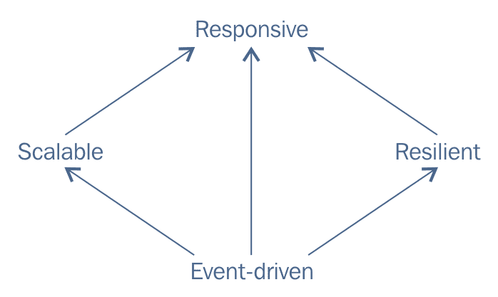
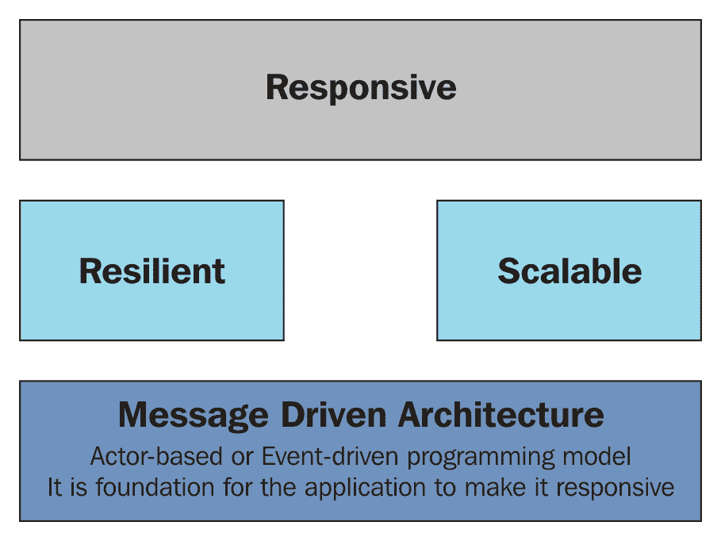
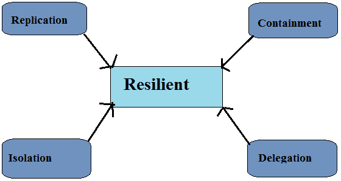
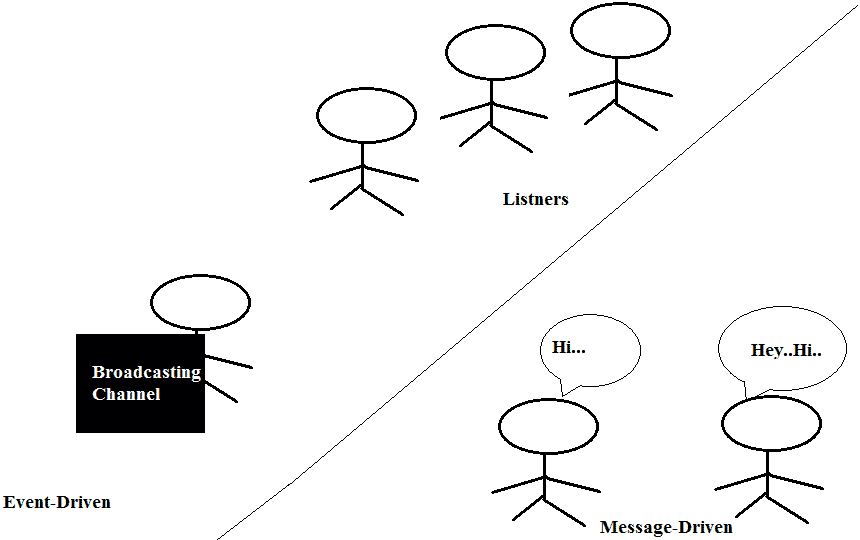
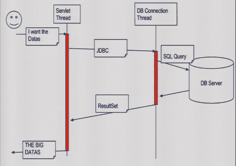
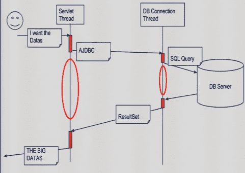
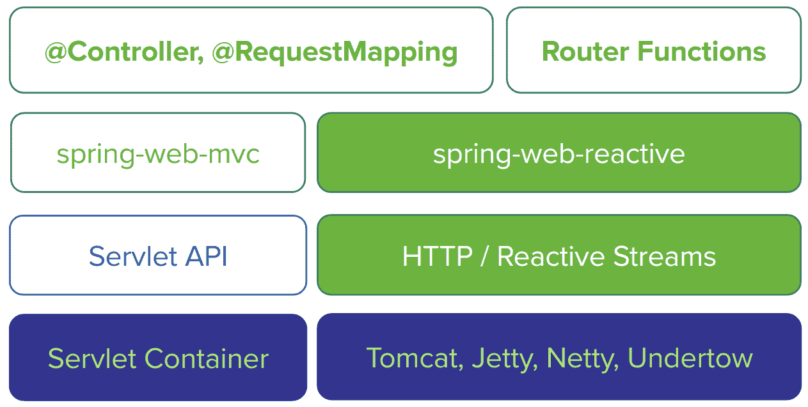
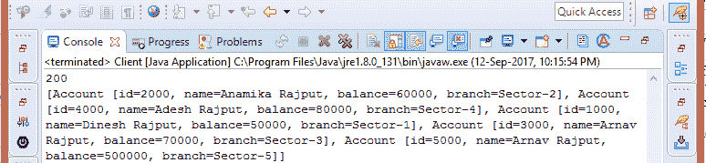

# 第十一章：实现响应式设计模式

在本章中，我们将探讨 Spring 5 框架最重要的特性之一，即响应式模式编程。Spring 5 框架通过 Spring Web Reactive 模块引入了这一新特性。我们将在本章中讨论这个模块。在此之前，让我们先了解一下响应式模式。什么是响应式模式，为什么它在当今越来越受欢迎？我将从微软公司首席执行官**萨蒂亚·纳德拉**的以下声明开始我的响应式模式讨论：

现在的每一家企业都是软件公司，都是数字公司。

我们在这里将要讨论的主题如下：

+   为什么选择响应式模式？

+   响应式模式原则

+   阻塞调用

+   非阻塞调用

+   反压

+   使用 Spring 框架实现响应式模式

+   Spring Web Reactive 模块

# 多年来理解应用需求

如果你回顾 10 到 15 年前，互联网用户非常少，与今天的在线门户相比，用户在线的门户网站也少得多。如今，我们无法想象没有电脑或没有任何在线系统的生活。简而言之，我们在个人和商业用途上对电脑和在线计算变得极其依赖。每一个商业模式都在向数字化转变。印度总理纳伦德拉·莫迪先生启动了“数字印度”运动，以确保通过改进在线基础设施、增加互联网连接以及使国家在技术领域数字化，政府的服务能够以电子方式提供给公民。

所有这些都意味着互联网用户数量正在急剧增加。根据爱立信移动性报告，

预计到 2018 年，物联网（IoT）将超过移动电话，成为最大的连接设备类别。

移动互联网用户数量增长迅速，且没有迹象表明这种增长会很快放缓。在这些领域，根据定义，服务器端必须同时处理数百万个连接设备。以下表格比较了现在的基础设施和应用需求与 10 年前的需求：

| **需求** | **现在** | **十年前** |
| --- | --- | --- |
| **服务器节点** | 需要超过 1000 个节点。 | 10 个节点就足够了。 |
| **响应时间** | 服务请求并返回响应需要毫秒级时间。 | 响应需要几秒钟。 |
| **维护停机时间** | 目前，不需要或零维护停机时间。 | 需要数小时的维护停机时间。 |
| **数据量** | 当前应用程序的数据量从 PBs 增加到 TBs。 | 数据量在 GBs。 |

你可以在前一张表中看到资源需求的变化。这些需求增加了，因为我们现在期望在秒内立即得到响应。同时，分配给计算机的任务复杂性也增加了。这些任务不仅仅是数学意义上的纯计算，还包括从大量数据中请求响应。因此，现在我们必须通过设计单台计算机的形式为多核 CPU，可能是在多插槽服务器中组合，来关注这类系统的性能。我们首先想到的是使系统保持响应。这是响应式特性的第一个——响应性。我们将在本章中进一步探讨这一点，以及以下主题：

+   为什么选择响应式模式

+   响应式模式原则

+   阻塞调用

+   非阻塞调用

+   反压

+   使用 Spring 框架实现响应式模式

+   Spring Web 响应式模块

+   在服务器端实现响应式

+   在客户端实现响应式

+   请求和响应体类型转换

本章将教你如何在面对任何可变负载、部分故障、程序失败等情况时使系统保持响应。如今，系统被分布在不同节点上以高效地处理请求。

让我们详细探讨上述主题。

# 理解响应式模式

现在，现代应用必须更加健壮、更加弹性、更加灵活，并且更好地满足组织的需求，因为，在最近几年里，应用的需求发生了巨大的变化。正如我们在上一张表中看到的，10 到 15 年前，一个大型应用有 10 个服务器节点，处理请求的响应时间在秒级，我们需要的维护和部署停机时间大约是几个小时，数据量在千兆级别。但今天，一个应用需要数千个服务器节点，因为它可以通过多个渠道如移动设备访问。服务器响应时间预期在毫秒级，部署和维护的停机时间接近于 0%。数据量已从千兆增长到拍字节。

十年以上的系统无法满足当今应用的需求；我们需要一个能够在应用层或系统层满足所有用户需求的系统，这意味着我们需要一个响应式的系统。响应性是响应式模式的一个特性。我们希望系统必须具有响应性、弹性、弹性和消息驱动性。我们把这些系统称为响应式系统。这些系统更加灵活、松散耦合且可扩展。

系统必须对故障做出反应并保持可用性，即它应该是弹性的，并且系统必须对可变负载条件做出反应，而不会过载。系统应该对事件做出反应——无论是事件驱动的还是基于消息的。如果所有这些属性都与一个系统相关联，那么它将是响应式的，也就是说，如果一个系统对其用户做出反应，它就是响应式的。要创建一个响应式系统，我们必须关注系统级和应用级。让我们首先看看所有响应式特性。

# 响应式模式特性

以下是对响应式模式的原则：

+   **响应式**：这是今天每个应用程序的目标。

+   **弹性**：这是使应用程序响应式所必需的。

+   **可伸缩性**：这也是使应用程序响应式所必需的；没有弹性和可伸缩性，就不可能实现响应性。

+   **基于消息的**：基于消息的架构是可伸缩和弹性的应用程序的基础，最终，它使系统响应式。基于消息的架构可以是基于事件驱动的或基于演员的编程模型。

上述提到的点是响应式模式的核心原则。让我们详细探讨响应式模式的每个原则，并了解为什么所有这些原则必须一起应用，才能在现代应用环境中构建一个具有高质量软件的响应式系统，该系统能在毫秒内处理数百万个并行请求而不会出现任何故障。让我们首先通过以下图表来理解这些原则：



如前图所示，为了使系统响应式，我们需要可伸缩性和弹性。为了使系统可伸缩和弹性，我们需要应用程序的事件驱动或基于消息的架构。最终，这些原则，可伸缩性、弹性和事件驱动架构使系统能够对客户端做出响应。让我们详细看看这些特性。

# 响应性

当我们说一个系统或应用程序是响应式的，这意味着该应用程序或系统在所有条件下都能在给定时间内快速响应用户，无论是处于良好状态还是不良状态。这确保了用户体验的一致性和积极性。

对于一个系统来说，响应性是必需的，以确保可用性和实用性。一个响应性系统意味着在系统发生故障时，无论是由于外部系统还是流量激增，故障都能迅速检测到，并在短时间内得到有效处理，而用户不会意识到故障。最终用户必须能够通过提供快速和一致的反应时间与系统交互。用户在与系统交互时不应遇到任何故障，并且系统必须向用户提供一致的服务质量。这种一致的行为解决了故障，并在系统中建立了最终用户的信心。在各种条件下，快速性和积极的用户体验使系统具有响应性。这取决于反应式应用程序或系统的另外两个特征，即弹性和可伸缩性。另一个特征，即事件驱动或消息驱动架构，为响应性系统提供了整体基础。以下图展示了响应性系统：



正如你可以在前面的图中看到的那样，一个响应性系统依赖于系统的弹性和可伸缩性，而这些又依赖于其事件驱动架构。让我们看看反应式应用程序的其他特征。

# 弹性

当我们设计和开发一个系统时，我们必须考虑所有条件——无论是好是坏。如果我们只考虑好的条件，那么我们可能会实施一个系统，这个系统在短短几天后就会失败。主要的应用程序故障会导致停机、数据丢失，并损害你在市场上的应用程序声誉。

因此，我们必须关注每一个条件，以确保应用程序在所有条件下都具有响应性。这样的系统或应用程序被称为弹性系统。

每个系统都必须具有弹性以确保响应性。如果一个系统不具备弹性，那么在发生故障后它将无法响应。因此，一个系统在面临故障时也必须具有响应性。在整个系统中，故障可能存在于应用程序或系统的任何组件中。因此，系统中的每个组件都必须相互隔离，以便在组件故障时，我们可以恢复它而不会影响整个系统。单个组件的恢复是通过复制实现的。如果一个系统具有弹性，那么它必须具备复制、遏制、隔离和委派。看看下面的图，它说明了反应式应用程序或系统的弹性特征：



正如你可以在前面的图中看到的那样，通过复制、遏制、隔离和委派来实现弹性。让我们详细讨论这些点：

+   **复制**：这确保了在组件故障时，在必要时提供高可用性。

+   **隔离**：这意味着每个组件的失败必须被隔离，这通过尽可能多地解耦组件来实现。隔离对于系统自我修复是必要的。如果你的系统已经实现了隔离，那么你可以轻松地测量每个组件的性能，并检查内存和 CPU 的使用情况。此外，一个组件的失败不会影响整个系统或应用程序的响应性。

+   **包容**：解耦的结果是包含失败。这有助于避免整个系统出现故障。

+   **委托**：在失败后，每个组件的恢复委托给另一个组件。只有在我们的系统是可组合的情况下才可能实现。

现代应用程序不仅依赖于内部基础设施，还通过网络协议与其他网络服务集成。因此，我们的应用程序必须在核心上具有弹性，以便在各种现实条件下的相反条件下保持响应性。我们的应用程序不仅需要在应用层面上具有弹性，还需要在系统层面上具有弹性。

让我们看看反应式模式的另一个原则。

# 可扩展

弹性和可扩展性共同使系统持续响应。可扩展的系统或弹性的系统可以在不同的工作负载下轻松升级。通过增加和减少分配给处理这些输入的资源，可以按需使反应式系统可扩展。它通过提供与应用程序可扩展性相关的实时性能来支持多种扩展算法。我们可以通过使用成本效益高的软件和廉价的基础硬件（例如，云）来实现可扩展性。

一个应用程序如果可以根据其使用情况进行扩展，则被认为是可扩展的，以下是一些扩展方式：

+   **向上扩展**：它利用了多核系统中的并行性。

+   **向外扩展**：它利用了多服务器节点。位置透明性和弹性对于这一点很重要。

最小化共享可变状态对于可扩展性非常重要。

弹性和可扩展性是相同的！可扩展性主要关于高效使用已存在的资源，而弹性则是当系统需求变化时，根据需要向应用程序添加新资源。因此，最终，系统可以通过使用现有资源或向系统添加新资源来保持响应性。

让我们看看具有弹性和可扩展性的最终基础，即消息驱动架构。

# 消息驱动架构

消息驱动架构是响应式应用程序的基础。消息驱动应用程序可以是事件驱动和基于 actor 的应用程序。它也可以是这两种架构的组合——事件驱动和基于 actor 架构。

在事件驱动架构中，事件和事件观察者扮演主要角色。事件发生，但不是指向特定地址；事件监听器监听这些事件，并采取行动。但在消息驱动架构中，消息有适当的指向目的地的方向。让我们看看以下图解消息驱动和事件驱动架构的图：



正如您在前面的图中可以看到，在事件驱动架构中，如果发生事件，则监听器会监听它。但在消息驱动架构中，一个生成的消息通信有一个可寻址的接收者和单一目的。

异步消息驱动架构通过在组件之间建立限制，作为反应式系统的基础。它确保了松散耦合、隔离和位置透明性。组件之间的隔离完全取决于它们之间的松散耦合。隔离和松散耦合构成了弹性和恢复力的基础。

一个大型系统由多个组件组成。这些组件要么有较小的应用，要么可能具有反应性。这意味着反应式设计原则必须应用于所有规模级别，以使大型系统可组合。

传统上，大型系统由多个线程组成，这些线程通过共享同步状态进行通信。它往往具有强耦合性，难以组合，并且也倾向于阻塞阶段。但现在，所有大型系统都是由松散耦合的事件处理器组成的。事件可以异步处理而不阻塞。

让我们看看阻塞和非阻塞编程模型。

用非常简单的术语来说，反应式编程完全是关于非阻塞应用程序，这些应用程序是异步和事件驱动的，并且需要少量线程进行垂直扩展，而不是水平扩展。

# 阻塞调用

在一个系统中，一个调用可能正在占用资源，而其他调用正在等待相同的资源。这些资源在另一个完成使用后释放。

让我们来谈谈技术术语——实际上，阻塞调用意味着应用程序或系统中一些需要较长时间完成的操作，例如使用阻塞驱动器的文件 I/O 操作和数据库访问。以下是在系统中 JDBC 操作的阻塞调用图：



正如您在前面的图中可以看到，这里用红色显示的阻塞操作是用户调用 servlet 获取数据，然后移动到与数据库服务器的 JDBC 和 DB 连接。直到那时，当前线程等待来自数据库服务器的结果集。如果数据库服务器有延迟，那么等待时间可能会增加。这意味着线程执行依赖于数据库服务器的延迟。

让我们看看如何使这成为一个非阻塞执行。

# 非阻塞调用

程序的非阻塞执行意味着线程在竞争资源时不需要等待。资源的非阻塞 API 允许在不需要等待阻塞调用（如数据库访问和网络调用）的情况下调用资源。如果调用时资源不可用，则它将转到其他工作，而不是等待阻塞资源。当阻塞资源可用时，系统会得到通知。

查看以下图表，它展示了如何通过非阻塞线程执行来访问数据的 JDBC 连接：



如前图所示，线程执行不会等待来自数据库服务器的结果集。线程为数据库服务器创建数据库连接和 SQL 语句。如果数据库服务器在响应中存在延迟，则线程会继续执行其他工作，而不是被阻塞等待资源可用。

# 背压

在过载条件下，响应式应用程序永远不会放弃。背压是响应式应用程序的一个关键方面。它是一种确保响应式应用程序不会压倒消费者的机制。它测试响应式应用程序的各个方面。它测试系统在任何负载下都能优雅地响应。

背压机制确保系统在负载下具有弹性。在背压条件下，系统通过应用其他资源来帮助分配负载，从而使自己可扩展。

到目前为止，我们已经看到了响应式模式的原则；这些是使系统在晴朗或阴霾的天空下都能响应的必要条件。让我们看看，在下一节中 Spring 5 如何实现响应式编程。

# 使用 Spring 5 框架实现响应式

Spring 框架最新版本最突出的特性是新的响应式堆栈 Web 框架。响应式是带我们走向未来的更新。随着每一天的过去，这个技术领域越来越受欢迎，这就是为什么 Spring 框架 5.0 被推出时具有响应式编程的能力。这一新增功能使得 Spring 框架的最新版本便于以事件循环风格处理，这允许使用少量线程进行扩展。

Spring 5 框架通过内部使用 reactor 来实现其自身的响应式支持，从而实现了响应式编程模式。Reactor 是一个扩展了基本 Reactive Streams 的响应式流实现。Twitter 通过使用 Reactive Streams 实现了响应式传递。

# 响应式流

Reactive Streams 提供了一种异步流处理的协议或规则，具有非阻塞的反馈压力。这个标准也被 Java 9 以 `java.util.concurrent.Flow` 的形式采用。Reactive Streams 由四个简单的 Java 接口组成。这些接口是 `Publisher`、`Subscriber`、`Subscription` 和 `Processor`。但 Reactive Streams 的主要目标是处理反馈压力。如前所述，反馈压力是一个允许接收器从发射器询问数据量的过程。

您可以使用以下 Maven 依赖项在您的应用程序开发中添加 Reactive Streams：

```java
    <dependency> 
      <groupId>org.reactivestreams</groupId> 
      <artifactId>reactive-streams</artifactId> 
      <version>1.0.1</version> 
   </dependency> 
   <dependency> 
      <groupId>org.reactivestreams</groupId> 
      <artifactId>reactive-streams-tck</artifactId> 
      <version>1.0.1</version> 
   </dependency> 
```

前面的 Maven 依赖代码为您的应用程序添加了所需的 Reactive Streams 库。在接下来的章节中，我们将看到 Spring 如何在 Spring 和 Spring MVC 框架的 Web 模块中实现 Reactive Streams。

# Spring Web 反应式模块

截至 Spring 5.0 框架，Spring 引入了一个新的反应式编程模块——spring-web-reactive 模块。它基于 Reactive Streams。基本上，此模块使用具有反应式编程的 Spring MVC 模块，因此，您仍然可以在 Web 应用程序中使用 Spring MVC 模块，无论是单独使用还是与 spring-web-reactive 模块一起使用。

这个新的模块在 Spring 5.0 框架中包含了对基于反应式-web-functional 编程模型的支持。它还支持基于注解的编程模型。Spring-web-reactive 模块包含对反应式 HTTP 和 WebSocket 客户端调用反应式服务器应用程序的支持。它还使反应式 Web 客户端能够与反应式 Web 应用程序建立反应式 HTTP 连接。

下面的图显示了具有赋予 Spring Web 应用程序反应性行为的组件的 Spring-web-reactive 模块：



如您在前面图中所见，有两个并行模块——一个用于传统的 Spring MVC 框架，另一个用于 Spring-reactive Web 模块。图左侧是 Spring-MVC 相关组件，如 @MVC 控制器、**spring-web-mvc 模块**、**Servlet API 模块**和**Servlet 容器**。图右侧是 spring-web-reactive 相关组件，如 Router Functions、spring-web-reactive 模块、HTTP/Reactive Streams、Tomcat 的反应式版本等。**Spring-web-reactive** 相关组件，如 **Router Functions**、**spring-web-reactive 模块**、**HTTP/Reactive Streams**、Tomcat 的反应式版本等。

在前面的图中，您必须关注模块的位置。同一级别的每个模块都有传统 Spring MVC 和 Spring-web-reactive 模块的比较。这些比较如下所示：

+   在 Spring Web 反应式模块中，路由函数与 Spring MVC 模块中的 `@Controller`、`@RestController` 和 `@RequestMapping` 注解类似。

+   Spring-web-reactive 模块与 Spring-web-MVC 模块并行。

+   在传统的 Spring MVC 框架中，我们使用 Servlet API 在 Servlet 容器中为 `HttpServletRequest` 和 `HttpServletResponse`。但在 Spring-web-reactive 框架中，我们使用 HTTP/Reactive Streams，在 tomcat 服务器的反应式支持下创建 `HttpServerRequest` 和 `HttpServerResponse`。

+   我们可以使用 Servlet 容器来支持传统的 Spring MVC 框架，但对于 Spring-web-reactive 应用程序则需要一个支持反应式的服务器。Spring 提供了对 Tomcat、Jetty、Netty 和 Undertow 的支持。

在 第十章 中，*使用 Spring 在 Web 应用程序中实现 MVC 模式*，您学习了如何使用 Spring MVC 模块实现 Web 应用程序。现在让我们看看如何通过使用 Spring Web 反应式模块来实现反应式 Web 应用程序。

# 在服务器端实现反应式 Web 应用程序

Spring 反应式 Web 模块支持两种编程模型——基于注解或基于函数的编程模型。让我们看看这些模型在服务器端是如何工作的：

+   **基于注解的编程模型**：它基于 MVC 注解，如 `@Controller`、`@RestController`、`@RequestMapping` 等。Spring MVC 框架支持这些注解，用于在 Web 应用程序中进行服务器端编程。

+   **函数式编程模型**：这是 Spring 5 框架支持的一种新的编程范式。它基于 Java 8 Lambda 风格的路线和处理。Scala 也提供了函数式编程范式。

以下是我们必须为基于 Spring Boot 的反应式 Web 应用程序添加的 Maven 依赖项：

```java
    <parent> 
       <groupId>org.springframework.boot</groupId> 
       <artifactId>spring-boot-starter-parent</artifactId> 
       <version>2.0.0.M3</version> 
       <relativePath/> <!-- lookup parent from repository --> 
    </parent> 

    <properties> 
       <project.build.sourceEncoding>UTF-
        8</project.build.sourceEncoding> 
       <project.reporting.outputEncoding>UTF
        -8</project.reporting.outputEncoding> 
       <java.version>1.8</java.version> 
    </properties> 

    <dependencies> 
       <dependency> 
          <groupId>org.springframework.boot</groupId> 
          <artifactId>spring-boot-starter-webflux</artifactId> 
       </dependency> 

       <dependency> 
          <groupId>org.springframework.boot</groupId> 
          <artifactId>spring-boot-starter-test</artifactId> 
          <scope>test</scope> 
       </dependency> 
       <dependency> 
          <groupId>io.projectreactor</groupId> 
          <artifactId>reactor-test</artifactId> 
          <scope>test</scope> 
       </dependency> 
    </dependencies> 
```

如您在先前的 Maven 依赖配置文件中所见，我们已将 `spring-boot-starter-webflux` 和 `reactor-test` 依赖项添加到应用程序中。

让我们基于基于注解的编程模型创建一个反应式 Web 应用程序。

# 基于注解的编程模型

您可以使用在 第十章 中使用过的相同注解，*使用 Spring 在 Web 应用程序中实现 MVC 模式*。Spring MVC 的 `@Controller` 和 `@RestController` 注解在反应式端也得到了支持。到目前为止，传统 Spring MVC 和带有反应模块的 Spring Web 之间没有区别。真正的区别始于 `@Controller` 注解配置声明之后，即当我们深入到 Spring MVC 的内部工作，从 `HandlerMapping` 和 `HandlerAdapter` 开始。

传统 Spring MVC 和 Spring Web Reactive 在请求处理机制上的主要区别在于。Spring MVC 无反应式处理请求时使用 Servlet API 的阻塞`HttpServletRequest`和`HttpServletResponse`接口，但 Spring Web Reactive 框架是非阻塞的，它操作于反应式的`ServerHttpRequest`和`ServerHttpResponse`而不是`HttpServletRequest`和`HttpServletResponse`。

让我们看看以下使用反应式控制器的示例：

```java
    package com.packt.patterninspring.chapter11.
      reactivewebapp.controller; 

    import org.reactivestreams.Publisher; 
    import org.springframework.beans.factory.annotation.Autowired; 
    import org.springframework.web.bind.annotation.GetMapping; 
    import org.springframework.web.bind.annotation.PathVariable; 
    import org.springframework.web.bind.annotation.PostMapping; 
    import org.springframework.web.bind.annotation.RequestBody; 
    import org.springframework.web.bind.annotation.RestController; 

    import com.packt.patterninspring.chapter11.
      reactivewebapp.model.Account; 
    import  com.packt.patterninspring.chapter11.
      reactivewebapp.repository.AccountRepository; 

    import reactor.core.publisher.Flux; 
    import reactor.core.publisher.Mono; 

    @RestController 
    public class AccountController { 

      @Autowired 
      private AccountRepository repository; 

      @GetMapping(value = "/account") 
      public Flux<Account> findAll() { 
        return repository.findAll().map(a -> new 
          Account(a.getId(), a.getName(),
           a.getBalance(), a.getBranch())); 
      } 

      @GetMapping(value = "/account/{id}") 
      public Mono<Account> findById(@PathVariable("id") Long id) { 
        return repository.findById(id) 
         .map(a -> new Account(a.getId(), a.getName(), a.getBalance(),
            a.getBranch())); 
      } 

      @PostMapping("/account") 
      public Mono<Account> create(@RequestBody 
        Publisher<Account> accountStream) { 
        return repository 
          .save(Mono.from(accountStream) 
          .map(a -> new Account(a.getId(), a.getName(), a.getBalance(),
             a.getBranch()))) 
          .map(a -> new Account(a.getId(), a.getName(), a.getBalance(),
             a.getBranch())); 
      } 
    } 

```

如您在前面`AccountController.java`控制器的代码中看到的，我使用了相同的 Spring MVC 注解，如`@RestController`来声明控制器类，`@GetMapping`和`@PostMapping`分别用于创建`GET`和`POST`请求方法的请求处理方法。

让我们关注处理方法的返回类型。这些方法以**Mono**和**Flux**类型返回值。这些都是由 Reactor 框架提供的反应式流类型。此外，处理方法使用发布者类型获取请求体。

Reactor 是由 Pivotal 开源团队开发的 Java 框架。它直接建立在反应式流之上，因此不需要桥接。Reactor IO 项目提供了对低级网络运行时（如 Netty 和 Aeron）的包装。根据 David Karnok 的反应式编程代际分类，Reactor 是“第四代”库。

让我们看看使用函数式编程模型来处理请求的相同控制器类。

# 函数式编程模型

函数式编程模型使用具有函数式接口（如`RouterFunction`和`HandlerFunction`）的 API。它使用 Java 8 Lambda 风格编程，通过路由和请求处理来代替 Spring MVC 注解。它们是创建 Web 应用程序的简单但强大的构建块。

以下是一个函数式请求处理的示例：

```java
    package com.packt.patterninspring.chapter11.web.reactive.function; 

    import static org.springframework.http.MediaType.APPLICATION_JSON; 
    import static org.springframework.web.reactive.
      function.BodyInserters.fromObject; 

    import org.springframework.web.reactive.
      function.server.ServerRequest; 
    import org.springframework.web.reactive.
      function.server.ServerResponse; 

    import com.packt.patterninspring.chapter11.
      web.reactive.model.Account; 
    import com.packt.patterninspring.chapter11.
      web.reactive.repository.AccountRepository; 

    import reactor.core.publisher.Flux; 
    import reactor.core.publisher.Mono; 

    public class AccountHandler { 

      private final AccountRepository repository; 

      public AccountHandler(AccountRepository repository) { 
         this.repository = repository; 
      } 

      public Mono<ServerResponse> findById(ServerRequest request) { 
        Long accountId = Long.valueOf(request.pathVariable("id")); 
        Mono<ServerResponse> notFound = 
          ServerResponse.notFound().build(); 
        Mono<Account> accountMono =
         this.repository.findById(accountId); 
        return accountMono 
         .flatMap(account ->    ServerResponse.ok().contentType
         (APPLICATION_JSON).body(
            fromObject(account))) 
         .switchIfEmpty(notFound); 
      }  

      public Mono<ServerResponse> findAll(ServerRequest request) { 
       Flux<Account> accounts = this.repository.findAll(); 
       return ServerResponse.ok().contentType
       (APPLICATION_JSON).body(accounts, 
         Account.class); 
      } 

      public Mono<ServerResponse> create(ServerRequest request) { 
        Mono<Account> account = request.bodyToMono(Account.class); 
        return  ServerResponse.ok().build(this.
        repository.save(account)); 
      } 
    } 
```

在前面的代码中，类文件`AccountHandler.java`基于函数式反应式编程模型。在这里，我使用了 Reactor 框架来处理请求。使用了两个函数式接口`ServerRequest`和`ServerResponse`来处理请求并生成响应。

让我们看看这个应用程序的仓储类。下面的`AccountRepository`和`AccountRepositoryImpl`类对于两种应用程序类型——基于注解和基于函数式编程模型——都是相同的。

让我们创建一个接口`AccountRepository.java`类，如下所示：

```java
    package com.packt.patterninspring.chapter11.
      reactivewebapp.repository; 

    import com.packt.patterninspring.chapter11.
      reactivewebapp.model.Account; 

    import reactor.core.publisher.Flux; 
    import reactor.core.publisher.Mono; 

    public interface AccountRepository { 

      Mono<Account> findById(Long id); 

      Flux<Account> findAll(); 

      Mono<Void> save(Mono<Account> account); 
    }
```

前面的代码是一个接口，让我们用`AccountRepositoryImpl.java`类来实现这个接口，如下所示：

```java
    package com.packt.patterninspring.chapter11.
      web.reactive.repository; 

    import java.util.Map; 
    import java.util.concurrent.ConcurrentHashMap; 

    import org.springframework.stereotype.Repository; 

    import com.packt.patterninspring.chapter11.web.
      reactive.model.Account; 

    import reactor.core.publisher.Flux; 
    import reactor.core.publisher.Mono; 

    @Repository 
    public class AccountRepositoryImpl implements AccountRepository { 

      private final Map<Long, Account> accountMap = new 
      ConcurrentHashMap<>();  

      public AccountRepositoryImpl() { 
        this.accountMap.put(1000l, new Account(1000l,
        "Dinesh Rajput", 50000l,
          "Sector-1")); 
        this.accountMap.put(2000l, new Account(2000l, 
        "Anamika Rajput", 60000l,
          "Sector-2")); 
        this.accountMap.put(3000l, new Account(3000l, 
        "Arnav Rajput", 70000l,
           "Sector-3")); 
        this.accountMap.put(4000l, new Account(4000l,
       "Adesh Rajput", 80000l,
           "Sector-4")); 
      } 

      @Override 
      public Mono<Account> findById(Long id) { 
        return Mono.justOrEmpty(this.accountMap.get(id)); 
      } 

      @Override 
      public Flux<Account> findAll() { 
        return Flux.fromIterable(this.accountMap.values()); 
      } 

      @Override 
      public Mono<Void> save(Mono<Account> account) { 
        return account.doOnNext(a -> { 
          accountMap.put(a.getId(), a); 
          System.out.format("Saved %s with id %d%n", a, a.getId()); 
        }).thenEmpty(Mono.empty()); 
         // return accountMono; 
      } 
    } 
```

如前述代码所示，我们创建了`AccountRepository`类。这个类只有三个方法：`findById()`、`findAll()`和`save()`。我们根据业务需求实现了这些方法。在这个仓库类中，我特别使用了 Flux 和 Mono 反应类型，使其成为一个基于响应式的应用程序。

让我们为基于函数的编程模型创建服务器。在基于注解的编程中，我们使用简单的 Tomcat 容器来部署 Web 应用程序。但针对这种基于函数的编程，我们必须创建一个 Server 类来启动 Tomcat 服务器或 Reactor 服务器，如下所示：

```java
    package com.packt.patterninspring.chapter11.web.reactive.function; 

    //Imports here 

    public class Server { 

      public static final String HOST = "localhost"; 

      public static final int TOMCAT_PORT = 8080; 
      public static final int REACTOR_PORT = 8181; 

      //main method here, download code for GITHUB 

      public RouterFunction<ServerResponse> routingFunction() { 
         AccountRepository repository = new AccountRepositoryImpl(); 
         AccountHandler handler = new AccountHandler(repository); 

         return nest(path("/account"), nest(accept(APPLICATION_JSON), 
           route(GET("/{id}"), handler::findById) 
           .andRoute(method(HttpMethod.GET), handler::findAll) 
           ).andRoute(POST("/").and(contentType
           (APPLICATION_JSON)), handler::create)); 
      } 

      public void startReactorServer() throws InterruptedException { 
         RouterFunction<ServerResponse> route = routingFunction(); 
         HttpHandler httpHandler = toHttpHandler(route); 

         ReactorHttpHandlerAdapter adapter = new
            ReactorHttpHandlerAdapter(httpHandler); 
         HttpServer server = HttpServer.create(HOST, REACTOR_PORT); 
         server.newHandler(adapter).block(); 
      } 

      public void startTomcatServer() throws LifecycleException { 
         RouterFunction<?> route = routingFunction(); 
         HttpHandler httpHandler = toHttpHandler(route); 

         Tomcat tomcatServer = new Tomcat(); 
         tomcatServer.setHostname(HOST); 
         tomcatServer.setPort(TOMCAT_PORT); 
         Context rootContext = tomcatServer.addContext("",
           System.getProperty("java.io.tmpdir")); 
         ServletHttpHandlerAdapter servlet = new
           ServletHttpHandlerAdapter(httpHandler); 
         Tomcat.addServlet(rootContext, "httpHandlerServlet", servlet); 
         rootContext.addServletMapping("/", "httpHandlerServlet"); 
         tomcatServer.start(); 
      } 
    } 
```

如前述`Server.java`类文件所示，我添加了 Tomcat 和 Reactor 服务器。Tomcat 服务器使用端口 8080，但 Reactor 服务器使用端口`8181`。

这个`Server.java`类有三个方法。第一个方法`routingFunction()`负责通过`AccountHandler`类处理客户端请求。它依赖于`AccountRepository`类。第二个方法`startReactorServer()`负责通过 Reactor 服务器的`ReactorHttpHandlerAdapter`类启动 Reactor 服务器。这个类将`HttpHandler`类的对象作为构造函数参数来创建请求处理器映射。同样，第三个方法`startTomcatServer()`负责启动 Tomcat 服务器。它通过一个 Reactor 适配器类`ServletHttpHandlerAdapter`绑定到`HttpHandler`对象上。

你可以将这个服务器类文件作为 Java 应用程序运行，并通过在浏览器中输入 URL `http://localhost:8080/account/` 来查看输出：


你也可以为 Reactor 服务器使用相同的 URL 和端口`8181`，如下所示，你将得到相同的结果：

`http://localhost:8181/account/`

在本节中，你学习了如何使用 Spring-web-reactive 模块创建一个响应式 Web 应用程序。我们通过使用两种编程范式：基于注解和基于函数的编程范式来创建 Web 应用程序。

在下一节中，我们将讨论客户端代码，以及客户端如何访问响应式 Web 应用程序。

# 实现响应式客户端应用程序

Spring 5 框架引入了一个功能和响应式的 WebClient。它是一个完全非阻塞和响应式的 Web 客户端，是`RestTemplate`的替代品。它以响应式的`ClientHttpRequest`和`ClientHttpRespones`的形式创建网络输入和输出。它以`Flux<DataBuffer>`的形式创建请求和响应的主体，而不是`InputStream`和`OutputStream`。

让我们看看创建`Client.java`类的客户端代码：

```java
    package com.packt.patterninspring.chapter11.web.reactive.function; 

    //Imports here 

    public class Client { 

      private ExchangeFunction exchange = ExchangeFunctions.create(new
        ReactorClientHttpConnector()); 

      public void findAllAccounts() { 
        URI uri = URI.create(String.format("http://%s:%d/account",
        Server.HOST,
          Server.TOMCAT_PORT)); 
        ClientRequest request = ClientRequest.method(HttpMethod.GET,  
        uri).build(); 

        Flux<Account> account = exchange.exchange(request) 
        .flatMapMany(response -> response.bodyToFlux(Account.class)); 

         Mono<List<Account>> accountList = account.collectList(); 
         System.out.println(accountList.block()); 
      } 

      public void createAccount() { 
        URI uri = URI.create(String.format("http://%s:%d/account",
        Server.HOST,
           Server.TOMCAT_PORT)); 
        Account jack = new Account(5000l, "Arnav Rajput", 500000l,
        "Sector-5"); 

        ClientRequest request = ClientRequest.method(HttpMethod.POST,
        uri) 
        .body(BodyInserters.fromObject(jack)).build(); 

        Mono<ClientResponse> response = exchange.exchange(request); 

        System.out.println(response.block().statusCode()); 
      } 
    }   
```

前面的类`Client.java`是`Server.java`的 Web 客户端类。它有两个方法。第一个方法是`findAllAccounts()`。它从账户仓库中检索所有账户。它使用`org.springframework.web.reactive.function.client`的`ClientRequest`接口创建一个对`http://localhost:8080/account/` URI 的`GET` http 方法请求。通过使用`org.springframework.web.reactive.function.client`的`ExchangeFunction`接口，它调用服务器，并以 JSON 格式检索结果。同样，另一个方法`createAccount()`通过使用带有`POST`方法的 URI `http://localhost:8080/account/`在服务器中创建一个新的账户。

让我们运行 Client 类作为 Java 应用程序，并在控制台上查看输出，如下所示：

**

它创建了一个新记录，并以 JSON 列表的形式检索所有五个记录。

`AsyncRestTemplate`也支持非阻塞交互。主要区别在于它不能支持非阻塞流，例如 Twitter 流，因为从根本上说，它仍然基于并依赖于`InputStream`和`OutputStream`。

在下一节中，我们将讨论反应式 Web 应用程序中的请求和响应体参数。

# 请求和响应体转换

在第十章《使用 Spring 在 Web 应用程序中实现 MVC 模式》中，我们讨论了请求体和响应体的消息转换，无论是从 Java 到 JSON，还是从 JSON 到 Java 对象，以及更多。同样，在反应式 Web 应用程序的情况下，也需要进行转换。Spring 核心模块提供了反应式编码器和解码器，以启用 Flux 字节序列化和反序列化到类型对象。

让我们看看以下示例，了解请求体类型转换。开发者不需要强制进行类型转换——Spring 框架在两种方法中自动为您转换：基于注解的编程和基于功能的编程。

+   **Account account**：这意味着在调用控制器之前，账户对象被反序列化，而不会阻塞。

+   **Mono<Account> account**：这意味着`AccountController`可以使用 Mono 来声明逻辑。账户对象首先被反序列化，然后执行此逻辑。

+   **Flux<Account> accounts**：这意味着在输入流场景中，`AccountController`可以使用 Flux。

+   **Single<Account> account**：这与 Mono 非常相似，但在这里控制器使用了 RxJava。

+   **Observable<Account> accounts**：这也与 Flux 非常相似，但在这个情况下，控制器使用了 RxJava 的输入流。

在前面的列表中，您已经看到了在反应式编程模型中 Spring 框架的类型转换。让我们看看以下示例中响应体的返回类型：

+   **Account**：它不会阻塞给定的 Account 进行序列化；意味着一个同步的、非阻塞的控制器方法。

+   **void**：这特定于基于注解的编程模型。当方法返回时，请求处理完成；这意味着一个同步的、非阻塞的控制器方法。

+   **Mono<Account>**：当 Mono 完成时，它不会阻塞给定的 Account 进行序列化。

+   **Mono<Void>**：这意味着当 Mono 完成时，请求处理完成。

+   **Flux<Account>**：这在流式场景中使用，可能 SSE 依赖于请求的内容类型。

+   **Flux<ServerSentEvent>**：这使 SSE 流式传输成为可能。

+   **Single<Account>**：与上面相同，但使用 RxJava。

+   **Observable<Account>**：与上面相同，但使用 RxJava Observable 类型。

+   **Flowable<Account>**：与上面相同，但使用 RxJava 2 Flowable 类型。

在前面的列表中，你看到了处理方法的返回类型。Spring 框架在响应式编程模型中进行类型转换。

# 摘要

在本章中，你学习了响应式模式及其原则。这并不是编程中的新创新——它是一个非常古老的概念，但它非常适合现代应用的需求。

响应式编程有四个原则：响应性、弹性、弹性和消息驱动架构。响应性意味着系统必须在所有条件下都有响应性：无论是奇数条件还是偶数条件。

Spring 5 框架通过使用 Reactor 框架和响应式流来支持响应式编程模型。Spring 引入了一个新的响应式 Web 模块，即 spring-web-reactive。它通过使用 Spring MVC 的注解，如 `@Controller`、`@RestController` 和 `@RequestMapping`，或者通过使用 Java 8 Lambda 表达式的函数式编程方法，为 Web 应用提供了响应式编程方法。

在本章中，我们通过使用 spring web reactive 模块创建了一个 Web 应用。这个应用的代码可以在 GitHub 上找到。在下一章中，你将学习关于并发模式实现的内容。
