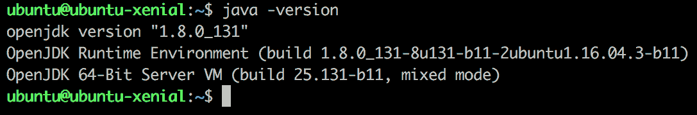
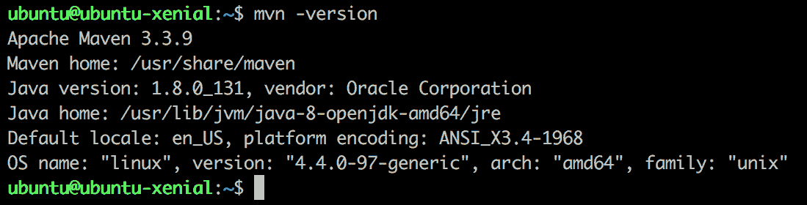
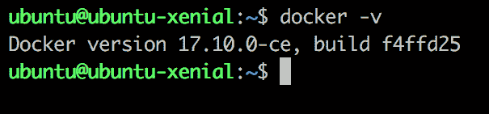
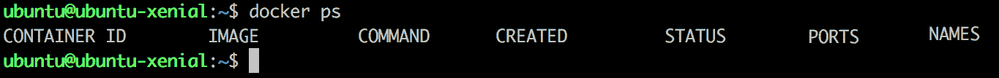

# 第一章：春之之旅

Spring 是 JVM 平台的开源模块化框架。框架是一组库的集合，其主要目标是解决常见的软件开发问题。框架应以通用形式解决这些问题。

Rod Johnson 于 2002 年与他的书籍出版一起创建了 Spring 框架，该书籍被称为《专家一对一 J2EE 设计与开发》。该框架背后的想法是解决 Java 企业版的复杂性。

当时，这种以解决方案为导向的方法非常关注基础设施的细节，使用该解决方案的开发者会花费大量时间编写代码来解决基础设施问题。自从其创建以来，Rod Johnson 的主要关注点之一就是提高开发者的生产力。

该框架最初被视为 Java 运行时环境的轻量级容器，并在社区中变得流行，尤其是在依赖注入功能方面。该框架使依赖注入变得极其简单。开发者以前从未见过这样的功能，因此，全世界的人们都采用了这个项目。年复一年，它在软件开发世界中的知名度一直在增加。

在早期版本中，该框架必须与 XML 文件一起工作以配置容器。当时，这比 J2EE 应用程序好得多，在 J2EE 应用程序中，有必要创建许多 `Ant` 文件来创建样板类和接口。

该框架一直被视为 Java 平台的高级技术，但在 2014 年，Spring 团队推出了 Spring Boot 平台。这个平台在 Java 企业生态系统中取得了巨大成功，并改变了开发者构建 Java 企业应用程序的方式。

今天，Spring 是 Java 开发的*事实上的*框架，全球各地的公司都在其系统中使用它。社区充满活力，并以不同的方式为开发做出贡献，例如在世界上最重要的 Java 大会上提出问题、添加代码和讨论框架。让我们来看看并玩转这个著名的 Java 开发者框架。

在本章中，我们将涵盖以下主题：

+   Spring 框架的主要模块

+   每个模块的 Spring 注解

+   设置开发环境

+   Docker 和 Docker 命令

# Spring 模块化

自从成立以来，该框架就特别关注模块化。这是一个重要的框架特性，因为它使框架成为不同架构风格和应用程序不同部分的绝佳选择。

这意味着该框架不是一个具有偏见的全栈框架，它规定了使一切工作的规则。我们可以根据需要使用该框架，并将其与广泛的规范和第三方库集成。

例如，对于门户 Web 应用程序，Spring MVC 支持模板引擎和 REST 端点，并将它们与流行的 JavaScript 框架 AngularJS 集成。

此外，如果应用程序需要分布式系统的支持，框架可以提供名为 Spring Cloud 的惊人模块，该模块为分布式环境提供了一些基本功能，例如服务注册和发现、断路器、智能路由和客户端负载均衡。

Spring 通过不同的语言，如 Java、Kotlin 和 Groovy（您可以选择风味并使开发任务变得有趣）使 Java 运行时应用程序的开发变得容易。

它被分为各种模块。主要模块如下：

+   Spring 核心框架

+   Spring 数据

+   Spring 安全

+   Spring Cloud

+   Spring Web-MVC

在这本书中，我们将涵盖 Java 企业应用程序中最常见的解决方案，包括令人惊叹的 Spring Cloud 项目。我们还可以找到一些有趣的项目，如 Spring Batch 和 Spring Integration，但这些项目针对特定需求。

# Spring 核心框架

此模块是框架的基础，包含对依赖注入、Spring **MVC**（**模型-视图-控制器**）支持的 Web 功能以及相对较新的 WebFlux 框架和面向方面的编程的基本支持。此外，此模块支持 JDBC、JMS、JPA 和声明式事务管理的基础。我们将探索它并了解此模块的主要项目。所以，让我们开始吧！

# 核心容器

核心容器是整个 Spring 生态系统的基石，包括四个组件——核心、bean、上下文和表达式语言。

核心和 bean 负责提供框架的基本功能和依赖注入。这些模块负责管理 IoC 容器，主要功能包括在 Spring 容器中对象的实例化、配置和销毁。

Spring 上下文也称为 Spring IoC 容器，负责通过从 XML、Java 注解和/或配置文件中的 Java 代码读取配置元数据来实例化、配置和组装 bean。

这些模块内部有两个关键接口——`BeanFactory`和`ApplicationContext`。`BeanFactory`负责管理 bean 的生命周期，包括实例化、配置、管理和销毁，而`ApplicationContext`帮助开发者以通用方式处理文件资源，能够向注册的监听器发布事件。此外，`ApplicationContext`支持国际化，并能够处理不同 Locale 的消息。

这些模块帮助上下文组件提供一种访问容器内对象的方式。上下文组件具有`ApplicationContext`接口，这是容器的基本类。

一些常见的注解有`@Service`、`@Component`、`@Bean`和`@Configuration`。

# Spring Messaging

Spring 框架支持广泛的 messaging 系统。Java 平台被认为是提供出色的消息应用程序支持的平台，Spring 框架遵循此方法并提供各种项目，以帮助开发者以更高的生产力和更少的底层代码行数编写强大的应用程序。这些项目的基本思想是提供一些具有方便方法的模板类，以便与消息系统交互。

此外，该项目还提供了一些监听器注解，以提供从代理监听消息的支持。框架维护不同项目的标准。一般来说，注解的前缀是消息系统的名称，例如`@KafkaListener`。

框架提供许多抽象，以通用方式创建消息应用程序。这是有趣的事情，因为应用程序需求在应用程序生命周期中会发生变化，消息代理解决方案也可能发生变化。然后，通过少量更改，使用 Spring 消息模块构建的应用程序可以在不同的代理上运行。这是目标。

# Spring AMQP

此子项目支持 Spring 框架中的 AMQP 协议。它提供了一个与消息代理交互的模板。模板类似于一个超级高级 API，支持`send`和`receive`操作。

此集合中有两个项目：`spring-amqp`，可用于 ActiveMQ 等，以及`spring-rabbit`，它增加了对 RabbitMQ 代理的支持。此项目通过 API 声明队列、绑定和交换来实现代理管理。

这些项目鼓励广泛使用核心容器提供的依赖注入，因为它们使配置更加声明性和易于理解。

现在，RabbitMQ 代理是消息应用程序的流行选择，Spring 提供了对客户端交互以及管理任务的全支持。

一些常见的注解有`@Exchange`和`@QueueBinding`。

# Spring for Apache Kafka

Spring for Apache Kafka 支持基于代理的 Apache Kafka 应用程序。它提供了一个高级 API 来与 Apache Kafka 交互。内部，这些项目使用 Kafka Java API。

此模块支持注解编程模型。基本思想是，通过几个注解和一些 POJO 模型，我们可以启动应用程序并开始监听和发送消息。

`KafkaTemplate`是这个项目的核心类。它使我们能够使用高级 API 将消息发送到 Apache Kafka。同时支持异步编程。

此模块通过注解提供对事务的支持。此功能通过在基于 Spring 的应用程序中使用的标准事务注解启用，例如`@Transactional`。

我们还学习了 Spring AMQP。该项目添加了基于此代理创建应用的概念。也支持依赖注入功能。

一些常见的注解是`@EnableKafka`和`@KafkaListener`。

# Spring JMS

该项目的理念是将 Spring 框架项目的思想与 JMS 集成，并提供一个高级 API 来与代理交互。JMS 规范最糟糕的部分是它有很多样板代码来管理和关闭连接。

`JmsTemplate`是这个模块的核心类，它使我们能够向代理发送消息。JMS 规范有很多内在行为来处理资源的创建和释放，例如，`JmsTemplate`类会自动为开发者执行这些任务。

该模块还支持事务性需求。`JmsTransactionManager`类处理 Spring JMS 模块的事务行为。

Spring 通过几个注解来移除样板代码。该框架提高了代码的可读性，并使代码更加直观。

一些常见的注解是`@JmsListener`和`@EnableJms`。

# Spring Web MVC

该模块是 Spring 团队构建的第一个支持 Spring 框架中 Web 应用的模块。该模块以 Servlet API 为基础，因此这些 Web 应用必须遵循 Servlet 规范并部署到 servlet 容器中。在 5.0 版本中，Spring 团队创建了一个响应式 Web 框架，这将在本书的后续部分进行介绍。

Spring Web MVC 模块是使用前端控制器模式开发的。当框架创建时，这种模式是许多框架（如 Struts 和 JSF 等）的共同选择。在底层，Spring 中有一个主要的 servlet 称为`DispatcherServlet`。这个 servlet 将通过算法重定向以执行所需的工作。

它使开发者能够在 Java 平台上创建令人惊叹的 Web 应用。该框架的这一部分提供了全面的支持来开发此类应用。为此目的，有一些有趣的功能，例如支持国际化和支持处理 cookies。此外，多部分请求是当应用需要处理上传文件和支持路由请求时的一个令人兴奋的功能。

这些特性对于大多数 Web 应用都是常见的，该框架对这些特性提供了出色的支持。这种支持使该框架成为此类应用的理想选择。在第二章“从 Spring 世界开始”——“CMS 应用”中，我们将使用此模块创建一个应用，并将深入探讨其主要功能。

该模块从声明 HTTP 端点直到将请求属性包装在 HTTP 请求中，对注解编程提供了全面的支持。这使得应用程序在没有获取请求参数等样板代码的情况下，具有极高的可读性。

在 Web 应用程序方面，它使开发者能够与健壮的模板引擎，如 Thymeleaf 和 Freemarker 一起工作。它与路由功能和 Bean 验证完全集成。

此外，该框架允许开发者使用此模块构建 REST API。鉴于所有这些支持，该模块已成为 Spring 生态系统中的宠儿。开发者已经开始使用这个堆栈创建 API，一些重要公司也开始使用它，尤其是在框架提供了一个轻松导航注解的简单方法的情况下。因此，Spring 团队在 4.0 版本中添加了新的注解`@RestController`。

我们将与这个模块进行大量工作。我们将逐章学习关于这个框架部分的有趣事物。

一些常见的注解包括`@RequestMapping`、`@Controller`、`@Model`、`@RestController`和`@RequestBody`。

# Spring WebFlux

Spring 5.0 中引入的新模块 Spring WebFlux，可以用来实现使用响应式流构建的 Web 应用程序。这些系统具有非阻塞特性，并且部署在基于 Netty 构建的服务器上，例如 Undertow 和支持+ 3.1 的 servlet 容器。

Netty 是一个开源框架，它帮助开发者创建网络应用程序——即使用异步、事件驱动模式的客户端和服务器。Netty 提供了一些有趣的优势，例如更低的延迟、更高的吞吐量和更少的资源消耗。你可以在[`netty.io`](https://netty.io)找到更多信息。

该模块支持基于 Spring MVC 模块的注解，如`@GetMapping`、`@PostMapping`等。这是一个重要的特性，使我们能够迁移到这个新版本。当然，一些调整是必要的，例如添加 Reactor 类（Mono 或 Flux）。

这个模块满足了现代 Web 处理大量并发通道的需求，其中线程-per-请求模型不是一种选择。

我们将在第三章“使用 Spring Data 添加持久性并将其转换为响应式模式”中学习这个模块，并基于响应式流实现一个完全响应式的应用程序。

一些常见的注解包括`@RequestMapping`、`@RestController`和`@RequestBody`。

# Spring Data

Spring Data 是一个有趣的模块，它提供了使用基于 Spring 的编程来管理应用程序数据的最简单方式。该项目是一个母项目，包含子项目以支持不同的数据库技术，包括关系型和非关系型数据库。Spring 团队支持一些数据库技术，例如 Apache Cassandra、Apache Solr、Redis 和 JPA 规范，而社区维护着其他令人兴奋的项目，如 ElasticSearch、Aerospike、DynamoDb 和 Couchbase。项目的完整列表可以在 [`projects.spring.io/spring-data`](http://projects.spring.io/spring-data) 找到。

目标是从持久化代码中移除样板代码。一般来说，数据访问层相当相似，即使在不同的项目中，也只是在项目模型上有所不同，而 Spring Data 提供了一种强大的方式来映射领域模型和仓库抽象。

存在一些核心接口；它们是一种标记，指示框架选择正确的实现。在底层，Spring 将创建一个代理并将正确的实现委托给它。这里令人惊讶的是，开发者不必编写任何持久化代码并关心这些代码；他们只需选择所需的技术，Spring 就会处理其余部分。

核心接口是 `CrudRepository` 和 `PagingAndSortingRepository`，它们的名称具有自解释性。`CrudRepository` 实现了 CRUD 行为，如 `create`、`retrieval`、`update` 和 `delete`。`PagingAndSortingRepository` 是 `CrudRepository` 的扩展，并添加了一些功能，如分页和排序。通常，我们会找到这些接口的派生版本，如 `MongoRepository`，它与 MongoDB 数据库技术交互。

一些常见的注解有 `@Query`、`@Id` 和 `@EnableJpaRepositories`。

# Spring Security

对于 Java 应用程序的安全问题，开发者一直感到头疼，尤其是在 Java 企业版中。在应用服务器中查找对象需要大量的样板代码，而且安全层通常需要为应用程序进行大量定制。

在那种混乱的场景中，Spring 团队决定创建一个 Spring Security 项目，以帮助开发者处理 Java 应用程序的安全层。

在项目初期，它广泛支持 Java 企业版，并与 EJB 3 安全注解集成。如今，该项目支持许多不同的方式来处理 Java 应用程序的授权和认证。

Spring Security 为 Java 应用程序提供了一套全面的模型来添加授权和认证。该框架可以通过几个注解进行配置，这使得添加安全层的任务变得极其简单。其他重要特性涉及框架如何扩展。有一些接口允许开发者自定义默认框架行为，使得框架可以根据不同的应用需求进行定制。

它是一个综合性的项目，并细分为以下模块：

+   `spring-security-core`

+   `spring-security-remoting`

+   `spring-security-web`

+   `spring-security-config`

+   `spring-security-ldap`

+   `spring-security-acl`

+   `spring-security-cas`

+   `spring-security-openid`

+   `spring-security-test`

这些是主要模块，还有许多其他项目支持广泛的认证类型。该模块涵盖了以下认证和授权类型：

+   LDAP

+   HTTP 基本认证

+   OAuth

+   OAuth2

+   OpenID

+   云服务平台（CAAS）

+   Java 认证和授权服务（JAAS）

该模块还提供了一种**领域特定语言（DSL**）来简化配置。让我们看一个简单的例子：

```java
http
  .formLogin()
    .loginPage("/login")
     .failureUrl("/login?error")
      .and()
    .authorizeRequests()
      .antMatchers("/signup","/about").permitAll()
      .antMatchers("/admin/**").hasRole("ADMIN")
      .anyRequest().authenticated();
```

示例是从 spring.io 博客中提取的。更多详情，请访问 [`spring.io/blog/2013/07/11/spring-security-java-config-preview-readability/`](https://spring.io/blog/2013/07/11/spring-security-java-config-preview-readability/)。

如我们所见，领域特定语言（DSL）使得配置任务变得极其简单且易于理解。

Spring Security 的主要特性如下：

+   会话管理

+   防御攻击（CSRF、会话固定等）

+   Servlet API 集成

+   认证和授权

我们将在第八章“断路器和安全”中了解更多关于 Spring Security 的内容，第八章。我们还将将其付诸实践。

`@EnableWebSecurity` 是一个常见的注解。

# Spring Cloud

Spring Cloud 是另一个综合性的项目。该项目的主要目标是帮助开发者创建分布式系统。分布式系统需要解决一些常见问题，并且当然，有一套模式可以帮助我们，例如服务发现、断路器、配置管理、智能路由系统和分布式会话。Spring Cloud 工具提供了所有这些实现和详细文档的项目。

主要项目如下：

+   Spring Cloud Netflix

+   Spring Cloud Config

+   Spring Cloud Consul

+   Spring Cloud Security

+   Spring Cloud Bus

+   Spring Cloud Stream

# Spring Cloud Netflix

Spring Cloud Netflix 可能是当今最受欢迎的 Spring 模块。这个出色的项目允许我们通过 Spring Boot 自动配置功能将 Spring 生态系统与 Netflix OSS 集成。支持的 Netflix OSS 库包括用于服务发现的 Eureka、用于启用客户端负载均衡的 Ribbon、通过 Hystrix 实现的断路器来保护我们的应用程序免受外部故障的影响并使系统具有弹性、Zuul 组件提供智能路由并可以作为边缘服务。最后，Feign 组件可以帮助开发者通过几个注解创建用于 REST API 的 HTTP 客户端。

让我们来看看这些内容：

+   **Spring Cloud Netflix Eureka**：这个项目的重点是提供符合 Netflix 标准的应用程序服务发现。服务发现是一个重要的功能，使我们能够移除硬编码的配置来提供主机名和端口；在云环境中更为重要，因为机器是短暂的，因此很难维护名称和 IP 地址。该功能相当简单，Eureka 服务器提供服务注册，Eureka 客户端会自行联系其注册信息。

一些常见的注解是 `@EnableEurekaServer` 和 `@EnableEurekaClient`。

+   **Spring Cloud Feign**：Netflix 团队创建了 Feign 项目。这是一个非常好的项目，使得配置 HTTP 客户端用于 REST 应用程序比以前容易得多。这些实现基于注解。该项目为 HTTP 路径、HTTP 头等提供了一些注解，当然，Spring Cloud Feign 通过注解和自动配置与 Spring Cloud 生态系统集成。此外，Spring Cloud Feign 可以与 Eureka 服务器结合使用。

一些常见的注解是 `@EnableFeignClients` 和 `@FeignClient`。

+   **Spring Cloud Ribbon**：Ribbon 是一个客户端负载均衡器。配置应主要提供一个特定客户端的服务器列表。它必须有名称。在 Ribbon 的术语中，它被称为**命名客户端**。该项目还提供了一系列负载均衡规则，如轮询和可用性过滤等。当然，框架允许开发者创建自定义规则。Ribbon 有一个与 Eureka 服务器集成的 API，用于启用服务发现，这包含在框架中。此外，由于 API 可以在运行时识别运行中的服务器，因此还支持诸如容错等基本功能。

一些常见的注解是 `@RibbonClient` 和 `@LoadBalanced`。

+   **Spring Cloud Hystrix**：一个备受赞誉的 Netflix 项目，该项目提供了一个断路器模式实现。其概念类似于电路断路器。框架将监视标记有`@HystrixCommand`的方法，并监视失败的调用。如果失败的调用次数超过配置中允许的数字，断路器将打开。当电路打开时，将调用回退方法，直到电路关闭并正常操作。它将为我们的系统提供弹性和容错特性。Spring 生态系统完全集成了 Hystrix，但它仅在`@Component`和`@Service`豆上工作。

一些常见的注解包括`@EnableCircuitBreaker`和`@HystrixCommand`。

# Spring Cloud Config

这个令人兴奋的项目提供了一个轻松管理分布式系统系统配置的方法，在云环境中这是一个关键问题，因为文件系统是短暂的。它还帮助我们维护部署管道的不同阶段。Spring 配置文件完全集成到这个模块中。

我们需要一个应用程序来为其他应用程序提供配置。我们可以通过思考**服务器**和**客户端**的概念来理解其工作原理，服务器将通过 HTTP 提供一些配置，而客户端将在服务器上查找配置。此外，还可以对属性值进行加密和解密。

有一些存储实现来提供这些属性文件，默认实现是 Git。它使我们能够将属性文件存储在 Git 中，或者我们也可以使用文件系统。这里重要的是源代码不重要。

**Git**是一个分布式版本控制。这个工具通常用于开发目的，特别是在开源社区中。与 SVN 等市场参与者相比，主要优势在于*分布式架构*。

**Spring Cloud Bus**与该模块之间有一个有趣的集成。如果它们集成在一起，就可以在集群上广播配置更改。如果应用程序配置频繁更改，这是一个重要功能。有两个注解告诉 Spring 在运行时应用更改：`@RefreshScope`和`@ConfigurationProperties`。

在第七章，*航空票务系统*中，我们将实现一个令人兴奋的服务，使用此模块为我们的微服务提供外部配置。将更详细地解释服务器概念。客户端的详细信息也将被展示。

` @EnableConfigServer` 是一个常见的注解。

# Spring Cloud Consul

Spring Cloud Consul 提供了与 Hashicorp 的 Consul 的集成。这个工具以与服务发现、分布式配置和控制总线相同的方式解决问题。此模块允许我们通过基于 Spring 的编程模型使用少量注解来配置 Spring 应用程序和 Consul。还支持自动配置。这里令人惊讶的是，此模块可以通过 Spring Cloud Zuul 和 Spring Cloud Ribbon 分别与一些 Netflix OSS 库（例如）集成（例如）。

`@EnableDiscoveryClient`是一个常见的注解。

# Spring Cloud Security

这个模块类似于 Spring Security 的扩展。然而，分布式系统对安全性的要求不同。通常，它们有集中的身份管理，或者 REST API 的情况下，认证在客户端。在分布式系统中，我们通常有微服务，这些服务在运行时环境中可能有多个实例，其特性使得认证模块与单体应用略有不同。该模块可以与 Spring Boot 应用程序一起使用，并通过几个注解和一些配置使 OAuth2 实现变得非常简单。此外，还支持一些常见模式，如单点登录、令牌中继和令牌交换。

对于基于 Spring Cloud Netflix 的微服务应用程序，这尤其有趣，因为它使得下游认证能够与 Zuul 代理一起工作，并为 Feign 客户端提供支持。使用拦截器来获取令牌。

一些常见的注解包括`@EnableOAuth2Sso`和`@EnableResourceServer`。

# Spring Cloud Bus

本项目的核心目标是提供一个简单的方法来广播整个集群中的变化。应用程序可以通过消息代理连接分布式系统节点。

它为开发者提供了一个简单的方法，使用 Spring 容器提供的`ApplicationContext`来创建发布和订阅机制。它使得使用 Spring 生态系统的事件驱动架构风格创建应用程序成为可能。

要创建自定义事件，我们需要从`RemoteApplicationEvent`创建一个子类，并通过`@RemoteApplicationEventScan`标记该类以进行扫描。

这些项目支持三个消息代理作为传输层：

+   AMQP

+   Apache Kafka

+   Redis

`@RemoteApplicationEventScan`是一个常见的注解。

# Spring Cloud Stream

该模块背后的理念是提供一个简单的方法来构建消息驱动的微服务。该模块具有一种有偏见的配置方式。这意味着我们需要遵循一些规则来创建这些配置。一般来说，应用程序是通过`yaml|properties`文件进行配置的。

该模块也支持注解。这意味着只需要几个注解就可以创建消费者、生产者和绑定；它解耦了应用程序，使其易于理解。它围绕消息代理和通道提供了一些抽象，从而使开发者的生活更加舒适和高效。

Spring Cloud Stream 为 RabbitMQ 和 Kafka 提供了绑定实现。

一些常见的注解是`@EnableBinding`、`@Input`和`@Output`。

# Spring Integration

此模块支持许多企业应用程序模式，并将 Spring 编程模型引入此主题。Spring 编程模型提供了广泛的依赖注入支持，并且以注解编程为中心。注解指导我们如何配置框架，并定义框架行为。

建议使用 POJO 模型，因为它简单且在 Java 开发世界中广为人知。

该项目与其他模块有一些交集。一些其他项目使用这些模块概念来完成他们的工作。例如，有一个名为 Spring Cloud Stream 的项目。

企业集成模式基于广泛的通信通道、协议和模式。本项目支持其中的一些。

模块支持各种特性和通道，如下所示：

+   聚合器

+   过滤器

+   转换器

+   JMS

+   RabbitMQ

+   TCP/UDP

+   Web 服务

+   Twitter

+   邮件

+   以及更多

企业应用程序集成的三个主要概念是：

+   消息

+   消息通道

+   消息端点

最后，Spring Integration 模块提供了一种创建应用程序集成的方法，并使开发者能够利用出色的支持来完成这项工作。

一些常见的注解是`@EnableIntegration`、`@IntegrationComponentScan`和`@EnablePublisher`。

# Spring Boot

Spring Boot 于 2014 年发布。该项目背后的想法是提供一种在 Apache Tomcat、Jetty 等任何容器之外部署 Web 应用程序的方法。这种部署方式的好处是独立于任何外部服务。它允许我们使用一个 JAR 文件运行 Web 应用程序。如今，这是一种极佳的方法，因为它形成了采用 DevOps 文化的最自然方式。

Spring Boot 提供了嵌入式的 servlet 容器，如 Apache Tomcat、Jetty 和 Undertow。当测试我们的 Web 应用程序时，它使开发过程更加高效和舒适。此外，配置期间允许通过配置文件或提供一些 bean 进行自定义。

采用 Spring Boot 框架有一些优势。该框架不需要任何 XML 进行配置。这是一件了不起的事情，因为我们将在 Java 文件中找到所有依赖项。这有助于 IDEs 协助开发者，并提高了代码的可追溯性。另一个重要的优势是，项目试图尽可能地将配置自动化。一些注解使得魔法发生。有趣的是，Spring 会注入在运行时生成的任何代码的实现。

Spring Boot 框架还提供了有趣的功能来帮助开发者和运维人员，例如健康检查、度量、安全和配置。这对于现代应用程序至关重要，其中模块在微服务架构中被分解。

还有一些其他有趣的功能可以帮助开发者从 DevOps 的角度出发。我们可以使用`application-{profile}.properties`或`application.yaml`文件来配置不同的运行时配置文件，例如开发、测试和生产。这是一个真正有用的 Spring Boot 特性。

此外，该项目对测试提供了全面的支持，从网络层到存储库层。

该框架提供了一个高级 API 来处理单元和集成测试。此外，该框架为开发者提供了许多注解和辅助类。

Spring Boot 项目是一个生产就绪的框架，为 Web 服务器、指标和监控功能提供了默认优化的配置，以帮助开发团队交付高质量的软件。

我们可以通过 Groovy 和 Java 语言进行编码来开发应用程序。两者都是 JVM 语言。在 5.0 版本中，Spring 团队宣布了对 Kotlin 语言的全支持，这是 JVM 的新语言。它使我们能够编写一致且可读的代码。我们将在第七章*航空票务系统*中深入探讨这一特性。

# 微服务与 Spring Boot

微服务架构风格通常来说是分布式的，必须是松散耦合的，并且需要很好地定义。当你想要一个微服务架构时，必须遵循这些特性。

Spring Boot 的大部分功能旨在通过使常见概念，如 RESTful HTTP 和嵌入式 Web 应用程序运行时，易于连接和使用，来提高开发者的生产力。在许多方面，它还旨在作为一个*微*-*框架*，通过允许开发者选择和选择他们需要的框架部分，而不会被庞大的或不必要的运行时依赖所淹没。这也使得 Boot 应用程序可以打包成小的部署单元，并且框架能够使用构建系统生成可运行的 Java 归档。

微服务的主要特性是：

+   小粒度组件

+   领域责任（订单、购物车）

+   编程语言无关性

+   数据库无关性

Spring Boot 使我们能够在嵌入式 Web 服务器（如 Tomcat、Jetty 和 Undertow）上运行应用程序。这使得部署我们的组件变得极其容易，因为我们可以在一个 JAR 文件中公开我们的 HTTP API。

Spring 团队甚至从开发者生产力的角度考虑，他们提供了一些名为**starters**的项目。这些项目是一组具有某些兼容性的依赖项。这些出色的项目还与约定优于配置一起工作。基本上，它们是开发者在每个单独的项目上都需要进行的常见配置。我们可以在我们的`application.properties`或`application.yaml`文件中更改这些设置。

微服务架构的另一个关键点是监控。假设我们正在开发一个电子商务解决方案。我们有两个组件，购物车和支付。购物车可能需要多个实例，而支付可能需要较少的实例。我们如何检查这些多个实例？我们如何检查这些服务的健康状况？当这些实例出现问题时，我们需要触发警报。这是所有服务的一个常见实现。Spring 框架提供了一个名为 Spring Boot Actuator 的模块，它为我们应用程序、数据库等提供了内置的健康检查。

# 设置我们的开发环境

在我们开始之前，我们需要设置我们的开发环境。我们的开发环境包括以下四个工具：

+   JDK

+   构建工具

+   IDE

+   Docker

我们将安装 JDK 版本 8.0。这个版本在 Spring Framework 5 中得到完全支持。我们将展示安装 Maven 3.3.9 的步骤，这是 Java 开发中最著名的构建工具，在最后一部分，我们将向您展示如何安装 IntelliJ IDEA Community Edition 的详细说明。我们将使用 Ubuntu 16.04，但您可以使用您喜欢的操作系统。安装步骤很简单。

# 安装 OpenJDK

OpenJDK 是一个稳定、免费且开源的 Java 开发工具包。此包将用于与代码编译和运行环境相关的所有内容。

此外，您还可以使用 Oracle JDK，但您应该注意许可证和协议。

要安装 OpenJDK，我们将打开一个终端并运行以下命令：

```java
sudo apt-get install openjdk-8-jdk -y
```

我们可以在 OpenJDK 页面的安装部分（[`openjdk.java.net/install/`](http://openjdk.java.net/install/)）找到有关如何安装 Java 8 JDK 的更多信息。

使用以下命令检查安装：

```java
java -version
```

您应该看到显示如下所示的 OpenJDK 版本及其相关详细信息：



现在我们已经安装了 Java 开发工具包，我们准备进行下一步。在现实世界中，我们必须有一个构建工具来帮助开发者编译、打包和测试 Java 应用程序。

在下一节中，我们将安装 Maven。

# 安装 Maven

Maven 是 Java 开发中流行的构建工具。一些重要的开源项目都是使用这个工具构建的。它具有简化构建过程、标准化项目结构和提供最佳实践开发指南的功能。

我们将安装 Maven，但安装步骤应在 OpenJDK 安装之后执行。

打开终端并执行以下操作：

```java
sudo apt-get install maven -y
```

使用以下命令检查安装：

```java
mvn -version
```

您应该看到以下输出，尽管版本可能因您而异：



做得很好。现在我们已经安装了 Maven。Maven 拥有一个充满活力的社区，它为开发者提供了许多插件来帮助完成重要任务。有插件可以执行单元测试，还有插件可以准备项目的发布活动，这些插件可以与源代码管理（SCM）软件集成。

我们将使用 `spring boot maven` 插件和 `docker maven` 插件。第一个插件将我们的应用程序转换为 JAR 文件，第二个插件使我们能够与 Docker 引擎集成，以创建镜像、运行容器等等。在接下来的几章中，我们将学习如何配置和与这些插件交互。

# 安装 IDE

集成开发环境是帮助开发者的一个重要工具。在这本书中，我们将使用 IntelliJ IDEA 作为开发项目的官方工具。对于其他 IDE 没有限制，因为项目将使用 Maven 作为构建工具进行开发。

集成开发环境（IDE）是开发者的个人选择，通常涉及热情；有些人喜欢的东西，其他开发者可能讨厌。请随意使用您喜欢的。

# IntelliJ IDEA

IntelliJ IDEA 是 JetBrains 的产品。我们将使用社区版，这是一个开源的、用于编码 Java 和 Kotlin 的出色工具。该工具提供了出色的自动完成功能，并且完全支持 Java 8 特性。

访问 [`www.jetbrains.com/idea/download/#section=linux`](https://www.jetbrains.com/idea/download/#section=linux) 并下载社区版。我们可以提取 `tar.gz` 文件并执行它。

# Spring Tools Suite

Spring Tools Suite 是基于 Eclipse IDE 的，当然，由 Eclipse 基金会提供。目标是提供对 Spring 生态系统的支持，并使开发者的生活更加轻松。这个工具支持诸如 Beans 探索器等有趣的功能。

在以下链接下载工具：

[`download.springsource.com/release/STS/3.6.4.RELEASE/dist/e4.4/groovy-grails-tool-suite-3.6.4.RELEASE-e4.4.2-linux-gtk-x86_64.tar.gz`](http://download.springsource.com/release/STS/3.6.4.RELEASE/dist/e4.4/groovy-grails-tool-suite-3.6.4.RELEASE-e4.4.2-linux-gtk-x86_64.tar.gz)

# 安装 Docker

Docker 是一个开源项目，帮助人们运行和管理容器。对于开发者来说，Docker 在开发生命周期的不同阶段都提供了帮助。

在开发阶段，Docker 允许开发者无需在当前系统操作层安装，即可启动不同的基础设施服务，如数据库和服务发现（如 Consul）。这有助于开发者，因为开发者不需要在操作系统层安装这些系统。通常，这项任务在安装过程中可能会与库发生冲突，并消耗大量时间。

有时，开发者需要安装确切的版本。在这种情况下，有必要在期望的版本上重新安装整个应用程序。这不是一件好事，因为在此期间开发者的机器会变慢。原因很简单，在软件开发过程中使用了大量应用程序。

Docker 在这个阶段帮助开发者。运行带有 MongoDB 的容器非常简单。无需安装，它允许开发者通过一行命令启动数据库。Docker 支持镜像标签。这个特性有助于处理不同版本的软件；这对于每次都需要更改软件版本的开发者来说非常棒。

另一个优点是，当开发者需要为测试或生产目的交付工件时，Docker 可以通过 Docker 镜像实现这些任务。

Docker 帮助人们采用 DevOps 文化，并为提高整个流程的性能提供了惊人的功能。

让我们安装 Docker。

安装 Docker 最简单的方法是下载位于[`get.docker.com`](http://get.docker.com)的脚本：

```java
curl -fsSL get.docker.com -o get-docker.sh
```

下载完成后，我们将按照以下方式执行脚本：

```java
sh get-docker.sh
```

等待脚本执行完毕，然后使用以下命令检查 Docker 安装：

```java
docker -v
```

输出需要看起来像以下这样：



有时，Docker 的版本可以增加，版本至少应该是**17.10.0-ce**。

最后，我们将当前用户添加到 Docker 组中，这样我们就可以使用 Docker 命令行而不需要`sudo`关键字。输入以下命令：

```java
sudo usermod -aG docker $USER
```

我们需要注销才能生效这些更改。通过输入以下命令来确认命令是否按预期工作。确保没有出现`sudo`关键字：

```java
docker ps
```

输出应该如下所示：



# 介绍 Docker 概念

现在，我们将介绍一些 Docker 概念。这本书不是关于 Docker 的，但为了在接下来的几章中与我们的容器交互，一些基本的 Docker 使用说明是必要的。Docker 是一个事实上的工具，用于管理容器。

# Docker 镜像

Docker 镜像类似于 Docker 容器的模板。它包含启动 Docker 容器所需的一组文件夹和文件。我们永远不会有一个正在执行模式的镜像。镜像为 Docker Engine 启动容器提供了一个模板。我们可以通过类比面向对象来更好地理解这个过程。镜像就像一个提供实例化一些对象的基础设施的**基础设施**的类，而实例就像一个容器。

此外，我们还有一个 Docker 仓库来存储我们的镜像。这些仓库可以是公开的或私有的。一些云服务提供商提供这些私有仓库。最著名的是 Docker Hub。它可以是免费的，但如果你选择这个选项，镜像应该是公开的。当然，Docker Hub 支持私有镜像，但在这种情况下，你必须为服务付费。

# 容器

Docker 容器是一种**轻量级**的虚拟化。轻量级意味着 Docker 使用 SO 功能来限制系统进程和管理内存、处理器和文件夹。这与使用 VM 的虚拟化不同，因为在这种模式下，技术需要模拟整个 SO、驱动器和存储。这项任务消耗了大量的计算能力，有时可能效率不高。

# Docker 网络

Docker 网络是一个为容器提供运行时隔离的层。它是一种沙盒，可以在其中运行与其他容器隔离的容器。当安装 Docker 时，默认情况下会创建三个网络，这些网络不应该被删除。这三个网络如下：

+   `bridge`

+   `none`

+   `host`

此外，Docker 还提供了一个用户创建网络的简单方法。为此，Docker 提供了两个驱动器——**bridge**和**overlay**。

桥接可用于本地环境，这意味着这种网络允许在单个主机上使用。这对我们的应用程序将很有用，因为它促进了容器之间的隔离，特别是在安全性方面。这是一个好的做法。连接到这种网络的容器的名称可以用作容器的**DNS**。内部，Docker 会将容器名称与容器 IP 关联起来。

Overlay 网络提供了连接不同机器上容器的功能。这种网络由 Docker Swarm 用于在集群环境中管理容器。在新版本中，Docker Compose 工具原生支持 Docker Swarm。

# Docker 卷

Docker 卷是建议在容器外部持久化数据的方式。这些卷完全由 Docker Engine 管理，当使用 Docker 命令行时，这些卷可以根据配置进行读写。这些卷的数据持久化在主机上的目录路径上。

有一个命令行工具可以与卷交互。这个工具的基础是`docker volume`命令；末尾的`--help`参数显示了帮助说明。

# Docker 命令

现在我们将查看 Docker 命令。这些命令主要用于开发生命周期，如`启动容器`、`停止容器`、`删除`和`检查`等命令。

# Docker run

`docker run`是最常见的 Docker 命令。这个命令应该用来启动容器。命令的基本结构如下：

```java
docker run [OPTIONS] IMAGE[:TAG|@DIGEST] [COMMAND] [ARG...]
```

选项参数允许对容器进行一些配置，例如，`--name`参数允许您为容器配置一个名称。当容器在桥接网络中运行时，这对于 DNS 来说很重要。

网络设置也可以在`run`命令中进行配置，参数是`--net`。这使我们能够配置容器将要连接的网络。

另一个重要的选项是`detached`。它表示容器是否将在后台运行。`-d`参数指示 Docker 在后台运行容器。

# Docker container

`docker container`命令允许您管理容器。有许多命令，如下列列表所示：

+   `docker container attach`

+   `docker container commit`

+   `docker container cp`

+   `docker container create`

+   `docker container diff`

+   `docker container exec`

+   `docker container export`

+   `docker container inspect`

+   `docker container kill`

+   `docker container logs`

+   `docker container ls`

+   `docker container pause`

+   `docker container port`

+   `docker container prune`

+   `` `docker container rename` ``

+   `docker container restart`

+   `docker container rm`

+   `docker container run`

+   `docker container start`

+   `docker container stats`

+   `docker container stop`

+   `docker container top`

+   `docker container unpause`

+   `docker container update`

+   `docker container wait`

这里有一些重要的命令。`docker container exec`命令允许您在运行的容器上运行命令。这是一个重要的任务，用于调试或查看容器文件。`docker container prune`删除已停止的容器。它在开发周期中很有帮助。有一些已知的命令，如`docker container rm`、`docker container start`、`docker container stop`和`docker container restart`。这些命令是自我解释的，并且具有类似的行为。

# Docker network

`docker network`命令允许您通过命令行管理 Docker 网络。有六个基本命令，命令是自我解释的：

+   `docker network create`

+   `docker network connect`

+   `docker network ls`

+   `docker network rm`

+   `docker network disconnect`

+   `docker network inspect`

`docker network create`、`docker network ls`和`docker network rm`是主要的命令。可以将它们与 Linux 命令进行比较，其中`rm`命令用于删除东西，而`ls`命令通常用于列出文件夹等东西。`create`命令应用于创建网络。

`docker network connect`和`docker network disconnect`命令允许您将正在运行的容器连接到所需的网络。在某些场景中可能很有用。

最后，`docker network inspect`命令提供了请求网络的相关详细信息。

# Docker 卷

`docker volume`命令允许您通过命令行界面管理 Docker 卷。这里有五个命令：

+   `docker volume create`

+   `docker volume inspect`

+   `docker volume ls`

+   `docker volume prune`

+   `docker volume rm`

`docker volume create`、`docker volume rm`和`docker volume ls`命令通过 Docker Engine 有效地用于管理`docker volume`。这些行为与网络的行为非常相似，但针对的是卷。`create`命令将创建一个新的卷，并允许一些选项。`ls`命令列出所有卷，而`rm`命令将删除请求的卷。

# 摘要

在本章中，我们探讨了 Spring 框架的主要概念。我们了解了框架的主要模块以及这些模块如何帮助开发者以不同的架构构建应用程序，例如消息应用程序、REST API 和 Web 门户。

我们也花了一些时间准备我们的开发环境，安装了一些必要的工具，例如 Java JDK、Maven 和 IDE。这是我们在继续下一章之前必须采取的关键步骤。

我们使用 Docker 帮助我们设置开发环境，例如为数据库和我们的应用程序在 Docker 镜像中设置容器。我们安装了 Docker 并查看管理容器、网络和卷的主要命令。

在下一章中，我们将创建我们的第一个 Spring 应用程序并将其付诸实践！
