# 第二章：进入 Spring 世界 - CMS 应用程序

现在，我们将创建我们的第一个应用程序；在这个阶段，我们已经学习了 Spring 的概念，并且我们准备好将它们付诸实践。在本章的开始，我们将介绍 Spring 依赖项以创建一个 Web 应用程序，我们还知道 Spring Initializr 是一个出色的项目，它允许开发者创建具有所需依赖项的 Spring 骨架项目。在本章中，我们将学习如何在 IDE 和命令行上搭建我们的第一个 Spring 应用程序，公开我们的第一个端点，了解其内部工作原理，并了解 Spring REST 支持的主要注解。我们将弄清楚如何为**CMS**（**内容管理系统**）应用程序创建服务层，并理解依赖注入在 Spring 容器中的工作方式。我们将遇到 Spring 的典型用法并实现我们的第一个 Spring Bean。在本章的结尾，我们将解释如何创建视图层并将其与 AngularJS 集成。

在本章中，将涵盖以下主题：

+   创建项目结构

+   运行第一个 Spring 应用程序

+   介绍 REST 支持

+   理解 Spring 中的依赖注入

# 创建 CMS 应用程序结构

现在，我们将使用 Spring 框架创建我们的第一个应用程序；我们将使用 Spring Initializr 为 CMS 应用程序创建一个基本结构。这个页面帮助我们启动应用程序，它是一种指南，允许我们在 Maven 或 Gradle 上配置依赖项。我们还可以选择 Spring Boot 的语言和版本。

页面看起来像这样：

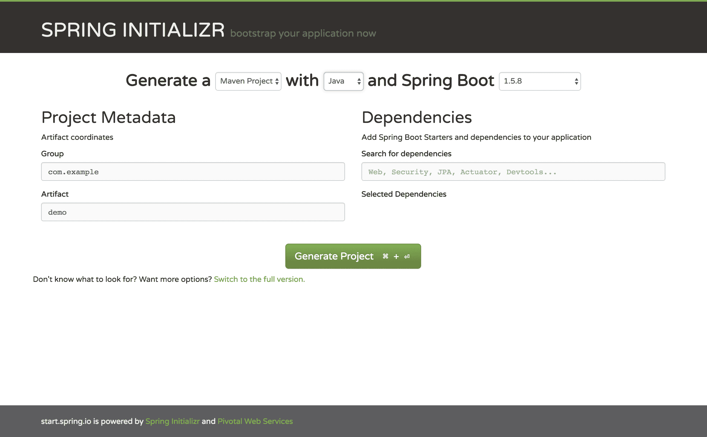

在项目元数据部分，我们可以为 Maven 项目添加坐标；有一个`group`字段，它引用了`groupId`标签，我们还有`artifacts`字段，它引用了`artifactId`。这些都是 Maven 坐标。

依赖关系部分允许配置 Spring 依赖项，该字段具有自动完成功能，并帮助开发者输入正确的依赖项。

# CMS 项目

在我们开始编码和学习令人惊叹的事情之前，让我们了解一下 CMS 项目，该项目的主要目的是帮助公司管理不同主题的 CMS 内容。在这个项目中，有三个主要实体：

+   `News`类是最重要的，它将存储新闻的内容。

+   它有一个*类别*，这使得搜索更容易，我们还可以按类别对新闻进行分组，当然，我们也可以按创建新闻的用户进行分组。新闻应由其他用户批准，以确保其遵循公司规则。

+   新闻也有一些*标签*，正如我们所见，应用程序相当标准，业务规则也很简单；这是故意的，因为我们保持对我们将要学习的新内容的关注。

现在我们知道了 Spring Initializr ([`start.spring.io`](https://start.spring.io))是如何工作的以及我们需要遵循的业务规则，我们准备好创建项目了。让我们现在就动手吧。

# 项目元数据部分

在“分组”字段中插入`spring-five`，在“工件”字段中插入`cms`。如果您想自定义它，没问题，这是一种信息性项目配置：

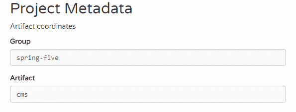

# 依赖项部分

在“搜索依赖项”字段中输入`MVC`一词。Web 模块将作为选项出现，Web 模块包含嵌入式 Tomcat 和 Spring MVC 的全栈 Web 开发，选择它。我们还需要在这个模块中放置`Thymeleaf`依赖项。它是一个模板引擎，将在本章末尾的视图功能中很有用。输入`Thymeleaf`，它包括 Thymeleaf 模板引擎，并包含与 Spring 的集成。模块将出现，然后选择它。现在我们可以在“已选依赖项”面板中看到 Web 和 Thymeleaf：

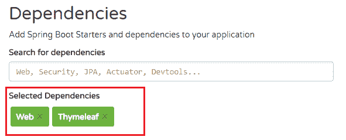

# 生成项目

在我们完成项目定义并选择项目依赖项后，我们准备好下载项目。可以通过点击“生成项目”按钮来完成，点击它。项目将被下载。在这个阶段，项目已准备好开始我们的工作：


压缩文件将以`cms.zip`（工件字段输入信息）命名，下载文件的位置取决于浏览器配置。

>在打开项目之前，我们必须将**Spring Initializr**生成的工件解压缩到目标位置。命令应该是：**`unzip -d <目标位置> /<文件路径>/cms.zip`**。请参考以下示例：`unzip -d /home/john /home/john/Downloads/cms.zip.`

现在，我们可以在我们的 IDE 中打开项目。让我们打开它并查看项目的基本结构。

# 运行应用程序

在我们运行应用程序之前，让我们了解一下我们的项目结构。

使用 IntelliJ IDEA 的导入项目或打开选项（两者类似）打开项目，以下页面将显示：

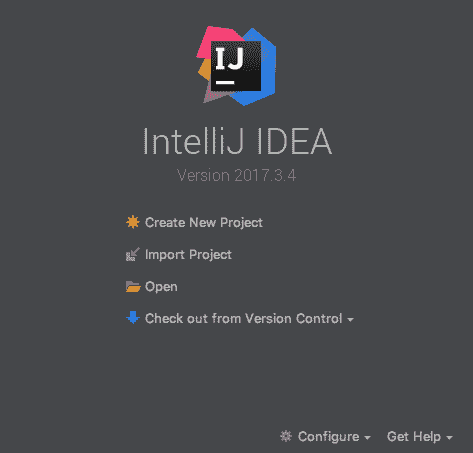

然后，我们可以打开或导入`pom.xml`文件。

应该显示以下项目结构：

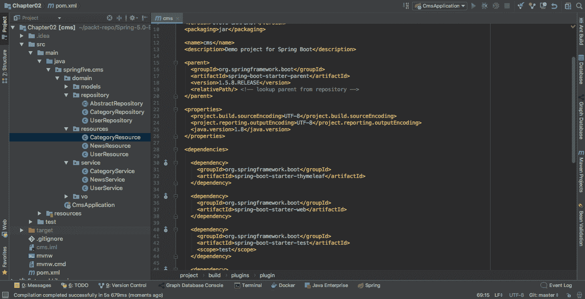

打开`pom.xml`，我们有三个依赖项，`spring-boot-starter-thymeleaf`、`spring-boot-starter-web`、`spring-boot-starter-test`，以及一个有趣的插件`spring-boot-maven-plugin`**。**

这些`starter`依赖项是开发者的快捷方式，因为它们为模块提供了完整的依赖项。例如，在`spring-boot-starter-web`中，有`web-mvc`、`jackson-databind`、`hibernate-validator-web`以及其他一些依赖项；这些依赖项必须在类路径上才能运行 Web 应用程序，而 starters 使这项任务变得容易得多。

让我们分析我们的 `pom.xml` 文件，该文件应该看起来像这样：

```java
<?xml version="1.0" encoding="UTF-8"?>
<project xmlns="http://maven.apache.org/POM/4.0.0"
  xmlns:xsi="http://www.w3.org/2001/XMLSchema-instance"
  xsi:schemaLocation="http://maven.apache.org/POM/4.0.0 http://maven.apache.org/xsd/maven-4.0.0.xsd">
  <modelVersion>4.0.0</modelVersion>

  <groupId>spring-five</groupId>
  <artifactId>cms</artifactId>
  <version>0.0.1-SNAPSHOT</version>
  <packaging>jar</packaging>

  <name>cms</name>
  <description>Demo project for Spring Boot</description>

  <parent>
    <groupId>org.springframework.boot</groupId>
    <artifactId>spring-boot-starter-parent</artifactId>
    <version>1.5.8.RELEASE</version>
    <relativePath/> <!-- lookup parent from repository -->
  </parent>

  <properties>
    <project.build.sourceEncoding>UTF-8</project.build.sourceEncoding>
    <project.reporting.outputEncoding>UTF-8</project.reporting.outputEncoding>
    <java.version>1.8</java.version>
  </properties>

  <dependencies>

    <dependency>
      <groupId>org.springframework.boot</groupId>
      <artifactId>spring-boot-starter-thymeleaf</artifactId>
    </dependency>

    <dependency>
      <groupId>org.springframework.boot</groupId>
      <artifactId>spring-boot-starter-web</artifactId>
    </dependency>

    <dependency>
      <groupId>org.springframework.boot</groupId>
      <artifactId>spring-boot-starter-test</artifactId>
      <scope>test</scope>
    </dependency>

    <dependency>
      <groupId>org.projectlombok</groupId>
      <artifactId>lombok</artifactId>
      <version>1.16.16</version>
      <scope>provided</scope>
    </dependency>

    <dependency>
      <groupId>io.springfox</groupId>
      <artifactId>springfox-swagger2</artifactId>
      <version>2.7.0</version>
    </dependency>

    <dependency>
      <groupId>io.springfox</groupId>
      <artifactId>springfox-swagger-ui</artifactId>
      <version>2.7.0</version>
    </dependency>

  </dependencies>

  <build>
    <plugins>
      <plugin>
        <groupId>org.springframework.boot</groupId>
        <artifactId>spring-boot-maven-plugin</artifactId>
      </plugin>
    </plugins>
  </build>

</project>

```

此外，我们有一个 `spring-boot-maven-plugin`，这个出色的插件为 Maven 提供了 Spring Boot 支持。它允许你将应用程序打包成 Fat-JAR，该插件支持运行、启动和停止目标，以及与我们的应用程序交互。

**Fat-JAR**：一个包含所有项目类文件和资源，以及所有依赖项打包在一起的 JAR 文件。

现在，关于 Maven 配置的内容就到这里；让我们看看 Java 文件。

Spring Initializr 为我们创建了一个类，通常，这个类的名字是构件名称加上 `Application`，在我们的例子中是 `CmsApplication`，这个类应该看起来像这样：

```java
package springfive.cms;

import org.springframework.boot.SpringApplication;
import org.springframework.boot.autoconfigure.SpringBootApplication;

@SpringBootApplication
public class CmsApplication {

  public static void main(String[] args) {
    SpringApplication.run(CmsApplication.class, args);
  }

}
```

# 查看内部结构

在这里有一些有趣的事情，让我们来理解它们。`@SpringBootApplication` 是 Spring Boot 应用程序的基本注解；它是 `@Configuration`、`@EnableAutoConfiguration` 和 `@Component` 注解的一种别名。让我们深入探讨：

+   第一个注解 `@Configuration` 表示该类可以为 Spring 容器生成 bean 定义。这是一个与外部依赖项（如 `DataSources`）一起工作的有趣注解；这是此注解最常见的使用场景。

+   第二个注解 `@EnableAutoConfiguration` 表示，在 Spring `ApplicationContext` 容器中，它将尝试帮助我们为特定上下文配置默认的 bean。例如，当我们使用 Spring Boot 创建 Web MVC 应用程序时，我们可能需要一个 Web 服务器容器来运行它。在默认配置中，Spring 容器，连同 `@EnableAutoConfiguration`，将为我们配置一个 Tomcat 内嵌容器 bean。这个注解对开发者非常有帮助。

+   `@Component` 是一种模式，容器理解哪个类被认为是自动检测的，并需要实例化它。

`SpringApplication` 类负责从主方法启动 Spring 应用程序，它将创建一个 `ApplicationContext` 实例，处理由配置文件提供的配置，最后，它将加载由注解定义的单例 bean。

**模式注解**表示架构层中的一个概念性划分。它们帮助开发者理解类的目的和 beans 所代表的层，例如，`@Repository` 表示数据访问层。

# 运行应用程序

我们将在 IntelliJ IDEA 和命令行中运行应用程序。学习这项任务非常重要，因为我们工作在不同的开发环境中；有时应用程序的配置稍微有些复杂，我们无法使用 IDE 运行它，或者有时公司有不同的 IDE 作为标准，因此我们将学习两种不同的方法。

# IntelliJ IDEA

通常，IntelliJ IDEA 会识别带有`@SpringBootApplication`注解的主类，并为我们创建一个运行配置，但这取决于工具的版本，让我们来做这件事。

# 命令行

命令行是一个更通用的运行项目工具。也多亏了 Spring Boot Maven 插件，这个任务变得简单。有两种运行方式，我们将介绍两种。

# 通过 Maven goal 执行命令行

第一个是一个 Spring Boot Maven 插件的 goal，它很简单；打开终端，然后转到根项目文件夹，注意，这个文件夹与我们的`pom.xml`文件在同一个文件夹中，执行以下命令：

```java
mvn clean install spring-boot:run
```

Maven 现在将编译项目并运行主类`CmsApplication`，我们应该看到以下输出：

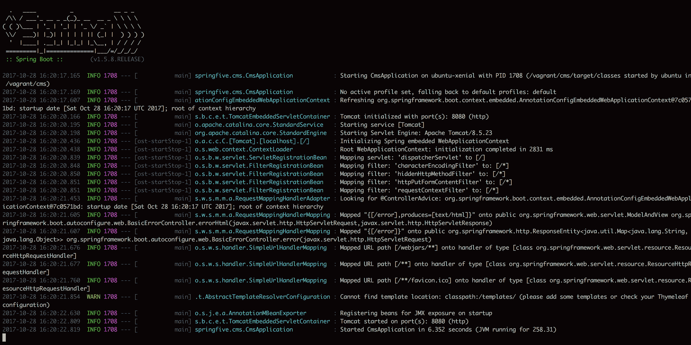

# 通过 JAR 文件执行命令行

要通过 Java 文件运行它，我们需要编译和打包它，然后我们可以使用 Java 命令行运行项目。要编译和打包它，我们可以使用相当标准的 Maven 命令，如下所示：

```java
mvn clean install
```

在项目编译和打包为 Fat-JAR 之后，我们可以执行 JAR 文件，转到目标文件夹并检查此文件夹中的文件，可能的结果如下所示：

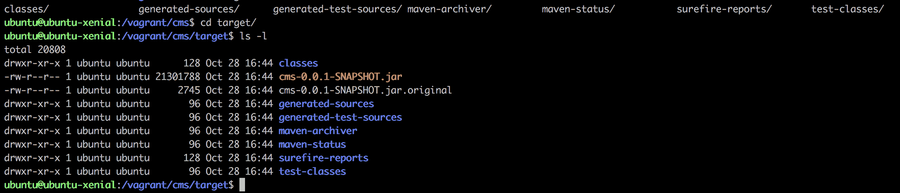

在我们的目标文件夹中有两个主要文件，`cms-0.0.1-SNAPSHOT.jar`和`cms-0.0.1-SNAPSHOT.jar.original`，带有`.original`扩展名的文件是不可执行的。它是编译产生的原始工件，另一个是我们的可执行文件。这是我们正在寻找的，让我们执行它，输入以下命令：

```java
java -jar cms-0.0.1-SNAPSHOT.jar
```

结果应该如显示的那样。应用程序正在运行：

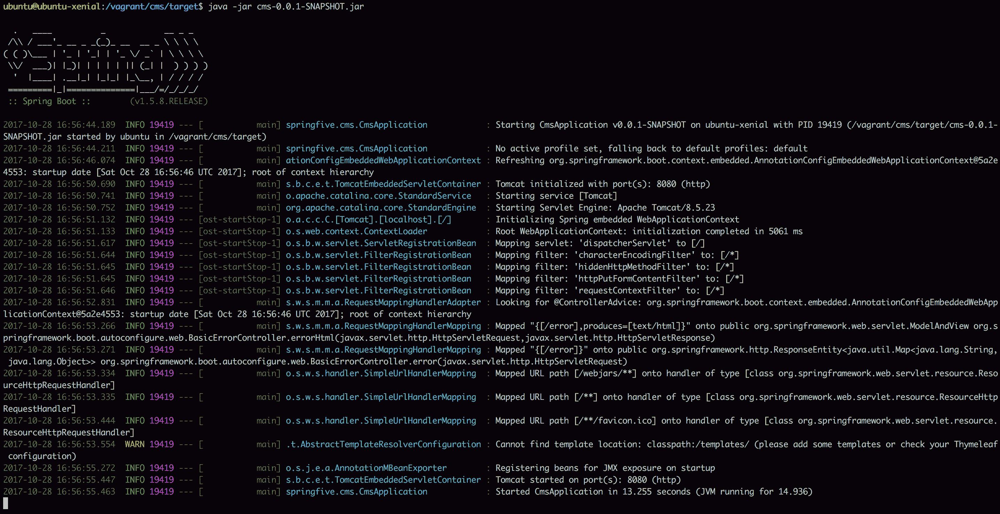

这部分就到这里，在下一节中，我们将创建第一个**REST**（**表示状态传输**）资源，并了解 REST 端点是如何工作的。

# 创建 REST 资源

现在，在这一节中，我们已经有一个应用程序正在运行，我们将添加一些 REST 端点并为 CMS 应用程序建模一些初始类，这些 REST 端点将有助于 AngularJS 集成。

对于 APIs 的一个必需特性是文档，而帮助我们完成这些任务的流行工具之一是 Swagger。Spring 框架支持 Swagger，我们可以通过几个注解来实现它。项目的 Spring Fox 是完成这项任务的正确工具，我们将在本章中查看这个工具。

让我们这样做。

# 模型

在我们开始创建我们的类之前，我们将在项目中添加`Lombok`依赖。这是一个非常棒的库，它在编译时提供了一些有趣的功能，如`GET`/`SET`，`Val`关键字使变量成为 final，`@Data`使一个类具有一些默认方法，如 getters/setters，`equals`和`hashCode`。

# 添加 Lombok 依赖

在`pom.xml`文件中添加以下依赖项：

```java
<dependency>
  <groupId>org.projectlombok</groupId>
  <artifactId>lombok</artifactId>
  <version>1.16.16</version>
  <scope>provided</scope>
</dependency>
```

`provided` 范围指示 Maven 不要将此依赖项包含在 JAR 文件中，因为我们需要在编译时使用它。我们不需要在运行时使用它。等待 Maven 下载依赖项，这就是现在所有的事情。

此外，我们还可以使用 IntelliJ IDEA 提供的“重新导入所有 Maven 项目”，它位于 Maven 项目选项卡中，如下所示：

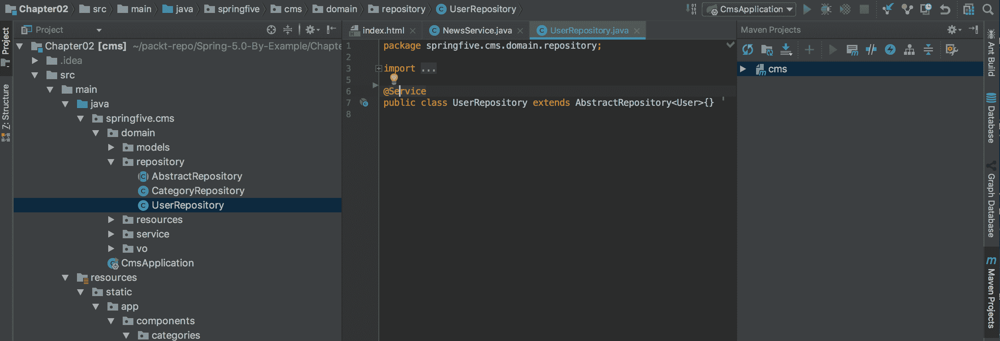

# 创建模型

现在，我们将创建我们的模型，这些模型是带有 `@Data` 注解的 Java 类。

# 标签

这个类代表我们系统中的一个标签。不一定有它的存储库，因为它将与我们的 `News` 实体一起持久化：

```java
package springfive.cms.domain.models;

import lombok.Data;

@Data
public class Tag {

  String value;

}
```

# 类别

我们 CMS 应用程序的一个类别模型可以用来分组新闻。另外，另一个重要的事情是，这使得我们的新闻被分类，使得搜索任务变得容易。看看下面的代码：

```java
package springfive.cms.domain.models;

import lombok.Data;

@Data
public class Category {

  String id;

  String name;

}
```

# 用户

它代表我们领域模型中的一个用户。我们有两个不同的配置文件，一个是作为新闻作者的作者，另一个是必须审核在门户网站上注册的新闻的审稿人。看看下面的例子：

```java
package springfive.cms.domain.models;

import lombok.Data;

@Data
public class User {

  String id;

  String identity;

  String name;

  Role role;

}
```

# 新闻

这个类代表我们领域中的新闻，目前它没有任何行为。只暴露了属性和获取/设置方法；在未来，我们将添加一些行为：

```java
package springfive.cms.domain.models;

import java.util.Set;
import lombok.Data;

@Data
public class News {

  String id;

  String title;

  String content;

  User author;

  Set<User> mandatoryReviewers;

  Set<Review> reviewers;

  Set<Category> categories;

  Set<Tag> tags;

}
```

`Review` 类可以在 GitHub 上找到：([`github.com/PacktPublishing/Spring-5.0-By-Example/tree/master/Chapter02/src/main/java/springfive/cms/domain/models`](https://github.com/PacktPublishing/Spring-5.0-By-Example/tree/master/Chapter02/src/main/java/springfive/cms/domain/models)).

如我们所见，它们是简单的 Java 类，代表我们的 CMS 应用程序领域。它是我们应用程序的核心，所有的领域逻辑都将驻留在这些类中。这是一个重要的特征。

# 嗨，这是 REST 资源

我们已经创建了模型，现在我们可以开始考虑我们的 REST 资源。我们将创建三个主要资源：

+   `CategoryResource` 将负责 `Category` 类。

+   第二个是 `UserResource`。它将负责管理 `User` 类和 REST API 之间的交互。

+   最后一个，同样重要的是，将是 `NewsResource`，它将负责管理新闻实体，如评论。

# 创建 CategoryResource 类

我们将创建我们的第一个 REST 资源，让我们从负责管理我们的`Category`类的`CategoryResource`类开始。这个实体的实现将很简单，我们将创建创建、检索、更新和删除等 CRUD 端点。当我们创建 API 时，我们必须牢记两件重要的事情。第一件是正确的 HTTP 动词，如`POST`、`GET`、`PUT`和`DELETE`。对于 REST API 来说，拥有正确的 HTTP 动词是至关重要的，因为它为我们提供了关于 API 的内在知识。这是一个与我们的 API 交互的任何事物的模式。另一件事是状态码，它与第一件事相同，我们必须遵循这个模式，这是开发者容易识别的模式。《理查森成熟度模型》可以帮助我们创建出色的 REST API，这个模型引入了一些级别来衡量 REST API，它就像一个温度计。

首先，我们将为我们的 API 创建一个骨架。想想你的应用程序需要哪些功能。在下一节中，我们将解释如何在 REST API 中添加服务层。现在，让我们构建一个`CategoryResource`类，我们的实现可能看起来像这样：

```java
package springfive.cms.domain.resources;

import java.util.Arrays;
import java.util.List;
import org.springframework.http.HttpStatus;
import org.springframework.http.ResponseEntity;
import org.springframework.web.bind.annotation.DeleteMapping;
import org.springframework.web.bind.annotation.GetMapping;
import org.springframework.web.bind.annotation.PathVariable;
import org.springframework.web.bind.annotation.PostMapping;
import org.springframework.web.bind.annotation.PutMapping;
import org.springframework.web.bind.annotation.RequestMapping;
import org.springframework.web.bind.annotation.ResponseStatus;
import org.springframework.web.bind.annotation.RestController;
import springfive.cms.domain.models.Category;
import springfive.cms.domain.vo.CategoryRequest;

@RestController
@RequestMapping("/api/category")
public class CategoryResource {

  @GetMapping(value = "/{id}")
  public ResponseEntity<Category> findOne(@PathVariable("id") String id){
    return ResponseEntity.ok(new Category());
  }

  @GetMapping
  public ResponseEntity<List<Category>> findAll(){
    return ResponseEntity.ok(Arrays.asList(new Category(),new Category()));
  }

  @PostMapping
  public ResponseEntity<Category> newCategory(CategoryRequest category){
    return new ResponseEntity<>(new Category(), HttpStatus.CREATED);
  }

  @DeleteMapping("/{id}")
  @ResponseStatus(HttpStatus.NO_CONTENT)
  public void removeCategory(@PathVariable("id") String id){
  }

  @PutMapping("/{id}")
  public ResponseEntity<Category> updateCategory(@PathVariable("id") String id,CategoryRequest category){
    return new ResponseEntity<>(new Category(), HttpStatus.OK);
  }

}
```

`CategoryRequest`可以在 GitHub 上找到（[`github.com/PacktPublishing/Spring-5.0-By-Example/tree/master/Chapter02/src/main/java/springfive/cms/domain/vo`](https://github.com/PacktPublishing/Spring-5.0-By-Example/tree/master/Chapter02/src/main/java/springfive/cms/domain/vo))。

在这里有一些重要的概念。第一个是`@RestController`。它指示 Spring 框架，`CategoryResource`类将通过 Web-MVC 模块公开 REST 端点。这个注解将在框架中配置一些事情，例如`HttpMessageConverters`来处理 HTTP 请求和响应，如 XML 或 JSON。当然，我们需要在类路径上添加正确的库来处理 JSON 和 XML。还需要添加一些请求头，如`Accept`和`Content-Type`。这个注解是在 4.0 版本中引入的。它是一种语法糖注解，因为它被`@Controller`和`@ResponseBody`注解。

第二个是`@RequestMapping`注解，这个重要的注解负责我们类中的 HTTP 请求和响应。在这个代码中，当我们使用它在类级别时，它将传播到所有方法，并且方法使用它作为相对路径。`@RequestMapping`注解有不同的使用场景。它允许我们配置 HTTP 动词、参数和头信息。

最后，我们有`@GetMapping`、`@PostMapping`、`@DeleteMapping`和`@PutMapping`，这些注解是配置`@RequestMapping`与正确 HTTP 动词的一种快捷方式；一个优点是这些注解使代码更易于阅读。

除了`removeCategory`方法外，所有方法都返回`ResponseEntity`类，这使得我们能够在下一节中处理正确的 HTTP 状态码。

# 用户资源

`UserResource`类与`CategoryResource`类相同，只是它使用`User`类。我们可以在 GitHub 上找到整个代码（[`github.com/PacktPublishing/Spring-5.0-By-Example/tree/master/Chapter02`](https://github.com/PacktPublishing/Spring-5.0-By-Example/tree/master/Chapter02)）。

# NewsResource

`NewsResource`类是必不可少的，这个端点允许用户审查之前注册的新闻，并且它还提供了一个端点来返回更新的新闻。这是一个重要的功能，因为我们只对相关的新闻感兴趣。不相关的新闻不能在门户上显示。资源类应如下所示：

```java
package springfive.cms.domain.resources;

import java.util.Arrays;
import java.util.List;
import org.springframework.http.HttpStatus;
import org.springframework.http.ResponseEntity;
import org.springframework.web.bind.annotation.DeleteMapping;
import org.springframework.web.bind.annotation.GetMapping;
import org.springframework.web.bind.annotation.PathVariable;
import org.springframework.web.bind.annotation.PostMapping;
import org.springframework.web.bind.annotation.PutMapping;
import org.springframework.web.bind.annotation.RequestMapping;
import org.springframework.web.bind.annotation.ResponseStatus;
import org.springframework.web.bind.annotation.RestController;
import springfive.cms.domain.models.News;
import springfive.cms.domain.models.Review;
import springfive.cms.domain.vo.NewsRequest;

@RestController
@RequestMapping("/api/news")
public class NewsResource {

  @GetMapping(value = "/{id}")
  public ResponseEntity<News> findOne(@PathVariable("id") String id){
    return ResponseEntity.ok(new News());
  }

  @GetMapping
  public ResponseEntity<List<News>> findAll(){
    return ResponseEntity.ok(Arrays.asList(new News(),new News()));
  }

  @PostMapping
  public ResponseEntity<News> newNews(NewsRequest news){
    return new ResponseEntity<>(new News(), HttpStatus.CREATED);
  }

  @DeleteMapping("/{id}")
  @ResponseStatus(HttpStatus.NO_CONTENT)
  public void removeNews(@PathVariable("id") String id){
  }

  @PutMapping("/{id}")
  public ResponseEntity<News> updateNews(@PathVariable("id") String id,NewsRequest news){
    return new ResponseEntity<>(new News(), HttpStatus.OK);
  }

  @GetMapping(value = "/{id}/review/{userId}")
  public ResponseEntity<Review> review(@PathVariable("id") String id,@PathVariable("userId") String userId){
    return ResponseEntity.ok(new Review());
  }

  @GetMapping(value = "/revised")
  public ResponseEntity<List<News>> revisedNews(){
    return ResponseEntity.ok(Arrays.asList(new News(),new News()));
  }

}
```

`NewsRequest`类可以在 GitHub 上找到（[`github.com/PacktPublishing/Spring-5.0-By-Example/tree/master/Chapter02/src/main/java/springfive/cms/domain/vo`](https://github.com/PacktPublishing/Spring-5.0-By-Example/tree/master/Chapter02/src/main/java/springfive/cms/domain/vo)）。

注意 HTTP 动词和 HTTP 状态码，因为我们需要遵循正确的语义。

# 添加服务层

现在，我们已经准备好了 REST 层的框架，在本节中，我们将开始为我们的应用程序创建服务层。我们将展示依赖注入是如何在底层工作的，学习 Spring 框架上的 stereotypes 注解，并开始考虑我们的持久化存储，这将在下一节中介绍。

# 模型中的变化

我们需要对我们的模型进行一些更改，特别是对`News`类。在我们的业务规则中，我们需要保护我们的信息安全，然后我们需要审查所有新闻。我们将添加一些方法来添加用户完成的新审查，并且我们还将添加一个方法来检查新闻是否被所有强制性的审查员审查过。

# 添加新的审查

对于这个功能，我们需要在我们的`News`类中创建一个方法，该方法将返回一个`Review`，其外观应如下所示：

```java
public Review review(String userId,String status){
  final Review review = new Review(userId, status);
  this.reviewers.add(review);
  return review;
}
```

我们不需要检查执行审查动作的用户是否是强制性的审查员。

# 安全地保存新闻

此外，我们还需要检查新闻是否被所有强制性的审查员完全修订。这相当简单，我们使用 Java 8，它提供了惊人的`Stream`接口，这使得集合交互比以前更容易。让我们这样做：

```java
public Boolean revised() {
  return this.mandatoryReviewers.stream().allMatch(reviewer -> this.reviewers.stream()
      .anyMatch(review -> reviewer.id.equals(review.userId) && "approved".equals(review.status)));
}
```

感谢，Java 8，我们很感激。

# 在开始服务层之前

我们的应用程序需要一个持久化存储，以便即使在应用程序关闭的情况下，我们的记录也可以被加载。我们将为我们的存储库创建一个模拟实现。在第三章“使用 Spring Data 和响应式*时尚*进行持久化”中，我们将介绍 Spring Data 项目，这些项目帮助开发者使用出色的 DSL 创建惊人的存储库。现在，我们将创建一些 Spring bean 来在内存中存储我们的元素，让我们来做这件事。

# CategoryService

让我们从最简单的服务开始，即`CategoryService`类，这个类预期的行为是 CRUD 操作。然后，我们需要表示我们的持久化存储或仓库实现，目前，我们使用临时存储和`ArrayList`来存储我们的类别。在下一章中，我们将为我们的 CMS 应用程序添加真正的持久化。

让我们创建我们的第一个 Spring 服务。实现如下所示：

```java
package springfive.cms.domain.service;

import java.util.List;
import org.springframework.stereotype.Service;
import springfive.cms.domain.models.Category;
import springfive.cms.domain.repository.CategoryRepository;

@Service
public class CategoryService {

  private final CategoryRepository categoryRepository;

  public CategoryService(CategoryRepository categoryRepository) {
    this.categoryRepository = categoryRepository;
  }

  public Category update(Category category){
    return this.categoryRepository.save(category);
  }

  public Category create(Category category){
    return this.categoryRepository.save(category);
  }

  public void delete(String id){
    final Category category = this.categoryRepository.findOne(id);
    this.categoryRepository.delete(category);
  }

  public List<Category> findAll(){
    return this.categoryRepository.findAll();
  }

  public Category findOne(String id){
    return this.categoryRepository.findOne(id);
  }

}
```

这里有一些新内容。这个类将由 Spring 容器检测并实例化，因为它有一个`@Service`注解。正如我们所见，这个类中没有什么特别之处。它不一定扩展任何类或实现任何接口。我们在构造函数中收到了`CategoryRepository`，这个类将由 Spring 容器提供，因为我们指示容器生成这个类，但在 Spring 5 中，在构造函数中不再需要使用`@Autowired`。它之所以能工作，是因为这个类中只有一个构造函数，Spring 会检测到它。此外，我们还有一些表示 CRUD 行为的方法，这些方法很容易理解。

# UserService

`UserService`类与`CategoryService`非常相似，但规则是关于`User`实体的，对于这个实体我们没有特别之处。我们有`@Service`注解，并且我们也收到了`UserRepository`构造函数。它相当简单且易于理解。我们将展示`UserService`实现，它必须是这样的：

```java
package springfive.cms.domain.service;

import java.util.List;
import java.util.UUID;
import org.springframework.stereotype.Service;
import springfive.cms.domain.models.User;
import springfive.cms.domain.repository.UserRepository;
import springfive.cms.domain.vo.UserRequest;

@Service
public class UserService {

  private final UserRepository userRepository;

  public UserService(UserRepository userRepository) {
    this.userRepository = userRepository;
  }

  public User update(String id,UserRequest userRequest){
    final User user = this.userRepository.findOne(id);
    user.setIdentity(userRequest.getIdentity());
    user.setName(userRequest.getName());
    user.setRole(userRequest.getRole());
    return this.userRepository.save(user);
  }

  public User create(UserRequest userRequest){
    User user = new User();
    user.setId(UUID.randomUUID().toString());
    user.setIdentity(userRequest.getIdentity());
    user.setName(userRequest.getName());
    user.setRole(userRequest.getRole());
    return this.userRepository.save(user);
  }

  public void delete(String id){
    final User user = this.userRepository.findOne(id);
    this.userRepository.delete(user);
  }

  public List<User> findAll(){
    return this.userRepository.findAll();
  }

  public User findOne(String id){
    return this.userRepository.findOne(id);
  }

}
```

注意带有`@Service`注解的类声明。这在 Spring 生态系统中是一个非常常见的实现。我们还可以找到`@Component`、`@Repository`注解。`@Service`和`@Component`在服务层中很常见，它们的行为没有区别。`@Repository`会稍微改变一些行为，因为框架会在数据访问层转换一些异常。

# NewsService

这是一个有趣的服务，它将负责管理我们的新闻状态。它将像胶水一样与领域模型交互，在这种情况下，是`News`实体。这个服务与其他服务非常相似。我们收到了`NewsRepository`类，一个依赖项，并保留仓库以维护状态，让我们这样做。

`@Service`注解再次出现。这对于 Spring 应用程序来说几乎是标准的。我们还可以将其更改为`@Component`注解，但这对我们应用程序没有任何影响。

# 为我们的 API 配置 Swagger

Swagger 是文档化 Web API 的事实上工具，该工具允许开发者对 API 进行建模，以交互式的方式与 API 进行交互，并提供了一种简单的方法来生成各种语言的客户端实现。

API 文档是吸引开发者使用我们的 API 的绝佳方式。

# 将依赖项添加到 pom.xml

在开始配置之前，我们需要添加所需的依赖项。这些依赖项包括我们的项目中的 Spring Fox，并提供了许多注解来正确配置 Swagger。让我们添加这些依赖项。

新的依赖项位于 `pom.xml` 文件中：

```java
<dependency>
  <groupId>io.springfox</groupId>
  <artifactId>springfox-swagger2</artifactId>
  <version>2.7.0</version>
</dependency>

<dependency>
  <groupId>io.springfox</groupId>
  <artifactId>springfox-swagger-ui</artifactId>
  <version>2.7.0</version>
</dependency>
```

第一个依赖项是 Swagger 的核心，包括注解和相关内容。Spring Fox Swagger UI 依赖项提供了一个丰富的 HTML 接口，允许开发者与 API 交互。

# 配置 Swagger

依赖项已添加，现在我们可以配置 Swagger 的基础设施。配置相当简单。我们将创建一个带有 `@Configuration` 的类来为 Spring 容器生成 Swagger 配置。让我们来做这件事。

查看以下 Swagger 配置：

```java
package springfive.cms.infra.swagger;

import org.springframework.context.annotation.Bean;
import org.springframework.context.annotation.Configuration;
import org.springframework.web.bind.annotation.RestController;
import springfox.documentation.builders.ParameterBuilder;
import springfox.documentation.builders.PathSelectors;
import springfox.documentation.builders.RequestHandlerSelectors;
import springfox.documentation.spi.DocumentationType;
import springfox.documentation.spring.web.plugins.Docket;
import springfox.documentation.swagger2.annotations.EnableSwagger2;

@Configuration
@EnableSwagger2
public class SwaggerConfiguration {

  @Bean
  public Docket documentation() {
    return new Docket(DocumentationType.SWAGGER_2)
        .select()
        .apis(RequestHandlerSelectors.withClassAnnotation(RestController.class))
        .paths(PathSelectors.any())
        .build(); 
  }

}
```

`@Configuration` 指示 Spring 为 Swagger 生成一个 bean 定义。注解 `@EnableSwagger2` 添加了对 Swagger 的支持。`@EnableSwagger2` 应与 `@Configuration` 一起使用，这是强制性的。

`Docket` 类是一个用于创建 API 定义构建器，它为 Spring Swagger MVC 框架的配置提供了合理的默认值和便捷方法。

方法 `.apis(RequestHandlerSelectors.withClassAnnotation(RestController.class))` 的调用指示框架处理带有 `@RestController` 注解的类。

有许多方法可以自定义 API 文档，例如，有一个方法可以添加认证头。

这就是 Swagger 配置，在下一节中，我们将创建第一个文档化的 API。

# 第一个文档化的 API

我们将从 `CategoryResource` 类开始，因为它容易理解，并且我们需要保持对技术内容的关注。我们将添加一些注解，然后魔法就会发生，让我们来做魔法。

`CategoryResource` 类应该看起来像这样：

```java
package springfive.cms.domain.resources;

import io.swagger.annotations.Api;
import io.swagger.annotations.ApiOperation;
import io.swagger.annotations.ApiResponse;
import io.swagger.annotations.ApiResponses;
import java.util.List;
import org.springframework.http.HttpStatus;
import org.springframework.http.ResponseEntity;
import org.springframework.web.bind.annotation.DeleteMapping;
import org.springframework.web.bind.annotation.GetMapping;
import org.springframework.web.bind.annotation.PathVariable;
import org.springframework.web.bind.annotation.PostMapping;
import org.springframework.web.bind.annotation.PutMapping;
import org.springframework.web.bind.annotation.RequestBody;
import org.springframework.web.bind.annotation.RequestMapping;
import org.springframework.web.bind.annotation.ResponseStatus;
import org.springframework.web.bind.annotation.RestController;
import springfive.cms.domain.models.Category;
import springfive.cms.domain.service.CategoryService;
import springfive.cms.domain.vo.CategoryRequest;

@RestController
@RequestMapping("/api/category")
@Api(tags = "category", description = "Category API")
public class CategoryResource {

  private final CategoryService categoryService;

  public CategoryResource(CategoryService categoryService) {
    this.categoryService = categoryService;
  }

  @GetMapping(value = "/{id}")
  @ApiOperation(value = "Find category",notes = "Find the Category by ID")
 @ApiResponses(value = {
 @ApiResponse(code = 200,message = "Category found"),
 @ApiResponse(code = 404,message = "Category not found"),
 })
  public ResponseEntity<Category> findOne(@PathVariable("id") String id){
    return ResponseEntity.ok(new Category());
  }

  @GetMapping
  @ApiOperation(value = "List categories",notes = "List all categories")
 @ApiResponses(value = {
 @ApiResponse(code = 200,message = "Categories found"),
 @ApiResponse(code = 404,message = "Category not found")
 })
  public ResponseEntity<List<Category>> findAll(){
    return ResponseEntity.ok(this.categoryService.findAll());
  }

  @PostMapping
  @ApiOperation(value = "Create category",notes = "It permits to create a new category")
 @ApiResponses(value = {
 @ApiResponse(code = 201,message = "Category created successfully"),
 @ApiResponse(code = 400,message = "Invalid request")
 })
  public ResponseEntity<Category> newCategory(@RequestBody CategoryRequest category){
    return new ResponseEntity<>(this.categoryService.create(category), HttpStatus.CREATED);
  }

  @DeleteMapping("/{id}")
  @ResponseStatus(HttpStatus.NO_CONTENT)
  @ApiOperation(value = "Remove category",notes = "It permits to remove a category")
  @ApiResponses(value = {
 @ApiResponse(code = 200,message = "Category removed successfully"),
 @ApiResponse(code = 404,message = "Category not found")
 })
  public void removeCategory(@PathVariable("id") String id){
  }

  @PutMapping("/{id}")
  @ResponseStatus(HttpStatus.NO_CONTENT)
  @ApiOperation(value = "Update category",notes = "It permits to update a category")
 @ApiResponses(value = {
 @ApiResponse(code = 200,message = "Category update successfully"),
 @ApiResponse(code = 404,message = "Category not found"),
 @ApiResponse(code = 400,message = "Invalid request")
 })
  public ResponseEntity<Category> updateCategory(@PathVariable("id") String id,CategoryRequest category){
    return new ResponseEntity<>(new Category(), HttpStatus.OK);
  }

}
```

有很多新的注解需要理解。`@Api` 是根注解，它将此类配置为 Swagger 资源。有许多配置，但我们将使用标签和描述，因为它们已经足够了。

`@ApiOperation` 描述了我们的 API 中的操作，通常是对请求路径的操作。`value` 属性被视为 Swagger 上的摘要字段，它是操作的简述，而 `notes` 是操作的描述（更详细的内容）。

最后一个是 `@ApiResponse`，它允许开发者描述操作的响应。通常，他们想要配置状态码和消息来描述操作的结果。

在运行应用程序之前，我们应该编译源代码。这可以通过使用 Maven 命令行执行 `mvn clean install` 或通过 IDE 使用运行应用程序来完成。

现在，我们已经配置了 Swagger 集成，我们可以在网页浏览器中检查 API 文档。为此，我们需要导航到 `http://localhost:8080/swagger-ui.html` 并显示此页面：

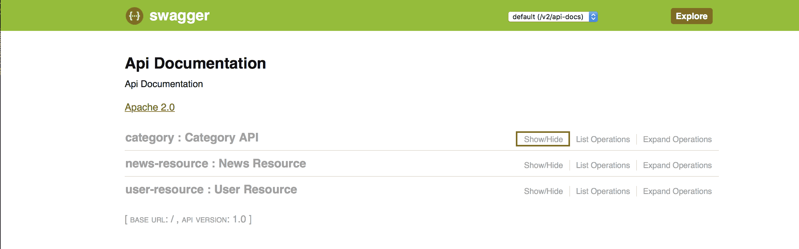

我们可以看到配置在我们 CMS 应用程序中的 API 端点。现在，我们将查看我们之前配置的分类，点击“显示/隐藏”链接。输出应该是：

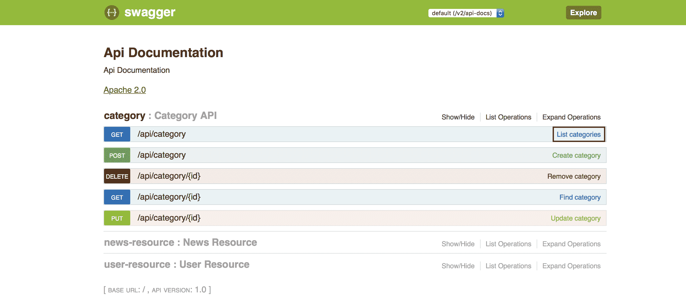

如我们所见，在我们的分类 API 中有五个操作，每个操作都有一个路径和摘要来帮助理解其目的。我们可以点击请求的操作并查看关于该操作的详细信息。让我们来做吧，点击“列出分类”来查看详细文档。页面看起来像这样：

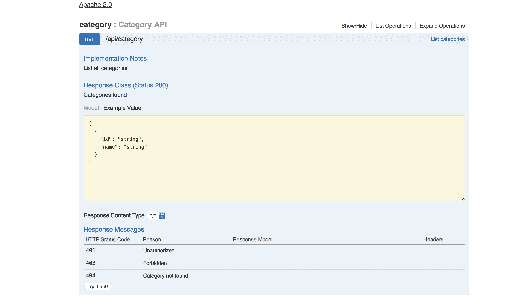

干得漂亮。现在我们有一个出色的 API，拥有优秀的文档。做得好。

让我们继续创建我们的 CMS 应用程序。

# 集成到 AngularJS

几年来，AngularJS 框架已经成为一种趋势，社区非常活跃，该项目由 Google 创建。

框架的主要思想是帮助开发者处理前端层的复杂性，尤其是在 HTML 部分。HTML 标记语言是静态的。它是一个创建静态文档的伟大工具，但今天它不再是现代网络应用程序的要求。这些应用程序需要是动态的。世界各地的 UX 团队努力创造令人惊叹的应用程序，具有不同的效果，这些人试图让应用程序对用户更加舒适。

AngularJS 增加了扩展 HTML 的可能性，添加一些额外的属性和标签。在本节中，我们将在前端应用程序中添加一些有趣的行为。让我们来做。

# AngularJS 概念

在我们的 CMS 应用程序中，我们将使用一些 Angular 组件。我们将使用 `Controllers`，它们将与我们的 HTML 交互并处理一些页面的行为，例如显示错误消息的页面。`Services` 负责处理基础设施代码，例如与我们的 CMS API 交互。本书的目的不是成为 AngularJS 指南。然而，我们将探讨一些有趣的概念来开发我们的应用程序。

AngularJS 的常用标签包括：

+   `ng-app`

+   `ng-controller`

+   `ng-click`

+   `ng-hide`

+   `ng-show`

这些标签包含在 AngularJS 框架中。社区还创建了和维护了许多其他标签。例如，有一个用于处理 HTML 表单的库，我们将使用它来在我们的 CMS 门户中添加动态行为。

# 控制器

控制器是框架的一部分，用于处理应用程序的业务逻辑。它们应该用于控制应用程序中的数据流。控制器通过 `ng-controller` 指令附加到 DOM。

要向我们的视图添加一些操作，我们需要在控制器上创建函数，方法是创建函数并将它们添加到 `$scope` 对象中。

控制器不能用来执行 DOM 操作、格式化数据和过滤数据，在 AngularJS 世界中被认为是最佳实践。

通常，控制器会注入服务对象以委托处理业务逻辑。我们将在下一节中了解服务。

# 服务

服务是我们应用中处理业务逻辑的对象。在某些情况下，它们可以用来处理状态。服务对象是单例的，这意味着我们整个应用程序中只有一个实例。

在我们的应用程序中，服务负责与基于 Spring Boot 构建的 CMS API 交互。让我们来做这件事。

# 创建应用程序入口点

Spring Boot 框架允许我们提供静态文件。这些文件应位于以下这些文件夹中的 classpath 中，`/static`、`/public`、`/resources`或`/META-INF/resources`。

我们将使用`/static`文件夹，在这个文件夹中，我们将放置我们的 AngularJS 应用程序。对于模块化 AngularJS 应用程序文件夹结构有一些标准，这取决于应用程序的大小和需求。我们将使用最简单的风格以保持对 Spring 集成的关注。看看项目结构：

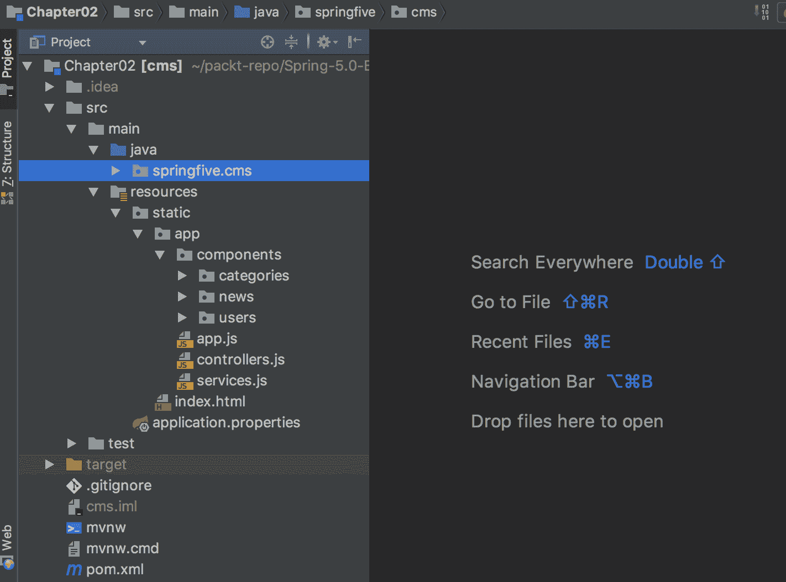

有一些资产可以启动和运行 AngularJS 应用程序。我们将使用内容分发网络（CDN）来加载 AngularJS 框架、Angular UI-Router，它帮助我们处理 Web 应用程序的路由，以及 Bootstrap 框架，它帮助我们开发页面。

内容分发网络是全球分布式的代理服务器。它使内容具有更高的可用性并提高性能，因为它将更靠近终端用户托管。详细的解释可以在 CloudFare 页面找到([`www.cloudflare.com/learning/cdn/what-is-a-cdn/`](https://www.cloudflare.com/learning/cdn/what-is-a-cdn/))。

然后，我们可以开始配置我们的 AngularJS 应用程序。让我们从我们的入口点`index.html`开始：

```java
<!DOCTYPE html>
<html lang="en">
<head>
  <meta charset="utf-8">
  <meta http-equiv="X-UA-Compatible" content="IE=edge">
  <meta name="viewport" content="width=device-width, initial-scale=1">
  <title>Spring Boot Security</title>
  <link rel="stylesheet"  href="https://maxcdn.bootstrapcdn.com/bootstrap/3.3.7/css/bootstrap.min.css">
</head>
<body ng-app="cms">

<!-- Header -->
<nav class="navbar navbar-default navbar-fixed-top">
  <div class="container">
    <div class="navbar-header">
      <button type="button" class="navbar-toggle collapsed" data-toggle="collapse" data-target="#navbar"
              aria-expanded="false" aria-controls="navbar">
        <span class="sr-only">Toggle navigation</span>
        <span class="icon-bar"></span>
        <span class="icon-bar"></span>
        <span class="icon-bar"></span>
      </button>
      <a class="navbar-brand" href="#">CMS</a>
    </div>
    <div id="navbar" class="collapse navbar-collapse">
      <ul class="nav navbar-nav">
        <li class="active"><a href="#">Home</a></li>
        <li><a href="#users">Users</a></li>
        <li><a href="#categories">Categories</a></li>
        <li><a href="#news">News</a></li>
      </ul>
    </div>
  </div>
</nav>

<!-- Body -->
<div class="container">
  <div ui-view></div>
</div>

<script src="img/angular.min.js"></script>
<script src="img/angular-ui-router.js"></script>

<script type="text/javascript" src="img/app.js"></script>

<script type="text/javascript" src="img/controllers.js"></script>
<script type="text/javascript" src="img/services.js"></script>

<script type="text/javascript" src="img/category-controller.js"></script>
<script type="text/javascript" src="img/category-service.js"></script>

<script type="text/javascript" src="img/news-controller.js"></script>
<script type="text/javascript" src="img/news-service.js"></script>

<script type="text/javascript" src="img/user-controller.js"></script>
<script type="text/javascript" src="img/user-service.js"></script>

</body>
</html>
```

这里有一些重要的事情。让我们来理解它们。

`ng-app`标签是一个指令，用于引导 AngularJS 应用程序。这个标签是应用程序的根元素，通常放置在`<body>`或`<html>`标签上。

`ui-view`标签指示 Angular UI-Router 关于 HTML 文档的哪个部分将由应用程序状态处理，换句话说，指定的部分具有动态行为，其变化取决于路由系统。看看下面的代码片段：

```java
<!-- Body -->
<div class="container">
  <div ui-view></div>
</div>
```

这部分代码可以在`index.hml`文件中找到。

在`ui-view`之后，我们有我们的 JavaScript 文件，第一个是 AngularJS 框架，在这个版本中文件被压缩。看看我们的 JavaScript 文件，这些文件是在`/static/app/components`文件夹中创建的。看看这里的图片：

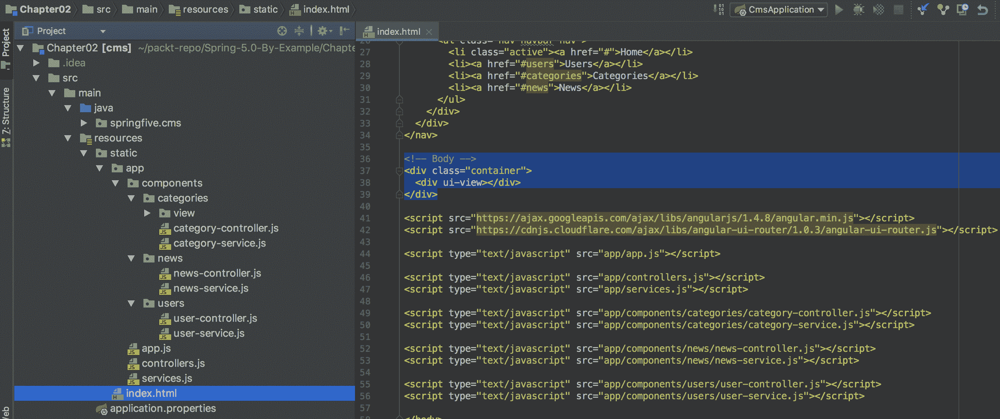

第二个是 UI-Router，它帮助我们管理我们的路由。最后，我们有我们的 JavaScript 文件，这些文件配置了 AngularJS 应用程序、我们的控制器以及与我们的 CMS API 交互的服务。

此外，我们还有一些引导类，用于对齐字段并使设计更容易。

# 创建分类控制器

现在，我们需要创建我们的控制器。我们将从最简单的开始，使示例更容易理解。《CategoryController》负责控制`Category`实体的数据。有两个控制器，一个使我们能够创建一个分类，另一个列出存储在数据库中的所有分类。

`category-controller.js` 应该是这样的：

```java
(function (angular) {
  'use strict';

  // Controllers
  angular.module('cms.modules.category.controllers', []).

  controller('CategoryCreateController',
      ['$scope', 'CategoryService','$state',
        function ($scope, CategoryService,$state) {

          $scope.resetForm = function () {
            $scope.category = null;
          };

          $scope.create = function (category) {
            CategoryService.create(category).then(
                function (data) {
                  console.log("Success on create Category!!!")
                  $state.go('categories')
                }, function (err) {
                  console.log("Error on create Category!!!")
                });
          };
        }]).

  controller('CategoryListController',
      ['$scope', 'CategoryService',
        function ($scope, CategoryService) {
          CategoryService.find().then(function (data) {
            $scope.categories = data.data;
          }, function (err) {
            console.log(err);
          });
        }]);
})(angular);
```

我们创建了一个 AngularJS 模块。它帮助我们保持函数的有序。它充当我们的一种命名空间。`.controller` 函数是一个构造函数，用于创建我们控制器的实例。我们收到了一些参数，AngularJS 框架将为我们注入这些对象。

# 创建分类服务

`CategoryService` 对象是一个单例对象，因为它是一个 AngularJS 服务。该服务将与我们的由 Spring Boot 应用程序提供的 CMS API 进行交互。

我们将使用 `$http` 服务。它使 HTTP 通信更容易。

让我们编写`CategoryService`：

```java
(function (angular) {
  'use strict';

  /* Services */
</span>  angular.module('cms.modules.category.services', []).
  service('CategoryService', ['$http',
    function ($http) {

      var serviceAddress = 'http://localhost:8080';
      var urlCollections = serviceAddress + '/api/category';
      var urlBase = serviceAddress + '/api/category/';

      this.find = function () {
        return $http.get(urlCollections);
      };

      this.findOne = function (id) {
        return $http.get(urlBase + id);
      };

      this.create = function (data) {
        return $http.post(urlBase, data);
      };

      this.update = function (data) {
        return $http.put(urlBase + '/id/' + data._id, data);
      };

      this.remove = function (data) {
        return $http.delete(urlBase + '/id/' + data._id, data);
      };
    }
  ]);
})(angular);
```

做得好，现在我们已经实现了 `CategoryService`。

`.service` 函数是一个构造函数，用于创建服务实例，`angular` 在幕后工作。构造函数上有注入，对于服务，我们需要一个 `$http` 服务来对我们的 API 进行 HTTP 调用。这里有几个 HTTP 方法。请注意正确的方法以保持 HTTP 语义。

# 摘要

在本章中，我们创建了我们的第一个 Spring 应用程序。我们看到了 Spring Initializr，这是一个帮助开发者创建应用程序骨架的神奇工具。

我们探讨了 Spring 在幕后是如何工作的，以及框架是如何通过几个注解进行配置的。现在，我们对 Spring 引导函数有了基本的了解，我们可以理解框架中存在的依赖注入和组件扫描功能。

这项知识是下一章的基础，现在我们准备开始使用更高级的功能，例如持久性。让我们开始吧。下一章再见。
