# 第三章：使用 Spring Data 和反应式方式实现持久化

在上一章中，我们创建了我们的**内容管理系统**（**CMS**）应用程序。我们还介绍了 Spring 中的 **REST**（**表示状态传输**）支持，这使得我们能够开发一个简单的 Web 应用程序。此外，我们还学习了 Spring 框架中依赖注入的工作原理，这可能是框架最著名的特性。

在本章中，我们将为我们的应用程序添加更多功能。现实世界中的系统需要在真实数据库上持久化其数据；这对于一个生产就绪的应用程序是一个基本特性。此外，根据我们的模型，我们需要选择正确的数据结构以实现性能并避免阻抗不匹配。

在本章的第一部分，我们将使用传统的 SQL 数据库作为我们应用程序的存储。我们将深入研究 Spring Data **JPA**（**Java 持久化 API**）以实现 CMS 应用程序的持久化。我们将了解如何使用这个令人惊叹的 Spring 模块启用事务。

之后，我们将转向一种更现代的数据库类型，称为 **NoSQL** **技术**。在这个领域，我们将使用著名的数据库文档模型，即 **MongoDB**，然后我们将为我们的 CMS 应用程序创建最终的解决方案。

MongoDB 为我们的应用程序提供了一个出色的解决方案，因为它支持文档存储模型，并允许我们将对象以 JSON 的形式存储，这使得我们的数据更易于阅读。此外，MongoDB 是无模式的，这是一个非常出色的特性，因为一个集合可以存储不同的文档。这意味着记录可以有不同的字段、内容和大小。MongoDB 的另一个重要特性是查询模型。它提供了一个易于理解的基于文档的查询，并且基于 JSON 标记，我们的查询将比任何其他数据库都更容易阅读。

最后，我们将添加 Spring 5.0 中最重要的特性：对反应式流的支持。我们的应用程序将转变为一个具有一些重要要求的现代 Web 应用程序。

下面是本章你将学习的内容概述：

+   实现 Spring Data JPA

+   使用 Spring Data Reactive MongoDB 创建仓库

+   学习反应式 Spring

+   理解 Project Reactor

# 学习 Docker 的基础知识

在《第一章》中，我们学习了 Docker 概念，*Spring 世界的旅程*。现在，是时候测试我们的知识并将其付诸实践了。在本章的第一部分，我们将启动 MongoDB 和 Postgres 实例，作为我们应用程序的数据库。我们将在应用程序中配置连接设置。

在本章的最后部分，我们将介绍 Maven 插件，它提供了一个通过 `pom.xml` 创建 Docker 镜像的简单方法，只需在文件中进行一些配置。最后，我们将在 Docker 容器中运行我们的应用程序。

# 准备 MongoDB

让我们创建我们的 MongoDB 容器。我们将使用 Docker Hub 提供的官方镜像。

首先，我们需要拉取镜像：

```java
docker pull mongo:3.4.10
```

然后，我们将看到 Docker 引擎正在下载镜像内容。

为了从我们的容器中创建隔离，我们将为我们的应用程序和数据库创建一个单独的网络。该网络应使用桥接驱动程序以允许容器通信。

让我们创建一个 `docker network`：

```java
docker network create cms-application
```

命令输出应该是一个创建的网络 ID。您的 ID 可能与我的不同：

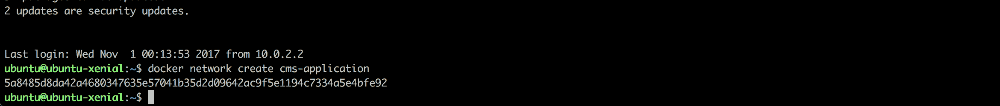

要检查网络是否成功创建，可以使用 `docker network ls` 命令来帮助我们。

我们将启动我们的 MongoDB。该网络应该是 `cms-application`，但我们将数据库端口映射到主机端口。出于调试目的，我们将连接一个客户端到正在运行的数据库，但请不要在非开发环境中这样做。

在主机上暴露端口不是最佳实践。因此，我们使用 Docker 容器，这是其主要优势之一是进程隔离。在这种情况下，我们将无法控制网络。否则，我们可能会引起一些端口冲突。

首先，输入以下命令：

```java
docker run -d --name mongodb --net cms-application -p 27017:27017 mongo:3.4.10
```

此外，我们可以使用 `docker stop mongodb` 命令停止 Docker MongoDB 容器，然后通过以下命令重新启动我们的容器：`docker start mongodb`。

输出将是一个哈希值，代表容器的 ID。

参数说明如下：

+   `-d`：这指示 Docker 以后台模式运行容器

+   `--name`：容器名称；它将在我们的网络中充当主机名

+   `--net`：容器将要连接的网络

+   `-p`：主机端口和容器端口，它们将被映射到主机接口上的一个容器

现在，我们在机器上运行了一个相当标准的 MongoDB 实例，我们可以开始在我们的 CMS 应用程序中添加持久性。我们很快就会这样做。

# 准备 PostgreSQL 数据库

与 MongoDB 类似，我们将为我们的 CMS 应用程序准备一个 PostgreSQL 实例。我们将更改我们的持久层以展示 Spring Data 如何为开发者抽象化它。然后，我们需要为它准备一个 Docker Postgres 实例。

我们将使用 Postgres 的 9.6.6 版本并使用 `alpine` 标签，因为它比其他 Postgres 镜像更小。让我们拉取我们的镜像。命令应该是这样的：

```java
docker pull postgres:9.6.6-alpine
```

然后，等待下载完成。

在前面的部分中，我们创建了一个名为 `cms-application` 的 Docker 网络。现在，我们将像为 MongoDB 所做的那样，在该网络上启动我们的 Postgres 实例。启动 Postgres 的命令应该是以下这样的：

```java
docker run -d --name postgres --net cms-application -p 5432:5432 -e POSTGRES_PASSWORD=cms@springfive
postgres:9.6.6-alpine
```

参数列表与我们为 MongoDB 传递的相同。我们希望以后台模式运行它并将其连接到我们的自定义网络。正如我们所见，`docker run` 命令中还有一个新的参数。让我们来理解它：

+   `-e`：这使我们能够为容器传递环境变量。在这种情况下，我们想更改密码值。

干得好。我们已经完成了我们的基础设施需求。现在让我们立即了解持久化的细节。

# Spring Data 项目

Spring Data 项目是一个伞形项目，它提供了一种熟悉的方式来在广泛的数据库技术上创建我们的数据访问层。这意味着有高级抽象来与不同类型的数据结构交互，例如文档模型、列族、键值和图。此外，Spring Data JPA 项目完全支持 JPA 规范。

这些模块为我们领域模型提供了强大的对象映射抽象。

支持不同类型的数据结构和数据库。有一组子模块来保持框架的模块化。此外，这些子模块分为两大类：第一类是 Spring 框架团队支持的项目子集，第二类是社区提供的子模块子集。

Spring 团队支持的项目包括：

+   Spring Data Commons

+   Spring Data JPA

+   Spring Data MongoDB

+   Spring Data Redis

+   Spring Data for Apache Cassandra

社区支持的项目包括：

+   Spring Data Aerospike

+   Spring Data ElasticSearch

+   Spring Data DynamoDB

+   Spring Data Neo4J

仓库接口链的基础是`Repository`接口。这是一个标记接口，其一般目的是存储类型信息。这个类型将被用于扩展它的其他接口。

还有一个`CrudRepository`接口。这是最重要的，名字本身就说明了它的作用；它提供了一些执行 CRUD 操作的方法，并提供了一些实用方法，如`count()`、`exists()`和`deleteAll()`。这些是仓库实现最重要的基本接口。

# Spring Data JPA

Spring Data JPA 提供了一个简单的方式来使用 Java EE 中的 JPA 规范实现数据访问层。通常，这些实现有很多样板代码和重复代码，维护数据库代码中的更改也很困难。Spring Data JPA 试图解决这些问题，并提供了一种无需样板代码和重复代码的直观方式来做到这一点。

JPA 规范提供了一个抽象层，用于与已经实现的不同数据库供应商交互。Spring 在高级模式上添加了一个抽象层。这意味着 Spring Data JPA 将创建一个仓库实现，并封装整个 JPA 实现细节。我们可以用对 JPA 规范的了解很少来构建我们的持久化层。

*JPA 规范*是由**JCP（Java 社区进程**）创建的，旨在帮助开发者在 Java 类和关系数据库之间持久化、访问和管理数据。一些供应商实现了这个规范。最著名的实现是 Hibernate ([`hibernate.org/orm/`](http://hibernate.org/orm/))，默认情况下，Spring Data JPA 使用 Hibernate 作为 JPA 实现。

再见，**DAO**（**数据访问对象**）模式和实现。Spring Data JPA 旨在通过经过良好测试的框架和一些生产就绪功能来解决此问题。

现在，我们已经了解了 Spring Data JPA 是什么。让我们将其付诸实践。

# 配置 pom.xml 以使用 Spring Data JPA

现在，我们需要添加正确的依赖项以与 Spring Data JPA 一起工作。在我们的 `pom.xml` 文件中需要配置几个依赖项。

第一个是一个 Spring Data JPA Starter，它提供了许多自动配置类，使我们能够快速启动应用程序。最后一个依赖项是 PostgreSQL JDBC 驱动程序，它是必需的，因为它包含了连接 PostgreSQL 数据库的 JDBC 实现类。

新的依赖项包括：

```java
<dependency>
  <groupId>org.springframework.boot</groupId>
  <artifactId>spring-boot-starter-data-jpa</artifactId>
</dependency>

<dependency>
  <groupId>org.postgresql</groupId>
  <artifactId>postgresql</artifactId>
  <version>42.1.4</version>
</dependency>
```

简单且相当容易。

# 配置 Postgres 连接

为了将我们的应用程序与最近创建的数据库连接起来，我们需要在 `application.yaml` 文件中配置几行。再次感谢 Spring Data Starter，我们的连接将自动配置。

我们也可以使用 `@Bean` 注解来生成连接对象，但有许多对象需要配置。我们将继续使用配置文件。它更简单、更易于理解。

为了配置数据库连接，我们需要向 Spring 框架提供一些属性，例如数据库 URL、数据库用户名、密码，以及一个驱动类名，以指导 JPA 框架关于 JDBC 类的完整路径。

`application.yaml` 文件应该是这样的：

```java
spring:
 datasource:
 url: jdbc:postgresql://localhost:5432/postgres
    username: postgres
    password: cms@springfive
    driver-class-name: org.postgresql.Driver
  jpa:
    show-sql: true
    generate-ddl: true
```

在 `datasource` 部分中，我们已配置了数据库凭据连接以及数据库主机。

`application.yaml` 中的 JPA 部分可以用来配置 JPA 框架。在这一部分，我们配置了在控制台记录 SQL 指令。这有助于调试和进行故障排除。此外，我们还配置了 JPA 框架，以便在应用程序启动过程中在数据库中创建我们的表。

太棒了，JPA 基础设施已配置。做得好！现在，我们可以以 JPA 风格映射我们的模型。让我们在下一节中这样做。

# 映射模型

我们已成功配置数据库连接。现在，我们准备使用 JPA 注解来映射我们的模型。让我们从我们的 `Category` 模型开始。这是一个相当简单的类，这很好，因为我们对 Spring Data JPA 的内容感兴趣。

我们 `Category` 模型的第一个版本应该是这样的：

```java
package springfive.cms.domain.models;

import javax.persistence.Entity;
import javax.persistence.GeneratedValue;
import javax.persistence.Id;
import javax.persistence.Table;
import lombok.Data;
import org.hibernate.annotations.GenericGenerator;

@Data
@Entity
@Table(name = "category")
public class Category {

  @Id
  @GeneratedValue(generator = "system-uuid")
 @GenericGenerator(name = "system-uuid", strategy = "uuid2")
  String id;

  String name;

}
```

我们需要更改一些模型类以适应 JPA 规范。我们可以在 GitHub 上找到模型类：[`github.com/PacktPublishing/Spring-5.0-By-Example/tree/master/Chapter03/cms-postgres/src/main/java/springfive/cms/domain/models`](https://github.com/PacktPublishing/Spring-5.0-By-Example/tree/master/Chapter03/cms-postgres/src/main/java/springfive/cms/domain/models)。

这里有一些新内容。`@Entity` 注解指示 JPA 框架，被注解的类是一个实体，在我们的例子中，是 `Category` 类，然后框架将与之关联一个数据库表。`@Table` 注解用于在数据库中命名表。这些注解是在类级别插入的，这意味着在类声明之上。

`@Id` 注解指示 JPA 哪个注解字段是数据库表的键。为实体生成顺序 ID 不是一种好做法，尤其是如果你正在创建 API。这有助于黑客理解 ID 的逻辑，使得攻击更容易。因此，我们将生成 UUID（通用唯一标识符）而不是简单的顺序 ID。`@GenericGenerator` 注解指示 Hibernate（一个 JPA 规范实现供应商）生成随机 UUID。

# 在 CMS 应用程序中添加 JPA 存储库

一旦整个基础设施和 JPA 映射完成，我们就可以将我们的存储库添加到项目中。在 Spring Data 项目中，有一些抽象，例如 `Repository`、`CrudRepository` 和 `JpaRepository`。我们将使用 `JpaRepository`，因为它支持分页和排序功能。

我们的存储库将会相当简单。有几个标准方法，例如 `save()`、`update()` 和 `delete()`，我们还将查看一些 DSL 查询方法，这些方法允许开发者根据属性名称创建自定义查询。我们创建了一个 `AbstractRepository` 来帮助我们存储对象在内存中。这已经不再必要了。我们可以将其删除。

让我们创建我们的第一个 JPA 存储库：

```java
package springfive.cms.domain.repository;

import java.util.List;
import org.springframework.data.jpa.repository.JpaRepository;
import springfive.cms.domain.models.Category;

public interface CategoryRepository extends JpaRepository<Category, String> {

  List<Category> findByName(String name);

  List<Category> findByNameIgnoreCaseStartingWith(String name);

}
```

正如我们所见，`JpaRepository` 接口使用所需的实体类型以及实体的 ID 类型进行类型化。这部分没有秘密。这个惊人的事情发生是为了支持基于属性名称的自定义查询。在 `Category` 模型中，有一个名为 `name` 的属性**。**我们可以使用 `By` 指令在我们的 `CategoryRepository` 中创建自定义方法，使用 `Category` 模型属性。正如我们所见，在 `findByName(String name)` 上，Spring Data 框架将创建正确的查询来按名称查找类别。这太棒了。

自定义查询方法支持许多关键字：

| **逻辑关键字** | **逻辑表达式** |
| --- | --- |
| `AND` | `And` |
| `OR` | `Or` |
| `AFTER` | `After`, `IsAfter` |
| `BEFORE` | `Before`, `IsBefore` |
| `CONTAINING` | `Containing`, `IsContaining`, `Contains` |
| `BETWEEN` | `Between`, `IsBetween` |
| `ENDING_WITH` | `EndingWith`, `IsEndingWith`, `EndsWith` |
| `EXISTS` | `Exists` |
| `FALSE` | `False`, `IsFalse` |
| `GREATER_THAN` | `GreaterThan`, `IsGreaterThan` |
| `GREATHER_THAN_EQUALS` | `GreaterThanEqual`, `IsGreaterThanEqual` |
| `IN` | `In`, `IsIn` |
| `IS` | `Is`, `Equals`, (or no keyword) |
| `IS_EMPTY` | `IsEmpty`, `Empty` |
| `IS_NOT_EMPTY` | `IsNotEmpty`, `NotEmpty` |
| `IS_NOT_NULL` | `NotNull`, `IsNotNull` |
| `IS_NULL` | `Null`, `IsNull` |
| `LESS_THAN` | `LessThan`, `IsLessThan` |
| `LESS_THAN_EQUAL` | `LessThanEqual`, `IsLessThanEqual` |
| `LIKE` | `Like`, `IsLike` |
| `NEAR` | `Near`, `IsNear` |
| `NOT` | `Not`, `IsNot` |
| `NOT_IN` | `NotIn`, `IsNotIn` |
| `NOT_LIKE` | `NotLike`, `IsNotLike` |
| `REGEX` | `Regex`, `MatchesRegex`, `Matches` |
| `STARTING_WITH` | `StartingWith`, `IsStartingWith`, `StartsWith` |
| `TRUE` | `True`, `IsTrue` |
| `WITHIN` | `Within`, `IsWithin` |

基于属性名称创建查询有许多方法。我们可以使用关键字组合关键字，例如 `findByNameAndId`。Spring Data JPA 提供了一种创建查询的一致方法。

# 配置事务

当我们使用 JPA 规范时，大多数应用程序还需要支持事务。Spring 在其他模块中也有出色的交易支持。这种支持与 Spring Data JPA 集成，我们可以利用它。在 Spring 中配置事务非常简单；我们只需在需要时插入 `@Transactional` 注解即可。有一些不同的用例可以使用它。我们将在服务层使用 `@Transactional`，然后我们将注解放在我们的服务类中。让我们看看我们的 `CategoryService` 类：

```java
package springfive.cms.domain.service;

import java.util.List;
import java.util.Optional;
import org.springframework.stereotype.Service;
import org.springframework.transaction.annotation.Transactional;
import springfive.cms.domain.exceptions.CategoryNotFoundException;
import springfive.cms.domain.models.Category;
import springfive.cms.domain.repository.CategoryRepository;
import springfive.cms.domain.vo.CategoryRequest;

@Service
@Transactional(readOnly = true)
public class CategoryService {

  private final CategoryRepository categoryRepository;

  public CategoryService(CategoryRepository categoryRepository) {
    this.categoryRepository = categoryRepository;
  }

  @Transactional
  public Category update(Category category) {
    return this.categoryRepository.save(category);
  }

  @Transactional
  public Category create(CategoryRequest request) {
    Category category = new Category();
    category.setName(request.getName());
    return this.categoryRepository.save(category);
  }

  @Transactional
  public void delete(String id) {
    final Optional<Category> category = this.categoryRepository.findById(id);
    category.ifPresent(this.categoryRepository::delete);
  }

  public List<Category> findAll() {
    return this.categoryRepository.findAll();
  }

  public List<Category> findByName(String name) {
    return this.categoryRepository.findByName(name);
  }

  public List<Category> findByNameStartingWith(String name) {
    return this.categoryRepository.findByNameIgnoreCaseStartingWith(name);
  }

  public Category findOne(String id) {
    final Optional<Category> category = this.categoryRepository.findById(id);
    if (category.isPresent()) {
      return category.get();
    } else {
      throw new CategoryNotFoundException(id);
    }
  }

}
```

在 `CategoryService` 类中存在许多 `@Transactional` 注解。类级别的第一个注解指示框架为那些类中所有存在的方法配置 `readOnly`，除了配置了 `@Transactional` 的方法。在这种情况下，类级别的注解将被覆盖为 `readOnly=false`。当省略值时，这是默认配置。

# 安装和配置 pgAdmin3

要连接到我们的 PostgreSQL 实例，我们将使用 pgAdmin 3，这是 Postgres 团队提供的免费工具。

要安装 pgAdmin 3，我们可以使用以下命令：

```java
sudo apt-get install pgadmin3 -y
```

这将在我们的机器上安装 pgAdmin 3。

安装完成后，打开 pgAdmin 3，然后点击添加服务器连接。按钮看起来像这样***：***


然后，填写以下截图所示的信息：

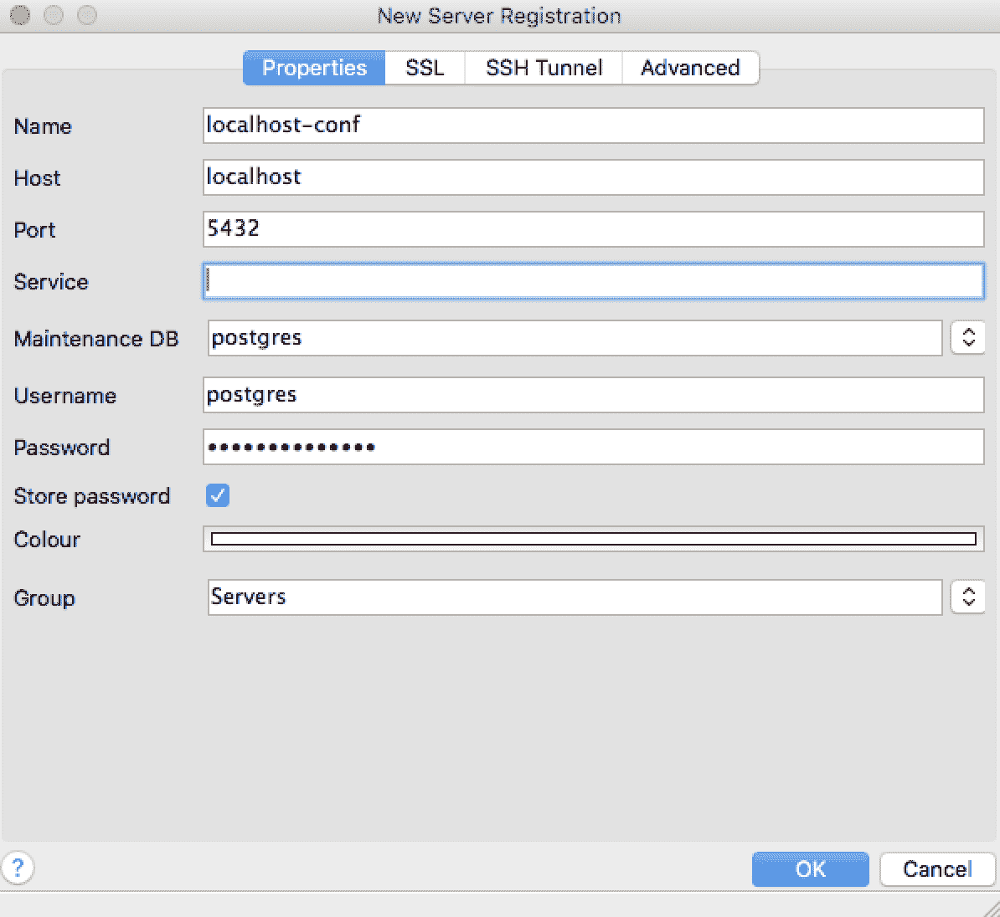

密码应该是：`cms@springfive.`。

太棒了，我们的 pgAdmin 3 工具已配置完成。

# 检查数据库结构中的数据

整个应用程序结构已准备就绪。现在，我们可以检查数据库以获取我们的持久化数据。有许多开源的 Postgres 客户端。我们将使用之前配置的 pgAdmin 3。

第一次打开应用程序时，您将被要求输入凭据和主机。我们必须输入与我们在 `application.yaml` 文件中配置的信息相同。然后，我们就可以在数据库中发出指令了。

在检查数据库之前，我们可以使用 Swagger 在我们的 CMS 系统中创建一些分类。我们可以参考第二章，*从 Spring 世界开始 – CMS 应用程序*中提供的说明来创建一些数据。

然后，我们可以在数据库中执行以下 SQL 指令：

```java
select * from category;
```

结果应该是 Swagger 调用中创建的分类。在我的情况下，我创建了两个分类，`sports` 和 `movies`。结果将类似于以下截图所示：

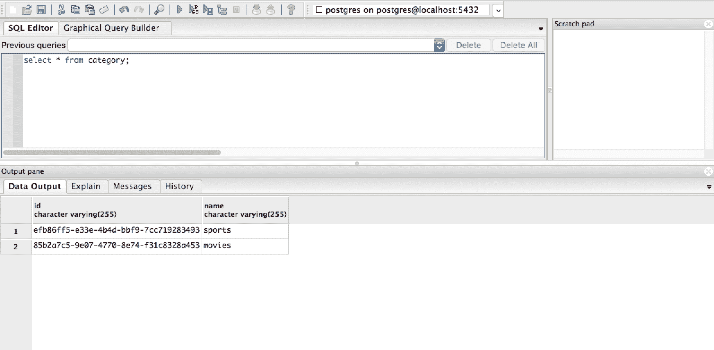

了不起的工作，伙计们。应用程序已完全运行。

现在，我们将为存储库创建我们的最终解决方案。我们已经学习了 Spring Data 项目的基础知识，在下一节中，我们将把持久层改为现代数据库。

# 创建最终的数据访问层

我们已经玩过 Spring Data JPA 项目，并看到了它有多简单。我们学习了如何配置数据库连接，以便在 Postgres 数据库上持久化真实数据。现在，我们将为我们的应用程序创建数据访问层的最终解决方案。最终解决方案将使用 MongoDB 作为数据库，并使用提供 MongoDB 存储库支持的 Spring Data MongoDB 项目。

我们将看到与 Spring Data JPA 项目的一些相似之处。这很令人惊讶，因为我们可以在实践中证明 Spring Data 抽象的力量。通过一些更改，我们可以迁移到另一个数据库模型。

让我们在以下章节中了解新项目并将其付诸实践。

# Spring Data MongoDB

Spring Data MongoDB 为我们的领域对象和 MongoDB 文档提供了集成。通过几个注解，我们的实体类就准备好在数据库中持久化了。映射基于 **POJO** （**普通的 Java 对象**）模式，这是所有 Java 开发者都熟知的。

该模块提供了两个抽象级别。第一个是高级抽象。它提高了开发者的生产力。这个级别提供了一些注解，以指导框架将领域对象转换为 MongoDB 文档，反之亦然。开发者不需要编写任何关于持久性的代码；它将由 Spring Data MongoDB 框架管理。在这个级别上还有更多令人兴奋的事情，例如 Spring Conversion Service 提供的丰富映射配置。Spring Data 项目提供了一个丰富的 DSL，使开发者能够根据属性名称创建查询。

抽象的第二层是低级抽象。在这一层，行为不是由框架自动管理的。开发者需要稍微了解一些 Spring 和 MongoDB 文档模型。框架提供了一些接口，以使开发者能够控制读写指令。这在高级抽象不适合的场景中可能很有用。在这种情况下，实体的映射控制应该更加细致。

再次强调，Spring 为开发者提供了选择权。高级抽象提高了开发者的性能，而低级抽象允许开发者有更多的控制权。

现在，我们将为我们的模型添加映射注解。让我们开始吧。

# 移除 PostgreSQL 和 Spring Data JPA 依赖项

我们将把我们的项目转换为使用全新的 Spring Data Reactive MongoDB 存储库。在那之后，我们将不再使用 Spring Data JPA 和 PostgreSQL 驱动程序。让我们从我们的`pom.xml`中移除这些依赖项：

```java
<dependency>
  <groupId>org.springframework.boot</groupId>
  <artifactId>spring-boot-starter-data-jpa</artifactId>
</dependency>

<dependency>
  <groupId>org.postgresql</groupId>
  <artifactId>postgresql</artifactId>
  <version>42.1.4</version>
</dependency>
```

然后，我们可以添加以下依赖项：

```java
<dependency>
  <groupId>org.springframework.boot</groupId>
  <artifactId>spring-boot-starter-data-mongodb-reactive</artifactId>
</dependency>
```

`pom.xml`的最终版本可以在 GitHub 上找到：[`github.com/PacktPublishing/Spring-5.0-By-Example/blob/master/Chapter03/cms-mongo-non-reactive/pom.xml`](https://github.com/PacktPublishing/Spring-5.0-By-Example/blob/master/Chapter03/cms-mongo-non-reactive/pom.xml)。

# 映射领域模型

我们将在我们的领域模型上添加映射注解。Spring Data MongoDB 将使用这些注解来将我们的对象持久化到 MongoDB 集合中。我们将从`Category`实体开始，它应该像这样：

```java
package springfive.cms.domain.models;

import lombok.Data;
import org.springframework.data.annotation.Id;
import org.springframework.data.mongodb.core.mapping.Document;

@Data
@Document(collection = "category")
public class Category {

  @Id
  String id;

  String name;

}
```

我们在`Category`类中添加了两个新的注解。来自 Spring Data MongoDB 的`@Document`注解使我们能够配置集合名称。MongoDB 中的集合类似于 SQL 数据库中的表。

`@Id`注解来自 Spring Data Commons 项目。它很有趣，因为我们可以看到，它并不是特定于 MongoDB 映射的。带有此注解的字段注解将在 MongoDB 集合的`_id`字段上转换。

通过这些注解，`Category`类被配置为在 MongoDB 上持久化。在下一节中，我们将创建我们的存储库类。

我们需要对其他实体执行相同的任务。`User`和`News`需要以与`Category`类相同的方式进行配置。完整的源代码可以在 GitHub 上找到：[`github.com/PacktPublishing/Spring-5.0-By-Example/tree/master/Chapter03/cms-mongo-non-reactive/src/main/java/springfive/cms/domain/models`](https://github.com/PacktPublishing/Spring-5.0-By-Example/tree/master/Chapter03/cms-mongo-non-reactive/src/main/java/springfive/cms/domain/models)。

# 配置数据库连接

在我们创建我们的存储库之前，我们将配置 MongoDB 连接。存储库层抽象了驱动实现，但正确配置驱动是必要的。

在资源目录中，我们将更改之前为 Spring Data JPA 配置的 `application.yaml` 文件。Spring 框架支持通过 YAML 文件进行配置。这种文件对人类来说更易于阅读，并且具有某种层次结构。这些特性是选择这种扩展的原因。

`application.yaml` 文件应该像以下示例所示：

```java
spring:
  data:
    mongodb:
      database: cms
      host: localhost
      port: 27017
```

MongoDB 的 `application.yaml` 文件可以在 GitHub 上找到 ([`github.com/PacktPublishing/Spring-5.0-By-Example/blob/master/Chapter03/cms-mongo-non-reactive/src/main/resources/application.yaml`](https://github.com/PacktPublishing/Spring-5.0-By-Example/blob/master/Chapter03/cms-mongo-non-reactive/src/main/resources/application.yaml)).

目前这个文件很简单。有一个 `database` 标签用于配置数据库名称。`host` 和 `port` 标签是关于 MongoDB 实例运行地址的。

我们还可以使用几个对象以编程方式配置连接，但这需要我们编写大量的样板代码。Spring Boot 为我们提供了现成的解决方案。让我们享受它吧。

太好了，连接配置成功。基础设施需求已解决。让我们继续实现我们的仓库。

Spring Boot 框架支持在 `application.properties` 或 `application.yaml` 中配置配置文件。这意味着如果应用程序以属性文件样式配置，我们可以使用 `application-<profile>.properties`。然后，这些属性将应用于所需的配置文件。在 YAML 风格中，我们可以使用一个包含多个配置文件的单一文件。

# 添加仓库层

一旦实体被映射，并且建立了连接，就是时候创建我们的仓库了。Spring Data 框架提供了一些接口，可以在不同的用例中使用。我们将使用 MongoDB 数据库的特化，即 `MongoRepository`。它扩展了 `PagingAndSortingRepository` 和 `QueryByExampleExecutor`。前者关于分页和排序功能，后者关于示例查询。

在某些情况下，数据库查询结果集可能非常大。这可能会引起一些应用程序性能问题，因为我们将会获取大量的数据库记录。我们可以限制从数据库中获取的记录数，并为此配置限制。这种技术称为 **分页**。我们可以在 *Spring Data Commons 文档* 中找到完整的文档 ([`docs.spring.io/spring-data/commons/docs/current/reference/html/`](https://docs.spring.io/spring-data/commons/docs/current/reference/html/))。

这个接口提供了许多内置方法以方便使用。有几个方法可以插入一个或多个实例，有列出请求实体所有实例的方法，有删除一个或多个实例的方法，以及许多其他功能，如排序和分页。

它使开发者能够无需代码甚至无需深入了解 MongoDB 就能创建仓库。然而，为了排除各种错误，对 MongoDB 的一些了解是必要的。

我们将首先创建`CategoryRepository`。将`CategoryRepository`的类型从类改为接口。这个接口中的代码不是必要的。Spring 容器将在应用程序启动时注入正确的实现。

让我们创建我们的第一个具体仓库，这意味着这个仓库将持久化我们在之前配置的 MongoDB 上的数据。`CategoryRepository`需要是这样的：

```java
package springfive.cms.domain.repository;

import org.springframework.data.mongodb.repository.MongoRepository;
import springfive.cms.domain.models.Category;

public interface CategoryRepository extends MongoRepository<Category,String> {}
```

类型是`interface`。仓库不再有任何 stereotypes。Spring 容器可以通过它扩展的`MongoRepository`接口来识别实现。

`MongoRepository`接口应该被参数化。第一个参数是它所表示的模型类型。在我们的例子中，它表示`Category`类的仓库。第二个参数是关于模型 ID 的类型。我们将使用字符串类型。

现在，我们需要对其他实体`User`和`News`做同样的事情。代码与前面的代码非常相似。你可以在 GitHub 上找到完整的源代码：[`github.com/PacktPublishing/Spring-5.0-By-Example/tree/master/Chapter03/cms-mongo-non-reactive/src/main/java/springfive/cms/domain/repository`](https://github.com/PacktPublishing/Spring-5.0-By-Example/tree/master/Chapter03/cms-mongo-non-reactive/src/main/java/springfive/cms/domain/repository)。

在下一节中，我们将检查数据库以断言行是否正确持久化。

# 检查持久性

现在，我们可以测试应用程序的持久性和所有层。我们将提供相应的 API 文档。让我们打开 Swagger 文档，并在我们的 CMS 应用程序中创建一些记录。

在 Swagger 上创建示例类别：

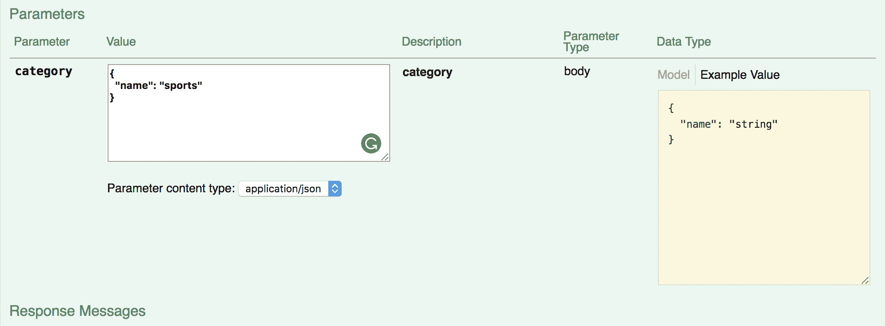

填写类别 JSON，如前面的截图所示，然后点击“Try it out!”。它将调用类别 API 并将类别持久化到数据库中。现在，我们可以检查它。

要连接到 MongoDB 实例并检查集合，我们将使用`mongo-express`工具。这是一个基于 NodeJS 编写的 Web 工具，用于与我们的数据库实例交互。

工具可以安装，但我们将在一个 Docker 容器上运行工具。Docker 工具将帮助我们完成这部分。让我们启动容器：

```java
docker run -d --link mongodb:mongo--net cms-application -p 8081:8081 mongo-express
```

它指示 Docker 启动一个带有`mongo-express`工具的容器并连接到所需的实例。`--link`参数指示 Docker 为我们的 MongoDB 实例创建一个类似*hostname*的东西。记住我们的实例名称是`mongodb`；我们在之前的运行命令中已经这样做了。

干得好。前往`http://localhost:8081`，我们将看到这个页面：

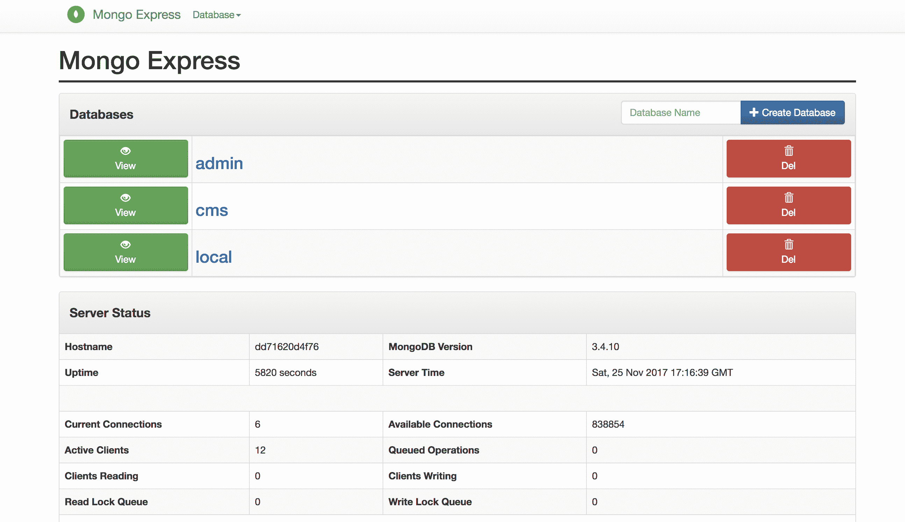

有几个数据库。我们感兴趣的是 CMS 数据库。点击旁边的“查看”按钮旁边的 cms。然后，工具将展示所选数据库的集合；在我们的案例中，是 CMS 数据库。视图应该如下所示：

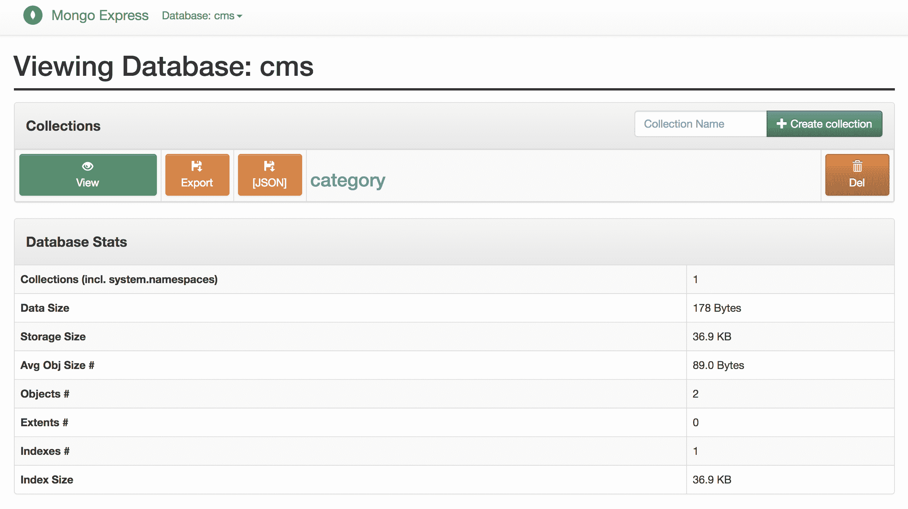

类别以集合的形式呈现。我们可以查看、导出，并以 JSON 格式导出，但就目前而言，我们感兴趣的是检查我们的 CMS 应用程序是否正确地持久化了数据。因此，点击“查看”按钮。我们将使用 MongoDB 集合数据如下：

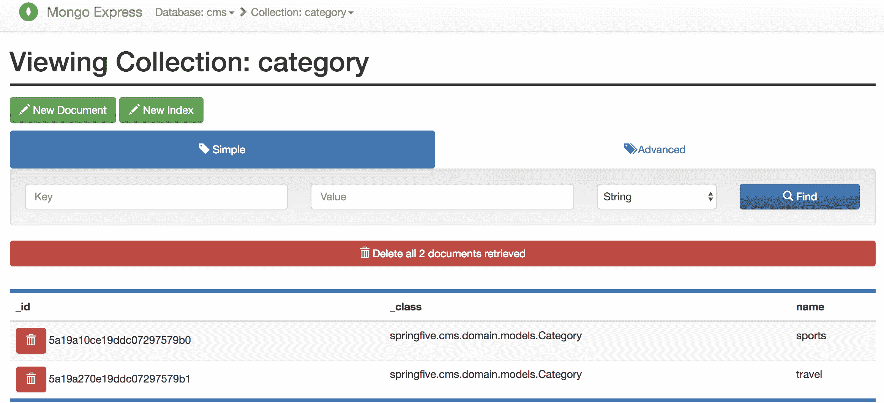

如我们所见，数据已按预期存储在 MongoDB 中。数据库中有两个类别——体育和旅行。有一个 `_class` 字段，它帮助 Spring Data 将域类进行转换。

干得好，CMS 应用程序已启动并运行，并且正在 MongoDB 中持久化数据。现在，我们的应用程序几乎已准备好投入生产，数据已在外部的出色文档数据存储中持久化。

在下一节中，我们将创建我们的 Docker 镜像，然后我们将使用 Docker 命令运行 CMS 应用程序。这将很有趣。

# 为 CMS 创建 Docker 镜像

我们正在做一件了不起的工作。我们使用 Spring Boot 框架创建了一个应用程序。该应用程序已经使用了 Spring REST、Spring Data 和 Spring DI。

现在，我们将更进一步，创建我们的 Docker 镜像。这将有助于我们交付我们的应用程序到生产环境中。有一些优势，我们可以在本地或任何云服务提供商上运行应用程序，因为 Docker 抽象了操作系统层。我们不需要在应用程序主机上安装 Java，它还允许我们在主机上使用不同的 Java 版本。采用 Docker 进行交付涉及许多优势。

我们使用 Maven 作为构建工具。Maven 有一个出色的插件可以帮助我们创建 Docker 镜像。在下一节中，我们将了解 Maven 如何帮助我们。

# 配置 docker-maven-plugin

fabric8 提供了一个出色的 Maven 插件（[`github.com/fabric8io/docker-maven-plugin`](https://github.com/fabric8io/docker-maven-plugin)）。它遵循 Apache-2.0 许可协议，这意味着我们可以无忧无虑地使用它。

我们将配置我们的项目以使用它，并在镜像创建后，将其推送到 Docker Hub。这是一个公共 Docker 仓库。

步骤如下：

1.  配置插件

1.  推送 Docker 镜像

1.  配置 Docker Spring 配置文件

然后，是时候展示成果了。让我们开始吧。

# 在 pom.xml 中添加插件

让我们配置 Maven 插件。在 `pom.xml` 上的插件部分添加一个插件并添加一些配置是必要的。插件应该配置如下：

```java
<plugin>
   <groupId>io.fabric8</groupId>
   <artifactId>docker-maven-plugin</artifactId>
   <version>0.21.0</version>
   <configuration>
      <images>
         <image>
            <name>springfivebyexample/${project.build.finalName}</name> 
            <build>
               <from>openjdk:latest</from>
               <entryPoint>java -Dspring.profiles.active=container -jar /application/${project.build.finalName}.jar</entryPoint>
               <assembly>
                  <basedir>/application</basedir>
                  <descriptorRef>artifact</descriptorRef>
                  <inline>
                     <id>assembly</id>
                     <files>
                        <file>
                           <source>target/${project.build.finalName}.jar</source>
                        </file>
                     </files>
                  </inline>
               </assembly>
               <tags>
                  <tag>latest</tag>
               </tags>
               <ports>
                  <port>8080</port>
               </ports>
            </build>
            <run>
               <namingStrategy>alias</namingStrategy>
            </run>
            <alias>${project.build.finalName}</alias>
         </image>
      </images>
   </configuration>
</plugin>
```

这里有一些新的配置。让我们从`<name>`标签开始——它配置了要推送到 Docker Hub 的仓库和 Docker 镜像名称。对于这本书，我们将使用`springfivebyexample`作为 Docker ID。我们可以看到，仓库和镜像名称之间使用`*斜杠*`作为分隔符。对于我们来说，镜像名称将是最终的项目名称。然后，我们需要进行配置。

Docker ID 是免费使用的，可以用来访问一些 Docker 服务，如 Docker Store、Docker Cloud 和 Docker Hub。我们可以在 Docker 页面找到更多信息（[`docs.docker.com/docker-id/`](https://docs.docker.com/docker-id/)）。

此配置应与以下代码片段中显示的相同：

```java
<build>
  <finalName>cms</finalName>
  ....
</build>
```

另一个重要的标签是`<entrypoint>`。这是当我们使用`docker run`命令时的一个 exec 系统调用指令。在我们的情况下，我们期望应用程序在容器引导时运行。我们将执行`java -jar`，将容器作为 Spring 的活跃配置文件传递。

我们需要传递 Java 构件的完整路径。此路径将在`<assembly>`标签的`<basedir>`参数中配置。可以是任何文件夹名称。此外，还有一个针对 Java 构件路径的配置。通常，这是编译的结果文件夹，可以在`<source>`标签中进行配置。

最后，我们有`<port>`配置。应用程序的端口将通过此标签暴露。

现在，我们将使用以下指令创建一个 Docker 镜像：

```java
mvn clean install docker:build
```

应在项目的根目录下执行。`docker:build`命令的目标是为我们的项目构建一个 Docker 镜像。构建完成后，我们可以检查 Docker 镜像是否已成功创建。

然后，输入以下命令：

```java
docker images
```

如以下截图所示，应该存在`springfivebyexample/cms`镜像：

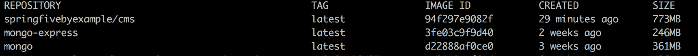

好的。镜像已准备好。让我们将其推送到 Docker Hub。

# 推送镜像到 Docker Hub

Docker Hub 是一个公共仓库，用于存储 Docker 镜像。它是免费的，我们将为此书使用它。现在，我们将把我们的镜像推送到 Docker Hub 注册表。

该命令相当简单。输入：

```java
docker push springfivebyexample/cms:latest
```

我使用了我自己创建的`springfivebyexample`用户。你可以在 Docker Hub 上用自己的用户测试`docker push`命令，并在`docker push`命令中更改用户。你可以在 Docker Hub 上创建你的 Docker ID（[`cloud.docker.com/`](https://cloud.docker.com/)）。

然后，镜像将被发送到注册表。就是这样。

我们可以在 Docker Hub 上找到该镜像（[`store.docker.com/community/images/springfivebyexample/cms`](https://store.docker.com/community/images/springfivebyexample/cms)）。如果你使用了你自己的用户，链接可能会改变。

# 配置 Docker Spring 配置文件

在我们运行 Docker 容器中的应用程序之前，我们需要创建一个 YAML 文件来配置容器配置文件。新的 YAML 文件应命名为 `application-container.yaml`，因为我们将会使用容器配置文件来运行它。记住，我们在上一节中在 `pom.xml` 上配置了 `entrypoint`。

让我们创建我们的新文件。该文件应与以下片段中描述的内容相同：

```java
spring:
  data:
    mongodb:
      database: cms
      host: mongodb
      port: 27017
```

主机必须更改以用于 MongoDB。我们在“准备 MongoDB”部分中已经使用此名称运行了 MongoDB 容器。这是一个重要的配置，我们需要在此点注意。我们不能再使用 localhost，因为应用程序现在正在 Docker 容器中运行。在这个上下文中，localhost 意味着它在同一个容器中，而 CMS 应用程序容器中没有 MongoDB。我们需要每个容器一个应用程序，避免一个容器承担多个职责。

完成。在下一节中，我们将运行我们的第一个 Docker 容器中的应用程序。这将非常棒。让我们行动起来。

# 运行 Docker 化的 CMS

在上一节中，我们已经创建了文件来正确配置容器配置文件。现在，是时候运行我们的容器了。命令相当简单，但我们需要注意参数。

我们运行的指令应该与以下代码相同：

```java
docker run -d --name cms --link mongodb:mongodb --net cms-application -p 8080:8080 springfivebyexample/cms:latest
```

我们已经设置了 MongoDB 容器的链接。记住，我们在 YAML 文件中的 `host` 属性中进行了此配置。在引导阶段，应用程序将寻找名为 `mongodb` 的 MongoDB 实例。我们通过使用链接命令解决了这个问题。它将完美工作。

我们可以使用 `docker ps` 命令来检查我们的应用程序是否健康。输出应该如下所示：


在第一行，我们有我们的应用程序容器。它已经启动并运行。

了不起的工作。我们的应用程序已经完全容器化，随时可以部署到我们想要的地方。

# 以响应式的方式实现

我们一直在使用 Spring Boot 创建一个了不起的应用程序。该应用程序是在 Spring 框架上存在的传统 Web 栈上构建的。这意味着应用程序使用基于 Servlet API 的 Web 服务器。

Servlet 规范是使用阻塞语义或每线程一个请求的模型构建的。有时，我们需要因为非功能性需求而更改应用程序架构。例如，如果应用程序被一家大公司收购，并且该公司想要为全球推出应用程序，请求量可能会大幅增加。因此，我们需要更改架构以适应云环境中的应用程序结构。

通常，在云环境中，机器的规模比传统数据中心要小。在这种情况下，人们更倾向于使用许多小机器，并尝试水平扩展应用程序。在这种情况下，可以将 servlet 规范切换到基于 Reactive Streams 的架构。这种架构比 servlet 更适合云环境。

Spring 框架一直在创建 Spring WebFlux，以帮助开发者创建反应式 Web 应用程序。让我们改变我们的应用程序架构，转向反应式，并学习 Spring WebFlux 组件的新颖之处。

# Reactive Spring

Reactive Stream Spec 是提供流处理异步编程标准的规范。如今，它在编程界越来越受欢迎，Spring 在框架中引入了它。

这种编程风格在资源使用效率上更高，并且与多核的新一代机器非常契合。

Spring reactive 使用 Project Reactor 作为 Reactive Streams 的实现。Project Reactor 由 Pivotal 支持，对 Reactive Streams Spec 的实现非常好。

现在，我们将深入探讨 Spring Boot 的反应式模块，创建一个令人惊叹的反应式 API，并尝试 Spring 框架的新风格。

# Project Reactor

Project Reactor 是由 Spring 和 Pivotal 团队创建的。这个项目是 JVM 的 Reactive Streams 实现。它是一个完全非阻塞的基础，帮助开发者创建 JVM 生态系统中的非阻塞应用程序。

在我们的应用程序中使用 Reactor 有一定的限制。项目运行在 Java 8 及以上版本。这很重要，因为我们的示例和项目中将使用许多 lambda 表达式。

Spring 框架内部使用 Project Reactor 作为 Reactive Streams 的实现。

# 组件

让我们来看看 Project Reactor 的不同组件：

+   **发布者**：发布者负责将数据元素推送到流中。它通知订阅者，有新的数据即将进入流。

    发布者接口定义在以下代码片段中：

```java
/************************************************************************
 * Licensed under Public Domain (CC0)                                    *
 *                                                                       *
 * To the extent possible under law, the person who associated CC0 with  *
 * this code has waived all copyright and related or neighboring         *
 * rights to this code.                                                  *
 *                                                                       *
 * You should have received a copy of the CC0 legalcode along with this  *
 * work. If not, see <http://creativecommons.org/publicdomain/zero/1.0/>.*
 ************************************************************************/

package org.reactivestreams;

/**
 * A {@link Publisher} is a provider of a potentially unbounded number of sequenced elements, publishing them according to
 * the demand received from its {@link Subscriber}(s).
 * <p>
 * A {@link Publisher} can serve multiple {@link Subscriber}s subscribed {@link #subscribe(Subscriber)} dynamically
 * at various points in time.
 *
 * @param <T> the type of element signaled.
 */
public interface Publisher<T> {

    public void subscribe(Subscriber<? super T> s);

}
```

+   **订阅者**：订阅者负责使数据在流中流动。当发布者开始在数据流中发送数据块时，数据块将通过 `onNext(T instance)` 方法被收集，这是一个参数化接口。

    订阅者接口定义在以下代码片段中：

```java
/************************************************************************
 * Licensed under Public Domain (CC0)                                    *
 *                                                                       *
 * To the extent possible under law, the person who associated CC0 with  *
 * this code has waived all copyright and related or neighboring         *
 * rights to this code.                                                  *
 *                                                                       *
 * You should have received a copy of the CC0 legalcode along with this  *
 * work. If not, see <http://creativecommons.org/publicdomain/zero/1.0/>.*
 ************************************************************************/

package org.reactivestreams;

/**
 * Will receive call to {@link #onSubscribe(Subscription)} once after passing an instance of {@link Subscriber} to {@link Publisher#subscribe(Subscriber)}.
 * <p>
 * No further notifications will be received until {@link Subscription#request(long)} is called.
 * <p>
 * After signaling demand:
 * <ul>
 * <li>One or more invocations of {@link #onNext(Object)} up to the maximum number defined by {@link Subscription#request(long)}</li>
 * <li>Single invocation of {@link #onError(Throwable)} or {@link Subscriber#onComplete()} which signals a terminal state after which no further events will be sent.
 * </ul>
 * <p>
 * Demand can be signaled via {@link Subscription#request(long)} whenever the {@link Subscriber} instance is capable of handling more.
 *
 * @param <T> the type of element signaled.
 */
public interface Subscriber<T> {

    public void onSubscribe(Subscription s);

    public void onNext(T t);

    public void onComplete();
}
```

# 热和冷

存在两种类型的反应式序列——热和冷。这些函数直接影响实现的使用。因此，我们需要了解它们：

+   **冷**：冷发布者只有在接收到新的订阅时才开始生成数据。如果没有订阅，数据永远不会进入流程。

+   **热**：热发布者不需要任何订阅者来生成数据流。当新订阅者注册时，订阅者将只获取新发射的数据元素。

# 反应式类型

有两种反应式类型代表反应式序列。`Mono`对象代表单个值或空 0|1。`Flux`对象代表 0|N 个项目的序列。

我们在代码中会找到许多引用。Spring Data reactive 仓库在其方法中使用这些抽象。`findOne()`方法返回`Mono<T>`对象，而`findAll()`返回一个`Flux<T>`。在我们的 REST 资源中也会找到相同的行为。

# 让我们来玩一玩 Reactor。

为了更好地理解，让我们玩一玩 Reactor。我们将实际实现并理解热发布者和冷发布者之间的区别。

**冷**发布者在新的订阅到达之前不会产生任何数据。在下面的代码中，我们将创建一个冷发布者，并且`System.out:println`永远不会被执行，因为它没有任何订阅者。让我们测试这个行为：

```java
@Test
public void coldBehavior(){
  Category sports = new Category();
  sports.setName("sports");
  Category music = new Category();
  sports.setName("music");
  Flux.just(sports,music)
      .doOnNext(System.out::println);
}
```

正如我们所见，`subscribe()`方法并不在这个片段中。当我们执行代码时，我们将在标准输出上看到任何数据。

我们可以在 IDE 中执行这个方法。我们将能够看到这个测试的输出。输出应该是这样的：

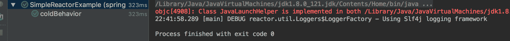

流程已经完成，测试通过，我们将无法看到打印输出。这就是冷发布者的行为。

现在，我们将订阅发布者，数据将通过数据流发送。让我们试试这个。

我们将在`doOnNext()`之后插入`subscribe`指令。让我们更改我们的代码：

```java
 @Test
  public void coldBehaviorWithSubscribe(){
    Category sports = new Category();
    sports.setId(UUID.randomUUID().toString());
    sports.setName("sports");
    Category music = new Category();
    music.setId(UUID.randomUUID().toString());
    music.setName("music");
    Flux.just(sports,music)
        .doOnNext(System.out::println)
        .subscribe();
  }
```

输出应该是这样的：

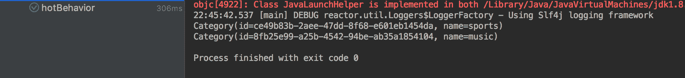

在前面的截图上，我们可以看到发布者在流被订阅后推数据到流上。这是订阅后的冷发布者行为。

热发布者不依赖于任何订阅者。即使没有订阅者接收数据，热发布者也会发布数据。让我们看看一个例子：

```java
@Test
public void testHotPublisher(){
  UnicastProcessor<String> hotSource = UnicastProcessor.create();
  Flux<Category> hotPublisher = hotSource.publish()
      .autoConnect().map((String t) -> Category.builder().name(t).build());
  hotPublisher.subscribe(category -> System.out.println("Subscriber 1: "+ category.getName()));
  hotSource.onNext("sports");
  hotSource.onNext("cars");
  hotPublisher.subscribe(category -> System.out.println("Subscriber 2: "+category.getName()));
  hotSource.onNext("games");
  hotSource.onNext("electronics");
  hotSource.onComplete();
}
```

让我们了解这里发生了什么。`UnicastProcessor`是一个只允许一个`Subscriber`的处理程序。当订阅者请求时，处理程序会重放通知。它将在流上发射一些数据。第一个订阅将捕获所有类别，正如我们将看到的，因为它是在事件发射之前注册的。第二个订阅将只捕获最后的事件，因为它是在最后两个发射之前注册的。

上述代码的输出应该是：

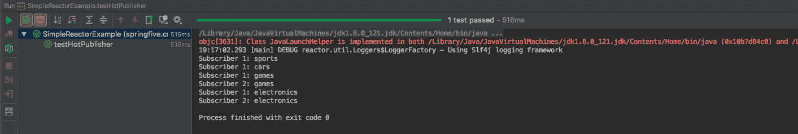

太棒了。这是热发布者的行为。

# Spring WebFlux

传统的 Java 企业级 Web 应用程序基于 servlet 规范。3.1 之前的 servlet 规范是同步的，这意味着它是用阻塞语义创建的。在当时，由于计算机体积大，拥有强大的 CPU 和数百 GB 的内存，这种模型是好的。当时的应用程序通常配置有大量的线程池，因为计算机是为这种用途设计的。当时的首要部署模型是副本。有一些机器配置和应用程序部署相同。

开发者已经多年在创建这类应用程序。

现在，大多数应用程序都部署在云服务提供商上。再也没有大机器了，因为价格要高得多。而不是大机器，有许多小机器。这要便宜得多，这些机器有合理的 CPU 功率和内存。

在这个新场景中，拥有巨大线程池的应用程序不再有效，因为机器体积小，没有足够的处理所有这些线程的能力。

Spring 团队在框架中增加了对反应式流的支持。这种编程模型改变了应用程序的部署方式和构建应用程序的方式。

与线程-per-请求模型不同，应用程序使用事件循环模型创建。这种模型需要较少的线程，并且在资源使用方面更有效。

# 事件循环模型

由 NodeJS 语言推广的这种模型基于事件驱动编程。有两个核心概念：将在队列上入队的事件，以及跟踪和处理这些事件的处理器。

采用这种模型有一些优势。第一个是排序。事件按事件到达的顺序入队和分发。在某些用例中，这是一个重要的要求。

另一个是同步。事件循环必须在单个线程上执行。这使得状态易于处理，并避免了共享状态问题。

这里有一条重要的建议。处理器不能是同步的。否则，应用程序将被阻塞，直到处理器完成其工作负载。

# Spring Data 反应式扩展

Spring Data 项目有一些扩展，可以与反应式基础一起工作。该项目提供了一些基于异步编程的实现。这意味着整个堆栈都是异步的，因为数据库驱动程序也是异步的。

Spring 反应式仓库支持 Cassandra、MongoDB 和 Redis 作为数据库存储。仓库实现提供了与非反应式实现相同的行为。有一个**DSL（领域特定语言**）用于创建特定领域的查询方法。

该模块使用 Project Reactor 作为反应式基础实现，但也可能将其实现更改为 RxJava。这两个库都是生产就绪的，并且被社区采用。需要注意的一点是，如果我们更改为 RxJava，我们需要确保我们的方法返回`Observable`和`Single`。

# Spring Data 反应式

Spring Data 项目支持反应式数据访问。到目前为止，Spring 支持 MongoDB、Apache Cassandra 和 Redis，它们都提供了反应式驱动程序。

在我们的 CMS 应用程序中，我们将使用 MongoDB 反应式驱动程序来为我们的存储库提供反应式特性。我们将使用 Spring Data 反应式提供的新反应式接口。此外，我们还需要稍微修改一下代码。在本章中，我们将一步步进行。让我们开始吧。

# 实践中的反应式存储库

在我们开始之前，我们可以在 GitHub 上查看完整的源代码，或者我们可以执行以下步骤。

现在，我们已经准备好构建我们的新反应式存储库。我们需要做的第一件事是将 Maven 依赖项添加到我们的项目中。这可以通过`pom.xml`来完成。

让我们配置我们的新依赖项：

```java
<dependency>
  <groupId>org.springframework.boot</groupId>
  <artifactId>spring-boot-starter-data-mongodb-reactive</artifactId>
</dependency>
```

我们的项目现在可以使用反应式 MongoDB 存储库了。

# 创建第一个反应式存储库

在我们的 CMS 项目中，我们有一些存储库。现在，我们需要将这些存储库转换为反应式存储库。我们将要做的第一件事是从`CrudRepository`中移除扩展，因为现在不再需要它了。现在，我们想要那个反应式的版本。

我们将更新`ReactiveMongoRepository`接口。接口的参数与之前插入的相同。接口应该是这样的：

```java
package springfive.cms.domain.repository;

import org.springframework.data.mongodb.repository.ReactiveMongoRepository;
import springfive.cms.domain.models.Category;

public interface CategoryRepository extends ReactiveMongoRepository<Category,String> {
}
```

这与我们之前创建的相当相似。我们需要扩展新的`ReactiveMongoRepository`接口，该接口包含 CRUD 操作和其他许多方法。该接口返回`Mono<Category>`或`Flux<Category>`。方法不再返回实体。当采用反应式流时，这是一种常见的编程方式。

我们还需要修改其他存储库。您可以在 GitHub 上找到完整的源代码：[`github.com/PacktPublishing/Spring-5.0-By-Example/tree/master/Chapter03/cms-mongodb/src/main/java/springfive/cms/domain/repository`](https://github.com/PacktPublishing/Spring-5.0-By-Example/tree/master/Chapter03/cms-mongodb/src/main/java/springfive/cms/domain/repository)。

现在，我们需要修改服务层。让我们来做这件事。

# 修复服务层

我们需要将服务层修改为采用新的反应式编程风格。我们已经修改了存储库层，因此现在我们需要修复由于这种更改而产生的编译问题。应用程序需要是反应式的。应用程序的任何一点都可能因为我们在使用事件循环模型而被阻塞。如果我们不这样做，应用程序将会被阻塞。

# 修改 CategoryService

现在，我们将修复 `CategoryService` 类。我们将更改几个方法的返回类型。之前，我们可以返回模型类，但现在我们需要改为返回 `Mono` 或 `Flux`，类似于我们在存储库层所做的那样。

新的 `CategoryService` 应该像以下代码片段中所示的实现一样：

```java
package springfive.cms.domain.service;

import org.springframework.stereotype.Service;
import reactor.core.publisher.Flux;
import reactor.core.publisher.Mono;
import springfive.cms.domain.models.Category;
import springfive.cms.domain.repository.CategoryRepository;
import springfive.cms.domain.vo.CategoryRequest;

@Service
public class CategoryService {

  private final CategoryRepository categoryRepository;

  public CategoryService(CategoryRepository categoryRepository) {
    this.categoryRepository = categoryRepository;
  }

  public Mono<Category> update(String id,CategoryRequest category){
    return this.categoryRepository.findById(id).flatMap(categoryDatabase -> {
      categoryDatabase.setName(category.getName());
      return this.categoryRepository.save(categoryDatabase);
    });
  }

  public Mono<Category> create(CategoryRequest request){
    Category category = new Category();
    category.setName(request.getName());
    return this.categoryRepository.save(category);
  }

  public void delete(String id){
    this.categoryRepository.deleteById(id);
  }

  public Flux<Category> findAll(){
    return this.categoryRepository.findAll();
  }

  public Mono<Category> findOne(String id){
    return this.categoryRepository.findById(id);
  }

}
```

如我们所见，方法的返回类型已经更改。

这里重要的是我们需要遵循反应式原则。当方法只返回一个实例时，我们需要使用 `Mono<Category>`。当方法返回一个或多个实例时，我们应该使用 `Flux<Category>`。这是非常重要的，因为这样开发者以及 Spring 容器才能正确地解释代码。

`update()` 方法有一个有趣的调用：`flatMap()`。项目 Reactor 允许我们使用一种 DSL 来组合调用。这非常有趣，也非常有用。它帮助开发者创建比以前更容易理解的代码。`flatMap()` 方法通常用于转换 `Mono` 或 `Flux` 发出的数据。在这个上下文中，我们需要将数据库检索到的分类的新名称设置为分类的新名称。

# 更改 REST 层

我们还将对 REST 层进行一些修复。我们更改了服务层，这导致我们的资源类中出现了一些编译问题。

我们需要添加新的依赖项 `spring-web-reactive`。这个依赖支持 `@Controller` 或 `@RestController` 注解用于反应式非阻塞引擎。Spring MVC 不支持反应式扩展，这个模块使得开发者能够使用与之前相同的反应式范式。

`spring-web-reactive` 将更改 Spring MVC 基础设施上的许多合约，例如 `HandlerMapping` 和 `HandlerAdapter`，以在这些组件上启用反应式基础。

以下图像可以帮助我们更好地理解 Spring HTTP 层：

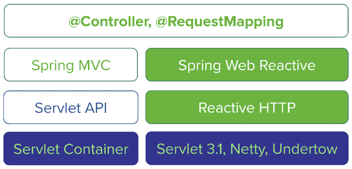

如我们所见，`@Controller` 和 `@RequestMapping` 可以在 Spring MVC 传统应用程序中使用不同的方法，或者通过使用 Spring WebReactive 模块。

在我们开始更改我们的 REST 层之前，我们需要从我们的项目中移除 Spring Fox 依赖项和注解。目前，Spring Fox 还不支持反应式应用程序。

需要移除的依赖项包括：

```java
<dependency>
  <groupId>io.springfox</groupId>
  <artifactId>springfox-swagger2</artifactId>
  <version>2.7.0</version>
</dependency>

<dependency>
  <groupId>io.springfox</groupId>
  <artifactId>springfox-swagger-ui</artifactId>

  <version>2.7.0</version>
</dependency>
```

之后，我们需要从 Swagger 包中移除注释，例如 `@Api` 和 `@ApiOperation`。

现在，让我们调整我们的 REST 层。

# 添加 Spring WebFlux 依赖项

在我们开始更改我们的 REST 层之前，我们需要将新的依赖项添加到我们的 `pom.xml` 文件中。

首先，我们将移除 Spring MVC 传统依赖项。为此，我们需要移除以下依赖项：

```java
<dependency>
  <groupId>org.springframework.boot</groupId>
  <artifactId>spring-boot-starter-web</artifactId>
</dependency>
```

我们不再需要这个依赖项了。我们的应用程序现在将是反应式的。然后，我们需要添加以下代码片段中描述的新依赖项：

```java
<dependency>
  <groupId>io.netty</groupId>
  <artifactId>netty-transport-native-epoll</artifactId>
</dependency>

<dependency>
  <groupId>org.springframework.boot</groupId>
  <artifactId>spring-boot-starter-webflux</artifactId>
</dependency>
```

`spring-boot-starter-webflux` 是一种依赖项的语法糖。它包含了 `spring-boot-starter-reactor-netty` 依赖项，即 Reactor Netty，它是内嵌在响应式 HTTP 服务器中的。

太棒了，我们的项目已经准备好将 REST 层转换为响应式应用。让我们将我们的应用程序转换为一个完全响应式的应用程序。

# 修改分类资源

我们将修改 `CategoryResource` 类。这个想法很简单。我们将使用 `Mono` 或 `Flux` 将我们的 `ResponseEntity`（使用模型类参数化）转换为 `ResponseEntity`。

新版本的 `CategoryResource` 应该是这样的：

```java
package springfive.cms.domain.resources;

import org.springframework.http.HttpStatus;
import org.springframework.http.ResponseEntity;
import org.springframework.web.bind.annotation.DeleteMapping;
import org.springframework.web.bind.annotation.GetMapping;
import org.springframework.web.bind.annotation.PathVariable;
import org.springframework.web.bind.annotation.PostMapping;
import org.springframework.web.bind.annotation.PutMapping;
import org.springframework.web.bind.annotation.RequestBody;
import org.springframework.web.bind.annotation.RequestMapping;
import org.springframework.web.bind.annotation.ResponseStatus;
import org.springframework.web.bind.annotation.RestController;
import reactor.core.publisher.Flux;
import reactor.core.publisher.Mono;
import springfive.cms.domain.models.Category;
import springfive.cms.domain.service.CategoryService;
import springfive.cms.domain.vo.CategoryRequest;

@RestController
@RequestMapping("/api/category")
public class CategoryResource {

  private final CategoryService categoryService;

  public CategoryResource(CategoryService categoryService) {
    this.categoryService = categoryService;
  }

  @GetMapping(value = "/{id}")
  public ResponseEntity<Mono<Category>> findOne(@PathVariable("id") String id){
    return ResponseEntity.ok(this.categoryService.findOne(id));
  }

  @GetMapping
  public ResponseEntity<Flux<Category>> findAll(){
    return ResponseEntity.ok(this.categoryService.findAll());
  }

  @PostMapping
  public ResponseEntity<Mono<Category>> newCategory(@RequestBody CategoryRequest category){
    return new ResponseEntity<>(this.categoryService.create(category), HttpStatus.CREATED);
  }

  @DeleteMapping("/{id}")
  @ResponseStatus(HttpStatus.NO_CONTENT)
  public void removeCategory(@PathVariable("id") String id){
    this.categoryService.delete(id);
  }

  @PutMapping("/{id}")
  public ResponseEntity<Mono<Category>> updateCategory(@PathVariable("id") String id,CategoryRequest category){
    return new ResponseEntity<>(this.categoryService.update(id,category), HttpStatus.OK);
  }

}
```

代码与我们之前所做的是相当相似的。我们在方法参数中使用了 `@RequestBody` 注解；否则，JSON 转换器将无法工作。

这里另一个重要的特性是 `return` 方法。它返回 `Mono` 或 `Flux`，这是 `ResponseEntity` 的参数化类型。

我们可以通过使用命令行来测试响应式实现。它将在 MongoDB 上持久化 `Category` 对象。在终端中输入以下命令：

```java
curl -H "Content-Type: application/json" -X POST -d '{"name":"reactive"}' http://localhost:8080/api/category
```

然后，我们可以使用以下命令来检查数据库。使用浏览器，访问 `http://localhost:8080/api/category`。以下结果应该会显示：

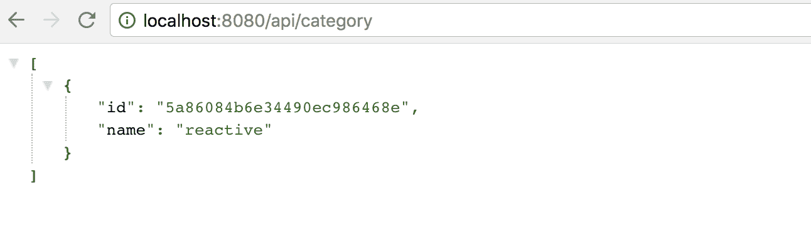

太棒了，我们的响应式实现按预期工作。做得好！！！

# 摘要

在本章中，我们学习了大量的 Spring 概念。我们向您介绍了 Spring Data 项目，这些项目帮助开发者创建我们以前从未见过的数据访问层。我们看到了使用这个项目创建仓库是多么容易。

此外，我们还介绍了一些相对较新的项目，例如 Spring WebFlux，它允许开发者创建现代网络应用程序，在项目中应用响应式流和响应式编程风格。

我们已经完成了我们的 CMS 应用程序。该应用程序具有生产就绪应用程序的特征，如数据库连接，以及具有单一职责的良好设计的服务。我们还引入了 `docker-maven-plugin`，它提供了一个使用 `pom.xml` 配置创建镜像的合理方式。

在下一章中，我们将创建一个新的应用程序，基于基于消息驱动的应用程序的 *Reactive Manifesto*。在那里见。
