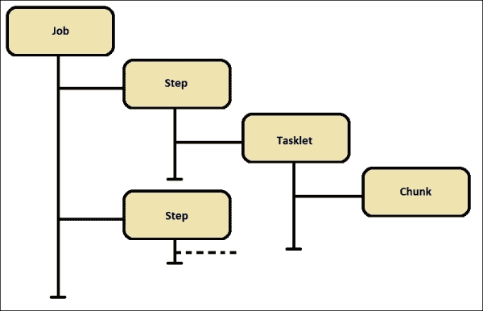
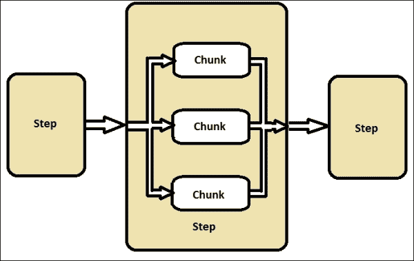
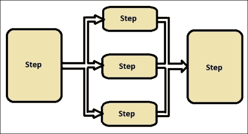
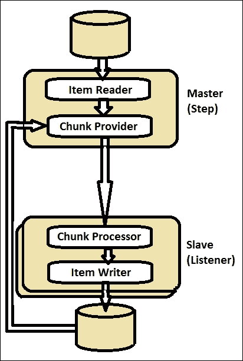
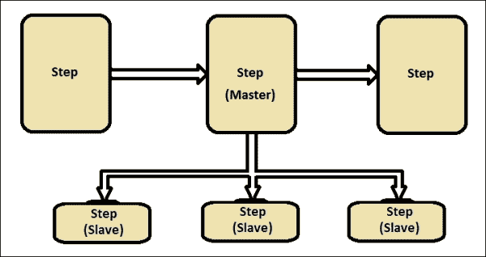
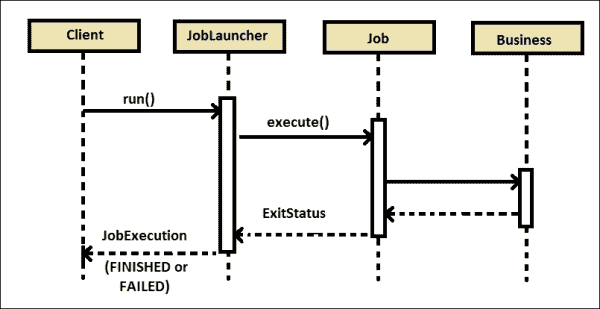
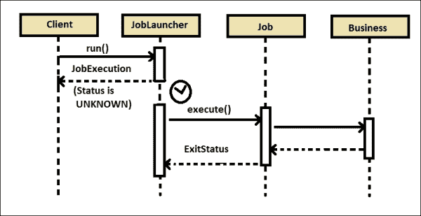

# 第二章 使用 Spring Batch 作业入门

在上一章中，我们学习了批量应用程序、Spring Batch 的提供和架构，以及如何构建 Spring Batch 应用程序以运行批量作业。理解框架及其组件的细节对于能够有效地为业务需求配置它们非常重要。基于 XML 和注解的配置使 Spring Batch 的编程更加高效和灵活。

一些应用程序期望配置能够灵活适应它们遵循的编程风格。不同的程序需要以不同的方式触发批量作业，包括命令行和调度程序，或者程序本身的一部分。如果需要，优雅地停止执行批量作业也很重要。

在本章中，我们将涵盖以下主题：

+   Spring Batch XML 功能

+   配置作业、事务和存储库

+   EL 和监听器

+   从命令行和 Web 应用程序执行作业

+   调度程序

# Spring Batch XML 功能

Spring Batch XML 配置是 Spring Batch 编程最重要的方面。Spring Batch 有独特的 XML 术语和命名空间。理解这些术语并使用正确的实体集有助于构建高效的批量应用程序。

## Spring Batch XML 命名空间

Spring Batch 有专门的 XML 命名空间支持，以提供舒适的配置。Spring XML 应用程序上下文文件需要以下声明来激活命名空间：

```java
<beans xmlns:batch="http://www.springframework.org/schema/batch"

xsi:schemaLocation="http://www.springframework.org/schema/beans 
http://www.springframework.org/schema/beans/spring-beans-3.0.xsd 
http://www.springframework.org/schema/batch 
http://www.springframework.org/schema/batch/spring-batch-3.0.xsd">

<batch:job id="readDetailsJob"> 
... 
</batch:job>

</beans>
```

命名空间配置提供了可以在上下文文件中配置详细信息的前缀。在先前的示例中，我们使用 `batch` 作为配置作业的前缀。前缀是仅针对本文件的标识符。可以为命名空间配置使用任何有效的名称作为前缀。如果配置了任何没有前缀的命名空间，则被视为默认命名空间，并且应该配置没有前缀的元素以使用默认前缀。在上一章中，我们配置了 `batch` 作为默认前缀，因此我们直接配置了作业和步骤。

## Spring Batch XML 标签

Spring Batch XML 配置定义了批量作业的流程。以下是一些重要的 Spring Batch 标签及其描述：

+   `job`：这定义了一个由一系列步骤和步骤之间的转换组成的作业。该作业将在封装的 bean 工厂中作为类型为 `Job` 的组件公开，可以使用 `JobLauncher` 启动。

+   `step`：这定义了一个由步骤支持的作业处理阶段。

+   `tasklet`：这声明了任务策略（步骤中的处理策略）的实现。可以通过配置一个块或通过配置对 `Tasklet` 接口的引用来实现。

+   `chunk`：这声明拥有步骤将执行面向数据块的处理（一次读取数据并创建要写入的组），委托定义数据块的内容，并配置面向数据块的组件。

+   `job-repository`：使用关系数据存储配置`JobRepository`（负责持久化批处理元数据实体的存储库）。它由其他组件（如`job`和`step`实现）需要。

+   `flow`：这定义了一个由一系列步骤和步骤之间的转换组成的流程。

# 配置作业、事务和存储库

如前所述，我们可以通过 XML 配置本身方便地配置 Spring Batch 作业。**作业**是配置中的主要元素，以下图显示了配置中组件的层次结构：



每个工作可以包含多个步骤，每个步骤包含任务单元，每个任务单元包含数据块。每个组件都有定义为其子元素的独立元素。以下是一个此类批量作业的语法：

```java
<beans xmlns:batch ... >
<batch:job id="jobId">
  <batch:step id="stepId">
    <batch:tasklet ref="beanReference">
      <batch:chunk reader="dataReader" 
        processor="dataProcessor" 
        writer="dataWriter" commit-interval="500" />
    </batch:tasklet>
  </batch:step>
  <batch:step>
  ...
  </batch:step>
</batch:job>
</beans>
```

## 作业配置

作业是批处理应用程序配置中的根元素。作业定义了要执行的批处理作业，包括作业存储库的配置以及是否可重启等属性。以下为`job`元素的属性：

+   `id`：这是`job`元素的唯一标识符。

+   `abstract`：这用于配置作业是否为抽象的，也就是说，它本身不打算被实例化，而是作为具体子作业定义的父级。默认情况下为`false`。

+   `increment`：这是对`JobParametersIncrementer` bean 定义的引用。这将通过修改前一组参数以使其适用于新的运行作为`next`实例来提供一组新参数。

+   `job-repository`：这是要使用的`JobRepository`的 bean 名称。此属性不是必需的，默认为`jobRepository` bean。

+   `parent`：这是要继承的父作业的名称。

+   `restartable`：这定义了在失败的情况下作业是否应该可重启。如果作业不应该重启，请将此设置为`false`。默认情况下为`true`。

可以将类型为`DefaultJobParametersValidator`的验证器配置为作业配置的一部分，以验证简单和可选参数。以下是一个此类配置的片段：

```java
<beans xmlns:batch ... >
<batch:job id="jobId">
  <batch:step id="stepId">
    ...
  </batch:step>
  <batch:validator ref="validatorId"/>
</batch:job>

<bean id="validatorId" class="beans.JobParametersValidator">
  <property name="Keys">
    <set>
      <value>keyValues</value>
    </set>
  </property>
</bean>
</beans>
```

对于复杂的约束，也可以实现`validator`接口。

## 步骤配置

步骤是作业的第一个子元素。作业可以包含多个步骤。以下是在配置多个步骤的不同方法：

+   **多线程步骤（单进程）**：Spring Batch 允许您将工作块并行执行作为单个进程的一部分。当有大量数据需要在线程中处理时，每个工作块处理一组记录。

    启动并行处理的最简单方法是向步骤配置中添加`taskExecutor`作为任务 let 的属性。

    ```java
    <step id="loading">
      <tasklet task-executor="taskExecutor">...</tasklet>
    </step>
    ```

+   **并行步骤（单进程）**：这是在单个进程中处理多个步骤的机制。

    以下是为配置并行步骤的代码片段：

    ```java
    <job id="jobId">
      <split id="splitId" task-executor="taskExecutor"
        next="step3">
        <flow>
          <step id="step1" next="step2"/>
          <step id="step2"/>
        </flow>
      </split>
      <step id="step3"/>
    </job>
    <beans:bean id="taskExecutor" class="TaskExecutor"/>
    ```

+   **步骤的远程分块（多进程）**：这将在多个进程中分割步骤处理，通过中间件相互通信。Spring Batch 的一个步骤作为主步骤，相应中间件的监听器作为奴隶步骤。当主组件作为一个单独的进程运行时，奴隶是多个远程进程。

+   **步骤分区（单进程或多进程）**：分区是将一个步骤配置为具有子步骤的过程。超级步骤是主步骤，子步骤是奴隶步骤。奴隶步骤必须完成执行才能将主步骤视为完成。

以下步骤元素的属性：

+   `id`：这是`step`元素的唯一标识符

+   `next`：这是一个指定当前步骤之后要执行的下一个步骤的快捷方式

+   `parent`：这是父步骤的名称，作业应从中继承

+   `allow-start-if-complete`：设置为`true`以允许在步骤已完成的情况下启动步骤

以下是一个示例步骤配置：

```java
<step id="firstBatchStepOne"> 
  <tasklet ref="firstBatch"/> 
</step> 
<job id="firstBatchJob"> 
  <step id="stepOne" parent="firstBatchStepOne"/> 
</job>
<bean id="firstBatch" class="FirstBatch"/>
```

## Tasklet 配置

Tasklet 是步骤元素的子元素，可以用来指定作为步骤一部分的可重复和事务性的步骤过程。

以下`tasklet`元素的属性：

+   `ref`：这是对实现`Tasklet`接口的 bean 定义的引用。

+   `allow-start-if-complete`：设置为`true`以允许在步骤已完成的情况下启动步骤。

+   `method`：这是任务 let 执行的指定方法。

+   `start-limit`：这是步骤可能启动的最大次数。

+   `task-executor`：任务执行器负责执行任务。

+   `throttle-limit`：这是可以排队进行并发处理的任务的最大数量，以防止线程池过载。默认值为`4`。

+   `transaction-manager`：这是将要使用的交易管理器的 bean 名称。默认为`transactionManager`，如果未指定。

以下是一个带有任务 let 的示例作业配置：

```java
<step id="firstBatchStepOne"> 
  <tasklet ref="firstBatch" start-limit="6">
  ...
  </tasklet> 
</step> 
<job id="firstBatchJob"> 
  <step id="stepOne" parent="firstBatchStepOne"/> 
</job>
<bean id="firstBatch" class="FirstBatch"/>
```

## 块配置

块是 tasklet 的子元素，可用于执行读写处理。与其它元素的配置相比，块配置涉及更多的数据 Bean。

以下为块元素的属性：

+   `reader`：这是用于过程并实现`ItemReader`接口的项目读取器的 Bean 名称。

+   `processor`：这是用于过程并实现`ItemProcessor`接口的项目处理器的 Bean 名称。

+   `writer`：这是用于过程并实现`ItemWriter`接口的项目写入器的 Bean 名称。

+   `cache-capacity`：这是重试策略中缓存的容量。

+   `chunk-completion-policy`：当此策略决定完成时，将提交事务。默认为`SimpleCompletionPolicy`，块大小等于`commit-interval`属性。

+   `commit-interval`：在调用`commit`进行事务提交之前将要处理的项目数量。设置此属性或`chunk-completion-policy`属性，但不能同时设置两者。

+   `processor-transactional`：这决定了处理器是否具有事务感知性。

+   `reader-transactional-queue`：这决定了读取器是否是事务队列。

+   `retry-limit`：这是处理项目重试的最大次数。

+   `retry-policy`：这是重试策略的 Bean 规范。如果指定，则忽略`retry-limit`和`retryable`异常。

+   `skip-limit`：这是允许跳过的最大项目数量。

+   `skip-policy`：这是跳过策略的 Bean 规范。如果指定，则忽略`skip-limit`和`skippable`异常。

以下是一个带有 tasklet 块的示例作业配置：

```java
<step id="firstBatchStepOne"> 
  <tasklet ref="firstBatch">
    <chunk reader="itemReader" processor="itemProcessor" writer="itermWriter" commit-interval="150"/>
  </tasklet> 
</step> 
<job id="firstBatchJob"> 
  <step id="stepOne" parent="firstBatchStepOne"/> 
</job>
<bean id="firstBatch" class="FirstBatch"/>
<bean id="itemReader" class="ItemReader"/>
<bean id="itemProcessor" class="ItemProcessor"/>
<bean id="itemWriter" class="ItemProcessor"/>
```

块配置可以添加异常跳过和重试元素作为其子组件。跳过和重试配置的`skippable-exception-classes`和`retryable-exception-classes`元素。Bean 配置也可以注解以简化 Spring Batch 配置。

## 事务配置

事务配置是 Spring Batch 的关键方面之一。Spring 事务管理器是事务的配置。Spring 为不同的规范提供不同的事务管理器；对于 JDBC 是`DataSourceTransactionManager`，对于 JPA 是`JpaTransactionManager`。

Spring Batch 允许我们将`transaction-attributes`元素配置为块子元素，以设置事务的隔离和传播级别。

可以选择不需要执行回滚操作异常。这些异常可以通过将`include`元素作为`no-rollback-exception-classes`元素的子元素进行配置，而`no-rollback-exception-classes`元素是 tasklet 的子元素。

以下是一个带有事务管理器的示例作业配置：

```java
<step id="firstBatchStepOne"> 
  <tasklet ref="firstBatch" transaction-manager="transactionManager">
  ...
  </tasklet> 
</step> 
<job id="firstBatchJob"> 
  <step id="stepOne" parent="firstBatchStepOne"/> 
</job>
<bean id="firstBatch" class="FirstBatch"/>
<bean id="transactionManager" class="org.springframework.jdbc.datasource.DataSourceTransactionManager">
  <property name="dataSource" ref="DataSource"/>
</bean>
```

## 任务存储库配置

作业存储库维护与作业执行相关的信息。它还维护批处理作业的状态。Spring Batch 提供了两种类型的作业存储库：内存存储库和持久存储库。

**内存存储库**允许作业针对相同的作业配置和参数多次运行。内存存储库是易变的，因此不允许在 JVM 实例之间重启。它也不能保证具有相同参数的两个作业实例将并发启动，因此不适合多线程作业或本地分区步骤。它可以使用`MapJobRepositoryFactoryBean`进行配置。

它需要事务管理器在存储库中进行回滚语义处理，并处理在事务数据库中定义的业务逻辑。

以下是一个示例内存存储库配置：

```java
<bean id="jobRepository" class="org.springframework.batch.core.repository.support.MapJobRepositoryFactoryBean">
  <property name="transactionManager-ref" 
    ref="transactionManager"/>
</bean>
<bean id="transactionManager"
class="org.springframework.batch.support.transaction.ResourcelessTransactionManager"/>
<job id="deductionsJob" job-repository="jobRepository">
...
</job>
```

**持久** **存储库**可以使用`job-repository`元素进行配置，以在数据库上执行持久数据库操作。数据源可以使用任何 API 进行配置，例如，我们在以下配置中使用了 Apache Commons `BasicDataSource`。

以下是一个示例持久存储库配置：

```java
<bean id="dataSource" class="org.apache.commons.dbcp.BasicDataSource"> 
  <property name="driverClassName" value="${batch.jdbc.driver}" /> 
  <property name="url" value="${batch.jdbc.url}" /> 
  <property name="username" value="${batch.jdbc.user}" /> 
  <property name="password" value="${batch.jdbc.password}" /> 
</bean> 
<bean id="transactionManager" class="org.springframework.jdbc.datasource.DataSourceTransactionManager" lazy-init="true"> 
  <property name="dataSource" ref="dataSource" /> 
</bean> 
<job-repository id="jobRepository" data-source="dataSource" 
transaction-manager="transactionManager"/>
```

# EL 和监听器

从版本 3 开始，Spring Batch 提供了一项有趣的功能：**表达式语言**（**EL**）。**Spring 表达式语言**（**SpEL**）允许我们在运行时从执行上下文中捕获值，从而使 XML 配置动态化。SpEL 可以从属性和 bean 中解析表达式。这种运行时捕获行为允许作业访问延迟绑定的配置。

以下是一个示例 SpEL 配置：

```java
<bean id="processBean" class="JobProcessBean" scope="step"> 
  <property name="name" value="#{jobParameters[name]}"/> 
</bean>
```

## 监听器

Spring Batch 可以通过监听器识别一组附加事件。监听器可以组合使用，以识别不同级别的事件。以下是由 Spring Batch 为批处理提供的各种监听器类型。

+   作业监听器：它们识别作业级别的事件

+   步骤监听器：它们识别步骤级别的事件

+   项目监听器：它们识别项目重复和重试事件

## 作业监听器

作业监听器识别作业级别发生的事件。可以通过以下方式配置作业监听器：

+   **实现 JobExecutionListener**: 以下是一个使用`JobExecutionListener`实现的示例监听器配置：

    ```java
    import org.springframework.batch.core.JobExecution; 
    import org.springframework.batch.core.JobExecutionListener; 
    public class JobStatusListener implements JobExecutionListener {
    public void beforeJob(JobExecution jobExecution) { 
      System.out.println("Job: " + 
      jobExecution.getJobInstance().getJobName() + " is beginning"); 
    } 
    public void afterJob(JobExecution jobExecution) { 
      System.out.println("Job: " + jobExecution.getJobInstance(). 
      getJobName() + " has completed");
      System.out.println("The Job Execution status is: " + 
      jobExecution.getStatus()); 
    }
    }
    ```

    以下是对先前定义的监听器的 XML 配置：

    ```java
    <job id="employeeDeductionsJob">
      <listeners>
        <listener ref="jobStatusListener"/>
      </listeners>
    </job>
    ```

+   **使用注解**: 以下是一个使用注解的示例监听器配置：

    ```java
    import org.springframework.batch.core.JobExecution; 
    import org.springframework.batch.core.JobExecutionListener;
    import org.springframework.batch.core.annotation.AfterJob;
    import org.springframework.batch.core.annotation.BeforeJob; 
    public class JobStatusListener { 
    @BeforeJob 
    public void beforeJob(JobExecution jobExecution) { 
      System.out.println("Job: " + 
      jobExecution.getJobInstance().getJobName() + " is 
      beginning");
    } 
    @AfterJob 
    public void afterJob(JobExecution jobExecution) { 
      System.out.println("Job: " + jobExecution.getJobInstance().getJobName() + " has completed");
      System.out.println("The Job Execution status is: " + 
      jobExecution.getStatus());  
    }
    }
    ```

配置注解监听器的方式与`JobExecutionListener`配置相同。

## 步骤监听器

就像作业监听器捕获作业的执行状态一样，步骤也有特定的监听器来捕获不同的事件。实现这一组监听器的方式与作业监听器相同（通过实现相应的接口或使用注解），只是监听器元素必须配置为`step`元素的子元素。

以下是一个带有覆盖方法的步骤监听器列表：

+   `StepExecutionListener`：该监听器分别使用`beforeStep`和`afterStep`方法来识别步骤执行事件的前后情况。

+   `ChunkListener`：该监听器分别使用`beforeChunk`和`afterChunk`方法来识别块执行事件的前后情况。

+   `ItemReadListener`：该监听器分别使用`beforeRead`、`afterRead`和`onReadError`方法来识别读取前后项的情况，以及在发生异常时读取项事件。

+   `ItemProcessListener`：该监听器分别使用`beforeProcess`、`afterProcess`和`onProcessError`方法来识别`ItemProcessor`获取项目前后的状态，以及处理器抛出异常时的情况。

+   `ItemWriteListener`：该监听器分别使用`beforeWrite`、`afterWrite`和`onWriteError`方法来识别写入项的前后情况，以及在发生异常时写入项事件。

+   `SkipListener`：该监听器分别使用`onSkipInRead`、`onSkipInProcess`和`onSkipInWrite`方法来识别读取、处理或写入项目的跳过事件。

## 项监听器

项监听器识别重试和重复事件。这些监听器可以像作业或步骤监听器一样进行配置。

以下是一个带有覆盖方法的项监听器列表：

+   `RepeatListener`：该监听器分别使用`before`和`after`方法来识别每个重复事件的前后情况。它分别使用`open`和`close`方法来识别第一次和最后一次重复事件。它还使用`onError`方法来识别每次失败事件。

+   `RetryListener`：该监听器分别使用`open`和`close`方法来识别第一次和最后一次尝试事件，无论重试是成功还是失败。它还使用`onError`方法来识别每次失败事件。

# 从命令行和 Web 应用程序执行作业

在第一章中，我们学习了如何使用 Spring Batch 配置和运行一个简单的批处理作业应用程序，通过从 Java 程序中启动作业来实现。Spring Batch 的基于 Java 的 API 通过不同的方式调用批处理作业，使得作业启动变得非常方便。在本节中，让我们探讨以不同方式启动批处理作业的概念，以及优雅地停止批处理作业。

## 作业启动器

Spring Batch 通过`JobLauncher`使启动批处理工作变得更容易。`JobLauncher`代表一个简单的接口，用于使用给定的一组工作参数启动工作。`JobLauncher`的运行方法接受类型为 Spring bean 的`Job`和`JobParameters`作为参数，并调用批处理工作执行。

以下是我们之前章节中使用`JobLauncher`启动工作的代码片段：

```java
String[] springConfig  = {"batch/firstBatch.xml"};
context = new ClassPathXmlApplicationContext(springConfig);
JobLauncher jobLauncher = (JobLauncher) context.getBean("jobLauncher");
Job job = (Job) context.getBean("firstBatchJob");
JobExecution execution = jobLauncher.run(job, new JobParameters());
System.out.println("Exit Status : " + execution.getStatus());
```

我们可以使用`JobParametersBuilder`来构建不同类型的`JobParameter`。可以通过以下语法配置带有持久化工作存储库的`JobLauncher`：

```java
<bean id="jobLauncher"
class="org.springframework.batch.core.launch.support.SimpleJobLauncher">
  <property name="jobRepository" ref="jobRepository"/>
</bean>
```



从`JobLauncher`的`run`方法启动一个工作将调用`job`的`execute`方法，并在执行后确认工作执行状态（`FINISHED`或`FAILED`），这是一个同步过程。

然而，在特定的业务场景中，我们希望`JobLauncher`调用并将流程转交给另一个控制器以使其异步，这样就可以触发多个流程。如果与`JobLauncher`一起配置，`TaskExecutor`有助于这种情况。



以下是将`SimpleJobLauncher`与`taskExecutor`配置以使流程异步的语法：

```java
<bean id="jobLauncher"
class="org.springframework.batch.core.launch.support.SimpleJobLauncher">
<property name="jobRepository" ref="jobRepository"/>
<property name="taskExecutor">
<bean class="org.springframework.core.task.SimpleAsyncTaskExecutor"/>
</property>
</bean>
```

## 从命令行启动工作

`CommandLineJobRunner`使得从命令行启动 Spring Batch 工作变得简单。以下是`CommandLineJobRunner`工作的步骤：

+   加载适当的`ApplicationContext`

+   将命令行参数解析为`JobParameters`

+   根据参数定位适当的工作

+   使用应用程序上下文中提供的`JobLauncher`来启动工作

以下是用`CommandLineJobRunner`启动工作的命令：

```java
> java -classpath "/lib/*" org.springframework.batch.core.launch.support.CommandLineJobRunner firstBatch.xml firstBatchJob schedule.date(date)=2007/05/05

```

工作执行退出代码表示运行后批处理工作的状态，其中`0`表示`COMPLETED`，`1`表示`FAILED`，`2`表示来自命令行工作运行器的错误，例如在提供的上下文中找不到工作。

## 在 Web 应用程序内部启动工作

到目前为止，我们已经学习了如何从 Java 程序和命令行启动批处理工作。在某些情况下，需要从 Web 应用程序内部启动工作。从应用程序内部生成报告并从具有基于线程的配置的应用程序中触发异步流程的应用程序是这类业务场景。

以下是用 Spring MVC 框架和 Spring 依赖项启动工作的程序：

```java
@Controller
public class JobLauncherController {
@Autowired
JobLauncher jobLauncher;
@Autowired
Job job;
@RequestMapping("/jobLauncher.html")
public void handle() throws Exception {
  jobLauncher.run(job, new JobParameters());
}
}
```

控制器通过在`JobLauncherController`中配置自动装配的`JobController`来启动工作。控制器可以通过配置了`handle`方法的`RequestMapping`从请求 URL 中调用。

## 优雅地停止批处理工作

在必要时，可以通过`JobOperator`接口从程序内部优雅地停止工作。`JobOperator`提供了工作的 CRUD 操作。

下面的语法是使用`JobOperator`停止作业的语法：

```java
Set<Long> executions =jobOperator.getRunningExecutions("jobName");
If( executions.iterator().hasNext()) {
jobOperator.stop(executions.iterator().next());
}
```

`JobOperator`使用给定的`jobName`识别正在运行的作业，并通过从执行中获取作业`id`来调用`stop`方法。

`JobOperator`需要配置为程序可用。以下是对`jobOperator`的示例配置，包括资源、作业探索器（浏览正在运行或历史作业和步骤的入口点）、注册表和存储库属性。

```java
<bean id="jobOperator" class="org.springframework.batch.core.launch.support. SimpleJobOperator">
<property name="jobExplorer">
<bean class=" org.springframework.batch.core.explore.support. JobExplorerFactoryBean">
<property name="dataSource" ref="dataSource"/>
</bean>
</property>
<property name="jobRepository" ref="jobRepository"/>
<property name="jobRegistry" ref="jobRegistry"/>
<property name="jobLauncher" ref="jobLauncher"/>
</bean>
```

作业配置支持在任务和以块为导向的步骤级别进行停止设置。

# 调度器

调度器是可以定期启动其他程序的程序。如前所述，Spring Batch 不是一个调度框架。Spring Batch 可以与调度器（如 Quartz/Control-M）协同工作，但不能替代调度器。

以下是一些流行的调度器：

+   **Cron**: 这是一个基于表达式的作业调度器，可在类 Unix 系统中启动其他程序

+   **Control-M**: 这是一个适用于分布式计算平台（包括 Unix、Windows、Linux 和 OpenVMS 环境）的批处理调度软件

+   **Spring 调度器**: 这个来自 Spring 的调度器支持 XML、基于注解或 cron 表达式来启动批处理作业

+   **石英（Quartz）**: 石英是一个功能丰富的开源作业调度库，可以集成到几乎任何 Java 应用程序中

虽然`CommandLineJobRunner`可以用于 Cron 和 Control-M 启动批处理作业，但 Quartz 和 Spring 调度器可以从应用程序内部以编程方式启动批处理作业。可以根据作业执行的频率和调用方式选择这些选项之一。

# 摘要

在本章中，我们学习了 Spring Batch 作业及其组件的配置细节，以便能够有效地满足业务需求。我们学习了如何通过基于 XML 和注解的配置使批处理编程更加高效和灵活。我们还学习了不同的启动批处理作业的方式，例如从命令行、Java 程序以及 Web 应用程序中启动，以及如何在程序内部优雅地停止批处理作业。我们通过了解市场上可用的不同作业调度器和哪些启动解决方案可以与这些调度器结合使用来完成本章。

在下一章中，我们将详细了解使用 Spring Batch 读取、处理和写入不同形式的数据。
