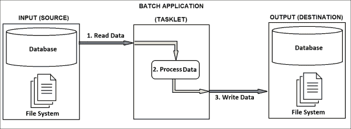
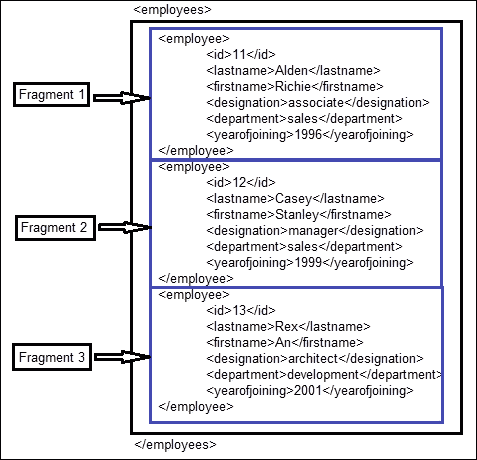
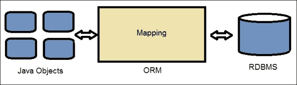

# 第三章。与数据一起工作

在上一章中，我们学习了关于批配置、组件和执行模式的知识，以适应不同的业务需求。处理数据，包括读取、处理和写入，是任何类型应用程序的一个基本部分，批处理应用程序也不例外。Spring Batch 提供了读取不同形式数据的能力，按照业务预期的方式处理数据，并将其写回到不同的系统中，这些系统可以轻松地与不同的框架集成。

在本章中，我们将介绍数据处理中涉及到的三个主要操作：

+   数据读取

+   数据处理

+   数据写入

前面的图显示了批处理应用程序中处理数据的三个阶段。输入（源）可以是数据库、文件系统（平面文件或 XML）或来自 Web 服务的数据。应用程序需要从输入（源）读取数据，处理它，并将其写入输出（目标）系统。输出（目标）可以是数据库或文件系统（平面文件或 XML 文件）。在处理阶段，读取的数据格式可以验证并转换为所需的格式，然后再写入输出。现在让我们逐一检查这些阶段。

# 数据读取

Spring Batch 提供了从不同来源读取不同形式数据的配置，包括平面文件、XML 和关系数据库。它还支持为未提供规格的格式提供自定义读取器配置。

# ItemReader

Spring Batch 提供了一个名为`ItemReader`的接口，用于从不同形式读取大量数据，包括以下内容：

+   **平面文件**：这些通常有两种类型：固定宽度和基于分隔符的字符文件

+   **XML**：这种格式用于不同形式的应用数据

+   **数据库**：这维护了一组类似或不同信息组的记录

以下是对`ItemReader`接口的定义：

```java
public interface ItemReader<T> {

T read() throws Exception, UnexpectedInputException, ParseException;

}
```

让我们来探讨一下`ItemReader`如何帮助我们读取不同格式的数据。

## 从平面文件读取数据

平面文件配置有两种格式，即**固定宽度**和**分隔符**。固定宽度文件中的每个字段细节都配置了预定义的固定宽度，而分隔符文件中的字段使用特定的字符（通常为制表符）来分隔它们与其他字段。

### 固定宽度文件

固定宽度文件通常具有其字段的预定义规格，包括每个字段在文件中应占用的长度，以及从哪一位置到哪一位置在一行上。

以下是我们想要读取的固定宽度文件的这样一个规格：

```java
Field                 Length                   Position
ID                    2 characters             1 to 2
Last name             10 characters            3 to 12
First name            10 characters            13 to 22
Designation           10 characters            23 to 32
Department            15 characters            33 to 47
Year of joining       4 characters             48 to 51
```

使用前面的规格，让我们填充一个包含员工信息的样本文件，该文件是一个固定宽度文件，如下所示（`employees.txt`）：

```java
11Alden     Richie    associate   sales          1996
12Casey     Stanley   manager     sales          1999
13Rex       An        architect   development    2001
14Royce     Dan       writer      development    2006
15Merlin    Sams      accountant  finance        1995
16Olin      Covey     manager     finance        1989
```

如果要生成与该规格相对应的 Java 对象，我们可以创建以下表示的**普通 Java 对象**（**POJO**）：

```java
package batch;

import java.io.Serializable;

public class Employee implements Serializable {
  int id;
  String lastName;
  String firstName;
  String designation;
  String department;
  int yearOfJoining;

  public int getID() {
  return id;
  }
  public void setID(int id) {
    this.id = id;
  }
  public String getLastName() {
    return lastName;
  }
  public void setLastName(String lastName) {
    this.lastName = lastName;
  }
  public String getFirstName() {
    return firstName;
  }
  public void setFirstName(String firstName) {
    this.firstName = firstName;
  }
  public String getDesignation() {
    return designation;
  }
  public void setDesignation(String designation) {
    this.designation = designation;
  }
  public String getDepartment() {
    return department;
  }
  public void setDepartment(String department) {
    this.department = department;
  }
  public int getYearOfJoining() {
    return yearOfJoining;
  }
  public void setYearOfJoining(int yearOfJoining) {
    this.yearOfJoining = yearOfJoining;
  }

  public String toString() {
    return "Employee: ID="+ id + ", Last Name="+ lastName +
    ", First Name="+ firstName + ", Designation="+ designation +
    ", Department="+ department + ",Year of joining="+
    yearOfJoining;
    }
}
```

### FlatFileItemReader

`FlatFileItemReader`提供了一种读取不同类型的平面文件并通过以下方式解析它们的方法：

+   `resource`：这表示需要从中读取数据的文件。

+   `lineMapper`：这表示将`ItemReader`读取的字符串转换为 Java 对象的映射器。

+   `linesToSkip`：当文件在记录之前有标题内容时使用。这是我们想要忽略文件顶部的行数。

### LineMapper

`LineMapper`接口允许我们在每次迭代中传递行号来读取文件中的每一行。它是 Spring Batch 的`LineMapper`标准实现。以下为`LineMapper`接口：

```java
public interface LineMapper<T> {

T mapLine(String line, int lineNumber) throws Exception;

}
```

`LineTokenizer`接口将`LineMapper`读取的行转换为字段集（`FieldSet`）。`DelimitedLineTokenizer`、`FixedLengthTokenizer`和`PatternMatchingCompositeLineTokenizer`是 Spring Batch 对`LineTokenizer`的支持实现。以下为`LineTokenizer`接口：

```java
public interface LineTokenizer {

FieldSet tokenize(String line);

}
```

`FieldSetMapper`接口允许我们将从读取的字符串映射到`Employee`对象中的每个字段。以下为`FieldSetMapper`接口：

```java
public interface FieldSetMapper<T> {

  T mapFieldSet(FieldSet fieldSet);

}
```

我们可以为我们的`Employee`数据实现`FieldSetMapper`，如下所示：

```java
package batch;

import org.springframework.batch.item.file.mapping.FieldSetMapper;
import org.springframework.batch.item.file.transform.FieldSet;

class EmployeeFieldSetMapper implements FieldSetMapper<Employee> {
  public Employee mapFieldSet(FieldSet fieldSet) {
    Employee emp = new Employee();
    emp.setID(fieldSet.readInt("ID")); 
    emp.setLastName(fieldSet.readString("lastName"));
    emp.setFirstName(fieldSet.readString("firstName"));
    emp.setDesignation(fieldSet.readString("designation"));
    emp.setDepartment(fieldSet.readString("department"));
    emp.setYearOfJoining(fieldSet.readInt("yearOfJoining"));
    return emp;
  }
}
```

数据可以作为批处理作业的一部分从文件中读取，如下面的代码片段所示：

```java
FlatFileItemReader<Employee> itemReader = new FlatFileItemReader<Employee>();
itemReader.setResource(new FileSystemResource("employees.txt"));
// FixedLengthTokenizer reads each field of length specified
DefaultLineMapper<Employee> lineMapper = new DefaultLineMapper<Employee>();
FixedLengthTokenizer lineTokenizer = new FixedLengthTokenizer();

lineMapper.setLineTokenizer(lineTokenizer);
lineMapper.setFieldSetMapper(new EmployeeFieldSetMapper());
itemReader.setLineMapper(lineMapper);
itemReader.open);
Employee ;
while (employee != null) {
  employee = itemReader.read();
  if (employee == null) {
    return RepeatStatus.FINISHED;
  }
  System.out.println(employee.toString());
}
```

`setResource()`方法将平面文件资源发送到`FlatFileItemReader`。`LineTokenizer`接口可以与字段名称和范围一起使用，使用`setNames()`和`setColumns()`方法分别设置文件上的起始和结束位置作为数组。每次在`itemReader`上调用`read()`方法时，它都会读取一行并移动到下一行。

以下是从固定宽度平面文件读取数据并将其捕获到 Java 对象后的批处理程序输出：

```java
** Executing the fixed width file read batch job! **
Employee: ID=11, Last Name=Alden, First Name=Richie, Designation=associate, Department=sales,Year of joining=1996
Employee: ID=12, Last Name=Casey, First Name=Stanley, Designation=manager, Department=sales,Year of joining=1999
Employee: ID=13, Last Name=Rex, First Name=An, Designation=architect, Department=development,Year of joining=2001
Employee: ID=14, Last Name=Royce, First Name=Dan, Designation=writer, Department=development,Year of joining=2006
Employee: ID=15, Last Name=Merlin, First Name=Sams, Designation=accountant, Department=finance,Year of joining=1995
Employee: ID=16, Last Name=Olin, First Name=Covey, Designation=manager, Department=finance,Year of joining=1989
Exit Status : COMPLETED
```

`reader`、`linetokenizer`和`fieldsetmapper`在批处理中作为 bean 使用，如下所示：

```java
<beans:bean id="employeeFile" 
class="org.springframework.core.io.FileSystemResource" > 
<beans:constructor-arg value=""/> 
</beans:bean> 
<beans:bean id="employeeReader" 
class="org.springframework.batch.item.file.FlatFileItemReader"> 
<beans:property name="resource" ref="employeeFile" /> 
<beans:property name="lineMapper"> 
<beans:bean class="org.springframework.batch.item.file.mapping.
DefaultLineMapper"> 
<beans:property name="lineTokenizer"> 
<beans:bean class="org.springframework.batch.item.file.transform. 
FixedLengthTokenizer"> 
<beans:property name="names" value="ID, lastName, firstName, designation, department, yearOfJoining"/> 
<beans:property name="columns" value="1-2,3-12,13-22,23-32,33-47,48-51"/> 
</beans:bean> 
</beans:property> 
<beans:property name="fieldSetMapper"> 

</beans:bean> 
</beans:property> 
</beans:bean> 
</beans:property> 
</beans:bean> 
<beans:bean id="employee" class="" />batchstep
```

### 定界文件

定界符平面文件包含每行中由特定字符分隔的字段。以下是一个定界符文件的示例，每个字段由逗号分隔。让我们以从定界符平面文件中读取员工详细信息为例。

以下为文件的规格说明：

+   ID

+   姓氏

+   名字

+   职称

+   部门

+   入职年份

每个字段都应该用逗号与其他字段分隔。以下是一个示例文件内容（`employees.csv`）：

```java
1,Alden,Richie,associate,sales,1996
2,Casey,Stanley,manager,sales,1999
3,Rex,An,architect,development,2001
4,Royce,Dan,writer,development,2006
5,Merlin,Sams,accountant,finance,1995
6,Olin,Covey,manager,finance,1989
```

定界文件需要像固定宽度平面文件一样处理，除了在这种情况下使用的`LineTokenizer`应该是`DelimitedLineTokenizer`。以下是为了读取作为批处理作业一部分处理的定界符平面文件而实现的 Java 代码：

```java
// Delimited File Read
FlatFileItemReader<Employee> itemReader = new FlatFileItemReader<Employee>();
itemReader.setResource(new FileSystemResource("employees.csv"));
// DelimitedLineTokenizer defaults to comma as its delimiter
DefaultLineMapper<Employee> lineMapper = new DefaultLineMapper<Employee>();
DelimitedLineTokenizer lineTokenizer = new DelimitedLineTokenizer();
lineTokenizer.setNames(new String[] { "ID", "lastName", "firstName", "designation", "department", "yearOfJoining" });
lineMapper.setLineTokenizer(lineTokenizer);
lineMapper.setFieldSetMapper(new EmployeeFieldSetMapper());
itemReader.setLineMapper(lineMapper);
itemReader.open(new ExecutionContext());
  employee = itemReader.read();
  if (employee == null) {
    return RepeatStatus.FINISHED;
  }
  System.out.println(employee.toString());
}
```

使用定界符文件，我们不需要设置列的属性。除非定界符是逗号，否则必须设置使用的定界符。执行此程序应将定界符平面文件读入 Java 对象，输出如下：

```java
** Executing the delimited file read batch job! **
Employee: ID=1, Last Name=Alden, First Name=Richie, Designation=associate, Department=sales,Year of joining=1996
Employee: ID=2, Last Name=Casey, First Name=Stanley, Designation=manager, Department=sales,Year of joining=1999
Employee: ID=3, Last Name=Rex, First Name=An, Designation=architect, Department=development,Year of joining=2001
Employee: ID=4, Last Name=Royce, First Name=Dan, Designation=writer, Department=development,Year of joining=2006
Employee: ID=5, Last Name=Merlin, First Name=Sams, Designation=accountant, Department=finance,Year of joining=1995
Employee: ID=6, Last Name=Olin, First Name=Covey, Designation=manager, Department=finance,Year of joining=1989
Exit Status : COMPLETED
```

在分隔符文件的情况下，`ItemReader`、`LineTokenizer`和`FieldSetMapper`可以作为 bean 配置在批处理中，并在程序中如下使用：

```java
<beans:bean id="employeeFile" 
  class="org.springframework.core.io.FileSystemResource" 
  scope="step"> 
<beans:constructor-arg value="#{jobParameters[employeeFile]}"/> 
</beans:bean> 
<beans:bean id="employeeFileReader" class="org.springframework.batch.item.file.FlatFileItemReader"> 
<beans:property name="resource" ref="employeeFile" /> 
<beans:property name="lineMapper"> 
<beans:bean class="org.springframework.batch.item.file.mapping.DefaultLineMapper"> 
<beans:property name="lineTokenizer"> 
<beans:bean class="org.springframework.batch.item.file.transform. 
DelimitedLineTokenizer"> 
<beans:property name="names" value="ID, lastName, firstName, designation, department, yearOfJoining"/> 
<beans:property name="delimiter" value=","/> 
</beans:bean> 
</beans:property> 
<beans:property name="fieldSetMapper"> 
<beans:bean 
class="batch.EmployeeFieldSetMapper"/> 
</beans:property> 
</beans:bean> 
</beans:property> 
</beans:bean>
```

如果文件的行以特定于业务的格式定义，`LineTokenizer`允许自定义实现和配置。`PatternMatchingCompositeLineMapper`可用于读取具有复杂模式的文件。例如，如果我们有一个平面文件中的多个记录类型，我们可以使用`PatternMatchingCompositeLineMapper`为每个记录类型提供分词器，如下所示。

一个包含多个记录类型的示例平面文件：

```java
EMPLOYEE,Steve,Jacob,21,manager,2009
BANKINFO,524851478569,STEVEJACOB,REDROSECITY
ADDRESSINFO,No24,SUNFLOWERWAY,CASAYA
```

以下是为这种多记录类型进行的 bean 配置：

```java
<bean id="employeeFileLineMapper"
class=" org.springframework.batch.item.file.mapping.PatternMatchingCompositeLineMapper">
<property name="tokenizers">
<map>
<entry key="EMPLOYEE*" value-ref="employeeTokenizer"/>
<entry key="BANKINFO*" value-ref="bankInfoTokenizer"/>
<entry key="ADDRESSINFO*" value-ref="addressInfoTokenizer"/>
</map>
</property>
<property name="fieldSetMappers">
<map>
<entry key="EMPLOYEE*" value-ref="employeeFieldSetMapper"/>
<entry key="BANKINFO*" value-ref="bankInfoFieldSetMapper"/>
<entry key="ADDRESSINFO*" value-ref="addressInfoFieldSetMapper"/>
</map>
</property>
</bean>
```

`PatternMatchingCompositeLineMapper`通过模式识别每个行，使用匹配的键让相应的`Tokenizer`和`FieldSetMapper`读取和匹配记录。

### 平面文件读取的异常

以下是从平面文件中可能出现的异常，例如当文件格式不正确、从文件读取数据时出现问题或平面文件中的数据不一致时：

+   `FlatFileParseException`: 这是`FlatFileItemReader`在文件读取过程中抛出的异常。

+   `FlatFileFormatException`: 这是`LineTokenizer`在数据分词过程中抛出的异常。

+   `IncorrectTokenCountException`: 如果指定的列数与分词的列数不匹配，则会抛出此异常。

+   `IncorrectLineLengthException`: 在固定宽度平面文件读取过程中，如果行/字段长度与指定的长度不匹配，则会抛出此异常。

## 从 XML 读取数据

**可扩展** **标记语言** (**XML**) 是一种标记语言，用于定义文档，其中包含人类和机器都能读取的数据。XML 主要用于多个系统相互交互时。

Spring Batch 使用 **XML 的流式 API** (**StAX**) 解析器。在 StAX 比喻中，程序入口点是一个表示文档中某一点的游标。应用程序将游标向前移动，'拉取'解析器所需的信息。因此，读取发生在以下图示的文件中 XML 内容的片段：



`StaxItemReader`让我们解析 XML 文件，考虑到每个片段的根元素是通用的（如上述示例中的`employee`）。`unmarshaller`将数据转换为 Java 对象。

以下是对`employeeFile`和`employeeFileReader`的 bean 配置：

```java
<beans:bean id="employeeFile" 
class="org.springframework.core.io.FileSystemResource" scope="step"> 
<beans:constructor-arg value="#{jobParameters[employeeFile]}"/> 
</beans:bean> 
<beans:bean id="employeeFileReader" 
class="org.springframework.batch.item.xml.StaxEventItemReader"> 
<beans:property name="fragmentRootElementName" value="employee" /> 
<beans:property name="resource" ref="employeeFile" /> 
<beans:property name="unmarshaller" ref="employeeMarshaller" /> 
</beans:bean>
```

我们可以使用不同的反序列化技术，包括 JAXB、XStream 绑定、JiBX 和 XML Beans。我们使用 StAX 作为序列化的引擎。让我们考虑 XStream 绑定及其以下配置：

```java
<bean id="employeeMarshaller"
class="org.springframework.oxm.xstream.XStreamMarshaller">
<property name="aliases">
<util:map id="aliases">
<entry key="employee"
value="batch.Employee" />
<entry key="ID" value="java.lang.Integer" />
</util:map>
</property>
</bean>
```

```java
StaxEventItemReader xmlStaxEventItemReader = ;
Resource resource = ( .getBytes());
Map aliases = new HashMap();
aliases.put("employee","batch.Employee");
aliases.put("ID","java.lang.Integer");
Marshaller marshaller = newXStreamMarshaller();
marshaller.setAliases(aliases);
xmlStaxEventItemReader.setUnmarshaller(marshaller);
xmlStaxEventItemReader.setResource(resource);
xmlStaxEventItemReader.setFragmentRootElementName("employee");
xmlStaxEventItemReader.open(newExecutionContext());
boolean hasNext = true;
Employee employee = null;
while(hasNext) {
  employee = xmlStaxEventItemReader.read();
  if(employee == null) {
    hasNext = false;
  }
  else{
    System.out.println(employee.getName());
  }
}
```

如果有多个文件包含要读取的 XML 细节，我们可以使用`MuliResourceItemReader`在读取操作中配置多个资源。

## 从数据库读取数据

数据库以表格的形式包含信息，具有多个列来存储每个字段。如果批处理作业需要从数据库读取数据，可以使用以下两种类型的项读取概念：

+   **基于游标的** **项目读取**：这种读取方式读取每个片段，其中游标依次指向下一个

+   **基于页面的** **项目读取**：这种读取方式将多个记录一起读取，将其视为一个页面

与此相比，基于游标的项读取工作得很好，因为它读取少量数据并处理，除非它们的内存泄漏与系统相关。

### JdbcCursorItemReader

要使用基于游标的技巧读取数据，我们可以使用`JdbcCursorItemReader`。它通过`RowMapper`（Spring 框架）配置，将数据库中的每个属性匹配到 Java 对象的属性。

员工示例的`RowMapper`可以按以下方式实现：

```java
public class EmployeeRowMapper implements RowMapper {
public static final String ID_COLUMN = "id";
public static final String LAST_NAME_COLUMN = "lastname";
public static final String FIRST_NAME_COLUMN = "firstname";
public static final String DESIGNATIoN_COLUMN = "designation";
public static final String DEPARTMENT_COLUMN = "department";
public static final String YEAR_OF_JOINING_COLUMN = "yearOfJoining";

public Object mapRow(ResultSet rs, int rowNum) throws SQLException 
  {
  Employee employee = new Employee();
  employee.setId(rs.getInt(ID_COLUMN));
  employee.setLastName(rs.getString(LAST_NAME_COLUMN));
  employee.setFirstName(rs.getString(FIRST_NAME_COLUMN));
  employee.setDesignation(rs.getString(DESIGNATION_COLUMN));
  employee.setDepartment(rs.getString(DEPARTMENT_COLUMN));
  employee.setYearOfJoining(rs.getString(YEAR_OF_JOINING_COLUMN));
  return employee;
  }
}
```

使用`EmployeeRowMapper`从数据库读取数据的 Java 程序可以实现如下：

```java
JdbcCursorItemReader itemReader = new JdbcCursorItemReader();
itemReader.setDataSource(dataSource);
itemReader.setSql("SELECT ID, LASTNAME, FIRSTNAME,DESIGNATION,DEPARTMENT,YEAROFJOINING from EMPLOYEE");
itemReader.setRowMapper(new EmployeeRowMapper());
int counter = 0;
ExecutionContext executionContext = new ExecutionContext();
itemReader.open(executionContext);
Object employee = newObject();
while(employee != null){
employee = itemReader.read();
counter++;
}
itemReader.close(executionContext);
```

`JdbcCursorItemReader`和`EmployeeRowMapper`可以在批处理 XML 中按以下方式配置：

```java
<bean id="itemReader" class=" org.springframework.batch.item.database.JdbcCursorItemReader">
  <property name="dataSource" ref="dataSource"/>
  <property name="sql" value=" SELECT ID, LASTNAME, FIRSTNAME,DESIGNATION,DEPARTMENT,YEAROFJOINING from EMPLOYEE "/>
  <property name="rowMapper">
    <bean class="batch.EmployeeRowMapper"/>
  </property>
</bean>
```

可以通过设置忽略警告、获取大小、最大行数、查询超时、验证游标位置等属性以及相应的选项来自定义`JdbcCursorItemReader`。

如果我们想使用 Hibernate 框架配置数据库读取活动，可以使用`HibernateCursorItemReader`。基于存储过程的读取操作可以使用`StoredProcedureItemReader`执行。

### JdbcPagingItemReader

在数据库上执行分页模式读取操作可以使用`JdbcPagingItemReader`。使用`JdbcPagingItemReader`并配置`dataSource`、`queryProvider`和具有不同子句的查询属性，可以按照以下方式进行：

```java
<bean id="itemReader" class=" JdbcPagingItemReader.JdbcPagingItemReader">
<property name="dataSource" ref="dataSource"/>
<property name="queryProvider">
<bean class=" org.springframework.batch.item.database.support.SqlPagingQueryProviderFactoryBean">
<property name="selectClause" value=" SELECT ID, LASTNAME, FIRSTNAME,DESIGNATION,DEPARTMENT,YEAROFJOINING "/>
<property name="fromClause" value="from EMPLOYEE"/>
<property name="whereClause" value="where designation=:designation"/>
<property name="sortKey" value="id"/>
</bean>
</property>
<property name="parameterValues">
<map>
<entry key="designation" value="manager"/>
</map>
</property>
<property name="pageSize" value="100"/>
<property name="rowMapper" ref="employeeMapper"/>
</bean>
```

使用`SqlPagingQueryProviderFactoryBean`，我们可以分别设置`select`、`from`、`where`子句，以及要传递的排序键和参数。

Spring Batch 支持不同的对象关系框架以及相应的项读取器，例如为 JPA 提供的`JpaPagingItemReader`和为 IBatis 提供的`IbatisPagingItemReader`。

# 数据处理

Spring Batch 提供了读取输入数据的一种形式，处理它，并以所需形式的输出数据返回的手段。`ItemProcessor`接口是支持处理活动的接口。

## ItemProcessor

Spring Batch 提供了简单的`ItemProcessor`接口来接收对象，对其进行处理，并将其转换为所需的格式，然后作为另一个对象返回。

以下是对`ItemProcessor`接口的定义：

```java
public interface ItemProcessor<I, O> {

O process(I item) throws Exception;

}
```

`ValidatingItemProcessor`是`ItemProcessor`的一个实现，它允许我们在处理之前验证输入数据。如果数据未通过验证，则抛出`org.springframework.batch.item.validator.ValidationException`。例如，Hibernate 这样的框架具有验证框架（`hibernate-validator`），允许我们为 bean 配置基于注解的验证器。

`ItemProcessor`可以为`Employee`示例实现如下：

```java
public class Employee {}
public class Associate {
public Associate (Employee employee) {}
}
public class EmployeeProcessor implements ItemProcessor<Employee,Associate>{
public Associate process(Employee employee) throws Exception {
  return new Associate(employee);
}
}
```

前面的程序接收`employee`数据对象，转换对象，并返回一个`Associate`数据对象。

`itemProcessor`可以配置为以下格式的作业块：

```java
<job id="jobId">
<step name="stepName">
<tasklet>
<chunk reader="itemReaderName" processor="itemProcessorName" writer="itemWriterName" commit-interval="2"/>
</tasklet>
</step>
</job>
```

## 链接过程

通过定义多个项处理器并将它们相互调用，可以链式处理活动，如下所示创建`compositeItemProcessor`：

```java
<job id="jobId">
<step name="stepName">
<tasklet>
<chunk reader="itemReaderName" processor="compositeItemProcessorName" writer="itemWriterName"
commit-interval="2"/>
</tasklet>
</step>
</job> 
      <bean id="compositeItemProcessorName"
class="org.springframework.batch.item.support.CompositeItemProcessor">
<property name="delegates">
<list>
<bean class="batch.EmployeeProcessor"/>
<bean class="batch.AssociateProcessor"/>
</list>
</property>
</bean>
```

# 数据写入

Spring Batch 提供了将读取和处理的写入不同输出的配置。写入器可以轻松地与不同的关系型框架集成。它也可以针对不同的格式进行自定义。

## ItemWriter

Spring Batch 提供了一个名为`ItemWriter`的接口来写入大量数据。以下是对`ItemWriter`接口的定义：

```java
public interface ItemWriter<T> {

void write(List<? extends T> items) throws Exception;

}
```

根据我们必须写入数据的目标平台，我们有以下项写入器：

+   **平面文件项写入器**：这些将内容写入平面文件（固定宽度和分隔符）

+   **XML 项写入器**：这些将数据写入 XML 文件

+   **数据库项写入器**：这些将数据写入数据库

### 平面文件项写入器

从任何现有格式读取的数据可以处理成所需格式，然后写入到多种格式，包括平面文件。以下是一些帮助进行平面文件项写入的 API。

#### LineAggregator

`LineAggregator` API 将多个字段连接成一个字符串以写入平面文件。这与读取操作中的`LineTokenizer`正好相反。

```java
public interface LineAggregator<T> {

  public String aggregate(T item);

}
```

#### PassThroughLineAggregator

`PassThroughLineAggregator`是`LineAggreagator`的一个实现，它认为正在使用的对象已经聚合，并简单地使用`toString()`方法从对象返回字符串。

```java
public class PassThroughLineAggregator<T> implements LineAggregator<T> {

  public String aggregate(T item) {

    return item.toString();

  }

}
```

`FlatFileItemWriter`可以配置为`PassThroughLineAggregator`，如下所示：

```java
<bean id="itemWriter" class=" org.springframework.batch.item.file.FlatFileItemWriter">
<property name="resource" value="file:target/outputfiles/employee_output.txt"/>
<property name="lineAggregator">
<bean class=" org.springframework.batch.item.file.transform.PassThroughLineAggregator"/>
</property>
</bean>
```

### FieldExtractor

如果对象写入不仅仅是将其字符串形式写入文件，则需要使用`FieldExtractor`，其中每个对象都转换为字段数组，聚合在一起形成要写入文件的字符串。

```java
public interface FieldExtractor<T> {

  Object[] extract(T item);

}
```

字段提取器主要有两种类型：

+   `PassThroughFieldExtractor`：对于需要将对象集合仅转换为数组并传递以写入的场景

+   `BeanWrapperFieldExtractor`：通过为对象的每个字段在写入文件时的字符串位置进行字段级配置，这与`BeanWrapperFieldSetMapper`正好相反。

`BeanWrapperFieldSetExtractor`的工作方式如下：

```java
BeanWrapperFieldExtractor<Employee> extractor = new BeanWrapperFieldExtractor<Employee>();
extractor.setEmployees(new String[] { "id", "lastname", "firstname","designation","department","yearofjoining"});
int id = 11;
String lastname = "Alden";
String firstname = "Richie";
String desination = "associate";
String department = "sales";
int yearofjoining = 1996;
Employee employee = new Employee(id, lastname, firstname,designation, department, yearofjoining);
Object[] values = extractor.extract(n);
assertEquals(id, values[0]);
assertEquals(lastname, values[1]);
assertEquals(firstname, values[2]);
assertEquals(designation, values[3]);
assertEquals(department, values[4]);
assertEquals(yearofjoining, values[5]);
```

### 写入分隔符文件

如果 Java 对象可以以分隔符文件格式写入平面文件，我们可以像以下示例中那样执行。让我们考虑已经定义的`Employee`对象。

此对象可以使用 `FlatFileItemWriter`、`DelimitedLineAggregator` 和 `BeanWrapperFieldExtractor` 进行配置，以执行分隔符平面文件，如下所示：

```java
<bean id="itemWriter" class="org.springframework.batch.item.file.FlatFileItemWriter">
<property name="resource" ref="outputResource"/>
<property name="lineAggregator">
<bean class=" org.springframework.batch.item.file.transform.DelimitedLineAggregator">
<property name="delimiter" value=","/>
<property name="fieldExtractor">
<bean class=" org.springframework.batch.item.file.transform.BeanWrapperFieldExtractor">
<property name="employees" value="id,lastname,firstname,designation,department,yearofjoining"/>
</bean>
</property>
</bean>
</property>
</bean>
```

### 写入固定宽度文件

Spring Batch 在 `FormatterLineAggregator` 的帮助下支持固定宽度文件写入。考虑到与分隔符平面文件写入相同的示例数据，我们可以使用以下配置执行固定宽度文件写入：

```java
<bean id="itemWriter" class="org.springframework.batch.item.file.FlatFileItemWriter">
<property name="resource" ref="outputResource"/>
<property name="lineAggregator">
<bean class=" org.springframework.batch.item.file.transform.FormatterLineAggregator">
<property name="fieldExtractor">
<bean class=" org.springframework.batch.item.file.transform.BeanWrapperFieldExtractor">
<property name="employees" value=" id,lastname,firstname,designation,department,yearofjoining"/>
</bean>
</property>
<property name="format" value="%-2d%-10s%-10s%-10s%-15s%-4d"/>
</bean>
</property>
</bean>
```

格式值基于以下列出的格式化转换形成，其中 `arg` 代表转换的参数：

| 转换 | 类别 | 描述 |
| --- | --- | --- |
| `b`, `B` | 通用 | 这将布尔值转换为字符串格式。对于 `null`，值为 `false` |
| `h`, `H` | 通用 | 这是 `Integer.toHexString(arg.hashCode())` |
| `s`, `S` | 通用 | 如果 `arg` 实现 `Formattable`，则 `arg.formatTo()` 否则，`arg.toString()` |
| `c`, `C` | 字符 | 这是一个 Unicode 字符 |
| `d` | 整数 | 这是一个十进制整数 |
| `o` | 整数 | 这是一个八进制整数 |
| `x`, `X` | 整数 | 这是一个十六进制整数 |
| `e`, `E` | 浮点数 | 这是一个计算机化的科学记数法中的十进制数 |
| `f` | 浮点数 | 这是一个十进制数 |
| `g`, `G` | 浮点数 | 这是一种计算机化的科学记数法或十进制格式，具体取决于精度和四舍五入后的值 |
| `a`, `A` | 浮点数 | 这是一个带有尾数和指数的十六进制浮点数 |
| `t`, `T` | 日期/时间 | 这是日期和时间转换字符的前缀 |
| `%` | 百分比 | 这是一个字面量 `%` (`\u0025`) |
| `n` | 行分隔符 | 这是特定平台的行分隔符 |

`FlatFileItemWriter` 可以配置 `shouldDeleteIfExists` 选项，如果指定位置已存在文件，则删除该文件。可以通过实现 `FlatFileHeaderCallBack` 和 `FlatFileFooterCallBack` 并使用 `headerCallback` 和 `footerCallback` 属性分别包含这些豆来向平面文件添加标题和页脚。

### XML 项目写入器

数据可以使用 `StaxEventItemWriter` 写入到 **可扩展标记语言** (**XML**) 格式。对于员工示例，此活动的 Spring Batch 配置可以是以下内容：

```java
<bean id="itemWriter" class="org.springframework.batch.item.xml.StaxEventItemWriter">
  <property name="resource" ref="outputResource"/>
  <property name="marshaller" ref="employeeMarshaller"/>
  <property name="rootTagName" value="employees"/>
  <property name="overwriteOutput" value="true"/>
</bean>
```

使用 XStream 进行序列化活动，以下是其配置：

```java
<bean id="employeeMarshaller"
class="org.springframework.oxm.xstream.XStreamMarshaller">
<property name="aliases">
<util:map id="aliases">
<entry key="employee"
value="batch.Employee"/>
<entry key="ID" value="java.lang.Integer"/>
</util:map>
</property>
</bean>
```

前述配置的 Java 代码可以如下实现：

```java
StaxEventItemWriter staxItemWriter = newStaxEventItemWriter();
FileSystemResource resource = new FileSystemResource("export/employee_output.xml")
Map aliases = newHashMap();
aliases.put("employee","batch.Employee");
aliases.put("ID","java.lang.Integer");
Marshaller marshaller = newXStreamMarshaller();
marshaller.setAliases(aliases);
staxItemWriter.setResource(resource);
staxItemWriter.setMarshaller(marshaller);
staxItemWriter.setRootTagName("employees");
staxItemWriter.setOverwriteOutput(true);
ExecutionContext executionContext = newExecutionContext();
staxItemWriter.open(executionContext);
Employee employee = new Employee();
employee.setID(11);
employee.setLastName("Alden");
employee.setFirstName("Richie");
employee.setDesignation("associate");
employee.setDepartment("sales");
employee.setYearOfJoining("1996");
staxItemWriter.write(employee);
```

## 数据库项目写入器

Spring Batch 支持两种可能的数据库项目写入访问类型：JDBC 和 ORM。

### 基于 JDBC 的数据库写入

Spring Batch 在 `JdbcBatchItemWriter` 的帮助下支持基于 JDBC 的数据库写入，`JdbcBatchItemWriter` 是 `ItemWriter` 的一个实现，它以批处理模式执行多个 SQL 语句。以下是基于 JDBC 的数据库写入的员工示例的样本配置：

```java
<bean id="employeeWriter" class="org.springframework.batch.item.database.JdbcBatchItemWriter">
<property name="assertUpdates" value="true" />
<property name="itemPreparedStatementSetter">
<bean class="batch.EmployeePreparedStatementSetter" />
</property>
<property name="sql"
value="INSERT INTO EMPLOYEE (ID, LASTNAME, FIRSTNAME, DESIGNATION, DEPARTMENT, YEAROFJOINING) VALUES(?, ?, ?, ?, ?, ?)" />
<property name="dataSource" ref="dataSource" />
</bean> 
```

可以按照以下方式为我们的`Employee`数据示例实现`ItemPreparedStatementSetter`：

```java
public class EmployeePreparedStatementSetter 
implements ItemPreparedStatementSetter<Employee> {

@Override
public void setValues(Employee item, PreparedStatement ps) throws SQLException {
  ps.setInt(1, item.getId()); 
  ps.setString(2, item.getLastName()); 
  ps.setString(3, item.getFirstName()); 
  ps.setString(4, item.getDesignation()); 
  ps.setString(5, item.getDepartment()); 
  ps.setInt(6, item.getYearOfJoining()); 
}
}
```

### 基于 ORM 的数据库写入

**对象关系映射**（**ORM**）被定义为一种编程技术，用于在面向对象编程语言中将数据在不可兼容的类型系统之间进行转换。ORM 负责从面向对象程序到数据库的数据持久化。Spring Batch 支持多个 ORM，包括 Hibernate、JPA 和 iBatis。



在我们的示例中，`Employee`类应该被注释为与 ORM（Hibernate/JPA）一起使用，以便进行持久化，如下所示：

```java
@Entity("employee")
public class Employee {
@Id("id")
private int id;
@Column("lastName")
private String lastName;
@Column("firstName")
private String firstName;
@Column("designation")
private String designation;
@Column("department")
private String department;
@Column("yearOfJoining")
private int yearOfJoining;

public int getID() {
  return id;
}
public void setID(int id) {
  this.id = id;
}
public String getLastName() {
  return lastName;
}
public void setLastName(String lastName) {
  this.lastName = lastName;
}
public String getFirstName() {
  return firstName;
}
public void setFirstName(String firstName) {
  this.firstName = firstName;
}
public String getDesignation() {
  return designation;
}
public void setDesignation(String designation) {
  this.designation = designation;
}
public String getDepartment() {
  return department;
}
public void setDepartment(String department) {
  this.department = department;
}
public int getYearOfJoining() {
  return yearOfJoining;
}
public void setYearOfJoining(int yearOfJoining) {
  this.yearOfJoining = yearOfJoining;
}
}
```

注释指定类`Employee`代表数据库中相应的表，其名称由`@Entity`所示，并且每个字段对应数据库中的一个列，如`@ID`和`@Column`注释所示。

下面的配置是针对员工示例使用 Hibernate 进行的：

```java
<bean id="employeeWriter"
class="org.springframework.batch.item.database.HibernateItemWriter">
<property name="hibernateTemplate" ref="hibernateTemplate" />
</bean>
```

类似地，对于 JPA 和 iBatis，可以通过`JpaItemWriter`和`IbatisBatchItemWriter`分别进行配置。

# 自定义项目读取器和写入器

Spring Batch 支持自定义项目读取器和写入器的配置。这可以通过实现`ItemReader`和`ItemWriter`接口来完成，这些接口分别用于执行所需的读取和写入操作，并带有我们想要的企业逻辑，然后在 XML 批配置中配置`ItemReader`和`ItemWriter`。

# 摘要

通过本章，我们学习了基本的数据处理机制，包括从不同的来源（如平面文件、XML 和数据库）读取数据，处理数据，并将数据写入不同的目的地，包括平面文件、XML 和数据库。我们还学习了在数据处理部分转换和验证数据。我们通过理解 Spring Batch 通过实现接口来支持自定义格式，以匹配与默认格式不同的业务需求来完成本章。在下一章中，我们将详细了解使用不同配置和模式管理事务。
