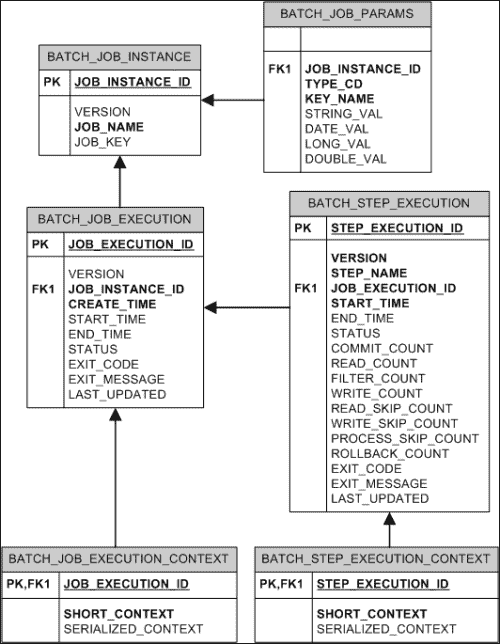
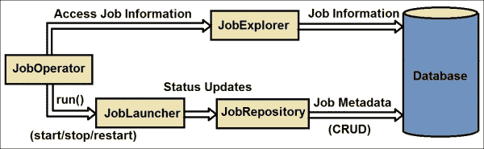
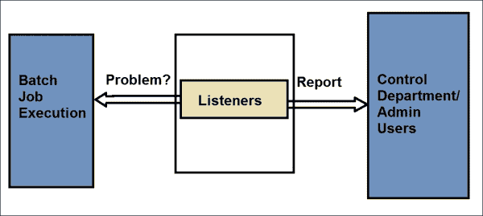

# 第七章：检查 Spring Batch 作业

在上一章中，我们学习了企业集成、各种企业应用程序集成以及 Spring Integration 项目，该项目通过消息驱动方法将 Spring Batch 应用程序与企业集成。我们还学习了使用 Spring Integration 和 RESTful 作业处理技术启动批量作业。Spring Batch 作业执行涉及大量数据，这些数据会随时间变化。有时这些变化的数据可能会损坏，导致作业执行失败。密切关注此类失败非常重要，并且应将失败原因以建设性的方式保存，以便未来的跟踪和修复。

在本章中，我们将涵盖以下主题：

+   批量作业监控

+   访问执行数据

+   监听器

+   网络监控

# 批量作业监控

到目前为止，我们已经看到了各种批量作业配置和执行情况，它们处理来自不同来源的数据，对其进行处理，并将结果推送到另一个数据存储。只要作业按照我们的配置执行，一切看起来都很顺利。一个应用程序的稳定性可以通过其对外部环境问题的响应强度和详细程度来衡量，即应用程序运行的环境，外部系统的可用性和可访问性，以及提供给应用程序的数据的正确性。

应用程序应该能够生成关于功能、谁在使用它、性能如何以及应用程序面临的详细问题/错误跟踪信息的清晰信息。Spring Batch 解决了这些参数，并生成一个更大的基础设施来监控批量作业处理并存储这些监控信息。

应用程序基础设施应负责识别任何此类问题，并通过预先配置的通信渠道向相关部门报告。Spring Batch 具有强大的基础设施，可以在数据库中维护监控的作业信息。让我们了解数据库基础设施以及每个实体是如何相互关联的。

以下是由 Spring Batch 定义的架构图：



前面的图示展示了负责作业执行信息的批量作业架构。以下是对这些实体的意义说明：

+   `BATCH_JOB_INSTANCE`：此实体维护了批量作业的高级信息以及每个作业的实例。它包含不同作业实例的唯一标识符，这些实例是为同一作业创建的，具有不同的作业参数（`JOB_KEY`），以及每个记录的作业名称和版本。

+   `BATCH_JOB_PARAMS`：此实体维护与每套作业参数实例相关的信息。它维护要传递给作业的作业参数的键/值对。

+   `BATCH_JOB_EXECUTION`: 这维护作业每个实例的作业执行信息。它通过连接 `BATCH_JOB_INSTANCE` 为批处理作业的每次执行维护单独的记录。

+   `BATCH_STEP_EXECUTION`: 这维护作业实例每个步骤的步骤执行信息。它通过连接 `BATCH_JOB_EXECUTION` 来维护每个作业执行实例的步骤执行信息。

+   `BATCH_JOB_EXECUTION_CONTEXT`: 这是每个作业执行实例所需的信息。对于每个执行，这是唯一的，因此对于重试作业，会考虑与上次运行相同的信息。因此，它与 `BATCH_JOB_EXECUTION` 相连接，以维护每个执行的实例。

+   `BATCH_STEP_EXECUTION_CONTEXT`: 这与 `BATCH_JOB_EXECUTION_CONTEXT` 类似，但它维护每个步骤执行的上下文信息。因此，它与 `BATCH_STEP_EXECUTION` 相连接，以维护每个步骤执行实例的唯一实例。

# 访问执行数据

虽然 Spring Batch 将所有监控和作业信息保存到数据库中，但让我们了解 Spring Batch 的每个管理组件，它们如何相互交互以及它们的配置。



## Database

数据库保存作业相关信息，并作为监控作业执行信息的来源。

可以使用以下语法配置数据库：

```java
<bean id="dataSource" class="org.apache.commons.dbcp.BasicDataSource"> 
<property name="driverClassName" value="${batch.jdbc.driver}"/> 
<property name="url" value="${batch.jdbc.url}"/> 
<property name="username" value="${batch.jdbc.user}"/> 
<property name="password" value="${batch.jdbc.password}"/> 
</bean>
<bean id="transactionManager" 
class="org.springframework.jdbc.datasource.DataSourceTransactionManager" lazy-init="true"> 
<property name="dataSource" ref="dataSource"/> 
</bean>
```

`driverClassName`、`url`、`username` 和 `password` 的值可以针对数据库和特定用户与该数据库的连接而特定。`DataSourceTransactionManager` 是这里的交易管理器，它通过 `datasource` 属性引用数据库。

### JobRepository

`org.springframework.batch.core.repository.JobRepository` 接口是访问作业相关信息的中心点。它从数据库访问批处理作业的状态和元数据，并将其提供给其他资源。

`JobRepository` 的配置遵循以下语法：

```java
<job-repository id="jobRepository" 
data-source="dataSource" transaction-manager="transactionManager" />
```

### JobLauncher

`org.springframework.batch.core.launch.JobLauncher` 接口负责作业执行，并更新 `JobRepository` 中的作业状态。

`JobLauncher` 的配置遵循以下语法：

```java
<job-repository id="jobRepository" 
data-source="dataSource" transaction-manager="transactionManager" />
<bean id="taskExecutor" 
class="org.springframework.core.task.SimpleAsyncTaskExecutor"/>
<bean id="jobLauncher" 
class="org.springframework.batch.core.launch.support.SimpleJobLauncher"> 
<property name="jobRepository" ref="jobRepository"/> 
< property name="taskExecutor" ref="taskExecutor"/> 
</bean>
```

### JobOperator

`org.springframework.batch.core.launch.JobOperator` 接口作为批处理作业处理的控制点。它通过从 `JobExplorer` 访问作业信息，向另一位管理员，即 `JobLauncher` 发送启动、停止和重启信号。

`JobOperator` 的配置遵循以下语法：

```java
<bean id="jobOperator" 
class="org.springframework.batch.core.launch.support.SimpleJobOperator" 
prop:jobLauncher-ref="jobLauncher" prop:jobExplorer-ref="jobExplorer" 
prop:jobRepository-ref="jobRepository" prop:jobRegistry-ref="jobRegistry" />
```

### JobExplorer

`org.springframework.batch.core.explore.JobExplorer` 接口从数据库读取与作业相关的信息，并将信息提供给其他管理员，例如在作业执行中的 `JobOperator`，它们具有只读访问权限。

`JobExplorer` 的配置遵循以下语法：

```java
<bean id="jobExplorer" 
class="org.springframework.batch.core.explore.support.JobExplorerFactoryBean" 
prop:dataSource-ref="dataSource" />
```

# Listeners

在前面的章节中，我们讨论了监听器是执行中由预配置事件触发的组件。我们可以使用此类监听器在批量作业上触发特定事件，并作为相应问题的监控工具。监听器还可以配置为报告执行中特定问题的相应部门。



以下是一个用于监控批量作业问题的示例监听器定义和配置。

可以定义一个监听器类，在作业执行前后执行，如下面的代码所示：

```java
public class JobMonitoringListener {
  @BeforeJob
  public void executeBeforeJob(JobExecution jobExecution) {
    //pre-run executions
  }
  @AfterJob
  public void executeAfterJob(JobExecution jobExecution) {
  if(jobExecution.getStatus() == BatchStatus.FAILED) { 
  /* Report the departments for a failed job execution status.
     The reporter can be a preconfigured mail-sender or an SMS
     sender or any other channel of communication.*/
      reporter.report(jobExecution);
    }
  }
}
```

配置带有监控监听器的批量作业可以如下所示：

```java
<batch:job id="firstBatchJob">
  <batch:step id="importEmployees">
  ..
  </batch:step>
  <batch:listeners>
    <batch:listener ref="jobMonitoringListener"/> 
  </batch:listeners>
</batch:job>
<bean id=" jobMonitoringListener" class="org.java.JobMonitoringListener"/>
```

# 网络监控

Spring Batch 作业执行可以通过 Spring 开源项目提供的网络界面进行监控和检查，即**Spring Batch Admin**。这是一个使用 Spring MVC 用户界面构建的简单网络应用程序，作为 Spring Batch 应用程序和系统的管理控制台。在此项目中开发的主要用例包括检查作业、启动作业、检查执行情况和停止执行情况。

### 注意

有关安装和使用的详细信息，请参阅 Spring Batch Admin 参考指南[`docs.spring.io/spring-batch-admin/reference.html`](http://docs.spring.io/spring-batch-admin/reference.html)。

# 摘要

通过本章，我们学习了作业执行监控和 Spring Batch 作业监控基础设施的重要性。我们还学习了如何在管理员配置的帮助下访问作业执行信息。此外，我们还学习了在监听器的帮助下监控和报告批量作业问题。我们通过了解 Spring Batch Administration 项目功能和它如何帮助监控批量作业来结束本章。

在下一章中，我们将详细了解批量扩展模型、并行处理和分区概念。
