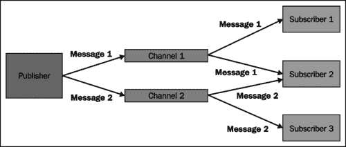

# 第一章：入门

在本书中，我们将集中讨论两个特定的子项目，它们支持 Java 持久化 API 2.0 和 Redis 键值存储。但在我们深入讨论之前，我们需要对这两种技术进行简要介绍。我们需要这样做有两个原因：

首先，如果我们想真正理解 Spring Data JPA 的好处，我们需要了解在使用标准 API 时如何创建数据库查询。一旦我们将这些代码示例与使用 Spring Data JPA 的查询创建代码进行比较，它的好处就会显露出来。

其次，对 Redis 键值存储的基本了解将有助于我们理解本书的第二部分，其中描述了我们如何在应用程序中使用它。毕竟，我们应该熟悉我们在应用程序中使用的任何技术。对吧？

本章中，我们将涵盖以下主题：

+   Java 持久化 API 背后的动机

+   Java 持久化 API 的主要组件

+   我们如何使用 Java 持久化 API 创建数据库查询

+   Redis 键值存储支持的数据类型。

+   Redis 键值存储的主要特性。

# Java 持久化 API

在引入**Java 持久化 API**（**JPA**）之前，我们有以下三种替代技术可用于实现持久化层：

+   **企业 JavaBean**（**EJB**）2.x 规范提供的持久化机制

+   **JDBC** API

+   第三方**对象关系映射**（**ORM**）框架，如 Hibernate。

这给了我们在选择最适合工作的工具时一些自由，但像往常一样，这些选项都不是没有问题的。

EJB 2.x 的问题在于它太过沉重和复杂。它的配置依赖于复杂的 XML 文档，其编程模型需要大量样板代码。此外，EJB 要求应用程序部署到**Java EE**应用服务器。

针对 JDBC API 的编程相当简单，我们可以在任何 servlet 容器中部署我们的应用程序。但是，当我们将领域模型的信息转换为查询或从查询结果构建领域模型对象时，我们必须编写大量样板代码。

第三方 ORM 框架通常是一个不错的选择，因为它们使我们摆脱了编写不必要的代码，用于构建查询或从查询结果构造领域对象。这种自由是有代价的：对象和关系数据不兼容，即使 ORM 框架可以解决大部分由**对象关系不匹配**引起的问题，但它们无法高效解决的问题是我们最头疼的问题。

Java 持久化 API 提供了一种标准机制，用于实现使用关系数据库的持久化层。它的主要动机是取代 EJB 2.x 的持久化机制，并为对象关系映射提供了标准化方法。它的许多特性最初是由第三方 ORM 框架引入的，后来成为 Java 持久化 API 的实现。以下部分介绍了其关键概念，并描述了我们如何使用它创建查询。

## 关键概念

**实体**是持久化的领域对象。每个**实体类**通常表示一个数据库表，并且这样的类的实例包含单个表行的数据。每个实体实例始终具有唯一的对象标识符，这对于实体来说就像主键对于数据库表一样。

**实体管理器工厂**创建**实体管理器**实例。由同一实体管理器工厂创建的所有实体管理器实例将使用相同的配置和数据库。如果需要访问多个数据库，则必须为每个使用的数据库配置一个实体管理器工厂。实体管理器工厂的方法由`EntityManagerFactory`接口指定。

实体管理器管理应用程序的实体。实体管理器可用于对实体执行 CRUD（创建、读取、更新和删除）操作，并针对数据库运行复杂查询。实体管理器的方法由`EntityManager`接口声明。

**持久化单元**指定了所有实体类，这些类由应用程序的实体管理器管理。每个持久化单元包含表示存储在单个数据库中的数据的所有类。

**持久化上下文**包含实体实例。在持久化上下文中，每个对象标识符只能有一个实体实例。每个持久化上下文与管理持久化上下文中包含的实体实例的特定实体管理器相关联。

## 创建数据库查询

Java 持久化 API 引入了两种创建数据库查询的新方法：**Java 持久化查询语言**（**JPQL**）和**标准查询 API**。使用这些技术编写的查询不直接处理数据库表，而是针对应用程序的实体及其持久状态编写。这在理论上确保创建的查询是可移植的，不与特定的数据库模式或数据库提供程序绑定。

也可以使用 SQL 查询，但这会将应用程序与特定的数据库模式绑定。如果使用了特定于数据库提供程序的扩展，我们的应用程序也将与数据库提供程序绑定。

接下来，我们将看看如何使用 Java 持久化 API 通过使用 SQL、JPQL 和标准查询 API 构建数据库查询。我们的示例查询将从数据库中获取所有名字为“John”的联系人。这个例子使用了一个简单的实体类`Contact`，表示了`contacts`表中存储的数据。以下表将实体的属性映射到数据库的列：

| 联系人 | 联系人 |
| --- | --- |
| `firstName` | `first_name` |

### 本地 SQL 查询

SQL 是一种标准化的查询语言，旨在管理存储在关系数据库中的数据。以下代码示例描述了如何使用 SQL 实现指定的查询：

```java
//Obtain an instance of the entity manager
EntityManager em = ...

//Build the SQL query string with a query parameter
String getByFirstName="SELECT * FROM contacts c WHERE c.first_name = ?1";

//Create the Query instance
Query query = em.createNativeQuery(getByFirstName, Contact.class);

//Set the value of the query parameter
query.setParameter(1, "John");

//Get the list of results
List contacts = query.getResultList();
```

这个例子教会我们三件事：

+   我们不必学习新的查询语言来构建 JPA 查询。

+   创建的查询不是类型安全的，我们必须在使用之前对结果进行转换。

+   我们必须在验证查询的拼写或语法错误之前运行应用程序。这增加了开发人员反馈循环的长度，降低了生产率。

因为 SQL 查询与特定的数据库模式（或使用的数据库提供程序）绑定，所以只有在绝对必要时才应使用它们。通常使用 SQL 查询的原因是性能，但我们可能还有其他使用它的原因。例如，我们可能正在将传统应用程序迁移到 JPA，而一开始没有时间做得很好。

### Java 持久化查询语言

JPQL 是一种基于字符串的查询语言，其语法类似于 SQL。因此，只要您具有一些 SQL 经验，学习 JPQL 就相当容易。执行指定查询的代码示例如下：

```java
//Obtain an instance of the entity manager
EntityManager em = ...

//Build the JPQL query string with named parameter
String getByFirstName="SELECT c FROM Contact c WHERE c.firstName = :firstName";

//Create the Query instance
TypedQuery<Contact> query = em.createQuery(getByFirstName, Contact.class);

//Set the value of the named parameter
query.setParameter("firstName", "John");

//Get the list of results
List<Contact> contacts = query.getResultList();
```

这个例子告诉我们三件事：

+   创建的查询是类型安全的，我们不必对查询结果进行转换。

+   JPQL 查询字符串非常易读且易于解释。

+   创建的查询字符串无法在编译期间进行验证。验证查询字符串的拼写或语法错误的唯一方法是运行我们的应用程序。不幸的是，这意味着开发人员反馈循环的长度增加，从而降低了生产率。

JPQL 是静态查询的不错选择。换句话说，如果查询参数的数量始终相同，JPQL 应该是我们的首选。但是，使用 JPQL 实现动态查询通常很麻烦，因为我们必须手动构建查询字符串。

### 标准查询 API

Criteria API 是为了解决在使用 JPQL 时发现的问题并标准化第三方 ORM 框架的标准化努力而引入的。它用于构建查询定义对象，这些对象被转换为执行的 SQL 查询。下面的代码示例演示了我们可以通过使用 Criteria API 来实现我们的查询：

```java
//Obtain an instance of entity manager
EntityManager em = ...
//Get criteria builder
CriteriaBuilder cb = em.getCriteriaBuilder();

//Create criteria query
CriteriaQuery<Contact> query = cb.greateQuery(Contact.class);

//Create query root
Root<Contact> root = query.from(Contact.class);

//Create condition for the first name by using static meta
//model. You can also use "firstName" here.
Predicate firstNameIs = cb.equal(root.get(Contact_.firstName, "John");

//Specify the where condition of query
query.where(firstNameIs);

//Create typed query and get results
TypedQuery<Contact> q = em.createQuery(query);
List<Contact> contacts = q.getResultList();
```

我们可以从这个例子中看到三件事：

+   创建的查询是类型安全的，可以在不进行强制转换的情况下获得结果

+   代码不像使用 SQL 或 JPQL 的相应代码那样可读

+   由于我们正在处理 Java API，Java 编译器确保不可能创建语法不正确的查询

如果我们必须创建动态查询，Criteria API 是一个很好的工具。创建动态查询更容易，因为我们可以处理对象而不是手动构建查询字符串。不幸的是，当创建的查询复杂性增加时，创建查询定义对象可能会很麻烦，代码变得更难理解。

# Redis

Redis 是一个将整个数据集保存在内存中并仅将磁盘空间用作辅助持久存储的内存数据存储。因此，Redis 可以提供非常快速的读写操作。问题在于 Redis 数据集的大小不能超过内存量。Redis 的其他特性包括：

+   支持复杂数据类型

+   多种持久化机制

+   主从复制

+   实现发布/订阅消息模式

这些特性在以下小节中描述。

## 支持的数据类型

Redis 存储的每个值都有一个键。键和值都是二进制安全的，这意味着键或存储的值可以是字符串或二进制文件的内容。然而，Redis 不仅仅是一个简单的键值存储。它支持多种二进制安全的数据类型，这对每个程序员来说应该是熟悉的。这些数据类型如下：

+   **字符串**：这是一种数据类型，其中一个键始终指向单个值。

+   **列表**：这是一种数据类型，其中一个键引用多个字符串值，这些值按插入顺序排序。

+   **集合**：这是一个无序字符串的集合，不能包含相同的值超过一次。

+   **有序集合**：这类似于一个集合，但它的每个值都有一个分数，用于将有序集合的值从最低分数到最高分数排序。相同的分数可以分配给多个值。

+   **哈希**：这是一种数据类型，其中一个哈希键始终指向特定的字符串键和值的映射。

## 持久化

Redis 支持两种持久化机制，可用于将数据集存储在磁盘上。它们如下：

+   RDB 是 Redis 最简单的持久化机制。它在配置的间隔时间内从内存数据集中获取快照，并将快照存储在磁盘上。服务器启动时，它将从快照文件中读取数据集到内存中。这是 Redis 的默认持久化机制。

RDB 最大化了 Redis 服务器的性能，其文件格式非常紧凑，这使得它成为灾难恢复的非常有用的工具。此外，如果你想使用主从复制，你必须使用 RDB，因为在主从之间同步数据时会使用 RDB 快照。

然而，如果你必须在所有情况下最小化数据丢失的机会，RDB 不是适合你的解决方案。因为 RDB 在配置的间隔时间内持久化数据，你总是可以在最后一个快照保存到磁盘后丢失存储在 Redis 实例中的数据。

+   **追加模式文件**（**AOF**）是一种持久化模型，它将改变内存数据集状态的每个操作记录到特定的日志文件中。当 Redis 实例启动时，它将通过执行从日志文件中找到的所有操作来重建数据集。

AOF 的优势在于它最大程度地减少了在所有情况下的数据丢失的机会。此外，由于日志文件是追加日志，它不会被不可逆地损坏。另一方面，与相同数据相比，AOF 日志文件通常比 RDB 文件大，并且如果服务器正在经历大量写入负载，AOF 可能比 RDB 慢。

您还可以启用两种持久性机制，并兼得两全。您可以使用 RDB 来创建数据集的备份，并确保数据的安全。在这种情况下，Redis 将使用 AOF 日志文件在服务器启动时构建数据集，因为它很可能包含最新的数据。

如果您将 Redis 用作临时数据存储并且不需要持久性，您可以禁用两种持久性机制。这意味着当服务器关闭时，数据集将被销毁。

## 复制

Redis 支持主从复制，其中单个主机可以有一个或多个从机。每个从机都是其主机的精确副本，并且可以连接到主机和其他从机。换句话说，从机可以是其他从机的主机。自 Redis 2.6 以来，每个从机默认为只读，并且拒绝对从机的所有写操作。如果我们需要将临时信息存储到从机，我们必须配置该从机以允许写操作。

复制在双方都是非阻塞的。即使从机或从机在第一次同步数据时，也不会阻塞对主机的查询。从机可以配置为在同步数据时提供旧数据。然而，当旧数据被新数据替换时，对从机的传入连接将被短暂地阻塞。

如果从机与主机失去连接，它将继续提供旧数据或向客户端返回错误，这取决于其配置。当主机和从机之间的连接丢失时，从机将自动重新打开连接并向主机发送同步请求。

## 发布/订阅消息模式

发布/订阅消息模式是一种消息模式，其中消息发送者（发布者）不直接向接收者（订阅者）发送消息。相反，使用一个名为**通道**的附加元素来传输从发布者到订阅者的消息。发布者可以向一个或多个通道发送消息。订阅者可以选择感兴趣的通道，并通过订阅这些通道来接收发送到这些通道的消息。

让我们想象一个情况，一个单一的发布者正在向两个通道发布消息，通道 1 和通道 2。通道 1 有两个订阅者：订阅者 1 和订阅者 2。通道 2 也有两个订阅者：订阅者 2 和订阅者 3。这种情况在下图中有所说明：



发布/订阅模式确保发布者不知道订阅者，反之亦然。这使我们有可能将应用程序分成更小的模块，它们之间的耦合度较低。这使得模块更容易维护和替换。

然而，发布/订阅模式的最大优势也是它的最大弱点。首先，我们的应用程序不能依赖于特定组件已订阅特定通道的事实。其次，我们没有办法清楚地验证是否是这种情况。事实上，我们的应用程序不能假设有人在听。

Redis 为发布/订阅模式提供了坚实的支持。其发布/订阅实现的主要特点包括：

+   发布者可以同时向一个或多个通道发布消息

+   订阅者可以通过使用通道的名称或包含通配符的模式订阅感兴趣的通道

+   取消订阅通道也支持名称和模式匹配

# 总结

在本章中，我们已经了解到：

+   Java 持久化 API 被引入是为了解决与 EJB 2.x 相关的问题，并提供对象关系映射的标准方法。它的特性是从最流行的第三方持久化框架的特性中选择的。

+   Redis 是一个内存数据存储，它将整个数据集保留在内存中，支持复杂数据类型，可以使用磁盘作为持久存储，并支持主从复制。它还实现了发布/订阅消息模式。

在下一章中，我们将学习如何设置一个使用 Spring Data JPA 的 Web 应用程序项目，并使用它来实现一个简单的联系人管理应用程序。
