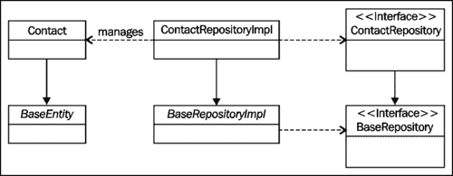
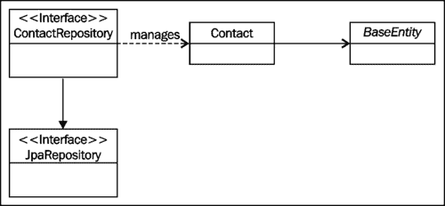

# 第二章：开始使用 Spring Data JPA

本章为我们提供了设置 Web 应用程序项目并使用 Spring Data JPA 管理实体所需的基本知识。在本章的过程中，我们将学习：

+   如何使用**Maven**下载所需的依赖项

+   如何使用**编程配置**配置 Spring **应用程序上下文**

+   如何配置我们的 Web 应用程序以通过编程方式配置（而不使用`web.xml`）加载 Spring 应用程序上下文

+   如何使用 Spring Data JPA 为实体类实现**CRUD**（**创建**、**读取**、**更新**和**删除**）功能

# 使用 Maven 下载依赖项

本书涵盖了 Spring Data JPA 的 1.2.0.RELEASE 版本，这是在撰写本书时可用的最新版本。Spring Data JPA 所需的其他组件在以下表中描述：

| 组件 | 描述 | 版本 |
| --- | --- | --- |
| 数据源 | BoneCP 是一个快速连接池库，用作我们应用程序的数据源。 | 0.7.1.RELEASE |
| JPA 提供程序 | JPA 提供程序是实现 Java 持久化 API 的库。我们将使用 Hibernate 作为 JPA 提供程序。 | 4.1.4.Final |
| Spring 框架 | Spring 框架用于开发现代企业应用程序的 Java。 | 3.1.2.RELEASE |
| 数据库 | H2 是一个支持标准 SQL 和 JDBC API 的内存中嵌入式数据库。 | 1.3.166 |

我们将使用我们应用程序的其他依赖项的最新可用版本。

我们可以通过在`POM`文件中声明它们来使用 Maven 下载所需的依赖项。为此，我们必须将以下依赖项声明添加到`pom.xml`文件的依赖项部分：

```java
<!-- Spring Data JPA -->
<dependency>
  <groupId>org.springframework.data</groupId>
  <artifactId>spring-data-jpa</artifactId>
  <version>1.2.0.RELEASE</version>
</dependency>
<!-- Hibernate -->
<dependency>
  <groupId>org.hibernate</groupId>
  <artifactId>hibernate-core</artifactId>
  <version>4.1.4.Final</version>
</dependency>
<dependency>
  <groupId>org.hibernate</groupId>
  <artifactId>hibernate-entitymanager</artifactId>
  <version>4.1.4.Final</version>
</dependency>
<!-- H2 Database -->
<dependency>
  <groupId>com.h2database</groupId>
  <artifactId>h2</artifactId>
  <version>1.3.166</version>
</dependency>
<!-- BoneCP -->
<dependency>
  <groupId>com.jolbox</groupId>
  <artifactId>bonecp</artifactId>
  <version>0.7.1.RELEASE</version>
</dependency>
```

### 提示

**下载示例代码**

您可以从您在[`www.packtpub.com`](http://www.packtpub.com)的帐户中下载您购买的所有 Packt 图书的示例代码文件。如果您在其他地方购买了本书，您可以访问[`www.packtpub.com/support`](http://www.packtpub.com/support)并注册以直接通过电子邮件接收文件。

# 配置 Spring 应用程序上下文

传统上，我们会使用 XML 配置文件进行声明式配置，但在 Spring Framework 3.0 发布后，可以使用编程配置来配置 Spring 应用程序上下文。这是我们在配置应用程序上下文时的首选方法。

我们可以通过以下步骤配置 Spring 应用程序上下文：

1.  为配置参数的值创建一个属性文件。

1.  创建应用程序上下文配置类。

## 创建属性文件

配置参数的实际值存储在一个名为`application.properties`的属性文件中。该文件包含数据库连接详细信息、Hibernate 配置以及我们实体的基本包。该文件的内容如下：

```java
#Database Configuration
db.driver=org.h2.Driver
db.url=jdbc:h2:mem:datajpa
db.username=sa
db.password=

#Hibernate Configuration
hibernate.dialect=org.hibernate.dialect.H2Dialect
hibernate.format_sql=true
hibernate.hbm2ddl.auto=create-drop
hibernate.ejb.naming_strategy=org.hibernate.cfg.ImprovedNamingStrategy
hibernate.show_sql=true

#EntityManager
entitymanager.packages.to.scan=com.packtpub.springdata.jpa.model

#General Spring configuration is added here.
```

## 创建应用程序上下文配置类

我们可以通过以下步骤创建应用程序上下文配置类：

1.  创建一个包含应用程序的一般配置的应用程序上下文配置骨架。

1.  配置数据源 bean。

1.  配置实体管理器工厂 bean。

1.  配置事务管理器 bean。

### 创建应用程序上下文配置骨架

创建 Spring 应用程序上下文配置类的骨架配置类所需的步骤如下：

1.  `@Configuration`注解将该类标识为应用程序上下文配置类。

1.  组件扫描指令使用`@ComponentScan`注解进行配置。在我们的示例中，Spring IoC 容器配置为扫描包含我们控制器和服务类的包。

1.  `@EnableJpaRepositories`注解用于启用 Spring Data JPA 并配置我们的存储库的基本包。

1.  `@EnableTransactionManagement`注解启用了 Spring Framework 的基于注解的事务管理。

1.  `@EnableWebMcv`注解导入了 Spring MVC 的默认配置。

1.  包含配置参数值的属性文件是通过使用`@PropertySource`注解导入的。我们可以通过使用 Spring IoC 容器注入的`Environment`接口的实现来访问存储在此文件中的属性值。

我们的应用程序上下文配置骨架的源代码如下所示：

```java
@Configuration
@ComponentScan(basePackages = {
        "com.packtpub.springdata.jpa.controller",
        "com.packtpub.springdata.jpa.service"
})
@EnableJpaRepositories("com.packtpub.springdata.jpa.repository")
@EnableTransactionManagement
@EnableWebMvc
@PropertySource("classpath:application.properties")
public class ApplicationContext extends WebMvcConfigurerAdapter {

    @Resource
    private Environment env;

//Add configuration here
}

```

### 注意

我们还可以通过使用 XML 配置 Spring Data JPA。我们可以通过向应用程序上下文配置文件添加 Spring Data JPA 的`repositories`命名空间元素来实现这一点。

### 配置数据源 bean

我们将通过向`ApplicationContext`类添加一个名为`dataSource()`的方法并用`@Bean`注解对该方法进行注解来开始配置数据源 bean。该方法的实现如下：

1.  创建`BoneCPDataSource`类的实例。

1.  设置数据库连接详细信息。

1.  返回创建的对象。

数据源 bean 的配置如下所示：

```java
@Bean
public DataSource dataSource() {
  BoneCPDataSource ds = new BoneCPDataSource();   

  ds.setDriverClass(env.getRequiredProperty("db.driver")); 
  ds.setJdbcUrl(env.getRequiredProperty("db.url")); 
  ds.setUsername(env.getRequiredProperty("db.username"));  
  ds.setPassword(env.getRequiredProperty("db.password"));

  return ds;
}
```

### 配置实体管理器工厂 bean

我们可以通过向`ApplicationContext`类添加一个名为`entityManagerFactory()`的方法并用`@Bean`注解对该方法进行注解来配置实体管理器工厂 bean。该方法的实现如下：

1.  创建`LocalContainerEntityManagerFactoryBean`类的实例。

1.  将所使用的数据源 bean 的引用传递给创建的对象。

1.  将 Hibernate 的默认配置设置为实体管理器工厂 bean。我们可以通过创建一个新的`HibernateJpaVendorAdapter`对象并将其传递给实体管理器工厂 bean 来实现这一点。

1.  设置我们实体的基本包。

1.  设置从我们的属性文件中获取的附加配置。

1.  返回创建的对象。

创建方法的源代码如下所示：

```java
@Bean
public LocalContainerEntityManagerFactoryBean entityManagerFactory() {
    LocalContainerEntityManagerFactoryBean em = new LocalContainerEntityManagerFactoryBean();

    em.setDataSource(dataSource());
    em.setJpaVendorAdapter(new HibernateJpaVendorAdapter());em.setPackagesToScan(env.getRequiredProperty("entitymanager.packages.to.scan"));

    Properties p = new Properties();
    p.put("hibernate.dialect", env.getRequiredProperty("hibernate.dialect"));
    p.put("hibernate.format_sql", env.getRequiredProperty("hibernate.format_sql"));
    p.put("hibernate.hbm2ddl.auto", env.getRequiredProperty("hibernate.hbm2ddl.auto"));
    p.put("hibernate.ejb.naming_strategy", env.getRequiredProperty("hibernate.ejb.naming_strategy"));
    p.put("hibernate.show_sql", env.getRequiredProperty("hibernate.show_sql");
    em.setJpaProperties(p);

    return em;
}
```

### 配置事务管理器 bean

我们可以通过向`ApplicationContext`类添加一个名为`transactionManager()`的方法并用`@Bean`注解对该方法进行注解来配置事务管理器 bean。该方法的实现如下：

1.  创建一个新的`JpaTransactionManager`对象。

1.  设置所使用的实体管理器工厂的引用。

1.  返回创建的对象。

事务管理器 bean 配置的源代码如下所示：

```java
@Bean
public JpaTransactionManager transactionManager() {
    JpaTransactionManager transactionManager = new JpaTransactionManager();
    transactionManager.setEntityManagerFactory(entityManagerFactory().getObject());
    return transactionManager;
}
```

# 加载应用程序上下文配置

加载我们应用程序的应用程序上下文配置的旧方法是使用更常见的`web.xml`文件，也就是更常见的**web 应用程序部署描述符**文件。然而，因为我们在 Servlet 3.0 环境中使用 Spring Framework 3.1，我们可以通过实现`WebApplicationInitializer`接口来创建一个 Web 应用程序配置类。这样可以确保 Spring Framework 在启动 Servlet 容器时自动检测到我们的配置类。

我们将使用我们的 Web 应用程序配置类来：

1.  加载我们的应用程序上下文配置类。

1.  配置**调度程序 servlet**。

1.  创建**上下文加载程序监听器**并将其添加到我们的**servlet 上下文**中。

我们的配置类的源代码如下所示：

```java
public class DataJPAExampleInitializer implements WebApplicationInitializer {

    @Override
    public void onStartup(ServletContext servletContext) throws ServletException {
        //Loading application context
        AnnotationConfigWebApplicationContext rootContext = new AnnotationConfigWebApplicationContext();
        rootContext.register(ApplicationContext.class);

        //Dispatcher servlet
        ServletRegistration.Dynamic dispatcher = servletContext.addServlet("dispatcher", new DispatcherServlet(rootContext));
        dispatcher.setLoadOnStartup(1);
        dispatcher.addMapping("/");

        //Context loader listener
        servletContext.addListener(new ContextLoaderListener(rootContext));
    }
}
```

# 为实体实现 CRUD 功能

我们现在已经配置了 Spring 应用程序上下文并配置了我们的 Web 应用程序在启动时加载它。我们现在将为一个简单的实体实现 CRUD 功能。我们的示例应用程序用于查看和管理联系信息，我们可以通过以下步骤来实现它：

1.  创建领域模型。

1.  为实体创建一个存储库。

1.  实现 CRUD 功能。

### 注意

本章仅描述了我们应用程序中理解 Spring Data JPA 工作所需的部分。

## 领域模型

我们的应用程序的领域模型由两个类组成：`Contact`和`Address`。本小节将涉及以下事项：

+   每个类的信息内容

+   我们如何使用**建造者模式**创建新对象（参见：*Effective Java*（*第二版*），*Joshua Bloch*，*Addison-Wesley*）

+   我们如何更新对象的信息

### 联系人

`Contact`类是我们领域模型中唯一的实体，它包含单个联系人的信息。这些信息主要由简单的属性组成。唯一的例外是`Address`类，用于存储地址信息。`Contact`类源代码的相关部分如下所示：

```java
@Entity
@Table(name = "contacts")
public class Contact {

    @Id
    @GeneratedValue(strategy = GenerationType.AUTO)
    private Long id;

    private Address address;

    @Column(name = "email_address", length = 100)
    private String emailAddress;

    @Column(name = "first_name", nullable=false, length = 50)
    private String firstName;

    @Column(name = "last_name", nullable=false, length = 100)
    private String lastName;

    @Column(name = "phone_number", length = 30)
    private String phoneNumber;

    @Version
    private long version;

//Getters and other methods
}
```

让我们继续找出如何创建新联系人并更新联系人信息。

#### 创建新的联系人对象

我们将使用建造者模式来创建新的联系人。为了做到这一点，我们必须按照以下步骤进行：

1.  实现一个用于构建新`Contact`对象的静态内部类。

1.  在`Contact`类中添加一个静态的`getBuilder()`方法。此方法用于获取对所使用的构建器的引用。

我们将首先通过以下步骤向`Contact`类添加一个静态内部类：

1.  实现一个以所需属性作为参数的构造函数。联系人的必需属性是名字和姓氏。

1.  为可选属性实现属性方法。这些属性包括电子邮件地址、电话号码和地址信息。每个属性方法都返回对所使用的构建器对象的引用。

1.  实现一个`build()`方法，返回构建的对象。

`Contact.Builder`类的源代码如下所示：

```java
public static class Builder {

        private Contact built;

        public Builder (String firstName, String lastName) {
            built = new Contact();
            built.firstName = firstName;
            built.lastName = lastName;
        }

        public Builder address(String streetAddress, String postCode, String postOffice, String state, String country) {
            Address address = Address.getBuilder(streetAddress, postCode, postOffice)
                    .state(state)
                    .country(country)
                    .build();
            built.address = address;
            return this;
        }

        public Builder emailAddress(String emailAddress) {
            built.emailAddress = emailAddress;
            return this;
        }

        public Builder phoneNumber(String phoneNumber) {
            built.phoneNumber = phoneNumber;
            return this;
        }

        public Contact build() {
            return built;
        }
    }
}
```

我们还必须在`Contact`类中添加一个静态的`getBuilder()`方法。我们的实现非常简单。我们创建一个新的`Contact.Builder`对象并返回创建的对象。此方法的源代码如下所示：

```java
public static Builder getBuilder(String firstName, String lastName) {
    return new Builder(firstName, lastName);
}
```

#### 更新联系人信息

`Contact`类有两个方法可用于更新联系人信息：`update()`方法用于更新联系人信息，`updateAddress()`方法用于更新联系人的地址信息。这些方法的源代码如下所示：

```java
public void update(final String firstName, final String lastName, final String emailAddress, final String phoneNumber) {
    this.firstName = firstName;
    this.lastName = lastName;
    this.emailAddress = emailAddress;
    this.phoneNumber = phoneNumber;
}

public void updateAddress(final String streetAddress, final String postCode, final String postOffice, final String state, final String country) {
    if (address == null) {
        address = new Address();
    }
    address.update(streetAddress, postCode, postOffice, state, country);
}
```

### 地址

`Address`类是一个嵌入类，用于存储地址信息。**嵌入类**是一个只能与其父类一起持久化的类。嵌入类通常用于呈现领域模型的常见概念，并强调其面向对象的特性。`Address`类的源代码如下所示：

```java
@Embeddable
public class Address {

    @Column(name = "country", length = 20)
    private String country;

    @Column(name = "street_address", length =150)
    private String streetAddress;

    @Column(name = "post_code", length = 10)
    private String postCode;

    @Column(name = "post_office", length = 40)
    private String postOffice;

    @Column(name = "state", length = 20)
    private String state;

  //The default constructor and other methods
}
```

接下来，我们将找出如何创建新的`Address`对象并更新现有对象的地址信息。

#### 创建新的地址

我们将通过建造者模式创建新的`Address`对象。我们可以通过以下步骤实现建造者模式：

1.  实现一个用于构建新`Address`对象的静态内部类。

1.  在`Address`类中添加一个静态的`getBuilder()`方法。此方法用于获取对所使用的构建器的引用。

我们可以通过以下步骤实现静态内部类： 

1.  为`Address`类实现一个以所需属性作为参数的构造函数。`Address`类的必需属性是`streetAddress`、`postCode`和`postOffice`。

1.  实现用于设置可选地址信息的属性方法。这些信息包括州和国家。每个属性方法都返回对所使用的构建器的引用。

1.  实现一个`build()`方法，返回构建的对象。

`Address.Builder`类的源代码如下所示：

```java
public static class Builder {

  private Address built;

  public Builder(String streetAddress, String postCode, String postOffice) {
    built = new Address();
    built.streetAddress = streetAddress;
    built.postCode = postCode;
    built.postOffice = postOffice;
  }

  public Builder country(String country) {
    built.country = country;
    return this;
  }

  public Builder state(String state) {
    built.state = state;
    return this;
  }

  public Address build() {
    return built;
   }
}
```

我们还必须实现一个方法，用于获取对所使用的构建器对象的引用。我们可以通过简单地创建一个新的`Address.Builder`对象并返回创建的对象来实现这一点。`Address`类的静态`getBuilder()`方法的源代码如下所示：

```java
public static Builder getBuilder(String streetAddress, String postCode, String postOffice) {
    return new Builder(streetAddress, postCode, postOffice);
}
```

#### 更新地址信息

我们可以通过调用其`update()`方法来更新`Address`对象的信息。该方法的源代码如下：

```java
public void update(final String streetAddress, final String postCode, final String postOffice, final String state, final String country) {
    this.streetAddress = streetAddress;
    this.postCode = postCode;
    this.postOffice = postOffice;
    this.state = state;
    this.country = country;
}
```

## 创建一个自定义存储库

为了真正理解 Spring Data JPA 的简单性，我们必须回顾一下不太久远的过去，了解在 Spring Data JPA 发布之前如何创建具体存储库。这应该让我们清楚地了解 Spring Data JPA 的好处。

### 以老式方式创建自定义存储库

传统上，创建具体存储库是一个包括六个步骤的过程。它们如下：

1.  创建一个为其子类提供属性映射的基类。通常用于为我们的实体提供 ID、版本和时间戳映射。

1.  创建一个声明所有存储库共享方法的通用存储库接口。通常，这些方法为我们的实体提供 CRUD 操作。

1.  创建一个通用存储库。

1.  创建一个实体类。

1.  创建一个特定实体的存储库接口。

1.  创建一个特定实体的具体存储库。

首先，我们必须创建一个抽象基类，每个实体类都要扩展这个基类。我们可以通过以下步骤创建这个类：

1.  创建一个抽象类，将实体 ID 类型作为类型参数。

1.  用`@MappedSuperclass`注解注释创建的类。它用于说明从这个类中找到的映射应用于它的子类。

1.  创建一个抽象的`getId()`方法，返回具体类的 ID。

`BaseEntity`类的源代码如下：

```java
@MappedSuperclass
public abstract class BaseEntity<ID> {

    @Version
    private Long version;

    public abstract ID getId();
}
```

其次，我们必须创建一个声明所有具体存储库共享方法的通用存储库接口。我们可以通过以下步骤创建这个接口：

1.  添加实体类型和实体 ID 类型作为类型参数。

1.  声明所有具体存储库共享的方法。

`BaseRepository`接口的源代码如下：

```java
public interface BaseRepository<T extends BaseEntity, ID extends Serializable> {

    public T deleteById(ID id);
    public List<T> findAll();
    public T findById(ID id);
    public void persist(T entity);
}
```

第三，我们必须创建一个抽象的通用存储库。我们可以通过以下步骤实现这一点：

1.  创建一个抽象类，将具体实体的类型和实体 ID 类型作为类型参数。

1.  使用`@PersistenceContext`注解获取对使用的实体管理器的引用。

1.  实现`BaseRepository`接口。

1.  实现一个构造函数，从类型参数中获取实体类的类型。

1.  提供一个`getEntityManager()`方法，返回一个用于引用的实体管理器。这个类的子类将使用这个方法来获取用于构建数据库查询的实体管理器引用。

1.  提供一个`getEntityClass()`方法，返回实体的类型。子类使用这个方法来通过使用 Criteria API 构建数据库查询。

`BaseRepositoryImpl`类的源代码如下：

```java
public abstract class BaseRepositoryImpl<T extends BaseEntity, ID extends Serializable> implements BaseRepository<T, ID> {

    private Class<T> entityClass;

    @PersistenceContext(unitName = "pu")
    private EntityManager em;

    public BaseDAOImpl() {
        this.entityClass = ((Class<T>) ((ParameterizedType) getClass().getGenericSuperclass()).getActualTypeArguments()[0]);
    }

    @Override
    @Transactional(propagation = Propagation.REQUIRED)
    public T deleteById(ID id) {
        T entity = findById(id);
        if (entity != null) {
            em.remove(entity);
        }
        return entity;
    }

    @Override
    public List<T> findAll() {
        CriteriaBuilder cb = em.getCriteriaBuilder();
        CriteriaQuery<T> query = cb.createQuery(entityClass);
        Root<T> root = query.from(entityClass);
        return em.createQuery(query).getResultList();
    }

    @Override
    public T findById(ID id) {
        return em.find(getEntityClass(), id);
    }

    @Override
    @Transactional(propagation = Propagation.REQUIRED)
    public void persist(T entity) {
        em.persist(entity);
    }

    protected Class<T> getEntityClass() {
        return entityClass;
    }

    protected EntityManager getEntityManager() {
        return em;
    }
}
```

接下来，我们必须创建一个实体类。我们可以通过以下步骤创建这个类：

1.  扩展`BaseEntity`类，并将实体 ID 类型作为类型参数。

1.  实现`getId()`方法，返回实体的 ID。

`Contact`类的源代码如下：

```java
@Entity
@Table(name = "contacts")
public class Contact extends BaseEntity<Long> {

    @Id
    @GeneratedValue(strategy = GenerationType.AUTO) private Long id;

    @Override
    public Long getId() {
        return id;
    }
}
```

接下来，我们必须为我们的实体特定存储库创建一个接口。我们可以通过扩展`BaseRepository`接口并提供实体类型和其 ID 类型作为类型参数来实现这一点。`ContactRepository`接口的源代码如下：

```java
public interface ContactRepository extends BaseRepository<Contact, Long> {
//Declare custom methods here.
}
```

接下来，我们必须创建特定实体的具体存储库。我们可以通过以下步骤创建一个具体的存储库：

1.  用`@Repository`注解注释具体的存储库类，将创建的类标识为存储库类。

1.  扩展`BaseRepositoryImpl`类，并将实体类型和实体 ID 类型作为类型参数。

1.  实现`ContactRepository`接口。

`ContactRepositoryImpl`类的源代码如下：

```java
@Repository
public class ContactRepositoryImpl extends BaseRepositoryImpl<Contact, Long> implements ContactRepository {
  //Add custom query methods here
}
```

恭喜！我们现在以传统方式创建了一个具体的存储库。我们的存储库实现结构如下图所示：



正如我们注意到的，实现具体存储库是一个复杂的过程，需要花费大量时间，而我们本可以用来实际生产。幸运的是，这不是为我们的实体创建存储库的唯一方法。接下来我们将学习一种更简单、更容易的创建自定义存储库的方法。当然，我们说的是 Spring Data JPA。

### 使用 Spring Data JPA 创建自定义存储库

Spring Data JPA 能够从特殊的存储库接口自动创建具体的存储库实现。这种能力简化了自定义存储库的创建过程。

我们可以通过创建一个接口来为实体创建一个 JPA 存储库，该接口扩展了`JpaRepository`接口。当我们扩展`JpaRepository`接口时，我们必须提供两个类型参数：实体的类型和实体的对象标识符的类型。

在我们的情况下，我们需要为`Contact`实体创建一个存储库。其对象标识符的类型是`Long`。因此，`ContactRepository`接口的源代码应该如下所示：

```java
public interface ContactRepository extends JpaRepository<Contact, Long> {
}
```

就是这样。我们现在已经为`Contact`实体创建了一个存储库。我们的存储库实现结构如下图所示：



正如我们所看到的，创建自定义存储库的过程不可能比这更简单了。Spring Data JPA 减少了我们需要编写和维护的代码量，以及编写所需的时间。换句话说，我们可以通过更简单的代码在更短的时间内获得相同的功能。这个优势相当难以超越。

通过扩展`JpaRepository`接口，我们现在已经获得了实现 CRUD 应用程序所需的四种方法。这些方法在下表中描述：

| 方法 | 描述 |
| --- | --- |
| `Void delete(Contact contact)` | 从数据库中删除单个联系人。 |
| `Contact findOne(Long id)` | 返回单个联系人，如果找不到联系人则返回 null。 |
| `List<Contact> findAll()` | 返回存储在数据库中的所有联系人。 |
| `Contact save(Contact contact)` | 将给定的联系人保存到数据库并返回保存的联系人。 |

## CRUD

我们现在已经配置了 Spring 应用程序上下文，实现了应用程序的领域模型，并为`Contact`实体创建了存储库。我们终于准备好为`Contact`实体提供 CRUD 功能的服务类的源代码。

让我们从为我们的服务创建一个接口开始。它的作用是声明用于处理联系信息的方法。让我们称这个接口为`ContactService`。我们的接口的源代码如下所示：

```java
public interface ContactService {

    public Contact add(ContactDTO added);
    public Contact deleteById(Long id) throws NotFoundException;
    public List<Contact> findAll();
    public Contact findById(Long id) throws NotFoundException;
    public Contact update(ContactDTO updated) throws NotFoundException;
}
```

`ContactService`接口提到了一个名为`ContactDTO`的类。它是用于将信息传递给我们的服务实现的**数据传输对象**（**DTO**）。这个 DTO 在我们应用程序的 Web 层中用作表单对象，它只包含添加或更新联系信息所需的信息。换句话说，它里面没有逻辑。这就是为什么它的源代码在这里没有讨论。

### 注意

数据传输对象的概念在[`martinfowler.com/eaaCatalog/dataTransferObject.html`](http://martinfowler.com/eaaCatalog/dataTransferObject.html)中有描述。

我们的下一步是创建一个实现`ContactService`接口的实现。让我们首先创建一个虚拟实现，稍后再添加实际逻辑。虚拟服务实现描述如下：

1.  `@Service`注解用于标记我们的实现为服务类。通过添加这个注解，我们确保该类将在类路径扫描期间自动检测到。

1.  我们使用`@Resource`注解告诉 Spring **IoC 容器**必须将创建的存储库实现注入到服务的`repository`字段中。

### 注意

通过使用`@Transactional`注解，服务类的每个方法都被标记为事务性。`rollbackFor`配置选项确保如果抛出了任何配置的异常，则事务将被回滚。

我们的虚拟服务类的源代码如下所示：

```java
@Service
public class RepositoryContactService implements ContactService {

    @Resource
    private ContactRepository repository;

    //Empty method skeletons
}
```

接下来我们将动手学习如何使用 Spring Data JPA 创建、读取、更新和删除实体。

### 创建

我们可以通过以下步骤创建一个新的实体：

1.  使用构建器模式创建一个新的`Contact`对象。

1.  将创建的对象传递给我们存储库的`save()`方法。

1.  返回创建的对象。

`add()`方法的源代码如下所示：

```java
@Transactional
@Override
public Contact add(ContactDTO added) {
    //Creates an instance of a Contact by using the builder pattern
    Contact contact = Contact.getBuilder(added.getFirstName(), added.getLastName())
            .address(added.getStreetAddress(), added.getPostCode(), added.getPostOffice(), added.getState(), added.getCountry())
            .emailAddress(added.getEmailAddress())
            .phoneNumber(added.getPhoneNumber())
            .build();
    return repository.save(contact);
}
```

### 读取

我们的应用程序必须向用户提供所有联系人的列表以及单个联系人的信息。`ContactService`接口声明了两个与这些用例相关的方法。这些方法是：`findAll()`和`findById()`。

我们的`findAll()`方法的实现非常简单。我们只是将方法调用委托给存储库。`findAll()`方法的源代码如下所示：

```java
@Transactional(readOnly = true)
@Override
public List<Contact> findAll() {
    return repository.findAll();
}
```

现在我们必须创建`findById()`方法的实现。我们的实现包含以下步骤：

1.  通过调用我们存储库的`findOne()`方法来查找联系人。

1.  如果找不到联系人，则抛出`NotFoundException`。

1.  返回找到的联系人。

`findById()`方法的源代码如下所示：

```java
@Transactional(readOnly = true)
@Override
public Contact findById(Long id) throws NotFoundException {
    Contact found = repository.findOne(id);

    if (found == null) {
        throw new NotFoundException("No contact found with id: " + id);
    }

    return found;
}
```

### 更新

我们可以通过以下步骤更新联系人的信息：

1.  使用服务的`findById()`方法查找更新后的联系人。因此，如果找不到联系人，则会抛出`NotFoundException`。

1.  更新联系信息。

1.  更新地址信息。

1.  返回更新后的联系人。

`update()`方法的源代码如下所示：

```java
@Transactional(rollbackFor = NotFoundException.class)
@Override
public Contact update(ContactDTO updated) throws NotFoundException {
    Contact found = findById(updated.getId());

    found.update(updated.getFirstName(), updated.getLastName(), updated.getEmailAddress(), updated.getPhoneNumber());

    found.updateAddress(updated.getStreetAddress(), updated.getPostCode(), updated.getPostOffice(), updated.getState(), updated.getCountry());

    return found;
}
```

### 注意

如果我们在读写事务中，更新实体信息后不需要显式调用存储库的`save()`方法。当事务提交时，对持久实体所做的所有更改都会自动更新到数据库中。

### 删除

我们可以通过以下步骤删除联系人：

1.  通过调用`findById()`方法来查找已删除的联系人，如果找不到联系人，则抛出`NotFoundException`。

1.  将联系人作为参数传递给我们存储库的`delete()`。

1.  返回已删除的联系人。

`deleteById()`方法的源代码如下所示：

```java
@Transactional(rollbackFor = NotFoundException.class)
@Override
public Contact deleteById(Long id) throws NotFoundException {
    Contact deleted = findById(id);
    repository.delete(deleted);
    return deleted;
}
```

# 摘要

在本章中，我们已经学到了：

+   Maven 提供了一种简单的方法来设置 Spring Data JPA 项目

+   如果我们使用 Spring Framework 3.0 或更新版本，可以通过编程配置来配置应用程序的应用程序上下文

+   如果我们在 Servlet 3.0 环境中使用 Spring Framework 3.1，可以在没有`web.xml`的情况下配置我们的 Web 应用程序

+   Spring Data JPA 简化了自定义存储库的创建，因为它可以自动创建我们存储库接口的具体实现。

构建 CRUD 应用程序是一个很好的开始，但它并不能帮助我们创建现实生活中的应用程序。在下一章中，我们将解决这个问题，并描述如何使用 Spring Data JPA 创建数据库查询。
