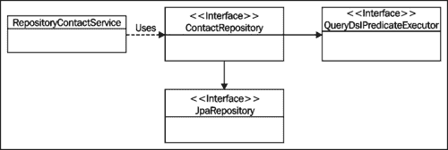
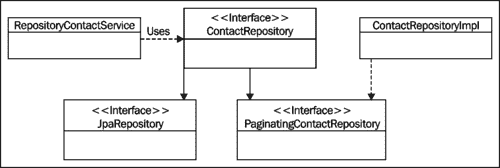
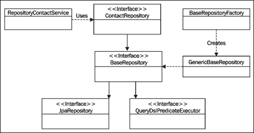

# 第四章：向 JPA 存储库添加自定义功能

我们已经学会了如何使用 Spring Data JPA 管理实体并创建数据库查询。我们还学会了如何对查询结果进行排序和分页。然而，如果我们从纯粹的架构观点出发，我们会注意到所描述的解决方案并没有遵循**关注点分离**原则。事实上，我们的服务层包含了揭示存储库层内部工作原理的代码。

这是架构纯度和生产力之间的权衡。和往常一样，这个选择有一些后果。如果我们必须将我们的应用程序迁移到 Spring Data JPA 之外，我们必须对服务和存储库层进行更改。然而，我们有多少次听说过应用程序的存储库层必须发生如此根本性的变化？确切地说，这种情况非常罕见。因此，当回报很高时，这种风险是值得承担的。

本章描述的技术可以用来隐藏服务层的实现细节，但它们还有其他应用。在本章中，我们将涵盖以下主题：

+   如何向单个存储库添加自定义功能

+   如何向所有存储库添加自定义功能

我们将使用第三章*使用 Spring Data JPA 构建查询*中创建的 Querydsl 示例应用程序作为起点。让我们首先刷新一下记忆，并花一点时间审查我们示例应用程序的结构。我们的服务层由一个名为`RepositoryPersonService`的单个类组成，该类使用我们的名为`ContactRepository`的存储库接口。我们应用程序的分页和查询构建逻辑位于服务层。这种情况在以下图表中有所说明：



# 向单个存储库添加自定义功能

向单个存储库添加自定义功能是一个有用的功能，当添加的功能只与单个实体相关时。在本节中，我们将探讨如何实现这一点，并将分页和搜索逻辑从服务层移动到存储库层。

如果我们想向单个存储库添加自定义功能，我们必须遵循以下步骤：

1.  创建声明自定义方法的自定义接口。

1.  实现创建的接口。

1.  创建存储库接口。

1.  创建使用自定义功能的服务实现。

## 创建自定义接口

我们的第一步是创建一个声明自定义存储库方法的接口。由于我们的目标是将分页和搜索逻辑移动到存储库层，我们必须向创建的接口添加以下方法：

| 方法 | 描述 |
| --- | --- |
| `List<Contact> findAllForPage(int pageIndex, int pageSize)` | 返回属于请求页面的所有联系人。 |
| `List<Contact> findContactsForPage(String searchTerm, int pageIndex, int pageSize)` | 返回与给定搜索词匹配并属于请求页面的所有联系人。 |

`PaginatingContactRepository`接口的源代码如下：

```java
public interface PaginatingContactRepository {

    public List<Contact> findAllForPage(int pageIndex, int pageSize);

    public List<Contact> findContactsForPage(String searchTerm, int pageIndex, int pageSize);
}
```

## 实现创建的接口

我们现在已经创建了一个指定自定义存储库方法的接口。我们的下一步是创建这个接口的实现，并将所有分页和查询构建代码从服务层移动到这个类中。

存储库基础设施会从与接口位于同一包中的位置寻找我们自定义接口的实现。它正在寻找一个类，其名称与实际存储库接口的简单名称附加一个后缀后创建的字符串匹配。默认情况下，此后缀的值为`Impl`。

### 注意

我们可以使用 Spring Data JPA 的`repositories`命名空间元素的`repository-impl-postfix`属性或`@EnableJpaRepositories`注解的`repositoryImplementationPostfix`属性来设置后缀。

目前我们对默认后缀非常满意。因此，实现我们自定义接口的类的名称必须是`ContactRepositoryImpl`。我们可以按照以下步骤实现这个类：

1.  编写一些必要的管道代码来配置`QueryDslJpaRepository<T, ID>`类，用于执行我们的查询。

1.  实现自定义接口中声明的方法。

### 配置存储库类

在这个阶段，我们将编写获取`QueryDslJpaRepository<Contact, Long>`类实例所需的代码。这个过程有以下步骤：

1.  使用`@PersistenceContext`注解获取对使用的实体管理器的引用。

1.  创建一个`init()`方法，并用`@PostConstruct`注解进行注释。这样可以确保在 bean 构造后调用该方法，并注入实体管理器引用。

1.  实现`init()`方法并创建一个新的`QueryDslJpaRepository<Contact, Long>`对象。

我们的实现源代码如下：

```java
public class ContactRepositoryImpl implements PaginatingContactRepository {

    @PersistenceContext
    private EntityManager entityManager;

    private QueryDslJpaRepository<Contact, Long> repository;

    //Add methods here

    @PostConstruct
    public void init() {
        JpaEntityInformation<Contact, Long> contactEntityInfo = new JpaMetamodelEntityInformation<Contact, Long>(Contact.class, entityManager.getMetamodel());
        repository = new QueryDslJpaRepository<Contact, Long>(contactEntityInfo, entityManager);
    }
}
```

### 实现自定义方法

目前创建的类无法编译，因为我们还没有实现自定义方法。在实现这些方法之前，我们必须将分页逻辑从服务层移动到`ContactRepositoryImpl`类。因此，这个过程有以下两个步骤：

1.  将分页相关的代码添加到我们的存储库实现中。

1.  实现自定义存储库方法。

首先，我们必须将分页相关的代码添加到我们的存储库中。这意味着我们必须将`sortByLastNameAndFirstNameAsc()`和`buildPageSpecification()`方法添加到`ContactRepositoryImpl`类中。这些方法的实现保持不变，如下所示：

```java
private Pageable buildPageSpecification(int pageIndex, int pageSize) {
  return new PageRequest(pageIndex, pageSize, sortByLastNameAndFirstNameAsc());
}

private Sort sortByLastNameAndFirstNameAsc() {
  return new Sort(new Sort.Order(Sort.Direction.ASC, "lastName"),
        new Sort.Order(Sort.Direction.ASC, "firstName")
  );
}
```

下一步是编写`findAllForPage()`方法的实现，该方法用于获取所请求页面上的联系人列表。这意味着我们必须：

1.  使用私有的`buildPageSpecification()`方法获取页面规范。

1.  通过调用存储库的`findAll()`方法并将页面规范作为参数传递，获取所请求页面的内容。

1.  返回联系人列表。

`findAllForPage()`方法的源代码如下：

```java
@Override
public List<Contact> findAllForPage(int pageIndex, int pageSize) {
    Pageable pageSpec = buildPageSpecification(pageIndex, pageSize);
    Page wanted = repository.findAll(pageSpec);

    return wanted.getContent();
}
```

我们的最后一个任务是为`findContactsForPage()`方法提供实现。这个方法的实现有以下步骤：

1.  通过调用`ContactPredicates`类的静态`firstOrLastNameStartsWith()`方法获取使用的搜索条件。

1.  通过调用私有的`buildPageSpecification()`方法获取页面规范。

1.  通过调用存储库的`findAll()`方法并提供必要的参数，获取所请求页面的内容。

1.  返回联系人列表。

`findContactsForPage()`方法的源代码如下：

```java
@Override
public List<Contact> findContactsForPage(String searchTerm, int pageIndex, int pageSize) {
    Predicate searchCondition = firstOrLastNameStartsWith(searchTerm);
    Pageable pageSpec = buildPageSpecification(pageIndex, pageSize);
    Page wanted = repository.findAll(searchCondition, pageSpec);

    return wanted.getContent();
}
```

## 创建存储库接口

我们现在已经实现了自定义功能，是时候将这个功能添加到我们的存储库中了。我们需要对现有的`ContactRepository`接口进行两处更改。具体如下：

1.  通过扩展`PaginatingContactRepository`接口，我们可以使自定义方法对我们存储库的用户可用。

1.  因为服务层不再需要 Querydsl 库的特定方法，我们可以从扩展接口列表中移除`QueryDslPredicateExecutor`接口。

我们的新存储库接口的源代码如下：

```java
public interface ContactRepository extends JpaRepository<Contact, Long>, PaginatingContactRepository {
}
```

## 创建服务实现

最后一步是修改`RepositoryContactService`类以使用自定义功能。这一步有以下两个阶段：

1.  移除`buildPageSpecification()`和`sortByLastNameAndFirstNameAsc()`方法。

1.  修改`findAllForPage()`和`search()`方法，将方法调用委托给我们的存储库。

修改后的方法的源代码如下：

```java
@Transactional(readOnly = true)
@Override
public List<Contact> findAllForPage(int pageIndex, int pageSize) {
    return repository.findAllForPage(pageIndex, pageSize);
}

@Transactional(readOnly = true)
@Override
public List<Contact> search(SearchDTO dto) {
    return repository.findContactsForPage(dto.getSearchTerm(), dto.getPageIndex(), dto.getPageSize());
}

```

## 我们刚刚做了什么？

我们刚刚将分页和搜索逻辑从`RepositoryContactService`类移动到`ContactRepositoryImpl`类，并消除了我们的服务层与 Querydsl 之间的依赖。我们行动的结果如下图所示：



# 向所有存储库添加自定义功能

有时我们必须向所有存储库添加自定义功能。在本节中，我们将学习如何做到这一点，并创建一个用于通过 ID 删除实体的自定义存储库方法。

我们可以通过以下步骤向所有存储库添加自定义功能：

1.  创建一个声明自定义方法的基础接口。

1.  实现创建的接口。

1.  创建一个存储库工厂 bean。

1.  配置 Spring Data JPA 以使用我们的存储库工厂 bean。

1.  创建一个存储库接口。

1.  实现使用自定义功能的服务类。

## 创建基础存储库接口

首先创建一个声明了实际存储库中可用方法的基础存储库接口。我们可以通过以下方式实现：

1.  创建一个接口，将受管实体的类型和其 ID 的类型作为类型参数。

1.  在我们的基础存储库接口中同时扩展`JpaRepository<T, ID>`和`QueryDslPredicateExecutor<T>`接口。

1.  用`@NoRepositoryBean`注解标注接口。这可以确保 Spring Data JPA 不会为该接口创建存储库实现。另一个解决方案是将该接口从存储库基础包中移出，但由于很难找到一个合适的逻辑位置，我们暂时不这样做。

1.  向该接口添加一个`T deleteById(ID id)`方法。该方法返回被删除的实体，并且如果没有找到给定 ID 的实体，则抛出`NotFoundException`。

让我们称这个接口为`BaseRepository`。其源代码如下：

```java
@NoRepositoryBean
public interface BaseRepository<T, ID extends Serializable> extends JpaRepository<T, ID>, QueryDslPredicateExecutor<T> {

    public T deleteById(ID id) throws NotFoundException;
}
```

## 实现基础存储库接口

接下来我们必须编写`BaseRepository<T, ID>`接口的实现。这个过程包括以下步骤：

1.  创建一个实现`BaseRepository<T, ID>`接口并扩展`QueryDslJpaRepository<T, ID>`类的类。这确保了该类可以访问`JpaRepository<T, ID>`接口提供的方法，并且可以使用 Querydsl。

1.  添加一个构造函数，用于简单地将所需的信息传递给超类。

1.  实现`deleteById()`方法。首先，该方法获取被删除的实体。如果找不到实体，该方法会抛出`NotFoundException`。否则，该方法会删除找到的实体并返回被删除的实体。

创建的`GenericBaseRepository`类的源代码如下：

```java
public class GenericBaseRepository<T, ID extends Serializable> extends QueryDslJpaRepository<T, ID> implements BaseRepository<T, ID> {

    public GenericBaseRepository(JpaEntityInformation<T, ID> entityMetadata, EntityManager entityManager) {
        super(entityMetadata, entityManager);
    }

    @Override
    public T deleteById(ID id) throws NotFoundException {
        T deleted = findOne(id);
        if (deleted == null) {
            throw new NotFoundException();
        }

        delete(deleted);
        return deleted;
    }
}
```

## 创建存储库工厂 bean

现在我们已经实现了自定义功能，我们必须确保在创建具体存储库实现时使用它。这意味着我们必须创建一个自定义存储库工厂 bean 来替换默认的存储库工厂 bean。我们的存储库工厂 bean 有一个单一目的：它将`GenericBaseRepository`作为`Repository`接口的所有扩展接口的实现。我们可以通过以下步骤创建一个自定义存储库工厂 bean：

1.  创建存储库工厂 bean 类的框架。

1.  创建一个存储库工厂类。

1.  创建一个用于构建新存储库工厂的构建方法。

### 创建存储库工厂 bean 类的框架

首先，我们必须创建存储库工厂 bean 类。这个类必须扩展 Spring Data JPA 的默认存储库工厂 bean`JpaRepositoryFactoryBean<R, T, I>`类。这个类有三个类型参数：存储库的类型，实体的类型和实体的 ID 的类型。类骨架的源代码如下：

```java
public class BaseRepositoryFactoryBean <R extends JpaRepository<T, I>, T, I extends Serializable> extends JpaRepositoryFactoryBean<R, T, I> {

}
```

### 创建存储库工厂内部类

第二步是创建实际的存储库工厂类。这个类的实现包括以下步骤：

1.  将`BaseRepositoryFactory`类作为`BaseRepositoryFactoryBean`类的受保护内部类添加进去。

1.  使创建的类扩展`JpaRepositoryFactory`类。

1.  重写`JpaRepositoryFactory`类的`getTargetRepository()`方法。这个方法负责创建实际的存储库实现。

1.  重写`JpaRepositoryFactory`类的`getRepositoryBaseClass()`方法，该方法简单地返回基本存储库实现的类。我们可以忽略作为参数给出的元数据，因为该信息由`JpaRepositoryFactory`用于决定它是否应该返回`SimpleJpaRepository`或`QueryDslJpaRepository`类。

存储库工厂内部类的源代码如下：

```java
protected static class BaseRepositoryFactory<T, I extends Serializable> extends JpaRepositoryFactory {

  private EntityManager entityManager;

    public BaseRepositoryFactory(EntityManager entityManager) {
      super(entityManager);
        this.entityManager = entityManager;
  }

    @Override
    protected Object getTargetRepository(RepositoryMetadata metadata) {
      return new GenericBaseRepository<T, I>((JpaEntityInformation<T,I>) getEntityInformation(metadata.getDomainType()), entityManager);
  }

    @Override
    protected Class<?> getRepositoryBaseClass(RepositoryMetadata metadata) {
        return GenericBaseRepository.class;
  }
}
```

### 为存储库工厂创建构建方法

我们可以通过重写`BaseRepositoryFactoryBean`类中的`createRepositoryFactory()`方法来创建我们自定义存储库工厂类的新实例。这个方法简单地创建了`BaseRepositoryFactory`类的一个新实例，并将实体管理器引用作为构造函数参数传递。重写方法的源代码如下：

```java
@Override
protected RepositoryFactorySupport createRepositoryFactory(EntityManager entityManager) {
    return new BaseRepositoryFactory(entityManager);
}
```

## 配置 Spring Data JPA

接下来，我们必须配置 Spring Data JPA 在创建存储库接口的具体实现时使用自定义存储库工厂 bean。我们可以通过使用`@EnableJpaRepositories`注解的`repositoryFactoryBeanClass`属性来实现这一点。换句话说，我们必须将以下注解添加到`ApplicationContext`类中：

```java
@EnableJpaRepositories(basePackages = {"com.packtpub.springdata.jpa.repository"}, repositoryFactoryBeanClass = BaseRepositoryFactoryBean.class)
```

### 注意

如果我们在使用 XML 配置我们的应用程序，我们可以使用 Spring Data JPA 的`repositories`命名空间元素的`factory-class`属性。

## 创建存储库接口

现在我们已经使自定义功能对所有存储库可用。现在我们必须为`Contact`实体创建一个存储库接口。我们可以按照以下步骤来做到这一点：

1.  从扩展接口的列表中移除`JpaRepository`和`QueryDslPredicateExecutor`接口。

1.  扩展`BaseRepository<T, ID>`接口。

`ContactRepository`接口的源代码如下：

```java
public interface ContactRepository extends BaseRepository<Contact, Long> {
}
```

## 实现服务层

因为`RepositoryContactService`类的`delete()`方法的旧实现包含与我们的新`deleteById()`存储库方法相同的功能，所以我们必须将`RepositoryContactService`类的`delete()`方法更改为将方法调用委托给新的存储库方法。我们的新`delete()`方法的源代码如下：

```java
@Transactional(rollbackFor = NotFoundException.class)
@Override
public Contact deleteById(Long id) throws NotFoundException {
    return repository.deleteById(id);
}
```

## 我们刚刚做了什么？

我们实现了一个通用的删除方法，该方法自动对我们应用程序的所有存储库可用。这消除了将特定于实体的删除逻辑添加到服务层的需要，并减少了代码重复。我们还创建了一个自定义存储库工厂，为我们的存储库接口提供`GenericBaseRepository`作为实现。我们的工作结果如下图所示：



# 总结

在本章中，我们已经学会了如何向单个存储库或所有存储库添加自定义功能。然而，本章还有另一个非常重要的教训。我们注意到，向存储库添加自定义功能会增加应用程序的复杂性，并迫使我们编写样板代码，这可能会让实现和维护都变得繁琐。这就是为什么我们应该只在绝对必要的时候使用本章描述的技术。

这是最后一章，描述了 Spring Data JPA 的用法。在下一章中，我们将学习如何在运行类 Unix 操作系统的计算机上安装 Redis，并设置一个使用 Redis 作为数据存储的 Web 应用项目。
