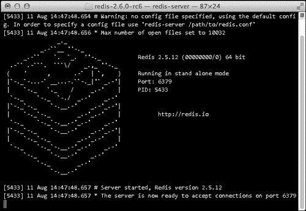

# 第五章：使用 Spring Data Redis 入门

在 Spring Data Redis 项目诞生之前，与 Redis 通信的常规方式是使用可以与关系数据库的 JDBC 驱动程序进行比较的客户端库。不同之处在于这些客户端没有实现使得从一个连接器切换到另一个连接器变得困难的标准 API。显然，百万美元的问题是，Spring Data Redis 如何使我们的生活更轻松？

Spring Data Redis 将不同客户端库的 API 隐藏在一个干净且易于使用的单一 API 后面。理论上，这确保我们可以在不对应用程序进行任何更改的情况下更改所使用的 Redis 连接器。尽管这确实是一个有用的功能，如果我们必须更改所使用的连接器，但如果仅因为这个功能就开始使用 Spring Data Redis，这将是天真的。我们必须记住，我们很可能会在应用程序的生命周期中坚持使用一个 Redis 连接器。

然而，我们必须记住，应用程序基本上是通过将不同组件组合在一起构建的。Spring Data Redis 与 Spring 框架提供了无缝集成，后者是用于创建企业应用程序的流行工具。这对于任何使用 Redis 的 Spring 应用程序的开发人员来说自然是一个巨大的好处。

### 注意

有关 Spring Data Redis 及其功能的更多信息，请访问[`www.springsource.org/spring-data/redis/`](http://www.springsource.org/spring-data/redis/)。

本章将指导我们通过初始配置阶段，并帮助我们设置一个使用 Spring Data Redis 的 Web 应用程序项目。在本章中，我们将涵盖以下主题：

+   如何在运行类 Unix 操作系统的计算机上安装 Redis

+   如何使用 Maven 获取 Spring Data Redis 所需的依赖

+   如何通过使用编程配置来配置我们应用程序的应用程序上下文

+   如何在应用程序上下文配置类中配置我们的 Redis 连接

# 安装 Redis

Spring Data Redis 要求使用 Redis 2.0 或更高版本，并建议使用 Redis 2.2。但是，即使可能使用更新的 Redis 版本，新功能可能尚不受支持。本书假定我们使用的是 Redis 版本 2.6.0-rc6。

目前 Redis 并不正式支持 Windows，但有一些非官方的端口可用。如果要将 Redis 安装到 Windows 计算机上，请下载其中一个非官方源包，并按照其安装说明进行操作。非官方 Windows 端口的下载链接可在[`redis.io/download`](http://redis.io/download)上找到。

### 注意

Redis 的唯一依赖是一个可用的 GCC 编译器和 libc。安装这些依赖的最佳方法是使用所用 Linux 发行版的软件包管理器。如果在使用 OS X 操作系统的计算机上编译 Redis，则应确保安装了 Xcode 及其命令行工具。

我们可以通过以下步骤将 Redis 安装到运行类 Unix 操作系统的计算机上：

1.  下载 Redis 源包。我们使用一个称为`wget`的命令行实用程序来检索源包。

1.  解压源包。

1.  编译 Redis。

我们可以通过在命令行上运行以下命令来完成安装过程：

```java
wget http://redis.googlecode.com/files/redis-2.6.0-rc6.tar.gz
tar xzf redis-2.6.0-rc6.tar.gz
cd redis-2.6.0-rc6
make

```

### 注意

目前，源包托管在 Google Code 上。如果包被移动到不同的主机上，或者安装了不同的 Redis 版本，这些命令必须相应地进行修改。

编译成功后，我们可以通过在命令提示符下运行以下命令来启动 Redis 服务器：

```java
./src/redis-server

```

如果我们的安装成功，我们应该看到如下截图所示的输出：



### 注意

官方 Redis 主页有全面的文档，提供有关 Redis 的使用和配置的更多信息。此文档可在[`redis.io/documentation`](http://redis.io/documentation)上找到。

# 获取所需的依赖项

获取 Spring Data Redis 所需的依赖项相当容易。唯一需要的依赖项是 Spring Data Redis，我们可以通过将以下依赖声明添加到`pom.xml`文件中来获取它：

```java
<dependency>
  <groupId>org.springframework.data</groupId>
  <artifactId>spring-data-redis</artifactId>
  <version>1.0.1.RELEASE</version>
</dependency>
```

# 配置 Spring 应用程序上下文

我们将使用 Java 配置来配置我们应用程序的应用程序上下文。我们应用程序上下文配置类的名称是`ApplicationContext`，其实现在以下几点中进行了解释：

1.  `@Configuration`注解用于将类标识为应用程序上下文配置类。

1.  `@ComponentScan`注解用于配置我们控制器的基本包。

1.  `@EnableWebMvc`注解用于启用 Spring MVC。

1.  配置参数的值是从一个属性文件中获取的，该文件是通过使用`@PropertySource`注解导入的。`Environment`接口用于访问存储在该文件中的属性值。

1.  `redisConnectionFactory()`方法用于配置 Redis 连接工厂 bean。此方法的实现取决于所使用的 Redis 连接器。

我们应用程序上下文配置骨架类的源代码如下：

```java
@Configuration
@ComponentScan(basePackages = {
        "com.packtpub.springdata.redis.controller"
})
@EnableWebMvc
@PropertySource("classpath:application.properties")
public class ApplicationContext extends WebMvcConfigurerAdapter {

    @Resource
    private Environment env;

    @Bean
    public RedisConnectionFactory redisConnectionFactory() {
      //Add implementation
    }

    //Add other configuration here   
}
```

`application.properties`文件的内容如下：

```java
redis.host = localhost
redis.port = 6379
```

# 配置 Redis 连接

Spring Data Redis 支持四种不同的连接器，可用于与 Redis 服务器交互。这些连接器在以下表格中描述：

| 连接器 | 描述 |
| --- | --- |
| Jedis | Jedis 是与 Redis 2.0.0 命令完全兼容的 Redis 连接器。该项目托管在 GitHub 上，有关更多信息，请访问[`github.com/xetorthio/jedis`](https://github.com/xetorthio/jedis)。 |
| JRedis | JRedis 是一个 Redis 连接器，尚未正式支持 Redis 2.x。但是，可以使用此库的分支版本添加对 Redis 2.x 的支持。JRedis 库的分支版本托管在 GitHub 上，其主页位于[`github.com/anthonylauzon/jredis`](https://github.com/anthonylauzon/jredis)。 |
| RJC | RJC 是与 Redis 2.X 兼容的 Redis 连接器。有关 RJC 连接器的更多信息，请访问[`github.com/e-mzungu/rjc`](https://github.com/e-mzungu/rjc)。 |
| SRP | SRP 是支持 Redis 2.6 命令的 Redis 连接器。该项目的主页位于[`github.com/spullara/redis-protocol`](https://github.com/spullara/redis-protocol)。 |

不幸的是，目前一些支持的连接器处于早期开发阶段，它们不支持 Redis 的所有可用功能。如果底层连接器不支持执行的操作，则会抛出异常`UnsupportedOperationException`。

此外，我们可以使用的 Spring Data Redis 的配置选项取决于所使用的连接器。以下表格描述了支持的 Redis 连接器之间的差异（X 表示支持配置选项，-表示不支持）：

| 连接器 | 密码 | 连接池 |
| --- | --- | --- |
| Jedis | X | X |
| JRedis | X | X |
| RJC | X | X |
| SRP | - | - |

Jedis 是 Spring Data Redis 的默认连接器，目前应该是我们的首选，因为它是支持的连接器中最成熟的，并且正在积极开发。但是，我们将查看每个支持的连接器的配置过程，因为情况可能会在将来发生变化，如果发生变化，我们也应该知道我们还有其他选择。

每个支持的 Redis 连接器的配置始终有以下两个步骤：

1.  配置正确的 Maven 依赖项。

1.  在`ApplicationContext`类的`redisConnectionFactory()`方法中配置正确的 Redis 连接工厂 bean。

## 配置 Jedis 连接器

因为 Jedis 是 Spring Data Redis 的默认连接器，我们不必对我们的`pom.xml`文件进行任何更改。我们唯一需要做的是在应用程序上下文配置中添加 Redis 连接工厂 bean。Jedis 连接器的正确 Redis 连接工厂 bean 类是`JedisConnectionFactory`类，它具有以下配置属性：

| 属性 | 描述 |
| --- | --- |
| `dataBase` | 使用的数据库的索引。 |
| `hostName` | 使用的 Redis 服务器的主机名。 |
| `password` | 用于与 Redis 服务器进行身份验证的密码。 |
| `poolConfig` | 通过使用`redis.clients.jedis.JedisPoolConf`类给出的连接池配置。 |
| `port` | 使用的 Redis 服务器的端口。 |
| `shardInfo` | 配置`JedisConnectionFactory`对象的替代方法。通过使用`redis.clients.jedis.JedisShardInfo`类给出配置。此方法优先于其他冲突的配置属性。 |
| `timeout` | 连接超时。 |
| `usePool` | 描述是否使用连接池的`boolean`值。 |

我们将在`ApplicationContext`类的`redisConnectionFactory()`方法中配置 Redis 连接工厂 bean。我们的实现包括以下步骤：

1.  创建一个新的`JedisConnectionFactory`对象。

1.  配置 Redis 连接工厂 bean。

1.  返回创建的对象。

实现的`redisConnectionFactory()`方法的源代码如下：

```java
@Bean
public RedisConnectionFactory redisConnectionFactory() {
  JedisConnectionFactory cf = new JedisConnectionFactory();

  cf.setHostName(env.getRequiredProperty("redis.host"));
  cf.setPort(Integer.parseInt(env.getRequiredProperty("redis.port")));

  return cf;
}
```

## 配置 JRedis 连接器

第一步是配置 JRedis 的 Maven 依赖项。我们可以通过以下步骤配置所需的依赖项：

1.  从我们的构建中排除传递的 Jedis 依赖项。

1.  将分叉的 JRedis 连接器作为依赖项添加。

在我们按照描述的步骤进行之后，我们应该在`pom.xml`文件中有以下依赖声明：

```java
<dependency>
    <groupId>org.springframework.data</groupId>
    <artifactId>spring-data-redis</artifactId>
    <version>1.0.1.RELEASE</version>
    <exclusions>
        <exclusion>
            <groupId>redis.clients</groupId>
            <artifactId>jedis</artifactId>
        </exclusion>
    </exclusions>
</dependency>
<dependency>
    <groupId>org.jredis</groupId>
    <artifactId>jredis-anthonylauzon</artifactId>
    <version>03122010</version>
</dependency>
```

第二步是配置使用的 Redis 连接工厂 bean。因为我们想要使用 JRedis 连接器，我们必须使用`JRedisConnectionFactory`类。该类的配置属性在下表中描述：

| 属性 | 描述 |
| --- | --- |
| `dataBase` | 使用的数据库的索引。 |
| `hostName` | 使用的 Redis 服务器的主机名。 |
| `password` | 用于与 Redis 服务器进行身份验证的密码。 |
| `poolSize` | 连接池的大小。 |
| `port` | 使用的 Redis 服务器的端口。 |
| `usePool` | 描述是否使用连接池的`boolean`值。 |

为了配置 Redis 连接器，我们必须将`redisConnectionFactory()`方法的实现添加到`ApplicationContext`类中。我们可以通过以下步骤来实现：

1.  创建一个新的`JRedisConnectionFactory`对象。

1.  配置 Redis 连接工厂 bean。

1.  返回创建的对象。

我们的 Redis 连接工厂 bean 配置的源代码如下：

```java
@Bean
public RedisConnectionFactory redisConnectionFactory() {
    JredisConnectionFactory cf = new JredisConnectionFactory();

    cf.setHostName(env.getRequiredProperty("redis.host"));   
    cf.setPort(Integer.parseInt(env.getRequiredProperty("redis.port")));

    return cf;
}
```

## 配置 RJC 连接器

首先，我们必须配置所需的 Maven 依赖项。此过程包括以下步骤：

1.  从我们的构建中排除传递的 Jedis 依赖项。

1.  将 RJC 连接器作为依赖项添加。

必须添加到我们的`pom.xml`文件的依赖声明如下：

```java
<dependency>
    <groupId>org.springframework.data</groupId>
    <artifactId>spring-data-redis</artifactId>
    <version>1.0.1.RELEASE</version>
    <exclusions>
        <exclusion>
            <groupId>redis.clients</groupId>
            <artifactId>jedis</artifactId>
        </exclusion>
    </exclusions>
</dependency>
<dependency>
    <groupId>org.idevlab</groupId>
    <artifactId>rjc</artifactId>
    <version>0.7</version>
</dependency>
```

最后一步是将使用的 Redis 连接工厂 bean 的配置添加到我们的应用程序上下文配置类中。因为我们使用的是 RJC 连接器，正确的 Redis 连接工厂类是`RjcConnectionFactory`。该类具有以下配置属性：

| 属性 | 描述 |
| --- | --- |
| `dataBase` | 使用的数据库的索引。 |
| `hostName` | 使用的 Redis 服务器的主机名。 |
| `password` | 用于与 Redis 服务器进行身份验证的密码。 |
| `port` | 所使用的 Redis 服务器的端口。 |
| `timeout` | 连接超时的值。 |
| `usePool` | 描述是否使用连接池的`boolean`值。 |

我们的`redisConnectionFactory()`方法的实现包括以下步骤：

1.  创建一个新的`RjcConnectionFactory`对象。

1.  配置 Redis 连接工厂 bean。

1.  返回创建的对象。

我们的 Redis 连接工厂 bean 配置的源代码如下：

```java
@Bean
public RedisConnectionFactory redisConnectionFactory() {
    RjcConnectionFactory cf = new RjcConnectionFactory();

    cf.setHostName(env.getRequiredProperty("redis.host"));    
    cf.setPort(Integer.parseInt(env.getRequiredProperty("redis.port")));

    return cf;
}
```

## 配置 SRP 连接器

第一步是配置 SRP Redis 连接器的 Maven 依赖项。我们可以通过以下步骤配置所需的依赖项：

1.  从我们的构建中排除传递的 Jedis 依赖项。

1.  将 SRP 连接器添加为依赖项。

这导致以下依赖声明：

```java
<dependency>
    <groupId>org.springframework.data</groupId>
    <artifactId>spring-data-redis</artifactId>
    <version>1.0.1.RELEASE</version>
    <exclusions>
        <exclusion>
            <groupId>redis.clients</groupId>
            <artifactId>jedis</artifactId>
        </exclusion>
    </exclusions>
</dependency>
<dependency>
    <groupId>com.github.spullara.redis</groupId>
    <artifactId>client</artifactId>
    <version>0.2</version>
</dependency>
```

第二步是配置 Redis 连接工厂 bean。SRP 连接器的正确连接工厂 bean 类是`SrpConnectionFactory`，它具有以下配置属性：

| 属性 | 描述 |
| --- | --- |
| `hostName` | 所使用的 Redis 服务器的主机名。 |
| `port` | 所使用的 Redis 服务器的端口。 |

我们可以通过编写一个实现`redisConnectionFactory()`方法的实现来配置 SRP 连接器。我们的实现有以下步骤：

1.  创建一个新的`SrpConnectionFactory`对象。

1.  配置 Redis 连接工厂 bean。

1.  返回创建的对象。

我们的 Redis 连接工厂 bean 配置的源代码如下：

```java
@Bean
public RedisConnectionFactory redisConnectionFactory() {
    SrpConnectionFactory cf = new SrpConnectionFactory();

    cf.setHostName(env.getRequiredProperty("redis.host"));
    cf.setPort(Integer.parseInt(env.getRequiredProperty("redis.port")));

    return cf;
}
```

# 摘要

在本章中，我们已经学到：

+   Redis 没有复杂的依赖关系，很容易将 Redis 安装到运行类 Unix 操作系统的计算机上

+   一些支持的连接器尚不支持 Redis 的所有功能

+   在配置 Redis 连接时，我们可以使用的配置选项取决于所使用的连接器

+   当我们使用 Spring Data Redis 编写应用程序时，应该使用 Jedis 连接器

我们现在已经学会了如何设置使用 Spring Data Redis 的 Web 应用程序项目。在下一章中，我们将编写一些代码，并使用 Spring Data Redis 实现联系人管理应用程序。
