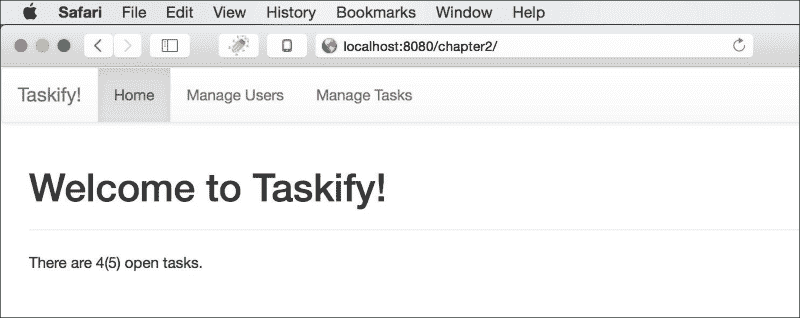
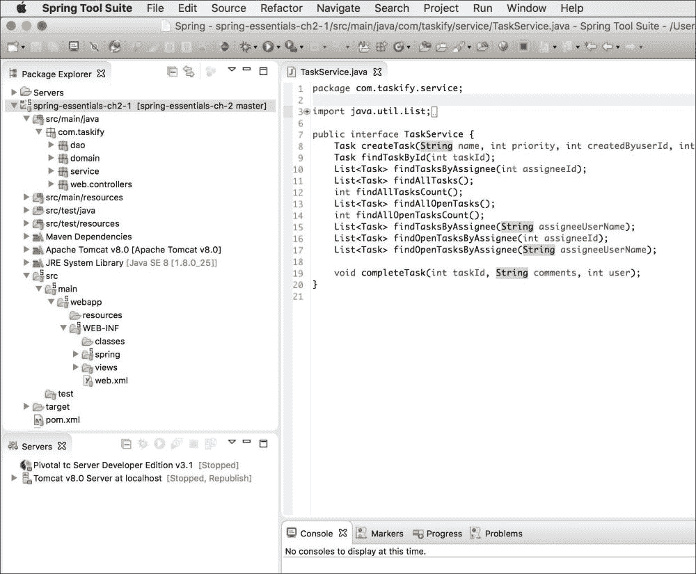
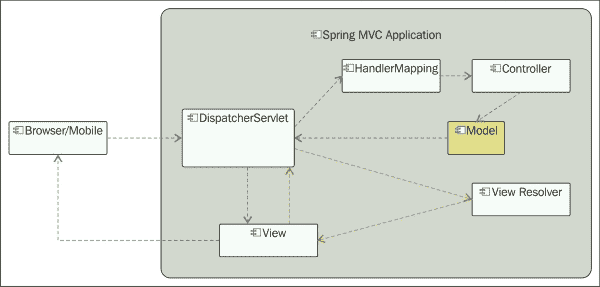
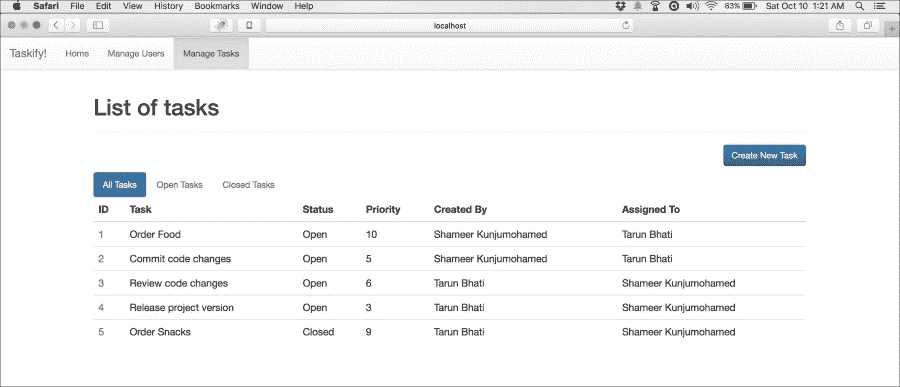

# 第二章：使用 Spring Web MVC 构建 Web 层

Web 应用程序开发是企业系统的一个主要关注领域。在云和大数据时代，Web 应用程序承受着越来越多的并发用户访问的巨大压力，这些用户来自多种设备，如手机、平板以及传统的桌面 Web 浏览器。现代 Web 应用程序必须满足一系列新的非功能性需求，如可伸缩性、性能、生产力、响应性和多设备支持。

Spring MVC 是 Spring 的一个 Web 框架，从头开始完美构建，以解决现代 Web 应用程序的问题。作为一个轻量级高性能的 Web 框架，Spring MVC 旨在从一开始就具有高生产力，灵活，并且能够适应各种视图技术。作为强大的 Spring Framework 的一部分，它与所有 Java EE 技术和其他开源框架都很好地集成。就像 Spring 系列下的任何技术一样，Spring MVC 也通过一组明确定义的注解、命名空间 XML 标签和 Web 支持组件来促进 POJO 编程。

本章向您介绍了 Spring MVC 及其强大的功能，描述了如何设置它，并指导您如何使用相关示例进行高级用法、配置和优化。在这些示例中，我们将主要使用注解以简化操作。在本章结束时，您将能够使用 Spring MVC 构建具有基于 HTML 的用户界面以及具有 JSON 和 XML 格式的 RESTful API 的 Web 应用程序。

# Spring MVC 的特点

Spring MVC 捆绑了一套引人注目的功能和优势，超过了竞争对手的 Web 技术。了解这些将有助于您决定是否选择 Spring MVC 来满足您的需求。以下列表涵盖了大部分内容：

+   简单的配置和与 Spring Framework 的本地集成，利用 Spring 和其他开源库的强大功能

+   基于 Java Web 技术构建，如 Servlets、JSP 和 JSTL，并且可以部署到任何标准的 Servlet 容器中，比如 Tomcat

+   基于**模型-视图-控制器**（**MVC**）架构模式实现，使用简单的注解和命名空间 XML 标签清晰地分离关注点

+   对 MVC 组件的约定优于配置的显式支持

+   支持大量的视图技术，如 JSP、Thymeleaf、Handlebars、Velocity、FreeMarker、PDF、Excel 和 JasperReports

+   声明性输入验证、数据绑定和异常处理

+   灵活的 URL 映射，自动将请求和响应转换为各种格式，如 JSON、XML 和 HTML

+   支持非阻塞异步请求处理和 HTTP 流式传输

+   支持国际化、主题和多部分文件上传

+   与 Spring Security 的轻松集成和全面的可测试性

+   增加性能的 HTTP 缓存

+   一个简单而强大的 JSP 标签库

Spring MVC 的杰出之处在于其简单的编程模型，这是从核心 Spring 框架本身继承的特性。熟悉任何标准 Web 框架的开发人员会发现 Spring MVC 非常熟悉和易于学习。

# 模型-视图-控制器模式

MVC 是一种广泛用于构建交互式 Web 和桌面应用程序的成熟的架构模式。在大多数软件平台上有许多实现这种模式的框架。MVC 将应用程序分为三个核心元素，实际上代表层，分离这三个核心元素之间的关注点，并定义它们如何相互通信。


**Model**表示数据，**View**显示**Model**，**Controller**处理用户操作。模型可以是任何数据，包括存储在数据库中的数据。它通常表示具有彼此清晰定义关系的域对象集合。根据应用程序的设计，一个**Model**可以在多个视图中显示。

**Controller**充当**View**和**Model**之间的中介。它通常具有一组处理程序，用于视图生成的每个事件。**Controller**将用户操作委托给适当的处理程序，然后最终重定向到另一个视图，以显示该操作的结果。

由于不同技术平台上的框架以不同的方式使用 MVC 模式，因此有许多 MVC 模式的实现。Spring MVC 以最简单和最少侵入性的方式实现了它，并自然地将其与核心 Spring 框架集成在一起。

# 您的第一个 Spring MVC 应用程序

让我们开始创建一个非常简单的 Spring MVC Web 应用程序。为了学习的目的，我们将开发*Taskify*的 Web 版本，这是我们在第一章中开始的任务管理系统，*开始使用 Spring Core*。本章中的示例使用**Spring Tool Suite**（**STS**）作为 IDE，但您也可以使用您喜欢的 IDE，如 IntelliJ 和 NetBeans。几乎所有的 Java IDE 都支持 Spring 开发；它们中的大多数都有插件来管理 Spring 项目和构件。

首先，按照以下步骤进行；然后，我们将探索代码：

1.  打开 STS 或 Eclipse→创建一个新项目→输入项目名称→选择一个模板，要么是**Spring MVC 项目**，要么是**简单的 Spring Web Maven**→指定顶级包名称→完成。您的项目结构将被生成。

1.  确保您的`pom.xml`文件包含`spring-context`、`spring-mvc`、`servlet-api`、`jsp-api`和`jstl`库的 Maven 依赖项。请注意，只有在使用 JSP 作为视图技术时，才需要`jsp-api`和`jstl`。

1.  如果尚未生成，请在`WEB-INF`下创建`web.xml`，内容如下：

```java
<?xml version="1.0" encoding="UTF-8"?>
<web-app 

  xsi:schemaLocation="http://xmlns.jcp.org/xml/ns/javaee
  http://xmlns.jcp.org/xml/ns/javaee/web-app_3_1.xsd" version="3.1">
<!-- \ Root Container shared by Servlets and Filters -->
  <context-param>
    <param-name>contextConfigLocation</param-name>
    <param-value>/WEB-INF/spring/root-context.xml</param-value>
  </context-param>

<!-- Loads Spring Container shared by all Servlets and Filters -->
  <listener>
    <listener-class>
      org.springframework.web.context.ContextLoaderListener
    </listener-class>
  </listener>

  <!-- Processes application requests -->
  <servlet>
    <servlet-name>appServlet</servlet-name>
    <servlet-class>
      org.springframework.web.servlet.DispatcherServlet
    </servlet-class>
    <init-param>
      <param-name>contextConfigLocation</param-name>
      <param-value>/WEB-INF/spring/servlet-context.xml</param-value>
    </init-param>
    <load-on-startup>1</load-on-startup>
  </servlet>

  <servlet-mapping>
    <servlet-name>appServlet</servlet-name>
    <url-pattern>/</url-pattern>
  </servlet-mapping>
</web-app>
```

1.  如果尚未生成，请创建一个`root-context.xml`文件，内容如下：

```java
<?xml version="1.0" encoding="UTF-8"?>
<beans 

  xsi:schemaLocation="http://www.springframework.org/schema/beans http://www.springframework.org/schema/beans/spring-beans.xsd">

  <!-- Root Context: defines all shared beans go here -->
</beans>
```

1.  如果尚未生成，请创建一个`servlet-context.xml`文件，内容如下：

```java
<?xml version="1.0" encoding="UTF-8"?>
<beans:beans  ...>

  <!-- Enables the Spring MVC @Controller programming model -->
  <annotation-driven />
  <context:component-scan base package="com.taskify"/>

  <!-- Handles HTTP GET requests for /resources/** by serving up static resources in ${webappRoot}/resources directory -->
  <resources mapping="/resources/**" location="/resources/" />

  <!-- Resolves views selected for rendering by @Controllers to
      .jsp resources in the /WEB-INF/views directory -->
  <beans:bean class=
  "org.springframework.web.servlet.view.InternalResourceViewResolver">
    <beans:property name="prefix" value="/WEB-INF/views/" />
    <beans:property name="suffix" value=".jsp" />
  </beans:bean>
</beans:beans>
```

1.  现在，在`com.taskify.web.controllers`包下创建一个名为`HomeController`的 Java 类，内容如下：

```java
@Controller
public class HomeController {
  private static final Logger logger = LoggerFactory.getLogger(HomeController.class);
  @Autowired
  private TaskService taskService;
  // Simply selects the home view to render by returning // name.
  @RequestMapping(value = "/", method = RequestMethod.GET)
  public String home(Locale locale, Model model) {
    logger.info("Welcome to Taskify! Locale is {}.", locale);
    model.addAttribute("totalTasks",
    taskService.findAllTasksCount() );
    model.addAttribute("totalOpenTasks", taskService.findAllOpenTasksCount() );
    return "home";
  }
}
```

1.  在`~WEB-INF/views`下创建一个名为`home.jsp`的 JSP 视图，内容如下：

```java
<%@ taglib uri="http://java.sun.com/jsp/jstl/core" prefix="c"%>
<%@ page session="false"%>
<html>
  <head>
    <jsp:include page="/WEB-INF/views/theme.jsp"></jsp:include>
    <title>Taskify :: Home</title>
  </head>
  <body>
    <jsp:include page="/WEB-INF/views/navbar.jsp"></jsp:include>
    <div class="container">
      <h1>Welcome to Taskify!</h1><hr />
      <P>There are ${totalOpenTasks}(${totalTasks}) open tasks.</P>
    </div>
  </body>
</html>
```

1.  确保您的项目中有`TaskService`类（从第一章中复制），以及它的具体实现，其中实现了`findAllTasksCount()`和`findAllOpenTasksCount()`方法。

1.  现在您的项目已准备就绪，请确保已安装并配置了 Apache Tomcat（或其他任何）服务器与您的 IDE。您可以从[`tomcat.apache.org/`](http://tomcat.apache.org/)下载 Tomcat 并在您的 PC 上安装。

1.  STS 和 Eclipse 允许您通过右键单击**Run As** → **Run on Server**从 IDE 中运行 Java Web 应用程序。解决所有错误（如果有），然后再次运行。

1.  您应该看到您的 Web 应用程序的主屏幕（在`http://localhost:8080/chapter2/`），如下所示：

# 设置 Spring MVC 应用程序

让我们通过分析前一节*您的第一个 Spring MVC 应用程序*中列出的应用程序构件来弄清楚 Spring MVC Web 应用程序是如何配置的。它包含了构建 Spring MVC Web 应用程序所需的所有必要构件。

## Spring MVC 应用程序的项目结构

创建项目结构和必要的构件的最简单方法是使用 STS 创建 Spring MVC 项目，如前一节所述。或者，您可以使用各种在线存储库中提供的 Maven 原型之一。STS 使用这样一个捆绑的原型。以下是在 STS 中查看的 Spring MVC 应用程序的典型项目结构：



该结构代表一个单一 WAR Web 应用程序，其中所有服务和数据访问组件与 Web 控制器共存。在更大的应用程序中，许多这样的组件可能是不同 JAR 库项目的一部分，可以在多个 Web 应用程序之间共享，然后作为 Maven 依赖项添加到消费 Web 应用程序中，并使用`<import/>`标签或注释配置将其导入到 Web 应用程序上下文 XML 文件中的 bean。

现在，让我们详细检查*您的第一个 Spring MVC 应用程序*中列出的每个构件。

## web.xml 文件-使 web 应用程序 Spring 化

`web.xml`文件是标准的 Java Web 描述符，其中注册了构成 Java Web 应用程序的基本 Web 组件，这些组件与 Servlet 容器一起使用。在这里配置了`ServletContextListener`和`ServletFilter`组件。

Spring MVC 应用程序也在`web.xml`中配置和引导。在`web.xml`示例中，`ContextLoaderListener`注册为`ServletContextListener`，引导 Spring 的根`WebApplicationContext`。在上一章中，我们看到了一个简单的控制台应用程序如何在主方法内部使用`ClassPathXmlApplicationContext`引导 Spring 上下文。在 Web 应用程序的情况下，遵循`ContextLoaderListener`加载`WebApplicationContext`。请记住，Spring MVC 应用程序不仅仅是另一个基于 Servlet 的应用程序，而是 Spring 集成在 Web 上下文中。

```java
   <listener>
      <listener-class>
         org.springframework.web.context.ContextLoaderListener
      </listener-class>
   </listener>
```

以下监听器查找`context-param`标签`contextConfigLocation`，这是 Spring 根 bean 定义 XML 文件的位置，如前面的`web.xml`文件中所示：

```java
<context-param>
   <param-name>contextConfigLocation</param-name>
   <param-value>/WEB-INF/spring/root-context.xml</param-value>
</context-param>
```

在`web.xml`文件中配置的下一个非常重要的 Spring 组件是`DispatcherServlet`，它是 Spring MVC 应用程序的集中入口点，将每个请求映射到适当的处理程序。`DispatcherServlet`是前端控制器设计模式的实现，它是应用程序中所有 HTTP 请求的单一集中入口点。它内部将它们委托给请求类型的实际处理程序。以下是先前`web.xml`列表中的摘录：

```java
<servlet>
   <servlet-name>appServlet</servlet-name>
   <servlet-class>
      org.springframework.web.servlet.DispatcherServlet
   </servlet-class>
   <init-param>
      <param-name>contextConfigLocation</param-name>
      <param-value>
         /WEB-INF/spring/appServlet/servlet-context.xml
      </param-value>
   </init-param>
   <load-on-startup>1</load-on-startup>
</servlet>

<servlet-mapping>
   <servlet-name>appServlet</servlet-name>
   <url-pattern>/</url-pattern>
</servlet-mapping>
```

`DispatcherServlet`的前面 Servlet 注册将根 URL 映射到`DispatcherServlet`，以便每个进入服务器的 HTTP 请求都将首先由`DispatcherServlet`处理。此外，它指定了此 Servlet 的 Spring 应用程序上下文文件的位置。

### 注意

您的应用程序可以具有任意数量的`DispatcherServlet`定义，具有唯一的 Servlet 名称，具体取决于您希望根据功能模块在逻辑上如何划分 URL 子上下文。大多数应用程序只会定义一个`DispatcherServlet`。

## Spring MVC 应用程序中的 ApplicationContext 文件

Spring MVC 应用程序只是具有 Spring 本地集成的基于 Servlet 的 Web MVC 实现。因此，它需要像任何其他 Spring 应用程序一样的 Spring 豆子定义，正如我们在前一章中所看到的。在 Spring MVC 应用程序的情况下，除了应用程序特定的豆子之外，还会有一些特定于框架的豆子在上下文中注册。

为了将豆子组织在不同的逻辑类别下，例如特定于 Web 的（`DispatcherServlet`）以及共享的豆子，可以使用多个豆子定义。例如，`DispatcherServlet`可以有自己的应用程序上下文文件，其中定义了帮助其处理的豆子（仅适用于 Web 上下文），还可以有一个根应用程序上下文文件，其中定义了不特定于 Web 层但在许多层之间共享的豆子。

在之前章节列出的示例中，作为*您的第一个 Spring MVC 应用程序*的一部分，您可以看到两个 Spring 豆子定义 XML 文件，`root-context.xml`和`servlet-context.xml`。`root-context.xml`文件代表通过`ContextLoaderListener`加载的根`WebApplicationContext`。这是您定义或导入共享豆子的地方，例如服务豆子和数据访问对象。

`servlet-context.xml`文件在启动时由`DispatcherServlet`加载。文件名`servlet-context.xml`是示例清单中明确给出的文件名。默认情况下，`DispatcherServlet`会寻找具有模式`[servlet-name]-servlet.xml`的 XML 豆子定义文件，也就是说，如果没有明确指定，`appServlet`将在`WEB-INF`文件夹的根目录中寻找名为`appServlet-servlet.xml`的文件。通常，此文件包含控制此 Servlet 行为的豆子定义。例如，您可以在文件`servlet-context.xml`中看到资源和视图解析器豆子定义。您可以看到示例清单中配置的视图解析器仅支持 JSP 视图。

## HomeController - 主屏幕的@Controller

`HomeController`是一个带有`@Controller`注释的简单 POJO。此注释将其注册为具有一组注释处理程序方法的 Web 控制器。它可以在类级别具有`@RequestMapping`注释，以指示其中所有处理程序方法的根 URL。`home()`方法是根 URL `http://<context-root>/`的请求处理程序。

由于`@Controller`注释是另一个 Spring 豆子，因此您可以将任何其他豆子注入其中作为依赖项。示例清单显示`HomeController`具有对`TaskService`的自动装配依赖项。在`home()`方法中，调用了`TaskService`方法，最后，将返回值设置为`Model`属性，以供请求的后续部分使用并在视图中使用。

您的应用程序将有许多这样的控制器，用于服务相关 URL 端点的组。将`HomeController`视为您的基本示例。一个控制器可以有多个处理请求的方法，用于服务不同的 URL。

## home.jsp 文件 - 登陆屏幕

`home.jsp`文件是根（`/`）URL 的视图工件。请注意`Model`属性如何在 JSP 视图中绑定：

```java
<P>There are ${totalOpenTasks}(${totalTasks}) open tasks.</P>
```

## 处理传入请求

任何命中应用程序根 URL 的请求首先由`DispatcherServlet`接收，然后将其委托给`HomeController.home()`，该方法处理请求并返回视图名称（在本例中为`home`）。然后，`DispatcherServlet`根据在`servlet-context.xml`中指定的资源和视图配置选择`home.jsp`文件并进行渲染，传递在`HomeController.home()`中创建的模型实例的属性。

# Spring MVC 的架构和组件

通过您的第一个 Spring MVC 应用程序后，现在是时候从架构的角度来看 Spring MVC 应用程序了。



Spring MVC 组件

顾名思义，Spring MVC 遵循着著名的 MVC 架构模式。这种模式通过将责任分为三个主要角色来确保关注点的分离：

+   **模型**：代表数据和业务逻辑

+   **视图**：代表呈现

+   **控制器**：处理客户端请求并将其委托给视图以返回给客户端进行呈现

我们在这里谈论的“模型”不一定是持久数据（数据模型）本身；相反，它代表了客户端和服务器应用程序的不同层之间传递的信息，这些信息构成了任何系统的基本构件。

除了“模型”、“视图”和“控制器”组件之外，`DispatcherServlet`在 Spring MVC 架构中也扮演着至关重要的角色。它充当了前端控制器，这是许多 MVC 框架采用的流行 J2EE 设计模式。实际上，`DispatcherServlet`不仅仅是一个前端控制器。这将在下一节中详细解释。

在 Spring MVC 应用程序中，`DispatcherServlet`首先接收通过 HTTP 命中服务器的客户端请求的 URL。通过`HandlerMapping`配置的帮助，`DispatcherServlet`根据 URL 模式找到适当的**控制器**方法，并将请求委托给它。控制器处理请求，可选地填充**模型**对象，并返回要呈现的**视图**的名称。`DispatcherServlet`然后选择**视图**并将其呈现回客户端，将**模型**的属性应用于**视图**中的占位符。

前面段落提到的只是 Spring MVC 的典型请求处理流程。然而，它非常灵活，有很多选项来支持不同类型的视图技术和输入输出结构和格式，包括文件、流等等。我们将在接下来的部分中更详细地探讨它们。

# 解释了 DispatcherServlet

`DispatcherServlet`是任何 Spring MVC 应用程序的入口。它继承自`javax.servlet.http.HttpServlet`，通常在`web.xml`文件中进行声明式配置。虽然您可以有多个具有唯一 URL 模式的`DispatcherServlet`的定义，但大多数 Spring MVC 应用程序只有一个`DispatcherServlet`，其`context-root` URL（`/`），也就是说，所有请求都将由`DispatcherServlet`处理。

从 Servlet 3.0 开始，除了在`web.xml`文件中进行声明式配置外，`DispatcherServlet`还可以通过实现或扩展 Spring 提供的这三个支持类之一来进行编程配置：

+   `WebAppInitializer`接口

+   `AbstractDispatcherServletInitializer`抽象类

+   `AbstractAnnotationConfigDispatcherServletInitializer`抽象类

以下代码清单演示了如何直接在应用程序中实现`WebAppInitializer`：

```java
public class ApplicationInitializer implements WebApplicationInitializer {

  private static final Logger logger = LoggerFactory.getLogger(ApplicationInitializer.class);

  @Override
  public void onStartup(ServletContext servletContext) throws ServletException {

    logger.info("===== Application is starting up! ========");
    XmlWebApplicationContext appContext = new XmlWebApplicationContext();
    appContext.setConfigLocation("/WEB- INF/spring/appServlet/servlet- context.xml");

    ServletRegistration.Dynamic registration = servletContext.addServlet("rootDispatcher", new DispatcherServlet(appContext));
    registration.setLoadOnStartup(1);
    registration.addMapping("/");
  }
```

## WebApplicationContext - Web 的 ApplicationContext

`DispatcherServlet`使用了一个名为`WebApplicationContext`的专门的`ApplicationContext`，具有许多 web 请求处理功能。它知道它关联的是哪个`ServletContext`，并且还能够解析主题。这个接口有具体的实现，用于特定的上下文，比如 XML，`@Configuration`注解的类和 portlet。默认情况下，`DispatcherServlet`使用`XMLWebApplicationContext`。当`DispatcherServlet`加载时，它会查找`WebApplicationContext`的 bean 配置文件并对其进行初始化。

`WebApplicationContext`对象是分层的。每个 Spring MVC 应用程序都有一个根`ApplicationContext`（可以在`web.xml`文件中的`context-param`标签中配置为`contextConfigLocation`），每个 Servlet，包括`DispatcherServlet`，都有自己的子上下文（可以通过自己的`init-param`，`contextConfigLocation`进行配置）。理想情况下，Servlet 特定的子上下文具有自定义该 Servlet 的 bean，而根`ApplicationContext`具有所有共享的 bean。

## 支持 DispatcherServlet 的 bean 及其角色

收到 web 请求后，`DispatcherServlet`在请求处理的过程中依次执行一系列操作，借助一组支持 bean 的帮助。此表列出了这些特殊 bean 及其职责：

| Bean | 职责 |
| --- | --- |
| `HandlerMapping` | 将传入的 web 请求映射到处理程序和前后处理器 |
| `HandlerAdapter` | 调用解析参数和依赖项的处理程序，例如 URL 映射控制器方法端点的注释参数 |
| `HandlerExceptionResolver` | 允许以编程方式处理异常并将异常映射到视图 |
| `ViewResolver` | 将逻辑视图名称解析为视图实例 |
| `LocaleResolver` | 解析客户端的区域设置以实现国际化 |
| `LocaleContextResolver` | `LocaleResolver`的更丰富的扩展，带有时区信息 |
| `ThemeResolver` | 解析应用程序中配置的主题，以增强用户体验 |
| `MultipartResolver` | 处理 HTTP 请求中的多部分文件上传 |
| `FlashMapManager` | 管理 FlashMap 实例，用于在重定向的请求之间存储临时 Flash 属性 |

`DispatcherServlet`非常灵活；我们甚至可以为所有这些 bean 创建和配置自定义实现。但是，Spring MVC 默认提供了一组很好的实现，因此除非绝对需要，否则您不需要自定义或提供自己的实现。这些默认实现可以在`org.springframework.web.servlet.DispatcherServlet.properties`中找到。如果您用自己的实现覆盖了这些 bean 中的任何一个，您的实现将覆盖默认值。

# 详细的控制器

控制器，其方法带有`@RequestMapping`注解，处理 web 请求。它们以多种形式接受输入数据，并将其转换为`Model`属性，以供视图消费，然后显示给客户端。它们将用户连接到服务层 bean，其中定义了应用程序行为。

Spring MVC 中的控制器具有以下签名：

```java
public interface Controller {

   ModelAndView handleRequest(HttpServletRequest request, HttpServletResponse response) throws Exception;
}
```

控制器被设计为一个接口，允许您创建任何类型的实现。从 Spring 版本 2.5 开始，您可以通过使用`@Controller`对任何类进行注释，将其转换为控制器。这使您无需实现任何特定的接口或扩展特定于框架的类：

```java
@Controller
public class HomeController {

   @RequestMapping(value = "/", method = RequestMethod.GET)
   public String home(Model model) {
      logger.info("Welcome to Taskify", locale);
      return "home";
   }
}
```

`@Controller`注解将给定类指定为控制器的角色。Spring MVC 应用程序会自动检测其类路径中的所有控制器，并在启用组件扫描时将它们注册到`WebApplicationContext`中，如下所示：

```java
<context:component-scan base-package="com.taskify" />
```

`@Controller`，`@RequestMapping`和一组其他注解构成了 Spring MVC 的基础。这些注解允许控制器具有灵活的方法名称和签名。我们将在下一节中详细探讨它们。

## 使用@RequestMapping 映射请求 URL

`@RequestMapping`注解将请求 URL 映射到整个`@Controller`类或其处理程序方法。它可以应用于类级别和方法级别。通常，您将类级别的@RequestMapping 注解应用于映射一组相关的 URL，例如具有多个操作的表单，而方法级别的@RequestMapping 注解用于特定操作，例如创建、读取、更新、删除、上传和下载。让我们来看一个典型的基于表单的控制器，其中包含纯 REST 模型的各种操作（`GET`，`POST`，`PUT`和`DELETE`）：

```java
@Controller
@RequestMapping("/users")
public class UserController {

   @Autowired
   private UserService userService;

   @RequestMapping(method = RequestMethod.GET)
   public String listAllUsers(Locale locale, Model model) {
      model.addAttribute("users", userService.findAllUsers());
      return "user/list";
   }

   @RequestMapping(path = "/new", method = RequestMethod.GET)
   public String newUserForm(Model model) {
      User user = new User();
      user.setDateOfBirth(new Date());
      model.addAttribute("user", user);
      return "user/new";
   }

   @RequestMapping(path = "/new", method = RequestMethod.POST)
   public String saveNewUser(@ModelAttribute("user") User user, Model model) {
      userService.createNewUser(user);
      return "redirect:/user";
   }
   @RequestMapping(path = "/{id}", method = RequestMethod.GET)
   public ModelAndView viewUser(@PathVariable("id") Long id) {
      return new ModelAndView("user/view").addObject("user", userService.findById(id));
   }

   @RequestMapping(path = "/{id}/edit", method = RequestMethod.GET)
   public String editUser(@PathVariable("id") Long id, Model model) {
      model.addAttribute("user", userService.findById(id));
      return "user/edit";
   }

   @RequestMapping(path = "/{id}", method = RequestMethod.PUT)
   public String updateUser(@PathVariable("id") Long id, @ModelAttribute("user") User user, Model model) {
      userService.updateUser(user);
      model.addAttribute("user", userService.findById(user.getId()));
      return "redirect:/user/" + id;
   }

   @RequestMapping(path = "/{id}", method = RequestMethod.DELETE)
   public String deleteUser(@PathVariable("id") Long id, Model model) {
      User existingUser = userService.findById(id);
      userService.deleteUser(existingUser);
      return "redirect:/user";
   }
}
```

在上述代码中列出的`UserController`具有作为请求处理程序的方法，用于表示对用户实体进行 CRUD 操作的 URL，并借助`UserService`作为依赖项注入到控制器中。由于这个控制器是基于 Web 视图的，处理程序方法填充模型并返回视图名称或`ModelAndView`对象以供进一步显示。最后两个处理程序方法`updateUser()`和`deleteUser()`在返回响应后重定向请求。它们在最后执行 URL 重定向，将响应返回给客户端。

请注意，`UserController`有一个根 URL（`/user`），处理程序方法具有更窄的映射，使用 HTTP 方法的组合。它们由以下表中看到的确切 URL 调用：

| URL | 处理程序方法 | HTTP 方法 | 匹配的 URL（示例） |
| --- | --- | --- | --- |
| `/` | `listAllUsers` | `GET` | `http://localhost:8080/user` |
| `/new` | `newuserForm` | `GET` | `http://localhost:8080/user/new` |
| `/new` | `saveNewUser` | `POST` | `http://localhost:8080/user/new` |
| `/{id}` | `viewUser` | `GET` | `http://localhost:8080/user/123` |
| `/{id}/edit` | `editUser` | `GET` | `http://localhost:8080/user/123/edit` |
| `/{id}` | `updateUser` | `PUT` | `http://localhost:8080/user/123` |
| `/{id}` | `deleteUser` | `DELETE` | `http://localhost:8080/user/123` |

默认情况下支持`GET`和`POST`方法，与 HTML（因此浏览器）对其他两种方法的有限支持一致。但是，要使`PUT`和`DELETE`方法工作，您需要在`web.xml`文件中注册`HiddenHttpMethodFilter`。使用以下代码：

```java
<filter>
   <filter-name>httpMethodFilter</filter-name>
   <filter-class>org.springframework.web.filter. HiddenHttpMethodFilter</filter-class>
</filter>

<filter-mapping>
   <filter-name>httpMethodFilter</filter-name>
   <servlet-name>rootDispatcher</servlet-name>
</filter-mapping>
```

`HiddenHttpMethodFilter`即使在没有 Spring MVC 的情况下也可以工作；您可以将其与任何 Java Web 框架甚至纯 Servlet 应用程序一起使用。

## 带有@PathVariable 注解的 URI 模板模式

在上述代码中的示例`UserController`列表中，您可能已经注意到处理请求时使用变量名称替换为值的模板化 URL 模式。例如：

```java
@RequestMapping(path = "/{id}/edit", method = RequestMethod.GET)
public String editUser(@PathVariable("id") Long id, Model mdl) { … }
```

在这里，模板变量`id`被映射到`@PathVariable`注解。它被包含在大括号中，并被注释为映射的方法参数。URL 可以有任意数量的路径变量。它们支持正则表达式以及 Apache Ant 风格的路径模式。它们帮助您在经典的 REST 模型中构建完美的 URI 端点。

## 使用@RequestParam 注解绑定参数

与 URI 字符串内联的请求参数可以使用@RequestParam 注解与方法参数进行映射。请参阅`TaskController`中的以下摘录：

```java
@Controller
public class TaskController {
...
   @RequestMapping(path = "/tasks", method = RequestMethod.GET)
   public String list(@RequestParam(name = "status", required = false) String status, Model model) {
      model.addAttribute("status", status);
      model.addAttribute("tasks", taskService.findAllTasks(status));
      return "task/list";
   }
...
}
```

调用上述处理程序的典型 URL 是`http:<context-root>/tasks?status=Open`。

`@RequestParam`有四个属性：`name`，`required`，`value`和`defaultValue`。`name`是一个必需的属性，其他所有属性都是可选的。默认情况下，所有请求参数都需要设置为`true`，除非您将它们指定为`false`。Spring 会自动将@RequestParam 的值转换为参数类型。

## 请求处理程序方法参数

`@RequestMapping`方法可以具有灵活的方法签名；支持混合框架，自定义对象和注解。如果在方法参数中找到，它们将在请求处理期间自动注入。以下是一些受支持的框架类和注解的列表；请参阅 Spring 官方文档或`RequestMapping`的 Javadoc 以获取完整列表。

| 支持的类 | 注解 |
| --- | --- |
| `javax.servlet.ServletRequest` | `@PathVariable` |
| `javax.servlet.ServletRequest` | `@RequestVariable` |
| `javax.servlet.http.HttpSession` | `@RequestParam` |
| `org.springframework.ui.Model` | `@RequestHeader` |
| `org.springframework.validation.BindingResult` | `@RequestBody` |
| `Java.util.Map` | `@RequestPart` |
| `Java.io.InputStream` | `@InitBinder` |

虽然框架类不需要任何特定的注解，但自定义类通常需要在处理程序适配器中伴随受支持的注解之一，以将传入的 Web 请求对象转换/格式化为类实例。

## 请求处理程序方法返回类型

与灵活的参数类型类似，由`@RequestMapping`注解的方法可以具有自定义类型（通常注释为`@ResponseBody`）或许多受支持的框架类之一。以下列表包含许多受支持的类型之一：

+   `org.springframework.web.servlet.ModelAndView`

+   `org.springframework.ui.Model`

+   `java.util.Map`

+   `org.springframework.web.servlet.View`

+   `java.lang.String`

+   `void`

+   `java.util.concurrent.Callable<?>`

+   `org.springframework.http.HttpEntity`

## 设置模型属性

`Model`属性用于视图的显示和与表单元素的绑定。它们可以在控制器和处理程序方法级别设置。

任何具有非 void 返回类型的方法都可以被注释为`@ModelAttribute`，以使方法返回类型成为由声明的 Controller 解析的所有视图的`Model`属性。看一个例子：

```java
@ModelAttribute(value = "users")
public List<User> getUsersList() {
   return userService.findAllUsers();
}
```

特定于视图的模型属性在视图解析的处理程序方法内设置。以下是一个例子：

```java
@RequestMapping(path = "/tasks/new", method = RequestMethod.GET)
public String newTaskForm(Model model) {
   model.addAttribute("task", new Task());
   return "task/new";
}
```

## 为 JSON 和 XML 媒体构建 RESTful 服务

Web 应用程序通常需要将其一些服务公开为 Web API，使用 XML 或 JSON 数据格式，或两者兼而有之，以供浏览器以及移动设备和平板电脑的 AJAX 请求消费。

**REpresentational State Transfer** (**REST**), 是一种建立与原生 Web 协议和方法一致的 Web API 的已建立的架构风格。使用 REST，数据被表示为资源，可以使用 HTTP 的无状态协议通过 URI 访问和操作。REST 坚持使用 HTTP 方法`POST`，`GET`，`PUT`和`DELETE`来映射对资源的创建，读取，更新和删除操作（CRUD）。

Spring MVC 非常容易构建简单的 API 端点，以消费和生成不同的媒体类型，如文本，JSON 和 XML。`@Controller`注解中的请求处理程序方法可以使用以下两个步骤接受 JSON，XML 或任何其他媒体类型：

1.  在`RequestMapping`方法中将属性`consumes`设置为适当的媒体类型（例如`consumes = {"text/plain", "application/json"})`。

1.  使用`@RequestBody`注释所需类型的方法参数。Web 请求应包含在步骤 1（`consumes`；JSON，XML 等）中提到的格式的数据，并在处理期间由`HttpMessageConverter`解析为此类型。

类似地，请求处理程序方法可以使用以下两个步骤生成 JSON，XML 或任何其他媒体类型：

1.  在`RequestMapping`方法中将属性`produces`设置为适当的媒体类型（例如`consumes = {"text/plain", "application/json"})`。

1.  在处理程序方法的返回类型或方法声明本身（紧邻`@RequestMapping`）旁边使用`@ResponseBody`进行注解。处理程序将返回值转换为`RequestMapping`中指定的数据格式。

`RequestMapping`的`consumes`和`produces`属性将主映射缩小到给定的媒体类型（例如`consumes = "application/xml"`）或一系列媒体类型（例如`consumes = {"text/plain", "application/json"}`）。

除了属性之外，确保`pom.xml`文件中存在以下库：

```java
<dependency>
   <groupId>com.fasterxml.jackson.core</groupId>
   <artifactId>jackson-databind</artifactId>
   <version>2.6.2</version>
</dependency>
```

以下是一个接受 JSON 请求并返回 JSON 响应的示例处理程序方法：

```java
@RequestMapping(path = "/tasks/new.json", method=RequestMethod.POST, consumes = "application/json", produces = "application/json")
@ResponseBody
public CreateTaskResponse createNewTaskJSON(@RequestBody CreateTaskRequest createRequest) {
   Task task = new Task();
   task.setName(createRequest.getTaskName());
   ...
   return new CreateTaskResponse(taskService.createTask(task));
}
```

这个处理程序方法期望带有 JSON 内容的 web 请求：

```java
{
   "taskName":"Project estimation",
   "priority": 2,
   "creatorId": 1,
   "assigneeId": 2,
   "comments": "Involve the team in the process"
}
```

现在，同样的方法可以稍作修改以支持 XML 内容，`consumes`和`produces`。看一下以下清单：

```java
@RequestMapping(path = "/tasks/new.xml", method = RequestMethod.POST, consumes = "application/xml", produces = "application/xml")
@ResponseBody
public CreateTaskResponse createNewTaskXML(@RequestBody CreateTaskRequest createRequest) {
   Task task = new Task()
   task.setName(createRequest.getTaskName());
   . . .
   return new CreateTaskResponse(taskService.createTask(task));
}
```

确保在`RequestBody`和`ResponseBody`类型的根部分（在这种情况下是`CreateTaskRequest`和`CreateTaskResponse`）存在 JAXB 注解`@XmlRootElement`。

您可以通过向处理程序 URI 发送以下内容的 web 请求来调用前面的 XML 处理程序：

```java
<CreateTaskRequest>
   <taskName>Estimate the project</taskName>
   <priority>2</priority>
   <creatorId>1</creatorId>
   <assigneeId>2</assigneeId>
   <comments>Involve the team in the process</comments>
</CreateTaskRequest>
```

## 使用 RestController 构建 RESTful 服务

`RestController`是一个方便的构建 REST API 端点的约定，可以提供自定义媒体类型，比如 JSON 或 XML。它将`@Controller`与`@ResponseBody`结合在一起，也就是说，在处理程序方法中不需要注解`@ResponseBody`。`@RequestMapping`方法默认假定`@ResponseBody`语义。

让我们看看当 JSON 处理程序方法成为`@RestController`注解的一部分时是什么样子：

```java
@RestController
public class TaskRestController {
   . . .
  @RequestMapping(path="/api/tasks/new.json", method=RequestMethod.POST, consumes="application/json",produces= "application/json")
  public CreateTaskResponse createNewTaskJSON(@RequestBody CreateTaskRequest createRequest) {
    Task task = new Task();
    task.setName(createRequest.getTaskName());
    . . .
    return new CreateTaskResponse(taskService.createTask(task));
  }}
}
```

请注意，映射中唯一的区别是缺少`@ResponseBody`注解。最佳实践是在 REST 控制器内定义 REST API。

# Spring MVC 中的异步请求处理

在 API、AJAX 客户端和设备的时代，Web 服务器的流量呈指数增长。找到使服务器更具可伸缩性的方法是服务器供应商面临的持续挑战。传统的**每个 HTTP 连接一个线程**策略对于更多并发用户访问并不具备良好的可伸缩性。在这种模型中，每个请求都会阻塞 Servlet 容器分配的线程池中的一个线程，直到请求完全处理完毕（到目前为止所示的示例都遵循这种模型）。当 AJAX 客户端（其中一个屏幕经常会发出多个并发连接请求）与长时间运行的进程结合在一起时，由于线程饥饿问题，服务器很容易因为没有空闲线程可用而耗尽。这使得应用程序在负载增加时不可用。

异步 HTTP 请求处理是一种利用 Java 平台 NIO API 的非阻塞 I/O 能力的技术。在这种模型中，服务器线程在整个请求处理过程中不会一直附加到持久的 HTTP 连接上。一旦接收到请求，Servlet 容器就会释放容器线程，并将进一步处理委托给另一个应用程序（在这种情况下是 Spring）管理的线程，以便容器线程可以自由地为新的传入请求提供服务。这种非阻塞请求处理模型节省了大量服务器资源，并稳定地增加了服务器的可伸缩性。

Servlet 3.0 引入了异步处理支持，Spring 从 Spring 3.2 开始实现了这种支持。截至 4.2，Spring 提供了两种定义异步请求处理程序的简单方法：

+   返回`java.util.concurrent.Callable`实例而不是值，并在`Callable`的`call`方法中生成实际的返回值，也就是由 Spring 管理的线程，而不是 Servlet 容器。

+   返回 Spring 特定的`DeferredResult`类型的实例，并在任何其他线程或外部事件中生成实际的返回值，比如 JMS 或 Quartz 调度程序

这两种方法都会尽早释放容器线程，并使用外部线程异步地继续长时间运行的事务。让我们来看一个使用`Callable`的示例：

```java
@RequestMapping(path="/tasks/new.xml",method= RequestMethod.POST, consumes = "application/xml", produces = "application/xml")
@ResponseBody
public Callable<CreateTaskResponse> createNewTaskXMLAsyncCallable( @RequestBody CreateTaskRequest createRequest) {
   return new Callable<CreateTaskResponse>() {

      @Override
      public CreateTaskResponse call() throws Exception {
         Task task = new Task();
         task.setName(createRequest.getTaskName());
         . . .
         Task persistedTask = taskService.createTask(task);
         // Send an email here...
         // Send some push notifications here...
         . . .
         return new CreateTaskResponse(persistedTask);
      }
   };
}
```

在这种方法中，您可以看到处理程序方法在收到请求后立即返回`Callable`对象，而不等待`Callable.call()`方法执行。Spring MVC 使用`TaskExecutor`在另一个线程中调用`call()`方法，并在`call()`方法返回值后将响应分派回 Servlet 容器。

以下是如何使用`DeferredResult`的示例：

```java
@RequestMapping(path = "/tasks/new-async-deferred.json", method = RequestMethod.POST, consumes = "application/json", produces = "application/json")
@ResponseBody
public DeferredResult<CreateTaskResponse> createNewTaskJSONAsyncDeferredResult( @RequestBody CreateTaskRequest createRequest) {

   DeferredResult<CreateTaskResponse> defResult = new DeferredResult<>();
   CompletableFuture.runAsync(new Runnable() {
      @Override
      public void run() {
         Task task = new Task();
         task.setName(createRequest.getTaskName());
         . . .
         Task persistedTask = taskService.createTask(task);
         // Send an email here...
         // Send some push notifications here...
         defResult.setResult(newCreateTaskResponse(persistedTask));
      }
   });
   return deferredResult;
}
```

请记住，您必须在`DispatcherServlet`以及在`web.xml`文件（或者您定义它们的任何地方，也许是在 JavaConfig 类中）中声明的所有 Servlet 过滤器中启用异步处理支持，才能使其工作。以下代码显示了如何在`web.xml`中设置它：

```java
<servlet>
   <servlet-name>appServlet</servlet-name>
   <servlet-class>
      org.springframework.web.servlet.DispatcherServlet</servlet-class>
   . . .
   <async-supported>true</async-supported>
</servlet>
```

您可以根据自己的方便选择前面提到的任何方法来启用异步处理。考虑为了高可伸缩性和性能，设计所有非平凡的服务都能异步工作。

# 处理视图

Spring MVC 提供了一个非常灵活的视图解析机制，它与 MVC 框架的其他元素完全解耦。它不会强迫您使用特定的视图技术；相反，它使您更容易使用您自己喜欢的技术。它甚至允许您在视图层混合和匹配多种技术。Spring MVC 提供了对 JPS、XSLT 和 Velocity 视图的开箱即用支持。

## 解析视图

在典型的 Spring MVC 应用程序中，开发人员选择自己喜欢的视图技术，并相应地使用解析使用该技术构建的视图的`ViewResolver`。

在 Spring MVC 应用程序中负责解析视图的组件是`org.springframework.web.servlet.ViewResolver`。它将逻辑视图名称映射到物理视图资源和所选择的视图技术。

控制器的所有请求处理方法必须通过返回视图名称、视图对象或`ModelAndView`对象来解析逻辑视图名称。`org.springframework.web.servlet.View`对象准备`HttpRequest`以消费所选择的视图技术。

Spring MVC 提供了一组方便的视图解析器，可以直接使用：

| ViewResolver | Description |
| --- | --- |
| `AbstractCachingViewResolver` | 这是`ViewResolver`实现的一个方便的基类。为了更好的性能，它会在解析视图对象后缓存视图对象。 |
| `XmlViewResolver` | 这个解析器使用专用 XML 文件中的 bean 定义来解析视图定义。该文件由资源位置指定。默认情况下，它位于`WEB-INF/views.xml`。 |
| `ResourceBundleViewResolver` | 这个解析器使用`ResourceBundle`中指定的 bean 定义来定义视图。默认的基本名称是`views.properties`。 |
| `UrlBasedViewResolver` | 这个解析器用于解析具有匹配 URL 中物理资源的视图名称。它的两个支持属性，前缀和后缀，帮助定位资源。 |
| `InternalResourceViewResolver` | 这个解析器用于解析带有 JSTL 支持的 Servlets 和 JSPs。它是`UrlBasedViewResolver`的子类。 |
| `VelocityViewResolver` | 这个解析器用于解析 Velocity 模板，是`UrlBasedViewResolver`的子类。 |
| `FreeMarkerViewResolver` | 这个解析器用于解析 FreeMarker 模板。它是`UrlBasedViewResolver`的子类。 |
| `JasperReportsViewResolver` | 这个解析器用于解析不同格式的 JasperReport 视图，比如 CSV、HTML、XLS 和 XLSX。 |
| `TilesViewResolver` | 这个解析器用于解析版本 2 和 3 的 Tiles 视图。 |

本章的示例应用程序使用`UrlBasedViewResolver`来解析 JSP 视图。当您在 Web 应用程序中使用多个视图技术时，您可以使用`ResourceBundleViewResolver`。

## 解析 JSP 视图

**Java Server Pages** (**JSP**), 是 Java EE 的主要网页模板技术，是一种简单易用的工具，用于基于 JVM 的动态网页内容的快速开发。建立在 Servlet 技术之上，JSP 可以直接访问整个 Java API。JSP 通过允许用户以自然的 HTML 格式设计网页，然后在脚本块中嵌入所需的 Java 代码，大大简化了网页作者的工作。

**Java Server Pages Tag Library** (**JSTL**) 是一组标准化的类似 HTML 标签，非常适用于 JSP 页面。JSTL 消除了在 JSP 页面中混合 Java 代码的需要，因此使得 JSP 页面更加清洁和易于编写。

Spring MVC 使用 `InternalResourceViewResolver` 解析 JSP 页面。在前面的部分 *Your first Spring MVC application* 中，我们已经为 JSP 配置了 `ViewResolver` 类。

```java
<beans:bean class="org.springframework.web.servlet.view.InternalResourceViewResolver">
  <beans:property name="prefix" value="/WEB-INF/views/" />
  <beans:property name="suffix" value=".jsp" />
</beans:bean>
```

Spring MVC 建议将视图文件（在这种情况下是 JSP）放在 `WEB-INF` 目录下，以避免直接客户端访问。`ViewResolver` 会从物理位置发现视图文件，并在解析后默认缓存它们，这有助于提高性能。

## 使用 JSTL 在 JSP 页面中绑定 Model 属性

视图可以访问从关联处理程序方法和控制器设置的 `Model` 属性。这些 `Model` 属性可以在 JSP 视图中使用 JSTL 显示。在下面的示例中，使用 JSTL 列出了 `Model` 属性 `tasks`：

```java
<%@ taglib uri="http://java.sun.com/jsp/jstl/core" prefix="c"%>
...
<table class="table table-hover">
  <thead>
    <tr>
      <th>ID</th>
      <th>Task</th>
      <th>Status</th>
      <th>Priority</th>
      <th>Created By</th>
      <th>Assigned To</th>
    </tr>
  </thead>
  <tbody>
    <c:if test="${not empty tasks}">
      <c:forEach var="task" items="${tasks}">
        <tr>
          <td>
            <a href='<c:url value="/tasks/${task.id}"/>'>${task.id}</a>
          </td>
          <td>${task.name}</td>
          <td>${task.status}</td>
          <td>${task.priority}</td>
          <td>${task.createdBy.name}</td>
          <td>${task.assignee.name}</td>
        </tr>
      </c:forEach>
    </c:if>
  </tbody>
</table>
...
```

您可能已经注意到了在前面 JSP 提取的 `/tasks/list.jsp` 视图中声明和使用 JSTL 标签。以下是在浏览器中以适当样式呈现的方式：



# Spring 和 Spring 表单标签库

Spring 捆绑了一组标签，用于更轻松地编写普通 JSP 页面和 JSP 表单，分别在 `spring.tld` 和 `spring-form.tld` 中定义。`spring.tld` 描述了常用于 JSP 页面的通用目的的 JSP 标签，列在以下表中：

| Spring tag | Description |
| --- | --- |
| `<spring:bind/>` | 这允许绑定在本地声明的 bean 或 `Model` 属性的绑定路径中的属性，并为封闭的主体内容提供 `BindStatus` 对象。 |
| `<spring:escapeBody/>` | 这为主体应用了 HTML 转义和 JavaScript 转义。 |
| `<spring:hasBindErrors/>` | 如果存在绑定错误，则提供错误实例。 |
| `<spring:htmlEscape/>` | 这为当前 JSP 页面设置了 HTML 转义值。 |
| `<spring:message/>` | 这会显示给定代码的消息，通常是从资源包中解析出来的。 |
| `<spring:nestedPath/>` | 这将 `ModelAttribute` 的嵌套路径设置为 `<spring:bind/>` 标签内部的标签。 |
| `<spring:theme/>` | 这使用给定代码加载主题资源。 |
| `<spring:transform/>` | 这会转换 `<spring:bind/>` 标签内部的属性，并将它们导出到给定范围的变量中。 |
| `<spring:url/>` | 这会使用 URI 模板变量创建一个 URL。它是基于 JSTL `c:url` 标签建模的。 |
| `<spring:eval/>` | 这会评估 SpEL 表达式。 |

Spring `form` 标签为 HTML 表单提供数据绑定。它们与控制器中的请求处理程序紧密集成。通常，它们代表名称相似的 HTML `form` 元素，并共享常见属性：

| Form tag | Sample |
| --- | --- |
| `<form:input/>` | `<form:input path="name" placeholder="任务名称"/>` |
| `<form:textarea/>` | `<form:textarea path="comments" id="txtComments" rows="5" cols="30" />` |
| `<form:select/>``<form:option/>` and`<form:options/>` | `<form:select path="createdBy" id="selectCreatedBy">``<form:option value="-1" label="选择"/>``<form:options items="${users}" itemValue="id" itemLabel="name" />``</form:select>` |
| `<form:label/>` | `<form:label for="txtTaskName" path="name">任务名称</form:label>` |
| `<form:hidden/>>` | `<form:hidden path="taskId" id="hdnTaskId"/>` |
| `<form:password/>` | `<form:password path="userPassword"/>` |
| `<form:radiobutton/>` | `<form:radiobutton path="sex" value="Male"/>` |
| `<form:radiobuttons/>` | `<form:radiobuttons path="sex" items="${sexOptions}"/>` |
| `<form:checkbox/>` | `<form:checkbox path="task.priority" value="1"/>` |
| `<form:checkboxes/>` | `<form:checkboxes path="task.priority" value="${taskPriorities}"/>` |
| `<form:password/>` | `<form:password path="password" />` |
| `<form:errors/>` | `<form:errors path="createdBy.id" />` |

# 在 JSP 中组合表单

Spring 表单可以在 JSP 页面中使用`<spring>`和`<form>`标签进行组合。为了举例说明，让我们看一个使用 Spring 和 form 标签库以及 JSTL 的 JSP 表单。以下是`views/task/new.jsp`的简化版本：

```java
<%@ taglib uri="http://java.sun.com/jsp/jstl/core" prefix="c"%>
<%@ taglib prefix="spring" uri="http://www.springframework.org/tags"%>
<%@ taglib prefix="form" uri="http://www.springframework.org/tags/form"%>
...
<form:form action="new" method="post" commandName="task">
  <spring:bind path="name">
    <div class="form-group${status.error ? ' has-error' : ''}">
      <label for="txtTaskName">Task-name</label>
      <form:input path="name" class="form-control" id="txtTaskName" placeholder="Task Name" />
      <form:errors path="name" cssClass="control-label" />
    </div>
  </spring:bind>
  <div class="form-group">
    <label for="txtComments">Comments</label>
    <form:textarea path="comments" class="form-control" id="txtComments" placeholder="Comments" rows="5" cols="30" />
  </div>
  <spring:bind path="createdBy.id">
    <div class="form-group${status.error ? ' has-error' : ''}">
      <label for=" slCrtBy ">Created By</label>
      <form:select path="createdBy" id="slCrtBy" class="form-control">
        <form:option value="-1" label="-- Select --">
        </form:option>
        <form:options items="${users}" itemValue="id" itemLabel="name" />
      </form:select>
      <form:errors path="createdBy.id" cssClass="control-label" />
    </div>
  </spring:bind>
  <button type="submit" class="btn btn-success">Save</button>
  <a href='<c:url value="/tasks"/>' class="btn btn-primary">Cancel</a>
</form:form>
```

如前面的代码清单所示，您必须在使用 Spring 表单标签之前，在 JSP 页面的顶部声明 JSTL、Spring 和 form 标签库指令。

所有`<form>`元素都应该在`<form:form/>`容器元素内。`<form:form/>`的`commandName`属性值将`Model`属性与控制器的处理方法中的名称绑定。解析前述 JSP 表单的处理方法如下所示：

```java
@RequestMapping(path = "/tasks/new", method = RequestMethod.GET)
public String newTaskForm(Model model) {
   model.addAttribute("task", new Task());
   model.addAttribute("priorities", priorities); // This is a collection
   model.addAttribute("users", userService.findAllUsers());
   return "task/new";
}
```

注意`Model`属性`task`，它与 JSP 页面中的`<form:form/>`标签绑定。表单提交到以下处理方法，该方法再次将`Task`对象序列化以进行持久化：

```java
@RequestMapping(path = "/tasks/new", method = RequestMethod.POST)
public String createNewTask(@ModelAttribute("task") @Valid Task task, BindingResult result, Model model) {
   if(result.hasErrors()) {
      return "task/new";
   } else {
      taskService.createTask(task);
      return "redirect:/tasks";
   }
}
```

# 验证表单

Spring MVC 使用 Spring 的`Validator`框架使表单验证变得更加容易。您可能已经注意到了前一节中列出的处理方法中的`@Valid`注解和`BindingResult.hasErrors()`方法调用的使用。它们是验证框架的一部分。

让我们按照以下步骤为`Task`对象创建一个验证器：

1.  在构建文件（`pom.xml`）中添加 Validation API 的 Maven 依赖项，`javax.validation`。

1.  确保在 bean 定义中为`validation-errors`属性文件定义了`MessageSourceBean`：

```java
<beans:bean id="messageSource" class="org.springframework.context.
support.ReloadableResourceBundleMessageSource">
   <beans:property name="defaultEncoding" value="UTF-8" />
   <beans:property name="basenames" value="classpath:validation-errors" />
</beans:bean>
```

1.  确保在根资源位置有一个名为`validation-errors.properties`的文件，并包含以下示例内容。您可以根据需要添加任意数量的错误消息。

```java
error.invalid={0} is in invalid format.
error.required={0} is required.
```

1.  创建`Validator`类`TaskValidator`：

```java
public class TaskValidator implements Validator {

   @Override
   public boolean supports(Class<?> clazz) {
      return clazz.isAssignableFrom(Task.class);
   }

   @Override
   public void validate(Object target, Errors errors) {
      Task task = (Task) target;
      ValidationUtils.rejectIfEmptyOrWhitespace(errors, "name", "error.required", new Object[] { "Task name" });
      ValidationUtils.rejectIfEmpty(errors, "createdBy.id", "error.required", new Object[] { "Created user" });
   }
}
```

1.  使用`InitBinder`在`TaskController`类中注册`TaskValidator`类：

```java
@InitBinder("task")
public void initBinder(WebDataBinder binder) {
   binder.addValidators(new TaskValidator());
}
```

1.  在处理方法中，使用`javax.validation.Valid`的`@Valid`注解注释`ModelAttribute`。

1.  在请求处理方法中处理验证错误，就像前一节中列出的`createNewTask()`方法一样。

1.  为您正在验证的每个表单字段添加一个`<form:errors/>`标签，就像`/tasks/new.jsp`文件中所示的那样。

在验证错误的情况下，表单将如下所示：


# 处理文件上传

大多数 Web 应用程序都需要多部分文件上传功能。Spring MVC 使得处理这个繁琐的功能变得非常容易。它提供了两个内置的`MultiPartResolvers`实现：`CommonsMulipartResolver`用于 Apache Commons FileUpload 和`StandardServletMultipartResolver`用于 Servlet 3.0 API。

由于大多数现代 Web 应用程序使用 Servlet 3.0 容器，让我们看看如何使用`StandardServletMultipartResolver`处理文件上传功能，以下是一个示例：

1.  在`servlet-context.xml`文件中注册您的`MultipartResolver`（或者如果您使用 Java 配置，则以编程方式添加它）：

```java
<beans:bean id="multipartResolver" class="org.springframework.web.multipart.support.StandardServletMultipartResolver">
</beans:bean>
```

1.  在`web.xml`（或 JavaConfig）文件中为您的`DispatcherServlet`添加多部分配置支持：

```java
<servlet>
  <servlet-name>appServlet</servlet-name>
...
  <multipart-config>
    <location>/tmp/servlet-uploads</location>
    <max-file-size>20848820</max-file-size>
    <max-request-size>418018841</max-request-size>
    <file-size-threshold>1048576</file-size-threshold>
  </multipart-config>
</servlet>
```

1.  确保您在上一节中提供的位置确实存在。如果不存在，请创建该目录。

1.  创建带有输入文件元素的 Web 表单。此示例 JSP 片段上传用户的个人资料图片：

```java
<form:form action="../${user.id}/profileForm" method="post" enctype="multipart/form-data">
   <div class="form-group">
      <label for="txtUserName">Choose File</label>
      <input type="file" name="profileImage"/>
   </div>
   <button type="submit" class="btn btn-success">Upload</button>
   <a href="../${user.id}" class="btn btn-primary">Cancel</a>
</form:form>
```

1.  在控制器中创建请求处理方法：

```java
@RequestMapping(path = "/{userId}/profileForm", method = RequestMethod.POST)
public String uploadProfileImage(@PathVariable("userId") Long userId, @RequestParam("profileImage") MultipartFile file) throws IOException {

   User user = userService.findById(userId);
   String rootDir = FILE_ROOT_DIR + "/" + user.getId();

   if (!file.isEmpty()) {
      java.io.File fileDir = new java.io.File(fileSaveDirectory);
      if (!fileDir.exists()) {
         fileDir.mkdirs();
      }
      FileCopyUtils.copy(file.getBytes(), new java.io.File(rootDir  + "/" + file.getOriginalFilename()));

      File profileImageFile = this.userService.addProfileImage(userId, file.getOriginalFilename());
   }
   return "redirect:/users/" + userId;
}
```

# 解析 Thymeleaf 视图

Thymeleaf 是一个基于 Java 的 XML/HTML/HTML5 模板引擎库，用于构建 Web 应用程序。它允许更快地处理模板，并由于解析视图文件的智能缓存而提高性能。请参考官方的 Thymeleaf 文档了解 Thymeleaf 页面编写。

您需要在 Maven 依赖项中添加 Thymeleaf 和 Spring（`org.thymeleaf`）才能在项目中使用 Thymeleaf。可以使用以下代码片段在项目中解析 Thymeleaf 视图：

```java
<beans:bean class="org.thymeleaf.spring4.view.ThymeleafViewResolver">
   <beans:property name="templateEngine" ref="templateEngine" />
   <beans:property name="order" value="1" />
   <beans:property name="viewNames" value="*.html,*.xhtml" />
</beans:bean>

<beans:bean id="templateResolver" class= "org.thymeleaf.templateresolver.ServletContextTemplateResolver">
   <beans:property name="prefix" value="/WEB-INF/templates/" />
   <beans:property name="suffix" value=".html" />
   <beans:property name="templateMode" value="HTML5" />
</beans:bean>

<beans:bean id="templateEngine" class="org.thymeleaf.spring4.SpringTemplateEngine">
   <beans:property name="templateResolver" ref="templateResolver" />
</beans:bean>
```

# 更多视图技术

Spring MVC 支持一组令人印象深刻的视图技术；在项目中添加正确的 Maven 依赖项后，您可以使用其中任何一个。Spring 为大多数视图技术提供了开箱即用的视图解析器。以下是 Spring MVC 支持的其他视图技术列表：

+   Velocity 和 FreeMarker

+   Groovy 标记模板

+   JavaScript 模板（在 Nashhorn 上）：Handlebars、Mustache、ReactJS 和 EJS

+   JRuby 上的 ERB 模板和 Jython 上的 String 模板

+   XML 视图和 XSLT（内置）

+   Tiles

+   PDF（iText）和 Excel（Apache POI）

+   JasperReports

+   Feed 视图

在大多数情况下，您需要在同一个应用程序中混合和匹配视图技术。例如，您可能会在普通 HTML 屏幕上使用 JSP，但仍然需要 JasperReports 来报告屏幕，并可能需要将一些报告下载为 PDF 和 Excel 文件。使用 Spring MVC 可以确保所有这些功能可以轻松集成。

# 总结

在本章中，我们学习了如何使用 Spring MVC 构建高度可扩展和动态的 Web 应用程序。从设置项目和配置`WebApplicationContext`以适当的分层开始，我们探索了设计控制器的不同方式，并为 Web 和 API 端点映射请求处理程序，包括异步处理和多部分文件上传，使用易于配置的组件。现在，我们可以使用`<spring>`和`<form>`标签组合美丽的 JSP 页面，并使用验证 API 启用表单验证。

到目前为止，我们一直在内存中保存数据，而不用担心将其持久化在某个地方。在下一章中，我们将深入企业应用程序开发的数据层，学习有关 ACID 事务的各种数据访问和持久化机制，包括有和没有 ACID 事务。从这一点开始，我们将处理更严重的问题。

