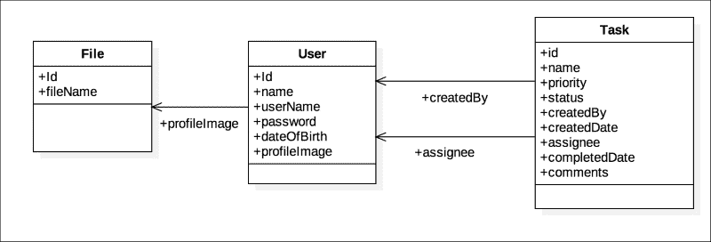

# 第三章：使用 Spring 访问数据

数据访问或持久化是数据驱动应用程序的一个重要技术特性。这是一个需要仔细设计和专业知识的关键领域。现代企业系统使用各种各样的数据存储机制，从传统的关系数据库（如 Oracle、SQL Server 和 Sybase）到更灵活的无模式数据库（如 MongoDB、Cassandra 和 Couchbase）。Spring 框架为多种机制的数据持久化提供了全面的支持，从方便的模板组件到流行的**ORM**（**对象关系映射**）工具和库的智能抽象，使它们更容易使用。Spring 的数据访问支持是选择其开发 Java 应用程序的另一个重要原因。

Spring 框架为开发人员提供了以下主要数据持久化机制的选择：

+   Spring JDBC

+   ORM 数据访问

+   Spring Data

此外，Spring 将前述方法统一标准化为称为`@Repository`的统一**DAO**（**数据访问对象**）表示法。

使用 Spring 的另一个引人注目的原因是它的一流事务支持。Spring 提供一致的事务管理，抽象了不同的事务 API，如 JTA、JDBC、JPA、Hibernate、JDO 和其他特定于容器的事务实现。

为了使开发和原型设计更容易，Spring 提供了嵌入式数据库支持、智能抽象（`DataSource`）和优秀的测试集成。本章探讨了 Spring 框架提供的各种数据访问机制以及其在独立和 Web 环境中对事务管理的全面支持，同时提供相关示例。

### 注意

为什么要使用 Spring 数据访问而不是 JDBC？

JDBC（Java 数据库连接）是 Java 标准版 API，用于从 Java 到关系数据库的数据连接，是一个非常低级的框架。通过 JDBC 访问数据通常很麻烦；开发人员需要编写的样板代码使得代码容易出错。此外，JDBC 异常处理对于大多数用例来说是不够的；数据访问需要简化但广泛和可配置的异常处理。Spring JDBC 封装了经常重复的代码，极大地简化了开发人员的代码，并让他/她直接专注于业务逻辑。Spring 数据访问组件抽象了技术细节，包括查找和管理持久性资源，如连接、语句和结果集，并接受特定的 SQL 语句和相关参数来执行操作。Spring 数据访问组件在底层使用相同的 JDBC API，同时为客户端提供了简化、直接的接口。这种方法为 Spring 应用程序提供了更清晰、因此更易于维护的数据访问层。

# 配置 DataSource

从任何 Java 应用程序连接到数据库的第一步是获取由 JDBC 指定的连接对象。`DataSource`是 Java SE 的一部分，是`java.sql.Connection`对象的通用工厂，表示与数据库的物理连接，并且是生成连接的首选方式。`DataSource`处理事务管理、连接查找和池功能，解除了开发人员对这些基础设施问题的负担。

`DataSource`对象通常由数据库驱动程序供应商实现，并通常通过 JNDI 查找。应用服务器和 Servlet 引擎提供了它们自己的`DataSource`实现和/或连接器到由数据库供应商提供的`DataSource`对象。通常在基于 XML 的服务器描述符文件中配置，服务器提供的`DataSource`对象通常提供内置的连接池和事务支持。作为开发人员，您只需在服务器配置文件中以 XML 方式声明式地配置您的数据源，并通过 JNDI 从应用程序中查找它们。

在 Spring 应用程序中，您将`DataSource`引用配置为 Spring bean，并将其作为依赖项注入到 DAO 或其他持久性资源中。Spring 的`<jee:jndi-lookup/>`标签（来自[`www.springframework.org/schema/jee`](http://www.springframework.org/schema/jee)命名空间）允许您轻松查找和构建 JNDI 资源，包括从应用服务器内部定义的`DataSource`对象。对于部署在 J2EE 应用服务器中的应用程序，建议使用容器提供的 JNDI`DataSource`对象。

```java
<jee:jndi-lookup id="taskifyDS" jndi-name="java:jboss/datasources/taskify"/>
```

对于独立应用程序，您需要创建自己的`DataSource`实现或使用第三方实现，如 Apache Commons DBCP、C3P0 或 BoneCP。以下是使用 Apache Commons DBCP2 的示例`DataSource`配置。它还提供了可配置的连接池功能。

```java
<bean id="taskifyDS" class="org.apache.commons.dbcp2.BasicDataSource" destroy-method="close">
    <property name="driverClassName" value="${driverClassName}" />
    <property name="url" value="${url}" />
    <property name="username" value="${username}" />
    <property name="password" value="${password}" />
    <property name="initialSize" value="3" />
    <property name="maxTotal" value="50" />
    ...
</bean>
```

确保在构建文件中添加相应的依赖项以使用您的`DataSource`实现。以下是 DBCP2 的示例：

```java
<dependency>
    <groupId>org.apache.commons</groupId>
    <artifactId>commons-dbcp2</artifactId>
    <version>2.1.1</version>
</dependency>
```

Spring 提供了`DriverManagerDataSource`，这是`DataSource`的一个简单实现，仅用于测试和开发目的，而不用于生产。请注意，它不提供连接池。以下是如何在应用程序中配置它。

```java
<bean id="taskifyDS" class="org.springframework.jdbc.datasource.DriverManagerDataSource">
    <property name="driverClassName" value="${driverClassName}" />
    <property name="url" value="${url}" />
    <property name="username" value="${username}" />
    <property name="password" value="${password}" />
</bean>
```

也可以使用基于 Java 的配置进行配置，如下所示：

```java
@Bean
DataSource getDatasource() {
    DriverManagerDataSource dataSource = new DriverManagerDataSource(pgDsProps.getProperty("url"));
    dataSource.setDriverClassName( pgDsProps.getProperty("driverClassName"));
    dataSource.setUsername(pgDsProps.getProperty("username"));
    dataSource.setPassword(pgDsProps.getProperty("password"));
    return dataSource;
}
```

### 注意

不要在生产环境中使用`DriverManagerDataSource`。对于独立应用程序，请使用 DBCP、C3P0 和 BoneCP 等第三方数据源，对于 J2EE 容器，请使用容器提供的 JNDI `DataSource`。它们更可靠，并且提供了高效的连接池功能。

# 使用嵌入式数据库

对于原型和测试环境，使用基于 Java 的嵌入式数据库是一个好主意，可以快速启动项目并轻松配置。它们轻量且易于测试。Spring 原生支持 HSQL、H2 和 Derby 数据库引擎。以下是嵌入式 HSQL 数据库的示例`DataSource`配置：

```java
@Bean
DataSource getHsqlDatasource() {
    return new 
        EmbeddedDatabaseBuilder().setType(EmbeddedDatabaseType.HSQL)
         .addScript("db-scripts/hsql/db-schema.sql")
         .addScript("db-scripts/hsql/data.sql")
         .addScript("db-scripts/hsql/storedprocs.sql")
         .addScript("db-scripts/hsql/functions.sql")
         .setSeparator("/").build();
}
```

其 XML 版本如下所示：

```java
<jdbc:embedded-database id="dataSource" type="HSQL">
  <jdbc:script location="classpath:db-scripts/hsql/ db-schema.sql" />
    . . . 
</jdbc:embedded-database>
```

# 在 Spring Data 层处理异常

在传统的基于 JDBC 的应用程序中，异常处理基于`java.sql.SQLException`，这是一个受检异常。它强制开发人员仔细编写`catch`和`finally`块，以便正确处理并避免资源泄漏，比如保持数据库连接处于打开状态。Spring 基于`RuntimeException`的智能异常层次结构使开发人员摆脱了这一噩梦。以`DataAccessException`为根，Spring 捆绑了一系列有意义的异常，翻译了传统的 JDBC 异常。Spring 还以一致的方式涵盖了 Hibernate、JPA 和 JDO 异常。

Spring 使用`SQLErrorCodeExceptionTranslator`，它继承自`SQLExceptionTranslator`，用于将`SQLException`翻译为`DataAccessExceptions`。我们可以扩展此类以自定义默认翻译。我们可以通过将自定义实现注入到持久性资源（如稍后将介绍的`JdbcTemplate`）中来替换默认的翻译器。请参阅以下代码清单，了解如何在代码中定义`SQLExceptionTranslator`类：

```java
String userQuery = "select * from TBL_NONE where name = ?";
SQLExceptionTranslator excTranslator = new SQLExceptionTranslator() {

  @Override
  public DataAccessException translate(String task, String sql, SQLException ex) {
    logger.info("SUCCESS --- SQLExceptionTranslator.translate invoked !!");
    return new BadSqlGrammarException("Invalid Query", userQuery, ex){};
  }
};
```

前面的代码片段捕获任何`SQLException`并将其转换为基于 Spring 的`BadSqlGrammarException`实例。然后，这个自定义的`SQLExceptionTranslator`需要在使用之前传递给`Jdbctemplate`，如下面的代码所示：

```java
JdbcTemplate jdbcTemplate = new JdbcTemplate(dataSource);
jdbcTemplate.setExceptionTranslator(excTranslator);
Map<String, Object> result = jdbcTemplate.queryForMap(userQuery, new Object[] {"abc"});
```

现在，任何无效的查询都将调用自定义的`SQLExceptionTranslator`类。您可以根据自己的需求自定义其行为。

# DAO 支持和@Repository 注释

访问数据的标准方式是通过执行数据访问层下的持久性功能的专门 DAO。Spring 通过提供 DAO 组件并允许开发人员将其数据访问组件标记为 DAO，使用注释`@Repository`来遵循相同的模式。这种方法确保了在各种数据访问技术（如 JDBC、Hibernate、JPA 和 JDO）和项目特定存储库上的一致性。Spring 在所有这些方法中一致地应用`SQLExceptionTranslator`。

Spring 建议将数据访问组件注释为`@Repository`。术语“repository”最初在*Domain-Driven Design*，*Eric Evans*，*Addison Wesley*中定义为“一种模拟对象集合的存储、检索和搜索行为的机制”。此注释使类有资格由 Spring 框架进行`DataAccessException`翻译。

Spring Data 是 Spring 提供的另一种标准数据访问机制，围绕`@Repository`组件展开。我们将在后面的部分中更多地讨论这个问题。

# Spring JDBC 抽象

Spring JDBC 组件通过封装样板代码并使用一组简单的接口隐藏与 JDBC API 组件的交互，简化了基于 JDBC 的数据访问。这些接口处理了 JDBC 资源（连接、语句、结果集）的打开和关闭。它们准备和执行语句，从结果集中提取结果，提供回调钩子以转换、映射和处理数据，处理事务，并将 SQL 异常转换为更合理和有意义的 `DataAccessException` 层次结构。

Spring JDBC 提供了三种便利的方法来访问关系数据库：

+   `JdbcTemplate`

+   `SimpleJDBC` 类

+   RDBMS `Sql*` 类

每个 Spring JDBC 类别下都有多种组件的变种，您可以根据自己的方便和技术选择进行混合和匹配。您可以在 `org.springframework.jdbc` 包及其子包下探索它们。

## JdbcTemplate

`JdbcTemplate` 是 Spring JDBC 抽象下的核心组件。这个强大的组件通过其简单而有意义的方法执行几乎所有可能的 JDBC 操作，接受一组令人印象深刻的数据访问变种的参数。它属于 `org.springframework.jdbc.core` 包，其中包含许多其他支持类，帮助 `JdbcTemplate` 完成其 JDBC 操作。这个组件的唯一依赖是 `DataSource` 实例。所有其他 Spring JDBC 组件在内部使用 `JdbcTemplate` 进行操作。

通常，您将 `JdbcTemplate` 配置为另一个 Spring bean，并将其注入到您的 DAO 或任何其他您想要调用其方法的 bean 中。

```java
<bean id="jdbcTemplate" class="org.springframework.jdbc.core.JdbcTemplate">
  <constructor-arg ref="dataSource"/>
</bean>
<bean id="userDAO" class="com.springessentials.chapter3.dao.impl.UserJdbcDAO">
  <constructor-arg ref="jdbctemplate"/>
</bean>
```

### 注意

`JdbcTemplate` 是 Spring 中模板模式的实现之一。模板模式是 *Gang of Four* 设计模式目录中列出的行为模式。它在一个称为 **模板方法** 的方法或操作中定义了算法的骨架，将一些步骤推迟到子类中，而不改变算法的结构。`JdbcTemplate` 是这些模板方法的集合；用户可以扩展它并根据特定要求覆盖一些行为。`JMSTemplate` 和 `JpaTemplate` 也是模板模式实现的例子。

`JdbcTemplate` 执行 SQL 查询（`SELECT`）、更新语句（`INSERT`、`UPDATE` 和 `DELETE`）、存储过程和函数调用，返回提取的结果（对于 `SELECT` 查询），并调用回调方法进行结果集提取和将行映射到域对象。它具有一套全面的查询和执行方法，用于不同方法的结果集提取。以下表介绍了一些非常有用的 `JdbcTemplate` 方法：

| 方法 | 描述 |
| --- | --- |
| `execute` | 一组重载的方法，用于执行 SQL 更新（`INSERT`、`UPDATE` 和 `DELETE`）语句，包括要执行的 SQL 语句、绑定参数、语句创建者和回调方法。 |
| `query` | 一组重载的方法，用于查询给定 SQL `SELECT` 语句的 `PreparedStatement`，包括多种参数集，包括绑定参数、参数类型、`RowMapper`、`ResultSetExtractor`、`PreparedStatementCreator`、`RowCallbackHandler` 等。虽然带有回调的方法是 void 方法，其他方法返回指定类型 `<T>` 的对象列表，该类型由相应的 `RowMapper`、`ResultSetExtractor` 指定，或者返回类型为 `<T>` 的填充实例。 |
| `queryForList` | 一组重载的查询方法，执行 `SELECT` 查询并返回作为参数指定的类型 `<T>` 的对象列表，`Class<T> elementType`。未指定 `elementType` 的方法返回 `List<Map<String, Object>>`。 |
| `queryForMap` | 执行（`SELECT`）查询并将结果作为 `Map<String, Object>` 返回。 |
| `queryForObject` | 一组重载方法，查询给定的 SQL `SELECT`语句，包括绑定参数、参数类型、`RowMapper`和所需的返回类型`<T>`。 |
| `update` | 一组重载方法，用于发出带有绑定参数、参数类型、`PreparedStatementCreator`等的更新（`INSERT`、`UPDATE`或`DELETE`）语句。它返回一个整数，表示受影响的记录数。 |
| `batchUpdate` | 一组重载方法，用于执行多个 SQL 更新（`INSERT`、`UPDATE`和 DELETE），包括 SQL 语句数组和许多`PreparedStatementSetter`等参数的组合。 |
| `execute` | 一组重载方法，用于执行 SQL 更新（`INSERT`、`UPDATE`或`DELETE`）语句，包括 SQL 语句的执行、绑定参数、`StatementCreator`和回调方法等不同的参数集。 |
| `query` | 一组重载方法，用于查询给定 SQL `SELECT`语句的`PreparedStatement`，包括绑定参数、参数类型、`RowMapper`、`ResultSetExtractor`、`PreparedStatementCreator`、`RowCallbackHandler`等多种参数集。虽然具有回调的方法是 void 方法，其他方法返回与相应的`RowMapper`、`ResultSetExtractor`指定的对象类型`<T>`的对象列表，或者类型`<T>`的填充实例。 |

`JdbcTemplate`的超强功能背后是一组回调接口，作为前面表中列出的方法的参数传递。这些执行钩子帮助`JdbcTemplate`以纯面向对象和可重用的方式处理关系数据。对这些接口的深入理解对于正确使用`JdbcTemplate`至关重要。请参阅以下表格以了解这些回调接口：

| 回调接口 | 回调方法 | 职责 |
| --- | --- | --- |
| `CallableStatementCreator` | `execute` | 构造`java.sql.CallableStatement`，用于在其`createCallableStatement(Connection)`方法中执行存储过程。 |
| `PreparedStatementCreator` | `execute`, `update`, `query` | 构造`java.sql.PreparedStatement`，给定一个连接，在方法`createPreparedStatement (Connection)`中。 |
| `PreparedStatementSetter` | `update`, `query` | 在执行之前为`PreparedStatement`设置值，在`JdbcTemplate.setValues (PreparedStatement)`中。 |
| `CallableStatementCallback` | `execute` | 准备`CallableStatement`。通常在实际执行之前设置存储过程或函数的`IN`和`OUT`参数，在`JdbcTemplate.doInCallableStatement(CallableStatement)`中： |
| `PreparedStatementCallback` | `execute` | 由`JdbcTemplate`的执行方法使用，用于准备`PreparedStatement`。通常在实际执行之前设置绑定参数，在`doInPreparedStatement(PreparedStatement)`方法中： |
| `ResultSetExtractor` | `query` | 从`ResultSet`中提取结果并返回一个域对象，在`extractData(ResultSet)`方法中： |
| `RowCallbackHandler` | `query` | 以有状态的方式处理`ResultSet`的每一行，在`processRow(Resultset)`方法中，不返回任何内容。 |
| `RowMapper` | `query` | 将`ResultSet`的每一行映射到一个域对象中，在`mapRow(Resultset, int rowNum)`方法中返回创建的域对象。 |

现在让我们尝试一些`JdbcTemplate`的实际用法。以下是使用`JdbcTemplate`执行计数查询的简单方法。

```java
@Override
public int findAllOpenTasksCount() {
  return jdbcTemplate.queryForObject("select count(id) from tbl_user where status = ?", new Object[]{"Open"}, Integer.class);
}
```

你看到了吗，这条简单的一行代码如何帮你摆脱了在典型的 JDBC 代码中需要编写的样板和异常处理代码？

以下代码片段稍微复杂，演示了如何从表中查询唯一行，并使用`RowMapper`将其映射到一个域对象（在本例中为`User`）：

```java
public User findByUserName(String userName) {
  return jdbcTemplate.queryForObject("SELECT ID, NAME, USER_NAME, PASSWORD, DOB, PROFILE_IMAGE_ID, PROFILE_IMAGE_NAME FROM TBL_USER WHERE USER_NAME = ?", new Object[] { userName }, 
    new RowMapper<User>() {
      @Override
      public User mapRow(ResultSet rs, int rowNum) throws SQLException {
        return new User(rs.getLong("ID"), 
        rs.getString("NAME"), 
        userName, 
        rs.getString("PASSWORD"), 
        rs.getDate("DOB"));
    }
  });
}
```

使用`JdbcTemplate`处理数据集合要容易得多。以下代码片段说明了`JdbcTemplate`的查询方法，其中使用绑定参数和`RowMapper`将`ResultSet`转换为类型为`<Task>`的列表。

```java
@Override
public List<Task> findCompletedTasksByAssignee(Long assigneeId) {
  String query = "SELECT * FROM TBL_TASK WHERE STATUS = ? AND 
  ASSIGNEE_USER_ID = ? ";

  return this.jdbcTemplate.query(query, new Object[] {"Complete", 
    assigneeId }, new RowMapper<Task>() {
    @Override
    public Task mapRow(ResultSet rs, int rowNum) throws SQLException{
      Task task = new Task();
      task.setId(rs.getLong("id"));
      Long assigneeId = rs.getLong("assignee_user_id");

      if (assigneeId != null)
        task.setAssignee(userDAO.findById(assigneeId));
      task.setComments(rs.getString("comments"));
      task.setName(rs.getString("name"));
      ...
      return task;
    }
  });
}
```

`JdbcTemplate`会为您处理所有重复的代码，您只需要编写特定的代码，即如何将行的数据与您的领域对象进行映射。

另一种使用`ResultSetExtractor`接口从`ResultSet`中提取单行的行映射的变化在以下代码中说明：

```java
@Transactional(readOnly = true)
public User findUserById(Long userId) {
  return jdbcTemplate.query("SELECT NAME, USER_NAME, PASSWORD, DOB, PROFILE_IMAGE_ID, PROFILE_IMAGE_NAME FROM TBL_USER WHERE ID = ?",
    new Object[] { userId }, new ResultSetExtractor<User>() {
    @Override
    public User extractData(ResultSet rs) throws SQLException, DataAccessException {
      if (rs.next()) {
        return new User(userId, rs.getString("NAME"), rs.getString("USER_NAME"), rs.getString("PASSWORD"), rs.getDate("DOB"));
      } else {
        return null;
      }
    }
  });
}
```

现在让我们来看一些更新语句。以下是执行简单`INSERT`语句的一行代码。SQL `UPDATE`和`DELETE`语句遵循相同的模式。

```java
@Override
public void createUser(User user) {
  jdbcTemplate.update("INSERT INTO TBL_USER(NAME, USER_NAME, PASSWORD, DOB) VALUES(?,?,?,?)", new Object[] { user.getName(), user.getUserName(), user.getPassword(), user.getDateOfBirth()});
}
```

前面的方法有一个缺点。虽然它将新用户记录插入表中，但生成的 ID（可能是通过数据库序列）没有返回；您需要发出另一个查询来单独检索它。但是，`JdbcTemplate`提供了解决这个问题的好方法：使用`KeyHolder`类。这是`update`方法的另一个`variation`，在下面的代码中进行了解释；您可以使用`KeyHolder`类与`PreparedStatementCreator`结合，以单个执行中检索生成的键（在本例中是 ID）：

```java
public void createUser(User user) {
  KeyHolder keyHolder = new GeneratedKeyHolder();
  jdbcTemplate.update( new PreparedStatementCreator() {
    public PreparedStatement createPreparedStatement(Connection connection) throws SQLException {
      PreparedStatement ps = connection.prepareStatement(
      "INSERT INTO TBL_USER(NAME,USER_NAME,PASSWORD,DOB) VALUES(?,?,?,?)", new String[]{"ID"});

        ps.setString(1, user.getName());
        ps.setString(2, user.getUserName());
        ps.setString(3, user.getPassword());
        ps.setDate(4, new java.sql.Date(user.getDateOfBirth().getTime()));
        return ps;
    }
  }, keyHolder);

  user.setId(keyHolder.getKey().longValue());
}
```

`JdbcTemplate`使批量更新变得容易，遵循与前面相同的模式。看一下以下代码：它在数据集合上执行单个`PreparedStatement`：

```java
@Override
public void createUsers(List<User> users) {
    int[] updateCounts = jdbcTemplate.batchUpdate("INSERT INTO TBL_USER(NAME, USER_NAME, PASSWORD, DOB) VALUES(?,?,?,?)", new BatchPreparedStatementSetter() {
        public void setValues(PreparedStatement ps, int idx) throws SQLException {
            ps.setString(1, users.get(idx).getName());
            ps.setString(2, users.get(idx).getUserName());
            ps.setString(3, users.get(idx).getPassword());
            ps.setDate(4, new java.sql.Date(users.get(idx) .getDateOfBirth().getTime()));
        }

        public int getBatchSize() {
            return users.size();
        }
    });
}
```

### NamedParameterJdbcTemplate

到目前为止，我们已经使用`JdbcTemplate`使用`?`占位符进行绑定参数。当涉及更多的参数时，使用命名参数对于可读性和可维护性更好。`NamedParameterJdbcTemplate`是`JdbcTemplate`的专门版本，支持使用命名参数而不是传统的`?`占位符。`NamedParameterJdbcTemplate`不是从`JdbcTemplate`扩展，而是使用底层的`JdbcTemplate`进行其操作。

您可以以与经典`JdbcTemplate`相同的方式定义`NamedParameterJdbcTemplate`，将`DataSource`对象作为强制依赖项传递。然后，您可以像使用命名参数一样使用它，而不是使用绑定参数（`?`）。以下代码片段说明了使用`NamedParameterJdbcTemplate`查询方法，该方法使用`RowMapper`进行对象关系映射。

```java
public User findByUserName(String userName, DataSource dataSource) {

  NamedParameterJdbcTemplate jdbcTemplate = new NamedParameterJdbcTemplate(dataSource);
  SqlParameterSource namedParameters = new MapSqlParameterSource("USER_NAME", userName);

  return jdbcTemplate.queryForObject("SELECT ID, NAME, USER_NAME, PASSWORD, DOB, PROFILE_IMAGE_ID, PROFILE_IMAGE_NAME FROM TBL_USER WHERE USER_NAME = :USER_NAME", namedParameters, new RowMapper<User>() {

    @Override
    public User mapRow(ResultSet rs, int rowNum) throws SQLException {
      return new User(rs.getLong("ID"), rs.getString("NAME"), userName, rs.getString("PASSWORD"), rs.getDate("DOB"));
    }
  });
}
```

## SimpleJdbc 类

`SimpleJdbc`类是以更面向对象的方式访问数据的另一种不错的方法，但仍然在内部使用相同的`JdbcTemplate`。它们属于`org.springframework.jdbc.core.simple`包。其中有两个类：

+   `SimpleJdbcCall`

+   `SimpleJdbcInsert`

`SimpleJdbcCall`处理对存储过程和函数的调用，`SimpleJdbcInsert`处理对数据库表的 SQL `INSERT`命令。两者都具有`DatabaseMetadata`意识，因此它们会自动检测或映射领域对象的同名字段。它们都充当了执行关系实体（存储过程或函数和数据库表分别）周围的 JDBC 操作的模板，接受一次性确定操作行为的参数（在全局声明），然后在运行时重复使用具有动态数据集的参数。

`SimpleJdbcCall`类声明如下：

```java
SimpleJdbcCall createTaskStoredProc = new SimpleJdbcCall(dataSource)
    .withFunctionName("CREATE_TASK")
    .withSchemaName("springessentials")
    .declareParameters(new SqlOutParameter("v_newID", Types.INTEGER),
        new SqlParameter("v_name", Types.VARCHAR), 
        new SqlParameter("v_STATUS", Types.VARCHAR),
        new SqlParameter("v_priority", Types.INTEGER),
        new SqlParameter("v_createdUserId", Types.INTEGER),
        new SqlParameter("v_createdDate", Types.DATE),
        new SqlParameter("v_assignedUserId", Types.INTEGER),
        new SqlParameter("v_comment", Types.VARCHAR));
```

前面的代码声明了`SimpleJdbcCall`，它调用存储过程（在 PostgreSQL 中，存储过程也称为函数）及其所有参数。一旦声明了这个，它可以在运行时重复使用任意次数。通常，您在类级别（您的 DAO）上声明它。以下代码说明了我们如何在运行时调用它：

```java
@Override
public void createTask(Task task) {
    SqlParameterSource inParams = new 
        MapSqlParameterSource().addValue("v_name", task.getName())
        .addValue("v_STATUS", task.getStatus())
        .addValue("v_priority", task.getPriority())
        .addValue("v_createdUserId", task.getCreatedBy().getId())
        .addValue("v_createdDate", task.getCreatedDate())
        .addValue("v_assignedUserId", task.getAssignee() == null ?         null : task.getAssignee().getId())
        .addValue("v_comment", task.getComments());

    Map<String, Object> out = createTaskStoredProc.execute(inParams);
    task.setId(Long.valueOf(out.get("v_newID").toString()));
}
```

`SimpleJdbcInsert`通常声明如下所示：

```java
SimpleJdbcInsert simpleInsert = new SimpleJdbcInsert(dataSource)
  .withTableName("tbl_user")
  .usingGeneratedKeyColumns("id");
```

请注意以下代码片段中表名旁边生成的键列的声明。同样，这通常在类级别声明以便更好地重用。现在，看看这在运行时是如何调用的。

```java
public void createUser(User user) {
   Map<String, Object> parameters = new HashMap<>(4);
   parameters.put("name", user.getName());
   parameters.put("user_name", user.getUserName());
   parameters.put("password", user.getPassword());
   parameters.put("dob", user.getDateOfBirth());

   Number newId = simpleInsert.executeAndReturnKey(parameters);
   user.setId(newId.longValue());
}
```

您可以看到在执行后返回生成的键，该键设置回`User`对象。`SimpleJdbcCall`和`SimpleJdbcInsert`是`JdbcTemplate`的方便替代品；您可以一致使用这些解决方案，或者在同一个应用程序中混合使用它们。

## 使用 Sql*类的 JDBC 操作

`org.springframework.jdbc.object`包中的一组类以更面向对象的方式执行 JDBC 操作。以下表格列出了其中最常见的类：

| 组件 | 职责 |
| --- | --- |
| `MappingSqlQuery` | SQL 查询的具体表示，支持`RowMapper`，并具有各种方便的`execute`和`find*`方法。也支持命名参数。 |
| `SqlUpdate` | 执行 SQL 更新（`INSERT`，`UPDATE`和`DELETE`）操作，支持命名参数和键持有者（用于检索生成的键）。 |
| `SqlCall` | 执行存储过程和函数的基于 SQL 的调用，支持命名参数和键持有者（用于检索生成的键）。 |

下面的代码示例了`MappingSqlQuery`的使用：

```java
public Task findById(Long taskId) {
   MappingSqlQuery<Task> query = new MappingSqlQuery<Task>() {

      @Override
      protected Task mapRow(ResultSet rs, int rowNum) throws SQLException {
         return new RowMapper<Task>() {
            @Override
            public Task mapRow(ResultSet rs, int rowNum) throws SQLException {
               Task task = new Task();
               task.setId(rs.getLong("id"));
               ...
               return task;
            }
         }.mapRow(rs, rowNum);
      }
   };

   query.setJdbcTemplate(jdbcTemplate);
   query.setSql("select id, name, status, priority, created_user_id," + " created_date, assignee_user_id, completed_date, comments " + "from tbl_task where id = ?");
   query.declareParameter(new SqlParameter("id", Types.INTEGER));

   return query.findObject(taskId);
}
```

可以使用`SqlUpdate`执行 SQL 更新（`INSERT`，`UPDATE`和`DELETE`），代码更具描述性，如下面的示例代码所示：

```java
@Override
public void deleteTask(Task task) {
   SqlUpdate sqlUpdate = new SqlUpdate(this.jdbcTemplate.getDataSource(), "DELETE FROM TBL_TASK WHERE ID = ?");
   sqlUpdate.declareParameter(new SqlParameter("ID", Types.NUMERIC));
   sqlUpdate.compile();
   sqlUpdate.update(task.getId());
}
```

`SqlUpdate`提供了各种方便的更新方法，适用于许多参数组合。您可以根据自己的方便和首选的编程风格混合使用前面列出的任何 Spring JDBC 组件。

# Spring Data

Spring Data 是 Spring 系列下的一个总称项目，旨在提供跨多种不同数据存储的一致数据访问，包括关系型和 NoSQL 数据库，以及其他类型的数据存储，如 REST（HTTP）、搜索引擎和 Hadoop。在 Spring Data 下，有针对每种特定方法和数据存储的子项目，由这些技术的公司或开发人员组合而成。Spring Data 显著简化了数据层的构建，无论底层数据库和持久化技术如何。

以下表格列出了一些 Spring Data 子项目及其简要描述：

| 项目 | 描述 |
| --- | --- |
| Spring Data Commons | 包含核心 Spring Data 存储库规范和所有 Spring Data 项目的支持类。指定存储库、查询、审计和历史等概念。 |
| Spring Data JPA | 处理基于 JPA 的存储库。 |
| Spring Data MongoDB | 提供与 MongoDB 的轻松集成，包括对查询、条件和更新 DSL 的支持。 |
| Spring Data Redis | 与 Redis 内存数据结构存储集成，来自 Spring 应用程序。 |
| Spring Data Solr | 提供与 Apache Solr 的集成，这是一个基于 Apache Lucene 的强大的开源搜索平台。 |
| Spring Data Gemfire | 提供与 Pivotal Gemfire 的轻松集成，这是一个提供实时数据访问、可靠的异步事件通知和保证消息传递的数据管理平台。 |
| Spring Data KeyValue | 处理基于键值的数据存储。 |
| Spring Data REST | 用 REST API 公开存储库。 |

Spring Data 组合包含了更多官方 Spring Data 项目未涵盖的数据存储的社区模块。几个非常流行的开源和专有数据库的社区正在为这些项目做出贡献，这使得 Spring Data 成为构建企业应用程序数据访问层的经过验证的解决方案的绝佳来源，无论底层数据存储是什么。Cassandra、Neo4J、Couchbase 和 ElasticSearch 是基于 Spring Data 的社区项目的一些例子。

## Spring Data Commons

Spring Data 通过名为 Spring Data Commons 的一致 API 标准化了所有存储特定模块（子项目）的数据访问。Spring Data Commons 是所有 Spring Data 模块的基本规范和指南。所有 Spring Data 子项目都是 Spring Data Commons 的存储特定实现。

Spring Data Commons 定义了 Spring Data 模块的核心组件和一般行为。

+   Spring Data 存储库规范

+   查询派生方法

+   Web 支持

+   审计

我们将在以下部分检查每个组件及其设置和用法。

## Spring Data 存储库规范

`org.springframework.data.repository.Repository`是 Spring Data 抽象的中心接口。这个标记接口是 Spring Data Commons 的一部分，有两个专门的扩展，`CrudRepository`和`PagingAndSortingRepository`。

```java
public interface CrudRepository<T, ID extends Serializable>
    extends Repository<T, ID> {
    ...
}
```

存储库管理域实体（设计为 POJO）。`CrudRepository`为实体提供了以下 CRUD 操作。

+   `save(One)`，`save(List)`

+   `find`，`findOne`，`findAll`

+   `delete`，`deleteAll`

+   `count`

+   `exists`

`PagingAndSortingRepository`在`CrudRepository`上添加了分页和排序功能。它有以下两种方法：

+   `Page<T> findAll(Pageable)`

+   `Iterable<T> findAll(Sort)`

现在是时候向前跳转并讨论 Spring Data 的技术和存储特定模块。我们将涵盖 Spring Data JPA 和 Spring Data MongoDB，以说明数据库宇宙中的两个完全不同的世界：关系和 NoSQL。当我们使用特定实现时，我们使用特定于实现的存储库，但您的方法接口保持不变；因此，理论上，从特定的 Spring Data 实现切换到另一个不会影响您的客户端程序（服务、控制器或测试用例）。

### Spring Data JPA

Spring Data JPA 是基于**JPA**（**Java 持久性架构**）的 Spring Data 实现，处理对象关系数据访问。对于开发人员，大部分编程都是基于 Spring Data Commons 中描述的内容，而 Spring Data JPA 允许进行一些特定于关系 SQL 和 JPA 的额外定制。主要区别在于存储库设置和使用`@Query`注解进行查询优化。

### 启用 Spring Data JPA

在您的项目中启用 Spring Data JPA 是一个简单的两步过程：

1.  将`spring-data-jpa`依赖项添加到您的`maven/gradle`构建文件中。

1.  在 bean 配置中声明启用 JPA 存储库。

在 Maven 中，您可以像下面的代码一样添加`spring-data-jpa`依赖项：

```java
<dependency>
  <groupId>org.springframework.data</groupId>
  <artifactId>spring-data-jpa</artifactId>
  <version>${spring-data-jpa.version}</version>
</dependency>
```

如果您正在使用 XML，可以启用 JPA 存储库，如下所示：

```java
  <jpa:repositories base-package="com.taskify.dao" />
```

在 Java 配置的情况下，您只需注释以启用 JPA 存储库。

```java
@Configuration
@ComponentScan(basePackages = {"com.taskify"})
@EnableJpaRepositories(basePackages = "com.taskify.dao")
public class JpaConfiguration {
  ...
}
```

### JpaRepository

启用 JPA 存储库后，Spring 会扫描给定包中使用`@Repository`注释的 Java 类，并创建完全功能的代理对象，准备供使用。这些是您的 DAO，您只需定义方法，Spring 会在运行时为您提供基于代理的实现。看一个简单的例子：

```java
public interface TaskDAO extends JpaRepository<Task, Long>{

  List<Task> findByAssigneeId(Long assigneeId);

  List<Task> findByAssigneeUserName(String userName);
}
```

Spring 生成智能实现，实际上在代理实现内部执行所需的数据库操作，查看方法名称和参数。

## Spring Data MongoDB

MongoDB 是最受欢迎的面向文档的 NoSQL 数据库之一。它以**BSON**（**二进制 JSON**）格式存储数据，允许您将整个复杂对象存储在嵌套结构中，避免将数据分解成大量关系表的需求。其嵌套对象结构直接映射到面向对象的数据结构，并消除了任何对象关系映射的需求，就像 JPA/Hibernate 一样。

Spring Data MongoDB 是 MongoDB 的 Spring Data 模块。它允许将 Java 对象直接映射到 MongoDB 文档。它还为连接到 MongoDB 并操作其文档集合提供了全面的 API 和基础支持。

### 启用 Spring Data MongoDB

Spring Data MongoDB 可以通过以下步骤启用：

1.  在构建文件（`maven/gradle`）中添加`spring-data-mongodb`。

1.  在 Spring 元数据配置中注册一个 Mongo 实例。

1.  向 Spring 元数据添加`mongoTemplate` Spring Bean。

使用 Maven 添加`spring-data-mongodb`依赖项应该如下所示：

```java
<dependency>
  <groupId>org.springframework</groupId>
  <artifactId>spring-aop</artifactId>
  <version>${spring.framework.version}</version>
</dependency>
```

您可以在 XML 元数据中注册一个 Mongo 实例，如下行所示：

```java
<mongo:mongo host="192.168.36.10" port="27017" />
```

这个 Mongo 实例是运行在服务器上的实际 MongoDB 实例的代理。

简单的`mongoTemplate`看起来像以下代码中给出的清单：

```java
<bean id="mongoTemplate" class="org.springframework.data.mongodb.core.MongoTemplate">
  <constructor-arg ref="mongo" />
  <constructor-arg name="databaseName" value="Taskify" />
</bean>
```

### MongoRepository

MongoRepository 是 Spring Data MongoDB 的特定于 MongoDB 的存储库。它看起来非常类似于`JpaRepository`。看一个样本`MongoRepository`类：

```java
public interface TaskDAO extends MongoRepository<Task, String>{

  List<Task> findByAssigneeId(String assigneeId);

  @Query("{ 'status' : 'Complete' }")
  List<Task> findCompletedTasks();

  @Query(value = "{ 'status' : 'Open', assignee.id: ?0 }")
  List<Task> findOpenTasksByAssigneeId(String assigneeId);
  ...
}
```

## 领域对象和实体

数据驱动的应用程序通常将领域对象设计为实体，然后在运行时将它们持久化到数据库中，可以是关系表，也可以是键值对文档结构。Spring Data 处理领域实体就像处理任何其他持久化框架一样。为了说明存储库的用法，我们将引用以下三个相关实体，它们在程序中设计为**普通的旧 Java 对象**（**POJOs**）。



以下是 Java 表示。第一个是用于 JPA 的注释，另外两个是用于 MongoDB 的。JPA 实体使用`@Entity`进行注释。列映射到每个字段。请记住，除了注释之外，您还可以使用基于 XML 的映射来为 JPA 实体进行映射。XML 映射提供了包括集中控制和可维护性在内的多个好处。本例中为简单起见使用注释，假设读者已经熟悉 JPA 或 Hibernate 映射。

```java
@Entity
@Table(name = "TBL_USER", uniqueConstraints = @UniqueConstraint(name = "UK_USER_USERNAME", columnNames = {"USER_NAME" }) )
public class User {

  @Id
  @SequenceGenerator(name = "SEQ_USER", sequenceName = "SEQ_USER", allocationSize = 1, initialValue=1001)
  @GeneratedValue(strategy = GenerationType.SEQUENCE, generator = "SEQ_USER")
  private Long id;

  @Column(name = "NAME", length = 200)
  private String name;

  @Column(name = "USER_NAME", length = 25)
  private String userName;

  @Column(name = "PASSWORD", length = 20)
  private String password;

  @Column(name = "DOB")
  @Temporal(TemporalType.TIMESTAMP)
  private Date dateOfBirth;

  @ManyToOne(optional = true)
  @JoinColumn(name = "FILE_ID", referencedColumnName = "ID")
  private File profileImage;

  public User() {}

  public User(Long id, String name, String userName, String password, Date dateOfBirth) {
    super();
    this.id = id;
    this.name = name;
    this.userName = userName;
    this.password = password;
    this.dateOfBirth = dateOfBirth;
  }

  public Long getId() {
    return id;
  }
  ...
}
```

以下是任务实体，注释为 MongoDB 文档。Mongo 实体使用`@Document`进行注释。它需要一个 ID 字段，可以用`@Id`进行注释，也可以用名称`id`进行注释。

```java
@Document(collection = "tasks")
public class Task {

  @Idprivate String id;
  private String name;
  private int priority;
  private String status;
  private User createdBy;
  private Date createdDate;
  private User assignee;
  private Date completedDate;
  private String comments;

  public Task() {}
  ...
}
```

文件实体被注释为 JPA 实体。

```java
@Entity
@Table(name = "TBL_FILE")
public class File {

  @Id
  @SequenceGenerator(name = "SEQ_FILE", sequenceName = "SEQ_FILE", allocationSize = 1)
  @GeneratedValue(strategy = GenerationType.SEQUENCE, generator = "SEQ_FILE")
  private Long id;

  @Column(name = "FILE_NAME", length = 200)
  private String fileName;
  ...
}
```

### 查询解析方法

除了在接口级别声明的查询（`find`，`count`，`delete`，`remove`和`exists`）方法外，`CrudRepository`还支持使用`@Query`注解方法声明查询，该注解方法可以使用任何名称，这有助于从作为参数给定的**SpEL**（**Spring Expression Language**）表达式中派生实际的 SQL 查询。在这两种查询派生选项中，Spring Data 采用以下查询查找策略之一：

| 查询查找策略 | 描述 |
| --- | --- |
| `CREATE` | 从方法名称生成特定于模块的查询。 |
| `USE_DECLARED_QUERY` | 使用由注解或其他方式声明的查询。 |
| `CREATE_IF_NOT_FOUND` | 此策略结合了前两种策略。这是默认策略。 |

查询查找策略通常在启用 JPA 存储库时设置。

```java
<jpa:repositories base-package="com.taskify.dao" query-lookup-strategy="create-if-not-found"/>
```

查询生成策略（`CREATE`）围绕实体的属性及其依赖关系以嵌套方式工作。作为开发人员，您可以根据特定格式定义方法名称，这些方法名称可以被 Spring Data 解释和实现。查询方法的一般结构如下所示：

`[return Type] [queryType][limitKeyword]By[criteria][OrderBy][sortDirection]`

+   `返回类型`可以是实体`<T>`本身（在唯一结果的情况下），列表`<T>`，流`<T>`，页面`<T>`，原始数字，Java 包装类型，void，future`<T>`，`CompletableFuture<T>`，`ListenableFuture<T>`等。最后三个用于 Spring 的异步方法执行，并应该用`@Async`注解。

+   `queryType`可以是`find`，`read`，`query`，`count`，`exists`，`delete`等。

+   `limitKeyword`支持`distinct`，`First[resultSize]`和`Top[resultSize]`。例如`First5`。

+   `criteria`是通过将一个或多个属性表达式（使用驼峰命名法）与`Or`、`And`、`Between`、`GreaterThan`、`LessThan`、`IsNull`、`StartsWith`和`Exists`等标准运算符组合而成的。条件可以后缀为`IgnoreCase`或`AllIgnoreCase`，以应用大小写不敏感性。

+   `OrderBy`按原样使用，后面跟着属性表达式。

+   `sortDirection`可以是`Asc`或`Desc`中的任意一个。这仅与`OrderBy`一起使用。

让我们看一些示例以更清晰地说明。以下示例代码说明了如何构造查询（或删除）方法，以便 Spring Data 可以在运行时生成实际的 SQL 查询。

```java
public interface UserDAO extends JpaRepository<User, Long> {

  // Returns unique user with given user-name
  User findByUserName(String userName);

  // Returns a paginated list of users whose name starts with // given value
  Page<User> findByNameStartsWith(String name, Pageable pageable);

  // Returns first 5 users whose name starts with given value, 
  // order by name descending
  List<User> findTop5ByNameStartsWithOrderByNameDesc(String name);

  // Returns number of users whose birth date is before the given // value
  Long countUsersDateOfBirthLessThan(Date dob);

  // Deletes the User of given id
  void deleteById(Long userId);

  // Asynchronously returns a list of users whose name contains // the given value
  @Async
  Future<List<User>> findByNameContains(String name);
}
```

前面的示例显示`JpaRepository`和`MongoRepository`的工作方式相同；您只需要扩展它，而不需要更改方法签名。您已经看到了遍历实体的根级属性，适当组合运算符的约束查询和过滤方法。除了根级属性，您还可以遍历和过滤嵌套属性，以定义查询约束，换句话说，限制结果。看一下以下示例：

```java
public interface TaskDAO extends MongoRepository<Task, String>{

  List<Task> findByAssigneeId(Long assigneeId);

  List<Task> findByAssigneeUserName(String userName);
}
```

在前面的示例中列出的方法中，遍历了任务实体的嵌套属性：

+   `findByAssigneeId = task.assignee.id`

+   `findByAssigneeUserName = task.assignee.userName`

您可以根据实体的复杂程度和要求，遍历实体的任何嵌套元素级别。

### 使用@Query 注释

除了根据方法名称自动生成查询的自动生成查询之外，Spring Data 还允许您在存储库本身中直接声明实体的查询，而不是方法名称。您可以使用 SpEL 声明查询，Spring Data 会在运行时解释它，并（代理存储库）为您生成查询。这是查询解析策略的一种实现：`USE_DECLARED_QUERY`。

让我们看一些不言自明的例子：

```java
public interface TaskDAO extends JpaRepository<Task, Long>{	

  @Query("select t from Task t where status = 'Open'")
  List<Task> findOpenTasks();

  @Query("select t from Task t where status = 'Complete'")
  List<Task> findCompletedTasks();

  @Query("select count(t) from Task t where status = 'Open'")
  int findAllOpenTasksCount();

  @Query("select count(t) from Task t where status = 'Complete'")
  int findAllCompletedTasksCount();

  @Query("select t from Task t where status = 'Open' and assignee.id = ?1")
  List<Task> findOpenTasksByAssigneeId(Long assigneeId);

  @Query("select t from Task t where status = 'Open' and assignee.userName = ?1")
  List<Task> findOpenTasksByAssigneeUserName(String userName);

  @Query("select t from Task t where status = 'Complete' and assignee.id = ?1")
  List<Task> findCompletedTasksByAssigneeId(Long assigneeId);

  @Query("select t from Task t where status = 'Complete' and assignee.userName = ?1")
  List<Task> findCompletedTasksByAssigneeUserName(String userName);
}
```

从前面的示例中可以看出，我们可以遍历嵌套属性以限制查询，在其中的条件部分。您还可以在同一个存储库中同时拥有查询生成策略（`CREATE`和`USE_DECLARED_QUERY`）。

前面的示例是基于 Spring Data JPA 的；Spring Data MongoDB 的等效部分在以下代码中给出。您可以看到`@Query`注释值与 MongoDB 结构相比有何不同。

```java
public interface TaskDAO extends MongoRepository<Task, String>{

  @Query("{ 'status' : 'Open' }")
  List<Task> findOpenTasks();

  @Query("{ 'status' : 'Complete' }")
  List<Task> findCompletedTasks();

  @Query(value = "{ 'status' : 'Open' }", count = true)
  int findAllOpenTasksCount();

  @Query(value = "{ 'status' : 'Complete' }", count = true)
  int findAllCompletedTasksCount();

  @Query(value = "{ 'status' : 'Open', assignee.id: ?0 }")
  List<Task> findOpenTasksByAssigneeId(String assigneeId);

  @Query(value = "{ 'status' : 'Open', assignee.userName: ?0 }")
  List<Task> findOpenTasksByAssigneeUserName(String userName);

  @Query(value = "{ 'status' : 'Complete', assignee.id: ?0 }")
  List<Task> findCompletedTasksByAssigneeId(String assigneeId);

  @Query(value = "{ 'status' : 'Open', assignee.userName: ?0 }")
  List<Task> findCompletedTasksByAssigneeUserName(String userName);
}
```

### Spring Data web 支持扩展

Spring Data 为 Spring MVC 应用程序提供了一个智能扩展，称为`SpringDataWebSupport`，如果您启用它，它会自动集成一些生产力组件。如果您正在使用 Spring Data 存储库编程模型进行数据访问，它主要会直接从请求参数中解析域实体作为`Pageable`和`Sort`实例，并与请求映射控制器方法集成。

在使用这些功能之前，您需要为项目启用`SpringDataWebSupport`。如果您使用 Java 配置，可以像以下代码中所示注释`@EnableSpringDataWebSupport`。

```java
@Configuration
@EnableWebMvc
@ComponentScan(basePackages = {"com.taskify"})
@EnableSpringDataWebSupport
@EnableJpaRepositories(basePackages = "com.taskify.dao")
public class ApplicationConfiguration {
 ...
}
```

在 XML 元数据的情况下，您可以像以下代码中所示将`SpringDataWebConfiguration`注册为 Spring bean：

```java
<bean class="org.springframework.data.web.config.SpringDataWebConfiguration" />
```

一旦您设置了`SpringDataWebSupport`，您就可以开始在请求映射方法中使用 Spring Data 实体作为请求参数，如下面的代码所示：

```java
@RestController
@RequestMapping("/api/v1/user")
@CrossOrigin
public class UserController {

  @RequestMapping(path = "/{id}", method = RequestMethod.GET)
  public User getUser(@PathVariable("id") User user) {
    return user;
  }
  ...
}
```

在前面的方法中，您可以看到 Spring Data 会透明地为您使用`UserRepository`加载`User`实体数据。同样，您可以接受针对 JSON 或 XML 的 POST 请求的`Pageable`和`Sort`实例。明智地使用`SpringDataWebSupport`扩展可以使您的代码更清洁和更易于维护。

### 使用 Spring Data 进行审计

跟踪数据修改是严肃业务应用程序的关键特性。管理员和经理急于知道数据库中保存的某些业务信息是何时以及谁进行了更改。Spring Data 提供了智能且简单的方法，可以透明地审计数据实体。Spring Data 提供了以下有意义的注释，用于在系统中捕获修改的用户和时间数据实体：

| 注释 | 预期类型 |
| --- | --- |
| `@CreatedBy` | 创建实体的主体用户。通常，它是表示域用户的另一个实体。 |
| `@CreatedDate` | 记录实体创建的时间。支持的类型：`java.util.Date`、日历、JDK 8 日期/时间类型、`Joda DateTime`。 |
| `@LastModifiedBy` | 最后更新实体的用户主体。与 `@CreatedBy` 相同类型。 |
| `@LastModifiedDate` | 记录实体上次更新的时间。支持的类型与 `@CreatedDate` 相同。 |

典型的 JPA 实体应该如下所示的代码：

```java
@Entity
@Table(name = "tbl_task")
public class Task {

  @Id
  private Long id;
  ...
  @ManyToOne(optional = true)
  @JoinColumn(name = "CREATED_USER_ID", referencedColumnName = "ID")
  @CreatedBy
  private User createdBy;

  @Column(name = "CREATED_DATE")
  @Temporal(TemporalType.TIMESTAMP)
  @CreatedDate
  private Date createdDate;

  @ManyToOne(optional = true)
  @JoinColumn(name = "MODIFIED_USER_ID", referencedColumnName = "ID")
  @LastModifiedBy
  private User modifiedBy;

  @Column(name = "MODIFIED_DATE")
  @Temporal(TemporalType.TIMESTAMP)
  @LastModifiedDate
  private Date modifiedDate;
  ...
}
```

如果您使用 XML 而不是注释来映射实体，则可以实现一个可审计接口，该接口强制您实现审计元数据字段，或者扩展 `AbstractAuditable`，这是 Spring Data 提供的一个方便的基类。

由于您记录了创建和修改实体的用户信息，您需要帮助 Spring Data 从上下文中捕获该用户信息。您需要注册一个实现了 `AuditAware<T>` 的 bean，其中 `T` 是您用 `@CreatedBy` 和 `@LastModifiedBy` 注释的字段的相同类型。看一下以下示例：

```java
@Component
public class SpringDataAuditHelper implements AuditorAware<User> {

  ...
  @Override
  public User getCurrentAuditor() {
    // Return the current user from the context somehow.
  }

}
```

如果您使用 Spring Security 进行身份验证，那么 `getCurrentAuditor` 方法应该从 `SecurityContextHolder` 类中获取并返回用户，如下所示：

```java
@Component
public class SpringDataAuditHelper implements AuditorAware<User> {

  ...
  @Override
  public User getCurrentAuditor() {
    Authentication authentication = SecurityContextHolder.getContext().getAuthentication();

    if (authentication == null || !authentication.isAuthenticated()) {
      return null;
    }
    return ((User) authentication.getPrincipal()).getUser();
  }
}
```

现在您的审计基础设施已经准备就绪，您对可审计实体所做的任何修改都将被 Spring Data 透明地跟踪。

到目前为止，您已经掌握了强大的 Spring Data，并且知道如何使用 Spring Data 存储库创建优雅、干净但非常强大的数据访问层，现在是时候考虑如何确保应用程序的数据完整性和可靠性了。Spring 事务就是答案；让我们在下一节中探讨它。

# Spring 事务支持

数据驱动的企业系统将数据完整性视为至关重要，因此事务管理是主要数据库和应用服务器支持的关键功能。Spring 框架提供了全面的事务支持，抽象了任何底层基础设施。Spring 事务支持包括跨不同事务选择的一致方法，如 JTA、JPA 和 JDO。它与所有 Spring 数据访问机制很好地集成。Spring 事务支持声明式和编程式事务管理。

### 注意

**事务** 可以被定义为数据交换的原子单位，通常是关系数据库中的 SQL 语句，应该作为一个块（全部或无）提交或回滚。事务系统或事务管理框架在参与系统或资源（如数据库和消息队列）之间强制执行**ACID**（**原子性**、**一致性**、**隔离性**、**持久性**）属性。

# Spring 事务的相关性

企业 Java 应用服务器本地提供**JTA**（**Java 事务 API**）支持，它使分布式事务（也称为全局事务）跨多个资源、应用程序和服务器。传统上，**企业 Java Bean**（**EJB**）和**消息驱动 Bean**（**MDB**）用于**容器管理的事务**（**CMT**），它基于 JTA 和 JNDI。JTA 事务管理资源密集型；其异常处理基于已检查的异常，因此不利于开发人员。此外，使用 EJB CMT 进行单元测试很困难。

对于那些不想使用资源密集型的 JTA 事务的人来说，本地事务是另一个可用的选项，它允许您使用诸如 JDBC 之类的 API 来以编程方式强制执行特定于资源的事务。虽然相对容易使用，但它仅限于单个资源，因为多个资源不能参与单个事务。此外，本地事务通常是侵入性的，因此会污染您的代码。

Spring 事务抽象通过提供一个一致的事务模型来解决全局和本地事务的问题，可以在任何环境中运行。虽然它支持声明式和编程式事务管理，但对于大多数情况来说，声明式模型已经足够了。Spring 事务消除了仅仅为了事务而需要像 JBoss 或 WebLogic 这样的应用服务器的需求。您可以从在简单的 Servlet 引擎（如 Tomcat）上使用 Spring 的本地事务开始，然后在不触及业务代码的情况下，通过更改 Spring 元数据中的事务管理器，将其扩展到应用服务器上的分布式事务。

大多数应用程序只需要本地事务，因为它们不涉及多个服务器或诸如数据库、JMS 和 JCA 之类的事务资源；因此，它们不需要一个完整的应用服务器。对于跨多个服务器的分布式事务，需要 JTA，这需要一个应用服务器，因为 JTA 需要使用 JNDI 来查找数据源。JNDI 通常只在应用服务器中可用。在应用服务器内部使用`JTATransactionManager`来实现 JTA 功能。

### 注意

当您在应用服务器内部部署 Spring 应用程序时，您可以使用特定于服务器的事务管理器来利用它们的全部功能。只需将事务管理器切换到使用特定于服务器的`JtaTransactionManager`实现，如`WebLogicJTATransactionManager`和`WebSphereUowTransactionManager`，并将其放入 Spring 元数据中。现在您的所有代码都是完全可移植的。

## Spring 事务基础

Spring 事务管理抽象是围绕一个名为`PlatformTransactionManager`的接口设计的，您需要在 Spring 元数据中将其配置为 Spring bean。`PlatformTransactionManager`管理执行事务操作的实际事务实例，如提交和回滚，基于定义事务策略的`TransactionDefinition`实例。`TransactionDefinition`定义了关键的事务属性，如隔离、传播、事务超时和给定事务实例的只读状态。

### 注意

事务属性决定了事务实例的行为。它们可以以编程方式设置，也可以以声明方式设置。事务属性包括：

隔离级别：定义了一个事务与并行运行的其他事务之间的隔离程度。有效值包括：`None`、`Read committed`、`Read uncommitted`、`Repeatable reads`和`Serializable`。`Read committed`不能看到其他事务的脏读。

传播：确定数据库操作的事务范围，与其自身之前、之后和嵌套在其内部的其他操作相关。有效值包括：`REQUIRED`、`REQUIRES_NEW`、`NESTED`、`MANDATORY`、`SUPPORTS`、`NOT_SUPPORTED`和`NEVER`。

超时：事务在完成之前可以持续运行或等待的最长时间段。一旦超时，它将自动回滚。

只读状态：在此模式下，您无法保存读取的数据。

这些事务属性并不特定于 Spring，而是反映了标准的事务概念。`TransactionDefinition`接口在 Spring 事务管理上下文中指定了这些属性。

根据您的环境（独立、web/app 服务器）和您使用的持久化机制（如纯 JDBC、JPA 和 Hibernate），您可以选择适当的`PlatformTransactionManager`实现，并根据需要在 Spring 元数据中进行配置。在幕后，使用 Spring AOP，Spring 将`TransactionManager`注入到您的代理 DAO（或 JPA 的`EntityManager`）中，并执行您的事务方法，应用在 Spring 配置中声明的事务语义，无论是使用`@Transactional`注解还是等效的 XML 标记。我们将在本章后面讨论`@Transactional`注解及其 XML 等效。

对于操作单个`DataSource`对象的应用程序，Spring 提供了`DataSourceTransactionManager`。以下显示了如何在 XML 中配置它：

```java
<bean id="txManager" class="org.springframework.jdbc.datasource.DataSourceTransactionManager">
  <property name="dataSource" ref="taskifyDS" />
</bean>
```

对于多个`DataSource`对象或事务资源，您需要具有 JTA 功能的`JtaTransactionManager`，通常委托给容器 JTA 提供程序。您需要在 Java EE 应用服务器中使用`DataSource`对象，在服务器上定义，并通过 JNDI 查找，以及`JtaTransactionManager`。典型的组合应该如下代码片段所示：

```java
<bean id="txManager" class="org.springframework.transaction.jta.JtaTransactionManager" />
</bean>
<jee:jndi-lookup id="taskifyDS" jndi-name="java:jboss/datasources/taskify" expected-type="javax.sql.DataSource/>
```

如果您正在使用 Hibernate 和只有一个`DataSource`（没有其他事务资源），那么最好的选择是使用`HibernateTransactionManager`，它要求您将会话工厂作为依赖项传递。对于 JPA，Spring 提供了`JpaTransactionManager`，它绑定了一个单独的 JPA `EntityManager`实例。但是，在应用容器环境中建议使用`JtaTransactionManager`。

Spring 为 WebLogic 和 WebSphere 的应用服务器提供了专门的事务管理器，以便充分利用容器特定的事务协调器的全部功能。在相应的环境中使用`WebLogicTransactionManager`和`WebsphereUowTransactionManager`。

## 声明式事务管理

将事务语义从业务代码中分离出来，放入 XML 文件或方法上方的注解通常称为**声明式事务管理**。Spring 框架允许您通过其声明式事务管理功能透明且非侵入地将事务行为应用到您的 bean 中。

您可以在任何 Spring bean 上声明性地应用 Spring 事务，与 EJB CMT 不同。使用 Spring 事务，您可以在元数据中以 AOP 样式指定 bean 方法周围的事务建议；然后 Spring 将在运行时使用 AOP 应用您的这些建议。您可以设置回滚规则，以指定哪些异常在哪些 bean 或方法周围导致自动回滚或非回滚。

### 事务模式 - 代理和 AspectJ

Spring 事务支持两种事务模式：代理模式和 AspectJ 模式。代理是默认和最流行的模式。在代理模式中，Spring 创建一个 AOP 代理对象，包装事务性 bean，并在使用基于元数据的事务方面的方法周围透明地应用事务行为。由 Spring 根据事务元数据创建的 AOP 代理，借助配置的`PlatformTransactionManager`，在事务性方法周围执行事务。

如果选择使用 AspectJ 模式进行事务处理，则事务方面将被编织到指定方法周围的 bean 中，在编译时修改目标类的字节码。在这种情况下不会进行代理。在特殊情况下，例如调用具有不同传播级别的同一类的事务方法时，代理无法帮助，您将需要使用 AspectJ 模式。

### 定义事务行为

Spring 提供了两种方便的方法来声明性地定义 bean 的事务行为：

+   XML 元数据文件中的事务 AOP 配置

+   使用`@Transactional`注解

让我们从 XML 文件中的 AOP 配置开始。有关配置 AOP、使用切面、切入点、建议等的详细讨论，请参阅第一章中的*面向切面编程*部分，*开始使用 Spring Core*。

通常，您可以在 XML 元数据文件中使用切入点表达式声明事务建议和切入点。最佳方法是将事务配置保存在单独的 bean 定义文件中（例如`transation-settings.xml`），并将其导入到主应用程序上下文文件中。

通常，您可以声明事务建议和其他语义，如下面的代码所示：

```java
<!-- transactional advices --> 
<tx:advice id="txAdvice" transaction-manager="transactionManager">
  <!-- the transactional semantics... -->
  <tx:attributes>
    <!-- all methods starting with 'get' are read-only -->
    <tx:method name="find*" read-only="true" />
    <!-- other methods use the default transaction settings (see below) -->
    <tx:method name="*" isolation="DEFAULT" propagation="REQUIRED" />
  </tx:attributes>
</tx:advice>

<!-- Applying the above advices to the service layer methods -->
<aop:config>
  <aop:pointcut id="allServiceMethods"
  expression="execution(* com.taskify.service.*.*(..))" />
  <aop:advisor advice-ref="txAdvice" pointcut- ref="allServiceMethods" />
</aop:config>
```

您可以看到，这个 AOP 配置指示 Spring 如何在方法周围使用切入点编织事务建议。它指示`TransactionManager`使整个服务层的所有查找方法都为只读，并强制其他方法具有事务传播：`REQUIRED`，这意味着如果方法的调用者已经处于事务上下文中，则该方法加入相同的事务而不创建新的事务；否则，将创建一个新的事务。如果要为此方法创建一个不同的事务，应该使用`REQUIRES_NEW`传播。

另外，请注意，事务隔离级别被指定为`DEFAULT`，这意味着将使用数据库的默认隔离级别。大多数数据库默认为`READ_COMMITTED`，这意味着事务线程无法看到其他事务中正在进行的数据（脏读）。

### 设置回滚规则

使用 Spring 事务，您可以在相同的`<tx:advice>`块中声明性地设置回滚规则，如下面的代码所示：

```java
<tx:advice id="txAdvice" transaction-manager="transactionManager">
  <tx:attributes>
    ...
    <tx:method name="completeTask" propagation="REQUIRED" rollback-for="NoTaskFoundException"/>
    <tx:method name="findOpenTasksByAssignee" read-only="true" no-rollback-for="InvalidUserException"/>
    <tx:method name="*" isolation="DEFAULT" propagation="REQUIRED" />
  </tx:attributes>
</tx:advice>
```

您可以使用`<tx:method>`元素的`rollback-for`和`no-rollback-for`属性指定哪些异常应该回滚事务，哪些异常不应该回滚事务，用于您的业务操作。

### 注意

`PlatformTransactionManager`接口的方法抛出的`TransactionException`是未经检查的异常`RuntimeException`。在 Spring 中，未经检查的异常会自动回滚事务。除非在元数据中指定，使用`rollback-for`属性，否则不会回滚已检查的或应用程序异常。

Spring 事务允许您使用 Spring AOP 和 SpEL 以分钟级别的粒度自定义 bean 的事务行为。此外，您可以在`<tx:method>`元素上指定事务的行为属性，如传播、隔离和超时。

## 使用`@Transactional`注解

`@Transactional`注解描述了方法或类的事务属性。类级别的注解适用于所有方法，除非在方法级别明确注释。它支持您在 XML 配置中设置的所有属性。请参阅以下示例：

```java
@Service
@Transactional
public class TaskServiceImpl implements TaskService {
  ...
  public Task createTask(Task task) {
    if (StringUtils.isEmpty(task.getStatus()))
      task.setStatus("Open");
    taskDAO.save(task);
    return task;
  }

  @Transactional(propagation = Propagation.REQUIRED, rollbackFor = NoUserFoundException)
  public Task createTask(String name, int priority, Long createdByuserId, Long assigneeUserId, String comments) {
    Task task = new Task(name, priority, "Open", userService.findById(createdByuserId), null, userService.findById(assigneeUserId), comments);
    taskDAO.save(task);
    logger.info("Task created: " + task);
    return task;
  }

  @Transactional(readOnly = true)
  public Task findTaskById(Long taskId) {
    return taskDAO.findOne(taskId);
  }
  ...
}
```

在上面的示例中，具有传播`REQUIRED`的事务方法`createTask`在`NoUserFoundException`发生时回滚。同样，您也可以在相同级别设置不回滚规则。

### 注意

`@Transactional`只能应用于公共方法。如果要对受保护的、私有的或包可见的方法进行注释，请考虑使用 AspectJ，它使用编译时切面编织。Spring 建议仅在具体类上注释`@Transactional`，而不是在接口上注释，因为在大多数情况下，例如当您使用`proxy-target-class="true"`或`mode="aspectj"`时，它将无法工作。

### 为`@Transactional`启用事务管理

在 Spring 可以检测到您的 bean 方法的`@Transactional`注解之前，您需要在应用程序中首先启用事务管理。您可以在 XML 元数据中使用以下表示法启用事务：

```java
<tx:annotation-driven transaction-manager="transactionManager" />
```

以下是前面清单的 Java 配置替代方案：

```java
@Configuration
@EnableTransactionManagement
public class JpaConfiguration {
}
```

当 Spring 看到上述任何设置时，它会扫描应用程序上下文中使用`@Transactional`注解的 bean 方法。

你可以在这个级别上将事务模式从默认的`proxy`更改为`aspectj`：

```java
<tx:annotation-driven transaction-manager="transactionManager" mode="aspectj"/>
```

在这个级别上，你可以设置的另一个属性是`proxy-target-class`，这只适用于`proxy`模式的情况。

## 编程式事务管理

Spring 提供了全面的支持，使用两个组件进行编程式事务管理：`TransactionTemplate`和`PlatformTransactionManager`。以下代码片段说明了`TransactionTemplate`的用法：

```java
@Service
public class TaskServiceImpl implements TaskService {
  @Autowired
  private TransactionTemplate trxTemplate;
  ...
  public Task createTask(String name, int priority, Long createdByuserId, Long assigneeUserId, String comments) {

    return trxTemplate.execute(new TransactionCallback<Task>() {
      @Override
      public Task doInTransaction(TransactionStatus status) {
        User createdUser = userService.findById(createdByuserId);
        User assignee = userService.findById(assigneeUserId);
        Task task = new Task(name, priority, "Open", createdUser, null, assignee, comments);
        taskDAO.save(task);
        logger.info("Task created: " + task);
        return task;
      }
    });
  }
}
```

`TransactionTemplate`支持设置所有事务属性，就像 XML 配置一样，这样可以更精细地控制，但会将业务代码与事务关注点混合在一起。只有在需要对无法通过声明式事务管理实现的特定功能进行绝对控制时才使用它。如果可能的话，尽量使用声明式事务管理，以获得更好的可维护性和应用管理。

# 总结

到目前为止，我们已经探讨了 Spring 框架对数据访问和事务的全面覆盖。Spring 提供了多种方便的数据访问方法，这些方法消除了开发人员在构建数据层和标准化业务组件方面的大部分工作。正确使用 Spring 数据访问组件可以使 Spring 应用的数据层清晰且易于维护。利用 Spring 事务支持可以确保应用程序的数据完整性，而不会污染业务代码，并使应用程序可以在不同的服务器环境中移植。由于 Spring 抽象了大部分技术上的繁重工作，构建应用程序的数据层变得成为一项令人愉快的软件工程工作。

